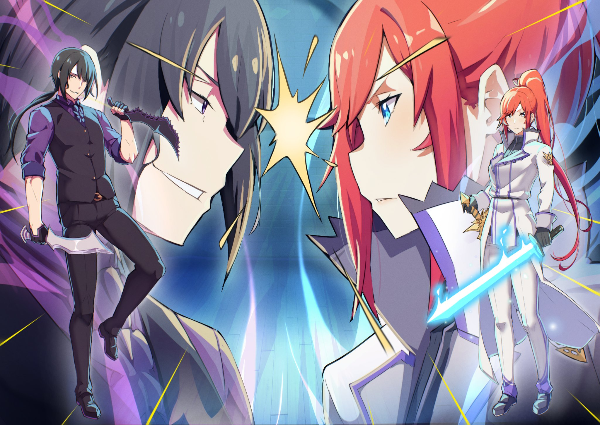
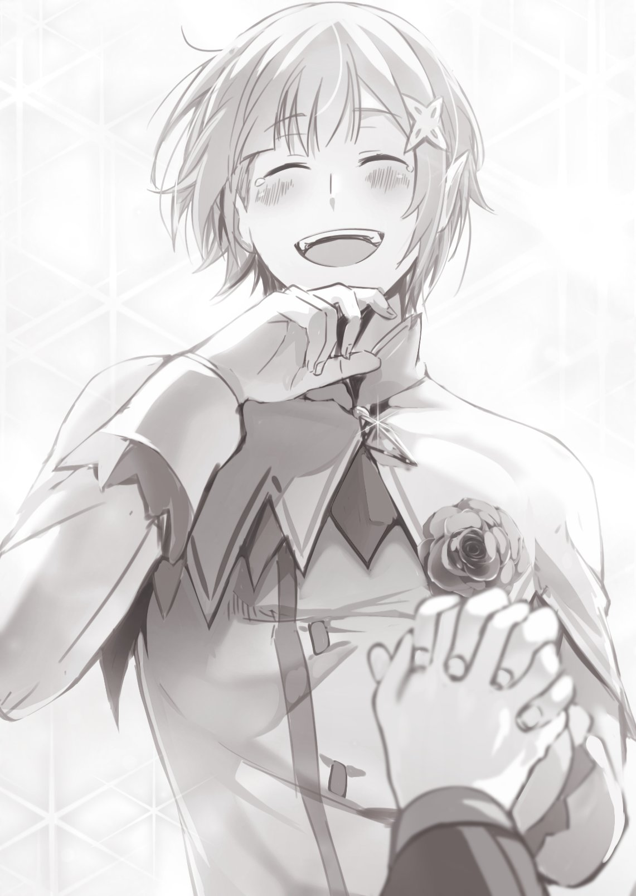

Часть 1

Примечание Таппэя:

Это наш ежегодный первоапрельский проект.

Эта история выглядит немножко странновато, будто она о какой-то параллельной реальности.

Сможет ли мудрый читатель действительно понять, в чём разница?

В любом случае, если ты не возражаешь, увидимся снова в послесловии.

Примечание редактора:

К сожалению, перед вами редактура кривого перевода кривого перевода кривого сюжета, так что не ожидайте от этой главы чего-то значимого.

Сможет ли мудрый читатель действительно понять, что здесь вообще написано?

В любом случае, если ты не возражаешь, увидимся снова в послесловии.

…Произошло большое несчастье.

Без гроша в кармане и какой-либо уверенности, она, тем не менее, была полна смирения.

Хотя, не сказать, чтоб она, и правда, была бедной. Она думала, что она была такой же бедной, как и остальные, за исключением того, что её кошелёк был забит монетками и кредитками.

В любом случае, для обычной старшеклассницы на подработке здесь не было ничего необычного.

Однако, если бы её когда-нибудь назвали бедной, вряд ли бы это как-то ущемило её достоинство.

Она, конечно, слышала, что отсутствие денег делало людей неинтересными, но, по её мнению, это было неприменимо к людям…

Так или иначе…,

«В конце концов, у всех разное количество денег, и с этим ничего не поделаешь……»

Из неё вырвался грустный вздох, как только она начала играть десяти-йеной монеткой в руке… … так называемой Гиза Джу (с яп. — зазубренная монетка в 10 йен, что-то на уровне русского «косарь» или «полтинник»).

Эта Гиза Джу не была какой-то редкой или особенной, но она что-то ношла в ней и поэтому уже долгое время хранила в своём кошельке. Несмотря на то, что она надеялась на то, что когда-нибудь эта монетка неожиданно поможет ей, как принц на белом коне, её напрасные ожидания были грубо преданы.

Вид этой монетки в 10 йен только разбивал её будто стеклянное сердце

«…»

Говоря об этом, недобрые взгляды тоже играли не последнюю роль в возникновении ран на её сердце.

Множество пытливых глаз очень раздражало её, они как будто смотрели на какой-то редкий или необычный предмет, всюду преследуя её, куда-бы она не пошла.

Она не считала свою внешность такой уж привлекательной.

На неё часто обращали внимание из-за её плохого зрения, но в остальном, она была самым обычным человеком.

У неё неокрашенные черные волосы и домашний свитер, который не предназначен для школы, ну, а если у вас возникли какие-то возражения по поводу это, то она готова провести официальную пресс-конференцию, дабы оправдать свою неряшливость.

Однако она не была уверена, что её доводы восприняли бы всерьёз.

В конце концов…,

«Я думаю, это оно».

Она скрестила руки и наклонила голову, как вдруг громкий звук вращения колёс пронёсся рядом с ней. Само колесо, вернее повозку, тянула не лошадь, а огромный ящер.

Обладателями тех самых приставучих взглядов были люди в таких странных и красочных костюмах, будто это был какой-то Хэллоуин в Сибуе. Так, что же реально произошло?

Что значит реализация в этом случае, признаётся она, рисуя такие вопросы в небе. [Да и реально ли всё это?[ — думала она, глядя в небо.

«…По всей видимости, меня призвали в другой мир».

Гиза Джу, вырвавшаяся из её пальцев, была запущена в ненавистное голубое небо, тихо прокрутившись вокруг своей оси.

…Нацуки Субару относится к поколению Отаку, родилась она в Японии эпохи Хэйсэй (1989 — 2019 гг.)

Нет смысла рассказывать о жизни Субару, которая здесь не особенно примечательна.

Ключевым моментом является то, что Субару — ученица старшей школы — по какой –то неведомой причине прогуливая школу, очутилась в странном мире по дороге домой из круглосуточного магазина. Пожалуй, это всё, что вам нужно знать.

«Всё это объясняет, почему в этот мир так легко попасть……»

Это другой мир, и попасть сюда можно в мгновение ока, без каких-либо грузовиков.

Так как водительские права не требуются, даже лица моложе 18 лет могут безопасно войти в альтернативный мир, не пожертвовав своей жизнью. Однако такие путешествия — далеко не лучший выбор для тех, кто собирается вернуться обратно и не проводить здесь всё своё оставшееся время.

А ведь Субару привыкла проводить это время за игровыми автоматами, так как в перерывах между школой и сном она не могла ездить по экскурсиям, из-за того, что её попросту было не с кем.

«Не думаю, что в этом мире есть аркадные автоматы…… Нет, конечно, и в моём мире автоматы всё больше устаревают и исчезают с улочек многолюдных городов. Всем ведь так надо поиграть в новые игры.»

Возможно Субару просто не знает об альтернативах аркадным автоматам, но мы опустим этот факт.

Было бы логично заявить, что онлайн-игры, не требующие от людей куда-то ходить, и приводят к устареванию автоматов, но Субару никогда не играла в онлайн-игры.

«Потому что когда я играю с другими людьми, соревновательный дух просто убивает во мне желание играть.»

Сожаления о состоянии игр в наши дни, как бы то ни было, не улучшит ситуацию для Субару.

В конце концов, положение оставалось прежним: она без гроша в кармане, заброшена в другой мир и совершенно не знает, куда идти.

«К счастью, я понимаю их язык, и, учитывая наш уровень здешней цивилизации, я смогу избежать внезапной смерти…. Так ведь……?»

Крикнув в пустоту: «Статус открыть!», она с огорчением поняла, что ничего нового не увидела.

Судя по всему это не тот вид параллельных миров, где можно посмотреть свой статус. «Во-первых, передо мной ещё не извинился тот бог, который меня сюда отправил. Во-вторых, я не вижу ни одной красивой девушки, встретившей меня по прибытии… Как много упущений……Вот чёрт».

По мере того, как она продолжала осознавать ситуацию, её неподвижные глаза становились всё более влажными, в то время как она сама причудливо двигала пальцами в воздухе.

Она всё это время тщетно пыталась отвлекаться от этой насущной темой различными рассуждениями, но ответов так и не появилось, из-за чего она начала нервничать, тем не менее, сохраняя своё хрупкое смирение.

Если бы не оно, она бы, точно, уже разрыдалась бы у всех на глазах.

Плачущая на улице ученица старшей школы — это позор, который мог бы стать очерком в местной газете.

Опасаясь, что её увидят другие, Субару быстро соскользнула с главной улицы в переулок. Там она прислонилась лбом к стене и фыркнула: «Угх~».

Она всё время не питала особым уважением к собственным родителям, но вряд ли девушка знала, что сегодня был её последний день, когда она видела маму и папу.

Она не собиралась когда-то покинуть родителей, оставив их на довольствие от собственной пенсии… Тем не менее, прямо сейчас это чёткое осознание того, что она неосознанно бросила маму с папой, сильно её ранило.

Если бы только её родители могли жить счастливо после её ухода…,

«…А?»

Субару, пытавшаяся сдержать свои слёзы от такой бесполезной мысли, подняла глаза, неожиданно услышав звук, застрявший в её барабанных перепонках.

Она стояла в переулке, выходящим из главной улицы. Тем не менее, здесь не было прохожих кроме… Трёх фигур, перегородивших проход.

Незнакомцы уже некоторое время наблюдали за Субару, бившейся лбом о стену.

Безоговорочно, эти взгляды были такими же, как и те, которым она подвергалась на улице, но они казались более пошлыми и явно злобными.

Другими словами…,

[Вот, чёрт, это обязательный ивент[.

Слёзы тут же сменились разгоряченной готовностью, и спрятав своё смятение, Субару повернулась к противникам.

Её сердце заколотилось. Она взглянула вперед и увидела, что переулок — это тупик с высокой стеной в конце. Она удивилась, как можно было настолько опрометчиво и бездумно гулять по улицам, чтобы попасть в такое место.

Даже в современной Японии, говорят быть осторожными на ночных улицах .

[Субару: Не волнуйся, не волнуйся. Хоть окно статуса и не открылось, но это ещё не повод сдаваться……!Если это исекай, то есть шанс, что мои боевые навыки возьмут верх! Ты сможешь сделать это, ты смоооожешь……!]

[???: Что за, чего эта девчонка там бормочет?]

[???: Она не понимает, что происходит. Почему бы тебе не объяснить ей?]

В отличие от Субару, приободряющей себя, положение на другой стороне было что ни на есть холодным и суровым.

По их мнению, Субару была лёгкой добычей, и они чувствовали себя охотниками, ведущими одностороннюю схватку. Не трудно понять почему, так как их было трое.

Это тяжело не осознать…

[Субару: Только не стоит увлекаться. Я, если честно, далеко не каждый день разбираюсь с вот такими группировками… Но сейчас я разотру их, как масло по хлебу, и получу EXP……!]

[???: Не понимаю, ты принимаешь нас за идиотов? Я убью тебя .]

[Субару: Это должна была быть…… Моя фраза!]

Мысль о том, чтобы начать первой, пробежала по ней словно молния, и ноги Субару оттолкнулись от земли.

Затем, глаза троицы расширились, когда их застали врасплох, а кулак Субару впечатался в нос их главаря…

[???: …Ай блять! Ты чё творишь, сука?!]

[Субару: Что такое? Почувствовала?]

Глаза противника загораются гневом, как только она получила от Субару в нос, откинувшись назад.

К слову, рука Субару, ударившая её, болела так сильно, что она чуть ли не плакала от боли.

Но это было только начало трагедии, постигшей Субару.

[???: Держите её! Я выбью из неё всё это дерьмо!]

[Субару: Эй, стой! Стой, стой! Я просто всё неправильно поняла!]

По приказу одного из убийц, двое других — один низкий, а второй высокий — вытянули руки, и в мгновение ока, Субару оказалась схвачена и прижата к стене.

Ей удалось вывернуться, но тут же девушка была снова схвачена бандитами, из-за чего она не могли и пошевелиться.

[Главарь: Ну чё, готова? Сука, ты заплатишь за свою борзость.]

Сказав это, стройная невысокая женщина с острыми и надменно опущенными глазами приблизилась к Субару, высунув свой длинный язык.

Словно соглашаясь с мнением женщины, две другие отвратительно рассмеялись.

Увидев это, Субару поняла всю плачевность ситуации и…

[Субару: Простите, это всё моя вина, но пожалуйста, не убивайте меня!]

Семнадцатилетняя Нацуки Субару отчаянно умоляла о пощаде своим высоким голосом.

Нацуки Субару держали и за руки и за ноги, не оставляя возможности сопротивляться.

Глядя на Субару, остроглазая женщина провела рукой по разбитому носу и вытерла маленькую струйку крови об её чёрный свитер.

А затем…

[Главарь: Как же стрёмно ты выглядишь, и что это за сумка у тебя в руке? Ты ещё и ударила меня. Сука, если у тебя нихерище в сумке нету, то готовься к худшему.]

[Субару: Ну, я не знаю…… Смотри, у меня пошла кровь из носа, и я думаю, мою одежду можно было продать подороже, если бы ты не измазала её…… Гха!]

[Главарь: Не люблю девок, которые много болтают.]

От жёсткого удара её дерзкий рот замолчал.

Она посмотрела поближе, и не успела заметить, как у остроглазой женщины оказался нож в руке. На мгновение ока ей показалось, что он пронзил её грудь.

Тем не менее, её не зарезали, но ничего не давало ей и повода верить в то, что это не произойдёт в ближайший момент.

Вдруг, кровь хлынула из её тела.

Она оказалась в очень плохой ситуации, почти потеряв сознание.

[???: Быстрее, быстрее! Эти девчонки мешаются под ногами!]

В этот момент голос, нарушивший хаотичную ситуацию, эхом разнесся по переулку.

Субару и остальные подняли глаза и увидели несущегося к ним со входа в переулок владельца голоса.

Это оказался маленький мальчик с растрёпанными золотыми волосами.

Его решительные красные глаза, злые выпирающие клыки и несколько нахальное лицо — врождённые качества, которые засияют, если их отполировать.

Увидев его, Субару сжала кулаки в предвкушении начала её личной попаданческой истории.

Несомненно, этот мальчик со своей рыцарской натурой станет стимулом, чтобы помочь Субару в трудную минуту, и открыть новую страницу в этой потусторонней приключенческой истории…

[Мальчик: Простите, что влез в такую ссору! Я занят! Держись там!]

[Субару: Чего!? Серьёзно!?]

Однако, мальчишка, отбросив её ожидания в сторону, пробежал мимо перед пленной Субару, и тут же прыгнул на тупиковую стену, ловко взобравшись на крышу с опорой.

Затем он вылез наружу, ведя себя как торопливый бездомный кот, и быстро исчез, скрывшись за многочисленными крышами домиков.

Он исчез. Абсолютно ничего не намекало хотя бы на вероятность того, что он вернётся.

[Главарь: Интересно, чё ты думаешь теперь, когда в тебя проник яд!]

[Субару: Меня бы всплеск воды больше оскорбил. Думаешь, что тебе это сойдёт с рук?]

Субару сглотнула, когда ей провели обухом ножа по щеке.

Девушка изо всех сил боролась с ростом напряжения, пытаясь как-то разрядить обстановку, дабы её попросту не убили.

Но это был не мудрый выбор, так как это только разгневало их.

[Главарь: Вставай!]

[Субару: Гьях!]

Пинок попал в её сгорбленное тело, и она упала на землю. Девушка попыталась уползти, но её ноги были закинуты за спину, заблокировав передвижение.

Смерть в другом мире — есть только одно слово для объяснения происходящего.

Но Нацуки Субару хватило этих шести букв.

Исчезнет ли она так жалко, согнувшись под жестокостью этого жанра?

Ничего не осталось, ничего не сделано, она одинока. … Она умрёт.

Девушка боялась умереть. Боялась смерти. Но что ещё страшнее, ужаснее, настолько, что она не может унять дрожь в теле, так это погибнуть пустой, не имея ничего, за что можно удержаться.

Тем не менее, совершенно беспомощная Субару…

[???: …С вас хватит, мерзавец.]

…Звук голоса серебряного колокольчика, который раздался в этот момент, заморозил воздух в переулке до умиротворения.

[…[

Время остановилось.

На самом деле оно не стояло на месте. Однако, в этот момент будто сама природа заставила всех стоящих в переулке тупо уставиться на появившегося человека.

Не только Субару, но и окружавшее ее трио стояло безмолвно.

Настолько у него было нестандартная и привлекательная внешность.

Он был красивым молодым человеком, это всё, что она могла сказать о нём.

Серебристые волосы, которые, кажется, переливаются даже в тускло освещенном переулке, пурпурно-голубые глаза, светящиеся достоинством и искренностью, и каждая часть лица идеально расположена в прямом и уверенном взгляде.

Каждый глаз, деталь носа, губ и бровей были идеальными и красивыми, как у какой-нибудь античной скульптуры.

Молодой человек был одет в белую мантию с вышитой, похожей на ястреба, эмблемой, а его тонкие губы крайне плавно и эстетично двигались, когда он смотрел на Субару и остальных.

[???: Я не позволю, вам и дальше учинять тут грабежи …Достаточно.]

Он еще раз ясно дал понять, что он требовал от бандитов.

…Всё, что произошло после, было тем самым развитием событий, который так долго ожидала Субару.

[Главарь: Ох, сука, ты запомнишь это…!!]

[Низкий: Ты не уйдёшь с этим так просто!!]

Три дамы в спешке покинули переулок, швырнувшись напоследок язвительными словечками.

Серебряноволосый юноша отвёл взгляд в сторону и с облегчением расправил плечи. А затем…

[???: …Они сказали, что встретят меня через несколько дней… Что ж, будем ждать…]

Махая маленькой ручкой, убегающую троицу провожал взглядом серый кот.

Он вилял своим длинным хвостом, мягко паря в воздухе. Он выглядел, как очаровательный талисман, но как только бандитки увидели его, они разбежались, как пауки.

Конечно, магия молодого человека, которую он продемонстрировал до этого, была эффективным ударом большими ледяными глыбами, что не сильно вязалось с устоявшейся логикой Субару.

Так или иначе…

[Субару: …Я знаю, что ты ищешь что-то важное, верно? Позволь мне помочь тебе.]

[Парень: …]

Молодой человек что-то искал и, очевидно, гнался за мальчиком, убежавшим в переулок.

У Субару не было нужды куда-то идти, но она не хотела поступить настолько неблагодарно по отношению к своему спасителю.

Их цели не совпадали, но они должны были, по крайней мере, двигаться в одном направлении.

От такого предложения Субару, молодой человек растерялся.

[Кот: Я думаю, это хорошая идея. На самом деле, ошиваясь вдвоём по Королевской столице, мы вряд ли бы быстро нашли пропажу. Чем больше людей, тем лучше наши успехи…И защищённость конечно же.]

[Субару: Верно сказано!]

[Парень: …Тинк, не будь таким болтливым.]

Летающий кот зажал рот своей рукой. Молодой человек вздохнул, в его красивом профиле сквозил намек на некую меланхолию или некоторое предвкушение.

[Парень: Я, правда, и не знаю, как тебя отблагодарить…]

[Субару: Не волнуйся, мне достаточно права находить рядом с самым красивым принцем в истории!]

[Парень: Я не понимаю о чём ты говоришь.]

Он любезно взял протянутую руку девушки.

Так образовался новый отряд Нацуки Субару.

Оба, с помощью своих хорошо скоординированных действий и сопровождающего их котенка, успешно нашли искателя, быстро добились прогресса в ситуации, и, более того, были хорошо сплочены…!

[Субару: Знаешь, а в этом исекае всё не так уж просто.]

[Парень: Что ты имеешь в виду?]

[Субару: Я про поиски в большом городе…… Про отсутствие связей, знакомство с территорией и прочие нужные вещи.]

Перед склонившим голову молодым человеком, на холме с видом на город, Субару снова впала в растерянность.

Путешествие было поиском чего-то важного, но расследование столкнулось со значительными трудностями. Во-первых, из-за отсутствия упражнений, ноги и ступни Субару очень устали от ходьбы.

Кроме того, у нее отсутствовали вышеупомянутые личные связи и знание местности, необходимые для расследования.

Есть ещё одна вещь, которая не могла быть раскрыта молодой девушке…

[Субару: Я не могу прочитать эти слова……]

Она чувствовала себя хорошо, потому что понимала язык, но она не могла прочитать ни одного знака и указателя в городе.

Девушка заблуждалась, думая, что написанное на знаке, было искусством авангарда, но это не тот вид искусства, который бы мог встречаться так часто, что было очень печально.

Так или иначе…

[Парень: …Всё-таки, у меня в деревне хотя бы такое знание языков было самым настоящим достижением.]

Молодой человек, довольный таким незначительным прогрессом, был очень добр.

У него было не только милое лицо, но и доброе сердце. Когда Субару столкнулась с холодными ветрами другого мира, она почувствовала, что ее замерзшее тело и сердце были спасены.

Она ощущала в нем опасное ребячество всё сильнее, нежели чем при первой их встрече, и это щекотало ее дремлющие материнские инстинкты.

Вышеупомянутые инстинкты Субару славились тем, что срабатывали они только тогда, когда она смотрела шоу с участием животных.

[Кот: Я могу смутно заглядывать в мысли людей, поэтому скажу так: ты довольно глупа.]

[Субару: Ты раздражаешь. Если ты персонаж-талисман, то постарайся быть немного более вежливым. Так мальчиков-волшебников не воспитаешь.]

[Кот: Я единственный, кто может вырастить его. Кстати, я до сих пор даже не слышал твоего имени, хотя если подумать…… следует ли мне представиться сейчас?]

[Субару: Представься! Если ты спрашиваешь меня, то это определённо…… да, с этого и стоило было начать.]

Субару слегка кашлянула, поднявшись с перил, на которые опиралась.

Затем она приняла странную позу, положив руку на бедро и выставив палец в небо.

[Субару: Меня зовут Нацуки Субару! Я не знаю, что справа или слева, и я без гроша! Я рассчитываю на сотрудничество с вами в течение многих лет!]

[Кот: Звучит отчаянно, не так ли? Ладно, я Тинкербелл. Можешь звать меня Тинк. Приятно познакомиться!]

Пушистый парящий котик — Тинк — прыгнул в руку Субару, видимо в качестве рукопожатия плюхнувшись своей гладкой шёрсткой об женскую ладонь.

Но Субару лишь наклонил голову и потом…

[Субару: Тинкербелл — это то же имя одной феи. Правда, она девушка.]

[Тинк: Я думаю, все в порядке. Я тоже девушка.]

[Субару: Ох, ну ладно.]

[Парень: Что еще более важно, я хочу, чтобы люди перестали называть Тинк феей…… Мне все равно, что люди говорят обо мне, но Тинк…]

[Субару: Чт, что!? Что тебя так задело!?]

Пока Тинк ёрзала в руке девушке, юноша с тревожным видом глядел на свою кошку.

Субару смутилась при виде его длинных дрожащих ресниц, но Тинк с непринуждённым тоном ответила ему со словами: «Все в порядке.»

[Тинк: Она вовсе не хотела меня обидеть. По её мнению, фея — это комплимент.]

[Парень: Это так?]

[Субару: А, да! Я не так часто об этом говорю…… Но всё-таки это звучит так мило и фантастично, не правда ли? Ахах, впредь я буду осторожней!]

Воспользовавшись продолжением Тинк, Субару быстро придумала правдоподобную выдумку для этого случая.

Однако, это не было такой уж ложью. На самом деле, она действительно не вкладывала в слово [фея[ чего-то плохого, да и с правилами этого мира она ещё была не знакома.

Услышав это, молодой человек кивнул головой в знак согласия со словами: «Понятно». Затем он неожиданно сократил расстояние между ними и нежно взял Субару за руку, в то время как она сама чуть не отскочила от внезапного приятного запаха.

Тем не менее, она не могла ни о чём думать, когда он произнёс…

[Парень: Не удивительно, что у тебя такие красивые руки. Ты не выглядишь так, будто много работаешь или что-то в этом роде, а цвет твоих волос и глаз необычный……да? Что такое?]

[Субару: Ты, ты слишком близко… Так близко, что мои глаза влюбились.

[Парень: …?]

Субару была поражена молодым человеком, который выставлял напоказ такое серьёзное оружие, как своё красивое лицо, о силе которого он, видимо, даже не подозревал.

Молодой человек был удивлён реакцией Субару, так что она поспешила разрядить обстановку и вытащить их из этой неловкой ситуации.

[Субару: Эй, теперь твоя очередь, так? Ну, как твоё имя?]

Рассчитывая на то, что парень не был так уж сильно расстроен из-за произошедшего, девушка сказал это лёгким тоном.

Тем не менее, глаза молодого человека на мгновение были подавлены неким сомнением. Увидев это, Субару задумалась, не ошиблась ли она… Не было ли это слишком беспардонно вот так вот спрашивать имя у этого молодого человека.

[Парень: …Луна (это не перевод луны, а именно «луна», то есть даже на английском это, на удивление, мужское имя будет звучать «Luna»).]

[Субару: А?]

Неожиданное бормотание молодого человека, тем не менее, спасло дух уже разочаровавшейся во всей своей жизни Субару.

Затем он перевел свои глубокие голубые глаза на тяжело дышащую девушку и…

[Луна: Луна, ну или как ты захочешь.]

Несмотря на то, что это было его именем, он по какой-то причине не очень-то и хотел, чтоб его так называли.

Что касается Субару, то она, в принципе, и не была против этого, всё-так было гораздо легче общаться с человеком противоположного пола словами «ты» и «вы», нежели именами… Тем более с таким-то напарником.

Во всяком случае, она приняла твердое решение какое-то время обходиться вторым лицом.

Наблюдая за диалогом между Субару и Луной — Тинк, всё ещё державшая за руку Субару, сказала всего одну фразу…

[Тинк: У тебя ужасный вкус.]

Еле слышное «прости» не дошло ни до чьих ушей.

[???: Может, это тот парень, Форте. Светлые волосы и взъерошенная голова, так ведь?]

Через некоторое время после того, как они начали опрашивать город, они наткнулись на эту многообещающую информацию.

С этого момента в Субару появилась хоть какая-та удовлетворённость от того, что она смогла помочь своему спасителю.. В конце концов, именно художественные способности Субару способствовали получению этой информации..

[Субару: Я даже подумывала какое-то время зарабатывать на жизнь рисованием иллюстраций. Но осознание того, что есть много людей лучше меня, сломило меня.]

[Луна: Понятно. Но, как по мне, это хорошая идея.]

[Субару: Мне приятно это слышать! Не то чтобы я скромничаю или что-то в этом роде .]

Говоря это, Субару прятала за спиной кусок доски с изображением человека, которого она ищет — Форте, имя которого она, наконец, смогла получить.

По мнению Субару, её встреча с Форте была довольно переломной в её жизни, хоть и не такой важной.

Несмотря на то, что Луна запомнился девушку намного ярче, смутные воспоминания о внешности того мальчугана всё ещё остались в её памяти.

[Субару: И тем не менее, это либо склад краденного либо…… какое-то более странное место.]

[Луна: Мы говорим о месте, где продают краденое, и я думаю, что это так…… Знаешь, ты уже достаточно помогла мне, так что хватит.]

[Субару: Подожди, подожди, подожди! Я, конечно, понимала, что ты собирался сказать что-то подобное, но подожди! Я не могу отпустить тебя в такое опасное место, особенно в одиночку! Эта фея…… Я имею в виду, Тинк ушла, так что.]

Субару едва не произнесла нехорошее слово, а затем поспешно перефразировала его и толкнула Луна.

Тинк — это не фея, а дух, который находясь с Луном, удалился посреди поисков. Судя по всему, есть ограничение на количество времени, в течение которого они могут быть активны, и сегодняшнее время было израсходовано.

Другими словами, с этого момента Луна был одиноким солдатом без Субару.

[Субару: Я не могу позволить тебе сделать это. Ты гораздо рискованнее, чем я думала.]

[Луна: Я не хочу слышать от тебя, что я рискованный…… Сама-то ты отправилась в не менее опасное место, где тебя встретили три бандитки.]

[Субару: Тогда это вряд ли было риском, скорее — неким предубеждением или…… Нет, не так. Видимо, именно судьба, или даже удача привела меня к тебе тогда……]

[Луна: …? Я не понимаю, так ты жалеешь о том, что попала в тот переулок или нет?]

[Субару: По сути ты права, но… В любом случае, не стоит тебе беспокоиться о таких вещах!]

На протест Субару, Луна склоняет свою голову, с растущем на макушке знаком вопроса.

Разочарованная сомнениями юноши девушка щелкнула пальцами перед своей грудью и уверенно произнесла…

[Субару: В любом случае, я не хочу оставлять тебя одного. Позволь мне закончить моё хорошее дело, раз я его уже начала.]

[Луна: ……Ну, я бы тоже побоялся оставлять Субару одну.]

[Субару: Уфф]

[Луна: …?]

Субару немного смутилась из-за того, что Луна назвал её по имени.

До этого момента она, конечно, могла разговаривать с этим красивым парнем без смущения, но после таких выпадов было трудно сдерживаться.

Однако не только эти скрытые мотивы заставляли её смущаться.

[Субару: …]

Луна спас жизнь Субару.

После этого, он даже не попросил никакого вознаграждения от Субару, наоборот, даже свою проблему оставил позади, чтобы помочь ей. …Естественно, она хотела вернуть ему должок.

Нацуки Субару не могла бы жить спокойно, не вернув его.

[Луна: Я буду впереди, а Субару сзади. Не стоит тебе рисковать ты выглядишь довольно… слабо.]

[Субару: Я знала, что не так сильна, как думала. Я не буду делать ничего опрометчивого…… и возможно это и есть тот склад краденного , о котором онам говорили.]

[Луна: Это……]

Пока они говорили, их ноги, наконец, пришли к старому, огромному, одноэтажному зданию в глубине деревни.

Становилось темно, и вечер уже был не за горами.

Кажется, что мало где в других мирах есть хорошее ночное освещение, а в столице, за исключением нескольких мест, казалось, что большинство света выключено, не учитывая света повседневной жизни.

Конечно, в таком бедном районе не могло быть такого роскошного уличного освещения…,

[Субару: Мы в темноте. Как насчёт отсюда……]

[Луна: У меня есть Лагумитовая руда. Я думаю она даст достаточно света.]

[Субару: Лагумай……?]

Перед Субару, поднявшей брови при незнакомом звуке, Луна покопался в кармане и вытащил белый камень. Он хлопнул им о ближайшую стену, и неожиданно вспыхнул свет.

Субару удивлённо воскликнула «О», глядя на светящийся белый камень в руке Луны.

[Субару: Это лагумитовая руда……]

[Луна: При ударе накопленная мана высвобождается в виде света…… Субару, как ты провела свою жизнь, не зная этого?]

[Субару: Наши далёкие предки развили какую-то великую энергию или что-то в этом роде……]

Есть поговорка, что человек думает о родном городе, когда находится вдали от него, как и удобство ощущается посреди неудобств.

В любом случае…,

[Луна: Мне нужно вернуть свою инсигнию обратно. Давай сразу зайдём внутрь.]

[Субару: Подожди, Подожди. Не спеши. Это не так просто.]

[Луна: Хм?]

С белым светом в одной руке он остановил другую руку, пытающуюся с большим энтузиазмом проникнуть на склад краденного. Затем, увидев изумленное лицо Луны, Субару вздохнула.

Это оно. Эту личность, которая зашла слишком далеко по правильному пути, нельзя было оставлять в покое.

[Субару: Люди внутри украли у тебя инсигнию, так? Но как может человек, укравший её, войти и вернуть её тебе без боя?]

[Луна: Я так не думаю. Если я поговорю с ним как следует, может быть, он признает свою неправоту и вернет её мне……]

[Субару: Это может быть в лучшем случае…… Но что, если они не вернут её?[

[Луна: Тогда наверно…… Наверно мы не поладим с друг другом.]

[Субару: Ты так мило это говоришь. Ты щекочешь мои материнские инстинкты.[

Субару пожала плечами, глядя на Луна, который смотрел на нее так, словно и не думал об этом.

Возможно он попросту был пацифистом, что было странно в мире, где Субау сарзу же наткнулась на бандитов.

Конечно, если Луна встанет у руля и достойно выскажет свое мнение, драка будет неизбежна.

Это также может оказаться гораздо более кровавой ситуацией, чем драка.

Поэтому…

[Субару: Я пойду первой и договорюсь.]

[Луна: Субару! Именно поэтому я сказал нет. Ты слабая женщина.]

[Субару: Я злюсь, когда ты называешь меня слабой женщиной! Называй меня тогда уже просто слабой!]

[Луна: Ты слишком слабая!]

[Субару: Так намного лучше.]

Луна достаточно честен, чтобы повторить, и он знает, что Субару ему действительно не безразлична.

Он понимает, однако Субару не может отступить.

Она хочет показать ему свою лучшую сторону.

Кроме того, она хочет вернуть ему то, что он ищет надлежащим образом.

[Субару: Я определенно слаба. Но не всё решается одним насилием. Ты же заметила, какая я хорошая собеседница?]

[Луна: Ха……]

[Субару: Если я надавлю на них, и это не сработает, то я сразу вернусь. Затем, у нас будет стратегическое совещание. По крайней мере, я выясню, действительно ли там есть инсигния.]

Субару сложила руки вместе, закрыла один глаз и посмотрела на Луну сверху вниз.

Она была потрясена, увидев, насколько он был красив под таким углом, но осталась в вопрошающей позе. В конце концов, Луна какое-то время постоял молча, а потом…

[Луна: Только не делай ничего безрассудного.]

Он был готов принять предложение Субару.

Как бы то ни было, он аккуратно передает ей лагумитовую руду. Принимая, на удивление ни капельки не горячие камешки, девушка широко улыбнулась.

[Субару: Я не могу вызвать у тебя больше беспокойства, чем сейчас есть у меня. Не волнуйся, ты можешь сходить домой, принять ванну и дождаться меня.]

[Луна: …Эм]

[Субару: Да?]

Субару легко ответила ему, отвернулась и приблизилась к складу краденного.

Хриплый голос Луны остановил Субару на месте. Луна посмотрел на Субару и несколько раз позволил её взгляду блуждать.

[Луна: Прости. Когда ты вернёшься, я обязательно извинюсь перед тобой..]

[Субару: Не знаю, за что ты извиняешься, но не смотри на меня щенячьим взглядом. Это щекочет мои материнские инстинкты.]

[Луна: Дура.]

После такого-то милого выговора и беспокойства, Субару наконец отправилась на склад краденного.

Девушка положила руку на входную дверь, и она со скрипом медленно открылась. Было неосторожно не запирать дверь, но если там был хозяин, это было бы неудивительно.

Но, если бы внутри и вправду был хозяин, тут бы не было так…,

[Субару: Тут довольно темно……]

В темном здании без источника света Субару быстро подняла лагумитовую руду и обеспечила себе нормальный обзор.

При входе Субару сразу же встретила большой прилавок, похожий на то, что можно найти в баре. Если приглядеться, то можно увидеть, что интерьер выглядит именно так, и, возможно, изначально это было здание бара.

Тем не менее, нет никаких указаний на то, что в настоящее время он работает как бар, и то, что находится в поле зрения, представляет собой разношерстную кучу предметов, лишенных чувства единства — возможно, груду краденого.

На каждом украденном предмете висела деревянная бирка, возможно, с указанием цены.

Поскольку она была написана чем-то похожим на цифры, возможно, её можно было использовать в качестве отправной точки для изучения букв..

Размышляя об этом, взгляд Субару блуждает среди украденных вещей, надеясь найти «инсигнию», которую ищет Луна…

[Субару: М?]

Она почувствовала, как что-то ударилось о подошвы её кроссовок, как будто она наступила на что-то водянистое.

Это оказалось не просто водой, а какой-то довольно вязкой жидкостью. У девушки возникло неожиданное чувство жажды и, сглотнув, она развернулась назад.

Затем она увидела это.

…Обезглавленный и лишённый руки труп громадной старухи.

[Субару: Ик.]

В тот момент, когда Субару осознала эту «смерть», в ее ноздри проник запах железа..

… Нет, сам запах, должно быть, был там все время. Однако это странное пространство и ощущение срочности не позволили Субару признать его таковым. Как только Субару осознала «смерть», она стала еще более реальной, и все ее тело окутала дрожь..

Они должны сейчас же уйти.

Немедленно уйти отсюда, вместе с Луной снаружи, сейчас же.

[???: … О, так ты нашла это… Ох, тогда ничего не поделаешь…]

Мужской голос.

Он был тихим и безразличным, но с каким-то оттенком нескрываемого веселья.

[Субару: Чт…]

Не было времени оглядываться назад.

Как только она повернулась на голос, удар отбросил тело Субару к стене.

Издав горький крик, она с грохотом катится по полу и оказалась в большой куче.

Лагумитовая руда выкатилась из её рук, и по сырому полу так неуместно полился блеклый свет. Не успел Субару даже взглянуть куда-то в сторону, как её живот пронзил странный жар.

[???: Гхх…… о, тепло]

Непреодолимое «тепло» тут же охватило все ее тело.

И инстинкты подсказывали, что это имело большое значение для её последующего выживания.

Она должна была немедленно остановить это тепло, но её было тяжело даже пошевелиться.

«… Горячо, горячо, горячо, горячо, горячо, горячо, горячо, горячо, горячо».

Она попыталась закричать, но из ее открытого рта вырвался не крик, а сгусток крови.

Она кашлянула и выплюнула изо рта небольшой сгусток крови. Безумно было думать, что она сможет захлебнуться, мучаясь от жары и необъяснимой жажды.

Затем, почти задохнувшись, Субару осознала…

«… Так это всё… Моя кровь?»

Тело на полу уже давно погружалось во всё ещё растекающуюся лужу крови.

Это был первый раз, когда Субару тонула в собственной крови, и она думала, что вряд ли кто-то из людей, испытавших это, жили после такого опыта припиваюче.

И, к сожалению, Субару, скорее всего, тоже не исключение.

Да, как только вы осознаете свой конец, мир быстро становится далеким.

Тепло, прожигавшее всё её тело, и агония уже не ощущались так сильно.

Сознание покинуло ее тело и уже было готово забрать всё остальное.

И если оно уйдет, больше не о чем беспокоиться …

[Луна: …бару?]

Его голос, словно звон колокола, удерживал «душу» Нацуки Субару на земле.

Ей хотелось бы верить, что она ослышалась, потому что она больше не могла ничего видеть, слышать или чувствовать.

Почему же тогда ей был так хорошо слышен только его голос?

Это все было какой-то ошибкой, и он так и не зашел в здание.

Одного глупого гостя из другого мира хватит, чтобы лишиться здесь жизни — и этого достаточно.

Так…,

[Луна: …Ааа!]

Послышался короткий крик, и на ковре образовалась новая лужа крови.

Упавшее тело было прямо рядом с ней, и рука Субару вяло протянулась к нему.

Белая рука бессильно упала на окровавленную ладонь.

Но это всё было совпадением.

Однако она почувствовала, как кончики пальцев, сжали её ладонь в ответ.

[Субару: ……ожди]

Схватить бы за шею это неизвестное создание…

«Боль» и «Тепло» уже не ощущались, это был удел неудачников.

Но всё равно…,

[Субару: Я обязательно……]

… Спасу тебя.

В этот момент Нацуки Субару лишилась жизни.

[???: … В чем дело, сестра? Ты вдруг стала такой удивлённой.]

[Субару: Чё…?]

Субару была удивлена, когда стоявшая перед ней устрашающая женщина с густыми бровями принялась задавать ей какие-то вопросы.

Попаданка лишь пару раз взморгнула и, тяжело вздохнув…

[Субару: А?]

[???: Что ты имеешь в виду под «а»? Ты только что со мной говорила, яблоги покупать будешь или нет?]

[Субару: А, яблоги……]

Ей в руки протянули красный круглый фрукт, выглядящий, как самое обыкновенное яблоко.

Нет, они называют его яблогом, так что, возможно, это и есть яблого.

В любом случае, она не уверена, что это ей зачем-то надо, да и тем более…

[Субару: У меня нет денег.]

[???: …О, так ты тут просто прохлаждаешься. Ну, тогда.]

[Субару: Что тогда?]

[???: УБИРАЙСЯ ОТСЮДА К ЧЁРТОВОЙ МАТЕРИ! НЕ МЕШАЙ МНЕ ТОРГОВАТЬ, НИЩЕБРОДКА!]

На Субару накричали с такой силой, что ей пришлось отойти в сторону, дабы выдержать этот шквал агрессии.

Отбежав в сторону, она остановилась, чтобы отдышаться, и солнце окропило её ярким светом.

[Субару: Что всё это значит?]

Тем не менее, она могла только пожать плечами в ответ на свой же вопрос.

[Главарь: ААААА!!! ЧЁ ТЫ БЛЯТЬ ТВОРИШЬ?!]

[Субару: Гьяааа!!]

Пятка Субару влетела в челюсть остроглазой женщины, отчего та с громким криком отлетела в сторону.

Подняв обронённый нож, попаданка направила его лезвие в сторону двух остальных бандиток — для удобства назовём главаря Энн, высокую — Тан, а низкую — Пон.

Внезапное движение Субару заставило их замереть на месте.

Они боялись противостоять Субару, увидев уже выведенную из строя Энн. Это давало её шанс надавить на их страх.

[Субару: А я не говорила, мне очень нравится вид крови. Ха-ха-ха, мне надо, чтобы кто-то помог мне утолить мою жажду]

[Тан: Ёбанный рот! О-она облизывает ножи!]

[Пон: Ты ебанулась! Ты в край ебанулась! Надо скорее убираться отсюда!]

В ужасе от того, что Субару облизала нож, Пон и Тан закричали, подхватили упавшее тело Энн и в спешке сбежали из переулка.

Субару облегчённо вздохнула, глядя на свой обслюнявленный нож.

[Субару: Что-то я погорячилась…… что это была за чертовщина? Я, конечно, не жалею о содеянном, но…]

Энн, Пон, Тан — девушки, с которыми она столкнулась несколькими часами ранее, — снова встретились с ней, и Субару была совершенно ошеломлена, но каким-то образом она сумела справиться с ситуацией.

Однажды она уже проиграла, но в этот раз победа была на её стороне.

Хотя она никогда не думала, что ей снова придется с ними сразиться.

Выплюнув слюну, Субару сказала: «Это, конечно, подло… Но я оставлю этот нож у себя, так будет спокойнее…»

К счастью, вместе с ним она смогла одолжить ножны с талии Энн.

Было бы абсурдно носить его голым, но пока она носила его в ножнах, все должно быть в порядке. …Это хорошо, когда есть оружие. В конце концов, ей нужно было спешить.

[Субару: Луна в опасности……!]

Войдя на склад краденного, Субару тогда внезапно потерял сознание от удара.

Она не знала, почему ее потом вдруг вернули на улицу, но, возможно, это был кто-то вроде целителя из онлайн-игры, который исцелил Субару и оставил ее там, не сказав ни слова..

Она не знала ответа. И пока девушка пребывала в неведении, она решила отложить все эти вопросы на потом.

Самое главное, что ей предстояло отправиться на склад краденного.

Луна, этот добродушный юноша, не должен был умереть.

[Субару: Торопись, Нацуки Субару……! Ты должен хотя бы постараться……!]

Итак, взяв на себя ответственность за это, Субару побежала так быстро, как только могла, к складу краденого.

[Субару: Это позвучит немного нелепо, но, бабушка, ты на днях случаем не умирала?]

[???: Вах-ха-ха-ха! О чём ты вообще? Признаюсь, что хоть я и умирающая старая карга, но, к сожалению, я еще не умерла. Ну, в моем возрасте ждать осталось недолго.]

Губы Субару скривились при виде старухи, глотающей саке из своего стакана..

Перед глазами Субару, выпивая за прилавком, стоял владелец этого склада краденного — старуха, которая с большим энтузиазмом приветствовала прибывшую Субару, — бабушка Ром.

Это высокая женщина, на вид более двух метров ростом, носила со вкусом подобранные лохмотья из ткани, которые она нашла на рынке. У нее, кажется, был добродушный характер, и она даже пригласила Субару, с которым впервые познакомилась, в довольно невежливой манере, в свой магазин.

Однако то, что старуха Ром приветствовала его в магазине, само по себе стало источником замешательства для Субару.

Во всяком случае, насколько известно Субару, она…,

«…Она была мертва, так?»

В её шее был очень глубокий порез, а одна рука была отброшена, в результате чего старуха Ром умерла.

Субару была свидетельницей этого и вскоре после этого на нее также напали на складе краденного. Конечно, пока старуха Ром и Субару в безопасности, было бы странно, если бы это было правдой.

Однако в таком случае, все те воспоминания о смерти старухи были просто абсурдом.

Во-первых, если это так, то как насчет поисков Субару вокруг украденного склада вместе с Луной?

«Субару: …… В конце концов, что реально и зачем я вообще здесь?»

Призыв в другой мир — само по себе неожиданное событие для Субару.

Одного этого было достаточно, чтобы у неё закружилась голова, но затем последовала череда непонятных событий. Для чего она это вообще делает?

[Субару: …Я дура, не так ли. Нет, я дура.]

Держа себя за голову девушка сама себе открывала не самую приятную правду.

Она, конечно, не знала, как она оказался в другом мире. Но она знает, почему она была на складе краденного. … Она здесь, чтобы вернуть свой долг Луне.

Если бы это был не сон, Луна обязательно был бы там.

Даже если он не знает об этом, Субару в долгу перед ним.

Вера в это поддержит Субару в этом мире, в котором некуда идти.

Когда Субару осознал опоры, которые поддерживают его таким образом, и…,

[???: …Хм? Какого чёрта, ты размазня. Эй, старуха Ром, ты же меня не предала?]

Да, в помещении появился мальчик с плохим характером. Субару подняла голову, когда услышала голос Форте.

Пока старуха Ром помогала ему, Субару достала из кармана приспособление цивилизации, которое могло стать козырем в переговорах с ним: ее сотовый телефон.

[Ром: Ну-ну, давай поговорим с твоей сестричкой, мальчик. В этом нет ничего плохого. Я уверена, вы получите много пользы от этого.]

[Субару: … Понятно, значит вы родственники.]

Непреднамеренный комментарий Субару привел к тому, что ситуация в мгновение ока приняла кровавый оборот.

[???: Ой, ой, ой……]

[Форте: Да пошла ты……!]

Субару повалили на землю, и девушка упала на ягодицы, ее глаза были широко открыты и она не могла говорить.

Встав на колени рядом с ней, Форте в отчаянии прикусил губу, в его глазах отражалась ярость, как будто он ненавидел свою беспомощность.

Это было бы правдой. Поскольку…

[???: Вы должны вернуть услугу. Это мне больше не нужно.]

Медленно высокий мужчина со спиной, согнутой в талии, поставил стакан на пол склада краденного.

Это был стакан с молоком, кончик которого был сломан, а красная кровь прилипла к острому сечению. Кровь свидетельствовала о том, что всего несколько секунд назад старухе Ром перерезали горло.

… Это мужчина с черными волосами и длинной косой, свисающей на спину.

Человек, представившийся Эйнсом, покрутил изогнутый нож кукри с загнутым кончиком в руке, противоположной той, в которую он поставил стакан, и обернулся.

Прищуренные глаза и губы, слегка искаженные застоявшейся кровью.

У него светлая кожа и он хорошо одет, но его кроваво-красная черная одежда добавляет ему опасного вида. Позади него лежала старуха Ром, ее большое тело опустилось на пол, больше не двигаясь.

Переговоры между Субару и Форте велись из-за инсигнии Луна.

Ситуация пришла к неожиданному повороту с появлением Эйнса, человека, который попросил Форте украсть инсигнию, а затем привело к кровавому финалу, о котором никто не подумал.

… Или, возможно, только Эйнс ожидал такого результата.

[Форте: Сучара, я не позволю тебе так просто уйти……]

[Эйнс: Хм, я действительно не рекомендую сопротивляться, хотя… Это причинит только вам дополнительную боль.]

[Форте: Мне не нужно сопротивляться, да? Ты псих!]

[Эйнс: Я имел в виду, если ты двинешься, ты потеряешь контроль. Я не очень хорошо разбираюсь в ножах. Даже мой брат, который очень строг, часто указывает мне на это.]

Слегка покачивая головой в сторону, Эйнс обращался с ножом кукри, как акробат.

Лезвие свободно прокрутились создав лёгкий рёв.

А потом…

[Форте: ……Прости, что втянул тебя в это.]

[Субару: Я, Я……]

Форте извинился перед Субару, которая все еще лежала на ягодицах и не могла двигаться.

Затем, не успев сдержаться, фигура Форте исчезла из виду. Буквально, его фигура стала ветром, и с бешеной скоростью он понесся по миру.

Форте пнул пол склада краденного и тут же поднял стакан, убивший старуху Ром.

Затем он оттолкнулся от стены и попытался нанести Эйнсу мстительный удар.

Но… но…

[Эйнс: О, «божественная защита», прекрасно. Митр тебя любит. …Я завидую .]

Гул, наполненный экстазом, вырвался наружу, и иллюзия, возникшая на последнем слове, пронзила его, как клинок.

Форте, целясь в Эйнса сзади, получила удар лезвием, направленным прямо на него, и его плечо было жестоко прорубленно.

Разбрызгивая кровь, тело Форте перевернулось с большой силой. Чудесным образом он столкнулся с трупом старухи, и они вместе повалились в сторону.

Два тела, которые были так близко друг к другу, ужасно безвкусно наложились друг на друга.

[Эйнс: Ты никогда больше не двинешься.]

[Субару: Ай……]

Эйнс стояла перед абсолютно огорчённой Субару, наблюдавшей борьбу Форте и старухи Ром.

Эйнс, запятнанный кровью двух трупов, вытер кровь с белой щеки обратной стороной ладони. Глядя в эти темные глаза, Субару снова начала дышать.

А затем, вскипая, движимая нахлынувшим гневом…

[Эйнс: Да, я едва могу встать. Могу, медленно, конечно, но всё лучше, чем ничего.]

Увидев, что Субару встает, Эйнс рассмеялся.

В тот момент, когда Субару увидел эту улыбку, она грубо и сердито прыгнула на него.

Однако столь безрассудный крик был безжалостно перехвачен коленями Эйнса.

[Эйнс: Это не всё.]

[Субару: Гха……]

Интенсивное, интуитивное, настоящее насилие, всеми силами превосходящее те «цветочки», через которые она прошла в переулке…

Выплюнув поданное молоко, Субару схватилась за живот и отступила назад.

И затем…,

[Эйнс: Всё кончено. Давай отправим тебя к ангелам.]

Это был такой искаженный шепот любви, что поза Эйнса слегка сгорбилась.

В тот момент, когда Субару догадался, что это предварительный шаг к его следующему действию, в ее мозгу зазвенел тревожный звоночек. Субару двинулся, когда раздался роковой звон.

[Эйнс: Не-а…]

…Мужчина успел увернуться от неожиданного выпада Субару, увернувшейся от лезвия кукри.

[Субару: Ох, аааа…!!]

С криком Субару снова нанесла удар.

В ее руке был тот самый нож, который она отобрала у Энн в переулке. Самоотверженно она направила лезвие прямо в грудь Эйнса.

Она не думала, потеряет ли она свою жизнь в результате.

Она просто хотела эти ножом лишить её очередную проблему жизни.

[Эйнс: …О, это было так хорошо.]

…Эйнс, приподняв правую руку с довольной ухмылкой позволил лезвию девушки пронзить его.

Он мог бы схватить Субару за запястье, но вместо этого он решил подставить под удар свою ладонь.

Как будто он награждал Субару за ее хорошее выступление.

Неприятное ощущение ножа, пронзившего тело человека, отскакивает от руки Субару.

Ужасное ощущение обожгло ей мозг, и она чуть не закричала.

Но раньше, чем это…,

[Субару: …Бух]

Выпущенное обратно лезвие поцарапало туловище Субару, расплескав его содержимое по полу.

[Субару: …Подожди, подожди, Луна!]

[Луна: …]

В очередной раз она оказалась застигнута необъяснимым паранормальным явлением, и ход ее мыслей был на грани короткого замыкания.

В разгар желания бросить все и просто рухнуть, Субару увидела проходящего мимо серебряноволосого молодого человека и отчаянно вцепилась ему в спину.

Услышав голос Субару, молодой человек в белом халате остановился, как вкопанный.

Субару решила, что она не ошиблась, и повернулась, чтобы увидеть молодого человека с глубокими голубыми глазами, с которым она так хотела снова встретиться.

Девушка чувствовала, что была вознаграждена за все, что она сделала, увидев его.

Субару не знала, сколько времени провела после вынужденного прощания на складе краденного. Она тоже хотела бы поговорить об этом. Она также хотела рассказать о невероятно болезненном опыте, который она пережила.

Она была уверена, что он выслушает ее и не будет смеяться над ней.

Так она думала с плачущим сердцем и…

[Луна: Что ты творишь?]

[Субару: А?]

[Луна: Я не знаю кто ты, но с какого перепуга ты называешь других людей «Ведьмаком Зависти»?!]

Его брови поднялись, а лицо наполнилось яростью.

Этот искренний гнев, не направленный даже на девушек в том переулке, заставил Субару вскрикнуть и испытать страх, от которого все ее тело истекало кровью.

Она не понимала, о чём он говорил.

Взглянув на испуганную Субару, Луна удручённо вздохнул и сказал:

[Луна: Я хочу, чтобы ты ответила мне. Почему ты назвала меня этим именем?]

[Субару: Так ты… Ты сам сказал тебя так называть……]

[Луна: … Я не знаю кто сказал тебе это, но это дурной тон. Называть кого-то 'Ведьмаком Зависти', именем, которое даже боятся упоминать, под запретом.]

Луна — вернее, серебряноволосый юноша — смотрел на Субару с явным отвращением. До этого она не знала, что значил его гнев. Но, видимо, его ненависть была оправдана, и люди, видевшие двоих спорящих на улице, также осуждающе смотрели на Субару.

Кажется, что в этом месте, в этом мире… Субару поступила неправильно.

Но она не знала как именно. Даже если она не знает…

[Субару: ……Ты действительно не хотел меня обидеть?]

[Эйнс: …А]

[Субару: …Ты выглядишь так, потому что…… э-э, я сказала слишком много.]

Выражение лица Субару должно быть было очень отчаянным.

Юноша посмотрел на Субару, которая замолчала, и продолжала делать это с озабоченным видом. Его реакция являлось доказательством того, что корни его доброты не изменились.

Но если это не изменилось, то что это?

Его отношение было таким, словно он не знал Субару. Как будто встреча, его помощь и путь, по которому она потом пошла, никогда не случались.

Итак, мир снова оставил Субару шататься перед лицом ситуации, которую она не понимала.

[???: …!]

[Луна: Эй!?]

Внезапно в толпу прохожих прыгнула маленькая фигурка. Он подкрался сзади к переживавшему за Субару молодому человеку и быстрым движением выхватил что-то из его кармана.

Молодой человек, пораженный внезапностью ситуации, засунул руку в карман и его лицо изменилось в цвете.

Но Субару тоже не осталась равнодушной.

[Субару: Форте!?]

Это был Форте, который должен был быть убит Эйнсом на глазах у Субару на складе краденного, и он, несмотря на это, спокойно порылся в кармане юноши и убежал.

Он повернулся спиной и поскакал через толпу .

[Луна: Я влип! Не говори мне…… что ты была замешана в этом и просто задержала меня!?]

[Субару: Не…, нет! Я не……!]

[Луна: Стой! Верни это обратно!]

Юноша неправильно её понял, из-за того, что она назвала вора по имени.

Чтобы вернуть украденное, юноша на мгновение задумался, стоит ли ему схватить Субару, но он быстро убежал и последовал за Форте.

Субару поспешила за ним, когда он побежал.

[Субару: Подожди! Подожди……! Почему… Какого чёрта здесь происходит! Кто-то должен быть вежлив со мной! Да что не так с этим исекаем?!]

Субару кричала об абсурдности этого мира, превращая слезы, которые наворачивались на ее глазах, в гнев.

Ответа естественно не было. Ни беспечного бога, пославшего Субару в этот мир, ни прекрасной девушки, позвавшей ее в этот гибнущий мир, нигде не было видно.

[Субару: Вот дерьмо! Я потеряла его!]

Она забежала в переулок, в котором скрылся юноша, но увидела перед собой тупик.

Девушка была уверена, что Форте и юноша преодолели эту стену. Легкость Форте облегчила бы задачу, а ледяная магия юноши не позволила бы ему разрушить строительные леса.

Но Субару так не могла. Она не была способна перелезть через стену.

[Субару: Где…… склад краденного?]

Если все сводится к этому, есть вероятность, что она вернется на украденный склад.

Однако, поскольку все плохое происходило на украденном складе, у Субару также был сильный, сильный страх снова отправиться в это место.

Но что еще могла сделать Субару?

[Субару: Я поняла! Надо снова идти! Я обязательно смогу!]

С грохотом и сильным ударом об стену Субару ввернулась из переулка на улицу и попыталась добраться до склада краденого.

Но ее повернутая нога остановилась там, и долгий судорожный вздох вырвался из нее.

Потому что…

[Энн: …… Ты лжешь, ой.]

Там стояли три знакомые девушки, загораживающие вход в переулок.

[Субару: … «Посмертное Возвращение» — это способность, идеально подходящая для неудачников… Как раз для меня.]

И, пережив «смерть» в третий раз, Субару наконец пришла к такому выводу.

Если бы вы могли заглянуть под край её футболки, вы бы заметили, что все ранения, до этого находящиеся у неё на животе и спине полностью исчезли.

Конечно, как девушка, она была довольна тем, что у неё не осталось шрамов.

[Субару: У меня есть шрам на виске. Помню, я упала им на палочки для еды… Почему мне так везёт на эти шрамы? Неужели всему виной те палочки.]

Тем не менее, палочки были слишком мелочными, чтобы вешать на них такой груз ответственности, так что девушка решила забыть об этой теории.

Впрочем, речь шла вообще не об этом.

[Субару: Я думаю это можно назвать «возвращением в прошлое»…… Способности манипулирования временем были бы чуть ли не самыми мощными, если бы это было фантастикой, но просто умирать и возвращаться бесполезно……]

Конечно, она уже испробовала все известные ей методы раскрытия тайных способностей, но всё было тщетно.

Тем не менее, было не ясно, активировалось ли путешествие во времени исключительно при смерти, и были ли у этого ограничения. … Но даже без этого всё было довольно скверно.

[Субару: В какую же гадость превратилась моя жизнь..]

«Говорят, что дураки умирают несколько раз, но я не думала, что эта фраза настолько буквальна.»

[Субару: Но у меня все еще есть мой мобильник и кукурузные палочки. Я знаю, что это продается за большие деньги, и теперь, когда у меня есть информация…… это преимущество.]

Обыскивая свой карман, она шла сотовый телефон, который по идее она должна была отдать Форте в предпоследнюю их встречу.

В пластиковом пакете в ее руке также было немного остатков кукурузных палочек, которые Старуха Ром использовала в качестве закуски к выпивке. И Субару уже знала, что их также любили люди из другого мира.

Она могла бы продать их и получить хоть какие-то средства, чтобы заложить основу для жизни в другом мире.

Для Субару, которая сейчас находилась в подвешенном состоянии, это был достаточно приемлемый вариант.

Однако…,

[Субару: Даже если я не пойду туда, Эйнс прибегнет к кровопролитию, а старуха Ром умрет…… Может быть, Форте тоже был там, когда меня не было…]

В первый раз, когда Субару была на складе краденного, она встретила только труп старухи Ром.

Теперь представляя ту ситуацию, она полагала, что к схватке между Эйнсом и старухой произошла из-за жадности Форте.

Если Субару не будет действовать самостоятельно, эти двое будут в опасности.

[Субару: Это просто ужас. … Интересно получится ли у меня вообще хоть что-то.]

В своём оригинальном мире девушка привыкла заботиться только о себе, что позволяло ей держаться подальше от школьной жизни.

С такими мыслями она поднялась с земли и, слегка ухмыльнувшись, затопала по пыльной дороге.

Она направлялась на склад краденного, чтобы остановить грядущую трагедию.

Сначала помочь Форте и старухе Ром, а затем снискать расположение к ним и вернуть инсигнию, которую украла Форте. А потом она отдаст её Луне — нет, тому юноше.

[Субару: Так значит, это был его псевдоним. Вроде да. Я бы никогда не сказала такому подозрительному человеку, как я, своё имя при первой встрече. … Так…]

Она хотела знать настоящее имя того юноши.

Несмотря на то, что в здешних реалиях Луна не было рядом, Субару всё равно считала его своим спасителем. Она думала, что он бы и сейчас поступил точно так же по отношению к ней, если бы они снова пересеклись.

[Субару: На этот раз мне придется постараться, чтобы хотя бы узнать его имя.]

[Субару: Кто-нибудь…! На помощь…!!]

[Энн: Ты чё разоралась, сука!?]

Крики субару пронеслись по улицам, и дамы, перегородившие переулок, запаниковали.

Это был уже четвертый раз за сегодня, когда эти девушки сталкивались друг с другом. В предыдущий раз они лишили Субару жизни.

Хоть та «смерть» и казалась результатом несчастного случая, факт в том, что она была убита как минимум один раз. Тем не менее, это была её самая неудачная попытка.

Поэтому она решила, что было бы неплохо использовать власть государственных правозащитников в своих целях.

Было бы здорово, если бы кто-нибудь помог ей в этом. В любом случае в этом суровом и недоброжелательном мире ней, видимо, никто не собирался помогать девушке, попавшей в беду, так что она уже решила снова провернуть свой трюк с ликвидацией Энн и угрозой ножом.

[???: … Достаточно.]

В этот момент Субару показалось, что в переулке подул горячий ветер.

Не очень громкий, но достойный голос прорезал воздух в глухом переулке, мгновенно заворожив всех четырёх девушек.

Обладательницей голоса была рыжеволосая женщина, стоявшая у входа в переулок.

Длинные огненно-рыжие волосы. Ее голубые глаза, которые, кажется, были прикованы к ясному небу, блестели так, будто она выполняла священную миссию не упускать из виду ни одну нелепость в этом мире.

Высокая, стройная, длинноногая фигура, одетая в белое, двинулась к ним, беззастенчиво демонстрируя небесную красоту, которая заставила бы кисть любого художника сломаться.

[???: Я не потерплю никакого дальнейшего насилия над ней, независимо от обстоятельств. Достаточно.]

Величественное предупреждение, содержание которого было призвано помочь Субару, для неё самой прозвучало не столько как предупреждение, сколько как нежная, звучная любовная речь.

Абсолютный тон, подходящий как для заботы и опеки, так и для угроз и защиты.

[Энн: Ты…, ты же не серьёзно……]

От вида женщины Энн, Пон и Тан побледнели, а их губы задрожали.

Все трое оглядели фигуру женщины сверху вниз, тяжело сглотнули и…,

[Энн: Огненно-рыжие волосы, голубые глаза…… Драконий меч и рыцарская повязка…]

[Пон: Так это та самая… «Рыцарь среди рыцарей»!]

[Тан: Адельхейд…… «Святая Меча» Адельхейд!?]

[Адельхейд: Не вижу необходимости представляться. Тем не менее, эти два имени по-прежнему слишком тяжелы для меня… Или только я так думаю.]

Женщина — названная Адельхейд — подмигнула при последнем слове.

Однако когда она в последний раз напрягла выражение своего лица, давление, исходящее от ее красивого и достойного лица, безжалостно охватило всех троих, кроме Субару.

Горло Энн, Пон и Тан сжались, и их начал покрывать холодный пот.

[Адельхейд: Я отпущу вас, если вы просто сдадитесь. Но, если хотите, то мы можем сразиться. Вас трое — у вас численное преимущество.]

[Энн: Не-не-не! НУ его нахуй!!]

После достойного заявления Адельхейд, Энн, Пон и Тан в панике убежали из переулка.

Глядя, как спины трех женщин с грохотом удалились, Адельхейд коротко вздохнула. Затем она повернулась к Субару, выражение ее лица смягчилось и расслабилось.

[Адельхейд: Мы оба, кажется, в порядке. Вы ранены?]

[Субару: …… Какая вы храбрая.]

[Адельхейд: М?]

Она склонила голову в ответ на слова Субару, которая была так впечатлена, что положила руки на свою грудь.

[Субару: … Форте, не открывай! Тебя убьют!]

[Форте: …… Я не собираюсь делать что-то столь страшное, чтоб меня убили на ровном месте.]

[Субару: Чего!?]

Глаза Субару расширились при виде другой стороны, появившейся за открытой дверью склада краденного.

Внутри здания Субару только что заранее связалась с Форте, пытаясь купить инсигнию, которую он украл у молодого человека, прежде чем вести переговоры с Эйнсом.

Если они вступят в контакт с Эйнсом, неизвестно, к чему это приведёт.

Он опасный человек. Пока нет способа победить его, приоритетом является избежание конфликта.

Возможно, жадный до денег Форте имел некоторое представление о том, чего ожидать от серьезного заявления Субару, и с помощью старухи Ром переговоры вот-вот должны были перейти к следующему этапу.

Однако со вступительными словами появился серебряноволосый юноша.

Такое внезапное появление юноши заставило девушку подумать: «Если бы не помощь мне, то ты так быстро бы оказался на складе краденного?!» Это был шок от осознания того, что она в тот раз настолько сильно задержала молодого человека.

И когда шок прошёл, единственное, что осталось на своем месте, это…,

[Ром: Братан, да ты эльф.]

[???: Ты одновременно прав и нет…… Потому что я всего лишь полуэльф.]

[Ром: Полуэльф? И с серебряными волосами…… Не может быть!]

[???: Нет! Меня это не касается. …… Мне это тоже не нравится.]

Старуха Ром принялась зачем-то выявлять расу только прибывшего юноши, тем самым заводя ситуацию в какой-то непонятный спектр.

Откровенно говоря, этот обмен ничего не значил для Субару, но, похоже, это было как-то связано с причиной, по которой ему не нравилось, когда его называли 'Луна'.

Тем не менее, только Субару понимала значение всех этих переговоров, и именно она должна была привести всё к счастливому финалу.

[Субару: Ну-ну, давай-ка успокоимся, Форте, и признаемся, что ты проиграл. Верни инсигнию этому парню, а потом…… Он уйдёт отсюда с ним. Только впредь относитесь к нему бережно, чтобы никто больше не смог отобрать у вас ничего важного. ]

[???: …? Не понимаю, почему ты так любезен со мной. Кроме того, я думаю, что я намного старше тебя.]

[Форте: Я не согласен с тобой. Сестрёнка, ты что вообще? Ты тоже хотела эту инсигнию, не так ли?]

[Субару: Я просто хотела вернуть его первоначальному владельцу……]

Когда Субару ответил недопонимающему Форте, юноша сказал: « Ты хочешь, чтобы я……?» Он закатил глаза.

Субару попыталась придумать какое-нибудь оправдание для такой, и правда, неловкой ситуации.

[Субару: …]

… Затем позади юноши мгновенно появилась скользящая черная тень.

[Субару: …Тинк! Защити нас!!]

Голос Субару раздался мгновенно, и в то же время сверкающее лезвие приблизилось к затылку юноши.

Однако прежде чем клинок успел перерезать тонкую шею юноши, вмешался созданный ледяной щит.

Приятный звук, эхо, и молодой человек упал вперед. … Нет, он не упал.

Он нырнул вперед и отдалился от смертоносного лезвия.

[???: Тинк……!]

[Тинк: Оставалась всего секунд, но я сделала это.]

Юноша, едва избежавший «смерти», удивлённо взывал к своему духу.

Тинк, отвечая на зов, умыла лицо руками и потом посмотрела на Субару.

[Тинк: Хороший момент для вызова. Благодаря вам моё дитя было спасено.]

[Субару: Ты та, кто спасла положение. Слава богу, ты еще не спишь!]

Субару и Тинк дружно вытянули в сторону друг друга большие пальцы.

И тут фигура, которая из-за вмешательства отскочила и отдалилась от всех, — Эйнс, — встал, пошатываясь, и потряс своим ножом-кукри.

В этой ситуации он по-прежнему оглядывал всех с неторопливым выражением лица.

[Эйнс: Духи, духи — прекрасная вещь. Я еще не вспарывал живот духа.]

[Форте: Эй, что, черт возьми, происходит!?!?]

Это был Форте, который разбавил восторг Эйнса с цветом крови.

Форте с синим цветом лица протестовал против гнева человека, который и попросил его украсть инсигнию. Однако Эйнс не тот человек, который смог бы уйти от такого прямолинейного протеста.

Конечно же, Эйнс не обращал внимания на обращение Форте.

Под его взглядом глаза Форте задрожали, когда он сказал: «Оу».

[Эйнс: Боюсь, вы неправильно поняли смысл моей просьбы. То, что я хотел, было инсигнией, а владелец инсигнии — это совсем другая история. Теперь, когда это произошло, у меня нет другого выбора, кроме как заставить всех вас замолчать.]

[Форте: Это безумие……]

[Эйнс: Я думаю, ты, наверное, прав. … Но это ты не справился с заданием. Я заменяю инструменты, которые не работают. Что-то не так?]

[Форте: …тсс]

В один момент безжалостность Эйнса обесценила само существование Форте.

В ответ на это глаза задрожали от сильной боли.

Действительно, Форте совершил глупость.

Если бы Субару не было там, он мог бы лишиться жизни из-за этих глупых и поверхностных замечаний.

Но здесь дело обстояло иначе.

[Субару: Нравится играться с нами, садист?! Ты так гордишься, что напгула маленького мальчика, какой позор. Даже моя бабушка опаснее!]

[Эйнс: …? Насколько же сильна твоя бабушка?]

[Субару: Это метафора, хи-хи! Кроме того, я так зла на себя, что даже не понимаю, что говорю. Прости! Но я просто тяну время со всей этой болтовней, придурок! Оставайтесь с этим навсегда!]

Эйнс в замешательстве нахмурил брови от неразборчивой фразы Субару.

Субару хлопала в ладоши и размышляла, нет ли лучшего способа справиться с поведением Эйнса, обменяв время на ее девичью манеру.

[Субару: Да, это оно! Давай сделаем это, Тинк!]

[Тинк: Это была великолепная демонстрация неумелости. … Но я тебя не подведу.]

Субару хлопнула в ладоши перед грудью, а Тинк засмеялась и ответила на ее призыв.

Вокруг Эйнса образовалось бесчисленное количество сосулек, норовящих вонзиться в его тело.

Направив свой острый кончик на Эйнса, сосулька полетела прямо в него — и он не мог этого не заметить.

[Тинк: Вы еще не представились, джентльмен. Меня зовут Тинк. … Пожалуйста, запомните хотя бы мое имя.]

Мгновение спустя раздался сильный удар, и белый дым охватил склад краденного.

[Эйнс: Эйнс Гранхирт, «Охотник за потрохами».]

[Адельхейд: …Адельхейд ван Астрея, из рода «Святых Меча».]

Они почтили друг друга своими титулами и после этого женщина в доспехах подняла над головой свой меч, излучающий столб белого света.

Излучаемый белый свет — да, свет.

От меча, которым она орудует, исходил разрез, и он становился светом, который разрушил склад краденного, атмосферу и само небо.

Бушующая крутизна оставила после себя звук, а ударная волна, взметнувшаяся сразу после этого, стала ветром, и склад краденного взорвался, словно внутри небольшого деревянного строения прокатилось самое настоящее торнадо.

Субару схватился за огромное тело упавшей Старухи Ром и протянул руку серебряноволосому юноше, чтобы хоть как-то пережить эту ужасную мощь, сметающую всё на своём пути.

Терпеть, терпеть, терпеть, терпеть, терпеть, терпеть, терпеть, терпеть, терпеть, терпеть…,

[Субару: Гьяяяяя…!!]

Девушка скорчила гримасу, совершенно не свойственную для женщин в принципе, и закричав опустила голову

Выдержав порывы ветра, Субару медленно расслабила свое тело и посмотрела вверх. Там она видела чистое ночное небо и мерцающие звёзды.

[Субару: Зд… Здание исчезло……]

[Адельхейд: Я рада слышать, что ты в безопасности.]

Услышав голос Субару, когда она опустилась на пол, Адельхейд обернулась и улыбнулась.

В ее руках был обычный меч, который уже превращался в пыль, выполнив свою роль.

Это был результат того, что меч был выведен за пределы своей силы благодаря Адельхейд. … Хотя она не была уверена, понравилось ли это мечу или нет.

[Субару: Да это была не охота на монстров! Ты больше монстр, чем Эйнс!]

[Адельхейд: Мне действительно больно, когда люди так со мной разговаривают.]

Усмехаясь, Адельхейд смотрела, как пыльный меч разносился по ветру.

Одинокий цвет ее профиля заставил Субару на мгновение пожалеть о своих словах. Несмотря на то, что это было легкомысленное замечание, она подумала, а не было ли оно неправильным.

Но быстрее, чем извинения, однако,

[???: Все прошло без проблем, я думаю……]

[Субару: Ты в порядке? Можешь нормально встать?]

[???: Да……]

Уход Тинка и лечение раненой Старухи Ром.

И Лже- Луна, который выглядел глубоко измотанным от какого-то напряжения после битвы Адельхейд, поднялся на ноги при поддержке Субару.

Коснувшись гибкой, но не сильной руки юноши, Субару пристально вгляделась в лицо серебряноволосого юноши

[???: …? Что такое. Я думаю, это очень невежливо так на меня смотреть.]

[Субару: Нет, я просто подумала, что у меня все еще голова на месте, и я не потеряла ни одной конечности.]

[???: ……Это очевидно. Ты говоришь страшные вещи.]

Удивленный, поддельный Луна проверил и свои конечности, возможно, чувствуя беспокойство.

Субару также глубоко вздохнула с облегчением, наблюдая за фальшивым Луном.

Наконец-то, наконец-то…

Наконец-то она смогла зайти так далеко.

[Субару: Я еще не поблагодарила тебя, Адельхейд. Ты мне очень, очень помогла. Как ты поняла, что мне нужна помощь?]

[Адельхейд: Я просто чувствую, когда людям нужна помощь…… Было бы здорово, если бы так было, но на самом деле это не так. Видишь?]

[Субару: Да?]

Адельхейд цокнула, и взгляд Субару устремился ко входу в здание — развалину, которую уже трудно было назвать каким-то складом -, там стояла какая-та фигура.

Это был Форте, которого Субару спасла во время ожесточенной битвы с Эйнсом. Очевидно, он позвал Адельхейд, которая была снаружи.

[Субару: Так значит, вы связались……]

[Эмилио: Этот мальчишка ……]

Субару вздохнул, и рядом с ним Лже-Луна тоже заметил появление Форте.

Опасаясь нерешенных вопросов, связанных с инсигнией и его возрождением, Субару оперативно вмешалась в диалог.

[Субару: Подожди, подожди! Видишь ли, благодаря Форте, Адельхейд попала к нам, так что подожди, перед тем, как жестоко его распотрошить! И не надо меня бить!]

[???: Я бы никогда такого не сделал! За кого ты меня принимаешь! Да и тебя я не собирался бить……]

[Субару: А…, так значит ]

[Луна: Так кто вы такие? Вы заодно с мальчишкой или нет? И почему вы мне помогли?]

Лже-Луна, похоже, всё ещё мало что понимал.

Увидев его лицо, Субару не знала, что сказать. Она подумывала о том, чтобы выкупить инсигнию, благополучно вернуть ему и так далее, но…

[Адельхейд: …Субару!]

… Мысли Субару были прерваны резким окликом Адельхейд.

[Субару: …!!]

Из под одного из деревянных обломков строения в сторону серебряноволосого юноши выскочила какая-та тень.

Со скоростью света полуживой Эйнс, жестокий мясник, покрытый множеством ранений, занёс клинки на тело парня.

[???: Ты…!]

Лже-Луна, находящийся не в лучшей своей форме, не могла уклониться от этой атаки.

Адельхейд тоже не успела бы вовремя прервать удар. Только Субару была способна на это.

«Сломанный нож. Мгновенная схватка. Противник поставил на кон все ради одного удара. Адельхейд не успеет. Но если она переживет удар, Адельхейд что-то сделает. Что-то, да сделает. Лже-Луна даже не успевает обернуться. Снова она? Зачем? В третий раз она защитит его.»

Защити защити защити защити защити защити защити защити защити защити защити защити защити!!

«Целься в живот, целься в живот, целься в живот, целься в живот, целься в живот аааааааааааааа!!»

Быстро наступив на дубину, которую использовала старуха Ром, девушка подпрыгнула в воздух вместе с огромной деревяшкой.

Мощный рассекающий удар Эйнса смертоносной линией пронёсся не по телу Лже-Луна, а по дубине, прижатой к телу Субару.

Глаза девушки задрожали, и ее охватил шок, как будто ее сбила машина.

В результате Субару врезалась в стену и была погребена под грудой развалившегося металлолома.

[Эйнс: Эта девушка все еще мешает…]

[Адельхейд: Достаточно, Эйнс!]

Эйнс прикусил губу, когда Субару блокировала его удар.

Однако вместо того, чтобы направить огонь преследования на Лже-Луну, Адельхейд приближалась быстрее. Эйнс быстро бросил ей кремневый нож и вскочил на ноги, чтобы сбежать.

Брошенный нож не только не попал в Адельхейд, но и пролетел мимо нее по неестественной траектории. Но это дало Эйнсу время для бегства.

Ступив на обломки разбитой крыши, Эйнс при свете луны посмотрел вниз.

А затем он сказал…

[Эйнс: В конце концов, я вскрою брюхо каждому из вас. А до тех пор, в лучшем случае, вы должны сохранить свои кишки здоровыми.]

С этими словами Эйнс сделал поразительное движение вниз, и его фигура рвануло с крыши, исчезнув в темноте деревни.

За ним было очень трудно угнаться, а Адельхейд, которая могла сражаться только здесь, было опасно уходить.

Полагая, что это так, Адельхейд отказалась от погони, затем повернулась к стоящему Лже-Луну и спросила, «Ты в порядке?», обращаясь к нему.

Но…

[???: Об этом потом! Какая же безрассудная!]

Проносясь мимо Адельхейд, Лже-Луна бросилсяя к куче деревянный обломков. Там, зарытая в куче, лежала Субару, которую разнесло одним из ударов Эйнса.

Лже-Луна в панике копалась в обломках и вскоре обнаружила погребенную Субару.

[???: Ты в порядке!? Ты жива!? Ты вела себя слишком безрассудно!]

[Субару: Ах, я, я в порядке, я в порядке…… Слушай, я успела вовремя, чтобы защитить тебя, и именно теперь я чуть не потеряла сознание, да? Всё вокруг так… Шатается……]

[???: Всё шатается…… Адельхейд!]

[Адельхейд: Я думаю, она ударилась головой. Мы должны немедленно доставить её в больницу……]

[Субару: Н-нет, нет, нет, стоп, стоп! Не делай из мухи слона, я в порядке!]

Субару поднялась на ноги, когда они побледнели и начали серьёзно беспокоиться. Затем, на их глазах, она выполнила парочку движений радиогимнастики, чтобы доказать, что она в безопасности.

Они наблюдали за движениями Субару, словно за редким животным.

[???: Я не уверен насчет этих движений, но…… Похоже, что ты действительно в безопасности.]

[Адельхейд: Да, слава Богу. … Субару, ты спасла мою жизнь. Мне жаль, хоть я и был там. Если бы тебя там не было, из-за меня бы……]

[Субару: Прекрати это немедленно! Подожди, Адельхейд! Я так старалась, чтобы попасть сюда, и если ты мне это скажешь, я никогда не смогу противостоять тебе!]

Заставив ее замолчать, Субару снова обратилась к серебряноволосому юноше.

Под взглядом Субару юноша закатил глаза, а затем выпрямился.

Это была готовность слушать.

Вспоминая об этом, она задалась вопросом, через какие трудности ей пришлось пройти, чтобы снова поговорить с ним нормально, как сейчас. Что касается этих трудностей, ей пришлось прервать паузу на мгновение.

Даже если окружающие ее люди не знали, сама Субару знала всех, как следует

…Медленно, Субару указала на небо правой рукой и положила левую руку на бедро.

[Субару: Меня зовут Нацуки Субару! Я знаю, что тебе есть что сказать и о чем спросить, но я выслушаю тебя позже!]

[???: Что… что это?]

[Субару: Я та, кто прямо сейчас спасла твою жизнь, защитив тебя от этого смертоносного лезвия! Пока все в порядке!?]

[???: О-о-окей?]

[Субару: Это значит, что все в порядке. Так всё ОК!?]

[???: Ну, ну да……]

Юноша одобрительно кивнул головой, когда Субару использовала все свое тело, чтобы выразить О и К. Субару кивнула и сложила руки в ответ на его позицию.

[Субару: Я спасла твою жизнь, став твоим ангелом. А ты, Принц, которого спасла я. После всего этого неудивительно, что я заслуживаю благодарности! Не так ли?]

[???: ……Конечно, я понимаю. Если я смогу сделать это.]

[Субару: Обязательно! У меня только одна просьба, ЕДИНСТВЕННАЯ!]

Она торжественно подняла один палец в небо.

Подумав, что она может получить отказ, но не желая отступать до конца, когда она уже начала, Субару улыбнулась нервному юноше и продолжила.

Это…

[Субару: Да, моё желание это…]

[???: Хм…]

Она сверкнула зубами, щелкнула пальцами и сделала решительное лицо, приложив поднятые пальцы к щекам.

[Субару: …Я хочу, чтобы ты сказал мне свое имя.]

[???: ----]

Глаза юноши расширились, словно ошеломленные словами Субару.

Между ними воцарилось короткое молчание, и губы Субару начали дрожать, хоть она и сохраняла решительное выражение лица.

Она облажалась? Она облажалась в такой важный момент?

Было бы лучше, если бы она так и осталась погребенной в этих обломках, спящей и не раскопанной.

Чувство безнадежного разочарования заполнило её мозг.

[???: Хаха!!!]

Тем не менее, тревожные мысли Субару развеял пронзительный смех.

Юноша, прикрывающий рот рукой, с покрасневшими белыми щеками, с раскачивающимися серебряными волосами, смеялся.

Это не покорная улыбка, не мимолетная улыбка, не заготовленная жалкая улыбка. Это был самый настоящий и искренний смех.

И вот, с улыбкой на лице…

[???: …Эмилио.]

[Субару: Э……]

Субару слабо выдохнула, услышав столь долгожданное слово.

Он выпрямился, увидев реакцию Субару, показал на свое лицо и улыбнулся.

[Эмилио: Меня зовут Эмилио. Просто Эмилио. Спасибо тебе, Субару,]

[Субару: …]

[Эмилио: …За то, что спасла меня.]

С этими словами он протянул Субару руку.

Субару взглянула на протянутую ей белую руку и замерла. Это была рука мальчика, тонкая, гибкая, теплая и полная крови.

…Спасибо тебе за помощь.

Он не единственный, кто так сказал. Субару тоже была ему благодарна.

Субару была спасена им первой, так что это, считай, был просто обмен любезностями.

Конец, к которому она пришла после того, как трижды в общей сложности потеряла свою жизнь в ножевом бою…

После стольких обид, стольких скорбей, стольких страданий, стольких страхов и стольких опасных для жизни ситуаций наградой стало его имя и одна улыбка.

О, Боже, Боже…

[Субару: …Об этом не может быть и речи.]

Субару тоже засмеялась, сказав это, и крепко взяла Эмилио за руку.

…И это была бы хорошая история, если бы она закончилась здесь.

[Эмилио: Но опять же, Субару, я удивлен, что ты в порядке.]

Думаю, она ждала подходящего момента, чтобы завершить этот слегка неловкий диалог с Эмилио.

Адельхейд, которая была свидетелем их «воссоединения» была так удивлена безопасностью Субару. В ее глазах последний удар Эйнса должен был быть очень сильным.

Это был буквально смертельный удар.

Даже Субару не смогла бы предотвратить это, если бы не знала, чего добивался Эйнс.

[Адельхейд: Если бы ты не среагировала так быстро с этой дубиной, тебя бы уже разрубили пополам.]

[Субару: Я уверена, что ты права. Если бы не это…]

«Плохой концовки 4 «Разрезанная пополам» не удалось избежать.»

Кивнув Субару, Адельхейд с серьёзным видом и словами: «Я подниму это», — схватила брошенную дубину.

[Адельхейд: Ах.]

Оказавшись в руках женщины, дубина развалилась на две части и рухнула на пол.

Увидев это, голубые глаза Адельхейд уставились на Субару.

Субару тоже проследила за ее взглядом и закатала подол своей майки, хотя у нее было плохое предчувствие. Там оказался живот Субару, который она упражняла приседаниями только для поддержания своей талии.

До этого там были только не самые приятные синяки и кровоподтёки, но теперь…

…По горизонтальной линии живот просекла красная полоса.

[Субару: О, нет. Я знаю, что будет дальше.]

Сразу после того, как она подняла глаза и произнесла это, из раны хлынула кровь.

[Эмилио: …Подожди, Субару!?]

Где-то рядом слышался беспокойный голос Эмилио.

Только она узнала о его настоящем имени, как наступила очередная смерть.

…Но даже если это так, она думает, что вернется сюда снова.

Субару не смогла больше стоять на ногах и рухнула на пол.

На лице Адельхейд была различима ненависть по отношению к Эйнсу, а физиономия Эмилио пропиталась тревогой и сожалением.

Ей было жаль, что она не могла ещё посмотреть на его прекрасное лицо.

«…О, он так красив… Несмотря на все, этот исекай фантастичен.»

И после этой необдуманной мысли окончательная волна боли пронеслась по телу девушки, и её глаза захлопнулись.

…И так и началась жизнь в другом мире под немного другим уклоном.

《Конец?》

Послесловие Таппэя:

Ещё один год, ещё одна ветвь этой главной…… ветвь? Это был ответвлённый апрельский сценарий.

Я изменил несколько основных деталей для этого проекта, но также и некоторые важные детали.

Даже это может быть ложью. Это первое апреля, знаешь ли.

Я нахожусь в середине обновления 7-ой арки этой истории, и в настоящее время — дух Субару только стабилизируется,

Так что Субару не пойдет по пути падения в темноту и совершения безумных поступков.

Есть еще одна история после седьмой арки? Что вообще происходит?

Да это история пришла ко мне на ум сегодня, и вот я её за сегодня и написал.

Мы надеемся, что в следующем году вы снова присоединитесь к нам, чтобы увидеть новые авторские розыгрыши. До скорых встреч!

Послесловие редактора:

Кто не понял шутки Таппэя — люди побежали читать эту главу, думая, что это продолжение 7-ой арки, а это была ифка.

Глава переведена просто отвратительно, как зарубежными фанатами, так и нами. Если вы проявите большую активность и изъявите такое желание, как более качественная редактура (а на это у меня ушло и так 4 дня), то в течение недели-двух авось и сделаю.

Мы надеемся, что в следующем году вы снова присоединитесь к нам, чтобы увидеть новые переводы. До скорых встреч!
