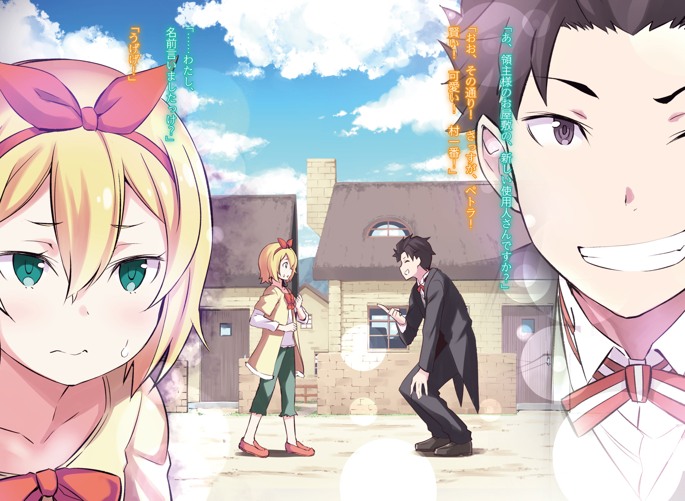
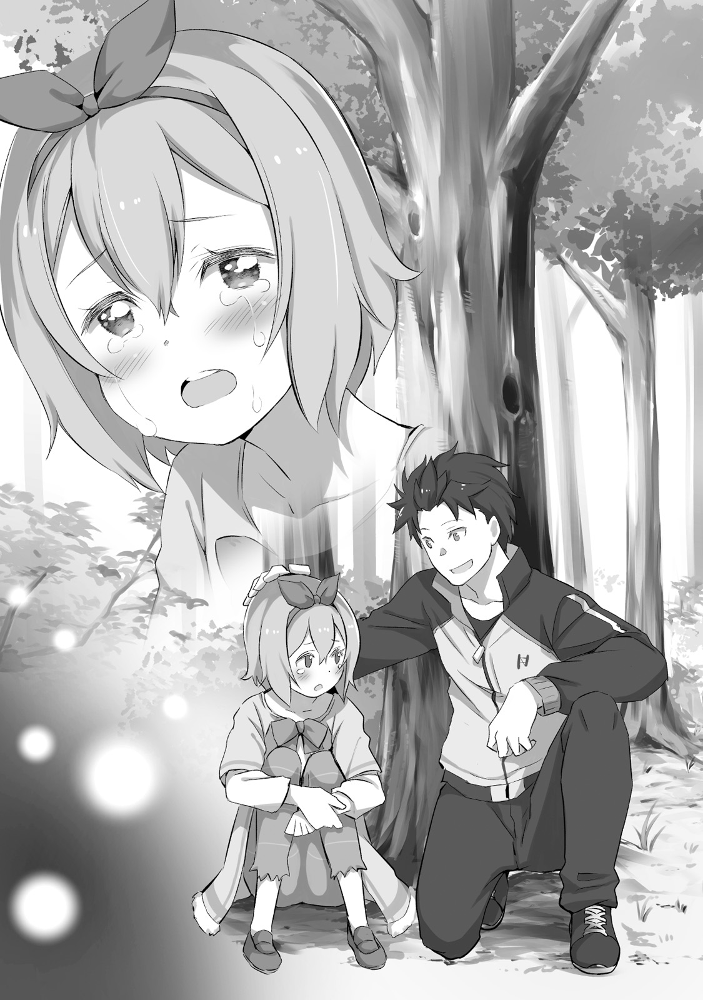
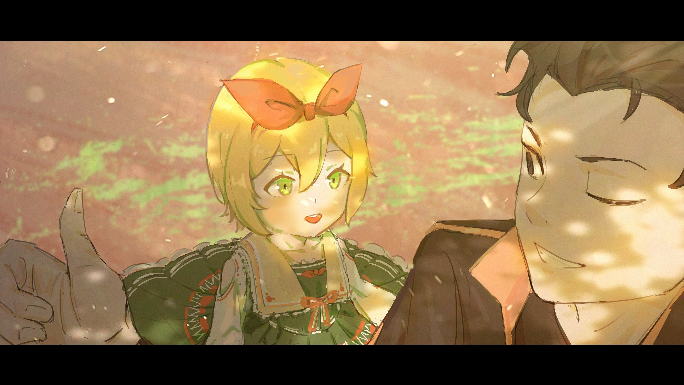
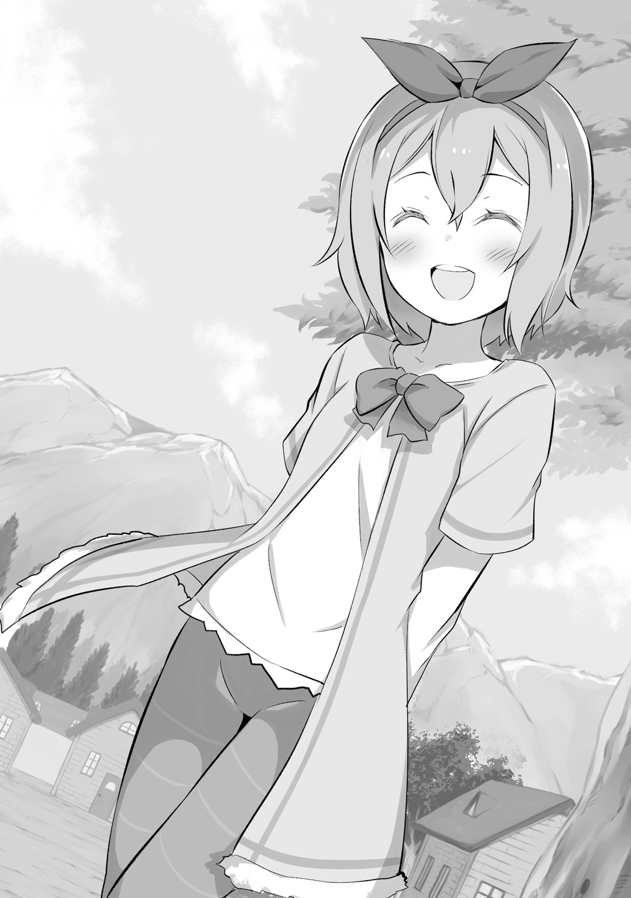

Для Петры Лейт мир был чем-то очень маленьким и давно устоявшимся.

Петра родилась в семье Лейт из деревушки Алам, что в землях маркграфа Мейзерса.

Петра не была благословлена Божественной Защитой и не родилась в богатой семье. Она была одной из многих деревенских девочек и росла здоровым ребёнком в самой обычной семье из самой обычной деревушки.

Деревня Алам — типичное захолустье без каких-либо примечательных особенностей.

За исключением поместья здешнего правителя, маркграфа, расположенного совсем рядом, никаких других примечательных черт у деревни не было. Разве что по сравнению с другими поселениями на его землях, здесь было больше шансов увидеть правителя лично.

Впрочем, требовать от маленькой девочки осознания ценности таких встреч было бы жестоко.

К тому же здешний правитель Розвааль L. Мейзерс был человеком непростым. Начать хотя бы с того, что его внешний вид совершенно не соответствовал слухам о так называемых аристократах.

Он предпочитал макияж сказочного шута и носил диковинные наряды. Такой вид вызывал у людей скорее недоумение, чем благоговение.

«— Если правитель ведёт себя неподобающе, то его народу придётся несладко».

Эту истину Петра смутно усвоила из книжек с картинками и разговоров взрослых. И своим детским умом она понимала, что их правитель едва ли был порядочным человеком.

На самом деле, когда Розвааль время от времени заглядывал в деревню якобы с инспекцией, вёл он себя странно.

Он не важничал как подобает правителю, а вместо этого задирал взрослых, ставил в тупик своими речами светловолосую горничную и оставлял после себя один лишь беспорядок.

Петра не понимала, почему взрослые вроде старосты Мураосы со смехом всё ему прощали. Однажды она не выдержала и высказала лорду всё в лицо. Однако…

«— О~о~о, как же сурово. Но девочка, что смогла сказать мне такое, воистину храбра. Прошу тебя, не забывай эту храбрость и бережно взращивай её в себе~е~е».

Он проигнорировал возмущение Петры и отчего-то с радостным видом погладил её по голове.

С тех пор Петра решила что говорить с Розваалем бесполезно и просто смирилась с его чудачествами.

На этом оставим деревню с лордом и вернёмся к самой Петре.

Как уже говорилось, Петра вела жизнь обычной девочки в ничем не примечательной деревне. Разве что со слов местного правителя Розвааля её можно было назвать «храброй девочкой».

Подрастая, Петра с ранних лет осознала одну вещь.

Она поняла, что, кажется, была «чуточку милее» остальных деревенских детей.

И в самом деле, даже с поправкой на юный возраст, внешность Петры была на удивление яркой.

Большие круглые глаза, губы цвета сакуры, тонкие длинные ручки и ножки, белая кожа. Её красновато-каштановые волосы были тонкими и шелковистыми, и мягко развевались на ветру. Её юная и прелестная внешность была такова, что вся деревня в один голос твердила: в будущем Петра станет настоящей красавицей.

Подобное детское самосознание не стоит недооценивать.

К тому же Петра была не только красива, но и сообразительнее других детей. Правда, это была та самая сообразительность, которую скорее назвали бы хитростью.

Петра считала, что врождённая красота — это то же самое, что и Божественная Защита или талант.

Поэтому для неё было естественно использовать свою внешность с умом и выгодой.

— Когда во время игры случайно что-то ломала.

— Когда таскала с огорода сладкие апельсины.

— Когда вместо ухода за скотом убегала играть с друзьями.

Перед разгневанными взрослыми Петра ловко пользовалась своей миловидностью.

Стоило ей со слезами на глазах опустить голову и пробормотать слова раскаяния, как взрослые тут же теряли всю свою строгость. А простив её одну, они уже не могли ругать других детей.

Единственными, кто мог бы отругать Петру без оглядки на её уловки, были её родители. Но они были полностью обмануты своей любимой дочерью, которая перед ними играла роль хорошей девочки. Так она и росла, постепенно превращаясь в маленькую чертовку.

— Если быть с Петрой, можно извлечь выгоду.

Дети, может быть как раз потому, что они дети, без колебаний хватались за такое преимущество.

Естественно, деревенские дети всё чаще собирались вокруг Петры, отчего её самомнение неуклонно росло.

Мальчики за ней ухаживали, девочки на неё полагались, а взрослые её просто обожали. Так Петра поливала цветок своего самомнения, и он пышно расцветал.

«Я — центр мира». Примерно в это время она и начала так заблуждаться.

Впрочем, даже с такими заблуждениями дети всё равно остаются милыми созданиями.

Хотя её самомнение и росло, оно не выходило за рамки обычной детской шалости, а все похождения с друзьями ограничивались пределами маленькой деревни.

Центр мира, Петра Лейт… Осознать своё заблуждение и чуточку лучше понять размеры этого мира ей довелось несколько лет спустя, когда ей исполнилось десять.

Это случилось, когда в Алам заглянул торговец шёлковыми тканями, что было редкостью.

Говорят, этот торговец возвращался после того, как продал множество редких тканей Розваалю, любителю диковинных нарядов. На обратном пути он и разложил свой товар в деревушке Алам.

— У меня тут товары с запада, из Карараги, и с юга, из Волакии. А ещё самые модные вещи из королевской столицы Лугуники!

Когда Петра увидела товары, разложенные торговцем под эти рекламные речи, её мир перевернулся.

Её взгляд приковали к себе яркие, пёстрые ткани, и в одно мгновение девочка поддалась их волшебным чарам.

Она и сама не заметила, как своей врождённой миловидностью обвела вокруг пальца и торговца, и родителей. Заполучив несколько отрезов ткани, она без устали разглядывала их на своей кровати.

Ткани стали для неё бесценным сокровищем и породили в ней мечту.

Шли месяцы и годы, а мечта всё жила в её сердце. Петре исполнилось двенадцать.

В этом возрасте меняется не только душа но и тело.

Помимо детской незрелости понемногу начинается подготовка к расцвету женственности.

Петра хоть и была всего лишь бутоном, но её знаменитая прелесть никуда не делась. Наоборот, отточенная самосознанием она становилась лишь изысканнее и ярче.

Двенадцатилетняя Петра по-прежнему была в центре внимания деревенских детей и считалась у взрослых умной и милой девочкой, но у себя в комнате она недовольно надувала щёки.

Её смутное желание обрело конкретную форму, и у Петры появилась мечта.

— «В будущем я хочу уехать в столицу и шить одежду».

Создавать красивую и стильную одежду, украшая её прекрасными тканями как душе угодно. Восхищение теми тканями, что так её пленили, и породило в Петре эту мечту.

Если подумать, возможно, одна из причин нелюбви Петры к Розваалю крылась в том, что ей не нравилась его одежда. Она ужасна. Это просто кощунство по отношению к моде.

Но оставим в стороне её гнев на лорда. Недовольство Петры крылось глубже.

Дело было в том, что окружающие не слишком-то поддерживали её старания. А ведь Петра осознала свою мечту и усердно упражнялась в шитье, чтобы её осуществить.

Особенно удручала реакция других детей. Когда она изредка заговаривала с ними о будущем, то никогда не получала желаемого ответа.

Сопливый Лука говорил, что станет дровосеком как его отец. У Мильде начинал урчать живот, стоило ему задуматься о чём-то сложном. Братья Дайн и Каин никак не могли перестать драться, решая, кто из них женится на Петре. Её младшая подруга Мейна была невероятно милой, но всегда начинала плакать, стоило заговорить о поездке в столицу.

И вот тут Петра познала одиночество .

Окружающие дети полагались на Петру, но у самой девочки не было друзей, на которых она могла бы положиться. Стоило заговорить со взрослыми, как они лишь смеялись, считая её мечты пустыми фантазиями.

Как же так? Её миловидность, выходит, была одинокой .

Для Петры, которая всегда добивалась своего благодаря обаянию, это было невероятной реальностью. Впервые столкнувшись с ситуацией, когда миловидность оказалась бессильна, Петра ощутила первое в жизни поражение .

В результате Петра жила в постоянном беспокойстве, храня свои мечты и переживания глубоко в сердце.

— «Может быть, когда я стану немного старше и ещё милее, всё решится?»

Пока что она возлагала эти надежды на своё будущее «я».

В этом смятенном возрасте, двенадцатилетней, Петре однажды вновь довелось пережить странную встречу.

Это случилось по пути с друзьями на реку, куда они шли ловить раков. Петра не хотела пачкать одежду, поэтому собиралась просто наблюдать, но ей всё равно было весело проводить время с друзьями. Тревоги о будущем — это одно, а развлечения — совсем другое. И вот именно в такой момент…

— Эй, эй! Детишки! Не знаете, где найти самого главного человека в деревне?!

С этими словами к ним с невероятной бесцеремонностью обратился черноволосый парень.

У него был недобрый взгляд и какое-то расхлябанное лицо. Сам он вёл себя развязно, но был одет в очень строгий наряд, который ему совершенно не шёл. Лицо проигрывало одежде.

Впрочем, именно благодаря этому несуразному виду она сразу догадалась, кто он такой.

— А, вы новый слуга из поместья лорда Розвааля?

— Ого, в точку! Сразу видно — Петра! Умница! Милашка! Лучшая во всей деревне!

— …Разве я вам называла своё имя?

— Угх!

Парень, который только что радостно хлопал в ладоши, издал стон, встретившись с осуждающим взглядом Петры.

Незнакомец внезапно назвал её по имени, и Петра тут же насторожилась. К тому же она всё ещё злилась на него за то, что он так её напугал. Откуда он мог знать её имя?

— А-а, ну, это… того! Самая красивая девочка в деревне! Слава о Петре из деревни Алам гремит даже в поместье господина Розвааля! Вот так! Да?

— Э-э… в поместье нашего лорда? Ох, мне так… неловко…

— Конечно-конечно! Даже более чем! Ух ты, а вживую ты в сто раз милее, чем в рассказах, ха-ха-ха

Засуетившийся было парень с явным облегчением посмотрел на Петру, которая прижала руки к щекам и опустила взгляд. А Петра, притворяясь смущённой, внимательно следила за его реакцией.

Нельзя доверять ему только потому, что он одет как работник поместья. Раньше среди тех, кто бывал в усадьбе правителя, был один мужчина, который часто на них поглядывал. Он был красив, и одежда ему шла, но его взгляд вызывал беспокойство.

Если присмотреться, на этом парне была точно такая же форма. Петра удивилась, насколько по-разному может выглядеть одежда на разных людях, но решила не терять бдительности. Быть милой — значит быть в опасности.

— Меня зовут Нацуки Субару! Стажёр-дворецкий, готовый на всё! Со вчерашнего дня тружусь в поте лица в поместье господина Розвааля. Давайте дружить!

Не замечая подозрений Петры, парень — Субару — шумно представился.

В его приветствии не было взрослого спокойствия, а манеры оставляли желать лучшего. Чувствовалось, что он недооценивает их, потому что они дети, и его бесцеремонность раздражала.

Короче говоря, первое впечатление Петры о Субару было отвратительным.

Однако, детям понравилась его странная манера держаться — не взрослая, но и не детская — поначалу растерявшиеся Лука и Милдред быстро с ним сдружились.

Раз так, то и Петре как главной среди детей ничего не оставалось, кроме как принять его.

— …Так что насчёт главного в деревне? Что тебе от него нужно?

— Да так, старшая горничная попросила кое-что передать. В общем, поручение!

— Хм. Понятно. Тогда я отведу тебя к Мураосе.

Она повела за собой Субару, который криво улыбался, пока на его спине висел Лука, а за пояс цеплялись Милдред и Каин. Петра подумала, что он простофиля, раз даже не злится на их дурачество.

Кстати, самым главным в деревне на самом деле был староста Мильде, но она намеренно привела его не туда — к его младшему брату Мураосе, который больше походил на старосту.

Наверное, в поместье его потом хорошенько отругают. Забавно.

На следующий день вся деревня только и судачила, что о новом слуге из поместья.

Деревня маленькая. Больших событий здесь не случается, но любая мелочь тут же становится всем известна. Тем более что работники из усадьбы правителя часто приходят в деревню за покупками. Естественно, всем было интересно, что за человек этот новый слуга, с которым им придётся часто видеться.

— Эм, не знаю даже, но он вроде не злой.

Когда родители спросили её, Петра отделалась таким уклончивым ответом.

Из-за вчерашнего случая многие приходили к Петре, чтобы разузнать правду о Субару. Других детей тоже расспрашивали, но взрослые всё же больше доверяли именно ей.

Хотя у Петры и не сложилось хорошего впечатления о Субару, говорить что-то отличное от мнения других детей было бы неправильно. Управлять своей миловидностью — дело непростое. Отделавшись от расспросов, Петра глубоко вздохнула.

— …А? Незнакомая девочка.

Выбравшись из круга взрослых и сбежав на окраину деревни, Петра удивлённо округлила глаза. Там стояла девочка с заплетёнными в косички светло-каштановыми волосами. Второй день подряд она встречала незнакомое лицо.

— Ты что здесь делаешь одна?

— А…

По сравнению со вчерашним парнем, заговорить с этой девочкой она ничуть не колебалась. Обернувшаяся на её зов девочка была, с точки зрения Петры, довольно… нет, очень милой.

Одета она была скромно, волосы без всяких украшений, но черты лица были настоящим сокровищем. У Петры тут же возникло непреодолимое желание прикоснуться к ней.

Петра, которая приложила столько усилий, чтобы отточить свою собственную миловидность, была очень чувствительна и к чужой. Она особенно не любила, когда что-то пропадает зря, и постоянно возилась с матерью и Мейной.

Ей захотелось вложить весь свой дух «миловидности» и в эту девочку.

— Я Мейли. Меня на время оставили в деревне по семейным обстоятельствам.

Представившись так, девочка — Мейли — улыбнулась. Она была тихоней.

На вопросы отвечала сразу, но сама разговор почти не начинала. Характером она походила на Мейну, и Петра почувствовала, что должна взять её под своё крыло, как старшая сестра.

— Пойдём! Я познакомлю тебя со всеми. Я Петра! Твоя подруга!

Она взяла застенчивую Мейли с собой, и Лука с остальными тут же приняли её.

Как только дети находят общий язык, дальше всё идёт как по маслу. Мейли быстро стала частью их компании, и в тот день они носились по всей деревне, укрепляя свою дружбу.

— Иди сюда. …Кажется, это девочка.

— Ух ты, здорово! Мейли, ты будто можешь говорить с животными!

Во время этих игр их особенно порадовал щенок, которого приручила Мейли. Тёмно-коричневый щенок, которого, видимо, привела с собой Мейли, был на удивление ласковым. Дети были в полном восторге от того, как он выполнял команды, будто и впрямь понимал слова Мейли.

— Мейли! Давай завтра обязательно снова поиграем!

Когда наступили сумерки, Петра на прощание сжала руку Мейли и договорилась о встрече на следующий день. Мейли застенчиво кивнула, и Петра, довольная, пошла домой.

— Сегодня у меня появилась новая подружка. Она была одна, и я её позвала к нам!

За ужином, вспоминая прошедший день, она рассказала об этом, и родители с восхищением её похвалили. Это тоже потешило её самолюбие.

Мейли, конечно, хорошая девочка, но ведь это именно она протянула руку одинокому ребёнку. Она поступила не только мило, но и по-доброму. Это наверняка приблизило её к поездке в столицу.

С такими вот расчётами в голове Петра в прекрасном настроении легла спать.

И на следующий день Петра проснулась как обычно и как обычно отправилась гулять.

Обычный, ничем не примечательный день. Она и не подозревала, что судьба всегда прячется под маской такой вот повседневности.

— Простите за опоздание! Чем сегодня займёмся?

В разгар часа огня, в полдень, она встретилась с Лукой и остальными, а потом на окраине деревни к ним присоединилась Мейли. Они как раз обсуждали, чем бы сегодня заняться, когда…

— А! Это Субару!

— Что! Субару?!

— Ура! Субару пришёл!

С просиявшими лицами Лука и остальные разом бросились бежать. Впереди них стоял Субару в своей несуразной форме. Он удивился такому напору, но всё же…

— Уо-о-о! А ну, идите сюда! Я гото… гха!

Он раскинул руки, пытаясь их поймать, но совершенно не справился. В него врезались Лука и Милдред, а за ними братья Даин и Каин, и вся компания повалилась на землю.

— Хватит! Перестаньте дурачиться! Субару, ты в порядке?

— А, да, пустяки-пустяки. Просто переоценил свои силы. Стыдоба.

Она обратилась к сидящему на земле Субару, а тот с кривой улыбкой почесал затылок. Петра удивлённо склонила голову набок. Она не видела его два дня, но сейчас он производил совсем другое впечатление. В тот раз он казался таким дёрганным и выглядел полным дураком.

— Субару, вчера что-то случилось?

— А?! Н-н-ничего такого!? Не было такого, чтобы я разревелся на коленях у симпатичной мне девушки, а потом заснул как убитый, пуская сопли! Точно не было!

— …Хм-м.

Он отрицал то, о чём его и не спрашивали. В общем, похоже, он не рыдал на чьих-то коленях и не засыпал, пуская сопли. Хотя что-то похожее, видимо, всё же случилось.

— Ну и ладно.

Нынешний Субару нравился Петре больше, чем тот, позавчерашний. Она не знала, что там думает Лука и остальные, но ей даже захотелось немного с ним подружиться.

— Так что, сегодня тоже с поручением?

— И это тоже, но сейчас у меня свободное время. Поэтому я решил немного прогуляться по деревне… Эй, не лезь на спину! Не пачкай соплями! Козявками тоже нельзя!

— …Эм-м, помощь нужна?

— …Пожалуйста.

Петре стало немного жаль Субару, который тащился вперёд, увешанный Лукой и остальными. Она решила составить ему компанию в прогулке по деревне и заодно познакомить его со взрослыми.

С Мураосой, которого все называли старостой. С настоящим старостой Мильде. С Макидзи-саном, присматривавшим за молодёжью, и даже с каким-то другим, незнакомым Макидзи-саном в маске.

Пока она помогала Субару знакомиться с жителями, он вдруг произнёс:

— Хм-м… раз такое дело, может, стоит собрать всех деревенских и закатить речь, заодно и представлюсь как следует.

— Закатить речь?

— Ну да, грандиозно со всеми поздороваться, чтобы подружиться.

Сказав это, Субару улыбнулся как мальчишка-проказник.

Увидев его невинную улыбку, Петра впервые почувствовала к нему симпатию.

— Виктори!

— — Виктори!

Симпатия, которую Петра впервые испытала к Субару, была полностью уничтожена каким-то непонятным танцем.

Эта так называемая «радио-зарядка», в которую он втянул почти всю деревню, заставила душу Петры-подростка сгорать от стыда. Но, как назло, Луке и остальным это снова понравилось, и мода даже перекинулась на взрослых. Уничтоженная симпатия сменилась неприязнью, и Петра возненавидела Субару ещё больше.

Может, «возненавидела» — это слишком. Он просто ей не нравился. Она его не переносила. Да и лицо проигрывало одежде.

— Похоже, только ты меня понимаешь…

Она гладила по голове щенка, которого Мейли держала на руках, и пыталась найти в нём родственную душу с печальной улыбкой на лице.

После танцев, по пути домой, она познакомила пойманного Субару со щенком, и тот — о чудо! — цапнул Субару за руку. Петра, уже было павшая духом оттого, что все так легко приняли этого парня, почувствовала, будто наконец-то нашла союзника.

Она даже хотела попросить Мейли разрешить ей поспать сегодня с этим щенком. Именно в тот момент, когда Петра так прониклась к нему тёплыми чувствами…

— А-а!

Кто-то вскрикнул от удивления — то ли Каин, то ли Мейна. А может, и сама Петра.

Внезапно щенок вывернулся, выскользнул из рук Мейли и бросился бежать. Все тут же кинулись за ним в погоню, но угнаться за ним было невозможно. Щенок проскользнул под белой изгородью на краю деревни и скрылся в лесу.

— Что же делать…

Щенок забежал в лес с той стороны, где им строго-настрого запрещали играть взрослые. Они говорили, что деревня окружена барьером из магических камней, которые отпугивают опасных существ. Другими словами, это был опасный лес.

И если в такое место забежал маленький щенок…

— Петра…

Взгляды встревоженных детей устремились на растерянную Петру.

Петра была главной среди детей. Если что-то случалось, они в первую очередь полагались на неё. И раз на неё положились, Петра была обязана оправдать это доверие.

— М-Мейли…?!

Все ждали от неё решения, но Петра не могла вымолвить ни слова. И вместо неё под белую изгородь попыталась пролезть Мейли. Её щёки напряглись, но она смотрела прямо в лес и проговорила:

— Я должна пойти… и вернуть его…

Слова Мейли, исполненные чувства ответственности, поразили Петру как удар молнии. Ей стало стыдно за то, что она медлила, пока такая девочка как Мейли была готова действовать.

— …

Магические камни для барьера висели на деревьях на равном расстоянии друг от друга, отделяя лес от деревни.

Определив расположение камней, Петра мысленно нарисовала карту, отметила на ней барьер и рассчитала безопасную зону для поисков щенка.

Место, откуда в случае нападения в опасном лесу можно будет быстро добежать до барьера. Если придерживаться этого маршрута, можно пойти на поиски.

— Я пойду в лес вместе с Мейли. А вы все…

— Так не пойдёт!

— Раз ты идёшь, Петра!

— Там я и погибну!

Петра взяла Мейли за руку, а за её свободную руку тут же ухватилась Мейна, за руку Мейны — Лука, и так они все взялись за руки. Никто не собирался в страхе отступать.

— …Да. Спасибо.

Всегда все полагались на Петру. Но в этот момент она впервые сама положилась на них. Вдвоём с Мейли ей, возможно, не хватило бы смелости.

Однако…

— …если мы все будем держаться за руки, идти будет неудобно. Так что давайте не будем, хорошо?

Следуя карте, что она нарисовала в уме, Петра вела всех за собой вглубь леса.

Сердце Петры, что ступала по веткам и листьям, колотилось так громко, словно готово было разорваться. Приближались сумерки, и видимость в лесу постепенно ухудшалась. Что, если она ошиблась с дорогой или что-то упустила? От тревоги и напряжения на её лбу выступил пот.

Они были в лесу уже около часа. Теперь Петра жалела о своей неподготовленности.

Приманка для щенка… — нет, она может привлечь опасных зверей. Громко звать — тоже опасно. Сообщить взрослым — так и стоило поступить, пусть бы их и отругали. Взять лагмитовый фонарь… Вернуться до темноты — хватит ли этого?

Чтобы не сбиться с пути, она царапала деревья подобранным камнем, но это было слабым утешением.

Постепенно на лицах её друзей тревога становилась всё заметнее. Стоит сломаться одному — и паника тут же охватит всех. И этим первым человеком, возможно, станет она сама.

Она помнила, где находится барьер. Но успеют ли они добежать, если и вправду с кем-то столкнутся? Может, она совершает сейчас ужасную ошибку?

Тревога всё росла и в глазах Петры начали наворачиваться слёзы. Ещё два-три глубоких вдоха, и надо будет сказать всем возвращаться. Сказать, что нужно предоставить это взрослым.

И вот…

— В-все… давайте на этом…

— Пожалуй, ты права. Пора бы и заканчивать.

— А?

Крепко зажмурившись, Петра уже собиралась сказать, что пора возвращаться, как вдруг раздался голос.

Голос был знакомым, но в нём слышались невиданные прежде нотки. Петра в недоумении открыла глаза — прямо перед ней, совсем близко, было лицо Мейли.

Робкая, неуверенная в себе девочка… её лицо изменилось до неузнаваемости, в нём появилось что-то взрослое, чарующее.

Это была не миловидность, а пугающая до мурашек красота.

— Простите все. Но это моя работа.

Едва она услышала эти слова и увидела улыбку, как её сознание захватило ощущение чьего-то присутствия за спиной. Она резко обернулась. Там стоял огромный чёрный пёс. Раздался рык. Она инстинктивно попыталась закричать «Бегите!», но голос так и не вырвался из её уст. На этом её сознание оборвалось.

В итоге, Петра пришла в себя лишь на закате следующего дня.

— Петра! Ах ты, дочка… столько заставила волноваться!

Медленно открыв глаза на кровати, первое, что увидела Петра — это свою мать, которая с покрасневшим от слёз лицом крепко её обнимала.

На голос матери в комнату тут же влетел отец. Он обнял их обеих разом, Петру и мать, и громко-громко зарыдал.

— Вас, когда вы вошли в лес, спасли люди из поместья. Господину Субару особенно досталось, но он всё равно вернул всех вас.

Родители рассказали это Петре, которая лишь хлопала глазами, не понимая, что произошло.

Оказалось, тот щенок был опасным созданием, что жило в лесу — зверодемоном, и они с друзьями были в смертельной опасности. И спасли их из этой беды, что самое удивительное, Субару и горничная из поместья.

— Точно… кажется, что-то такое и было…

Слушая их, Петра пыталась ухватиться за обрывки воспоминаний.

Это было болезненное воспоминание — трудно дышать, тело горит, очень плохо. Петра лежит на лугу, а вокруг неё Лука и Мейна. Появляется Субару и кто-то ещё. И она говорит с Субару о Мейли, которой там не было…

— Точно, точно. А Мейли? Что с ней случилось?

— …Эту девочку господин Субару тоже вернул. За ней тут же приехала её семья, они очень волновались. И забрали её. Она просила передать тебе привет.

— …Вот как.

Мейли оставила прощальные слова и покинула деревню Алам вместе с семьёй. Петра смутно догадывалась, что родители ей лгали.

Она помнила, как прямо перед тем, как всё случилось, Мейли резко изменилась. Если тот щенок был зверодемоном, то и с Мейли, которая его привела, наверняка что-то было не так.

И всё же ей хотелось ещё хоть раз поговорить с Мейли…

— Петра, ты проснулась?!

— Петра, очнулась?!

— Очнись, Петра!

Не дав Петре погрузиться в свои переживания, в дом шумно ввалились её друзья.

Лука и остальные, проснувшиеся раньше неё, получили те же объяснения, но, в отличие от Петры, безропотно в них поверили и сокрушались из-за расставания с Мейли.

— Может, сходим в поместье, проведаем Субару?

Это предложила Мейна, которая обычно была такой робкой. Лука и остальные обеими руками проголосовали «за». Петра тоже была не против, хотя и удивилась.

— Мейна, так странно слышать от тебя такое.

— Но ведь если бы не Субару, я бы, может, так и не увидела своего братика или сестрёнку…

Петра знала о беременности матери Мейны. Она, как единственный ребёнок в семье, немного завидовала и заметила, что Мейна, узнав о скором появлении брата или сестры, и сама стала чуточку взрослее.

Понятно. В такой ситуации, конечно, захочется поблагодарить Субару.

— Тогда давайте все вместе пойдём в поместье и попросим у правителя разрешения!

Даже Петра была благодарна Субару за спасение жизни. Её отношение к нему испортилось из-за того танца, но этим поступком он всё искупил.

«Буду с ним теперь немного подобрее, — решила она. — Я ведь девочка понимающая».

— Проведать Барусу? Он вроде ещё спит… Хотя ладно. Стыдно за свой дурацкий сонный вид будет ему, так что ничего страшного. Я вас провожу.

Посещение поместья было волнительным, но горничная с розовыми волосами, встретившая их, оказалась на удивление доброй. Хотя её лицо и голос были холодны, Петра почему-то чувствовала, что она не презирает их, а просто со всеми так себя ведёт.

— А разве не нужно спросить у правителя?

— Мне поручены все хозяйственные дела в поместье. Другое дело, если бы вы были наёмными убийцами, пришедшими прикончить Барусу… Вы наёмные убийцы?

— Таких милых наёмных убийц не бывает.

— Вот видишь? Поэтому всё в порядке.

Не отрицая её миловидности, горничная с невозмутимым видом повела их за собой. С замершим от первого визита в поместье сердцем, шестеро детей были приведены к комнате с величественной дверью.

Наверное, там и лежал Субару. Уже вечер, а он всё спит. Соня.

— Я вхожу.

Постучав и не дождавшись ответа, горничная открыла дверь.

Просторная комната, а в глубине неё — огромная кровать. Увидев лежащего на ней черноволосого парня, Петра с облегчением вошла внутрь и…

— Субару, уже вечер! Нельзя же спать до такого времени…

Она собиралась с улыбкой обратиться к нему, но её лицо и голос застыли.

— …

Субару спал со спокойным лицом и тихо посапывал. Если бы только это, его можно было бы счесть простым соней.

Но его тело было сплошь покрыто ранами и бинтами, повсюду виднелись белые шрамы.

И Петра поняла — все они были от звериных клыков.

— Не шумите, чтобы не разбудить его. Когда закончите, позовите меня.

Сказав это, горничная вышла в коридор. Услышав её слова, Лука и остальные с беспокойством подошли к Субару, но Петра не могла сдвинуться с места.

Она словно приросла к полу, и в этот момент все воспоминания разом нахлынули на неё.

— А…

Когда ей было плохо в лесу, Петра о чём-то попросила Субару. Не «о чём-то». Она попросила его вернуть Мейли, которой там не было. Отец сказал, что Субару привёл Мейли обратно. Что он вернул всех детей, вернул Петру. И что он тогда «немного» поранился и ему пришлось нелегко. Где же здесь «немного»?

— А… а-а…

Это её вина. Всё это произошло из-за Петры.

Это она привела Мейли в их компанию. Это она так играла со щенком Мейли, что тот убежал в лес. Это она повела всех в запретный лес. Это она не смогла принять решение вернуться, когда ещё было можно. Это она, пусть и в полубессознательном состоянии, взвалила на Субару невыполнимую просьбу. И в результате этой просьбы Субару получил шрамы, которые останутся с ним навсегда.

Всё, абсолютно всё было следствием самонадеянности Петры.

— Давай что-нибудь напишем на бинтах Субару…

— Давай, давай…

— В знак того, что мы его проведали…

Не замечая застывшую Петру, Лука и остальные откинули одеяло и принялись за бинт на ноге Субару. Стараясь не шуметь, они писали на повязке кто что хотел.

Затем Мейна застенчиво написала слова благодарности.

— Петра?

Когда очередь дошла до неё, Мейна с пером в руке вопросительно склонила голову. Только тогда все остальные заметили состояние Петры, но она не могла взять перо.

Её колени дрожали, и она не могла даже прямо посмотреть на Субару.

— Петра?

— Что с тобой?

— Ты в порядке?

Видя, что с Петрой что-то не так, Лука и остальные удивлённо склонили головы. Оказавшись под их взглядами, Петра вспомнила тот лес. Когда они входили в него, Лука и остальные тоже смотрели на неё. Тогда Петра собрала всю свою смелость, но…

— …!

Сегодня она не могла этого сделать.

Подавив рвущийся из горла всхлип, Петра зажала уши и выбежала из комнаты. Горничная в коридоре прищурилась, глядя на бегущую Петру, но не стала её преследовать. Словно знала, что Петра несётся прямо к выходу, чтобы сбежать обратно в деревню.

Так и было. Петра бежала. Она сбежала домой, влетела в свою комнату и, не обращая внимания на удивлённые голоса родителей, съёжилась на полу и дрожала от страха.

Именно в этот момент Петра впервые осознала свой грех — поняла, что совершила нечто непростительное.

— Это всё я… я виновата…

Петра в слезах призналась в этом родителям поздно ночью.

Она знала, что Лука и остальные приходили проведать её после того, как она выбежала из поместья. Знала и то, что родители, волнуясь за свою любимую дочь, много раз звали её из-за двери.

Она пренебрегла всем этим, притворяясь, что не слышит, и заперлась в комнате. Но в конце концов, не в силах больше выносить растущее чувство вины, она в слезах ввалилась в спальню родителей.

Выслушав Петру, родители поначалу были очень удивлены.

И про Мейли, и про щенка, и про свою просьбу к Субару, и про его страшные раны — Петра рассказала, что во всём виновата только она, и, рыдая, спросила, что же ей теперь делать.

— Да. …Ты и вправду поступила плохо, Петра.

Мать уложила дочь в кровать между собой и отцом и, гладя её по голове, сказала это. Отец, лежавший рядом, обнял её, и Петра шмыгнула носом.

— Если поступила плохо, нужно извиниться. От всего сердца, изо всех сил.

— …Но даже если я извинюсь, меня всё равно не простят.

— Ты извиняешься, чтобы тебя простили? Или потому что хочешь извиниться? Петра, что из этого — ты выбираешь?

— …

Петре показалось, что ей задали очень сложный вопрос, и она замолчала.

Разве извиняются не для того, чтобы получить прощение? По крайней мере, до сих пор Петра использовала извинения именно как инструмент для этого. Даже когда она говорила «прости», действительно сожалея о содеянном, в конечном счёте она использовала извинения как средство, чтобы её простили.

Но есть ли смысл извиняться, если тебя не простят?

— Ты должна пойти и как следует извиниться перед господином Субару. Если боишься идти одна, мы с мамой пойдём с тобой. Но «прости» должна сказать именно ты, Петра.

— …

Её крепко обняли, и она прижалась лбом к груди отца. Если подумать, возможно, она впервые с тех пор, как начала себя помнить, по-настоящему так открыто прильнула к родителям.

Даже перед ними Петра всегда скрывала свои истинные чувства. И сейчас, когда ей предстояло извиняться перед Субару, она в глубине души отчаянно желала их помощи, их присутствия.

— …Нет. Я смогу извиниться сама.

Она сказала это, решив, что не имеет права на такую слабость.

Два дня спустя в деревню поздороваться пришёл очнувшийся Субару.

— Ух, и жесть же была. Но главное, что все целы!

Субару сказал это с улыбкой, подняв большой палец. На нём была не его обычная форма из поместья, а какая-то странная серая одежда. Впрочем, Петра с какой-то странной объективностью рассудила, что эта одежда сидит на нём гораздо лучше, чем его официальный наряд.

— Субару-у!

— Он поправился!

— Субару встал!

— Субару стоит на земле!

— О-о, мелочь пузатая. Рад видеть, что вы тоже в порядке. Благодарите меня, ясно?

Субару с гордостью рассказывал о своём подвиге — смущаясь перед благодарными взрослыми, но сохраняя свою обычную манеру разговора с детьми. И взрослые, и сама Петра смутно понимали, что он так себя ведёт, только чтобы никого не смущать.

Видя такое его поведение, Петра чувствовала досаду. Ведь то, что Субару сделал для деревни и для них, было таким важным, так почему же…

— Субару, давай играть!

— Играть, играть!

— Пойдём ловить раков!

— Больших-пребольших!

Тем временем Лука и остальные, не замечая заботы Субару, как ни в чём не бывало пытались утащить его за собой. Лука уже протянул руки, чтобы на него залезть, но…

— Лука! Ты о чём думаешь?! Субару же только-только поправился!

— Уа-а-а?

Невольно крикнув на него, Петра заставила удивлённого Луку шлёпнуться на землю. На её громкий голос все разом обернулись и заметили Петру, стоявшую в стороне от их круга.

И Субару тоже, подняв руку, обратился к стоявшей в одиночестве Петре:

— О, Петра. Ты чего там…

— …!

— Эй, что такое?!

В тот момент, когда он дружелюбно к ней обратился, Петра развернулась и побежала. За спиной раздался удивлённый голос Субару, но она не могла остановиться.

Она же решила извиниться. А теперь всё было точно так же, как в тот раз в поместье.

— Ха… ха…

В итоге Петра добежала до противоположного края деревни. Согнув колени и сделав несколько глубоких вдохов, она огляделась. Это была окраина — то самое место, где она встретила Мейли и щенка.

— Всё…

— Да уж, здесь всё и закрутилось.

На этот раз без всяких преувеличений Петра подумала, что её сердце вот-вот остановится от удивления.

Она обернулась. Чуть позади неё стоял Субару. Тяжело дыша, он, пошатываясь, опёрся о ствол дерева, на котором висел магический камень.

— Ох… однако… после болезни… бежать изо всех сил… тяжко… ха. А если не болезнь, а рана, то это всё равно считается «после болезни»?… Как там правильно…

— Почему…

— Ничего себе, как ты быстро дыхание восстановила… хотя нет, это просто у меня выносливости никакой.

С кривой улыбкой Субару тяжело опустился на землю. Петра, не понимая, что он задумал, лишь растерянно смотрела на него. Субару похлопал ладонью по земле рядом с собой.

— Садись, Петра. Давай поговорим.

— …Угу.

У Петры не хватило смелости отказаться от его приглашения.

Она робко села рядом с Субару и, опустив голову, искоса поглядывала на его профиль. Он не выглядел злым. Но имел на это полное право.

— Так, я и сам не очень понял, но все сказали мне бежать за тобой. Мол, ты хочешь мне что-то сказать?

— …! Д-да, это так, но…

Похоже, всё это было подстроено, чтобы заставить Петру извиниться. Получается, вся деревня сообща помогала ей искупить свою вину. Лука, Милдред, Каин, Даин, даже Мейна — все они хотели, чтобы Петра попросила прощения.

Раз уж всё так подстроено, Субару наверняка воспользуется моментом, чтобы хорошенько её отругать…

— О чём речь-то? Может, ты поранилась, прежде чем я вас из леса вывел?! Эти собаки кусались без разбору, может, шрам остался… Если так, прости!

— А, э?

— Оставлять шрамы на девочке — это худшее, что можно сделать. Э-э, чтобы шрам не остался, надо, кажется, поддерживать влажность или что-то в этом роде…

Субару побледнел и с явным беспокойством забеспокоился, что мог навредить Петре. Глядя, как он лихорадочно перебирает в уме всевозможные способы, Петра на мгновение опешила, подозревая, что это какой-то хитрый план, чтобы усилить её чувство вины… но тут же поняла, что он совершенно не это имеет в виду.

— …

Этот парень и впрямь не думал, что Петра сделала что-то плохое. Наоборот, он корил себя за то, что сам мог причинить ей вред.

И это его заблуждение, это недопонимание вызвало в Петре обратную реакцию — злость.

— Субару.

— Точно! Петра, покажи рану… а, нет, вдруг она в неловком месте…

— Субару!

— Да-да-да-да, что такое?!

Вздрогнув от крика Петры, Субару обернулся и наконец встретился с ней взглядом. Его редкие чёрные глаза расширились от удивления, увидев, что глаза Петры полны крупных слёз.

Эмоции захлестнули её, хотелось закричать. Но сейчас нужно было высказать не гнев.

— Про…

— Про?

— Прости меня!…

Едва она выговорила это, как слёзы тут же хлынули по её щекам. Субару от этого растерялся ещё больше, но Петра, дав волю чувствам, лишь повторяла снова и снова.

— П-Петра?! Что случилось, почему ты извиняешься?!

— Прости! Прости!… Прости-и-и…

Перед растерянным Субару Петра лишь рыдала и продолжала извиняться.

— …Поэтому во всём виновата я.

Признав свою вину, Петра опустила взгляд и крепко сжала кулаки.

Слёзы всё ещё подступали, но порыв эмоций утих достаточно, чтобы она могла говорить. И так, запинаясь, Петра призналась Субару в своём грехе, как до этого призналась родителям.

В Мейли, в щенке, в своей просьбе к нему, в его страшных ранах — во всём, абсолютно во всём была виновата она.

Выслушав её признание, Субару с тяжёлым выражением лица замолчал.

Стоило Петре закрыть глаза, как перед её внутренним взором вновь возникал образ Субару, лежащего на кровати. И свежо было в памяти, как он, запыхавшись, догнал её здесь.

На руке настоящего Субару, сидевшего рядом, виднелось несколько белых шрамов под засученным рукавом. Наверняка они останутся навсегда. Так же, как Субару только что беспокоился о ней…

— Послушай, Петра.

— …Да.

Услышав своё имя, Петра стиснула зубы, понимая, что час расплаты настал.

Что он скажет? Как будет её ругать? До сих пор Петре всё всегда прощали, и она не знала, каково это — быть непрощённой.

Поэтому, когда она подняла голову и увидела его смущённую, горькую улыбку, Петра забыла, как дышать.

Это было не то лицо, с которым смотрят на того, кого никогда не смогут простить.

— Вообще-то, ты не виновата… нет, не так. Раз уж ты извинилась… тоже не то.

— Эм…

— Хм, наверное, вот так.

Субару, подбирая слова, смутил Петру ещё больше. Не обращая внимания на её смятение, он, кажется, нашёл нужные слова и кивнул ей.

— Я прощаю тебя.

— …

— Да, ты и правда наделала ошибок. Было бы безответственно и как-то неправильно говорить, что ты ни в чём не виновата. И тогда я подумал, что лучше всего сказать Петре, которая раскаивается до слёз…

— …

— Я прощаю тебя, Петра. Всё в порядке, я не злюсь. И хорошо, что у тебя и у Мейны не осталось шрамов. А у меня и у Луки с остальными — это другое. Шрамы украшают мужчину.

Сказав это, Субару рассмеялся — на его лице не было и намёка на злость.

И это было то самое лицо, что и в тот раз, когда Петра впервые почувствовала к Субару симпатию.

— Фха…

От потрясения, совершенно не похожего на то, что было тогда, Петра снова не выдержала и разрыдалась.

Ночью в своей постели Петра долго размышляла в одиночестве.

Почему Субару не злится? Почему её простили?

— Потому что я…

Милая? Нет. Петра уже более чем достаточно усвоила, что бывают вещи, которые этим не решить. А значит, Субару простил её не по этой причине.

Наивные. Простофили. Простаки. Она вспомнила слова, которыми описывала взрослых и детей, которых обводила вокруг пальца, пользуясь своей миловидностью как оружием.

Но сейчас всё было не так. Миловидность не была оружием. Тогда почему же её простили?

«…Потому что он добрый».

В тот миг, как это слово — «добрый» — всплыло в её сознании, всё встало на свои места.

Субару простил Петру, потому что он добрый. Он пошёл в лес, чтобы спасти их, изо всех сил сражался, даже раненый не сказал ни слова упрёка, пришёл повидаться с волнующимися жителями деревни и погладил по голове плачущую Петру — потому что он добрый.

— А…

И тут же Петра поняла, что всю свою жизнь жила в одном большом заблуждении.

Взрослые всё время прощали ей шалости, стащенные с огорода лакомства и отлынивание от работы. Петра думала, что всё дело в её миловидности. Она ошибалась.

Какое заблуждение. Какая глупая ошибка. Её прощали потому, что все были добрыми.

Ей всё сходило с рук, хотя она толком не раскаивалась, не осознавала своей вины и не клялась больше так не поступать — всё потому, что она просто пользовалась их добротой.

Вся жизнь Петры строилась на том, что она пользовалась чьей-то добротой.

Наконец, она это поняла.

И помогла ей в этом самая большая, самая великая доброта, что она когда-либо встречала.

— О, Петра. Ты сегодня так мило нарядилась.

На следующий день Субару встретил её на деревенской площади и, улыбнувшись её виду, сказал это.

Он ни словом не обмолвился о вчерашних слезах.

«И это тоже доброта Субару», — подумала Петра. Этой доброте хотелось поддаться. Поэтому Петра тоже не стала упоминать о вчерашних слезах.

Вместо этого она взялась за подол юбки и мило покружилась на месте.

— Эхе-хе. Правда? Мило? Мило?

— Да, очень мило. Где ты такое платье купила?

— Э-э-э, это… на самом деле я его не купила! Я его сшила!

— Сшила?! А-а, точно! Точно-точно, вот оно что. Петра, ты молодец!

Петра слегка склонила голову набок, удивлённая и одновременно согласная с тем, как Субару чередовал удивление, понимание и одобрение. Однако его искренность мгновенно взбодрила её, и она, покраснев, гордо выпятила грудь.

Сегодня на Петре было милое и яркое платье — как она и сказала Субару, она сшила его сама из ткани. Два года назад она потихоньку начала создавать его из той самой ткани-сокровища, что подарила ей мечту, и сегодня впервые надела его.

— Сразу видно, у Петры есть вкус. С этим можно и магазинчик в будущем открывать.

— …Ты правда так думаешь?

— М?

От этих слов Субару весь её восторг внезапно угас.

Услышав её поникший голос, Субару тоже немного растерялся. Просто Петру напугали эти слова. Она уже не в первый раз говорила людям, что в будущем хочет стать швеёй.

Но она всегда говорила это в шутку, и никто не воспринимал её слова всерьёз.

Взрослые смеялись, а друзья не верили в мечту Петры.

А что подумает об этом Субару? Это чувство внезапно начало расти в ней.

— Знаешь… я в будущем хочу уехать в столицу и шить одежду.

— …

— И это платье… это просто практика… оно пока одно, но я буду тренироваться ещё и ещё, и тогда…

Запинаясь и немного торопясь, Петра рассказала ему о своей мечте.

Не как обычно, в шутку, а с надеждой, обращаясь к тому, кто, как она хотела, её выслушает.

И Субару, выслушав мечту Петры…

— Хорошая мечта. Уверен, Петра, ты сможешь стать лучшим мастером по пошиву одежды во всей столице.

— А…

Субару, который обычно на всё отвечал с улыбкой, не стал смеяться над мечтой Петры.

С серьёзным лицом и голосом он погладил по голове встревоженную Петру и поддержал её мечту.

— Он не посмеялся над мечтой, над которой смеялись все.

«Почему… почему он такой добрый?» — подумала Петра, и, пока в её больших круглых глазах отражался Субару, щёки неосознанно покраснели.

И то лицо, которое сейчас видел только Субару, было самым милым выражением лица Петры за всю её жизнь.

У двенадцатилетней Петры Лейт есть мечта.

И это не мечта стать первоклассным мастером и открыть лучший магазин в столице.

«Я люблю шить. Это никогда не изменится, но…»

Глядя на своё законченное сокровище, Петра вспоминала тот день, когда у неё появилась мечта.

В тот день её пленили яркие ткани, и она загорелась мечтой уехать в столицу. Но теперь Петра понимала истинный смысл того впечатления.

Тогда её поразили не столько красивые ткани, сколько нечто, чего не было в её маленьком мирке. Её очаровал масштаб этого потрясения от столкновения с неизведанным.

Это не обязательно должен был быть путь, связанный исключительно с одеждой. Главное — это то, что изо всех сил расширяет маленький мир, который видит Петра Лейт.

Из-за своей миловидности Петра ошибочно считала себя центром мира.

Осознание того, какой огромной добротой её защищали всё это время, вновь разрушило её мир с силой, не уступавшей потрясению от тех ярких тканей.

И поэтому…

Лука — наследник своего отца-дровосека. Мильд — возродит деревенскую таверну? Или станет поваром? А Даин и Каин… да, слушать их бесполезно. Понятно-понятно.

Она собралась с друзьями и как обычно начала говорить о будущем, как вдруг братья Даин и Каин снова затеяли спор. Предметом спора, разумеется, был будущий муж Петры.

— А ты, Петра? Всё ещё хочешь в столицу?

Спросила её Мейна, которая в последнее время, кажется, осознала себя старшей сестрой и уже не так тосковала в одиночестве. На её вопрос Петра, покраснев, ответила:

— Э-э, ну… теперь, наверное, всё немного иначе.

— Правда? Тогда кем ты хочешь стать в будущем?

В ответ переспросившей её Мейне Петра показала язык. И улыбнулась так мило, что просто глаз не оторвать.

— В будущем… я бы хотела стать невестой доброго мужа…

