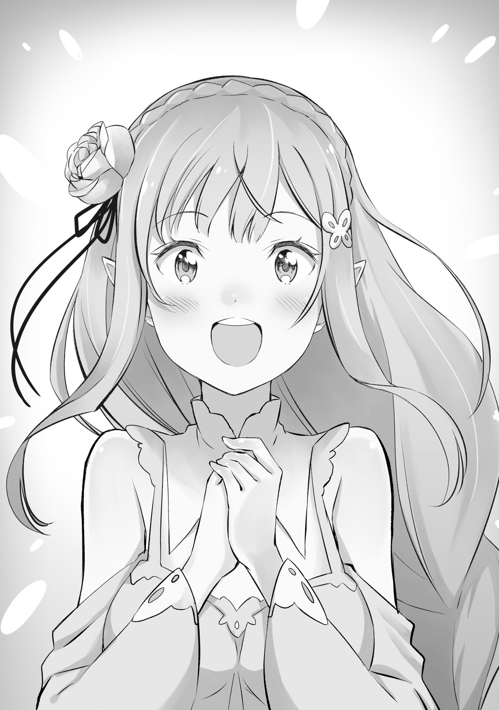
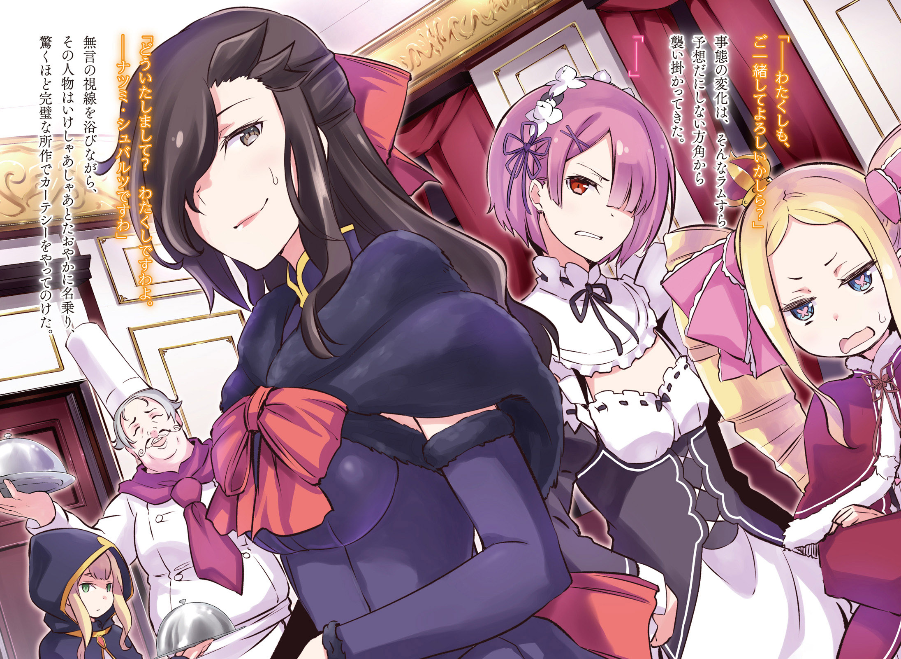
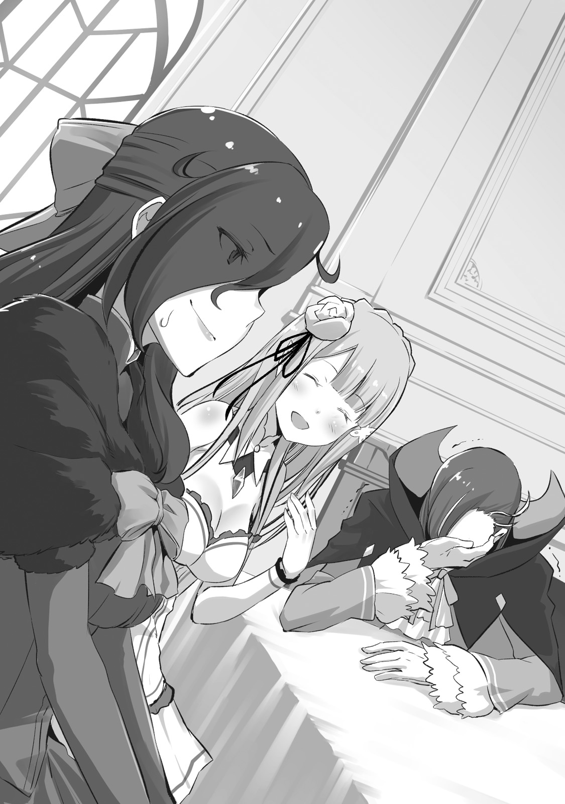

— Эй, Субару, ты слышал? «Гениальный странствующий повар» приезжает к нам.

— …Что?

Услышав слова Эмилии и сверкнув глазами, Субару задал встречный вопрос, сильно наклонив голову.

Они были в саду особняка Розвааля, и до завтрака оставалось еще очень много. И что бросилось ему в глаза в этой ясной утренней атмосфере, так это предвкушающий взгляд Эмилии и ее заявление, когда она вместо «доброе утро», вылила на него своё предвкушение.

У нее была приятная внешность, аметистовые глаза, как драгоценные камнями. Она действительно производила прекрасное впечатление с первого взгляда, но ее жесты, полные очарования и привлекательности, заметно меняли ощущение, которое она излучала.

Имея такое красивое лицо и внешность, она была похожа на ангела.

— Субару, ты меня слушаешь?

— Конечно, Е.М.Т. Итак, что же дальше?

— Боже мой, ты меня все-таки не слушал! Как я уже сказала, скоро приедет «Гениальный странствующий повар». Это же звучит так интригующе! Не так ли?

Серебряный колокольный звон тоже был окрашен ее радостью, не скрывая ее веселого и живого настроения.

Это было то настроение, которое он всегда наблюдал, но он заинтересовался, когда услышал как Эмилия сказала: «Гениальный странствующий повар», так что ничего не мог поделать.

— Странствующий… повар? Погоди, кто это? Это очень глупый титул для человека.

— Ах, ты не можешь так говорить. М-м-м, это человек, который очень искусен в кулинарии, и поэтому, очевидно, его блюда, как известно, настолько хороши, что про него говорят: “съешь кусочек, и твое тело будет захвачено. Съешь два, и твое сердце будет пленено. Съешь три, и твоя душа окажется в его ловушке.”

— Больше похоже на проклятие.

Так радостно рассказанная репутация имела слишком много деталей, что складывалось впечатление, будто никто не остался в живых после его приезда.

В любом случае, это было событие, которое ждали многие, даже несмотря на преувеличенную репутацию. И новость о том, что она не добралась до ушей Субару, была загадкой.

— Ну, это Розвааль, так что это будет необычное шоу. Эмилия-тан, когда ты об этом узнала?

— Совсем недавно.

— Ах, тогда нет никаких сомнений.

Розвааль, глава особняка, был странным человеком, всегда носившим свой эксцентричный наряд и клоунский грим. Он постоянно говорил странные вещи, делал дикие заявления и гениальные предложения, так что Субару легко принял это.

— В любом случае, я надеюсь, что этот человек оправдает своё имя.

— Да! Я очень жду этого. Я, конечно, плохо понимаю это, но оно необходимо для моего будущего, поэтому я буду с нетерпением ждать этого.

— Будущее Эмилии-тан?

Эмилия была в приподнятом настроении. Субару выразил своё согласие, но формулировка Эмилии немного обеспокоила его. Не выявив причину дискомфорта, он продолжил:

— Ну и ладно. Хорошо, тогда давай начнем заниматься гимнастикой. Энергично, и с удовольствием!

— Хорошо, поняла. Тогда давайте сделаем растяжку и вытянем руки вперёд!

Эмилия, которая полностью привыкла к обычаям другого мира, издала стандартный вопль, и началась зарядка. Субару также сосредоточился на этих гимнастических упражнениях, слушая этот успокаивающий голос.

— Субару, ты слышал? По-видимому, завтра приедет повар, который может заставить Дракона плакать, — Диас Лепунцо Элемансо Оплен Фатсбальм VI.

— …Что?

Рем встретила Субару со сверкающими глазами, когда он вернулся после утренней зарядки. Она была девушкой, которая умела держать застывшее выражение лица, но сейчас она не могла скрывать возбуждение, переходящее в страсть.

— Да, как я уже сказала, завтра приедет повар, который может заставить Дракона плакать, — Диас Лепунцо Элемансо Оплен Фатсбальм VI! Разве это не удивительно!?

— А-а-а, звучит совсем по-другому. Это действительно нормально называть человека поваром? Может правильнее сказать авантюристом?

— Что ты говоришь, Субару? Разве это не очевидно? Диас Лепунцо Элемансо Оплен Фатсбальм VI несравненный повар.

Обычно Рем была абсолютно позитивна о мыслях Субару, но, по какой-то причине, она вела себя недовольно и упрекала его, возможно, это было связано с ее тяжелой влюбленностью в повара.

— Значит, завтра приедет повар. Э-э-э, я только что слышал об этом от Эмилии, это действительно известная личность?

— Конечно! Это повар, который может заставить дракона плакать, ища неведомого превосходства, благословленного богиней еды, человек, овладевший всеми вкусами в мире. Он славится своим лозунгом: съешь кусочек, и твое тело будет захвачено. Съешь два, и твое сердце будет пленено. Съешь три, и твоя душа окажется в его ловушке.

— Этот лозунг звучит опасно, независимо от того, сколько раз я его слышу… Ты, кажется, очень хорошо осведомлена.

— Я некомпетентная, но все-таки готовлю. Я уважаю и стремлюсь быть похожей на тех, кто находится на вершине этого пути. Вот почему я действительно жду этого с нетерпением.

Рем беззаботно показывала ему свою редкую улыбку. Просто глядя на нее, он наслаждался такой прекрасной улыбкой, что его щеки расслаблялись, но когда он думал о том, как неизвестный человек заставил ее это сделать, он не был очень рад из-за своих мужских инстинктов.

— Что случилось? Ты выглядишь немного сердитым.

— Да? Рем и Эмилия-тан, похоже, одержимы этим Диасом VI, так что не обращайте на меня внимания. В любом случае, я должен просто облизывать тарелки в углу.

— Хи-хи. Субару, пожалуйста, не говори так. Хм, но…

Рем улыбнулась Субару, который надулся и впал в подобострастие. В середине разговора девушка сделала лицо, которое указывало на то, что она что-то вспомнила.

— Пожалуйста, помни, что Диас Лепунцо Элемансо Оплен Фатсбальм VI очень строг к манерам и не потерпит такого поведения.

— В любом мире полно людей, которым сложно угодить. Я спрошу на всякий случай, но разве он из тех людей, который забирают еду за плохие манеры?

— Нет, обычно он превращает таких людей в начинку для пирогов.

— Что он делает?

Он представлял его, как обычного повара из ресторана, и от этого у Субару мурашки пробежали по спине. Однако он сразу же увидел, как Рем расхохоталась, и понял, что это была одна из ее шуток.

— Господи, избавь меня от шуток, над которыми трудно смеяться.

— Прости. Ты доверяешь мне, поэтому я и сделала это. Однако манеры действительно важны. Хотя я не думаю, что это будет сложно для людей низкого положения, вроде меня и тебя.

— А-а, точно. Если это так, то…

Он терпеть не мог, когда его судили одинаково, независимо от того, имел он образование или нет. Субару почувствовал облегчение от того, что в этом мире были другие манеры поведения.

— Поскольку это особый случай, я также хочу узнать кое-что из завтрашней практики. Субару, запомни вкус моих сегодняшних блюд, ибо завтра они будут совершенно другими.

— М-м-м… хорошо. Хорошо, хорошо, я буду судить должным образом. Ждите этого с нетерпением.

Субару отбросил дискомфорт, погладил Рем, и просто кивнул. Глядя на неё, он собирался с мыслями об предстоящем дне работы слугой под мурлыканье Рем.

Во всяком случае, он с нетерпением ждал завтрашнего дня.

— Барусу, ты знаешь? Похотливый и женоподобный, но легендарный повар Диас Лепунцо Элемансо Оплен Фатсбальм VI был приглашен в особняк господина Розвааля на завтрашний день. Обязательно ведите себя прилично.

— …Чего?

Он закончил свою долю утренних обязанностей и стремился очистить восточное крыло особняка, объединившись с Рам, и она внезапно подняла эту тему из-за его спины.

Обернувшись, Субару, который уже трижды за сегодняшний день склонил голову набок, встретился взглядом с Рам, которая, скрестив руки на груди, очень напыщенно фыркала.

— Как я уже сказала, завтра похотливый и женоподобный, но легендарный повар Диас Лепунцо Элемансо Оплен Фатсбальм VI продемонстрирует свои способности в особняке. Мне жаль Барусу, что ты не можешь участвовать, но веди себя так, чтобы не задеть честь господина Розвааля.

— Погоди-погоди. Кто опять придет? Диас?

— Диас Лепунцо Элемансо Оплен Фатсбальм VI, очевидно, это человек, который становится ворчливым, когда кто-то не утруждает себя тем, чтобы называть его полным именем. Барусу, обязательно выучи полное имя…

— Серьёзно, подожди…

Субару прервал Рам на полпути, когда новые факты о поваре, которые начались с Эмилии, стали добавляться один за другим. Что же все это значит?

— Этот Диас Лепунцо… Это тот самый человек, о котором говорила и Рем?

— Я не знаю, что сказала тебе Рем, но я слышала об этом во время разговора с господином Розваалем, так что, возможно, это касается одного и того же человека. Ну и что?

— Есть некоторые различия между вами тремя.

Из слов Рем, этому человеку трудно угодить, но даже если и так, не может же этот человек быть развратником.

— Более того, я не смогу попробовать еду, почему?

— Я же говорила тебе, что он похотливый бабник, не так ли? Человек осваивал любую и всякую вкусную пищу. Именно Диас Лепунцо Элемансо Оплен Фатсбальм VI выбирает своих клиентов, демонстрируя свои способности, которые, очевидно, ограничены только женщинами. Отвратительно.

— Если бы это было так, то Розвааль тоже не сможет попробовать. Разве это не странно?

— У господина Розвааля есть определенная позиция. Он занял свое место после надлежащих переговоров. Там нет места для Барусу. Разберись с этим, вылизывая чью-то оставшуюся тарелку. Господин Розвааль не сделает этого, и забудь про Эмилию. И если ты облизнёшь мою тарелку, то можешь приготовиться к смерти. Уж лучше оближи тарелку госпожи Беатрис.

— Это звучит, как наказание!

Услышав, что ему предложили облизывать тарелки, да к тому же не кого иной, как Беатрис, он не мог не повысить голос.

— Не важно как ты на это смотришь, это уже слишком. Где Роз? Я с ним поговорю!

— К сожалению, господин Розвааль отправился прямо сейчас повидаться с Диасом Лепунцо Элемансо Опленом Фатсбальмом VI. Он вернется во время завтрашнего ужина… Другими словами, как раз перед началом приготовления пищи. Ты ничего не можешь с этим поделать.

— Это ужасно! Кроме того, почему вы были уведомлены за день до этого, а я нет? Это слишком странно!

— Повар путешествует. Этого человека очень трудно поймать, и на этот раз было также трудно заставить его согласиться. Но он заинтересовался, когда ему сказали, что будут четыре красивые девушки.

— Ах этот чёртов развратник!

Эмилия, конечно, была красавицей, также Рам и Рем тоже были очень восхитительны, Беатрис была хорошенькой куклой, если оставалась неподвижной.

— Могу я… Могу ли я действительно простить такое угнетение?!

— Смирись с этим. Кроме того, завтра это будет не просто еда…

Рам даже не сказала ни единого утешительного слова Субару, который был готов сломаться. Рам собиралась что-то сказать под конец, но она оборвала разговор и быстро вернулась к работе.

В конце концов, Субару не понял, что Рам хотела сказать. И вот так медленно прошло утро, что он остался раздавлен своими чувствами.

— Ты слышал, я полагаю? По-видимому, преемник Диаса Лепунцо Элемансо Оплена Фатсбальма V, обезглавливающий повар, приближается.

— Стоп-стоп.

Это уже был четвёртый раз за сегодня. Но то, как она начала с ним говорить сегодня, не могло его не удивить.

Человек, который недовольно нахмурился, увидев состояние Субару, была девушкой, которая пыталась поднять тему с редко видимым самодовольным лицом, Беатрис. Она фыркнула своим красиво очерченным носом, посмотрев на Субару.

— У тебя хватило наглости прервать меня. Более того, тебе не следует так шуметь в библиотеке. Ты поднимаешь пыль и портишь книги, я полагаю.

— Давай проигнорируем предыдущую фразу и повторим то, что было до этого?

— Ладно. Преемник Диаса Лепунцо Элемансо Оплена Фатсбальма V, обезглавливающий повар, приближается.

— Да! Что это за суперопасное прозвище!? Обезглавливающий!? Я никогда об этом не слышал!

Это был человек, чье имя всегда менялось всякий раз, когда он спрашивал о нём. Однако если причудливый образ был добавлен после приезда сюда, то, конечно, Субару не мог быть послушным, как ива, качающаяся на ветру.

— Во-первых, человеку достаточно одного классного имени! На самом деле, имея так много, чувствуешь угрозу, или, скорее, так называемое важное опасение! Что означают «странствующий повар гений», «повар, способный заставить Дракона плакать», «похотливый повар» и «обезглавливающий повар»? Слишком много несвязных названий! Есть ли на самом деле кто-то с таким количеством имен!? Если есть еще такие люди, скажите мне! Я им устрою нагоняй!

— Розвааля, кажется, называют «получеловеческий любовник», «клоун», «хороший и плохой извращенец» и «Лучший Королевский маг», я полагаю.

— Когда он вернется, я устрою ему взбучку!

Субару беспечно чешет голову, вспоминая все имена, которые ему называли, и возмущается, что это был один из его друзей.

Беатрис ясно вздыхает, глядя на Субару, и говорит:

— Я не понимаю, что тебя раздражает, но, думаю, это не имеет большого значения, я полагаю.

— Это не просто проблема. Обезглавливание звучит очень страшно. Человек что-то сделал, получил это прозвище и до сих пор продолжает быть поваром.

— А, я поняла. Ты меня неправильно понял, я полагаю. Говорят, что он «обезглавливает» людей по определённым причинам.

Манера так говорить не соответствовала внешности Беатрис. Тем не менее, Субару почувствовал облегчение от поведения девушки.

— О, это так? Ну, это точно. Это верно. Нет никакого способа, чтобы человек, который обезглавливает людей, мог продолжать беззаботно работать поваром… не говоря уже о том, что это знаменитый повар.

— Конечно. Однако говорят, что, когда Диаса Лепунцо Элемансо Оплена Фатсбальма VI находится в столовой, люди, которые ему не нравятся, каким-то образом теряют свои должности и работу, и есть много случаев, когда они разорялись.

— «Обезглавливающий повар», значит, лишает рабочих мест, понятно!

Он ясно понял истинность прозвища, которое не всплывало до сих пор, и объяснение Беатрис было убедительным.

Во всяком случае, если он действительно не отрубает головы, тогда он…

— Нет, подожди…

Информацию, собранную до этого момента, и неприятную вещь, которая заставляла его волноваться несколько раз…

Слова Эмилии: «странствующий гениальный повар». Слова Рем: «повар, который может заставить Дракона плакать». Рам: «похотливый и женоподобный, но легендарный повар». Слова Беатрис «обезглавливающий повар».

…он соединяет все это вместе, ступает в самую сердцевину и ухватывается за истину…

— Предвидение будущего Эмилии. Раздражающие манеры. Похотливый и распутный. А потом обезглавливание.

Тревожные слова накапливались, и Субару, наконец, пришел к единственному ответу.

И это было не что иное, как жестокий план, который был слишком злодейским.

— Ни в коем случае… нет, если это Розвааль, то это точно он!

Розвааль L. Мейзерс был сторонником Эмилии, и можно даже сказать, что он был единственным сторонником этой девушки, так как у нее было мало союзников. Однако полностью потерять бдительность и поверить, что все действия Розвааля были искренними и дружелюбными, было бы ошибкой.

Розвааль был человеком, который мог прийти к определенным странным решениям. Но если это выйдет из-под контроля, то не сможет продолжать жить с высоким положением маркграфа среди знати.

Поэтому, конечно же, Розвааль тоже требовал от Эмилии сурового образа жизни.

Кроме того, он не мог себе представить, чтобы Эмилия поступила бы также, потому что она была добра и чиста.

— …Я должен… Сделать что-то…

Улыбка Эмилии, ее живой голос и кончики пальцев, к которым он прикасался, вспыхнули в его памяти.

Эта улыбка, голос и прикосновение — он должен был защитить все это.

— Я сделаю это. Я буду на твоей стороне, клянусь.

Субару вновь обрёл решимость, поднимает голову и сжимает кулак.

В глубине души он думал, что должен был что-то сделать. Это означало, что единственное, что он должен был сделать, это пойти дальше.

Он уже получал свою награду каждый день. Всего этого было достаточно.

— Стоп-стоп-стоп! Ничего хорошего, я полагаю. Ты меня совершенно никогда не слушаешь.

Субару полностью погружается в свои мысли, и он забывает о присутствии Беатрис.

Беатрис подняла одно колено и отвернулась. Надула щёки и нахмурилась от того, что её игнорируют.

Никто из них не сказал того, о чем они думали, что и стало причиной трагедии в далеком будущем.

— Пак, ты знал? Завтра в особняк приедет «гениальный странствующий, распутный и легендарный повар-палач, который может заставить Дракона плакать».

— Правда?

Пятая встреча заметно отличалась от того, что он ожидал. И Субару, который до сих пор был слушателем, стал оратором. Он хотел тайно переговорить кое с кем в саду. Этот кое-кто был маленьким котёнком, парящем в воздухе.

Это был Пак, который заключил договор с Эмилией, а также тот, кто называл себя ее опекуном.

В ответ на слова Субару он поднял свой хвост так высоко, как только мог, и, играя кончиками лап, сказал:

— Лия с радостью рассказала мне об этом, так что я точно знаю, что придет повар. Однако я помню, что у него не было такого странного имени. Что-то очень странное я чувствую…

— Ну, это, конечно, немного не так. На самом деле он имеет гораздо больше имён. Но все в порядке. Сейчас это не важно.

— Хм… Если Субару говорит, что все в порядке, тогда ладно, но я не понимаю к чему ты клонишь. Что тебе нужно?

— Это просьба. Конечно, Эмилия-тан не должна знать об этом, хоть это и касается её.

Понизив голос, он посмотрел на пространство вокруг него.

После этого котенок с круглыми глазами напрягает свое выражение и медленно опускается, чтобы соответствовать уровню глаз Субару.

— Если речь идет о Лие, то я готов выслушать все, что угодно. Я весь во внимании.

— Верно. Но, пожалуйста, не рассказывай об этом Эмилии-тан. Я не хочу добавлять ей повод для беспокойства… кроме того, если Эмилия-тан узнает или заметит, это, вероятно, не сработает.

Пак прищурился, и Субару почувствовал, как по спине у него пробежал холодок.

Маленький дух перед ним меняет свое мышление, услышав, что это было что-то важное, связанное с его драгоценной, любимой дочерью.

— О завтрашнем поваре… Ужин — это ловушка, устроенная Розваалем.

— Что ты имеешь в виду?

— Он не пытается причинить вред и тому подобное. Еда, которую приготовит повар, вероятно, будет действительно вкусной.

От этого у Рем так сильно забилось сердце. Похожая на сон еда, несомненно, появится на завтрашнем обеденном столе в определенной форме. Однако здесь была ловушка.

— То, что Розвааль и повар захотят увидеть… её манеры.

— Манеры, что-то вроде поведения за столом? Почему это ловушка?

— Ты не понимаешь? Подумай о будущем положении Эмилии-тан. Она — кандидат в правители, и отсюда ее будут приглашать на множество вечеринок и обедов. В эти времена будет много случаев, когда ее будут проверять на адекватное поведение.

— Другими словами, завтрашний ужин — это проверка манер Лии.

— Да, это ловушка. «Обезглавливающий повар» проклинает будущее тех, у кого неприемлемые манеры. Люди, которые произвели негативное впечатление на него, никогда не смогут надеяться на успех. До сих пор, кажется, нет конца числу людей, которые потеряли свое будущее в обмен на временное счастье от связи с ним, отчаявшись, когда они поняли, что всё испортили сами. Именно это и пытается сделать Розвааль.

Благодаря Беатрис, Субару понял этот коварный план.

Поначалу, его чувство нежелания верить в это было самым сильным, и он пытался отрицать это, однако, с точки зрения Розвааля, это было логичное решение. Была ли мера, столь же подходящая, как эта, для испытания перед будущей суровой битвой на королевском отборе? Нет, не было.

— Но для Розвааля сделать такое… хотя, это же он, так что такое вполне возможно!

— Тогда что же нам делать? Лия верит в Розвааля, и мне ее жаль.

Уши Пака слабо подрагивали, а глаза были затуманены печалью. Субару так хорошо понимал его чувства, что ему стало больно, и он ударил кулаком о грудь. Он сделал это очень сильно, и казалось, что на лбу у него проступают синие вены.

— Вот почему я позвал тебя. Эмилия будет спасена тобой и мной.

— Я и Субару? Как же так?

— Это легко объяснить. Завтра Розвааль и остальные попытаются проверить манеры Эмилии. Эмилия будет есть, не зная об этом… Вот в чем мы должны помочь!

Эмилия не должна была знать о жестокой реальности. Если Розвааль узнает, что Эмилия это заметила, то этот демоподобный человек, наверняка, снова придумает другой план. Однако на этот раз Субару и Пак заранее распознали этот дьявольский трюк. Они также были на стороне Эмилии, несмотря ни на что. Они могли тайно и открыто бороться за нее.

— Давай сделаем это, Пак. Мы с тобой спасем Эмилию.

— Да! Я готов к этому. Понял. Я ставлю на твои чувства.

Когда Субару протянул руку, Пак приземлился на его ладонь, подумав об этом лишь секунду. Это выглядело иначе, чем рукопожатие, но для них намерения были ясны.

— Итак, что мы будем делать завтра?

— Могут быть некоторые проблемы. Вот почему сначала нам нужны контрмеры для этого. После этого давай встретимся, чтобы проследить за развитием ситуации. Другими словами, сегодня мы не будем спать.

Они оба преследовали одну и ту же цель и действовали, чтобы защитить девушку, которая была важна для них обоих.

Субару и Пак готовились к завтрашнему дню, высматривая возможность разрушить злой план, полируя ногти и клыки.

В тот день Рам была в плохом настроении с самого утра.

Конечно, она не была так груба, чтобы показать свое недовольство на лице. Вот почему ее поведение было таким же манерным, как всегда, и на первый взгляд она казалась обычной. Однако на душе у нее было неспокойно.

— Этот чёртов Барусу!

Она показала своё недовольство слуге, стоящему ниже её.

Обычно, как слуга особняка, подобный Рам и Рем, Нацуки Субару выполнял свои обязательства, но из-за сегодняшнего гостя, ей придётся взять на себя в три раза больше работы.

— Нет, сестрёнка. Субару устал от всей этой непривычной для него работы. Я тоже постараюсь работать, так что пусть он немного отдохнет, пожалуйста.

Только Рем, младшая сестра Рам, похожая на неё, заметила ее раздражение, которое не отразилось на лице, и последовала за ней.

— Барусу, тебе лучше подготовиться к концу этого дня.

Рам задумалась, как выплеснуть весь накопившийся гнев вечером, и нашла для этого подходящую мишень.

Это произошло во второй половине дня, когда Розвааль привел домой гостя Диаса Лепунцо Элемансо Оплена Фатсбальма VI.

— Для меня большая честь быть приглашенным, говорю я.

У него был толстый живот, маслянистое лицо, и он смотрел на них с принижающим взглядом, имея действительно вульгарную улыбку.

У него были седые волосы, и он был толстяком, большим как вертикально, так и горизонтально. Они предположили, что ему было около 50 лет, так как у него были седые волосы и злой взгляд. В стороне от него стояло несколько человек, у которых были плащи, полностью закрывавшие тело до головы. Казалось, что он отбирал слуг таким образом, чтобы ему было легко путешествовать.

— Встреча заняла о-о-очень много времени. Извините, что вернулся поздно. Однако это именно тот человек, о котором шла речь. Будьте так же почтительны, как и со мно~о~ой.

Вернувшись, Розвааль выразил свой теплый прием рядом с легендарным поваром в сопровождении двух человек. Рам и Рем отвечают на эти слова, с достоинством кланяясь.

— Добро пожаловать, спасибо, что пришли.

Они сказали это в унисон. Толстяк отвечает, тяжело дыша и дрожа.

— Боже, я не могу с этим справиться, говорю я. Красота и привлекательность вас двоих увеличивают ваше очарование даже больше, чем тот факт, что вы близнецы, говорю я. Приятный вкус, говорю я.

— Ну и хорошо~о~о.

Розвааль ответил на это несколько неопределённым ответом.

Слушая его, Рам представляла как бьет толстяка по лицу, пинает его в живот и гоняет, как мячик.

— Упс, я так не могу. Извините, что так неожиданно, но не могли бы вы проводить меня на кухню? Я хочу исполнить свое желание, говорю я.

Держатели багажа вздохнули и подтолкнули локтем в спину человека, который продолжал вульгарно болтать.

— Я поняла. Я провожу вас.

Рем берет инициативу на себя и предлагает проводить его, и она идет вместе с ними на кухню. Именно тогда Рам заметила, что мужчина смотрел на попу Рем, когда она шла впереди. Однако она увидела, как её мастер несколько раз склонил голову за это, поэтому она воздержалась от каких-либо слов.

— Извини~и~и. Он что, обидел тебя?

— Нет. Я бы никогда не разозлилась на гостя господина Розвааля.

— А каковы твои настоящие чувства?

— Любыми возможными способами я хочу раздавить эти глаза, которые смотрят вульгарно на мою младшую сестру.

Даже сейчас, вспоминая этот убогий взгляд, она приходила в ужас. Даже взгляд Субару был для неё лучше. Даже если его взгляд временами был подозрительным, она верила в его некомпетентность и сдержанность.

— Рем об этом не беспокоится, а госпожа Эмилия и госпожа Беатрис даже не заметят. Поэтому я подумал, что это не будет проблемой. Да. Кстати, я еще не видел Субару. Где он сейча~а~ас?

— Мои извинения. Барусу с утра в плохом состоянии, так что он спит в своей комнате. Я на самом деле хотела бросить Барусу в… Я хотела оставить дело с гостем полностью на Барусу.

— О, это плохо. Сегодняшний ужин будет иметь вкус, который заставит тебя взглянуть на вещи по-друго~о~ому.

Розвааль действительно произнес это с сожалением, поэтому Рам спокойно опустила глаза и сказала:

— Не поговорить ли нам с Барусу, что он может появиться сегодня вечером?

— Мы не должны быть напористыми. Если будет возможность прийти, он обязательной придёт, независимо от того, насколько плохо он себя чувствует. Нет смысла беспокоиться только о Субару.

Розвааль мягко коснулся её плеча, и она почувствовала жар. Он закрывает один глаз и очаровательно говорит:

— Рам тоже должна получать удовольствие. И сегодня ты получишь от этого вы~ы~ыгоду.

Он наблюдал из-за занавесок в соседней комнате.

— Цель замечена. Никаких сомнений.

— Это означает, что мы также должны подтвердить готовность ловушки.

Пак складывает руки на груди и делает подбородком признательный жест мальчику, который снова смотрит в темноту. Мальчик соглашается, пожимая плечами, и прищуривает свои раскосые глаза.

Атмосфера была другой. Котенок почувствовал это и вздохнул.

— Мы действительно сделаем это, верно?

— Да. Сделаем мы это или нет, я все равно буду сожалеть. Если это так, то гораздо лучше сожалеть о сделанном. Вот что я сейчас чувствую.

— Возможно, я неправильно тебя понял. Если ты так готов, я помогу тебе, чем смогу. Я сделаю все это для моей милой и любимой дочери.

— Для нее… Да, именно так. Ты сам это сказал.

Эти двое тихо обмениваются словами в спокойной обстановке.

Они останавливаются на цели, и их намерения объединяются. Они больше не имели каких-либо колебаний или сомнений.

Мальчик поправляет стул, на котором сидел. Он задерживает дыхание и смотрит на лежащий перед ним инструмент. Он много раз его видел, но и прикасался к нему не в первый раз. Он никогда не ожидал, что бывшая ручка от молотка будет так полезна.

С небольшими сильными эмоциями и готовностью идти, мальчик вступил в битву.

Через четыре часа после прибытия Диаса Лепунцо Элемансо Оплена Фатсбальма VI был приготовлен обед, и Рам отправилась звать Эмилию и Беатрис.

Это был человек, который, как говорили, повар божественного класса. Рем была послана понаблюдать за поваром, и, хотя она не показывала этого на своем лице, ее тело излучало явное ожидание и возбуждение. Тем временем Рам должна была выполнять большую часть дневной работы.

— Иди к чёрту, Барусу!

Благополучно добравшись до ужина, Рам вздохнула от усталости, накапливая приступы гнева на каждом шагу. Когда она это сделала, то позвала Эмилию.

— Он тоже очень этого ждал. Субару очень не повезло… Интересно, можем ли мы оставить что-нибудь для него? Могу я спросить?

— Я думаю, что господин Розвааль принял это во внимание. Госпожа Эмилия, вы, вероятно, прекрасно насладитесь обедом, так что, не задумывайтесь ни о чём.

— Да, поняла, спасибо.

Эмилия, казалось, была разочарована отсутствием Субару. Однако ей лучше бы беспокоиться о себе, а не о ком-то другом. За приглашением Диаса Лепунцо Элемансо Оплена Фатсбальма VI и ужином стояло «определённое значение», хотя Эмилия этого не понимала.

— Кстати, о разочаровании, Пак тоже не появился. Он должен быть где-то в особняке, но его нет в хрустальном камне. Рам, ты его не видела?

— Нет, я его не видела. Кроме того, с ним, имеющим форму Великого Духа, быть за обеденным столом во время обеда с поваром, немного…

— Я думаю, что с этим есть проблема. Хотя он всегда приводит себя в порядок…

Даже при том, что он просто выглядел, как животное, такое существо, обедающее с ними, не было бы желательным.

В ответ на косвенную формулировку Рам, Эмилия тоже неохотно приняла ситуацию и села за обеденный стол.

— Даже если так, он очень жалкий человек, я полагаю. Это ясно проявилось в его поведении.

Следующий человек, которого она позвала, была Беатрис, также упоминает об этом, в связи с отсутствием Субару.

В отличие от Эмилии, она не говорила сочувственных слов, но было совершенно ясно, что она волнуется, так что, с точки зрения Рам, это выглядело более приятно.

— Да, я согласна. Хотя госпожа Беатрис теперь не так одинока.

— Подождите секунду, я полагаю. Я не понимаю, как ты додумалась до того, что мне одиноко. Ответь мне, я полагаю. Старшая из сестёр. Эй, старшая из сестёр!

Она успокаивает Беатрис и тоже подходит к обеденному столу.

Как раз в этот момент к обеденному столу подошли Розвааль и Рем. Когда Рем заметила ее, она короткими шажками подбежала к Рам и сказала:

— Сестрёнка, прости, что свалила на тебя всю работу. Всё хорошо?

— Это просто небольшая надбавка, так что это не было проблемой. А тебе, Рем, понравилось?

— Да! Сестрёнка, спасибо. С нетерпением жду завтрашнего дня.

С точки зрения Рам, Рем, похоже, многому научившаяся, была прекрасна, так как обычно держалась сдержанно. Когда она бессознательно погладила ее по голове, младшая сестра прищурилась, чувствуя щекотку.

— Означает ли это, что пришло время приносить еду?

— Да. Помощь больше не требовалась, и я отправилась в столовую. Сестрёнка, давай тоже сядем.

— Да, да. Не нужно так сильно спешить. Это неприлично.

Рем, резвясь, как ребенок, тянет ее за руку, и Рам тоже садится за обеденный стол.

Потом, дверь комнаты открылась, и повар, который играет важную роль в сегодняшнем празднике, появился.

— Извините, что заставил вас ждать, говорю я. Я спрашиваю, все здесь?

Мужчина встряхивает своим толстым телом и оглядывает столовую. Когда он это сделал, то посмотрел на красивых девушек с прекрасными взглядами, собравшихся за обеденным столом, и, тяжело дыша, одобрительно кивнул.

— Конечно, конечно, говорю я. Все именно так, как вы сказали, маркграф, говорю я. Ну что ж, раз приготовления и подтверждения уже сделаны, давайте приступим к пище.

— Да. Пожалуйста, относитесь ко мне хорошо.

Он пристально посмотрел на Эмилию своими похотливыми глазами. Эмилия с улыбкой осторожно помахала повару, не зная, как именно он на нее смотрит.

— Можно мне тоже присоединиться?

Это был голос, который почему-то звучал равнодушно и хрипло. Все удивляются незнакомому голосу нового человека, и они поворачиваются к входу в столовую. Сбоку от толстяка из щели двери показался человек в блестящем черном платье.

У нее были длинные, очаровательные темные волосы и черное, как смоль платье, которое закрывало большую часть тела женщины. На ее вытянутых губах была густая помада, а подводка для глаз и длинные ресницы усиливали очарование силы её глаз. На плечах у нее был тонкий шарф, и казалось, что она ужасно грациозно ходит, постукивая каблуками.

Все были поглощены появлением этого человека, и у них перехватило дыхание.

— Что-то не так? Это я. Нацуми Шварц.

Эта особа грациозно наклонила голову, в то время, как все молча смотрели на нее, и она беззастенчиво назвала себя, сделав реверанс, который был настолько совершенен, что удивил всех.

Рам оправилась от первоначального шока, и она не знала, что делать дальше. Рам, человек, склонный к поспешным суждениям, проявляла редкую нерешительность, поскольку такого рода ситуация была выше ее воображения.

Она чувствовала в незваном госте притягательную силу, которая мешала ей отвести взгляд, и она потянулась к Розваалю. Какое же решение примет мастер, как человек, ответственный за это событие?

— Я очень сожалею об этом, госпожа Нацуми. Присаживайтесь. Мне очень жаль, но добавление еще одного гостя не повредит, та~а~ак?

Когда молодая женщина, от которой исходила странная вибрация, улыбнулась, толстяк с ошеломленным лицом взволнованно кивнул и вышел из столовой, чтобы принести еду.

Это означало, что в одно мгновение всё внимание перешло на только что прибывшую женщину. После этого, она, естественно, элегантной походкой направилась к Эмилии.

— Вы не возражаете, если я сяду здесь?

— Какая красивая девушка… Ах, пожалуйста-пожалуйста. Простите. Ну право же, Розвааль, совсем не предупредил, что у нас такая гостья, — хоть и не скрывая удивления, непринуждённо ответила Эмилия молодой женщине.

Когда Рам посмотрела на других людей, она видела, что у Рем и Беатрис была разная реакция: Беатрис хмурилась, кривя губы, а Рем же слегка покраснела, точно борясь с неким непреодолимым, загадочным чувством. И наконец, Розвааль, их последняя надежда, согнувшись, практически уткнулся в стол и сдавленно произнёс:

— Я… Я не… думал, что могло дойти до этого…

Он отчаянно сражался с подступающим смехом, и Рам на время оставила попытки добиться от него объяснений.

Молодая женщина Нацуми Шварц, несмотря на то, что Нацуки Субару наложил на себя крестовую повязку, он обманул Эмилию, используя тело, которое было почти таким же, как у женщины, и оно было настолько совершенным, что воспринималось это ужасно.

Он успешно замаскировался и, заняв место рядом с Эмилией, Нацуми Шварц — Нацуки Субару, ставший вымышленной женщиной, втайне сжал кулак, получив ответ, на который так надеялся.

— Но это только начало, Субару.

— Я знаю, я не буду раскрываться.

Улыбаясь своим накрашенным лицом, Субару прошептал что-то и сделал подбородком признательный жест Паку, который был спрятан.

Узнав о цели Розвааля, они поделились информацией о поваре, которую получили заранее, и Субару смело решил, что у него нет другого выбора, кроме как переодеться, чтобы защитить Эмилию.

К счастью, это был не первый раз, когда он переодевался. Воспоминания из прошлого были не слишком хороши, но просто открыть старую рану для него ничего не значило, если это было ради Эмилии.

Кроме того, правда заключалась в том, что Субару достиг такого высокого уровня совершенства в своих навыках кроссдрессинга, что это было печально.

Подводка для глаз и тени для век, чтобы скрыть его глаза и неприятный взгляд. Он временно приобрел двузубые веки с помощью искусственных ресниц и инструментов, и его цвет кожи был ярко выражен через контраст между его губами и макияжем. Длинный темный парик был позаимствован из гардероба, и платье, скрывавшее его телосложение, также было найдено там. В особняке раньше работала горничная с таким же телосложением, так что он был прав в своем предположении, что там остался ее наряд. И тогда, если бы он мог замаскировать свою внешность, и в итоге, для такого умелого человека, как Субару, двигаться как девушка не было проблемой.

Единственное, что Субару не мог скрыть сам по себе, был его естественный голос. Однако он преодолел и это.

— Ты точно с нетерпением ждешь угощения, госпожа Эмилия. Ты уверена в своих манерах?

Голос Субару, которым он величественно разговаривал с Эмилией, не был мужественным и низким. Он не подавал признаков к какому-либо полу. В особняке был только один человек, обладавший таким голосом.

Это был Пак, товарищ Субару по команде, который называл себя опекуном Эмилии. Он лежал на груди, скрытый шарфом, и говорил оттуда.

Если бы вам пришлось описать его, это была бы смесь из двух человек, — вместе, Субару и Пак, были одним Нацуми Шварц.

Он чувствовал сильные взгляды, исходящие от Рам и Беатрис. Судя по их реакции и хмурым лицам, они, вероятно, знали, что Нацуми действительно был Субару. Рем смотрела на Субару по той же причине, но ее взгляд ничем не отличался от того, каким она обычно смотрела на него. Он не знал, что они думают о нем, но в данный момент они не собирались подрывать его прикрытие.

Розвааль, казалось, просто наслаждался идеей Субару. Субару попал в яблочко своим предположением, что Розвааль не будет вести себя плохо.

Неожиданно, но Эмилия действительно ничего не заметила, поэтому он хотел сильно повлиять на нее с текущей силой.

— Спасибо, что подождали, говорю я. Диас бла-бла-бла повар вернулся, вежливо поставил на стол перед Субару и остальными по одной тарелке. Они увидели, что это была стряпня, которую готовил мастер.

Ароматный запах был завораживающим.

— Это Поццо Лотэ Роя, соус для тряпичных блюд.

Это была белая рыба, слегка поджаренная снаружи, с ярко-желтым и зеленым соусом. Запах, поднимающийся от него, немедленно останавливает его чувства, небрежно хватая за живот, и он тяжело пускает слюни.

— Субару!

Он бессознательно собирается стать неряхой, но потом пришел в себя, когда Пак позвал его. Он едва избежал того, чтобы все эти усилия по переодеванию пропали даром. После того, как он внезапно посмотрел в сторону, Эмилия тоже широко раскрыла глаза, глядя на еду, и у всех остальных была примерно такая же реакция.

Было бы слишком дурно сочетать темперамент вынужденных застольных манер с этим неистовым типом восхитительного чувства.

Оболочка, называемая человечностью, слетела, и сила, которая раскрыла его дикость, была включена в запах. Субару сглатывает подступившую слюну и раньше всех тянется за вилкой и ножом.

— Ну, это выглядит довольно аппетитно. Это слишком вкусно, чтобы есть.

Пак соответствует губам Субару, когда он выпускает эти мысли.

Сосредоточившись на этом голосе, Субару внимательно следил за тем, чтобы его план не провалился.

Он берёт кусочек вилкой, ломает его ножом и ест. Он был приготовлен безукоризненно, так как стряпня ломалась только от прикосновения вилки. В сочетании с соусом, он нарушал его мыслительные процессы. Он задерживает дыхание с таким видом, будто вот-вот потеряет сознание, стараясь не обращать внимания на предчувствие вкусной еды.

Если он сейчас будет подавлен, то не сможет вернуться. Он был далек от того, чтобы указать путь для Эмилии, скорее всего, сам Субару будет первым, кто будет очарован пищей.

Стальной самоконтроль и его чувства к Эмилии. Он использовал бы их как оружие и бросил бы вызов кулинарии.

Он открывает глаза, вновь обретая решимость, и медленно подносит вилку ко рту.

Поток процессов, внешний вид, поведение, все эти разнообразные вещи, отполированные до красоты — в тот момент, когда пища вошла в его рот, результат его тяжелой работы и воли рассыпался. Он чувствовал, что вот-вот упадет в обморок.

Ярость ошеломляющего вкуса бьет его через губы и язык, и его работающий мозг, кровь, текущая по всему телу, мышцы, поддерживающие его тело, его кости, его клетки — плохая решимость и готовность Субару были уничтожены.

На него наступают, нападают и сбивают с ног, и когда Субару это осознал, он упал.

— Что случилось, я говорю?

Субару встал со своего места, постучал каблуками, и подошел к Диасу бла-бла-бла. Перед озадаченным человеком он вдыхает, тихо выдыхает и медленно опускается на колени, говоря:

— Я очень недооценил тебя. Прости!

Он трется лбом об пол и заявляет о полной капитуляции.

Это был естественный голос Субару, другими словами, мужской голос. Пак, спрятанный в груди, сказал «блин», держась за голову, но Субару почувствовал необъяснимый шок от его уныния.

Вот почему Субару склонил голову перед Диасом бла-бла-бла будучи тронутым и полностью побежденным.

— Стряпня до смешного вкусная. Я решил съесть его элегантно. Однако это было невозможно. Любой наверняка подумал бы то же самое. Это данность-есть пищу с хорошими манерами, и это имеет смысл. Но я подумал про себя, почему бы не прокомментировать, так вот: это очень вкусно!

Субару ликовал, лихорадочно при этом не будучи в состоянии видеть лицо человека. Это было оправданием, и он был жалким неудачником после того, как их план был сорван. Однако это была также нескрываемая похвала, исходившая от сердца.

Диас бла-бла-бла слушает эту путаницу похвал и оправданий.

— Ха-ха-ха-ха!

Он думал, что молчание будет продолжаться, но звук смеха внезапно разнесся по всей комнате.

После того, как Субару сразу же поднял голову, этот голос исходил от двери в столовую, и он понял, что он исходит из уст невысокого человека, который появился там.

— Боже, я удивлена. Я не думала, что найдется умный человек, который, несмотря на слухи обо мне, попытается сделает что-то такое во время трапезы.

Человек показывает свое лицо, которое было скрыто капюшоном. Та, которая сказала это с архаичной манерой, была девушка с детским взглядом. Субару никак не отреагировала на вторжение девушки, которая была помощницей Диаса бла-бла-бла.

— Хотя ты и потерпел полное поражение от моей стряпни, редко можно встретить человека, который бы так комментировал мою еду. Я вижу, Маркграф тоже плохой человек. Думаю, это как раз то, что тебе нравится.

— Я думал, что это было самое лучшее из самых худших впечатлений. Хорошо~о~о.

Розвааль осторожно соглашается с девушкой, которая скрестила руки на груди и надулась от гордости. Ситуация заставляет Субару широко раскрыть глаза и сказать «что происходит?».

— О Мастере ходит много слухов, но все они чепуха. У Мастера дурной вкус связываться с плохими людьми, которые разносят дурные слухи.

Тот, кто вступил в разговор и ответил на сомнения Субару, был Диас бла-бла-бла. Нет, судя по тому, что только что сказал этот человек, он не был Диасом бла-бла-бла. Настоящий Диас бла-бла-бла был…

— Это я! Это было действительно забавно! Молодец!

Девушка — настоящая Диас бла-бла-бла весело смеется, и Субару автоматически остолбенел.

Когда он это сделал, настоящая Диас бла-бла-бла протянула ему руку, а когда она помогла ему подняться, то медленно усадила его на прежнее место и нежно погладила по голове.

— Какая искусная маскировка. Это тоже великолепно! Это означает, что мы тоже должны ответить, показав, что мы можем сделать, не желая быть превзойденными! Родригес, помоги мне!

— Да, я говорю!

Диас бла-бла-бла оставляет после себя красивые слова, и она выбежала из столовой вместе со своим учеником Родригесом.

Следующее блюдо, вероятно, будет подано таким же образом, но это было бурное событие.

— Ну что ж, тогда посвящение легендарного повара благополучно закончилось, так что давайте продолжим обе-е-едать. Суб… госпожа Нацуми, благодарю вас.

— Молодец, Барусу… я имею в виду, госпожа Нацуми.

— Это было великолепно некрасиво, я полагаю.

— Госпожа Нацуми прекрасна. Это нормально иметь уверенность в себе.

Рам, Беатрис и Рем оценивают его по порядку. Если бы там была открытая яма, то Субару всерьез захотел бы быть похороненным в ней. Эмилия похлопывает Субару по плечу, в то время как у него было такое психическое состояние.

— Я действительно не понимаю, но могу я спросить одну вещь?

— Да…

Он ждет, что скажет Эмилия, дрожа от ее реакции. Вот тогда Эмилия постучала его по щеке своим поднятым пальцем и, мило склонив голову, сказала:

— Твой голос похож на голос Субару.

Вот как он был безжалостно поражен тем, что было самым большим чувством поражения из всех.

— Это оказался довольно хороший ужин, не так ли?

Она убирает свои инструменты и улыбается, держа в руках большую сумку. Розвааль криво усмехается ее словам, проводив ее до вестибюля, и говорит:

— Я так рад, что мы все не смогли выйти, чтобы проводить тебя. По правде говоря, я тоже хочу лечь прямо сейчас.

— Я повторю это еще раз. Я также осознала свою собственную неопытность.

Розвааль пожимает плечами, и Диас смотрит в его сторону, от души смеясь. Она увидела, что Родригес съежился. Диас вздыхает на своего ученика и говорит:

— В чем дело, Родригес? Ты должен радоваться, когда отправляешься в новое путешествие. Соберись!

— Если хозяин не против, то у меня есть кое-какие мысли. Даже при том, что мы не делали никаких нелепых шалостей, если бы мы показали наши навыки нормально… Мне не пришлось бы вести себя так, чтобы распространять странные слухи о моей похотливости.

— Неправильно! Заставлять их глотать слухи и ломать людей через аромат — это самое смешное! Кроме того, пока ты продолжаешь использовать такие окончания в своих предложениях, слух о том, что ты извращенец, не исчезнет.

Сколько бы раз я ни указывала на это, ты ничего не исправляешь!

— Окончание моих предложений, что вы имеете в виду, я говорю?

Диас отвела взгляд от своего ученика, который бессознательно произнес эту фразу, и подняла руку к Розваалю.

— Ну, тогда самое время уходить. Есть еще много мест, которые мы должны посетить. Быть очень популярным тоже проблематично! Есть слишком много людей, которых я хочу дразнить.

— Вы действительно не хотите опла~а~аты? Мы заставили тебя показывать свое мастерство, так что я не могу заставить себя отпустить тебя без опла~а~аты.

— Не надо, не надо! Когда речь заходит о заработке, то у меня его предостаточно, чтобы компенсировать отсутствие денег, ты простил мой эгоизм. Кроме того, я видела сегодня нечто замечательное. Я так же смогла показать своё мастерство высшему духу.

Диас делает хитрое выражение, которое не соответствует ее детскому лицу, и она смотрит на Розвааля. В настоящее время девочки и один мальчик, который поддался на стряпню Диас, должны были находиться в столовой.

— Этот мальчик-трансвестит был хорош. Его честное впечатление особенно превзошло все его похвалы. Мне это тоже нравилось, и я действительно это чувствовала. Так что мне не нужны деньги. Кроме того…

Она не закончила фразу, и Диас протянула руку к голове, и она сняла капюшон, который прикрывал ее. Под ним у нее были красивые золотистые волосы и слегка длинные уши.

— Ты хотел показать мне эту девушку-полуэльфа?

— Есть, определенно, вероятность, что она изменит дискриминацию в отношении эльфов. Если бы она это сделала, то тебе не пришлось бы скрывать тот факт, что ты Диас, и тебе не пришлось бы прятаться за спиной своего ученика.

— Не делай слишком много глупых анализов, Маркграф. Я делаю это, потому что хочу. Я ничего не сделаю, чтобы распространить репутацию этой девушки.

Диас тычет в него пальцем, и, улыбнувшись, показав зубы, она снова надевает капюшон. После этого она отважно поворачивается спиной к Розваалю и величественно идёт вперёд.

— Ну, это было не так уж плохо. Так что, если что-то случится снова, позови меня. Если я смогу показать себя, то я не против.

— С чего бы мне тебе верить?

— Делай, что хочешь. Дурак. А, ну да.

Розвааль демонстрировал господство, сосредоточившись на будущем до самого конца, и поэтому Диас оглянулась с избитым выражением на лице.

— Я тоже хочу услышать честные впечатления в следующий раз. А до тех пор я буду очень признательна, если ты не отпустишь эту эльфийку и мальчика. Понимай это как знаешь.

— Ну-у-у, тогда я так и сделаю.

Розвааль принимает ее согласие, провожает их взглядом и, глубоко вздохнув, говорит:

— Я не уверен, что произойдет через час, но я смог договориться с легендарным поваром.

Несмотря на некоторые нарушения, можно сказать, что он выполнил свою первоначальную задачу.

Было много вещей, которые заставляли его напрягать плечи.

— Тем не менее… Ах, это был шедевр.

В его голове всплыла фигура Субару в платье.

— Пффф, ахахаха.

С этими мыслями Розвааль засмеялся в одиночестве, не в силах справиться с собой. С лицом, которое он никому не показывал, в месте, которое не было видно, он повысил голос без малейшего колебания.
