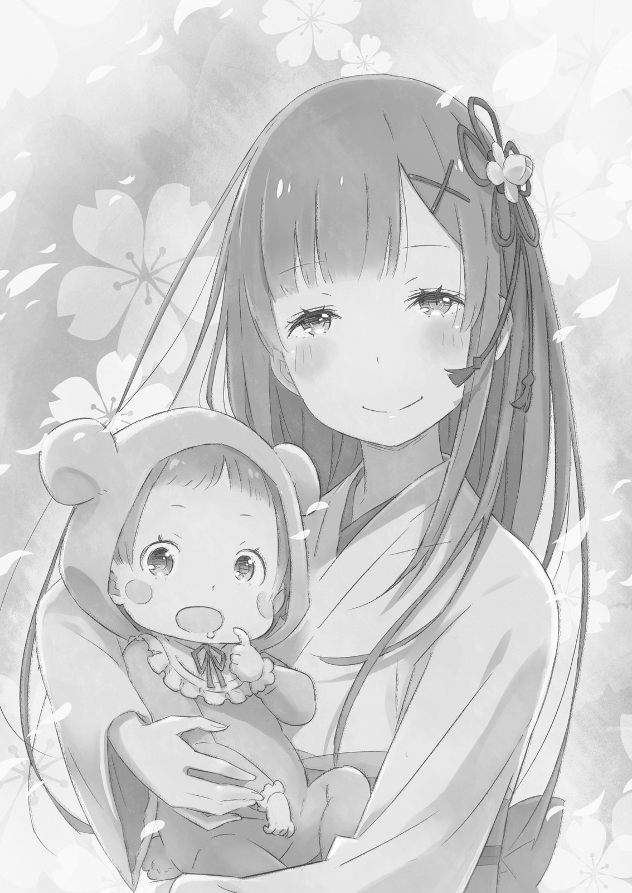

Нацуки Рем

『ナツキ・レム』

…Осыпаемый потоками дневного света, Субару слегка щурился, глядя в голубое небо.

Он услышал чей-то плач.

Плакала девочка. Рыдала со всей силы, используя все возможности своего тела; видя такую реакцию, Субару мог только изумиться, сколько эмоций она вкладывала в этот плач. Неожиданно он почувствовал себя стариком.

Субару: Я конечно знал, что я становлюсь старее, но эти бессознательные проявления моего возраста — просто отстой. Я же стараюсь быть молодым и активным, как так вообще получается?

???: Да кому какая нахуй разница на твою молодость? Ты в зеркало-то себя видел?!

Прямо на его спину посыпались оскорбления до боли знакомым и грубым голосом. Субару лениво развернулся на стуле в сторону ребёнка, находящегося на уровне его глаз. Мальчик лишь гневно схмурил брови в ответ на молчаливое поведение Субару.

Мальчик: Но, в любом случае, сделай уже что-нибудь, чтобы Спика не плакала! Я правда не могу с этим справиться.

Субару: Не, я уже всё. Твои жестокие слова разорвали мою нежную душу в клочья. Скоро я и сам заплачу, как Спика, уж извини.

Мальчик: Взрослому мужчине вообще непростительно делать такое у всех на глазах!

Мальчик нервно дрыгал руками в ответ на по-детски надутое лицо Субару. Пока они продолжительно спорили, Спика сделала глубокий вздох, и не успели они даже вздохнуть, как…

Спика: УААААА!

Субару: Ааааа! Она плачет! Спика плачет! Посмотри на неё, Ригель, ты должен что-то с этим сделать, ты же её братец!

Ригель: Раз ты так говоришь, то может сам что-то предпримешь и перестанешь себя так ужасно вести?!

В углу центральной улицы оживлённого города два человека усердно пытались переложить друг на друга обязанность за плачущую девочку. Прохожие активно поглядывали на них, ожидая развязки этой ситуации, но спустя несколько секунд они понимали, что всё шло по кругу, и со словами «Эх, как всегда» скучающе шли дальше.

Так что их болтовня всё продолжалась и продолжалась, и даже нельзя было сказать мило это выглядело или жутко.

Субару: Ужас, у нас тут ребёнок плачет, а никто и руки помощи не протянет… Что не так с обществом, неужели человеческие души настолько очерствели?

Ригель: Не время ныть о мироздании! Мы должны успокоить Спику до того, как она вернётся, иначе…

???: До того, как кто вернётся?

Ригель: Ну да, в самый подходящий момент…

Ригель, до этого раздражённо кивающий головой в такт своим словам, развернулся назад и уставился куда-то с тупым и изумлённым выражением лица. Заметив такое, Субару тоже приподнял свои брови.

Субару: Ох, ты закончила с покупками?

???: Да у меня всё прошло без проблем… В отличии от вас.

Субару: Нет, просто Спика, ну, очень энергична. Если она так орёт на меня, то, наверняка, также будет орать и на мальчиков. Чует моё сердобольное сердце, она вырастет плохой девочкой!

Глаза Спики довольно приоткрылись, когда она увидела приближающуюся женщину. Девочка вытянула свои маленькие ручки, требуя объятий, что сильно ранило Субару, не получившего такой привилегии.

Субару: Как я и сказал, я просто игнорирую её. Даже, если я успокою её, она снова разрыдается, и всё пойдёт по новому кругу. Вуи, держи, она вся твоя.

Женщина: Да, вся моя.

Хоть Субару и звучал безрассудно, он был крайне нежен и аккуратен, когда передавал Спику в руки её матери. Женщина невольно улыбнулась, когда он принялся убаюкивать малышку своими пальцами, и приняла девочку к себе, прижав её к груди.

Женщина: Нет, просто твой папа с братом совсем никуда не годятся. Поскорее подрастай, чтобы хорошенько их отругать.

Субару: Эй, не вздумай ей вбивать такое в голову, тем более, пока она ещё младенец.

В голове Субару предстала жутка картина, как его, сказавшего какую-нибудь глупость, обступали две злые ворчащие девушки… Но тоже самое было бы и с Ригелем.

Субару: Слушай, а это не так плохо, как я думал. На самом деле, представляя всё это, у меня аж слёзы от счастья наворачиваются.

Ригель: Ну его нахуй. Если на меня ещё и сестра будет ворчать, это в конец разрушит во мне братскую гордость.

Субару: Никто не останется безнаказанным после криков на меня. Хм, дай-ка посмотреть…. Да тебе, определённо, достанется больше всех.

Ригель: Не говори так обо мне, только потому что тебе и так достаётся по самое не балуй. Я никогда не буду таким же, как ты!

Субару странным образом перебирал своими пальцами, пока на него кричал Ригель. Тем не менее, это не он хмурил брови, а…. голубоволосая женщина, поначалу счастливо поглядывающая на них. Спокойным, но от этого не менее твёрдым голосом, она позвала своего сына.

Женщина: Ригель. Разве так я тебя учила общаться в обществе? Это попросту непозволительно.

Ригель: Ээрх, но я имею ввиду…

Женщина: Твоя мама ненавидит это «Ээрх, но я имею ввиду…». И то, что ты сказал до этого, тоже неверно.

Женщина нежно улыбнулась утихомирившейся Спике на её руках.

Женщина: Твоему папе никогда от меня не достаётся. Всё, потому что для твоей мамы он всегда будет самый лучший.

Она произнесла это с покрасневшими щеками, что оказалось более смущающим, чем если бы Субару, и правда, начал рыдать, как ребёнок, у всех на глазах.

Ригель, сдавшись, поднял руки, а Субару почувствовав что-то на подобии зуда, лишь многозначительно вздохнул. Женщина мягко зачесала свои волосы, наблюдая за этой милой семейной сценой.

Длинные волосы Рем, голубые, как светящее над ними небо, мягко развевались по ветру.

Они были в одном из уголков города Карараги, который был то ли парком, то ли чем-то другим. Тем не менее, Субару прошёл внутрь и облегчённо присел на скамейку.

Он смотрел за тем, как невысокий Ригель с колючими волосами носился кругами со своими непослушными друзьями. Хоть он и говорил со своим отцом непозволительно, Ригель был очень милым мальчиком.

Субару: Если бы могли что-то сделать с его глазами… У него взгляд, как у какого-то маньяка или серийного убийцы.

Рем: Не надо. Эти глазки — и есть Ригель. Даже если он наслаждается собой и радуется жизнью, незнакомцы, заприметив его глаза, сразу же решат, что он чем-то недоволен или и вовсе сделал что-то незаконное. Такой уж Ригель.

Ригель: Вообще-то я слышу вас, и, мама, ты говоришь обидные вещи прямо за моей спиной!

В их сторону орал застывший на месте Ригель. Дети играли в популяризованную Субару игру «Морозки» (Freeze Oni), в которой дети убегали от «Они», заставляющего пойманных застывать в нелепых позах. Родители спокойной помахали Ригелю рукой, дабы не разбудить Спику, и вернулись к своему разговору.

Ригель недовольно нагнулся и бросил на Субару взгляд санпаку (белое пространство глаз ниже радужной оболочки). Он выглядел прямо, как его отец на старых детских фотографиях.

Субару: Мда, видимо его судьба уже предрешена. Я бы трясся на его месте…Господи, он станет таким же, как я.

Рем: Опытным в готовке мастером по домашним делам? Найдёт себе идеальную и уважаемую жену, преданную своему замечательному мужу? Ты про это говорил?

Субару: Что за всплеск нормальности? Боже, я нормис (не выделяющийся из толпы)!

Субару высунул от крика язык и схватился за свою голову. Рем только тихонько посмеялась, поднеся ладошку ко рту, и после…

Рем: Ты же понимаешь, что если ты сейчас не отвергнешь мои слова и не обсыплешь меня комплиментами, я увлекусь?

Субару: Если я и хвалил тебя когда-то, то только в качестве обмена. На самом деле, было бы прекрасно, если бы ты сама делала себе комплименты, а я лишь кивал бы головой и позволял тебе продолжать. Да, это было бы идеально.

На самом деле, если бы Субару начал самолично без всяких стеснений нахваливать Рем, это превратилось бы в настоящий сумбур. Они не хотели краснеть на глазах собравшихся в парке людей, поэтому решили пропустить эту не самую достойную часть в их отношениях.

Тем более, если бы Субару начал говорить о любовных темах, об этом точно бы завтра узнал весь город.

Хоть это и звучало заманчиво, он сознательно воздержался от такого и снова погрузился в атмосферу умиротворения и покоя.

Субару закрыл глаза и представил, как он плыл по тёплой волнистой речке под тёплыми лучами полуденного солнца. Он погружается всё глубже и глубже в своё сознание, его мысли уходят далеко-далеко, а голова становится всё тяжелее и тяжелее.

Субару: Чт…

Рем: Если ты устал, приляжь на моём плече, раз Спика уже заняла мои руки.

Субару распахнул глаза и заметил Рем, придвинувшуюся к почти рухнувшему мужу. С учётом их разницы в росте, его голова идеально поместится на её плече. Почувствовав какое-то смущение он посмотрел на тихо спящую Спику. У неё черные волосы отца и очаровательное лицо матери….Сладкая, невинная жизнь, не познавшая мира.

Субару: Оооох, Спика. Ты должна быть моей дорогой дочерью, но вместо этого ты заняла моё святое место. Позже я тебя обязательно защекочу.

Рем: Подожди до ночи, и сможешь занять мою грудь.

Субару: Рем, мы в людном парке, можешь, пожалуйста, подбирать выражения!?

Услышав эти бесстыдные слова Субару приподнялся с плеча Рем и взглянул на неё с упрёком. Как бы это сказать…

Субару: Моя жена невероятно милая.

Рем: Только потому что меня так сильно любят.

Они оба улыбнулись, и хоть Субару и сделал что-то похожее на «гхыыы»……но это всё же было улыбкой.

Не выдержав этого взаимного молчания, Субару почесал свою щёку со словами «Тогда я сдаюсь» и облокотился на её плечо.

Волосы Рем приятной щекоткой елозили по его лицу, и он только сильнее прижимался к неё своей щекой.

Рем: Дорогой, щекотно.

Субару: Ах, прости. Я сделал что-то не то и заволновался, но твои нежность меня успокоили. Мы со Спикой оставим все тревоги Ригелю. Фуууууу, Ригель такой ребёёёёнок!!!

Ригель: Я слышу тебя, придурок, хватит мне всё время кричать!

Рем: Ригель. Твоя сестра спит, потише.

Ригель: Да почему вечно я виноват то, блять?!

Кричал замороженный Ригель. Никто не собирался его спасать, тем более его родители. Отныне, его роль состояла в том, чтобы его дразнили.

Субару уже давно заметил, что, в большинстве своём, поведение Ригеля было похожим на его, но он, в отличии от своего отца, не пренебрегал общением со своими сверстниками. Тем не менее, Субару не чувствовал себя отщепенцем в детстве… При таком раскладе, Ригеля ждало не самое радужное будущее.

Субару: Надо будет проследить, чтобы Спика не стала такой же. С Ригелем нам конечно не повезло, но уж ты точно воспитаешься мамой, и тебя будет ждать счастливое будущее. Я лишь молюсь, чтобы ты не попала в лапы такого же бесполезного парня, как я.

Рем: Нет никого, кто мог бы заменить тебя. Ты один настолько дорог для меня в этом мире.

Субару слегка улыбнулся, и они погрузились в умиротворённую тишину. Тепло тела Рем и убаюкивающая щекотка от её развевающихся волос уносили его в далёкий девственно чистый мир.

В последнее время Субару был усталым, в основном из-за физического труда, с которым он сталкивался каждый день на работе. В эти редкие дни семейного времяпрепровождения он мог только наслаждаться этим миром, греясь в лучах солнца в обнимку со своей любимой женой и дорогой дочерью и наблюдая, как дети дразнят его сына.

…Это и было то тёплое и сладкое счастье?

Рем: Субару-кун….

Субару резко распахнул глаза на такое неожиданное обращение. Он взглянул на Рем, в её бледно-голубых глазах отражалось его лицо, а губы слегка дрожали, видимо, готовясь что-то произнести.

Субару: Это имя…

Рем затихла.

Субару: Прошло столько времени. В последнее время ты называла меня только «дорогой» или "папа”.

Субару закрыл глаза и расслабился, но Рем не прекращала нервничать. Эти слова напомнили о тех днях, когда они только сбежали в Карараги, и хоть Рем и пыталась сделать вид, что всё в порядке, Субару заметил волнение в её взгляде.

Он закрыл глаза. Почувствовал ветер. Рем сегодня предложила им сходить по магазинам, и он, видимо, догадывался зачем.

Субару: Прошло уже 8 лет с того дня.

Рем: Так ты помнишь…

Субару: Это важный момент для меня… Нет, для нас. Я помню, я не забываю….Я никогда этого не забуду.

День, когда он пал у ног судьбы… Забытый всеми… он убежал. Он собирался бросить всё… Но одну вещь он не смог оставить в Лугунике — их любовь. Из-за того, что это произошло там, Субару сейчас был здесь.

Рем: Субару-кун, ты…

Эта ностальгическая форма обращения, которую она совсем перестала использовать после переезда в Карараги. Она сделала это, чтобы выглядеть, как пара, ну и конечно… Чтобы окончательно оторваться от того, что они оставили позади. Субару намеренно не обращал на это внимание…До сегодняшнего дня.

Целый водоворот эмоций кружил в глазах Рем.

Рем: …Сожалеешь о чём-нибудь?

Субару: Сожалею?

Рем: Да. Из-за того, что ты сбежал. Из-за того, что ты сдался. Из-за того, что ты так много бросил. Из-за того, что я…

Субару: Если ты скажешь «согласилась», я буду очень зол. Всё, я ухожу домой за руку со Спикой и Ригелем. Хотя, не, Ригель не очень-то нам и нужен. Оставим его здесь.

Субару заметил, как Ригель обернулся в его сторону, но он лишь бросил серьёзный взгляд на своего сына, чтоб он его не отвлекал. После этого он повернулся к Рем и…

Субару: Знаешь, я не понимаю, зачем вообще говорить такое спустя 8 лет, и я вообще не имею понятия, как это хоть что-то изменит, но повторяю тебе уже тысячный раз…

Рем: Да.

Субару: Я люблю тебя сильнее всех на свете. Ты моя единственная жена, а я твой единственный муж. Ты не настолько щедрая женщина, чтобы просто идти на компромиссы с таким парнем, как я.”

Он вскочил с места и пододвинул своё лицо к Рем, из-за чего она сильно удивилась, задержав дыхание.

Субару: Как я и обещал в тот день, всё, что во мне есть, принадлежит тебе. Я посвящаю, отдаю себя тебе, живу только ради тебя… Хотя теперь и ради наших детей.

Субару мимолётно поцеловал её в губы и уставился на неё с озорным взглядом, который совсем не изменился за эти годы.

Субару: Так что, тебе стало легче?

Рем: …Прости. Мне всё время не легче. Всё из-за того, что я всё больше влюбляюсь в тебя, Субару-кун. Я думаю, что никогда и нигде я не ощущала настолько всеобъемлющего, восхитительного святого счастья, как с тобой. С тобой только любовь, счастье…Но мне от этого не легче.

Пока мотающая головой Рем говорила о счастье, из её глаз обильно текли слёзы. Она прижалась лбом ко лбу Субару, чтобы они разделили с друг другом своё тепло.

Рем: Мне постоянно кажется, что мой дорогой, к которому я сейчас прижимаюсь, исчезнет.

Субару: Расслабься. Я не брошу тебя, я никогда не исчезну. Пока твоя любовь ко мне жива, никто и ничто нас не разлучит.

Рем: Субару-кун, моя любовь к тебе никогда не пропадёт….

Субару: Тогда мы навсегда вместе… Я люблю тебя, Рем.

Субару ещё раз поцеловал Рем. Зубы встретились с губами, и её лицо застыло от удивления, пока Субару погружался всё глубже. Их языки переплелись, и её слюна приятно обожгла его рот.

Наконец, они отодвинулись друг от друга. Рем сделал небольшой тяжёлый вздох и взглянула на Субару, поднявшего палец в небо.

Субару: И вообще… Не говори больше таких глупых вещей по типу того, что это был компромисс, или что-то в этом роде. Где ты видишь компромисс? Хочешь сказать, что Ригель и Спика плод симпатии, а не любви. Спика результат нашей запланированной святой любви, а Ригель — неудачный эксперимент, сделанный из-за нашей безрассудности и страсти в молодости.

Рем: …Это и правда было тогда, когда родился Ригель.

Субару произнёс свою долгу тираду с одной рукой на поясе, а другой, выставленной вверх ,будто он был на постере («Natsuki Subaru!!!»). Рем захихикала и, мотая пальцем, решила поворошить их старые воспоминания…

Рем: Тогда мы только переехали в Банан, и ты нашёл работу во дворце Магодзи,… и после этого мы медленно готовились к нашей совместной жизни…

Субару: Да, тогда я был ещё молодым и нетерпеливым.

Рем: Ты каждый раз приходил таким усталым после работы, но ночью у тебя откуда-то появлялось целое море энергии.

Субару: Да, тогда я ещё был молодым и выносливым.

Рем: Помню, когда мы неожиданно узнали о моей беременности в съёмной квартире. Помнишь, как сильно я тогда побледнела?

Субару: Конечно, трудно отвертеться от глупостей своей молодости.

Стоящий вдалеке Ригель был крайне мрачен из-за того, что его считали ошибкой, но он старался сдерживаться, учитывая сложившуюся обстановку. Хороший мальчик. Субару одобрительно кивнул ему, и после этого Рем тоже обратила на него внимание.

Рем: Но, если честно, я была счастлива, когда была беременна Ригелем.

Субару: Я тоже. Помню, у меня потекла кровь из носа от такой новости, и я слегка обмочился. Я ещё тогда попросил тебя ударить меня, чтобы удостовериться, что всё было наяву…. Боже, сколько же крови тогда было на стенах.

Наверно, тогда это произошло из-за того, что в ней накопилось очень много чувств, так что именно поэтому она так сильно его ударила. На самом деле, тогда их дом накренился, и если бы Субару повезло ещё меньше, он бы, верно, умер. Но помимо этого, он ясно помнил все те тёплые райские чувства, которые он испытал, когда узнал о беременности Рем.

Но она лишь покачала головой. Субару не понял, к чему это было, и, наклонившись, уставился ей в глаза. По улыбке Рем прошла лёгкая тень.

Рем: Моё счастье не было настолько же чистым, как твоё, Субару-кун. Что больше всего меня радовало, так это то…, что я получила шанс удержать тебя со мной.

Субару притих.

Рем: Ригель связывает нас с тобой. Хоть это и странно звучит, но, когда у нас родился ребёнок, я могла меньше бояться, что ты бросишь меня…Именно поэтому я была так счастлива.

Видимо, она очень сильно беспокоилась по этому поводу раньше. Сбежав ото всех, у неё остался только Субару. Поэтому она и боялась потерять его.

Низкая самооценка Рем, наверно, могла посоревноваться даже с Субару. Судя по её мнении о себе, жизнь с Субару, видимо, была для неё вечной борьбой чрезвычайного страха с чрезвычайным счастьем.

Эти крайности в итоге породили новую жизнь.

Субару: Ты мне не верила?

Рем: Нет, я верила. Никто тебе так не верил, как я, Субару-кун.

Субару: Понятно, я не так задал вопрос. Ты… так сильно не верила в себя?

У Рем перехватило дыхание, и она, смущаясь, кивнула. Видимо, образ Субару в её голове был раздут до необычайных размеров. Насколько же мелок она выглядела в своих мыслях на его фоне?

…Она и не замечала, что Субару волновался, считай, о том же. Всё-таки Субару всегда считал, что Рем была намного, намного лучше, чем он.

Это заставило Субару улыбнуться. Увидев это, она надула свои щёчки.

Рем: Хорошо. Я была глупой. Конечно, теперь ты будешь смеяться.

Субару: Не-не-не. Я просто снова о кое-чём подумал. У нас с тобой такие одинаковые характеры, ну, не учитывая того, что ты милейшая девушка на свете.

Скрытые мысли Субару заставили Рем застыть на несколько мгновений. Увидяевтакую реакцию, Субару ещё раз решил для себя, что он любил её. Он любил Рем больше всех на свете. Он любил Рем. Он мог кричать об этом во всё горло. Он, кстати, иногда так, и правда, делал. Всё-таки, они были довольно известной вспыльчивой парой.

Рем: ….Ригель, Спика.

Субару: Хм?

Субару с недоумением наклонил свою голову. Рем посмотрела ему в глаза.

Рем: Они оба названы в честь звёзд…. Звёзд из мира, где ты раньше жил.

Субару: Да. Мой отец был просто сумасшедшим, он даже писал «эскалатор» как «экскаватор», но, я думаю, дать мне такое имя — было неплохой идеей. Мне нравится, что я связан со звездой.

В школе как-то раз дали задание — узнать происхождение своего имени, именно так Субару и осознал, какая подоплёка крылась за тем, как его называли. Узнав тогда, что его назвали в честь огромного скопления мерцающих звёзд, он ликовал, что, между прочим, было для него несвойственно.

И хоть Субару и быстро бросал всякое хобби, за которое хватался, интерес к звёздам он не отпускал никогда. Он мог без проблем определить все звёзды на карте, и, когда надо было выбрать название чему-нибудь, он непременно выбирал…

Субару: Названия звёзд, в основном. Мой ник в интернете тоже был звездой… Если так подумать, если бы мне пришлось придумывать себе вымышленное имя, я бы мог спокойно выбрать одно из таких названий. Разве это не шикарная идея?

Рем: Я понятия не имею, о чём ты говоришь, но я думаю, что это здорово — давать людям такие имена. Когда у нас родится третий, назовём его тоже в честь звезды.

Субару: Говорить о третьем ещё слишком рано. Спика ещё совсем кроха.

Рем: Я думаю, будет здорово, если мы доверим её воспитание Ригелю, когда она уже перестанет быть грудной. Думаешь, почему я тогда сказала, что мы не можем позволить себе ещё одного ребёнка, пока Ригель не подрастёт?

Субару: Обычно это не заметно, но ты чертовски сурова с Ригелем, Рем!

Субару встал, отряхнув зад, и повернулся к Рем спиной.

Субару: Что ж, с покупками мы закончили, так что пора уже идти домой. Здесь слишком много лишних глаз, чтобы мы с тобой хорошенько посюсюкались.

Рем: Верно. Сегодня я готова сюсюкаться по полной.

Субару: Сможет ли моё либидо вообще справиться с выносливостью Они?

Он побормотал это в ужасе и протянул всё ещё сидящей на скамейке Рем руку. Рем медленно притянулась к нему за счёт вытянутой ладони и поместила его в свои объятия. Субару не торопился разжимать руку, наслаждаясь теплом своей жены и дочери, пока не…

Субару: Ну всё, пора идти. Домой!

Рем: Да, дорогой.

Субару понёс в одной руке сумку, а второй продолжал держать идущую чуть позади Рем. Наконец, они подошли к своему сыну, который всё это время стоял «замороженным» в одной и той же позе.

Субару: О, привет, мой дорогой сынуля, я смотрю ты косплеишь снеговика во время Снежного Фестиваля Саппоро. Нам стало скучно смотреть, как ты играешь в «Морозки», так что мы со Спикой пошли домой, а ты оставайся здесь.

Ригель: Ты просто оставишь меня здесь?! Да ну его нахуй, может тогда давайте поговорим о том, что вы тут целовались весь день, пока я стоял!

Субару: Ты это заслужил, мистер Зависть. Это нехорошо, Ригель, нехорошо. Рем только для меня.

Ригель: Заткнись!!!

Ригель заорал что есть мочи с злобным взглядом санпаку на Субару, который только хихикал, глядя на него. Поняв, что его отцу только нравится слушать его крики, он сделал глубокий вздох и…

Ригель: Остынь, остынь, остынь. не будь, как папа. Остынь, остыыыыынь. Всё, я успокоился. Так, о чём вы там разговаривали с мамой?

Субару: Хмм? Ну, о том, что ты назван в честь звезды. Честно говоря, сначала я хотел назвать тебя Вега, но…

Ригель: Так это же охуенно! Почему ты не назвал меня так?

Субару: Ха, «охуенно» говоришь? Мне казалось, что мы не сможем справиться с тобой, когда ты достигнешь такого мятежного возраста, так что мы остановились на этом. Я, конечно, понимал, что этот период в твоей жизни прошёл бы, но я так не хотел, чтобы ты меня мучил.

Ригель: Ты не слишком далеко смотрел в будущее только родившегося ребёнка?!

Ригель подпрыгнул в ответ на хитрую уловку Субару, и…

???: Ээй, Ригель пошевелился, он нарушил правила «Морозок»!

Ригель: АА!

В этот критический момент на Ригеля напали его же сверстники, и он онемел от ошеломления. Субару мог только похлопать его по плечу.

Субару: Тот, кто нарушает правила «Морозок» играет штрафную игру. Они должны защекотать его, пока он не перестанет плакать или смеяться……….Удачи!

Ригель: Не говори что-то настолько тупое с таким серьёзным вид… Эй, что вы делаете, ребята?! Сто…Подождите! Не воспринимайте его слова всерьёз! ВА, ВУАХАХАХАХАХАХАХАХА…!

Один за другим дети окружили Ригеля, чтобы поймать его. Они прижали его к земле, сковали его конечности и обрушили целый шквал безжалостной щекотки на его тело.

Субару: Прощай, мой сын. Ты был хорошим мальчиком. Твоему отцу жаль, что это произошло.

Рем: Ригель. Твоей маме и папе надо кое-что обсудить сегодня ночью, так что останься на ночёвку у друзей. И ещё, тебе запрещено использовать свой рог. И не порви одежду, понятно?

Ригель: Я, Я запомню это, бессердечные родители…!!!

Спика увидела, как её старшего брата щекотали десятки пальцев и произнесла радостный звук. Похоже, у неё был многообещающий характер. Возможно, в будущем она станет более значимой фигурой в их семье Нацуки, чем Ригель

Выразив довольно странным способом свою любовь к Ригелю, Субару взял Рем за руку и начал идти. Идти к спокойствию и счастью в обители, где жила его драгоценная семья.

Рем: Субару-кун.

Субару: Хм?

Рем дёрнула его за руку, заставив обернуться.

В этот же момент на них подул сильный ветер. Субару закрыл свои глаза, а потом снова их распахнул, когда потоки воздуха уже стихли. Волосы Рем развевались по этому ветру, блестели своим особенным небесным цветом, растворяясь в лучах полуденного солнца. У Рем были длинные волосы. Субару знал, против кого она это сделала.

Когда Субару видел длинные волосы, в первую очередь ему в голову возникал образ его дорогой жены, её взъерошенных не ветру волос, её восхитительной и милой улыбки. Для Субару не было улыбки прекраснее этой, не было волос любимей этих, не было человека дороже Рем.

Рем: Прямо сейчас, я самый счастливый человек на свете!

