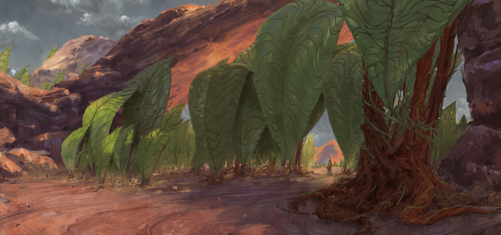

Рыбоголовое дерево удачи

『フォーチュン・フィッシュヘッドツリー』

Эта вещь была ежегодной… Тем не менее, каждый раз он пытался позабыть об этом печальном, но неизбежном факте.

Ригель: Я, действительно, начинаю ненавидеть эти дни.

Человеком, издавшим этот вялый шёпот, был какой-то мальчик с острым взглядом санпаку, прямо сейчас наполненным сильной усталостью и проницательностью, совершенно не подходящей его возрасту.

Это был Нацуки Ригель, король Сэцубуна, которым восхищались все жители Второго Города Банана.

Ригель: Какой позор…!

Король Сэцубуна скрестил свои руки и с горечью взглянул в небо.

Сэцубун, появившийся в городе всего несколько лет назад, разрастался из года в год, лавиной обрушиваясь на Ригеля. Тем не менее, с каждым новым фестивалем его роль всё возрастала и возрастала. Не успел одинокий мальчик осознать это, как его уже провозгласили королём Сэцубуна.

Прямо сейчас Ригель просто гулял по Банану. Однако отсутствие самого Сэцубуна в данный день не отменяло того, что его могли закидать бобами. Он совсем не понимал этого. Мальчик мог бы просто любезно промолчать, проигнорировав выпадки его сверстников, но его отец бы поднял его на смех за такое высокомерное поведение.

В любом случае, с каких пор вообще Сэцубун стал праздником Банана? Если бы он мог управляться со своими эмоциями, Ригель бы, наверняка, задал Субару такой вопрос.

Отец мальчика и был человеком, ответственным за то, что этот фестиваль стал популярным в городе, хотя, это, скорее всего, было связано с его семьёй… Сэцубун был связан с Они. Именно поэтому Ригель, его мать и сестра являлись его неотъемлемой частью.

В любом случае, для его семьи было важно, чтобы Нацуки Ригель участвовал в фестивале.

Так что он каждый раз просто мирился со своей очередью, выдерживал шквал из бобов, определял направление удачи, поедая Эхо-маки, а после носился по городу в костюме Они. Тем не менее…

Ригель: У папы, наверняка, припрятаны ещё какие-то безумные идеи.

Субару: …Эй! Ригель! Долго ты ещё будешь летать в своих мыслях!? Я реально рассчитываю на твои боевые навыки! Пойди сюда! Выручай!!

Это было сразу после того, как мальчик удручённо опустил свои плечи и тихо заворчал. Ригель услышал далёкий голос будто загнанного в угол человека и обернулся в его сторону.

…Его полуголый отец лихорадочно размахивал руками, стоя по колено в воде большого гейзера Моголейда.

Он весь промок, его обычно прямые волосы теперь прилипали ко лбу, и всё это выглядело так, будто они вместе принимали ванну. Его отец откинул свою грязную куртку и, подтирая верхнюю часть своего тело, подозвал сына.

Субару: Скоро косяк придёт! Старейшина была прав! Другого шанса уже не будет! Ригель! Торопись!

Ригель: Хорошо! Понял я, блять!

Было бы лучше, если бы Ригель просто покинул это место, но он, опрометчиво и яростно почесав затылок, подбежал к отцу.

Пока он приближался к Великому Гейзеру Моголейду, всю его голову забрызгала прозрачная вода, сверкающая под лучами безоблачного неба.

…В этом году Сэцубун не такой, как обычно.

Ригель: Нет подожди, досаждать мне — это обычное дело!

Субару: Ригель! Ригель-сан!? Торопись! Вытаскивай свой рог! Хватайся за сети! Хватайся и держи их и за всех сил!

Ригель: Заткнись!!

Ригель последовал приказам отца, не до конца понимания их смысла. Он встал посреди гейзера, поглядывая на бурлящую воду, в которой плавали миллиарды теней рыбок.

Ригель: …

Он крепко уцепился за сетку, и его лоб неожиданно вспыхнул от тепла. Мальчик чувствовал невероятное возбуждение.

Переполняющая сила бесконечно разрасталась, пожирая всю ману в атмосфере. Невысокий 11-летний Нацуки Ригель владел мощью Бога Они, что не очень сочеталось с его ребячливостью.

Ригель: УРРВВААААААААА!!

Он вложил невероятную силу в свои руки и тут же вытянул сеть. Железная конструкции сетки выполнила свою роль, не порвавшись под напором безумной силы.

Субару: Вот оно! Ригель сделал это! Мы тоже не проиграем! Все, бросайте всё ненужное и ТЯНИТЕ!!

Все: Раааааааааз и дваааааааааа!!!

Отец продолжил за Ригелем, будто перехватив его эстафетную палочку. Нет, это был не только его отец. Все жители Банана сбежались в кучу и со всей силой потянули за сеть. Мальчик следил за тем, чтобы рыбы не вылезли из ловушки, но остальные люди уже подняли её на половину, так что ему не о чем было беспокоиться.

Субару: Рыбы, терпите, и станьте… Жертвой Сэцубунаааа!!!

Они были братьями по не счастью, попавшие в сети Сэцубуна. Они не понимали мысли людей, мысли взрослых. Однако…

«…По крайне мере, я посочувствую вам и возьму вас с собой!»

Ригель: Увоааааааааа!!

Зубы мальчика дрожали, пока он с в волнением следил за трудом многих десятков людей, вкладывающих в это всю свою душу. Его руки, держащие стальные прутья, были горячие, а жидкость, тёкшая по лбу, уже вряд ли можно было определить, как просто воду или пот.

Он думал только о том, чтобы не отпускать сетку.

…Чтобы понять, почему это вообще произошло, надо вернуться на несколько дней назад.

Было раннее утро выходного дня. Отец с сыном сидели под одним котацу (стол с одеялом), повернувшись к друг другу лицом, и приятно беседовали вместе.

Никому из них не надо было идти в школу или на работу, да и никаких планов на этот день у них не было намечено. Они частенько проводили так время в котацу с диалогами по типу «Как школа?» «Ничего нового». Какие же это были беспечные времена.

Субару: Ах, Ригель-кун. Скоро тот самый день. Что ты об этом думаешь? Хм?

Ригель: Иди в бурду.

Субару: Какой интересный способ меня оскорбить.

Человек, недовольно скрививший губы напротив, имел такие же глаза, как и те, которые Ригель каждый день видел в зеркале.

У него были короткие чёрные волосы, необычные чёрные глаза и та же фамилия что и у Ригеля. Он был Нацуки Субару, его отцом. Ему оставалось совсем немного до тридцати лет, по скромным подсчётам Ригеля, так что не было ничего странного, если бы он стал за это время намного серьёзнее и проще, как и любой взрослый. Тем не менее, в эмоциональном плане Субару, скорее походил на пяти или шестилетнего.

На самом деле, в данный момент Спика, как самый младший член их семьи, проходила специальную систему обучения, и Ригелю было запрещено ругаться ради её эмоционального развития. Таким образом, ему приходилось искать альтернативы, используя условное «бурда», чтобы вежливо донести до своего отца именно тот посыл, который он и задумывал.

Но Субару ничуть не смутили жалобы Ригеля, и он продолжил с…

Субару: В любом случае, я же понимаю, что ты чувствуешь. Я тоже размышлял о прошлом Сэцубуне. Я не думал, что во время фестиваля люди купят больше бобов, чем за весь прошлый месяц.

Ригель: В прошлом году я находился на грани смерти из-за этих бобов. Мне до сих пор снятся кошмары по этому поводу.

Субару: Не волнуйся. Количество Они растёт с каждым годом, так что, думаю, в предстоящем празднике эта ноша на твоих плечах станет значительно легче. Обещаю, то, что было на прошлом Сэцубуне, никогда не повторится!

Ригель: Не веди себя так, будто мы с тобой команда!

В ответ на бесчувственные слова Субару Ригель агрессивно пнул котацу. Тем не менее, он быстро остыл, как и тогда — через несколько дней после прошлогоднего Сэцубуна.

Тем не менее, любой человек, даже любой ребёнок в этом городе знал о его достижениях. Если бы они и дальше продолжали так на него давить со словами: «Мы с нетерпением ждём следующего года», он бы, наверняка, сдался бы, исходя из свойственной ему робости.

Ригель: Замес в прошлом году, кстати, был недостаточно хорош. И насчёт игрушечных дубинок, правильно ли, что там набита вата вместо шипов. Не то, чтобы я собираюсь кого-то избить, но, если бы я всё-таки кого-нибудь избил, праздник бы, наверняка, отменили.

Субару: Учитывая тон твоего голоса, ты, наконец-то, научился искать позитив в хоть каких-то вещах. Господи, наконец-то, ты оправдал силы, вложенные в твоё воспитание. Теперь в этом празднике нету смысла, пора его отменять.

Ригель: Что ты сказал?! Ты же сам начал вовлекать всех в этот фестиваль! Ладно мои жалобы, тебе не жалко всех остальных вовлечённых людей?!

Субару: Да… Ты, и правда, уже взрослеешь.

Ригель мог только беспомощно вздохнуть в ответ на бессмысленные рассуждения Субару.

Непонятные слова уже давно стали для него чем-то обыденным. Если бы он попытался разобраться хоть в каких-то из них, он бы попросту утомился. В отличие от своей матери, Ригель с самого рождения даже не пытался понять своего отца.

Ригель: Так что, ты всё ещё собираешься говорить о Сэцубуне? Я надеюсь, ты в курсе, что мне уже не подходят те штаны с жилетом. Я расту.

Субару: Да, всё-таки, ты вырос на целые 5 сантиметров с прошлого года. Не могу не порадоваться, что ты начал так быстро расти. Тем не менее, мой-то рост застрял в одной точке, и вряд ли я замечу какие-нибудь изменения в ближайшее время. Можешь смотреть на это, как на долгосрочную перспективу.

Субару громко рассмеялся, потянувшись рукой к Ригелю, сидевшему по другую сторону котацу. Вероятно, он пытался погладить его по голове, но ему было слишком лень подниматься на ноги. Ничего не поделаешь, Ригель вытянул голову, и приятная щекотка прошлась по его макушке.

Субару: В любом случае не беспокойся за костюм Они. Рем ведёт над ним секретные разработки. Костюм, который сам будет меняться в размерах, по той мере, ка ты будешь расти… Я думаю приукрасить его немного на твою свадьбу, что думаешь?

Ригель: Иди в бурду.

От грубых слов до сих пор поглаживаемого по голове Ригеля у Субару аж перехватило дыхание. Субару промолвил: «Как видишь» и с кривой улыбкой продолжил с…

Субару: Да, штаны Они — это конечно важно, но этим уже занимается Специальный Комитет Фестиваля Метания Бобов, так что нам остаётся лишь сказать «угу-угу». Помимо этого…

Ригель: Погоди-погоди-погоди-погоди-погоди, почему я в первый раз слышу об этом комитете?!

Субару: Помимо этого, мы планируем поэкспериментировать во время этого Сэцубуна. Есть Эхо-маки и бросаться бобами — это конечно весело, но нам надо отходить от старины, ища что-то новое.

Ригель: Иди в бурду…! Просто… иди… в бурду…!

Отчаянные слова Ригеля даже не достигли ушей увлёкшегося Субару, так что мальчик безнадёжно повесил свою голову. Увидев это, Субару наклонился вперёд, будто удивляясь его поведением.

Субару: Я поразмыслил мозгами и пришёл к выводу, что нам нужно какое-то дополнение к метанию бобов. Думаю опробовать его в этом году.

Ригель: …Что за странный фестиваль ты придумал на этот раз?

Субару: Не называй его странным. Странный фестиваль… Хотел бы я так его назвать, но я не готов клеветничать на свой праздник.

Из-за этих мрачных слов по спине Ригеля пробежали мурашки.

Посторонний человек, и правда, мог принять разбрасывание бобами и молчаливое поедание суши-роллов чем-то странным, даже учитывая сумасшедшего главу этого семейства. Но, судя по словам, Субару, он готовил что-то воистину серьёзное.

Ригель: Н…нееееееет! Ты снова хочешь заставить меня страдать! Так ведь? Я же правильно всё понял!?

Субару: Что тебя сделало таким циничным ребёнком.

Ригель: На 90% это из-за папы и на 10% из-за мамы!

Субару: …Хехе, удивительно, как ты в таком возрасте, уже расцениваешь вклад родителей в твоё воспитание. Честно говоря, я предсказывал это, ещё когда ты родился.

Ригель: Хватит мне льстить, я всё равно злой, знаешь ли!?

Потерев кончик своего носа, Ригель взбесился из-за спокойствия Субару, который быстро замахал руками, приговаривая «успокойся» и сказал…

Субару: Остановись, так наше обсуждение ни к чему не приведёт. Позволь мне, наконец, выложить, чем мы будем занимать во время этого Сэцубуна.

Ригель: Так что насчёт штанов…

Субару: Не волнуйся, с ними всё будет в порядке… Начиная с Сэцубуна, наша семья пополнится новым костюмом Они!

Он громко хлопнул ладонями и, развернувшись, щёлкнул пальцами, уже поняв, что он немного затянул с представлением.

Субару: …Мы проведём Хиираги Иваси!

Рем: Так что это за праздник, Субару-кун? Хиираги Иваси, да?

Спустя несколько минут после этого ужасного объявления женщина вернулась с кухни и вошла в гостиную. У неё были длинные голубые волосы, и нежная миловидная внешность. Женщина носила кимоно, придерживая на груди прекрасного черноволосого ребёнка. Не было никаких сомнений, что это была мать Ригеля и жена Субару — Нацуки Рем.

Рем убирала обед на кухне, а после, взяв уставшую дочь… уставшую Спику на руки, мило наклонила свою голову.

Она слушала разговор её мужа и сына, но, оказалось, что она, видимо, никогда не слышала о Хиираги Иваси, хоть они и должны были обсудить это, как семейная пара.

Субару: А ты хорошо слушала, Рем. Хиираги Иваси — это третья часть Сэцубуна, после Метания бобов и Испытания Эхо-Маки. Я не буду отрицать, что он выглядит довольно незначительно на фоне предыдущих, но в нём действительно заложено какое-то… Благословение. Он крайне популярен среди религиозных людей.

Рем: Понятно, как и ожидалось от Субару-куна. Женщинам и пожилым людям, и правда, тяжело начистить все бобы и съесть такие длинные Эхо-Маки, верно, что ты придумал что-то попроще.

Субару: Эээ, да. Когда ты об этом сказала… Да, всё верно, именно для этого я и ввожу этот праздник!

Рем: Да! Так… Что такое Хиираги Иваси? Как именно теперь будет страдать Ригель?

Ригель: Мне кажется, моя мама тоже не против прогуляться до бурды…

В ответ на её слова Ригель сетующе схватился руками за голову, а Субару отрицательно помахал пальцем, ответив…

Субару: Рем, не спеши с выводами насчёт Ригеля. На этот раз никакого вреда по отношению к нему. Всё-таки Хиираги Иваси — очень простое и быстрое мероприятие. Не волнуйся.

Рем: Я… Я поняла… Да, я поняла.

Ригель: Почему ты говоришь это с такой печалью? Эй, мама, мама?

Рем: Просто шучу. Пожалуйста, не воспринимай это всерьёз, Ригель.

До этого унылое лицо его мамы приняло своё привычное выражение, и Ригель кинул на неё неописуемо глубокий и сомневающийся взгляд. Наблюдая за такими взаимоотношениями в своей семье, Субару только захлопал в ладоши со словами: «Хорошо, хорошо. А теперь, внимание!» и сказал…

Субару: Плохо, что семья Нацуки так быстро сбивается с темы. В любом случае, внимательно послушайте меня, хорошо? Говоря о Хиираги Иваси, всё, что необходимо, это насадить жареную голову Иваси (сардина) на ветку Хиираги (священное японское дерево) и положить всё это у входной двери, разве не просто?

Рем: Иваси?

Ригель: Хиираги?

Рем и Ригель только с недоумением наклонили головы в ответ на гордые разъяснения Субару.

Естественно, для них такие слова, как «Иваси» и «Хиираги» были не знакомы. Субару думал, что они всё поняли ещё по названию праздника, но всё оказалось иначе. Тем не менее…

Субару: Если бы я вёл себя, как раньше, я бы просто воскликнул: «Охренеть, даже здесь никто не знает про Иваси и Хиираги», но это нехорошо. Я уже научился понимать окружающих и их трудности с осознанием перевода. Так что давайте я просто скажу это чуть попроще. Хиираги — это дерево, а Иваси — это рыба. Другими словами, вам надо насадить жаренную рыбью голову на ветку дерева!

Рем: Жаренная рыба… на ветке дереве… А зачем?

Субару: По правде говоря, я и сам без понятия… Мои знания ограничиваются только на бобах… Хотя я горжусь этим.

Рем: Понятно. Знаниях о бобах ради Сэцубуна… Субару-кун молодец!

Субару: Я вообще не об этом говорил!

Рем сначала не поняла причин недовольства Субару, сделав озадаченный взгляд с многозначительным «Хммммм…». Праздник, в котором надо насадить рыбу на ветку… Хоть он и превзошёл прошлые по эксцентричности, для него, и правда, не требовалось каких-то особых действий.

Ригель: Но…

Субару: И после этого Ригель подумал, что чего-то не хватало…

Ригель: Только не начинай свой грёбанный монолог! Всё не так! Я думал, что ты достаточно разумный, чтобы вести себя, как отец, но ты и разумность — две разные вещи. Давай уже сюда эту рыбу, я насажу её на ветку. Давай.

Субару: Ооо, снова позитив. Ты, наконец-то, так быстро принял новый фестиваль, связанный с Сэцубуном… Мне больше нечему тебя учить…

Ригель: Да-да, Я благодарен, благодарен. Ну? Чё нам делать?

Субару: Для начала, успокойся. Может я так и не выгляжу, но я начальник Комитета Культурного Развития Банана. Мы сделали много работы за этот год, так что все приготовления уже готовы.

Субару широко улыбался, явно пытаясь усмехнуться. Ригель ответил на такое поведение скупым словом «серьёзно?», будто бы он был впечатлён.

Комитет Культурного Развития Банана был группой людей, бесполезно прожигающих дни и ночи ради организации очередных странных праздников Субару. И что самое страшное, эти нововведения распространялись не только по Карараги, но и по всему миру. По каким-то непонятным Ригелю причинам, праздники Сего отца были очень популярны, и с каждым годом Комитет всё сильнее и сильнее расширялся

Тем не менее, помощники Субару сильно облегчали задачи Рем и Ригеля, так что они были не против этой поддержки.

В прошлом году Фестиваль Метания бобов получился только благодаря слаженной работе всего Комитета.

Субару: Так что, начиная с прошлого года, я занялся поисками какой-нибудь схожей альтернативы для Иваси и Хиираги. На самом деле было довольно тяжело найти действительно похожие атрибуты праздника. Всё-таки, мне не хотелось бы превратить благословление фестиваля в проклятие.

Рем: Так в итоге, судя по твоим словам, ты всё-таки нашёл замену рыбе и дереву, да ведь?

Субару: Верно. Рыба находится совсем рядом… Тем более, мы нашли подходящее для их ловли место.

После этого Субару вылез из-под котацу и, засунув руки в карманы штанов, выложил что-то на столик.

Это была карта. Это была карта Карараги, она была довольно точной и аккуратной, хоть и было видно, что она была нарисована от руки самим Субару, чья подпись стояла в углу. В итоге, он ткнул своим пальцем в центр пергамента и сказал…

Субару: Мы отправимся на Великий Гейзер Моголейд. Там вскоре появится огромный косяк рыб. Скоро Движущийся лес Крагрель снова сдвинется, и мы уже не сможем столько их выловить. Надо просто сделать огромную сеть и всё.

Ригель: Не говори так, будто мы обязаны в этом участвовать!

Рем: Ах, Ригель, прекрати! Спика вот-вот проснё… А, ааааа…

Спика: Увааааааааааааа!!!

Рем уже поздно было паниковать из-за закричавшей Спики, проснувшейся из-за горделивых возражений Ригеля.

…Это было только началом Стратегии Рыбоголового Дерева.

Стоит обсудить Великий Гейзер Моголейд.

Несмотря на то, что это не имеет ничего общего с внутренним морем планеты, лежащим глубоко под Душевной гробницей Альбиона (отсылка на Fate:GrandOrder), Великий Гейзер Моголейд — был одной из важных достопримечательностей Карараги.

Что сильно выделялось в общем климате Карараги, так это пустыни, усеявшие собой всю страну, и засушливые регионы, скупые на ресурсы или живность. Тем не менее, территорию этой страны нельзя было назвать сплошной пустошью… В общем, в Карараги, по сравнению с изобилующими природой королевством Лугуникой и империей Волакией, был довольно суровый климат, пусть и не настолько суровый, как в том же королевстве Густеко, вечно покрытым снегом.

Именно поэтому, когда Карараги ещё была разбита на отдельные города, люди воевали меж друг другом за редкие плодородные участки земли. Их, в конце концов, объединил один герой, но это не значило, что климат в пустынях как-то улучшился.

Всё осталось прежним. Земля оставалась такой же суровой и почти непригодной для земледелия. Тем не менее, на совершенно не богатой земле жили довольно богатые люди. Не способные расселиться по обширным территориям страны они собирались в городах и развивали их инфраструктуру и экономику… Таким образом, города-государства Карараги и стали специализироваться на торговле.

Так, давайте вернёмся к Великому Гейзеру Моголейду.

Моголейд и так уже описывался, как особенное природное место в Карараги. А отличалось это место тем, что там шёл периодический фиксированный дождь. Даже интервалы между дождями были фиксированными.

Этот гейзер был чуть ли не единственной такой достопримечательностью Карараги.

На самом деле, Великий Гейзер Моголейд был огромным озером. Тем не менее, это было, скорее, глубокой, глубокой дырой, способной пронзить планету насквозь, а вода из неё вела к самому Великому Водопаду. Из-за этого иногда Моголейд извергал титаническое количество воды в небо, орошая свои окрестности. Благодаря гейзеру все близлежащие земли расцвели, что сделало это место очень ценным среди жителей Карараги.

Очевидно, что больше всего выгоды из этого извлёк Четвёртый Город Фусуми, находящийся к Моголейду ближе всех.

И сейчас лидер Комитета Культурного Развития Банана Нацуки Субару получил поддержку от старейшины Фусуми, и они приступил к мисси по ловле Иваси.

Ходили слухи, что соглашение между быстро развивающимся Бананом и Фусуми пришло посредством очень долгих и суровых противостояний. Тем не менее, торгами занимались старейшины, так что ни Ригель, ни Субару об этом не знали.

Это было тяжёлым испытанием, но всё же только началом. Теперь к миссии приступал Ригель. …Другими словами, наша история пришла к тому, с чего она и начиналась.

Ригель: АААААААА!!!

Закинув сеть в гейзер, Ригель высвободил всю свою мощь Они, притягивая к себе железную проволоку.

Это был долгий, очень долгий бой. Снова схватив сеть, Ригель почувствовал, что прошло уже много времени, но он был слишком занят извиваниями и тряской, чтобы думать о таком.

Он уже ходил до этого рыбачить с Субару. Не то чтобы кто-то из них этим, и правда, увлекался… Просто Субару тогда решил провести как-нибудь время с сыном, и выбрал для этого рыбалку на небольшом прудике у школы.

В конце концов, Ригель вступил в противостояние с неожиданно появившимся там вождём рыб (?), на что у него ушло около двух часов. Рыбы были намного изворотливее и выносливее их, хоть их тела и были в несколько раз меньше.

Тогда это было так же, как и сейчас с этими серебряными рыбками, пойманными в стальную сетку… Нет, конечно, разница между одним вождём и этой бесчисленной стаей была неописуемой. Но тени сотен, тысяч, может даже миллионов искрящихся жизней не отступали от своего, создавая дружную мощь, равную силе Они, упёрто сжавшего свои зубы.

Субару: Держите!!! ДЕРЖИТЕ ВСЕ!!!

Взрослые: Раз и два! Раз и два! Раз и два!

За Ригелем отчаянно подбадривал остальных людей глава Комитета Культурного Развития Банана Нацуки Субару вместе с остальными его членами. Неуверенность в серьёзности намерений собравшихся людей было единственной вещью, мешавшей Ригелю полностью сконцентрироваться на своей цели.

Взрослые: Ты плохо стоишь. Больше опуская бёдра. А-а, так у Лиггинса-сана болит спина, и он попросту не может напрягаться. Подожди, зачем ты вообще тогда пришёл? Иди домой и отдохни там.

Лиггинс: Ребята, просто прохлаждаться не получится!

Взрослые: Ли? Лиггинс-сан…!

Лиггинс: Хехе, мы ещё им покаже… ГВАААА! МОЯ СПИНААА!!

Взрослые: Лиггинс-саааааааааааааааааааааааааааааааан!!!

Он изящно улыбнулся, но тут же свалился на землю, выпав из общего строя.

Это в основном произошло из-за возраста. Большинство членов совета были пожилыми людьми, желающими сблизиться с молодёжью. Молодых людей в Комитет отбирали крайне тщательно и редко, так что средний возраст его членов составлял 60 лет.

И стоит сказать, что люди, уже долгое время сражающиеся на этом гейзере, были полумёртвыми.

Субару: Нет! Вам нельзя так себя перегружать! Старейшина! Подсчитайте потери и отступайте! Такими темпами никто из нас не останется в живых!

Субару говорил это с таким серьёзным видом, будто ситуация, и правда, была настолько критической.

Хоть раненые и не собирались умирать, необходимо было их вытащить. Из-за того, что люди работали по парам, выпадение одного обозначало мгновенное выпадение второго. В конце концов, их строй неумолимо рухнул, раненые покинули поле битвы кроме…

…Субару и Ригеля, державшего сетку за троих.

Субару: Я не…не думал, что дойдёт до этого… Это моя вина, Ригель. Я плохо всё рассчитал… Даже привлёк старейшину…

Чамов: Не волнуйтесь об этом. Мы давно знаем друг друга, так что я, естественно, был готов к подобному итогу.

Человек, с горечью покачивающий своей покрытой белым мехом головой в ответ на самобичевание Субару был кобольд Чамов, похожий на щенка.

Мистер Чамов, вечно хвастающийся тем, что покорил 7 пустынь, был как раз тем человеком, кто и предоставил им информацию о том, что рыбы соберутся в этом месте. Он предоставил им свои знания и свои силы, но…

Чамов: Но что особенно прискорбно… Так это, естественно, то… Что… Я не смогу продержаться с вами до конца… Ребята.

Субару: Ста…Старейшина…Старейшина!”

Субару оглянулся и сильно удивился, увидев Чамова. Ригель тоже отвлёкся на этот звук, и его глаза сильно расширились от ошеломления. Чамов был ростом всего в 50 сантиметров, ровно как и волны, создаваемые гейзером… Сколько же он так держался, пока его не смыло?

Его сопротивление и упорство, создающее образ крутого парня, сильно не сочетались с его внешним видом.

Чамов: Я… Я не могу продолжать…

Старейшина …Он был их другом, да и, что греха таить, частенько бывал у них дома.

Лицезрев поражение Чамова, Ригель потихоньку начал терять свои силы. Рог мальчика медленно затухал, и его сила приближалась к уровню 11-летнего мальчика.

Он определённо проиграл перед неумолимой жаждой жизни рыб.

Субару: …Ригель, всё хорошо. Сдайся.

Ригель: …Папа?

Чуть не выронив сетку из рук, Ригель услышал слова своего отца. Он неуверенно обернул свою голову в сторону промокшего до нитки Субару, обвязавшего стальные прутья вокруг своих запястий.

Субару: На мне лежит ответственность. Так что я останусь здесь до самого конца. Уходи. Уходи и забери с собой разбитых людей.

Ригель: Но…Но… Ты не сможешь! Сдайся! Давай сдвинем сетку потом!

Субару: Не то, чтобы я держусь ради этой рыбы. Я же уже сказал тебе, разве нет? На мне лежит ответственность. Это может сколько угодно смущать Комитет или тебя, но это часть моей работы… Да и как отец может провалиться на глазах своего сына?

Ригель: …???

Ригель не мог возразить ему. Энтузиазм Субару был настолько превосходным, что его сыну даже не хотелось огрызаться в его сторону.

Тем не менее, у него не было шансов. Мог ли Субару справиться со всем сам, особенно без помощи Ригеля? Это было просто невозможно. Битва уже была…

Субару: Но к кое-чему ты отнёсся не серьёзно.

Ригель: Папа…Ты имеешь в виду себя?

Субару: Даже, если бы это был я, я всего лишь безнадёжный взрослый, всё в порядке. Но это вовсе не я… Это Рем.

Ригель: Мама?

Ригель был озадачен неожиданно появившимся именем Рем.

Как минимум, Рем не принимала участия в рыбалке на Великом Гейзере Моголейде. Конечно, Субару взял Спику с её матерью в Фусуми, когда договаривался с их старейшиной, но это была просто туристическая поезда без какого-либо риска для здоровья.

Рем: Спика и я не торопимся, так что Субару, Ригель постарайтесь не пораниться во время нашего отсутствия.

Каждый из них поклялся сделать всё возможное, из-за этого Рем и Спики здесь не было, так что Ригель не видел в словах Субару ничего кроме бессмысленного бреда, но…

Рем: …Субару-кун, как всегда, понимает Рем, как никто другой. Как смущающе.

Ригель: ..!

Этот голос заставил разубеждающего Субару в победе Ригеля подпрыгнуть на месте. Этого голоса здесь не должно было появиться. Этих существ здесь не должно было быть. Тем не менее, они так легко и непринуждённо здесь очутились.

Рядом с Субару невзначай появилась стройная женщина с длинными голубыми волосами. Она быстро схватилась за сетку, пытаясь не запачкать своё кимоно… Это была Рем.

Ригель поразился от увиденного, но Субару лишь широко ухмыльнулся и сказал…

Субару: Прости, Рем. Мы сейчас в довольно затруднительном положении.

Рем: Да. В такие моменты Рем всегда не может свести с Субару-куна взгляд

Субару: Твоя любовь такая тяжёлая… Но это помогает.

Супружеская пара вложила новые силы в сетку, и железные прутья сильно протянулись в их сторону под напором зажавшей свои губы Рем.

Тем не менее, они до сих пор были в меньшинстве. Даже вместе с Ригелем их было бы слишком мало. С самого начала эта битва была не честной из-за явного преимущества водных созданий, и даже Рем не могла…

Рем: Ригель, возьмись за эту верёвку и стой смирно, хорошо?

Ригель: А?

Рем: Тем временем, Субару-кун и Рем… Будут держать сеть и надеяться на тебя… Это прекрасный шанс показать своей Спике, какой ты крутой брат.

Не в силах скрыть своё смущение Ригель сделал именно то, что Рем от него и просила. Он не тянул сетку, а лишь, озираясь, держал верёвку, которая крепила её к земле.

Как сложилось стечение обстоятельств…

Чамов: Это шанс для человечества. Мы не потерпим поражение.

Ригель: Ста…Старейшина…!

Лиггинс: Мы тоже здесь…!

Ригель: Лиггинс-сан! И все остальные!

И снова собравшиеся жители Банана одновременно потянули за сеть, стерев беспокойство Ригеля за своих родителей.

Взрослые: РАААЗ И ДВАААА! РАААЗ И ДВАААА!

Взрослые: РАААЗ И ДВАААА! РАААЗ И ДВАААА!

Ригель лихорадочно моргал глазами, когда их крики выводили его из концентрации… Слыша этот сплочённый рёв, он чувствовал что-то вроде… Дрожи.

Возможно, это было предзнаменованием нового извержения Моголейда… Нет, это был не гейзер, эта дрожь приближалась откуда-то издалека.

Ригель: Дви… Движущийся лес Крагрель…!

Это был Двигающийся лес Крагрель, ищущий воду.

…Земля затряслась. В воздух воспрянули густые облака пыли, а к гейзеру стремительно двигалась едва заметная полоса зелени. Ригель с опозданием заметил… Огромное дерево, с огромной скоростью летящее мимо толпы жителей Банана.

Рем: Ригель, сейчас!

В ответ на крик матери Ригель свернул верёвку в петлю и забросил её на летящий ствол дерева.

…Сеть поднялась в воздух под напором толстых ветвей этого могучего дерева, и рыбы, наконец, проиграли Матушке-Природе.

…Давайте поговорим о Движущемся лесе Крагреле

Это снова не внутреннее море планеты и т.п. (Снова отсылка на Fate:GrandOrder) Движущийся лес Крагрель — одна из особенностей Карараги, создавшая суровые условия жителям и источник реки, впадающей в Великий Гейзер Моголейд… Проще говоря, Движущийся лес Крагрель — это огромное скопление деревьев, не прикреплённых к земле.

Уже было сказано, что из гейзера постоянно вырывались титанические объёмы воды, но, тем не менее, эти дожди не всегда обрушивались на землю.

На это сильно влиял ветер, разносящий капли живительной влаги вдаль от самого гейзера. Хоть животные с людьми и могли подстраиваться под эти случайные потоки осадков, растениям не оставалось ничего кроме как завянуть из-за засухи.

И хоть деревья и не научились разговаривать, чтобы пожаловаться на такую несправедливость, они эволюционировали в другом плане.

Наверняка, они подумали: «Если вода не идёт к земле, тогда земля пойдёт к воде».

Именно так и появился этот лес. Ожившие деревья назвали Движущимся лесом Крагреля в честь первого человека, встретившего это чудо на плато Маголии, куда и попадала вся вода Великого Гейзера Моголейда.

Известно было, что древесина этого леса была очень качественной, скорее всего, из-за их живости, но из-за вечных передвижений собирать их было крайне проблематично.

Только сейчас лес впервые помог людям.

Они использовали силу природу там, где человеческая сила просто не могла победить.

Рем: Движущийся лес собирается переместиться к Гейзеру, так что Рем, может, присоединится к вам. Так я сказал с самого начала.

Субару: После этого Рем заметила сокрушённых людей и пришла нам на выручку… Действительно, это и было моей стратегией.

Ригель: Стратегия? Разве это стратегия? Это какой-то немецкий приём эксплуатации мамы! (на всякий случай осуждаю австрийскую живопись)

Субару: Не называй это так. Скорее… Любовь в итоге победила!

Рем: Субару-кун…

Ригель: Разве это была хорошая фраза!? Мама слишком предвзято к тебе относится!

Они подняли в воздух большой реющий на ветру флаг, и всей толпой отправились домой.

Об успехах своей семьи сейчас восторженно говорили родители Ригеля, тем не менее, сам он единственный ничего не понимал.

Участие Рем в этой операции привело к тому, что они выловили всю рыбу из Великого Гейзера Моголейда. (Субару назвали их псевдо-Иваси)

На самом деле, после того, как сетка привязалась к летящему лесу, они ещё долго гнались за ним, дабы не упустить свою добычу, но это всё неважно. Во всяком случае, они успешно выловили рыбу и срубили несколько деревьев Движущегося леса Крагреля, как замену Хиираги.

В итоге, все приготовления, о которых говорил Субару, наконец-то, были выполнены.

Ригель: Это было гораздо жёстче, чем Фестиваль метания бобов или Испытание Эхо-Маки. Мы так далеко зашли, и я устал.

Субару: Да, люди вместе со Старейшиной чуть не умерли. Не стоит делать то, что не пробовал до этого.

Ригель: С меня точно хватит. Я определённо не буду повторять это ещё когда-нибудь.

Ригель тяжело вздохнул, а Субару с кривой улыбкой похлопал его по плечу, прекрасно понимая его чувства.

Тем не менее, перед ними аккуратно пожёвывал сладкий лист Чамов.

Несмотря на проделанный труд, они всё-таки обошлись без ранений и потерь. Все они были так опьянены этой сплочённой атмосферой, что многие надорвали свои спины, которые, впрочем, быстро вылечила Рем.

Вот так триумфально все они вернулись в Фусуми, и, казалось бы, сейчас они должны были раздавать всем рыбу и ветки, но…

Субару: Это мне не под силу. Давайте разделим эти трудности всей семьёй.

Рем: Да, это лучшая часть поездки.

Ригель: Лучшая часть — это… Разделять трудности…?

Испытывая лёгкое недоумение, Ригель крепко обнимал свою любимую сестрёнку, ставшую его наградой за нахождение на грани смерти. Ей уже исполнился один год, и она частенько пыталась ходить самостоятельно. Она была настоящим ангелочком, иногда называющим Ригеля «Нии-ни».

Ригель: Её следующее «Нии-ни» будет для меня настоящим сокровищем.

Субару: Ты просто ненормальный сестролюб (siscon).

Ригель: Ох, Спика, видимо, ты скажешь «Нии-ни» раньше, чем «Папа» или «Мама». Ничего, ворчания этих лузеров только раззадорят меня. Хахаха.

Субару: Грррр…

Рем: Успокойся, Субару-кун. Ты должен позволять Ригелю иногда выходить вперёд. Тем не менее, Субару-кун для Рем всегда номер один.

Ригель: Снова предвзятость…

Рем с доброй улыбкой успокаивала надувшегося Субару. Ригель недовольно нахмурился из-за такого поведения своей матери, которая, впрочем, только рассмеялась.

Субару: А, что произошло, Рем?

Рем: Да ничего, просто… мы всегда вместе, куда бы мы не пошли… Это немного делает меня счастливее, да и это просто весело.

Субару: …Ага, ага. Раз ты так думаешь, то не зря я решил организовать семейную поездку. Что ж, прости, что я, будто вытащил вас в командировку.

Субару снова улыбнулся, увидев радостную Рем. Каким-то образом Ригель понял, чего именно ожидал отец.

Они зашли очень далеко ради этого Сэцубуна.

Конечно, для этого праздника нужно было очень много приготовлений. Именно поэтому, они добыли эти альтернативы веткам, дереву и рыбе. Но почему они до сих пор не закончили со своими делами?

Субару: Здешний Комитет Культуры был очень рад нашему мероприятию. Возможность изучать обычаи Банана, определённо сделает жителей Фусуми счастливее. Да и поездка хорошая получилась. Это была неплохая борьба. Хотя нет, это было всего 3/8 борьбы.

Субару небрежно посмеялся. Основной частью его речи были последние слова о ценности их семейной поездки, позволившей им хоть немного повидать свет.

На самом деле, перед Субару стояло сразу 2 проблемы, но, тем не менее, он, как человек, не боящийся трудностей, вечно добивался своего. Как минимум, так думал Ригель.

Рем: ….

Рем ярко улыбнулась, ласково глядя на радостного Субару.

У мамы была удивительная способность, видеть папу насквозь. Именно поэтому она никогда не смущалась из-за абсурдных речей своего мужа, и стояла за него до конца.

Ригель: Старейшина, старейшина, вы не могли бы меня выслушать?

Ригель отстранился от своих флиртующих родителей и приблизился к Чамову, греющемуся на солнышке. Он обернулся на голос и мальчика и, произнеся «Конечно», сказал…

Чамов: Что такое, естественно? Естественно мы с Ригелем хорошие друзья. Спроси меня о чем угодно, естественно.

Ригель: Что особенного происходит в Фусуми в этом сезоне?

Чамов: Хмммм…

Услышав его вопрос, Чамов погрузился в глубокие раздумья, тем не менее, всего на несколько секунд. После этого он перевёл взгляд с одного члена семьи на другого и, кивнув, изрёк…

Чамов: Субару спросил меня о том же, естественно. Яблоко от яблони, как говорится, естественно…

Ригель: Нет, я не хочу об этом слышать

Чамов: Не будь занудой, естественно… В этом году в Фусуми зацветут знаменитые цветы… Белоснежные сакуры.

Эти растения славились тем, что за ними было крайне тяжело ухаживать, да и росли они исключительно в Фусуми, благословлённым осадками Великого Гейзера Моголейда.

Это выглядело так, будто все деревья покрывались пушистым, будто волшебным снегом… Ригель, конечно, никогда в жизни не видел снег, но ему казалось, что это выглядело круто. Именно поэтому субару и вытащил их в эту поездку, оправдываясь Сэцубуном. На самом деле, это был чей-то день рождения…

Чамов: Раскрыть его было бы неромантично, естественно. Это, естественно, останется в секрете.

Ригель: Я не скажу… но мама, возможно, узнает.

Чамов: Как я и сказал, это, естественно, будет крайне неромантично. Ты тоже, естественно, веди себя романтично со своей будущей женой.

Ригель: Я не хочу, чтобы Спика выросла такой же, как мама…

Чамов: То, как ты спокойно и уверенно говоришь о женитьбе на собственной сестре, естественно, заставляет меня трепетать.

Он заставил Чамова слегка задрожать, и в его глазах показался страх. Когда Ригель схмурился, показывая, что ему не нравился этот взгляд, Спика неожиданно потянулась ручками к его лицу. Как же мило.

Субару: Эй, Ригель, Спика. Подите сюда. Мне надо кое-что вам сказать.

Затем, когда разговор закончился, раздался голос Субару, из-за чего подбородок Чамова слегка дёрнулся.

Чамов: Всё в порядке, я, естественно, пойду. Не буду неромантично вторгаться в милую беседу семьи, естественно.

Субару: С…спасибо, Старейшина. Хорооошо, тогда увидимся позже.

Очаровательно помахав рукой и своим хвостиком, Чамов покинул их с доброй и любящей улыбкой на улице, ни больше ни меньше.

Ригель лицезрел это собственными глазами и после вернулся к родителям. Обернувшись, он увидел всю ту же милую Рем и всё того же безрассудного и самоуверенного Субару.

Субару: Экхем! Понятно, Ригель. Я хочу кое-что показать Рем и вам.

Ригель уже понимал, что должно было следовать за этим восторженным и пафосным изречением.

Ригель: ….

Субару сделал большую паузу, и Ригель уставился на Рем.

Глаза Субару сверкали, из-за чего Рем, заметившая взгляд Ригеля лишь ласково произнесла «шшш», приложив палец к своим губам.

Начать говорить будет неромантично. Указать на долгую паузу будет неромантично. Это было понятно. Ригель неохотно пожал своими плечами, и, словно копируя его, то же сделала и Спика.

Субару: На этот раз поездка не только для рыбалки и работы. Правда в том, что…

Клоун, решивший, что его никто ещё не раскусил, наконец, громко воскликнул о цели их поездки.

Подробности встречи Белоснежной Сакуры обсуждаться не будут.

Скажем так, они смогли насладиться чудесной красотой цветов, расцветающих на холмах Фусуми.

Что ж, на этом их путешествие заканчивалось, и оставалось ещё выполнить привычный Сэцубун и Хиираги Иваси, но…

Субару: Хммм, как же тяжело их всех разглядеть.

Ригель: Да ты слепошара! Ну же, просто используй руки, пап!

Маленькое и большое тело тяжело дышали, носясь по улицам Банана… На самом деле, это были Нацуки Субару и его сын Ригель.

У них были зелёный и красный парик и жилеты с чёрными и жёлтыми полосками. В руках они держали дубины, набитые ватой. Это был стиль старых добрых Они. Что касается того, чем они занимались…

Субару: Организовать Хиираги Иваси было, конечно, весело… но я не думал, что это привлечёт так много крыс и кошек!

Ригель: Если бы ты подумал своей башкой, то понял бы, что это неизбежно! Конечно, все дворняги набежали на рыбу, когда ты вывесил её на всеобщее обозрение.

Ригель поднял очередную рыбью голову, насаженную на ветку, и положил её в свой жёлтый мешочек. Это была уже двадцатая. Впереди его ждал ещё очень долгий путь…

Всё произошло из-за того, что весь город участвовал в этом сраном фестивале и раскидал по улицам Хиираги Иваси.

Субару: Ох, Ригель, не обращайся с ними так небрежно. Это всё-таки священный ритуал, Хиираги Иваси ещё будут тебе благодарны. Грузи их вот так. Да, вот так.

Ригель: Какая жалость! Не придумывай законы об утилизации на ходу! Да и вообще… Ау!

Повысивший свой голос Ригель продолжал чувствовать мелкие удары по своей спине. Когда он обернулся, чтобы понять, что происходит, он увидел под своими ногами маленькие бобы… Бобы…

И теми, кто их кинул, была небольшая компания детей.

Дети: Это…Это охотник! Мы нашли охотника!

Ригель: Блять! Мы так все покроемся бобами! Эй, извините, как можно перейти на другую сторону… Да сука! Блять, он ещё и грызёт Эхо-Маки.

Зажатый в углу Ригель обратился к стоящему рядом старику, но тот жевал длинный суши-ролл и, соответственно не мог ничего сказать ему. Он продолжал молча смотреть в сторону удачи, поедая Эхо-Маки.

Субару: Чувствую, что такие проблемы возникнут и у Фусуми, но кто будет за это ответственен. Я? Как думаешь?

Ригель: В самую последнюю очередь, ау! Прямо сейчас, ау! Я потерял выход, ау! Так что ты сейчас ответственен только за то, что меня закидывают бобами, ау, ау, ау! Да почему только меня!?

Ригель неожиданно заставил детей увидеть Субару в новом свете, и двое Нацуки в жёлтых портках скоро уже неслись по улице от летящих в них бобов.

Наверняка, его мама и сестра сейчас ели Эхо-Маки, глядя в счастливую сторону. Успеют ли они вообще собрать все Хиираги Иваси и вернуться домой..?

Субару: Хехe, Ригель. Чё это ты так ускорился?

Ригель: ЗАТКНИИИИСЬ!! ИДИ В ПУРДУУУУ!!

Голоса отца и сына громом разносились высоко в небесах.

Это был ещё один из солнечных и беззаботных дней семьи Нацуки в Карараги.
