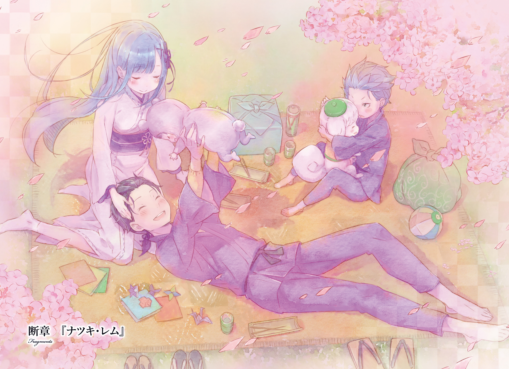
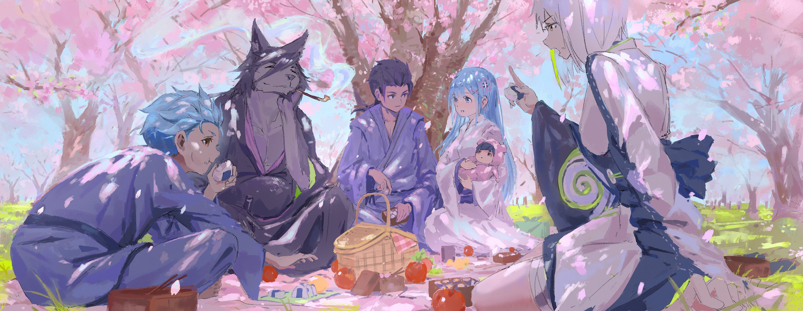

Удача Духа Сэцубуна

『フォーチュン・セツブンホロゥ』

Давайте обойдёмся без лишних вступлений. …Сэцубун снова наступил в этом году.

Между прочим, это самый ужасный день в году для Нацуки Ригеля, короля Сэцубуна. В городе Банан, Втором Городе Карараги, этот странный праздник уже стал частью местной культуры.

…Бросайся бобами, прогоняя Они, и ешь огромные суши-роллы, глядя в направлении удачи. Именно отсюда пришла и идея Хиираги Иваси

Кто-то даже сказал, что ему трудно представить Карараги без…Сэцубуна.

Ригель: Интересно, что они заставят меня делать в этом году?

На обратном пути из школы, зажав ладони за головой, шёл Нацуки Ригель, удручённо предвкушая свои мучения.

Обычно он, как Король, одевает штаны Они и носится от детей, закидывающих его бобами, но это при обычных обстоятельствах.

С каждым годом, благодаря Нацуки Субару, отцу Ригеля, Сэцубун становится извращённее, всё дальше и дальше отходя от обычного метания бобов.

Сначала это было поедание Эхо-Маки, во время которого нужно было смотреть по направлению удачи.

После этого — Хиираги Иваси, заключающийся в том, чтобы насадить жареную голову рыбы на ветку и выложить это у порога в свой дом.

Как лидер Комитета Культурного Развития Банана, Субару имел огромный вес в принятии решений, из-за чего этот праздник всё обрастал новыми безумными идеями. Что ещё хуже, люди коверкали эти события, как хотели, особенно когда рассказывали о них своим друзьям или родственникам, из-за чего получалось какое-то подобие на игру «сломанный телефон».

В итоге, Сэцубун перетерпел изменения, и в Ригеля теперь швырялись не только бобами, но и рыбьими головами с Эхо-Маки.

Ригель: Никто не понимает, в чём вообще смысл Сэцубуна! Тем более, эта трата еды такая безрассудная! Ладно бобы, но всё остальное…!

Вспоминая прошлые Сэцубуны, Ригель недовольно сжал зубы. Как уже говорилось ранее, он очень не любил этот праздник.

Каждый раз ему приходилось принимать эти удары, хоть он и не собирался становиться живой мишенью.

Какими бы жестокими не были эти мероприятия, главное — то, что начал всё это сам Нацуки Субару. Ригеля крайне раздражало, как его отец пытался адаптировать Сэцубун под что-то ещё. Позволить детям делать то, что им заблагорассудится — было просто отвратительной идеей… А ведь когда-то этот праздник был создан, чтобы сплотить сердца людей.

…Хоть Ригель и ненавидел Сэцубун всем сердцем, из-за своего трудолюбия, он каждый раз добивался успеха его в проведении.

Отходя от темы разговора, смысл в том, что накануне Сэцубуна семьи Банана запасаются бобами, а их дети, не понимая значения праздника, выносят их из дома, дабы побросаться в Ригеля.

И даже сейчас, возвращаясь из школы, Ригель наткнулся на детей, готовящих свои бобы.

Ригель: …Вооп, о, ооп.

Количество, размер, скорость бобов… Всё это мальчик уже видел насквозь, из-за чего он с лёгкостью и непринуждённостью уклонился ото всех летящих в него фасолин.

Если бы в него швырялись всего одной или двумя штуками, волноваться было бы не о чем.

Однако на этот раз у каждого из детей была целая горсть из 21-30 бобов, что было для Ригеля тяжёлым испытанием.

Тем не менее, он увернулся, по крайней мере, от 100 бобов, даже не видя их.

???: Не может быть…

???: “Он даже на них не взглянул…

???: У-у него что… Глаза на спине?

Ригель обернулся в сторону их ошеломлённых лиц и, пожав плечами, сказал…

Ригель: Слабовато, сынки, попробуйте ещё раз. Как вы думаете, сколько раз я обманывал смерть за эти годы?

…Сказал Ригель с двоякой улыбкой на лице.

В этот момент дети задрожали, завизжали, словно проклиная себя за то, что они связались с самим Королём Сэцубуна, и разбежались в разные стороны.

???: Ик! Он убьёт нас!

???: Господи, его глаза!

???: Король Сэцубуна — бессердечный демон!

Ригель: Хватит комментировать мои глаза! И ещё, вы забыли, что вам говорили родители? Используйте только нужное количество бобов. Я теперь их в вас так швырну…

Дети, услышавшие его угрозы, чуть ли не плача, убежали, а он сам лишь удручённо вздохнул, глядя себе под ноги.

Каждая непонятка, связанная с Сэцубуном, распространяется быстрее ветра, и, таким ходом, ему вскоре не будет покоя ни на улице, ни на рынке, ни на пути домой из школы.

Снова отвлекаясь от темы, Ригель где-то слышал, что на момент Сэцубуна даже появлялась новая профессия: сборщик бобов. Как минимум, так сказал ему Клейн. Ещё он добавил, что им прилично платили, и, в принципе, такая работа в дни, когда все разбрасывались бобами на улице, была крайне востребована.

В целом, эти события сильно обострили чувства мальчика, а именно реакцию и силу.

В противном случае, он попросту не смог бы гулять со своей милой сестрёнкой по имени Спика. Пожалуй, её безопасность во время их прогулок, было единственным плюсом Фестиваля метания бобов.

Ригель: Тем не менее, теперь ничто, связанное с бобами, мне уже не может понравиться, хах.

???: …Как вижу, ты снова говоришь странные вещи, глядя куда-то вдаль. Ты прямо как Су-сан.

Ригель: А?

Ригель, невнятно бормочущий что-то с бобом в руке, приподнял свою бровь, услышав этот голос.

Он уже слышал его до этого. Карарагский акцент и низкий, даже немного остроумный тон… Наконец, поняв хозяина этого голоса, мальчик с широкой улыбкой развернулся в его сторону и…

Ригель: Дядя Халибель!

Халибель: Ага, рад видеть, что ты полон энергии, Ригель.

Сказав это, высокий мужчина в кимоно с собачьей… нет, с волчьей мордой погладил мальчика по голове, своей большой лапой.

Этот получеловек, принадлежащий к почти вымершей расе зверолюдов, ловко всунул золотое кисеру в свой рот и широко улыбнулся, прищурив свои узкие глаза.

Халибель был другом его мамы и папы, так что для самого мальчика он стал почти родственником.

Халибель: Дети в последнее время так быстро растут… Отведёшь взгляд, а вы уже такие взрослые… Я подумываю, что бы ты меня сменил, если Рем-чан, конечно, разрешит.

Ригель: Разве я тебе не говорил? Мне надо найти надёжную работу и помогать маме и Спике. Я не могу также бесцельно расхаживать по улицам как ты, дядя.

Халибель: Хах, а ты довольно жесток. Чтобы так легко меня переубедить… Твои слова, и правда, слишком тяжелы для меня.

Халибель дико расхохотался, в то время, как на лице Ригеля появилась шаловливая улыбка, соответствующая его возрасту.

Да, всё-таки Ригелю приходилось вести себя зрело лишь, когда он сталкивался с трудностями, пусть это и было почти всегда.

Но всё же у всех людей должны быть время от времени такие же шаловливые выражения лица.

Ригель: Видимо, это единственное спокойствие, которое я могу получить от своих родителей, с учётом возложенных ими на меня обязанностей.

Халибель: Ты слишком глубоко закапываешься. Для ребёнка так звучать — совсем не круто.

Ригель: Да какая разница?! В любом случае, где ты был, дядя? Ты обещал потренировать меня, но, тебя не было так долго, что я уже подумал, что ты умер где-то на улицах.

Халибель: Хаха, ты меня подловил! Если я умру, то это будет серьёзной проблемой для всей страны и, в особенности, для моего рода. На мне лежит слишком большая ответственность, чтобы так нелепо умереть.

Ригель: Да. И помимо всего, ты мой мастер.

Халибель: Ага. Это точно моя самая большая ответственность.

Услышав что-то умное из уст хохочущего Халибеля, Ригель тоже заулыбался.

Ему нравился Халибель, в основном, из-за своей общительности и вот такой близости.

Тем не менее, у него была репутация безответственного человека, выражающаяся в его привычках, форме жизни и странном прозвище «Вечный плейбой». Однако он был мастером своего дела, и все жители любили его… Настолько, что Ригель не мог не порадоваться за него.

Хотя мальчик даже не знал, в чём заключалась работа Халибеля.

Ригель: Но ты всё же сказал мне, что ты шиноби, защищающий страну днём и ночью. И ещё — то, что ты единственный представитель вымершей расы волколюдей… Хотя с последним, думаю, ты преувеличиваешь.

Халибель: Что ж, у тебя, в любом случае, не было выбора кроме, как отбросить свою детскую невинность, чтобы жить дальше… Такова уж твоя жизненная неопределённость.

Халибель выпустил в небо облачко дыма из своего золотого Кисеру и криво улыбнулся мальчишке.

Халибель: И это, ты практиковал Клонирования, которой я тебя научил? Всё в порядке, если тебе это надоело.

Ригель: Конечно же практиковал. Почему я должен был устать от этого? Можно я покажу её тебе? Хотя мне и сделать это не на чем, разве что на этом Иваси.

Халибель: Я вижу эти рыбьи головы время от времени. Су-сан явно как-то в этом замешан.

Брошенная ему в спину Иваси была на удивление красивой, из-за чего он прихватил её с собой, дабы показать своей сестре. Когда Ригель высунул рыбью голову из сумки, Халибель только одобрительно ему покивал.

Этот зверолюд уже давно дружил с Субару, так что для него не составило труда быстро догадаться о сущности проблемы.

Халибель: Он работает в Комитете Культурного Развития Банана, верно? Я немного слышал о нём в других городах. Су-сан стал довольно известным в Карараги. Я горжусь им.

Ригель: Хехе, всё-таки, каким бы мой отец не был, мне приятно слышать, когда его хвалят… Только это, не говори ему об этом, хорошо?

Халибель: Как же с детьми всё тяжело.

На лице Халибеля, засунувшего руку в своё кимоно, появилась лёгкая кривоватая улыбка. Спасённый его понимающим отношением Ригель зашагал в перёд со словами «О да».

Ригель: Раз ты появился здесь — то ты задержишься ненадолго в городе, так ведь?

Халибель: Да, конечно. Повстречаю сейчас парочку людей и ближе к ночи к вам зайду. Передашь Су-сану и Рем-чан от меня «привет».

Ригель: Дядя.

Халибель: Хм?

Ригель: А что насчёт Спики? Для неё ничего?

В ответ на такое откровенное заявление лицо ошеломлённого Халибеля напряглось, и он сказал…

Халибель: О-ох, верно. Передай Спике-чан, чтобы она оставалось такой же милой и ждала меня.

Ригель: Ага, понял, я ей передам! О, но я не знаю… Спика уже и так милая, как ангел. Если она сознательно постарается стать ещё милее и ждать, то её уровень привлекательности может выйти на межвселенный уровень.

Халибель: Эта часть тебя явно показывает, насколько же ты сын Рем-чан…

Ригель немного взволновался и покраснел, представляя ожидающую его дома Спику. Халибель, запечатлев такую сцену, только недоумённо почесал свою щёку.

Ригель: Ааах! Я это больше не выдержу! Я должен как можно скорее вернуться домой и увидеть Спику! Дядя! Увидимся вечером! Не забудь прихватить подарок для Спики!

Халибель: Ох, хорошо, я понял. Я найду что-нибудь и принесу к вам домой.

Ригель на прощание помахал ему своей ручонкой, как бы говоря «На этом моя часть работы сделана», и быстро помчался по улицам города.

Смотря на удаляющуюся маленькую фигуру, Халибель закурил своё кисеру и сказал…

Халибель: Ты был сестролюбом еще до того, как твоя сестра родилась, но теперь всё гораздо хуже, Ригель, хах.

…Пробормотал он, криво улыбаясь.

Не слыша бормотания Халибеля…хотя, впрочем, Ригель не поступил бы иначе, узнав, что сказал его наставник…он стремительно пронёсся по улицам, мчась домой.

Ригель: Спика, Спика, миленькая маленькая Спика.

Возбуждённо мямля себе это под нос, он, казалось, бежал быстрее ветра.

"Просто представив себе мою милую младшую сестрёнку, я чувствую просто безумный прилив энергии. Как бы мне это назвать? Вечный Спика-двигатель?

Мир просто обязан признать потенциал Спики. Если бы весь мир узнал о Спике, то все войны бы прекратились".

Одержимый такими фантазиями мальчик успевал уворачиваться от летящих в него бобов, махать соседям, кушающим Эхо-Маки, и укладывать в карман рыбью голову, представленную Халибелю. Наконец, он вернулся домой.

Чувствуя, что он уже не в силах терпеть, Ригель резко открыл входную дверь и ворвался в прихожую комнату.

Ригель: Ага, я домаааааааа! Спика, Ни-Ни дома! Сейчас я помою руки, прополощу горло и приду к тебе, так что оставайся милой девочкой и жди меня!

Ригель еле сдерживал эту широкую улыбку в порывах своих желаний обнять Спику прямо сейчас.

Мытьё рук и полоскание горла — была ответственность, которой его учили с детства. Ему сказали, что это поможет ему не заболеть, или что-то в этом духе. Тем не менее, Ригель и до этого ни разу не болел, так что ему тяжело было определиться в практичности этих процедур.

Мальчик предполагал, что это было из-за крови мамы. Тем не менее, без мытых рук и прочищенного горла он не сможет прикоснуться к Спике и…

???: А дома ты совсем другая, нежели на улице.

Голос встретивший его перед ванной комнатой, как ни странно, не принадлежал ни его маме, ни его сестре. Это была женщина, не являющаяся членом их семьи.

Ригель сглотнул и, отказавшись от похода в ванную, осторожно направился в гостиную. Он медленно положил руки на сёдзи двойной двери и, раскрыв её, увидел…

Спика: О! Ни-ни!

???: Добро пожаловать домой. Ты что-то поздно сегодня.

Ригель смотрел на эту сцену с изумлением.

Котацу ставили посреди комнаты, обставленной матами, что было просто необходимо в зимние дни для семьи Нацуки.

Спрятав ноги в котацу, в комнате сидела женщина, убаюкивающая милого ангелочка на своих руках. Она тряхнула своими молочно-белыми волосами с неровными концами и с украдкой посмотрела на мальчика своими миндалевыми глазами.

???: Можешь не пялиться на меня только потому, что я настолько милая?

Ригель: …Я… В смысле, неважно насколько красивая девушка сидит передо мной, у меня есть сестра.

???: Слушай, твоя любовь к сестре — это очень прекрасно и весело, но люди будут думать, что ты идиот, если ты продолжишь так же говорить. Поосторожней в выражениях.

В этот момент неописуемые и смешанные чувства от вида этой девушки в белом кимоно вернулись в его голову.

Она выглядела очень ухоженно, но от этого не менее пугающе.

Хотя в её случае, правильно было бы сказать «красиво» вместо «ухоженно». Она не была красива, как какая-та расфуфыренная куколка, нет… Скорее, её красота была дана ей природой, как животным даны инстинкты.

Красота с оттенками грубости… На самом деле, в ней больше ничего не было, но этого хватало, чтобы даже не увлекающийся женщинами (?) Ригель впечатлился.

Хотя, это бы произошло только, если бы он видел её впервые, но эта их встреча была отнюдь не таковой.

Ригель: Тия! Что ты здесь делаешь!?

Тия: А? Очевидно же, у моего прихода нет причин. Если я хочу куда-то прийти, я прихожу туда.. Никто не в праве командовать тем, куда и когда я хожу. О, ты такая милая, Спика… Я действительно хочу убить тебя.

Ригель: Ты так научишь её плохим словам, остановись!

Ласково улыбаясь Спике, женщина… Тия произнесла эти кровожадные слова.

Ригель подумал, что она была серьёзна в своих изречениях, так что он, запаниковав, забрал Спику себе и, наконец, убедившись в её безопасности, нежно погладил её по голове.

Ригель: Всё хорошо, Спика? Она никак тебе не навредила, так ведь? Прости, что так поздно пришёл домой… Какого чёрта здесь нет Рем!?

Тия: Рем оставила Спику на меня и ушла за покупками. Я тоже хотела сходить с ней, но это… Как его, котацу… Кажется, я не могу из него выбраться. Чтобы так очаровать меня… Люди порой, и правда, могут удивить.

Поначалу женщина надулась из-за того, что у неё отобрали Спику, но она тут же успокоилась из-з котацу. Она выглядела счастливой, широко улыбаясь на верхней части стола.

На виде ей было 20 лет, но то, как она себя вела, совершенно не шло к этой цифре. Эта красавица была крайне дружелюбной… Но, тем не менее, не той женщиной, с которой Ригель смог поладить.

..Хотя она ему особо и не нравилась.

Ригель: К тому, же она такая бездельница, я просто в шоке.

Спика: Ни-ни, Не-не. (Nii Nii — ребёнок про старшего брата; Nee Nee — ребёнок про старшую сестру. В японской транскрипции звучат именно так)

Ригель: Да, ты права, Спика. Не знаю, как я отношусь к тому, что Тия — Не-Не, но мы, и правда, не должны драться. Прости.

Спика, сжав и разжав свои маленькие ручки, легонько толкнула Ригеля в щёку. Чувствуя эмоциональный настрой своей сестры, Ригель решил отказаться от противостояния с Тией.

Наблюдая за этой сценой, Тия воспользовалась ситуацией и сказала: «Правильно, правильно».

Тия: Следи за своими действиями. Ты навредил мне. Извинись. Поскольку ты причинил мне боль, я хочу от тебя конфет.

Ригель: Не увлекайся особо. Хотя мама уже вроде оставила где-то конфеты. Да где же они?

Тия: «Где» говоришь? В моём животе.

Ригель: …Тогда придётся подождать до ужина.

У Ригеля просто не было слов, чтобы описать такое беспардонное поведение Тии в чужом доме.

Тия ещё один друг Субару и Рем, и он даже сам её знает уже несколько лет. Как говорят пап с мамой, она, скорее, член семьи, а не друг.

Но, по правде говоря, у Ригеля были большие сомнения по этому поводу. И всё потому что…

Ригель: Семьи живут вместе. Если ты только иногда вот так вот появляешься, не значит ли это, что ты просто какой-то далёкий родственник или друг, нет?

Тия: Что такое? Ты дуешься из-за того, что я так редко провожу с тобой время? Ты всё-таки, и правда, поход на Су, но у тебя есть и милые черты. Я хочу убить тебя.

Ригель: Не говори такие опасные вещи!

Ему также не нравилось, что она из раза в раз повторяла «Я хочу убить тебя», будто это было для неё чем-то повседневным и жизненно необходимым. То, как она себя вела, как она говорила… Многие вещи портили её образ.

Если бы она вела себя иначе, то выглядела бы очень…

Тия: …? Ты случаем не подрос, пока меня не было?

Ригель: *глоток*…

Тия вылезла из котацу и мгновенно оказалась перед Ригелем. От неё очень хорошо пахло. Девушка небрежно потянула руку и коснулась коротких голубых волос мальчика.

Её тонкие пальцы гладили шелковистые волосы Ригеля, из-за чего он не мог пошевелиться. Тем временем, Тия, видимо, довольная таким быстрым ростом мальчика…

Тия: Дети так быстро растут. Ещё недавно ты был пускающим слюни коротышкой, а теперь ты просто коротышка.

Ригель: …Ааа, опять эта ерунда. Люди постоянно рассказывают мне, что вы с Халибелем были при моём рождении.

Тия: Это правда. Я была там, и Халибель тоже. Хотя, я, возможно, пропустила самую важную часть.

Ригель: ……

Тут Тия прищурилась и устремила свой взгляд куда-то далеко. Казалось, она глядела в своё прошлое, что очень не нравилось Ригелю.

Ригель не мог взглянуть туда же. Ригель не любил даже думать об этом.

Ригель: Это звучит слишком бредово. Кто вообще поверит, что Банан чуть не был уничтожен при моём рождении?

Тия: О, это правда. Люди готовились перерисовывать карты города. Между прочим, я так сильно хотела тебя тогда убить.

Ригель: Звучит так, будто ты и хотела уничтожить город.

Ригель пожал плечами, глядя на Тию, не правильно подбирающую свои слова. Увидев это, девушка широко распахнула свои глаза, будто она была застигнута врасплох, и сказала…

Тия: Твои слова побуждают во мне садизм. Господи, только бы я могла смотреть ещё больше на то, как ты волнуешься, я была бы счастлива. Я хочу убить тебя.

Ригель: Я ненавижу, когда ты так говоришь.

Тия: …Но несмотря на то, что ты меня, как ты сказал, ненавидишь, ты всё это время носишь мой подарок.

Расплывшись в улыбке, Тия посмотрела на его левое запястье. От этого, у Ригеля перехватило дыхание, и он слегка смутился. На его запястье был браслет, сделанный из белой нити.

Это был подарок, который она ему вручила много лет назад, когда они встретились в первый раз. Она тогда что-то ему сказала…

Тия: Ты помнишь? Ты помнишь, что я сказала тебе, когда вручила его?

Ригель: Ид..! Н-ну, эээм… У-у меня есть Спика, так что…

Тия: Снова об этом? Ты так похож на Су-сана в этом плане.

В ответ на дразнения Ригель больно сжал свои зубы. Спика, лежащая в его руках, невинно бегала глазками межу Ни-ни и Не-не.

Если я не вспомню, что тогда произошло, я потеряю свою честь. Спика ни за что не должна видеть меня таким жалким.

Ригель принял решение, кинул в Тию пронзительный взгляд и…

Ригель: Что ты любишь…

Тия: Если что-нибудь когда-нибудь произойдёт, я сразу же примчусь…

Они выдали свои ответы одновременно, из-за чего слова перемешались в кучу, и никто ничего не понял.

Глаза Тии расширились от изумления, но после её выражение лица стало слегка злобным, а после и вовсе свирепым.

Тия: Эй, что ты только что сказал? Эй, Ригель, что ты только что сказал?

Ригель: Заткнись! Всё не так! Ничего не произошло! Я просто растерялся! Это папа меня подставил!

Тия: Ахахаха, всё в порядке. Я люблю тебя. Но я хочу убить тебя.

Ригель: Да баааляяяяя…!!!

Со Спикой на руках и раскрасневшимся лицом Ригель развернулся и попытался убежать от стоящей напротив Тии. Однако девушка мгновенно прервала его, оказавшись перед его носом, и принялась тыкать пальцем в его красную щеку.

Спика: Уву, Ни-Ни. Не-Не.

Спика была единственной, кто беззаботно и радостно наблюдал за происходящим.

И эта сценка не закончилась даже тогда, когда в дом с покупками вернулась Рем.

???: Так, вот это для Халибеля-самы, а это для Тии в честь встречи!

???: …Урааа!

Ночью в гостиной Котацу под одним котацу все произнесли общий тост.

Тем не менее, в кружках не было алкоголя, а только фруктовый сок или чай. Из-за определённых стечений обстоятельств, никто за столом не пил спиртное. Халибель, всё-таки спрятавший одну бутылку у них под ванной, не был исключением.

Субару: Действительно, случайности не случайны. Кто бы мог подумать, что Халибель и Тия навестят нас в один день.

Рем: Это, и правда, было неожиданно. Но, благодаря этому, мы все с вами вместе за одним столом. Рем настолько счастлива, что даже немного волнуется, хорошо ли она всё приготовила.

Субару: О, так ты не смогла сконцентрироваться на готовке из-за волнения, да?

Рем: Ну, Рем не привыкла готовить кому-то кроме семьи…

Увидев мечтательную и взволнованную улыбку Рем, Субару почесал затылок и слегка покраснел. На самом деле, смотреть на такое поведение своих родителей было не очень-то приятно, но Ригель уже успел привыкнуть к такому за столько лет.

Ригель: Дядя, подай мне свою тарелку. Я наложу тебе.

Халибель: Оооох, как же умно. Можешь наложить побольше мяса? И не клади много овощей.

Ригель: Ай-яй. Но это плохо для здоровья, если ты не ешь овощи, ты знаешь?

Принимая заказ Халибеля, Ригель умело раскладывал еду по тарелкам с помощью палочек.

Сегодняшней ночью они ели очень много горячих блюд и гарниров, приготовленных Рем, решившей проявить в этом поприще своё мастерство.

Субару: Будет много людей, и мы будем сидеть под котацу. Нам нужен хот-пот (китайский способ употребления пищи в одном котелке, в который люди сами добавляют нужные им ингредиенты).

Рем: Да, это звучит замечательно! Рем за!

Именно это сказали его родители перед тем, как приготовить хот-пот. Он не был против, так что просто промолчал. Тем более, он любил хот-пот. Ещё ему нравилось изобилие овощей, хотя он был далеко не их фанатом.

Тия: Эй, Ригель. А ты не слишком много овощей мне накладываешь? Как и Хал, я люблю много мяса. Хотя я и просила тебя наложить мне овощи, не столько же.

Ригель: О чём ты говоришь? Ешь свои овощи. Ты так пожиреешь от одного мяса. Мясо, овощи, мясо, овощи, мясо, овощи, мясо, овощи. Иди мясным ритмом.

Тия: Да я даже мясо своё не могу съесть.

Тие подали тонны овощей, из-за чего она недовольно прокричала. Тем не менее, судя по тому, что она не клала их обратно в котелок, урок был усвоен, а это было самое главное.

Удовлетворённый её блюдом Ригель заполнил одну тарелку, вторую, третью…

Субару: Как же прекрасно, что у нас есть человек, готовый взять на себя всю ответственность Просто смотря на него, мы становимся счастливее… А он становится счастливее, работая кастрюлей… Это беспроигрышная ситуация.

Ригель: Не смеши меня. Я тоже хочу хот-пот. Не буду же я делать всё один…

Рем: Рем это не нравится, так что… Так, открой-ка рот пошире, Ригель.

Рем направила свои палочки на Ригеля, который, пренебрегая собственным желудком, продолжал раскладывать еду по тарелкам.

Это было немного смущающе, но все здесь были его друзьями, так что он с удовольствием принял кормление Рем.

Субару: Какого чёрта ты заставляешь Рем таким заниматься? Так, я тоже тебя покормлю.

Халибель: О, Ригель, ты, и правда, слишком мало ешь, я тоже тебя покормлю.

Тия: О, тогда я тоже. На, ешь. Эй, давай, ешь это!

Ригель: Ом ном! Я не смогу всё это съесть!

Когда Ригель принял еду Рем, взрослые начали набивать его рот ещё большим количеством пищи. Если Халибель с Субару просто дурачились и давали ему всё правильно, то Тия просто пихала в него все овощи со своей тарелки, из-за того, что они ей не нравились.

Ригель: Хватит безобразничать! Вы все взрослые люди, так что не позорьтесь! Дурачиться рядом с горячей кастрюлей… Уважайте хот-пот больше! Трепещите с ужасом перед величием хот-пота!

Субару: Вау, а ты неплохо справляешься с ролью главного за хот-пот. Как твой отец, я не могу не гордиться тобой за такое.

Ригель: Заткнись! Твои похвалы только всё портят, папа!

Ригель громко взревел и принялся бранить взрослых, начиная с Субару, но они лишь просмеялись в ответ на это, что немного разозлило мальчика.

На стороне Ригеля действительно не было никого кроме Спики.

Ригель: И даже Спику у меня забрала Тия.

Тия: Ааа, ладно, ладно, не грусти ты так. Ты же и так её брат, ну, типо тот, кто ей нравится. Я с ней, между прочим, всего второй раз вижусь.

Рем: Она права, Ригель. Обычно ты так долго держишь Спику у себя, что становишься упрямым, так что позволь Тие-саме взять её на сегодня. Да и в принципе, почему бы тебе не погладить Халибеля-саму вместо неё?

Халибель: Я настолько низко в вашей иерархии?

Судя по словам Рем, значимость Халибеля была намного ниже, чем у той же Тии.

Общительная, красивая и строгая мама. Такой была Рем, но она, тем не менее, не так часто проявляла к кому-то такое дружелюбие, как к Тие.

Субару: Эй, не расстраивайся, Ригель. Ты разве умрёшь, если не увидишь Спику? Потерпи немного. Не забывай о Тие.

Ригель: …Она не член нашей семьи.

Субару: Хммм?

Ригель: Разве семьи не должны жить вместе? Она приезжает к нам редко, так что странно, что вы к ней так относитесь.

Ригель прошептал то, что он уже сказал до этого Тие.

Именно тогда Ригелю показалось, что он нагрубил ей, из-за чего ему стало мерзко. Тем не менее, Субару взъерошил его голубые волосы и сказал…

Субару: Слушай, а ты прав… Сказал бы я, если бы не одна поправочка. Ей, по правде, не обязательно с нами жить, чтобы быть членом нашей семьи. У Тии свои обстоятельства. Таким образом, он может быть у нас только время от времени. Но она всегда приходит, если может.

Ригель: …

Субару: Ну, а пока порадуйся тем, что такая красотка, в принципе, к нам приходит. Ну разве ты не везунчик?

Ригель: О чём ты говоришь?!

Тон его голоса резко изменился. Как только всё снова перешло к шуткам, Ригель не сдержался и закричал, смахнув руку отца со своей головы.

Ригель: Ты серьёзно считаешь, что я везунчик? Я, как минимум, буду снова страдать в завтрашний Сэцубун, ты и сам знаешь. Я сейчас в реальной депрессии… Я не смогу уснуть без Спики!

Субару: Чего ты добиваешься? Право спать со Спикой передаётся в порядке очереди, и сегодня мой черёд. И я отдам её Тие, так что даже не надейся на это.

Ригель: Твою мааааать!!!

Ригель теми словами попытался надавить на жалость, но Субару, знающий его много лет, быстро раскусил такой поверхностный план.

В то время как сын с отцом безостановочно беседовали межд другом, как это обычно и бывало…

Тия: Хм? Что такое? Завтра вам что-то нужно от Ригеля или что-то в этом роде?

Тия, чей палец укусила услышавшая шум Спика, вопросительно наклонила голову. Ригель не знал, что ей ответить, но Рем лишь спокойно кивнула, сказав с улыбкой «понятно».

Рем: Завтра Сэцубун, который, на самом деле, и предложил проводить Субару. И Ригель будет представителем Они: он оденет штаны Они и будет бегать по городу, пока в него будут кидать бобами.

Ригель: Что за ужасное объяснение!

Тия: Ухты, ничего себе, а это звучит довольно весело…

Ригель: Да откуда у вас всех такой энтузиазм?!

Тия выслушала грубое объяснение Рем, и её глаза засияли. Хотя вы можете предположить, что она сказала что-то опасное, на самом деле, ей просто очень понравилась часть с бобами. Садизм брал над ней верх, и она возбуждалась от одной только мысли о том, как досадить Ригелю. Короче говоря, Сэцубун…

Тия: …Праздник для меня.

Ригель: Именно поэтому я и не хотел, что бы ты спрашивала об этом! Кто вообще начал говорить о Сэцубуне!? Это был я!? Это был я! Извиняюсь!

Субару: У тебя так много дел…

Тия мечтательными глазами глядела на Ригеля, зажавшего голову руками, из-за чего Субару кивнул со словами «хорошо» и продолжил с…

Субару: Эй, послушай, сынок. Я правда понимаю, что ты чувствуешь. Тебе и правда приходится нелегко во время Сэцубуна, и мне, как любящему родителю, тяжело на это смотреть.

Ригель: Чомп! На вкус, как ложь!

Субару: Надо лизать, когда проверяешь на правду! (хз как это перевести, пусть это будет отсылкой на Бруно Буччеллати). Не кусай!

На руке Субару остался след от укуса, и он в замешательстве взглянул на своего недоверчивого сына.

Субару: Отчего ты вырос таким монстром…

Ригель: Плохие родители! И плохое обращение со стороны жителей города!

Субару: Я, между прочим, тоже одеваюсь в костюм Они во время фестиваля, так что ты не единственный, в кого кидают бобами!

Тия: Погоди, я и в Су могу бросаться? Господи, я столько не вынесу…

Рем: Тия-сама, Тия-сама, мясо уже готово. Скажите «ааа»…

Тия: Аааа.

Не сдерживающая свой садизм Тия тут же набросилась на Субару, но его замечательная жена успел прервать её ложкой с горячей едой.

Субару: В любом случае, не перебивай меня сейчас. С обираюсь рассказать тебе самую важную часть. Это ужасно, что ты столько страдаешь во время Сэцубуна. Так что в этот раз я придумал, как это исправить.

Ригель: Думаю, ты снова придумал какой-то стрёмный фестиваль взамен Сэцубуна… Субару: Господи, как же сильно ты мне не доверяешь! Но всё-таки в этот раз, я думаю, что тебе всё понравится, и ты согласишься на это!

Сказав это, Субару выбрался из котацу и принялся рыскать в своей рабочей сумке, которая стояла в углу комнаты. Затем он начал вынимать из него какую-ту круглую ткань.

Субару: Хал-сан, возьмись за тот конец! Мы развернём его!

Халибель: О, это что, знамя? Это оно?

Приняв просьбу Субару, Халибель встал из-за стола и взялся за один из концов ткани. Когда они развернули её одним махом, перед его глазами предстала надпись, написанная пером для письма.

Халибель: «Дух Сэцубуна»…?

Субару: Единственная причина, по которой здесь написано «дух», чтобы дети могли это прочитать. По началу, я хотел назвать его «Призрак Сэцубуна». Это четвёртый этап Сэцубуна, впечатлены, не так ли?

Ригель: У меня аж мурашки по коже.

Слово «призрак» не очень порадовало мальчика. Это не казалось ему чем-то знакомым, но Субару вроде что-то об этом говорил…

Ригель: Призраки — Духи, так ведь? Мне не нравится, как это звучит.

Субару: Я понял. Но, понимаешь, здесь немного не те призраки, о которых ты думаешь. В связи с этим Они в Сэцубуне должны принять другую роль…

Они в Сэцубуне, на самом деле, никак не были связаны с настоящими Они. По словам Субару, на его родине это было устойчивым выражением, обозначавшим неудачи и горе, так что привлечение к этому фестивалю настоящих Они было лишь плодом недопонимания.

"Честно говоря, как потомок Они, я действительно чувствую, что отношение к ним, как к бедствию, просто неприемлемо. Тем не менее, эта мысль уже так глубоко засела в умах жителей города, что мы вряд ли сможем чего-то добиться».

Субару: Больше не будет преследований злодеев или чего-то подобного рода. Теперь Они — главные герои Сэцубуна! Сейчас всё именно так, поэтому расслабься.

Ригель: Из-за того, что я когда-то расслабился, теперь каждый Сэцубун обходится мне всё больнее и больнее.

Субару: Тебе пришлось жить в тяжёлые времена, но у меня для есть хорошие новости. Событие «Призрак Сэцубуна» спасёт вас.

Ригель: О, правда?

Увидев сомневающегося Ригеля, Халибель тихо закурил своё кисеру и сказал…

Халибель: Ну же, дай ему закончить. Единственное, что я знаю о Сэцубуне, я слышал от прохожих, а они слышали это от других прохожих, но насколько это, в итоге, далеко от «Духа Сэцубуна»?

Субару: Об этом… На этот раз им будет разрешено замаскироваться под Они.

Ригель: Что!?

Субару повысил голос, будто говоря: «У меня есть объявление», из-за чего глаза Ригеля расширились.

Маскировка — то «слово», что вызвало у него удивление. Всё это время Ригелю разрешалось только носить жёлтые брюки Они с вертикальными полосами, красное стёганое пальто без рукавов, а также чрезвычайно смелый ярко-зелёный парик.

Субару: Надев одежду, которая отличается от нашей, призрак Сэцубуна сможет прожить этот праздник, не будучи найденными… Я именно так это придумал.

Ригель: Так ты снова собираешься выставить Они злодеями.

Субару: Как и я сказал, я постараюсь всё изменить в этот раз. В общем, я приготовил кое-что по типу конкурсов костюма Сэцубуна. Я косвенно сообщил об этом жителям, так что дети и взрослые, мужчины и женщины… Все завтра будут в своих костюмах, и туда проскользнёт настоящий Они, будто вы будете играть в прятки.

Ригель: Звучит так, будто этот фестиваль стал ещё тупее…

Лицо Субару будто напрашивалось на похвалу его идеи, что сильно раздражало Ригеля. Но всё же он задумался.

После этого мальчик, на удивление, подумал о том, что идея его отца была не такой уж плохой. Может, она даже была хорошей. Из-за того, что вид Ригеля очень сильно выделялся на фоне других людей, его всегда быстро находили.

Тем не менее, если он не будет выглядеть, как Они… Если он наденет другой наряд, то, возможно, он сможет мирно провести время со Спикой.

Ригель: Что с тобой произошло, папа? Неужели в тебе, наконец, проснулся отец?

Субару: Хочешь сказать, что всё это время отец внутри меня спал? Между прочим, он расцветает уже целых 2 года.

Ригель: 2 года… Так это тогда, как родилась Спика!

Зубы Субару блеснули, когда он задорно поднял большой палец вверх, и Ригель всё-таки одобрительно кивнул ему

Это происходило редко, очень, очень редко…На самом деле, это был первый раз, когда Ригель согласился со своим отцом насчёт Сэцубуна.

Ригель: Маскировка! Ладно, как-нибудь завтра переживу!

Субару: Вот это настрой! Но всё же, это не будет так легко, Ригель. Подготавливаясь к завтрашнему дню, я разослал всем изображения того, как ты выглядишь. Так что, если ты плохо замаскируешься, Ригелисты быстро найдут и уничтожат тебя.

Ригель: А ты не перебарщиваешь!?

Только он начал думать о нём лучше, как тот его разочаровал.

Тем не менее, с громким цыканием Субару помахал перед сыном пальцем и сказал…

Субару: Не глупи. Это будет неуважительно по отношению к профессиональным метателям бобов, целый год готовивших свои запястья к Сэцубуну. Мы выложимся на полную, и они — тоже. Всё по-спортивному.

Ригель: Заткнись! Что в итоге!? Это всё тот же старый Сэцубун!

Внешность Ригеля сейчас была даже более известной, чем в прошлом году. Мальчик уже погряз в глубоком отчаянии, представляя, как его будут закидывать бобами.

Тем не менее, Ригель…

Рем: …Нет, Ригель. Такого не произойдёт. Доверь это своей маме.

Тем, кто встал и галантно пришёл к нему на помощь, был не кто иной, как Рем. На ней было светло-голубое кимоно и, закатав рукава, она игриво сжала свои кулаки.

Рем: Субару-кун сказал тебе кое-что. Они будут стараться изо всех сил, и мы будем стараться изо всех сил. Вот что произойдёт. Нам нужно только принять это и сделать всё, что в наших силах.

Ригель: Но, мам, что ты предлагаешь? Одно дело — носить костюмы, но я никогда не маскировался. Они с лёгкостью распознают меня, и я умру…

Рем: Ты такой глупый, Ригель. Тебе не надо браться за всё одному.

Ригель: А?

С улыбкой на лице Рем потянула вперёд руку и погладила её голубоволосого сына по щеке.

Рем: Послушай, Ригель. Оставь это мне. Субару-кун… Твой папа долго думал над этой идеей, чтобы угодить тебе. Так вполне естественно, если Рем тоже внесёт свой вклад в этот праздник.

Ригель: Мам…

Из-за этих слов грудь Ригеля начала наливаться чем-то тёплым, он немного подумал и…

Ригель: …Хорошо. Я доверюсь тебе, мама.

Это было уже после того, как Ригель доверился своей маме.

Рем: Что ты думаешь, Ригель? Рем вложила все силы в эту работу.

Сказав это, Рем твёрдо кивнула и вытерла пот со лба. В ответ на это Ригель посмотрел на своё отражение в зеркале, в котором стоял совершенно новый Ригель.

Ригель: Это я (Ригель использует феминитив (あたし, аташи) вместо обычного произношения (オレ, орэ) )…?

В зеркале на него глядела девочка того же возраста, что и Ригель.

У неё было кимоно тёмно-синего цвета индиго и ярко-красное украшение для волос. Её светло-голубые волосы были аккуратно уложены, из-за чего она выглядела, как богатая девушка. У неё действительно был острый взгляд, но длинные ресницы и слегка накрашенные щёки с долью смущения могли поразить любого мужчину.

Она повернулась назад. Рем кивнула.

Она повернулась назад. Халибель изумлённо вздохнул.

Она повернулась назад. Увидев эту девушку, Субару усмехнулся и сказал…

Субару: Назовём её Нацуми Риммель.

Ригель: ЗАТКНИСЬ!! ЗРЯ Я ДОВЕРИЛСЯ МАМЕ!

Ригель просто ненавидел выражение лица Субару, когда тот сдерживал смех, из-за чего он громко топнул ногой. Конечно же, девушка, глядящая на него из зеркал, была, и правда, шикарной трансформацией, что заставляло задуматься об истинном потенциале Рем.

Рем: Рем не видит здесь ничего плохого. Ригель, Рем думает, что у тебя примерно такой же потенциал, как и у Субару-куна… Это просто превосходно.

Субару: Да, это довольно мило.. Я волновался насчёт того, как тебе будет житься с моими глазами, но теперь я понимаю, что их всё-таки можно исправить…

Ригель: Ага, вот так вот сразу! Что ты говорил там о моём будущем!? И в смысле, что у меня с папой такой же потенциал!? Папа тоже собирается переодеться!?

Субару: Нацуми Шварц… Ожидай завтрашнего дня.

Ригелю ничего не оставалось, кроме как уступить уверенному ответу Субару.

Похлопав Ригеля по плечу, узкоглазый Халибель произнёс свои большим ртом…

Халибель: Ты, может, не очень рад, но разве это не хорошо сделано? Я имею в виду, что этот наряд хорошо подойдёт тебе, когда ты подменишь меня…

Ригель: Хватит уже пытаться нанять меня… На самом деле, просто заткнись, дядя. Я обязан это сделать.

Халибель: А ты быстро вникаешь…

Возможно, ему просто нравилось смеяться над собой. Возможно, он просто был одним из тех людей, кто с головой погружался в свою работу. Возможно, он просто привык к этому.

Криво улыбаясь от того, как быстро Ригель выпал из реальности, Халибель почесал затылок, немного подумав, и сказал…

Халибель: Тогда как насчёт того, чтобы я подучил тебя Технике Клонирования завтра? Не знаю, получится ли всё, но я, думаю, можно усовершенствовать твои навыки.

Ригель: Клонирование — это та штука, из-за которой тебя стало 4?

Халибель: Да, да. Я становлюсь четверо большей проблемой, так что это супер сильная способность. Правда, мне приходится волноваться о том, получают ли клоны раны. Если кого-то из них ударят, то я получу в четыре раза больше.

Ригель: Не вижу в этом ничего такого, разве что в меня кинут бобами в 2 раза больше…

Халибель: Вау, у тебя даже голос выше…

«Если это так, то может, действительно, у меня больше шансов выжить, если я буду вести себя, как женщина. Я должен забыть о том, что я Нацуки Ригель, чтобы меня не закидали бобами».

Ригель: Так что я стану Духом Сэцубуна, отбросив тот факт, что я Они.

Халибель: Не думаю, что можно победить свою кровь.

Ригель: Дядя, я не проиграю.

Халибель: Да, тогда хорошо. Иди и сделай всё, что можешь. Мне нравится, как ты стараешься во всём.

Поскольку Ригель был взбудоражен, Халибель захотел погладить его по голове, но он убрал руку, видимо побоявшись растрепать его уложенную причёску.

То, как он заботился о его волосах, заставляло сердце мальчика биться чаще (?!).

Ригель: Плохо. Мои сомнения в том, что это я, начинают угасать.

Субару: То, как легко ты поддаёшься чужому влиянию — и твоя сильная и слабая сторона.

Ригель решил даже не думать о повлиявшем на него человек и просто высунул язык.

Тем не менее, если забыть о застенчивости Ригеля, стратегия Нацуми Риммель, ранее Нацуки Ригель, наверняка, будет эффективной. Если и была проблема, то это была…

Тия: …Нет, нет, я умираю. Я умираю… В-вы собираютесь убить меня, какого чёрта, ахахахахаха!

Ригель: Это не смешно! Я тоже пострадаю, ты же знаешь!

Тия: Да ладно, хватит так париться из-за этого. А, мой живот болит, он так болит…

Тия почти безостановочно смеялась с того самого момента, как завершилось преображение Ригеля. Хотя, было бы странно, если бы она никак не отреагировала на это, так что это даже немного радовало Ригеля.

Ригель: …Я действительно выгляжу так плохо?

Рем: Рем может гордиться, что это почти идеально. Но в то же время, когда Рем смотрит на тебя, ей кажется, что она создала настоящего монстра…

Он повернулся к зеркалу и быстр встал в не замудрённую позу. Ему казалось, что он выглядел мило. Несмотря на то, что Рем была довольна результатом, на её лице выступал холодный пот.

Видя краем глаза реакцию своих родителей, Ригель только мысленно рассмеялся. довольствуясь текущим положением дел.

Конечно, на самом деле, ему не понравились все эти переодевания. Тем не менее, он был сильно поражён, насколько же мило он выглядел. Ему казалось, что его родители начнут сдерживаться в своих решениях только тогда, когда их сын попадёт в беду.

Ригель: Ээээй, Спика. Завтра я выложусь на полную!

Спика: Ауууу?

Спика, которая игралась, ползая между ногами всех сидящих по котацу, обернулась в сторону Ригеля. Затем она уставилась на своего совершенно неузнаваемого брата и засунула палец в рот, сказав…

Спика: …Ни-Не?

Этот кризис восприятия заставил её глубоко утонуть в своих детских мыслях.

…Шумный ужин подошёл к концу, а ночь в Городе Банане всё ещё продолжалась.

Завтра Сэцубун. Сегодня ночь перед финальной битвой.

Ригель один из тех людей, кто не может уснуть перед чем-то важным, так что в эту ночь ему особенно не спалось.

«Помимо Сэцубуна ещё и день рождения. Моё сердце так колотится».

Халибель, после ужина выпивший с отцом, уже вернулся в многоквартирный дом. Субару ушёл в Комитет Культурного Развития Банана на последнее совещание перед Сэцубуном, а Рем пошла с ним.

Вероятно, она хотела сказать: «Позаботьтесь завтра о моём сыне, пожалуйста». Она добросовестная и дотошная мать. Из-за этого Ригель был уверен, что его будут защищать многие взрослые.

В следствие того, что они так активно проводили Сэцубун в этот раз, взрослые вместе с Субару, и правда, старались не доставлять Ригелю проблем. Они также подробно обсудили, как сделать так, чтобы никто не раскусил завтрашнюю маскировку Ригеля.

Он уже был готов к худшему сценарию, где на его спину бы тупо прикрепили листочек с надписью «Этот мальчик — Они»

И всё же, его родителей не было дома. Это значит, что сейчас Ригель был главой дома и отвечал за жизнь милого ангелочка по имени Спика.

???: …Не можешь уснуть?

Голос обратился к Субару, когда он сидел на веранде, глядя на далёкую голубую луну.

Этот человек успел присесть рядом с ним ещё до того, как мальчик обернулся. Тёплое плечо коснулось его тела, и он облегчённо вздохнул.

Тия: Я не особо в этом уверена, но разве человеческие дети не должны спать в такое время? У тебя завтра много дел.

Ригель: Знаю, но всё в порядке. В моём случае, лёгкое недосыпание заставит меня нервничать, из-за чего я буду двигаться быстрее.

Тия: Но разве твоя маскировка не будет разрушена из-за мешков под глазами? А, Нацуми Риммель?

Ригелю сказали это в насмешливом тоне, и его щёки неожиданно покраснели.

Его водили за нос и игрались им. Он отвернулся, не желая осознавать это. Однако Тия усмехнулась и ткнула носом в его затылок.

Ригель: Дувааа!

Тия: Расслабься… Мммм, запах тревоги. Ещё запах смятения. Ты такой нечестный и милый. Настолько, что я хочу убить тебя.

Ригель: …Опять об этом? Если ты так сильно хочешь убить меня, то просто сделай это.

Ригель вздохнул, как бы говоря: «Ты всё равно не сможешь», из-за чего глаза Тии широко раскрылись.

После этого она прикусила свою губу, глядя куда-то вниз, и сказала.

Тия: Ты… прав. Я хочу тебя убить, но я не могу.

Затем её губы расслабились, и с улыбкой она произнесла…

Тия: Всё-таки, я люблю тебя.

Ригель: …

Это были слова, которые Тия произнесла при их первой встрече. Сейчас это действительно тронуло его сердце.

Это, наверно, был первый раз, когда кто-то помимо родителей сказал ему: «Я люблю тебя». Тем более, это было сказано такой красивой девушкой. Он был бы психом, если бы не думал об этом.

Ригель: …

Ригель почесал браслет на своём запястье, пытаясь отвлечься от своих мыслей. Браслет из белых нитей — ещё один подарок, врученный ему Тией.

Она сказал, что примчит в ту же секунду, как с ним случится опасность.

Тия: Ты ни разу не использовал его. Ты ни разу не позвал меня.

Ригель: …Потому что это, типо… жалко. Звать тебя из-за каких-то своих капризов… Я не хочу заниматься чем-то подобным.

Тия: Правда? Разве твой отец Су не склонен сразу же просить у всех помощи?

Ригель: Мама любит его за это, так что всё в порядке. Но я не такой. Благодаря маминой крови, я отличаюсь от папы. Когда я хочу кого-нибудь увидеть, я не зову их, а иду к ним.

Тия: Хмммм.

Хоть о и вложил много мужества в эти фразы, реакция Тии была, скорее негативной. Она фыркнула, будто проигнорировав его последние слова, и принялась играться со своими молочно-белыми волосами, лежащими на плече.

Тия: Какая холодная сегодня ночь. Интересно, когда Су с Рем вернуться домой?

Ригель: Это день до Сэцубуна, так что они немного выпьют и слегка задержатся.

Тия: Действительно? Тогда, полагаю, нам надо скорее ложиться спать, чтобы не застать запах алкоголя.

Тия поднялась на цыпочки и встала с места.

В семье Нацуки есть традиция, что ночью все должны сложить футоны в одну комнату и спать вместе. Даже, когда Тия гостит у них. Единственное, что меняется изо дня в день, так это то, с кем спит Спика.

Тия: Сегодня я сплю со Спикой. Ты завидуешь?

Ригель: Да. Какая разница на Сэцубун…

Тия: Такой быстрый ответ. Ты действительно пугаешь…

Речь шла о Спике, так что он не мог даже подумать о лжи. Тия любопытно взирала на наклонившееся лицо задумавшегося Ригеля.

Тия: Я уже поняла это по запаху, но… Ты нервничаешь, и поэтому ведёшь себя грубо, не так ли?

Ригель: …Ну, если я скажу, что ты не права, в моих словах будут тонны лжи.

Тия: Тонны или нет, перестань упрямиться. Сюда, пошли со мной.

Ригель: ..?

Уже стоящая Тия потянула Ригеля и заставила его встать. Мальчик был застигнут врасплох её нежными и мягкими пальцами.

Затем её лицо приблизилось к потрясённому Ригелю, настолько близко, что они чуть не соприкоснулись носами, и…

Тия: Я помогу тебе быть смелым. Сегодня у меня есть право спать со Спикой, так что я даю тебе право спать со мной.

Ригель: Ч..Чего!? Если я… Если я так сделаю… Зачем?

Тия: Ты, я и Спика будем спать вместе. Я не хочу отказываться от Спики, но когда я вижу твоё унылое морщинистое лицо, у меня прямо-таки чешутся руки, чтобы убить тебя…

Ригель: Я понял! Я согласен!

Ригель разочарованно сдался перед угрозами Тии, из-за чего она покраснела и кивнула со словами «Очень хорошо».

Тия: Давай, раз ты решился, то давай побыстрее. Я очень люблю спать без кошмаров, так что я даже спою тебе колыбельную.

Ригель: Колыбельную…

Тия: Да, «Песня Смерти»!

Ригель: Тия!

Оказалось, что песня, которую Ригелю ещё давно напевала Рем, на самом деле, произошла от Тии, которая была довольно опасной девушкой.

Тем не менее, какой бы опасной она не была, она никогда не менялась, и её присутствие только спасало Ригеля. Если бы всё сложилось по-другому после их первых встречи, кто знает, к чему бы всё это привело…

Тия: Ригель?

Ригель: Знаю, я скоро!

Когда Ригель услышал удивлённый голос Тии, прохладный ночной воздух ласково коснулся его разгорячённых щёк и ушей. Когда он ляжет на футон, он, наверно, снова разгорячится. Это не имело значения. Так…

Ригель: Агх, блять, потише, сердце.

Бормоча себе что-то под нос, Ригель отправился к футону, на котором его ждала Тия и маленькая миленькая Спика.

Между прочим, на следующий день Сэцубун, совмещённый с «Духом Сэцубуна» выдался крайне удачным.

По предложениям Субару весь город знал о Призраке Сэцубуна. Из-за этого в Банан явились даже люди из других городов, создав особенную праздничную атмосферу под аккомпанемент летящих бобов.

В результате, во время Сэцубуна был проведён конкурс костюмов, в котором принимали участие многие жители Банана…

…И семья Нацуки, в итоге, заняла там первое место по большинству голосов участников фестиваля.

Они выиграли благодаря невысокой миленькой голубоволосой девочке, прекрасной женщине с молочно-белыми волосами и галантному мужчине в роскошной одежде.

Те трое победителей стояли на пьедестале вместе с каким-то большим улыбающимся зверолюдом, и девушкой, держащей на руках милого ребёнка.

《Конец》
