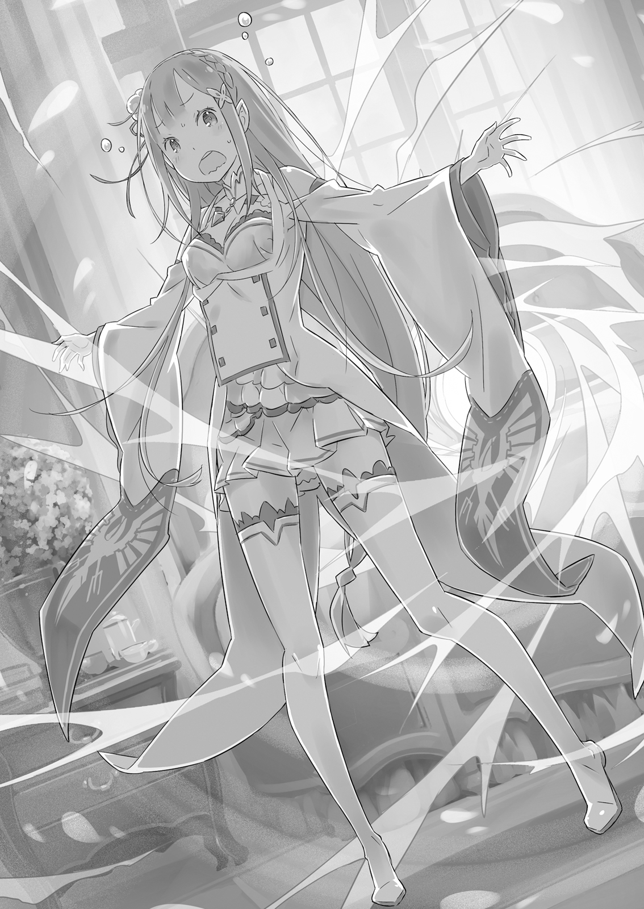
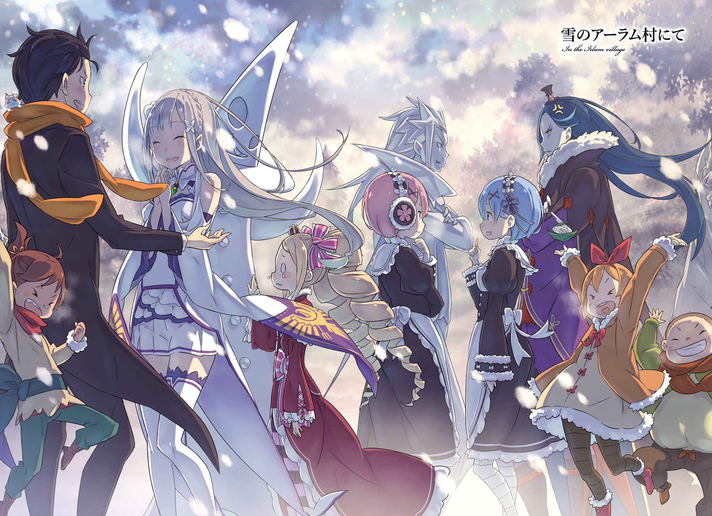

Это был едва заметный, тихий предвестник перемен.

— Доброе утро, Субару-кун.

— А-ах, доброе… Слушай, Рем. Тебе не кажется, что сегодня как-то холодно?

— Да, пожалуй. Этим утром немного прохладно. Как ты проницателен, Субару-кун.

— Да ладно, холод каждый заметит.

Раннее утро в особняке Розвааля. Встретив в коридоре Рем, Субару, едва поздоровавшись, тут же завёл разговор о температуре.

Хоть и было ещё только утро, воздух сегодня был на удивление ледяным. Вчера днём стояла такая жара, что он вспотел, а за ночь погодка резко сменилась.

От прохлады Субару застегнул свою форму на все пуговицы, до самого ворота.

— Ну я-то ладно, а вот тебе в таком наряде, должно быть, адски холодно. У вас что, нет зимней формы для горничных? Так же околеть можно.

— Когда наступит настоящая Ледяная Пора, мы переоденемся в зимнюю форму. Её ткань плотнее, а внутри подкладка из хлопка, так что она очень тёплая.

Рем с улыбкой ответила, стоя в своей обычной, слегка переделанной форме горничной. Плечи и ноги были смело открыты, и обилие телесного цвета, обычно радовавшее глаз, сейчас лишь подчёркивало холод.

К слову, «Ледяная Пора» — это местное название для холодного сезона в году, вроде зимы. А жаркое время, соответственно, называли «Огненной Порой». Похоже, и в этом мире была своя смена времён года.

— Но при таком холоде зимняя форма была бы в самый раз, нет? Если стесняешься попросить, я могу сам поговорить с Роз-чи.

— Мне очень приятно, что ты беспокоишься, Субару-кун, но мы с сестрой привыкли, так что всё в порядке. Не стоит беспокоить господина Розвааля по такому пустяку.

Рем стойко покачала головой, но её ответ не до конца убедил Субару. И всё же он решил отступить.

— Ну, раз ты так говоришь… Кстати, а где твоя сестра? Вы не вместе?

— Да. Сестре сегодня утром холодно, и она не хочет вылезать из кровати, так что решила немного поспать.

— И это сразу после слов о том, что вы обе привыкли?!

Представив себе Рам, нежащуюся в тёплой постели, Субару воспылал праведным гневом на сестру, которая беззастенчиво пользовалась добротой своей близняшки.

— Так дело не пойдёт. Холодно ли, жарко ли, а прислуге в доме отдыхать некогда. Я ей это вдолблю в голову. Идём, Рем.

— Но сестра, наверное, устала от ежедневной работы, и в такой холодный день поспать подольше…

— Идём, Рем!

— Да, раз так говорит Субару-кун!

Внутренние весы Рем мгновенно качнулись в его сторону, и она легко последовала за решительно шагающим Субару.

В итоге весь тот день ему пришлось работать под двойным обстрелом: недовольного ворчания вытащенной из постели Рам и ледяного ветра.

— И вот, на следующий день после того, как ему пришлось вытерпеть холодное отношение Рам и пронизывающий ветер…

— А-ах… Спать хочется, да ещё и холодно… А, это ты, Беако?

— Тьфу ты, — раздраженно пробормотала та.

И сегодня Субару, проснувшись ни свет ни заря и выйдя в коридор, неожиданно наткнулся на девочку в платье, которая кралась по пустому коридору, — Беатрис.

Из-за её роскошных вертикальных локонов она была вторым человеком в этом особняке, кому меньше всего подходило передвигаться незаметно. Первым, само собой, был хозяин дома.

— Что ты делаешь в такую рань? Неужели всю ночь не спала? Будешь так поздно ложиться — не вырастешь. А если будешь читать в темноте — испортишь зрение.

— Ненужные советы и кривые предостережения. Мой рост и зрение тебя не касаются… Да и вообще, у Бетти нет времени на игры с тобой, я полагаю. А теперь, живо исчезни.

— Ладно, ладно. Но если отбросить это, тебе не кажется, что сегодня просто жутко холодно? Вчера вроде тоже было прохладно, но сегодня как-то особенно…

— Ты совсем ничего не понимаешь! Я же сказала, у меня нет времени на игры с тобой, на самом деле!

Субару, ёжась от холода, который был ещё сильнее, чем вчера, подошёл к кричащей Беатрис. Девочка демонстративно скривилась, но Субару, шмыгая носом, не обратил на это внимания.

Воздух казался натянутым из-за пронизывающего ветра, который время от времени колол кожу. За окном, в тусклом, затянутом облаками пейзаже, листья на деревьях, казалось, стонали от боли.

— В межсезонье легко простудиться, так что ты тоже береги себя.

— Хмф. Бетти в таких заботах не нуждается. Я не настолько слаба, чтобы ты обо мне беспокоился. Знай своё место, на самом деле.

— Да я не о тебе беспокоюсь, а о том, что ухаживать за тобой, если ты заболеешь, будет та ещё морока. Представь, как будет обидно Рем, если каша, которую она сварит, остынет, пока мы будем искать твою комнату. Хоть когда болеешь, веди себя прилично, несносная лоли.

— С какой стати Бетти должна выслушивать упрёки за гипотетическую ситуацию, основанную на твоих же домыслах, я полагаю?!

Возмущённая такой несправедливостью, Беатрис топнула ногой. Но тут же, надув губы, она махнула на Субару рукой, словно отгоняя назойливую муху.

— В общем, Бетти очень занята. А ты, не обращая внимания на холод, можешь со всем усердием взяться за свою чёрную работу и сгореть на ней дотла, я полагаю.

— Какая там «занята», ты же целыми днями только и делаешь, что читаешь в своей комнате… А, точно!

— …Бетти уже уходит.

— Давай и ты иногда помогай по дому. Подвигаешься — и холод пройдёт, и от гиподинамии не заболеешь. Двух зайцев одним выстрелом. Отлично же!

Субару, схватив за плечо собиравшуюся уйти Беатрис, с улыбкой предложил свою мысль. На его слова Беатрис недовольно обернулась.

— …Отпусти. Бетти же сказала, что занята. Не заставляй меня повторять, я полагаю.

— Да-да, понял-понял. Я поговорю с Роз-чи, чтобы тебе за помощь платили карманные деньги, так что помоги, как ребёнок, прополоть сорняки в саду.

— Что?! Мне крайне неприятно, что ты думаешь, будто Бетти дуется по такой причине! И вообще! Слушай, что тебе говорят, я полагаю! Ты что, издеваешься?!

Субару подхватил на руки покрасневшую Беатрис, которая отчаянно забарахталась. Она сопротивлялась, но на удивление не применила магию.

Это показалось ему немного странным, но раз уж она не сопротивлялась всерьёз, тем лучше.

— Так, а теперь бегом! Взбодримся и прогоним этот холод!

— Как только отпустишь, я первым делом прогоню тебя, на самом деле!

Субару, под крики Беатрис, которая вот-вот должна была взорваться, весело побежал по коридору особняка.

И в тот день пронзительные крики Беатрис эхом разносились по всему дому.

— И вот, на следующий день после игр с Беатрис…

— О~о~о, как ты рано проснулся, Субару-ку~у~ун.

— Ох… Роз-чи… Д-доброе… доброе утро, н-но…

У прислуги практически не бывает выходных. И в этот день Субару, выйдя рано утром в коридор, столкнулся с хозяином особняка, маркграфом Розваалем L. Мейзерсом.

Этот эксцентричный аристократ, чьё лицо всегда было покрыто клоунским гримом, и сегодня был в своём репертуаре.

Встретившись с его разноцветными — синим и жёлтым — глазами, Субару, дрожа, поздоровался и, с трудом повернув застывшую шею, посмотрел в окно.

Увидев его, Розвааль с любопытством склонил голову.

— Что-то ты сегодня не в ду~у~ухе. Что случилось?

— Что случилось? Холодно же, вот что!

На очевидный вопрос Субару ответил, выдыхая облачка пара. Холодно, слишком холодно. Парень, шмыгая замерзающим носом, топнул ногой.

— Это же какая-то аномалия! Вчера я ещё мог списать это на показалось, но сегодня — уже нет! Окна замёрзли, изо рта пар идёт!

Субару, указывая на замёрзшую оконную раму, был укутан в несколько пледов. Поверх пижамного костюма он натянул фрак дворецкого, создав образ, который был бы оскорблением для любого светского общества.

Но даже в таком виде холод проникал сквозь щели, покушаясь на его жизнь.

— Что это такое? Здесь что, времена года так резко меняются? Такое ощущение, что каждый день температура падает на десять градусов! При таком раскладе даже медведи не успеют впасть в спячку и замёрзнут насмерть!

— Ну-ну, какие пессимистичные ре~е~ечи. Так нельзя. Нужно сохранять самообладание душой и телом, и тогда никакие холода не страшны…

— В таком-то тёплом наряде и шубе легко говорить!

Розвааль, рассуждавший о силе духа, был одет так, что его слова теряли всякую убедительность. Толстая шуба и тёплая одежда, в которой можно было бы выжить даже в метель в горах.

— Эта разница в одежде, которая может привести к убийству… хлюп.

— Судя по твоему злобному взгляду и шмыгающему носу, ты и правда на преде~е~еле. Вчера я бы ещё мог закрыть на это глаза, но сегодня…

— Судя по твоим словам, ты в курсе, что происходит? Тогда давай что-то делать. Если это дело рук какого-нибудь зверодемона «Генерала Мороза», то давай его убьём. И побыстрее. Мастер, прошу вас, хлюп.

Субару, мелко переступая ногами, подгонял Розвааля, который, приложив руку к подбородку, задумался. Сопли текли, мысли замерзали, он был на грани. Ещё немного, и он мог бы сорвать с кого-нибудь одежду.

— Субару-ку~у~ун, может быть, ты не очень любишь холод?

— Зимой я жалуюсь на холод, летом — на жару, весной — на сонливость, а осенью — на то, что грибы мацутакэ дорогие. Я — образцовый слабый человек, хлюп.

— Не знаю, что такое «мацутакэ», но я понял, что ты довольно нетерпеливый молодой челове~е~ек. Что ж, тогда придётся идти и жаловаться вино~о~овнику.

Розвааль, взмахнув своим меховым плащом, пошёл вперёд, и Субару последовал за ним. Ступая по длинноворсовому ковру, он нахмурился, глядя на затянутый облаками пейзаж за окном.

— Беспокоишься о том, что снаружи~и~и?

— Конечно. Я хоть и не вырос в снежной стране, но при таком холоде может пойти снег. А если пойдёт снег, то я беспокоюсь за поля в деревне и за то, что придётся его убирать.

Он слышал, что в деревне Алам, расположенной рядом с особняком, скоро начнётся сбор урожая.

Субару, который был в хороших отношениях с жителями, пообещал детям помочь. Но даже если бы не это обещание, снег был не самым приятным явлением.

— Субару-ку~у~ун, ты в хороших отношениях с жителями деревни… особенно с детьми.

— Так получилось. Вообще-то, я не люблю эгоистичных и безрассудных детей. Но раз уж они ко мне привязались…

— Да-да, это то, что в вашем родном краю называют «цундэрэ», ве~е~ерно?

— Хлюп! Ох, нос совсем заложило! Хлюп-хлюп! Это уже не смешно!

Субару, шмыгая носом, попытался скрыть своё смущение. Маркграф, с понимающей усмешкой, провёл пальцем по затуманенному окну.

— Ну, не волнуйся. Этот холод не должен был дойти до деревни. Он окутывает только особняк.

— Да как тут не волноваться?! Что это за странное явление? Как такое вообще возможно?!

— Есть двое, кто позаботился о том, чтобы этот холод не распространи~и~ился. Одна из них, кажется, вчера пряталась от тебя.

— …Беатрис?

На слова Розвааля Субару вспомнил вчерашнее странное поведение Беатрис. Он не знал, что она делала в такую рань, но, может, это было связано с тем, чтобы уменьшить ущерб от холода?

Если так, то тот, кому Беатрис решила помочь, был…

— Не нужно объяснять, кто виновник этого холода, не та-а-ак ли?

Субару догадался, и в тот же миг Розвааль, шедший впереди, остановился.

Верхний этаж восточного крыла особняка Розвааля. Комната, перед которой они остановились, была хорошо знакома Субару. Ведь он приходил сюда как минимум раз в день, чтобы увидеть её хозяйку.

— Госпожа Эмилия, простите за столь ранний визит. Можно ва~а~ас на минутку?

— …?! Розвааль?! Эм, эм, подожди немного! Подожди!

На стук мужчины из комнаты донёсся суетливый шум и голос. Даже через дверь был слышен её голос подобный серебряному колокольчику, но Субару уловил в нём неприкрытое волнение и спешку. Было и что-то странное. То, что хозяйка комнаты не спала в это время.

За те несколько недель, что он провёл под одной крышей, он узнал, что она не из тех, кто легко просыпается.

— Субару-ку~у~ун.

Розвааль, позвав нахмурившегося дворецкого, указал на дверную ручку. Наверное, не в смысле «открой». С сомнением, Субару протянул руку к ручке.

— Холодная?! Что это?! Эмилия-тан, ты в порядке?!

— А?! А, Субару, ты тоже здесь?!

— Да, но это не главное. Ты должна сказать что-то ещё!

— Что-то ещё, что-то ещё?.. Доброе утро?

— Какая вежливая… да нет же! А, ладно, я вхожу!

Дверная ручка, к которой он прикоснулся, была ледяной. Если ручка такая, то в комнате, скорее всего, ещё холоднее.

— Вхожу! Если ты переодеваешься, то спасибо!

— А не «прости»?!

Смешав беспокойство и предвкушение, Субару распахнул дверь. Та открылась со скрипом, будто отрываясь от пола, и из комнаты хлынул ледяной ветер.

— Не может быть?! Холодно! Что это, что происходит?!

Субару, вскрикнув от неожиданного холода, с удивлением посмотрел в комнату. В глубине, у кровати, стояла Эмилия, раскинув руки.

Она, покраснев, отчаянно пыталась заслонить собой кровать.

— Эмилия-тан, что это…

— Н-нельзя! Входить без разрешения хозяина — это невежливо… да, очень невежливо. Ну, это, ну, давай заново!

— Так говорит Эмилия-тан, а что думает хозяин особняка?

— Разреша~а~аю войти.

— Розвааль!

Субару, отмахнувшись от возражений Эмилии, вошёл в комнату.

Причина холода, несомненно, была в глубине комнаты. И её источник был очевиден, судя по словам Розвааля, поведению Беатрис и Эмилии, которая, как ребёнок, пыталась скрыть свою шалость.

— Где виновник, Пак? Я, как главный мерзляк, хочу ему всё высказать.

— Виновник? О чём ты? Совсем, эм, не совсем, но не понимаю.

— …Ладно, Лия. Всё равно уже поздно что-то скрывать.

На неуклюжие попытки Эмилии выкрутиться ответил сам виновник торжества. На его голос Эмилия, нахмурившись, обернулась к кровати и, уперев руки в бока, сказала:

— Ну, Пак, дурак! Ещё чуть-чуть, и я бы всё скрыла…

— Да ты бы и за сто лет не смогла.

— Что?!

Оставив в стороне искренне удивлённую Эмилию, Субару заглянул за её спину. На смятом пледе лежал, свернувшись клубком, виновник холода, — дух-кот.

— Ты и правда похож на кота, когда так сворачиваешься.

— Хм-м, прости. Доставил хлопот.

На его слова серый клубок шерсти пошевелился, и чёрные, круглые глаза посмотрели на Субару. Маленький котёнок, Пак, с горькой усмешкой посмотрел на понурившуюся Эмилию.

— Не ругайте Лию и Бетти. Они обе хотели как лучше.

Так он заступился за свою любимую дочь и младшую сестрёнку.

— …Период высвобождения маны?

Субару, нахмурившись, склонил голову, услышав незнакомое слово.

Они переместились в столовую особняка Розвааля, где собрались все обитатели. Включая сонную Рам и пытавшуюся сбежать Беатрис, все окружили Пака, сидевшего на столе.

Выяснив, что причиной недавних холодов был Пак, и потребовав объяснений, они и услышали это слово — «период высвобождения маны».

— Что это такое? Не период течки?

— Я же не животное, какой ещё период течки. Как грубо.

— С какой стороны ни посмотри, комментировать сложно.

На слова Пака, который, как настоящий кот, умывался, Субару с недоумением посмотрел на остальных. На его взгляд подняла руку Рем.

В отличие от вчерашнего дня, сегодня Рем была в зимней форме горничной. Хотя она и была более закрытой, её короткая юбка, открывавшая ноги, всё равно заставляла мёрзнуть.

Психология девушек, носящих юбки зимой, оставалась для него загадкой и в этом мире.

— Период высвобождения маны — это явление, которое периодически происходит у некоторых существ с очень сильной магической силой. Сила магии зависит от индивидуальных качеств Ода — ядра магии, — поэтому это действительно редкое явление.

— Од? Это что-то отличное от маны и врат?

Насколько Субару знал, мана была источником магической силы в этом мире. Орган, который позволял циркулировать мане внутри и снаружи тела, назывался вратами, и от их качества зависели способности мага.

Кстати, способности Субару как мага были посредственными. К тому же, из-за того, что он перенапряг свои врата, ему было строго запрещено использовать магию.

— Судя по словам Рем, Од — это что-то более важное, чем мана и врата?

— …Твоё невежество — это просто возмутительно как для слуги господина Розвааля.

На невежественное замечание Субару о магии Рам демонстративно вздохнула. Сидя рядом с Рем, она, одетая ещё теплее, чем её сестра, сузила свои светло-розовые глаза.

— Не знать, что такое Од, — это просто за гранью. Какое же ты невежественное и недалёкое существо, Барусу.

— Может, из-за холода, но сегодня сестрица особенно язвительна.

Обычно острый язык Рам в холода становился ещё острее. Она, обнимая руку сестры, чтобы согреться, с укором посмотрела на Субару.

Впрочем, в отличие от Рем, на её голове были милые наушники, так что выглядело это не очень грозно.

— Я ещё позавчера заметил, ты очень не любишь холод, сестрица.

— Нравится-не нравится — это всё субъективно. Рам не живёт в таких узких рамках. Не говори глупостей, это смешно. Умри.

— Вторая половина прозвучала как-то грубо и резко!

— Как и всегда, если оставить вас одних, разговор никуда не движется, я полагаю…

На перепалку недовольной Рам и не упускающего случая подколоть её Субару нетерпеливо вмешалась Беатрис. Девочка, в своём обычном платье, ткнула пальцем в Субару.

— Ладно, Бетти объяснит. Од — это ядро жизни… он есть у всех живых существ, будь то духи, люди или зверодемоны. Од — это как сосуд для магии, орган, в котором накапливается мана, поглощённая через врата, я полагаю.

— Ага, сосуд для маны. Продолжай, пожалуйста.

— Какой раздражающий тон… В общем, чем лучше Од, тем больше маны он может вместить. Но у любого сосуда есть предел. И когда этот предел достигается, мана начинает выливаться… прежде чем это произойдёт, её нужно высвободить, я полагаю.

— Выпустить, прежде чем живот взорвётся… вроде запора, что ли?

— Выбирай выражения!

На самобытную интерпретацию Субару Беатрис, закончив объяснение, возмутилась. Но благодаря ей он понял причину этого переполоха.

— То есть, причина этого холода — то, что Пак избавляется от накопившейся маны.

— …Да, именно так. Прости, что молчала.

Когда правда вскрылась, Эмилия понурилась. Ответственность за поступки питомца лежит на хозяине.

Субару, посмотрев на виновника, Пака, спросил:

— Ну и хлопотное у тебя избавление от запора… это у тебя регулярно?

— Примерно раз в год. Когда мы жили в лесу с Лией, я мог понемногу её высвобождать, но здесь я веду себя смирно, вот и накопилось. Хе-хе.

— «Хе-хе» тебе не поможет.

Субару, с досадой посмотрев на смущённо смеющегося котёнка, сложил руки на груди.

— То, что ману нужно высвобождать, — это я понимаю, так что жаловаться не буду. Но почему за последние три дня эффект так усилился? Были же и другие способы.

— Хм-м, сначала я старался делать это понемногу, чтобы не привлекать внимания. Но маны накопилось больше, чем обычно, и, поскольку никто ничего не говорил, даже когда стало холодно, я подумал: «А? Может, ещё немного можно? Да, можно, можно! Все такие доверчивые!» — и вот…

— Какая халтура!

Он думал, что это была крайняя необходимость, а оказалось, что это просто результат лени.

Вообще-то, если температура каждый день падает на десять градусов, то это заметит любой. И то, что этот пронизывающий холод — результат того, что Пак расслабился, лишь усиливало недовольство.

— Период высвобождения маны — это неотъемлемая часть жизни таких Великих Духов, как братец. Учитывая его миловидность и пушистость, не стоит так шуметь. Шмыг.

— Ты тоже носом шмыгаешь! И, кстати, ты же, боясь, что тебя раскроют, сама наложила барьер, чтобы холод не выходил, верно? Признавайся!

— Шмыг. Понятия не имею, о чём ты.

— Нос высморкала!

Беатрис, с покрасневшим от холода носом, продолжала защищать Пака. На её упрямство Субару сдался, и тут вмешалась Эмилия.

— Знаешь, мы с Паком очень сожалеем о случившемся. Но у Пака скоро закончится этот период… верно, Пак?

— Да. Ещё пару дней в таком же темпе, и всё.

— Нам-то от этого не легче! Если так пойдёт и дальше, то завтра утром здесь будут лежать наши с Рам замёрзшие трупы!

Несмотря на то, что Пак был виновником, в его словах не было ни капли серьёзности. Похоже, он сам не чувствовал холода, и поэтому всё это казалось ему чем-то посторонним.

— Кстати, Пак — дух, и у него своя шерсть, так что я не беспокоился, но тебе, Эмилия-тан, в такой лёгкой одежде не холодно? Я бы хотел увидеть тебя в тёплой, пушистой одежде.

Последняя часть была, конечно, шуткой, но в основном он действительно беспокоился о ней. Одежда Эмилии в такой холод была такой же лёгкой, как и всегда.

На его замечание Эмилия ещё больше смутилась.

— Знаешь, я же заключила контракт с Паком. Поэтому я могу регулировать воздействие его магии на себя. Так что этот холод, ну, да, мне не страшен…

Эмилия, смущаясь всё больше, казалось, становилась меньше. То, что она сегодня так себя винила, было, похоже, связано и с чувством вины за то, что ей самой было не холодно.

Если бы её питомец был причиной беспокойства, а она сама была бы в безопасности, то угрызения совести были бы понятны.

— Тебе не стыдно, что ты доставляешь столько хлопот своей дочери? Давай что-нибудь придумаем.

— Мне и правда неловко. Я бы и сам хотел, чтобы был другой способ, но что ты предлагаешь? Если бы я мог использовать много маны…

— А если просто выпустить несколько мощных заклинаний в небо?

— То есть, ты даёшь мне разрешение уничтожить этот мир?

— Не даю!

— Шучу.

Конец света или просто катаклизм, — шутка была так себе. Субару почувствовал, что если он необдуманно согласится, то ничего хорошего из этого не выйдет, и решил пока воздержаться от легкомысленных заявлений.

— Но этот холод мешает работе. За последние три дня эффективность работы Рам значительно снизилась.

— Ещё бы, если столько времени не вылезать из кровати. Этот период высвобождения маны — он только у духов? А у сильных магов… у Роз-чи или Беако?

Если говорить о сильных магах, то и они не должны были быть исключением. Розвааль, к которому обратились, пожал плечами, а Беатрис дёрнула своим вертикальным локоном.

— Я-то регулярно использую свою магическую силу, так что у меня всё под контро~о~олем. Да и ежедневные обязанности никто не отменял, так что в моём Оде всегда есть место.

— Почему после слов о ежедневных обязанностях Рам… а, ладно, не хочу знать.

Розвааль бросил взгляд на Рам, и та, покраснев, опустила голову. Странные, неподобающие отношения между хозяином и служанкой. Слишком близко, чтобы не знать, и слишком неприятно, чтобы хотеть знать.

— Бетти справляется, поддерживая Запретную Библиотеку и используя «Пересечение Дверей». И, кстати, в последнее время очень помогает вышвыривание назойливых людей.

— Да-да, мило, мило.

Отмахнувшись от провокации, Субару проигнорировал надувшуюся девочку и посмотрел на Эмилию и Рем.

— А вы, Эмилия-тан, Рем? У вас нет периода течки… то есть, высвобождения маны?

— Период высвобождения маны бывает только у тех, у кого действительно выдающиеся способности…

— Я тоже, как маг, не очень, так что у меня его нет… а, но я много знаю об этом из-за Пака. Так что в этот раз прости, я очень сожалею…

— Эмилия-тан сегодня просто мастер самобичевания!

Её честность и серьёзность сегодня играли против неё. Придётся Субару взять на себя ответственность за виновника, который беззаботно сидел на руках у девушки.

— Так, соберёмся и найдём решение. Кстати, когда ты в последний раз нормально использовал магию?

— Недавно, когда сражался с той девочкой в чёрном в столице. Я тогда даже ману всю истратил.

— Вся моя решимость утекла сквозь рану в животе!

Воспоминание о том, как его ранила «Охотница за Кишками», — рана, полученная всего месяц назад, — заныла. Организовать такую опасную встречу просто для того, чтобы выпустить ману, было невозможно.

— Если не это, то, наверное, когда Розвааль пришёл за Лией в лес. Стыдно признаться, но я тогда, кажется, немного переборщил.

— А~а~ах, это было действительно захватывающе. Я, пожалуй, впервые в жизни участвовал в такой магической битве.

— Ты же без предупреждения пришёл, вот я и испугался. Ха-ха-ха.

— Мы сражались целые су~у~утки, если не ошибаюсь?

Они беззаботно смеялись, но, несмотря на весёлую атмосферу, то, о чём они говорили, было очень серьёзно. Если бы они действительно сражались всерьёз, то это был бы конец света.

— Как это было на самом деле, Эмилия-тан?

— Я слышала, что потом пришлось перерисовывать карту…

— Нет, это не вариант! Операция «Враг мой — друг мой» отменяется!

— Э-э…

— Не «э-э»! Не надо менять ландшафт из-за драки! Извинись перед Ино Тадатакой¹!

— Прости, Тадатака-сан. Так пойдёт?

¹ Ино Тадатака — известный японский картограф периода Эдо, который создал первую подробную карту Японии, путешествуя по стране пешком.

Заставив его извиниться перед великим картографом, Субару понял, что задача не из лёгких. Он хотел бы посоветоваться с опытной Эмилией, но…

— Когда я жила с Паком в лесу, там не было никого, кому можно было бы помешать, так что я и не думала, что это такая проблема. Вот и растерялась…

— И в итоге мы имеем то, что имеем. Я понимаю, что ты, Эмилия-тан, хочешь справиться сама, но в таких случаях можно и нужно просить о помощи… особенно меня. Быть тем, на кого можно положиться, — это приятно. Особенно если это Эмилия. А ещё Рем, иногда Рам, Беатрис, Пак и Розвааль. И жители деревни, и дети… на удивление, много.

Как-никак, и в этом мире у него появилось много знакомых. И он хотел бы позаботиться о них.

— Если мир окажется на грани уничтожения и начнётся путешествие для победы над владыкой демонов Паком, то это будет та ещё морока… Мирный и не временный способ, значит…

— …! Субару, ты что, опять что-то странное придумал?

— Как и ожидалось от Субару-куна. Рем в восторге.

— Не торопитесь с выводами!

Субару, с горькой усмешкой на слова Эмилии и Рем, подошёл к затуманенному окну столовой. Протерев его ладонью, он посмотрел на внутренний двор особняка.

— Этот холод ограничен особняком благодаря барьеру Беако, верно?

— Пожалуй. Если холод выйдет за пределы здания, то деревья и цветы в саду погибнут, я полагаю. Поэтому я ограничила барьер разумными пределами.

— Ты позаботилась о саде. Это я искренне ценю. …Кстати, а барьер, его можно сейчас как-то изменить? Если да, то у меня есть просьба.

— Не то чтобы это невозможно, я полагаю. Но что ты задумал?

— Хе-хе-хе, конечно же, я предлагаю весело и интересно пережить этот период высвобождения маны!

Субару, приложив одну руку к окну, другой щёлкнул пальцами и указал на потолок. На его жест все удивлённо моргнули, и только Розвааль, с понимающей усмешкой, прикрыл один глаз.

Глядя на Субару своим жёлтым глазом, он сказал:

— Я не против чего-то интересного. Мне и недавний сеанс призыва духов понравился. Итак, что же ты задумал с этим особняком и периодом высвобождения маны Великого Духа?

— Замысел, воплощённый в жизнь, — это и есть план. Это праздник из моего родного Хоккайдо… ну, в широком смысле родного. Давайте с размахом потратим излишки маны Пака.

В голове Субару всплыл образ фестиваля, который он видел только по телевизору. Грандиозный праздник в белой, снежной стране. Если позаимствовать у предков его название, то это будет…

— Первый, чики-чики² — снежный фестиваль в особняке Розвааля!

² Чики-чики: Японское звукоподражание, часто используемое в названиях игровых шоу или гонок для создания азартной и весёлой атмосферы.

— …

Субару, с победным видом подняв большой палец и сверкнув зубами, объявил, и все затаили дыхание.

— Чики-чики снежный фестиваль…

Эмилия, повторив название фестиваля, склонила голову. И…

— А «чики-чики»… обязательно?

…Эту часть решили опустить, и они приступили к обсуждению деталей снежного фестиваля.

И вот, план постепенно начал воплощаться в жизнь…

— Итак, начался первый снежный фестиваль! Все хотят в Нью-Йорк?!

— Э-э-э?..

На зажигательную речь Субару, который вёл мероприятие, раздались редкие, неуверенные возгласы.

Энтузиазм не находил отклика, но Субару, глядя на открывшуюся перед ним картину, не обращал на это внимания. Люди, подхваченные его настроением, похоже, наслаждались атмосферой праздника.

Перед ними раскинулся заснеженный передний двор особняка Розвааля. И там собралось множество людей, — почти все жители деревни Алам.

От непривычного холода жители были в зимней одежде, но на их лицах было не столько недовольство, сколько весёлое возбуждение.

Ведь слово «фестиваль» мало кого оставляет равнодушным.

— И всё-таки, снежный фестиваль. Твои идеи, Субару, как всегда, удивляют.

Пробормотал Пак, выглядывая из-за шарфа, обмотанного вокруг шеи Субару. Виновник этого снежного царства, он, глядя на участников, поглаживал усы.

— Не стоит недооценивать современных людей, привыкших к расточительству. Если уж не можешь что-то скрыть, то лучше превратить это в праздник.

— Мне и в голову не пришло, что это может превратиться в праздник. Люди жалуются на холод, но не на снег. Трудно понять человеческую логику.

— Это как стихийное бедствие, но люди радуются снегу и тайфунам. Такова уж человеческая природа.

— Хм-м, странно.

Пак, выслушав объяснения Субару, всё равно с недоумением склонил голову.

Возможно, такому сверхъестественному существу, как он, это было непонятно, но люди — существа, которые иногда хотят делать нелогичные вещи. Они боятся стихии, но иногда могут превратить её в развлечение. Очень противоречивые существа.

— Господин Субару, продолжайте!

— Ой, да-да. Простите!

Жители деревни позвали отвлёкшегося Субару, который разговаривал с Паком. К слову, они не должны были видеть Пака, так что, скорее всего, им показалось, что Субару разговаривает сам с собой.

Но то, что они не обратили на это внимания, говорило о том, как хорошо они его понимали.

— Итак, правила. То есть, место проведения — передний двор особняка! Суть снежного фестиваля — это художественный конкурс, в котором вы, используя снег и лёд, соревнуетесь в оригинальности и креативности! Мы приготовили шикарные призы, так что боритесь за победу!

— О-о-о!

На слова о шикарных призах толпа взорвалась аплодисментами. Фестиваль проводил сам маркграф Розвааль, так что ожидания были высоки.

— Итак, время — до конца часа огня! На старт, внимание, марш!

— …?

— А, «старт» — это значит «начало»! Начали, начали!

Хоть и с небольшой заминкой, но по команде Субару снежный фестиваль начался.

Жители деревни принялись за работу, но создание снежных скульптур требовало большой концентрации и ловкости рук. Интересно, какие шедевры они создадут.

— Прекрасный вид, прекрасный вид.

Субару, глядя на увлечённых людей, с удовлетворением спрыгнул со снежного помоста.

На создание конкурсных работ уйдёт несколько часов. За это время Субару решил заняться другим делом, тоже связанным с избытком маны.

Раз уж есть снег и лёд, то глупо было бы ограничиваться только фестивалем.

— Как здесь дела?

— А, господин Субару. Там, похоже, тоже весело. И у нас всё хорошо.

На вопрос Субару обернулся молодой человек из деревенской дружины, который, вспотев, рубил лёд. Вокруг него были и другие дружинники, которые грузили лёд на тележки.

— Кстати, там все веселятся, а вы тут вкалываете. Не обидно?

— Что вы. Это же для деревни. К тому же, говорили, что Огненная Пора будет жаркой, так что предложение господина маркграфа было очень кстати.

Молодой человек с короткой стрижкой, вытирая пот, улыбнулся. На его ответ Субару кивнул, радуясь, что его предложение не было навязано.

В то время как одни веселились на снежном фестивале, эти молодые люди рубили лёд. Они вызвались заполнить деревенский ледник льдом на Огненную Пору.

Лёд, необходимый для хранения продуктов и просто для того, чтобы охладиться в жару, был незаменим. В мире, где не было технологии производства льда, ледники были очень важны.

Субару, часто бывавший в деревне, случайно запомнил этот разговор.

— Но это тяжёлая работа. Мне бы тоже следовало помочь…

— Что вы, что вы, господин Субару. Мы вам и так многим обязаны. Если мы будем вас ещё утруждать, то нас накажут. К тому же, вы нам и так показали кое-что хорошее.

— Хорошее? Что-то было?

Субару, не понимая, о чём речь, склонил голову, и молодой человек отвёл взгляд. Проследив за его взглядом, Субару увидел Рем и Рам, которые суетились во дворе.

Они, как члены оргкомитета, были заняты, и их зимняя форма горничных была свежа и мила.

— Одного взгляда на них достаточно. Верно, господин Субару?

— …Да, наверное. Если вам этого достаточно, то я рад.

На довольные слова молодого человека дружинники глубоко кивнули. Раз уж это было их общее мнение, то Субару, пожав ему руку, согласился.

Увидев их решимость, Субару снова вернулся на площадку фестиваля. Хотя он и не очень разбирался в снеге, но мог бы дать пару советов…

— А, Субару!

— Вон он, Субару!

— Познай белый ужас!

— Ого, вы и в холод бодры!

Вернувшегося Субару встретили дети, полные энергии. От их разгорячённых тел шёл пар, и они носились по двору.

— У-ха-ха, снег!

— Джа-ха-ха, снег!

— Бо-ха-ха, снег!

Дети катались по снегу, валялись в нём, наслаждаясь снежным царством. Субару, глядя на них, не мог смеяться, вспоминая своё детство. Он лишь глубоко кивнул.

— Но когда-нибудь они поймут, что на самом деле это снег играл с ними…

— А, Субару, ты, похоже, свободен. Смотри, смотри! Я сделала его из снега.

Девочка, подошедшая к Субару, который с важным видом изрекал банальности, прервала его. Это была Петра, самая красивая девочка в деревне, у которой было большое будущее.

На её ладони сидел снежный кролик.

— Ого, снежный кролик! Здесь тоже делают снежных кроликов!

— Э-хе-хе, милый, правда? Хорошо получилось?

— Очень хорошо! Так, а теперь давай его немного усовершенствуем. Смотри.

— …?

На недоумённый взгляд Петры Субару подобрал с земли листья и камни. Прикрепив их к снежному кролику, он в мгновение ока сделал ему глаза и уши.

Увидев это, лицо Петры просияло.

— Ух ты, здорово! Субару, ты молодец! Он стал настоящим кроликом!

— Хе-хе, правда? Когда ты так радуешься, и у меня настроение поднимается! Так, а теперь давай сделаем его ещё круче! Не только глаза и уши, но и хвост, и крылья, и ракеты, и функцию трансформации, и кабину, и гусеницы…

— А, подожди, подожди…

Не слушая Петру, Субару продолжал модернизировать снежного кролика.

Через несколько минут на его месте стояло нечто, потерявшее свой первоначальный облик, — боевое оружие, созданное только для того, чтобы убивать, «Летающий штурмовой высокоогневой истребитель YUKI-USAGI».

Разумеется, настроение невинной девочки было испорчено.

— Хм-м, женское сердце — загадка… трудно угодить девочке. Тьфу.

Субару, сплюнув снежок, который попал ему в лицо, проводил взглядом удаляющуюся Петру. Похоже, его творение, будоражившее мальчишеское воображение, не пришлось ей по вкусу.

— Петра, значит, предпочитает реалистичных роботов, а не суперроботов.

— Хм-м, мне кажется, и то, и другое — не то.

— Нет, ещё рано делать выводы. В следующий раз попробую сделать реалистичного робота.

Определив для себя будущее, в котором его снова закидают снежками, Субару пошёл осматривать выставку снежных скульптур, которые уже начали появляться.

Хотя многие работы были неумелыми, так как это был их первый опыт, все они были сделаны с душой. Трудно было выбрать лучшую.

— Но жаль, что все они такие реалистичные. Наверное, из-за того, что нет понятия о персонажах, в основном делают замки и животных… о, а это хорошо сделано!

— О, спасибо, господин Субару. Я горжусь этим вольгармом!

— Только не говори, что холод заставил тебя забыть о страхе! Не смешно!

Это была снежная скульптура зверодемона, который совсем недавно навёл ужас на особняк и деревню. Страх и напряжение того времени были ещё свежи в памяти, и мурашки по коже бежали не только от холода.

— Я ценю смелость и оригинальность. Но ты не учёл душевные травмы жюри. Поэтому моя оценка — семь баллов! Жду следующей работы!

На оценку Субару мужчина, сделавший вольгарм, горько усмехнулся: «Строго судите». На эту перепалку Пак пощекотал хвостом шею Субару.

— А-а, что?

— А кто судит на этом снежном фестивале, кроме тебя, Субару?

— Я, Роз-чи и староста деревни в качестве тайного судьи. Если все будут знать, кто в жюри, то могут начаться взятки и подкупы. На фестивале, где соревнуются в искусстве, такие грязные махинации недопустимы.

— И кто-то будет так стараться ради шикарных призов?

— Может. Это же мой личный, единственный в мире шикарный приз.

Хотя его денежная ценность была сомнительной, но редкость была гарантирована. Узнав, что шикарный приз — от Субару, Пак удивлённо хмыкнул.

— Это не твоя проблема, а ты так раскошеливаешься.

— Проблема же у Эмилии-тан и, заодно, у тебя. Конечно, я помогу.

Это не требовало больших усилий, да и сам фестиваль доставлял ему удовольствие. Помогать в таких мелочах — нечего и думать. Он и так был им многим обязан.

— Хм-м… твоя такая черта, Субару, мне довольно-таки… это самое.

— Слишком много «этого», я не понимаю. Что «это», что «то»… а.

На смешок Пака Субару вдруг остановился. Заметив это, девушка, работавшая перед ним, радостно захлопала в ладоши.

— А, Субару-кун! Смотри. Это совместная работа сестрицы и Рем!

— Рем и сестрица не только помогали, но и участвовали? Неожиданно.

Голубоволосая горничная, с сияющим лицом, указала на свою работу. Рядом со скульптурой стояла, сложив руки, ещё теплее одетая Рам, которая, увидев Субару, фыркнула.

— А, Барусу. Пришёл, привлечённый нашим искусством.

— Не надо говорить так, будто я мотылёк, летящий на огонь, но я правда пришёл посмотреть. Что заставило тебя, Рам, участвовать в этом холодном фестивале? Ты же и помогать не хотела.

— Я получила разрешение от господина Розвааля. Или ты хочешь, чтобы Рам, пока Рем и остальные играют в снегу, спала в своей постели?

— Неоправданно агрессивно, но это же значит, что ты не хотела оставаться в стороне, верно?

На упрямство Рам Субару с досадой вздохнул, и Рем, встав перед сестрой, взяла её за руку.

— Это я уговорила сестрицу. Она говорила, что играть в снежки — это по-детски, но я очень хотела поиграть с ней…

— И тебе, сестрица, не стыдно заставлять так говорить свою младшенькую?

— Я чувствую любовь Рем и преисполняюсь чувством превосходства. Завидуй.

Победить того, кто не признаёт своей неправоты, — трудно. Субару, быстро сдавшись, посмотрел на совместную работу сестёр.

Скульптура, накрытая белой тканью, была ростом с человека. Учитывая мастерство Рем, он ожидал увидеть шедевр.

— Это шедевр, созданный силой, техникой и сестринской любовью Рам и Рем.

— Да, к указаниям сестры добавились скромные усилия Рем, и, пожалуй, получилось лучше всего.

— Только что выяснилось, что сестрица только и делала, что смотрела! …Итак, название работы?

— Да. Название — «Великолепный господин Субавааль»!

— По названию уже всё понятно!

Не обращая внимания на крик Субару, Рем сняла ткань со скульптуры. Обнажившаяся скульптура изображала мужчину и была выполнена с большим вниманием к деталям.

Детали были проработаны, и мелкие части были очень изящны. Просто как снежная скульптура, она превосходила все остальные. Но был один, единственный и самый большой недостаток, — они не смогли определиться с мотивом.

— Сестрица хотела сделать господина Розвааля, а Рем — Субару-куна, и мы не смогли договориться.

— В поисках компромисса мы пришли к этому.

— Вы как будто и уступили, и не уступили!

На рассказ сестёр о создании Субару не знал, как оценить их работу. То, что они работали вместе, — это прекрасно, но результат — эта кощунственная скульптура.

Совместная работа, «Великолепный господин Субавааль», на первый взгляд изображала Розвааля, но в ней чувствовались и черты Субару. Это было нечто неописуемое, сводящее с ума.

— О~о~о? Вы что здесь собрались… а, это…

К Субару и остальным, стоявшим перед скульптурой, подошёл Розвааль, который осматривал выставку. Но, увидев работу сестёр, он на удивление напрягся. С его губ исчезла уверенная улыбка, и он, не зная, что сказать, забегал глазами.

— А, господин Розвааль… простите за неловкость. Но посмотрите внимательно.

— Это совместная работа сестрицы и Рем. Хотя мы и служим вам, но просим вас оценить нас объективно.

Увидев, что жюри в сборе, Рам и Рем попросили их оценить. Уверенность Рам была обычным делом, но и Рем, которая обычно говорила скромно, выглядела на удивление уверенной.

Похоже, они очень надеялись на эту скульптуру, но…

— Ну, тогда, к сожалению, пять баллов.

— И-и-и?..

— Не изменится! Как есть! Желаю вам дальнейших успехов!

— Не может быть!..

Рам, ошеломлённо, посмотрела на Розвааля, но тот, покачав головой, поднял правую руку. Четыре пальца — оценка ниже, чем у Субару.

Кстати, у каждого члена жюри было по десять баллов, итого — тридцать.

— Сделано непло~о~охо, но… как-то жутковато.

— Идея была правильной… наверное, помешали элементы Барусу.

— Не может быть! Мы объединили идеалы сестрицы и Рем, и чтобы получилось плохо — это странно. Наверное, время ещё не пришло.

Услышав комментарий Розвааля, сёстры начали обсуждать свои ошибки. Но, судя по их обсуждению, и следующая их работа будет такой же неописуемой.

— Или, может, это только нам, кто стал мотивом, кажется странным…

— А! Субару, нашла! Мы с Беатрис тоже тайно участвуем. Если хочешь, пойдём посмотрим на нашу скульптуру… а, что это. Какая-то очень странная скульптура…

— Да, да, ничего странного.

Эмилия, случайно проходившая мимо, тоже с отвращением посмотрела на «Великолепного господина Субавааля».

Значит, время, когда человечество сможет оценить этот вкус, не наступит никогда.

Так или иначе, первый снежный фестиваль прошёл в таком духе, — и победила Петра.

Победившая работа, набравшая в сумме двадцать восемь баллов, — «Летающий штурмовой высокоогневой истребитель YUKI-USAGI».

Что ж, это была победа хитрой и расчётливой девочки.

— Я так старалась, а получила всего девять баллов. Это странно…

— Для Лии и Бетти это было немного сложное мероприятие. Ну, как бы это сказать… вашим скульптурам не хватило художественности.

Во дворе, после снежного фестиваля и уборки, разговаривали Эмилия и Пак.

Эмилия, надув губы, с недовольным видом смотрела на свою снежную скульптуру Пака. Рядом стояла скульптура Пака, сделанная Беатрис. Оценки — девять и семь баллов соответственно. По этим оценкам можно было догадаться, почему описание опускалось.

Авангардные скульптуры, похоже, были недоступны для человеческого понимания.

— Но Субару и правда знает много странных вещей. Снежный фестиваль — такое в Великом Лесу Элиор точно было бы невозможно.

— Это фестиваль, который можно устроить только там, где редко бывает снег. Если бы мы жили там, где снег — это обычное дело, то и в голову бы не пришло такое.

— Правда?.. Наверное, ты прав.

Эмилия, глядя на снежные скульптуры, оставшиеся в ночном дворе, глубоко кивнула на слова Пака.

Снежный фестиваль, придуманный Субару для того, чтобы избавиться от избытка маны, помог, и Од Пака, похоже, стабилизировался. Сильные холода последних дней, скорее всего, к завтрашнему дню пройдут.

— Но тогда и эти скульптуры завтра, наверное, растают. Их так много, а так жаль.

— Снег — он такой. Ничто не вечно. Вот и всё.

Эмилия, почувствовав в словах Пака что-то странное, не стала его поправлять. Просто, остановившись, она посмотрела на звёздное небо.

В холодном, ясном воздухе над головой раскинулось звёздное небо, взиравшее на снежные скульптуры.

— И Лии, и Бетти, и ребятам из особняка жаль, что они не победили.

— Снежный кролик той девочки был очень хорошо сделан, так что ничего не поделаешь. Розвааль и дедушка были в восторге. …Странно только, что Субару, который обычно так радуется, был таким тихим.

— По этому поводу я промолчу. Но мне были интересны шикарные призы обещанные Субару.

— Мне тоже. Из родного края Субару… как там. Харкайдо? Что-то такое.

Приз за победу в снежном фестивале был загадочным предметом, который был у Субару. Мешочек со странными на ощупь буквами и рисунками, — внутри, похоже, была еда, но выглядело это немного жутко.

Кстати, в это же время в деревне Петра ела приз, «чипсы со вкусом кукурузного супа», и была в восторге от их вкуса, но это уже другая история.

— Может, мне стоило с самого начала посоветоваться с Субару. Тогда бы я не так мучилась.

— Да. Но нельзя же всё время на кого-то полагаться. Даже если не справляешься, нужно сначала попробовать самой. Верно?

— Да, я понимаю.

Эмилия хихикнула, и Пак, погладив усы, сказал: «Вот и хорошо». После недолгого молчания девушка вдруг спросила:

— Помнишь, что Субару сказал в конце фестиваля?

— …В следующем году, когда у меня снова будет период высвобождения маны, мы снова устроим снежный фестиваль. Обычно все бы отказались, но мне кажется, что он действительно превратит это в праздник.

— Такая черта Субару… мне кажется, это так… это самое.

— Да. И мне кажется, это самое.

Если бы Субару был здесь, он бы, наверное, обиделся, что его оставили за бортом разговора, в котором использовались одни местоимения. Это был разговор, понятный только тем, кто давно знаком, как семья.

— Следующий год… Я не знаю, что будет так далеко в будущем. Что же будет?

— Как ты захочешь, Лия. Я надеюсь, что так и будет. Другое дело, сможем ли мы действительно сделать то, о чём говорил Субару.

— Пак, ты против снежного фестиваля?

— Нет. Мне тоже понравилось, и ты, Лия, выглядела счастливой. …Но я не знаю, буду ли я рядом с тобой в следующем году, и будет ли Субару счастлив.

— …

На слова Пака Эмилия тихо затаила дыхание.

Её положение было тяжёлым, и она не могла легкомысленно принимать решения. И обстановка вокруг неё, скорее всего, через год кардинально изменится.

Втягивать в это Субару, этого доброго юношу, — ей было совестно.

— И рана на животе, и укусы зверодемонов, — все шрамы, которые остались у него, — это результат твоих действий, Лия. Ты не из тех, кто забывает, но ты должна помнить это.

— …Да.

Несмотря на свой беззаботный голос, слова Пака не были снисходительными к ней.

Эмилия кивнула, и Пак, молча, умылся. Затем он, посмотрев на снежные скульптуры вокруг, сказал:

— Но, может, и хорошо, если мы снова устроим снежный фестиваль в следующем году.

— …

— Если мы сможем его устроить, значит, у меня будет достаточно маны, и никто, кроме Субару, не сможет его провести.

Если в следующем году снова будет снежный фестиваль, это будет означать, что Эмилия благополучно прожила год, и Нацуки Субару остался в особняке.

— Да, да. …Я тоже надеюсь, что так и будет.

На неожиданные слова Пака Эмилия, несколько раз кивнув, улыбнулась. На улыбку своей любимой дочери Пак, удовлетворённо дёрнув усом… скрыл в груди тревогу.

Смогут ли они снова устроить снежный фестиваль в следующем году? Смогут ли они за этот год выполнить все условия?

Безопасность Эмилии, безопасность Субару, и, кроме того, безопасность самого Пака и другие факторы… За последние несколько месяцев произошло много больших перемен. Что же будет дальше…

— Пак, что-то случилось?

Эмилия, заметив, что Пак замолчал, склонила голову. На её вопрос дух, тут же вернувшись к своему обычному состоянию, навострил уши.

— Хм-м, ничего. Просто думаю, станет ли завтра снова так же жарко.

— А, точно. Субару и Рам, наверное, снова будут жаловаться.

Эмилия, не заметив беспокойства Пака, как ни в чём не бывало, беспокоилась о завтрашнем дне. На её честное, прямое сердце Пак, ничего не говоря, продолжал махать хвостом.

…Молча, думая о том, что произойдёт за год до следующего снежного фестиваля.

«Конец»
