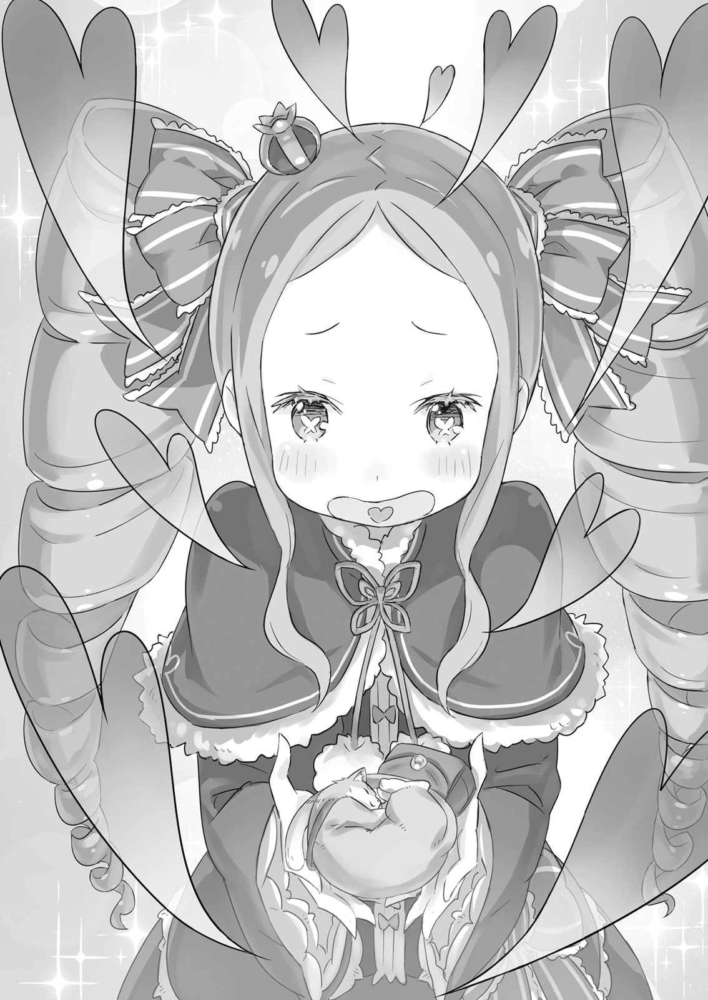

Затаив дыхание, она приоткрыла дверь и оглядела коридор в обе стороны.

Прислушавшись к звукам, девочка не уловила поблизости никакого чужого присутствия. Удовлетворённо кивнув и крепко сжав маленькие кулачки, она ступила на красный ковёр и бросилась бежать.

Мягкий ворс поглощал шаги, но был не в силах развеять тревогу бегущей девочки. Сейчас даже её собственное дыхание казалось ей помехой, выдающей её врагам.

Выстроившиеся в ряд двери гостевых комнат, уходящий вдаль коридор, расставленная там и сям мебель — она с опаской косилась на абсолютно всё. Ей нужно было найти подходящее укрытие и спрятаться…

— Бу-у-у!

— Ах!..

Не успела она скользнуть взглядом в поисках укрытия, как из-за огромной вазы прямо перед ней выскочил мальчишка. Он раскинул руки в стороны и широко разинул рот, из носа у него свисала сопля.

Девочка рефлекторно стиснула зубы и в последний момент подавила готовую вырваться наружу ману. Она едва не стёрла этого пацана в порошок. Девочка с облегчением выдохнула, радуясь собственному самоконтролю и дьявольскому везению мальчишки.

А затем…

— Получай, я полагаю!

— Ай-яй!

Ладонью, которой она секунду назад собиралась высвободить магию, девочка влепила звонкую пощёчину по скорчивший рожицу физиономии. Убедившись, что мальчишка с коротким вскриком покатился по полу, она накрутила на палец свой спиральный локон.

— Хм! Это тебе плата за то, что напугал Бетти. Совсем не смешно, в самом деле!

— А-а! Нашёл!

— И правда! Вон она! Лука повержен!

— Ничего, падёт один Лука — на его место встанут второй и третий!

— Какая гадость, я полагаю.

В ту самую секунду, когда она праздновала победу, в конце коридора с громким топотом показался другой отряд. Цыкнув языком на их крики, девочка коснулась ближайшей двери, по привычке собираясь «перейти» сквозь пространство, но…

— …Я ни за что не признаю поражение так просто, в самом деле.

Отдёрнув руку, она мотнула головой и со всех ног рванула в противоположную сторону коридора. По пути она наступила на живот поверженного мальчишки, заставив того издать смущённый писк.

— Вперёд, лови её!

— Вперёд, задай ей!

— Вперёд, раздевай её!

Слыша за спиной крики товарищей растоптанного мальца, девочка мысленно нарисовала в голове карту особняка. А затем, поморщившись от неугомонных преследователей, прошептала:

— Я ни за что не позволю всему пойти по твоему дурацкому плану, в самом деле.

В её голосе сквозила непоколебимая решимость. Приподняв подол платья, девочка — Беатрис — продолжила бежать изо всех сил.

— Слушай, Беако, ты тут целыми днями торчишь взаперти. Здоровье-то не угробишь?

Окинув взглядом забитые книгами стеллажи, Субару, сидевший прямо на полу, озвучил давно мучивший его вопрос.

Комната была окутана древней, величественной атмосферой. В просторном помещении не было окон, а источниками света служили расставленные повсюду магические лампы.

Белые кристаллы внутри стеклянных сосудов излучали ослепительное сияние, выполняя роль освещения. Впрочем, даже их света не хватало, чтобы осветить каждый уголок этой до отказа заставленной книжными шкафами комнаты.

— Если всё время читать в потёмках, посадишь зрение. Да и окон тут нет, не проветрить толком. Сидеть в комнате со спёртым воздухом вредно для лёгких, знаешь ли.

— Какой же ты назойливый хам, я полагаю. Что и где делает Бетти — её личное дело… К тому же воздух в Запретной Библиотеке очищается самой маной, поэтому он абсолютно чист, в самом деле.

— Серьёзно? Мана — крутецкая штука. Так вот почему здесь так уютно. А я-то гадал: вроде комната должна быть битком набита углекислым газом, который выдыхает Беако, а дышится легко.

— Я не совсем поняла, но абсолютно уверена, что ты сказал какую-то мерзость, я полагаю!

Не выдержав этого бессмысленного трепа, Беатрис, сидевшая на стремянке, повысила голос. Покраснев от возмущения, она ткнула пальцем в нагло развалившегося на полу грубияна:

— И почему ты таскаешься сюда изо дня в день и действуешь мне на нервы?! Это тебе не место для убийства времени, я полагаю. Это священная и неприкосновенная Запретная библиотека, в самом деле!

— Называешь её запретной, но я сюда так легко заваливаюсь, что как-то не сходится.

— Это Бетти не хочет тебя впускать, а ты, оболтус, сам беспардонно сюда вваливаешься, в самом деле!

Наглость Субару, в буквальном смысле лезущего со своим уставом в чужой монастырь, вызвала у Беатрис привычный взрыв негодования. Спрыгнув со стремянки, она встала перед сидящим парнем и высокомерно вздёрнула подбородок.

Глаз было не оторвать от того, как по бокам её головы, словно пружинки, подпрыгивали роскошные локоны.

— Сколько бы я ни использовала «Пересечение Дверей», ты каждый раз находишь меня так, словно это в порядке вещей… Ты первый нахал, который смеет так нагло вламываться в «Запретную библиотеку», я полагаю.

— Пружинь-пружинь, пружинь-пружинь.

— Куда ты смотришь, пока Бетти говорит?! И с чем это ты играешься?! А ну внемли мне, в самом деле!

— Оп-па!

Субару рефлекторно поймал недочитанную книгу, которую в порыве гнева швырнула в него Беатрис. Девочка, всё ещё красная как рак, гневно сверлила его своими огромными глазами. В этот момент она так напоминала тявкающего щенка, что Субару невольно усмехнулся.

— И чего ты лыбишься… До чего же невыносимый невежа, я полагаю.

— Виноват, виноват. Но, эй, не разбрасывай прочитанные книги, ставь их обратно на полку. Если будешь лениться убирать, тут скоро весь пол книгами зарастёт.

— Тебе ещё столетия расти, чтобы отчитывать библиотекаря «Запретной библиотеки» за обращение с книгами, в самом деле.

— Да я только что видел, как этот самый библиотекарь швырнул в меня томом…

Для человека, гордящегося своей должностью библиотекаря, обращалась она с книгами отнюдь не бережно. Выхватив протянутую Субару книгу, она небрежно запихнула её в ближайший шкаф. Книги там стояли вразнобой, без всякой логики в корешках и названиях — абсолютная халатность.

— Эй, а как же гордость библиотекаря? Будешь так небрежно их расставлять — когда-нибудь пропустишь следующий том и пожалеешь. Я вот так в детстве один раз потерял одного из близнецов в серии.

— Твоё предупреждение звучит пугающе жизненно, но Бетти не нуждается в непрошеных советах, я полагаю. «Запретная библиотека» — это непостижимое место, которое не вписывается в твои обыденные рамки, в самом деле.

— Это как?

— Достаточно просто вернуть книгу на полку, и она сама встанет на своё законное место, я полагаю.

— «Запретная библиотека» — это офигенно… или крипово!

К сожалению для гордо улыбающейся Беатрис, впечатления Субару скорее склонялись к слову «жуть», чем «круто». Субару покосился на полку, куда девочка только что втиснула книгу:

— Э, серьёзно? Сама встаёт на место? Жуть как удобно, конечно, но если увидеть это вживую — чистый хоррор. И вообще, зачем тогда тут нужен библиотекарь? Ты здесь для чего?

— Похоже, ты физически не способен вести беседу, не принижая Бетти на каждом шагу, в самом деле…

На этот раз вопрос был задан без всякой задней мысли, но Беатрис восприняла его как очередную издёвку. Пройдя мимо Субару, она вытащила с ближайшей полки другую книгу. Гримуары в библиотеке в основном были толстыми и громоздкими, и в её маленьких ручках они смотрелись весьма опасно.

Однако стоило ему попытаться инстинктивно протянуть руку помощи, как последовало:

— Обойдусь без твоей заботы, я полагаю.

Субару оставалось лишь криво усмехнуться в ответ на такую недружелюбную реакцию.

— Ладно… пожалуй, на сегодня я тоже закруглюсь.

Усевшись на стремянку, Беатрис раскрыла книгу на коленях, погружаясь в режим чтения.

В таком состоянии добиться от неё хоть какой-то реакции становилось практически невозможно. Да и Субару понимал базовые правила приличия: мешать чтению — дурной тон. Самое время для тактического отступления.

Когда Субару направился к выходу, девочка не проронила ни слова. Учитывая её стабильно пренебрежительное отношение, дворецкий вдруг кое-что вспомнил и обернулся:

— Кстати, Беако, ты слышала? Завтра Розвааль и Рам уезжают из особняка на пару дней.

— …Оповестили, в самом деле. Но Бетти это совершенно не касается, я полагаю.

Даже на, казалось бы, обыденную тему Беатрис ответила непривычно сухо. Посчитав такое отношение совсем уж никуда не годным, Субару покачал головой:

— Да как не касается-то? Он же хозяин дома и… ну, не могу подобрать подходящее слово для ваших отношений, но могла бы хоть выйти проводить их. Вдруг Роз-чи от счастья до потолка подпрыгнет?

— Я даже представить не могу, чтобы Розвааль прыгал до потолка, в самом деле. И, повторюсь, Бетти это не касается, я полагаю. Все эти «счастливого пути»…

Не отрывая взгляда от книги, Беатрис осеклась.

В «Запретной библиотеке» повисла гнетущая тишина. Субару упустил момент для ухода. Шелест страниц прекратился, и комнату наполнила тяжёлая, неловкая атмосфера.

— Что я такого сказал? — мысленно прокручивая свои слова, задумался Субару.

Он не вкладывал в них никакого скрытого смысла. Да, он понимал, что влез в её отношения с Розваалем, и это было немного бестактно, но всё же…

— Субару. Береги себя, счастливого пути.

— …

Услышанный в голове голос словно сковал его сердце ледяной рукой.

Голос, о котором он старался не думать, не вспоминать, эхом отдался в черепной коробке.

Ласковые слова, брошенные ему в спину на прощание, когда он ещё не знал, что это расставание станет роковым. Что же он тогда ответил на её обыденное, тёплое напутствие?

— …Тебе всё-таки стоит завтра показаться и проводить их.

— …Ха-а.

Услышав шёпот Субару, нарушивший тишину, Беатрис, до этого смотревшая в книгу, тяжело вздохнула. Не поднимая головы, она лишь исподлобья пронзила его суровым взглядом.

— Я повторяю в третий раз. Бетти это совершенно не касается, я полагаю.

— От тебя ведь не убудет. Дел у тебя всё равно нет, сидишь тут целыми днями. Вышла бы хоть на пару минут…

— Ты невыносимо зануден, в самом деле.

Беатрис жёстко оборвала продолжающего настаивать Субару.

— Для начала вразуми: Бетти находится здесь по определённой причине. Ни о каких компромиссах вроде «да ладно тебе» не может быть и речи, я полагаю. Если так сильно хочется, попробуй вытащить меня силой, в самом деле.

— …

— Впрочем, в этой комнате не существует способа, которым ты мог бы одолеть Бетти, я полагаю.

В словах девочки звучало тихое, но непоколебимое упрямство.

Гнев, таящийся глубоко внутри, который она обычно не показывала во время их шуточных перебранок. Если его разбудить, вспыхнет пожар. Осознав это, Субару поднял белый флаг.

— Понял. …Извини, что доставал. Спокойной ночи.

Стоило ему покорно отступить, как давящее напряжение, исходящее от Беатрис, исчезло. Когда Субару покидал комнату, девочка не произнесла ни слова.

— Тч, упрямая девчонка.

В тот момент, когда он закрыл дверь, он почувствовал лёгкое искажение пространства. Ради эксперимента он снова открыл её: дверь, ещё секунду назад ведущая в «Запретную библиотеку», теперь открывала вид на пустую гостевую комнату, вернувшись к своей первоначальной роли.

«Пересечение дверей» Беатрис — это пространственная магия, связывающая «Запретную библиотеку» с любой выбранной дверью в особняке. Поскольку право выбора остаётся за самой девочкой, найти её невероятно сложно. И почему-то эта магия пасовала только перед интуицией Субару.

— Но всё-таки, что это была за реакция у Беако?..

— Ой? Субару, а что ты тут делаешь?

Пока Субару хмурился, размышляя о странностях их последнего разговора, его окликнули сбоку. Обернувшись, он увидел Эмилию с убранными серебряными волосами, которая как раз поднималась с лестничной площадки.

Подойдя к стоящему посреди коридора Субару, она слегка улыбнулась и склонила голову набок:

— Вообще-то моя комната в другой стороне. Если хотел пожелать спокойной ночи, мог бы зайти туда.

— А-а, я просто мимо проходил. Эмилия-тан, ты после ванны? Какая милашка.

— Да-да.

Эмилия с привычной лёгкостью пропустила мимо длинных ушек его внезапный комплимент.

В самом деле, щёки и шея Эмилии, скрывавшей смущённую улыбку, слегка порозовели, а длинные серебряные волосы были влажными. Жить под одной крышей с девушкой своей мечты и видеть её такой — настоящее счастье для любого парня.

— Субару, у тебя сейчас такое глупое лицо, что-то случилось? Со мной что-то не так?

— Нет-нет, не так скорее со мной. Очарование Эмилии-тан всегда сводит меня с ума… ой, опять меня занесло. Я не об этом, ты как раз вовремя.

— ?

Отбросив в сторону шутки и глупости, Субару приблизился к недоумевающей Эмилии. От неё потрясающе пахло. Но дело было не в этом.

— Стоять тут и болтать с Эмилией-тан — само по себе чудо, но у меня есть одна просьба. Время, конечно, позднее, но не одолжишь Пака на пару минут?

— Пака?

Приложив пальчик к щеке, Эмилия удивлённо округлила глаза:

— Он уже спит в это время, но, думаю, если позову, он появится. А зачем тебе Пак?.. А, поняла. Наверное, тебе одиноко спать одному?

— Если ты реально так думаешь, то я кажусь совсем уж жалким, нет? Дело в другом. Мне нужен совет насчёт Беако. Буду благодарен, если Эмилия-тан тоже поучаствует.

— Насчёт Беатрис?

Эмилия удивилась ещё больше, но Субару лишь хитро ухмыльнулся в ответ.

В этот момент он выглядел как настоящий сорванец, задумавший грандиозную шалость.

— Хочу преподать этой затворнице небольшой урок.

На следующий день Субару заглянул в «Запретную библиотеку» только после полудня.

Как и всегда, Беатрис, восседая на стремянке, была ему не рада. Из-за вчерашнего инцидента она прикрыла лицо книгой, и атмосфера вокруг неё казалась ещё более неприступной, чем обычно.

— Здарова, Беако. Роз-чи и Рам уже уехали. Ты не пришла их проводить, и клоун так рыдал, что у него аж грим потёк.

— Значит, Бетти не зря осталась тут, я полагаю. …Если ты пришёл чесать языком о всякой чепухе, то брысь, в самом деле.

Беатрис отмахнулась от него рукой, словно отгоняя назойливую муху. Субару почесал затылок, понимая, что просто так к ней не подступиться, затем уверенно кивнул и сказал:

— Беако, давай продолжим наш вчерашний разговор. Готова? Отлично, спасибочки.

— Какой же ты невыносимо эгоистичный хам, я полагаю! Хватит творить что вздумается, в самом деле!

— Раз уж я эгоистичный, то позволь мне выкрутить этот навык на максимум. Возвращаемся к проводам. Если тебе так не нравится «счастливого пути», как насчёт «с возвращением»?

— Никак. Здесь нечего обсуждать. Не хочу — значит не хочу. И вообще, я не понимаю, почему ты так прицепился к этой теме, в самом деле.

— Почему? Да потому что это важно.

В ответ на вопрос Беатрис Субару скрестил руки на груди и несколько раз кивнул.

С самого вчерашнего вечера он то и дело задавал себе этот же вопрос. И к выводу, к которому он пришёл, было непросто подобрать слова.

— Прозвучит пафосно, но нужные слова нужно говорить в нужный момент. Иначе потом можно сильно пожалеть. У тебя ведь тоже бывало такое: «А-а, я всё испортила!»?

— …Подобного опыта у Бетти нет, я полагаю.

Девочка отвела взгляд, нехотя отрицая его слова. Увидев её реакцию, Субару почувствовал, что нащупал слабое место, и пошёл в наступление:

— А нет у тебя такого опыта, потому что ты затворница! Вот же безнадёжный ребёнок!

— Эта фраза невероятно меня бесит, так что прекрати немедленно, в самом деле. У меня такое чувство, будто моё существование несправедливо принижают.

— Раз злишься, что я попал в точку, значит, в глубине души сама всё понимаешь.

— Я же сказала, что не понимаю смысла твоих слов! Сколько раз повторять, в самом деле!

Направленный на неё палец нахала вызвал у Беатрис лишь выражение крайней усталости. Запустив пальчик в свой спиральный локон, она оттянула его вниз и позволила подпрыгнуть, словно пружинке.

— Я всё ещё не понимаю, чего ты пытаешься добиться, я полагаю. Выкладывай, что хотел, и вон из «Запретной библиотеки».

— Беако, не хочешь заключить пари?

— Пари?..

— Ага, пари. Давай сыграем в небольшую игру.

От такого внезапного и странного предложения Беатрис нахмурилась, совершенно не понимая, к чему он клонит. Она подозрительно оглядела Субару с ног до головы и фыркнула:

— Пари… с чего вдруг такие идеи, я полагаю. У меня нет ни единой причины соглашаться.

— Если судить о вещах только по принципу «нужно или не нужно», вырастешь скучной взрослой. Хотя становиться таким же суетливым взрослым, как Розвааль, тоже не советую.

— В этом я с тобой полностью согласна, я полагаю.

Они достигли полного взаимопонимания в оценке отсутствующего хозяина особняка. Оставив в покое клоуна, которого использовали лишь как ступеньку для установления контакта, Субару поднял указательный палец:

— Поэтому, чтобы не стать скучным взрослым, давай сыграем и поспорим на что-нибудь. Ведь игры с огнём, которые заканчиваются лишь смехом — это привилегия только таких детей, как мы с тобой.

— …И какая Бетти выгода от победы в этом твоём пари, в самом деле?

— Какая проницательность. Раз интересуешься наградой, значит, согласна?

Девочка прищурилась, но промолчала. Отсутствие прямого отказа уже было победой. Субару протянул ей правую руку, а когда Беатрис посмотрела на неё с подозрением, то тут…

— Призываюсь, появляюсь!

— Мяу-мяу-мяу-мяу!

Под громкий возглас Субару из его ладони вырвался яркий свет, сопровождаемый весьма бодрым голоском. Свет быстро принял очертания котёнка, и прямо перед Беатрис материализовался не кто иной, как дух-кот Пак.

Маленький котёнок начал умываться, озорно посматривая на них своими чёрными глазами-бусинками:

— Раз уж Лия так просит, да и у меня есть свои мысли на этот счёт, я, так и быть, помогу… но знаешь, Субару, ты как-то слишком активно эксплуатируешь котов.

— Просто бывает слишком много ситуаций, когда позарез нужна кошачья помощь, и она действительно спасает.

Учитывая силу и дружелюбие Пака, Субару и правда частенько к нему обращался. В этот раз план тоже строился исключительно на нём, и результат не заставил себя долго ждать…

— Ах… Братик и сегодня такой милый, такой пушистый, просто идеальный, я полагаю.

Как и ожидалось, стоило Паку появиться, как Беатрис, принявшая его в свои ладошки, буквально растаяла. Субару криво усмехнулся, глядя на покрасневшую девочку, которая смотрела на котёнка влюблёнными глазами.

— Знаю, это слишком предсказуемо, и ты можешь сказать, что у меня совсем нет фантазии, но если ты выиграешь пари, я дарую тебе «Сертификат на безлимитное тисканье Пака в течение дня». Согласие самого Пака и его опекуна уже получено.

— Если быть точным, то я — опекун Лии. Смотри не перепутай, — гордо подняв хвост, Пак уточнил этот принципиально важный момент.

Как бы там ни было, Беатрис закивала в ответ на предложение Субару.

— Н-неплохая награда. Похоже, ты всё-таки кое-что соображаешь, я полагаю.

— Я начинаю серьёзно переживать, как бы тебя в будущем не обвёл вокруг пальца какой-нибудь негодяй.

— Мне показалось, или я услышала очередной непрошеный совет, в самом деле?

— Показалось, показалось. А теперь, если выиграю я… Ты должна будешь в обязательном порядке провожать и встречать людей. И не только Розвааля, но и всех остальных обитателей особняка.

Услышав условие Субару, лицо Беатрис мгновенно изменилось.

Очевидно, по ходу разговора она уже догадалась, к чему всё идёт. Во взгляде девочки читалось явное раздражение.

— Я не требую делать это каждый раз, когда кто-то идёт в деревню за покупками. Но хотя бы когда мы все вместе кого-то провожаем или встречаем, как сегодня, ты тоже должна выходить. Незачем вести себя так отчуждённо, смекаешь?

— …Я искренне не понимаю, почему ты так к этому прицепился, я полагаю.

Беатрис задумчиво посмотрела на Пака, но быстро сдалась. Девочка мягко спрыгнула со стремянки на пол и подошла к Субару.

— Я готова выслушать условия твоего пари, в самом деле.

— Значит, ты принимаешь мои условия в случае проигрыша?

— Достаточно просто не проигрывать, я полагаю. Ну же, говори.

То ли её раздражало то, что она пошла на поводу у Субару, то ли что-то ещё, но Беатрис недовольно надула губы. Тот, боясь, что она передумает, повернул голову к двери за спиной.

— Правила просты — догонялки. Точнее… двойные догонялки.

— Догонялки?.. Это та игра, где люди делятся на роли, и водящий, которого называют демоном, ловит остальных?

— Именно. Но на этот раз правила немного другие. Ты будешь играть сразу две роли: пока ты бегаешь по особняку, тебе придётся одновременно и убегать, и догонять.

Заметив вопросительные знаки над головой Беатрис, он пояснил:

— Сейчас по особняку бегает Эмилия-тан. Твоя задача — поймать её. Но просто гоняться за убегающей Эмилией-тан было бы скучно. Хотя, будь я на твоём месте, я бы от такой роли был в полном восторге.

— Субару, Субару, ты отвлекаешься, — поправил его Пак.

— Виноват. В общем, догоняя Эмилию-тан, тебе придётся убегать от того, кто будет пытаться поймать тебя. Поймаешь Эмилию-тан — ты победила. Поймают тебя до того, как ты поймаешь её — проиграла. Отсюда и двойные догонялки.

С помощью Пака, который периодически возвращал его к сути, Субару закончил объяснять правила. Выслушав их, Беатрис нахмурилась и начала теребить свой спиральный локон.

— Значит, зона игры ограничена особняком? А что насчёт двора и территории за воротами, я полагаю?

— Во дворе можно, за воротами — нельзя. И ещё: «Пересечение дверей» и магия запрещены. Пространственная телепортация в догонялках — это читерство, да и магией можно кого-нибудь поранить.

— Хм, это ставит Бетти в слишком невыгодное положение. Как я смогу поймать кого-то без магии, в самом деле?

— Придётся шевелить мозгами. Прятаться в укрытиях, срезать путь. У Эмилии-тан те же условия. А дальше всё решит то, у кого хуже характер!

— Если ты думал замотивировать меня таким объяснением, то ты совсем свихнулся, я полагаю.

Несмотря на усталый вздох, было видно, что она всерьёз обдумывает предстоящее состязание.

Без «Пересечения дверей» и магии Беатрис — обычная маленькая девочка. Даже при равных условиях разница в физической подготовке с Эмилией колоссальна.

Но если судить по уровню вредности, Эмилия однозначно была слабейшей в особняке. Её чересчур честная натура давала Беатрис отличные шансы на победу по правилам этой игры.

— Ладно. Я согласна, в самом деле. Но при одном условии: участие младшей сестрички строго запрещено.

— Догадалась, значит?

— Разумеется, я полагаю. Даже я не смогу одолеть представительницу расы демонов в состязании на выносливость без магии. И я собираюсь чётко обозначить границы.

Разгадав незамысловатый план Субару, девочка гордо выпятила грудь, радуясь сорванной уловке.

Откажись он от этого условия, Беатрис просто не стала бы участвовать. К тому же её замечание было абсолютно справедливым. Субару пришлось смириться и исключить Рем из игры.

— Я сосчитаю до ста после того, как ты выйдешь, а потом начну тебя искать. Пак останется в «Запретной библиотеке», так что если вздумаешь жульничать с «Пересечением», я сразу узнаю.

— Не недооценивай меня. Я бы ни за что не опустилась до такого бесстыдства, я полагаю.

Утвердив условия, Беатрис протянула ему Пака. Взяв котёнка на руки, Субару попросил его сообщить Эмилии, что игра началась.

— М-м, всё в порядке. Лия тоже полна энтузиазма. Она уже побежала по особняку, — зевнув, Пак подтвердил готовность.

Услышав это, Субару жестом указал Беатрис на выход. Девочка, покачивая подолом платья, уверенно направилась к двери.

— Я быстренько со всем покончу и буду наслаждаться незабываемым днём с братиком, я полагаю.

Какой бы план она ни придумала, Беатрис с уверенным видом помахала ручкой и покинула «Запретную библиотеку». Проводив её взглядом, Субару начал вслух считать:

— Один, два, три, четыре, пять…

Выбив из игры главный козырь Субару в лице Рем, Беатрис, видимо, решила, что победа уже у неё в кармане.

Но… надеясь превзойти Субару в скверности характера, Беатрис не учла одного: к сожалению, она тоже была слишком прямолинейной — одной из самых прямолинейных в этом особняке.

Пройдя через «Пересечение дверей», Беатрис оказалась прямо перед столовой.

Право выбора точки перемещения принадлежало ей, и именно она выбрала это место как стартовую позицию. Она была уверена, что для её плана это идеальное начало.

— Ну что ж, надо быстренько её отыскать и покончить с этим, я полагаю.

От её изначального нежелания участвовать не осталось и следа — стоило игре начаться, как Беатрис стала предельно серьёзной.

Она тут же собралась приступить к поискам Эмилии, своей главной цели. Но за мгновение до этого она почувствовала чьё-то присутствие и подняла голову. В конце коридора стояла девушка с голубыми волосами.

Горничная, которая должна была стать её самым грозным противником, младшая из сестёр — Рем.

— Госпожа Беатрис, значит, вы всё-таки приняли вызов.

— Как видишь. Но твоё участие под запретом. Подлые уловки этого оболтуса на Бетти не сработают, в самом деле. Спорим, он сейчас горько вздыхает, поняв, что его план провалился, я полагаю.

— Да, госпожа Беатрис, вы как всегда проницательны. Вы разгадали, что Субару-кун дал мне инструкции.

На лице Рем отразилась крошечная доля разочарования, смешанная с привычным спокойствием, когда она поклонилась. Раньше она почти не проявляла эмоций. Кому она обязана такими переменами, объяснять не приходилось.

Это слегка раздражало Беатрис, и она тихонько фыркнула:

— Усвой этот урок и больше не помогай ему, я полагаю. Это бессмысленно, в самом деле.

— Вы правы. Если госпожа Беатрис выиграет пари, я обдумаю ваши слова. Но всё-таки я считаю, что Субару-кун просто невероятен.

— ?

Мягко улыбаясь, Рем хвалила мальчика, чей глупый план только что раскусили. Беатрис нахмурилась, почувствовав подвох в её улыбке. И тут же…

— Та-дам!

— Та-да-дам!

— Та-да-да-дам!

Внезапные громкие крики разнеслись по особняку, сопровождаясь звуками распахивающихся позади дверей.

Вздрогнув от неожиданности, Беатрис обернулась и увидела, как из комнат вываливается целая толпа незнакомых детей.

— К-кто это такие?..

— Дети из соседней деревни Алам. Они очень дружны с Субару-куном и с радостью согласились помочь сегодня. Субару-кун действительно умеет располагать к себе людей, не правда ли?

— Сейчас не время для этого, я полагаю! С каких это пор деревенским разрешено разгуливать по особняку…

— Перед отъездом господин Розвааль дал своё согласие. Комнаты, в которые им нельзя заходить, заперты, так что, госпожа Беатрис, пожалуйста, будьте осторожны и не заходите на третий этаж главного крыла, в личные покои, гардеробные и сокровищницу.

Беатрис лишилась дара речи от того, как легко Рем добавила новые условия на ходу. Заметив замершую Беатрис, дети хором указали на неё пальцами:

— Вот она, про которую говорил Субару!

— Затворница!

— Какое красивое платье!

Определив свою цель, они единой толпой бросились к Беатрис. Опешив от их напора, девочка в панике рванула в противоположную сторону коридора.

— Кстати, эти дети — те самые водящие, которые будут ловить госпожу Беатрис. Постарайтесь не попасться им! — шепнула бегущая рядом с ней Рем.

Лицо Беатрис вспыхнуло красным.

— Этот идиот…! У него характер оказался куда хуже, чем Бетти могла себе представить, я полагаю!

Не став спорить о количестве её преследователей, он притворился расстроенным, когда Рем раскрыли, и сымитировал потерю козыря, чтобы потом бросить в бой целую толпу детей!

И сколько же сил он вложил в придумывание стратегии для такого глупого пари?!

— Вперёд!

— Лови её!

— Раздевай её!

Убегая от шумной оравы детей, Беатрис мысленно продолжала осыпать проклятиями Субару, который, должно быть, сейчас самодовольно раздувал ноздри.

— Ах ты паршивец, я тебе этого ни за что не прощу, я полагаю!

С этого момента «Двойные догонялки» для Беатрис превратились в настоящую борьбу за выживание.

— Ой, это же Беатрис! Надо бежать!

— Попалась, я полагаю! Никуда ты не уйдёшь, в самом деле!

Заметив Эмилию в западном крыле, Беатрис бросилась за ней, но из-за разницы в длине шага и ловкости быстро отстала. Однако полуэльфийка убегала слишком просто и прямолинейно. Если срезать угол, её можно было бы перехватить…

— Вон она!

— Нашли!

— Моя жена!

— Опять эта мелюзга, я полагаю! Да когда же вы сдадитесь!

Но выскочившие сбоку дети перерезали ей путь, и Беатрис пришлось развернуться и бежать в другую сторону. Нельзя было увлекаться погоней, рискуя попасться самой. К тому же у детей был бесконечный запас энергии. Хоть они и не отличались умом, их количество и активность делали их серьёзной угрозой.

— И проблема не только в этих мальцах, я полагаю…!

Убегающая Эмилия, мешающиеся под ногами дети. Они были фактором неожиданности, но их слабостью в догонялках оставалась предсказуемость. Настоящей же проблемой был…

— …Тот самый хам, который ещё ни разу не показался, в самом деле.

Субару, который предложил пари и должен был выступать в роли водящего, покинув «Запретную библиотеку». Беатрис ещё ни разу не встретила этого коварного мальчишку.

Даже она понимала, что избавиться от Субару будет не так просто, как от детей. Он точно быстрее её, да и в хитрости детям до него далеко.

Учитывая, что он уже надул её на этапе правил, уровень настороженности Беатрис по отношению к Субару достиг небывалых высот.

С одной стороны, она думала: «Пусть нападает откуда угодно», но с другой: «Лучше бы он вообще не появлялся».

Уже сами эти мысли говорили о том, что она слегка сдавала позиции, но предельно сосредоточенная Беатрис этого не замечала.

— Ха!

В мгновение ока сбежав по лестнице, она приземлилась, взмахнув юбкой. Впечатав туфельки в мягкий ковёр, она пробежала по крытой галерее и вернулась из западного крыла в главное здание. И тут…

— Ой, нельзя!

Как раз из комнаты напротив выглянула Эмилия, заметила Беатрис и пустилась наутёк. Заметив мелькнувшие серебряные волосы, девочка ускорилась, чтобы не упустить её.

— Больше ты не сбежишь, я полагаю! Сдавайся по-хорошему!

— Нет! Мне же весело! Я хочу ещё поиграть! Я буду стараться!

— Я же говорю: не надо стараться, я полагаю!

Обмениваясь этими абсурдными репликами, они неслись вперёд. И вдруг, услышав их голоса, за спиной Беатрис снова появились дети.

— Тут!

— Там!

— Здесь!

— Победим!

— Вы невыносимо шумные, в самом деле!

Дети, совершенно не обращая внимания на недовольство Беатрис, яростно бросились в погоню.

Гонка выстроилась в идеальную линию: впереди Эмилия, за ней Беатрис, а замыкали строй дети.

Отражая саму суть двойных догонялок, Эмилия выбрала путь не наверх, а вниз. Она промчалась по лестнице со второго этажа на первый и направилась не к восточному крылу, а к центру особняка.

— Отлично, я полагаю!

Беатрис обернулась на бегу — дети отстали. Теперь ей оставалось лишь поймать мечущегося зайца, пока гончие не нагнали её, и отпраздновать победу великого охотника Беатрис.

— Так, куда же…

Эмилия суетливо озиралась по сторонам, решая, куда бы спрятаться. Беатрис решила воспользоваться моментом и перехватить инициативу.

Чтобы загнать Эмилию туда, куда она с самого начала расставила свою ловушку — в самый центр главного крыла…

— Стой! Я ни за что не позволю тебе спрятаться в столовой, я полагаю!

— В столовую!

— Какая простота!

Если Эмилия и проиграла, то исключительно из-за своего чересчур искреннего характера.

Услышав крик Беатрис, та инстинктивно решила, что именно в столовой находится путь к спасению. Она была настолько наивной, что Беатрис, расставившая ловушку, даже на секунду засомневалась в успехе.

Но игра есть игра. А если заяц угодил в капкан, его судьба предрешена.

— Ой? А это…

Распахнув двери столовой, Эмилия ворвалась внутрь, и оттуда раздался её растерянный голос. Эта столовая была той самой комнатой, которую Беатрис первой связала с «Запретной библиотекой».

А это значило, что пока она не обновит привязку, двери столовой вели прямо в «Запретную библиотеку». Там был тупик, и Эмилия, столкнувшись с неожиданностью, неминуемо остановится.

В своей родной обители охотнику не составит труда схватить оцепеневшую добычу.

— Похоже, Бетти оказалась на шаг… нет, на десять шагов впереди, я полагаю!!

В полной уверенности в победе Беатрис сделала резкий разворот и влетела в столовую — точнее, в «Запретную библиотеку». И, протянув руки к спине замершей от удивления Эмилии, крикнула:

— Добро пожа-а-аловать!

— Э?!

Внезапно сбоку вынырнула рука и легко подхватила Беатрис.

Её обхватили сзади за подмышки, и она беспомощно заболтала ножками в воздухе. Обернувшись, чтобы понять, что произошло, она встретилась взглядом с Субару, на лице которого сияла поистине дьявольская улыбка.

— Игра окончена~. Увы, Бетти, но, как видишь, победил Субару, — безжалостно констатировал Пак, сидящий на стремянке и наблюдающий за тем, как девочка болтается в воздухе.

Рядом неловко улыбалась Эмилия, а добежавшие дети начали давать друг другу пятюни прямо перед дверью комнаты. Беатрис оставалось лишь ошеломлённо хлопать глазами.

— Я же говорил, Беако, — перехватив потерявшую дар речи девочку поудобнее, Субару посмотрел ей прямо в глаза: — Победит тот, у кого хуже характер. И ты правда думала, что сможешь меня одолеть?

Его улыбка была настолько бесящей, что Беатрис в отместку с силой зарядила ему коленом в солнечное сплетение.

— Я с самого начала просчитал, что ты используешь «Запретную библиотеку» как ловушку для Эмилии-тан. Ты ведь обожаешь издеваться над людьми с помощью своего «Пересечения дверей», это уже вошло у тебя в привычку.

— Гхм…

Слушая послематчевый разбор полётов, Беатрис скрипела зубами от досады. Субару, злорадно наблюдая за её искажённым лицом, потирал ушибленное солнечное сплетение.

— План на двойные догонялки был донельзя прост.

Сначала — обманка с водящим, который должен был ловить Беатрис. Субару специально позволил ей заметить Рем, а когда она расслабилась — бросил на неё толпу детей.

Вымотав Беатрис и лишив её самообладания, он использовал Эмилию как наживку для финального удара.

— Я сказал Эмилии-тан, откуда стартовать, и попросил в нужный момент забежать в «Запретную библиотеку». Мне оставалось только дождаться тебя там и схватить. Настоящая брешь в защите охотника открывается именно в тот момент, когда он собирается добить добычу.

На победоносную стратегическую лекцию Субару ей не нашлось что ответить. Она полностью сплясала под его дудку, и любые её слова сейчас прозвучали бы как жалкие оправдания.

Единственное, на что её хватило — это обхватить колени, сидя на своей привычной стремянке, и испепелять Субару взглядом.

— Но согласись, это было гениально! Как ты там сказала? Бетти на шаг… или на десять шагов впереди? Вынужден разочаровать: я оказался на одиннадцать шагов впереди!

— Перестань уже издеваться, в самом деле!!

— Фуа-а-а-а!

Перейдя все границы дозволенного, Субару довёл Беатрис до белого каления, и её гнев обернулся ударной волной, отшвырнувшей его прочь. Наблюдая, как Субару отскочил от стены, она гордо фыркнула:

— Я признаю, что у тебя ужасный характер, но не обязана терпеть твои насмешки, я полагаю. Вообще-то Бетти с самого начала не горела желанием участвовать в этом пари, в самом деле. И теперь…

— По-твоему, это нормально — взять и отменить проигранное пари? Пак расстроится и разозлится. Скажет: «Я не так тебя воспитывал!».

— Какой же ты раздражающий мальчишка, я полагаю…

Беатрис, пытавшаяся признать пари недействительным, цыкнула на его пародию. Но, глядя на её упрямое лицо, Субару всё же вздохнул.

— Ну ладно, раз уж тебе прям совсем невмоготу, я, так и быть, подумаю над тем, чтобы сжалиться.

— …С чего это вдруг такая щедрость, я полагаю?

— Да просто я вёл себя не по-детски. Сам понимаю, что как-то чересчур сильно на тебя навалился, всё распланировав. Ты так красиво плясала на моей ладони, что я немного увлёкся…

— Тебе что, хочется ещё поплясать от моей магии, я полагаю?

Субару выразил свои чувства честно, возможно, даже слишком честно, и она осталась этим недовольна.

Однако это были его искренние мысли. Разумеется, он не считал само пари ошибкой, но…

— Всё-таки я немного перегнул палку с принуждением. Я надеялся, что, даже начав через силу, ты втянешься в процесс. Но навязывать всё это — как-то расходится с моей первоначальной целью.

— Я с самого начала это говорила, я полагаю… Чего ты вообще хотел добиться, в самом деле?

— Хм, для меня это тоже загадка. Но, кажется, благодаря этой игре я увидел то, что и хотел увидеть. Оказывается, ты умеешь так энергично носиться.

— М-м…

Сидя на полу скрестив ноги, Субару улыбнулся надувшей щёки Беатрис.

— Пусть тебе и не понравилось, но мне было весело. Думаю, Эмилия-тан и местная мелюзга тоже отлично провели время. В целом, не такой уж и плохой итог.

— Бетти чувствует себя так, словно ей досталась самая короткая соломинка, я полагаю.

— Одно другому не мешает. Считай это платой за проигрыш и смирись.

Бросив это надувшейся Беатрис, Субару поднялся и направился к выходу из «Запретной библиотеки».

Они знатно повеселились, превратив особняк в игровую площадку. Если он не выполнит обещание, данное Розваалю, и не вернёт всё в первозданный вид до его возвращения, его ждёт ужасающая кара от Рам.

— Беако.

Перед самым выходом Субару обернулся к Беатрис.

Ответа не последовало. Но она буравила его настолько острым взглядом, что ему даже стало немного больно.

— Давай потом ещё поиграем.

Не дожидаясь от неё ни согласия, ни отказа, Субару закрыл дверь.

Активировалось «Пересечение дверей», и Субару оказался прямо перед столовой. Прямо перед ним стояли Эмилия и Рем, и он, расслабленно выдохнув, поднял руку:

— Йо, все молодцы, отлично поработали.

— Да, Субару-кун, ты тоже хорошо потрудился.

— Рем, прости, что доставил столько хлопот. Повесил на тебя возню с малышней, мне правда неловко. Они же такие шумные и неуправляемые, да?

— Вовсе нет. Все вели себя очень хорошо. Я дала им с собой выпечки и отправила обратно в деревню, и они просили позвать их поиграть снова.

— Эй, да они со мной и с Рем вообще по-разному себя ведут!

Оказывается, с Субару они вели себя как маленькие варвары, а с Рем были паиньками. Придётся устроить им допрос с пристрастием на следующей утренней зарядке.

И, конечно же, поблагодарить за помощь.

— Так что, вы с Беатрис нормально поговорили? Она не злится?

Пока Субару хмурился из-за поведения детей, Эмилия, явно желая узнать итог, склонила голову набок. Она всё поглядывала на дверь столовой, за которой скрывалась «Запретная библиотека».

— Ну, вроде как свой проигрыш она признала… А вот что касается самого наказания за пари — тут всё сложно. Да и мне это теперь кажется делом десятым.

— Правда? А зачем тогда мы вообще играли в догонялки?

— Да чтобы просто поиграть. Захотелось показать этой бледной затворнице, как весело носиться наперегонки с ровесниками. Думаю, с этим я справился на ура.

Субару шутливо подмигнул ей, и Эмилия чуть удивлённо распахнула глаза. А затем, тяжело вздохнув, улыбнулась:

— Да, наверное. Думаю, Беатрис тоже было весело. Мне вот было о-о-очень весело!

— Вот и славно… Ну что ж, пора убирать последствия нашего праздника.

Залюбовавшись улыбкой Эмилии, Субару смущённо почесал щёку, пытаясь скрыть своё смущение. В этот момент Рем мягко потянула его за рукав.

— Уборка — это, конечно, важно, но давайте сначала передохнём. Господин Розвааль и сестрица вернутся только завтра вечером, так что времени у нас ещё предостаточно.

— Ага, Рем приготовила печенье. Давайте устроим небольшое чаепитие, а потом уже приберёмся. Я бы хотела позвать и Беатрис, но…

— Э-э, скорее всего, она откажется… да?

— Ну тогда попросим Пака отнести ей угощение. Будем в расчёте.

Сможет ли Пак исправить её испорченное настроение? Вряд ли Эмилия вкладывала в своё предложение такой корыстный расчёт, но идея была неплоха.

— Тогда пойдёмте, Субару-кун.

— Да-да, идём.

— Понял, понял. А то если мы схалтурим в спешке и нас отчитает Рам, будет страшно.

Все казались в приподнятом настроении — видимо, для них этот день тоже прошёл не зря. Значит, хитроумный план Субару удался на славу.

— Надеюсь, и ты хоть немножко так думаешь.

Вспоминая отсутствующую здесь девочку, Субару прошептал это себе под нос. И, медленно распахнув дверь столовой, из-за которой доносился сладкий аромат, шагнул внутрь.

Уборка после догонялок завершилась почти сутки спустя — как раз к тому моменту, когда хозяин особняка должен был вернуться домой.

— Ну эти мелкие проказники и дали жару, никакой пощады.

— Хорошо, что ничего не разбили. Я заранее убрала всё хрупкое в безопасное место.

— Ах, вы двое, отличная работа! Извините, что не смогла помочь до самого конца.

Субару, разминающий плечи, и улыбающаяся Рем спустились в холл особняка. В этот момент к ним присоединилась Эмилия, только что спустившаяся по лестнице. Втроём они выстроились в ряд у главного входа.

— А Роз-чи просто счастливчик, раз сама Эмилия-тан вышла его встречать.

— Думаешь? Но после твоего вчерашнего рассказа я поняла, что это всё-таки важно. Раньше я об этом как-то не задумывалась, но теперь хочу относиться к этому серьёзнее.

— Э-эй, не нужно воспринимать это так серьёзно, всё хорошо в меру, ладно?

Субару криво улыбнулся Эмилии, которая сжала кулачки, полная энтузиазма. Из-за своей искренней и честной натуры она слишком уж близко к сердцу принимала такие философские разговоры.

Они непринуждённо болтали, как вдруг…

— …

До ушей троицы донёсся стук чьих-то туфель. Тихие, немного неуверенные шаги. Поняв, кому они принадлежат, все трое округлили глаза, а затем улыбнулись.

Шаги приблизились, и их обладательница молча остановилась рядом с ними. А затем издала тяжёлый, обречённый вздох.

Никто не стал спрашивать о причине. Они просто приняли эту маленькую тень как четвёртого члена их встречающей команды.

— …

Никто не произнёс ни слова о том, что она пришла. Все просто понимали: так и должно быть.

Тихо текло время. Наконец, вместе со звуками голосов входные двери распахнулись…

— С возвращением!

Три громких и один тихий голос слились воедино, приветствуя вернувшегося хозяина особняка.

《Конец》
