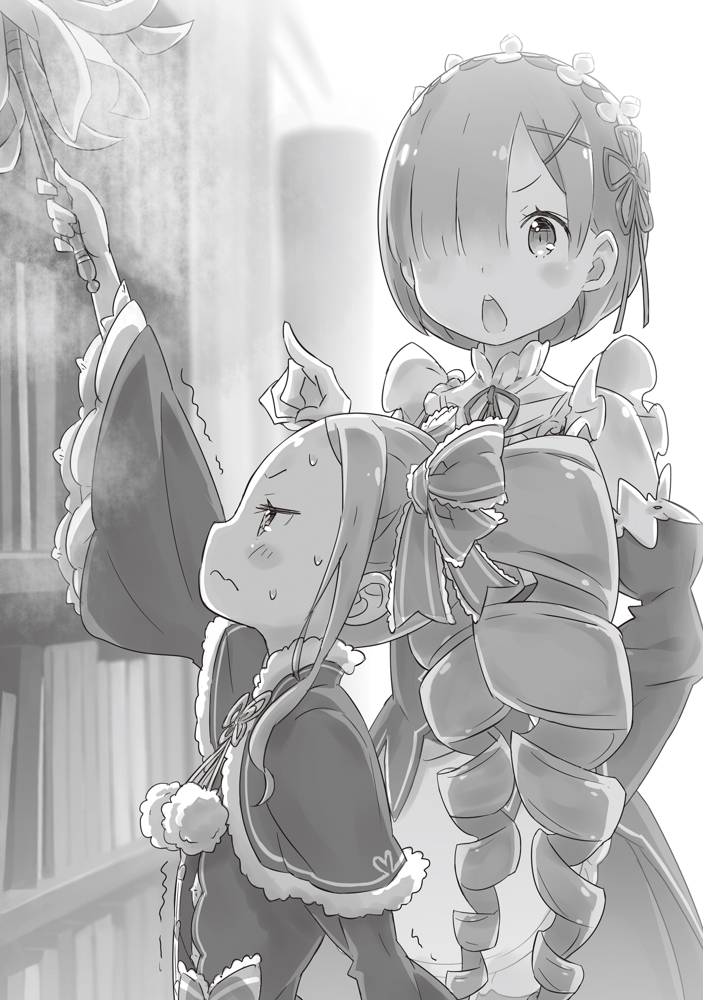

— Ха-а… — даже не постучав, девушка решительно переступила порог гостевой комнаты и при виде открывшейся картины невольно издала возглас крайнего отвращения.

Черты её лица были миловидны и прелестны: аккуратно подстриженные короткие волосы цвета спелого персика и узкие миндалевидные глаза, озарённые бледно-алым сиянием. Однако, вопреки очаровательной девичьей внешности, от неё веяло колким, проницательным холодом.

Впрочем, вся эта аура строгой собранности мгновенно развеялась, стоило ей скривиться так, будто перед ней предстало нечто невыносимо омерзительное.

— Этот голос… Рам, ты? Прости, что напугала.

Слова принадлежали вовсе не вошедшей служанке, а той, кто уже находился в комнате.

Голос звучал чисто и звонко, словно серебряный колокольчик, заставляя трепетать сердца слушателей — в хорошем или дурном смысле. Но на сей раз он разнёсся по комнате странно приглушённым, гулким эхом. И в этом не было ничего удивительного.

Ведь сидевшая посреди комнаты хозяйка голоса натянула себе на голову самое обыкновенное ведро.

— …Что за представление, госпожа Эмилия? Зачем вы напялили на голову ведро в таком месте?

— Хи-хи-хи, неужели сама не догадываешься?

— Рам видит лишь то, что вы заразились вирусом глупости от Барусу.

— Мне кажется, или ты сказала что-то о-о-очень странное? И вообще, это ведро действительно связано с Субару, но он сам ни о чём знать не должен. Умоляю, сохрани это в секрете!

— С Барусу связано, но от Барусу в секрете?.. Вы слишком всё усложняете, госпожа Эмилия.

Эмилия так и продолжала сидеть на стуле посреди гостевых покоев с ведром на голове. Говорить с человеком, чьего лица даже не видно, было сущей мукой — добраться до сути разговора никак не удавалось.

— М-м-м, ну ладно, сейчас всё объясню. И-и-и… хоп!

Словно уловив нарастающее раздражение Рам, девушка не спеша стянула с себя ведро.

В то же мгновение наружу водопадом хлынули ослепительные длинные серебряные волосы. Откинув за спину блестящие, будто сотканные из чистого лунного света пряди, Эмилия захлопала выразительными аметистовыми глазами и повернулась к горничной.

При этом ведро она продолжала бережно прижимать к груди, словно величайшую драгоценность. Рам скептически нахмурилась:

— Рам не припомнит, чтобы госпожа Эмилия питала столь нежные чувства к вёдрам.

— Да я и сама к ним особой привязанности не испытываю, просто прямо сейчас это ведро — мой учитель. Вот почему!

— …

Надеялась услышать хоть каплю здравого смысла, а в итоге от этой бессмыслицы лишь сильнее разболелась голова — Рам недовольно прищурилась. Заметив её реакцию, Эмилия торопливо замахала свободной рукой:

— А, нет-нет, всё не так! Эм, давай я объясню с самого начала. Рам, ты помнишь, что было сегодня в обед? Хотя мне бы о-о-очень не хотелось, чтобы ты об этом вспоминала…

— Вы про то пение, похожее на предсмертные хрипы птицы?

— Да… именно про э-это… Угу, всё верно…

От столь безжалостно прямолинейной формулировки горничной Эмилия виновато улыбнулась и повесила нос.

Глядя на поникшую полуэльфийку, Рам невольно воскресила в памяти события нескольких часов ранее. Дневные хлопоты по дому как раз подошли к концу, и каждый проводил свободный час как душе угодно.

Прогуливаясь по особняку в поисках горячо любимой сестры, Рам проходила мимо столовой и внезапно услышала неописуемо дикие вопли. Заподозрив, что этот кошмарный звук, похожий на крики удушаемой птицы, — очередная дурацкая выходка её коллеги Субару, Рам ворвалась внутрь, но…

— …И обнаружила госпожу Эмилию, которая, к всеобщему сожалению, пела на полном серьёзе.

— Не надо говорить «к сожалению»! Ну да, признаю, это звучало чуточку кошмарно…

— Чуточку?

— О-о-очень кошмарно! Довольна? Злюка ты, Рам!

Получив укол за нежелание признать очевидное, Эмилия окончательно надула губы. Однако в её поведении не ощущалось глубокой подавленности, которой ожидала Рам, отчего горничная озадаченно склонила голову набок.

По её расчётам, осознание собственной полнейшей бездарности в музыке должно было надолго выбить Эмилию из колеи.

— И всё же госпожа Эмилия ничуть не расстроена. Неужели за столь короткий срок вы успели смириться и махнуть на всё рукой?

— Уж не знаю, какого ты обо мне мнения, но я не расстроилась и вовсе не махнула рукой! У меня просто нет времени раскисать — я вся горю энтузиазмом!

— Вот как. Поразительно.

— Да, именно так! Я горю! Прямо-таки о-о-очень горю!

В ответ на безучастную реплику Рам глаза полуэльфийки взволнованно блеснули, и она повторила свои слова с удвоенной силой. На её лице буквально читалось: «Ну спроси же, спроси, чем я так горю!» , отчего горничной оставалось лишь тяжело вздохнуть.

— Рам всё же настаивает: вы подцепили заразу от Барусу.

— Да ничего подобного…

— …И почему же в вас полыхает такое пламя?

— О, хочешь узнать? Хи-хи, вот тут мы и возвращаемся к нашей истории с ведром! Удивительно, правда?

— Несомненно. Рам уже начала переживать, что ведро тут и вовсе ни при чём.

Эмилия с гордостью приподняла жестяное ведро, и Рам с облегчением выдохнула: беседа наконец вернулась в изначальное русло. Нежно проведя кончиками пальцев по железному боку, Эмилия заговорила:

— Субару объяснил мне. Оказывается, есть несколько способов исправить… от… о-отсутствие слуха.

— Не смущайтесь и продолжайте.

— Так вот, он сказал надеть ведро на голову, чтобы сначала самой услышать, насколько нескладно я пою. Сперва я подумала, что Субару снова валяет дурака, но оказалось, он подошёл к делу со всей серьёзностью. Поэтому и я решила, что должна постараться изо всех сил!

Настрой, безусловно, похвальный, однако логическая связь между ведром и музыкальным слухом всё ещё казалась сомнительной. Впрочем, сопоставив услышанное, догадаться было несложно.

— Хочешь узнать, как связаны ведро и плохой слух?

— Рам сгорает от нетерпения. Ведро надевают на голову, чтобы звук отражался от стенок и позволял отчётливее слышать собственную фальшь. Если есть какое-то иное тайное предназначение, соблаговолите объяснить.

— …Рам, ты уже знала о скрытых возможностях ведра?

— Рам знакома с вёдрами не первый день.

Разговор был настолько пустым, что Рам уже отвечала наугад с невозмутимым видом.

Однако на эту откровенную чушь Эмилия лишь с искренним благоговением протянула: «Вот оно как…» Подобная наивная доверчивость заставила Рам ощутить лёгкий укол тревоги.

Для Рам отношения с Эмилией всегда оставались сложным и неоднозначным вопросом.

Единственным истинным господином для неё был и оставался Розвааль — и в этом не могло быть сомнений. Тело, разум, душа — всё, чем она обладала, без остатка принадлежало ему, если не считать безграничной любви к младшей сестре.

Для воплощения замыслов Розвааля фигура Эмилии была незаменима. Именно поэтому хозяин поместья принял её под своё крыло и обращался с ней как с вышестоящей особой. Разумеется, следовать этому правилу Розвааль велел и обеим сёстрам, Рам и Рем, но…

— …Поразительно ненадёжная .

Именно к такому выводу раз за разом приходила Рам.

Чего стоил один лишь случай в столице, когда Эмилия умудрилась разминуться с сопровождавшей её Рам и потерять знак участника Королевского отбора. За четыре месяца знакомства подобных поводов для сомнений накопилось предостаточно.

Эмилия определённо не была тем человеком, на которого Рам могла бы положиться без оглядки. Она была слишком наивной, мягкой и незавершённой как лидер.

— И поэтому госпожа Эмилия решила в столь поздний час устроить себе тайные вокальные упражнения?

— Ну… в общем, да. Просто я подумала, что если начну петь у себя в комнате, то потревожу остальных. А в этом крыле никого нет, вот я и решила, что никому не помешаю.

— Но вы не ожидали, что Рам выйдет на ночной обход. Хотя Рам оказалась здесь чисто случайно.

Судя по всему, Эмилия проявила деликатность в своей манере и просто нашла укромный уголок, где на неё и наткнулась горничная.

Сколько ненужной суеты на пустом месте — особенно учитывая, что поводом была всего лишь борьба с медвежьим слухом.

— Рам не думает, что ради этого стоило жертвовать драгоценными часами сна.

— Когда ты так говоришь, мне и возразить нечего… Но сегодня я доставила Субару и остальным о-о-очень много хлопот, поэтому… мне хочется исправиться и сделать всё как надо.

— …

— На самом деле все занимались со мной пением только ради меня самой. Дело ведь не в том, чтобы сделать мой голос идеальным, а в том, чтобы… эм, как бы это точнее сказать…

— Дать вам развеяться?

— Да, именно, перевести дух! Мне было о-о-очень весело, и всё накопившееся напряжение словно рукой сняло. Вот я и подумала: наверное, ради этой передышки всё и затевалось.

Эмилия мягко улыбнулась. Рам, будучи сторонним наблюдателем, не знала всех подробностей дневного урока, но легко восстановила картину произошедшего.

В преддверии Королевского отбора, когда дорог каждый день занятий, Розвааль неспроста позволил Эмилии потратить время на праздную забаву. Последние дни она изводила себя зубрёжкой и едва держалась на ногах — это видели все обитатели поместья.

Выходит, Субару и господин Розвааль вступили в сговор, чтобы устроить для неё эмоциональную разгрузку.

— Подумать только… Жалкий Барусу посмел за спиной Рам сговориться с господином Розваалем и провернуть столь тонкую интригу…

— Рам? У тебя взгляд стал какой-то пугающе свирепый, всё в порядке?

— Да, Рам в полном порядке. Лишь на мгновение потеряла хладнокровие. Так вот…

Поняв чужую заботу и получив столь необходимый отдых, Эмилия теперь до глубокой ночи мучает себя упражнениями. Это не просто бессмыслица — это на корню перечёркивает всю задумку.

Словно прочитав мысли служанки, Эмилия приложила тонкий пальчик к губам и улыбнулась:

— Не переживай. Все уже показали мне, как правильно сбрасывать напряжение. Теперь я хочу сохранить эту легкость и в то же время научиться петь по-настоящему.

— Рам полагает, что вокал в планах Барусу и господина Розвааля стоял на самом последнем месте.

— Я всё понимаю. Но мне хочется преуспеть во всём. Разве нельзя стремиться сразу к обеим целям?

Эмилия склонила голову набок. За этим простым жестом скрывалось нечто большее, чем банальное желание скрыть свой изъян, и Рам понимающе кивнула. Всё-таки госпожа Эмилия была весьма необычной особой.

— А вы стали более жадной, чем прежде, госпожа Эмилия.

— Разве ты не знала, Рам? Я вообще-то собираюсь стать правительницей этой страны!

По сравнению с масштабом подобной цели любые повседневные мелочи даже не стоило взвешивать на весах. Услышав столь веский довод, Рам невольно дрогнула уголками губ.

И это была не усмешка и не язвительная ухмылка, а редкая, искренняя улыбка, родившаяся в самой глубине души.

— О, Рам улыбнулась! Я сказала что-то забавное?

— Кто знает? Просто Рам самую малость изменила своё мнение о госпоже Эмилии в лучшую сторону.

— Правда? Тогда я, пожалуй, порадуюсь!

«Изменить мнение в лучшую сторону» на деле означало, что до сей поры её ни во что не ставили, однако Эмилия даже не придала значения скрытой шпильке, приняв похвалу с открытым сердцем.

Прямодушная, наивная — казалось бы, идеальная фигура для манипуляций. Но из-за её непредсказуемой незрелости от неё вечно следовало ожидать сюрпризов. Невероятно хлопотная девушка.

И всё же…

— Пусть неидеальна, но так упряма в своих стремлениях… К такому человеку сложно испытывать неприязнь.

Ведь точно таким же существом всегда оставалась и её драгоценная вторая половинка.

Пусть их стремления с горячо любимой сестрой лежали в разных плоскостях, Рам не могла презирать тех, кто изо всех сил старался заполнить собственные пустоты. Ведь самой Рам это чувство было попросту недоступно.

— Ты сейчас что-то сказала?

Не расслышав тихого шепота Рам, Эмилия озадаченно хлопнула ресницами. Поймав её недоуменный взгляд, Рам лишь сдержанно повела плечом:

— Да, Рам поинтересовалась, принесли ли хоть какие-то плоды эти полуночные титанические труды госпожи Эмилии.

— Ого, какой дерзкий вызов! Ну ладно! Раз уж ты всё равно здесь, послушай сама. На самом деле ещё во время дневных занятий мой голос стал заметно лучше. Но сейчас я шагнула ещё дальше!

— Что ж, Рам обратилась в слух. Продемонстрируйте всё, на что способны.

Рам сделала приглашающий жест рукой в сторону преисполненной решимости полуэльфийки и присела на край свободной кровати. Покрывало слегка смялось, но разглаживать его завтра всё равно поручат Барусу. Никаких проблем.

— Ля, ля, ля-ля-ля…

Поймав ободряющий знак и сосредоточенный взгляд Рам, Эмилия, слегка смутившись, запела. На первых же звуках её голос едва заметно сорвался, но затем выровнялся и полился плавно и чисто. Это действительно была песня.

Если вспомнить, что всё начиналось с предсмертных воплей придушенной птицы, подобный шаг вперёд можно было счесть чуть ли не историческим триумфом.

— …

По ходу пения мелодия захватывала всё сильнее, и Эмилия, покачивая плечами в такт, полностью погрузилась в музыку. Рам, взявшая на себя роль единственного зрителя, сама не заметила, как прикрыла глаза, отдавшись чарующему звучанию.

«Песнь любви Демона Меча» была одной из самых известных баллад о любви во всём королевстве. Когда в поместье гостила бродячая менестрель Лилиана, Рам и сама втайне заслушивалась её чарующим исполнением. Конечно, до мастерства Лилианы пению Эмилии было далеко: неопытность и мелкие помарки то и дело давали о себе знать.

Но в целом… это было красиво.

— …

Ближе к финалу перед мысленным взором Рам отчётливо заструились образы, рождённые текстом старинной поэмы. Осознав, насколько сильно она прониклась исполнением, Рам сдержанно усмехнулась.

И прежде чем эта мягкая улыбка сошла с её уст, песня смолкла, и Эмилия с замиранием сердца повернулась к слушательнице:

— Я закончила! Жду твоего честного мнения!

— Что ж… Девять баллов.

— Ого! Из девяти возможных?!

— Не стоит внезапно наглеть. Разумеется, по стобалльной шкале.

От столь беспощадного вердикта Эмилия комично ссутулилась и опустила плечи. Однако уже в следующее мгновение она решительно сжала кулачки, подняла сияющее лицо и спросила:

— Но ведь стало хоть капельку лучше? А сколько бы ты поставила за самое первое исполнение в обед?

— Какая дерзость — полагать, будто за тот кошмар вообще начислялись баллы.

— Неужели всё было настолько плохо?!

Назвать те первоначальные звуки пением было бы тягчайшим оскорблением самого музыкального искусства — вот до какой степени всё было ужасно. Поэтому в сравнении с дневным кошмаром нынешнее пение Эмилии вполне заслуживало твёрдого зачёта.

— Но госпожа Эмилия ведь не намерена довольствоваться одной лишь тройкой с плюсом?

— Ни за что! Я хочу стараться дальше и научиться петь по-настоящему хорошо. К тому же… если начистоту, все остальные песни, кроме «Песни любви Демона Меча», я по-прежнему безбожно фальшивлю…

Смущённо почесав пальцем щеку, Эмилия строго укорила себя за недостаток мастерства. Глядя на это неукротимое упорство и то, с каким пылом девушка бросалась в омут с головой, Рам не сдержала тихого вздоха.

Если пустить всё на самотёк, Эмилия загонит себя ночными репетициями, и вся польза от дневного отдыха пойдёт прахом.

— В таком случае будем заниматься раз в два дня. Только в строго оговорённый час и только в этой комнате. Рам как-нибудь выкроит для вас время в своём расписании.

— …Ты поможешь мне? Правда, Рам?

— За госпожой Эмилией нужен постоянный присмотр, иначе на душе у Рам будет неспокойно.

В этих словах не было ни капли фальши, пускай в глубине души Рам и руководствовалась холодной заботой о благе господина Розвааля.

Но даже отбросив все расчеты в сторону… эта песня и впрямь звучала совсем не дурно.

— Спасибо тебе огромное, Рам! Я буду о-о-очень стараться вместе с тобой и Учителем Ведром!

— Будьте добры, не ставьте Рам на одну ступень с помойным ведром.

Вот к такому причудливому соглашению они пришли — и ночные уроки музыки продолжались в особняке ещё довольно долго.

《Конец》
