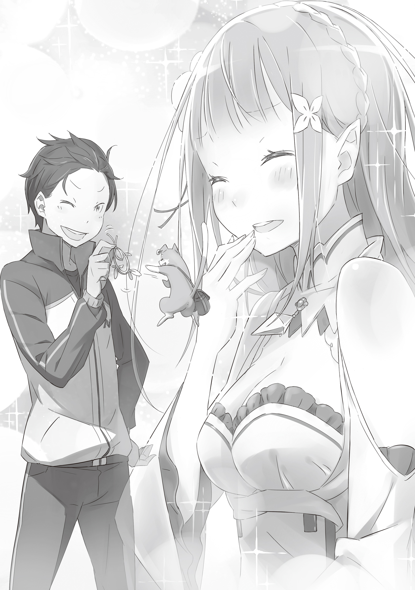

У Нацуки Субару практически не было опыта прогулок по району рядом с противоположным полом.

Последней женщиной, с которой он ходил за руку, была его мать; ему нужно было бы вернуться в начальную школу, чтобы найти время, когда он общался с противоположным полом, помимо родственников. Учитывая, что ему пришлось пройти бы вернуться в то время, когда не существовало различий между мужчинами и женщинами, дабы найти какие-либо воспоминания об этом, это многое говорило о его отношениях.

— Пусть так, но попытка найти девушку среди этой толпы похожа на поиск иголки в стоге сена.

Субару продолжал разговаривать с девушкой, идущей рядом с ним, не в силах выдержать неловкое молчание. Иначе он бы не знал, как скоротать время.

— Наверное, ты прав… Но мы же не можем просто сдаться. Если мы должны найти иголку, то мы её найдём. Хотя на самом деле только я виновата в том, что ослабила бдительность.

Ответившая ему девушка была так красива, что ему казалось, словно его глаза вот-вот лопнут.

У неё была белоснежная кожа и длинные серебряные волосы, переливающиеся, словно лунный свет. Её белое одеяние подчёркивало невинность, а аметистовые глаза были полны решимости, смотря вперёд.

Её живописная красота выделялась даже на фоне короткой жизни Субару. И что ещё хуже, он с трудом мог совладать с собой из-за того, что она полностью соответствовала его вкусам.

Впрочем, это была не единственная причина, по которой Субару шёл с ней.

— В любом случае, я в долгу перед тобой за то, что ты мне помогла, поэтому я собираюсь отдать все силы за тебя, моя юная леди.

— Я уже говорила тебе, что ты не должен делать ничего подобного… Странный ты парень.

Хотя девушка упрямо отказывалась признавать это, факт оставался фактом: она спасла ему жизнь. Ему не нужно было больше никаких причин, чтобы помочь ей.

— Ну, даже если так…

Идя впереди девушки, он быстрым шагом направился по узкому переулку. Затем он остановился на месте, повернулся и принял свою обычную позу, когда она с сомнением наклонила голову.

— Кстати, такое ощущение, что мы идём куда-то, где меньше людей. Ты уверена, что нам в ту сторону?

— Разве не ты вёл нас по знакомой дороге?

Казалось, что впереди их ждут большие неприятности, но поход этого странного дуэта уже шёл наперекосяк.

У девушки практически не было опыта прогулок по окрестностям рядом с человеком противоположного пола. Вернее, она с трудом могла припомнить, что проводила время с кем-то подобным.

— Нервничаешь?..

Голос внезапно зашептал ей на ухо, вызвав лёгкую улыбку на её лице.

— Немного. Но сейчас не время беспокоиться о таких вещах.

Она намеренно поджала губы, отвечая голосу чем-то похожим на шёпот. Хотя на самом деле они не разговаривали, а использовали что-то вроде «мысленных волн» для общения: вид магии, который использовал путь между заключившим контракт духом и его хозяином, чтобы поделиться своими мыслями.

Молодой человек рядом с ними ничего не слышал из их разговора, он ходил кругами в поисках того, к кому можно было бы обратиться.

Это был странный молодой человек. Она не обратила на это внимания, когда впервые столкнулась с ним, загнанным в угол теми бандитами, но он был странно одет. У него были необычные чёрные волосы и тёмные глаза; кроме того, время от времени он говорил что-то на странном языке, которого она никогда раньше не слышала. Скорее всего, он был иностранцем, но даже в этом случае в нём было много странностей.

Он был странно предусмотрителен для своей уверенности и, казалось, много знал, несмотря на отсутствие здравого смысла. Даже девушка могла сказать, что что-то не так, несмотря на то, что считала, что не может говорить за других.

— Но определённо благодаря Субару мы смогли приблизиться к нашей цели. Ты должна отдать ему должное. Не думаешь, что он будет рад, если ты его похвалишь?

— Хватит болтать глупости. Я сомневаюсь, что он будет в восторге, даже если я ему что-нибудь скажу.

Тон голоса духа звучал приятно, в отличие от её голоса, в котором ощущались признаки обескураженности, вероятно, потому что она понимала, в каком положении находится. Тем не менее…

— Но этот мальчик произвёл впечатление, словно его не волнуют такие вещи, как твоя личность, не правда ли? Я не знаю, что ты думаешь по этому поводу, Сателла.

В его словах был небольшой намёк на упрёк, который девушка приняла, вместе с укором совести, пришедшим вместе с ним.

Её щеки всё ещё краснели, когда она вспоминала, как черноволосый парень, назвавшийся Нацуки Субару, без труда принял её признание в том, что она полуэльф.

Наверное, никогда в жизни этой девушки не было момента, когда стыд так сильно заполнял её сердце, как сейчас. Реакция Субару тогда была для неё совершенно неожиданной. Она заставила её осознать, насколько поверхностной и самонадеянной она была, доведя себя почти до слёз.

И что действительно не могло служить ей спасением, так это её собственное сердце, которое было так счастливо от этого.

— Может быть, я просто очень плохой человек…

— Хм? Ты что-то сказала?

— Нет, ничего… Давай просто поспешим и обыщем трущобы.

Взволнованная, девушка попыталась оправдаться за то, что проговорилась вслух. Она подтолкнула юношу вперёд, когда он в замешательстве наклонил голову.

Они помогли потерявшемуся ребёнку, и благодаря этому смогли выйти на её мать, которая рассказала им о трущобах, куда попадают краденые вещи.

Как она вообще могла вознаградить этого молодого человека после того, как он завёл её так далеко?

Совсем забыв, что она спасла ему жизнь, когда они впервые встретились, девушка продолжала волноваться, не понимая, что они находятся рядом друг с другом.

Видя, что девушка по имени Сателла всё больше и больше унывает, Субару начал с тревогой думать, не напортачил ли он, выступая в роли её сопровождающего.

Её цель — поиск знака отличия — пока что казалась успешной.

Они всё ещё не нашли предмет, о котором шла речь, но он чувствовал, что они добились хорошего прогресса в его поисках.

Несомненно, поиски потерянного ребёнка дали им ценную информацию и подняли ветер в их парусах.

Тем не менее, с тех пор, как они начали обыскивать трущобы, Сателла вела себя странно, вздыхая и выдыхая каждый раз, когда смотрела в его сторону.

Я в том смысле, что очень неприятно, когда кто-то смотрит на твоё лицо и вздыхает. И если вам кажется это недостаточно болезненным, то говорю вам, всё становится в четыре раза страшнее, когда это делает красивая девушка.

Любой, кого «оскорбила» бы такая красивая девушка, получил бы такой же сильный удар; такова была свирепость этой особой атаки. Тот факт, что эта девушка не была удовлетворена, не соответствовал всему жизненному опыту, который он накопил до сих пор.

Хотя, у меня действительно нет никакого жизненного опыта, который можно было бы сопоставить с подобными вещами.

Вот почему он прилагал большие усилия, используя свою живость, чтобы попытаться компенсировать недостаток опыта. Но пока что все темы, колкости и американские шутки, которые он поднимал, проваливались. Тогда ему оставалось только вознаградить её реальными результатами, и он решил вернуться к своему первоначальному плану и показать ей плоды своих трудов.

Субару не понимал, что, действуя подобным образом, он только ещё больше отталкивает девушку.

Я должен дать ей увидеть мою крутую сторону, показав значительные результаты. Я должен воспользоваться этой удачей.

Отношение людей к тому, что Субару задаёт им вопросы, значительно улучшилось с тех пор, как они пришли в трущобы. Как ни странно, большинство людей на центральных улицах даже не удосуживались уделить им время; в то время как на задворках они получали гораздо более доброжелательные ответы.

Даже сейчас Субару всё ещё держал в руках какой-то сушёный фрукт, который дала ему старая женщина, сказав при этом: «Съешь это и будь сильным». Он не чувствовал себя достаточно смелым, чтобы положить его в рот, но всё же её внимание было воспринято с пониманием.

— Думаю, я просто скормлю это Паку или кому-нибудь ещё. Иди сюда, кис-кис-кис…

— Пожалуйста, не давай ему ничего странного.

— Если ты думаешь, что я поведусь на эти дешёвые уловки, которые работают только при кормлении бродячих животных, то ты сильно ошибаешься.

Серый котенок высунулся из серебристых волос Сателлы и забрался ей на плечо. Очевидно, он должен был быть великим существом, известным как «Дух», но Субару видел в нём не более чем кота, хотя и довольно необычного. Да и ответ Сателлы был больше похож на то, что можно сказать, скорее, домашнему животному, нежели Духу.

— По тому, как ты это говоришь, мне кажется, что ты говоришь как стандартный неигровой персонаж…

— Хмпф. Ты можешь говорить мне такие вещи только сейчас. Подожди, когда я раскрою свою истинную силу, и ты пожалеешь обо всех своих неосторожных высказываниях… Мяу-мяу-мяу!

И всё же на полпути своей величественной речи он щёлкнул кончик носа Духа — Пака — несколькими травинками, которые он скрутил вместе. Как только он это сделал, Дух начал отмахиваться от него лапами, действуя совсем как кот. Действительно, он только лаял, но не кусался.

— Ты чертовски хорошо умеешь подыгрывать…

— Мне больно это признавать… Но я действительно не могу устоять перед игрой с ним!..

Лицо Пака стало очень похожим на кошачье, когда он играл с Субару. Теперь кот был полностью под чарами молодого парня. Наблюдая за ними, Сателла не могла удержаться от того, чтобы не разразиться небольшими смешками.

Субару увидел её реакцию, и с этим одно из его заданий было выполнено; задание, которое он выполнял с таким же энтузиазмом, как и поиски знака отличия. Он поднял большой палец вверх, вызвав незаметный кивок Пака.

С улыбкой на лице она выглядела гораздо лучше.

По крайней мере, с этим были согласны и Субару, и сам Дух.

— Нет… Ничего страшного. Я принесу ему надлежащие извинения, когда получу свой знак отличия обратно.

— Я не знаю, за что ты пытаешься извиниться. Было бы лучше поблагодарить его. А если это заставит тебя улыбнуться ещё больше, то это будет просто замечательно.

— Ты дурак.

Субару вошёл в гостиную, всё время изображая браваду. Девушка отпустила его, поблагодарив от всего сердца. Ей было что рассказать ему, когда он вернётся после выполнения своей цели.

— Хотя… Наверное, я ещё большая дурочка, чем ты…

Девушка стояла на страже снаружи, как и просил её молодой человек.

Она тихонько поднесла руку к кулону, который носила на груди. Он выглядел как ярко-зелёный кристалл, и в нём дремал Дух, на которого она полагалась больше, чем на кого-либо другого в этом мире.

Сегодня она слишком долго держала рядом с собой и его, и Субару.

Возможно, Пак не сможет простить её, сколько бы она ни извинялась, особенно за то, как нечестно она поступила с Субару. Хотя извиниться было бы самым благородным поступком, сама мысль об этом была поверхностной.

По крайней мере, сейчас она могла только молиться, чтобы с этим глупым юношей не случилось ничего плохого.

— А?..

И всё же её молитву прервал звук внезапного грохота.

Она вскинула голову и вбежала в дом, бдительно глядя своими аметистовыми глазами.

Это было большое, старое, одноэтажное здание, расположенное в глубине трущоб. Прошло всего несколько минут с тех пор, как она отправила Субару в кромешную тьму, ожидавшую его за огромными закрытыми дверями.

— Субару?..

Девушка без колебаний шагнула внутрь, всё ещё сохраняя бдительность.

Она сосредоточилась и убедилась, что дрейфующие вокруг неё Квази Духи готовы в любой момент начать действовать. Затем, прищурив глаза в темноте, она вдруг заметила белое свечение, исходящее от чего-то, упавшего в углу комнаты.

Оно исходило от источника света — руды лагмита, которую она дала Субару.

— !?..

Она на мгновение замешкалась, раздумывая, стоит ли ей подойти к нему. Однако в этот момент решение было принято за неё.

Девушка почувствовала, как что-то свистнуло в её сторону. Она тут же обернулась, отдавая команду своим Квази Духам. Но прежде чем они успели выполнить приказ полуэльфийки, её тело пронзило острое лезвие.

Удар пронзил её насквозь, и она рухнула на твёрдый пол, не в силах ничего с этим поделать. Она почувствовала, как её охватывает жуткий холод, гораздо более сильный, чем палящий жар. Но лишь на мгновение она ощутила их.

— Ах…

Бесчисленные мысли, чувства, решения, воспоминания и ответы промелькнули в её голове. Словно мутный поток, они сметали все её страхи и сожаления. В час своей смерти девушка поняла, что стала совершенно пустой.

Она ничего не узнала. Она ничего не поняла. Всё просто заканчивалось, так и не начавшись. И всё же в этот момент…

— …одожди…

Она услышала голос. Голос, который, казалось, почти угас, голос, полный страдания и сожаления.

Голос, который, как и её голос, был на грани смерти. Он был близок к концу, но всё ещё не желал признавать поражение.

Но тогда почему же я…

— Я обязательно…

Почему я так хочу верить в последующие слова?

Однако на этом история пока заканчивается. Мысли девушки не вознаграждены, слова юноши не услышаны, но, несмотря на это, история возвращается назад и начинается заново.

Возможно, только тогда время, проведённое ими вместе, будет вознаграждено.
