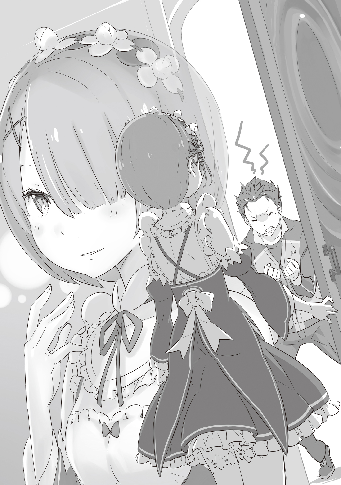

— Барусу, у тебя неплохой почерк.

Стоило Рам обронить это тихое замечание, как скрип пера, до этого царивший в тишине, резко оборвался. Юноша, сидевший за соседним столом, поднял на горничную изумлённый взгляд. Глаза его, как обычно, пугали своей хищной недоброжелательностью, но сейчас в них читалась растерянность.

— Ч-что на тебя нашло? Не то чтобы я напрашивался на грубость, но когда ты вдруг начинаешь хвалить, меня это пугает сильнее, чем ругань.

— Ничего особенного. Просто озвучила факт. Учитывая, что ты всё ещё в процессе обучения, на ошибки можно закрыть глаза, но сами линии выходят у тебя вполне сносно.

Услышав оценку, выданную в фирменной бесстрастной манере Рам, Нацуки Субару мгновенно расслабился. Колючее выражение исчезло, сменившись широкой ухмылкой, а на лице расцвело неприкрытое самодовольство.

— Да? Правда? Думаешь, у меня есть потенциал? Вот это я понимаю! Значит, не зря в детстве ходил на каллиграфию, пусть и бросил на полпути! Талант не пропьёшь!

— К тому же… впрочем, неважно. Забудь.

— Эй! Что это за многозначительная пауза?! Если ты осеклась, значит, там было самое главное! Не проглатывай слова, выкладывай! Я принимаю комплименты круглосуточно, без перерывов и выходных!

Субару с важным видом ткнул в себя большим пальцем. Рам удостоила его коротким, ничего не выражающим кивком: — За хорошие результаты следует хвалить. За проступки — ругать. И с осторожностью давать корм… Так было написано в одном трактате, который я читала давным-давно.

— Это что, инструкция по дрессировке собак?!

— В том смысле, что ты так же невоспитан, разница невелика.

— Зря я обрадовался-а-а-а!

Субару вскинул руки к потолку и так резко откинулся назад, что спинка стула жалобно взвизгнула.

Западное крыло особняка Розвааля было царством хозяйственных нужд: комнаты слуг, склады инвентаря, бельевые, хранилище антиквариата и библиотека. Здесь же, на втором этаже, располагались покои Рам и её сестры Рем. И совсем недавно в соседнюю комнату заселили новичка — Нацуки Субару.

Обстановка была спартанской: простая кровать да стол без украшений. Если не считать сменной формы дворецкого и шкафа, где хранился странный спортивный костюм, в котором юноша прибыл в этот мир, комната была совершенно пуста.

И именно в этих аскетичных декорациях каждую ночь при свете магической лампы уединялись парень и девушка… Вот только занимались они вовсе не тем, что могло бы прийти вам в голову, а прозаичным чистописанием.

— Барусу, ошибка. Хватит наступать на одни и те же грабли.

— А-а-ай!..

Тонкая указка в руке горничной метко щёлкнула по пальцам Субару, сжимавшим перо. Выронив инструмент, он принялся дуть на покрасневшую кисть, бросая на мучительницу обиженные взгляды.

— Это уже слишком по-спартански! Я из тех цветов, что лучше цветут от ласки и похвалы, а не от палки!

— Хочешь похвалы — покажи результат. Тогда Рам, так и быть, скрепя сердце, скажет тебе доброе слово.

— Можно без этого «скрепя сердце»! Хотя ладно, переживу… Но с глифами могла бы дать поблажку! Я их пока с трудом различаю, они же все на одно лицо!

— Плохо стараешься, — безжалостно припечатала Рам.

Субару, словно ожидая этого вердикта, лишь пожал плечами: — Легко тебе говорить, сестрица. А ты сама попробуй, поймёшь, каково это — вникнуть в чужую культуру! Мало того, что письменность другая, так мне ещё по работе кучу инструкций зубрить надо. Голова пухнет!

— И? Продолжай.

— Я к тому, что раз ты обвиняешь меня в лени, значит, сама-то наверняка схватываешь всё на лету?

Увидев, что Рам лишь слегка нахмурилась от его трескотни, Субару с противным смешком «хе-хе-хе» выдвинул ящик стола. То, что он извлёк на свет…

— Та-да-м! Хирагана, все пятьдесят звуков!

— Что это?..

Субару развернул лист бумаги размером со столешницу. Он был сплошь испещрён значками, напоминавшими то ли извивающихся червяков, то ли загадочные рисунки.

— Письменность, которую используют у меня на родине. Называется «хирагана». Аналог местных и-глифов.

— Хочешь сказать, это государственный язык Королевства Барусу?

— Прекрати выдумывать страны, которые существуют только в твоём воображении! Если бы я настолько заморочился с проработкой лора, что выдумал свой алфавит, меня надо было бы пожалеть, а не дразнить!

— В сборнике сказок, который мы используем как учебник, была история «Одинокий Король», главный герой которой подозрительно напоминал нынешнего Барусу. Жди, скоро дойдём до этой главы.

Представив по названию всю трагичность сюжета, Субару скорчил печальную мину. Рам проигнорировала его пантомиму, пробегая взглядом по символам.

Закономерность в них вроде бы присутствовала, но какая-то чуждая, зыбкая. Каждый знак обладал уникальной формой, и для глаза, привыкшего к строгим линиям и-глифов, это выглядело хаотично. Словно ребёнок пытался нарисовать змей в разных позах.

— Допустим. Ты показал мне письмена Королевства Барусу. К чему это?

— Ну, я подумал: раз уж я тут потею над прописями, а ты просто сидишь и сверлишь меня взглядом, почему бы тебе не потратить время с пользой? Прикоснись к иной культуре! Заодно оценишь, какой это адский труд — учить новый алфавит с нуля, и, может быть, в твоём ледяном сердце проснётся сострадание!

Уловив во второй части фразы его истинные, шкурные мотивы, Рам устало вздохнула.

Надо же, додумался до такого изощрённого способа досадить ей.

— И с чего бы Рам принимать это нелепое предложение?

— А как же шанс доказать свою правоту? Смотри: если ты сходу это выучишь, я признаю, что я просто ленивый дурак. И обещаю впредь не ныть, а пахать как ломовая лошадь, беспрекословно следуя твоим указаниям. Но если у тебя не выйдет…

— Если не выйдет?

— Будешь со мной помягче! И Рем попросишь! Это обещание! Это важно!

Стул жалобно скрипел под Субару, который всем своим видом излучал мольбу. Рам посмотрела на него как на проблемный домашний скот. Парень слегка струхнул под её тяжёлым взглядом, вжал голову в плечи, но отступать не собирался.

«Что ж поделать», — подумала девушка. Её очередной вздох получился тяжелее предыдущего.

— Общаясь с Барусу, я замечаю, что вздыхаю всё чаще.

— Мне часто это говорят.

— Справедливая оценка. — Она требовательно протянула ладонь. — Давай сюда.

Рам выхватила лист с хираганой из рук просиявшего Субару, который тут же выпятил грудь колесом. Беглого анализа хватило, чтобы понять структуру: эта система фонетически перекликалась с общим языком, глифами.

— Порядок звуков схож с и-глифами?

— В целом, да. Но я объясню нюансы. Хочу честного поединка, без дураков.

Неизвестно когда это превратилось в поединок, но раз уж противник настроен серьёзно, Рам проигрывать не собиралась. Её кредо было простым: если битва неизбежна — нужна только полная, безоговорочная победа.

Она слушала объяснения Субару, который водил пальцем по листу, заучивая общее расположение и порядок. Параллельно её разум фиксировал формы, начертания, выстраивая ассоциативные ряды и мгновенно загоняя чужеродные символы в ячейки памяти.

— Всё, лекция окончена. Время — пока не закончится наш сегодняшний урок… В конце я дам небольшое задание. Посмотрим, на что ты способна.

— Хорошо, вызов принят. Рам заставит тебя работать усерднее земляного дракона и наконец-то насладится тишиной.

— Хе-хе-хе, скоро эта самоуверенная мина сменится заплаканной гримасой!

Бросив реплику, достойную карикатурного злодея, Субару вернулся к своим прописям. Убедившись, что он занят делом, Рам с листом в руке присела на край кровати. Магический кристалл давал лишь тусклый свет, но ночное зрение Рам позволяло ей отчётливо видеть аккуратный, убористый почерк на «шпаргалке».

— Барусу, а где ты учился письму?

Вдруг подумалось, что она уже давно не проводила время вот так — в тишине, наедине с новыми знаниями.

— О, стоило мне сосредоточиться, как ты начала отвлекать разговорами? Психологическая атака? Не вый…

Субару обернулся, но, увидев лицо Рам в полумраке, запнулся. Возможно, выражение её лица показалось ему слишком задумчивым или даже одиноким, потому что колкость застряла у него в горле.

Помолчав, он яростно почесал затылок:

— «Где»… сложный вопрос. Наверное, дома, родители учили… это будет ближе всего к правде. Честно говоря, не помню, учили ли мы это в детском саду.

— Детский сад?

— Это такое заведение, куда сдают совсем мелких, прямо крох. Там в основном едят, спят и играют в кубики. Ну и, наверное, прививают навыки выживания в коллективе?

Субару показал рукой уровень где-то у пояса. Судя по описанию, это учебное заведение для детей четырёх-пяти лет. В Лугунике подобных институтов не водилось.

— Школа… место для учёбы. Ты посещал её?

— Ну, типа того. Ходил, пока это было обязательно… А когда всё стало зависеть от моей воли, меня занесло не туда. Ну и пока я так болтался без дела, оказался здесь.

Он опустил глаза, словно слова давались ему с трудом. Заметив, как потемнело его лицо, Рам решила не ковырять эту рану — очевидно, что прямого ответа она не получит, а слушать уклончивое бормотание не хотелось.

Но даже из этих обрывков можно было сделать вывод: Субару происходит из семьи с достатком выше среднего. Если теория господина Розвааля верна, он, вероятно, сын какого-нибудь знатного рода из малой страны за пределами Четырёх Великих Держав.

Густеко на севере, Волакия на юге, Карараги на западе и Лугуника на востоке делят континент, но между ними, в «слепых пятнах», существуют малые страны. Необычная внешность Субару и наличие собственной письменности лишь подтверждали эту гипотезу.

— А сама Рам? — вдруг перехватил инициативу Субару. — С каких пор ты работаешь у Розвааля?

— Если считать с момента, когда господин Розвааль взял нас под опеку… с одиннадцати лет. Значит… уже шесть лет прошло.

— С одиннадцати, шесть лет… стоп. Тебе семнадцать? Мы ровесники?

— И что означает это удивление?

— Ты просто… выглядишь моложе. В смысле, ведёшь себя как строгая старшая сестра, но внешне… Да ладно. Если Рам семнадцать, то и Рем тоже… Неожиданно… Я и правда думал, что ты младше.

— Рам тоже, глядя на твою неусидчивость, Барусу, думала, что тебе лет десять. Максимум двенадцать.

Это была чистая правда. Черты его лица, если не брать в расчёт тяжёлый взгляд, казались мальчишескими. А главное — его ветер в голове никак не вязался с семнадцатью годами, возрастом, когда мужчине пора бы уже крепко стоять на ногах.

— Но с одиннадцати лет… совсем же дети. Вы получили согласие родителей? Или здесь нормально в таком возрасте уходить в служение?

— Уезжать из дома на заработки в двенадцать-тринадцать — дело обычное. Хотя случай Рам и Рем был обременён особыми условиями.

— Особыми?

— Всё просто. Рам закатила истерику, заявив, что шагу не сделает без Рем.

— А-а, понятно.

Субару, успевший заметить трепетное отношение сестёр друг к другу, понимающе закивал.

Рам прекрасно осознавала свои недостатки: в домашнем хозяйстве от неё было больше вреда, чем пользы. Особняк функционировал лишь потому, что Рем работала за двоих, компенсируя неуклюжесть старшей сестры.

Поэтому она не собиралась что-то ему рассказывать. Отношения между ней и сестрой — это не то, что она хотела бы объяснять кому-то, кроме Розвааля, бывших сослуживцев и близких друзей.

Пока непонятно, кем станет Субару в этом доме в будущем — объяснять не было смысла.

— Время для пустых разговоров вышло.

Кристалл-хронометр над дверью налился густым тёмно-жёлтым светом, возвещая о наступлении глубокой ночи. Субару потянулся до хруста костей и повернулся к ней: — Лады. Спасибо за труды, учитель. Увидимся завтра, прошу любить и…

— Могу заставить тебя пожалеть о том, что ты считаешь, будто «завтра» для тебя наступит как нечто само собой разумеющееся.

— Виноват! Шучу я! Итак, время битвы. Вот вопрос. Прочти это и запиши ответ хираганой.

Субару вытянул из стопки один лист и с плотоядной ухмылкой перевернул его. На бумаге красовался заголовок «Вопрос», под которым следовал текст на языке Лугуники.

— Разумеется, шпаргалку я конфискую. Ну-с, прошу!

Он сиял, явно предвкушая, как Рам будет потеть и путаться в незнакомых закорючках. Рам же, даже не удостоив его злорадство взглядом, пробежала глазами по заданию… Секунда на размышление, и затем…

— Пф-ф…

Она взяла перо, изящным движением обмакнула его в чернила и быстро вписала символы в поле «Ответ». Закончив, она молча ткнула листок прямо в ошарашенное лицо Субару.

— Вопрос: «Напиши имена сестер, живущих в поместье». Ответ: «Рам и Рем». Проверяй.

— Да ладно?! Идеально?! Ты серьёзно, за такое время?!

Его реакция подтвердила, что расчёт Рам оказался верен. Учитывая характер Субару, загадка обязана была касаться их окружения. Имена Эмилии, Розвааля, Беатрис и самих близнецов — выучить десяток символов для Рам не составило труда.

— Просто кое-кто чуть более сообразителен, чем кажется. Барусу, ты помнишь наш уговор.

— П-погоди… тут должен быть трюк… Я просто тупой и не понимаю, но ты точно смухлевала… да?!

Щелчок пальцев по лбу заставил Субару, открывшего было рот для возражений, отшатнуться. Рам сладко зевнула и, не оборачиваясь, направилась к выходу. У самой двери она притормозила, бросив взгляд через плечо на парня, который тщетно пытался стереть с лица выражение вселенской скорби.

— С нетерпением жду завтрашнего утра. Приятных снов, Рам пошла спать.

— Ну ты и демон…

Раздосадованное лицо Субару скрылось за закрывшейся створкой. Последняя реплика неудачника прозвучала настолько иронично-точно, что Рам едва удержалась от смешка.

— Теперь Барусу волей-неволей придётся взяться за ум.

Рам чувствовала удовлетворение: она загнала его в ловушку, но тем самым подстегнула его мотивацию на будущее. Она спешила уйти по коридору подальше, смакуя мысленную картину того, с каким кислым лицом Субару встретит новый день.

— И всё же…

Внезапно шаг её замедлился. В памяти всплыли те самые «змеиные» символы, которые рисовал Субару.

— Кажется, я где-то их уже видела…

Её едва слышный шёпот упал в пустоту ночного коридора, не достигнув чьих-либо ушей, и растворился в холодном воздухе поместья.
