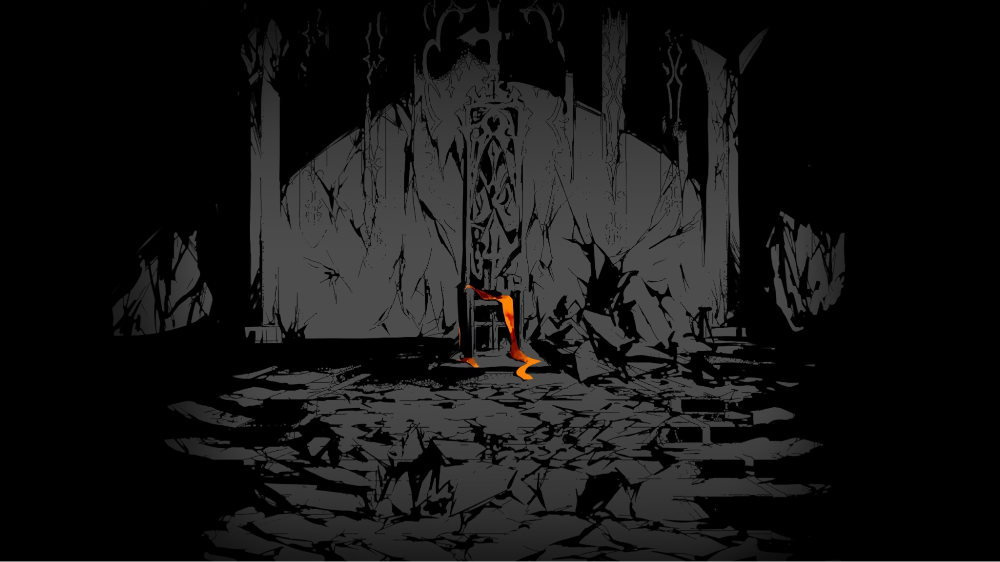
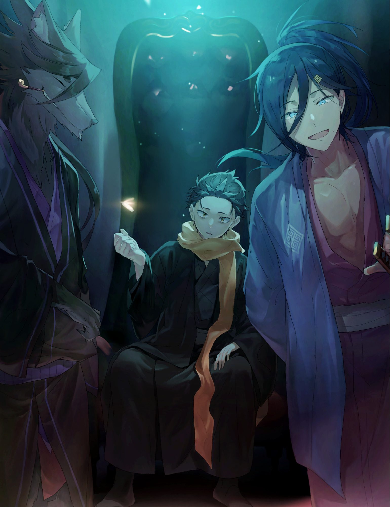
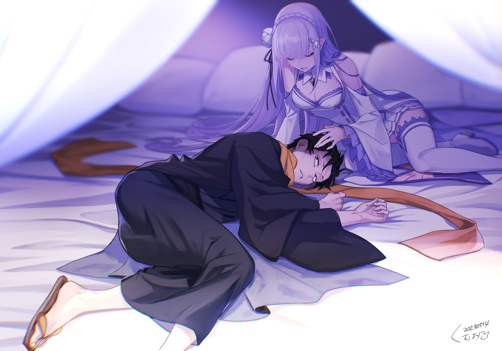
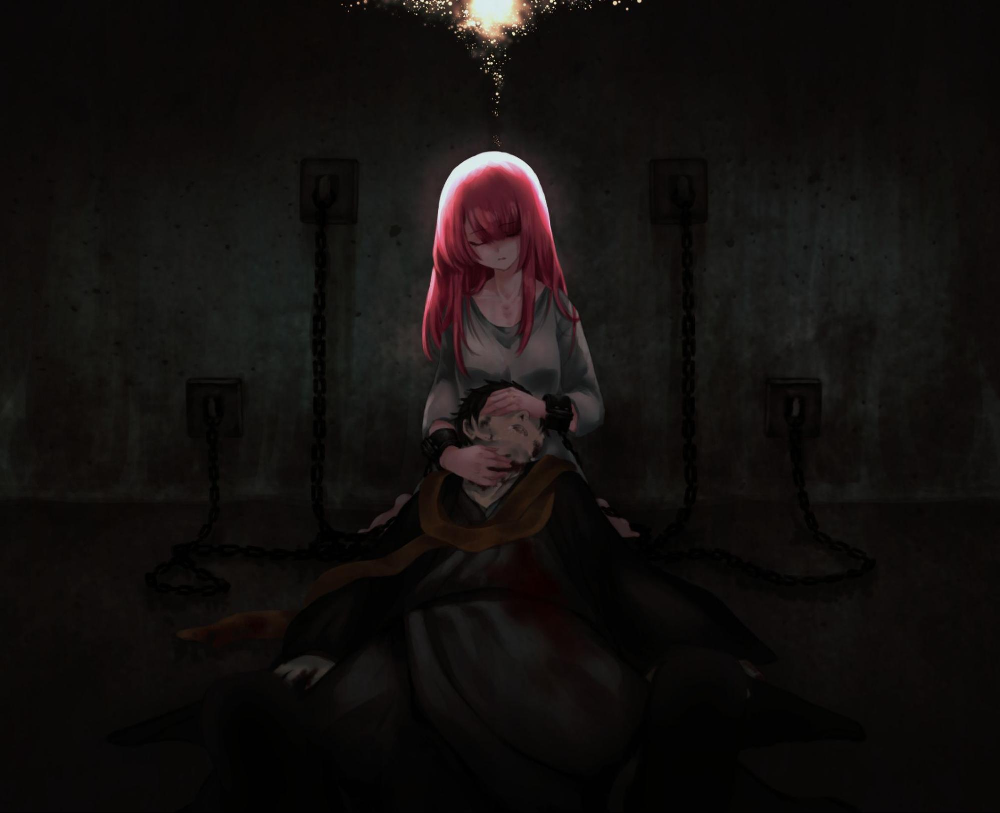

Утопая с нуля в альтернативном мире

『ゼロカラオボレルイセカイセイカツ』

Оригинал на японском

Перевод и редактура: MilkyWay , Энди

Фан-арты: Roikumama , HaruSabin

Это альтернативная история основного сюжета, поэтому отношения между персонажами могут отличаться, хотя что-то останется неизменным. Читайте на свой страх и риск.

Я слышал голос, полный ненависти.

И никак не могу забыть его.

Я слышал голос, искажённый яростью.

Он до сих пор преследует меня, вселяя ужас.

Я слышал голос, сочившийся жаждой убийства.

Он словно вцепился в мою душу и не отпускает.

Чем сильнее я цеплялся за жизнь, тем больше боли причинял другим.

Именно это мучает меня больше всего, заставляя раз за разом тонуть в отчаянии.

Его шею сдавливали, с хрустом перекрывая доступ воздуха.

Он лежал на спине, прижатый к земле лёгким телом, скованный в движениях. Тонкие колени давили на его плечи, не давая вырваться прочь, а своими глазами он смотрел на белые руки, сжимающие горло. На них виднелись красные ссадины, похожие на распустившиеся цветы. Он отстранённо подумал, как нелепо это сравнение.

Звук хруста усиливался. Его шею сдавливали всё сильнее.

— …

Прямо перед ним были глаза, полные яростного огня. Большие, круглые зрачки стали бездонным колодцем гнева и глубоким всепоглощающим отчаяньем. Он смутно подумал, что вот-вот будет затянут в эту пустоту.

— А… кх… у…

Он беспомощно дёргал своими ногами. Жалкое зрелище.

Он не пытался бежать. Мысль о побеге давно покинула его. Судороги в ногах были не проявлением воли к жизни, а лишь чистой физической реакцией на боль, криком измученного тела.

Мозг, лишённый кислорода, дух, сломленный и утративший волю к жизни, и тело, всё ещё пытающееся бороться. Всё это существовало отдельно друг от друга, и это несоответствие, эта дисгармония казалась ему отвратительной.

Он не мог умереть спокойно. А хотел именно этого — тихо, безмятежно, словно во сне. Но этому желанию не суждено было сбыться. Его конец был полной противоположностью желанному покою.

— Бх… кх… кх…

Из уголков его рта шла пена, глаза вылезали из орбит, истощённое за несколько дней тело извивалось, издавая звериные стоны.

Подходящий ли это финал? Достойный конец?

Как, почему, каким образом он оказался в этом месте?

— Что смешного?

Внезапно раздался голос. Холодный, но чистый и звонкий, он резко контрастировал со звериными стонами.

Обладатель налитых яростью глаз, задыхаясь, произнёс эти слова своими тонкими губами.

— …

Что смешного? Он не мог найти ответа. Ничего смешного не было. Так что же она спрашивает?

Вопрос казался абсурдным. Загадочным, недоброжелательным, несправедливым. Он не мог ответить, даже если бы захотел. И всё же молчание было невыносимо.

Сколько раз его уже заставляли играть по чужим правилам, сколько раз он был пешкой в чужой игре, брошенной на произвол судьбы?

— Что смешного?

Ничего смешного не было.

— Хе… хе-хе…

Может, она ошибалась? Или он сам, не осознавая этого, наслаждался происходящим? Наслаждался тем, что она сидела на нём верхом и душила его?

Если так, то это отвратительно, — промелькнула рациональная мысль.

— Что смешного?

Ничего смешного не было. И всё же вопрос повторялся снова и снова.

Она не бросала слов, как камни. На таком расстоянии это было невозможно. Они были так близки, что могли чувствовать дыхание друг друга. Он смотрел снизу вверх на её прекрасное лицо, а она втирала свои слова в него, словно мазь. Это не были упрёки или оскорбления, а чистая, кристаллизованная ненависть…

— Что смеш…

Внезапно вопрос оборвался, растворившись в воздухе, словно дымка.

— Кх…

Лицо девушки перед ним качнулось влево. Она не смогла удержать равновесие. Её тело обмякло и упало на белый снег. Руки разжались, хватка на шее ослабла, прерывая смертельное объятие.

— Кха… а…

Из горла вырвался кашель, принося с собой горький привкус крови. Сжимающиеся и разжимающиеся лёгкие жадно хватали воздух. Это был рефлекс, инстинкт самосохранения. Ни один здравомыслящий человек не захотел бы перестать дышать и умереть из-за этого. Хотя ему и не хотелось сейчас размышлять о том, в здравом ли он уме.

— …

Отстранённое спокойствие, с которым он принимал смерть, исчезло без следа, уступив место жажде жизни. Он отчаянно, жадно, почти неприлично глотал холодный воздух.

И только после нескольких глубоких вдохов он заметил…

— …

…что лежит на снегу, а рядом с ним — девушка. Бледное лицо и губы делали её необычную красоту ещё более завораживающей. Её слабое дыхание оставляло белые клубы пара, а угасающая жизнь странным образом мерцала в её глазах.

Она выглядела совершенно неуместно на фоне снежного пейзажа. Её одежда, открывающая плечи и бёдра, была слишком тонкой для такой погоды. Шея, уши — все чувствительные к холоду места были открыты ветру, и у него самого заломило от этой мысли.

Она была одета не по погоде. Впрочем, он сам был в таком же положении.

— …

Его зубы застучали.

Он не знал, от холода это или от тяжести, которая давила ему на грудь. Он не мог оторвать глаз от девушки.

— Ам…

Она лежала на снегу, половина её лица была занесена, но даже так она была прекрасна. Неугасимая ненависть и ярость словно поддерживали жизнь в её хрупком, израненном теле. Вся в ранах, было удивительно, что она ещё жива.

— …

Вокруг них, на белом снегу, лежали тела. Множество тел. Жалкие твари, собравшиеся здесь, чтобы насытиться жизнью, поглотить её и осквернить души, пали жертвами её ледяного гнева. И теперь здесь были только они двое. Он и она. Хотя, возможно, скоро останется лишь один. Или же никого.

— …

Он медленно поднялся на ноги и подошёл к девушке, которая что-то невнятно бормотала. Его пальцы, посиневшие от холода, потеряли чувствительность. Лишь лёгкий зуд напоминал, что они ещё при нём.

Дрожащими, непослушными пальцами он с трудом поднял камень размером с человеческую голову.

Самый обычный камень, ничем не примечательный, просто валявшийся под ногами. Он с облегчением почувствовал его вес в своих руках.

Его взгляд упал на камень, потом на лежащую девушку.

На мгновение ему показалось, что камень — это её лицо. Может быть, когда-то она улыбалась. Но в его памяти запечатлелся лишь её последний, полный ярости и ненависти взгляд, взгляд демона.

Он поднял камень над головой. А её светло-красные глаза, смотрящие на происходящее, сказали слабым, но вполне слышным голосом: — Я обязательно убью тебя.

Глухой удар камня о что-то твёрдое эхом разнёсся по заснеженному лесу…

…по заснеженному лесу.

В тот день особняк маркграфа Розвааля L. Мейзерса тихо рухнул.

По иронии судьбы, первой предвестницей этого краха стала женщина, которая отчаянно боролась за сохранение дома. Именно поэтому её поступок был столь безжалостным.

— …

Она была многим обязана хозяину этого особняка. Поэтому, узнав, что сёстры-горничные, которые заботились о нём, отсутствуют, и о господине некому позаботиться, она немедленно поспешила к нему.

Его изменившийся вид причинил ей острую боль.

Разноцветные глаза, которые всегда светились таинственным блеском и уверенностью, клоунский макияж — причудливый, если выражаться мягко, но, по сути, безвкусная квинтэссенция странности и вульгарности, наряды, бросающие вызов всем мыслимым представлениям о красоте — всё это потеряло свой блеск. Розвааль словно погас.

Увидев его таким, Фредерика крепко сжала кулаки.

— Я не позволю, чтобы всё так закончилось. Ради них… Ради всех… Я…

Она твёрдо решила сохранить этот дом. Она не знала, что сможет сделать, но хотела хоть что-то предпринять.

Она энергично взялась за восстановление особняка, поддержала девушку, которая пыталась ей помочь, вытащила из омута апатии и безразличия своего хозяина. Её дни были наполнены суетой и заботами.

У Фредерики не было времени остановиться. Иногда отчаяние грозило сбить её с ног, но она упрямо поднимала голову.

Она не могла сдаться. Не могла подвести тех, кто был ей дорог.

Она забыла, как смеяться. Забыла, как наслаждаться покоем вечеров. Но она продолжала отчаянно бороться, стараясь, словно хрупкие пузыри на воде, удержать и защитить всё то, что любила.

И всё же…

— А…

Когда Фредерика наконец осознала происходящее, было уже слишком поздно.

Её подошвы скользили по ледяному, белому полу. Она потеряла ориентацию, не узнавала особняк. Привычные комнаты казались чужими.

Тщательно вычищенный коридор, кухня, где она каждый день размышляла над меню, комнаты, где она заботилась о своих подопечных, — всё это растворялось в белом, затуманенном мареве. И виной тому был…

— Великий Дух…

— Прости, Фредерика. Ты ни в чём не виновата. Просто, если я хочу защитить то, что мне дороже всего, это единственно верное решение.

Эти слова произнёс серый котёнок, парящий в воздухе. Крошечное существо, помещающееся на ладони, но обладающее невероятной силой. Великий Дух — Пак.

Она не хотела верить. Но сомнений не оставалось. Это он погрузил особняк в ледяную бездну, это он изменил всё.

— Зачем… Зачем ты это сделал?

— Я же сказал. Всё, что я делаю, — ради Лии. Я согласился, чтобы она покинула лес, потому что думал, что это то, чего она хочет, что это будет для неё безопасно. Но здесь больше нет ничего ценного. Интересно, где же я ошибся?

— …

— Розвааль меня разочаровал. Он всего лишь жалкий человечишка.

Пак покачал головой и произнёс эти слова бесстрастным тоном. У Фредерики перехватило дыхание. Она стиснула зубы.

— Как горничная, я не могу позволить вам оскорблять хозяина этого дома!

— Бедняжка. Ты единственная, кто пытался спасти это гибнущее место.

— Не говорите об этом в прошедшем времени. Ещё не всё кончено!

Она бросила вызов. Вызов Великому Духу, хотя шансов на победу не было. Котёнок прищурил свои круглые глаза, в них мелькнула жалость. Всё в нём, от жестов до мимики, было таким человечным… Фредерика подалась вперёд: — Эмилия будет огорчена!

Она надеялась, что эти слова заставят Великого Духа хоть немного засомневаться, дадут ей шанс. Но…

— К сожалению, я слишком люблю Лию. Я как непутёвый родитель, который не может отпустить своё дитя.

Ни тени сомнения, ни малейшего шанса. Фредерика стиснула зубы, ощущая пропасть, разделяющую их миры.

Она не успела осознать свои чувства — было ли это сожаление, горе или что-то ещё. Подул ледяной ветер, и Фредерика замёрзла.

Это было началом краха особняка Розвааля.

Когда маг осознал признаки разрушения, было уже слишком поздно.

Призрачной походкой он бродил по своему особняку. Под ногами с хрустом рассыпались замёрзшие комочки воздуха, по шее пробегал холодный ветерок. Он поёжился и тут же удивился, что его тело всё ещё способно реагировать на холод.

В последнее время он полностью доверил выбор одежды и макияжа Фредерике. Эта преданная, трудолюбивая девушка всё ещё пыталась отплатить ему за доброту, даже в этом обречённом месте. И в его груди, которая, казалось бы, не должна была ничего чувствовать, шевельнулась тупая боль.

Давняя мечта Розвааля тихо угасла.

— Рам, Рем…

Поворотным моментом, вероятно, стала потеря сестёр-óни. Они были незаменимым ключом к осуществлению его планов. Когда они исчезли, Розвааль остался один.

Осознав, что четырёхсотлетняя молитва, которую Розвааль так долго лелеял, оборвалась, он лишился последней опоры.

— Рам…

Это имя, произнесённое шёпотом, было именем его самого большого сожаления.

Он, конечно, допускал такую возможность.

Более того, он знал, что шансы на успех ничтожно малы, что вероятность провала гораздо выше. Поэтому Розвааль подстраховался. Он хотел, чтобы рядом был кто-то, кто примет его конец.

Именно эта потеря стала последней каплей, сломавшей его.

— …

Он шёл по замёрзшему особняку, и это казалось ему странным. Ведь он должен был потерять всякую волю к жизни, всякое желание двигаться.

— Хозяин, прошу вас, возьмите себя в руки! Что скажут девочки…

Фредерика не раз обращалась к нему с этими словами. Она заботилась о нём, пыталась вытащить его из пучины апатии и уныния, неустанно призывая к жизни.

Именно благодаря ей в нём остались силы ходить по этому ледяному дому.

Именно поэтому он поймал взглядом пейзаж за окном, проходя мимо.

Именно поэтому он увидел заснеженный мир и золотистоволосую девушку, которая пыталась в нём выжить.

— …

Он, должно быть, подумал, что должен защитить её.

Или, возможно, это был рефлекс. Рефлекс, вызванный остатками чувств. Розвааль медленно поднял руку, готовясь высвободить огромный поток маны…

— Тц!

В тот же миг он едва успел увернуться от яркой вспышки клинка, нацеленного ему в шею.

— Хм, не ожидал, что вы увернётесь. Неужели главный придворный маг балуется не только магией, но и фехтованием?

Лёгкий голос раздался у него за спиной. Молодой человек с тёмно-синими волосами развернулся к нему с молниеносной скоростью, скользя по замёрзшему полу.

— Такое движение не под силу второстепенному персонажу. Вынужден восхититься.

На нём было одето синее кимоно и дзори — совершенно неподходящий наряд для этого места. За поясом у него были два меча, один из которых он держал в руке, легонько постукивая им по плечу.

Он имел приятное лицо, открытую улыбку, запоминающиеся детские, озорные глаза. Длинные, собранные волосы придавали ему некоторую женственность.

Однако, все эти наблюдения меркли перед невероятной аурой, исходящей от него, аурой, от которой перед глазами вставали тысячи картин его собственной смерти от этого клинка.

— Если вы владеете мечом не хуже, чем магией, мне будет гораздо интереснее. Односторонние побоища — не в моём стиле. Конечно, если прикажут, я выполню любой приказ, но я предпочитаю не выглядеть злодеем.

— Как и говорят слухи, ты чрезвычайно болтлив…

— О, обо мне ходят слухи? Вот это да! Неужели я знаменитость даже здесь? Хе-хе, надеюсь, ничего плохого…

Молодой человек засмущался и почесал затылок. Розвааль наблюдал за ним, пытаясь понять, что происходит. Жгучая боль в левой руке помогла ему собраться с мыслями.

— …

— Кстати, насчёт вашей руки. Если не остановить кровотечение, вы можете умереть.

— Благодарю за совет.

Розвааль растянул бледные губы в улыбке. Его левая рука была аккуратно отсечена почти до самого плеча и лежала на полу, словно кукольная.

Он потерял её, уворачиваясь от первого удара. Розвааль прикоснулся к ране и мгновенно прижёг её пламенем. Жгучая боль пронзила его до мозга костей, но он лишь слегка нахмурился.

Молодой человек удивлённо приподнял брови.

— Я думал, маги трусливее. Аня, например, такая… Кстати, Аня — моя знакомая.

— Я знаю, Сесилус Сегмунт.

— …

— Ты сильнейший воин Империи Волакия, глава «Девяти Божественных Генералов», верно? Твоё прозвище, «Синяя Молния», известно даже в Лугунике.

— Мне очень приятно.

Сесилус Сегмунт изящно поклонился в ответ на слова Розвааля. Он даже не пытался скрыть свою личность. Казалось, у него не было для этого никаких причин. Наблюдая за этим театральным жестом, Розвааль вздохнул.

— И всё же, это странно. Не ожидал, что Империя Волакия нарушит договор именно сейчас, когда в Лугунике вот-вот определится наследник престола.

— О, вы неправильно поняли. Сейчас я в отпуске. Вернее, я безработный. В общем, я никак не связан с Империей. Я всего лишь… Странствующий сильнейший мечник.

— …

— Я не шучу. Мои действия никак не относятся к Империи. Конечно, моя преданность ей нерушима, но… У меня есть свои причины.

Сесилус с театральными жестами подчеркнул свою независимость от Империи. Трудно было поверить ему на слово, но мотивы Империи в этой ситуации действительно выглядели непонятными. Розвааль прищурил свои разноцветные глаза.

— В таком случае, у меня ещё больше вопросов. Ты отказался от звания генерала, чтобы прийти сюда. Что же тебя к этому подтолкнуло?

— Всё просто. Мне пообещали помощь на пути к Небесному Меча.

— Небесный Меча…

Розвааль нахмурился.

— Да, — кивнул Сесилус. На его лице всё ещё играла улыбка, но в его глазах появилось что-то новое.

«Синяя Молния» убивал, руководствуясь радостью и азартом. Но сейчас в его взгляде не было ни того, ни другого. Там горело что-то более глубокое и интенсивное. Что-то, что можно назвать…

— Мечта, о которой я никому не рассказывал… Мне пообещали помочь в её осуществлении, и я не мог упустить такой шанс.

— Неожиданно. Ты не похож на того, кто позволит собой манипулировать.

— Разве манипуляция и следование предопределённому пути — не одно и то же? Я — звезда этого мира, ведущий актёр, и я принимаю сценарий. Но настоящее мастерство актёра проявляется в импровизации.

Сесилус пожал плечами, и в его глазах вновь заиграли эмоции. Розвааль кивнул в ответ. Он был поражён твёрдостью его убеждений, философией, которую он, по всей видимости, выковал в бесчисленных победах.

Розвааль, который четыреста лет был верен своей мечте, не мог не уважать такую стойкость. Неизменность взглядов Сесилуса была для него почти откровением.

— Пожалуй, ты мне не противен. Хотя, наверное, ты мне даже немного нравишься. Но я должен выполнить свой долг… Розвааль L. Мейзерс, главный придворный маг Королевства Лугуника, я забираю твою голову.

В знак уважения Сесилус убрал меч в ножны и с звоном выхватил второй. Прекрасное, демонически прекрасное лезвие засверкало в воздухе.

— Первый меч — «Меч Грёз» Масаюме.

— Один из Магических Мечей, пожирающий душу владельца. Сесилус, можно вопрос?

Несмотря на исходящую от Сесилуса угрожающую ауру, Розвааль с лёгкостью поднял палец. Однорукий, в крови, в замёрзшем особняке, лицом к лицу с непревзойдённым мастером меча, — и всё же он спросил тем же беззаботным тоном. Сесилус также наклонил голову с неуместной легкостью: — Что такое? Хотите узнать мою слабость? Моя слабость в том, что я не умею слушать других, и в том, что я не повзрослел даже после двадцати. Это часто обсуждалось на советах Империи.

— Кто твой наниматель?

Сесилус удивлённо приподнял брови. Затем принял боевую стойку, отставив заднюю ногу, и наклонил корпус вперёд.

— Нелюдимого злодея и негодяя прозвали «Королём Искоренителем», но… Мне велели назвать вам его настоящее имя.

Помня об этом, Сесилус облизал губы, выдержал паузу и провозгласил его имя.

— …

В тот же миг, как только оно достигло барабанных перепонок Розвааля, пол особняка взорвался, и Сесилус исчез. Исчез с такой скоростью, что казалось, будто он растворился в воздухе. «Синяя Молния» оправдал своё прозвище.

Поэтому схватка была мгновенной.

Но в это мгновение Розвааль улыбнулся и прошептал: — Так это был ты…

«Меч Грёз» двинулся быстрее, чем этот шёпот достиг мира.

Но прежде чем всё исчезло, Розвааль подумал о девушках, которые были в особняке. О девушках, которые стали жертвами его мечты, не получив ничего взамен.

— У меня нет ни права, ни времени просить прощения, — подумал он, прежде чем всё погрузилось во тьму.

Механизм «Блуждающей Двери» был прост: он соединял дверь библиотеки с другими дверьми особняка.

Беатрис гордилась этим заклинанием. Благодаря своей простоте оно было универсальным и эффективным. Однако, как и любая магия, «Дверной Проход» не был всемогущим. Если его секрет будет раскрыт, преимущество станет слабостью. Именно поэтому существование Запретной Библиотеки и действие «Дверного Прохода» должны были оставаться в тайне от посторонних. Никто не должен был об этом знать.

Поэтому, должно быть, это было неизбежно.

— Какая ирония.

Прикоснувшись к двери библиотеки, Беатрис поняла, что её приглашают. В огромном особняке было множество дверей, но у неё не было выбора. Её направляли к единственной двери. Метод был прост: все остальные двери были заперты.

Чтобы запечатать «Дверной Проход», достаточно было ограничить количество доступных дверей. И это было сделано. В особняке осталась лишь одна открытая дверь. Беатрис понимала, что её драгоценный старший брат помог это осуществить.

Чаша весов склонилась. Таков был негласный закон их существования.

Она не могла сердиться на брата. Поэтому, без единой капли негодования, Беатрис распахнула дверь, чтобы спокойно взглянуть ему в глаза.

— Привет, Беатрис.

В дверях стоял он и непринуждённо махал ей рукой. Она узнала этот голос, эту манеру общения. Её тело задрожало от страха.

Лицо, которое она помнила, и лицо перед ней не совпадали. Общие черты остались, но это был уже другой человек.

— Что это у тебя с глазами?

Беатрис покачала головой, глядя в мрачные, тусклые глаза. Его преобразивший вид вызывал у неё отторжение и даже отвращение.

Необычные чёрные волосы и глаза остались, но волосы потускнели, а глаза мерцали тёмными эмоциями. Под глазами залегли глубокие тени, лицо осунулось, а видневшиеся из-под рукавов пальцы были бледно-синими, словно у мертвеца. Он был одет в чёрное длинное одеяние, практически полностью скрывающее тело. Единственным ярким пятном был оранжевый шарф на шее — резкий контраст с его мрачным видом.

Прошло несколько лет. Но эти перемены были слишком радикальными. Неужели люди могут так меняться?

— Кажется, ты сильно изменился.

— Чего не скажешь о тебе. Что, пропустила период взросления? Обычно за два года люди хоть немного, да взрослеют.

Его хриплый голос ответил на её слова шутливым тоном.

Два года? Если он так говорит, значит, прошло два года. Для Беатрис это было мгновением. Но что значили эти два года для него, для этого человека?

Были ли эти годы достаточно значимы для того, чтобы человек, находившийся на грани смерти, вернулся ради мести?

— Помнишь, Беатрис? Мы здесь вместе ели.

— Я не помню ничего подобного. Не думаю, что мы когда-либо обедали вместе.

Беатрис нахмурилась. Они находились в столовой на первом этаже особняка. Он сидел за столом, покрытым белой скатертью, и задавал ей странные вопросы. Он провёл пальцами по тёмным кругам под глазами.

— Ах, да, ты же этого не знаешь… Да, я оговорился. Это я виноват. Как всегда.

— Что случило… Хотя нет, какая уже разница.

На мгновение Беатрис заколебалась. Но она тут же отогнала ненужные мысли. Она протянула к нему свою маленькую ладонь. В ней была гордость хранителя Запретной Библиотеки — или, возможно, горькое чувство долга перед никому не нужной миссией.

— Твоё желание мести — твоё право. Но у Бетти свои обязанности. И поэтому…

— …

Беатрис приготовилась защищать свою библиотеку, остановить его. Его лицо напряглось. Казалось, он пытается сдержать какие-то сильные эмоции. Беатрис хотела воспользоваться этим…

— Прости, Беатрис. Мы же заключили контракт, что ты будешь меня защищать?

И в этот момент оцепенела сама Беатрис.

— А…

Слово «контракт» пронзило её насквозь. Она застыла, не в силах пошевелиться. Это было не психическое воздействие. Её буквально сковало.

— Извини. Теперь ты не можешь двигаться.

Рядом с Беатрис, словно из тени, материализовался человек. Высокий зверочеловек с волчьей мордой, в небрежно накинутом чёрном кимоно, с золотой кисэрой в зубах. Он смотрел на Беатрис сверху вниз своими узкими, словно щёлочки, глазами. В этих непроницаемых глазах не было никаких эмоций. Беатрис сглотнула.

— Что… Что это?

— Что-то вроде тайной техники ниндзя, связывающей тень. Можешь считать это ниндзюцу. Не беспокойся, я не буду держать тебя долго… Ты же мой благодетель.

Беатрис могла только слушать. В его голосе не было и намёка на угрозу, в его словах — ни капли лжи. Он медленно поднялся и подошёл к ней. Его взгляд был мрачным, но спокойным.

Беатрис решила, что он пришёл сюда ради мести. Но теперь она сомневалась. В его тёмных глазах она увидела что-то другое, что-то, что царапало ей душу.

— Благодаря тебе я выжил тогда. Я всегда хотел тебя за это поблагодарить.

— И вот так ты решил сказать спасибо?.. Ты… Ты невыносим!.. Просто невыносим!

— Прости. Но я понял, Беатрис…

Он перебил её, покачал головой и улыбнулся, глядя на неё сверху вниз. Помнила ли она его улыбку? В тот день, когда позволила ему провести несколько часов в Запретной Библиотеке.

Он протянул к ней руку.

— …что мы с тобой одинаковые.

— …

Уголки его губ приподнялись, и на мгновение его глаза стали такими же, как тогда, в первый день их знакомства.

— Ты спасла меня тогда, когда я был готов умереть, но не мог сдаться. Я до сих пор часто вспоминаю тот закат.

— Ты…

— Я благодарен тебе, Беатрис… Почему ты не убила меня тогда?

— …

Благодарность ли это была, или упрёк? В любом случае, Беатрис была просто ошеломлена словами, сказанными с лицом, которое выглядело так, будто оно плакало и смеялось.

Она приняла последствия своего поступка, отчаяние, которое разъедало его душу. Оцепенение исчезло, рука бессильно упала. Но, обретя свободу, она не чувствовала в себе сил сопротивляться. Она с лёгкостью приняла справедливость происходящего.

— Беатрис, я благодарен тебе. Наверное, я был в тебя влюблён. Ты единственная, кто по-настоящему понимал меня тогда.

— Худшее признание в любви, какое только можно себе представить…

— Не поспоришь, — согласился он. И в его улыбающихся тёмных глазах Беатрис увидела правду. Она узнала ту мрачную эмоцию, которая в них таилась.

Это был страшный недуг, разъедающий душу и пожирающий надежду.

Отчаяние. Оно жило в нём. И в ней самой.

— Халибель, кунай.

Зверочеловек, стоящий рядом с Беатрис, приподнял бровь при этих словах. Он молча наблюдал за ними, покачивая своей кисэрой из стороны в сторону.

— Ты уверен?..

— Кунай, — повторил он.

Зверочеловек махнул рукой. В тот же миг в пол столовой с грохотом вонзился чёрный металлический предмет. Он наклонился, вытащил его, взвесил в руке. Кунай, созданный, чтобы забирать жизни, тускло блестел.

— Я рад, что ты помнишь о контракте.

Беатрис хотела сказать, что он просто воспользовался ею. Но в его голосе была такая нежность и печаль, что она не смогла выдавить ни слова.

— Ты такая… Яркая, красивая…

— …

Глаза Беатрис расширились, наполняясь слезами. Сквозь пелену слёз она видела его спокойное лицо. Она моргнула, и слёзы потекли по щекам. Она хотела запомнить его лицо.

Он сказал, что они с ней одинаковые. Значит, она видит перед собой саму себя.

Возможно, тогда, в библиотеке, она необратимо изменила его жизнь. И теперь это вернулось к ней.

Если он пытается её спасти…

— Ты…

— …

С трудом шевеля онемевшим языком, Беатрис пыталась говорить. Её хриплый шёпот заставил его на мгновение замереть. Он давал ей время. Он был готов выслушать всё, что она хочет сказать, — даже упрёки. И с этой решимостью Беатрис…

— Ты — «тот самый» для Бетти?

Он вряд ли понял смысл её вопроса. Да она и не ждала ответа. Она просто должна была спросить.

— Да.

Вот почему сердце Беатрис разбилось, когда она увидела, как он улыбается и кивает.

В его улыбке была любовь, в словах — нежность, а в поднятом клинке — благословение.

— Я — «тот самый» для тебя.

Крупная слеза скатилась по покрасневшей щеке девушки.

— Есть у нас такая поговорка: «Утопающий хватается и за соломинку».

Мужчина смотрел на красный ковёр, расстеленный на полу, слушая голос.

Его лицо находилось близко к ковру. Так же близко, как и его дыхание, которое было частым и прерывистым. Сердце бешено колотилось в груди, словно он только что пробежал марафон.

Мужчине было около шестидесяти. Его сын, даже внук уже были взрослыми. Он прожил долгую жизнь и гордился этим.

По долгу службы ему приходилось общаться и договариваться с множеством людей. Он мог похвастаться опытом в таких делах, считая себя хорошим физиономистом.

Он не мнил себя гением, но обладал недюжинными способностями и всегда стремился к лучшему.

Именно поэтому он не мог понять, что происходит. Снится ли ему это, или он бредит?

Он стоял на коленях перед юношей, который годился ему во внуки.

— Понимаете, что такое соломинка? Ну, типа… Пшеничный стебель. Короче, утопающему уже всё равно, за что хвататься, хоть за соломинку, хоть за что. Он и так уже почти труп.

— …

— В общем, это поговорка о том, как отчаянно люди цепляются за жизнь, когда им грозит смерть. Не то, чтобы «сила отчаяния», нет. Там ещё есть шанс выкарабкаться, а соломинка — это пустая трата сил.

Голос над головой продолжал нести бессмысленную череду слов. Казалось, что это пустая болтовня, но мужчина не смел пропустить ни единого слова. Он слишком много слышал жутких историй о том, чем грозит недовольство этого человека.

Прошло два года с тех пор, как он добился известности, а жестоким и ужасным слухам нет конца. Глава организации «Плеяды», которая неумолимо распространяла своё влияние в подпольном мире четырёх великих держав. Он уничтожал своих врагов, их семьи, всех, кто был с ними связан, не гнушаясь никаких средств, превращая их в жуткий пример для остальных.

Люди называли его — того, кто предпочитал не называть своего имени…

Королём Искоренителем.

— …

Мужчина стоял на коленях в штаб-квартире организации, тайно правящей подпольным миром четырёх великих держав. Он находился в роскошной гостиной, набитой драгоценностями, картинами и другими предметами роскоши — порой до вульгарности.

Король восседал на троне — настоящем сокровище — в глубине комнаты и смотрел на своего гостя сверху вниз. Один взгляд на этот роскошный трон — и голова шла кругом от мысли о его стоимости. Такие деньги не заработать и за одну или даже две тысячи жизней.

Это была демонстрация силы организации, силы Короля, — это понимал даже самый недалёкий. А если кто-то и не понимал этого сразу, то уже не узнает никогда — он не увидит больше солнечного света.

Демонстрация силы не ограничивалась богатством. У стен стояли более десятка мужчин — известные воины и наёмники. Даже если их можно было нанять за деньги, сколько же нужно было заплатить? Содержание такого отряда требовало огромных средств. Но ещё больший шок вызывали те, кто стоял по бокам от трона. У мужчины закружилась голова.

Сверхъестественные существа — «Хвалитель» Халибель и «Синяя Молния» Сесилус Сегмунт.

Халибель из городов-государств Карараги и Сесилус Сегмунт из Священной Империи Волакия. Два сильнейших воина двух держав стояли на страже у трона. Именно это объясняло, почему никто не смел бросить вызов этому взбесившемуся юноше и его внезапно появившейся организации.

— Мистер Сигульм?

— …

Мужчину, Сигульма, словно окатили ледяной водой. Король Искоренитель, опираясь подбородком на руку, смотрел на него, и на его лице не было ни тени улыбки. Тёмные глаза буравили его насквозь.

Сигульма охватил ужас. Он понимал, что должен что-то сказать, но не мог выдавить ни слова. Губы дрожали, а Король Искоренитель лишь пожал плечами.

— Ох, простите, что утомил вас. У меня есть дурная привычка отвлекаться. С детства не могу перейти к делу, не поболтав о чём-нибудь постороннем.

— Н-нет… Я…

— Я говорю.

— …

Король указал на него левой рукой, приложив правую к губам в знак молчания. По спине Сигульма пробежал холодный пот. Воцарилась ледяная тишина. Десяток секунд показались вечностью.

— Извините, не хотел вас пугать… Просто… Видите ли, эти двое, и все остальные, — они работают на меня, поэтому подчиняются. А вы — нет. Мне… Нужна была некоторая гарантия. Простите.

— …

Он говорил вежливо, тихим голосом, что делало его ещё более жутким. Король Искоренитель был предельно вежливым, даже почтительным, но при этом — абсолютно беспощадным.

Его слова, тон голоса, казалось, скрывали какой-то двойной смысл. Казалось, его неуверенный, испуганный взгляд видит тебя насквозь, что он замечает каждое твоё движение, каждый вздох. Его тёмные глаза задавали лишь один вопрос.

Ты — друг, или враг?

— …

Конечно, он не враг. Но Сигульм не мог ответить. Он не смел ни говорить, ни даже смотреть Королю в глаза, — он боялся разгневать его. Страх сковал старика, превратив несколько секунд в вечность.

Те, кто смеялся над этим страхом, уже были мертвы. Методы организации были жестокими. Она пускала свои корни во все уголки подпольного мира четырёх держав, превращаясь в неизлечимую болезнь. Чтобы выжить, нужно было либо не заразиться этой болезнью, либо найти лекарство. А единственным лекарством было полное подчинение.

Он знал, что связываться с этой организацией опасно, но всё равно пришёл сюда. Он обдумал все варианты, он был готов подчиниться. Но он просчитался, и теперь понимал это. Он словно тонул, не в силах дышать, хватая ртом воздух. Он тонул на суше, в этой комнате, под взглядом Короля.

— …

Это была не болезнь, а проклятие. Король Искоренитель был одержим неизлечимым проклятием — болезненным страхом. Этот страх затуманивал его разум, пожирал его душу.

Он боялся людей. Боялся, ненавидел, подозревал их.

Именно потому, что сам был поглощён страхом, он искал его в других, заражая их своим проклятием. Король говорил об утопающем. Он был прав. Сейчас Сигульм был готов ухватиться за что угодно, лишь бы выжить.

— Так вот… О соломинке. О том, что утопающий хватается за неё… Да, я понимаю. Мистер Сигульм, вы пришли сюда, чтобы всё обсудить, чтобы сделать всё по правилам.

— …

— Я уважаю людей, которые уважают правила. С ними можно договориться, в отличие от тех, кто сразу бросается в драку. Не знаю, что вы слышали обо мне, но не верьте слухам… Я не хочу никаких проблем.

Король Искоренитель протянул к нему левую руку, предлагая ему слово.

— Ах…

Сигульм выдохнул, словно с него сняли оковы. Он испугался, что этот вздох может разозлить Короля, но тот никак не реагировал. Долгие секунды молчания, казалось, вернули его к жизни.

— Мистер Сигульм?

— Д-да… Извините. Моё предложение изложено в письме. Я надеюсь на долгосрочное сотрудничество с вашей организацией.

Сигульм тщательно подбирал слова, стараясь не казаться слишком униженным. Король Искоренитель прищурился, задумался, а затем улыбнулся.

— …

Внезапно его лицо стало выглядеть на свой возраст, и Сигульм удивился. Король кивнул.

— Давайте сотрудничать, мистер Сигульм. Подробности обсудите позже с моими людьми. Это самое разумное решение.

— А…

— Надеюсь на плодотворное сотрудничество.

Король Искоренитель закончил разговор, подняв руку в прощальном жесте. Сигульм медленно поднялся. Его ноги затекли, он чуть не упал, но удержался на ногах и глубоко вздохнул.

— Благодарю вас. Я также надеюсь на взаимовыгодное сотрудничество.

— Хм.

Ему удалось спрятать дрожь в голосе и произнести последние слова. Он поклонился довольно кивающему Королю и начал пятиться.

— …

На него буквально обрушилась волна облегчения и торжества. Свинцовая тяжесть, сковывающая его всего несколько секунд назад, исчезла. Он с лёгкостью пошёл к выходу, вспоминая лица своих близких.

Он выжил, ему удалось со сохранить надежду…

— ?..

Внезапно он услышал тихий звук у себя за спиной.

Знакомый звон монеты. Словно кто-то уронил монету на пол.

— Решка.

Раздался короткий голос. И прежде, чем Сигульм успел что-либо понять…

— …

…мир перевернулся. Ковёр стал ещё ближе, чем когда он стоял на коленях.

И на этом всё закончилось.

— …

Халибель прищурился, наблюдая, как падает обезглавленное тело.

Работа была выполнена чисто.

Тело старика не содрогалось в конвульсиях, голова лежала на ковре, словно не понимая, что произошло. Настоящий шедевр, если не считать, что это был всего лишь труп. Халибель не находил в этом ничего прекрасного.

— О… Уэ…

Юноша на троне зажал рот рукой. Он уже видел много трупов, видел, как люди превращаются в трупы, но так и не привык к этому зрелищу.

— Приказывать убивать, а потом тошнить — не кажется ли вам это неуважением к мёртвым? Я не говорю, что вы должны привыкнуть к трупам, но могли бы хотя бы постараться не смотреть?

— Я же не ради удовольствия убиваю… Я… Я просто не могу на это смотреть. Но я стараюсь присутствовать… Это…

— Самообман.

Слова его коллеги были неумолимы, пока сам он, прикрыв рот полотенцем, боролся с тошнотой.

Разумеется, прав здесь именно его коллега — Сесилус. Тот факт, что работодатель не обижается на это, свидетельствует о том, что он понимает, что его действия обманчивы.

— Кстати…

Затем Сесилус продолжил говорить с мальчиком, чьё бледное лицо было больше похоже на лицо мертвеца. Он перевёл взгляд на труп жалкого старика.

— Меня поражает ваша непоследовательность. Вы так мирно с ним беседовали, а потом внезапно приказали убить. Вы даже меня удивили.

Сесилус надул губы. Для мужчины его возраста это выглядело по-детски, но ему это шло. Возможно, потому что он был красивым, и его поведение казалось естественным.

В любом случае, юноша нахмурился, когда он услышал оскорбительные замечания Сесилуса.

— Я же говорю, я не хотел его убивать. Я хотел ему верить. Он не был похож на лжеца.

— Тогда почему?

— Даже если человек не выглядит лжецом, он всё равно может лгать.

Юноша, сидя на троне, поджал колени и прикусил губу. В этом жесте была непоколебимая уверенность.

Ни Халибель, ни Сесилус не знали, что случилось в его прошлом. Но, видимо, там было что-то, что заставило его так думать.

Что-то, что научило его не доверять улыбкам, дружелюбию, нежности — потому что за ними могла скрываться ненависть и жажда убийства.

Этот опыт преподал этому мальчику горький урок.

— Нужно срывать ростки, обрубать ветви. Я больше никогда не дам себя обмануть.

Он сжал плечи так сильно, что ногти впились в кожу сквозь одежду. Было видно, что он прокусил кожу до крови. Его приближённые знали, что это — необходимый для него ритуал, поэтому никто не вмешивался.

Наконец он удовлетворил свою потребность в боли, поднялся с трона и сказал: — Уберите тело и закопайте его. Отправьте гонцов в его лавку. Мы конфискуем всё его имущество, но если он подчинится, то останется жив. Если же он сопротивляется — убейте всех его родных, а лавку сожгите. Когда всё будет готово, пусть новый управляющий придёт ко мне. Я решу, оставить его или нет.

Он отдал распоряжения ровным, бесстрастным голосом. Он не обращался ни к кому конкретно. Он хотел только результата, и не интересовался процессом. И это, как ни странно, работало. Все стремились к результату, и организация процветала.

У каждого из них есть все основания для этого и слабости, которые заставляют их так поступать. И каждый предпочитал выложиться на полную, нежели рисковать всем, что у него есть. Это своего рода идеальная рабочая среда.

В организации работают люди, которым больше всего нечего терять — например, их семьи, близких, имущество, жизни и так далее.

Король Искоренитель, пугливый мальчишка, которого все боялись, держал своих людей на коротком поводке, используя их слабости, как гарантию послушания.

— Босс, вы забыли куртку.

— Ах, да, спасибо.

Халибель накинул ему на плечи чёрную куртку, прежде чем тот вышел. Простое движение, простое «спасибо». И в следующий миг Халибель почувствовал прикосновение — лёгкое, как дуновение ветра, но смертельно опасное. Его усы задрожали, он опустил глаза.

Конечно, это был Король. Наверное, ему не понравилось, что Халибель стоял у него за спиной.

— Халибель, я не хочу тебя убивать.

— Ха-ха, ну так и не убивай. Лучше используй меня с умом.

— Но что, если инструмент окажется слишком сложным в обращении и сломается? Было бы глупо умереть из-за собственной неосторожности.

Мальчишка бормотал себе под нос, надевая куртку, размышляя о том, как бы убить Халибеля. Халибель делал вид, что не обращает внимания, но он знал, что это не шутки. Король действительно хотел его убить. Но пока он считал, что хлопот с убийством будет слишком много — и до, и после.

— Босс, босс, куда отнести принесённые дары?

— Дары?.. А что там?

— Магические кристаллы. Откуда они узнали о ваших предпочтениях? Так много стараний, и всё ради того, чтобы лишиться головы… Как жалко…

— Голову ему отрубил Сесилус…

Мальчишка , которого остановили у входа в комнату, скривил свои щёки от недовольства . А затем вздохнул, глядя на безмятежного Сесилуса.

— Магические кристаллы отнесите в мою комнату. Остальное — вам.

— Хорошо. Кстати, босс…

— Что?..

Сесилус провёл пальцем под своим глазом.

— У вас ужасные круги под глазами. Может, пора навестить принцессу и отдохнуть?

Юноша громко цокнул языком. Сесилус рассмеялся, но окружающие напряглись. Они думали, что он сейчас прикажет убить Сесилуса за дерзость. Конечно, это было бы не так-то просто. Пришлось бы бросить в бой все силы организации, а Халибелю, возможно, пришлось бы рисковать жизнью.

— Я подумаю…

К счастью, юноша сдержал свой гнев и просто развернулся. Все выдохнули с облегчением. Халибель смотрел на Сесилуса, который беззаботно махал рукой на прощание, и качал головой.

— Я тоже не большой любитель групповых мероприятий…

Халибель, покачивая кисэрой, пошёл вслед за юношей. Как самый близкий советник, он выполнял роль телохранителя. Хотя вряд ли кто-то осмелился бы напасть на него — ни внутри, ни за пределами особняка.

В первом случае их останавливал страх, во втором — незнание о его существовании.

— …

Халибель наблюдал за юношей, критически осматривающим всё вокруг. В здании, которое он использовал в качестве своей штаб-квартиры, за пределами приемной выставлено множество произведений искусства и картин, демонстрирующих его невероятную финансовую мощь и занимающую исключительно оборонительную позицию. Демонстрация власти через финансовую мощь и выставление напоказ власти — это отчаянная мера, позволяющая избежать наживания ненужных врагов.

— Побеждать без боя — вот идеал, — говорил юноша. И он был прав.

Конечно, такое откровенное выставление напоказ своего богатства вызывало зависть и ненависть. Но в любом случае у него появлялись враги. Метод юноши позволял хотя бы сократить их количество. А с небольшим числом врагов можно было справиться силой.

— Халибель… Проследи, пожалуйста, чтобы Сесилус ничего не вытворил.

— Ладно, ладно. А вы к принцессе?

— Угу.

Мальчишка нахмурился, как будто ему было стыдно признаться, что он принял предложение Сесилуса. Так они вдвоём и достигли самой дальней охраняемой комнаты штаб-квартиры под названием «Пандемониум».

Дверь была заперта таким количеством ключей, что любой, кто её увидел, был бы шокирован.

Почти пятьдесят замков — явное свидетельство важности того, что скрывалось за этой дверью, а также тщательности, настойчивости и паранойи того, кто их установил. Но самое параноидальное было то, что ни один ключ в мире не подходил к этим замкам.

Эту дверь нельзя было открыть обычным способом.

— Пак.

— Мяу-мяу, я тут как тут!

В воздухе появился серый котёнок, сопровождаемый яркой вспышкой света и глупым голосом. Несмотря на свой несерьёзный вид, это был Великий Дух, обладающий невероятной мощью, — Пак. Он мягко приземлился юноше на плечо.

— О, давно не виделись. Что тебе нужно от Лии?

— Пожалуйста, открой дверь.

— Мур-мур, какой грубый! Если ты будешь грубить папочке, он не пустит тебя к дочке. Попробуй быть чуть более учтивым…

— Пак.

Юноша погладил Пака, который тёрся о его щёку. Пак вздохнул, глядя на тёмные круги под его глазами.

— Ты опять довёл себя до изнеможения. Ничего не поделаешь. За твои старания.

Пак протянул лапки к двери. Затем бледный свет хлынул в бесчисленные замочные скважины без ключей…

— Щёлк!

…и превратился в ледяные ключи, которые с тихим щелчком открыли замки.

— Умно придумано. Люди всегда ищут подходящий ключ, если видят замочную скважину. Было бы плохо, если бы кто-то смог это повторить.

— У магии есть своя частота. Если кто-то попробует сделать то же самое, мы сразу узнаем. К тому же, я всегда с Лией.

— Это точно.

Халибель кивнул в знак согласия со словами Пака. Юноша подошёл к двери и остановился. Он посмотрел на Халибеля, стоящего у него за спиной.

— Халибель, можешь идти.

— А? Я тоже хотел поздороваться с принцессой…

— Можешь идти.

Его случайная просьба была отвергнута равнодушным тоном. Халибель понял, что это означает окончательный отказ. Он не стал настаивать, отошёл назад и надкусил кисэру.

— Если вам что-нибудь понадобится, не стесняйтесь звать меня.

— …

Юноша коснулся двери, не спуская с него настороженного взгляда. Халибель повернулся и ушёл. Он чувствовал на себе его взгляд, пока не скрылся за углом.

Настолько подозрительным, осторожным, даже трусливым был его наниматель и спаситель.

— Он всё равно меня не позовёт…

С таким вялым бормотанием Халибель выпустил клуб фиолетового дыма и посмотрел на потолок. Дым достиг потолка и рассеялся.

Это казалось ему намёком об их будущем.

— …

Эмилия смотрела на спящего юношу. Он был так безмятежен, что казался мёртвым.

Его голова покоилась у неё на коленях. Тёмные круги под глазами говорили о хроническом недосыпании и тяжёлой жизни, которую он вёл.

— Он опять почти не спал.

— Неудивительно. В его положении не до отдыха. Только здесь, с тобой, он может немного расслабиться.

Пак, парящий в воздухе, вздохнул, наблюдая, как Эмилия гладит юношу по лбу и прикасается к его ресницам. Он огляделся.

Комната была белой. Белые стены, белый пол, белый потолок, белая кровать, белая мебель, белые занавески — всё было белым. Даже тонкая ночная рубашка Эмилии была белой. Это казалось болезненным.

Эта комната — пределы её свободы. Клетка, в которой её держали. Эмилия не была уверена, уместно ли употреблять слово «заточение», но…

— Ты всё ещё злишься на него, Лия?

— Не знаю…

Эмилия замялась. Дело было не в том, что ей было трудно ответить. Она просто не понимала своих чувств.

Конечно, поначалу она была очень зла. Они так и не помирились. Они не извинялись друг перед другом. Время просто шло, и они жили так, будто ничего не случилось.

— Но на тебя, Пак, я злюсь. Ты устроил всё это за моей спиной.

— Прости. Но я не мог поступить иначе. Я не мог оставить тебя с Розваалем в таком состоянии. Он втянул тебя во всё это, а сам… Это безответственно. А здесь ты в безопасности.

— …

— Мы оба хотим защитить тебя от опасности.

Именно поэтому Пак согласился с предложением тайно вывезти Эмилию из особняка Розвааля, выйти из Королевских Выборов и присоединиться к организации. Эмилия ни о чём не подозревала, пока не оказалась запертой в этой белой комнате, словно птица в клетке.

Но Эмилия знала, что не имеет права винить Пака.

— В конце концов, я ничего не смогла сделать…

На Королевских Выборах, призванных определить следующего короля Королевства Лугуника, Эмилия потерпела жалкое поражение.

Главной причиной было её отсутствие на встрече кандидаток, из-за чего она была дисквалифицирована. Это также привело к падению Розвааля L. Мейзерса, её покровителя, и его психическому расстройству.

Короче говоря, Эмилия не смогла принять участие в выборах, Розвааль лишился права быть её покровителем, и её фракция распалась, не успев начаться.

Эмилия осталась одна, без всякой поддержки, и была вынуждена признать своё поражение.

— Я лишь хотела…

…создать мир, в котором не будет дискриминации. Мир, в котором её происхождение не будет иметь значения. Это была её, пусть наивная, но искренняя мечта. Но эта мечта так и осталась нереализованной.

Невыполнимой была и цель освобождения родины Эмилии, превосходившая все её желания: спасти её друзей, превратившихся в ледяные статуи и оставшихся спать на землях Великого Элиорского Леса.

— Ты всё равно не могла оставаться в том особняке без защиты. Лучше бы ты вернулась в лес. Но ты и этого не сделала. Я был очень удивлён, когда получил сообщение от посланника.

— Я тоже была удивлена…

Потому что она считала, что юноша, которого она встретила здесь, мёртв.

Именно его исчезновение стало причиной её отказа от участия в выборах.

Первой жертвой инцидента, вызванного зверодемоном, стала Рем, одна из горничных. Именно этого юношу, который остановился в особняке, заподозрили в её смерти.

Он не выдержал обвинений и сбежал. Рам, сестра Рем, бросилась за ним в погоню, и… Больше не вернулась.

Наверное, с этого всё и началось. Причина смерти Рем — проклятие зверодемона, — стала известна уже после того, как пострадала соседняя деревня. Было слишком поздно.

После этого инцидента Розвааль лишился своего положения, а Эмилия — права на участие в выборах. Особняк постепенно разрушался, превращаясь в место, где никому не хотелось бы находиться.

И вот тогда…

…когда Эмилию охватило чувство беспомощности и неспособности что-либо изменить, в тот самый день мальчик, который должен был исчезнуть, пришёл за ней.

— …

Да, Пак был прав. Она злилась. Он не объяснил ей ничего, не предупредил о своём уходе и не извинился за то, что просто взял и увёз её отсюда.

Возможно, именно из-за него её мир начал рушиться. И тем не менее…

— Он был таким…

…слабым, испуганным, измученным. Ещё хуже, чем сейчас. Он прижался к ней, плача и умоляя о помощи.

И Эмилия забыла о своём гневе.

Возможно, это было глупо, возможно — недостойно. Но она не могла ругать его, когда он плакал, как ребёнок, а потом заснул, словно младенец. Она не могла себе этого позволить.

Он приходил к ней только тогда, когда ему нужна была помощь. Он ничего не рассказывал о том, что делает за пределами этой комнаты, лишь делился своими переживаниями и засыпал у неё на коленях.

Считать ли это абсолютным доверием или унизительной жалостью — решала сама Эмилия. Но она не могла найти ответ.

— Наверное, это очень… Нездорово.

Даже такая наивная, как Эмилия, понимала, что это ненормально. Но она не видела другого выхода. Она просто принимала его слёзы и смотрела, как он засыпает.

— …

Он приходил примерно раз в десять дней. Всё остальное время он, видимо, не зная отдыха, отчаянно боролся за что-то.

Они мало разговаривали.

Однако именно так Эмилия смогла познакомиться с мальчиком, который навещал её раз в десять дней.

— Этот дурачок, Субару…

Наверное, она ждала их встреч. Где-то в глубине души она это понимала.

Отскочившая монета показала орла, и только поэтому он никого не убьёт.

Фредерика не могла скрыть отвращения к своему хозяину и его ненормальным методам. Убрав обезглавленное тело из гостиной и заменив испачканный ковёр, она отправилась готовить обед для наёмников в «Пандемониуме».

— Вы играете чужими жизнями, полагаясь на волю случая… Возомнили себя богом?

Вспоминая о том, как безжизненное тело стало трупом, Фредерика стиснула зубы — источник её комплекса неполноценности — подавляя ярость и дрожь, охватившие её.

Фредерика Бауманн работала на организацию, потому что, как поговаривали, любовница Короля Искоренителя — их предводителя — Эмилия, настоятельно об этом просила.

В тот день особняк наполнился леденящим белым холодом. Фредерика была уверена, что её жизнь оборвётся от руки предавшего её Великого Духа. Однако по какой-то необъяснимой причине она очнулась здесь. С тех пор на её шее красовался ошейник, и она служила горничной, вынужденная прислуживать тому, кого ненавидела.

Сколько же ошибок она должна была совершить, чтобы оказаться в такой несправедливой ситуации?

— Господин, прошу прощения.

По правилам, Фредерика лично приносила еду хозяину в комнату. Эту обязанность он не доверял никому другому, и сам он не притрагивался ни к чему, кроме приготовленного ею. Фредерика не испытывала по этому поводу ни малейшей гордости. В конце концов, дело было не во вкусе её блюд и не в доверии. Просто хозяин был уверен, что она не выкинет какой-нибудь глупости.

— Войди.

Скрип множества отпираемых замков и бесцеремонный приказ позволили Фредерике войти. Следуя указанию, она вкатила тележку с едой в комнату хозяина.

Комната хозяина, в отличие от роскошного убранства остального здания, была, за исключением размеров, крайне простой, или, иными словами, скучной и безликой. По углам в беспорядке громоздились груды книг на самые разные темы, что было невыносимо для аккуратной Фредерики. Однако предложить убраться она не решалась, зная, что хозяин будет категорически против.

Вероятно, он опасался, что в комнате что-то подстроят. Осторожность, граничащая с трусливой паранойей — отвратительное и достойное презрения зрелище, даже если он и знал, что Фредерика ничего такого не сделает.

— Господин, эти разбросанные бумаги, как обычно?

— Хм… А, да, пожалуйста. Покажи их кому-нибудь, кто в этом разбирается.

С этими словами хозяин небрежно махнул рукой в сторону разбросанных по полу листков, исписанных неразборчивым почерком. На первый взгляд, они казались просто исчерканной макулатурой, но на самом деле это был источник дохода этой организации — зацепки для многочисленных тайн, которые приносил Король Искоренитель.

— В этих, наверное, мало толку… Я же ничего не понимаю в двигателях и всяком таком. Всё-таки рецепты — это самое понятное…

Бормоча себе под нос, хозяин смотрел куда-то в сторону. Он говорил о знаниях и явлениях, которые никто доселе не видел, не открывал, не замечал. Это были либо зацепки, либо конечные результаты.

Черноволосый юноша, встречаясь с людьми, принимал жестокие решения одно за другим. Однако, по прихоти судьбы или благодаря какому-то другому стечению обстоятельств, он обладал невероятной изобретательностью и талантом первопроходца в области культуры.

Обрывки знаний, произнесённые им, зажгли искру в умах скрывавшихся в тени мудрецов. Они с дотошностью проверяли, обсуждали и, в конечном итоге, систематизировали бессвязные речи юноши, указывающие на недостижимые для обычных людей вершины. В результате это приносило огромную прибыль и превратило нищего юношу в отъявленного злодея.

— Забавно, да? Использовать современные знания как шаблон для безграничной власти…

Фредерика помнила, как однажды хозяин произнёс эти слова, будучи восхваляемым за свои достижения. Она также помнила, что в тот момент он совсем не улыбался.

Как бы то ни было, мерзкая особенность этого черноволосого хозяина заключалась в том, что, делая многих несчастными, он одновременно приносил счастье многим другим. Как человек, он был отвратителен, но его ум обладал неоспоримой ценностью. В мире, вероятно, не существовало второго такого сложного человека. Возможно, именно поэтому он поладил бы с Розваалем.

— …

— Фредерика, еда. Сначала попробуй каждый кусочек.

Пока Фредерика размышляла, она ловко готовила еду. Этот юноша был худ, как скелет. Дело было не в плохом аппетите, а скорее в психологических причинах. Несмотря на то, что он причинил много боли, отнял многое и нажил себе немало врагов, он был труслив и часто вызывал у себя рвоту. Фредерике, как повару, это было неприятно, но вряд ли он делал это нарочно.

— Господин, всё готово.

По какой-то причине еда была приготовлена на двоих. Все блюда были разложены на двойных порциях и расставлены на столе. Обязанностью Фредерики было попробовать каждый кусочек, прежде чем хозяин притронется к еде.

Она никогда не думала отравить его. Хотя желание было. Просто работа горничной занимала большую часть её жизни и была для неё очень важна. Вспоминая тех, кто её обучал, и тех, с кем она работала, она не хотела совершать опрометчивых поступков.

— Тогда я пойду. Если что-то понадобится, зовите.

— Угу.

Хозяин не любил, когда за ним наблюдали во время еды. Поэтому, закончив с приготовлениями, Фредерика должна была выйти из комнаты и ждать. В этот день она собиралась сделать то же самое — покинуть комнату и ждать снаружи — как вдруг её взгляд упал на…

…лежащий на столе список, который выглядел как перечень членов организации. Рядом с ним лежала золотая монета.

В тот же миг Фредерика поняла, что это значит, и по её спине пробежал холодок.

— Господи…

— Фредерика.

Пустые чёрные глаза хозяина смотрели на Фредерику, когда она обернулась, чтобы позвать его. От этой пустоты и тьмы у неё перехватило дыхание. Юноша медленно подошёл к столу и закрыл открытый список. Затем он поднял золотую монету, положил её на большой палец и…

Щёлк!

…подбросил её. Монета упала ему в левую руку. Поймав её, он проверил, какой стороной она легла, и улыбнулся Фредерике.

— Орёл, Фредерика. Твой брат и бабушка в безопасности.

— А…

— Уйди. И не входи, пока не разрешу.

Фредерика без слов, словно марионетка, кивнула на слова хозяина. Скрывая подступающие слёзы, она вышла из комнаты, по щекам её текли горячие капли. Выбежав за дверь, она закрыла лицо руками и бросилась бежать.

— У, ууу… Уууу!

Она не могла никому ничего рассказать. Ей не позволяли.

Как же так получилось?

Почему всё так обернулось?

Дни, проведённые в том особняке, с милой младшей горничной, с другой милой младшей горничной и со странным хозяином, казались такими далёкими… Куда же пропало то время?

Получив сообщение от гонца, Сесилус Сегмунт прикрыл один глаз и посмотрел на луну.

— Хмм, хмм, хммм…

Он повертел головой, потом покрутил бёдрами, наклоняясь так низко, что его длинные волосы коснулись земли. Думать он не любил. Сесилус не был учёным, да и учиться никогда не собирался. Все свои двадцать с небольшим лет он посвятил одному-единственному…

Искусству владения мечом. Он гордился тем, что был мечником, и бесчисленные дни проводил, размахивая клинком. Поэтому сложные размышления были ему не по душе.

— Итак, что же делать?

Выпрямившись, Сесилус отряхнул волосы, собравшие пыль с пола. Затем он щёлкнул цубой своего меча и, словно танцуя, обернулся.

— Халибель, что думаешь?

— Ого, так открыто? Теперь мне, скрывавшемуся тут, даже как-то неловко.

На балконе «Пандемониума», под лунным небом, из тени, словно проступая сквозь неё, появился звериный синоби.

Выйдя из своего укрытия, Халибель почесал голову и подошёл к Сесилусу, на лице которого не было ни тени смущения. Достав из кармана трубку, он чиркнул огнивом, затянулся и выпустил облачко дыма.

— Кто был тот скрытный посланец?

— Тот чел? Да так, один из Девяти Божественных Генералов… Хотя, от тебя, Халибель, сильнейшего синоби, ничего не скроешь.

— Сесилус, ты совсем не умеешь хранить секреты. Теперь я точно знаю, что ты не порвал связи с Империей Волакия, так?

— Но ты ведь и так это знал, неправда ли?

Халибель, с улыбкой на лице, которая выражала скорее замешательство, нежели веселье, лишь усмехнулся в ответ на замечание Сесилуса. Сесилус понял, что это не отрицание.

— Я сотрудничаю с Королём Искоренителем по приказу Его Превосходительства. Хотя, конечно, не могу сказать, что предложение босса меня совсем не прельстило.

— Имперский ошейник… Ну, действия Субару легко направить на благо своей страны, если правильно его подтолкнуть. Да и эти его непонятные знания легче приживутся в Карараги и Волакии, нежели в Лугунике или Густеко.

— Именно.

Засунув руку в рукав кимоно, Сесилус подтвердил, что был шпионом. Он сотрудничал с организацией по приказу Императора Волакии. Впрочем, император, зная характер Сесилуса, не давал ему подробных инструкций. Всё равно он бы их не запомнил.

Его задача была проста: — Убить любого, кого прикажет босс. Кроме самого Его Превосходительства. Как обычно, в общем.

— Сесилус, а ты не больше на наёмного убийцу похож, чем я, синоби?

— Нет-нет, что ты! Я же не могу часами сидеть в засаде, прятать яд по всему телу или появляться из ниоткуда.

Скромно покачав головой и руками, Сесилус признал разницу в их специализациях. Как синоби и убийца он был далеко не ровня Халибелю. Зато в открытом бою Халибель не смог бы сравниться с ним.

— Итак, я застал тебя на встрече с гонцом. Что будем делать? Может, сразимся насмерть?

— Зависит от содержания послания.

— Хмм, и что же там было? Если там был приказ убить Субару, я буду вынужден тебя остановить.

Халибель зажал трубку между пальцами, выпустил струйку дыма. Его волосы развевались на холодном ночном ветру. Он так просто заявил, что готов рискнуть жизнью ради своего господина, что Сесилус только кивнул, говоря: «Ясно».

— Давно хотел спросить, почему ты так предан боссу? Я вот действую по приказу императора, так что моя верность не такая уж и искренняя.

— Возвращаю долг.

— Что? Неужели босс сделал тебе что-то хорошее?

Неожиданный ответ удивил Сесилуса, и он переспросил. Некоторые могли бы счесть это бестактным, но Халибель не обиделся. Он посмотрел на луну в ночном небе.

— Когда я только встретил Субару, на окраине Карараги случилось одно происшествие. Оно было связано с Четырьмя Великими Духами… Субару всё уладил.

— Ого, Четыре Великих Духа! Я знаю одного из них, но с ними довольно трудно общаться. Успокоить их… Погодите, босс сильнее, чем я думал…

— Нет-нет, не надо так воинственно. Даже не знаю… Трудно сказать, что именно стало решающим фактором, но… Ну, ты знаешь, у Субару иногда бывает такое… Странное предвидение. Вот что-то вроде этого.

Убрав меч в ножны, Сесилус прикрыл один глаз, слушая объяснения Халибеля. Он не мог до конца понять, согласен он или нет, потому что в каком-то смысле ценил своего молодого господина.

Халибель говорил о странном предвидении, но Сесилус так не считал. Он полагал, что это оружие, рождённое из трусости, из-за которой Субару был готов ко всему. Сесилус уважал сильных и благосклонно к ним относился. Он считал воином любого, кто жаждал победы, независимо от того, как он её добивался.

— Ну, я предпочитаю мечи, так что для меня самый захватывающий бой — это бой на мечах.

— Сесилус, Сесилус, тебе уже неинтересно, что я говорю?

— Ну, достаточно. Я всё равно никогда не сомневался в тебе, Халибель. В отличие от империи, в городах-государствах всё запутано… Я больше доверяю тому, кто действует по собственной воле, чем по чьей-то указке.

Халибель в ответ как-то обмяк и опустил плечи. Сесилус, наклонив голову, посмотрел на него, а потом, словно что-то вспомнив, хлопнул себя по лбу.

— Ах да, совсем забыл. Насчёт сообщения от гонца…

— Ты уверен, что можешь мне рассказать?

— Думаю, если я не расскажу, могут возникнуть проблемы. Дело в том…

Сесилус широко улыбнулся и сказал Халибелю: — Похоже, в королевстве узнали, что бывший граф был убит, и теперь они всерьёз намерены уничтожить нашу организацию.

И вот так незаметно наступил момент конца.

— Благодарю вас за сегодняшнюю аудиенцию, — произнёс молодой человек, которого проводили в гостиную как почётного гостя. Он бесстрашно стоял перед Королём Искоренителем.

— …

Мужчина, убивший стольких, державший в своих руках множество жизней и знавший множество слабостей. Многие пытались сохранить спокойствие в его присутствии, многие храбрились, но…

— Вы такой… Невозмутимый. Прямо как я.

— Неожиданная похвала… Благодарю, — ответил, склонив голову, молодой человек в чёрном костюме и галстуке.

У него было мягкое лицо, но в глубине глаз таилась какая-то мрачная тьма. Улыбка на его губах, скорее всего, была фальшивой, и он, похоже, не пытался этого скрывать. Он не выглядел апатичным, но был явно смелым. Странное впечатление производил этот юноша.

— Если не ошибаюсь, вы…

— Мы хотели бы в ближайшее время начать здесь довольно обширную торговлю. Поэтому решили сначала представиться и преподнести вам подарок.

— Ясно. Что же, благодарю за внимание.

Королю Искоренителю понравилась деловитость молодого человека. Стараясь соответствовать, он принял такой же бесстрастный вид.

— Вот наш дар. Я слышал, что вам это нужно.

— Хм… — Король Искоренитель посмотрел на дар, который слуги внесли и открыли.

Внутри находилось большое количество камней — магических кристаллов. Высокую чистоту подтверждала возросшая концентрация маны в комнате. Глядя на подарок, Король Искоренитель спросил: — Каких цветов больше?

— ?..

— Кажется, красных и синих. Но в глубине видны жёлтые и зелёные… Вроде бы все цвета есть. Очень предусмотрительно.

Молодой человек впервые замялся, не понимая смысла вопроса. За него ответил Сесилус Сегмунт, стоявший рядом с Королём Искоренителем. Выслушав его, король торжественно кивнул.

— Хорошо, благодарю. Принимаю вашу заботу. Итак…

— Я посланник Рассела Феллоу.

— Ага, понятно. От Рассела Феллоу. Ясно. Если возникнут какие-либо проблемы… — Король Искоренитель запнулся.

Посланец прервал его, подняв руку.

На мгновение в комнате повисло напряжение. Охранники напряглись, ожидая реакции Короля Искоренителя на такую дерзость. Но Халибель, Сесилус Сегмунт и сам молодой человек оставались спокойны.

— Погодите, это ещё не все подарки, — произнёс молодой человек.

— Да что вы говорите?.. Впечатляет.

Напряжение немного спало, когда король ответил на слова юноши. Тот глубоко кивнул и…

— Это ответный дар от Королевства Лугуника за злодеяния Короля Искоренителя.

В следующий миг ослепительная белая вспышка поглотила и разнесла всю гостиную.

Мощный поток света, словно очищая, поглотил роскошную гостиную замка «Пандемониум», превращая всё в белую пыль.

Восемнадцать человек — все опытные и известные воины — испарились в белом свете, не понимая, что произошло. Даже если бы у них был способ узнать правду, никто бы не поверил…

…что их уничтожил всего лишь один взмах меча.

Штаб-квартира организации рушилась. Существо, сияющее ярким светом, уничтожило место, где собрались все ключевые фигуры.

Чтобы сразить Короля Искоренителя, чьи бесчисленные злодеяния сделали его врагом всего мира, страна, находящаяся под защитой Дракона, послала своего убийцу.

— Из рода «Святых Меча», Райнхард ван Астрея.

Неразумный божественный молот, способный разрушить все старания, явил себя миру.

Посреди разрушенной приёмной невозмутимо стоял мужчина.

Огненно-красные волосы, пронзительно-голубые глаза, впитавшие в себя цвет небес, и белоснежная униформа Королевской Гвардии, на которой не осталось ни единого пятнышка грязи. «Рыцарь из Рыцарей» — он стоял там, совершенный, словно сошедший с картины.

Святой меч, зажатый в его руке, рассыпался в пыль.

Хватило всего одного взмаха, чтобы сталь, выкованная легендарным мастером, чьё имя вошло в историю, легко обратилась в прах. И ценой этого взмаха человек, совершивший бесчисленное множество злодеяний, и вся его шайка должны были быть уничтожены одним махом…

— Надеюсь, ты понимаешь, что мы не из тех милашек, с которыми можно покончить так просто?

— …

Разорвав завесу пыли со скоростью молнии, на Райнхарда обрушился чудовищный удар меча.

Раздался грохот, воистину подобный раскату грома, и высокую фигуру Святого Меча мощно отбросило назад. Однако само лезвие не коснулось его плоти. Он отразил его… Ножнами своего любимого меча.

Райнхард даже не обнажил клинок, а лишь извернулся и принял рубящий удар на ножны. Глядя на этот почти акробатический трюк, юноша, нанёсший удар — Сесилус — присвистнул.

— Ох-хо-хо, ну и дела, всё такой же нечеловеческий уровень… Рад видеть, что ты в добром здравии, Райнхард!

— А вот я, признаться, не могу разделить радости от нашей встречи, Сесилус.

Оттолкнувшись дзори от усыпанного пылью пола, Сесилус закинул на плечо обнажённый Меч Зла Мурасаме. От такого приветствия и последовавшего за ним обмена любезностями Райнхард лишь нахмурился.

Затем он всмотрелся вглубь комнаты, где постепенно рассеивался дым.

— Не достал, значит…

— Ага, до босса не дотянулось. Ну, это был удар по месту, которое защищаем мы с Халибелем, так что задачка с самого начала была не из лёгких. Хотя, честно говоря, я вообще не пытался защитить босса, так что это на все сто процентов заслуга Халибеля.

С этими словами Сесилус беззаботно кивнул вглубь комнаты. Там, на троне, скрытом за пеленой рассеивающегося дыма, подперев щёку рукой, сидел Король Искоренитель. А перед ним, заслоняя собой правителя, стоял Халибель — волколюд.

Халибель выпустил изо рта струйку фиолетового дыма из своей кисэру и произнёс: — Сесилус, поправочка. Это не моя заслуга.

— Э! Так значит, неужели… Это пробудилась моя скрытая сила…

— И это тоже мимо. Это всё дело рук господина Су… Этот трон, похоже, защищён какой-то невероятно мощной силой. Мы о таком даже не слышали.

Сесилус с трепетом уставился на свои руки, но Халибель лишь покачал головой.

И тут за спиной Халибеля Король Искоренитель, сидевший на троне, поднялся на ноги. Он взялся рукой за оранжевый шарф, обмотанный вокруг его шеи.

— Твой удар я уже видел на складе краденых товаров… Естественно, я к нему подготовился.

Его лицо исказилось в жуткой, болезненной ухмылке.

Это было воссоединение Короля Искоренителя… Нет, Нацуки Субару и Райнхарда.

— Субару!..

— Ну и неудачный же жребий ты вытянул, Райнхард. Если бы ты не спас меня тогда, до всего этого бы не дошло… Хотя, в таком случае я бы не встретил свою драгоценную госпожу, так что для тебя это, наверное, не имеет значения?

— …

Выглядывая из-за спины Халибеля, Субару показал Райнхарду язык.

Увидев это отвратительное кривляние, Райнхард напряг скулы, словно почувствовал физическую боль. Субару смотрел в эти синие глаза, полные грусти, и на его лице застыла ненависть, подобная оскалу демона.

Но вдруг это выражение исчезло без следа.

— Понятно… Ты, оказывается, тоже остался чёрно-белым.

— ?.. Чёрно-белым? О чём т…

— Заткнись, лживый ублюдок… Такому, как ты, я убить себя не позволю.

Голосом, в котором вымерзли все эмоции, Субару отвёл взгляд от Райнхарда, словно тот перестал представлять для него малейший интерес. Он похлопал Халибеля по плечу, а затем посмотрел на Сесилуса, стоящего напротив Святого Меча.

— Сесилус, развлекайся. Мне это больше не интересно.

— Ясно. Признаться, я не до конца понимаю, но, видимо, мы с боссом смотрим на вещи по-разному. Что ж, с благодарностью принимаю этого достойного противника.

— Смотрим по-разному… Ха-ха, логично. Ты умеешь смешить до самого конца.

Что-то в словах Сесилуса позабавило Субару, и он весело хлопнул себя по колену. Но улыбка тут же исчезла с его лица.

— Было по-своему весело, Сесилус. У тебя не было слабостей, и с тобой было тяжело.

— Моя слабость — это… Я боюсь майонеза.

— Ха!

Услышав эту наглую ложь, брошенную с абсолютно невозмутимым видом, Субару рассмеялся от всей души.

Затем фигура Субару погрузилась во тьму, подхваченная Халибелем. Оказавшись в безвыходном положении, Субару и Халибель решили отступить, покидая поле боя…

— Стой! Мы ещё не закончили…

— Всё кончено, Святой Меча… А если ты не хочешь, чтобы всё заканчивалось, догони нас и начни заново. Но сначала тебе придётся пройти через преданного — если можно так выразиться — подчинённого Короля Искоренителя.

— Кх!..

Райнхард попытался броситься в погоню за исчезнувшим Субару, но прямо перед его ногами пронеслась смертоносная дуга.

Удар, рассёкший пол по горизонтали, был нанесён с такой невероятной скоростью, что даже момент обнажения клинка остался незамеченным. Это была вспышка за гранью возможного, взмах меча, достигшего абсолютного предела мастерства.

— К сожалению, мне пока рано принимать такую оценку. Я всё ещё нахожусь на пути к вершине. Но верю, что, сделав ещё один шаг, смогу её достичь.

— Вершины… Какой именно?

— Разумеется, Небесного Меча.

В это мгновение воздух с характерным звоном натянулся до предела. От одного ощущения, что это пространство можно рассечь, приходило понимание неминуемой смерти.

Мечник, воистину достигший вершины искусства одного удара — нет, гений клинка, источавший кристально чистую ауру меча. Это выходило за рамки человеческого понимания и достигало демонических высот, порождая феномены, неподвластные здравому смыслу.

Воплощение меча, стоящее здесь, могло убить даже незримое, лишь коснувшись рукояти.

— Я ждал этого момента… Момента, когда смогу скрестить с тобой клинки.

— Сесилус, мы ведь уже скрещивали клинки в прошлом. И тот поединок имел для меня огромное значение. Почему же ты теперь…

— Это очевидно: моё тело существует лишь для того, чтобы взмахивать мечом… Мы можем встретиться лишь на линии, отделяющей жизнь от смерти.

Второй клинок, Меч Зла «Мурасаме», был извлечён из ножен, сверкая зловещим светом.

Первый клинок, Меч Грёз «Масаюме», обнажил своё лезвие, столь прекрасное, что само лезвие жаждало рубить.

Два из десяти величайших клинков этого мира — демонических, прославленных и святых мечей — нет…

— Драконий Меч Рейд…

Меч, что всегда находился подле Святого Меча, но обнажался лишь перед врагом, достойным Святого Меча, явил миру своё сияющее белое лезвие.

Звук, исходивший от обнажённого клинка, несомненно, был ликующим рёвом Драконьего Меча.

— Ты ведь знаешь, Райнхард. Перед нами возвышается стена.

Обладатели Святого, Демонического и Драконьего Мечей — существа высшего порядка — стояли лицом к лицу.

Расстояние между ними сокращалось, они медленно сближались, и сам мир, страшась их столкновения, начал искажаться.

— Те, кто достиг определённых высот, всегда упираются в стену, преграждающую дальнейший путь. Некоторые мирятся с тем, что эту стену не преодолеть, и сдаются. Но для меня это невозможно. Если я не перешагну через неё, я перестану быть собой.

— …

— И тут поступило предложение от босса. Он сказал, что устроит всё по-настоящему — бой насмерть, где я смогу скрестить с тобой клинки на грани жизни и смерти, чтобы найти способ преодолеть эту стену. Можно сказать, я ухватился за это, как утопающий за соломинку.

— За соломинку?..

— Как говорится, утопающий хватается за любую возможность.

Это был единственный выход, ради которого Сесилус Сегмунт оказался здесь.

Или, возможно, это было неизбежно с того самого момента, как кто-то безошибочно угадал заветную мечту гения клинка.

Глядя на расширившиеся от изумления глаза Святого Меча, Сесилус облизал пересохшие губы.

И тогда Синяя Молния — тот, кто убивал людей с улыбкой на лице — произнёс: — Мы тонем, Райнхард ван Астрея. Как любит говорить мой работодатель, все мы — те, кто страстно чего-то желает — просто тонем. Мы продолжаем захлёбываться в водах «Ооунабара» — Великого Океана, которого даже никогда не видели.

— …

Райнхард задержал дыхание.

А Сесилус, припав к полу и сжимая в руках два меча, сбросил с ног свои дзори.

— Гений клинка, Сесилус Сегмунт.

Генерал Первого Ранга Империи Волакия, Синяя Молния — все эти лишние титулы больше не имели значения. Сейчас он был просто мечником, стремящимся проложить путь к Небесному Мечу.

Вспышки молний и раскаты грома разорвали «Пандемониум» на части.

Брызнула кровь.

«Пандемониум» продолжал сотрясаться до самого основания.

Отголоски битвы, мощнейшие толчки и ударные волны доносились даже до личных покоев Эмилии.

Люстра, свисающая с потолка, дико раскачивалась. Наблюдая за осыпающейся сверху пылью, Эмилия, свернувшись калачиком на кровати, стояла перед выбором.

— …

«Оставайся здесь», — так ей сказали. Или, скорее, это звучало как мольба: «Пожалуйста, останься здесь».

Должна ли она поверить ему и ждать, или проигнорировать всё и броситься наружу?

Разрываясь между своим положением и чувствами, она продолжала откладывать принятие решения. Но…

— Лия, исход предрешён…

— А…

Пока «Пандемониум» сотрясался от ожесточённой битвы, Пак окликнул Эмилию. Подняв дрожащие аметистовые глаза, она увидела парящего в воздухе со сложенными на груди короткими лапками и тихо фыркающего Пака.

Услышав об «исходе», Эмилия затаила дыхание.

Она снова ничего не смогла сделать. Снова отложила выбор на потом, позволив ситуации разрешиться без её участия. Она понимала, что поступает трусливо, и вновь…

Она снова попыталась отложить решение о том, как ей относиться к нему, к Субару…

— Райнхард здесь… Субару проиграл.

— …

Мысли Эмилии заледенели от этих слов.

— М…

Не в силах до конца осознать услышанное, не в силах вымолвить ни слова, Эмилия широко распахнула глаза.

Услышав об «исходе», она была абсолютно уверена, что Субару победил. И лишь в этот миг Эмилия вдруг осознала, что у неё ни разу не возникало даже тени сомнения в его победе.

Нацуки Субару не проигрывает.

Кто бы ни бросил ему вызов, вооружившись своей извращённой логикой и непоколебимым недоверием к людям, он всегда побеждал. Используя всех как пешки, манипулируя всеми мыслимыми силами, он уничтожал любого врага.

А потом, устав от постоянных размышлений, он приходил к Эмилии в поисках мимолётного покоя…

Она свято верила, что Субару обязательно вернётся к ней.

— До сегодняшнего дня я никогда не заставлял тебя торопиться с выбором, Лия. Но сейчас этого не избежать. Пришло время, когда тебе придётся выбрать.

— Выбрать… Что?

— Остаться здесь или уйти отсюда.

Как много Пак знал на самом деле? В его спокойном голосе звучала абсолютная уверенность.

Пак смотрел сверху вниз на Эмилию, которая до побеления костяшек вцепилась в простыню. На его мордочке не было и следа обычной беззаботности — лишь глубокая жалость к своему драгоценному дитя.

Это был взгляд родителя, с тревогой смотрящего на ребёнка, потерявшего свой путь.

— Похоже, Субару мастерски контролировал информацию. Нет ни единого следа того, что ты, Лия, как-то причастна к деятельности его культа. Ну, ты и правда ни в чём не замешана, но вы довольно долго были вместе, так что наверняка найдутся те, кто начнёт строить злые догадки. Так что эти меры были необходимы.

— Не замешана… Но тогда каково же моё положение?

— Официально считается, что тебя похитили из поместья Розвааля и держали здесь в заточении. Ребята, которые сейчас громят «Пандемониум», судя по всему, в том числе являются спасательным отрядом, прибывшим за тобой.

Это неожиданное объяснение лишило Эмилию дара речи.

То, что её увезли от Розвааля против её воли — было правдой. То, что она злилась из-за этого и поначалу избегала Субару — тоже правда. Но правдой было и то, что она не отвергла Субару, когда тот приходил к ней в поисках спасения, отчаянно цепляясь за неё. И то, что она молча наблюдала, как он из кожи вон лезет, лишь бы сохранить эти минуты, проведённые с ней.

Учитывая всё это, разве могла Эмилия сказать, что не имеет никакого отношения к тому, кем он стал? Настаивать на подобном было бы верхом бессовестности и наглости.

— Лия, если ты послушно дождёшься их здесь, спасательный отряд спасёт тебя как бедную принцессу. Но…

Сказав это почти шёпотом, Пак опустился на хрупкое плечо Эмилии. Дух-кот потёрся щекой о её щёку, и Эмилия до боли ясно поняла продолжение, которое он так и не произнёс вслух.

Если она останется ждать, её спасут как жертву.

Но если она покинет это место по собственной воле, она станет соучастницей, наделённой свободой выбора. Осознав это, она не колебалась ни секунды.

— …

Встав с кровати, Эмилия подошла к единственной двери в этой белой комнате.

Чтобы открыть её снаружи, требовалось пройти сложную систему аутентификации с помощью многоуровневых магических формул. По правилам, войти и выйти могли только Субару и горничная Фредерика.

Но как только Эмилия прикоснулась к двери изнутри, магическая печать разлетелась вдребезги, не оставив и следа.

— Субару… Вот же пустоголовый балбес…

Пытаясь нащупать на ладони остатки разрушенной формулы, слабо прошептала Эмилия.

Эта печать изначально была настроена так, чтобы Эмилия могла легко её сломать. Иными словами, Субару сделал всё, чтобы она могла сбежать в любой момент, когда только пожелает.

Дверца птичьей клетки всегда была устроена так, чтобы птичка могла вырваться из неё, стоило ей лишь захотеть.

Значило ли это, что Субару был самоуверен и считал, что Эмилия никуда не сбежит? Или же это была своеобразная доброта Субару — уважение к её желанию сбежать, если таковое появится?

Она хотела услышать ответ из его собственных уст.

Таков был выбор, который Эмилия сделала в конце долгого времени, когда она не могла ничего решить.

Покинув приёмную и мчась по коридорам замка вместе с Халибелем, Король Искоренитель, юноша, босс, хозяин — Нацуки Субару — тихо посмеивался.

— Надо было всё-таки взять Фельт в заложницы, как следует…

Смогло бы это сковать действия Райнхарда?

Нет, скорее всего, это лишь разозлило бы Райнхарда, и тогда пришлось бы сражаться со Святым Меча, который от ярости стал бы только сильнее.

Всё шло в точности по его симуляциям.

Он, наверное, с самого начала предчувствовал, что падение «Пандемониума» будет выглядеть именно так.

— А ведь строить из себя теневого босса преступного мира было даже немного весело…

Он оглянулся на пройденный путь.

Сколько же усилий на это ушло. Он находил слабости бесчисленного количества людей, принимал на себя их ненависть, управлял их жизнями и по собственной прихоти отнимал их…

Нет. Это никогда не было просто «прихотью».

Если кто-то думал, что для него это была игра, то они глубоко заблуждались. Впрочем, он никогда не пытался развеять это заблуждение, да и не видел в этом смысла, поэтому даже не задумывался об этом.

Субару боялся людей. Они вызывали у него ужас.

Люди подходили к нему с улыбкой на лице, а на самом деле прятали камень за пазухой. Сама человеческая природа — способность скрывать правду и действовать исходя из бесконечного множества скрытых мотивов — приводила его в ужас.

Пытаться понять, можно ли доверять человеку рядом с тобой — от одной мысли об этом ему становилось тошно. Именно поэтому Субару решил максимально упростить человеческие отношения.

Все люди лгут.

Исходя из этого, он создал мир, в котором не было бы никакой проблемы, даже если бы все без исключения ненавидели Субару. У каждого человека есть слабости. Семья, возлюбленные, богатство, мечты, надежды.

И потому…

— Ах, если бы я мог держать в своих руках слабости всех людей в мире…

Тогда Субару, наконец, смог бы ни в ком не сомневаться.

В этом монохромном мире, в мире, где не осталось никого «цветного», кому можно было бы доверять, он смог бы найти покой, питаясь их ненавистью.

— …

Халибель бежал вместе с Субару, унося его прочь.

Но даже фигуру Халибеля Субару не видел в её истинном виде. Для Субару он выглядел чёрно-белым. Состоящим всего из двух цветов: белого и чёрного.

— …

И это касалось не только Халибеля.

Мир в глазах Субару давным-давно потерял свои краски, всё вокруг стало двухцветным. Люди, предметы, картины, мебель, драгоценные камни, мана-кристаллы, алая кровь, вода — всё было чёрно-белым.

Он не мог отличить кровь от воды, а суп от яда.

Всё было монохромным. Абсолютно всё. Но в этом бесцветном мире всё же было несколько вещей, которые казались Субару цветными.

Он верил, что только они были настоящими. И верил, что всё остальное — фальшивка.

Такой была Беатрис. Такой была Эмилия. И оставался ещё лишь один человек, только один…

Но как бы там ни было, всему остальному Субару доверять не мог. Всё, что исходило от остальных, в буквальном смысле казалось ему блёклым и выцветшим. Только то, что не было ложью, только то, что было настоящим.

Право решать, жить Нацуки Субару или умереть, принадлежало только настоящему.

— А ведь на Райнхарда я даже возлагал кое-какие надежды…

Он думал, что, возможно, кто-то из тех далёких дней — тех, кто был с ним до того события, которое навсегда лишило мир красок, — сможет сохранить свои цвета.

Но Субару видел чёрно-белыми даже тех людей, которых встречал впервые. Его надежды были хрупки, и тот самый ослепительный Райнхард предстал перед ним лишь грязным серым комком.

В конце концов, Райнхард тоже был лишь сыном человеческим. Наверняка он тоже продолжал жить, бесконечно выстраивая ложь. Только и всего.

— Хозяин!..

Неожиданно их окликнул высокий голос.

Взглянув в ту сторону, Субару увидел бегущую по коридору высокую горничную с длинными волосами — Фредерику. Цветов он не различал, но людей со столь яркими чертами лица было легко запомнить.

Втайне Фредерика даже нравилась Субару. Поэтому…

— Защищайтесь!..

То, как она бросилась на него, честно предупредив о своём намерении убить, даже показалось ему милым. Разумеется, сильнейший воин Карараги не мог оставить подобные действия без ответа.

— Ах, кх!

Халибель выбил кинжал из рук Фредерики, заломил ей руку и прижал к стене. Фредерика с трудом повернула голову к Халибелю и процедила: — П-почему, господин Халибель?! Если воспользоваться нынешней суматохой, этого человека можно…

— Можно убить. И я прекрасно понимаю, почему ты так думаешь. Ребята, чьи слабости он держит в кулаке, наверняка до смерти хотят прикончить господина Су и освободиться. Но…

Халибель приоткрыл свои всегда прищуренные глаза и свирепо посмотрел на Фредерику. Оказавшись так близко под его пронзительным взглядом, Фредерика нервно сглотнула.

— К сожалению, я служу ему не потому, что он держит меня на крючке. Я служу господину Су из благодарности.

— Благодарности?! Этому человеку — из благодарности? Не смешите меня!..

Прижатая к стене, Фредерика смотрела на Субару налитыми кровью глазами. Её и без того острые клыки начали увеличиваться, а тонкие женские пальцы стали превращаться в мощные лапы огромного зверя.

— Я ни за что!..

— Господин Су?

Неожиданно для всех, Субару оказался прямо рядом с отчаянно вырывающейся Фредерикой.

Фредерика распахнула глаза, Халибель попытался его окликнуть, но Субару не остановился. Отчаянно рванувшись, рука Фредерики скользнула по шее Субару.

В следующее мгновение кусок ткани, обмотанный вокруг его шеи, сорвался и упал на пол…

— Хи…

Увидев это, Фредерика судорожно сглотнула.

Халибель, тоже видевший это впервые, не смог скрыть лёгкого удивления.

На шее Нацуки Субару отчётливо виднелись жуткие следы от чьих-то душивших его пальцев.

— Не пойдёт, Фредерика. Чёрно-белой фальшивке я убить себя не позволю.

— …

Приблизившись лицом к онемевшей Фредерике, Субару чётко и ясно произнёс эти слова. Возможно, в глубине души он надеялся, что хотя бы Фредерика обретёт цвета. Но даже сейчас, в этот решающий момент, Фредерика осталась чёрно-белой.

— Халибель… Забери Фредерику и уходи.

— Господин Су. Наверное, предателем, который провёл сюда Святого Меча, была…

— Я знаю.

Глядя на обездвиженную Фредерику, Субару прервал Халибеля. Ему не нужно было ничего объяснять. Он прекрасно понимал, какие чувства могли толкнуть Фредерику на предательство после того, как он с ней обращался.

Нет, дело было даже не во Фредерике. Если бы не она, это сделал бы кто-нибудь другой.

Всё это означало лишь то, что его ожидания в отношении всех остальных были ошибочными.

— Тебе не нужно возвращаться, Халибель. Я сам здесь со всем покончу.

— …

— Если ты хотел отплатить мне добром за добро, то этого более чем достаточно. Да и вообще, тебе незачем было чувствовать себя обязанным… В конце концов, я просто сжульничал.

Покачав головой, Субару слабо улыбнулся Халибелю. Он, вероятно, относился к Субару совершенно искренне. И тем не менее, даже он не обрёл цветов.

Возможно, однажды утраченные цвета больше никогда не вернутся.

Потому что Субару потерял само право во что-либо верить.

Поэтому больше ни одна вещь в этом мире не могла обрести для него краски.

И если это так, то за что ему теперь цепляться…

— Су, я правда хотел стать твоим другом.

— Если бы я не убегал ото всех, может, мы бы ими и стали.

Приняв волю Субару, Халибель произнёс эти короткие слова на прощание. Субару посчитал, что отвечать чем-то большим было бы бестактно. Под конец ему хотелось хотя бы сохранить лицо перед человеком, с которым они могли бы стать друзьями.

— Фредерика.

— …

Услышав своё имя, Фредерика медленно повернулась к нему.

Она уже полностью потеряла желание сражаться, и Субару на мгновение задумался, стоит ли ей говорить это. Но его просили передать, и он не мог не исполнить просьбу:

— Она просила передать… Что твоя еда всегда была очень вкусной.

Наверняка эта странная фраза не имела для Фредерики никакого смысла.

До самого конца Нацуки Субару оставался для неё чудовищем. И пусть. Его это вполне устраивало. Он вёл себя так, чтобы казаться монстром, и сыграл свою роль до конца. Хотя он так и не смог достичь того результата, которого отчаянно жаждал.

— Ну, и куда мне теперь идти?

Халибель подхватил Фредерику, и они исчезли во тьме, словно растворившись в тенях.

Нацуки Субару остался один на руинах своей мечты.

«Пандемониум» продолжало трясти — явный признак того, что Райнхард и Сесилус сошлись в смертельной битве. Но голоса, доносившиеся издалека, подсказывали, что в замок ворвался не только Райнхард, но и другие скрытые враги, решившие воспользоваться моментом.

Враги, враги, одни враги.

Впрочем, он сам выбрал такой путь, так что винить было некого.

— …

Субару подошёл к развилке и на мгновение замешкался, выбирая, куда свернуть.

Направо — покои Эмилии, которая служила опорой для его слабого «я».

Налево — покои той, кто служил опорой для его слабого «я»… Её покои.

— А?..

В тот самый миг, когда он поднял голову, чтобы сделать выбор, кто-то, подбежавший сбоку, вонзил острое лезвие прямо в его левый бок.

Босоногая Эмилия бежала сквозь незнакомые пейзажи незнакомого замка.

Хотя она провела в «Пандемониуме» около года, единственным местом в замке, которое она знала, была её белая личная комната. Всё, что находилось за её дверями, равно как и за стенами самого здания, оставалось для Эмилии абсолютной загадкой.

Но её это не заботило. Эмилии не было дела до окружающего мира. Сейчас её мысли занимал лишь один человек — юноша, который непрестанно тянулся к ней.

— Госпожа Эмилия!

Услышав своё имя, она вздрогнула и остановилась.

«Пандемониум» рушился повсюду, теряя свои первоначальные очертания. В покосившемся белом коридоре с потрескавшимися окнами её окликнул юноша с пылающими рыжими волосами и небесно-голубыми глазами.

— Райнхард…

— Вы не пострадали, госпожа Эмилия? Я так рад снова вас видеть.

Даже в подобном месте он сохранял истинно рыцарскую выправку — отважную и бесконечно благородную. Когда Райнхард ван Астрея подбежал к ней и почтительно склонил голову, аметистовые глаза Эмилии дрогнули от растерянности.

— Райнхард, ты же ужасно ранен. С тобой всё в порядке?

— Не стоит беспокоиться. Хотя, признаться, назвать эти раны лёгкими было бы преувеличением.

Отвечая на её слова, Райнхард слабо улыбнулся.

Однако его состояние… Для него это было чем-то немыслимым. Он был изранен с ног до головы.

Всё его тело покрывали бесчисленные порезы от мечей, из которых безостановочно сочилась кровь, оставляя багровые капли на белом полу коридора. К щекам мужественного лица прилипли растрёпанные рыжие пряди, а в профиле, который прежде никогда не искажался от сбившегося дыхания, теперь читалась явная усталость.

Белая рыцарская униформа пропиталась его собственной и чужой кровью. Но больше всего поражало другое: — Твой меч…

— Меч счёл, что здесь и сейчас тот самый случай, когда «Драконий Меч» должен быть обнажён.

Святой Меч, который никогда не обнажался без веской причины, клинок семьи Астрея — «Драконий Меч» Рейд — сиял ослепительно белым светом. Увидев это невероятно красивое, сверкающее лезвие, Эмилия сглотнула.

Против кого в этом замке он был обращён? И против кого Райнхард собирался обратить его сейчас?

— Главное, что вы целы, госпожа Эмилия… Пойдёмте со мной, покинем это место. Снаружи нас ждёт драконья повозка. На ней мы отправимся в Лугунику.

— В Лугунику… А где мы сейчас?

— На краю Городов-государств Карараги, в тайном замке в Красных Холмах Гирала… Выяснить ваше местоположение было непросто, но благодаря умелому шпиону и нашему осведомителю нам это удалось.

Отвечая на вопросы Эмилии, Райнхард не переставал бдительно озираться.

Здание продолжало содрогаться, а значит, где-то в замке всё ещё шёл бой. Райнхард наверняка хотел бы отправиться на помощь своим соратникам. Каким бы израненным он ни был, он всё ещё оставался сильнейшим в королевстве — нет, сильнейшим во всём мире.

Для него захват «Пандемониума» был лишь вопросом времени. Если бы только не он…

— Госпожа Эмилия, нам нужно немедленно…

Вероятно, Райнхард собирался сказать: «покинуть это место».

Но его слова резко оборвались из-за того, что сделала Эмилия, стоявшая к нему спиной.

— …

Всё произошло в одно мгновение.

Ледяной клинок пронзил живот Райнхарда со спины. Кровь потекла по бледно-голубому лезвию, внутренние органы подверглись разрушительному обморожению, и «Святой Меча», испытав невиданный доселе шок, выхаркал сгусток крови.

— Госпожа… Эмилия?

— А…

Не в силах осознать произошедшее, Райнхард опустился на колени. Глядя на него, Эмилия в оцепенении уставилась на свои белые пальцы. Она была ошеломлена тем, что натворила — это было поистине бессознательное действие.

Если бы это предательство исходило от чистого сердца Эмилии, Райнхард бы его отразил.

Любая атака, пропитанная враждебностью или жаждой убийства, не смогла бы обмануть интуицию Райнхарда. А если бы его Божественные Защиты работали в полную силу, ничто не пробило бы его оборону.

Но то, что они находились в «Пандемониуме», и то, что сама Эмилия не успела осмыслить порыв собственного сердца, — всё это подарило Райнхарду смертельную брешь.

— Не… Н-нельзя. Субару — нельзя. Райнхард, нельзя. Я не позволю тебе ранить Субару. Я… Нужна Субару…

Отчаянно мотая головой, Эмилия начала находить оправдание своему поступку. Причина её внезапного порыва, причина, по которой она напала на Райнхарда, заключалась в том, что она инстинктивно поняла: его существование разрушит «Пандемониум» и загонит Нацуки Субару в угол. И это понимание заставило её так же инстинктивно решить, что его нужно остановить.

Подсознательно Эмилия чувствовала, что у нее нет другого выбора, кроме как убить Райнхарда, чтобы защитить Субару.

— Субару… Я…

Лишь теперь, когда всё зашло так далеко, Эмилия наконец осознала свои истинные чувства. Раз за разом наблюдая, как Субару приходит к ней в поисках покоя, проводя с ним время, Эмилия тоже нашла в этом спасение.

Так же, как Субару нуждался в Эмилии, Эмилия нуждалась в Субару.

— Я защищу его. Я должна защитить Субару…

— Госпожа Эмилия, это…

— Пак! Прошу тебя!

Со страшным воем вырвался ледяной вихрь, заставив её серебристые волосы красиво развеваться в белом коридоре.

Райнхард, обдуваемый пронизывающим до костей ветром, который словно материализовался из самой жажды убийства, широким прыжком отскочил назад, прочертив в воздухе кровавую дугу. Затем, кашляя кровью, он поднял меч.

В его голубых глазах, отражавших небо, стояли бок о бок «Ведьма Оледенения» и «Зверь Конца».

— Прости, Райнхард. Желания Лии — это и мои желания. Раз уж ты так ослаб, у нас есть шанс на победу. Эдакая кошачья жестокость, не так ли?

— Прошу тебя, Райнхард. Уходи. Оставь нас с Субару в покое.

— Я не могу этого сделать.

Даже в такой ситуации Эмилия пыталась найти мирный выход, но Райнхард покачал головой. Переговоры провалились в тот самый момент, когда она нанесла удар в спину… Нет, возможно, сам Райнхард, невзирая на рану, согласился бы на примирение, если бы обстоятельства это позволяли. Но убеждения Райнхарда зашли слишком далеко, чтобы допустить подобное.

— Нацуки Субару, лидер синдиката «Плеяды», известный как «Король Искоренитель», уже повинен в гибели ста двадцати шести тысяч семисот двух человек, включая бывшего маркграфа Розвааля L. Мейзерса, а также граждан королевства, подданных Империи Волакия, Городов-государств Карараги и Святого Королевства Густеко.

— …

— И это только прямой ущерб. Если учесть косвенный вред и сломанные судьбы тех, кто остался жив, это число возрастёт многократно. Это слишком великое зло, чтобы закрыть на него глаза.

В голосе Райнхарда звучали искренность и мольба. Казалось, он надеялся, что, услышав его слова и узнав о злодеяниях Нацуки Субару, Эмилия изменит своё решение.

И Эмилия действительно была потрясена. Запертая в своей комнате, где её единственной задачей было смотреть на спящего Субару, она не знала ни об одном из его преступлений. Хотя и смутно догадывалась о том, что он убил Розвааля и похитил её. Переварив услышанное, Эмилия опустила глаза.

Шок… Да, она испытала шок. Но потрясение Эмилии было вызвано вовсе не разочарованием от тяжести и количества совершённых Субару грехов…

— Прости меня, Райнхард… Но Субару мне всё равно дорог.

Её поразило то, что даже узнав об этих злодеяниях, её привязанность к Нацуки Субару ничуть не угасла. Даже узнав правду, Эмилия не собиралась менять свою позицию.

— …

Услышав это, Райнхард закусил губу. Затем он резко поднял голову и выставил обнажённый Драконий Меч перед собой.

— Наследник рода «Святых Меча», Райнхард ван Астрея.

— Меня зовут Эмилия. Просто… Эмилия.

Они назвали друг другу свои имена, и в следующее мгновение белая ударная волна разрушила верхний ярус «Пандемониума».

Пленённая принцесса, которую должны были спасти, сошлась в смертельной схватке с рыцарем меча, пришедшим ради её спасения.

— Чёрт… Чёрт возьми… Этот ублюдок… Чёртов придурок..!

Шатаясь, Субару бежал по рушащемуся замку, ругаясь на каждом шагу. Его ноги подкашивались, кровь капала на пол. В левом боку всё ещё торчал нож, оставленный убийцей, а боль в мозгу пульсировала нескончаемым ритмом.

— Этот чёрно-белый ублюдок… Если мы встретимся снова, я его точно убью!..

Покрываясь липким потом, Субару продолжал ползти вперёд, опираясь на стену коридора. В голове всплыл образ убийцы, который нанёс последний, добивающий удар, но сбежал, так и не завершив начатое — тот самый мужчина, исчезнувший в приёмной.

— Дальше это уже не входит в мои обязанности. Будьте осторожны под ногами, господин Нацуки.

Ранить вражеского предводителя прямо в его логове, а затем сбежать, бросив такую фразу — поистине блестящее исполнение… Но у Субару не было привычки восхищаться врагами.

Этот человек точно знал, как ударить в самое больное место. Чистое чувство унижения и разочарование в собственной неосторожности — ведь он упустил из виду столь грозного врага — переросли в ярость.

Но в нынешней ситуации выплеснуть эти эмоции было невозможно.

— Закономерный конец… Подходящий финал, да?.. — мрачно пробормотал Субару, прижимая руку к левому боку, который жгло пульсирующей болью, словно от ожога.

Учитывая всё, что он натворил, Субару знал: рано или поздно придёт расплата. Он надеялся оттянуть этот момент до самых врат ада, но, в конце концов, это были лишь жалкие потуги заурядного человека. Не протянуть и трёх лет — какое убожество.

Но таков уж конец любого диктатора.

Его собственные действия, порождённые маниакальной подозрительностью, несомненно, ускорили этот крах.

Однако он ни о чём не жалел. Он не видел никаких очевидных моментов, где мог бы сказать: «Если бы я сделал это… Если бы не сделал того…»

Он с самого начала знал, что поступает неправильно, и даже не пытался всё исправить. Субару просто барахтался в грязи, веря, что даже у неправильной жизни есть свой путь.

Он просто тонул. Тонул и отчаянно пытался сделать глоток воздуха. Только и всего…

— Субару.

— …

Кто-то окликнул Субару, когда тот, оставляя за собой кровавый след, полз по коридору.

На секунду Субару нахмурился, не узнавая голос… Нет, дело было не в том, что он его не узнал. Просто он не мог понять, почему этот голос звучит здесь.

Ведь её личная комната находилась совершенно в противоположном конце замка. И если она хотела сбежать, ей незачем было идти сюда. Поэтому…

— У… О-а!

— Слава богу, Субару… Я нашла тебя…

— Эмилия?..

Когда подбежавшая Эмилия бросилась на него, повалив на пол коридора, Субару смог разглядеть её прекрасное лицо вблизи и лишь тогда осознал, что это реальность.

Чёрно-белый мир вдруг начал наполняться цветом: серебристым, аметистовым, нежно-розовым цветом её губ. Всё вокруг расцвело, словно доказывая, что Эмилия — единственное, что имеет значение в этом мире.

— Но почему?..

Видя перед собой цветную Эмилию, Субару всё ещё не мог осмыслить происходящее. Эмилия сжала Субару в объятиях — таких крепких, что было больно, но от них исходило реальное тепло. Ведь это всегда Субару односторонне тянулся к ней. Так почему же она, в такой ситуации, пришла к нему…

— Эмилия, что это за раны?..

— Всё хорошо. Правда, ничего страшного. Пустяки.

Присмотревшись к прижимавшейся к нему Эмилии, он увидел, что девушка, улыбаясь сквозь боль, вся была покрыта ранами.

Её прекрасные серебряные волосы спутались, часть прядей была отрезана, делая причёску неровной. Белая тонкая ночная рубашка порвалась и испачкалась в крови, а на босых ногах виднелось множество болезненных порезов.

Он же специально установил в её комнате бесчисленное множество ловушек и барьеров, чтобы ничего подобного не случилось!

И с ней должен был быть дух, который никогда бы не позволил ей так пострадать!

— Куда смотрел Пак…

— Пак… Нет, давай сейчас не об этом. Сейчас не до этого…

— ?..

На мгновение в глазах Эмилии мелькнуло сомнение, но она тут же опустила веки, пряча его. Субару удивился этой реакции, но когда Эмилия снова открыла глаза, от её нерешительности не осталось и следа.

— Субару, давай сбежим вместе. Сейчас за нами никто не сможет погнаться.

— Сбежать? Со мной?

— Да. А с кем же ещё? Не говори глупостей.

Эмилия слегка обиженно ткнула Субару пальцем в нос. Это показалось ему настолько неуместным, что в его голове закружился рой вопросов.

Ведь Эмилия должна была его ненавидеть.

— Но… Ты же просто добрая, а я этим бессовестно пользовался…

— Правда?.. Я тоже думала, что это так.

— Эмилия?

Эмилия приложила руку к груди и с грустной, хрупкой улыбкой опустила уголки глаз. Возможно, в этот момент перед её мысленным взором проносились дни, проведённые здесь с тех пор, как Субару похитил её. То время, когда она могла лишь смотреть на спящее лицо ненавистного человека, так часто приходившего к ней. Для Субару это время было спасением, а для Эмилии — сплошным унижением.

— Я думала, что злюсь на тебя. Но на самом деле это было только в самом начале… А потом, мне кажется, я всё это время спасалась благодаря тебе.

— Спасалась… Благодаря мне?

— Потому что я была нужна тебе, Субару. Я думала, что никому в этом мире не нужна, что мне остаётся только смириться, но ты… Ты словно принял меня, и поэтому…

«Созависимость» — это слово всплыло в сознании Субару.

Точно так же, как Субару нуждался в присутствии Эмилии ради душевного равновесия, Эмилия, пытаясь найти смысл в том времени, что они проводили вместе, пришла к такому же выводу. И в итоге они оба погрузились в эту взаимную зависимость.

— Я хочу быть с тобой, Субару. Давай сбежим?

— Я рад… Слышать эти слова, но…

Запинаясь, Субару всё ещё не мог принять признание Эмилии. Пока его сердце было сокрушено этим потрясением, разум уже выдавал холодный, реалистичный ответ.

Сбежать с ней, как она предлагает, невозможно.

Райнхард здесь. Даже если Сесилус сдерживает его, замок наверняка окружён огромным количеством врагов, жаждущих головы «Короля Искоренителя».

За стенами замка у Субару больше не осталось союзников. Многочисленные уловки, призванные держать потенциальных врагов в узде, в этой ситуации абсолютно бесполезны. Потенциальные враги стали реальными.

Забрать Эмилию и сбежать — это чистой воды безумие. Нацуки Субару пришёл конец. На этом всё закончится…

— Тогда я умру вместе с тобой…

— …

В этот момент Субару опешил сильнее, чем когда ему вспороли живот, сильнее, чем при появлении Райнхарда, сильнее, чем в миг осознания собственного конца.

Улыбающаяся Эмилия смотрела на Субару с нежностью и глубокой, неподдельной привязанностью. Если Нацуки Субару суждено погибнуть, то и Эмилии тоже…

— Я встречу свой конец вместе с тобой. Я не хочу быть там, где я тебе не нужна.

— А…

— Прошу тебя, Субару. Ты мне нужен. Я хочу быть с тобой.

Эмилия прижалась к его груди. Почувствовав жар её слёз и горячее дыхание, Субару остро осознал, что в нём нуждаются — ощущение, прямо противоположное тому, что он привык испытывать. Как он сам раньше цеплялся за Эмилию, так теперь Эмилия цеплялась за него.

Субару всегда нуждался в Эмилии. Она была его спасением. И вот теперь Эмилия нуждается в Субару и ищет у него спасения.

Эмилия нуждается в Субару и ищет спасения… Сейчас.

Сейчас, сейчас… Он никогда даже не думал, что такой момент когда-нибудь настанет…

— Субару?..

Схватив прижавшуюся к нему Эмилию за плечи, Субару оттолкнул её. Он поднялся на ноги под её ошеломлённым взглядом и попятился назад.

Эмилия смотрела на него снизу вверх.

Глядя на неё, Субару дрожащими губами произнёс: — Не может быть…

Отчаянно мотая головой, Субару смотрел на Эмилию… Полными ужаса глазами.

— Суба…

— Нет, прекрати, не надо! Почему ты… Почему именно сейчас?! Не надо! Хватит, хватит, хватит! Прекрати-и-и!!

Страх, это был страх.

Там был страх. Там был только страх. Остался лишь страх. Один только страх.

Страх, страх, страх, страх, страх, страх, страх, страх, страх, страх, страх, страх, страх, страх, страх, страх, страх, страх, страх, страх, страх, страх, страх, страх, страх, страх, страх, страх, страх, страх, страх, страх, страх, страх, страх, страх, страх, страх, страх, страх, страх, страх, страх, страх, страх, страх, страх, страх, страх, страх, страх, страх, страх, страх, страх, страх, страх, страх, страх, страх, страх, страх, страх, страх, страх, страх, страх, страх, страх, страх, страх, страх, страх, страх, страх, страх, страх, страх, страх, страх, страх, страх, страх, страх, страх, страх, страх, страх, страх, страх, страх, страх, страх, страх, страх, страх, страх, страх, страх, страх, страх, страх, страх, страх, страх, страх, страх, страх, страх, страх, страх, страх, страх, страх, страх, страх, страх, страх, страх, страх, страх, страх, страх, страх, страх, страх…

— От тебя так сильно несёт Ведьмой…

Он зажал уши.

Схватился за голову.

Истошным криком он пытался заглушить звучащие в голове голоса.

— Утверждать, что ты ни при чём… Всему есть предел!

Даже если он зажмёт уши,

Даже если схватится за голову,

Даже если будет вопить и кричать, пытаясь спастись — от них было не убежать.

— Сестрица слишком добра.

— Да откуда мне было зна-а-а-ать!!

Крича так, словно его сейчас вырвет кровью, Субару продолжал пятиться.

Эмилия поднялась и что-то говорила ему. Он не слышал. Она пыталась прильнуть к нему, нашёптывая сладкие, нежные, ласковые слова. Он не слышал.

Её слова, её голос — ничего не доходило до него. Он не хотел этого слышать.

Не смей меня баловать. Не будь ко мне добра.

Зачем ты сейчас пытаешься быть со мной?

Это ведь невозможно!

Ты хоть представляешь, сколько преступлений я совершил?

Эмилия не из тех, кто может такое простить.

Этого не должно было случиться.

Неужели он изменил даже это?

Неужели то, как Субару цеплялся за неё, как он жалко распускал сопли и переживал бессонные ночи, опираясь на Эмилию… Неужели глупость Нацуки Субару изменила Эмилию?

Неужели и Эмилия… Изменится?

— Лучше бы ты меня ненавидела! Лучше бы презирала!

— …

Эмилия начала тускнеть. Краски покидали её, и она погружалась в чёрно-белый мир.

Это была ложь, всё было ложью. Обман обесцвечивал мир Субару. Серебряный, аметистовый — цвета, составлявшие Эмилию, ту прекрасную Эмилию, в которую верил Субару, стирались, и она покрывалась фальшивой монохромностью.

Он не мог принять эту реальность. Эмилия должна была оставаться священной и неизменной.

Даже испытывая ненависть, она не могла оттолкнуть того, кто искал у неё спасения. Он верил, что её доброта была проявлением именно такого сердца. Он мог тонуть в Эмилии лишь потому, что свято верил: она никогда его не простит.

Но если он поймёт, что Эмилия тоже способна измениться…

— Не будь ко мне… Добра!..

— Ты же всё равно возненавидишь меня! Будешь сомневаться! Я стану тебе мешать, ты захочешь меня убить, будешь презирать, проклинать и предашь меня?!

— Так пусть бы ты ненавидела меня с самого начала! Если бы ты оставалась прежней, неизменной, этого было бы достаточно! Ненависть — значит ненависть, пусть бы всё оставалось как есть!..

В нём закипал гнев.

Он тонул в ярости на этот мир, где всё шло наперекосяк.

Он так отчаянно барахтался, пытаясь спасти тонущего себя, так старался делать вдохи, но в самом конце даже Эмилия предала Субару.

Ведь то, что может измениться, когда-нибудь непременно предаст. А значит, она уже предала его.

— Ты всё равно когда-нибудь меня предашь, так не смей притворяться, что любишь меня!!

— А…

Он грубо оттолкнул шатающуюся монохромную Эмилию, протянувшую к нему руки. Он толкнул её с такой силой, что потерявшая равновесие Эмилия рухнула на пол. На долю секунды в его сердце мелькнуло сомнение, но Субару тут же замазал его страхом.

Даже Эмилия больше не приносила ему покоя.

Случилось то, что он рассматривал лишь как самую последнюю, почти невозможную вероятность… Хотя о том, что он станет ей нужен, он даже помыслить не мог.

Эмилия когда-нибудь сможет простить Субару.

Он молился, чтобы этот день никогда не настал, но он всё-таки пришёл. И потому теперь, в этом мире, где остались лишь два цвета — белый и чёрный, — Субару хватается за последнее средство.

— !!.

Упавшая Эмилия что-то кричала. Оставив её крики позади, Субару бросился бежать.

Он больше не чувствовал боли в боку. Ему было абсолютно плевать на неё. Осталось лишь одно — стремление к концу. Цветной мир Субару исчез без следа.

Осталось только одно.

Последняя соломинка, за которую мог ухватиться утопающий Нацуки Субару, была лишь одна…

Та, что никогда не изменится. Та, чья ненависть никогда не простит Субару.

Полубезумный крик Эмилии не достигал полубезумного Субару. Демоническое логово, обрушение «Пандемониума» ускорялось вместе с разрушением разума его хозяина.

В разрушающемся, теряющем краски мире Субару наконец добрался до цели.

— …

Это был кабинет Нацуки Субару, который ещё не до конца обвалился.

Комната, защищённая не хуже личных покоев Эмилии — потому что здесь, как и в случае с Эмилией, находилось то, что ни в коем случае не должно было быть уничтожено.

В отличие от Эмилии, которую он держал на расстоянии, боясь ранить… То, что он держал ближе всего к себе, Субару теперь освобождал.

Скрытая за книжным шкафом дверь могла быть открыта только самим Субару. И Субару медленно её отворил.

Из-за открытой двери раздался звон цепей, прикованных к стене. А затем, под аккомпанемент этого звона, на Субару уставились глаза цвета бледно-розовой сакуры. И их обладательница заговорила.

— Наконец-то захотел умереть, Барусу?

Улыбка женщины, готовой убить его из чистой, неразбавленной ненависти, обагрилась цветом крови.

«Утопая в альтернативном мире с нуля»

⟅КОНЕЦ⟆

ПОСЛЕСЛОВИЕ

Извините за задержку в этот раз.

Этот маршрут возникает из ветвления в четвёртом цикле второй арки, когда после смерти Рем от проклятия Субару не смог заставить себя прыгнуть со скалы, и Беатрис помогла ему сбежать за пределы владений.

Говоря проще, это вариант развития событий, при котором не сыграла «Прямая Ставка» (STRAIGHT BET).
