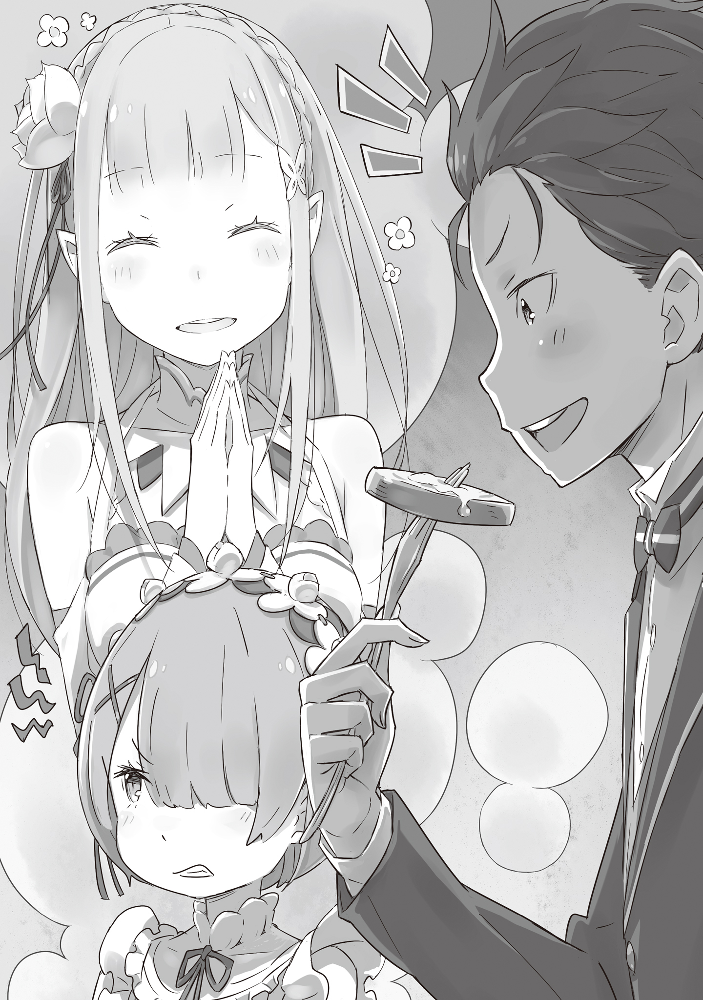

В одной из комнат особняка Розвааля, погружённого в ночную тишь, звонко, хоть и неумело, лился девичий голос.

Солнце село несколько часов назад — время, когда обитатели поместья обычно отходили ко сну.

Громко петь в столь поздний час — вольность, за которую в любом приличном доме неминуемо последовало бы порицание.

И величественный особняк маркграфа Розвааля L. Мейзерса не был исключением.

Впрочем, будь дело только в шуме, проблем бы не возникло.

Эта комната в западном крыле особняка была музыкальной, с превосходной звукоизоляцией, способной удержать внутри даже самые громкие рулады.

Порицание было вызвано не нарушением ночной тишины, а…

— …Госпожа Эмилия, сегодня вы поёте совершенно без огонька.

…тем, что в её пении и впрямь не было души.

Сказала это, изящно восседая на стуле, прелестная девушка в строгом платье горничной.

Она чуть прищурила свои пронзительные алые глаза.

Коротко стриженные волосы редкого персикового цвета, миловидное, почти кукольное личико, на котором, однако, застыло холодное, проницательное выражение.

Это была Рам — старшая из сестёр-близнецов, служивших в особняке, известная своим высокомерием и колким языком.

Услышав этот холодный, как зимний ветер, голос и встретив требовательный взгляд, обладательница неуверенного голоса пробормотала «У-у-у…» и, густо покраснев, медленно обернулась.

Перед Рам предстала девушка с длинными, до пояса, серебряными волосами и столь точёными чертами лица, что это вызывало невольный трепет.

Прозрачная, фарфоровая кожа сейчас тронута румянцем смущения, а в больших аметистовых глазах светилось беспокойство.

Лёгкая ночная рубашка придавала её облику соблазнительную, почти неземную прелесть, но почему-то в руках она крепко сжимала обычное металлическое ведро, что выглядело до странности комично.

Обернувшаяся девушка — Эмилия — сильнее прижала ведро к груди, виновато опустила глаза и тихо спросила:

— Всё-таки… заметно?

— Более чем. У Рам первоклассные глаза и уши, госпожа Эмилия. К тому же, вы уже несколько раз уронили ведро с таким грохотом, что не заметить было невозможно.

— П-правда? Я и перед господином Ведром провинилась… Прости, ведёрко, бедняжка.

С виноватым видом Эмилия провела тонкими пальчиками по гладкой поверхности ведра, которое уже не раз сегодня познало горечь падения.

Картина была престранная, но Рам, привыкшая к чудачествам госпожи, лишь едва заметно вздохнула.

Они находились здесь, в ночной музыкальной комнате, на очередной секретной тренировке, целью которой было помочь Эмилии совладать с собственным голосом.

Эту досадную проблему выявил недавний визит странствующего барда, и Рам, ко всеобщему удивлению, пообещала помочь.

Сейчас они проводили одно из таких занятий, которые повторялись каждые два дня по ночам…

— Госпожа Эмилия, время драгоценно. Особенно когда тренировки отнимают часы, отведённые на сон, — а это губительно для красоты. Не забывайте, что вы крадёте красоту не только у себя завтрашней, но и у Рам.

— Мне очень-очень жаль, правда… Но… это настолько серьёзно?

— Разумеется. Без преувеличения, это потеря вселенского масштаба. Узнай об этом Рем, она бы очень расстроилась.

— У-у, этого я совсем не хочу. Прости, Рам.

Эмилия понуро опустила плечи.

Её заострённые уши — явный признак полуэльфийской крови — тоже поникли, наглядно демонстрируя искреннее раскаяние.

Эмилия была натурой на редкость прямодушной, в её характере не было и тени лукавства.

Именно поэтому её сегодняшнее состояние вызывало у Рам недоумение.

Эмилия, которая, к добру или к худу, но всегда была целиком поглощена тем, что перед ней, сегодня явно витала в облаках.

— Ха-а, ничего не попишешь. …Госпожа Эмилия, если вас что-то гложет, просто расскажите Рам.

— А м-можно? — с надеждой спросила Эмилия.

— Господин Розвааль велел оказывать вам максимальное содействие.

Ради своего обожаемого господина Рам решительно отбросила привычную лень.

К тому же, душевное равновесие Эмилии было важно для их лагеря в целом.

Ради этого она готова была помочь…

— На самом деле, я хотела посоветоваться насчёт Субару…

— Кхм!

…И вся эта с трудом собранная готовность помочь мгновенно рассыпалась в прах.

— В последнее время Субару так сильно помогает мне во всём, понимаешь? Он такой молодец. И я всё думаю, как бы мне его получше отблагодарить…

— Ха-а, — Рам едва заметно поморщилась, но сохранила внешнее спокойствие.

— Но Субару такой нетребовательный. Когда я пытаюсь его отблагодарить, он только отшучивается: «Ничего не нужно! Твоей улыбки более чем достаточно!»

— Хе-е, — последовал ещё один многозначительный выдох.

— Поэтому я решила сама всё придумать. Что-то особенное.

— Хм-м.

Эмилия умолкла, ожидая совета, но Рам молчала с непроницаемым лицом.

— …Рам, ты меня вообще слушаешь?

Услышав этот вялый ответ, Эмилия, до того горевшая энтузиазмом, недовольно надула губы.

Но если кто и хотел взорваться от праведного негодования, так это Рам.

Её отношение к упомянутому Нацуки Субару было… запутанным.

Этот несносный юноша каким-то чудом спас Эмилию в столице, был принят на работу в особняк, помог в инциденте со зверодемонами, умудрился завоевать сердце её обожаемой сестры Рем, и теперь каждый божий день создавал в особняке невообразимую суету…

Справедливости ради, за некоторые его поступки она была ему благодарна.

Но говорить это в лицо?

Ни в жизнь.

— Рам вас слушает, госпожа Эмилия, но желание отвечать по существу заметно поубавилось, — холодно произнесла она.

— Ну вот, Рам, опять ты… В этом ты похожа на Субару, когда он дуется.

— Госпожа Эмилия, есть вещи, которые можно говорить, и которые нельзя. Немедленно извинитесь.

— Э-э… но ведь ты сама мне раньше про него то же самое говорила… — пролепетала Эмилия.

Услышав унизительное сравнение, Рам опасно понизила голос, и Эмилия, хоть и с недовольным видом, поспешно извинилась.

Нехотя приняв извинения, Рам продолжила:

— Итак. Что конкретно вы хотите сделать для Барусу?

— Ну… конкретно я пока не знаю. Помнишь, как Субару устроил суматоху, пытаясь приготовить свой майонез?

— Как же, прекрасно помню. Пополнение его проклятых запасов почему-то повесили на Рам, — с плохо скрываемым раздражением ответила горничная.

Майонез — странный желтоватый соус, по словам Субару, невероятно популярный у него на родине.

После долгих мучений и неудачных попыток его всё же удалось воссоздать.

Рам его жирноватый вкус не нравился, но он пришёлся по душе Эмилии и Беатрис, так что его приготовление незаметно вошло в её обязанности.

— Как вспомню, так в дрожь бросает… Почему Рам должна заниматься этой унизительной работой?

— Субару тогда был так рад, и я подумала, что если он снова так обрадуется, это будет лучшей благодарностью. У тебя есть идеи, Рам?

— Идеи, говорите? Хм.

— Если бы я хоть что-то знала о его родине, это могло бы стать зацепкой.

Эмилия решительно сжала кулаки, её лицо выражало непоколебимую решимость.

Рам скептически скрестила руки на груди.

Честно говоря, в происхождении Нацуки Субару было слишком много белых пятен.

Вся информация о его жизни до встречи с Эмилией была туманной.

Однако сам Розвааль придерживался политики невмешательства, и Рам беспрекословно подчинялась, понимая, что у господина были на то свои, скрытые от других причины.

— Впрочем, судя по поведению Барусу, Рам считает, что он, скорее всего, выходец из богатой, пусть и не слишком знатной семьи… из какого-нибудь мелкого королевства за пределами Лугуники.

В последнее время это стало менее заметно, но поначалу полное отсутствие у Субару базовых знаний об окружающем мире было просто поразительным.

Рам считала, что это было вызвано не бедностью, а, наоборот, слишком беззаботной жизнью.

Ухоженные руки и зубы, богатый, хоть и странный, словарный запас — всё это, по мнению Рам, было результатом хорошего домашнего образования и избалованности, присущей тепличным растениям.

— М-м-м, я тоже так думаю, — кивнула Эмилия. — Я даже тайно пыталась выяснить, откуда он, просмотрела много книг, но…

— Судя по вашему лицу, результаты неутешительные.

— Я подумала, может, это Город-Государство Карараги… но Субару иногда говорит такие странные слова, это не похоже на карарагский диалект, который я немного знаю.

Рам считала, что предположение Эмилии было близко к истине, но тоже сомневалась.

Как бы то ни было, готового ответа у неё не было.

Честно говоря, проще было бы спросить напрямую у самого Субару.

— Если я так сделаю, весь сюрприз пойдёт насмарку, — покачала головой Эмилия. — Важно всё подготовить втайне. Я даже с Паком посоветовалась на этот счёт.

— Тц, только лишней головной боли прибавилось… — пробормотала Рам себе под нос.

— …У Рам сейчас было ужасно страшное лицо…

Благодаря «мудрому» совету Великого Духа, задача стала почти невыполнимой.

У Рам не было никаких зацепок.

Поэтому её помощь приняла несколько иную форму.

— Думаю, Барусу обрадуется любому подарку от вас… Он не такой уж привередливый.

— Рам, и ты туда же! Не принимай его шутки всерьёз. Он ведь никогда не отвечает честно, только отмахивается.

— Из-за своих дурацких острот ему теперь никто не верит. Сам виноват, — Рам лишь пожала плечами.

Эмилия смущённо замахала руками.

— Госпожа Эмилия, Рам, конечно, не знает кулинарных вкусов далёкой родины Барусу, но я могу подсказать, как его точно можно порадовать.

— Правда? Как же? — с надеждой спросила Эмилия.

— Я научу вас, как сделать его любимый майонез ещё вкуснее. У Рам есть пара секретов.

Услышав это, Эмилия радостно всплеснула руками, её аметистовые глаза засияли.

В тот же миг ведро, которое она всё это время держала в руках, с оглушительным грохотом упало на пол.

— Эй, сестрица. А я вот никак не пойму, зачем меня сюда позвали? Мне как-то не по себе, если честно.

— Сиди молча, Барусу, и не ёрзай. Ничего плохого с тобой не сделают. Наверное.

— От твоего «наверное» только страшнее… Ладно-ладно, молчу, не смотри на меня так! У меня мурашки по коже!

Субару жалобно заскулил, и Рам одарила его своим фирменным презрительным взглядом.

От холода этого взгляда Субару сник, а Рам удовлетворённо фыркнула.

Место действия — просторная столовая, на следующий день после ночного разговора.

Рам с какой-то скрытой целью позвала Субару и чуть-ли не насильно усадила за стол.

Юноша в костюме дворецкого обеспокоенно оглядывался, но вдруг его лицо изменилось — в комнату проник тёплый аромат чего-то вкусного.

— О? Что за аппетитный запах?…

Субару, смешно шмыгая носом, обернулся на звук открывающейся двери.

Он увидел Эмилию, которая с некоторой опаской толкала перед собой сервировочную тележку с большим подносом, накрытым блестящей крышкой.

— Эмилия-тан? Что здесь происходит?

— …Прошу прощения за долгое ожидание, — сказала она, кокетливо подражая манерам горничной.

Подражая то ли Рам, то ли Рем, она произнесла эту фразу и игриво высунула кончик языка.

Субару на миг залюбовался, а Рам, искоса неодобрительно взглянув на него, с профессиональной сноровкой расставила всё перед удивлённым Субару.

— Э-э-э… можно спросить в чем дело? У кого-то день рождения, о котором я забыл?

— Хорошо, что ты спросил! — Эмилия гордо выпрямилась. — Это наша с Рам скромная благодарность тебе за твою усердную работу!

— А-а?! ЧТО-О-О?!

На это заявление Субару и Рам синхронно вскрикнули от изумления.

— Стоп-стоп-стоп! Секундочку! А почему Рам удивлена не меньше моего?! Это что, розыгрыш?! — воскликнул Субару.

— Вот именно, госпожа Эмилия. Будьте добры, объяснитесь. С какой стати Рам должна благодарить этого никчёмного Барусу? Это невозможно!…

— Ну это уж слишком, Рам! Не так уж я и никчёмен!

— Вот именно, Рам. Я понимаю, что ты стесняешься своих чувств, но…

В ответ на эти унизительные слова, от которых Рам дрожала от гнева, реакция Субару и Эмилии была обескураживающей.

Эмилия лишь приложила палец к губам и с обезоруживающей улыбкой продолжила:

— Рам ведь тоже помогала Субару собирать ингредиенты для чая Розвааля, и он усердно помогал убираться после Снежного фестиваля, так? Я всё понимаю, Рам, не стесняйся.

— Это… совершенно другое! — запротестовала Рам, но её голос прозвучал неуверенно.

Задетая за живое этим метким наблюдением, Рам промолчала.

Пока она мучительно подбирала язвительный ответ, всё внимание Эмилии переключилось на Субару.

— В общем, это наш с Рам скромный знак благодарности. Ну же, открывай крышку!

— О-о-о, хорошо. С благодарностью приму эту заботу от моей любимой Эмилии-тан и это почти невероятное проявление доброты от строгой Рам.

«Не смей принимать без моего разрешения, Барусу!» — хотела выпалить Рам, но снова опоздала.

Субару с любопытством схватился за ручку крышки и робко заглянул под неё.

Там…

— …Просто варёная картошка?

— Это не просто картошка! — с жаром возразила Эмилия. — Это наша с Рам особенная, волшебная варёная картошка! Приготовленная с любовью!

Сотрудничество Рам и её «благодарность» стремительно становились свершившимся фактом.

Пока Рам молча кипела от негодования, Субару вонзил вилку в одну из аппетитных картофелин.

Держа горячий, дымящийся клубень, он посмотрел на обеих.

В глазах Эмилии светилась детская надежда, а в глазах Рам — плохо скрываемая досада.

Субару откусил кусочек.

— Аф, ам… мгу-мгу…?! Э-это же!… Не может быть!

— Да! Да! Ты заметил? — Эмилия нетерпеливо подпрыгнула.

— Внутри… внутри мой любимый майонез!… П-печёная картошка! Это же настоящая печёная картошка! Как на моей родине!

— Вот-вот! Пе-чо-на-я кар-то-шка! — Эмилия с трудом выговорила незнакомое слово по слогам. — Но это ещё не всё…

Субару с восторгом назвал знакомое блюдо, и Эмилия счастливо улыбнулась.

Затем они оба, как по команде, обернулись к застывшей Рам и торжествующе сказали в один голос:

— …И соль! В ней идеальное количество соли!

От их сияющих лиц парочки Рам растеряла всю свою язвительность.

— …Естественно. Варёная картошка от Рам — вторая по вкусноте в мире. После той, что готовит Рем, разумеется.

Так, с трудом сдерживая вздох, Рам скупо ответила на невысказанный вопрос.

…А это, как говорится, уже совсем другая история.

— Сестрица, я слышала от госпожи Эмилии. Говорят, вы вместе угостили Субару-куна лучшей в мире варёной картошкой. Это так мило с вашей стороны!

Голос Рем, мягкий и нежный, донёсся до Рам, когда та убирала посуду.

— …Это не так, Рем. Совсем не так я всё это задумывала, — пробормотала Рам, чувствуя, как краска стыда заливает её щеки.

— Нет, всё в порядке, сестрица. Рем очень рада, что ты так добра к Субару-куну. Он это ценит, я уверена. …А то, что мне немного грустно от того, что я не участвовала, — это просто мой эгоизм, не обращай внимания.

Рем, прослышав об успехе «пе-чё-ной кар-то-шки», ослепительно улыбнулась сестре и, поклонившись, ушла.

Услышав эти слова от любимой сестры, Рам невольно протянула руку ей вслед, словно пытаясь оправдаться.

Затем она медленно сжала руку в кулак.

Рука её дрожала.

Крепко стиснув зубы, она почти беззвучно прошипела:

— …Барусу, я тебе этого никогда не прощу.

Так, твёрдо решив в ближайшие дни устроить несчастному Субару «весёлую жизнь», она в итоге довела его до того, что он вопил на весь особняк: «Да за что мне всё это?!».

А Рам лишь молча и с удовлетворением наблюдала за его страданиями, считая это справедливой местью.

《Конец》
