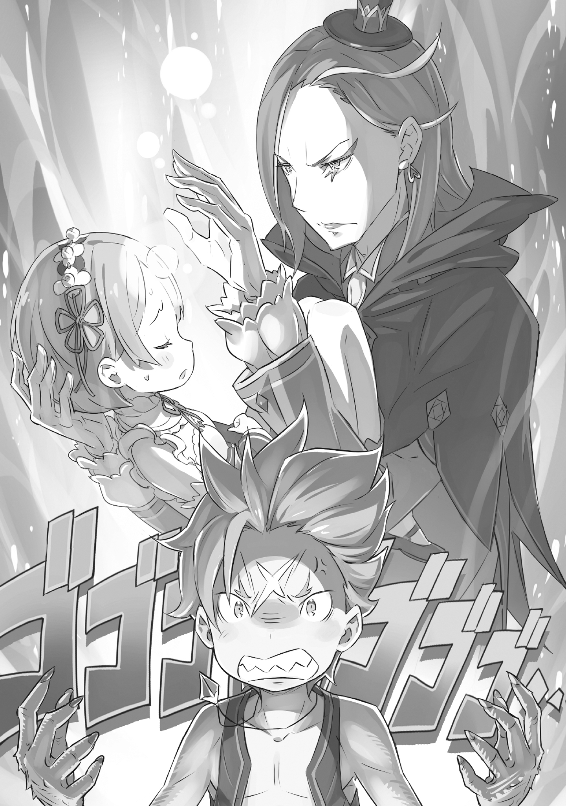

Гарфиэлю никогда не везло в любви. Та, к кому он питал нежные чувства, ни разу не ответила ему взаимностью.

Первая любовь настигла Гарфиэля Тинзеля в ранней юности. Следующие десять лет в его жизни неизменными оставались лишь изнурительные тренировки да привычка трогать шрам на лбу — болезненное напоминание, ранившее и тело, и душу. А ещё в его сердце жила вечная любовь к девушке, вспыхнувшая в тот миг, когда он впервые её увидел.

— Это Рам, она несколько дней назад пополнила ряды прислуги поместья. Она будет часто сопровождать меня для обучения манерам, поэтому, пожалуйста, постарайся с ней поладить.

Так сказал Розвааль — местный лорд со странным гримом на лице, — появившись в «Святилище», спрятанном в лесу Кремальди.

На приветствие Розвааля Гарфиэль лишь скорчил кислую мину и промолчал. Розвааль ему был не по душе. Конечно, бабушка Рюдзу объяснила, что «Святилище» многим обязано этому человеку, но это не меняло отношения Гарфиэля. Он мог испытывать благодарность, но не симпатию.

Левый и правый глаз Розвааля были разного цвета — синий и жёлтый. Как бы то ни было, блеск в этих глазах был Гарфиэлю неприятен. Казалось, они смотрят не на то, что прямо перед ними, а куда-то вдаль, в будущее.

Однако на этот раз причиной его молчания была не привычная враждебность к Розваалю. Он был очарован видом девушки, стоявшей рядом с лордом.

— …Я Рам. По приказу господина Розвааля я, хоть и неохотно, буду проводить с тобой время, — дерзко заявила девушка; эта смелость не вязалась с её юной внешностью.

Рюдзу широко распахнула глаза, а Розвааль смущённо улыбнулся. Девушка — Рам — скрестила руки на груди, взглянула на ошарашенного Гарфиэля и бросила: Что?

— …Будь моей женой.

— Ни за что.

От серьёзного предложения до мгновенного отказа — эта любовь прожила всего десять секунд.

— …И всё-таки, будь моей женой.

— Ни за что.

Когда он с ходу получил отказ и на второе предложение, любовь в сердце Гарфиэля разгорелась ещё сильнее.

Так в этот миг началась долгая первая любовь Гарфиэля и их непростые отношения.

Рам появлялась в «Святилище» примерно раз в месяц.

Она была девочкой, которой ещё не исполнилось и десяти лет. Естественно, она не могла в одиночку отправиться в такую дальнюю поездку из особняка в «Святилище». Каждый раз Рам приезжала в «Святилище» под предлогом сопровождения своего господина, — Розвааля L. Мейзерса.

— Хотя, на самом деле, мне совсем не нужно прислуживать господину Розваалю.

— Тогда какого черта ты таскаешься с этим придурком? Отказала бы ему, и всё.

— Мою дорогую младшую сестрёнку держат в заложниках. Воспротивься я ему — с ней случится что-то ужасное.

Стояла жара — начинался Сезон Огня. Другими словами, сезон любви. Поддавшись настроению, Гарфиэль позвал Рам к водоёму, но тут же выпучил глаза от шокирующих слов, слетевших с её губ.

Её младшая сестра — заложница!? Новость о том, что у Рам вообще есть младшая сестра, сама по себе стала неожиданностью, но бесчеловечность Розвааля перешла все границы.

Угрожать человеку через его семью — такое невозможно простить.

— Ублюдок… Я-то думал, что ты не способен на такую низость, но ты всё же вытворил такую мерзость!…

— Я соврала.

— К черту шутки! Обещаю, я что-нибудь придумаю! Рам, я верну твою сестрёнку целой и невредимой! И вот тогда, когда она вернётся, будь моей женой… Ай-ай-ай! Больно же!

— Послушай.

Пока Гарфиэль поддавался эмоциям и распалялся, Рам больно ущипнула его за ухо. Он взвизгнул, на глазах выступили слёзы. Рам, глядя на него, только тихо вздохнула.

— Это была шутка. То, что моя милая Рем находится в особняке — правда, но её вовсе не держат в заложниках. …Скорее уж, наши с Рем роли противоположны.

— Противоположны?…

— Это значит, что та, кто служит ей оковами — это я. — Рам опустила глаза, и в её шёпоте послышалась такая тоска, что Гарфиэль обеспокоенно нахмурился.

Её слова были туманны, и он не совсем их понимал. Он понимал лишь одно: Рам больно от её же собственных слов. Понимал, но терялся, не зная, что сказать.

— …Возможно, тебе трудно это понять, Гарфиэль. Я права?

Она улыбнулась и искоса взглянула на него своими светло-алыми глазами, отчего Гарфиэль покраснел. Он почувствовал возмущение, но ещё сильнее — стыд.

Было невыносимо больно сознавать, что он не может постичь душу девушки, которую так любит.

Однако он не хотел показывать, каким жалким себя чувствует. Он ударил себя кулаком в грудь.

— Не мели ерунды! Я, э-э… ну, ты знаешь! Я всё понимаю! Я же говорил… Я… а о чём я говорил?… А! Учёба! Я же учусь, и всё такое, так что… эм… да!

— Учёба, значит? Чтобы ты, Гарфиэль, да об учёбе… Смелое заявление.

Он решил взяться за книги. Заняться тем, к чему до сих пор душа не лежала.

Книги у него были — те, что дарили. Старшая сестра, ушедшая из Святилища на службу к Розваалю, присылала их время от времени.

До сих пор он к ним не притрагивался. Оправдывался тем, что чтение ему не по душе. Да и, чего таить, отчасти виной была затаённая обида на сестру. Но теперь Гарфиэль решил переступить через это.

Если чтение книг поможет узнать, что у Рам на душе, он возьмётся за них.

Гарфиэль мыслил просто: врагов нужно побеждать. То, что заставляло Рам грустить, было врагом Гарфиэля. И он хотел этого врага понять.

— Постараюсь не ждать от тебя слишком многого… Гарф.

До этого дня Гарфиэля называли Гарфом лишь родные.

Но с того дня его звали Гарфом только родные и девушка, в которую он был влюблён.

— Ты чёртов ублюдок! Что ты делаешь с Рам?!

В ярости, от которой закипала кровь, Гарфиэль оскалил клыки и взревел.

…Это случилось холодной ночью, залитой ярким лунным светом.

Когда Розвааль останавливался в «Святилище», он занимал дом Рюдзу — самый видный в деревне. Поскольку её собственный дом был временно занят Розваалем, Рюдзу перебралась погостить к Гарфиэлю. Он был недоволен, что Рюдзу пришлось уступить свой дом, но в то же время рад приезду бабушки, так что чувства испытывал смешанные.

Как бы то ни было, в тот раз Розвааль жил в доме Рюдзу. Естественно, Рам, сопровождавшая Розвааля, остановилась там же. Гарфиэль хотел видеться с Рам, но не с Розваалем, а потому старался не показываться у дома Рюдзу, пока там был лорд.

То, что случилось в тот день, было чистой случайностью. Он случайно нашёл в лесу спелое аблоко и направился к дому Рюдзу, чтобы подарить его Рам…

— Ах…

…и застал сцену, где Розвааль применял какую-то магию ко лбу Рам, отчего та стонала от боли.

Лицо Рам покраснело, на затылке выступила испарина. Было ясно: Розвааль причинял ей в лучшем случае неудобство, а скорее всего — боль. Подробности были неясны… но этого было достаточно.

— О-о-о-о-о-о-о!!

Кровь закипела в жилах, волосы на теле встали дыбом. Невероятная сила наполнила его, и тело Гарфиэля с треском начало меняться: клыки и когти удлинились, чувства обострились до предела. Сознание окрасилось в багровый, разум отступил, осталась лишь слепая ярость к врагу перед глазами.

— Гарф! — раздался высокий голос. Но он не мог его понять.

— Ох, как некстати… Похоже, придётся поступить немного не по-взрослому, — послышался тихий голос. Гарфиэль понял, что ненавидит обладателя этого голоса. Он нацелился на звук и прыгнул.

…И почувствовал удар по лицу.

— Очнулся?

— …Агх…

В голове гудело, словно били в огромный барабан. Но перед глазами было лицо желанной девушки, а голова покоилась на чём-то мягком. Этого знания ему пока хватало.

— Раз очнулся — слезай. Ноги совсем затекли.

— Гуааах!

Не успел он насладиться своим счастьем, как Рам бесцеремонно спихнула его со своих колен на пол. Потирая ушибленную голову, он поднялся и увидел, что Рам смотрит на него своим обычным холодным взглядом.

— …Ты будешь моей женой?

— Ни за что… Гарф, ты что, не помнишь, что случилось?

— Что случилось?… — Честно говоря, он помнил лишь, как холодность Рам разожгла огонь в его сердце.

Стоило об этом подумать, как воспоминания о недавних событиях хлынули на него.

Ночь, дом Рюдзу… Розвааль делает с Рам что-то непростительное… Перед глазами всё покраснело.

— Я этому гаду голову откушу…

— Забудь. Это был просто кошмар.

— …Получается, в крепости Римгена утро никогда не наступает?… — придя в себя, он тут же почувствовал острую боль в носу — последствие удара, сильного, словно он со всего маху влетел в стену.

— Ты сделал поспешные выводы, обратился в зверя и напал на господина Розвааля. Но маленького тигрёнка без проблем прихлопнули, и ты растянулся на полу жалким меховым ковриком…

— Нет! Погоди, обратился в зверя?… Я?

— Кровь получеловека. Ты не мог её контролировать. Прежде чем случится что-то непоправимое, ты должен научиться контролировать её или полностью выпустить свою кровь получеловека наружу.

— Как я могу такое сделать, а?! Я же просто сдохну, разве нет!?

— Дурак. Я же сказала: научись её контролировать.

От одного этого слова «Дурак» Гарф поник. Рам с недоумением наблюдала за его реакцией, но Гарф не мог поднять голову.

Он поступил глупо. Сделал поспешные выводы. И снова ничего не смог противопоставить Розваалю. Ему не хватало ни сил, ни ума. Поэтому он не только не понял, что делали Рам и Розвааль, но даже не понял, в чем он сам ошибся.

— Дурак. — Сказав это ещё раз понурому Гарфиэлю, Рам погладила его по голове.

— …Рам — Они, потерявшая свой рог. «Безрогая». Без рога она с трудом поглощает ману, и это тяжело сказывается на её теле. Поэтому она и просит помощи господина Розвааля в этом.

— А… — Услышав слова Рам, Гарфиэль поднял голову; его клыки задрожали.

Ему доверили тайну. Но это не принесло ему радости. Родился гнев. Врагом, пробудившим в Рам болезненные воспоминания и печаль, оказался сам Гарфиэль.

…Болезненное воспоминание, прошлое, которое лучше не ворошить. Гарфиэль понимал эту боль. То, что нужно забыть ради душевного покоя. И тем, кто нарушил этот покой, оказался он сам.

— А, мне сказали, что нельзя об этом болтать, но… э-э, в лесу, знаешь… На самом деле, там в лесу есть бабушка и такие же… ну, с такими же лицами, как у неё…

— Они сказали, что это секрет. Но раз уж Рам доверила мне свой секрет. Поэтому… э?

— Ты тупица, Гарф.

В ответ на слова, вырвавшиеся у него в попытке хоть что-то сказать, щелбан Рам угодил прямо в шрам у него на лбу. Отшатнувшись от резкого удара, Гарфиэль заморгал, а глаза наполнились слезами.

— Я сказала тебе это не потому, что хотела делиться секретами. Если ты снова так набросишься на господина Розвааля, будут проблемы, вот я и объяснила. Не пойми меня неправильно.

— А, я не это имел в виду…

— Честно говоря, нет ничего хуже, чем выбалтывать семейные тайны, чтобы произвести впечатление на девушку. Только слабый, жалкий болван на такое способен. Гарф, неужели ты слабый, жалкий болван? — Прижав руку ко лбу, Гарфиэль затаил дыхание от вопроса Рам.

Это был поворотный момент. Решающий момент для любви Гарфиэля.

Вопрос был не в том, суждено его любви сбыться или нет, а в том, есть ли у него самого право любить Рам.

— Нет! Я не слабый и жалкий болван!

— Ясно.

Коротко вздохнув, Рам сказала лишь это, и, глядя на неё, Гарфиэль принял решение.

Слабый и жалкий идиот не имеет права жениться на Рам.

— Я хочу стать сильным, достойным и мудрым великим человеком.

Так он пожелал.

— Эй, Рам! Теперь-то точно, будь моей женой! Если согласишься, я сделаю тебя счастливой, как саму Великую королеву дворца Аринверде!

Он отточит свою мудрость, преисполнится уверенности в себе и предстанет перед Рам как мужчина, который сильнее кого бы то ни было.

Увидев такую решимость Гарфиэля, Рам на миг опешила. Затем её плечи раздражённо опустились, и…

— Ни за что, — быстро оборвала она его.

Но тут же, словно не в силах больше сдерживаться, её губы дрогнули, и она улыбнулась. И…

— Ты и вправду дурак, Гарф, — сказала она, в который уже раз подбрасывая дров в пламя любви Гарфиэля.

《Конец》
