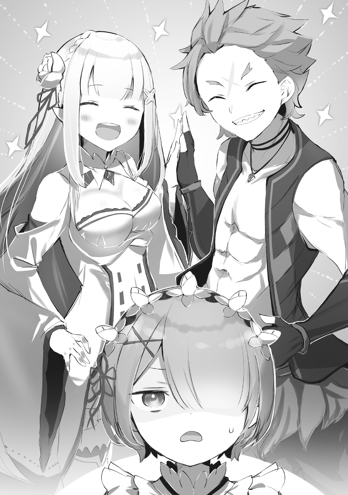

В тот день в особняке Розвааля случилось нечто необычное.

— Что, Эмилия-тан уходит куда-то без меня?!

— Субару, не нужно так удивляться. Я могу выйти и без тебя.

Субару дрожал от удивления, в то время как Эмилия надула щёки и возразила ему.

Они разговаривали в холле особняка, Эмилия уже собралась на выход и остановила Субару, когда тот попытался пойти с ней.

Так всё и началось.

После посвящения Субару в рыцари Эмилия и он официально стали госпожой и слугой, поэтому Субару почти всегда сопровождал её. Сама Эмилия была этому очень рада, но…

— И всё же Эмилия-тан меня бросает… Неужели я что-то натворил?!

— А, нет-нет, дело не в этом. Просто ты, Субару, в последнее время постоянно со мной, вот я и подумала, что тебе стоит хоть иногда отдыхать…

— Что?! Да нет лучше отдыха, чем быть рядом с Эмилией-тан и впитывать Эмилиянин!

— Прости, я не совсем понимаю, о чём ты. — Эмилия опустила уголки бровей и непонимающе ответила растерянному Субару.

Она всего лишь хотела, чтобы он отдохнул, но как заставить его выслушать?

И пока Эмилия ломала над этим голову…

— Ха! Какая жалкая паника, Барусу.

— Сестрица…

Цокая каблуками, к ним подошла Рам. Она смерила Субару взглядом с ног до головы, а затем подняла палец:

— Слушай сюда. Во-первых, уже поздно беспокоиться, что ты расстроил госпожу Эмилию. Барусу, если ищешь причину своих провалов, начни с того момента, когда ты был ещё в утробе.

— А-а, чёрт! И что я должен думать? «Ах да, наверное, я слишком сильно пинал маму изнутри»?! Да нет у меня никаких сожалений о временах в утробе!

— Мужчина, неспособный к самоанализу… Далеко он не пойдёт.

— Не говори то, что ранит в самое сердце!

Эмилия тихонько рассмеялась, глядя на их дружескую перепалку. Они с самой первой встречи идеально ладили, и наблюдать за их отношениями со стороны было очень забавно.

Хотелось бы вечно смотреть на них, пока их разговор не иссякнет, но…

— Так, всё, разговоры на этом закончим. Субару, у тебя же сегодня обещание Петре и Фредерике, верно? Научить их делать «апплике», так?

● Апплике в шитье — это техника украшения ткани, при которой кусочки ткани другой формы или фактуры пришиваются к основе, создавая узор или рисунок.

— Угх! Просветительский пыл апостола вышивки обернулся против меня!…

Субару рухнул на колени, вскинув руку с иглой и ниткой. В его поникшей ладони на ткани стремительно появлялся милый вышитый котёнок.

Субару и раньше был мастером на все руки, но его недавний прогресс в вышивке просто поражал.

Эмилия гордилась своим усердным рыцарем, но видя его подавленное состояние, не могла вымолвить и слова.

Как бы то ни было…

— Не волнуйся так, всё в порядке. Помнишь недавний переполох со Светожуками? Я просто хочу поговорить с главой города Костул и узнать, улеглась ли суматоха.

— Глава Костула — это тот здоровый мужик со страшным лицом? Он так нависает и смотрит сверху вниз, что я здорово струхнул. Эмилия-тан, ты его не боишься?

— А? Совсем нет. Он ведь очень-очень добрый человек. — Эмилия удивлённо приподняла бровь, не понимая причин беспокойства Субару.

Глава промышленного города Костул, ближайшего к новому особняку Розвааля, действительно был высоким и на первый взгляд пугающим, но он был прекрасным человеком, который ставил жизнь горожан превыше всего.

Недавно в Костуле бушевали вредоносные насекомые, называемые Светожуками, что привело к огромному ущербу.

Эмилия и остальные помогли унять хаос, но её беспокоили последствия. Целью сегодняшней поездки было узнать, как обстоят дела.

— Поэтому не волнуйся, всё будет хорошо. Рам идёт со мной, и к тому же…

— …крутой я тоже свободен! Так что иду с ними!

Прямо во время её объяснений появился последний участник их группы. Это был Гарфиэль с короткими светлыми волосами, тренированным телом и внушительными острыми клыками.

Он был воином лагеря Эмилии, и сегодня выступал её телохранителем. Хотя никто и не думал, что в такой охране есть реальная необходимость.

— В отличие от Барусу, обычные головорезы госпоже Эмилии не ровня.

— Кх, и не поспоришь…

— Ха! Расслабься, Капитан! Город-то совсем рядом, что бы ни случилось, крутой я как следует защищу и Рам, и госпожу Эмилию!

— Но ведь именно в этом «близком» городе, во время того переполоха, и похитили Фредерику… А-а-а, да что толку говорить! Полагаюсь на тебя, Гарфиэль!

В ответ юноша с широкой улыбкой ударил себя в грудь и повернулся к Эмилии, пока Субару хлопал его по плечу подбадривая.

— Думаю, всё будет хорошо, но будь очень осторожна. С повозками и мужчинами. И с плохими людьми тоже.

— Ох, Субару, вечно ты беспокоишься. Но не волнуйся. Повозки и мужчины — это ладно, но если появятся плохие люди, я с ними как следует разберусь!

— М-м-м, я не совсем это имел в виду, но… Э.Н.А.

Под сложным взглядом Субару Эмилия и остальные покинули особняк.

Субару стоял перед домом и махал им вслед, пока они не скрылись из виду.

После всех этих сборов троица наконец-то покинула особняк, однако…

— Слушайте, а мы втроём редко что-то делаем вместе, да?

— А, и правда. Рам и Гарфиэль всегда вместе, а я обычно с Субару, так что для меня это редкость.

— Хотелось бы внести небольшую поправку в это утверждение…

Беседа Эмилии и Гарфиэля шла полным ходом, а Рам с кислой миной сидела между ними.

Гарфиэль был прав — компания собралась необычная. Просто так совпало, что Розвааль уехал, а Субару был занят обещанием Петре и остальной суетой особняка. Отто, которого так и не упомянули, должно быть, сейчас сопровождал Розвааля.

— Кажется, Розваалю очень понравился Отто-кун.

— …Раздражает, но Отто, как ни крути, на удивление полезный член лагеря. Среди находок Барусу его можно считать настоящей удачей. Хотя это и раздражает.

— Братец Отто — находка? А он ещё кого-то подбирал?

— Петру тоже можно считать находкой Барусу.

— А, ну да, Петра и вправду привязана к Капитану… —Гарфиэль почесал в затылке, соглашаясь со словами Рам.

Отто и Петра присоединились к их лагерю во многом благодаря Субару. Оба очень дружны с ним, поэтому Эмилия была рада таким союзникам.

— Если Субару и дальше будет приводить столько друзей, у нас станет очень оживлённо.

— Рам не считает это хорошей идеей. Чем больше людей, тем вероятнее, что среди них будут и жемчуг, и простые камни. Не думаю, что нам и дальше будет так везти.

— Значит, ты тоже признаёшь, что братец Отто и Петра — отличная находка, а, Рам? Они бы обрадовались, услышав это… Ай, больно!!

— Рам!? Зачем ты вдруг вцепилась Гарфиэлю в волосы!?

Так, беседуя в пути, Эмилия и её спутники прибыли в Костул.

Как и планировалось, они встретились с главой города в здании, временно заменявшем городскую управу — старое здание обрушилось во время недавнего нашествия Светожуков.

— Благодарю вас за то, что пришли, — безэмоционально произнёс Лено Рекс, встречая их в приёмной.

Лено был огромным мужчиной. На первый взгляд он больше походил на наёмника, чем на главу города, но судить по внешности не стоило.

Эмилия знала, что за этой внешностью скрывается заботливый человек, и считала его отличным градоначальником.

Не обращая внимания на мысли Эмилии, Лено сразу перешёл к делу.

— Хаос в городе после недавнего инцидента наконец утих. Мы приступили к восстановлению.

— Это хорошо, но жаль только, что мы не смогли прийти на помощь раньше.

— Что вы, наоборот, ваш главный воин нам очень помог.

Лено, не меняя выражения лица, расхвалил вклад Гарфиэля.

Именно Гарфиэль и Фредерика спасли его и других служащих из-под обломков рушащегося здания управы. Услышав прямую похвалу, Гарфиэль самодовольно потёр нос.

— Однако что-то вы не торопитесь с этим восстановлением. Это же не черепашьи бега, чего так долго возились?

— Причин несколько. Во-первых, уничтожение оставшихся Светожуков заняло время. Вторая важная причина…

— Мастерские магических устройств пострадали, и на их восстановление требуются время и деньги, так ведь? — тихим голосом закончила за него Рам.

— Именно так. — подтвердил Лено.

Магические устройства… Эта технология была главной причиной, почему Костул называли «Промышленным городом».

Это было его главное преимущество перед другими. Магические устройства работают на магических камнях, они способны выполнять задачи, недоступные для человека. Это своего рода современные «Метеоры».

Мастерские и фабрики, производившие эти устройства, сильно пострадали из-за Светожуков. Экономика Костула получила сокрушительный удар.

Уничтожение вредителей наконец завершилось, а восстановление, которое должно было вернуть городу его славу, началось.

Однако…

— И тут возникла большая проблема.

— Что? Большая проблема? — удивилась Эмилия, ожидавшая услышать хорошие новости.

Лено глубоко кивнул и продолжил:

— Мастерские закрылись, и ремесленники остались без работы. Многие уехали на заработки, но…

— Ну, не будешь работать — не будешь есть. В этом проблема?

— Сами по себе заработки — не проблема, но если они не возвращаются, это уже другой разговор.

— Не возвращаются?… То есть те самые ремесленники, что уехали?

Лено утвердительно кивнул, а Эмилия и остальные переглянулись.

Если это правда, то проблема огромная. Уезжать на заработки, пока мастерские в ремонте — это нормально, но если эти мастера не вернутся…

— Значит, даже если мастерские восстановят, работать в них будет некому, так?

— Чтобы мастерски обращаться с магическими устройствами, нужен немалый опыт. Если большинство умельцев ушло, а новых придётся обучать с нуля…

— …ущерб за это время будет колоссальным. В худшем случае Костул, который гордо звали «Промышленным Городом», может просто рухнуть, — произнесла Рам.

— Рам, не говори так… — Эмилия упрекнула Рам за столь мрачное предположение, но Лено покачал головой.

— Это факт. Её предположение верно, и если так пойдёт и дальше, город не выживет.

— И чего же вы хотите? Сразу скажу, даже для дома Мейзерс поддержка финансов целого города невозможна. И у нас нет таких обязательств.

— Но ведь этот город входит в земли маркграфа?

— Управление собственными землями — это ответственность господина Розвааля. Но за управление самим городом отвечаете вы, как его глава. Собираетесь винить господина Розвааля, прикрывая собственную некомпетентность?

— Рам, хватит!

Как только речь зашла о Розваале, слова Рам стали на порядок острее.

— Не надо так злиться, главе города сейчас тоже нелегко. К тому же…

— К тому же, что?

— Нужно выслушать всё до конца. Глава города ведь не стал бы просто так просить у нас денег, правда?

Эмилия жестом успокоила недовольную Рам и побудила Лено продолжать. Он глубоко кивнул в ответ на её слова.

— Прошу прощения, если вызвал недопонимание. …Как и сказала госпожа Эмилия, я не собираюсь просить маркграфа покрывать наши финансовые трудности. Это действительно моя обязанность.

— Так чего тогда, в конце концов, вы от нас хотите?

— Я бы хотел позаимствовать у маркграфа Мейзерса рабочую силу.

— Рабочую силу? То есть… прислугу?

То, что из-за отсутствия мастеров возникла нехватка рабочих рук, было понятно. Но неужели это можно решить с помощью прислуги? К тому же, в особняке тоже есть работа, так что отправить Рам и остальных на помощь будет трудно.

Честно говоря, одолжить можно было разве что Субару.

— Но разве даже Субару будет под силу в одиночку решить проблему нехватки рабочих рук в таком большом городе…?

— Хех, что вы такое говорите, госпожа Эмилия? Это же Капитан.

— Гарфиэль… ты прав! Субару наверняка что-нибудь придумает.

— Госпожа Эмилия, Гарф, хватит так идеализировать Барусу.

Эмилия и Гарфиэль уже были полны энтузиазма, но Рам прервала их вздохом. Она перевела взгляд на Лено.

— Рам тоже немного остыла. Рабочая сила, которую вы ищете, это…

— Люди для поисков. Как я уже сказал, я хочу узнать, куда пропали ремесленники, которые не вернулись.

— Если здесь есть признаки преступления, то это уже поддержание порядка на территории… что входит в обязанности господина Розвааля.

Похоже, Рам смирилась с просьбой Лено, поняв, что это действительно входит в компетенцию её господина. Эмилия же решила, что их просто просят найти пропавших людей.

— А что, если уехавшие ремесленники получили очень хорошую работу и просто увлечённо трудятся?

— Даже если и так, взрослый человек должен был бы послать весточку об этом. К тому же, проблема в том, что от них нет вестей даже для их собственных семей. Я права?

— …Именно так. — Лено покорно и тяжело кивнул в ответ на слова Рам.

Выслушав это, Эмилия тоже поняла, насколько всё серьёзно. Ей захотелось решить проблему и вернуть пропавших ремесленников домой.

— Ведь семьи должны быть вместе, если это возможно.

— А, тут крутой я с тобой полностью согласен. Ладно! Сделаем это, госпожа Эмилия! — решительно поддержал её Гарфиэль.

Чувствуя его ярую поддержку, Эмилия встала.

— Я поняла, господин глава. Мы тоже поможем в поисках пропавших ремесленников.

— Раз вы так говорите…

— Тогда давайте начнём немедленно! Гарфиэль, у тебя ведь потрясающий нюх, верно? Я могу на тебя положиться?

— М-м?

Лено, который уже было расслабился от позитивного ответа Эмилии, удивлённо нахмурился.

Но Гарфиэль, не заметив его реакции, бодро ответил Эмилии:

— Ага! Крутой я — получеловек-тигр, но мой нюх не уступит какой-нибудь собаке или кошке. Пропавшие это или кто ещё, крутой я их мигом отыщу.

— Это очень обнадёживает! Ладно, тогда…

— Ага, начнём! — Гарфиэль оскалился в улыбке.

Эмилия тоже сжала кулаки, полная решимости. Затем они, словно пружины, развернулись и посмотрели на Лено горящими глазами.

— Не волнуйтесь и ждите. Мы обязательно найдём пропавших!

— «Крылья Моккарки обгоняют ветер»!

С этими словами Эмилия и Гарфиэль кивнули друг другу и выбежали из приёмной.

Их напор ошеломил Лено, он мог лишь растерянно проводить их взглядом. Когда первый шок прошёл, он посмотрел на Рам, которую те двое оставили.

— …Мне всего лишь нужно было, чтобы вы выделили людей.

— Рам тоже так считает. Я сообщу об этом господину Розваалю позже. А до тех пор…

— А до тех пор?

— …будет разумнее просто подыграть им, пока они не успокоятся.

Сказав это, Рам элегантно насладилась поданным ей чаем и, вздохнув, покачала головой.

— А, ты поздно, Рам. Мы уже хотели уходить без тебя.

— Прошу прощения, госпожа Эмилия. Чай и сладости были слишком хороши, чтобы их оставлять. …Так что, есть успехи?

Рам догнала их спустя некоторое время после того, как они выбежали из временной городской управы.

Как она и сказала Эмилии, Рам в полной мере насладилась гостеприимством, прежде чем выйти. За это время Эмилия и Гарфиэль, похоже, носились по всему городу.

Когда она спросила о результатах, Эмилия подалась вперёд.

— Насчёт этого! Мы с Гарфиэлем поговорили с кучей народу. И нам столько раз сказали «спасибо» за помощь в борьбе со Светожуками…

— Вот как. Что ж, хорошо. Похоже, буйство Гарфа было не напрасным.

— Ну, тот переполох вообще-то устроил извращенец, который охотился на мою сестру. Так что не знаю, насколько тут стоит радоваться.

Эмилия смущённо улыбнулась, а Рам и Гарфиэль в привычной им манере обменялись впечатлениями.

Вдаваться в подробности того инцидента было нельзя — для лагеря Эмилии это была запутанная история. Тем не менее, тот факт, что горожане теперь благосклонны к Эмилии, был приятен.

— То есть, результат нулевой? Тогда пойдёмте домой. Нужно будет снова просить господина Розвааля выделить людей.

— Хе-хе, так ты думаешь? А вот и нет. Правда, Гарфиэль?

— Ага. Нюх крутого меня и расспросы госпожи Эмилии принесли плоды. Это и есть то, что называют «Совместное сумо Дзётэна и Гэтэна»!

— Да, всё верно!

— …

Рам молча смотрела на Эмилию и Гарфиэля, гордо выпятивших грудь. Те удивлённо на неё покосились, но, не растерявшись, продолжили.

Результаты их расспросов были таковы…

— Посредники, которые находили работу для уехавших ремесленников…

— Не знаю, подозрительные ли они, но похоже, пропавшие мастера говорили с ними о работе.

— Если это они и есть похитители, то всё просто, а?

— Мы так думаем. А ты что скажешь, Рам?

Гарфиэль выглядел как победитель, а Эмилия смотрела на неё снизу вверх, ожидая мнения. Слушая их, Рам сдержала желание схватиться за голову.

Честно говоря, она совершенно не ожидала от их расспросов никаких результатов, но, судя по всему, они добились куда большего успеха, чем она предполагала.

Невернувшиеся работники и подозрительные посредники.

— …Подозрительно.

— !… Правда? Рам, ты тоже так думаешь?

Рам невольно пробормотала это, и глаза Эмилии тут же засияли. Рядом с ней Гарфиэль со словами «Ну вот видишь» удовлетворённо скрестил руки на груди, на его лице было написано самодовольство.

— Какой ты довольный, Гарф. Да, это твоя заслуга, но…

— Эй! Если думаешь, что на этом всё, то ты наивна, Рам. Слишком наивна.

— Слишком наивна, да. Если они и есть похитители, будет плохо, если они сбегут, правда? Поэтому я попросила Гарфиэля…

— …своим нюхом засечь, в каком направлении уехала их драконья повозка!

— Вот так вот.

Сказав это, Гарфиэль фыркнул и указал пальцем за город. Вероятно, именно туда и направилась повозка подозрительных посредников.

— Слишком уж всё гладко… Это точно госпожа Эмилия и Гарф?

— Это что значит? Ты нас хвалишь?

— Нет. То есть, да. Рам очень удивлена, что вы двое так хорошо поработали головой. Вы всё-таки растёте.

— Разве не странно сомневаться в том, что мы вообще способны на рост?

Рам невольно сказала то, что думала, но, похоже, главная виновница — Эмилия — ничего не заметила. Поэтому Рам просто ущипнула Гарфиэля за щеку, чтобы заставить его замолчать.

В любом случае, если бы расследование зашло в тупик — это одно, но раз оно так успешно продолжается, просто взять и всё бросить было трудно.

Поэтому…

— Давайте для начала просто проследим за повозкой. Возможно, где-то запах прервётся, и тогда у нас будет повод отступить.

— М-м, хорошо. Но не волнуйся, я уверена, след приведёт нас прямо к цели. Гарфиэль, это будет нелегко, но я на тебя рассчитываю.

— Ага, положитесь на меня. И Капитан, и братец Отто просили приглядывать за госпожой Эмилией. Крутой я не будет филонить.

— Субару и остальные так сказали… А, но в данном случае ты ведь будешь напрягать не руки, а нос?

— Эй, а ведь точно! Ва-ха-ха-ха!

— Хе-хе, забавно.

Гарфиэль громко расхохотался, а Эмилия сдержанно улыбнулась.

Сопровождая эту беззаботную парочку, Рам ломала голову, как бы им изящно выйти из этого дела.

Она и сама считала этих посредников крайне подозрительными, но всё шло слишком уж гладко. Не похоже, чтобы враги сами сливали информацию, так что объяснить это можно было лишь невероятным везением Эмилии и Гарфиэля.

Лично Рам считала, что они уже выполнили свой долг перед Лено. Можно было бы передать дальнейшее расследование властям Костула, и никто бы их не упрекнул.

Если они вот так возьмут и решат проблему до конца, глава города Лено может потерять лицо.

Поэтому она думала, что лучший вариант — это в какой-то момент передать дело Костулу.

Но…

— Смотри! Рам! Та драконья повозка… это случайно не та, которую мы ищем?

Погоня, полагавшаяся исключительно на нюх Гарфиэля, успешно вывела их прямо к логову противника. От этого Рам ещё сильнее захотелось схватиться за голову.

Все шло слишком хорошо, и теперь было невозможно отступить.

Рам оказалась втянута в эту редкую ситуацию, и её кислое выражение лица становилось всё мрачнее.

— Та драконья повозка медленно въезжает в гору… Это что, шахта магической руды?

— Похоже на то. Сюда, кажется, свозят людей со всех сторон, ведь запах от той повозки, за которой мы гнались, смешался с остальными. Но то, что нам сюда, это точняк.

Эмилия и Гарфиэль пригнулись и наблюдали за происходящим внизу из-за кустов.

Пойдя по следу повозки посредников, покинувшей Костул, троица, к большому разочарованию Рам, успешно добралась до места назначения — шахты по добыче магической руды.

— Однако, насколько известно Рам, в этом районе не зарегистрировано ни одной шахты магической руды.

— Может, Рам просто не в курсе… Ай-ай-ай-ай!

— Ты думаешь, Рам может чего-то не знать о землях господина Розвааля?

— Ох, звучит очень убедительно…

Рам оттащила Гарфиэля за ухо, заставив его замолчать, и снова посмотрела туда же, куда и они.

Как она и сказала, в этом районе не было зарегистрированных шахт. Это была нелегальная, тайная выработка, одного этого было достаточно для рейда.

Но проблема заключалась не только в этом.

— Драконьи повозки съезжаются одна за другой, непонятно откуда.

— И правда, без остановки.

Да, в этом и была проблема.

Как они и говорили, к шахте одна за другой подъезжали драконьи повозки, и у всех окна были закрыты так, что снаружи ничего не было видно. Это выглядело так вычурно, будто они кричали на весь мир, что занимаются чем-то сомнительным.

— …Топорная работа.

И сама работа, и способ её скрыть, да и весь план в целом можно было назвать топорным, ведь Рам и остальные добрались сюда далеко не благодаря тщательному расследованию.

Сказать по правде, и Эмилия, и Гарфиэль обычно действовали довольно грубо и прямо.

Так было и в этом расследовании, и если уж таким, как они, удалось так близко подобраться, то было лишь вопросом времени, когда этих злоумышленников выведут на чистую воду.

Однако, чем более топорной была работа противника, тем сложнее становилось принять решение об отступлении. В отличие от врага с продуманным планом, действия безалаберного противника предсказать невозможно.

Ошибёшься — и они могут совершить ошибку ещё глупее.

— Хотелось бы проверить, что там внутри… но ничего не поделаешь.

— Рам? Что ты собираешься делать?

— Я хотела этого избежать, так как это большая нагрузка, но придётся использовать «Ясновидение». Если я войду в резонанс с кем-то внутри, то смогу увидеть обстановку.

— Что?… Но ведь Ясновидение тебя очень сильно утомляет, да? Ты точно-точно будешь в порядке? — Эмилия встревожилась из-за этого самоотверженного предложения Рам. — Чем позволять тебе это, может, лучше остановить ту повозку и просто поговорить с ними? Если они делают что-то плохое, это сразу станет видно по их поведению.

— Если бы в этом мире существовала только госпожа Эмилия, проблема, возможно, и решилась бы так, но дела обстоят не так просто. Подумайте хорошенько.

— Мир, в котором есть только я…

— Капитан бы расплакался от такого счастья.

Рядом с замолчавшей Эмилией, чьё мнение отвергли, Гарфиэль склонил голову набок, и, не меняя положения головы, он продолжил:

— Но крутой я тоже не хочет, чтобы Рам перенапрягалась. И крутой я говорю это не потому, что влюблён в тебя. Хотя и влюблён.

— Заткнись. Тогда что ты предлагаешь?

— Врываться с кулаками нельзя, да? Кто знает, что эти типы внутри выкинут.

Это произнёс Гарфиэль, который, на удивление, оказался проницательнее Эмилии. В ответ Рам прищурила свои светло-розовые глаза, он же перевёл взгляд своих изумрудных глаз на вход в шахту.

Его взгляд был прикован к драконьей повозке, въезжающей и выезжающей из шахты…

— Гарф, неужели…

— Ага, именно. «Тарелка, вода и гэдзигэрай»!

— Эм-м, и что мы будем делать?

Гарфиэль ухмыльнулся, видя, что Рам поняла его замысел. В отличие от горничной, Эмилия ничего не поняла.

Гарфиэль щёлкнул клыками и сказал ей:

— Бесполезно торчать тут снаружи и болтать. Проберёмся внутрь!

— …Топорно.

Рам невольно пробормотала это, глубже натягивая капюшон и осматриваясь по сторонам.

Предложенный Гарфиэлем план — проникнуть внутрь в драконьей повозке — удался на удивление легко. Они просто забрались в кузов одной из повозок, направлявшихся в шахту, но так как никто из охраны их не проверил, они без проблем проехали внутрь.

Они на всякий случай даже надели рабочие робы, но их никто не заметил, так что это оказалось излишним.

Как бы то ни было…

— Мы благополучно попали внутрь. Я так разволновалась… — с этими словами Эмилия с любопытством оглядела шахту.

Снаружи этого не было видно, но для нелегальной выработки раскопки велись на удивление хорошо, а проходы в шахте были довольно широкими. Проезжающие повозки использовались для вывоза выкопанной земли, и, возможно, слабая проверка была связана именно с этим.

Но даже так, это не оправдывало их беспечность, неосторожность и общую халатность.

— Надо же, провернуть такое прямо под носом у господина Розвааля.

В груди Рам закипала ярость от такого оскорбления, нанесённого её господину.

По-хорошему, раз уж всё выяснилось, Рам должна была немедленно связаться с Лено, вызвать стражу, закрыть шахту, а после сурово наказать всех причастных. Таков был формальный порядок.

Но Рам не сделала этого по одной причине: она хотела наказать этих наглецов своими руками.

А также…

— Раз мы зашли так далеко, до виновных уже рукой подать, да?

— Эй-эй, госпожа Эмилия, последний шаг — самый опасный. Дальше действуем осторожно, как с «Сокровищем перевала Каракари».

— То есть, надо быть осторожнее? М-м-м, я поняла.

Решительные лица Эмилии и Гарфиэля и их общий настрой подталкивали Рам вперёд. У событий есть свой собственный импульс.

Горничная не переоценивала, но и не недооценивала их способности к решению проблем. С дракой они справятся, но в остальном их навыки были средними.

Однако порой один лишь импульс может привести к результатам, превосходящим любые способности.

И в этом смысле у них двоих сейчас был невероятный импульс. Иначе как ещё объяснить, что всё шло так гладко?

— К счастью, и охрана не попадается… Идёмте вглубь.

— Ха, да ты и сама загорелась, Рам. Ладно, так и сделаем!

— Да, перебьём всех.

— Крутой я не это имел в виду!?

Увлекая за собой эту энергичную парочку, Рам и сама с энтузиазмом двинулась вглубь шахты.

Похоже, удача и впрямь была на их стороне: по пути им не встретился ни один охранник. Полагаясь на едва слышные звуки, доносившиеся из глубины, троица приближалась к самому сердцу операции.

И вот…

— Это…!

Эмилия от удивления не могла вымолвить ни слова, её аметистовые глаза широко распахнулись.

Под ними раскинулось многоуровневое пространство для добычи руды. Внизу люди, прикованные к стенам, махали кирками.

Конечно, в обычной добыче руды не было бы ничего удивительного, но совсем другое дело, если работающие одеты в лохмотья, а на шеях у них грубые ошейники.

— Это… «Ошейник Повиновения».

— «Ошейник Повиновения»? Тот, что в древности надевали на рабов?

— В Лугунике их давно отменили, но в Волакии и Карараги этот обычай до сих пор существует. В Лугунике и Густеко он, вероятно, так и остался в преступном мире.

Эмилия потеряла дар речи от ответа Рам.

«Ошейник Повиновения» — это разновидность «Метеора», который силой принуждает к рабству. Говорят, если ослушаться хозяина, в наказание следует жуткая боль.

Рам впервые видела его вживую.

В любом случае, обстановку, где на людях надеты «Ошейники Повиновения», вряд ли можно назвать идеальным рабочим местом.

— Это дело куда чернее, чем я думала…

— Наверное, среди тех, кого заставляют работать, есть и ребята из Костула. Что делать? Устроить бучу и всех освободить?

— Нет, так нельзя. Если «Ошейник Повиновения» сработает, им будет очень больно. Если они используют это как щит, некоторые могут отказаться бежать с нами.

— …

Эмилия разумно отвергла недальновидное предложение Гарфиэля.

Её опасения действительно могли стать реальностью. Даже если Гарфиэль сейчас устроит погром, это не даст им контроля над ошейниками.

Рабы были заложниками.

Более того, не было гарантии, что враг не натравит рабов на них, пообещав не активировать ошейники. Это свело бы все их усилия на нет.

— Поэтому нужно найти способ что-то сделать с ошейниками. Эм, может, мне стоит поговорить с главным здесь?

— Вы были на правильном пути, госпожа Эмилия. Пожалуйста, не превращайтесь снова в растяпу.

— Растяпа…

— Как я уже говорила, не все люди в мире — это вы. Не думайте, что всё можно решить разговорами.

— Растяпа…

— Тогда что, продолжим в том же духе и поищем ключи от ошейников?

— Это будет разумно. Для этого…

Рам уже собиралась ответить, что нужно снять ошейники с рабов, а после повесить зачинщиков, когда…

— Э? Вы чего тут делаете, а?

— …

Услышав грубый голос за спиной, они медленно обернулись. В проходе, из которого они пришли, стоял мужчина с вульгарным лицом и с подозрением смотрел на них.

Одного взгляда на его шею было достаточно, чтобы понять — он был из тех, кто использует, а не кого используют. Один из тех, кто надевал на рабочих «Ошейники Повиновения» и заставлял их трудиться.

Избить одного такого не составило бы труда, но это вернуло бы их к той же проблеме.

«Что же делать?» — подумала Рам, слегка нахмурив брови…

— Простите! Нас только что сюда привезли!

Но прежде чем Рам успела придумать какой-то план, громко выпалила Эмилия.

Напряжённо повысив голос, она продолжила:

— И мы это… это… Точно! Ошейник! Без этого ошейника здесь ведь не разрешают работать, да? А он не может найти запасной и вот, растерялся.

— А? Я что ли!? А-а, так и есть. Без ошейника крутой я влип, а крутой я тут так-то новенький, вот и не могу его найти.

— Чего? Новенький, говоришь?

При виде этого спектакля, похожего на постановку в детском саду, лицо мужчины исказилось злобой.

Рам решила, что всё кончено, и потянулась к палочке, спрятанной под юбкой. Она была готова впечатать мужчину в стену, как только он даст слабину.

— Чёрт, бесполезный ты парень. Это рабочая зона, ошейники, ясное дело, на складе. Вот что бывает, когда с первого раза не запоминаешь.

Однако, вопреки ожиданиям Рам, мужчина неожиданно легко поверил в их дешёвый спектакль.

На мгновение Рам заподозрила, что это какая-то изощрённая психологическая игра, но мужчина без всяких колебаний повернулся к ним спиной, так что она отбросила эту мысль.

— Ладно, сюда.

— Да, спасибо. Тогда идёмте.

Ответив провожатому, Эмилия подмигнула Рам. Её вид так и говорил: «Видишь, как удачно получилось!». Рам не хотелось как-либо отвечать.

Однако на этом её головная боль не закончилась.

— …Да, так и есть. Когда я только приехал из деревни, хотел стать большим человеком. А теперь что? Бегаю тут на побегушках…

— Ясно, ясно… Но тогда есть чему радоваться.

— Радоваться? В каком смысле…

— Потому что если сейчас тебе очень плохо, значит, завтра может быть лучше. Если ты на самом дне, остаётся только карабкаться наверх.

— Девчонка!… Ты… ты права. Может, и мне постараться…

— Да! Давайте стараться! Я тоже буду стараться изо всех сил!

Так разговор Эмилии с идущим впереди мужчиной завершился клятвой бороться за светлое будущее.

Всё началось с того, что бесстрашная полуэльфийка заговорила с ним в пути. На удивление, они хорошо поладили, и беседа до самого конца была мирной.

Хорошо, конечно, что это не вызвало лишних подозрений, но и никакой полезной информации они не получили.

— Я думала, мы сможем хоть что-то узнать…

— У господина Заксена дома четыре младшие сестры. Говорит, тяжело им деньги отсылать.

— Я не такую информацию имела в виду.

Из сведений, добытых Эмилией, удалось узнать лишь о характере и семейном положении мужчины — Заксена. А ещё то, что теперь его просто будет сложнее избить.

— Вот, это склад ошейников.

Следуя за Заксеном, троица подошла к складу, где хранились ошейники.

Обычно, наверное, приведённым сюда работникам надевали ошейники, после чего их ждал бесконечный тяжёлый труд.

Однако…

— …

— Господин Заксен? Что-то случилось?

— …Такой девочке, как ты, нельзя здесь находиться.

— А?

Сказав это, Заксен повернулся и со всей серьёзностью схватил Эмилию за плечи.

— Беги! Сейчас же, немедленно!

— Но…

— Никаких «но»! Если останешься здесь, тебя заставят работать до изнеможения. Наденут ошейник — и ты уже не сбежишь. Так что беги, пока можешь. Точно. Вот, ударь меня этим и беги!

— Что-о-о?!

Говоря это, Заксен вложил в руку Эмилии дубинку, висевшую у него на поясе.

— Если я так сделаю, с вами же!…

— Если меня изобьют и сбегут, всё свалят на то, что я простофиля. Так что…

— Хмф!

— Угх!

Разговор грозил стать слишком душевным, так что Рам выхватила дубинку и одним ударом вырубила Заксена. Тот рухнул в проходе.

— Р-рам! Что ты творишь! Ах, какая болезненная шишка…

— Сейчас не время для сантиментов. Да, действия госпожи Эмилии принесли немалый результат, но это совсем другое дело. Гарф!

— Ага, содержимое склада. Если найдём ключи от ошейников, дело пойдёт быстрее…

Пока Эмилия приводила в чувство Заксена, Рам и Гарфиэль принялись осматривать склад.

Как и сказал Гарфиэль, лучше всего было бы найти способ снять ошейники. Если нет, то пригодился бы любой рычаг для переговоров…

— Эй, Рам, ошейники — это не они?

С этими словами Гарфиэль снял с полки большую коробку и поставил её на пол. Внутри действительно лежало нечто похожее на ошейники, но что-то было не так.

— «Ошейник Повиновения», хоть и не такая уж редкость, всё же является «Метеором». Хранить его так небрежно… хотя, с другой стороны, не могу сказать, что это невозможно.

Вспомнив, какой беспорядок царил здесь повсюду, Рам отвергла собственные предубеждения. Услышав её ответ, Гарфиэль взял в руки один из ошейников.

— Но крутому мне кажется, это совсем не те ошейники, что были на тех ребятах.

— Такая вероятность есть. Но… нет, погоди.

— А?

Рам схватила ошейник, который Гарфиэль вертел на пальце. Она пристально вгляделась в него…

— …Это…

— Что такое?! Что здесь происходит?! — заорал лысеющий пожилой мужчина, услышав шум в шахте.

Это был хозяин шахты и главный злодей, заставлявший сотни людей трудиться в рабстве. Его зловещий план рушился прямо на глазах.

— Глава! Рабочая сила разбегается! Они нас совсем не слушают!

— В таком случае, давайте активируем «Ошейники Повиновения»! Для предупреждения… нет, лучше причиним боль им всем, и тогда у них пропадёт всякое желание сопротивляться! Глава!

Подчинённые, не в силах справиться с хаосом, быстро сдались и предложили такой вариант.

Их можно было понять. В шахте находились сотни рабов, собранных со всех уголков. Если бы они все подняли бунт, их бы просто смели. Для этого и существовали «Ошейники Повиновения».

— Глава! Скорее!

Рабочие бросали свои кирки и толпой неслись к выходу из шахты. Глядя на это, подчинённый требовал активировать ошейники.

Злодей, затаив дыхание, демонстративно поднял старый посох.

— Эй, вы! Стоять! Если не остановитесь, вам же будет хуже!

— …

Рабочие, которые до этого толкались, пытаясь выбраться первыми, услышали его крик и замерли. В их глазах, обращённых на него, читались страх, тревога… и сомнение.

Увидев это сомнение, злодей почувствовал, как у него пересохло во рту.

— А ты, я смотрю, смелый на словах.

С этими словами из рядов рабочих вышли три фигуры, приковав к себе его взгляд.

Двое были в капюшонах, а третий — юноша со взъерошенными золотыми волосами и странной, давящей аурой. Говорил один из тех, что в капюшоне, по голосу было ясно, что это женщина.

— Среди моих подчинённых женщин нет. Не слишком ли дерзко для рабыни?

— В такой ситуации это у тебя язык поворачивается говорить свысока? Сразу скажу, численное преимущество за нами.

— …Числом вы может и взяли, да вот качество хромает. Взгляни на шеи тех, кто за тобой.

Отвечая, главарь указал на ошейники рабочих. После его слов те с тревогой переглянулись.

— Сила «Ошейника Повиновения» — это вам не шутки. Стоит ему сработать, и больше никогда не ослушаешься. Кости трещат, плоть разрывается, моча становится кроваво-красной. Если не хотите этого…

— Не хотим?

— Забирай своих и живо на рабочие места. Но сначала… снимите-ка капюшоны.

— Капюшоны? Зачем это?

— Вдруг у вас личики что надо? Тогда вам найдётся применение получше, чем вкалывать на рудниках.

По интонации главарь уже прикинул, что скрытая капюшоном девушка должна быть весьма красива. А если внешность хороша, её можно выгоднее продать, а не заставлять копать.

На его требование девушка в капюшоне лишь вздохнула.

— Раз вы так просите, давайте снимем, госпожа Эмилия.

— А? Можно? Ну, тогда я снимаю…

— …А?

Девушка в капюшоне… нет, девушки обменялись парой слов и медленно стянули с голов белую ткань. Увидев их лица, главарь опешил.

Но не только он. Его подчинённые и даже рабочие замерли, широко раскрыв глаза.

Перед ними стояли девушка с розовыми волосами и девушка с серебряными — обе поразительной красоты. Но дело было не только в этом.

— Сереброволосая полуэльфийка с аметистовыми глазами… Да ещё и Эмилия?…

— Да, это я. …А, ты меня знаешь?

— Ещё бы не знать! Ты же одна из тех, кто навёл больше всего шума в стране! Какого чёрта ты тут делаешь?! Кандидатка в правители в рабстве — это что-то новенькое!

— Хи-хи, а я и не была рабыней. Я просто притворялась! — победоносно заявила Эмилия, откинув серебряные волосы за спину.

От этого гордого заявления главарь мысленно завопил: «Плохо, плохо, очень плохо!».

Ему удалось обмануть и заставить работать на себя толпу людей, но тягаться с кандидаткой в правители было уже слишком. Будущее королевства в её руках. Такой человек был не по зубам мелкому негодяю, коим он себя считал.

— Сдавайтесь. У вас всё равно нет шансов, вы же это и сами понимаете.

— Н-нет шансов? С чего ты это взяла… У меня ещё есть «Ошейники Повиновения»! Э-эй вы! Если не хотите наказания — схватите эту троицу…

— Прекрати. Твой трюк раскрыт.

— Что ты сказала?

— Всё ещё не понял? Тогда как тебе такое?

Девушка с розовыми волосами рядом с Эмилией холодно бросила эти слова и вынула руку из-за пазухи.

На глазах у опешившего главаря девушка достала ошейник. Точно такой же, как на шеях рабочих. Вероятно, один из тех, что хранились на складе.

Без малейших колебаний девушка надела его на себя.

И…

— Ну вот, я его надела. Активируешь «Ошейник Повиновения»?

— У… гх…

— Сейчас ты можешь без проблем причинить боль Рам. Если госпожа Эмилия и Гарф увидят страдания слабой Рам, они перестанут сопротивляться.

Щёлкнув пальцем по ошейнику, девушка спокойно расписала главарю его победу.

Вероятно, так бы и случилось. Эмилия с тревогой смотрела на неё, а воздух вокруг златовласого парня искажался от ярости. Но оба уважали решение Рам и не предпринимали поспешных действий.

— Г-глава… она права. Это наш единственный шанс!… — крикнул один из подчинённых.

Но главарь лишь покрылся холодным потом и не мог ничего ответить.

Естественно, ведь поступок девушки был лучшим доказательством. Их трюк раскрыт.

— Вы выставили напоказ кучу ошейников и надели их на рабов. Заставили всех поверить, что это «Ошейники Повиновения», и — вуаля.

— …А.

— Если бы все подняли бунт, они могли бы победить. Но жертв было бы не избежать. Никто не хочет стать первой жертвой, а ты умело сыграл на этом страхе.

Девушка холодным взглядом разнесла в пух и прах всю его ловушку.

Глаза рабочих наполнились надеждой. Подчинённые главаря смотрели на него со смесью шока и ярости. Но в ответ на эти взгляды он громко фыркнул.

— Раскрыла мой план и довольна? Поразительно, каким пустякам радуется кандидатка в правители!

— А! Я?

— Это ведь ты ей всё подсказала, да? Впечатляет… Но я не считаю себя неправым! В этом мире есть лишь те, кто обманывает, и те, кого обманывают. Живёшь бездумно — тебя используют! Таков закон жизни! И что плохого в том, что я этим пользуюсь?!

— Конечно же, плохой тот, кто обманывает!

Эмилия шагнула вперёд и ткнула в главаря пальцем. Словно на его крайность ответили ещё большей крайностью. Но главарь не отступил. Наоборот, сам шагнул навстречу.

— Послушай! Такое происходит сплошь и рядом. Вы там, в столице, вертите королевством как хотите, и вам весело. Но кто бы ни сел на трон, наша жизнь от этого не изменится. В итоге всегда кто-то страдает, правитель всё равно не сможет уследить за каждым уголком страны!

— …

От его криков Эмилия широко раскрыла глаза.

Девушка с розовыми волосами подошла сзади, положила руку ей на плечо и покачала головой.

— Госпожа Эмилия, не слушайте его, это лишь злобный выпад проигравшего. Его цель — замутить ваш разум бесполезными словами.

— Даже если так… Нельзя. Нельзя игнорировать такие слова!

Эмилия мягко убрала руку со своего плеча. Её прекрасное лицо наполнилось решимостью.

Его пронзил взгляд её аметистовых глаз, и у главаря перехватило дыхание.

Эмилия продолжила:

— Ты прав, правителю сложно уследить за каждым уголком страны. Но если я стану королевой, я буду помнить этот день, поэтому я сделаю всё, чтобы слышать каждого.

— И ты сможешь это сделать со своего-то высокого трона?!

— Тогда я спущусь с трона и поговорю с вами! Как сегодня!

— Нгх…

Её палец был прямо у его носа, но главарь так и не придумал, что ответить. Он попытался слабо возразить, но прежде чем он успел что-то сказать…

— …Похоже, это наше поражение, глава.

Мужчина с понимающим видом медленно покачал головой и похлопал главаря по плечу.

— Заксен!

Эмилия назвала его имя раньше главаря. Неясно, какая между ними связь, но мужчина радостно кивнул в ответ на слова Эмилии.

Увидев это, внутри главаря что-то оборвалось. Признать поражение? Здесь? Ни за что.

— Хватит шутить! Я не сдамся! Не здесь!

— …Ясно. Госпожа Эмилия сказала более чем достаточно. Раз ты не понял, говорить больше не о чем, — с жалостью проговорила Рам, глядя на трясущегося от ярости главаря.

После её слов вперёд медленно вышел златовласый парень. Гарфиэль, до этого лишь наблюдавший за происходящим, громко хрустнул костяшками, скрипнул острыми клыками и…

— О, Рам, теперь можно, да?

— Да. Госпожа Эмилия, Гарф, пора заканчивать.

Как только ультиматум был озвучен, златовласый парень свирепым ураганом прошёлся по карьеру. В тот же миг Эмилия выпустила из рук леденящий холод, обездвиживая подчинённых главаря.

Эта всепоглощающая сила заставила главаря осознать, насколько велика пропасть между ним и командой Эмилии.

Однако…

— У злодея тоже есть своя гордость!…

Понимая, что ему не победить, главарь сжал кулаки и бросился на парня.

…Через мгновение его тело легко взмыло в воздух.

— Я ещё вернусь, когда очищусь, а пока будь здорова, девчушка.

— Да. Заксен, и вы берегите себя.

После этого короткого знакомства и прощания незаконный карьер был закрыт.

Поймали всех: и главного зачинщика, и его сообщников. Людей, которых обманом заставили носить ошейники, освободили, и они благополучно вернулись домой.

Среди них, конечно же, были и пропавшие без вести из Костула.

— …Не могу поверить, что вы решили всё за один день.

— Это были негодяи, посмевшие творить зло на землях господина Розвааля. Мы разобрались с ними как можно скорее.

Глава города, Лено Рекс, с редким для себя изумлением смотрел на Рам и остальных после завершения облавы.

Розвааль наверняка будет в восторге от такой истории.

Так или иначе, на этом дело о крупном мошенничестве, затронувшем промышленный город Костул и его окрестности, было закрыто.

Честно говоря, всё прошло так гладко, что в это даже не верилось.

— И всё-таки надо же было таким уродам додуматься до такого, а?

— Да уж. …Затеять подобную глупость на землях господина Розвааля.

— Да не в том дело, где именно, я про саму идею. …Похоже, мир за пределами «Святилища» куда опаснее, чем крутой я думал.

Гарфиэль почёсывал голову по пути домой, размышляя о событиях дня.

Для него, прожившего всю жизнь в Святилище, нравы и события внешнего мира были в новинку. И сегодняшний опыт наверняка станет ещё одной важной страницей в его памяти.

Хотя, конечно, хотелось бы дать ему и более светлых, позитивных впечатлений.

— М? Рам, у меня что-то на лице?

— Да. Глаза, нос, клыки. Всё вперемешку.

— Да не вперемешку они!

Рам в свей манере отмахнулась от того, что разглядывала его профиль, а Гарфиэль лишь глубоко вздохнул.

Потом он продолжил:

— …Но последнее слово госпожи Эмилии было что надо, а?

— …Согласна, эта отповедь была неплоха.

— Спуститься с трона — это сильно. Мне кажется, такой правитель будет интересным.

Гарфиэль оскалился в улыбке, и Рам тоже едва заметно подняла уголки губ.

Действительно, это были слова что надо. Они заставили главаря замолчать, а главное, в них чувствовалась решимость и клятва, так свойственные Эмилии.

Ради того, чтобы пресечь зло на корню и услышать заявление Эмилии, сегодняшний переполох стоил того. Рам была готова это признать.

Была готова, но…

— …Чего уставился? Как неприлично.

— Да не, просто… это… Рам, ты и с ошейником классная женщина.

— …

— АЙ-АЙ-АЙ-АЙ-АЙ-АЙ-АЙ!

Она больно ущипнула его за щеку за лишние слова. Глаза их главной боевой единицы наполнились слезами, и он жалобно закричал.

На шее самой Рам всё ещё красовался грубый железный ошейник, тот самый, что она не могла снять, потому что ключ был у улетевшего в полёт главаря.

В итоге, после того как все в особняке вдоволь над ней посмеялись, ошейник снял лично Розвааль, отчего чувства Рам к своему господину стали лишь горячее.

И ещё, к слову…

— А, Эмилия-тан, вы что-то поздно. Мы тут с Петрой и Фредерикой здорово наловчились делать аппликации, а у тебя что-нибудь интересное случилось?

— Да! Мы победили злодеев и помогли о-о-очень многим людям, попавшим в беду!

— Всё это за один день, пока меня не было?!

Был и такой момент, когда оставшийся в особняке рыцарь был ошеломлён невинным докладом своей госпожи.

Но, пожалуй, это было достойным завершением этого суматошного дня.
