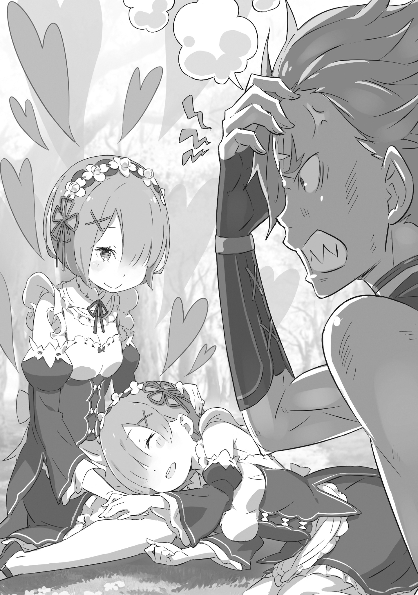

Рам бывает в «Святилище Кремальди» раз в несколько недель, а то и месяцев. Обычно она сопровождает своего господина Розвааля и почти никогда не заглядывает сюда по своей воле.

Во-первых, работая горничной в особняке, у неё почти нет свободного времени. А даже если бы оно и появилось, Рам, скорее всего, посвятила бы его либо господину Розваалю, либо любимой младшей сестре.

Поэтому для Рам такой, в общем-то, редкий визит не был чем-то из ряда вон выходящим.

— И всё же, случаются же странности, а? — весело сказал юноша с короткими золотистыми волосами, заложив руки за голову.

Острый взгляд, рот с виднеющимися клыками, заметный белый шрам на лбу… Черты его лица складывались в довольно свирепый облик, но в улыбке, как считала Рам, чувствовалось своеобразное обаяние.

Однако это было совсем не в её вкусе, да и грубая, облегающая его гибкое тело одежда казалась Рам безвкусной. Словом, полная противоположность её предпочтениям.

Но, несмотря на этот факт, юноша…

— А? С какого перепугу крутой я должен подстраиваться под твои вкусы? Мне тоже не улыбается видеть тебя такой другой.

После такого ответа Рам потеряла всякое желание продолжать.

Ведь если следовать этой логике, то питай Рам к нему романтическую симпатию, она бы изменила сама себе. Так что ответ был очевиден.

— Что ж, такая глупость — в этом весь Гарф.

— Прекрати, а то от похвалы засмущаюсь!

Юноша — Гарфиэль — потёр пальцем кончик носа и смущённо отреагировал на сарказм Рам. Глядя на это, Рам лишь диву давалась и тихонько вздохнула.

— Так зачем ты пришла сюда без этого ублюдка Розвааля? Такое ведь впервые, верно?

Он был оптимистом, несмотря ни на что. И это качество Рам находила в нём неплохим.

— Не подумай, будто Рам пришла повидаться с Гарфом. Рам и в этот раз лишь сопровождает. А раз причина не в господине Розваале, то у Рам может быть только одна другая причина, верно?

— …То есть, это значит…

Гарфиэль, до этого полный любопытства, на холодный ответ Рам сморщил нос. Поняв её намёк, он яростно взъерошил волосы.

И затем, как только он широко открыл рот, чтобы что-то сказать…

— Слышь, Рам. На самом деле, в это время года, в глубине леса… Гуоооааах?!

Не успел он договорить, как его внезапно отшвырнуло в сторону. На месте мгновенно исчезнувшего Гарфиэля появилась другая фигура.

Это была прелестная девушка с короткими синими волосами, одетая в такую же форму горничной, как и Рам.

Она улыбнулась Рам, словно ангел, и сказала:

— Сестрица, прости за ожидание. Я спросила госпожу Рюдзу, и похоже, Рем не ошиблась. Говорят, «Белоснежную Сакуру» как раз можно увидеть в это время года.

— Вот как. Это хорошо. Ведь Рем так ждала этого. Если бы она не зацвела, Рам собиралась придумать, как заставить её цвести.

— Хи-хи, Рем очень приятно, но всё в порядке. Рем также узнала примерное место, так что давайте отправимся, пока не стемнело. Рем так этого ждёт!

— “Так этого ждёт”, да как же, эй!

В слова Рем — младшей сестры Рам, — которая слегка улыбалась, взволнованно дыша от предвкушения, вмешался голос, полный сдержанного гнева.

Это был Гарфиэль. Сидя на земле, скрестив ноги, он щёлкал своими острыми клыками и раздражённо смотрел на Рем снизу вверх.

Тогда Рем, поймав его взгляд, посмотрела на сидящего Гарфиэля сверху вниз и сказала:

— …Ах, Гарф, ты был здесь? Прости. Ты такой маленький, что я тебя и не заметила.

— И это твоё приветствие крутому мне после стольких лет, Рем? Не слишком ли ты задираешь нос? Кроме того, я вырос с тех пор, как мы виделись в прошлый раз. Смотри внимательней!

— Я и смотрела внимательно, поэтому и нашла тебя. Если бы я не смотрела внимательно, я бы тебя не увидела, так как Рем видит только сестрицу. Чуть не проглядела, правда?

— Ты ж меня отшвырнула! Это что, «Закрученный язык Эли-Эли», ты, сволочь?!

Гарфиэль вскочил на ноги и повысил голос, но Рем, прищурившись, ответила ему ледяным тоном. Раньше такого не было, но в последнее время их перепалки всегда протекали в подобном ключе.

Похоже, Рем раздражало присутствие Гарфиэля, питавшего симпатию к её старшей сестре, и она всячески это демонстрировала.

Наблюдая за таким поведением Рем, Рам в глубине души чувствовала, что всё это как-то… ну, вот так.

— …Рам это не то чтобы не нравится, потому что так она чувствует, как Рем её любит.

Гарфиэлю, конечно, не позавидуешь, но для Рам чувство, что её ценит любимая младшая сестра — самый дорогой для неё человек, — было бесценным источником сил на каждый день.

Не ведая о таких мыслях Рам, перепалка между другом детства и младшей сестрой разгоралась всё сильнее.

— Сестрица, сестрица! На самом деле, говорят, что в это время года в «Святилище» цветёт цветок под названием «Белоснежная Сакура».

Рем заговорила об этом во время обсуждения того, как провести внезапно свалившийся на них выходной.

Работа горничной — это, по сути, ежедневный труд без выходных, но изредка Розвааль по своей прихоти дарует слугам отдых. Рам считает это незаслуженной честью, однако принимать заботу господина — тоже долг горничной. И вот такая редкая возможность в этот раз досталась сёстрам Рам и Рем.

Поэтому они ломали голову, как же провести этот выходной, и тут Рем и предложила съездить в «Святилище». Полюбоваться редкими цветками — раз Рем этого хочет, то возражений и быть не может.

Рем — дитя не слишком капризное.

Однако, по сравнению с Рам, круг её интересов куда шире, и у неё более тонкая натура: она тайно увлекается поэзией и искусством. Интерес к красивым пейзажам, вероятно, из той же оперы. Как мило.

Поэтому сестринское сердце желает исполнить желание любимой младшей сестры, насколько это возможно.

Поэтому Рам, сопровождая Рем, отправилась в «Святилище», договорилась с Рюдзу, главой этих мест, и разузнала всё о местах цветения «Белоснежной Сакуры».

А затем она намеревалась просто спокойно провести выходной, любуясь «Белоснежной Сакурой» вместе с Рем.

— Но с той минуты, как об этом прознал Гарф, этой надежде не суждено было сбыться.

— Вообще-то, за «Белоснежной Сакурой» присматривает крутой я! Что плохого, если я вас проведу?

— Этого я знать не хотела. Если во время любования цветами мне в голову будет лезть лицо Гарфа, всё будет испорчено.

Троица шла по лесу, известному как «Затерянный Лес» и пользовавшемуся дурной славой, продолжая свою перепалку.

Они шли в таком порядке: Рам посередине, Гарфиэль справа, Рем слева. Рем взяла Рам под руку, словно демонстрируя это Гарфиэлю, и вздохнула в конце своей саркастической реплики — нет, её нынешнее высказывание со вздохом было не сарказмом, а, похоже, просто её истинным мнением.

— Ты и вправду беспощадна к крутому мне. То, что ты можешь увидеть цветы — это благодаря мне! Разве ты не должна быть благодарна за это, а?

— Рем очень беспокоится, как такой грубиян, как Гарф, заботится о цветах. «Белоснежная Сакура», о которой ходят слухи… неужели её лепестки и вправду так безупречно чисты, как говорят?

— Скажешь одно — она тебе в ответ другое!…

Гарфиэль затрясся от злости, но Рем сохраняла невозмутимое выражение лица.

Наблюдая за этой перепалкой, Рам находила в ней что-то милое. Рем, которая обычно была несколько напряжена, расслаблялась рядом с Гарфиэлем, которого знала давно.

Только в такие моменты Рем вела себя как обычная девушка её возраста и немного позволяла себе опереться на Рам, что согревало сердце старшей сестры.

Однако даже тогда центром мира Рем оставалась Рам, и её отношение к Гарфиэлю строилось исключительно на этом. А этого, по мнению Рам, было маловато для самой Рем.

Чтобы Рем стала по-настоящему Рем, вероятно, требовались какие-то иные перемены.

— Сестрица? Что-то случилось? Что-то ты замолчала.

— Плохо себя чувствуешь? Давай понесу? Воды хочешь? Тут ручей недалеко.

Заметив, что двое обеспокоенно заглядывают ей в лицо, Рам очнулась от своих раздумий.

От их заботы уголки её губ непроизвольно дрогнули в улыбке. Она тут же покачала головой.

— Нет, ничего. Просто разговор Рем и Гарфа был забавным. Точнее, Рем была слишком милой, а Гарф — слишком жалким.

Она ответила своим обычным тоном, и оба вздохнули с облегчением. Рам подумала, что это нехорошо, особенно для Гарфиэля, успокаиваться от её дразнящих слов.

Такая доброта — жалость. Особенно для самого Гарфиэля.

— О, уже почти. Приготовьтесь как следует удивляться!

Гарфиэль, их проводник, сказал это сразу же, как пришёл в себя.

«Затерянный Лес Кремальди» соответствовал своему названию, обладая странным свойством сбивать с толку чувство направления у тех, кто в него входил. Поэтому даже Рам не могла бы в точности повторить их маршрут.

То, что Гарфиэль так уверенно вёл их сквозь чащу, говорило лишь о том, как хорошо он знал эти тропы.

— Конечно, я жду с нетерпением, но Гарф всегда преувеличивает.

На это вступление Гарфиэля Рем пробормотала, её глаза слегка заблестели от предвкушения.

«Неожиданно, она совсем не умеет скрывать свои чувства», — подумала Рам. Как мило. Как бы то ни было, Рам тоже была рада видеть Рем такой счастливой.

Какой бы пейзаж их там ни ждал, до этого момента Рам…

— Вот оно.

Сказав это, Гарфиэль развёл руки в стороны. Рам посмотрела вперёд и, поражённая, потеряла дар речи.

— Это было белоснежное фантастическое пространство, внезапно возникшее посреди зелёного леса.

«Белоснежная Сакура» — соответствуя своему названию, все стоящие рядами деревья были усыпаны белыми цветами и листьями, словно покрытые снежным убранством, и безмятежно стояли в лесу. Пейзаж был чисто-белым, и хотя не было бы ничего странного, если бы белый цвет вызывал холодное впечатление, от этого вида, наоборот, ощущалась даже мягкая теплота.

— Ах…

При виде этого зрелища Рем, стоявшая рядом, тоже потеряла дар речи. Было видно, что она дрожит от восхищения — красота пейзажа превзошла все её ожидания.

Было также понятно, что Гарфиэль, глядя на сестёр, выглядел довольным.

Только в такие моменты он не хвастался и не вёл себя так, словно делает всем великое одолжение.

— О, я приготовила бенто, можно ли нам поесть здесь?

От чрезмерной величественности пейзажа Рем, принёсшая сумку, немного оробела.

Но тут Гарфиэль, первооткрыватель этой красоты, решительно направился к центру «Белоснежной Сакуры».

— Эй, если собираетесь есть, давайте здесь! У меня сейчас самое лучшее настроение!

— М-м… хорошо. Только сегодня, в знак признания заслуги Гарфа, я признаю своё поражение.

Со странным духом соперничества Рем надула щёки, глядя на торжествующего Гарфиэля.

Прямо там, в центре пейзажа, они разложили бенто.

Она была немного удивлена тем, что сама испытывает такое чувство ошеломления от пейзажа. Рам немного отстала от Рем и Гарфиэля, раскладывавших бенто.

— …Похоже, и Рам ещё далеко до совершенства.

Рем и Гарфиэль поманили Рам, бормотавшую так тихо, что её не было слышно. Тут же Рам вернула себе обычное выражение лица и спокойно подошла к ним.

— Сестрица, тут простое угощение для пикника, но, пожалуйста, угощайся.

— Спасибо. Раз это сделала Рем… хи-хи, картошка на пару!…

— К сожалению, я её не парила, но…

То, что ей с извиняющимся видом предложили, оказалось любимейшим блюдом Рам, так что она была потрясена.

Посмотрев на Рем, она увидела, что младшая сестра смотрит на неё с мягким выражением лица, словно говоря: «Моя цель достигнута».

— Настроение не то чтобы плохое… ном-ном. Но и не то чтобы… ном-ном.

Есть любимую картошку на пару в окружении такого великолепного пейзажа — это был поистине редкий опыт.

Она ловила себя на мысли, что в полной мере наслаждается выходным, которого совсем не ждала, и это было даже забавно.

И как раз в тот момент, когда Рам так подумала…

— Гарф?

Вдруг она почувствовала, как что-то тяжёлое прислонилось к её плечу, и Рам посмотрела в ту сторону. Положив голову на плечо Рам, Гарфиэль тихонько сопел во сне.

Он не специально это сделал, просто задремал.

Она была не настолько бессердечна, чтобы оттолкнуть его, но подумала, что это редкость для Гарфиэля — дремать на людях, — с чувством, присущим друзьям детства.

— …Вот оно что. Рем, ты была в сговоре с Гарфом?

— Я хотела показать этот пейзаж сестрице, и, похоже, Гарф тоже постарался.

Поняв, что её обвели вокруг пальца, Рам увидела, как Рем улыбнулась, опустив уголки глаз и совершенно не пытаясь скрыть своего лукавства.

Если подумать, всё и впрямь складывалось слишком уж гладко: и «Белоснежная Сакура», цветущая только в это время, и удачно подвернувшийся выходной, и Гарфиэль в роли проводника…

— Господин Розвааль тоже замешан?

— Насколько знает Рем, Гарф, что нехарактерно для него, попросил господина Розвааля дать нам выходной сегодня.

— Понятно. …Действительно, какой же он дурак.

Искоса взглянув на юношу, прильнувшего к её плечу, Рам удивлённо вздохнула.

Затем она осторожно подвинулась, перемещая голову Гарфиэля себе на колени.

— Ах, сестрица…

— Рам — средоточие милосердия и любви, так что ничего не поделаешь, придётся вознаградить его за старания.

Глядя сверху вниз на спящее лицо юноши, Рам запустила пальцы в его короткие светлые волосы и ласково, будто щекоча, провела по ним.

Кончики её пальцев обвели белый шрам на его лбу, и во взгляде появилась нежность.

— Сестрица, Рем не имела в виду, чтобы ты зашла так далеко…

— Ничего особенного. Рам и так доверяет Гарфу достаточно, чтобы позволить подобное. Просто дальше этого дело не зайдёт. Глупышка.

Говорят, это ужасно редкий цветок. Я могу представить, сколько труда было вложено, чтобы он зацвёл, насколько это было нелегко. Зачем тратить столько сил?

Рам ещё раз пробормотала слова, неслышные для её дремлющего друга детства.

Затем она вдруг заметила сестру перед собой. У Рем было слегка обиженное лицо.

— Эм, сестрица, это…

— Что такое?

— Я завидую Гарфу. Рем тоже хочет, чтобы сестрица её побаловала…

— Ты права. Рам бы лучше вознаградила Рем, чем кого-то вроде Гарфа. Иди сюда.

— Буга-а!?

На милую просьбу Рем, Гарфиэль, оказавшийся на земле, издал страдальческий вопль. Вскочивший Гарфиэль ошалело замотал головой, увидел Рем, лежащую головой на коленях у Рам, и снова повысил голос, но…

— Это даёт Рам почувствовать себя любимой, так что это не так уж и плохо.

В завершение этой перепалки Рам, в полной мере наслаждаясь выходным, слегка улыбнулась и произнесла с напускным равнодушием.

《Конец》
