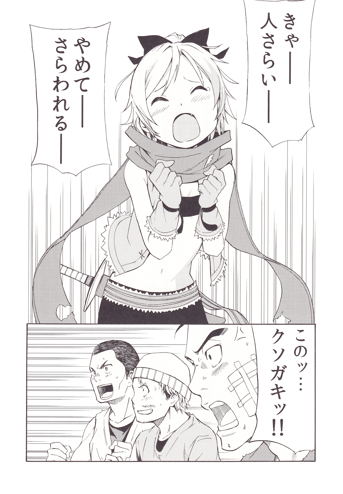

Термин «одинокий волк» звучит хорошо, но на самом деле это просто то, как вы называете себя, скрывая тот факт, что вы не вписываетесь в своё окружение, будучи изолированным. Девочка болезненно осознавала это с раннего возраста.

— Чёрт побери! Они адски настойчивы. Прекратите издеваться надо мной!

Та, что проговорила эти слова, используя нецензурную брань, была девочкой с ясными глазами, несмотря на её грубую манеру разговора. Сочетание глаз цвета малины в купе со светлыми волосами было редким и её не портили затхлый воздух с пылью трущоб. Её несколько изящное лицо и черты также были причиной разрыва между ней и её окружением.

Однако саму девочку не волновало, что другие думают о ней. В данный момент её внешность создавала ей проблемы.

— Проклятье! Это отродье, куда она убежала!? Найдите её! — Прорычал мужчина.

Тот, кто искал её, держась за свой нос, был мужчиной средних лет с необычной причёской. Его нос был в крови, а на лице виднелся след ботинка, идеально подходящий девочке. Мужчину с окровавленным носом сопровождали около десяти человек. Они слушали приказы человека с окровавленным носом, пока загоняли девочку, стараясь перекрыть все пути отхода и загнать её в угол.

— Как и ожидалось от похитителей, они привыкли заниматься подобным. Ааа, чёрт, я всё испортила!

Она протолкнула своё маленькое тельце в переулок и посмотрела на окружавших её мужчин, а затем прищёлкнула языком. Девочка внимательно осмотрела своё окружение, но ни одна из тропинок, казалось, не выводила из запутанных переулков.

— Она там! Не дайте ей сбежать… Гах!

— Заткнись, тупица, — ответила молодая девочка.

Она подпрыгнула и нанесла удар ногой в лицо мужчине, в момент, когда её обнаружили. Мужчина, который, казалось, был в два раза больше девочки, был сбит с ног и рухнул на землю. Она убежала, оставив его там.

Мужчины, потерявшие своего компаньона, побежали за ней словно бешеные.

— Вы действительно настойчивы! Чёрт! Меня отругает старик Ром! — Крикнула девочка Фельт, что прозвучало довольно расслаблено для ситуации, в которой она оказалась, и побежала словно ветер, по грязным переулкам, быстро перепрыгивая их.

Сколько она себя помнит, трущобы Королевской Столицы Лугуники всегда были её домом, так как она была сиротой, которой не на кого было положиться. Однако ей никогда не казалось, что трущобы — это место, которое можно было бы назвать домом. Более того, все, кто жил в них, чувствовали то же, что и она. Только живущие в комфорте могли позволить себе такие мысли. Люди, живущие в трущобах, просто пытались выжить изо дня в день. Конечно, то же самое можно было сказать и о Фельт. Как и другие сироты в трущобах того же возраста, Фельт зарабатывала на жизнь воровством за счёт своей хитрости и ловких рук с тех пор, как стала самостоятельной (в том возрасте, когда она больше не могла получать милостыню). Она не ладила с сиротами, решившими объединиться. Её часто недолюбливали люди того же пола, что и она, и устав от общения с другими, она предпочла оставаться одной. Единственным исключением была её семья. Несмотря на свой свирепый вид, он был довольно сострадательным, и ему нравилось выступать опекуном Фельт. Но то, что заставляло Фельт не слишком полагаться на его доброту, было её небольшой гордостью. Тот, кого она называла семьёй, зарабатывал на жизнь продажей краденого из переулков. Но даже несмотря на то, чем он занимался, он платил справедливую цену за краденое, что приносили ему люди. Фельт знала, что это задевает её гордость, но это был важный для неё ритуал.

Поэтому Фельт чувствовала себя довольно несчастно, когда доставляла ему неприятности своим упорным желанием делать всё самостоятельно. Поэтому…

— И в этот раз я всё решу сама.

Фельт укрепила свою решимость, оставшись в полном одиночестве на крыше, на которую она запрыгнула. Она посмотрела вниз и увидела, что мужчины всё ещё бегают вокруг, разыскивая её.

Мстительность таких парней просто ужасна. Просто убежать от них — не значит решить проблему.

Люди, преследовавшие Фельт, были группой похитителей, которые находились в самых низах преступного мира Королевской Столицы. Ходили слухи, что они новички, но было невыносимо то, насколько безудержно они действовали.

— Я могла бы быть помягче. Мне следовало просто оставить их.

Вспомнив, как она попала в эту переделку, Фельт поджала губы и пожалела о своей ошибке. Переулок, в котором она сейчас пряталась, не был её родной территорией. Место, известное как трущобы, было разбросано по всему нижнему району большой Королевской Столицы, и делилось три части. Фельт жила в месте, которое было связано с торговым районом, но район, в котором она сейчас находилась, в основном содержал склады, и поэтому был ей неизвестен. Причина, по которой её преследовали бандиты, заключалась в том, что она сделала, когда увидела, как они занимаются своим «бизнесом» в поисках дневного источника дохода. Фельт бы просто проигнорировала это и оставила всё как есть, сказав, что очень жаль того, кого похитили, так как это обычное дело, но в этот раз она не могла оторвать глаз от похищенного человека. Она увидела, как маленькую девочку вырывают из рук старика, похожего на засохшее дерево, и это разожгло в ней огонь, который заставил её вскочить и со всей силы ударить по лицу главаря. После этого ей удалось помочь старику и девочке вырваться из окружения, но бандиты, находившиеся в бешенстве, заметили её и начали преследовать.

Вот как обстоят дела.

— Я не знакома с местностью вокруг. Они очень хороши в охоте людей в этом месте, поскольку это их территория.

Хотя Фельт была раздражена их организованной преступностью, она также понимала, насколько плачевна ситуация. Она была уверена, что достаточно сильна для своего возраста — точнее, она была уверена в своей способности выходить из плохих ситуаций, — но не была настолько самоуверенной, чтобы думать, что сможет победить дюжину мужчин. Кроме того, чем больше времени она потратит на это, тем больше их число увеличится, что только усугубит ситуацию.

— Пока я могу вернуться на свою территорию, я смогу что-то сделать…

— Вау, так близко!? — В момент, когда она слегка выглянула из-за угла здания, острый кусок дерева пронёсся мимо её лица. От звука опасного предмета по спине побежали мурашки, а сразу после этого она услышала чью-то ругань снизу.

— Ты идиот! Не бей её по лицу! Мы не сможем продать её, если останется шрам! — Выругался человек с окровавленным носом, из которого уже перестала идти кровь после того, как его лицо было прикрыто белой тканью.

Я и не думала, что моё лицо может сделать их счастливыми, но если он кричит им, чтобы они обходились со мной мягче, значит, я могу что-то сделать.

— Поехали! — Фельт прыгнула, ткнув ногой в лицо мужчины, который установил лестницу и поднимался к ней, заставив остальных мужчин упасть вслед за ним.

— Гаах! — Пробурчал мужчина.

Она не остановилась на этом, а продолжала топтать головы испуганных мужчин, прорываясь через препятствие с ловкостью акробата.

— Что!? — Воскликнул человек с окровавленным носом. — О-она слишком быстрая! Не дайте ей сбежать!

— Твой приказ — схватить меня, а не избить. Даже я могу легко заметить такую ошибку!

Она сделала кувырок, одновременно нанеся удар ногой последнему человеку, и приземлилась возле ног человека с окровавленным носом, который кричал, пуская слюни изо рта. Она увернулась от летящей в её сторону руки и двинулась на него, а затем нанесла ему удар ногой, довольно длинной для её роста. Человек с окровавленным носом почувствовал, как пальцы её ноги вонзились в его плоть — в нижние части, — что нанесло ему огромный урон. Он упал на колени, издавая крики полные страданий, когда Фельт без колебаний нанесла ему удар головой. Макушка её головы врезалась в его кончик носа, прямо сквозь ткань, раздробив его. Он упал, из носа вновь потекла кровь, а изо рта хлынула пена.

— Поделом тебе! — Крикнула Фельт. — Вот что бывает, когда ты теряешь бдительность, думая, что твой противник «всего лишь ребёнок»!

Увидев, как легко устранили их лидера, бандиты на мгновение замешкались, стоит ли её преследовать. Фельт высунула язык, пока они мешкались, и снова ускорилась, поравнявшись с ветром.

Вырвавшись из окружения незнакомых трущоб, она чувствовала себя достаточно безопасно, чтобы успокоиться. — Наверное, после всего этого мне не придётся наносить решающий удар, верно?

Они получили по задницам от маленькой девочки, так что я уверена, что они будут помалкивать некоторое время, поскольку им важна их репутация. Но если это так, то, что я приберегла напоследок, пойдёт прахом.

— Ну, я не против. Но это сильно меня утомило.

Скрестив руки за головой, Фельт слилась с толпой и вздохнула. При этом она сунула руку в карман наивного прохожего, который не был настороже. Учитывая ситуацию, в которой она оказалась, было довольно впечатляюще то, как она всё ещё пыталась заработать несколько лишних монет.

— Кажется, я действительно обмякла.

Заработав много монет, она вернулась на свою территорию с поникшими плечами. Она думала, что заработала сегодня достаточно, чтобы выйти в плюс, но тут в её дверь постучалась беда. Было не удивительно, что она не могла скрыть своего разочарования и уныния.

— Заставила нас попотеть, но теперь ты всё испортила, чёртово отродье.

Человек со злобной улыбкой на лице, нос которого был в крови, опираясь на плечи своих подчинённых, казалось, гордился своей победой. Его лицо было обвязано ещё большим количеством ткани, чем раньше, а колени дрожали, показывая степень его ранений.

— Я дам тебе совет по доброте душевной: если ты так изранен, то просто иди домой и спи, — сказала ему Фельт.

— Не смеши меня! Кто, чёрт возьми, станет убегать, поджав хвост, после такого унижения? Я не успокоюсь, пока не услышу, как ты будешь молить оставить тебя в живых, наглое отродье!

— Хватит вести себя как стерва только потому, что твой короткий нос и твои шары раздавили…

— Маленькая проститутка вроде тебя никогда не сможет понять, насколько это больно! — Кричал мужчина, его глаза покраснели, а изо рта повсюду брызгала слюна, после того как он услышал безжалостный ответ Фельт. Бандиты вокруг него одобрительно кивнули с немного бледными лицами.

Что за кучка обиженных королев!

Фельт, не понимающая, что такого в её акте насилия, была удивлена тем, насколько упорными оказались бандиты, преследовавшие её и пытавшиеся набросить на неё сети в принадлежавшей им части трущоб.

Где они раздобыли информацию обо мне?

— Ты, кажется, удивлена, — сказал разбойник. — Я скажу тебе простыми словами… Твои собственные люди ненавидят тебя, не так ли? Они многое рассказали.

— Мне кажется, что вы такие же, говорите так же много, как они.

Всякий раз, когда такие люди, как они, берут верх, они хотят выдать причину своего превосходства. И вправду, причина часто бывает простой и банальной.

Ответ и на сей раз был прост: она была продана людьми, которые её ненавидели за небольшую сумму денег.

Вот почему общение утомляет и почему я по-настоящему доверяю только одному человеку.

— О! Вот только давай без выкрутасов, ладно? — Предупредил разбойник. — Я скажу тебе заранее: мои спутники окружили этот район. Ты должна рыдать от счастья, ведь мы устроили для тебя экстравагантную вечеринку несмотря на то, что ты просто какая-то соплячка!

— Не буду врать, это действительно заставляет меня пустить слезу. Тебе не кажется печальным то, что ты так переживаешь из-за ребёнка?

— Это в сотни раз лучше, чем позволить, чтобы мою репутацию сравняли с грязью, из-за того, что я позволил, чтобы такое дерьмо сошло тебе с рук!

Много топчась, бандиты собрались позади Фельт, чтобы пере-крыть ей путь к отступлению. Перед ней стояли люди, которых она ранее использовала как ступеньки в переулке. Аналогично она могла видеть бандитов, стоящих на многочисленных переулках в поле её зрения. Выхода не было. Было невероятно то, сколько усилий они приложили для этого, и это лишь означало их серьёзный настрой.

— Мы не причиним тебе вреда, но будь готова отплатить по-другому, соплячка.

— Правдивы ли слухи о том, что вы недавно приехали в Королевскую Столицу? Мне просто немного любопытно.

— А? — Разбойник нахмурился, так как он ожидал, что она испугается, но, напротив, её слова не показывали никаких признаков страха.

— Хорошо, хорошо. — Фельт восприняла это как согласие и кивнула. — Тогда я дам тебе совет. Тебе следует узнать немного больше о Королевской Столице, прежде чем делать что-либо в следующий раз. Ну, если, конечно он у тебя будет.

Не успел разбойник повысить голос, как Фельт достала что-то из кармана и приложила ко рту. Это было то, что она украла у ничего не подозревающего человека в толпе, прежде чем вернуться на свою территорию.

— Свисток, для того чтобы привлечь стражу?

Она дунула в него, вместо того чтобы ответить «правильно», и звук эхом разнёсся по задней аллее. Звук сразу же заставил бандитов закрыть уши, но то, что последовало за их удивлением, было лишь спокойным отношением.

— Ты… Ты напугала нас. Что может сделать простой свист… — Сказал разбойник от имени окружающих его спокойных людей.

Однако вскоре на его лице появилось беспокойство. Они тоже услышали его. Тяжёлый звук, сотрясающий землю, издаваемый военной обувью, один за другим входящие в переулок.

— Что? Почему они здесь, так быстро!?

— Вы можете не знать этого, так как вы, ребята, недавно в городе, но стражники регулярно патрулируют нижние районы. Очевидно, поскольку я местный житель, я знаю, когда и где будут проходить патрулирования.

Сегодня был день, когда стражники патрулировали трущобы, которые Фельт считала своей территорией. В связи с этим Фельт не торопилась выходить на улицу в поисках лёгкой добычи, а также рассматривала возможность использования стражников в качестве козыря, если что-то пойдёт не так.

Хотя я не была уверена на все сто, что бандиты придут за мной, я на всякий случай одолжила свисток у охранника, который не обращал на меня внимания.

— Ааа! Похитители! Стойте! Меня похищают! — Изо всех сил кричала Фельт хриплым голосом, поднимая боевой дух стражников. Человек с окровавленным носом обернулся, но Фельт уже проскользнула сквозь щель в их рядах.

Разбойник посмотрел на Фельт, которая прыгала с крыши на крышу, а затем издал взволнованный крик: — Ты, грёбаное отродье… Аргх!

— Тогда не проигрывай грёбаному отродью в состязании умов. Тебе никогда не победить меня, когда дело доходит до грязной драки, тупица.

Когда босс издал нечленораздельный крик, охранники появились в переулке и столкнулись с бандитами. Охранник, стоявший впереди, был особенно силён, и было приятно видеть, как бандиты один за другим разлетаются словно листья.

И вот так новички в преступном мире Королевской Столицы были уничтожены ещё до того, как кто-то успел запомнить их имена.

— Итак, мой конечный заработок и усилия, затраченные на его получение, получила ли я выгоду или понесла убытки? — Подумала Фельт, смахивая пыль со своего тела. Хотя она и украла несколько кошельков вместе со свистком, внутри было не густо. Однако, доставив похитителям болезненные ощущения, она получила удовольствие, которое стоило потраченных на это усилий.

Тем не менее, реалистка Фельт пришла к выводу, что удовольствие — это лишь временная вещь, что не набьёт брюхо.

Поэтому всё, что я заработала сегодня, — это монеты в кошельках.

— Этого недостаточно для достижения моей цели.

Цель Фельт — хотя она всё ещё была столь далека, так как она мало зарабатывала на воровстве — заключалась в том, чтобы, в конце концов, накопить достаточно денег, дабы выбраться из нищеты, из трущоб. Она была бы ещё счастливее, если бы единственный, кого она считала семьей, был с ней, в этот момент.

С новой решимостью Фельт начала идти к зданию, которое появилось в поле её зрения, но остановилась, не дойдя до него. Огромная фигура, настолько огромная, что её нельзя было принять за человека, стояла перед большим зданием махая ей рукой.

— Боже, хватит меня смущать… Старик Ром, я вернулась!

И с этими словами Фельт побежала к своей семье с самой широкой улыбкой за весь день.
