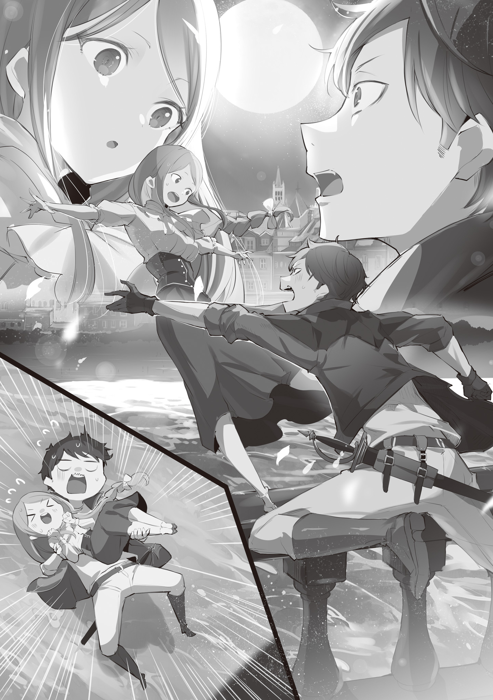

— Зассанец …

Слово хлестнуло по ушам, и плечи его дрогнули.

Не поднимая головы, он украдкой оглядел раздевалку. Тех, кто смотрел бы на него, шептался бы за спиной… их не было. Ни единого косого взгляда, ни слова.

Тогда кто же сплетничал?

Откуда же этот голос?

Неужели… он сам себе это сказал?

Что ж, вполне возможно. Всё же, здесь были лишь настоящие рыцари — те, кто заслужил право носить униформу рыцарского корпуса Королевства Лугуника и был полон решимости не посрамить эту честь.

— Хейнкель, мы тут в «Серебряный Щит» собираемся… Ты как?

Услышав приглашение от закончившего тренировку сослуживца, он выдавил вежливую улыбку.

— А? А-а, прости, сегодня никак. Я хозяину… Кхм, да нет, ничего.

— Ясно, — коротко бросил тот и вышел из раздевалки с остальными.

Проводив их тяжелым взглядом, Хейнкель глубоко вздохнул, и взглянул на свою ладонь — бинт пропитался свежей кровью. Севшим голосом он пробормотал: — «Серебряный Щит»… Как я вообще могу показаться на глаза господину Конвуду?

В голове возникло лицо хозяина любимой рыцарской таверны. Этот человек давно был связан с семьей Астрея, и Хейнкель знал его с самого детства.

В таком состоянии встречаться с ним совершенно не хотелось. Да и что он ему скажет? Поэтому, хоть никаких срочных дел у него и не было, он отклонил приглашение и в одиночестве побрел домой.

К тому времени, как он выбрался с этого места, почти что крадясь, на улице уже совсем стемнело.

Тренировочная площадка, примыкавшая к королевскому замку Лугуники, каждый день принимала свободных от заданий рыцарей. Здесь они оттачивали своё фехтование, закаляли не только тело, но и свой дух.

Он не был исключением, и сегодня, как все, до кровавых мозолей стирал ладони, махал мечом, обливаясь потом, и теперь тело казалось ему почти невесомым.

Говорят, именно так, через кровь и пот, куются тело и дух рыцаря. И когда он достигнет нужной закалки, настанет тот миг… должен настать.

— Если я вообще имею право на это.

Фамильный меч «Астрея» на поясе казался невыносимо тяжёлым. Шаги его были неспешными, неуверенными. Юноша плелся так медленно, что, должно быть, даже белая луна в ночном небе находила его черепашью походку утомительной.

Внезапно она резко прервалась. Но не потому, что гнетущее чувство собственной никчемности наконец достигло предела.

Причиной стал странный голосок, ударивший по барабанным перепонкам.

— Ап! Ха!

Едва слышный, но звонкий и задорный звук… Он походил на дыхание женщины.

На пустынной ночной улице этот странно воодушевленный женский голос заставил его резко оглядеться, а глаза его изумленно расширились.

Женщина была на стене.

Она неуверенно шагала по верху тянувшейся вдоль улицы не такой уж и широкой стены.

— Осторожно!

— А? Ай!

Прокричав, он тут же торопливо зажал себе рот, но было поздно. Отвлекшись на его голос, незнакомка на стене блистательно оступилась.

Видя, как хрупкая фигурка накренилась и начала падать, Хейнкель мгновенно забыл и о вине, и о сожалениях. Мигом он поставил ногу на стену и рывком притянул падающую девушку к себе.

А затем…

— …

…прямо перед ним мелькнули сияющие в лунном свете золотые волосы и широко раскрытые, совершенно круглые голубые глаза. Пленённый её внезапной красотой, он позабыл как дышать.

И в результате…

— Чёр…

…равновесие удержать не удалось. Вместо того чтобы устоять на стене, он не рассчитал силы и рухнул на другую сторону, всё ещё сжимая девушку в объятиях.

Громкий звук нарушил ночную тишину квартала знати — в реке за стеной раздался всплеск, совершенно не вязавшийся с ночной тишиной.

Такой вышла первая встреча Хейнкеля Астрея , только что получившего звание рыцаря, и Луанны Хартли — девушки, которой суждено было стать его женой.

— Простите меня, пожалуйста!

— Нет, это моя вина. Взял, и не удержался… Так свалиться… Как же стыдно.

— Совсем не стыдно! Мегуто ¹ !

— Ме-мегуто?

— Это значит «мега-круто»!

Объяснение прозвучало сразу после того, как он, пытаясь поймать сорвавшуюся со стены девушку, сам неуклюже рухнул вслед за ней. Ему едва удалось упасть первым, не дав ей хлебнуть воды. Короче говоря, вряд ли такое жалкое зрелище заслуживало оценки «мегуто».

Хейнкель размышлял об этом, сидя на бордюре у реки и выжимая насквозь промокшую куртку. Пока он предавался самобичеванию, девушка заботливо вытирала его мокрые волосы своим платком, приговаривая: — Это ведь я виновата, что вы промокли до нитки…

— Не беспокойтесь. Если бы я не сплоховал, мы бы оба остались сухими. Так что то, что я промок — можно сказать, моё наказание.

—А? Но ведь наказывают за проступки? Какой же тут проступок — спасти меня? Это какое-то недоразумение! Ошибка того, кто раздает наказания! Небесной канцелярии… Или самого Божественного Дракона!

— Уж лучше это будет моей оплошностью, а то выходит слишком дерзко…

Из-за такой прямолинейности, он подумал, что она, чего доброго, и впрямь обратится к Божественному Дракону. Мыслишка эта вызвала на его лице кривую ухмылку. Обескураженный её напором и своеобразием, он вспомнил, что самого главного так и не спросил.

— То, что я промок — не страшно, куда важнее другое…

— Да? Да… А! Можете не спрашивать, я знаю!

— А?

— Я Луанна Хартли!

Значит, её звали Луанна. Он провел пальцами по своим мокрым красным волосам. Наверное, она решила, что предвосхитила его вопрос.

— Но я хотел спросить, что ты забыла на стене…

— Ах! В-вот как? Ну да, логично. Конечно, логично… стыдно-то как.

— Нет-нет! Имя я тоже хотел спросить! Неудобно ведь разговаривать, не зная имени! — выпалил он, и тут же сам себе показался жалким — неужели нельзя было придумать что-то получше?

Но Луанна лишь моргнула своими огромными круглыми глазами, а затем улыбнулась.

Ему показалось, что она находит всю эту ситуацию — и его самого до кучи — ужасно забавной.

— Вы такой неловкий ² . Мегуто!

— Разве эти два слова сочетаются?

— Ещё как! Вот есть же в мире чудаки, которые обожают острое. Обычно ведь как? «Вкусное» — это «сладкое». А для них «вкусное» — это «острое». Тут то же самое!

— Не сказал бы, что любовь к острому — такая уж редкость.

— О, так вы тоже любитель острого ³ ?

— Нет, не особо. Сладости мне нравятся больше.

Весь этот разговор казался ему до смешного детским, и он сам удивлялся своим ответам. К тому же, Луанна явно уводила беседу в сторону. Может, не хотела рассказывать, что забыла на той стене? Простые люди по стенам не гуляют… А что, если эта безобидная девушка замешана в каком-то преступлении? Если так, то он, как рыцарь, просто не мог закрыть на это глаза.

— Ах, точно! Почему я была на стене, да? Я же так и не ответила.

— Ты расскажешь?! Это было бы очень кстати, но…

— Да, чтобы вы всё поняли! — она понизила голос. — По правде говоря… за мной гнались.

Вопреки его опасениям, она выложила всё как на духу, и он напрягся.

Значит она полезла на стену, пытаясь скрыться от погони? Шаг отчаянный, но зато мотив понятен.

Размышляя об этом, он внимательнее рассмотрел девушку.

На вид она была его ровесницей, может, на год-два старше. Роскошные волосы, словно тончайшие золотые нити, ниспадали до пояса, а сияющие голубые глаза, словно два сапфира, притягивали взгляд. Нежные, милые черты лица и фарфоровая кожа, казалось, вот-вот растворятся в ночной мгле.

Вот только одета эта утонченная особа была в простую, даже будничную одежду, что странно смотрелось в квартале знати.

Возможно, она любовница какого-нибудь аристократа?

— Кажется… я увидела то, чего не должна была. На улице… там на человека напали!

— Стой, что? Это же серьёзно!

— Да! Мужчина упал, а тот, кто его ударил, заметил меня! Я так испугалась и побежала со всех ног… Я покажу!

— Нет-нет, не ложись на землю. Я ведь не для того тебя ловил, чтобы ты теперь испачкалась.

Первоначальные подозрения о любовной интрижке пошли прахом, и ему пришлось остановить уже собравшуюся лечь на землю Луанну. Дело принимало серьезный оборот. Сердце забилось быстрее, но, вспоминая её недавнее поведение, он не мог не задуматься…

— А этой истории вообще можно верить?

— Это чистая правда, от начала и до конца! А? Что, не верите?

— Я не думаю, что ты врёшь намеренно, но и ошибиться можно из лучших побуждений…

— Ну-у, хорошо! Раз так, пойдемте на то место и… Ой. Простите. Я только сейчас поняла, что это опасно, так что, наверное, оно того не стоит.

— То, что ты сама к этому пришла, уже похвально. Да, очень похвально.

Он искренне похвалил её за то, что эмоции у неё быстро сменялись благоразумием, пусть и запоздалым.

И всё же, без каких-либо доказательств верить ей на слово было нельзя. Пока что единственным фактом оставалось её крайне подозрительное поведение на стене посреди ночи.

Поэтому он основательно подумал, взвесил все “за” и “против”, а потом сказал: — Понятно. Похоже мы сели в одну драконью повозку ⁴ . Пойдем, проверим, правду ли ты говоришь.

— А? Но вы же только что сказали, что я молодец, потому что сама поняла, что это опасно…

— Одну я тебя точно не отпущу. К тому же, я ведь тоже, видишь ли, как-никак… — произнося это, он коснулся рукояти рыцарского меча на поясе.

Было ли это убедительно? Он сам сомневался в этом больше, чем кто-либо другой.

Жалкое позерство.

Однако Луанна, проследив за его жестом, задумчиво хмыкнула раз, потом другой и затем решительно кивнула:

— Поняла! Идёмте. Я и сама волновалась за того человека.

— Да, нужно убедиться что с ним. Проведёшь меня?

— Есть-рон ⁵ ! За мной, господин Мегуто!

— «Мегуто» — это просто твоё словечко, а не моё имя.

— Ой, правда? Тогда… эм, простите. Можно ещё разок спросить его?

— Не «ещё разок», ты и в первый-то не спрашивала. Я… Хейнкель.

Глядя на эту суетливую девушку, он запнулся, прежде чем назвать фамилию, и решил этого не делать. Дело было не в ней. Просто сейчас ему совсем не хотелось называть её, и неважно, кто стоял перед ним.

Не заметив его секундной заминки, Луанна несколько раз повторила «Хейнкель, Хейнкель», словно пробуя имя на вкус.

— Какое мегутое имя, господин Хейнкель!

Объяснить ей, что имя вряд ли может быть «мега-крутым» в её же определении, он, глядя на её сияющую улыбку, не смог.

↑ Мегуто (めっこいー, Mekkoi): Слово, придуманное Луанной, как она объясняет далее, от めちゃめちゃ カッコいい (mechamecha kakkoii), что означает «очень-очень круто» или «мега-круто». С этими словечками Луанны было сложно, но мы сильно постарались. Обязательно похвалите нас, да! Мегибо! ↑ Неловкий (不器用, Bukiyō): Слово означает не только неловкость в социальном плане, но и неуклюжесть, неумелость в обращении с вещами. ↑ Любитель острого (辛党, Karatō): Термин часто используется в противоположность 甘党 (amatō) — «сладкоежке». Karatō обычно предпочитают острую или соленую пищу, а также часто подразумевается, что они предпочитают саке сладостям. ↑ Сели в одну драконью повозку (乗り合わせた竜車だ, Noriawaseta ryūsha da): Фразеологизм, означающий «раз уж мы оказались вместе в этой ситуации», «попали в одну лодку», «теперь мы в этом вместе». Здесь оформлено в контексте произведения. ↑ Есть-рон (もちのろん, Mochi no ron): Искажённое, игривое «конечно» (もちろん, mochiron). Тут адаптировано в таком виде.

Луанна привела его на улицу, куда вполне можно было попасть и не карабкаясь по стенам.

Это был довольно безлюдный уголок квартала знати. Многие дома здесь были всего лишь виллами знатных землевладельцев, и в отсутствие хозяев их населяли разве что смотрители. Неудивительно, что эту улицу также называли «улицей свиданий»: сюда сворачивали дамы определенного положения или профессии, когда им нужно было скрыться от любопытных глаз.

Если же Луанна гуляла по такой улице посреди ночи, то её цель…

— Я работаю в цветочном магазине в торговом районе, и возвращалась после доставки заказа, да только заблудилась и вот… оказалась здесь.

— Продавщица цветов…

— Да! Цветы продаю. Вы любите цветы?

— Э-э, не знаю. Пожалуй да, наверное?

На мгновение мысль о «продавщице цветов» навела его на дурные мысли ¹ , но затем, встретившись с её невинным взглядом и вопросом, он испытал укор совести, и ответил именно так.

И вправду, он никогда не задумывался, любит ли он цветы. Просто его мать страстно увлекалась цветоводством, так что они окружали его с самого рождения. В этом смысле цветы были для него чем-то само собой разумеющимся.

— Медесно ² !

— Мега-чудесно?

— Да! Как я и думала, вы быстро схватываете, господин Хейнкель!

Они были знакомы от силы полчаса, какое уж тут «как я и думала». Но он и вправду угадал значение её очередного словечка, так что спорить было бесполезно.

Так или иначе, они добрались до той самой улицы, но…

— Здесь ничего нет.

На улице, где, по словам Луанны, произошло нападение, не было буквально ничего.

При виде этого он нахмурился, а девушка рядом тут же запаниковала. Она выбежала на середину улицы и, отчаянно размахивая руками, запричитала:

— Здесь! Точно здесь! Прямо тут господин, имени которого я не знаю, получил ножом от другого господина или госпожи, чьего лица я не разглядела!

— Значит, напали на мужчину, а кто напал — мужчина или женщина — ты не уверена?

— Да! И всё произошло так быстро! Не драка, а просто… р-раз! И всё!

Луанна объясняла, подкрепляя слова выразительной жестикуляцией. Судя по её искреннему тону и взволнованному лицу, он решил, что она не врёт.

В таком случае, варианта было два: либо она что-то не так разглядела, либо просто перепутала улицу. Или… есть ещё что-то? Он снова внимательно огляделся по сторонам и заметил: — А не слишком ли здесь чисто?

Квартал знати, конечно, убирали регулярно, но трудно было поверить, что на этой обычно пустынной улочке навели идеальную чистоту — ни камушка, ни соринки — будто её только что тщательно подмели.

А значит, её слова могли быть правдой.

— Луанна.

— Подождите, господин Хейнкель! Если мы так уйдём, получится, что я вас обманула! А это не так! Здесь лежал господин… Я покажу!

— Не надо, я верю тебе.

— Правда?!

Хейнкель поднял уже собравшуюся лечь на землю Луанну, и кивнул ей в ответ. Затем он отвернулся от зловеще-чистой улочки, и мягко потянул её за руку.

— Пойдём, я провожу тебя до дома. Обо всём сообщим рыцарям завтра.

— Рыцарям… Но станут ли они слушать?

— Должны выслушать. Не беспокойся, я тоже пойду, скажу пару слов.

Отвечая растерянной девушке, он мысленно усмехнулся собственным словам: «Правда?»

Действительно ли её выслушают? И не окажет ли он ей медвежью услугу, подорвав доверие к её словам своими?

Чего стоит слово Хейнкеля Астрея?

— Слава Дракону…

— А?

— Раз господин Хейнкель будет со мной, то я спокойна. Прям камень с души упал! — сказала она, приложив руку к груди.

— Идём. — только и смог выдавить он, стараясь не смотреть ей в глаза.

Она не знала, кто он такой. Поэтому он понимал, что её слова — не лесть и не пустая вежливость. Понимал, и от этого становилось только хуже.

Стоит ей услышать хотя бы пару слухов о Хейнкеле Астрея , она тут же поймет, на каких хлипких петлях держалась её вера в его защиту.

Дом Луанны оказался обычным многоквартирным зданием в районе простолюдинов. Общая кухня на первом этаже, жилые комнаты наверху — стандартное столичное жильё.

Однако её комнату он заметил издалека.

— Вон та, с цветами у окна — твоя?

— Ух ты! Как вы догадались?

— Просто так.

— Просто так?! Медорово ³ !

Право, не стоило так уж восхищаться очевидной догадкой. Среди ряда одинаковых серых каменных стен, окно, буквально утопающее в цветах, кричало о своей хозяйке.

Впрочем, там было море цветов, будто их готовили на продажу. Похоже, она действительно их продавала. Он с облегчением отогнал остатки дурных мыслей.

Как бы там ни было, он благополучно проводил её до самого дома.

— Что ж, тогда я пойду. Завтра за тобой зайду.

— А? Вы не подниметесь?

— Тебе бы быть поосторожнее с незнакомцами. Тем более с мужчинами. Мы ведь только познакомились.

— Но вы же совсем промокли, господин Хейнкель… К тому же, я хорошо разбираюсь в людях! — Луанна решительно стукнула себя кулачком в грудь.

Он нахмурился. Её уверенность была не только безосновательна, но и противоречила тому, что она так легко доверилась ему самому. За то недолгое время, что они провели вместе, стало ясно: Луанна поразительно беззащитна. Если её миловидность и добрый нрав до сих пор уберегали её от настоящих бед, то это было чистое везение.

— Во-первых, это было бы неудобно перед твоим возлюбленным или семьей.

— Такого человека, который был бы недоволен моим спасителем — вами, господин Хейнкель — я бы ни возлюбленным, ни семьёй не признала!

— Возлюбленного — возможно, но семью ведь не выбирают.

— И то верно! Но у меня нет ни того, ни другого, так что, пожалуйста, не стесняйтесь.

Она ухватилась за его рукав, и он, поколебавшись мгновение, мягко высвободил руку. Увидев её разочарованное «Ах!», он выставил ладонь, останавливая её.

— Раз у тебя никого нет, тем более будь осторожна. Твои принципы я понял, так пойми и мои.

— Хорошо. Наверное, это было бы неудобно перед вашей возлюбленной и семьёй!

— Семья у меня есть, а вот возлюбленной нет. Извини уж.

Успокоив обиженно отвернувшуюся девушку, Хейнкель всё же отклонил настойчивое приглашение.

Затем ему пришлось почти силой заставить её войти в здание — уж очень не хотела она с ним прощаться. Убедившись, что в окне её комнаты зажёгся свет, он скрылся за углом.

— Не знаю, чего стоит моё предчувствие, но…

Если странная чистота на той улице действительно была неслучайной, то вполне возможно, что девушке грозит реальная опасность. Он не стал говорить ей об этом, дабы не пугать ещё больше, но всё же решил остаться и понаблюдать.

Тренировка порядком вымотала, но он был уверен в своей выносливости. Провести ночь без сна, наблюдая за домом, — не то, чтобы проблема.

Домашние будут волноваться, конечно, но… это ради безопасности горожанки. Такое оправдание хоть немного заглушало чувство вины за нежелание возвращаться домой.

«Ни дома, ни здесь… нигде мне нет места. Чем я вообще занимаюсь?»

Источник этого вечного дискомфорта был в его чувстве вины. Никто — ни сослуживцы на тренировочной площадке, ни домашние, проводившие утром — не упрекал его, не смеялся над его слабостью, не пытался унизить.

Больше всех этим занимался он сам. Потому и бежать было некуда.

Сколько ни бегай, от собственной тени не убежишь.

В этом смысле сегодняшняя встреча была как нельзя кстати. Возможность сказать себе, что он делает что-то для кого-то, немного облегчала его угрызения совести.

Проблема была лишь в том…

— Эм, господин Хейнкель, вы всё-таки не хотите подняться? Я бы предложила чего-нибудь горяченького!

…что девушка по имени Луанна Хартли совершенно не собиралась оставлять в покое так отчаянно жаждущего одиночества Хейнкеля Астрея .

↑ Дурные мысли (邪念, Janen): Хейнкель на мгновение подумал о другой «профессии», связанной с «продажей цветов» — эвфемизм для проституции. ↑ Медесно (めってき, Mettekki): Ещё одно слово, изобретённое Луанной, вероятно, от めちゃめちゃ素敵 (mechamecha suteki) — «очень-очень/мега чудесно/прекрасно». ↑ Медорово (めっごい, Meggoi): Снова вариация Луанны на тему «очень-очень/мега круто/здорово», вероятно, от めちゃめちゃすごい (mechamecha sugoi).

— Я так удивилась! Выглянула в окно, а там господин Хейнкель прячется за углом… Сразу поняла — следите за мной!

— Думаю, лучше сказать «присматривал» — поправил он Луанну, пока та суетилась с чаем, прежде силой затащив его в свою комнату.

Впрочем, насколько убедительным было это «присматривал», если она так легко его раскусила?

— Хоть скрытность и не мой конёк, но чтобы меня так просто раскрыли…

— Ну что вы, я же говорила. У меня глаз намётан на людей!

— Но так обычно говорят не про тех, кто прячется…

Может, она имела в виду, что легко замечает тех, кто плохо прячется? Как бы то ни было, уверенности ему это не прибавило.

Взять хотя бы то, что он так легко поддался на её уговоры и позволил затащить себя в эту комнату.

Комната Луанны на третьем этаже оказалась небольшой, обставленной скромной мебелью, но очень красочной из-за обилия цветов… Никогда прежде не бывав в доме одинокой женщины, да ещё и ведущей довольно простой образ жизни, он понятия не имел, обычная ли эта обстановка.

Неловко оглядевшись, он выдал первое, что пришло в голову: — Тесновато, да? Разве можно здесь жить?

— Ах, ну что вы такое говорите! Я же тут прибралась… ну, то есть, тут вещей-то и нет, но я горжусь тем, что я Мастер Пространства.

— «Мастер Пространства»?

— Ну да! Это про тех, кто умело пользуется каждым сантиметром комнаты. Вот, посмотрите сюда! Или в тот угол! Ну разве не мастерски?

Луанна с гордостью указала на шкафчик в углу, который, видимо, должен был доказать её мастерство. Но Хейнкель совершенно не разбирался ни в «пространстве», ни «мастерстве», так что не мог похвалить её, как бы она этого не хотела.

Заметив его замешательство, Луанна улыбнулась: — Я вас смутила? — и поставила чай перед ним, сжавшимся, словно нашкодивший кот. От слабого теплого аромата он вдруг ощутил, насколько сильно продрог, и взялся за чашку.

Учитывая обстановку, он не ожидал от чая многого, но…

— Это что, чайные листья Варно?

— Ого, вы разбираетесь? Мегуто ¹ !

— Вряд ли в этом есть что-то крутое.

— А, сейчас «мегуто» означало «мега-толковито»!

Он не смог уловить разницу между двумя значениями «мегуто» только по её интонации.

Тем не менее, он был удивлён: чай из листьев Варно стоил довольно дорого, и простым людям уж точно был не по карману.

— Это ценные листья, так что наслаждайтесь. Я и сама пью его только по чуть-чуть. Ну, или когда гости приходят… Так что сегодня как раз тот самый случай.

— Не пойму, экономная ты или нет.

— Считайте меня женщиной, которая не экономит на гостях. Как-никак, я ведь тоже когда-то была дочерью аристократов. Прямо как вы, господин Хейнкель.

— Кха! Кхм!

— Ой, вот, платочек! Чему вы так удивляетесь? Мне или чаю?

— Тебе и из-за тебя… кхм… С чего ты вообще взяла, что я аристократ? — откашлявшись и прикрывая рот предложенным платком, спросил он.

Луанна удивлённо моргнула, а потом просто ответила: — Ну как же… то, как вы сидите, как держите чашку — всё слишком правильно. Я сразу подумала — этот человек наверняка хорошо обучен этикету.

Услышав это, он мысленно оценил свою позу. Рука на ручке чашки, другая поддерживает донышко, прямая спина, сидит глубоко на стуле… Вроде бы ничего особенного.

— Но разве не все так сидят?

— Ваши друзья и коллеги тоже? Если да, то ваш круг общения, господин Хейнкель, такой же как и вы. Значит, вы не просто аристократ, а из самых высших! — улыбаясь, добавила она.

Он попытался вспомнить, как ведут себя сослуживцы за едой или во время отдыха, но не смог. Никогда не обращал на это внимание — не то чтобы времени не было. Скорее, душевных сил не хватало.

Отличаются ли их манеры или нет, у Хейнкеля просто не было нужной «базы» для сравнения.

Поняв это, он медленно покачал головой, а затем спросил: — Обо мне неважно. Ты сказала, что раньше была из аристократов?

— Да! Семья Хартли не очень большой род, но он всё же был. Когда я была маленькой, родители умерли, и семью распустили. Ещё и долги остались перед другими семьями, так что теперь я тружусь в поте лица и стойко проживаю день за днём.

— Это… даже не знаю, что сказать.

— Пожелайте мне удачи! Скажите: «Держись!»

— Д-держись.

— Вот! Теперь я буду держаться ещё сильнее, господин Хейнкель!

Хотя история была тяжёлой, сама Луанна оставалась весёлой. Видимо, она действительно пережила все невзгоды, но смерть семьи, распад рода, бремя долгов — всё это были трудности, совершенно ему незнакомые.

Сложно было даже представить, насколько тяжело ей было, но её жизнелюбие, и то, что она не сломалась — всё это поражало.

— Значит, чайные листья — ещё с тех времён?

— Ага! Я постаралась обменять имущество на деньги, но этот чай и кое-какую посуду решила оставить. И на память, и для пользы. Листья Варно мне сейчас точно не по карману.

Чай, которым она его сейчас согревала, был вкусом её детства, напоминая ей о семье. Узнав это, его пробрал ещё больший стыд, из-за того, что он позволил ей заварить его.

— Я же говорила! У меня нет и не будет такой семьи, которая была бы недовольна, угости я чаем господина Хейнкеля.

— Ты говорила это не про чай, а про то, чтобы пригласить меня в дом.

— Ой, да? — беззаботно отмахнулась Луанна, склонив голову набок.

Он невольно улыбнулся. Вся его скованность и натянутость вдруг показались совершенно глупыми.

Заметив его улыбку, она поднесла свою чашку ко рту и сказала:

— Когда вы улыбаетесь, вы такой мелый ² .

— Наверное, мальчикам так не говорят.

— Может быть. Простите. Я по натуре честная, вот и говорю то, что думаю.

Ничуть не смутившись, Луанна извиняющимся жестом высунула кончик языка. От этого Хейнкель снова улыбнулся.

↑ Мегуто (めっこいー, Mekkoi): Здесь Луанна уточняет, что использует своё слово в значении «очень-очень умный» (めちゃめちゃ賢い, mechamecha kashikoi), а не «очень-очень крутой», как раньше. ↑ Мелый (めっかわ, Mekkawa): Ещё одно изобретение Луанны, от めちゃめちゃ可愛い (mechamecha kawaii) — «очень-очень/мега милый/милая».

— Господин Хейнкель? Будете завтракать?

Внезапно проснувшись, Хейнкель поднял голову и ошеломлённо уставился на стоявшую перед ним Луанну.

Луанна . Луанна Хартли. Девушка, которая вчера стала свидетельницей странной сцены, которая полезла на стену, опасаясь погони и которая стала виновницей падения Хейнкеля в реку и…

— Я что, спал?!?!? — Хейнкель коснулся своей щеки.

— Да и ещё как крепко! Вы, видимо, очень устали. Но нельзя же спать сидя на полу, не отдохнёте ведь! — сделала ему замечание Луанна. Потрясённый Хейнкель не мог найти, что ответить.

Когда прошлой ночью он неожиданно для самого себя попал к ней в комнату, он твёрдо решил, что не будет спать на посту. Он не послушал Луанну, предложившую прилечь на диван, и приготовился к ночному бдению. Но правда оказалась жестока: он не смог выполнить даже это и проспал до самого утра.

— Мало того, что забрался в дом к одинокой девушке, так ещё и уснул, не выполнив свой долг…

— Эм, что будете пить? Горячее или холодное?

— Я не заслуживаю твоей доброты!

— Ну что вы! В сухомятку же будет трудно есть, нет?

Хейнкель продолжал корить себя, но Луанна, уже расставившая завтрак на столе, лишь озадаченно промычала «хм-м», глядя на его терзания.

— Возможно, вы расстроились, потому что проспали до утра, господин Хейнкель, но… я тоже крепко-крепко спала. Как вам такое?

— Как… это?

— Я к тому, что, может, благодаря этому вы перестанете ругать себя? Этого, кажется, не хватает, так что вот ещё! Господин Хейнкель тоже хорошо выспался! Ну как?

— …

— Хотя… то, что вы уснули, это и есть проблема, так что не подходит, да? Извините! — Луанна приложила руку ко лбу, изображая раскаяние: «Вот незадача!». Но её предыдущие слова заставили Хейнкеля широко раскрыть глаза. Он прикрыл рот рукой в осознании.

Он и вправду проспал до самого утра. Отрицать, что это был провал, сложно, но… когда ещё ему доводилось вот так спать до утра, даже не видя снов? Как же давно это было? Ведь и дома, и на улице, и в конце концов не только наяву, но и во сне Хейнкеля постоянно терзали кошмары.

Однако этой ночью кошмары, преследовавшие его каждую ночь, ему не снились.

— Н-ну, в общем, ни со мной, ни с вами, господин Хейнкель, ничего не случилось, наоборот, мы хорошо выспались и набрались сил, так что всё хорошо… Или так считать всё равно нельзя?

— Набрались… сил?

— Да! Набирать силы — это очень важно. Если сил нет, то и то, что можешь сделать, не сделаешь, а уж то, чего не можешь, уж тем более!

Решив, видимо, по реакции Хейнкеля, что нашла слабое место, Луанна с энтузиазмом ухватилась за слово «сила» и со словами «Ну же, ну же!» потянула всё ещё сидевшего мужчину за руку, заставив его встать.

На столе же стоял скромный, но, по-видимому, продуманный по цветам завтрак на двоих.

— Еда тоже для сил важна. Так что будете пить?

— Вчерашний, Варно.

— Ух. Х-хорошо. Раз уж я и сказала, что не экономлю на угощениях для гостя, то брать свои слова назад нельзя…

— Если волнуешься о чайных листьях, в следующий раз я принесу свои.

— Я вовсе не намекала! Но была бы очень рада!

Луанна, развернувшись, словно в танце, пошла выполнять его просьбу. Не без интереса наблюдая за ней, Хейнкель опустился на предложенный стул.

В доме Астрея были слуги, занимавшиеся готовкой, да и мать Хейнкеля любила готовить, так что домашняя еда была ему знакома, но еда простолюдинов — это совсем другое. Хотя, зная прошлое Луанны, возможно, нельзя было её стряпню назвать чисто простонародной…

— Буду рада, если вам понравится! — Луанна, заварив чай, села напротив.

Наслаждаясь ароматным запахом чайных листьев, Хейнкель принялся за завтрак, приготовленный ею. Завтрак этим утром, когда ему не снились кошмары, оказался более чем ему по вкусу, даже если не принимать во внимание непривычно лёгкое пробуждение.

— Может, это и не моё дело, но… ты вчера ночью хорошо отдохнула?

— А? Ну конечно, ведь вы были здесь, господин Хейнкель!

— Ясно. Тогда мне жаль вдвойне…

— Ни одной причины не пойму, а их целых две?!

После завтрака и уборки они направились к обещанному пункту стражи. По дороге Луанна с удивлением смотрела на Хейнкеля, у которого было сложное выражение лица.

Раз она сама не волновалась, то не стоило бередить раны, но причина их встречи была весьма тревожной… Увидеть, как на кого-то нападают, — такое потрясение вполне могло присниться в кошмарах. Вторая причина была проще: неужели ей не было страшно пускать в дом мужчину, с которым она только-только познакомилась?

— Но ведь именно поэтому я и чувствовала себя спокойно — потому что вы были рядом?

— Ладно, проехали. Хорошо, что ты смогла спокойно поспать, Луанна.

Нельзя было отделаться от чувства, что он буквально вырвал из неё это согласие, но его смешанные чувства по поводу того, что его совсем не воспринимают как мужчину, были его личной проблемой, и ей не обязательно было его понимать. На самом деле, было хорошо, что Луанну не мучили кошмары. И Хейнкеля заодно тоже.

— Ах, господин Хейнкель, мы почти пришли! — Луанна потянула его за рукав, и мужчина отошёл от раздумий.

Перед ними был не караульный пункт стражи, а место вчерашнего происшествия. Прежде чем идти с докладом к рыцарям, было бы проще найти какие-то вещественные доказательства при дневном свете. Луанна с энтузиазмом согласилась на это предложение Хейнкеля.

— Мужчина лежал на земле, а нападавший был рядом… так?

— Да! Сейчас покажу!

— Не надо. А то милое платье испачкаешь. — Хейнкель остановил Луанну, приготовившуюся артистично броситься на мостовую, и принялся осматривать землю.

Он заметил это ещё прошлой ночью — улица была безупречно чистой, подметённой до последнего уголка. И всё же, если бы нашлось хотя бы пятнышко крови, которое вчера не заметили в темноте, это придало бы их словам вес. Куда больший, чем просто вид пустой улицы и заверения Хейнкеля…

— А? — вдруг удивлённо воскликнула Луанна, стоявшая рядом с Хейнкелем, который смотрел себе под ноги.

Он посмотрел на неё, решив, что она что-то нашла, однако Луанна смотрела вдаль по улице. Приставив ладонь ко лбу, чтобы скрыть солнце, она внимательно всматривалась куда-то, и её голубые глаза что-то заметили… В тот же миг Хейнкель увидел, как прямо к ней метнулся тусклый отблеск.

Мгновенно выброшенная вперёд рука мужчины оказалась между Луанной и летевшим к ней отблеском. В тот же миг жгучая боль пронзила его правую руку, и кровь закапала с кинжала, глубоко вонзившегося в плоть.

По иронии судьбы, именно его кровь, залившая и щедро окрасившая мостовую, стала той уликой, которую искал Хейнкель.

«…Загнали! Не дай ему уйти, Хейнкель !»

Он почувствовал пробежавшее по всему нему напряжение в момент, когда раздался этот резкий голос; твёрдость земли под ногами, лесной аромат, щекочущий ноздри, стук сердца, такой громкий, будто оно бьётся прямо у ушей, даже жар крови, текущей по венам, — всё ощущалось остро. Рукоять меча, которую он стискивал, была холодной, а тело застыло, словно окаменев, и не двигалось. Но нельзя было не двигаться. Топот ног, дыхание — они приближались.

Хейнкель Астрея должен был встретить врага.

Должен был… просто обязан был встретить, но…

— Господин Хейнкель!

Сознание помутилось от пронзившей его боли, и в мозгу Хейнкеля вихрем пронеслось невыносимо отвратительное воспоминание.

Это был тот самый кошмар, которого ему посчастливилось избежать сегодня утром… незабываемое воспоминание о позоре. Оно раскололось, как треснувшее стекло, и реальный Хейнкель оказался на улице, скорчившись на земле.

Острая, жгучая боль пронзила правую руку, и Хейнкель едва не захлебнулся стоном. Удержаться на грани ему помогло лишь тепло прильнувшего к нему тела.

Женщина, поддерживающая раненого Хейнкеля и отчаянно взывающая к нему, — Луанна. Её лицо застыло от напряжения, она изо всех сил звала его.

— Нгх… а-а-а-а! — Стиснув зубы, он левой рукой выхватил меч из ножен на поясе и отбил очередной сверкнувший клинок. Отбив два кинжала ударом меча и чувствуя, как боль от отдачи усиливается, Хейнкель лишь горестно подумал, что надо было сделать так же и при первом внезапном ударе.

Отбил бы он первый кинжал мечом, не поранил бы правую руку, не пришлось бы ему сражаться левой… и Луанне не пришлось бы видеть его кровь.

— Не отходи… от меня!

— Н-но… Кажется, тот человек целится в меня!

— Вот именно! Отойдёшь — не смогу тебя защитить… Кх! — Прикрывая Луанну спиной, Хейнкель пытался пробудить в себе рыцарский дух. Он до крови прикусил губу и впился взглядом в стоявшего поодаль преступника… Это был кто-то в чёрном одеянии и белой маске — нелепый наряд. На мгновение его непонятный вид вызвал ассоциацию с Культом Ведьмы, опасной группировкой.

Но…

— Господин Хейнкель Астрея.

— … — Услышав своё полное имя, включая фамилию, Хейнкель беззвучно открыл и закрыл рот.

— Я не собираюсь вам вредить.

Разумеется, верить ему не стоило. Даже Хейнкель, сознававший, что боль затуманивает мысли, понимал: к таким удобным для него словам не стоит прислушиваться. Понимал, но… тогда что нужно противнику? Зачем говорить эту чушь, которой нельзя верить? Просто чтобы поиздеваться, поиграть с ним? Но в нападавшем не чувствовалось такого высокомерия. От человека в маске веяло лишь абсолютным, холодным прагматизмом.

И этот прагматизм говорил Хейнкелю: если в словах незнакомца нет лжи, то его цель, без сомнения, — Луанна.

— Это вы были вчера вечером, да? — Видимо, придя к той же мысли, Луанна обратилась к человеку в маске.

Её насильно втянули в эту опасную игру. Если подумать о причине, по которой она оказалась замешана, то оставался только вчерашний вечер. Значит, то, что увидела Луанна, было крайне невыгодно для стоявшего перед ними человека в маске.

Человек в маске не ответил Луанне, словно говоря, что слов больше не нужно. С другой стороны, он не продолжал атаковать — может, это был знак искренности, пока он ждал ответа Хейнкеля?

— Тогда мой ответ — не неси бред! Плевать на намерение, ты уже на напал меня и я не позволю напасть и на Луанну! К тому же, я — рыцарь!

Тот, кто несет миссию защищать других, кто отточил мастерство меча и взрастил высокие стремления, чтобы исполнить этот долг, — таким Хейнкель видел настоящего рыцаря, такой жизни он желал для себя.

И в момент, когда он должен был исполнить своё истинное предназначение, выслушивать нелепые требования противника…

— Вы — рыцарь? Правда?

От этого холодного вопроса у Хейнкеля слегка перехватило дыхание.

Он уставился на незнакомца, ожидая продолжения. Из-за этого воспрянувший было боевой дух оказался сломлен.

Потому что…

— Разве у вас, не сумевшего даже взмахнуть мечом в своём первом бою, есть право так называться?

— Ах…

— Разве у того, кто свалил всю грязную работу на товарищей и не смог внести вклад даже в подготовленную для него победу, есть право называться рыцарем?

— Почему… почему ты это… ты!..

— Разве вы, со своей хрупкой душонкой, из-за которой обмочились прямо перед врагом, имеете право называть себя рыцарем?

— ЗАТКНИ-И-ИСЬ!! — Застыв с широко раскрытыми глазами, Хейнкель, забыв о боли в руке, сорвался на крик.

Человек в маске спокойным тоном безжалостно вскрывал факты, которые Хейнкель Астрея хотел бы скрыть ото всех, не выставляя их на свет… Его унизительный первый бой.

— Перестань… прошу!

…Первый бой Хейнкеля состоялся примерно два месяца назад.

Было установлено местоположение базы банды разбойников, орудовавших на тракте в окрестностях Королевской столицы, и рыцарский орден провёл операцию по их зачистке, окружив лес. Это и был первый бой Хейнкеля. Вместе с опытными рыцарями он должен был преследовать и одного за другим сражать или брать в плен разбойников.

В разгар операции один из разбойников, преследуемый его товарищами, бросился прямо на Хейнкеля; он собирался спокойно взмахнуть мечом, как учили на тренировках… но… кровь Хейнкеля словно застыла в жилах, он не мог пошевелиться, не мог даже вытащить меч.

В итоге разбойника сразил другой рыцарь — Маркос Гилдарк, для которого это тоже был первый бой, но который, в отличие от Хейнкеля, отличился, повергнув больше врагов, чем кто-либо другой из участвовавших рыцарей.

Хейнкель не смог взмахнуть мечом в первом бою. Вернувшись домой в унынии, он заметил, что от страха обмочился, и заплакал от досады и стыда… С тех пор ему повсюду слышатся…

— …

…голоса, бранящие Хейнкеля, навлекшего на себя столько разочарования и уныния, — « Зассанцем ».

— Отойдите. Сопротивление бесполезно. — Человек в маске, сломивший его дух, сказал это Хейнкелю, чей голос предательски дрожал.

Отойди, не мешайся — так же, как Маркос оттолкнул его в том лесу. Словно говоря, что он и здесь бесполезен, что у него нет права называться рыцарем. Вскрывая то самое неразрешимое внутреннее противоречие, в котором сам Хейнкель не мог себе признаться…

— Господин Хейнкель — рыцарь!

Эти слова прозвучали не от Хейнкеля, стоявшего на коленях.

Их произнесла Луанна, всё это время молчавшая и нежно поддерживающая его. Человек, на которого она уповала, только что был выставлен бесполезным ничтожеством, а её жизнь была под угрозой. Несмотря на это, в голосе Луанны, произнёсшей это так уверенно, не было ни тени сомнения, страха или слабости.

Почему? Как Луанна могла в такой ситуации не отчаиваться, не падать духом?

— Я же говорила! Я хорошо разбираюсь в людях!

— Это… но сейчас какой от этого толк…

— Есть! Господин Хейнкель — рыцарь, он обещал подарить мне новые чайные листья Варно, и вот прямо сейчас он придумает отличный план!

Плотно сжав губы, Луанна прикоснулась к раненой руке Хейнкеля. Заметив лёгкую дрожь в её пальцах, мужчина мысленно проклял себя за собственную глупость.

Не может быть, чтобы она не боялась. Не может быть, чтобы она не чувствовала отчаяния или уныния. Но Луанна решила сражаться, используя по максимуму единственное оружие, доступное ей, бессильной.

Её оружием, оружием той, кто не может сражаться, были надежда, вера и ожидание. Ей доверили это оружие. Что же сделает Хейнкель? Что сделает Хейнкель Астрея?

— Я…

В этот миг нужно было как-то отогнать боль, забыть унижение и направить все силы на защиту Луанны.

Хейнкель внутренне застонал. Он кричал, но никто не пришёл на помощь — наверное, потому что человек в маске действовал не один, а с сообщниками. Правая рука не двигается. Хотя он тренировался владеть мечом и левой рукой, но против опытного противника на это полагаться нельзя. Бой затягивать опасно… нужно что-то предпринять… Почему противник пытается заставить Хейнкеля отойти? Осторожность? Вряд ли. Не хочет лишних жертв? Но он целился в Луанну, обычную свидетельницу. Тогда причина… на ум приходит только…

— Я… из семьи Астрея!.. — прокричал Хейнкель. — Моя мать — Терезия ван Астрея! Отец — Вильгельм ван Астрея! Из рода Святых Меча! Меч Королевства Лугуника! Верно?!

Хейнкель заметил, как слегка изменилась поза человека в маске, когда он выкрикнул это. У него не было возможности понять, к добру это или нет, но он решил ухватиться за эту нить. …Причина, по которой противник не хотел причинять вред Хейнкелю, — это семья Астрея.

Тогда…

— Она, Луанна — женщина, которую я возьму в жёны! Моя невеста… а значит, она тоже из семьи Астрея! И ты всё равно посмеешь тронуть её?!?!?!! — Собрав последние силы, Хейнкель притянул Луанну к себе и выкрикнул это человеку в маске.

— А?!?!?

Луанна, конечно, была шокирована его словам, но времени на объяснения не было. Обняв её за тонкую талию, он крепко сжал руки, чтобы не отпустить её, и впился взглядом в противника.

На какое-то время между ними и человеком в маске повисла тишина. Если расчёт Хейнкеля окажется неверным и имя Астрея не сработает — всё кончено. Если его блеф раскроют, если сила имени семьи не распространится и на Луанну, — всё кончено. Но отчаянная молитва Хейнкеля…

— Понятно. Так вы всё-таки были рыцарем. — Человек в маске пробормотал это и медленно подошёл к ним.

Затем, на глазах у приготовившихся к худшему Хейнкеля и Луанны, он поднял с земли упавший кинжал и убрал его за пазуху. Развернувшись, он протянул руку… к правой руке Хейнкеля.

Он не оставит и не может оставить улик. Если такова цена их отступления…

— Леди Лу… Луанна, можешь вытащить?

— Я?!

— Лучше так, чем я сам. Если сложно, заставлять не буду…

— Нет, я сделаю! Прошу, позвольте! Хоть один, хоть два!

— Одного хватит.

Согласившись, Луанна собралась с духом и схватилась за рукоять кинжала, торчавшего в руке Хейнкеля. Они переглянулись, и, крикнув: «А ну-ка!», она выдернула кинжал.

От чудовищной боли и хлынувшей крови Хейнкель стиснул зубы и прижал к ране ткань. Тем временем Луанна передала кинжал человеку в маске, который уже стоял к ним спиной.

Более он ничего не сказал и молча удалился. Судя по его поведению, вряд ли это была уловка. И тут…

— Господин Хейнкель, руку!

Хейнкель смотрел вслед уходящему человеку в маске, но Луанна выхватила у него ткань и, страшно торопясь, начала перевязывать рану, пытаясь остановить кровь.

Ещё не было ясно, миновала ли опасность окончательно, но Луанну это уже не заботило — всё её внимание было приковано к руке мужчины.

В итоге его меч лишь выбил оружие из рук противника, и ему так и не представилось шанса применить отточенные навыки, а в конце он прогнал врага, прикрывшись именем семьи — какая жалкая победа… нет, скорее уж, ничья. Как ни крути, никто не смог бы назвать это победой.

— Совсем ни на что не гожусь…

Единственным его достижением было то, что он смог защитить Луанну. Да, Хейнкель посмеялся над собственной жалкой никчёмностью. Но тут…

— Мелый!

— А?

— Что бы кто ни говорил, господин Хейнкель, вы — мелый! — Сказав это, Луанна подняла голову, и их взгляды пересеклись, и Хейнкель затаил дыхание.

Её голубые глаза, похожие на драгоценные камни, были полны слёз и тускло мерцали. Бледные щёки залил румянец, и она, словно в бреду, повторяла: «Мелый… мелый…» — изо всех сил сдерживая готовые хлынуть слёзы, эмоции и ещё много чего.

Не зная, как её утешить, как успокоить, Хейнкель растерялся. И в этой растерянности он вдруг почувствовал нежность к стоявшей перед ним девушке…

…Да, Хейнкель Астрея ощутил нежность к Луанне Хартли — первой женщине, которую он смог защитить как рыцарь.

— Господин Хейнкель, насчёт того раза…

Когда Луанна сказала это, протянув тарелку с почищенными аблоками, Хейнкель замер. Он понимал, что этого разговора не избежать, но всё же ощутил, что вот он, момент истины.

Место действия — лазарет. Из-за раны на правой руке и потери крови Хейнкелю пришлось провести здесь несколько дней. Этим он и доставил немало хлопот своей матери и слугам, и, когда схлынул поток их обеспокоенных визитов, у Хейнкеля наконец появилось время поговорить с Луанной.

К слову, когда Хейнкель с Луанной сообщили рыцарям об инциденте на улице, вскоре явился некто, назвавшийся преступником. Он якобы засвидетельствовал, что Луанна стала очевидцем устранения свидетеля, связанного с организацией торговцев людьми. По его словам, попытка заставить Луанну замолчать провалилась, а вмешательство Хейнкеля убедило его, что путей к отступлению нет, поэтому он сам явился с повинной.

К несчастью для Хейнкеля, рыцарский корпус, основываясь на показаниях этого преступника, успешно обезвредил организацию торговцев людьми. Сам же Хейнкель, будучи ранен, принять участие в операции не смог и упустил шанс отличиться.

К тому же…

«А правда ли они были просто торговцами людьми?» — задавался вопросом Хейнкель, слушая рассказы коллег, что приходили навестить его, и которые не совсем убедили его. История, да, выглядела правдоподобно, но для простых торговцев людьми чистка места преступления и другие детали казались уж слишком продуманными.

А главное — та леденящая аура человека в маске, с которым он столкнулся лицом к лицу, не вязалась с образом простого преступника. В том человеке чувствовалось нечто вроде чувства долга, сравнимого с рыцарским…

— Господин Хейнкель! Вы слушаете?

— А? Ой, прости, что ты сказала?

— Я говорю о том случае! Тогда, когда вы пытались заставить того господина в маске отступить, вы… Я сейчас покажу!

— Нет-нет, не надо! Всё хорошо. Я помню и понимаю.

Актёрский дух Луанны восхищал Хейнкеля, но повторения этой сцены он хотел избежать ещё больше, чем её попыток лечь на землю. Впрочем, делать вид, будто ничего не было, он и не собирался.

Хейнкель всё-таки был сыном рода рыцарей, честным и благородным юношей Королевства, который должен поступать правильно.

Поэтому…

— Луанна, я не собираюсь оправдываться, что те мои слова были просто уловкой. Я не хочу так позорить тебя.

— Господин Хейнкель…

— Говорят, организацию разгромили, но есть риск, что оставшиеся её члены всё ещё могут преследовать тебя. Чтобы этого избежать, нам лучше быть вместе. Поэтому…

— …

— Поэтому… не выйдешь ли ты за меня замуж по-настоящему?

— Да! Отказываюсь! — молниеносно последовал отказ.

Лёгкость и даже весёлость ответа на мгновение заставили Хейнкеля вздохнуть в облегчении — ему показалось, что его смелое предложение руки и сердца увенчалось успехом.

Но нет. Луанна сказала ясно. Она отказывается.

— П-п-п-почему?!

— Говорила же! У моей семьи остались долги, так что из-за этого не могу выйти замуж, к тому же за вас, господин Хейнкель, члена семьи Астрея!

— Долги… Я могу их покрыть…

— А это точно ваши деньги, господин Хейнкель? Не вашей семьи?

— Ну, это…

— Тогда нельзя! Да даже если бы это и были ваши деньги, я бы не позволила вам выплатить долг за меня! Это моя проблема! — твёрдо заявила Луанна, приложив руку к груди.

Хейнкель не мог найти, что ответить. С точки зрения морали это был уж слишком правильный и безупречный аргумент.

Но и у Хейнкеля был неоспоримый довод.

— Но оставшиеся члены организации могут быть опасны. Чтобы ничего не произошло…

— Для этого?

— Может, сделаем настоящими хотя бы… наш статус жениха и невесты?

«Какой же неблагородный поступок», — с горечью подумал Хейнкель, едва произнеся эти слова. Как же далеко это было от его идеала — безупречного предложения руки и сердца, такого, какое благословили бы все, как у его родителей, чья история была воспета в «Песни Любви Демона Меча»! Даже здесь Хейнкель не мог пойти по их стопам.

— Почему?

— А?

— Почему, господин Хейнкель, вы делаете это ради меня? Хоть вы и рыцарь… речь ведь про человека, с кем предстоит разделить всю жизнь.

— Потому что…

Серьёзный вопрос Луанны заставил Хейнкеля затаить дыхание и глубоко задуматься. На ум приходили всякие благовидные предлоги: нельзя брать свои слова назад, мужчина должен нести ответственность… Но, наверное, дело было не в этом. Это были заимствованные слова, а не его собственные.

Хейнкель Астрея просил Руки Луанны Хартли, потому что…

— …ты — особенная. Мы знаем друг друга совсем недолго, но я хочу знать о тебе больше , разговаривать с тобой больше , быть рядом с тобой больше . Вот и причина. — Пусть и неуклюже, пусть и запинаясь, Хейнкель выразил свои чувства ей именно своими, а не чужими, словами.

Выслушав его, Луанна приложила руку к щеке и взглянула на него. Голубые глаза залились слезами, щёки — покраснели, и она, дрожащим и едва слышимым голосом, произнесла:

— Мелива!

— Ме-мелива?

— Мега-счастлива, вот что!

Услышав ответ, мужчина хлопнул глазами и на этот раз по-настоящему вздохнул с облегчением.

Именно рядом с ней, ни с кем другим, Хейнкель Астрея мог с гордостью носить звание рыцаря… Безо всяких оснований и лишь благодаря нежному, тёплому чувству, что зародилось в груди, Хейнкель считал именно так.

… Хейнкель Астрея и его невеста Луанна Хартли . Великая любовь этой парочки, что свяжет их судьбы в будущем, потрясёт всё Королевство Лугуника, хранившее пакт с Драконом, и весь мир.

Но сейчас, ещё ничего не зная о грядущих событиях, это была лишь трогательная сценка между молодым человеком, что проявил храбрость, и прелестной девушкой, что проявила к нему нежные чувства.
