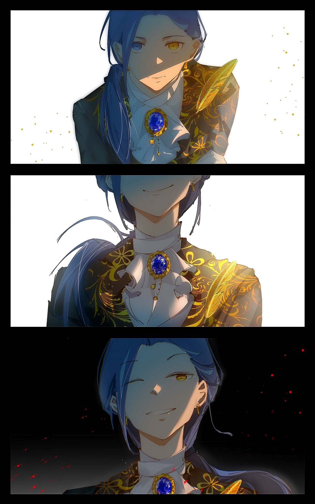
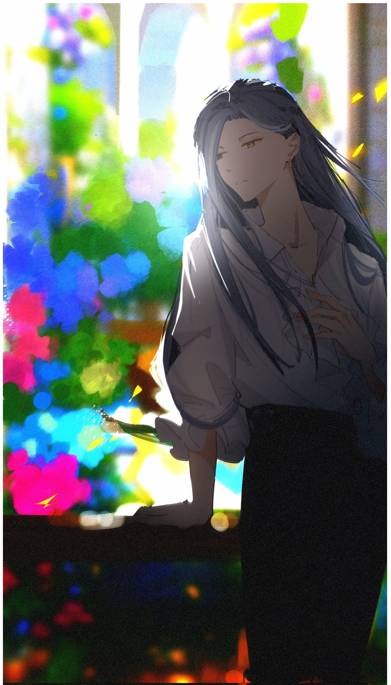
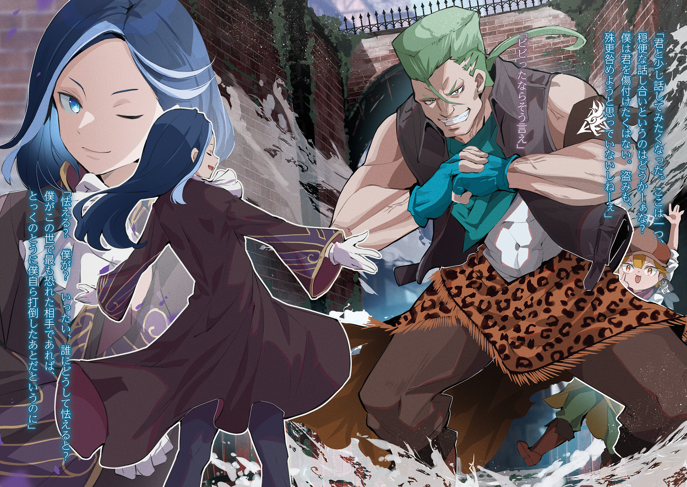
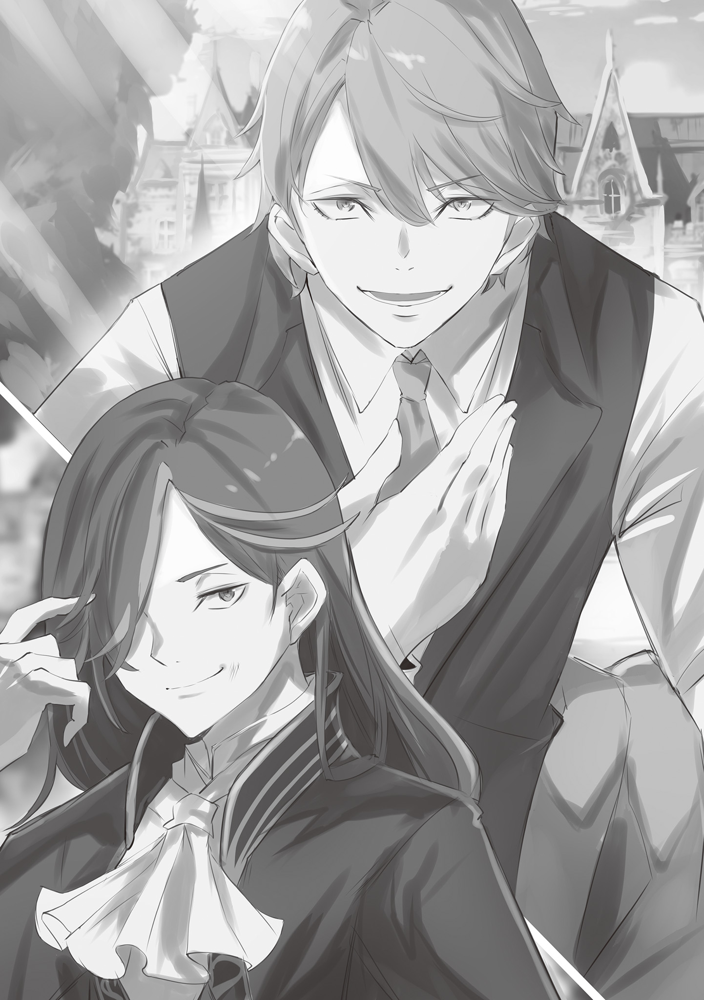
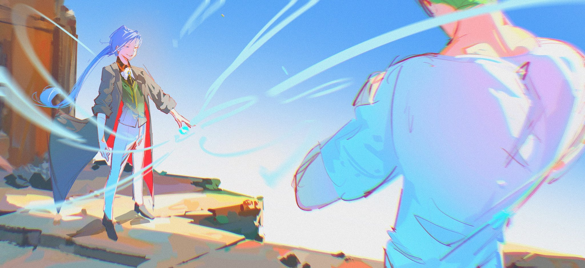
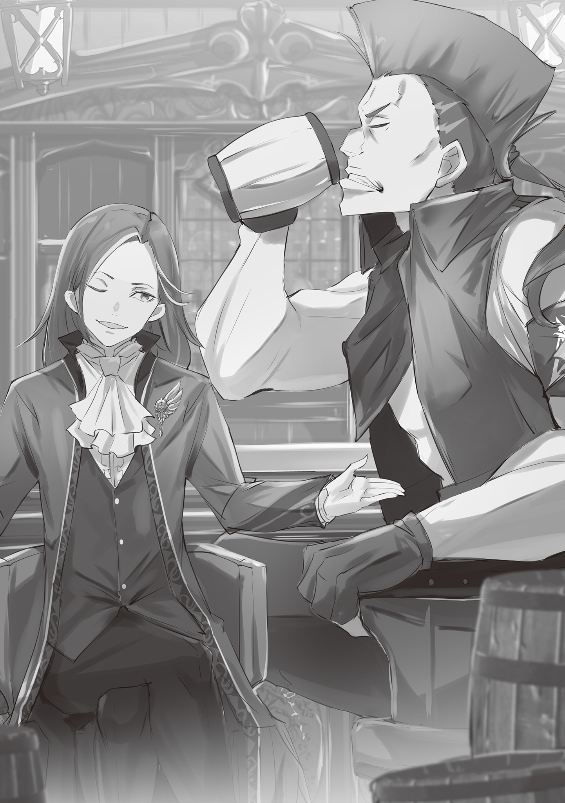
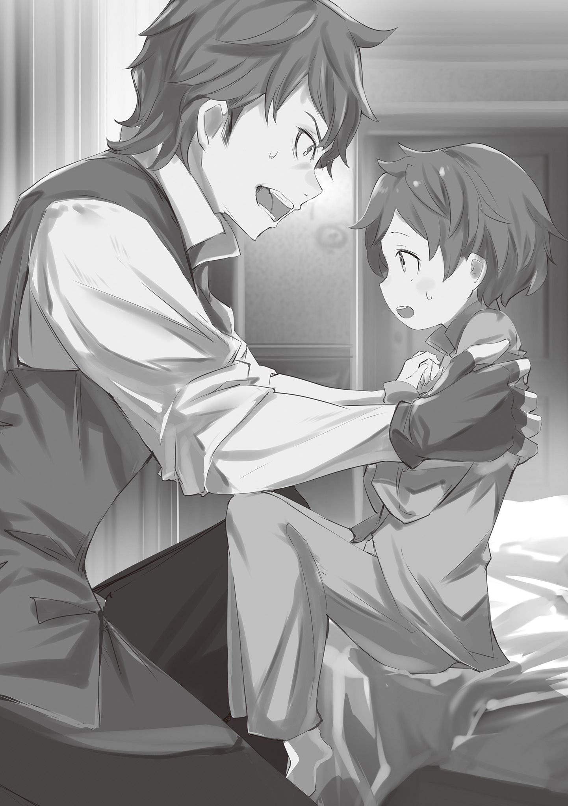

Английский перевод: Eminent Translations

Перевод и редактура: Перакстаз

Фан-арты: Lapetusea

Сыновья наследуют имена своих отцов или дедов. Само по себе это не было особенно необычным — вполне стандартная практика в аристократических семьях, известная и в других. Однако, родословные, в которых это происходило снова и снова, встречались редко.

В основной ветви этого великого дома глава всегда наследует одно и то же имя без каких-либо исключений. Это было абсолютным правилом, не зависящим от пола, и, как традиция, оно соблюдалось последние четыреста лет на протяжении двенадцати поколений. Вероятно, так будет и впредь.

— Розвааль L. Мейзерс.

Тот, чьё имя было названо, был фигурой с длинными тёмно-синими волосами.

Он уважительно преклонил колени на красном ковре, поднял голову и взглянул на человека перед ним. Его глаза были редкой расцветки: правый был голубым, левый — жёлтым. В Драконьем Королевстве Лугуника жёлтый был обычным цветом глаз. Голубой и зелёный не были редки, но самым распространённым был всё же землисто-жёлтый. Поэтому у большинства людей захватывало дух от красоты голубого глаза, напоминавшего водную гладь. Поразительный профиль фигуры производил такое же впечатление.

— …

Он был молодым человеком или, скорее, в том возрасте, когда его еще можно было считать мальчиком. Однако этот четырнадцатилетний мальчик находился в ситуации, которая обычно была бы невыносимой, если бы вы уже не испытали её несколько раз. И всё же он встретил церемонию спокойно, будто обладал стальными нервами.

Церемония. Да, это была церемония.

В этом мире Драконье Королевство Лугуника считалось одним из четырёх великих государств. И это была важная церемония внутри Королевства, проводившаяся для признания тех, кто становился частью его знати.

То была церемония, имевшая место быть для того, чтобы представитель лугуниканской знати мог заявить человеку, стоявшему на самой верхушке страны, что он сменил своего предшественника на посту главы семьи.

— Благодарю за предоставление этой значимой возможности. — Подняв голову, сказал мальчик нежным голосом на грани срыва, находившимся на границе между взрослым и ребёнком. В прекрасном голосе, ласкавшем уши слушателей, не было и намёка на беспокойство.

Уловив это в его тоне, многие из присутствовавших высокопоставленных дворян были впечатлены. Они размышляли, а могли ли сами сделать то же самое, когда были его возраста. Задаваясь этим вопросом, большинство качали головами, в то время как оставшиеся или были впечатляющими людьми, или были слишком высокомерны, чтобы признать свою истинную ценность.

— Повторяю, я здесь, чтобы доложить. Я, Розвааль L. Мейзерс, встаю на место Розвааля K. Мейзерса в качестве главы дома. Начиная с этого момента, я буду стараться не запятнать его имя и не разочаровать королевскую семью Лугуники, служа им.

Это был великолепный отчёт по поводу смены главы семьи. Принимая его, король — Рандхал Лугуника широко улыбнулся и кивнул.

— Твой предшественник — Маркграф Мейзерс — достойно служил нам. Как наследник столь выдающегося человека, ты должен быть столь же подготовлен. Слушай слова своих подданных, будь близок с жителями своих земель и встречай их доверие своим доверием. В таком случае ты тоже будешь любим.

Слова короля были теплы и нежны, а ещё идеалистичны до такой степени, что вгоняли слушавших в краску. Если бы тот, кто сказал эти слова был не Рандхал и те, кто слышал эти слова, были бы не его подданными, а, например, если бы это был Император Волакии, известный суровостью и агрессивностью, они бы не улыбались, а, скорее всего, надорвали бы животы со смеху.

Но среди подданных Королевства ни один человек не смеялся. Они понимали его. Это спокойное и пацифистичное поведение короля само по себе было знаком мира и стабильности в Лугунике, на которых строились их жизни.

— Замечательные слова. Я, разумеется, так и сделаю. Я всё ещё неопытен, но постараюсь взять на себя роль моего великого предшественника как можно быстрее.

Король низко кивнул словам юноши, который отныне собирался держать Королевство Лугуника на своих плечах.

— Хорошо. Стабильно идти вперёд лучше всего. Я многого ожидаю от твоих усилий.

Получив поддержку от Рандхала, мальчик осторожно поднялся и повернулся к присутствующим. С грациозным поклоном он заговорил.

— Я постараюсь многому научиться и от вас, леди и джентльмены. Я молод, но с нетерпением жду возможности поработать со всеми вааами.

Повернувшись спиной к королю, он прикрыл один глаз, презрительно глядя на окружающих теперь лишь только жёлтым.

— Боже, какие у меня напряжённые плечи.

Сказав это мальчик — Розвааль повёл плечами по широкой дуге, уже сменив формальный костюм. Он покинул королевский замок, а теперь находился в своей комнате в гостинице, расположенной на границе районов знати и простолюдинов. Для простолюдина это место считалось довольно дорогим, а для аристократа, наоборот, дешёвым.

Розваалю нравилась такая двойственность, и он всегда выбирал останавливаться здесь, когда проводил время в королевской столице.

— Но то, что меня так хорошо принял владелец несколько десятилетий назад, тоже было решающим фааактором.

Если бы кто-нибудь был рядом, чтобы услышать это бормотание, то был бы захвачен врасплох его зрелой манерой речи. Такие слова не подходили мальчику, который водил пальцем по оконной раме и разглядывал магазины и дома в окрестностях. Однако любой, кто оказался бы рядом и увидел, как он стоял, не смог бы принять его слова за шутку.

Розвааль L. Мейзерс.

Мальчик, который только что закончил аудиенцию у короля, имел вид, который совсем не подходил его юному возрасту. Прошлый Розвааль внезапно скончался, а следующим Розваалем на очереди был этот мальчик.

Его тело, постепенно развивавшее сродство со своей душой, имело все основания считаться шедевром родословной Мейзерсов, продолжавшейся приблизительно четыре сотни лет.

— Так что мне нужно как слееедует позаботиться о нём.

Аккуратно коснувшись собственного тела, Розвааль глубоко вдохнул и отвернулся от окна.

Сегодня его не сопровождали слуги или охрана. Розвааль ненавидел публично демонстрировать свою важность. Хотя, было бы вернее сказать, что он был плох в этом. На самом деле он никогда не терял свою привычку быть обеспокоенным собственным имиджем, а ведь он имел её с давних — очень давних пор.

— Ну, время не резиновое. Мне нельзя прохлаждаться.

Даже если зрители, смотревшие аудиенцию Розвааля с королём, считали его великолепным, он всё же немного нервничал в тот момент. Когда всё это закончилось, ему бы хотелось отдохнуть, но, к сожалению, ещё многое нужно было сделать, чтобы новый аристократ вроде него стал популярен.

Теперь же, несмотря на то, что самая важная задача была выполнена, всё ещё оставались люди и места, которых следовало навестить. Например, столичный институт магических исследований ожидал визита Розвааля, ведь два поколения назад его основала Розвааль J. Мейзерс, а он теперь унаследует её знания.

В прошлом поколении он всё реже и реже посещал это место. Но Розвааль нынешнего поколения не будет так поступать. Ему необходимо поддерживать близкие отношения с институтом.

— Отлично, тогда мне стоит идтиии? — Бормоча что-то, словно пытаясь убедить самого себя, Розвааль покинул свою комнату, одевшись в простой наряд.

Он сообщил владельцу гостиницы приблизительное время своего возвращения, и тот проводил его взглядом. Поскольку солнце все еще стояло высоко в небе, он мысленно прикинул порядок посещений, а затем прищурился, глядя на столицу, раскинувшуюся перед ним у подножия пологой дороги.

Со времён беспорядков, происходивших примерно двадцать пять лет назад, в Королевстве Лугуника не было крупных войн. Разумеется, нужно было заботиться о искрах разногласий, но, поскольку они были потушены до того, как могли превратится в бушующий пожар, месяцы и годы проходили без каких-либо серьезных проблем.

— …Хм. Неожиданно, что я так тронут этим. — Сказал Розвааль, слегка усмехнувшись своей сентиментальности по отношению к мирному городу.

Люди, которые однажды прилагали все возможные усилия, чтобы защитить его, ярко сияли в его воспоминаниях даже сейчас. Но то, что он был первым, кто оставил всё позади — это было сложным чувством. Нахождение здесь заставляло его легко подстёгиваться этими мыслями.

Чтобы случайно не столкнуться с людьми, которых он знал за два поколения до себя, он держался подальше от столицы во время своей предыдущей итерации. Однако…

— На этот раз я не смогу этого сдееелать. Я должен быть идеально подготовлен.

В любом случае, он не мог позволить себе совершить ошибку. Так было и раньше, но теперь ему нужно сдерживать сея куда сильнее, чем раньше. А причиной был…

— Ох, прошу прощения!

— Ну и ну.

Он шёл, погружённый в свои мысли, и неожиданно столкнулся с выходившей из переулка фигурой. То был маленький мальчик с низко надвинутой шляпой, и Розвааль замер, почувствовав то лёгкое столкновение. Мальчик, однако, постоянно извинялся, не делая пауз.

— Если кто-нибудь узнает, что я столкнулся с дворянином, у меня могут быть серьезные неприятности. Разве вы не отпустите меня лишь на этот раз?

— Это очень постыыыдная просьба. Если с этого момента ты будешь смотреть, куда идёшь, я не буууду обращать на это внимания.

— Ох, правда? Спасибо за вашу доброту. Ну, тогда…

— Даже если так…

После беззаботного обмена репликами юноша быстро повернулся, чтобы уйти, когда Розвааль схватил его за запястье. Мальчик вскрикнул и что-то выронил из руки, за которую был схвачен.

То было золотое перо, которое мальчик украл, когда двое столкнулись.

— Это важная вещь. К сожалению, я не мооогу позволить тебе её забрать.

— Тц, ты внимательный.

Взяв упавшее перо в свободную руку, Розвааль улыбнулся.

— Когда проходишь через толпы людей в столице, это необходимая мера предосторожности.

Судя по его впечатляющим навыкам, было ясно, что мальчик был закоренелым вором. Однако Розвааль не собирался выдавать его стражникам.

Никто никогда не должен сожалеть о том, что использовал свои способности, чтобы выжить. Если их использование противоречило закону, то нужно научиться его обходить.

— Раз уж я получил своё перо обратно, то сегодня оставлю произошедшее без внимания. Тааак что в следующий раз кради у более лёгкой жертвы. Я не собираюсь тебя винииить.

— …Ты действительно странный аристократ. Теперь, когда я смотрю на тебя, ты же просто ребёнок!

— Это, конечно, необычно, когда тебя называет ребёнком кто-то моложе. В любом слууучае, судить людей по внешности плооохо.

— Тогда тебе тоже не стоило называть меня ребёнком.

— Нет-нет. Я уверен, что ты им являешься. В конце концов, есть лишь горстка тех, кто старше меня.

Мальчик изумлённо посмотрел на Розвааля, который держал перо в руке, закрыв один глаз. Провокация, которая, естественно, только заставила бы его почувствовать, что над ним насмехаются. Он быстро ощутил, как в нем поднимается волна гнева, и стиснул зубы. А поскольку Розвааль оставался насторожен в своих следующих действиях…

— Рагх!

— …

Вопреки ожиданиям Розвааля, вместо того, чтобы попытаться вырваться, мальчик умело повернулся и схватил его за запястье, собираясь зафиксировать сустав. Удивленный плавностью этой техники, он мгновенно ослабил хватку. Затем, в следующий момент, мальчик толкнул его плечом, сделал шаг назад и, воспользовавшись этим шансом, проворно понёсся по переулку.

— Хитро.

Розвааль был удивлён неожиданной контратакой, но то, что действительно потрясло его, так это упорство мальчика относительно своей добычи. Перо, которое он вернул, теперь было снова украдено. Он бы похвалил такое упорство, но он не мог потерять перо — это было престижное изделие.

Он понёсся по переулку, следуя за мальчиком. Его обувь не подходила для бега, но ничего не поделаешь. Поняв, что Розвааль был за ним, мальчик скривился. На бегу Розвааль следовал карте, которую нарисовал в уме, и с точностью загнал юношу в тупик.

— Т..ты…у…упорный…

— Я ведь уже сказал тебе — эта вещь очень важна. Если бы это было что-то другое, то я бы не возражал отдать его в награду за то, что ты так хорошо сражался, но конкретно это я отдавать не намерен. Так что…

Прижатый к стене мальчик замер, пока Розвааль пытался вернуть перо. Его любопытство возросло до такой степени, что он подумывал накормить мальчика, а потом узнать о его обстоятельствах. Однако…

— Прошу прощения, но этот мой.

Сразу же после этих слов высокая фигура упала перед ними.

— …

Фигура, в буквальном смысле, упала с высоты узкого переулка. Момент вмешательства был выбран так, словно она наблюдала за погоней между Розваалем и мальчиком. Поприветствовав крупного мужчину, стоявшего перед ним, Розвааль нахмурил брови.

Это был незаурядный мужчина атлетического телосложения с резкими чертами лица, похожими на каменные глыбы. Ему было около двадцати пяти лет, он носил грязную одежду, которую мог бы носить любой головорез столицы. Однако, атмосфера власти, которая витала вокруг этого человека, была несколько утонченной для простого бандита.

— Капитан!

— Отойди, Бел. У меня есть куча вещей, которые я хочу тебе сказать… Но сейчас я тащу твою задницу обратно. — Грубо ответил мужчина, которого назвали капитаном, в то время как глаз мальчика загорелись при его появлении.

Услышав это и наблюдая за мальчиком, которого он загнал в угол, Розвааль прикрыл один глаз и уставился на мужчину единственным желтым.

— Капитан это немного преувеличение, не так ли? Ни по возрасту, ни по положению, ты не подходишь, чтобы возглавлять рыцарей в таком захолустье…

— Хватит сарказма, благородный юноша. Поразительное отсутствие чувства опасности — распространенный порок среди вас, людей. Благодаря этому нам стало легче жить.

— …Хм.

Это был на удивление грамотный ответ, и Розвааль задумался над этим бестактным обменом репликами. Мужчина перед его глазами вызвал волну любопытства точно так же, как и мальчик позади него. Если возможно, он бы хотел поговорить с ним подробнее.

— Мне интересно, а как насчет того, чтобы попытаться мирно договориться друг с друуугом? Я не хочу вам навредить. Кроме того, я не собираюсь брать на себя труд осуждать вас за воровство.

— Ты боишься? — Провоцировал мужчина.

— Боюсь? Я? Конкретно почему и кого я должен бояться? Того, кого я боялся больше всего в этом мире, я сам победил давным-давно.

Розвааль запугивал своего оппонента, протягивая руки, требуя разумной дискуссии. Таким же образом, как человек, стоявший перед ним, не был похож на головореза, Розвааль также давал понять, что он не был наивным четырнадцатилетним мальчиком, каким казался.

Однако, несмотря на то, что он ясно дал им это понять, отношение мужчины ни капли не изменилось.

— Несмотря на внешность, кажется, что у тебя явно что-то не так с головой. — Сказал он. — Я собираюсь преподать тебе урок.

— …Ты еще пожалеешь о своем болтливом рте. — Ответил Розвааль. Как только он понял, что переговоры провалились, он сделал свой ход.

Между ними было около пяти метров, но Розвааль, покрытый ветром, преодолел это расстояние на одном дыхании. Его целью был торс противника. Мускулы мужчины были прочны, как броня, но если бы удар пришёл через щели, то внутренние органы стали бы легкой добычей.

Один удар, который наносил сокрушительный урон по внутренним органам, расположенным за мышцами — это был прием под названием Фа Цзинь, которому он научился два поколения назад. Чтобы нанести удар, Розвааль положил ладонь на живот своего противника и…

— Ха!

Удар свершился в тот самый момент, когда он шагнул, и отдача прошла у него за спиной. Ветер, поднятый этим ударом, сдул грязь из переулка, а ощущение рикошета отозвалось во всём теле.

Мощь, с которой он разрывал чужие внутренние органы, с легкостью лишила бы сил две ноги, поддерживающие массивное тело. Естественно, без какой-либо поддержки тело бы не выдержало… И все же человек остался стоять.

— Что? — Удивлённо произнёс Розвааль.

— Аргх, дерьмо… Это было больно, тощий засранец.

Предположив, что он упадёт, потерпев неудачу, мужчина прищёлкнул языком и разочарованно стиснул зубы. Видя это, Розвааль сглотнул. Не то чтобы он смягчил удар какой-то особой техникой. Мужчина просто выдержал его с безумным упорством.

Его глаза выпучились от этого открытия, когда мужчина дернулся всем телом, размахивая кулаками. Единственный удар, сопровождаемый мощным порывом ветра, с сокрушительной силой поразил окаменевшего Розвааля в живот.

— …Гха.

Отлетев назад, Розвааль врезался в стену. Его голова закружилась. Прежде чем он успел осознать, что произошло, его чувства начали угасать…

— …Дерьмо, я ещё не закончил. Как же это жалко…

С этими финальными словами, полными негодования на самого себя, он окончательно потерял сознание.

— …

— Вы очнулись?

Розвааль вернулся в сознание и открыл глаза.

Перед собой он увидел голубое небо. В его спине было неприятное ощущение, и он понял, что распластался на полу в какой-то неприветливой обстановке.

Постепенно он привёл сознание и память в порядок, воспроизводя события, происходившие перед тем, как он потерял сознание. И тогда боль в животе напомнила ему о том, что его избили до полусмерти.

— Ах, ай-ай-ай…

Корчась от боли, он сел и нервно оглядел свой живот. Его пиджак был расстёгнут, а на обнажённом животе лежал пакет со льдом. Прикладывание холодного к синякам было очевидной первой помощью, но помимо этого под ним лежал хороший камзол, указывая на то, что кто-то о нём позаботился. И это кто-то это…

— Это был ты, вееерно?

Молодой блондин пожал плечами.

— Надеюсь, что я не был слишком навязчивым.

Он был одного возраста с Розваалем, обладая привлекательным профилем и умными зелёными глазами. Сидя на ступеньке, он держал в руке книгу и глядел на Розвааля. Учитывая тот факт, что камзола на нём не было, не оставалось сомнений, что он был тем, кто оказал первую помощь.

— Ах, если требуются подробности, то всё довольно просто. Я услышал шум в переулке… Довольно громкий. Из любопытства я туда заглянул и обнаружил вас, лежащим без сознания.

— И твоя совесть сказала помочь? Ну и ну, у тебя довольно честный характер. Твои родители бы гордились.

— Нет, даже если мои действия были правильными, родители бы меня не похвалили. В любом случае, было бы гораздо хуже, если бы я оставил здесь нового главу семьи Мейзерс.

— …

У Розвааля перехватило дыхание, когда его личность была правильно определена.

У этого мальчика нет недобрых намерений по отношению ко мне, — думал он, основываясь на том факте, что ему помогли. — Он, вероятно, не союзник двум другим, тогда его намерение должно быть…

Немного подумав, Розвааль пришёл к выводу, что целью молодого человека было получение от него какой-нибудь награды.

— Вы не предполагали, что у меня могут быть добрые намерения?

— Разве это не то, что ты сам только что отрицааал? Раз уж ты показал, что осведомлён о том, что спасённый тобой из семьи Мейзерс…у тебя должен быть какой-то скрытый мотив.

— Вы правы. Не буду этого отрицать. — Всплеснув руками, юноша со смешком подтвердил подозрения Розвааля.

Честность в разговоре вызывала соблазн продолжить его, но Розвааль не мог поддаться этому искушению. Проверив свои вещи, он убедился, что кошелёк и драгоценности были на месте. Но самого важного — пера — нигде не было. Очевидно, что после его поражения победители забрали трофей.

Медленно поднявшись на ноги, Розвааль отряхнул свою одежду.

— Мне нужно его вернуть…

— Вы в порядке? — Спросил юноша. Теперь, когда он встал, оказалось, что он был немного выше Розвааля. — Я не знаю обстоятельств, но не лучше ли отдохнуть? Если нет, то, по крайней мере, я мог бы позвать вашего слугу или компаньона…

— К сожалению, я путешествую один. Мне не на кого положиться. Юноша, который только что унаследовал место главы дома был бы бельмом на глазу с чьей-либо точки зрения. Верно?

— Возможно, что это лишь моё воображение, но вы находитесь в довольно завидном положении.

— Ты говоришь откровенно… Я бы не сказал, что мне это не нрааавится.

Помимо того, что он добр, атмосфера в разговоре составляет у меня приятное впечатление о нём.

Оценив собеседника, Розвааль повернулся к выходу из переулка, к главной дороге. Розваалю нужно было найти одного или обоих — мальчика, укравшего перо и огромного мужчину, который того защитил.

— Если я не ошибаюсь, вы, кажется, планируете что-то опасное..?

— Да… Желание встретить того, кто так безжалостно меня вырубил, вероятно, считается опасным с точки зрения здравого смысла. А ты что думаешь?

— Без сомнений, это будет опасно. Особенно если вам не на кого положиться.

— Как полезно.

Ему не нужно было слышать, что это была самоубийственная затея, но У Розвааля была хорошая, причина не отступать. Он только что убеждал себя, что неудача была недопустима. Он не мог позволить себе оставить всё как есть.

— Мейзерсы это великая благородная семья. Вам нет нужды делать всё в одиночку. Разве вы не можете заручиться поддержкой столичной стражи?

— Как я и говорил. Мы — молодые — в невыгодном положении. Одно неверное движение и тебя заживо сожрут амбициозные люди вокруг. Потому я не могу полагаться на людей.

— Ясно. Вы звучите всё более и более беспомощно. Значит, у вас уже есть план, как разрешить ситуацию самостоятельно?

— К сожалению, мне придётся импровизировать.

В конце концов, он только открыл глаза после неожиданного поражения.

Ему стоило что-то предпринять, прежде чем они продадут перо или куда-нибудь сбегут. Или, в худшем случае, безвозвратно потеряют украденное.

Словно чувствуя, что было у Розвааля на уме, юноша кивнул и с энтузиазмом заговорил.

— Ясно! Что вы думаете, Маркграф Мейзерс? Похоже, что вам больше не на кого положиться, учитывая обстоятельства, и то, что наши пути пересеклись, похоже на судьбу… Как насчёт того, чтобы я вам помог?

— Ты? Поможешь мне? Почему?

— Тот же самый скрытый мотив, который сподвиг меня позаботиться о вас. Моя семья лишь одна из сотни купеческих семей столицы. Как у второго сына, у меня не будет блестящего будущего… И тут на помощь приходите вы.

Юноша указал на Розвааля, сверкая беззаботной и расчётливой улыбкой. С этой озорной улыбкой он продолжил говорить.

— Я только что имел удовольствие говорить с дворянином из уважаемого дома, таким беспомощным и одиноким. Нет ничего такого в том, чтобы немного помечтать, не так ли?

— …Я понимаю о чём ты говоришь, но ты настроен решительно. Если бы я был из тех, кто оценивает людей по их отношению или испытывает отвращение к тем, кто так откровенно заискивает, то для тебя бы всё кончилось в мгновение ооока.

— …Но разве вы такой человек?

— …

Слыша вызывающий тон и видя выражение чужих глаз, Розвааль беззаботно усмехнулся.

Перед ним был молодой человек, готовый пойти на риск. Необходимое качество, чтобы брать судьбу в свои руки. Розвааль тоже приветствовал эту черту характера. А потому юноша, принявший участие в своей игре, где лишь пан или пропал, нуждался в соответствующей награде.

— Я Розвааль L. Мейзерс и я бы хотел принять твоё предложение.

— …Ха-ха, какое облегчение. Взгляните, у меня вспотели ладони, а колени трясутся. — Расслабившись, молодой человек вздохнул с преувеличенным облегчением.

Розвааль пожал плечами.

— Ты хороший актёр.

А затем он спросил имя человека, который осмелился протянуть ему руку в этой жестокой королевской столице.

— Твоё имя..?

— Рассел. Я Рассел Феллоу. Рад познакомиться.

С этими словами молодой человек — Рассел — одарил его ужасно амбициозной улыбкой.

— Тогда, Маркграф, то, что вы ищете это…

— Розвааль. Если хочешь, то зови меня так, ладно? Если мы теперь ходим вместе, то мне бы не хотелось выделяться.

— Хорошо. Значит, Розвааль. — Рассел обратился к нему без титула, точно уловив желания Розвааля.

В компании Рассела, который предложил свою помощь, Розвааль вышел из переулка в сторону дороги. Люди сновали по главной улице. Неудивительно, что двух фигур из прошлого нигде не было видно. Даже если они хотели его преследовать, от них не осталось ни следа.

— Как долго я был без сознания? — Спросил Розвааль.

— Где-то десять минут с тех пор, как я нашёл тебя. — Ответил Рассел. — Я бросился туда тогда же, когда услышал шум, так что предполагаю, что в то же время эти парни сорвались с места.

— Ясно. Вещь, которая мне нужна, является семейной реликвией. Я должен вернуть её несмотря ни на что.

— Можешь дать мне детальное описание?

— Это перо, сделанное из золота, по размеру оно могло бы поместиться в твою ладонь, а ещё его украшает мой фамильный герб.

Это не был ужасно важный предмет, но он был символом главы рода. Пропади перо, и он не был уверен, что скажут аристократы, не говоря уже о его родичах. А ещё он должен был признать, что был к нему привязан.

— Если бы они делали это ради денег, то странно, что не взяли другие ценности. — Сказал Розвааль.

— Считаешь, что перо изначально было их целью? — Спросил Рассел.

— Ну… Я думаю, что это мы узнаем только непосредственно от них.

Наверняка у них было достаточно времени, чтобы обшарить карманы Розвааля, прежде чем на место происшествия прибудет кто-нибудь ещё.

Было ли причиной того, что этого не произошло, приказ человека, которого называли Капитаном?

— Во всяком случае, мужчину назвали «Капитаном»… — Задумчиво пробормотал Рассел, услышав описание двух подозреваемых.

— ..? Ты о нём знаешь?

—На самом деле… — Рассел продолжил.

— Розвааль, ты слышал о «Братстве», о котором в последнее время говорят в столице?

— Братство? — Повторил Розвааль. Не помня этого термина ни по названию, ни по сути, он покачал головой. — Нет, первый раз слышу.

Как уже упоминалось, Розвааль продолжительное время дистанцировался от столицы. Чистая правда, что он ничего не знал о последних событиях в городе.

— В столице есть социальные классы, если грубо разделять, то это аристократы, простолюдины и бедняки, как ты уже знаешь. Братство это группа, основанная обедневшей молодёжью, коллективно выступающей против такой классовой дискриминации.

— Группа молодых, выражающих своё недовольство, хм? Звучииит правдоподобно.

— Как группа, они нападают на дворян, крадут ценности и устраивают нападения во имя наказания. И так называемый «Капитан», который их возглавляет имеет то же описание, что и то человек, который избил тебя.

— Значит, он был Капитаном Братства, хм.

Выслушав объяснения Рассела, Розвааль понял, почему он стал мишенью. Короче говоря, незрелый юноша, гуляющий один да без сопровождающих, стал легкой добычей. Он с облегчением узнал, что это не было личной неприязнью к дому Мейзерс.

Тем не менее…

— Но почему столичный гарнизон позволяет этим негодяям околачиваться поблизости? Если рыцарям недостаточно действовать, то, по крайней мере, стража должна что-то предпринять…

— Из всех людей, ты должен знать ответ на этот вопрос.

— …Ясно. Значит, этот капитан одержал над ними верх.

Если бы это был тот человек — капитан, который одним ударом уложил даже Розвааля, то у элитных войск столичного гарнизона не было бы ни единого шанса.

Какой удивительно ужасающий человек.

— Но рыцари не столь наивны, чтобы просто позволить внутренним делам развиваться таким образом. Должно быть и что-то еще… верно?

— У тебя проницательный взгляд. Ты прав — гарнизон не знает, что делать с Братством. Проблема в том, что это касается не только их. У столицы есть еще одна проблема, связанная с Братством.

— Которая заключается в…

Как только он попытался узнать следующую часть истории, их прервали. К ним подошел мужчина средних лет, вышедший из уличного киоска.

— Рассел, что касается человека, которого вы ищете…

В настоящее время они оба полагались на широкую известность Рассела, чтобы проследить путь Братства по свидетельствам очевидцев из числа простых людей на улицах. Один из этих источников — владелец лавки, начал говорить приглушенным голосом. «Ходят слухи, что они использовали западные переулки, чтобы проникнуть в трущобы. С общественной безопасностью в этом районе было довольно плохо, но, похоже, у эти парни из Братства уже распространили туда своё влияние.

— Западная сторона, не так ли? Благодарю. Если узнаешь что-нибудь ещё, то дай мне знать. — Вежливо ответил Рассел перед тем, как отдал владельцу лавки небольшой мешочек с вознаграждением.

Оценив его вес, мужчина с улыбкой проводил их взглядом.

— Спасибо за ваше покровительство.

Как только владелец магазина скрылся из виду, Розвааль подметил, — ты, кажется, очень искусен в этом деле. И давно ты этим занимаешься?

— Под «этим» ты подразумеваешь…?

— Помогаешь глупым аристократам вернуть украденные фамильные ценности.

— Нет, нет, конечно, нет. Такое замечательное приключение для меня впервые. Но у меня много знакомых среди местных торговцев. Я усердно работал, чтобы на всякий случай обзавестись кое-какими связями.

Это могло звучать как скромность, но Розвааль чувствовал, что за словами Рассела стояла твёрдая убеждённость. И ему нравилась такая параноидальная подготовленность. Каждая жизненная трудность зависит от степени подготовки человека столкнуться с ней. То, что другие могут посчитать ненужной мерой предосторожности, может спасти жизнь в случае чрезвычайной ситуации.

И накопленный Расселом опыт определённо способствовал решению части проблем Розвааля.

— Я принял решение. Независимо от того, как повернётся этот день, по крайней мере, встреча с тобой была редкой удачей. — Сказал Розвааль.

— Тогда моя работа заключается в том, чтобы использовать эту удачу по назначению… — Ответил Рассел. — Согласно тому, что было сказано ранее, они пошли по этому переулку. Смотри под ноги.

Пока Рассел шёл впереди, Розвааль аккуратно погладил свой живот. Последствия того удара отзывались сильными вспышками боли даже сейчас.

Дом Мейзерс был известен своим магическим мастерством, и если бы он использовал магию исцеления, то такого рода травмы были бы мгновенно излечены. Однако, магия исцеления была единственной вещью, к которой у Розвааля не было вообще никаких способностей. Это был единственный навык, который не мог быть освоен, независимо от числа поколений из плоти и крови. Было время, когда кровь с огромным родством с водной маной появилась в семье, но даже это было безрезультатно.

Мне интересно, а не является ли это своего рода прокляяятьем?

Не будет преувеличением сказать, что способность исцелять людей была добрейшей силой в этом мире. А Розваалю не хватало доброты, необходимой для того, чтобы быть наделенным этой способностью. Это было свидетельством того, на чем стояла семья Мейзерс — слоях негодования и жертв.

— Кстати говоря, продолжая наш предыдущий разговор… Ты сказал, что у гарнизона была ещё одна проблема, помимо Братства. Что это?

Рассел глубоко вздохнул в ответ на заданный сзади вопрос. Поскольку они уже ступили в один из районов трущоб, Рассел внимательно следил за окружением и дважды проверил территорию на предмет жизни, прежде чем отвечать.

— Социально-классовая проблема глубоко укоренилась. В некотором роде, Война Полулюдей тоже имела такие корни, поскольку причиной боевых действий было происхождение. Однако…

— Из этого предисловия я заключаю, что помимо Братства есть еще одна группа, которая обеспокоена социальными классами?

— Да, есть. Фракция Золотое Крыло — это группа дворян, полная противоположность Братству и их собранию крестьян.

— Фракция Золотое Крыло… Хм. — Розвааль задумался над названием этой новой группы.

Дворяне, озабоченные системой социальных классов, и организация, которая сформировалась вокруг этого. Короче говоря, дворяне, которые участвуют в этом являются…

— Незначимые дворяне или вторые и третьи сыновья своих уважаемых семей. Скорее всего, это собрание тех, кому никогда не отводилась важная роль наследника семьи, и у кого развилось раздутое чувство собственной вааажности.

— Как безжалостно. Но ты прав.

Даже среди дворян было неожиданно много людей с плохими идеалами. Однако, аристократы не могли существовать сами по себе. Только благодаря существованию людей в их владениях и тех, кто находился под их защитой, они могли быть дворянами. Однако многие из тех, кто родился в дворянской семье, были ими только по названию, воспитанные без чувства ответственности или долга. Чтобы поддержать свою самооценку, у них не было другого выбора, кроме как доказать, что они сами тоже дворяне.

Это была бы впечатляющая история, если бы они добились этого с помощью политики или добрых дел.

— Наказывая проблемных рабочих или бедняков, чтобы поддержать имидж столицы… Подобные самодурственные инициативы зашли слишком далеко. Разве не из-за этого Братство возникло в первую очередь?

— Они появились примерно в одно время, но вопрос того, что возникло раньше, является довольно непродуктивной дискуссией. — Объяснил Рассел. — Было ли это Братство, рождённое из ненависти к давлению со стороны дворянства, или Фракция Золотое Крыло выросла из-за неспособности закрыть глаза на жестокие действия Братства — правда, что и те и другие являются причиной проблем для столицы.

Будучи жителем столицы, Рассел казался уставшим от этого всего — то, как он говорил о проблемных группах, было полно отвращения.

В любом случае, было очевидно, почему столичный гарнизон был занят по горло. С одной стороны, Братство без колебаний продолжало свою насильственную экспансию. С другой стороны, Фракция Золотое Крыло занимала положение и власть дворянства только на словах, хотя и делала вид, что заботится о королевстве.

Обе организации представляли собой проблемы, с которыми приходится иметь дело каждой стране, а не только Лугунике. Человечество было развито недостаточно сильно, чтобы легко справляться с подобным.

— Мы скоро окажемся на территории, о которой говорил свидетель. Если этот человек — Капитан Братства, то он, скорее всего, будет окружён своей бандой. Будь осторожен.

— Буду. Его люди окажутся лишь небольшой проблемой… Хотя, по моему мнению, он выглядел как человек, который не оставляет драки на другииих.

Невероятно сильным бойцам часто мешают их товарищи.

Особенно этот Капитан, противостоявший мне, защищая мальчишку-карманника. Если я потребую реванша из честных побуждений, есть большая вероятность, что он согласится.

Как раз в тот момент, когда он размышлял о такой возможности-

— …

Почувствовав на своем затылке непрошеный взгляд, Розвааль медленно обернулся. Во взгляде не было ни злобы, ни враждебности. Но, помня предупреждение Рассела, он был осторожен в своем окружении. Тем не менее, этот пристальный взгляд преодолел его бдительность и обнаружил его.

И обладателем этого взгляда был…

— …Ребенок?

На углу трущоб спокойно стоял одинокий мальчик. Ему было около четырёх или пяти лет, он носил хорошо сшитую белую рубашку и короткие штаны. Судя по неподходящей для трущоб внешности, единственным возможным предположением было то, что ребёнок происходил из знатной семьи.

У него были огненно-красные волосы и поразительные голубые глаза, в которых, казалось, было заключено само небо. На фоне его детских черт голубые глаза невинно наблюдали Розвааля и Рассела.

Розвааль ахнул при виде этих глаз, недоумевая, почему именно у него перехватило дыхание.

—…Ты…

—…Розвааль? — Слыша хриплый голос Розвааля, Рассел оглянулся через плечо и заметил ребёнка.

Его глаза расширились от удивления при виде неожиданного зрелища. Увидев реакцию двух старших мальчиков, ребенок открыл рот.

— Эм, пожалуйста, подождите. Мой отец сейчас работает.

— …Твой…отец…работает?

— Да. Он пытается договориться со своим другом. Так что…

Ребенок посмотрел в конец переулка, куда направлялись Розвааль и Рассел. Если верить его словам, именно там должен был работать его отец. Он остановил их, чтобы они не беспокоили его отца.

— …Что нам делать? — Тихо спросил Рассел, стоя рядом с Розваалем.

Человеком, которого затронула эта проблема, был Розвааль. Рассел был не более чем союзником, не имевшим права голоса в этом вопросе. Конечно, они могли проигнорировать просьбу ребенка и двигаться дальше, но…

— Хорошо. Мы подождём, пока твой отец не закончит свою работу. — Заверил Розвааль. — Тебя это устроит?

— …! Да, спасибо!

Услышав его ответ, лицо ребенка просветлело, и он склонил голову. В то же время несколько сухая атмосфера смягчилась, и Розвааль и Рассел обменялись взглядами.

— Ничего, если я кое-что спрошу? — Спросил Рассел, прогибаясь в пояснице. — Нам нужно кое-что сделать здесь. Не мог бы ты назвать нам имя твоего отца, который работает тут?

— Мой отец? Мой отец… — Ребенок бесстрашно ответил на вопрос Рассела. Его глаза светились гордостью, как будто он произносил имя самого надежного человека во всём мире. — Хейнкель Астрея. Это имя моего отца.

В то же время, когда Розвааль и Рассел встретили ребёнка…

— …Эй, возвращайся уже в рыцари. Как долго ты собираешься дуться подобным образом? Мы ведь оба взрослые.

На углу трущоб, окруженных заброшенными зданиями, двое мужчин стояли лицом к лицу. Вернее, было бы неправильно сказать, что они стояли лицом друг к другу. Потому что в то время, как один из них говорил, другой с отвратительным видом смотрел на небо.

— Взрослые, да? — Вяло смотревший в небо опустил взгляд. — Ты довольно настойчив. Почему бы не оставить меня в покое?

По его поведению было видно, что он все больше раздражался как из-за брошенных слов, так и из-за самого бросившего. По всем аспектам его поведения с первого взгляда становилось понятно, что он смотрела на собеседника свысока. Естественно, это было очевидно и для той стороны, на которую было направлено такое отношение.

— Я не могу отступить только из-за того, что ты так сказал. Ты знаешь в каком я сложном положении. Не будь таким трудным.

— Знаешь, я тут подумал, а ты ведь ужасно дерзкий в своём обращении ко мне. С каких пор мы с тобой стали такими хорошими приятелями?

— Это…

— Конечно, ты не можешь так думать из-за того, что у нас один учитель? Как много учеников у Бордо? Все они твои друзья?

— …

С выражение боли на лице человек, выбравший более мягкие слова, замолк.

Он был красивым мужчиной с огненно-красными волосами и нежным лицом с чётко очерченными чертами. У него был приятный голос и черты лица, которые многие сочли бы привлекательными. К сожалению, одного этого было недостаточно, чтобы достучаться до стоявшего перед ним человека.

Из их разговора становилось очевидно, что между этими двумя никогда не было хороших отношений. И, тем не менее, здесь и сейчас они стояли лицом к лицу.

— Хейнкель, пришло время тебе перестать быть милым со всеми. Именно из-за этого тебя заставили заниматься тем, для чего ты не подходишь.

— Заставили? Я был тем, кто подписался на это.

— Ты уверен? Могу представить, как все вокруг медленно давят на тебя, чтобы убедиться, что ты, как всегда, сам возьмешься за дело.

— …

Более симпатичный из них — мужчина по имени Хейнкель — при этих словах посуровел лицом.

По его реакции с первого взгляда становилось очевидным, что другой человек попал в точку, открывая личность, которая была слишком наивна и честна по своей сути. Хейнкель, однако, выдохнул, словно пытаясь скрыть свои эмоции, и быстро вытащил из-за пояса свой меч — свой драгоценный меч.

— …Ты его обнажил.

— Да, я обнажил его. Я действительно обнажил его. Несмотря на твои слова, я должен выполнить возложенные на меня обязанности. У тебя тоже есть обязанности. Верно…Маркос?!

— Я не отрицаю этого. Я не буду отрицать это, но… Что с того? Что ты собираешься с этим сделать?

— Хах?

Уставившись на Хейнкеля, доставшего меч и направившего его прямо на него, крупный мужчина — Маркос — почесал щёку. Делая это, он непринуждённо стал сокращать дистанцию между ним и Хейнкелем.

— Ты собираешься привести меня обратно силой? А сможешь? Своими собственными руками?

— …

Маркос взмахнул мощными длинными ногами и пнул меч Хейнкеля сбоку. Рыцарский меч от такого удара покинул руку своего владельца и обрушился в трущобную грязь, издав грустный звук. Голубые глаза Хейнкеля удивлённо проследили за этим, а Маркос фыркнул.

— Что ты будешь делать, если ты не можешь размахивать мечом, который вытащил?

— Я…Агх…

— Поднимай его и проваливай, придурок. — Выплюнул Маркос, на что выражение лица Хейнкеля отчётливо исказилось в боли. Маркос, однако, этого не видел, ведь уже отвернулся.

— Даже если бы появился зверодемон, не думай, что я спасу тебя, как в прошлый раз.

Почувствовав непоколебимое неприятие от его повёрнутой спины, Хейнкель опустил глаза. Он поднял свой глубоко любимый меч с земли и снова вложил тот в ножны.

— Это расстроит твоего легендарного отца. — Сказал он. — Риккерт тоже о тебе волнуется…

— Это у тебя здесь легендарные отец и мать. Волнуйся о себе, а не обо мне. Тебе стоит беспокоиться о своём сыне и Луанне.

— …

Это произошло сразу же после слов Маркоса.

— …

Обнажённый меч был приставлен к шее насмехающегося Маркоса. Взмах меча напоминал вспышку света, но Маркос не разворачивался, а его лицо оставалось невозмутимым. Это было лицо человека, который уловил способности оппонента и понимал, что до его собственных тому не добраться.

— Ты…

— …

— Что ты, чёрт возьми, знаешь?

— Ничего. То, что я знаю, так это то, что ты не сможешь отрубить мою голову. — Заявил Маркос, кончиком пальца отводя меч, приставленный к его шее. Это была совершенно бесполезная борьба, которую нельзя было завершить даже последним ударом его меча, и лицо Хейнкеля исказилось от позора. Ни его навыки фехтования, ни его слова не достигали Маркоса.

— Не возвращайся. Меня от тебя тошнит. — Маркос махнул рукой, не оборачиваясь.

Хейнкель повернулся спиной, стараясь отмахнуться от сказанных ему слов. Неспособный выполнить свой долг, красноволосый рыцарь пошёл в сторону угасающего заката.

— …

Чувствуя, как огорчённые шаги исчезают на расстоянии, Маркос почесал свою голову с короткими зелёными волосами и вздохнул. Как он и сказал Хейнкелю, ему было тошно до глубины души. Частично это было вызвано самобичеванием из-за того, что он наехал на человека слабее себя. В разочаровании сжав кулаки, Маркос тихо оглянулся через плечо.

Затем…

— Позволь предупредить, что я в плохом настроении. Если ты думаешь, что я буду снисходителен, то сильно ошибаешься. — Раздражённо выплюнул он в сторону молодого человека, появившегося на месте Хейнкеля.

В воздухе витало его наглое желание, и он ощутил себя так, будто нечто сдавило его внутренности.

Застигнутый боевым духом, который лишь вырос с тех недавних пор, когда они встретились в переулке, Розвааль прикрыл один глаз и собрался с мыслями. Он не мог быть согнут духом оппонента. Иначе он вновь проиграет.

Розвааль, облизнув губы, намеренно начал с разговора.

— Это довольно курьёзная ситуация. Мне интересно, хорошо ли, что ты прогнал своего друга таким оообразом, Маркос?

— …Так ты всё слышал.

Розвааль пожал плечами.

— Ребёнок сказал нам подождать, так что мы случайно подслууушали.

Огромный мужчина — Маркос с раздражением посмотрел на него. А затем обратил своё внимание на Рассела, стоявшего рядом с Розваалем.

У Маркоса была пугающая аура, которая не сильно отличалась от таковой у зверодемона. Несмотря на то, что Рассел в ней буквально купался, он оставался невозмутимым. Конечно, это мог быть лишь блеф, но просто сам факт того, что он мог сохранить лицо, был довольно удивителен.

Маркос, похоже, сделал такие же выводы в отношении Рассела.

— Выглядишь хрупким, но яиц у тебя больше, чем у придурка… Так что? Ты привёл с собой такого же хилого друга, чтобы он помог отомстить?

— Я извиняюсь за то, что произвёл на вас подобное впечатление. Но, пожалуйста, будьте уверены, что я здесь лишь затем, чтобы помочь ему найти то, что он утерял. Сражения это действительно не моё. Взгляните на эти тощие руки. — Покорно раскинув руки, Рассел отрицал любую враждебность.

Озадаченный его небрежным отношением, Маркос щёлкнул языком.

— Тц. Ты просто слабак. Тогда какого чёрта ты сюда пришёл?

— Ну, как ты уже слышал, он мой новый друг. — Пояснил Розвааль. — Мы встретились благодаря твоему мощному удару. Поэтому я бы хотел выразить свою благодааарность.

— Благодарность за то, что я тебя ударил? Что я получу, если сделаю это снова? Твой преувеличенный титул, твои привилегии и всю эту мажорскую херню, молодой господин?

Рассел был зажат между двумя, находящимися в середине словесной перепалки. Но на фоне всё более опасных высказываний Маркоса, ответы Розвааля сильно выделялись.

Невольно шире улыбаясь, Розвааль усмехнулся.

— …Что смешного?

— Прошу прощения. Довольно непривычно, когда меня называют молодым господином… Твоя ненависть к дворянам полна противоречий.

— …

— Ты хорошо вписываешься, но несмотря на твою вульгарную речь и природную выдержку, мои глаза не обманешь. Я, в конце-концов, обладаю огромным опытом в том, что касается маскарадов. Я могу распознать тебя по малейшим жестам и поведению.

Морщинка между бровей Маркоса явственно указывала на его отвращение по отношению к Розваалю. Наблюдая за тем, как она становилась всё глубже, Розвааль чувствовал, как боевой дух, который он пытался подавить, вырывался наружу.

Я не могу сдерживать себя.

Видя, что противник скрывал какое-то странное и необычное желание, он не мог скрыть любопытства.

— Ты ведь рыцарь, Маркос? — Провозгласил он, когда расстояние между ними исчезло.

Шаг, сотрясший землю, оставил в земле глубокий след. Оставив позади это свидетельство своего мощного прыжка, Маркос мгновенно настиг Розвааля и нанёс ему неистовый удар ногой.

Эта ужасающая разрушительная сила заставила Розвааля осознать, что Маркос сдержался в переулке. Если бы он принял на себя этот удар, то, вероятно, в ближайший год не пришёл бы в сознание. Однако…

— Ранее я показал тебе свою жалкую сторону. Мне будет стыдно, если ты посчитаешь это моей истинной силой. Так что не позволишь ли ты мне восстановить свою чееесть?

— …

Лобовая атака содержала абсурдное количество силы, но Розвааля так и не достигла. Перед тем, как она смогла бы это сделать, десять земляных стен поднялись ей навстречу, блокируя удар. Видя столь немыслимое зрелище, Маркос, скрежеща зубами, тут же отдёрнул ногу.

— Маг, значит?

— Разве это не подтверждает, что я не блефовал? — Прикрыв один глаз, спросил Розвааль, ограждённый единственной оставшейся земляной стеной.

Маркос скривился, слыша это. Подняв ногу, он разбил последнюю стену на осколки.

— Никто не видел той драки в подворотне. Тебе нет нужды восстанавливать свою честь.

— Ну, вообще-то нет. Тебе и моему другу всё известно. А ещё не забываем мальчика, которого ты прикрывал. Но, что важнее всего, есть ещё один человек ради которого я должен это сделать.

— Ещё кто-то?

— Я не могу воссоединиться с моим обожаемым Учителем, если сначала не смою этот позор.

Эти полные страсти слова были результатом того, что в груди у него бешено колотилось при одной только мысли о своем учителе.

Серьёзность ситуации дошла до Маркоса, поэтому он даже не попробовал засмеяться. Вместо этого он скрестил руки и задал вопрос.

— Зачем?

— Что зачем?

— Зачем мне участвовать в этом реванше? Следуя твоей же логике, ту битву я выиграл. Я ведь тебя превосхожу, поэтому отказ должен быть простителен.

— Хм. Тяжело поспорить.

Разумеется, у Маркоса не было причин соглашаться с желанием Розвааля отстоять свою честь. Тем более что Розвааль намеревался забрать свою реликвию, как только отомстит. Но для этого ему каким-то образом нужно было заставить другого драться…

— Тогда я дам вам причину сражаться. Как насчёт этого? — Рассел, отстранившийся от поединка, вклинился в разговор из-за спины задумчивого Розвааля.

— …Ты и вправду это сделаешь?

Маркос казался встревоженным таким отношением, на что Рассел кивнул, подтверждая свои слова.

— У хочу состояться в жизни как торговец. Поэтому я просто не могу воздержаться от возможности поторговаться. Так что я в деле.

— Ты мутный ублюдок. Что заставляет тебя думать, будто у тебя достаточно хорошая причина, чтобы я связался с этим парнем? Что, чёрт возьми, ты задумал?

— …Если сможешь победить Розвааля, то я дам тебе информацию о Фракции Золотое Крыло. Это ведь будет довольно полезно для тебя, как для главы Братства, верно?

— …

Маркос резко вздохнул, услышав условия Рассела, а затем прищелкнул языком, словно стыдясь собственной реакции.

— Ты что-то знаешь об этой группе избалованных обмудков?

— Купцы благословлены возможностью входить в благородный квартал и точно также покидать его. Иногда мы получаем частные запросы от отдельных людей, желающих приобрести некоторые труднодоступные предметы так, чтобы об этом не узнала их семья. Поэтому… У меня немало карт на руках. Так как насчет этого? Всё ещё недостаточно?

— Слабое место этой группы, да?

Сверкнув дружелюбной улыбкой, Рассел пожал плечами. Затем, после некоторых раздумий Маркос дернул подбородком в сторону Розвааля.

— Если я с ним разберусь, ты скажешь мне, что это. Договорились?

— Да, всё так. Как видите, я вряд ли смогу сбежать, если вы придёте за мной. Не с этими ногами. А ещё я довольно труслив, поэтому хорошо говорю.

— Трус бы пошёл на подобную авантюру. — Яростно прошипел Маркос, на что Рассел издал лёгкий удивлённый смешок.

Затем он еще раз оглянулся на Розвааля и отвесил глубокий поклон.

— Прошу прощения за свою дерзость, но сцена подготовлена. Поскольку я ставлю в залог доверие, которое моя семья завоевала у наших клиентов, нам нужна твоя победа, Розвааль.

— …Это был смелый ход. Ты ещё более интересная находка, чем я думал думал изначааально.

— Учитывая твоё состояние в переулке, я бы сказал, что это я тот, кто что-то нашёл, но… Воу.

Обменявшись легкомысленными фразами, Розвааль бросил свой пиджак Расселу, который поспешил его поймать.

— Отойди. — Предупредил Розвааль.

Розвааль и Маркос встали лицом к лицу и поравнялись.

— Полагается награда, поэтому я не буду сдерживаться. Если ты умрёшь, я вырою тебе глубокую могилу.

— Ооо, как страшно. Не волнуйся, я убью тебя только наполовину.

Обе стороны бросались провокационными насмешками друг в друга и, не подав никакого сигнала, столкнулись.

Затрещал воздух, и в одном из углов трущоб началась противоречащая здравому смыслу битва между двумя трансцендентными существами.

Недалеко от поля битвы по переулку шла одинокая фигура рыцаря с опущенными плечами.

— …Чёрт, Маркос. Я итак это знал, тебе не нужно было этого говорить.

Различные непростительные слова пронзали сердце Хейнкеля, оставляя за собой меланхолию.

Он всё ещё чувствовал свою кровь, текущую по жилам. Его шаги были тяжёлыми, ведь он сосредоточился на самоненависти за свой провал в исполнении долга, на его ярости к непокорному соученику и удручённых разочарованных взглядах, которые он должен был получить.

— …Отец.

— А-а?! Райнхард?!

Поднимая свою опущенную голову, Хейнкель остолбенел при виде ребёнка, стоящего в переулке. Его маленького сына — Райнхарда. Было удивительно, что Райнхард, который должен был послушно ждать в их резиденции, не только вышел на улицу, но отправился в трущобы из всех возможный мест.

— Эй, эй, погоди. Почему ты здесь?! Это опасно! Где твои бабушка и дедушка?! Какого черта?! Что происходит?!

— П-прости, отец… Я волновался о твоей работе.

— Н-нет, всё в порядке. Прости, что кричал. Ты в порядке? Что-то случилось?

— Я-я в порядке!

Убедившись, что его сын был в безопасности, Хейнкель облегчённо выдохнул. Из того, что он мог видеть, на теле Райнхарда не было ран или синяков, мальчик также не выглядел так, будто лгал. Было чудом, что никто не пересёкся с таким хорошо одетым ребёнком, разгуливающим по трущобам.

— Я думал, что у меня сердце остановилось… Не заставляй меня так волноваться.

— Прости. Ты злишься?

— Я не злюсь… Может, мне стоит? В любом случае, я чувствую больше облегчения, чем чего-либо ещё, правда…

Нежно поглаживая идентичные своим красные волосы сына, Хейнкель поднялся на ноги. В тоже время подняв Райнхарда на руки, он направился к выходу из трущоб.

— Как только мы вернёмся, мне нужно будет поговорить с этими домработниками… Райнхард, пожалуйста, не пугай меня так. Твой отец в порядке сам по себе, поэтому оставайся с Луанной.

— Но что насчёт желания матушки?

— …

Хейнкель выдохнул при виде детского отчаяния своего сына. Тот факт, что его сын, которому было всего-то четыре года от роду, так сильно волновался о нём, заставлял его чувствовать себя жалким.

Я должен быть сильным.

— Если бы только Маркос послушал…

— Маркос…

— Да, он друг твоего отца… Ну, что-то вроде того. Это сложно. Он очень упрямый. Если бы он только вернулся к рыцарям, тогда…

— Если он вернётся, ты будешь счастлив?

— Хм? Да, буду-буду. Это было бы славно.

Пока они говорили, отец и сын вернулись на хорошо освещённые улицы.

Выслушав беспокойство Хейнкеля, Райнхард кивнул в его руках.

— …Предоставлена.

В вечереющих трущобах продолжалась яростная битва между двумя трансцендентными существами.

Один из них обладал мощным телосложением гиганта, а его тело могло считаться воплощением мускулов само по себе. Каждый его шаг сотрясал землю, и он приближался к противнику быстро, как стрела, становясь для оппонента сущим кошмаром. Сила за каждым его ударом и пинком, куда бы они не приземлились, влекла за собой верную смерть. Простое вступление в ближний бой с ним сокращало жизнь до нескольких секунд.

Если кому-то придётся пострадать от его атак, окутанных мощным ветром, то никакая подготовка не имела бы смысла, независимо от её степени.

Молодой человек же оставался непоколебим в этой рукопашной схватке, показывая достойную восхищения храбрость. Или, возможно, вместо достойной восхищения было бы лучше назвать эту демоническую храбрость ненормальной. Того, кто обменивался ударами с воплощением насилия, тоже можно было назвать сверхчеловеком.

Всё ещё юный мальчик с длинными волосами цвета индиго, свободно завязанными сзади, выжимал всё из своего изящного и стройного тела, чтобы атаковать и защищаться от противника вдвое тяжелее себя.

Но самой удивительной вещью было не то, что юнец смог так долго держаться против своего огромного противника, а то, что он обладал удивительной способностью заставить битву казаться равной для нетренированного глаза.

И он действительно не преминул возможностью продемонстрировать это.

— Тц, ты довольно умелый.

Гигант щёлкнул языком, когда его противник приземлился на пальцы ноги, которую вытянул во время жёсткого прямого удара.

Когда гигант слегка двинул рукой, вниз мягко полетели ледяные осколки. Это были остатки того льда, что принял на себя удары, предназначенные мальчику.

Подтверждением борьбы мальчика было то, что во время жестокой битвы он вплёл магию в рукопашный бой, желая склонить чашу весов в свою пользу. Видя это вблизи, гигант досадливо щёлкнул языком, в то время как юноша использовал свою ногу в качестве трамплина, отпрыгивая.

Он приземлился на открытую площадку подальше от противника, пожимая плечами и кланяясь.

— Благодарю, благодарю тебяяя. — Он начал. — Великая честь получить твою похвалу. Позволь и мне сделать комплимент. Я никогда не ожидал найти человека такого калибра… Похоже, что Королевство до сих пор полно чудес.

В контраст улыбающемуся мальчику, гигант не изменил своего раздражённого выражения лица.

— Молодой дворянин не должен говорить так, будто он знает мир.

Учитывая отношения между двумя, ответ гиганта был вполне понятен. В конце концов, они оба ввязались в драку сразу же после того как встретились. Этот бой был реваншем, а не примирением.

Два бойца — юный мальчик по имени Розвааль и громадный зверь по имени Маркос, чья роковая встреча случилась из-за того, что подчинённый Маркоса украл у Розвааля важный предмет. Однако, обстоятельства их сумеречной дуэли были сложнее, чем это. И тот самый свидетель этой сложной ситуации заговорил.

— Боже мой, как это невероятно. С точки зрения стороннего наблюдателя, мои глаза не могут уследить за происходящим. Я правильно сделал, что не стал помогать. Я бы не смог удержаться на ногах! — Сказал молодой человек, аплодируя и восхваляя их поединок с небольшого расстояния.

Маркос сердито посмотрел на юношу таким взглядом, который бы сотряс Королевскую Гвардию. Но мальчик глядел на него прямо, отвечая естественной улыбкой.

— Прошу меня простить. Если я был неуважителен, то я извиняюсь.

Из того факта, что этот мальчик был достаточно смел и умел, чтобы организовать дуэль между Маркосом и Розваалем, становилось очевидно, что он был необычен. Включая этого юношу — Рассела, три человека участвовали в этой вечерней трущобной дуэли.

— Не смотри по сторонам. Ты мооожешь быть сильным, но небрежность является сильным врагом.

— Брось болтать, — сплюнул Маркос. — Это не небрежность, а хладнокровие.

Каждый из троих был экстраординарен по-своему, не уступая двум другим.

То, что могло считаться его дурной привычкой, Розвааль в полной мере раскрыл в этой сумеречной дуэли. Маркос защищался от шквала атак Розвааля, нанося беспорядочные и жестокие удары. Его способности были великолепны. Он был лучше любого, с кем Розвааль сталкивался за последние несколько десятилетий. Чтобы найти кого-то столь же могущественного, как этот человек, пришлось бы вернуться обратно к Войне Полулюдей.

Именно это и заставило Розвааля осознать свое чрезмерное возбуждение.

Розвааль в полной мере использовал множество сложных боевых искусств. Переплетаясь с магией, они загоняли противника в угол, что делало невозможным противостоять им с первой попытки, ведь лишь избранные могли повторить подобные подвиги в нынешнее время. Однако, Маркос преодолевал их, демонстрируя запредельную физическую силу и выносливость. Если у него было время, он уклонялся или отражал их. Если же нет, то он упирался и принимал на себя всю силу удара. У него было достаточно устойчивости, чтобы продолжить бой.

С другой стороны, в отличии от различных боевых техник Розвааля, атаки Маркоса были простыми и понятными. Он приближался к Розваалю и бил кулаками. Он наносил удары ногами. Вот и всё. Тем не менее, эти атаки были чудовищно сильны сами по себе.

Считать кого-то большого медленным было распространённым заблуждением. И хоть в тех случаях, когда размер был обусловлен избытком жира, это было правдой, в случае Маркоса большая часть его массивного тела приходилась на слой мускулов, напоминавших броню. Несмотря на то впечатление, которое производит его размер, его движения были быстрыми.

Розвааль держал такую дистанцию между собой и рукой противника, будто та могла обжечь. Его сердце замирало каждый раз, когда Маркос бил.

Разумеется, Розвааль был осторожен. Владея магией полёта, что являлась невозможным достижением для большинства людей в эти дни, он держал дистанцию и непрерывно атаковал с безопасного расстояния. Одно это давало ему уверенность в том, что он сможет справиться с большинством противников — даже с целой армией. Но он отказывался быть столь неэлегантным в дуэли.

Не говоря уже о том, что я не смогу смыть с себя позор поражения в предыдущем поединке, вырвав победу с безопасного расстояния.

— Кроме того, каким образом я смогу сказать тому, кого я уважаю, что из-за трусости атаковал противника издалека? Я бы никогда так не поступил.

— Прекращай болтать…

— Ууупс, прости.

В то время, когда Розвааль погрузился в свои мысли, Маркос ударил его ногой, описавшей дугу в воздухе. Низко пригнувшись, Розвааль уклонился от удара и прыгнул к груди противника. И точно так же, как несколько часов назад в переулке, он ударил Маркоса в живот.

— Но на этот раз, давай-ка, возьмём повыше… На этот раз я намерен убить!

— Угх!

В отличие от прошлого раза, когда его целью было лишь обездвиживание противника, этот удар был достаточно силен, чтобы повредить внутренние органы крупного зверодемона. В отличие от обычного Фа Цзинь, это была новая техника, в которой использовалась креативность Розвааля — удар в сочетании с огнем, способный насквозь пробить внутренности жертвы.

Это была убийственная техника, созданная на основе самых страшных фантазий, способная испепелить внутренности, разнесенные взрывом. Но только благодаря уверенности в противнике он решился на этот приём.

— …Сукин сын!

Маркос, чьи кишки должны были запечься, должным образом отреагировал на доверие Розвааля. В момент удара он напряг мышцы живота и слегка скрутился, что позволило ему избежать смертельных травм одним лишь этим движением. Однако даже ему не удалось выйти невредимым. Этот факт разжег огонь в его тлеющих боевых инстинктах.

— …Оу.

Розвааль рефлекторно склонил голову перед ревущим Маркосом. Сразу же за этим последовал резкий удар, задевший его висок, после чего его сознание помутилось. Розвааль не мог вспомнить почему опустил голову. О том, что это было сделано для того, чтобы избежать сокрушительного удара локтем Маркоса, он, конечно, не вспомнит до конца жизни. Тем не менее можно было догадаться, что он инстинктивно пригнул голову, чтобы избежать удара.

Снизу в лицо Розвааля полетело колено размером с детскую голову. Сила, стоящая за этим ударом коленом, в несколько раз превосходила таковую у удара кулаком, а его разрушительной силы хватило бы, чтобы при попадании снести голову с плеч.

Розвааль смог увернуться, ещё сильнее прогибаясь назад, чем когда он опустил голову. Он развернулся — в воздухе закружились пряди волос цвета индиго, срезанные коленом, от которого не смогли ускользнуть.

Отводить взгляд от противника было верхом безрассудства, но Розвааль сделал это намеренно. Открывшись, он принял атаку Маркоса. И в этот момент его правое плечо сломалось. Удар был нанесён всего лишь большим пальцем кулака его противника, но одного только этого было достаточно, чтобы правая рука Розвааля вышла из строя.

Это того стоило.

— Наконец-то я могу тебя достать.

Отмахнувшись от боли в сломанном плече, Розвааль был уверен в своей победе. Он слегка ударился спиной о грудь Маркоса. Несмотря на то, что это ставило его в перевёрнутую позицию, площадь соприкосновения с телом Маркоса теперь была значительно больше, чем если бы он касался только ладонью.

Сила Фа Цзинь, высвобождённая в этом случае, примерно в десять раз превышала ту, что высвобождалась из ладони — мощь, которой не мог противостоять даже Маркос. Пусть они были переплетены с магией, но именно через боевые искусства ему удалось одолеть противника. Исполнив это сложное задание, он наконец-то мог с гордостью отчитаться перед своим Учителем. Однако, в тот момент, когда он высвободил Фа Цзинь, Розвааль кое-что осознал.

— …

Своей повёрнутой спиной он чувствовал, как Маркос напрягал мышцы груди. Это не была защитная стойка, предназначенная для того, чтобы выдержать мощную атаку Розвааля, но начальная — принимаемая перед высвобождением Фа Цзинь. Иногда мир рождал титана — дитя битвы, наделённое неистовой свирепостью, способной подавлять других, позволяющей ему поглощать долго осваиваемые противником боевые искусства и использовать их так, будто они были его собственными.

Маркос был идеальным воплощением подобного титана.

Чувствуя его подготовку к высвобождению Фа Цзинь, Розвааль вздрогнул. Соприкосновение с грудью Маркоса, придавшее ему такую уверенность в победе, в этот момент стало предзнаменованием контратаки противника. Теперь всё зависело от того, кто сможет нанести более быстрый и разрушительный удар. У Розвааля было небольшое преимущество из-за того, как долго он использовал способность. Это было не очень-то надёжно перед лицом титана, что был мастером боевых искусств, но ни на что другое он надеяться не мог. Он положился на эти, ежедневно оттачиваемые и развиваемые, техники, чтобы превзойти существование титана…

Это произошло в тот момент.

— …

— Что?

Растущая опасность за его спиной рассеялась. Напряжение моментально спало, оставив Розвааля без возможности подобрать слова к произошедшему. Но было слишком поздно останавливать выпущенную стрелу. Фа Цзинь из всего его тела был высвобожден.

Воздух с треском взорвался, а земля под ногами Розвааля раскололась. Удар пришёлся прямиком по Маркосу, его огромное тело хлопнуло, и он повалился на землю.

Маркос лежал на спине.

При виде этого зрелища Розвааль ошарашенно расширил глаза.

— …Какого чёрта?

Сломанная правая рука безвольно повисла, а над его испорченным весельем упал занавес.

— Столь разочаровывающий финал просто невыносим! Я не приму подобную победу! — Жаловался Розвааль, глядя на Маркоса, который сидел на земле, скрестив ноги.

Победитель был определен, когда Маркос упал на землю, получив удар столь мощным Фа Цзинь. Это было ясно с любой точки зрения. Однако сам победитель упорно отказывался это принимать.

Аккуратно поглаживая свой живот, Маркос вздохнул.

— Неважно что ты говоришь, но это твоя победа. В отличии от нашей драки в переулке, в этот раз вырубило именно меня. Мне нечего сказать. Так в чём твоя проблема?

— В чём проблема, говоришь? Во всём! Я не доволен ничем из этого! Ты был в нокауте всего лишь две или три секунды. Как насчёт реванша…ау, ау, ау!

— Пожалуйста, успокойся, Розвааль. Победители не должны так позориться.

Причиной слёз в глазах Розвааля было его сломанное плечо. К сожалению, только магией исцеления он и не владел, поэтому ему не оставалось никакого другого выбора, кроме как позволить руке зажить самостоятельно. Рассел оказал ему базовую первую помощь. Начиная с удара в живот и кончая повреждённым плечом, именно Рассел лечил его.

— Я приветствую любые одолжения, которые я мог бы сделать столь уважаемой семье. Одолжения хороши. Для них не требуется какого-либо инвентаря и при этом они бессрочны. Но, что самое лучшее, покупатель сам назначает цену.

— Это ответ, который мне приятно слыыышать…

Справившись с болью, Розвааль одарил Рассела язвительной улыбкой. На это его новый друг пожал плечами и перевёл свои умные глаза на Маркоса, который зашипел.

— …Что тебе надо, ещё более мутный ублюдок.

— Какая обидная оценка. Из того, что вы говорите, Розвааль звучит как мутный ублюдок, а я даже хуже.

— Разве я неправ? У вас обоих дурная натура, но ты выглядишь ещё более склизким.

— Ясно. Буду иметь это ввиду, чтобы в будущем над этим поработать.

Ощущая всё больше и больше недовольства к его ответу, Маркос щёлкнул языком на Рассела, который ответил улыбкой.

— Вас это действительно устраивает? — Рассел сузил глаза. — Даже на мой взгляд вы казались взвинченным в тот последний момент, не то от сомнений, не то от нерешительности… На самом деле, мне казалось, что вы отвлеклись.

— …

— Если бы не это, то итог мог бы быть другим. Тогда бы Розвааль лежал побеждённым, скорее всего, без головы.

— Вероятно.

— Как грууубо… — Розвааль глядел на безжалостный разговор двоих своими гетерохромными глазами, но, встреченный лишь безразличием, он вздохнул.

Маркос почесал голову, совсем не обратив на это внимания.

— Я не собираюсь оправдываться. Я определённо немного отвлёкся… Но проигрыш это проигрыш.

— Хмм… Я понимаю.

— Вы закооончили? Тогда, реванш мог бы… Ау, ау, ау, ау! — Розвааль разочарованно настаивал на реванше, когда его зафиксированную руку пронзило болью.

— С такой рукой? Невозможно.

Бросив косой взгляд, Рассел покачал головой.

— Бесполезно. — Встав лицом к лицу с обоими Розваалем и Маркосом, он продолжил. — Давайте оставим жалобы Розвааля в стороне и выполним наше главное соглашение. За его победу вы возвращаете предмет, который ваш подчинённый у него украл… Хоть перед поединком мы так и не договорились об этом.

— Не нужно объяснений. Я не собираюсь возражать поражению. — Недовольно фыркнув, Маркос поднял лицо к небу. — Бел! Можешь больше не прятаться. И притащи товар!

— Гха, какого чёрта, Капитан?! Мог бы притвориться, что ничего не знаешь!

— Чёрта с два я бы так сделал. Вылезай сейчас же! Или я буду лупить тебя, пока твоя задница не распухнет!

Гневный крик Маркоса разнёсся по воздуху. И появилась фигура грязного мальчишки. В то время, как слишком большая шляпа была низко надвинута на его голову, юноша стоял за Маркосом, уставившись на Розвааля из-за спины своего командира.

— Он в хреновом состоянии… Если сейчас его окружим, то сможем избить до полусмерти.

— Попробуй. Сделай что-нибудь настолько бесстыдное, и я надеру твой зад. Я ведь кучу раз говорил — не вести себя бесстыдно.

— …Ладно. — Юный Бел неохотно согласился, получив подзатыльник.

Наблюдая разговор Маркоса и Бела, Розвааль заметил определённый уровень близости в этих отношениях или, в этом случае, это был способ, которым функционировало Братство.

После описания Рассела у него сложилось неслабое впечатление, что это не более чем группа безрассудных грубиянов. Но после того как он увидел руководство Маркоса в действии, стало ясно, что это нечто большее.

— Ну, не так сложно влиять на большинство, когда ты размахиваешь кулаками. — Подметил Розвааль.

— Ха? Ты оскорбляешь меня прямо в лицо?

— Разумеется, нет. Я восхищаю твоим руководством. Даже если ты объединил группу, но твоя идеология предвзята, то эта группа легко обратиться в кучку бандитов.

Сохранение порядка, в определённой степени, было результатом способностей Маркоса, плюс дозированное внешнее давление. Конечно, наличие общего врага — Фракции Золотое Крыло, было ещё одним важным фактором. Таковы были его выводу по этому вопросу.

Ударив себя по руке, словно что-то вспомнив, Бел указал пальцем на Розвааля.

— Оо, точно, Капитан! Этот парень из Золотого Крыла! Теперь у нас есть причина, чтобы его избить, да?

— Этот парень? Золотое Крыло?

— Я?

Лица Розвааля и Маркоса исказились в одинаковом недоумении в ответ на слова Бела. У Маркоса возникли подозрения, было ли это правдой или нет. А вот Розвааль, казалось, совсем не мог уловить намерений юноши.

Бел щёлкнул языком на пренебрежение Розвааля, посчитав его лживым.

— Ты нас не обманешь! Капитан, смотри! Вот, что я у него украл — золотое перо! Это их символ, не так ли?!

— Что ж…

Бел с энтузиазмом достал из кармана золотое перо с гербом семьи Мейзерсов. Увидев его, Маркос нахмурился, словно соглашаясь с обвинениями Бела. Однако…

— Прошу меня простить.

— А?!

Рассел выхватил перо из ладони Бела. Не обращая внимания на удивление мальчика, он начал бормотать, оценивая предмет. После беглого осмотра он заговорил.

— Это действительно настоящее золотое перо…определённо подделка.

— Ха?! Э-это подделка, потому что оно настоящее?! Что, чёрт возьми, это значит? — Огрызнулся Бел на заявление Рассела.

Однако, не отвечая Белу напрямую, Рассел обратился к Маркосу.

— Я имею в виду именно то, что говорю. Капитан… Сэр Маркос понимает, о чём я, да?

Маркос издал короткое фырканье, звучавшее как грохот камней.

— …Да, я понял.

— Капитан? Какого чёрта? Я что-то не то сказал? — Спросил неубеждённый Бел.

— Нет. Это не твоя вина. Следует винить этих избалованных аристократических придурков. Не твоя вина, что ты не можешь найти различия.

— ..? — Всё ещё в недоумении, Бел склонил голову набок.

Розвааль выглядел убеждённым, хоть его знания о происходящем были примерно такими же, что у Бела.

— Если коротко, то несмотря на то, что золотое перо и вправду символ Золотого Крыла, перья, которые они используют, довольно дешёвые. Они не из настоящего золота.

— По какой-то причине они напоминают фамильный герб Мейзерсов. — Добавил Рассел.

Беспричинная обида, которую Розвааль вызвал у Братства, похоже, имела еще одну скрытую сторону.

— Ясно… Розвааль, да? — Сказал Маркос. — Я знал, что уже где-то слышал это имя. Дом Мейзерс, верно?

— Да. Хоть я лишь недааавно унаследовал владения. Я нынешний глава дома Мейзерс. Розвааль L Мейзерс.

— Великий дом, а его глава в… Тогда ты, должно быть, не имеешь ничего общего с Фракцией Золотое Крыло. — Учитывая родословную Розвааля, Маркос понял ошибку Бела. Он схватил юношу, не осознававшего серьезности ситуации, за голову и заставил его поклониться, низко опустив и собственную голову.

— Для чего это? — Спросил Розвааль.

— Как видишь, он извиняется. — Пояснил Маркос. — Несмотря на его невежество, кража у благородного может привести к его казни, если ты того прикажешь. А ещё кража у посторонних идёт вразрез с кодексом Братства.

— Хм.

В то время, как Маркос объяснял, всё ещё опустив свою голову, Розвааль приложил руку к подбородку. Он тщательно обдумывал ситуацию, игнорируя острую боль, которую вызвало столь неосторожное движение рукой.

Разумеется, кража семейной реликвии должна была караться. Но это даже не пришло Розваалю на ум. Теперь, когда он вернул перо, обвинения его не интересовали. Положительного в этой ситуации было куда больше, ведь кража привела к встрече с Расселом и интригующим Маркосом.

Но они, скорее всего, не поймут, даже если он объяснится и отпустит их. Для них это, несомненно, будет выглядеть как прощение, оставляя неприятный осадок и заставляя их прожить остаток своих дней в страхе. Для Розвааля было важно найти компромисс, и ради этого…

— Могу я спросить однууу вещь? Маркос, ты ведь рыцарь?

— Да, меня посвятили в рыцари… Тот, кто это сделал, определённо жалеет об этом.

— Может быть. Итак, я вижу, что ты и вправду был рыцарем. Хотя, я полагаю, что лишь от человека, посвятившего тебя, зависит сожалеет он или неееет.

Откровенно говоря, способности Маркоса имели потенциал, чтобы войти в историю Королевства.

Если тот, кто посвятил его в рыцари, был уважаемым человеком, то он, вероятно, был достаточно горд.

Но вопрос состоял в том, почему кто-то, кто получил рыцарский титул, делал то, что делал.

— К-капитан может и рыцарь, но он не такой как вы, дворяне!

— Бел…

В то время как его голова всё ещё была наклонена Маркосом, Бел извернул шею, умоляя.

— Дай мне говорить! Если я этого не сделаю, то они неправильно тебя поймут.

Маркос вздохнул, а на его лице появилось горькое выражение.

— Здесь нет ничего особенного. — Начал он. — Даже после того как я присоединился к ордену, я лишь выполнял ту же работу, что и стражники. А каких негодяев можно встретить, патрулируя столицу? Большинство из них лишь безработные трущобные сопляки.

— …

— Даже если бросить их всех в тюрьму, ты не услышишь ничего, кроме ужасных историй. Можно ли ожидать, что наказание приведёт к изменениям? Чёрта с два. Реформы проводят настоящие злодеи. Этим соплякам нечего есть и негде спать. Как можно звать их злодеями?

— Значит, ты на их стороне?

— Мне начинает казаться глупостью иметь дело со всеми вами.

Маркос вздохнул со смирением, признавая причину, из-за которой он отказался от своего рыцарского статуса. Услышав его историю, стыд в голосе, и видя боль на его лице, Розвааль прикрыл один глаз. Он посмотрел своим голубым глазом на сморщенный лоб Маркоса.

В Королевстве Лугуника было определённое неравенство между богатыми и бедными. Это не относилось исключительно к этому королевству — подобное можно было найти в тени каждой страны. Однако, Лугуника могла быть единственной, где столь чёткое разделение поселилось в столице — сердце нации.

Трущобы считались экстерриториальными и были предоставлены сами себе. Их жители в большинстве случаев не имели другого выбора, кроме как замарать руки в преступлениях ради выживания. Всё время они задавались вопросом: «Почему мы должны страдать?» В то время как Королевство не давало им ответов.

Желая изменить это ад, Маркос отбросил свой статус рыцаря и спустился в трущобы.

— Так вот почему ты стал во главе Братства. — Сказал Розвааль, связав всё воедино. Маркос промолчал. Но в свою очередь острый взгляд Бела пронзил Розвааля насквозь.

— Это лишь лишь взгляд со стороны, но это правда, что трущобы поддерживают действия Братства. — Добавил Рассел. — Даже если все эти радикальные действия попадают в заголовки газет, жертвы минимальны… Хотя я бы не назвал это похвальным, но давая людям цель, вы оказываете огромное влияние.

— Ты говоришь, что они вдохнули жизнь в трущобы. А ты хорошо осведомлёёён.

— Хороший слух это фундаментальное качество для торговца.

Не сумев звучать скромно, Рассел отступил назад, словно бы сказал слишком много.

Слушая его, Розвааль задумался. Он бросил взгляд в сторону Рассела.

— Что насчёт той информации о Золотом Крыле, которую ты собирался предоставить Маркосу, если он победит? По поводу их слабостей?

— И ты из всех людей спрашиваешь меня? Я ведь уже сказал, что эта информация опирается на доверие к нашей семье. Это…

— Я заплачу любую цену, какую скажешь. Мне ведь не нужно объяснять тебе мои финансовые возможности, верно?

Когда его прервали этим предложением, глаза Рассела впервые расширились.

Наконец-то я смог сказать что-то, что превзошло его ожидания. — Думал довольный Розвааль.

— Моя интуиция подсказывает, что твоя информация полезна. Вполне возможно, что она может многое изменить в одночааасье.

— … — Рассел погрузился в молчание, подыскивая нужные слова.

Вместо него заговорил Маркос.

— Хей, о чём, чёрт возьми, вы говорите? — Требовательно вопросил он, подозрительно глядя на Розвааля.

Рот Розвааля расплылся в улыбке.

— Ты выглядишь сбитым с толку. Мне это нравится. Очень весело вот так разрушать ожидания людей.

— Дай-ка мне передышку. Я мог проиграть предыдущую битву, но не имею намерений проигрывать в новой. Так что следи за языком. Что ты задумал?

— Ох, как страшно. А насчёт того, что я задумал, что ж… — Правая рука Розвааля висела плетью, в то время как он искоса взглянул на Рассела, подперев подбородок левой. Плечи Рассела опустились, без слов отвечая на вопрос Розвааля. В результате улыбка Розвааля растянулась, и он одарил Маркоса злодейским взглядом. Мужчина нервно сглотнул, на что Розвааль ответил. — Как насчёт этого, Маркос? Почему бы тебе не стать моим сообщником?

Фарид Импсен был истинным дворянином, служившим Королевству Лугуника.

Он был четвёртым сыном виконта Аднела Импсена. Право унаследовать дом было зарезервировано для старшего сына, а различные семейные предприятия должны были унаследовать второй и третий. Фарид страстно горел желанием получить роль, которая осталась для него. Судьба, однако, была жестока.

Когда пришла очередь Фарида, для него не осталось никаких ролей, через которые виконтство Импсен могло послужить Королевству Лугуника. Патриотизму Фарида было некуда деться.

Не получив роли, Фарид занял подходящую должность, казавшуюся хорошей с точки зрения свободы. В реальности же это было не больше, чем предоставление его самому себе. Его братья ему завидовали. Но для Фарида их положение было объектом большей зависти.

Он любил Королевство Лугуника.

И из-за этой любви он знал, что обязан что-то сделать. Поэтому Фарид обратился к другим молодым дворянам, которые также были патриотичны, но не наделены целью, с призывом проложить свой собственный путь. Именно благодаря этому подлинному патриотизму появилась возможность создать Фракцию Золотое Крыло.

Взяв на себя ответственность в качестве лидера группы, Фарид был обеспокоен ситуацией в столице. После гражданской войны в Королевстве, казалось, наступили мирные времена. Но на самом деле они ступали по тонкому льду, отводя от этого глаза.

Вместе с дискриминацией между людьми и полулюдьми, вмешательством других стран, включаю южную Империю Волакия, Братство, сформировавшееся в одно время с Золотым Крылом, было их главной проблемой.

Как должно развиваться Королевство? Что мы можем сделать? Следует ли нам планировать переворот, чтобы захватить дом Импсен?

Он начал чувствовать себя так, будто упёрся в стену, когда…

— О, здрааавствуйте. Могу ли я украсть немного вашего времени, Фарид?

Сын купца, часто бывавшего у него, познакомил его с юношей с чарующей улыбкой.

— Прошу прощения, что собрал вас здесь ради этого. Здесь немного тесновато, но я не смог найти ничего получше, как вииидите. Поэтому, пожалуйста, пока потерпите. — Попросил Розвааль, одарив улыбкой всех собравшихся в комнате.

Розвааль надеялся сделать её более доброжелательной, но ни один человек из присутствующих не посмотрел на него с добротой. На лицах всех присутствовало некоторое напряжение и трепет, в то время как многие демонстрировали явные признаки враждебности. Настолько, что, если их не остановить, взрыв, сопровождающийся кровопролитием, мог произойти в любой момент.

В этих обстоятельствах Рассел решил разрядить обстановку.

— Милая комната. Это твоя собственность? — Спросил он.

— Да, это верно. Моя бабушка купила эту лавку из своей любви к выпивке и общению. До того, как она умерла, полки были заставлены её коллекцией спиртного. Но когда мой отец занял её место, магазин был совершенно заброшен. К счастью, благодаря семейному дворецкому, само здание хорошо сохранилось,

— Ясно. Он должен быть очень талантливым дворецким. Кто-то, с кем мне бы хотелось встретиться хотя бы разок. — Рассела гораздо больше волновало здание, в котором они собрались, чем беспокойное сборище людей. Хотя его разум, несомненно, был неспокоен, он старался избегать ненужных волнений. Скорее всего, его отношение объяснялось тем, что он не был участником события, но все равно это было впечатляющим достижением.

Как было объяснено Расселу минуту назад, они собрались в давно заброшенном здании, когда-то служившим пабом, расположенном в одном из уголков квартала простолюдинов. Это была собственность семьи Мейзерс, но ей не пользовались уже давно.

— Мне не нравится, когда богатые хвастаются своим богатством. Кончай с этим, Розвааль. — Раздражённо крикнул Маркос из центра комнаты, сидя со скрещенными руками. Рядом стоял Бел и ещё несколько членов Братства. Чтобы собрание оставалось цивилизованным, каждая сторона была ограничена пятью участниками.

— Я ценю озабоченность, но я слышал, что капитан Братства является силой, с которой надо считаться, даже против всех стражников вместе взятых. Как тот, кто изучал фехтование лишь в рамках этикета, я вряд ли смогу достойно сражаться.

Говоря чётким голосом, красивый мужчина — Фарид Импсен поднял руку и криво улыбнулся. Вокруг него выстроились его союзники, как и вокруг Маркоса, но их изысканная одежда служила ярким контрастом между ними и Братством.

Согласно имевшейся информации, было очевидно, что Фарид был основателем Фракции Золотое Крыло. Короче говоря, здесь находились главы двух фракций, приносящих проблемы Королевству — Братства и Золотого Крыла.

Конечно, у Розвааля была причина собрать этих двух естественных врагов в одной комнате. Но человеком, который внёс наибольший вклад в то, чтобы это произошло, был его новый друг, с которым он недавно познакомился в столице — Рассел Феллоу.

— Что ж, Фарид не ошибается. — Начал Розвааль. — Если Маркос всерьёз атакует, то живым отсюда выйдет лишь Братство. Даже Рассел и я оказались бы в опасности.

— Это звучит довольно ужасающее. — Добавил Рассел. — Пожалуйста, давайте не позволим подобному случиться.

— Вы хоть слушаете? Переходите к чёртовой сути. Мне не нужна ваша вонючая театральность. — Маркос рявкнул на беззаботную беседу Розвааля и Рассела.

В то время как его рука была перевязана, Розвааль принял упрёк.

— Ладно, ладно. — Он пожал плечами. — Я собрал вас всех ради одной вещи. К этому моменту вы оба должны знать, что за люди ваши противники. Я понимаю, что будучи врагами вы, вероятно, хотите порвать друг друга на куски, раз уж вы наконец-то встретились. Однако, сейчас я хочу, чтобы вы от этого воздержались.

— Ты сейчас несёшь полную чушь…

— У нас нет возражений. Пожалуйста, продолжайте, Розвааль.

Маркос нахмурился, контрастируя с официозным выражением лица Фарида, но ни один из них не встретил взгляда другого. На данный момент оба собеседника сотрудничали с главной целью Розвааля — заставить их встретиться лицом к лицу.

Несмотря на противостояние между их организациями, оба лидера были способны рассуждать рационально, о чём свидетельствовали их действия и, в первую очередь, цель этого собрания.

Другими словами…

— Причина, по которой я собрал вас двоих здесь, довольна проста. Нынешняя вражда между Братом и Фракцией Золотое Крыло вызывает хаос в столице… Мне бы хотееелось решить проблему одним мааахом.

— Решить одним махом… — Слыша эти слова, привлекательное лицо Фарида омрачилось сомнениями. — Розвааль, мы являемся теми, кто обеспокоен будущим Королевства. Рождение дворянином позволяет нам видеть то, чего не видят простолюдины. Но несмотря на это, у на всё ещё недостаточно средств, чтобы сделать что-то. Так что…

— Вы просто решили закрыть на это глаза? — Спросил Маркос. — Ваша искренность в желании решить проблемы страны поистине великолепна. А ваше стремление убрать мусор вызывает у меня слёзы на глазах.

Маркос фыркнул в конце, в ответ на что лицо Фарида покраснело.

— Что?! — Вскричал он. Его губы задрожали от ощущения крайнего неуважения со стороны оппонента.

— Я понимаю, что вы любите держать всё в чистоте. Но мусор, который вы убираете, тоже имеет свою точку зрения. На самом деле, мусор, подобный нам, предпочёл бы, чтобы вы смотрели в другую сторону.

— Называть себя мусором… Но твоя банда вредит людям! К чему это?!

— Мы нацелены лишь на отъявленных подонков, собирающих деньги жестокими путями. Использующие грязные деньги, живущие в грязном городе… Это самоочищение. Есть какие-то проблемы?

— И где конкретно ты проводишь черту?!

Фарид вскочил на ноги, сотрясая стол между ними. Маркос сделал тоже самое, поднявшись, чтобы противостоять ему. Фарид был высоким, но даже так он все ещё уступал огромной фигуре Маркоса. Когда оба лидера встали, у остальных не осталось выбора, кроме как последовать их примеру. Это была опасная ситуация — искра в пороховой бочке.

— …И теперь вы выслушали мнения друг друга. — Объявил Розвааль, встав между ними.

— …

Маркос и Фарид хмуро смотрели на Розвааля. Впитав эти острые взгляды, он по очереди взглянул на два лица.

— Я понимаю мнение Маркоса. У трущоб трудности и они нуждаются в скорейшей помощи. С другой стороны, Фарида тоже можно понять. Напряжённость в Королевстве надо устранить, начав со столицы. Но по одиночке мы бессильны. Мы не можем бороться с такой огромной проблемой.

— Тогда что ты предлагаешь? — Идеально вписался Рассел в театральную речь Розвааля.

Розвааль повернулся, словно ожидал вопроса.

— А тепееерь моя очередь. Бесполезно в одиночку выступать против больших проблем. Их стоит брать числом. — Высказав свой простой и понятный план, Розвааль вновь повернулся лицом к Маркосу и Фариду. Он указал пальцами на потерявшую дар речи пару. — Так получилось, что от предшественника мне осталось одно устройство… Так называемый метеор, который я хотел распространить. Мне лишь нужна рабочая сила и правильные люди, чтобы это сделать.

— Х-ха…?!

— Это…

Братство и Золотое Крыло одновременно пришли в замешательство от предложения Розвааля.

— Конечно, это лишь временная мера. Я не могу ни нанять всех в столице, кто хочет работать, ни дать должности всем молодым и горящим патриотизмом. Но это сработает как первая помощь, точно так как она помогла мне подлечить моё правое плечо. — Сказал Розвааль, показывая повязку на правой руке.

И Братство и Фракция Золотое Крыло были основаны из желания помочь тем, кто в этом нуждался. Он мог дать им работу и стоящую роль. Не говоря о том, что это бы помогло Розваалю с достижением его будущих целей. Он был очень доволен собой.

— Что думаете? Это ведь не плохая идея, верно? Я глава дома Мейзерс, ставящий во главу угла компетентность и мотивацию… По крайней мере, я только что так решил.

Он осмотрел своим голубым глазом каждого человека в комнате, прикрыв другой. В самом деле, все были шокированы внезапным предложением Розвааля.

— …Ха.

— О?

— Ха… Хахаха… Хахахахахаха!

Стоило ему об этом подумать, как послышался смех, напоминавший клацанье звериных челюстей. То был один из принимавших решение. Гигант с вечно хмурым лицом — Маркос.

Глаза Розвааля расширились. Впервые с момента их встречи он видел Маркоса смеющимся.

— Так вот каково видеть смеющуюся скалу. — Отметил он.

— Отвянь, дерьмовый богатенький мальчонка… Какое неотёсанное действие. Ты не можешь спасти всех таким путём.

— Я ведь уже сказал. Конечно же, я не смогу спасти всех. Но что останавливает меня от того, чтобы помочь тем, кому я могу? К тому же… — Розвааль вытянул палец перед хмурым Маркосом и рассмеялся. — Может появиться ещё один такой дурак, а потом ещё и ещё. Возможно, что сотня дворян вроде меня сможет помочь всем, верно?

Маркос сделал еще один резкий выдох в ответ на это нелепое предположение. Разжав свой огромный кулак и посмотрев на ладонь, он задумался.

— Я бы предпочел не избивать сотню подобных тебе дураков.

Нельзя сказать, что трудности между Братством и Золотым Крылом устаканились одним махом. Столь глубоко укоренившаяся проблема бы не решилась так легко. Такие же проблемы между этими организациями скорее всего вновь всплывут, но в новой обёртке. Но до тех пор всё было в порядке.

И Братство и Золотое Крыло ушли, оставив лавку пустой, в то время как Рассел забормотал.

— Старший сын наследует владения, а второй и третий помогают с его работой. Но что насчёт остальных детей?.. Для меня это тоже не в новинку.

Розвааль на его бормотание ответил пожиманием плечей и вопросом.

— Серьёзно? С твоей компетентностью я думаю, что ты легко мог бы занять место старшего брата.

— Я этого не сделаю. Незачем сеять бесполезный раздор. Я пацифист.

— Не думаю, что это такое большое дееело, если есть хорошая причина. Ты удивишься тому, как мало обид это оставит. Или, скорее, вообще не оставит.

— Какие содержательные слова. Звучит так, будто ты сам прошёл через подобное.

Розвааль без слов улыбнулся на шутку Рассела. Присвоить родовое поместье, изгнать свою единокровную семью… В действительности Рассел был совершенно прав. Розвааль проходил через нечто подобное, но не в этом теле, а во время одного инцидента несколько сотен лет назад.

— Всё ещё здесь, как я погляжу. — Сказал Розвааль.

Они оба следили за фигурой Маркоса, который смотрел на них из дверного проёма. Широкими шагами он вошёл и сел за стойку рядом с ними.

— Как твои товарищи это восприииняли?

— Это был хаос, очевидно… Но всё не так плохо. У нас есть Лено, который займёт моё место. Он честный и немногословный парень. Проявил немалый интерес.

— Ясно. — Ответил Розвааль. — Если он компетентен, тогда всё в порядке. А если нет, то его энтузиазма должно быть достаточно.

— Следи за языком. — Маркос раздражённо предостерёг Розвааля на его ненужное замечание. Глядя на пустые полки, он прокомментировал. — Ни единой бутылки, а? Какая пустая трата места.

— Согласен, — сказал Рассел. — Это очень печально для столь важной недвижимости.

— Или вы так думали. На самом деле я кое-что запрятал.

В ответ на слова двоих, Розвааль перепрыгнул стойку и отодвинул доску за пустыми полками. Из тайника он достал одну единственную бутылку алкоголя. Обрадованный, что её не украли, он также достал из тайника несколько бокалов.

— Гранхирт? У тебя хороший вкус. — Сказал Маркос, заметив напиток.

— Любимый алкоголь моей бабушки. Полагаю, она сожалела о том, что умерла до того, как могла его выпить.

— Боже, как ужасно. Тогда позволь нам выпить в её честь. — Предложил Рассел.

Обменявшись лукавыми взглядами, они открыли бутылку с алкоголем, который так долго выдерживался. Когда янтарная жидкость была разлита по бокалам, по комнате распространился насыщенный аромат. Взяв по одному бокалу, они чокнулись, прежде чем поднести их ко рту. Когда вызывающий чувство вины вкус коснулся их языков, каждый из них на мгновение растерялся, не находя слов.

— Алкоголь всегда вкуснее после тяжёлого рабочего дня. — Заметил Розвааль. — И это верно для каждого, независимо от места рождения, не правда ли?

— Это должно быть каким-то выводом? Будто я соглашусь, идиот. — Выплюнул Маркос.

Одним глотком осушив бокал, Маркос поставил его на стойку. Он сделал паузу и с каменным лицом произнёс: «Я соглашусь с твоей идеей, Розвааль.»

— …Рад это слыыышать.

— Ты сделал, что обещал и показал результаты. Даже как временная мера это укажет путь тем, кому некуда идти. Так что я помогу с твоим планом. — Ответил Маркос решительно, искажая лицо в усмешке.

Перед тем как он устроил встречу Братства и Золотого Крыла, Розвааль дал обещание Маркосу.

— Я предложу решение нынешней ситуации в столице. Если тебе оно понравится, то ты будешь сотрудничать. — Сказал он.

Ради этого…

— Я временно вернусь к страже… Хотя, скорее всего, получу хорошую взбучку.

— Что ж, смирись. Всё будет нормально — ты будешь очень востребован… Но я думал, что ты окажешь большее сопротивлееение.

— Я сам нахожу это странным. И я не чувствую себя особенно плохо из-за этого. Возможно, это из-за того, что я ощущаю себя шариком на твоей ладони и смирился с этим. — Ответил Маркос, встряхнув головой и встав на ноги. Повернувшись к выходу, он продолжил. — Я периодически буду связываться с тобой, но я не занимаюсь пустой болтовнёй. Сократи число писем до минимума.

— Но я так горжусь тем, что пишу.

— Я так и думал, потому и предупреждаю… Тебе стоит пересмотреть компанию, с которой ты общаешься. — Последнее предложение было предназначено не Розваалю, а Расселу, в то время как Маркос покинул лавку.

Глядя за тем, как он уходил, Рассел смочил язык алкоголем и усмехнулся.

— Не очень-то убедительно из его уст.

— Боже мой, ты совершенно прав. Но несмотря на это ты многое для меня сделал.

— Я просто рад быть полезным. — Ответил Рассел скромно, перед тем как Розвааль наполнил его бокал.

Рассел всегда был скромным, хоть с самого начала он только и делал, что помогал Розваалю. Начиная с того, как он вырубился в переулке, заканчивая дуэлью с Маркосом, плюс организация встречи между Братством и Золотым Крылом.

— Человек вроде тебя, вероятно, будет полезен. — Начал Розвааль. — Мне бы хотелось, чтобы эти отношения продлились как можно дольше.

— Если ты так говоришь, то моя беготня была не зря. Но всё же…

— …Я полагаю, что у тебя было много возможностей дать совет, верно? Возможно, Фариду?

— …

Улыбка исчезла с лица Рассела. Но лишь на долю секунды.

— Что ты имеешь в виду? — Спросил он, стараясь привести лицо в порядок.

— Ну, это лишь догадка… Ярый патриотизм Фарида это редкая вещь для дворянина, но он не очень-то хорош в применении этой страсти. Кто-то должен был наставлять его и указывать верный путь. Естественно, он совершенно уверен, что сделал выбор по собственной воле.

— …

— Истинный тактик никогда бы не дал своей цели знать, что та участвует в его плане. В конце-концов, она должна быть совершенно уверена, что сама принимала решения. Поэтому у него нет ни единой причины знать. — Объяснил Розвааль, в тоже время опустошая свой бокал.

В этот раз наливал Рассел.

— Интересное предположение. — Сказал он. — Ты не только маг, но и писатель?

— К сожалению, писательство не моя сильная сторона. Ведь мои руки заняты тем, что уже написано для меня.

С единственным смешком он опрокинул в себя второй бокал. Алкоголь был крепким. Даже если ему нужно лишь вернуться в своё жилище после этого, не стоило много пить. Не говоря уже о молодости его тела — он прекрасно знал, что должен заботиться о нём.

— Я выпью ещё только один бокал. Разделишь его со мной? — Спросил Розвааль, встряхивая бутылку в которой уже осталось немного. — Как мой новый друг?

Рассел кивнул.

— Когда ты так говоришь, это не оставляет мне выбора.

И это было первой из множества выпивок, которые они разделили, скрывая истинные мотивы за сдерживаемым смехом.

В это время…

— …Бельмонт, ты здесь?

— Да.

В ту ночь на улице, когда все ушли, и он убедился, что был один, юноша позвал своего подчинённого. Ему ответила фигура, выходящая из переулка — мальчик с низко надвинутой шляпой.

Не обращая внимания на маленькую незаметную фигуру, молодой человек продолжил.

— Сопровождай Фарида Импсена и Братство. И оставайся на связи.

— Понял… Что насчёт лорда Мейзерса?

— Он узнал больше, чем мы рассчитывали. Крадя перо, которое даже не было на виду, я ожидал, что он поймёт, что был нашей целью с самого начала.

Всё шло по плану до тех пор, пока Розвааль не осознал их причастность и не попытался использовать это в своих целях. Раскрытие истинного основателя Фракции Золотое Крыло, а также причины её создания было совершенно неожиданным поворотом событий. Они переоценили его как силу, с которой нужно считаться. Однако, сам по себе он не выказал интереса в управлении страной.

— По крайней мере, не сейчас…хм?

— Начальник?

— Просто болтаю сам с собой. Ты смог вычислить то, о чём идёт речь?

— Да. Похоже, что это влияние Божественной Защиты. А источником должно быть…

На этом вопросе его подчинённый запнулся, и юноша заключил. — Ясно.

А затем, подняв свои холодные глаза, он взглянул на резиденцию перед собой. Особняк, расположившийся на окраине дворянского квартала, был объявлен Королевством Лугуника непроходимой зоной.

— Поместье Астрея.

Хейнкель Астрея проснулся посреди ночи с неприятным ощущением в животе. Очнувшись ото сна, он оказался в тускло освещённой комнате. Он спал на полу, завернувшись в одеяло. Разумеется, в его собственной комнате была кровать, но он предпочитал засыпать здесь — в спальне, где спала его жена.

— Райнхард встал с кровати? — Ворчал Хейнкель, выходя из комнаты и подавляя зевок. Его сын был ещё мал и не столь энергичен как другие дети. Мальчик не научился полагаться на других людей, вероятно, из-за сна своей матери.

Хейнкель чувствовал себя неполноценным, затрудняясь в этом непривычном отцовстве. В том, чего ему не хватало, он полагался на пожилую пару, давно служившую в особняке, или на своих родителей, которые сейчас жили в другом месте. Однако, он действительно хотел как можно меньше полагаться на родителей.

— ..?

Проходя по коридору, залитому лунным светом, он заметил, как занавески трепыхались на ветру. Наклонив голову, он медленно пошёл закрывать окно.

Это окно должно быть закрыто. Почему оно нараспашку?

— Не поворачивайтесь.

— …

Сзади раздался холодный голос, и Хейнкель замер. Голос был остр, как осколок стекла, и лишён эмоций. Чувствуя это, Хейнкель выругался на себя за то, что не захватил меч. Если бы только у него был клинок, то он бы не оказался в такой ситуации.

— Хейнкель Астрея, вы подозреваетесь в преступном мятеже.

— А-а? Преступном мятеже? Я? Почему…

Голос Хейнкеля дрогнул из-за обвинения в преступлении, о совершении которого он не помнил. Но он не мог обернуться и объясниться — он чувствовал, что человек позади не позволит ему.

Строго говоря, людей было больше, чем только говоривший. Он ощущал кучу людей, и то, что особняк был окружён. Хейнкель знал, что не только он сам, но и его жена и сын легко могли стать заложниками.

— Ч-что я могу сделать, чтобы развеять ваши подозрения? И, в первую очередь, почему вы думаете-

— Божественная Защита Изменения Сознания.

— …Что?

Несмотря на свою просьбу разъяснить, Хейнкель был поражён термином, который никогда раньше не слышал, что было очевидно для пристально наблюдавшего за ним собеседника.

— Исторически это опасная Божественная Защита, которая всплывала несколько раз…позволят её обладателю влиять на чужие мысли. В зависимости от использования с её помощью возможно свергнуть страну. Замечено, что она сосредоточена вокруг вас.

— Н-нонсенс, у меня нет никаких Божественных Защит! Я… Если бы я и обладал Защитой…

— Она влияет на мысли вовлечённых. Вы помните Маркоса Гилдарка?

— М-Маркос? Я…

Это было имя старого друга, которого он встретил сегодня. Но когда Хейнкель уже собирался опровергнуть это утверждение, кое-что пришло ему на ум — кое-что крайне маловероятное…

— Маркос… Божественная Защита… Ч-что произошло?

— Хоть есть возможность того, что свою роль сыграли внешние факторы, он поменял решение. Гилдарк возвращается к рыцарям.

Это значило, что Хейнкель исполнил долг, возложенный на него рыцарями… И что была небольшая вероятность того, что кто-то сделал это для него.

— ..!

Осознав это, он бросился бежать. На мгновение чужая реакция задержалась, и Хейнкель оставил человека позади, подбежав к определённой двери. Распахнув её, он оказался внутри.

— …Отец?

— Райнхард!

Ребёнок, сидевший на кровати, удивлённо взглянул на отца. С облегчение обнаружив своего сына в целости и сохранности, Хейнкель подлетел к нему и обхватил за маленькие плечи.

— Райнхард, ты загадал какое-то желание ради меня? Потому что я сказал, что буду счастлив, если Маркос вернётся к рыцарям?

— …

Слыша это, лицо Райнхарда исказилось. В его глазах промелькнул страх, и он обхватил свою красноволосую голову.

— П-прости меня. Я хотел…помочь тебе, отец. Т-ты злишься?

— Я…

…Не злюсь. — Не решался сказать он.

Он был счастлив, что Райнхард чувствовал себя подобным образом. Сын, который думал об отце — это было трогательно само по себе. Но он вспомнил слова фигуры, сказанные пару мгновений назад.

Райнхард обладал Божественной Защитой Изменения Сознания, имевшей потенциал свергнуть страну. Тогда он не мог позволить себе отвечать с добротой.

— Райнхард, это неправильно. Ты не можешь так поступать.

— Отец…

— Я говорю с тобой, Райнхард. Никогда больше не используй эту силу! Неправильно её использовать. Тебе не дозволено искажать сердца людей по своей воле и менять их разум! Они не твои, чтобы ты с ними играл! Понял?!

Обнимая своего испуганного сына, Хейнкель перешёл на крик, чтобы его слова достигли ушей убийц по всему особняку, независимо от того кем они были.

— Я сказал моему сыну! Я больше никогда не позволю ему её использовать! Пожалуйста! Райнхард будет хорошо себя вести! Он хороший ребёнок! Этот ребёнок — сын Луанны! Он наше сокровище!

Он не был уверен, что его крики достучаться до хладнокровной группы, но он кричал от всего сердца, молясь за безопасность Райнхарда.

— Пожалуйста… Не забирайте моего сына… Не лишайте Луанну возможности вернуться домой..!

Он уже потерял так много. Не испытывая ничего, кроме потерь, он приобрёл немногое. Потеря единственного исполненного желания была невыносима.

— …

Он прижался к ребёнку, всхлипывая и задаваясь вопросом сколько же времени прошло с момента его неприглядной жалобы. Ещё до того как он это понял, люди, которых он ощущал, исчезли. Он осознал это лишь в тот момент, когда маленькая рука его сына коснулась его щеки.

— Райнхард…

— Отец, мне жаль. Я больше никогда её не использую. Я-я стёр её. — Заверил его Райнхард.

Хейнкель был поражён как своим безумным поведением, так и исчезновением неизвестных.

Выдохнув, он положил руку на голову своего сына.

— Ты… стёр её? Ха-ха, хорошо, я понял. Божественная Защита это то, что остаётся с тобой на всю жизнь… Но я понял. Постарайся жить без неё. Хорошо?

— …Хорошо. Прости, отец.

— Ничего. Всё в порядке, Райнхард… Если ты это понимаешь, то всё хорошо.

Измученный Хейнкель принял извинения Райнхарда. Вернее, его сыну не было нужды извиняться. Божественный Защиты — это то, с чем ты рождаешься. Обладатели таких сил должны были понимать, что шли другим путём, нежели все остальные. Они должны быть подготовлены к такой жизни.

Его ближайший родственник должен был понять, что…

— …Стёрта.

— А? Ты… что-то сказал?

— Нет, ничего. Отец… Эм, может сегодня мы могли бы…

— Да, давай поспим вместе. И с Луанной тоже. Будем спать в одной комнате как семья.

Обрадованный идеей, Хейнкель поднял своего сына на руки и унёс его из комнаты вместе с подушкой ребёнка. Когда они уходили, взгляд Райнхарда обратился к окну.

— Посвяти себя Королевству… Ради своей семьи.

Лишь голубые глаза Райнхарда видели то, как шевелились губы фигуры, стоявшей в тени за окном. Образ, что останется в разуме ребёнка на долгое, долгое, долгое время.

— Хорошо, с этого момента я буду на тебя рассчитывать, Фарииид.

— Взаимно. Я благодарен за предоставление такой возможности.

Закончив свои дела в столице, Розвааль был готов вернуться на свои земли в компании Братства, когда Фарид пришёл увидеть его.

В отличии от членов Братства, что не имели багажа, каждый член Золотого Крыла сначала должен был со многим разобраться. Но все молодые люди, входившие в его состав, пылали страстью. Все они были одинаково взволнованы перспективой переезда на новое место и возможности в полной мере использовать свои способности.

Прошлый Розвааль предпочитал дистанцироваться от людей. Однако, магические предметы, которые он изобрёл за время своей задворнической жизни, указывали на светлое будущее.

— Похоже, что вам всем нужно со многим разобраться, когда вы приедете. Рассчитываю на тебя, эээ…Лено Рекс, верно?

— …Спасибо. Я на тебя тоже. — Простым кивком ответил бесхитростный мужчина, занявший роль Маркоса. Его искренность была очевидна, несмотря на сдержанность. Он отлично впишется.

— В любом случае, мы должны удвоить размеры Костуула в следующие десять лет. Мы не можем быть беззабооотны.

Пока Розвааль бормотал себе под нос, за ним появился заложивший руки за голову Бел.

— Не совсем понимаю, но это звучит довольно важно.

— О боже. Это ты.

Юноша, являвшийся катализатором всей ситуации, планировал начать жизнь с чистого листа вместе с Братством и Розваалем. И он был этому очень рад.

— Могууу ли я рассчитывать на тебя, когда я захочу связаться с Расселом?

— …Понятия не имею о чём ты говоришь. Просто скажу, что твоё письмо по ошибке может оказаться у него. — Юноша пожал плечами. По нему было видно, что происходящее было для него испытанием, но он продолжал притворяться. Розвааль не возражал против подобной театральности.

Учитывая все обстоятельства, время, проведенное здесь, принесло свои плоды, подумал он.

Закрепиться в развитии Костуула, что считалось непростым делом, плюс обзавестись двумя выгодными связями в столице, было довольно большим делом.

И неизмеримо талантливый Рассел, и Маркос, ставший его соучастником, были незаменимыми друзьями. Он с нетерпением ждал того времени, когда сможет приехать в столицу и встретиться с ними.

Намеренно украсть что-то ценное и использовал это как возможность укрепить связь… Возможно, этот план когда-нибудь пригодится в будущем. Размышляя об этом, Розвааль в сопровождении нетерпеливой молодежи вернулся в свои владения.

《Конец》
