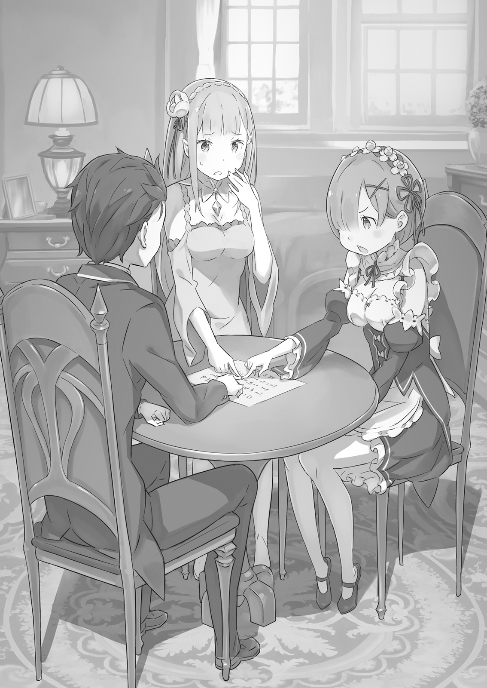

В просторном зале повисло напряжение. Все, затаив дыхание, следили за происходящим.

За столом сидело трое человек, перекидывающихся напряжёнными взглядами: Субару, на чьём лице выступал пот; Беатрис, нахмурившая свои светлые брови; Пак, чьи настороженно поднятые ушки подрагивали.

Наблюдая за этой картиной со стороны, Эмилия и Рем начали беспокоиться — в их глазах читались тревога и растерянность. Но обстановка не позволяла Субару успокоить их .

— Что-то ты бледная, Беако, — начал Субару. — Будешь так напрягаться — и любой дух сбежит отсюда без оглядки.

— И это ты-то говоришь, я полагаю? — смерила его взглядом Беатрис. — Кто тут напрягается, спрашивается? У Бетти нет ни малейшей причины горячиться, я полагаю. А у тебя самого аж ноздри раздуваются, на самом деле.

— Ну-ну, успокойтесь вы оба, — вмешался Пак, стараясь разрядить обстановку. — Это же просто игра, не нужно так заводиться.

На превентивную провокацию Субару она ответила резкой усмешкой, не вязавшейся с её детским личиком. И пока эти двое упрямо препирались, лишь Пак сохранял спокойствие, поглаживая свои усики.

— Братец прав, тут не поспоришь, я полагаю…

— Но хоть это и игра, она уже превратилась в настоящее состязание, я полагаю. Я не могу позволить себе проиграть какому-то простому человеку, на самом деле!

— Ох-ох, ну и упрямица же ты, Бетти, — вздохнул Пак. — Как насчёт такого, Субару? Может, ты проявишь благоразумие и уступишь ей?…

— Пак, — прервал его Субару.

Пак, пытавшийся урезонить их с позиции стороннего наблюдателя, умолк и недоуменно склонил голову набок.

Субару с предельно серьёзным лицом продолжил:

— …Если уж говорить об уступках, то сперва сам перестань напрягать свой хвост.

— …

— Не можешь? Значит, ты ничем не лучше нас с Беако, не так ли?

— Какой же ты неугомонный, Субару… — Пак скрестил свои короткие лапки на груди и снова вздохнул. Затем дух в обличье котёнка пронзил Субару прямым взглядом своих круглых глаз.

— …Похоже, мне тоже придётся отнестись к этому со всей серьёзностью.

Внезапно повеяло ледяным холодом всепоглощающего давления. Субару едва не отшатнулся под этим напором, но, превозмогая себя, сумел устоять и дерзко улыбнулся, глядя на двух своих противников.

— Как же так вышло… — в вихре этой бушующей решимости с горечью прошептала Эмилия, наблюдая за троицей.

Она прижала руку к груди, её прекрасные фиалковые глаза наполнились тревогой. Стоявшая рядом Рем мягко коснулась её тонкого плеча. Когда Эмилия обернулась, Рем покачала головой.

— Мы не можем их остановить. Нам остаётся лишь наблюдать.

— Но почему? Ещё совсем недавно мы так весело проводили время…

— Потому что есть вещи, которые нельзя уступить… — тихо, словно выдохнув, прошептала Рем, отвечая на скорбный вопрос Эмилии.

Эмилия удивлённо округлила глаза, а Рем, глядя на троицу за столом, кивнула.

— Наверняка у Субару-куна и остальных есть что-то, что они не могут уступить. И ради этого иногда приходится вот так бороться… Разве не бывает такого?

— И это причина, по которой они так схлестнулись?

— Рем думает, что да.

Сказав это, Рем снова обратила серьёзный взгляд на компашку у стола и больше не отводила глаз. Глядя на неё, Эмилия тоже сложила руки в молитвенном жесте и закрыла глаза.

— «Пусть всё закончится так, чтобы никто из них не пострадал».

К кому была обращена эта молитва? Если и молиться кому-то здесь, то это мог быть только…

— …Пожалуйста, Коккури-сама, — тихо воззвала Эмилия, призывая имя духа, незнакомое её ушам.

Трое — Субару, Беатрис и Пак — сидели друг напротив друга за столом. На столе перед ними лежал лист белой бумаги с начертанными на нем символами и цифрами, а посередине лежала монета.

Каждый из них касался монеты — пальцами или кончиком хвоста — и они продолжали это бесконечное противостояние взглядов.

С таким серьёзным видом и с такой искренней мольбой, что даже явившийся сюда бог был бы сбит с толку.

…А началось все это за завтраком в то утро.

— Кстати, я вот о чем подумал: а как здесь относятся к призракам и всему такому? — такой вопрос Субару задал как-то невзначай, во время непринуждённой беседы после завтрака.

Время завтрака, обеда или ужина, когда все обитатели особняка собирались вместе и могли поговорить, было весьма ценным. Именно в такие моменты обычно и поднимались важные вопросы — как, например, недавнее дело о предоставлении Рем целого выходного дня.

И этот раз не стал исключением: стоило Субару озвучить свой скромный вопрос, как все взгляды тут же обратились на него.

— Рем, Рем. Барусу опять что-то выдумывает.

— Сестрица, сестрица. В этом вся особенность Субару-куна.

— Какая ещё особенность, я полагаю? Одни только хлопоты и неприятности от него, вот и всё, я полагаю, — вздохнула Беатрис, подхватывая уже привычный обмен любезностями с сёстрами.

— А~а, похоже, ты снова придумал что-то забавное, да~а~а? — В отличие от несколько настороженной реакции девушек, персона, занимавшая почётное место во главе стола, с видимым удовольствием хлопнула в ладоши. Клоунский грим, причудливый наряд, склонность к странным высказываниям и эксцентричный характер — во всем этом человеке чувствовалась натура, отличная от обычных людей. Это был Розвааль L.Мейзерс.

— Каждое утро Субару-кун подкидывает нам свежие темы, так что скучать не прихо~о~одится. Однообразные дни мешают развитию. Застой — тягчайший грех, как меня учи~и~или.

— Да не так уж все и серьёзно, — отмахнулся Субару, — но можешь и дальше рассчитывать на мой стремительный рост.

Обменявшись этими то ли шутливыми, то ли серьёзными репликами, Субару обвёл взглядом собравшихся в столовой.

— Так вот, возвращаясь к моему вопросу: хочу поговорить о призраках. Ну, по правде говоря, я из тех, кто в них не особо-то верит. Знаете, как зритель, который всегда пропускает летние спецвыпуски про всякую жуть по телевизору.

Стоит сразу уточнить: Субару не из тех, кто боится всяких паранормальных явлений. Он, на удивление, реалист и к оккультизму относится скептически. До тех пор, пока он не увидит это своими глазами — не поверит, таков его принцип. Весьма современный взгляд для молодого человека.

— В призыв в другой мир верю, потому что это приключилось со мной. А ещё, в детстве я видел каппу, так что в них тоже верю. У грязной речки мужик с темно-зеленой кожей посуду мыл. Это же был каппа, точно вам говорю!

— Эм-м, этот… каппа? — недоуменно переспросила Эмилия, сидевшая рядом. — Я не очень понимаю, кто это… но… Вообще, Субару, что такое это твоё «призраки»?

Рассказ о встрече с каппой, в который ему никто не верил с самого детства, и в этом мире ожидаемо не произвёл фурора.

Субару понурил плечи. Эмилия же с недоумением посмотрела на него, приложила пальчик к щеке и прелестно склонила голову набок.

— Никогда не слышала про «призраков»… Это какая-то сладость?

— Сразу видно, кто ждет десерта после еды, — усмехнулся Субару. — Но ты правда не знаешь, кто такие призраки? Серьёзно? Неужели здесь совсем нет представлений о душах и тому подобных вещах?

— Призраки, каппа, ренкон… Опять слова, которые знает только Субару? — Эмилия выглядела совершенно растерянной.

蓮根 (Renkon/Ренкон) — это корень лотоса, почти что классический ингредиент в бенто.

— Ну, насчёт первых двух не уверен, а вот последнее ты точно должна была видеть в бенто, — пояснил Субару.

Эмилия все ещё выглядела озадаченной этими незнакомыми словами. Поняв, что она и вправду не имеет ни малейшего представления, о чем речь, Субару повернулся к Рем.

— Рем, а ты знаешь про призраков? Ну, которые полупрозрачные, летают в белой одежде и с треугольной штуковиной на голове.

— Нет, к сожалению, Рем тоже не знает, — вежливо ответила она. — …Если бы Рем встретила такого человека, то было бы жутко страшно.

— Согласна с Рем, — кивнула Рам. — Летающий чудак? Ха! Если ты спросонья несёшь бред, Барусу, я живо приведу тебя в чувство.

— А я вот недавно видел, как Роз-чи летал, — парировал Субару. — Как насчёт этого?

— Он потому и почитаем, что способен на то, чего простые смертные сделать не могут, — невозмутимо ответила Рам. — И ты, Барусу, тоже должен проявлять к нему уважение.

Субару только устало вздохнул, глядя на Рам, которая так бесцеремонно выгораживала хозяина, и перевел взгляд на Розвааля. Тот в ответ на его взгляд лишь пожал плечами.

— Не смотри на меня с такой надеждой, это смуща~ает, — протянул маркграф. — Ла~адно, понял. Давай я в следующий раз возьму тебя на руки, и мы полетаем вместе? Так тебя устро~оит?

— Да ничего ты не понял! — вскинулся Субару. — Разве я так смотрел?!

— Шучу-шучу, — усмехнулся Розвааль. — А если серьёзно, то «призраки» или «ренкон»… эти слова не слишком распространены в Лугунике. Насколько я знаю, их вроде бы используют в городах-государствах Карараги. Я и сам не о~очень разбираюсь, но, кажется, пару раз слышал.

— Понятно, значит, это слово из Карараги, — Эмилия несколько раз кивнула, словно все встало на свои места. — Кстати говоря, Субару ведь всегда знает всякие странные вещи. Тогда нет ничего странного в том, что он и про Карараги знает что-то странное.

Услышав, что это была всего лишь выдумка, Эмилия с видимым облегчением вздохнула. Хотя Субару и не был уверен, хорошо это или плохо, он решил воспользоваться тем, что теперь она будет слушать его. С другой стороны, его немного смутило то, как странно она все для себя объяснила. Но он решил пока отложить это в сторону и задумался над тем, почему остальные так слабо отреагировали.

В его родном мире, верили люди в призраков или нет, само понятие было широко известно. Представления о духах предков укоренились с незапамятных времён. Мёртвые и живые, узы и души — казалось, эти понятия неразрывно связаны с концепцией жизни и смерти.

А, может, это из-за того, что здесь есть духи? — осенило его. — Если подумать, светлячки малых духов, которых видно ночью в саду, чем-то похожи на привидения…

— …? Духи — это и есть призраки? — непонимающе спросила Эмилия. — Духи — это духи, ведь так?

— Нет-нет, Эмилия-сама, — вмешался Розвааль. — То, что Субару-кун называет призраками или душами, соответствует тому, что у нас называют «пустыми».

— …

В тот же миг Субару почувствовал, как воздух буквально застыл с едва слышным треском.

От слов Розвааля Эмилия замерла, сохранив улыбку на лице. Но застыла не только она. Конечно же, Рем и Рам, и даже Беатрис, которая до этого делала вид, что её это совершенно не касается.

Субару удивлённо округлил глаза, глядя на их реакцию, и повернулся к Розваалю с вопросом:

— Э-э, так что это за… пустые?

— Говоря~ят, это сущности, чьи души после смерти остались в мире живых из-за сильных чувств или сожалений, не вернулись к Од Лагуне и продолжают скитаться в этом мире… как-то та~ак.

— А, так это же самые настоящие призраки! — осенило Субару. Он удовлетворенно выдохнул — объяснение Розвааля все расставило по местам.

— Понятно, значит, их здесь называют пустыми.

Однако, в отличие от двух мужчин, которые пришли к взаимопониманию, среди девушек пробежала волна сильного волнения. Особенно побледнела Эмилия. Её тонкие пальцы задрожали и осторожно коснулись плеча Субару.

— С-Субару, те призраки, о которых ты говорил… это были пустые…?

— Похоже на то. Но зато теперь все ясно. Хотя это ничего особо не меняет.

— Если ничего не меняет, зачем ты вообще заговорил о пустых?! — воскликнула Эмилия. — Это странно! Должна быть причина… Я поняла! Субару, ты видел пустого! Ты видел его в особняке! Поэтому ты вдруг и заинтересовался ими! О нет, зачем я сказала это вслух?! Если бы я не догадалась, то жила бы и не знала! Ужасно! Субару, ты дурак! Ужасно, ужасно! Субару, ты сам боишься пустых, поэтому хочешь и нас затащить в это?!

— Эмилия-тан, у тебя просто невероятная паранойя!!

Эмилия заговорила быстро, не в силах сдержать эмоции, и принялась сильно трясти Субару за плечи. Удивленный её напором, Субару постарался мягко улыбнуться ей.

— Все в порядке, успокойся! Если бы я и решил втянуть кого-то в свои оккультные дела, то Эмилия-тан была бы последней. Первой жертвой я бы точно выбрал Беако!

— Почему это Бетти должна быть первой, не понимаю, я полагаю?! — возмутилась Беатрис.

— Правда? — переспросила Эмилия, всё ещё дрожа. — Точно-точно правда? Ты сначала выберешь Беатрис?

— Ты что такое говоришь под шумок?! — закричала Беатрис. — Вы оба хотите, чтобы вам преподали урок, я полагаю?!

— Да, я не согласна! — вмешалась Рем. — В любой ситуации Субару-кун должен в первую очередь полагаться на Рем! Беатрис-сама тут ни при чём!

— Почему Бетти должна выслушивать такие оскорбления?! Гр-р-р-р, я полагаю!

Эмилия, растерявшись, начала нести околесицу, Беатрис шумела без умолку, а тут ещё и Рем предложила свою кандидатуру — обсуждение окончательно превратилось в балаган.

В разгар этого хаоса Эмилия посмотрела на Субару влажными от слез глазами.

— Может быть… Субару, ты много знаешь о пустых? Ну, всякие… страшные истории. Как про звезды.

— Вовсе нет, — отмахнулся Субару. — Я знаю разве что про госпожу Окику из Банте Сараясики, которая оставила сожаление, разбив тарелку, про Госпожу Оиву, которая взбесилась от обиды на мужа-предателя, про Безухого Хоити, которому забыли написать сутры на ушах, и их ему оторвали…

Субару упомянул три довольно известных в Японии рассказа, и, если вам интересно, почитать про Госпожу Окику из Банте Сараясики можете здесь — Читать , Госпожу Оиву здесь — Читать , и про Безухого Хоити здесь — Читать .

— Ава~ва, ава~ва~ва! — залепетала Эмилия, бледнея ещё сильнее.

— Субару-ку~ун, — вмешался Розвааль. — Эмилия-сама сейчас упадёт в обморок, давай на это~ом закончим, хорошо~о?

Вид испуганной Эмилии показался Субару таким милым, что он невольно увлёкся. Розвааль пожурил его, и Субару, криво усмехнувшись, мягко похлопал Эмилию по плечу.

— Шучу, шучу. Я никогда не видел пустого в этом особняке, и мои странные переживания в жизни были всего раз… ну, не совсем раз, но с пустыми они точно не связаны.

— Н-но, Субару… ты же говорил про каппу и ренкон!

— Каппа — это мужик с нездоровым цветом лица, который живёт в реке, а ренкон — это вообще овощ, — терпеливо повторил Субару, мысленно извиняясь перед своим детским воспоминанием. Сейчас Эмилия была куда важнее.

Его усилия успокоить её не прошли даром, и паника Эмилии постепенно прекратилась. Когда она немного пришла в себя, то покраснела и сказала:

— Знаешь, Субару, мне кажется, ты немного неправильно понял. Я… я совсем не боюсь пустых. Просто… они мне немножко неприятны.

— Уж не огромное ли это «немножко»?

— Немножко — это немножко! — надулась Эмилия. — Ну всё, Субару — дурак, задира!

Конечно, её слова звучали неубедительно. Субару принялся успокаивать все ещё сердитую Эмилию и повернулся к Рем и Рам.

— Кстати, у вас двоих тоже лица были напряжённые. Может быть?…

— Что «может быть»? — резко оборвала его Рам. — Без подлежащего непонятно. Барусу, ты так плохо задаёшь вопросы, что упустил свой шанс из-за собственной глупости. На этом разговор окончен.

— Но если ты так явно уходишь от ответа, всем же понятно, что тебе эта тема неприятна!

Рам, которая была раза в три язвительнее обычного, цыкнула в ответ на его замечание. Рем мягко вышла вперёд, словно защищая сестру, и покачала головой, глядя на Субару.

— Нет, Субару-кун. Сестрица не боится пустых. Просто… с противником, по которому нельзя попасть ударом, сложно иметь дело… Рем тоже так считает.

— То есть вы считаете их неприятными из-за боевой мороки?! — поразился Субару. — Зачем вообще рассматривать их с точки зрения боя?!

— Сражаться, чтобы защищать — это долг Рем и сестрицы, — серьёзно ответила Рем. — Всё в порядке. Даже если появится пустой, Рем будет защищать Субару-куна ценой своей жизни.

— Это был просто гипотетический разговор, почему все свелось к такому?! — простонал Субару.

Лёгкая беседа каким-то образом переросла в обсуждение смертельной решимости. В отличие от Эмилии, которая боялась пустых концептуально, неприязнь Рем и Рам была лишена всякой миловидности.

— Значит, Беако с таким кислым лицом сидит тоже потому, что боится? — повернулся Субару к Беатрис. — Ночью одна в туалет ходишь?

— Когда ты уже перестанешь обращаться с Бетти как с маленькой девочкой, я полагаю? — нахмурилась Беатрис. — И вообще, с какой стати Бетти должна бояться таких неопределённых вещей, как пустой, я полагаю?

— Тогда почему ты такая раздраженная? Что-то в зубах застряло?

— Не пытайся разозлить Бетти такими глупыми причинами, я полагаю! — фыркнула она. — …Бетти не любит пустых потому, что само их существование бросает тень на истинно благородных существ, я полагаю!

— Истинно благородных?… — задумался Субару. — А-а-а, вот оно что.

Поняв причину раздражения Беатрис, Субару кивнул.

— И правда, духи и призраки по атмосфере чем-то похожи. Твоё недовольство понятно.

— Меня бесит, что из-за каких-то пустых, чьё существование вообще под вопросом, принижается статус всех духов, я полагаю! — Беатрис недовольно скрестила руки на груди, её гордость была явно задета.

Субару и самому это пришло в голову: наверняка бывали случаи, когда духов и пустых путали. Более того, разве он один считал, что если существуют духи, то и призраки вполне могут быть?

— …! Так значит, Пак — это пустой?! — снова запаниковала Эмилия. — О нет! А я ему верила!

— По зову явился, ня-ня-ня-ня-ян! — внезапно материализовался Пак.

— …А? Лия, что случилось? Почему у тебя такое заплаканное лицо? Кто тебя обидел?! Я его сейчас накажу!

— Это всё из-за тебя, Пак! — всхлипнула Эмилия.

— Черт, я дурак, дурак! Так лучше? — Пак стукнул себя лапкой по голове.

Снова впавшая в панику Эмилия разыгрывала с материализовавшимся Паком какую-то странную сценку.

Если уж даже Эмилия, опытный заклинатель духов, так реагирует, то насколько обычные люди способны отличить духа от пустого? Хотя, велика вероятность, что Эмилия просто чрезмерно пуглива.

— Однако, удивительно, что всем вам не нравятся пустые, — заметил Субару. — Хотя причины у всех, похоже, разные.

— Возможно, наше восприятие пустых отличается от твоего понимания призраков, — сказал Розвааль. — По крайней мере, в нашем представлении пустые не являются дружелюбными к живым существами. Движущиеся трупы на поле боя, злые мысли, проклинающие живых… таких примеров немало.

— Движущиеся трупы и проклятия… — пробормотал Субару. — В мире с магией это всё звучит совсем не как шутка.

Он и сам испытал на себе действие проклятия. Слова Розвааля заставили его содрогнуться и Субару снова оглядел встревоженные лица девушек. От мирной атмосферы завтрака, царившей здесь всего несколько минут назад, не осталось и следа. Его легкомысленная болтовня о пустых разрушила её вдребезги.

Расходиться вот так, оставив неприятный осадок, было бы неправильно.

Поэтому…

— …Ладно, у меня есть предложение! — Субару вскочил со стула, оттолкнув его, и ткнул пальцем в потолок. Все удивлённо уставились на него. Субару покрутил вытянутой рукой и продолжил: — Кажется, возникло небольшое недоразумение, но я завёл разговор о пустых не для того, чтобы вас напугать. Прежде всего, поймите это.

— Тогда… истории про госпожу Кику из Банте-ясики, госпожу Ива и господина Ренкона?… — неуверенно спросила Эмилия.

— Забудь ты уже про них и, ради всего святого, про овощ тоже! Это была ошибка, всего лишь выдумка!

Услышав, что это была всего лишь выдумка, Эмилия с видимым облегчением вздохнула. Субару не стал задумываться, хорошо это или плохо, а решил воспользоваться тем, что она теперь была готова его слушать.

— Так или иначе, это всего лишь выдумка… — повторил он, — Но нехорошо, если всё закончится тем, что я вас просто напугал и расстроил. Тогда я просто буду плохим парнем!

— А разве это не очевидно уже сейчас, я полагаю? — фыркнула Беатрис. — Одними россказнями про пустых тут уже ничего не исправить, на самом деле.

— Эту твою предвзятость, Беако, я сейчас и исправлю! — Субару решительно ткнул в неё пальцем. — С помощью призыва духов!

— При-зыв ду-хов? — переспросила Эмилия.

Тут Субару использует японское: «Корэй-дзюцу», поэтому-то Эмилия незнающая японского и переспросила.

Субару показал большой палец насмешливо фыркнувшей Беатрис и громко объявил это, заставив Эмилию непонимающе склонить голову набок. Увидев вопросительный знак, повисший над ней из-за незнакомого слова, Субару усмехнулся, скривив губы.

— Да, призыв духов! На моей родине это пишется как «Корэй-дзюцу». «Рэй» — это как в слове «юрэй»! То есть призыв духов — это ритуал для вызова пустого!

— !?

От столь внезапного предложения Субару все разом изменились в лице.

— Вызвать пустого?! Такое возможно?! — воскликнула Эмилия.

— Всегда есть лазейки и тайные приёмчики, Эмилия-тан, — подмигнул Субару. — Почему бы не попробовать, решив для себя, что это обман и проверить, правда ли они существуют?

— Но тогда получается, что меня в любом случае обманут?

— Вы уверены, что это безопасно? — Вместо растерянной Эмилии вперёд решительно шагнула Рем и настойчиво обратилась к Субару. — Не случится ли чего-нибудь ужасного?

— Пустые — это злые сущности, так принято считать, — продолжала она. — Рем не хочет сомневаться в Субару-куне, но если вдруг что-то случится…

— Ну погоди, — остановил её Субару. — Что самое страшное в пустых и призраках? То, что они непонятны, верно? Если мы вытащим их с помощью призыва духов, то узнаем их суть, и страх уменьшится вдвое — вот в чем расчёт.

— Даже если страх уменьшится вдвое, страшное всё равно останется страшным, я так думаю! — твердо заявила Рем.

— Рем, а ты, оказывается, довольно сильно боишься? — заметил Субару.

Хотя по лицу Рем этого и не было заметно, возможно, она и впрямь была напугана. Она поддерживала дрожащую Эмилию за плечо, но начало казаться, что, утешая её, она на самом деле пыталась скрыть собственную неуверенность.

— Хмф, иногда даже ты способен сказать что-то дельное, я полагаю, — неожиданно раздался голос Беатрис.

— Ого, какая неожиданная поддержка! — удивился Субару. — Ты согласна со мной, Беако?

Удивленный столь неожиданным голосом «за», Субару увидел, как Беатрис скрестила руки на груди и усмехнулась.

— Раз уж так вышло, у Бетти тоже накопилось немало претензий к этим пустым, на самом деле. Если этот ваш призыв духов может их вызвать, целыми они не уйдут, я полагаю!

С воинственным видом Беатрис горела энтузиазмом по поводу призыва духов.

Как бы то ни было, видя, что никто всерьёз не возражает, Субару наконец посмотрел на Розвааля. Клоун, за которым было решающее слово, в ответ на взгляд Субару великодушно развёл руки в стороны.

— Хорошо~о. Делай что хочешь. Честно говоря, мне и самому интересен этот призыв духов, вызывающий пусты~ы~ых. Я бы непременно хотел на это посмотре~еть.

— Вот это по-нашему! Как и ожидалось от Роз-чи, ты всё понимаешь! — обрадовался Субару.

Получив разрешение от понятливого хозяина, Субару ликовал так, будто его заветное желание исполнилось.

— Итак, готовимся к призыву духов! Да не бойтесь, ничего сложного делать и готовить не придётся. Нужна только большая белая бумага, перо и одна монета.

— Как-то подозрительно дёшево, — заметила Рам.

— Простота и доступность — вот главная фишка этого моментального призыва духов! — объяснил Субару. — На моей родине, говорят, он одно время был безумно популярен, знаешь ли?

— На родине Субару играют с пустыми? Какие же там все смелые… — восхищённо пробормотала Эмилия.

Неопределённо улыбнувшись Эмилии, которая прониклась странным восхищением, Субару опустил подробности.

Вероятно, рассказ об истории популярности этого ритуала снова напугал бы Эмилию. Ведь ходили слухи, что этот призыв духов имел порой чересчур серьёзные последствия, оставил шрамы в сердцах многих юношей и девушек и даже был запрещён.

Имя этому ритуалу на родине Субару было такое:

— Отныне объявляю Первую Игру в «Коккури-сан» в Особняке Розвааля открытой!

— Призванный Коккури-сан не может говорить, — начал объяснять Субару, расстилая на столе белый лист бумаги. — Поэтому нам нужно самим подготовить способ общения с ним.

— Поэтому нужна бумага и перо? — робко спросила Рем, сжимая в руке свой моргенштерн. — Чтобы общаться с Коккури-сама письменно…?

Редко когда можно было увидеть её вооружённой во время мирной жизни в особняке.

Иными словами, для Рем это, очевидно, была боевая готовность к непредвиденным обстоятельствам. Она была полностью готова разнести вдребезги появившегося Коккури-сана.

— Вызывать его, чтобы потом избить… это же кощунство какое-то… — вздохнул Субару. — К сожалению, Коккури-сан невидим. И пером пользуюсь я, а не он. Вот так, чирк-чирк…

Он начал выводить символы на бумаге.

— Какие корявые И-глифы, — заметила Рам. — Сразу видно, что ежедневные занятия не идут тебе впрок.

— Отстань, сестрица! Главное, чтобы читалось.

Возражая Рам, которая из-за настороженности была язвительнее обычного, он невозмутимо продолжал выводить символы на белом листе. По порядку, все И-глифы, соответствующие хирагане в этом мире.

— Наконец, добавляем графы для цифр и «Мужчина», «Женщина», — комментировал он свои действия. — И нельзя забывать про врата, через которые Коккури-сан будет входить и выходить.

Аккуратно выведя И-глифы, добавив цифры от 0 до 9, обозначения пола, варианты «Да» и «Нет» и, наконец, нарисовав между ними врата-тории, он завершил приготовления.

— Эмилия-тан, одолжи монетку.

— Да, только не трать зря, хорошо? — ответила Эмилия, протягивая ему монету.

— Прямо-таки слова альфонса, — прокомментировал Пак.

Проигнорировав нелицеприятное замечание духа-кота, Субару положил золотую монету, полученную от Эмилии, на изображение врат-тории. Затем он кивнул Эмилии и Рем, и все трое заняли свои места.

— Прежде чем начнём, несколько правил, — серьёзно сказал Субару.

— Во-первых, мы втроём сейчас положим указательные пальцы на эту монету, но ни в коем случае не отрывайте палец до самого конца, иначе случится что-то ужасное.

— Д-да, поняла, — кивнула Эмилия. — Не отрывать палец… Может, заморозить его?

— Давай лучше постараемся сознательно, а не будем физически его примораживать, — предложил Субару. — Ещё: Коккури-сан — это тот тип пустых, который отвечает на наши вопросы, но он очень щепетилен насчёт правил. Если не следовать процедуре, он рассердится, так что, пожалуйста, делайте всё по моим указаниям.

— Рассердится… — задумчиво повторила Рем. — Значит, это и будет удобный момент! Кажется, Рем поняла, чего Субару-кун от неё ожидает.

— А мне кажется, ты не поняла! — поспешно возразил Субару, — Так что любые опасные действия категорически запрещены, ясно?!

Он почувствовал беспокойство, глядя на бледную, но серьёзную Эмилию и на Рем, в чьих светло-голубых глазах горел боевой дух. Но вокруг были полная враждебности Беатрис и Рам, чей агрессивный настрой лишь нарастал. Розвааль и Пак вели себя как обычно, но именно поэтому вряд ли могли служить опорой.

Вообще, не было никакой причины так упрямиться из-за этого Коккури-сана, но…

— Именно потому, что она разгорается из-за пустяков, мальчишеская романтика неисправима… — пробормотал Субару себе под нос.

— Хватит нести чушь и начинай уже, я полагаю, — поторопила его Беатрис. — Давай, живее, я полагаю!

Услышав насмешку в ответ на своё циничное замечание, Субару собрался и протянул палец к монете. Эмилия и Рем последовали его примеру, и три пальца легли на золотую монетку.

Лёгкое напряжение нарастало, и, пока все затаили дыхание, ритуал начался…

— …Коккури-сан, Коккури-сан, пожалуйста, приди, — произнес Субару с решимостью, будто читая заклинание. — Если ты здесь, пожалуйста, передвинься на «Да».

От этих слов пальцы Эмилии и Рем напряглись. Но монета не шелохнулась. Глядя на неподвижную золотую монетку, Субару смочил пересохшие губы и повторил:

— Коккури-сан, Коккури-сан, пожалуйста, приди. Если ты здесь, пожалуйста, передвинься на «Да».

Он произнёс фразу ещё раз. Но снова ничего не произошло.

Естественно, от такого результата атмосфера в зале разрядилась. Участвующие в ритуале Эмилия и Рем облегчённо выдохнули, а из-за спины послышались разочарованные вздохи. Учитывая высокие ожидания, Беатрис, должно быть, вне себя от ярости.

…Именно в тот момент, когда он так подумал…

— …Ах! — вскрикнула Эмилия от удивления.

Рем, широко раскрыв глаза, потеряла дар речи. Субару тоже затаил дыхание.

Потому что монета под их тремя пальцами медленно двинулась к слову «Да» .

— П-пожалуйста, вернитесь на позицию врат-торий! — поспешно вспомнил Субару следующую инструкцию, поймав умоляющие взгляды девушек.

В ответ на его слова монета вернулась с «Да» на место врат, и Субару окончательно убедился в успехе призыва духов.

Считалось, что это либо проделки призрака, либо отражение подсознания участников, но, так или иначе, первый шаг ритуала был пройден. Теперь Коккури-сан должен был показать себя во всей красе.

— Т-так, хорошо, он явился! — сказал Субару. — Если мы сейчас будем задавать вопросы, Коккури-сан должен ответить почти на всё. Вы двое, хотите что-нибудь спросить?

— С-Субару, покажи сначала пример? — попросила Эмилия.

— …Да, думаю, так будет лучше, — согласилась Рем. — Рем пока ещё не видит пустого.

Одна откровенно боялась, другая путала ритуал с охотой на призраков. Поскольку обе отказались от права первого вопроса, Субару немного подумал и спросил:

— …Коккури-сан, вопрос. Эмилия-тан ведь боится пустых, правда?

— Субару?! — возмущенно воскликнула Эмилия, но монета двинулась быстрее её слов.

Монетка скользнула на слово «Да» , раскрывая истинные чувства Эмилии — впрочем, и так очевидные для любого человека.

— Спасибо. Коккури-сан, пожалуйста, вернитесь к вратам, — удовлетворённый результатом, попросил Субару, и монета плавно вернулась на изображение тории. Такова была последовательность действий в игре Коккури-сан.

— Вот так это работает, — пояснил Субару. — Теперь просто повторяем вопросы и ответы, стараясь не обидеть Коккури-сана… Эмилия-тан, что это за взгляд?

— Я-я не боюсь, так что ответ на предыдущий вопрос был неправильный, я-я так думаю! — запротестовала Эмилия. — И сейчас, наверняка, это ты двигаешь палец, Субару! Меня не обманешь!

В ответ монета скользнула на слово «Нет» .

— Кья-я?! — взвизгнула Эмилия.

Коккури-сан безжалостно разбил её милое упрямство. Взвизгнув, Эмилия съёжилась и тоненьким голоском прошептала:

— Простите…

— …Коккури-сама, — внезапно вмешалась Рем, которая до этого лишь наблюдала за процессом. С поразительным хладнокровием она задала свой вопрос:

— Что сегодня будет на ужин, мясо или рыба?

Монета заскользила по И-глифам и остановилась на буквах, складывающихся в слово: «Мясо» .

Поблагодарив Коккури-сана за ответ, Рем повернулась к Субару и Эмилии.

— Я думаю, ответу Коккури-самы можно доверять. На кухне нет рыбы, значит, ужин будет мясным… И об этом должна была знать только Рем.

— Э?… Так это… это же потрясающе, да? — осознав смысл вопроса Рем, Эмилия прикрыла рот свободной рукой, выражая удивление. Её фиалковые глаза изумлённо моргали. Она уставилась на монету и сказала:

— Коккури-сан, ты такой удивительный! Я так поражена!

Монета снова пришла в движение: «Не стоит благодарности» .

— Прости, что сомневалась в тебе, — продолжала Эмилия. — И ты так вежливо с нами разговариваешь…

Монета ответила: «Обычное дело» .

— Правда? Обычное дело?… Но ведь когда тебя неправильно понимают, это так грустно. Поэтому я все равно прошу прощения. Я тоже буду осторожнее.

Монета проехала по буквам: «Всё в порядке» .

— Разве Коккури-сан может так запросто болтать?! — изумился Субару.

В ответ на раскаяние Эмилии поведение Коккури-сана стало невероятно непринуждённым. Всё это время монета резво скользила по бумаге, и, несмотря на тёплую атмосферу беседы, само зрелище выглядело довольно странно.

Как бы то ни было, Эмилия, похоже, совершенно доверилась Коккури-сану, и выражение её лица изменилось — страха перед пустыми как не бывало.

Наблюдая за этим трогательным общением с чем-то неведомым, Рем, казалось, тоже постепенно усмиряла свой боевой настрой.

— Эмилия-сама, можно Рем тоже поговорит с Коккури-сама? — спросила она.

— Ах, прости, пожалуйста! — спохватилась Эмилия. — Коккури-сан, поговоришь и с Рем тоже?

Монета скользнула к буквам: «Ладно».

— Он ответил «Ладно», а не «Да»! — воскликнул Субару.

В этом ритуале Коккури-сан был уже не почётным гостем, а скорее четвёртым участником.

Это разительно отличалось от того, что Субару знал по слухам. Неужели Коккури-сан в ином мире был именно таким? Слишком уж это не походило на жуткие истории о японском Коккури-сане.

— Субару-кун доволен той едой, что Рем готовит для него каждый день?

— «Очень даже».

— Субару-куну нравится работать в особняке? Ему не тяжело?

— «Приятная усталость».

— Субару-кун и сестрица ладят друг с другом?

— «Противоположность ненависти — безразличие».

— Субару-кун…

— Эм, Рем? Если тебя интересуют такие вещи, не обязательно спрашивать через Коккури-сана. Можешь спросить у меня напрямую, я отвечу.

— Нет, напрямую спрашивать слишком стыдно…

— Формально это косвенный вопрос, но на деле — ничуть!

Что именно так смущало Рем, Субару не понимал, но и покладистость Коккури-сана была на высоте. Впрочем, раз уж любопытство Рем было удовлетворено, на этом, пожалуй, можно было и закончить.

— Что ж, как ни жаль расставаться, но придётся попрощаться… Коккури-сан, большое вам спасибо. Можете возвращаться.

— Спасибо вам большое. Приходите поговорить ещё!

— Молимся, чтобы ваш обратный путь был безопасным и беспрепятственным.

Получив прощальные напутствия от формалиста-Субару и принявших невероятно торжественные позы Эмилии и Рем, монетка плавно заскользила к тории. В тот же миг доселе витавшее в зале гнетущее ощущение исчезло, и все поняли: Коккури-сан ушёл.

— Вот как-то так. Ну как вам? Коккури-сан ведь оказался не страшным пустым, правда?

— Да, я так удивилась. Я его не видела, но он правда был здесь. Может, это дух… но вроде и не похоже…

— Наско~о~олько я мог судить, никакого вмешательства в ману не было~о~о. Удивительно, но, похоже, нам продемонстрировали всё величие искусства призыва ду~у~ухов.

Розвааль, молча наблюдавший за окончанием ритуала, восхищённо кивнул. Получив одобрение от сильнейшего мага в королевстве, Субару преисполнился гордостью за Коккури-сана, словно за самого себя.

— И это не проделки духа. Будь это дух, мы с Лией точно бы заметили. Бетти, а ты что почувствовала?

— …Я этого не признаю, я полагаю. Само существование какого-то пустого — это оскорбление для духов, я полагаю.

— Бетти?

На вопрос Пака Беатрис ответила голосом, полным тихого негодования. Не обращая внимания на округлившего глаза Пака, она решительно подошла к столу.

— Уступи-ка место, младшая из сестёр. Бетти разоблачит этот обман, я полагаю.

— Постой, Беатрис, что ты такое говоришь? Никакого обмана здесь нет! — пролепетала Эмилия.

— «Обман»… Давно не слышал такого словечка… Но это ладно, ты что, сомневаешься в Коккури-сане? Тогда как ты объяснишь то, что было только что? — возразил Субару.

— А ну-ка молчи, я полагаю. Или ты боишься, что Бетти раскроет всю правду? Что ж, тогда ничего не поделаешь, я полагаю.

— …А вот это уже обидно. Смотри не разревись потом, лоли со свёрлами.

Рем уступила место Беатрис, а Субару снова сел на своё место. Увидев это, Беатрис впилась взглядом в Эмилию.

— Ты тоже поменяйся с братцем, я полагаю. Какой смысл, если будет участвовать кто-то со стороны Коккури? Мы с братцем вдвоём блестяще разоблачим эту ложь, я полагаю.

— Что ещё за «сторона Коккури»? И как Пак вообще будет участвовать?

— Хвостом можно?

— …А-а, ладно. Понял. Давай, участвуй хвостом.

Подлетевший Пак завис над столом и, вытянув свой длинный хвост, положил его на монетку. Субару и Беатрис последовали его примеру. Получилось немного несуразно, но к началу ритуала всё было готово.

— Субару…

— Всё в порядке, Эмилия-тан. Просто смотри. Я защищу Коккури-сана…

— Да, я верю в тебя.

Прижав руку к груди, Эмилия с молитвенным видом кивнула Субару. Проводив её взглядом, тот сделал глубокий вдох и сосредоточился на нарисованных на бумаге тории.

— Итак, приступим ещё разок, — сказал Субару. — Надеюсь, это не перебор.

— Коккури-сан, Коккури-сан! — вновь начал он ритуальный призыв. — Простите, что снова беспокоим, но если вы здесь, пожалуйста, передвиньтесь на «Да»… Ого, как быстро!

Монета мгновенно скользнула на «Да» .

Затем она продолжила движение: «Слишком часто зовёте» .

— Понимаю, вы, наверное, сердитесь, — заискивающе проговорил Субару. — Едва вернулись, а вас тут же опять вызывают — конечно, тут кто угодно разозлится. Простите!

Субару униженно склонил голову перед нескрываемым недовольством, сквозившим в этом послании. Зато двое новичков, впервые столкнувшихся с Коккури-саном, изумлённо выпучили глаза.

— По крайней мере, я его точно не двигал, — пробормотал Пак. — Бетти?

— …И Бетти не стала бы заниматься таким бесстыдством, я полагаю, — фыркнула Беатрис. — Ну и ладно. Если он здесь, значит, он здесь. Просто размажу его по стенке, и всё, я полагаю.

Монета снова задвигалась: «Нелепо» .

— Это он тебе, Беако.

— Гр-р-р-р, я полагаю!

Похоже, первый раунд остался за Коккури-саном.

Успокоился ли он после того, как его вызвали второй раз подряд, или нет, но монета двинулась к фразе «Задавайте вопросы», показывая готовность отвечать. Всё это время монета резво скользила по бумаге — Коккури-сан был явно непоседлив.

— Давай, Беако, задавай вопрос, — подтолкнул её Субару. — Выясняйте отношения.

— Научи-ка, как стереть тебя с лица земли, я полагаю? — язвительно спросила Беатрис у монеты.

— Ты что, такая грубая с самого начала?! — возмутился Субару. — Такое позволено спрашивать только той скрепке-помощнику из старого Ворда, которая вечно вылезала без спроса!

Коккури-сан ответил: «Хм-м, дай-ка подумаю…»

— Да он ещё и садист по отношению к Беако!

Коккури-сан нанёс мощный контрудар Беатрис, которая сама же и начала провокацию. Похоже, даже Коккури-сан разглядел в покрасневшей Беатрис прирождённую жертву для поддразнивания.

— Тогда спрошу я, — вмешался Пак. — Что Лия думает обо мне?

Монета ответила: «Хлопотный папаша» , а затем добавила: «Иногда мамаша» .

— Хе-хе-хе, забавно, — усмехнулся Пак. — А что я думаю о Лии?

Ответ: «Хлопотная милая дочурка» , и снова: «Иногда мамаша» .

— Вы что, оба иногда думаете друг о друге как о мамаше? — не удержался Субару.

Пак загадочно улыбался, а Эмилия отчаянно мотала головой, отрицая это.

Странные у них были отношения отца и дочери, но проницательность Коккури-сана была поразительна.

— Хмф, — фыркнула Беатрис. — Тогда пусть скажет, что Братец думает о Бетти, я полагаю!

Ответ: «Кэйго» .

— …? Что значит «Кэйго»? Он думает «Кэйго»?… — не поняла Беатрис.

Монета уточнила: «Используй кэйго» .

敬語 (Кэйго) — вежливый стиль японской речи, который используют к почтенным людям.

— Почему он с самого начала так строг только к Бетти, я полагаю?! — вскричала она.

То ли Коккури-сан окончательно разозлился, то ли, наоборот, проникся к ней особой симпатией, но его отношение к Беатрис было явно предвзятым.

Последующие вопросы Беатрис он ловко обходил, и девочка, которая ещё недавно была полна боевого задора, совсем сникла.

Как бы то ни было, после такого противостояния даже Беатрис вряд ли могла сомневаться в существовании Коккури-сана. В некотором смысле цель была достигнута. Значит, пора бы уже попросить Коккури-сана удалиться…

— Ах, Субару-кун, можно последний вопрос? — внезапно подняла руку Рем.

— М? Что такое, Рем, ты тоже хочешь что-то спросить? Вообще-то, вопросы Коккури-сану могли задавать только участники ритуала. Не рассердится ли он?

Монета тут же ответила: «Давай, валяй» .

— Он не только не сердится, но ещё и такой решительный! — удивился Субару.

— Ладно, Рем, спрашивай.

— Тогда, без стеснения, — кивнула Рем. — …Дело в том, что в последнее время запасы майонеза по ночам стали уменьшаться. В чем может быть причина?

В тот миг, как прозвучал этот невинный вопрос Рем, монета, до этого легко скользившая по бумаге под управлением Коккури-сана, замерла. Монетка остановилась на изображении врат-тории и, под пальцами троицы, начала мелко дрожать, не сдвигаясь с места.

— …

Трое участников за столом затаили дыхание и уставились друг на друга. Эмилия и остальные наблюдатели были в замешательстве.

…И таким образом, история вернулась к сцене, описанной в самом начале.

Изо всех сил вцепившись в монету, троица настороженно следила за действиями друг друга.

От холодного прикосновения по кончикам пальцев передавалось отчётливое ощущение: монета вот-вот рванётся к правильному ответу. Но в этот раз позволить ей назвать правду было никак нельзя.

Майонез, хранящийся в особняке Розвааля, был той самой приправой, которую Субару, будучи её ярым фанатом, воссоздал в этом мире, а Рем теперь ежедневно с любовью готовила и оставляла про запас.

Качеством он, конечно, уступал майонезу из родного мира Субару, но всё равно был неотъемлемой частью его рациона.

И вот нашёлся негодяй, который по ночам этот самый майонез воровал.

…И вором этим, по правде говоря, был сам Субару. Иногда он просто не мог сдержаться и прокрадывался на кухню, чтобы тайком съесть ложечку-другую. Разумеется, он не мог допустить, чтобы это вскрылось.

— Ты вся напряглась, Беако. Пак, а что это у тебя за бицепсы на хвосте?

— У тебя у самого щёки так свело, что твоя и без того жуткая улыбка стала совсем злодейской, я полагаю. Наверняка этот ваш Коккури тоже считает это зрелище отвратительным.

— Ребята, мы ещё можем договориться. Давайте прекратим эту глупость и поговорим о чём-нибудь более конструктивном. А? Может, на пикник сходим? — предложил Субару.

Продолжая обмениваться колкостями, они, тем не менее, не ослабляли нажим на монету.

Субару давил изо всех сил, чтобы Коккури-сан не раскрыл правду, а двое других отчаянно пытались прорвать его оборону. Ещё немного, и его сделают преступником…

— Ах, монета…!

Наблюдавшая за ними Эмилия содрогнулась и проводила взглядом начавшую двигаться золотую монету. Та двигалась медленно, её ход был таким тяжёлым, будто она вот-вот прорвёт лежащую под ней бумагу. Монета медленно выводила буквы: «Б», «Е», «А», «Т»… Разумеется, двигал её Субару.

Оболгать её прежде, чем разоблачат его самого, и окончательно всё запутать. Другого выхода не было.

— Ого-го, судя по всему, преступником у нас является…

— Н-не смешно, я полагаю! А ну-ка, смотри внимательнее…!

Стоило Субару произнести это с притворным удивлением, как рука Беатрис, сопротивлявшейся ему, ярко вспыхнула. В тот же миг вокруг девочки закружился вихрь, и Субару почувствовал, как давление на монету возросло.

— Ты что, неужели!…

— Ну же, смотри лучше, я полагаю. Это движение очевидно указывает на твоё имя…

Как и сказала Беатрис, монета изменила курс и, миновав «Р», направилась к «С» и «У». Чтобы добиться этого, она наверняка использовала какую-то магию.

— Б-е-а-т-р-с-у? — спросила сбитая с толку Эмилия, прочитав буквы по порядку. Но дело принимало дурной оборот. Ещё одна буква — и имя будет составлено, а преступление Субару станет достоянием гласности.

— Но тут серые клеточки Коккури-сана заработали с новой силой!

«Серые клеточки» — знаменитая по-большей части на западе фраза Эркюля Пуаро, персонажа детективов Агаты Кристи, который часто говорил о работе своих «маленьких серых клеточек». Субару просто драматизирует момент.

— Н-неужели это, я полагаю!…

В последний момент, когда монета едва не коснулась «Б», Субару удалось направить её к «П» и «А». Если он доведёт её до последней буквы, всё будет кончено.

— Б-е-а-т-р-с-у-п-а?

— А сейчас — финиш-Коккури!

— Не позволю, Субару! Лови контр-Коккури, раз уж ты потерял бдительность!

— Бетти поможет братцу, я полагаю! Вместе мы — командный Коккури!

Пак воспользовался оплошностью Субару, который слишком торопился закончить, и вновь направил монету к «С». Беатрис тоже поднажала, и Субару оказался в глухой обороне.

Так он проиграет… В тот миг, когда он это осознал…

— «Хватит уже» .

— ?!

Монета, до этого поддававшаяся грубой силе троицы, вдруг завертелась с бешеной скоростью, отбросив от стола не только Субару, но и Беатрис с Паком.

Освободившись от их рук, монета яростно заскользила по бумаге, выводя буквы и словно отчитывая троицу за то, что они так пренебрежительно с ней обошлись.

— «От этой гнусной борьбы страдает дитя» .

— С-страдает дитя?..

— «Эмилия» .

Ошеломлённый ответом Коккури-сана, Субару обернулся.

Там, глядя на них троих полными печали глазами, стояла Эмилия. Прижав руку к груди, она, должно быть, молилась.

Она скорбела о том, что они сваливают вину друг на друга, и Коккури-сан это заметил.

— «Вспомните. Любящее сердце. Доброту. Любовь» .

— К-Коккури-сан, да что же вы за…

— «Я больше не нужен. То, что будет дальше — это ваша история» .

От этих заботливых слов Коккури-сана Субару лишился дара речи. Оставив это последнее послание, дух направился к тории. У Субару не было ни мгновения, чтобы его остановить. Атмосфера в комнате изменилась.

— …Коккури-сама, похоже, отправился домой.

Его присутствие исчезло, и Рем озвучила то, что поняли все. Она коснулась лежащего на столе листа бумаги и положила руку на нарисованные тории и золотую монету.

— Простите. Это Рем сказала лишнее и разозлила Коккури-сама.

— Н-нет, Рем не виновата. Это я во всём виноват, это мне в голову пришла дурацкая идея вызвать Коккури-сана. И ему самому только проблем доставил.

Хотя его фамильярность и удивила, Субару всё равно чувствовал себя виноватым.

А потому был лишь один способ загладить вину.

— Рем, насчёт майонеза…

— Да. В итоге мы так и не узнали, кто был преступником, но…

— Дело не в этом. Преступник…

Глядя прямо в глаза Рем, Субару низко склонил голову. А затем…

— Это я преступник.

— Это я всё сделал.

— Просто бес попутал, я полагаю.

— Что?

Три голоса прозвучали одновременно. Рем, услышав тройное признание, изумлённо округлила глаза. Но больше всех удивились сами Субару, Пак и Беатрис. Они переглянулись, ошеломлённо раскрыв рты.

Наблюдавшая за этой сценой Эмилия взяла в пальцы золотую монету и…

— Коккури-сан, Коккури-сан. Неужели ты всё это время всё знал? — с лёгкой улыбкой спросила она у молчаливой монеты.

— …Вот это был балаган, господин Розвааль.

Покинув зал, где виновники майонезного инцидента наперебой извинялись, Рам обратилась к идущему впереди Розваалю. В ответ тот лишь рассмеялся, и его плечи затряслись.

— Ну~у~у, разве это не было довольно-таки забавным зре~е~елищем? Субару-кун и впрямь интересен. Как хорошо, что он не даёт нам скуча~а~ать.

— Если будете и дальше так потакать Барусу, он скоро выкинет что-нибудь невообразимое.

— Это тоже было бы по-своему заба~а~авно… Ты ведь не рассердишься, если я так скажу, Ра~а~ам?

На слова своего жизнерадостного господина Рам ничего не возразила, лишь тихо вздохнула.

Впрочем, она никогда и не перечила мнению Розвааля. Вкладывать всю душу в исполнение желаний хозяина — в этом и заключалась её преданность. Именно поэтому…

— Как вы двигали ту монету?

— Применение магии ветра и земли~и~и. Ветром я рассеивал ма~а~ану, чтобы сбить с толку, а локальными вибрациями направлял монету. Похо~о~оже, Беатрис и Великий Дух-сама всё поняли и решили подыгра~а~ать.

Услышав этот ответ от ничуть не раскаивающегося Розвааля, Рам представила себе лица двух его соучастников.

Котёнок бы с радостью ввязался в игру, а девочка, скорее всего, согласилась бы с видом «ну раз надо, так надо».

— И всё же, последняя часть разговора показалась мне странной. Чтобы и Беатрис-сама, и Великий Дух-сама вот так дружно начали рыть себе могилу…

— Этого я не плани~и~ировал. Дело в том, что в самом конце я и сам не понимал, что происхо~о~одит.

— Что?

— Это значит, что не всё было наше~е~ей игрой. И в тот момент никакого вмешательства в ману не было. Интере~е~есно, кого же на самом деле призвал Субару-ку~у~ун? — Розвааль подмигнул ошеломлённой Рам.

Была ли это одна из его шуточек, или же он искренне наслаждался этой загадкой — не могла понять даже она.

Хорошо, если всё это было лишь розыгрышем Розвааля.

…Но что, если нет?

— Впредь проведение этого ритуала… Коккури-сана… в особняке следует запретить. Да.

Глубоко кивнув, Рам твёрдо приняла это решение.

Так, импортированный в другой мир «Коккури-сан» стал таким же табу, как и в его оригинальном мире, и в особняке Розвааля его больше никогда не проводили.

Впрочем, то, что вместо него начали призывать «Ангела-сама» — это уже совсем другая история.

エンジェル様 (Ангел-сама) — ещё одна японская игра-гадание, похожая на «Коккури-сан», но считающаяся более «светлой» и безопасной. Суть в том, что вместо духа призывается ангел-хранитель.
