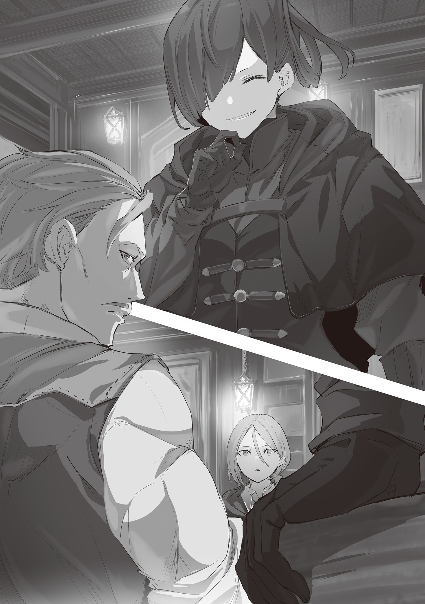
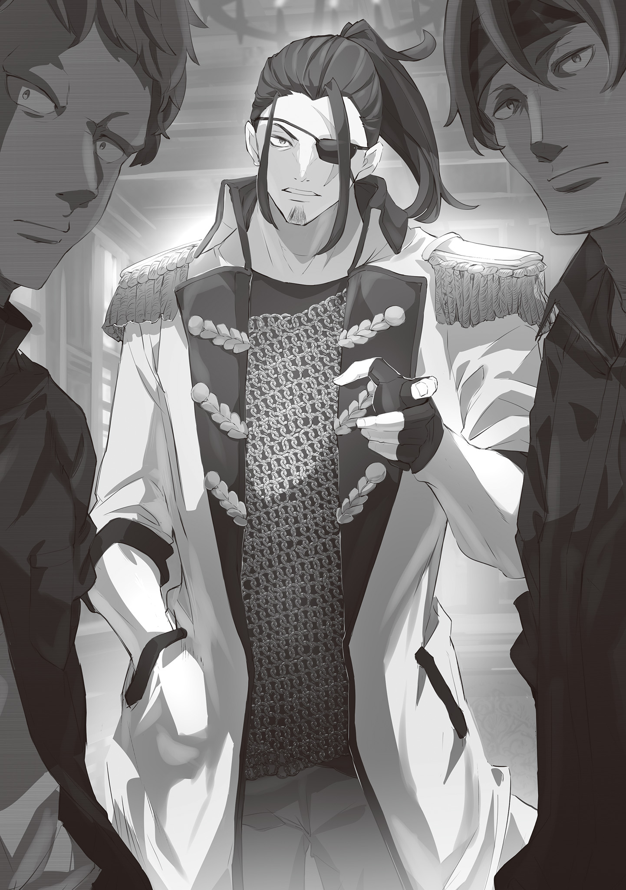
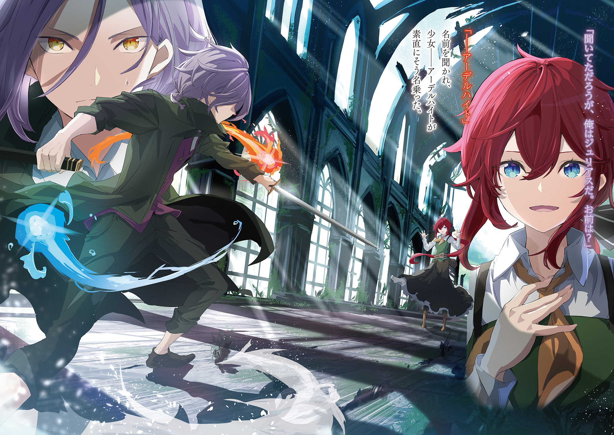
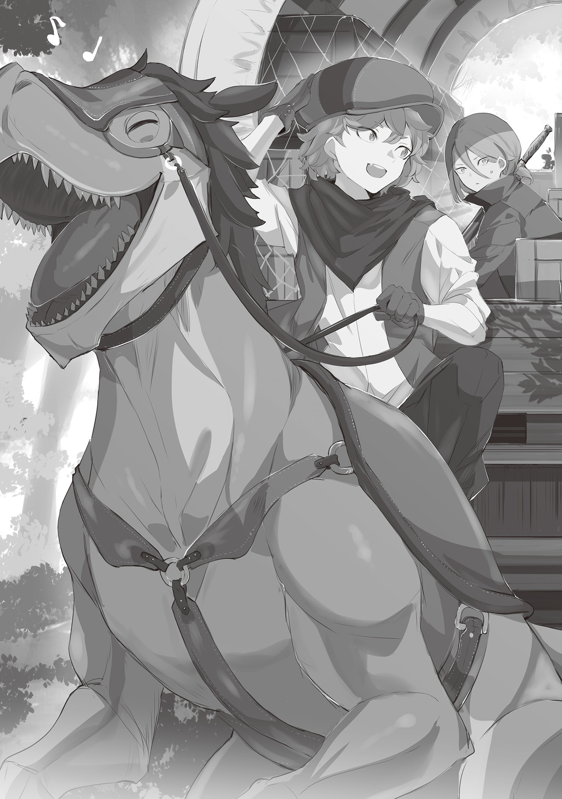
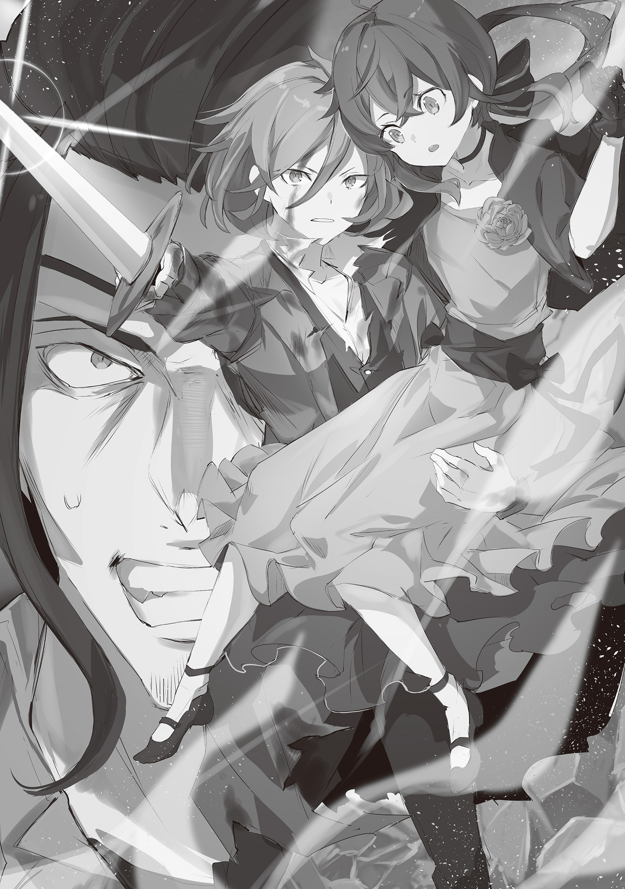

Хронологически история происходит за 5-6 лет до начала основного сюжета.

Перевод и редактура: Gradient

— Осторожно!

— Тц!

Подчинившись резкому, высокому оклику, он инстинктивно обхватил тонкую талию девушки и увернулся от смертоносной бури клинков.

В тот же миг от лезвия меча, едва не полоснувшего по шее и плечу, по его неопытному телу юноши пробежали мурашки.

Он понял, что чудом избежал смерти.

Замешкайся он хоть на мгновение — и лишился бы руки, ноги или даже головы.

— …Хорошее решение. Похоже, это не случайность?

В ответ на его испуг противник, осыпавший его ударами, насторожился.

Он понял, что его меч не достиг цели.

Более того, он явно понял, что Юлиус — серьёзный противник.

— Я так и знала, это сильный противник, — словно прочитав его мысли, сказала девушка, упавшая на пол рядом с ним — девушка с огненно-красными волосами и прекрасными голубыми глазами.

В её голосе не было дрожи. Однако по серьёзному выражению лица было видно, что и лёгкости она не испытывала. Он это заметил.

Почему?

Потому что долг рыцаря — защищать таких вот простых людей, слабых, которых сокрушают сильные.

— …Спасибо, что спасла меня. Я признателен.

— …Что ты собираешься делать?

— Разумеется, сразиться с ним лицом к лицу, со всей честью… если бы я только мог так сказать.

Лёжа на земле, он не мог ответить так же решительно, как хотел бы.

На самом деле, ему пока не хватало сил, чтобы исполнить свои желания.

Какими бы высокими ни были стремления, без способности их осуществить они ничем не отличаются от молитв, обращённых к звёздному небу.

Поэтому…

— Придётся проявить смекалку. Прошу прощения, что снова причиню тебе неудобства.

— Я совсем не против. Похоже, теперь мы в одной лодке. Ах да, только одно.

— …? Что такое?

Он разжал руки, которыми её обнимал, и они, всё ещё лёжа на грязном полу, обменялись взглядами.

Прекрасное лицо девушки, находившееся совсем рядом, озорно улыбнулось:

— Думаю, такая манера речи идёт тебе гораздо больше.

— … Это… большая честь для меня.

На мгновение он был застигнут врасплох, но ответ прозвучал искренне, а не как пустая любезность.

Если эта манера речи ему идёт, значит, даже в таком плачевном состоянии он чего-то да стоит.

С этой мыслью он потянулся к эфесу меча на поясе.

Закрыв глаза и выровняв дыхание, он на краткий миг оглянулся на пройденный путь, на всё, чего достиг, — а затем, открыв глаза, поднялся на ноги.

— Вперёд, мои бутоны!

В ответ на его зов шесть тусклых огоньков разных цветов наполнили его силой.

Прикрывая красноволосую девушку, он приготовился к своей первой битве не на жизнь, а на смерть.

— Так началась решающая битва для Юлиуса Юклиуса — тогда ещё неопытного юноши, которому однажды суждено было стать «Безупречным».

— Драконье Королевство Лугуника, — это страна рыцарей.

Юлиус Юклиус считал, что, хотя это и несколько преувеличенное заявление, оно не так уж далеко от истины.

Разумеется, во главе Королевства Лугуника стоял король и королевская семья.

Почитали и Дракона, с которым королевство с древних времён связывали узы дружбы.

Но почему же тогда, невзирая на столь почитаемых особ, страну называют рыцарской?

Потому что рыцарем, в отличие от благородных особ, особенных с рождения, может стать и простой человек.

Тот, кто закаляет себя, оттачивает мастерство и следует высоким идеалам.

Юлиус верил, что истинное восхищение вызывают те, кем стремятся стать.

Поэтому…

— Юлиус Юклиус, верно?

Услышав своё имя, произнесённое тяжёлым, строгим голосом, Юлиус выпрямился.

Он был облачён в почётную форму рыцаря Королевства Лугуника.

Белый мундир, синяя накидка… Каждое утро он смотрелся в зеркало, но так и не мог избавиться от ощущения, что форма ему велика, что он ещё не дорос до неё.

Тем не менее он чувствовал, что радость от ношения этой формы никогда не угаснет, даже когда его отражение в зеркале станет привычным.

Таковы были искренние чувства Юлиуса, ставшего рыцарем всего в шестнадцать лет.

— Ты только вступил в гвардию, но я слышал, что ты многообещающий новобранец. Говорят, весьма целеустремлённый.

Перед Юлиусом, за рабочим столом, листая разложенные бумаги, сидел крупный мужчина.

Он, казалось, с трудом помещался в кресле и смотрел на Юлиуса властным взглядом.

Хотя Юлиус ещё рос, этот мужчина был на голову выше него — а ведь Юлиус был примерно среднего мужского роста.

Мускулистый, крепко сложенный, он выглядел как воин, облачённый в броню из мышц.

Одно его присутствие излучало мощную ауру, что было неудивительно.

Ведь человек перед ним был…

— Ваша оценка слишком лестна, я недостоин такой высокой оценки, Капитан Маркос Гилдарк.

С этими словами Юлиус низко поклонился гиганту перед ним — Маркосу Гилдарку, главе Королевской Гвардии Королевства Лугуника.

Юлиус вложил в этот поклон лёгкое волнение и несомненное уважение к командующему.

Однако сам Маркос, услышав слова нового рыцаря, глубоко нахмурил брови.

— …Ясно. Как я и слышал, ты держишься молодцом.

— Капитан?

— Не обращай внимания, это я о своём. А насчёт «капитана»… ах, нет, сейчас не до этого. Ох-ох, к этому тоже придётся привыкать.

Юлиус удивлённо поднял бровь, и Маркос потёр пальцами переносицу, словно пытаясь разгладить морщины.

О чём он пробормотал вначале, оставалось только гадать, но смысл его последующего ворчания был более-менее понятен.

…Он сетовал на своё недавнее повышение до капитана Королевской гвардии.

Маркос, известный своей силой и многочисленными заслугами, был назначен на почётный пост Капитана Гвардии Королевства примерно в то же время, когда Юлиус вступил в неё — около месяца назад.

Иными словами, как и Юлиус, бывший новичком среди рыцарей, Маркос был новичком на посту капитана.

Поэтому и воздух в кабинете капитана в штабе гвардии ещё не успел пропитаться духом Маркоса.

— Однако, хоть я и новичок и не мне судить, позвольте сказать, что вы, капитан Маркос, уже обладаете всем достоинством, подобающим главе гвардии.

— Это ты хочешь сказать, что у меня старое лицо?

— Н-нет, я вовсе не это имел в виду…

— Забудь, это шутка. Хотя, наверное, слова старшего по званию не так-то просто пропустить мимо ушей.

— Спасибо за понимание.

— Вообще-то, я… то есть я тоже когда-то был новичком, как ты и другие рыцари. Было время, когда я до смерти боялся одного чертовски сильного старшего по званию.

Маркос пожал плечами, широкими, как скалы, и Юлиус тактично промолчал.

Судя по ходу разговора, последние слова вряд ли были шуткой, но звучали они именно так.

Пусть это и не бросалось в глаза, Юлиус гордился тем, что знал о Королевской Гвардии больше обычного человека.

Разумеется, он знал о Маркосе ещё до того, как тот стал капитаном, — знал о его подвигах примерно десятилетней давности, когда он только начал выделяться среди рыцарей.

Слухи о его деяниях, один другого невероятнее и ярче, напоминали древние иллюстрированные сказания.

Без сомнения, Маркос был одним из тех рыцарей, на которых Юлиус равнялся.

Поверить, что такой человек мог бояться своего начальника… невероятно.

Конечно, скорее всего, это была просто шутка, чтобы разрядить напряжение Юлиуса, но…

— Прошу прощения, но не был ли тот старший по званию Вильгельмом ван Астрея, «Демоном Меча»?

— …Удивлён. Как ты догадался?

— Я не был уверен. Просто подумал: если кто-то во времена службы капитана Маркоса в гвардии и мог сравниться с ним по славе, то кандидатов не так уж много.

Маркос слегка приподнял брови. «Так я и думал», — мысленно кивнул себе Юлиус.

Вильгельм ван Астрея, «Демон Меча», — мастер меча, чьё имя золотыми буквами вписано в историю Королевства Лугуника.

Он был капитаном Королевской гвардии за два поколения до Маркоса.

Хотя он давно покинул гвардию, его подвиги не забыты, и он по-прежнему считается великим человеком.

Вильгельм также был одним из тех рыцарей, кто разжигал пламя в сердце Юлиуса.

— Простите за дерзость, но возможность вот так беседовать с вами, капитан, да ещё и говорить о Вильгельме, одном из ваших предшественников, — это для меня большая честь.

— А по-моему, новичок, который только вступил в гвардию и уже так хорошо во всём разбирается, — это даже немного пугает. Семья Юклиус издавна славится своими рыцарями, но неужели это ваш отец, Альвиеро, вам всё рассказал?

— Нет, в таких делах очень хорошо разбирается мой младший брат. Моему вступлению в гвардию он радовался даже больше меня. Он очень надёжный брат.

— Вот как. Тогда будем с нетерпением ждать и вступления твоего брата в гвардию.

На слова Маркоса Юлиус ответил улыбкой, но уголки его бровей слегка опустились.

Ему было жаль Маркоса, чьи ожидания были полны добрых намерений, но сможет ли младший брат Юлиуса — Йешуа — вступить в гвардию, было неизвестно.

Его брат с рождения был слаб здоровьем, и хотя сейчас его состояние значительно улучшилось по сравнению с прошлым, он всё ещё время от времени слегал с дикой лихорадкой.

Юлиус считал своим долгом стараться изо всех сил и за себя, и за брата, быть настоящим рыцарем.

И если следовать этому правилу…

— Что-то мы слишком отвлеклись от основной темы.

Эта мысль пришла Юлиусу в голову одновременно с тем, как изменился тон голоса Маркоса.

Юлиус вновь ощутил первоначальное напряжение, с которым пришёл сюда, и его лицо стало серьёзным.

Как уже упоминалось, Юлиус был новичком, прослужившим в качестве рыцаря всего месяц.

Синяя накидка указывала на его принадлежность ко Второму легиону, что означало мало контактов с Маркосом, капитаном Королевской Гвардии, где собирались самые элитные рыцари, пусть они и состояли в одной организации.

Раз Юлиуса вызвали специально, на то должна была быть причина.

И эта причина…

— Согласно записям, ты не родной сын Альвиеро Юклиуса, а приёмный… До того как тебя приняла нынешняя семья, ты рос как простолюдин. Верно?

— …Да. Если вы видели записи, то ошибки нет.

— Хм.

— Однако, хоть я и приёмный сын, мой отец… Альвиеро Юклиус дал мне всё необходимое. Я могу с гордостью сказать, что я — член семьи Юклиус.

— Не торопись с выводами. Я не собираюсь цепляться к твоему происхождению и рассуждать, достоин ли ты быть рыцарем. Я же сказал: ты многообещающий новобранец.

Маркос укоризненно поднял ладонь, и Юлиус устыдился своего волнения.

Многословие — признак вины или неуверенности в себе.

Он должен был понимать, что этим позорит не только себя, но и отца, брата и всю семью Юклиус, принявшую его.

Юлиус мысленно упрекнул себя. Маркос тихо хмыкнул и сказал:

— Боевой дух — это хорошо. Но если твоё происхождение тебя как-то задевает, я хочу, чтобы ты обратил это себе на пользу.

— …Моё происхождение? Простите, я не понимаю, о чём вы.

— Да. Пора переходить к делу. Войдите.

Ответив нахмурившемуся Юлиусу, Маркос решительно стукнул по столу.

Этот звук послужил сигналом, и дверь за спиной Юлиуса отворилась.

В кабинет медленно вошёл пожилой мужчина в рыцарской форме.

Приветствуя вошедшего, Маркос кивнул подбородком в сторону Юлиуса:

— Бикрам, простите, что заставил ждать. Вот тот, кого вы просили, — Юлиус Юклиус.

— Хм…

Услышав представление Маркоса, пожилой рыцарь внимательно оглядел Юлиуса с ног до головы.

Некоторое время старый рыцарь придирчиво разглядывал Юлиуса, а затем сказал:

— Капитан, а он не слишком утончённый? Этот молокосос справится?

— Честно говоря, пока неизвестно. Но он лучше всех подходит под описанные требования. Юлиус, это…

— Бикрам Эддиц, не так ли?

— …

Юлиус резко подался вперёд и задал вопрос, заставив Маркоса и старого рыцаря изумлённо на него посмотреть.

Видя их реакцию, Юлиус положил руку на грудь и продолжил:

— Бикрам Эддиц — глава семьи Эддиц, из поколения в поколение поставляющей рыцарей, а также «Серебряный Рыцарь», дольше всех служащий в нынешней Королевской гвардии. Он командовал подавлением «Бригады Рассвета», обосновавшейся на Костульских равнинах, и ему принадлежит рекорд по самой крупной добыче на охотничьем фестивале, устроенном Его Высочеством первым принцем Забинелем на плато Хайклара…

— Эй… Эй, Маркос! Этот юнец, он что… что такое?!

— Похоже, он такой и есть. Да, и обращайся ко мне «капитан», пожалуйста.

Старый рыцарь — Бикрам Эддиц — поморщился, глядя на невольно разгорячившегося Юлиуса.

Маркос же преувеличенно вздохнул и посмотрел на Юлиуса.

— Представление, похоже, излишне, но, как ты и догадался, это Бикрам. На этот раз ты поступишь под его командование.

— Под командование Бикрама? Это большая честь.

— Ну и непредсказуемый же юнец…

Юлиус снова повернулся к Бикраму, который поглаживал свои усы с проседью, и выпрямился.

Великий наставник, много лет служивший стране в качестве королевского рыцаря…

Возможность выполнять задание вместе с таким человеком — редкая удача.

Какой бы ни была миссия, Юлиус был готов ко всему и был полон энтузиазма.

— Итак, что это за миссия?

— …Выявление «Хекселя».

Юлиус, чей голос был полон энтузиазма, затаил дыхание, услышав ответ Бикрама.

В горьком тоне Бикрама явно сквозили отвращение и враждебность.

И это было понятно. «Хексель», о котором он упомянул, был…

— Запрещённый наркотик, который распространяется в основном в трущобах Королевской Столицы. Я хочу искоренить его распространение раз и навсегда.

Наркотическая чума, которая, если её проигнорировать, может поглотить всё Королевство Лугуника и даже привести к гибели государства.

Предотвращение этой катастрофы и стало важной миссией, порученной Юлиусу Юклиусу, простому новобранцу.

— «Хексель» — так назывался запрещённый наркотик, слухи о котором в последнее время стали распространяться по Королевской Столице.

Его изготавливали из плодов дерева бокко.

Обычно эти плоды при употреблении активировали ману в теле, но извлечённый и концентрированный экстракт становился этим наркотиком.

При употреблении врата пользователя — каналы для маны — резко активировались, и мана начинала циркулировать по телу с несравнимо большей силой.

Говорили, что это состояние дарит потребителю сильное чувство свободы и всемогущества, а также вызывает прилив жизненной силы, которая не иссякает даже после нескольких дней без еды и питья.

Поистине, его действие напоминало панацею из сказок, но…

— К сожалению, таких чудес не бывает. Бодрость берётся в долг у жизненной силы, а чувство свободы или всемогущества — просто иллюзия, — так, не меняя полного ненависти выражения лица, Бикрам описал «Хексель».

Действительно, этот запрещённый наркотик, похоже, постоянно расширял свои каналы сбыта, ориентируясь в основном на бедные слои населения.

Его распространение угрожало парализовать Королевскую Столицу, а затем и всё королевство, нарушив мир и покой в стране.

Поэтому…

— Любой ценой мы должны искоренить распространение «Хекселя». Такова наша миссия.

— Да, я согласен. Распространение наркотика нужно остановить. Однако…

— Что?

— По сравнению с серьёзностью ситуации, не кажется ли вам, что у нас слишком мало людей?

Юлиус откровенно поделился своими мыслями с Бикрамом, чьё морщинистое лицо было суровым.

То, что Маркос поручил ему участвовать в выявлении «Хекселя» под командованием Бикрама, Юлиус воспринял как должное.

Однако сейчас, покинув штаб гвардии вслед за Бикрамом, Юлиус сидел за столиком в обычной столовой в квартале простолюдинов Королевской Столицы.

Он был уверен, что здесь они встретятся с другими союзниками, но никаких признаков этого не было.

— Прежде всего, мне непонятно, почему мы встретились здесь, сняв форму рыцарской гвардии.

— По идее, для решения этой проблемы следовало бы мобилизовать всю гвардию.

— Правильнее было бы проводить расследование в форме, целым отрядом. Однако…

— Мы так не делаем. Поэтому ты подозреваешь, что тут что-то нечисто? Что ж, в общих чертах ты прав.

— …Значит, кроме меня и Бикрама, больше никого нет?

Хотя он сам это предположил, подтверждение заставило Юлиуса недоверчиво расширить глаза.

Юлиус снял свою почётную форму и теперь был одет в простую рубашку с воротником и куртку.

Бикрам напротив него также был в обычной одежде, позволявшей слиться с городской толпой.

Уже одно это намекало на обстоятельства, мешающие провести расследование силами гвардии, но чтобы всего двое…

Одно дело Бикрам — опытный, закалённый рыцарь, но чтобы его напарником был Юлиус, совершенно неопытный рыцарь, — это уж слишком.

В ответ на изумление Юлиуса Бикрам бросил: «Не заблуждайся» — и добавил:

— Раз я взял с собой такого новичка, как ты… Не скажу, что у нас полно людей, но не может же быть, чтобы нас было всего двое, верно?

— Это… прошу прощения. Значит, есть и другие?

— Да, есть. …Правда, всего один человек.

Бикрам отвёл взгляд и добавил это, заставив Юлиуса снова моргнуть.

Даже с подкреплением их было всего трое — количество, которое трудно было назвать надёжным.

Ущерб от распространения «Хекселя» легко мог представить даже Юлиус, ещё не знавший всех подробностей.

Неужели рыцарская гвардия и высшие чины королевства недооценивали ситуацию?

«Нет, этого не может быть». — Отвергнув возникшую мысль, Юлиус медленно покачал головой.

Это было недоступно пониманию Юлиуса, простого рыцаря, к тому же новоиспечённого, но люди на высоких постах, занимающие важные должности, без сомнения, были умны.

То, о чём мог подумать Юлиус, лишь мельком услышавший о деле, они наверняка уже давно и всесторонне обдумали.

Значит, была причина, по которой, верно оценив серьёзность ситуации, они выделили именно столько людей.

И эта причина…

— …Бездумное привлечение большого числа людей может, наоборот, усугубит проблему. Похоже, именно так считают наверху.

— …

Услышав неожиданный голос, Юлиус невольно затаил дыхание.

Это был столик в глубине зала.

Обладательница голоса положила руку на спинку пустого стула за столом Юлиуса и Бикрама и мягко улыбнулась удивлённому юноше.

Это была женщина. Невысокая, стройная, одетая в мужскую городскую одежду.

Тёмно-зелёные волосы, казавшиеся чёрными в зависимости от освещения, были собраны сзади, а длинная чёлка прикрывала один глаз, создавая несколько размытое впечатление.

Внезапное появление женщины слегка ошеломило Юлиуса, но он быстро взял себя в руки.

— Вы та третья союзница, о которой говорил Бикрам?

— Да, совершенно верно. …Вы оказались спокойнее, чем я ожидала. Что ж, для нас это приятная неожиданность.

— …Ты опоздала, Гатнесс. Не заставляй себя ждать.

— Ну что вы, мы пришли вовремя. Использовать время точно и осмотрительно — таково учение нашего лидера.

Женщина, названная Гатнесс, невозмутимо выдержала пристальный взгляд Бикрама, и, улыбаясь, спросила: «Можно присесть?».

Старый рыцарь коснулся усов и кивнул.

Сев рядом с Бикрамом, она снова посмотрела на Юлиуса:

— Прошу прощения, что не представилась сразу. Меня зовут Хелейн Гатнесс. Как вы и догадались, я — помощница Бикрама.

— Госпожа Хелейн? Весьма любезно. Я…

— …Юлиус Юклиус. Старший сын семьи Юклиус, всего месяц назад зачисленный во Вторую рыцарскую гвардию. Широко известен своими выдающимися способностями во владении мечом и магии.

— …Всё это незаслуженная похвала. Я ещё очень неопытен, и как рыцарь, и как человек.

Услышав, что его знают ещё до того, как он успел представиться, Юлиус слегка прищурился.

Он не собирался оценивать свою собеседницу — Хелейн, — но, похоже, она уже составила о нём своё мнение.

И то, что его не отвергли с самого начала, означало…

— Могу я пока рассчитывать, что выслушаю вашу историю?

— Весьма скромно. Впрочем, это неплохо. Бикрам?

— Я рассказал про «Хексель» и про то, что нас мало.

— Значит, о самом важном вы ещё не говорили.

Бросив косой взгляд на мрачного Бикрама, Хелейн тихо вздохнула.

В этот момент официантка принесла напитки, и заказанное Хелейн молоко оказалось на столе.

Она сделала глоток, смочив губы и язык, и продолжила:

— Причина, по которой для этого дела выбрали вас — новичка, да ещё и при столь малом числе участников, — проста и ясна. Это мера предосторожности из-за опасений утечки информации из рыцарской гвардии.

— …! Что это значит?

От неожиданного вступления янтарные глаза Юлиуса расширились.

— Мы давно отслеживали активность, связанную с «Хекселем».

— Разумеется, мы просили гвардию принять меры, и они несколько раз пытались провести облавы… И каждый раз впустую. Словно они заранее знали об облаве.

— Заранее… Значит, вы подозреваете утечку информации из гвардии? Если так, не слишком ли это поспешный вывод?

— Поспешные выводы, опрометчивые суждения — такие глупые ошибки случаются часто. Возможно, поэтому нас учили не цепляться за безосновательные предположения.

Хелейн прищурила свои раскосые глаза, глядя на Юлиуса, вмешавшегося из-за беспокойства о чести гвардии.

Попав под этот взгляд, Юлиус осёкся.

Хелейн производила впечатление женщины неопределённого возраста, но, вероятно, её опыт был несравним с опытом Юлиуса.

Осознав это, Юлиус получил от Хелейн кивок, и она продолжила: «Поэтому»,

— У нас есть основания. Согласно собранной нами информации, «Хекселем» занимается подпольная организация, состоящая из бывших головорезов, а возглавляет её Райнер Вархайт.

— Райнер Вархайт…

— Слушай, Юклиус. Этот Вархайт…

— Если мне не изменяет память, этот человек несколько лет назад был исключён из гвардии… причём с позором, не так ли?

— Ты знаешь даже о тех, кого исключили?! Да кто ты такой?!

Бикрам, собиравшийся рассказать об этом человеке и, видимо, не ожидавший, что Юлиус о нём знает, посмотрел на юношу так, словно увидел невероятное.

— Неужели ты знаешь не только меня и Маркоса, но и вообще всех рыцарей королевства?

— Это преувеличение. Я не могу знать тех, о ком мне неоткуда узнать. Просто позорное исключение запоминается.

— …И всё же, такое случается не раз в десять лет. Ты и вправду странный.

Бикрам пожал плечами в ответ Юлиусу и привычно коснулся пальцами усов.

Рядом с ним Хелейн сложила руки перед собой и сказала:

— Раз вы знаете, это упрощает дело. Этот бывший рыцарь, Райнер Вархайт, исключённый из рыцарей королевства с позором, — весьма непростой тип¹. Он и в легионах был известен своим дурным поведением, нигде не мог прижиться и кочевал из одного легиона в другой, так что у него много знакомых. Перечислять всех, кто был связан с Вархайтом, можно бесконечно. Поэтому выяснить, кто его информатор, займёт много времени.

¹曲者 (кусэмоно) — сложный, непростой человек; злодей, подозрительная личность.

— …Теперь понятно. Поэтому вы и обратились ко мне.

Поняв по ходу разговора, какая роль ему отводится, Юлиус поднял голову.

Встретив взгляды Бикрама и Хелейн, Юлиус приложил руку к груди.

— Райнер Вархайт причастен к распространению «Хекселя». Однако он — бывший рыцарь и хорошо знаком с членами легионов. Поэтому я, только что ставший рыцарем и незнакомый противнику, оказался подходящей кандидатурой.

— Добавлю, что требовался также и талант. Даже если лицо неизвестно, эту роль нельзя доверить тому, кому не хватает ни силы, ни ума. И ещё одно: ты должен хоть немного знать жизнь простолюдинов. Тебе предстоит войти в контакт с организацией Вархайта и втереться к ним в доверие, стать рубахой-парнем, одним словом.

— Разумеется, члены организации — сплошь бывшие головорезы… Заставить играть роль с нуля того, кто не знает этого мира, — дело хлопотное. Поэтому именно вы.

— …

Юлиус закрыл глаза, размышляя о важности возложенной на него задачи.

Когда Маркос вызвал его и упомянул о его происхождении, он от неожиданного волнения начал излишне оправдываться, но кто бы мог подумать, что это обстоятельство окажется полезным.

— Юклиус, справишься?

— … Прошу прощения. Я молчал не от страха. Просто не ожидал такого стечения обстоятельств и… благодарен.

— Благодарен за что, чудак? …Ладно. Раз сказал, что сделаешь, — делай.

— Я старик на пороге отставки, но спину новичку прикрыть смогу.

— Есть!

Это были невероятно обнадёживающие слова от великого наставника.

Услышав их, Юлиус рефлекторно прижал руку к груди и отвесил Бикраму глубочайший поклон.

И тут же вспомнил, что находится в обычной столовой и что специально снял форму, чтобы не выделяться.

— Право слово, завидую вам, Бикрам, такой надёжный новичок.

— …Прекрати язвить.

Хелейн и Бикрам заметили его оплошность, и Юлиус мысленно себя отругал.

— Госпожа Хелейн, могу я спросить, каково ваше положение?

— По крайней мере, я не настолько знатна, чтобы вы называли меня госпожой Хелейн.

— Происхождение не определяет всей ценности человека.

— Ваши слова убедительны, ведь вы сами прошли путь от простолюдина до рыцаря.

Разговор происходил на ходу, пока они шли сквозь толпу в Королевской Столице.

Юлиус следовал за ведущей его Хелейн и с кривой улыбкой коснулся своей чёлки в ответ на её слова.

Хелейн шла впереди, но её одежда и причёска сильно изменились с тех пор, как они вышли из столовой.

Из мужского образа она превратилась в неприметную горожанку.

Если бы Юлиус не видел этого преображения своими глазами, он бы вряд ли узнал в ней ту же женщину.

Впрочем, на его похвалу её мастерству она ответила:

— Я лишь применила необходимые навыки в нужной ситуации. Ваша оценка излишня.

— Таким тоном, что и придраться было не к чему.

Было неясно, была ли она по натуре нелюдимой, или же слова Юлиуса её чем-то задели, но, похоже, симпатии она к нему не испытывала.

К сожалению, Бикрама, который мог бы сгладить неловкость, рядом не было — они разделились в столовой.

Дальнейшие события не предполагали участия Бикрама, так как его лицо, скорее всего, было знакомо противнику.

— Женщин-рыцарей нет, так что вы, должно быть, не из рыцарей королевства. Но для горожанки, сотрудничающей с нами, вы слишком опытны… Я слишком много говорю?

— Хорошо, что вы сами это заметили. Я не буду вас ругать. Любой нервничает на первой миссии, это естественно.

— Весьма признателен за вашу заботу.

— …Нам запрещено называть нашу организацию вслух. Поэтому скажу лишь, что ваши догадки, Юлиус, не лишены оснований.

Хелейн мельком взглянула на него, и Юлиус кивнул.

Она не из рыцарей королевства, но и не посторонняя.

Разумеется, после вступления во второй легион его понимание рыцарства стало несравнимо глубже, чем во времена, когда он лишь восхищался ими издали.

До вступления ходили слухи о существовании других подразделений помимо Первого, Второго, Третьего, Четвёртого легиона и Королевской гвардии, но, став рыцарем королевства, он быстро понял, что для таких слухов нет никаких оснований.

Однако, учитывая существование таких людей, как Хелейн, слухи о «Теневой Рыцарской Гвардии» уже не казались полным вымыслом, хотя он и сомневался в них.

— Прошу вас, не проявляйте неосторожного любопытства. Я бы хотела сохранить с вами хорошие отношения, Юлиус.

— …Был бы рад, если бы это были не просто приятные слова, а искренние чувства.

— Пытаться это выяснить и есть неосторожное любопытство. Будьте осторожны. Помните, что наши глаза и уши повсюду, а руки могут дотянуться куда угодно.

Тяжесть этих слов заставила Юлиуса расширить глаза, и он кивнул, решив больше не расспрашивать.

Это было предупреждение Хелейн, продиктованное её своеобразной искренностью по отношению к нему.

Кем бы ни была Хелейн, она трудилась на благо королевства и, несомненно, сотрудничала с Юлиусом и Бикрамом, рыцарями королевства.

Сейчас этого было достаточно, большего и не требовалось.

И вот…

— …Вот здесь.

Пройдя некоторое время по улицам Королевской Столицы, Хелейн остановилась.

Они покинули квартал простолюдинов, где находилась столовая, и оказались на окраине круглой Королевской Столицы — в районе, где жили в основном низкооплачиваемые рабочие и те, кто едва сводил концы с концами, в так называемых трущобах.

Это была опасная зона, на которую рыцари во время патрулирования предпочитал закрывать глаза.

Его привели к деревянному строению, похожему на лачугу, и Юлиус затаил дыхание.

Он понял — именно здесь начнётся основная часть его миссии.

Едва он успел собраться с духом, как из лачуги раздался мужской голос:

— Йо, Хелена.

Помахав рукой, их окликнул худой мужчина неприятной наружности.

У него был шрам на щеке, и он назвал Хелейн, стоявшую рядом с Юлиусом, «Хеленой».

Хелейн ответила ему тем же жестом:

— Чего как, Блау? Опять тебя на улицу выставили? Молодёжи полно, а гоняют тебя, старого.

Первые же слова, произнесённые грубым тоном и голосом, разительно изменили атмосферу вокруг Хелейн.

Благодаря подобранной одежде и причёске она мгновенно слилась с окружением.

Юлиус едва сдержал аплодисменты, восхищённый её идеальным перевоплощением, и сохранил невозмутимое выражение лица.

Ведь он тоже был в поле зрения мужчины.

Битва уже началась. Нельзя было стоять на поле боя безоружным и беззащитным.

Мужчина, названный Блау, не обращая внимания на напряжение Юлиуса, рассмеялся в ответ на приветствие Хелейн: «И не говори», — а затем пристально посмотрел на Юлиуса.

— Так это тот самый тип?

— Ага, это двоюродный брат моего знакомого. У себя дома он в розыске, вот и сбежал в столицу, отъявленный негодяй. Ну, представляйся.

— …

Хелейн со смехом толкнула его в спину, выталкивая вперёд к Блау.

По дороге Юлиус уже был проинструктирован о своей роли — о том, какого персонажа ему предстоит играть, чтобы внедриться в организацию противника.

Он был в штатском, одет небрежно, как посоветовала Хелейн, и готов был вжиться в роль головореза.

Оставалось только сыграть её до конца.

Сделав вдох, чтобы Блау ничего не заподозрил, он внутренне собрался и…

— …Юлий. Я слышал о вас от Хелены. Правда, не верьте слухам, будто я тут прячусь.

— Хм? А чему нам тогда верить?

— Тому, из-за чего мне пришлось покинуть родные края… Я прирезал пятерых зазнавшихся солдат местного лорда.

— О…

Медленно шагнув вперёд, Юлиус приблизился к Блау.

Тот замер, встретившись взглядом с подошедшим вплотную Юлиусом.

Его взгляд, поначалу оценивающий, дрогнул под натиском Юлиуса.

Под натиском «Юлия» — бесцеремонного и дерзкого разбойника, которого Юлиус изображал.

— …Как видишь, смелости ему не занимать. И драться умеет.

— То, что у него на поясе, не какая-нибудь дешёвка — тоже доказательство, верно?

— Ага, верно. Те, кого я прикончил, уже не смогут им воспользоваться.

Хелейн сзади положила руку ему на плечо, но Юлиус стряхнул её и ответил.

Небрежная одежда и грубая речь, а на поясе — рыцарский меч, не соответствующий этому образу.

Это оружие «Юлий» якобы отнял у врага.

Классический портрет опасного преступника.

— Д-да, смелости, похоже, хватает. Ладно, провожу внутрь. Если Босс одобрит, станешь одним из нас.

— Босс, значит. Надеюсь, у него голова на плечах есть. С дураками я дел не имею.

— Следи за языком. Перед Боссом свою дерзость попридержи. Он шуток не понимает. К тому же, он умён. Как-никак, бывший рыцарь.

— …Рыцарь.

Блау так легко раскрыл, что их главарь — бывший рыцарь, и Юлиус прищурился.

Блау, похоже, воспринял его молчание как удивление этим фактом.

Слегка расслабив напрягшиеся мышцы, он усмехнулся и кивнул Хелейн:

— Хелена, дальше наши дела. Если этот красавчик понравится Боссу, заплачу тебе.

— А? А сразу нельзя? Не так договаривались!

— Заткнись, хочешь напрямую с Боссом поторговаться? Молись, чтобы твой красавчик ему приглянулся.

— Тц… Юлий! Смотри у меня, не облажайся! От тебя зависит, будет ли мне что жрать. Отплати мне как следует!

Изобразив на лице гадкую ухмылку, Хелейн выругалась — её игра была достойна театральной сцены.

В её грубых словах сквозило ободрение: «Не подведи королевство, выполни миссию».

С этими словами она ушла.

Юлиус проводил её взглядом, оставшись один на вражеской территории.

Но страха не было.

«Юлий» был не из тех милых парней, кто мог бы испугаться, да и Хелейн обнадёжила его словами: «Наши глаза и уши повсюду, а руки могут дотянуться куда угодно».

Поэтому…

— Ну что ж, поскорее бы увидеть вашего Босса. С нетерпением жду встречи.

С хищной улыбкой, подобающей «Юлию», Юлиус смело шагнул в логово врага.

— Как уже упоминалось, Райнер Вархайт — человек, с позором исключённый из рыцарей королевства.

Рыцарями становятся в основном двумя путями: по происхождению или за заслуги.

Во втором случае, чтобы пройти строгий отбор, многие стараются быть образцовыми рыцарями, порой даже более образцовыми, чем те, кто стал рыцарем по праву рождения.

С другой стороны, среди тех, кто получил рыцарское звание по происхождению, встречаются те, кто, так и не осознав сути рыцарства, получил лишь титул и в итоге часто конфликтует с другими рыцарями.

Для объединения этих людей с разным происхождением и существуют строгая дисциплина, ежедневные рыцарские обязанности, тренировки и напряжённая служба.

Следуя дисциплине в этих суровых условиях, рыцари телом и душой приближаются к образу защитника, требуемому королевством.

Однако, хотя в идеале все должны становиться образцовыми рыцарями, реальность не так проста.

Некоторые не выдерживают дисциплины и тягот службы, нарушают порядок, совершают преступления и своими действиями порочат светлый лик рыцарства.

Райнер Вархайт был одним из тех, кто сошёл с рыцарского пути и был исключён.

— За то, что во время сопровождения знатной особы зарубил слугу этой особы, посмевшего вмешаться в план сопровождения.

По сути, это было тяжкое преступление, за которое его неминуемо должны были посадить в тюрьму, но благодаря заступничеству той самой знатной особы он избежал сурового наказания и отделался лишь лишением рыцарского звания.

Однако, учитывая, что после этого он примкнул к подпольной организации и занялся торговлей запрещёнными наркотиками, можно сказать, что он растоптал милосердие знатной особы…

— …Ты тот новичок, который хочет к нам присоединиться? — спросил мужчина с повязкой на левом глазу — Райнер Вархайт, бесцеремонно разглядывая Юлиуса своим единственным глазом.

Ему было за тридцать, с резкими чертами лица, он походил на хищную птицу.

Хорошая осанка и манера держаться выдавали в нём человека, которому, вероятно, шла рыцарская форма в бытность его службы.

Но и сейчас, опустившись до уровня головореза, грубая одежда, подчёркивающая его внушительность, сидела на нём как влитая.

Одного его вида было достаточно, чтобы понять — перед ним непростой человек.

— …

Находясь под прицелом его единственного глаза, Юлиус спокойно осматривал комнату.

Это была просторная комната в лачуге, переделанная из нескольких комнат путём сноса перегородок.

Рядом стоял Блау, а напротив — Райнер.

Кроме них, в помещении находилось ещё около десяти человек, вероятно, членов подпольной организации, пришедших поглазеть на новичка.

Юлиус незаметно скользил взглядом по их лицам, пытаясь вспомнить, не видел ли кого-то из них раньше.

Он не хотел верить, что среди них, кроме Райнера, могут быть ещё люди, связанные с рыцарями.

И в этот момент…

— …!

Взгляд Юлиуса упал на человека, прислонившегося к стене в углу комнаты, в стороне от остальных мужчин, и он затаил дыхание.

Лицо было незнакомым. Он видел этого человека впервые. Тот тоже никак не отреагировал на Юлиуса.

— И всё же, огненно-красные волосы, голубые глаза, вобравшие в себя синеву небес, и настолько правильные черты лица, что даже эти яркие особенности не блекли на их фоне, — всё это делало девушку необычайно притягательной.

Её слишком заметная внешность тревожила Юлиуса по причинам, отличным от простой красоты.

Не понимая этих причин, Юлиус смотрел, как девушка тихо стояла у стены, стараясь быть незаметной, словно подпирала стенку², чего она, при всём желании, достичь не могла…

² 壁の花 (кабэ но хана) — яп. идиома, буквально «цветок на стене».

— Слышал, ты там у себя на родине дел натворил. Откуда будешь?

— …С юга, из захудалого городишки Гинеб, в горах. Там только заброшенные шахты, глухомань. Но местный лорд — жирный и жадный. И подчинённые у него такие же.

— И ты, значит, зарубил солдат лорда и теперь в розыске? Что ж, понимаю твои чувства.

Райнер продолжил говорить, и Юлиус, чьё внимание было отвлечено девушкой, успел вовремя среагировать.

Скрыв внутреннее смятение за непроницаемым лицом, он изложил заготовленную биографию «Юлия», чем мог по праву гордиться.

Биография «Юлия», подготовленная Бикрамом и Хелейн, имела точки соприкосновения с причинами исключения Райнера из рыцарей.

Они рассчитывали, что это не произведёт плохого впечатления.

И действительно, Райнер, выслушав Юлиуса, понимающе кивнул: «Вот как, вот как».

— Значит, и ориентировка на тебя должна быть? В Гинебе и окрестностях… там тебе сейчас несладко приходится, да?

Он немедленно предложил лучший способ проверить личность «Юлия».

Преступление, совершённое «Юлием», было серьёзным.

Райнер не мог не подумать об этом.

Возможность таких действий была предусмотрена заранее.

Однако то, что он упомянул об этом так сразу, заставило Юлиуса похолодеть.

Жаль, что такую проницательность и рассудительность он не смог применить должным образом, будучи рыцарем.

— Что молчишь?

— Да нет, если интересно, ищите сколько влезет. Мне и самому любопытно, какая на меня ориентировка гуляет. Наверняка изобразили каким-нибудь уродцем. И всё же…

— Что?

— Как и говорили, бывший рыцарь — это не пустой звук. Я беспокоился, что глава организации — тупица, но мои опасения были напрасны.

Пожав плечами, Юлиус изобразил оценивающую улыбку и ответил Райнеру.

Он похвалил его ум, пусть и направленный не туда, и это была чистая правда.

Услышав слова «Юлия», остальные присутствующие в комнате согласно закивали.

Только красноволосая девушка, привлёкшая его внимание ранее, осталась безучастной…

— …А ты от кого это слышал?

Внезапно голос Райнера похолодел, и по спине Юлиуса пробежал мороз.

Он увидел, что Райнер, прищурив свой единственный глаз, смотрит на него с нескрываемой яростью.

Недоумевая, чем вызван этот гнев, Юлиус кивнул подбородком:

— От него. У входа он распинался, какой ты великий Босс…

— У входа! Эй, Блау. Ты что, направо и налево рассказываешь о моём прошлом? Или шепчешь на ухо каждому, кто входит в это здание?

— Н-нет, я не хотел, Босс, я…

— Молчать.

Приказав дрожащему Блау замолчать, Райнер медленно покачал головой, а затем поднял руку и указал на Юлиуса:

— Ты ведь пришёл продать свои навыки, так? У тебя появился шанс показать, на что ты годишься.

— …Неужели…

— Болтуны-идиоты только сеют раздор в наших рядах.

— Чт…?!

Юлиус прищурился от жестоких слов Райнера, а Блау издал крик, похожий на вопль.

Поняв намерение Райнера, окружающие медленно образовали круг в зале, плотно загородив выход, чтобы никто не смог сбежать.

В центре круга остались стоять Юлиус и Блау.

— Босс! Пощади! Я просто… он дерзко разговаривал, вот я и…!

— Заткнись, только проблем добавляешь, когда людей не хватает, идиот.

— У… а…

Отчаянные оправдания Блау больше не достигали ушей Райнера.

Потеряв дар речи, Блау с бледным лицом, покрытым испариной, мучительно обернулся к Юлиусу.

В его руке был зажат большой нож, и его намерения были ясны.

— Не стоит. Тебе со мной не…

— Заткнись! Ты слышал! Тут уж не до «стоит» или «не стоит». Ты, ты — чума! Чёрт бы тебя побрал!

— …

Глаза Блау налились кровью.

Услышав его ругань, Юлиус устыдился своей оплошности.

В этой ситуации Блау видел реальность яснее, чем Юлиус.

Что бы ни говорил «Юлий», изменить решение Райнера было невозможно.

Может, стоит раскрыть свою личность и разом обезвредить всех присутствующих?

— Нет, если бы это было возможно, гвардия не стала бы прибегать к такому окольному пути, как внедрение агента.

Этот метод не сработает.

Не удастся выяснить источник «Хекселя», пути его распространения и провести одновременное задержание.

Поэтому…

— …Я должен удержаться здесь любой ценой.

Выхватив меч — тот самый, что по легенде «Юлий» отнял у убитого врага, — Юлиус посмотрел прямо на Блау.

— У-а-а-а-а!…

В тот же миг Блау, словно в отчаянии, с криком бросился на него, занеся нож.

Отчасти из-за ярости и страха, лишивших его самообладания. Но даже без этого его атака была неуклюжей, далёкой от отточенности.

Юлиус спокойно встретил её остриём своего меча и… одним ударом выбил нож из руки противника, а вторым, колющим, пронзил грудь Блау.

Беспощадный удар пришёлся точно в центр груди худощавого Блау, пронзая сердце.

Блау широко раскрыл глаза, посмотрел на свою грудь и, издав лишь «а», рухнул на пол.

Выдернув меч из падающего тела, Юлиус спокойно вложил его в ножны.

Затем обернулся…

— Я доказал свои умения, как ты и хотел. Есть претензии?

— …Хм.

На вопрос Райнер лишь хмыкнул.

Рядом с его лицом, в стену, вонзился нож. Тот самый, который Юлиус выбил из руки Блау.

Райнер выдернул его и передал стоявшему рядом подчинённому.

— Пока что признаю, драться ты умеешь.

— Первое задание: избавься от трупа.

— Ну и эксплуатируешь же ты меня.

— Покажи, на что годишься. Тебе ведь тоже нужна крыша над головой, а, Юлий?

На испытующие слова Райнера Юлиус вздохнул и взвалил на плечо тело Блау.

Возможно, из-за последних слов Райнера, никто из окружающих не предложил помочь.

Демонстративно окинув их презрительным взглядом, Юлиус направился к выходу из зала.

Растолкав загородивших дверь людей со словами «С дороги», он пошёл выполнять приказ — избавляться от Блау.

Одновременно скрывая облегчение от того, что никто не вызвался помочь.

— Слушай. Лежи спокойно, пока не сможешь двигаться. Если узнают, что ты жив, нам обоим конец. Ты ведь этого не хочешь?

— Э-это… но почему…

— У меня нет к тебе ненависти. Я не какой-нибудь псих, которому лишь бы рубить всех подряд.

Сказав это, Юлиус повернулся спиной к Блау, который должен был быть мёртв, и покинул руины.

Трущобы, где забросили строительство и теперь ютились бездомные, был полон таких вот полуразрушенных домов.

Эти здания часто становились местами преступлений, и после рейдов рыцарей они окончательно превращались в настоящие руины, куда люди больше не заходили.

Это место было одним из таких заброшенных уголков — руины церкви, где когда-то возносили молитвы «Божественному Дракону», о которых Юлиусу заранее рассказал Бикрам для этой миссии.

Хотя для городских властей такие места были головной болью, в подобных ситуациях безлюдные руины оказывались весьма удобны.

— Особенно, когда нужно было скрыть от посторонних глаз человека, которого ты якобы убил.

— …

Юлиус не убил Блау, которому оказал первую помощь и велел лежать спокойно.

Когда Райнер приказал избавиться от него, Юлиус похолодел и уже готовился к провалу своей первой же миссии, но благодаря умению и смекалке ему удалось выкрутиться.

— Иа, Куа, спасибо вам.

Стоило Юлиусу прошептать это, как вокруг него возникли два тусклых огонька.

Красное и синее свечение, бесплотные огненные жизни — это были верные квази-духи, заключившие с Юлиусом контракт и всегда бывшие рядом.

С помощью этих двух, огненного и водного квази-духов, Юлиус разыграл сцену поединка и инсценировал смерть Блау.

К счастью, Райнер, похоже, не догадался, что Юлиус — заклинатель духов, и не раскусил обман, позволивший Блау остаться в живых.

Тем не менее, после непрерывного напряжения, как морального, так и физического, на него навалилась усталость.

— Теперь…

— …Ты благополучно внедрился в организацию, да?

— …!

Не успел он договорить, как чей-то шёпот у самого уха заставил Юлиуса напрячься всем телом и отпрыгнуть.

Ещё не приземлившись, он выхватил меч и приказал двум уже проявленным квази-духам, Иа и Куа, принять боевую готовность.

Кто это, что, с какой целью…

— Стой!

— Чт…

— Прости, что напугала. Но подожди, пожалуйста. Я не враг тебе.

Юлиус, приземлившись и приготовившись к бою, изумлённо уставился на поднявшую руки противницу.

Перед ним стояла красноволосая девушка, которую он видел в лачуге подпольной организации.

А это означало, что его действия стали известны сообщнице Райнера.

Разумеется, Юлиусу необходимо было любой ценой заставить её молчать.

Однако…

— …

— Ты… выслушаешь меня? — робко спросила девушка Юлиуса, который так и не смог мгновенно её обезвредить.

Юлиус, не опуская оружия, кивнул в ответ.

— Сначала ответь. Тебя послал Босс… Райнер следить за мной?

— Нет, что ты. К сожалению, Босс мне не настолько доверяет. Я тоже новичок, почти как ты.

— Новичок…

Девушка покачала головой.

Судя по её хрупкому телосложению и юным чертам лица, Юлиус предположил, что она на два-три года младше него — ровесница его брата Йешуа.

Решение вступить в организацию Райнера в таком возрасте вызывало у него острое чувство собственной беспомощности.

Но, подумав об этом, Юлиус поправил себя: «Нет».

— Новичок, и Босс тебя не посылал. Зачем тогда ты, в таком положении, заговорила со мной? Могла бы просто доложить Боссу всё, что видела, и получить за это награду.

— Пожалуй. Будь я верна Боссу или организации, твои слова были бы справедливы.

— Уклончивый ответ. Тогда кому ты верна?

— Верность должна быть отдана тому, кто её заслуживает. — Королевству и семье.

Девушка слегка понизила голос и приложила руку к груди.

Услышав её ответ, Юлиус убедился в правоте своего предчувствия, той самой мысли, что заставила его пересмотреть своё отношение к ней.

Эта девушка — член организации Райнера, но не его сообщница.

Скорее…

— Ты слышала, я Юлий. А ты?

— …Адельхейд.

На вопрос девушка — Адельхейд — честно назвала своё имя.

Услышав его, Юлиус нашёл повод убрать меч в ножны.

Он успокоил встревоженно дрожащих Иа и Куа, своих драгоценных квази-духов, сказав: «Всё в порядке», — и развеял их материализацию.

Этим он показал, что разоружился и как мечник, и как заклинатель духов.

— Тот бой был великолепен. Ты ударил Блау точно в центр груди, но так искусно обошёл сердце…

— Рану закрыли твои духи?

Адельхейд мельком взглянула вглубь руин, где находился Блау, и Юлиус кивнул: «Да».

— Огненный дух заморозил рану, остановив кровотечение. Затем водный дух применил исцеляющую магию, и он остался жив.

— Впечатляет. Я сначала и не поняла, что произошло.

— «Сначала» — звучит как ирония или насмешка. Как думаешь, Босс заметил?

— Думаю, нет. Настолько слаженно действовали ты и твои духи.

— И ты отлично скрыл рыцарскую технику боя, выдав её за собственный стиль.

— Ты всё это заметила…

Адельхейд говорила с восхищением, но Юлиус чувствовал себя неловко оттого, что все его ухищрения были раскрыты.

Впрочем, учитывая личность Адельхейд и её принадлежность, это было неудивительно.

— Наши глаза и уши повсюду, а руки могут дотянуться куда угодно, так ведь?

Именно так, как и предупреждала его Хелейн.

Адельхейд, как и Хелейн, принадлежала к некой тайной гвардии, была своего рода «Теневым Рыцарем».

А если учесть, что и Хелейн, и Адельхейд — женщины, возможно, это была женская рыцарская гвардия?

— Теперь, думаю, спорить не о чем… Адельхейд, твоя цель…

— Вероятно, та же, что и у тебя. «Хексель».

— Запрещённый наркотик и ликвидация организации, которая его распространяет. Для этого нужно надёжно задержать главаря, Райнера Вархайта, и выяснить его связи.

На слова Юлиуса Адельхейд слегка расширила свои голубые глаза.

Видя её реакцию, Юлиус мысленно отметил, что его формулировка не совсем соответствовала образу «Юлия».

Однако возвращаться к прежней манере речи на данном этапе было бы неразумно.

— Извини. Неизвестно, кто может нас услышать, так что я не могу изменить свой тон.

— Прости. Так будет лучше. Мне тоже нужно быть осторожной, чтобы не выдать себя.

— У тебя есть опыт в подобных тайных операциях?

— …Вообще-то, это мой первый раз.

— …Ясно.

Адельхейд робко призналась, и Юлиус кивнул.

Он мог бы солгать о своём опыте, чтобы успокоить её, но если она — соратница Хелейн, ложь быстро раскроется.

К тому же, Юлиус уже притворялся перед Райнером и его людьми. Он не хотел больше лгать союзнице.

— Не скажу, что тебе стоит расслабиться… но я тоже впервые на таком задании.

— Вот как. Тогда…

— Да. Нам необходимо тесное сотрудничество. Рассчитываю на тебя.

Юлиус протянул руку, но Адельхейд замолчала.

На мгновение её реакция показалась Юлиусу странной.

Это была первая заминка, первое замешательство, которое она проявила, — реакция, свойственная девушке её возраста.

— Может быть, предлагать рукопожатие было невежливо с моей стороны?

— …Нет, дело не в этом. Это моя проблема, не обращай внимания. Спасибо.

Адельхейд медленно покачала головой и на этот раз пожала руку Юлиуса.

Их рукопожатие было крепким.

Юлиус задумался, что могло вызвать её замешательство, но, уважая её чувства, решил не расспрашивать дальше.

В любом случае, наличие союзника с той же целью обнадёживало.

— Кстати, как ты попала в организацию?

— Я показала своё воровское мастерство. Стащила около сотни кошельков и сумок у прохожих.

— Это…

— А… Сразу скажу, я потом всё верну! Я знаю, у кого что взяла.

История была довольно масштабной, но обещание всё вернуть — ещё масштабнее.

В любом случае, хорошо, что Адельхейд не пришлось проходить такое же испытание, как «Юлию».

Как бы то ни было…

— Нам обоим предстоит нелёгкая миссия… Ещё раз, рассчитываю на тебя, Адельхейд.

— И я на тебя. С тобой мне спокойнее, Юлий.

На искренние слова Юлиуса Адельхейд ответила широкой улыбкой.

Услышав обращение «Юлий» и её улыбку, он подумал, что её имя «Адельхейд», как и «Хелена» у Хелейн, вероятно, тоже вымышленное.

Подумав об этом, Юлиус принял решение.

— Он будет стремиться узнать её настоящее имя после успешного завершения миссии, когда они оба благополучно вернутся.

Разоблачение организации, наводнившей Королевскую Столицу запрещённым наркотиком «Хексель» и представляющей тихую угрозу для королевства.

Благополучно внедрившись в организацию, Юлиус после личной встречи с её главарём, бывшим королевским рыцарем Райнером Вархайтом, убедился — именно он является главным препятствием.

Прозвище Райнера — «Одноглазый Ястреб».

Изначально он был не из рыцарской семьи, а наёмником, зарабатывавшим на жизнь мечом.

Говорят, его поведение оставляло желать лучшего, но дрался он отлично, и понравился одному аристократу… графу Исли Олуону.

Граф даровал ему рыцарское звание и рекомендовал в гвардию.

Для человека происхождения Райнера это была неслыханная удача и поворотный момент в жизни.

Действительно, после этого Райнер вступил в гвардию, и его несомненное мастерство владения мечом высоко ценилось даже среди рыцарей.

Однако…

Райнер не смог приспособиться к порядкам рыцарей.

Из-за дурного поведения его переводили из одного легиона в другой, с первого по четвёртый, и в конце концов, во время выполнения задания по сопровождению… причём сопровождению своего благодетеля, графа Олуона, он поссорился со слугой графа и зарубил его.

Разумеется, этот поступок вызвал большой скандал, и Райнера исключили из рыцарей.

Но благодаря заступничеству самого графа он избежал тюремного заключения.

Граф, вероятно, надеялся, что это заставит его взяться за ум… Но, судя по тому, чем он занимается сейчас, его надежды были растоптаны.

Неизвестно, как Райнер после ухода из рыцарей достиг своего нынешнего положения, но с момента исключения прошло всего несколько лет.

Трудно поверить, что у него был период, когда он был благодарен за доброту графа Олуона и старался наладить свою жизнь.

Мысли о графе, который потерял слугу и всё же верил в исправление Райнера, сжимали грудь.

Погружённый в эти безрадостные мысли, Юлиус вдруг заметил…

— …? Что такое, Адельхейд, почему у тебя такое удивлённое лицо?

— Нет, ничего. Просто я удивлена, как много ты знаешь. Ты хорошо осведомлён о Боссе… Райнере Вархайте.

— Это тайная миссия. Неудивительно, что меня проинформировали хотя бы об этом.

Хотя на самом деле Юлиус знал о Райнере ещё до того, как ему об этом рассказали, он не считал, что каждый должен заранее знать информацию об исключённых рыцарях.

Тем не менее, он полагал, что перед внедрением следовало предоставить хотя бы минимальную информацию, но растерянное лицо Адельхейд опровергало это предположение.

— …Какова политика вашей стороны? Понятно, что не стоит сообщать лишнего на случай провала внедрения, но это ведь необходимая информация.

— …К сожалению, я не могу подробно рассказать о своих обстоятельствах. Но вся вина лежит на мне. Я искренне благодарна тебе за то, что ты восполнил недостаток моих знаний.

В словах Адельхейд Юлиус почувствовал скорее страх перед тем, что о её покровителях скажут плохо, чем благодарность за полученную информацию о Райнере.

Хелейн, вероятно, занимавшая такое же положение, также крайне неохотно говорила о своей организации и начальстве.

Эту абсолютную скрытность следовало уважать при сотрудничестве.

— Хорошо. Я не буду допытываться о твоих обстоятельствах. Так тебя устроит?

— Да, спасибо. …Мне действительно очень жаль.

— В этом я не сомневаюсь. Лучше обсудим «Хексель». Ты внедрилась раньше меня, может, расскажешь что-нибудь?

— Раньше — всего на неделю. Сейчас я играю роль торговки наркотиками, мне выдали небольшое количество и поставили на улице. Они действуют очень осторожно.

— Значит, у тебя есть образец?

Юлиус подался вперёд от неожиданной удачи.

«Конечно», — ответила Адельхейд и показала ему зажатый между пальцами бумажный свёрток — пакетик с наркотиком.

Ужасный запрещённый наркотик «Хексель», способный изменить сущность человека даже в ничтожно малых дозах.

— Распределение ролей в организации строгое. Те, кто хорошо дерётся, охраняют рабочие места, базы и транспорт. Те, у кого подвешен язык, продают товар клиентам на улицах и в магазинах. Ты относишься к первым, я — ко вторым.

— Торговка, значит. Что ж, каждому своё.

Честно говоря, с внешностью Адельхейд ей не составило бы труда найти покупателей «Хекселя».

И в магазине, и на улице она легко нашла бы подходящего клиента.

— И всё же, даже чтобы не вызывать подозрений, ты ведь не можешь продавать его на самом деле.

— С другой стороны, Райнер вряд ли будет добр к подчинённой, не приносящей результатов. Как ты справляешься?

— Конечно, я делаю вид, что продала, а деньги вношу из своих накоплений. Сам «Хексель» я обезвреживаю и уничтожаю, чтобы он никому не достался. Теперь ты спокоен?

— Да уж. Если можно обезвредить, это лучший вариант.

Юлиус с облегчением выслушал ответ Адельхейд, но способ утилизации вызвал у него вопросы.

Сжигание опасно из-за дыма, закапывание — из-за загрязнения почвы.

Если организация Адельхейд и Хелейн нашла способ обезвреживания, это было бы идеально.

Как бы то ни было…

— Пусть это и капля в море, но так запрещённых наркотиков на улицах становится чуть меньше. Однако бюджет на это не бесконечен. Честно говоря, долго так продолжаться не может.

— Верно. Это, несомненно, лучше, чем ничего. В любом случае, я и сам не думаю, что смогу долго оставаться Юлием. Хотелось бы закончить всё как можно быстрее.

— В этом я с тобой согласна, но почему ты так считаешь?

— Райнер Вархайт опасен. Как и в случае с подчинённым, которого он заставил меня прикончить за разглашение информации, он без колебаний устраняет неугодных. В следующий раз мне может не повезти.

То, что Блау тогда остался жив, было результатом стечения множества удачных обстоятельств.

Испытание для новичка «Юлия» и проверка его решимости, включая избавление от трупа.

— Если бы Райнер сам расправился с Блау, спасти его не удалось бы даже с помощью квази-духов.

Юлиус не был настолько оптимистичен, чтобы верить, что такая удача повторится дважды или трижды.

— Я постараюсь вести себя как можно осторожнее, но если мне прикажут кого-то убить или устранить кого-то из своих, я не смогу этого сделать.

И он предполагал, что таких приказов, пусть и отсроченных, избежать не удастся.

Возможно, ради миссии следовало бы проявить безжалостность, но…

— …Да, я с тобой согласна. Даже если жертв не избежать, рыцарь должен до последнего сопротивляться этому.

Юлиус слегка затаил дыхание, услышав слова поддержки от Адельхейд, и кивнул: «Да».

Он вновь поблагодарил судьбу за то, что ему досталась такая хорошая напарница.

Присутствие человека, с которым можно разделить тяготы, спасало его в этой миссии, к которой он готовился с тяжёлым сердцем.

— Итак, план действий ясен. Я со своей стороны поговорю с начальством, чтобы ускорить развязку. А ты…

— Я продолжу внутреннее расследование. Вероятно, мне как торговке, будет проще подобраться к самому наркотику.

— Понял. Но будь осторожна, чтобы не раскрыть себя — это, впрочем, касается и меня. Как ты слышала, они несколько раз уходили от облав гвардии, и, хоть мне и не хочется об этом думать, но действовать нужно исходя из того, что среди своих есть предатель.

Предупреждая Адельхейд, Юлиус испытывал смешанные чувства.

Мало того, что в деле замешан бывший рыцарь Райнер, так ещё и существовала вероятность, что информацию сливает действующий член гвардии.

Честно говоря, об этом даже думать не хотелось.

— Предатель… В гвардии есть подозрения, кто это может быть?

— Насчёт них не знаю, но я стараюсь относиться ко всем непредвзято.

— Если нельзя безоговорочно доверять благородному званию рыцаря, то и титулы капитана Королевской гвардии или «Серебряного Рыцаря» тоже не гарантия.

Невольно вырвавшиеся горькие слова заставили Юлиуса мысленно отругать себя за недостаток самоконтроля.

Но Адельхейд не обратила внимания на эту его незрелость.

Вместо этого она спокойно произнесла:

— Непредвзято, значит… А Хейнкель Астрея?

— …Что?

Юлиус округлил глаза от неожиданно прозвучавшего имени.

— …

Адельхейд, стоявшая напротив, спокойно смотрела на Юлиуса, и на её удивительно правильном лице читалась глубокая серьёзность.

Имя, которое она назвала, — Хейнкель Астрея, —принадлежало человеку из семьи, известной каждому жителю королевства, рыцарю, занимавшему особое положение в Королевской гвардии.

Даже не считая фамилии, он был известен по не самым лучшим причинам.

Так почему же Адельхейд спросила о нём?…

— …Ясно.

Внезапно, но слишком поздно, Юлиус понял.

Он сопоставил поведение Адельхейд и то странное чувство, которое испытал при первой встрече с ней.

Огненно-красные волосы и голубые глаза, вобравшие синеву небес, — эти черты, подчёркивающие красоту Адельхейд, были такими же, как у членов семьи Астрея.

— …

Насколько Юлиус знал, прямыми потомками основной ветви семьи Астрея были только Хейнкель и его старший сын, так что Адельхейд, вероятно, была из побочной ветви семьи.

Тогда становилось понятно, почему она упомянула имя Хейнкеля и о чём беспокоилась.

— Я не знаком с ним лично, сужу лишь по слухам… И, честно говоря, симпатии он у меня не вызывает. И к сожалению, не думаю, что он добросовестно выполняет обязанности, соответствующие его положению.

— …Это…

— Но я не хочу смотреть на него предвзято из-за этого. И не должен. Таково моё мнение.

На эти слова Юлиуса Адельхейд расширила глаза.

Похоже, она испытала такое же удивление, какое испытал он сам ранее, услышав от неё неожиданное упоминание Хейнкеля.

Юлиус, чувствуя, что ему удалось отплатить ей той же монетой, провёл рукой по чёлке:

— Моя цель — выяснить правду. Если эта правда окажется для тебя неудобной, я не закрою на неё глаза. И наоборот, я не стану искажать факты. Таков мой подход.

— …Я поняла, Юлий.

Адельхейд кивнула, приложила руку к груди и слегка улыбнулась.

Затем она тихо сказала «спасибо», но Юлиус лишь пожал плечами.

Он сказал это не для того, чтобы утешить Адельхейд, и это не были пустые слова.

Однако, видя, как она, словно сбросив с плеч тяжёлую ношу, и ощутила небольшое облегчение, он не мог не испытать чувства удовлетворения.

— …Ясно. Похоже, первый день выдался бурным, — пробормотал Бикрам, проведя пальцем по морщинистой щеке, выслушав отчёт прибывшего Юлиуса.

Место действия — уголок квартала простолюдинов, но не та закусочная, где они встречались с Хелейн, а таверна «Серебряный Щит», которой владел отставной рыцарь.

Это было известное место, часто посещаемое рыцарями из легионов и из Королевской гвардии, и тот факт, что их провели в отдельную комнату в самом дальнем конце, заставил Юлиуса собраться.

Пожилой рыцарь, не перебивая, выслушал отчёт Юлиуса до конца и посмотрел на него задумчивым взглядом.

— Для новобранца начало выдалось тяжёлым, но как ты себя чувствуешь? Если захочешь сдаться, скажи заранее. Найти замену — это тоже процедура…

— Со мной всё в порядке. Спасибо за беспокойство. Действительно, были моменты, заставившие поволноваться… но не могли бы вы прислать целителя из лечебницы?

— Что, ранен?

— Нет, не я. Для Блау, о котором я доложил. Я и сам владею исцеляющей магией, но думаю, лучше, чтобы его осмотрел профессионал.

— …Извини, но это дело мы ведём минимальным составом. Если жизнь этого Блау вне опасности, то вынужден отклонить твою просьбу.

Юлиус понимал, что просит о многом, и смирился с отказом, пробормотав: «Понятно».

Состояние Блау, которого он спрятал в руинах, не было критическим. Если он будет лежать спокойно и не рыпаться, то скоро поправится.

Не было необходимости рисковать миссией ради срочного лечения.

Пока Юлиус смирялся с этим, Бикрам сурово продолжил: «И всё же».

Его суровый взгляд был направлен на третьего человека в комнате — Хелейн.

Она так же молча выслушала отчёт Юлиуса.

Бикрам тихо хмыкнул:

— Вы не только нашего юнца заслали, но и своего человека уже внедрили, как это понимать? К тому же, не сообщить об этом — это против правил.

— Разве? Изначально внутреннее расследование вели мы. Гвардия недооценивала опасность «Хекселя» и взялся за дело с большим опозданием… Я не собираюсь спорить о территории и правах, но не слишком ли вы самоуверенны?

— Тц, как складно говорит. Эй, Юклиус, скажи ей что-нибудь.

Бикрам цыкнул и обратился к Юлиусу.

Но тот замешкался с ответом, и Бикрам удивлённо переспросил: «Юклиус?»

— Прошу прощения. Только что Бикрам назвал меня своим новичком, и я осознал, что работаю под началом самого «Серебряного Рыцаря», и сердце моё преисполнилось волнения.

— Гатнесс…

— К нам какие претензии? Как вы и сказали, он ваш новичок.

Хелейн пожала плечами и ответила Бикраму, скривившемуся так, словно проглотил горькую пилюлю.

— Приношу прощения за то, что не уведомили заранее. Однако не забывайте, что наше присутствие — лишь подстраховка… главная ставка сделана на работу Юлиуса. Более того, мы и сами в замешательстве. Подумать только, она сама вышла на контакт с Юлиусом.

В голосе Хелейн не чувствовалось ни иронии, ни скрытого смысла, она говорила так, словно действительно недоумевала.

Юлиус доложил обо всём, что произошло после того, как он расстался с Хелейн перед вражеской базой, — включая встречу с Адельхейд и установление сотрудничества.

Было бы хорошо, если бы она тоже присутствовала здесь, чтобы подробнее обсудить тактику действий внутри организации, но…

— Я новичок в организации, а её внешность привлекает внимание. Появляться вместе — значит рисковать вызвать подозрения.

— Судя по инциденту с Блау, Райнер Вархайт без колебаний устраняет своих. Он держит организацию в ежовых рукавицах с помощью силы и страха.

— Верно. Опрометчивых контактов лучше избегать. Похоже, эта барышня более склонна к сотрудничеству, чем её коллеги.

— И что? Гатнесс, есть ли от тебя, как от союзницы, какие-нибудь обнадёживающие результаты?

— К сожалению, пока ничья. Человек, которого мы использовали для сбора информации, был устранён Юлием.

Бикрам и Хелейн обменивались колкостями.

Тем временем Хелейн достала сложенный бумажный свёрток — пакетик с «Хекселем» — и положила его на стол.

— Я обошла улицы и заведения, где, по слухам, проходят сделки, и должна сказать, что распространение действительно приняло серьёзные масштабы. Мне удалось достать его без особого труда.

— …Быстро работают, мерзавцы. Нет, это мы медлим. Мы пытаемся выяснить источник, но этот Райнер Вархайт оказался крепким орешком. Однако, хотя его база и находится в квартале бедняков, производить «Хексель» в таких масштабах в самой Королевской Столице он вряд ли может.

— Полностью обмануть наше наблюдение — это нереально.

— Значит, следует предположить, что Вархайт — не главный организатор, а чья-то пешка? — голос Бикрама, задумчиво потирающего усы, окрасился неприязнью.

Текущая гипотеза Бикрама и Хелейн заключалась в том, что «Хексель» производят за пределами Королевской Столицы и ввозят внутрь.

В таком случае, Райнеру, лишённому рыцарского звания, было бы трудно достать оборудование для производства «Хекселя» и землю для тайного производства.

Следовательно, высока вероятность, что за ним стоит кто-то, кто может это сделать.

— Значит, наша работа становится ещё важнее.

— …Твоё чувство долга не знает страха, а?

— В одиночку я, возможно, и испугался бы. Но сейчас мою спину должен прикрывать великий наставник.

— Тц, дерзкий юнец.

Бикрам снова цыкнул языком, но выражение его лица, вопреки словам, уже не было таким раздражённо-мрачным.

Он постучал пальцем по пакетику с «Хекселем» на столе:

— Выяснение источника наркотика и прочая подобная работа — это по части Гатнесс. Раз они добиваются результатов, мы тоже должны блеснуть в своей сфере.

— Признательна за понимание нашей сферы деятельности, но что вы собираетесь делать?

— Ничего сложного придумывать не собираюсь. Юклиус, ты хотел быстрой развязки? Я тоже.

— Запрещённые наркотики и предателей в гвардии нужно искоренять как можно скорее.

Бикрам хищно усмехнулся, и Юлиус невольно затаил дыхание.

Исполнительность Бикрама, прозванного «Серебряным Рыцарем» и достигшего вершины мастерства за долгие годы службы, была настоящей — она внесла свой вклад в процветание королевства благодаря множеству подвигов, известных Юлиусу.

Подумать только, он сможет лично участвовать в этом как его подчинённый.

— Что мне делать? Любой приказ я выполню ценой своей жизни.

— Твой энтузиазм скорее пугает, чем обнадёживает… Ну да ладно. На этот раз воспользуюсь твоим рвением по полной. Итак, Гатнесс, их промысел ведь не ограничивается запрещёнными наркотиками. У тебя есть информация об игорных притонах, которые они держат, и прочем?

— Есть, но к чему вы… А, вот оно что.

На вопрос Хелейн ответила с понимающим видом, и Бикрам важно кивнул.

Положив руки на стол, Бикрам изложил план операции…

— …Бикрам, перед тем как разойтись, я хотел бы кое-что спросить.

Совещание закончилось, Хелейн, поспешив по делам, ушла.

Юлиус обратился к Бикраму, оставшемуся в комнате.

— Что? Что-то непонятно в плане? — спросил Бикрам, подняв бровь и отпив молока из деревянной чаши.

Он не был трезвенником. Бикрам был опытным рыцарем.

Он просто не употреблял алкоголь во время миссии, чтобы это не помешало. Просто он придерживался этого правила много лет.

Поняв это по его взгляду, Юлиус покачал головой: «Нет».

— Вопросов нет. Есть некоторое волнение, смогу ли я оправдать ожидания…

— Не бери на себя слишком много. Я подберу людей, которые умеют рассчитывать силу. Так что? Если причина не в волнении, то в чём?

— …Дело в предателе в гвардии.

— …

При упоминании этой неприятной темы выражение лица Бикрама не изменилось, но воздух в комнате слегка напрягся.

Разумеется, для них обоих, принадлежащих к одной организации, существование предателя было ближе и невыносимее, чем проблема «Хекселя».

— Бикрам, у вас есть подозрения насчёт предателя?

— …По крайней мере, это не я, не ты и не Маркос.

— Для меня это честь. Однако это уход от ответа. Мне…

— …Непонятно?

— …Да.

Опередив его, Бикрам заставил Юлиуса опустить плечи и поникнуть головой.

Как и сказал Бикрам, Юлиус не мог понять мотивов тех, кто выбрал путь предательства рыцарского долга.

Стремиться стать рыцарем, получить признание, принадлежать к гордым рыцарям королевства, и после всего этого…

— Я не оправдываю предателя, но ты слишком идеализируешь рыцарей. Верные долгу, благородные и гордые идеальные рыцари… Но никто не может быть таким круглосуточно. Те, кто творит зло, просто поддались искушению в момент слабости.

— Нельзя быть рыцарем круглосуточно… Но вы, Бикрам, сейчас пьёте молоко. Это доказательство того, что вы всегда стремитесь быть рыцарем.

— Я просто люблю молоко.

— Нет, я знаю, что «Серебряный Рыцарь» — знатный выпивоха!

— Да ты пугаешь меня постоянно!

Юлиус придвинулся ближе, оперевшись руками о стол, и Бикрам дал ему неожиданную оценку.

Как бы то ни было, Бикрам, словно по привычке, беспокойно теребя усы, продолжил:

— …Как я уже говорил, Вархайт, кочевавший по разным подразделениям, имеет много знакомых. Выяснить предателя по кругу его общения сложно, поэтому приходится в определённой степени полагаться на личные качества и репутацию. В этом смысле у меня есть несколько человек на примете.

— …Хейнкель Астрея тоже среди них?

— Легко же ты произносишь запретное для гвардии имя…

Бикрам посмотрел на него с ужасом и уклонился от прямого ответа на вопрос Юлиуса.

По его реакции Юлиус понял, хоть и без прямого подтверждения, — Хейнкель Астрея действительно числился среди подозреваемых рыцарей.

Становилось понятно, почему Адельхейд взялась за эту миссию с рвением, превосходящим простое чувство долга.

— Не думай слишком много о предателе… хотя это напрямую связано с твоей безопасностью во время внедрения. Трудно будет об этом не думать.

— Нет, я не думаю, что моя личность будет раскрыта предателем. В этом я доверяю вам и капитану Маркосу. Нужно просто собраться с духом. Не скажу, что сомнений нет. Не скажу и что они развеялись.

Однако Юлиус должен был довериться тем, за кем следовал, и делать то, что должен.

— Тогда, господин Бикрам, я возвращаюсь к роли «Юлия».

— …Да, так и сделай. Это само собой разумеется, но…

— Я выйду через чёрный ход и вернусь окольным путём. Я всё понял.

Во время этой прогулки ему предстояло снова стать «Юлием». Он пошёл окольным путём, чтобы не выдать своего посещения «Серебряного Щита» — это могло иметь роковые последствия.

Завершив разговор, Юлиус покинул комнату и направился обратно в трущобы — нет, обратно на миссию.

— …

Проводив взглядом Юлиуса, скрывшегося за дверью, Бикрам, оставшись один, поднёс к губам чашу с молоком и смочил язык. А затем…

— Конечно, Хейнкель — большой дурак, но не настолько… И я, и ты, мы оба должны это понимать, Маркос, — едва слышно прошептал Бикрам.

Первоочередной задачей стало повышение значимости «Юлия» в организации.

В данный момент, учитывая необходимость быстрой развязки, это было крайне важно. После первого испытания — проверки навыков — «Юлий» заслужил некоторое уважение присутствовавших, но для получения более важных заданий ему нужно было заработать гораздо больше доверия.

И операция, подготовленная Бикрамом на совещании, была направлена именно на это.

— Но всё же, капитан рыцарей был чертовски опасным типом!

— Ага, одним взмахом руки он легко раскидал и Роба, и Хонта… этих двух здоровяков, похожих на бочки! Серьёзно, они разлетелись, как кегли!

Мужчины в грубой одежде, возбуждённо жестикулируя, наперебой рассказывали о случившемся. В их голосах слышались гнев и досада, но в то же время и восхищение, хоть их и разгромили. Почему?

Потому что…

— Дело было бы совсем дрянь…

— Если бы не этот Юлий!

Говоря это, мужчина, повысивший голос, хлопнул по плечу Юлиуса, участвовавшего в разговоре. Почувствовав на себе взгляды, Юлиус с невозмутимым видом пожал плечами:

— Брось. В итоге я не смог прикончить того парня. Это моё поражение.

— Чушь несёшь! Если бы не ты, всех бы в притоне повязали. Скорее, это рыцари опозорились, позволив стольким людям сбежать.

— Нет, у их капитана ещё было полно сил. Как ни крути, сам притон разгромили. Противник оказался хитрее… нужно честно признать поражение.

— Ох, э-э-э… не пойму, почему ты так рвёшься признать себя проигравшим…

Мужчины переглянулись, смущённые ответом Юлиуса, покачавшего головой. Юлиус мысленно выругал себя: излишняя скромность была совсем не в духе «Юлия». Однако это было сложно. Даже играя роль, он не мог хвастаться тем, что одолел Маркоса.

Сейчас «Юлий» и ещё десяток мужчин вернулись на базу и рассказывали остальным о том, что произошло в игорном притоне, где они только что были.

Основной доход организации Райнера приносила, конечно, продажа «Хекселя». Но занимались они и содержанием игорных притонов, и нелегальным ростовщичеством.

«Юлия», чьи боевые навыки признали, направили именно туда, где требовалась грубая сила. И сегодня, когда «Юлий» стоял на страже, в притон нагрянула облава рыцарей.

Причём облава во главе с самим капитаном Маркосом Гилдарком — смертельно опасный рейд. Маркос, известный всему Королевству Лугуника как «Скала», своей чудовищной силой практически разнёс притон.

Хоть всё и было обговорено заранее, схватка между «Юлием» и Маркосом велась всерьёз, чтобы не выдать подвоха. Естественно, разница в силе была очевидна.

— И вот Юлий его остановил. Благодаря ему мы и смогли унести ноги.

— Прекрати говорить «остановил». Мне просто повезло.

— Да что ты заладил?! Мог бы и погордиться собой!

Юлиус никак не мог войти в роль, но и мужчины были чересчур возбуждены. На самом деле, хоть разгрома и удалось избежать, сбежали не все, да и притон был потерян.

Радоваться в такой ситуации было…

— Эй вы, чему радуетесь? Юлий прав. Не время тут визжать от радости.

«Юлий» попытался урезонить расслабившихся мужчин. Но его слова заглушил другой голос, мгновенно заставивший всех присутствующих выпрямиться.

Медленно, по скрипучему полу, подошёл одноглазый мужчина — Райнер. Услышав доклад, «Одноглазый Ястреб», видимо, примчался сюда. Он обвёл своим единственным правым глазом присутствующих и сказал:

— Проклятые рыцари разорили нашу кормушку, а вы тут веселитесь. Никак не пойму, что у вас в головах творится.

— Б-Босс… мы просто…

— Молчать.

Один из мужчин попытался оправдаться, но Райнер схватил его за подбородок и силой заставил замолчать.

Сжимая челюсть так, что кости затрещали, Райнер посмотрел на Юлиуса. Встретив взгляд серых, мутных глаз, Юлиус ждал его слов. Райнер открыл рот:

— Говорят, ты сражался с тем Маркосом? Ну и как?

— «Осы в улье Тильга не знают бури»… Честно говоря, он был настолько силён, что у меня чуть ноги не подкосились.

— Ха! Ещё бы. Он чудовище. Такое, с которым и сравнивать глупо.

Райнер рассмеялся ответу Юлиуса и отпустил подбородок мужчины, которого держал. Тот поспешно отпрянул. Райнер оглядел собравшихся:

— Бельмонт?

— …Здесь я, Босс. Благодаря Юлию цел.

На зов Райнера откликнулся юноша, подняв одну руку. Худощавый, в большой шляпе, с кошачьими глазами. Он тоже был одним из тех, кто едва унёс ноги из притона, где бушевал Маркос.

И, как следовало из того, что Райнер спросил о нём по имени, он занимал важное положение в организации — был кем-то вроде приближенного или доверенного лица.

— Из-за внезапности всё вынести не удалось, но часть выручки я всё же спас. Проверь потом.

— Ну и проныра. В отличие от тех, кого привлекает только показуха. Не так ли?

Райнер похвалил Бельмонта и насмешливо посмотрел на остальных мужчин. Те не могли возразить, и в комнате повисла неприятная тишина. Но тут…

— Жаль, конечно, что притон потерян. Проигравшиеся становятся щедрее, их легче уломать купить товар — удобное было место, чтобы заманивать клиентов.

Без тени страха вмешалась Адельхейд, и в этот день стоявшая у стены. Хотя она и бросалась в глаза, это место у стены стало для неё привычным, и на неё уже не обращали внимания.

Увидев пакетик с наркотиком, который она держала в пальцах, Райнер, похоже, согласился с её доводами и тихо выругался: «Чёрт».

— Вечно этот Маркос суёт палки в колёса.

— Что будем делать, Райнер? Те, кого поймали, знают немного, но и этого хватит, чтобы разболтать лишнее. Тогда…

— …Притон накрылся. Нужно больше «Хекселя».

Услышав, как Райнер задумчиво потирает подбородок, Юлиус слегка затаил дыхание и мельком переглянулся с Адельхейд у стены.

Ход мыслей Райнера совпал с их планом: раз один источник дохода перекрыт, придётся выжимать больше из другого.

Главный источник дохода этой организации — «Хексель».

— Бельмонт, подготовь всё для перевозки. Я потороплю с производством наркотика.

— Хорошо, но где продавать? Притона больше нет, крупные сделки будет трудно провернуть.

— Не парься. Я как раз собирался перейти к следующему этапу. Для этого… Адельхейд.

Внезапное обращение по имени заставило Юлиуса, хоть он и не был адресатом, с трудом скрыть волнение. Адельхейд же, не выказывая ни страха, ни удивления на своём прекрасном лице, встретила взгляд единственного глаза Райнера и невозмутимо склонила голову: «Что такое?».

Райнер подошёл к ней и протянул руку, нежно проведя пальцами по её огненно-красным волосам до плеч.

— Ты пойдёшь со мной на вечеринку. Твоя внешность будет как нельзя кстати.

— …Можно узнать, что за вечеринка? От этого зависит выбор платья и макияжа.

— Дерзкая девчонка. Это вечер у одного довольно состоятельного торговца. Я подсунул его слугам наркотик, чтобы подогреть его интерес к нашему товару.

— Понятно.

— И вот, наконец, это принесло плоды. Честно говоря, если бы не инцидент с притоном, я бы отпраздновал это с большим размахом.

Райнер раскрыл свой тайный план, и тревога Юлиуса возросла ещё больше. Райнер, бывший рыцарь, которого раньше опасались прежде всего из-за силы меча, теперь поражал расчётливостью, деловой хваткой и умелым руководством организацией.

Юлиус убедился: даже если удастся искоренить организацию и «Хексель», миссия будет провалена, если упустить «Одноглазого Ястреба» Райнера Вархайта. Райнер — это корень зла, который необходимо вырвать именно здесь.

— Раз план есть, хорошо. Тогда мы займёмся своей работой. И ещё, можно я возьму с собой Юлия?

— Чт… меня?

Бельмонт назвал его имя, и Юлиус, едва не назвав своё настоящее, вовремя спохватился и ответил как «Юлий». Эта небольшая оплошность осталась незамеченной. Бельмонт кивнул: «Да».

— Если перевозить много товара, нужно усилить охрану. Обычно я бы использовал Роба и остальных, но их всех повязали. К тому же…

— К тому же?

— Он показал себя бойцом, который не отступил перед капитаном рыцарей. Пускать его на выбивание долгов и патрулирование улиц — расточительство. Верно, Босс?

— …Верно.

Бельмонт пожал плечами и посмотрел на Райнера, который обернулся к Юлиусу. Некоторое время он пристально смотрел на Юлиуса своим единственным глазом, а затем тихо вздохнул.

В этот момент Юлиус почувствовал, как по коже пробежали мурашки, и инстинктивно выхватил рыцарский меч. Возможно, это был рефлекторный поступок, способный погубить всю миссию, но…

— Ха. Неплохо.

Звук, похожий на треск льда, и удар, отскочивший от рыцарского меча. Рефлекторно поднятый меч отразил нечто невидимое, что можно было назвать лишь ударом клинка.

Райнер не вынимал меч из ножен на поясе. Он не взмахивал рукой, но удар был.

— Что это было…

— Не злись, это настоящая проверка. В последнее время нервы на пределе. Если ты действительно смог сразиться с тем чудовищем, то должен был отразить хотя бы это.

— …Если бы не отразил, ты бы убил меня?

— Эй-эй, не такой уж я и зверь. Максимум — отделался бы царапиной на шее.

Райнер отрицал намерение убить, но острота только что нанесённого удара, несомненно, была достаточной, чтобы снести голову.

Поверить, что он не метил в голову, было невозможно. Суть невидимого удара, опасная агрессивность Райнера Вархайта, Адельхейд, которую забирают на вечер, — слишком много неопределённых факторов.

Слишком много, но…

— Настоящая или нет, но хватит уже этих проверок.

Юлиус решил пока смириться с этим и продолжить миссию. События развивались. Независимо от скорости их развития, он должен был делать то, что должен. Услышав ответ Юлиуса, Райнер пожал плечами:

— Ценю, что понял. Бельмонта заменить некем. Защищай его как следует.

— Ладно. Если и меня признаешь незаменимым.

С этими словами Юлиус нарочито шумно вложил меч в ножны. Услышав звук, Райнер слегка расширил единственный глаз, а затем хищно усмехнулся: «Ха».

Обернувшись к своим товарищам — нет, подчинённым, — он развёл руки в стороны:

— Ну что ж, дел невпроворот. Лентяев и тормозов кормить нечем. Все за работу. Если рыцари догонят, я лично вам задницы надеру, — прозвучало это скорее как ободрение, чем угроза.

— Похоже, мы оба смогли произвести впечатление на Босса. Хотя, признаться, твой фокус с нападением рыцарей на притон меня изрядно удивил.

— Признаю, метод был силовой. Но время не ждёт.

— Да, думаю, это был хороший ход, показавший вашу серьёзность. Босс, похоже, тоже был не в шоколаде.

Адельхейд пожала стройными плечами. «Хотелось бы верить», — ответил Юлиус, прикрыв один глаз и вздохнув от напряжения недавней рискованной игры.

Налёт на игорный притон и встряска организации — таков был план Бикрама, и он действительно сработал, вызвав ожидаемый или даже больший шок у членов организации.

Однако Юлиусу, дважды за день прошедшему по лезвию ножа, это стоило немалых сил.

— Капитан Маркос ведь тебе подыграл, да?

— Конечно. Если бы капитан не сдерживался, я бы сейчас не сносил головы.

— Не прибедняйся… Хотя да, тягаться с ним бесполезно.

Адельхейд утешала его с кривой улыбкой, но это были лишь слова человека, не видевшего битвы воочию. Давление Маркоса в притоне, его невероятная сила меча — даже сдерживаемая — всё это было далеко за гранью возможностей Юлиуса.

Одно воспоминание об этом вызывало дрожь. Но в то же время, видя высоту и мощь вершины, к которой он стремился, он испытывал и радость — такова была правда. Поэтому разочарование во второй рискованной игре, связанной с Райнером Вархайтом, было ещё сильнее.

— А ты молодец, что отразил удар Босса.

— Это не только моя заслуга. Я велел духам следить за обстановкой. Благодаря этому успел вовремя защититься… Ты знаешь, что это за приём?

— Нет… Меч он не вынимал. Думаю, это какая-то магия.

— Да. Шансов мало, но я спрошу у начальства.

На самом деле, вероятность того, что Бикрам или Маркос знали секрет техники Райнера, была мала. Даже союзники редко делятся всеми своими приёмами и козырями. Тем более, невидимый меч Райнера — это техника, секретность которой была абсолютной.

Трудно представить, чтобы осторожный Райнер стал бы светить свои козыри перед окружающими. Значит, придётся разгадывать секрет его меча, опираясь на крохи информации.

— Юлий, ты собираешься драться с Боссом?

— …Даже если я не стану нападать первым, он может снова напасть в своей манере. Возможно, придётся принять бой. Нужно быть готовым, верно?

— Готовым, значит. Да. Хорошо бы мне оказаться рядом в этот момент.

Услышав, как Адельхейд пробормотала это, приложив палец к губам, Юлиус криво усмехнулся. Если его догадка верна и она действительно связана с семьёй Астрея, то вполне возможно, что и ей передалась часть мастерства рода, прославленного как род «Святого Меча».

Но, понимая свою незрелость, Юлиус хотел бы, если возможно, сразиться с Райнером один на один. Он считал, что только победив его в честном бою, сможет доказать благородство рыцаря.

— Впрочем, это негибкий подход. Смогу ли я рассчитывать на твою помощь тогда — будет зависеть от обстоятельств. Я, похоже, еду сопровождать «Хексель», а ты? С тобой всё в порядке?

— Меня пригласили на вечер. Платье… думаю, возьму у мамы. Сейчас оно мне должно быть как раз.

— У мамы… Тогда постарайся его не испачкать.

— …Да. Ты прав.

На мгновение Юлиусу показалось, что взгляд Адельхейд потускнел, и он запнулся. Ответ Бикрама на подозрения в отношении Хейнкеля Астрея был неутешительным.

Хотя особых подозрений не было, полностью верить в его невиновность тоже не получалось. Пока не появится новой информации, будь то обнадёживающей или тревожной, сообщать ей об этом не стоило.

— И всё же, ты говорила, что Босс тебе не доверяет, но раз он берёт тебя с собой на важное дело, может, не всё так плохо? Хотя понятно, что с тобой переговоры пройдут глаже — это Босс понимает как никто другой.

Юлиус не думал, что Райнер был настолько прост, чтобы брать Адельхейд с собой только из-за её привлекательной внешности. На его предположение Адельхейд подняла один палец: «Знаешь ли»

— Я тоже решила, что не могу отставать от тебя, Юлий, и предприняла шаги, чтобы завоевать доверие Босса.

— Предприняла шаги? Что ты сделала?

— Да так, приняла «Хексель» у него на глазах.

— …А?

Адельхейд сказала это так спокойно и небрежно, что Юлиус не сразу понял. Он моргнул своими янтарными глазами и уставился на неё, думая, не ослышался ли.

Адельхейд склонила голову под его взглядом:

— Говорю же, я приняла «Хексель» на глазах у Босса. Теперь для него я — наркоманка, сотрудничающая с организацией ради дозы.

— Так… так можно… с тобой всё в порядке?!

Видя невозмутимость Адельхейд, Юлиус искренне пожалел о своей недальновидности. Он догадывался, что Адельхейд оказалась в трудном положении из-за подозрений, павших на Хейнкеля.

Но он совершенно не учёл возможности, что она в отчаянии может пойти на такой шаг. Он проявил халатность.

При употреблении «Хекселя» наступает временное чувство эйфории и всемогущества из-за активации Врат. Но за этим следует ломка и симптомы зависимости…

— Нет, вопрос не в том, в порядке ли ты. Адельхейд, ты должна немедленно уносить отсюда ноги! Остальное мы…

— У-успокойся, Юлий. Прости, что ввела в заблуждение, со мной всё в порядке.

— Нет, сколько бы ты ни твердила, что всё в порядке, одной силой воли тут не обойтись!

— Говорю же, дело не в силе воли. Это «Божественная Защита». Я получила «Божественную Защиту Противоядия».

Адельхейд поспешно ответила Юлиусу, который схватил её за плечи и серьёзно пытался убедить оставить миссию.

Услышав о «Божественной Защите», Юлиус снова моргнул. Пока он переваривал услышанное, Адельхейд повторила: «Божественная Защита».

— Благодаря «Божественной Защите Противоядия» внешние воздействия не могут повлиять на моё состояние или угрожать моей жизни. Это касается не только «Хекселя», но и любого яда, и даже алкоголя.

— «Божественная Защита Противоядия»… Понятно, поэтому тебя и выбрали для этой миссии. Теперь ясно.

— Не совсем так… но это неважно. И ещё, можно уже?

— …Прости.

Сказав это с кривой улыбкой, Юлиус отпустил плечи Адельхейд. При этом он вспомнил о забытой манере речи «Юлия».

Извинение касалось не только того, что он схватил её за плечи, но и того, что он отнёсся к ней как к безрассудной авантюристке. Однако на извинения Юлиуса Адельхейд тихо рассмеялась:

— Я не сержусь. Мне непривычно, когда обо мне беспокоятся, но это приятно.

— Приятно, когда беспокоятся? А мне, наоборот, становится неловко.

— И это тоже есть… нет, давай сменим тему. Я понимаю, что в таких ситуациях мои чувства ненадёжны.

Адельхейд медленно покачала головой, желая закончить разговор. Юлиус почувствовал какую-то недосказанность, но не смог найти подходящих слов, и возможность продолжить расспросы была упущена.

— В общем, «Хексель» на меня не действует. К тому же, я притворяюсь зависимой, поэтому Босс думает, что я не смогу предать организацию. Он доверяет не мне, а наркотику, который сам распространяет. Так ему проще поверить, верно?

— …Я понял твою решимость. Эту часть я оставляю на тебя.

Юлиус кивнул на слова Адельхейд, вновь осознавая их распределение ролей.

«Юлий» вместе с одним из руководителей организации, Бельмонтом, будет помогать с перевозкой «Хекселя» в Королевскую Столицу.

Адельхейд вместе с Райнером отправится на вечер, чтобы найти новых покупателей запрещённого наркотика. Оба окажутся в положении, когда им доверят важную информацию — о путях распространения «Хекселя» и о связях организации, включая покупателей.

Как только необходимая информация будет собрана, гвардия должна немедленно приступить к разгрому организации.

Поэтому…

— Эти несколько дней будут решающими. Не ударь в грязь лицом.

— Поняла. Ты тоже не оплошай и будь осторожен.

Пожелав друг другу удачи, Юлиус проводил Адельхейд на вечер.

— В основном опасаться стоит конкурентов и разбойников, которые даже не знают, что за груз везут. А ещё зверодемонов, которые слетаются на запах «Хекселя».

— С первыми двумя понятно, но неужели и зверодемоны слетаются?

— Кто знает, что у них на уме. Может, им тоже хочется принять «Хексель» и раскрыть все поры.

Юлиус, привлечённый к охране перевозки «Хекселя», размышлял, стоит ли смеяться над этой шуткой, и внимательно наблюдал за ответственным за операцию — Бельмонтом.

Бельмонт выглядел молодо, лет двадцати с небольшим. Среди крепких, буйных головорезов он казался хрупким и далёким от насилия.

Его манеры и речь были довольно мягкими, и, несмотря на то, что он был одним из руководителей организации, в нём не было никакой внушительности. Казалось, если отвлечься, он растворится в окружающем пейзаже — настолько он был серой мышью.

Но этот человек со странной аурой пользовался уважением в организации, и сам Райнер называл его незаменимым.

Он ловко организовал срочную перевозку увеличенной партии «Хекселя» и без проблем получил товар. Передача произошла на складе, спрятанном в глубине леса, куда они добрались, проехав некоторое время на восток от Королевской Столицы, видя вдалеке Великое Древо Флюгеля.

Юлиусу не представилось возможности вмешаться в этот процесс, и определить точное местоположение было трудно.

— Здесь высокая плотность маны. Чем чувствительнее человек, тем сильнее его мутит от маны. Если будешь слишком много вертеть головой, у тебя тоже закружится.

Это был совет, который Бельмонт дал Юлиусу, когда тот внимательно осматривался по сторонам. К счастью, Бельмонт, похоже, счёл его бдительность профессиональной привычкой.

Однако, как он и сказал, даже квази-духи, сопровождавшие Юлиуса, чувствовали себя неважно, и пришлось признать, что найти здесь хоть какие-то зацепки будет трудно. Как бы то ни было…

— «Нужно выяснить хотя бы место хранения «Хекселя».

По крайней мере, если он будет сопровождать груз до конца, эта цель должна быть достигнута. Спешка здесь ни к чему, можно провалить и минимальную задачу.

Сдерживая нетерпение, Юлиус мысленно желал удачи Адельхейд на вечере и сосредоточился на текущей задаче.

— Кстати, я ведь ещё толком не поблагодарил тебя.

Голос Бельмонта, державшего поводья на козлах драконьей повозки, вывел Юлиуса из задумчивости. Юлиус, державший рыцарский меч в руке и старавшийся придать лицу самое суровое выражение, удивлённо поднял бровь на неожиданные слова Бельмонта: «Поблагодарил?»

— Да, поблагодарил. Ты ведь выиграл нам время для побега в притоне, так? Да ещё и против того самого капитана. Невероятная история.

— А, это. Ценю твои чувства, но лично мне гордиться нечем.

— Я так не думаю… Ну, перед Боссом лучше придерживаться той же линии. Как-никак, Босс люто ненавидит капитана Королевской гвардии.

— Люто? Это связано с тем, что Босс — бывший рыцарь?

По тону Райнера на базе Юлиус догадался, что у него с Маркосом были старые счёты. Но в пределах известной Юлиусу информации никаких упоминаний об их вражде не было. Знания Юлиуса об рыцарях королевства ограничивались тем, что было известно и за её пределами.

На интерес Юлиуса Бельмонт ответил, предварительно сказав: «Это секрет».

— Босс ушёл из рыцарей из-за того, что зарубил слугу аристократа во время миссии. Но когда он попытался проигнорировать военный трибунал, именно капитан Маркос его скрутил, избил и притащил обратно.

— Вот оно как…

— В итоге, благодаря милосердию аристократа, Босса не наказали, но дело могло дойти и до смертной казни. Поэтому Босс и точит зуб на капитана.

— …Неужели Босс специально распространяет «Хексель» в Королевской Столице, чтобы…

— Сказать, что до такого не дойдёт, — значит недооценивать силу человеческой ненависти.

Насколько серьёзно стоило воспринимать эту историю, было неясно, но Юлиус решил её запомнить.

В то же время, в манере Бельмонта говорить не чувствовалось особой преданности Райнеру. Но и страха, которым были скованы другие, тоже не ощущалось.

Разумеется, и другие члены организации, кроме Райнера, подлежали аресту по подозрению в причастности к торговле «Хекселем».

Но в отличие от Райнера, чей характер, уход из рыцарей и ставшая известной ненависть к Маркосу были понятны, почему Бельмонт сам влез в эту организацию?

Стыдиться незнания было меньшим позором, чем нежелание узнавать.

— Бельмонт, а ты почему работаешь в организации?

— Эй-эй, захотелось поговорить по душам? К сожалению, моя история не такая интересная, как у тех, кто рубит слуг аристократов или солдат лордов. Стечение обстоятельств.

— Стечение обстоятельств привело тебя к Райнеру Вархайту?

— Если ты о причине вступления в эту организацию, то всё проще — показалось, что можно срубить деньжат. А стечение обстоятельств — это о том, как я стал тем, кто я есть сейчас.

— Тем, кто ты есть сейчас…

Юлиус получил на удивление вразумительный ответ и взглядом попросил продолжить. Бельмонт поправил шляпу и пробормотал: «Ну вот».

— Никакого глубокого смысла тут нет. Я обычный простолюдин, жил не слишком хорошо, но и не слишком плохо. Мне не нравилась эта неопределённость, я кипятился, а потом угодил в такую трясину, из которой уже не выбраться. И пока катился по наклонной, оказался здесь.

— Это тоже не похоже на обычное стечение обстоятельств.

— Может, и не обычное, но и не особенное. Например, ты корчишь из себя головореза, но корни у нас, наверное, совсем разные.

— …

От внезапного замечания лицо Юлиуса слегка напряглось. Он нахмурился, изображая подозрительность, и посмотрел на Бельмонта. Но тот лишь прикрыл один глаз в ответ на выражение лица Юлиуса:

— Хорошо играешь, но нутро не скроешь. Полагаю…

— …Полагаешь?

— Ты говорил, что сбежал, зарубив солдат лорда, но на самом деле ты, случайно, не сын того лорда?

— …

— Поэтому тебя и не преследовали из родных краёв, и ты смог добраться до столицы. Ориентировка, может, и есть, но обвинение в ней, скорее всего, смягчено. Если ты не соврал, то я предполагаю что-то в этом роде. Как тебе?

Бельмонт, прикрыв один глаз, изложил свою теорию. Юлиус вздохнул.

На мгновение он подумал, что его полностью раскрыли, но Бельмонт, хоть и подобрался близко к истине, не догадался, что «Юлий» — полностью вымышленный персонаж.

Его неверное предположение было Юлиусу на руку. Настолько, что естественнее было бы подыграть ему, чем всё отрицать. Поэтому Юлиус уже собирался подыграть…

— …Остановите, господин Бельмонт!

Они ехали по ночной дороге, и Королевская Столица уже виднелась вдалеке, когда Бельмонту пришлось резко натянуть поводья и остановить драконью повозку.

Причиной стали мужчины, преградившие дорогу, — все они были из организации, Юлиус видел их на базе. Все они выглядели угрожающе, и Юлиус напрягся всем телом. Они источали нескрываемую ярость и враждебность.

— Что такое, что случилось?

— А ну, вылезайте. Юлий, ты тоже.

Не только Бельмонту, но и Юлиусу приказали слезть с повозки. Остальные сопровождающие тоже покорно спустились на дорогу.

Пока все переглядывались, недоумевая, Юлиус тихо оценил окружение и начал мысленно прорабатывать план прорыва. Причина была неизвестна, но устроившие засаду мужчины явно были настроены решительно.

Значит, не стоило и пытаться оправдываться, нужно было немедленно отступать, воссоединяться с Адельхейд и возвращаться в гвардию.

Для этого…

— Вечер ведь ещё не закончился. Босс не вернулся, чего вы так взъелись?

— С Боссом мы потом поговорим. Но у нас тоже срочное дело. Касается крысы, которая завелась среди нас.

Услышав ключевое слово «крыса», Юлиус окончательно убедился, что дело пахнет жаренным. Однако немедленно отступить, как он планировал, не получилось. Этому мешало необъяснимое зрелище, развернувшееся перед его глазами.

Мужчины, узнавшие о внедрившейся крысе, собрались здесь. Но окружили они не Юлиуса, а Бельмонта. Они почему-то окружили Бельмонта и смотрели на него с явной враждебностью.

Это…

— Вам не уйти… Нет, тебе не уйти, Бельмонт. Это ведь ты связан со «Скалой» из Королевской гвардии, да? Старый приятель Маркоса по его «Братству», верно?

Попытка разобраться в прошлом Бельмонта, о котором он говорил как о стечении обстоятельств и падении на дно.

В сырой и холодной подземной комнате, в центре стоял единственный стул. На нём сидел мужчина со связанными за спиной руками и опухшим лицом, поникнув головой.

Лицо этого мужчины, некогда по-кошачьи милого, теперь было неузнаваемо из-за синяков и отёков на глазах и щеках.

— Так быстро отключаться нельзя, господин Бельмонт, — произнёс голос, полный злобы, и на связанного мужчину вылили ведро воды.

Его облили грязной водой, набранной из ближайшей сточной канавы. Мужчина — Бельмонт — закашлялся несколько раз. Закашлявшись, он медленно поднял своё лицо, покрытое синяками:

— Когда вернётся Босс… вам… не поздоровится…

— Надо же, беспокоитесь о нас. Трогательно. Но о том, что будет после возвращения Босса, вам бы стоило беспокоиться больше, да!

За последним словом последовал безжалостный удар кулаком. Получив удар, Бельмонт издал глухой стон, и из его рта потекла кровь, пачкая пол подземной комнаты.

Избиение Бельмонта продолжалось уже несколько часов. Неслыханное обращение с одним из руководителей организации Райнера Вархайта объяснялось тем, что…

— Но это правда? Что господин Бельмонт нас предал?

— Да, точно. Я всё проверил. Он с самого начала был в сговоре с капитаном Королевской гвардии… Маркосом Гилдарком. Вспомни недавнюю облаву на притон!

— Облава на притон… неужели…

— Да. Наш дорогой господин Бельмонт навёл рыцарей. Нас обвели вокруг пальца.

Говоривший это, пожимая плечами, был мужчиной с татуировкой меча на шее, таким же старожилом организации, как и Бельмонт.

Именно он обвинил Бельмонта в предательстве и руководил этим подпольным допросом. Его доводы были вескими. Однако он ошибся в адресате своих подозрений.

Поэтому…

— …Честно говоря, одних этих слов недостаточно, чтобы поверить.

Мужчина с татуировкой схватил Бельмонта за волосы, пытаясь поднять его лицо. Юлиус, игравший роль «Юлия», мягко положил руку на руку татуированного мужчины и вмешался.

— А? Что такое, Юлий, что ты несёшь?

— Я говорю, что доказательства слабые. Бельмонт и тот сильный капитан гвардии — старые знакомые? И что с того? Какая разница, что было раньше, если сейчас они не ладят и не общаются?

— Я говорю, что это притворство! Делают вид, что не общаются, а за спиной у них всё схвачено — вот их метод. Я быстро выбью из него правду. Отойди.

— …

— Я сказал, отойди!

Юлиус сильно колебался, стоит ли убирать руку от кричащего мужчины с татуировкой. Подозрения, павшие на Бельмонта, были небезосновательны, но били мимо цели.

Рыцарей навёл «Юлий», и он же организовал встряску организации. То есть, по сути, насилие, которому подвергался Бельмонт, предназначалось «Юлию».

— …Ладно, Юлий, отойди.

Бельмонт, ставший жертвой их плана, сам остановил Юлиуса, пытавшегося защитить его от дальнейших побоев.

Юлиус обернулся. Бельмонт смотрел на него дрожащими глазами из-под опухших век.

— У меня нет… объяснений. Когда придёт Босс… он сразу… всё поймёт…

— Но если тебя будут избивать до тех пор…

— …Выдержу.

Слабый, хриплый голос, но в последнем слове прозвучала сила. Поколебавшись, Юлиус отступил на шаг.

— Хех, смелый парень.

Эти слова должны были похвалить смелость Бельмонта, но, вероятно, чувства, которые испытывали при этом татуированный мужчина и Юлиус, были совершенно разными.

В любом случае…

«До возвращения Райнера Вархайта…» — Нужно спасти Бельмонта, подвергающегося насилию по ложному обвинению.

— …Мы не можем согласиться.

Собравшись в отдельной комнате «Серебряного Щита», Юлиус изложил ситуацию. Хелейн, сохраняя своё обычное спокойное выражение лица, твёрдо заявила об этом. Услышав её слова, Юлиус сжал кулак на столе: «Почему?!»

— Из-за нашей операции он подвергается насилию по ложному обвинению. Обвинитель враждебно настроен к господину Бельмонту… Если так пойдёт дальше, его жизнь в опасности.

— Пусть будет в опасности. Вы хотите подвергнуть риску свою жизнь ради спасения какого-то головореза? Ради ненужного риска?

— …Действительно, он — член организации Райнера Вархайта. Но даже если он совершил злодеяние, нельзя ставить крест на его жизни.

— Нам это непонятно. Появился козёл отпущения, который может прикрыть ваше внедрение. Разве не лучше использовать это в общих интересах?

— Госпожа Хелейн!

От бессердечных замечаний голос Юлиуса стал резким. Однако Хелейн, сидевшая напротив, даже не дрогнула под его напором.

Мнения обеих сторон оставались непримиримыми, и они продолжали сверлить друг друга взглядами, пока…

— Юклиус, ты слишком разгорячился. Гатнесс, ты не провоцируй.

Бикрам протянул руку между ними, и Юлиус, разжав кулак, выдавил: «Прошу прощения». Ему нечего было возразить на замечание Бикрама.

Юлиус действительно слишком переживал за Бельмонта, попавшего в переплёт вместо него, и потерял голову.

— Вы говорите об обсуждении, но мы сомневаемся, есть ли для него почва, господин Бикрам.

— Я сказал, не провоцируй… Когда должен вернуться Вархайт?

— …По плану, завтра вечером. Райнер Вархайт ещё не в курсе, но он из тех, кто карает при малейшем подозрении.

— С этим не спорю. К тому же, есть вероятность, что его прикончат во время этого самосуда ещё до возвращения Райнера.

Бикрам задумался, потирая усы. Юлиус напряжённо смотрел на него. Нужно спасти Бельмонта. Даже если он причастен к злодеяниям, нельзя сложа руки смотреть, как его лишают жизни…

— …Это противоречит рыцарскому долгу. Не так ли, господин Бикрам?

— Рыцарскому долгу, говоришь?

Низкий, рычащий голос, похожий на звериный рёв, на мгновение заставил Юлиуса забыть, как дышать. Он затаил дыхание и расширил глаза.

Жёлтые глаза Бикрама спокойно смотрели на него. Взгляд Бикрама Эддица, закалённый годами службы, давил своей мощью.

— Юнец, только ставший рыцарем, возомнил о себе чёрт знает что, получив важное задание. Ты можешь идеализировать рыцарство и восхищаться им сколько угодно, но неужели ты готов подвергнуть королевство опасности ради своих идеалов?

— …! Я вовсе не…!

— Неужели? Но подумай. Если сейчас мы поставим спасение этого Бельмонта во главу угла, и твоё внедрение провалится, то они, естественно, залягут на дно.

— А потом снова возьмутся за старое, только в другой форме. И, наученные этим опытом, будут действовать ещё осторожнее и смелее. Подумай, сколько людей пострадает тогда.

— …

— Как ты и сказал, мы — рыцари. И рыцари должны защищать королевство, народ королевства. Добрых жителей королевства. Ни по числу, ни по критериям добра и зла нет смысла спасать Бельмонта.

Эти ясные слова, одно за другим, заставили Юлиуса опустить голову перед Бикрамом.

То, что сказал Бикрам, было лишь более жёсткой и бескомпромиссной версией того, что ранее сказала Хелейн. Выбор между жизнями, признание бессилия рыцарства — всё это были острые лезвия слов, которые Бикрам не хотел бы обнажать.

Но Юлиус заставил его это сделать.

— …

Мнение Бикрама и Хелейн, подкреплённое опытом и логикой, было неоспоримо. Юлиус, новоиспечённый рыцарь, опирающийся на идеализм и эмоции, не мог его опровергнуть. Не в силах возразить, Юлиус…

«Родители брата были замечательными людьми. Значит, чтобы быть достойным таких родителей, брату нужно стать героем».

— …!

В тот момент, когда он уже готов был сдаться и закрыть глаза, в его сознании прозвучал голос. Искренний и отчаянный голос ребёнка, пытающегося достучаться до сердца собеседника, — это были слова, сказанные ему братом в слезах в детстве, слова, сформировавшие его до сегодняшнего дня.

Воспоминание о дне, когда Юлиус Юклиус по-настоящему решил стать рыцарем.

«В тот день я поклялся».

Он поклялся стремиться к своей мечте, к идеалу, с непоколебимым сердцем. И свидетелем этой клятвы был его драгоценный брат, Йешуа Юклиус.

— Господин Бикрам, разрешите высказаться?

Подняв голову, Юлиус обратился к Бикраму, чьё морщинистое лицо напряглось. Не говоря ни слова, старший по званию взглядом велел продолжать.

Юлиус поклонился и сказал:

— Я по-прежнему настаиваю на спасении Бельмонта.

Он прямо высказал отвергнутое мнение. На мгновение воздух в таверне накалился. Источником враждебности был не Бикрам, которому возразили в лоб, а молчавшая Хелейн.

В её прищуренных глазах читалось разочарование непослушным Юлиусом. Если он продолжит настаивать на идеализме и эмоциях, её взгляда не изменить.

Поэтому Юлиус, оставив в основе идеализм и эмоции, начал подводить под это логическое обоснование.

— Бельмонт стал жертвой нашего плана, но я позволю себе указать на ошибку в ваших предположениях о последствиях его спасения для организации.

— Хо. Ошибку, говоришь. Ну, выкладывай.

— Если мы будем бездействовать, Бельмонт погибнет. Будь то от рук своих же или от расправы Райнера Вархайта. И как вы думаете они отреагируют на подозрение в предательстве Бельмонта? А произойдёт именно то, о чём вы, господин Бикрам, только что сказали.

— …Они залягут на дно, скроются…

— Да. Это уже следует считать решённым делом. Их исчезновение — вопрос времени… Райнер Вархайт обязательно так поступит. Я уверен.

Это было не отчаянное возражение, а искреннее убеждение Юлиуса. Учитывая осторожность Райнера, одного подозрения в том, что расследование добралось до него, было достаточно, чтобы он начал действовать.

Неожиданное подозрение в отношении Бельмонта — на этом этапе исчезновение организации было лишь вопросом времени.

— Господин Бикрам, время уже играет против нас. Завтра вечером, когда вернётся Райнер Вархайт, они исчезнут.

— …Если они исчезнут в любом случае, то Бельмонт умрёт зря, и поэтому его нужно спасти?

— Нет. У Бельмонта может быть информация, которая нам нужна. Нужно спасти его и заключить сделку, чтобы вытянуть из него внутреннюю информацию об организации.

— Подождите. Не слишком ли много предположений? Спасённый вами ранее Блау не обладал никакой полезной информацией. Не будет ли с Бельмонтом так же?

Хелейн подняла руку и вмешалась. Блау, чью смерть инсценировали при вступлении «Юлия» в организацию, до сих пор скрывался в руинах квартала бедняков.

Похоже, пока Юлиус занимался внедрением, Хелейн вышла на него и допрашивала в поисках информации.

— Если Райнер Вархайт осторожен, то условия те же. Даже если вы правы, это не повод рисковать.

— Нет, Бельмонт — один из руководителей организации. Райнер Вархайт доверял его способностям. Он наверняка владеет информацией о противнике изнутри, которую мы иначе попросту упустим.

— Не стоит так легкомысленно говорить «наверняка», Юлиус Юклиус.

В этот момент в остром взгляде Хелейн, помимо разочарования, явно промелькнул гнев. Юлиус понял, что выбранные им слова сильно задели её.

Нельзя отрицать, что его неосторожное заявление было неуместно по отношению к тем, кто ставил на кон жизнь ради сбора достоверной информации. Но и извиняться сейчас было нельзя.

Некоторое время Юлиус и Хелейн снова сверлили друг друга взглядами, пока…

— …В словах Юклиуса есть доля правды.

— Бикрам Эддиц!

— Лишь доля правды. С этим ты согласишься, Гатнесс… Юклиус, если ты продолжишь скрываться, у тебя будет шанс проследить, как организация будет заметать следы. Ты готов пожертвовать этой возможностью ради информации, которой, по твоим словам, владеет Бельмонт?

— …

Юлиус затаил дыхание от вопроса Бикрама, похожего на последнюю проверку. Как и указала Хелейн, у него не было доказательств, чтобы с уверенностью говорить об этом.

Это была лишь попытка найти выход, не опираясь исключительно на эмоции. Тем не менее, он должен был ответить.

Юлиус стиснул зубы, и тут…

— Эх, желторотик. Тут нужно было немедленно ответить «Да, владеет». Даже если уверенности нет.

Бикрам слегка выдохнул, и Юлиус удивлённо посмотрел на него: «господин Бикрам?»

Бикрам, не обращая на него внимания, посмотрел на Хелейн:

— Юклиус спасёт пленённого Бельмонта. Материалы для сделки — для получения нужной информации — обсуди со своим начальством.

— Вы серьёзно? Надёжнее оставить его внедрённым и действовать вместе с организацией.

— Слишком долго. Ты видела его упрямство. Рано или поздно он столкнётся с членами организации, и его личность раскроется. Не так ли?

— …Да, вы правы. Мне доверяют только в данный момент.

— Хоть бы вид сделал, что сожалеешь!

Бикрам повысил голос на Юлиуса, выпятившего грудь. Пока Юлиус делал серьёзное лицо под строгим взглядом начальника…

— Позвольте уточнить… вы считаете, что Бельмонт будет для нас полезнее, чем Блау?

На тихий вопрос Хелейн Юлиус на мгновение запнулся. Он продавил своё мнение, отвергнув их доводы. Но извиняться и здесь было неуместно.

«Да», — ответил Юлиус, твёрдо кивнув.

— …Принято. В таком случае, мы будем действовать соответственно.

— …Вы уверены?

— Раз уж взялись, доведите дело до конца. Мы поможем с отвлечением.

— Надо же, какая готовность к сотрудничеству.

— Раз уж взялись.

Хелейн медленно покачала головой и ответила спокойным голосом и с невозмутимым выражением лица.

Юлиус был благодарен за её позицию и предложение помощи и приготовился.

— Эта ночь станет последней для «Юлия».

— Поддержка будет. Раз взялся — доведи до конца, Юклиус.

— Есть! Для меня честь, «Серебряный Рыцарь» господин Бикрам Эддиц!

Юлиус ответил на напутствие приветствием, и Бикрам глубоко вздохнул. Но в этом вздохе, казалось, было что-то новое, отличное от прежних эмоций.

Главной головной болью Юлиуса было то, что операцию по спасению Бельмонта не удалось согласовать с Адельхейд.

В настоящее время Адельхейд сопровождала Райнера на вечеринку у торговца, чтобы продать «Хексель». Хотя она обладала «Божественной Защитой Противоядия» и хвасталась, что ей не страшны ни запрещённые наркотики, ни алкоголь, непредвиденные обстоятельства могли случиться в любой момент.

Тем более что на этот раз действия Юлиуса и его группы сами по себе могли стать для неё полной неожиданностью. По крайней мере, до завтрашнего вечера, пока события в Королевской Столице не дойдут до ушей Райнера, беспокоиться не стоило, но хотелось бы вызволить Адельхейд до того, как информация дойдёт до противника.

Чтобы устранить это беспокойство…

— …Нужно спешить со спасением Бельмонта.

Собравшись с духом, Юлиус начал действовать в последнюю ночь в роли «Юлия».

— …А? Что это там?

Вопрос задал один из двух охранников, стоявших перед дверью подземной комнаты, где держали Бельмонта. Его напарник тоже повернул голову в ту же сторону.

Перед их глазами в тусклом коридоре хаотично покачивались шесть тусклых огоньков разного цвета.

Зачарованные таинственным и прекрасным танцем света, мужчины на мгновение забыли обо всём.

Этого было достаточно, чтобы Юлиус, бесшумно подкравшийся сзади, оглушил их.

— Отлично сработано, мои бутоны.

Спрятав бесчувственных охранников в другой комнате, Юлиус поблагодарил огоньки — своих квази-духов, — помогших с отвлечением.

Улыбнувшись довольным бутонам, гордым своей полезностью, Юлиус осторожно открыл дверь нужной комнаты.

— …Юлий?

Едва он вошёл в комнату, как на удивление отчётливый голос позвал его. К счастью, охранников в комнате не было, там одиноко сидел привязанный к стулу Бельмонт.

Юлиус приложил палец к губам, прося тишины, а затем сказал:

— Сейчас я перережу верёвки и вытащу тебя отсюда. Сможешь идти?

— …Нет, мне сломали ногу. Самостоятельно передвигаться трудно.

— Ногу…

Проверив слова Бельмонта, Юлиус увидел, что нога, посиневшая и распухшая, была в плохом состоянии.

Придётся нести его, но если это увидят, доверие, заработанное «Юлием», пойдёт прахом. В худшем случае придётся схлестнуться со всеми обитателями базы.

Учитывая обещанную поддержку Бикрама, поражение было маловероятным.

Но тогда цель, с которой всё начиналось, — искоренение «Хекселя», — останется недостигнутой, так как организация успеет замести следы до того, как удастся найти зацепки.

— …

Пока Юлиус размышлял, Бельмонт молча и спокойно смотрел на него. Его самообладание помогало.

И в первый раз, хотя у него наверняка было много вопросов к пришедшему на помощь Юлиусу, он точно и информативно ответил на заданный вопрос.

Возможно, он был даже слишком понятлив…

— …! Что-то случилось.

От внезапного бормотания Юлиуса Бельмонт слегка затаил дыхание. Изменение обстановки, которое он не почувствовал, — это было сообщение Юлиусу от квази-духов, которым он поручил следить за обстановкой после отвлекающего манёвра.

Огненный квази-дух Иа, наблюдавший за входом на базу, сообщил о каком-то шуме.

— Поддержка союзников, — мгновенно догадался Юлиус.

Отвлекающий манёвр, о котором говорила Хелейн, чтобы помочь Юлиусу проникнуть внутрь. Решив, что это он и есть, Юлиус понял, что нельзя упускать момент.

— Будет немного грубо, но я помогу тебе опереться на моё плечо. Пошли.

Перерезав верёвки, Юлиус подставил плечо.

«Понял», — коротко ответил Бельмонт и поднялся. Судя по всему, у Бельмонта были сломаны не только нога, но и несколько зубов и пальцев, однако опасных для жизни травм не было.

Придётся немного напрячься, но нужно вывести его наружу. Они вышли из подвала и осторожно поднялись наверх.

К счастью, шум, предположительно устроенный Хелейн, продолжался у входа, и сюда никто не совался.

Воспользовавшись этим, они направились к задней части здания, чтобы Бельмонт смог сбежать оттуда.

Конкретный способ…

— У задней стены здания, у реки, пришвартована лодка. Там мой коллега, он поможет тебе сесть.

— Эй-эй… я не кошка и не ребёнок, а взрослый мужчина.

— Только на этот раз представь себя кошкой и постарайся справиться.

Достигнув нужного окна, выходящего на реку, Юлиус объяснил план. Бельмонт с побитым лицом побледнел, но тут же коротко вздохнул:

— В жизни ты совсем не похож на того, кого здесь изображал. Поразительная разница.

— На то были причины. Извинюсь позже… сейчас нужно сосредоточиться на безопасном побеге. Рекомендую беспрекословно слушаться моего коллеги.

— …Понял. Спасибо.

Приняв его благодарность со вздохом, Юлиус поднял Бельмонта и вытолкнул его из окна.

Бельмонт исчез из виду, но всплеска воды не последовало — вероятно, Бикрам, ждавший в лодке, успел его поймать.

План состоял в том, чтобы лодка под покровом ночи спустилась по реке и доставила Бельмонта в безопасное место.

— Итак, первоначальная цель достигнута. Осталось…

Если бы действия «Юлия» не были раскрыты, он мог бы смело присоединиться к шуму у входа и, возможно, продолжить внедрение, но… это было невозможно.

— …Госпожа Хелейн.

Юлиус произнёс её имя, хотя её здесь не было, и с горечью стиснул зубы.

Покинув заднюю часть здания, где он помог Бельмонту сбежать, Юлиус выглянул посмотреть, что происходит у входа, и увидел, что именно представлял собой отвлекающий манёвр Хелейн.

Это…

— Чёрт! Эй, кто-нибудь остановите его! Убейте!

— Невозможно, невозможно! Он под «Хекселем», совсем с катушек слетел! Чёрт!

В центре толпы мужчин, кричащих от ярости и страха, размахивал ножом человек.

Издавая звуки, похожие не то на рычание, не то на вопль, он беспорядочно метался — это был знакомый Юлиусу человек.

— Блау.

Блау, которого он задержал в ходе миссии, теперь бушевал на базе, сражаясь с её обитателями.

С налитыми кровью глазами, пуская слюни, со звериным выражением лица, он был неузнаваем, но причина его преображения была ясна из криков мужчин — «Хексель».

Блау вкололи наркотик, лишили разума и отправили на базу в качестве отвлекающего манёвра.

«Позвольте уточнить… вы считаете, что Бельмонт будет для нас полезнее, чем Блау?»

— Так вот оно что…

Вид жалкого Блау воскресил в памяти Юлиуса разговор с Хелейн перед операцией. Тот вопрос, прозвучавший как уточнение, на самом деле был задан, чтобы Хелейн решила, какую пешку разыграть.

Юлиус не считал это детской местью. Можно сказать, что Хелейн, имея ограниченные ресурсы, эффективно использовала имевшуюся у неё фигуру.

Вот только люди и их жизни не могут быть картами или пешками.

— А-а-а! Уа-а-а, а-а-а-а-а-а!…

Блау, потерявший рассудок, размахивал ножом, но при этом получал удары от мужчин и истекал кровью из множества ран.

Под действием наркотика он, похоже, не чувствовал ни боли, ни усталости, но кровопотеря и ранения несомненно приближали его конец.

Возможно, лечить его было уже бесполезно.

«И всё же, если остановить его сейчас, есть шанс…» — Юлиус уже собирался вмешаться как «Юлий», чтобы остановить его буйство, когда…

— …Что здесь за шум?

Голос, который не должен был здесь звучать, сопровождался пронзительным звуком, похожим на треск льда.

Резкий, холодный звук — и в следующее мгновение тело Блау было разрублено по диагонали. От правого плеча до левого бока.

Блау, не успев осознать ни произошедшего, ни реальности вокруг, рухнул на пол, заливая его кровью, и умер.

Это был невероятно жестокий и в то же время отточенный удар. И нанёс его одноглазый мужчина, даже не вынимая меч из ножен…

— Вы что, без меня и с одним наркоманом под «Хекселем» справиться не можете? Есть же предел бестолковости. Раз уж у вас кроме внешности ничего нет, может, всем вытатуировать на лицах какие-нибудь чудовищные узоры? Как у этих… «Весов».

Сказав это, он пожал плечами и окинул присутствующих властным взглядом.

Увидев «Одноглазого Ястреба» Райнера Вархайта, Юлиус, прятавшийся неподалёку, весь подобрался и насторожился. Невероятное появление.

По плану, Райнер должен был вернуться завтра вечером. Но он вернулся на день раньше и уже был здесь.

— …Нужно уходить.

Мысленно помолившись за упокой погибшего Блау, Юлиус решил отступать.

Тайна невидимого удара, разрубившего Блау, ужасающей техники Райнера, так и не была раскрыта.

Если сейчас появится «Юлий», его, скорее всего, обвинят в том, что он не остановил буйство Блау, и накажут.

Бельмонта удалось спасти. Оставалось надеяться, что от него удастся получить информацию, которая приведёт к разгрому организации, а сейчас — только отступать.

Сдерживая досаду, Юлиус быстро развернулся и, следуя указаниям квази-духов, показывавших безопасный путь, выскользнул через окно коридора наружу и скрылся в ночной темноте.

Он намеревался догнать Бикрама, спустившегося по реке, и участвовать в допросе Бельмонта. Однако, уже почти покинув место, Юлиус обернулся на базу и изумлённо замер.

То, что его поразило, была фигура красноволосой девушки в платье, ловко карабкавшейся по стене здания сбоку, где на неё никто не обращал внимания, и проникавшей на второй этаж…

— …Адельхейд?

— Вот так вот, заперли Бельмонта в подвале. Говорит, будет разговаривать только с Боссом. Что делать будем?

— …Хм, дай подумать.

Выслушав доклад подчинённого с татуировкой на шее, Райнер задумчиво потёр подбородок. Подчинённые со страхом смотрели на Райнера, чьи ноги были запачканы кровью.

Управлять с помощью страха легко, но это порождает лишь бездарей, неспособных ни на что, кроме как заглядывать в рот начальству.

«В этом плане Бельмонт был одним из тех, кто умел шевелить мозгами».

То, что капитан Королевской гвардии Маркос в молодости вёл банду под названием «Братство», было секретом Полишинеля.

Говорили, что члены «Братства» разбрелись кто куда и скрывают своё прошлое, но Райнер не знал, что Бельмонт был одним из них.

Одного этого было недостаточно, чтобы с уверенностью утверждать о связи Бельмонта с гвардией, но Райнер всегда придерживался принципа «подозреваешь — наказывай», и винить татуированного мужчину было бы неправильно.

— В любом случае, стоит выслушать его мольбы о пощаде. В подвале, говоришь?

— Да… Кстати, вы рано вернулись? Говорили же, завтра вечером…

— Это была очевидная ложь. Такая же легко читаемая, как и ты.

— Э-э?

— У меня в последнее время тоже были неприятные предчувствия. Вместо того чтобы игнорировать их, проще спровоцировать противника на действие. Поэтому я и уехал из столицы — нарочно.

Он не ожидал, что попадётся именно Бельмонт, но противник, рывший под организацию Райнера, должен был быть достаточно силён, иначе это было бы нелогично.

Неприятно было это признавать, но игра в кошки-мышки закончилась его чёткой победой.

«Ясно», — подобострастно кивнул татуированный мужчина.

Райнер хмыкнул и направился к подвалу, где держали Бельмонта. Мимо него подчинённые пытались унести труп наркомана…

— …Стойте.

Остановив подчинённых, Райнер внимательно посмотрел на труп. Когда он зарубил его, тот стоял спиной, а его обезумевшее лицо было таким, что и смотреть не хотелось, поэтому он не заметил сразу.

Но приглядевшись, он понял, что этот труп…

— …Блау?

— Что?! — удивлённо воскликнули мужчины, посмотрели на лицо трупа и замерли.

Их реакция подтверждала правоту Райнера, но это было странно.

Блау ведь недавно был зарублен по его приказу Юлием, который хотел вступить в организацию, в качестве проверки навыков. А теперь этот Блау оказался жив, под кайфом от наркотика, и бушевал здесь.

— …Тц!

Обернувшись, Райнер быстрым шагом пересёк зал и метнулся по лестнице в подвал. Заглянув в комнату, где должен был быть Бельмонт, он убедился, что она пуста.

Бельмонт исчез, пока Блау под дурью бушевал наверху.

Если учесть ещё и то, почему Блау вообще был жив, ответ напрашивался сам собой. И путь, который должен был избрать Райнер Вархайт, тоже был лишь один.

— …Чёрт, ну и проблем же ты добавил, Юлий.

— Б-Босс?

За спиной Райнера, стоявшего в пустом подвале, раздался испуганный голос прибежавшего татуированного мужчины. Райнер обернулся на этот робкий голос и легко поднял пустую руку.

А затем…

— …Извините, ребята, но пришло время зачистки.

— …Юлий?

Едва он бесшумно вошёл в комнату, как его имя было названо, и лицо Юлиуса напряглось.

Он думал, что его не заметят так легко, но, видимо, не стоило браться за непривычное дело.

Пришлось признать, что в таких делах ему далеко до профессионалов, и он вздохнул с долей восхищения.

— Да, это я. Снаружи увидел, как ты забираешься на второй этаж, и поспешил за тобой.

— Должно быть, я тебя напугала, прости. Босс как раз отвлёкся, да и у входа шум поднялся. Я подумала, что сейчас — самый подходящий момент.

Извиняясь, Адельхейд, стоявшая к нему спиной, не прекращала своих действий. Она обыскивала комнату на базе — личную комнату Райнера — и спешно что-то искала.

Предполагая, что это связано с миссией, Юлиус всё же сказал: «Достаточно».

— У меня не было возможности связаться с тобой, но ситуация изменилась. Продолжать внедрение опасно. Уходи сейчас же отсюда со мной…

— Я и не собираюсь задерживаться. Просто хочу найти сейф Босса. Там должны быть улики против тех, кто с ним заодно продаёт «Хексель».

— Что?

— Письмо. Говорят, он хранит его как козырь, чтобы шантажировать партнёров. Ключ я стащила. Осталось…

— Понял. Бутоны мои!

Прервав Адельхейд, Юлиус призвал квази-духов. Появившимся бутонам он спешно приказал найти спрятанный в комнате «предмет».

Пока Юлиус и его группа занимались спасением Бельмонта, Адельхейд тоже выполняла свою миссию, ведя опасную игру с Райнером.

Значит, нужно было помочь ей достичь цели.

— «…Нашла. Один из кирпичей в стене вынимается».

Духам, не имеющим физического тела, было раз плюнуть обыскать комнату.

Получив сообщение от земляного квази-духа Ику, Юлиус подошёл к указанной стене и кончиком меча, не вынимая его из ножен, потянул кирпич на себя… обнаружив спрятанный за ним сейф из чёрного железа.

— Нашёлся. Вот это письмо.

Уступив ей место, Адельхейд открыла сейф ключом и радостно воскликнула.

Внутри сейфа лежало всего одно письмо, что многое говорило о характере Райнера. В любом случае, цель была достигнута.

Оставалось лишь снова выбраться через окно.

— Хорошо, идём. Если выйдем сейчас…

«…то сможем покинуть это место до того, как нас раскусят».

Юлиус схватил Адельхейд за руку, чтобы увести её, но в этот момент…

— Осторожно!

— Тц!

— …Невидимый удар ознаменовал начало неизбежной битвы между Юлиусом Юклиусом и Райнером Вархайтом.

— И вот, история возвращается к своему началу.

— …

Затаив дыхание на втором этаже базы, Юлиус пытался засечь присутствие Райнера.

Удар врага был не только невидимым, но и достигал цели независимо от расстояния и препятствий.

Исходя из этого, можно было предположить, что секрет его техники — магия ветра?

— Лезвие ветра объяснило бы невидимость удара.

— Идея понятна. Но, думаю, это не так. Он почти достал и меня.

— …Это утверждение основано на чём-то?

— Конечно.

Юлиус нахмурился, услышав слова Адельхейд, которая так же прислушивалась рядом.

Он нахмурился не потому, что сомневался в её словах, а потому, что, поверив ей, он снова зашёл в тупик относительно секрета вражеской техники.

Если не магия ветра, то невидимое лезвие могло быть создано с помощью магии Ян, искажающей свет.

Действительно, он и сам мог бы использовать подобные трюки, чтобы скрыть свой меч.

Однако это предположение опровергалось тем, что удар наносился издалека, из невидимой точки.

И тут…

— Выходи, Юлий! Это ведь ты?

Голос Райнера донёсся снизу, и Юлиус понял, что его раскрыли. Впрочем, не стоило давать противнику козыри.

Если он выдаст своё местоположение, туда нагрянут головорезы, и в хаосе боя увернуться от ударов Райнера будет невозможно.

Однако…

— Не бойся так. Хватит волноваться, здесь остался только ты.

— …Что ты сказал?

— Я не знаю, чьим ты был шпионом. Скорее всего, рыцарей королевства, или, может, другой организации… В любом случае, ты отличный актёр. Я купился.

Услышав эту похвалу с усмешкой, Юлиус понял, что большая часть его игры раскрыта. Поэтому Райнер и начал активно убирать помехи.

Причём не только «Юлия».

— …Юлий, внизу слишком тихо.

— Да, согласен… Вероятно, кроме нас с тобой, никого в живых не осталось.

На базе должно было быть больше двадцати человек, но их присутствия совершенно не ощущалось.

Вероятно, Райнер, поняв, что сыщики подобрались слишком близко, лично позаботился о том, чтобы заткнуть им рты.

Подумать только, что он пойдёт на такое… ни Юлиус, ни Бикрам не ожидали…

— Вот в этом-то и дело. Вы всегда на шаг или два позади меня.

— …!

Насмешка Райнера, словно поддразнивая Юлиуса, сожалевшего о своём просчёте, сопровождалась ударом.

Стены и пол непрерывно рассекались, и лестница на глазах превращалась в руины.

Это ещё больше сужало пространство для манёвра Юлиуса, но…

— …Странно.

Опасаясь ударов снизу, Юлиус пробормотал это, почувствовав лёгкое несоответствие.

Райнер был осторожным и расчётливым человеком. Первый удар, нацеленный им в шею, был бы смертельным без интуиции Адельхейд, но последующие атаки — нет.

Это были бессмысленные атаки, лишь дёргавшие и без того натянутые нервы.

Это было странно. А что, если и это было частью тактики Райнера Вархайта?…

— …Адельхейд!

Крикнув, Юлиус инстинктивно притянул к себе удивлённую девушку.

В следующее мгновение невидимый шквал клинков, словно разрубая всё здание на куски, пронёсся по ночным трущобам.

— …Убил?

Глядя на рушащуюся перед ним базу, Райнер усмехнулся, почувствовав, что попал в цель.

Последний нерадивый подчинённый, оставшийся наверху, — вероятно, шпион Юлий, — несмотря на свою показную грубость, был хладнокровным и расчётливым мечником.

Такие мечники, предпочитающие действовать вторым номером, были лёгкой добычей для Райнера, мастера «Задержанного Удара».

— Тайна невидимого клинка Райнера Вархайта крылась не в магии Ветра или Ян.

Он и сам не был уверен, но полагал, что это относится к магии Инь.

Он знал лишь, что может откладывать эффект своих ударов. И мог активировать эти отложенные удары по своему желанию позже.

Это означало, что он мог расставлять смертельные, абсолютно незаметные ловушки где угодно и активировать их по своему усмотрению.

Поэтому вся база была усеяна «задержанными» ударами Райнера.

Особенно тщательно он «заминировал» свою комнату и второй этаж, так что буря клинков должна была разорвать врага в щепки.

Для этого он и обстреливал снизу, чтобы спровоцировать Юлия остаться на втором этаже.

«Избегать малейшего риска — вот разумная тактика».

Меч Юлия был ещё незрелым, соответствовал его возрасту, но по сравнению с другими головорезами — небо и земля.

В прямом столкновении нельзя было исключать случайностей. А такие ненужные риски Райнер не любил.

— Такова была его жизненная философия.

И сам Райнер, сразу после того как его приняли в рыцари, верил в свою силу меча и возлагал на неё надежды.

Стать сильнейшим мечником королевства, сравниться с легендарным «Демоном Меча».

Но увидев таких монстров, как «Скала», живущих в ту же эпоху, он понял, что это пустые мечты. Вот и всё.

— И ты такой же, Юлий. Всего лишь один из серой массы…

— …Аль Клаузерия!

Внезапно радужное сияние, хлынувшее из обломков рухнувшей базы, ослепило Райнера.

— …!

Он инстинктивно отскочил назад и, проморгавшись, чтобы привыкнуть к ночи после яркого света, посмотрел вперёд.

Там…

— …

…среди обломков стоял Юлий. Он держал Адельхейд на одной руке, а другой выставил вперёд рыцарский меч.

— Как ты…

— Я пробил пол и спустился вниз. Был на волосок, но успел.

Сказавший это Юлий был полумёртв, весь покрыт рваными ранами.

Он едва избежал смерти, и его вид кричал об обратном… Нет, не так. Юлий был изранен. Но Адельхейд — нет. Она была невредима. Он действительно успел.

— Юлий, что ты наделал! Я бы и без этого…

— …Юлиус.

Адельхейд, которую он держал на руках и защитил, замерла: «А?».

Опустив её на землю, Юлий шагнул вперёд и, весь в крови, поднял меч.

Затем, так, чтобы было слышно и Адельхейд за его спиной, и Райнеру перед ним, продолжил:

— …Рыцарь Королевства, Юлиус Юклиус.

Это было представление воина.

Обычай, которому должен следовать вступающий в бой: назвать своё звание и имя, чтобы запечатлеть себя в памяти противника, с которым предстоит сразиться не на жизнь, а на смерть.

Глупая клятва тех, кто верит в такие иллюзии, как честь и справедливость, над которыми Райнер так смеялся.

Однако…

— …«Одноглазый Ястреб» Райнер Вархайт.

Ответив тем же, Райнер выхватил меч.

Полумёртвый, но всё же назвавший себя рыцарем Королевства. Юлиус Юклиус. Не то чтобы Райнер проникся к нему уважением — вовсе нет. Скорее, наоборот.

Рыцарь Королевства, которого Райнер не знал, — значит, новичок, вступивший в гвардию после его исключения.

Салага, прослуживший от силы год.

Желторотик, который, возможно, впервые в жизни представлялся перед боем.

Такого дерзкого и наглого сорвиголову нужно было стереть в порошок здесь и сейчас. Так будет даже лучше для Юлиуса, не знающего высоты истинных вершин.

— Это не тебе решать, Райнер Вархайт.

Так оценила взгляд Райнера, «Одноглазого Ястреба», Адельхейд, вставшая рядом с рыцарем. Не успел Райнер ответить на её дерзость…

— В тот же миг полумёртвый Юлиус рванулся вперёд, его тело окутало сияние, и он бросился в атаку. Быстро.

Чтобы встретить его, Райнер активировал «Задержанный Удар» и, скрываясь в буре клинков, сам взмахнул мечом. Медленно.

Мучительно медленно, и так досадно.

— Досадно от того, как давно он не владел мечом по-настоящему, не считая «Задержанных Ударов».

— Ах, мяу! Что за ночь сегодня! Раненые всё поступают и поступают!…

В ночной Королевской Лечебнице одна милая целительница с каштановыми кошачьими ушками металась туда-сюда, ловко латая нескончаемый поток раненых.

Хотя она и не была официальным целителем лечебницы, её мастерство превосходило всех остальных, и её то и дело дёргали за помощью.

По слухам, в трущобах произошла крупная заваруха с участием рыцарской гвардии.

Но раненых было слишком много, и никто из них не походил на рыцаря.

Было непонятно, что за происшествие, но всё, что мог сделать целитель, — это лечить всех подряд…

— В первую очередь тех, кого можно спасти! Если не справляетесь, передавайте мне! Постараюсь спасти как можно больше жизней! Этого бы хотел учитель Гарич…

— …Прости, не могла бы ты в первую очередь заняться им?

— Ня-а-а-а?!

Занятая распоряжениями в суматошной лечебнице, целительница с кошачьими ушками подпрыгнула от голоса за спиной.

Обернувшись, она увидела красноволосую девушку её возраста и израненного юношу с фиолетовыми волосами…

— Кья, какой потрёпанный! Быстрее, быстрее, кладите его на кровать!

— Ты сможешь его спасти? Он… важный друг… мой спаситель.

— Кроме Фери-чан, никто не справится, ня! Сразу скажу, я сегодня здесь случайно, так что благодарите свою удачу и госпожу Круш, ня!

С этими словами целительница начала быстрый осмотр тяжелораненого юноши.

Множественные рваные раны по всему телу, большая кровопотеря. Но, к счастью, жизненно важные органы не задеты, это хорошо.

О последствиях потом, сейчас главное — вытянуть его. Так его можно спасти.

Но только благодаря тому, что целительница с кошачьими ушками оказалась в этот день в Королевской Столице.

— Ну вот, действительно счастливчик! Обычно от такого точно умирают!

— Позаботься о нём. А мне нужно идти.

— А? Эй, если он тебе дорог, хоть за руку подержи… А?!

Не успела целительница договорить, как красноволосой девушки и след простыл.

Она огляделась в поисках её, но нигде не нашла.

Возмущённо шевеля ушками от такой бесцеремонности, целительница посмотрела на юношу, которого лечила:

— Ну вот ещё! Нужно выбирать, с кем дружить, ня! Имя можешь назвать?!

— …иус. Юлиус.

— Юлиус? Юлиус, значит, поняла! Я не дам тебе умереть, так что будь благодарен, ня!

Повторив имя юноши, целительница с кошачьими ушками подняла руку и активировала исцеляющую магию. Тусклый свет заполнил лечебницу.

— Это было сильное, большое и прекрасное синее сияние.

В то же время, пока в Королевской Лечебнице шла отчаянная борьба за жизнь…

— Быстрее, быстрее, рыцари скоро нагрянут. Нужно успеть до этого, до этого!

Бледный аристократ торопил возницу, и драконья повозка спешно неслась по ночной Королевской Столице. Он мчался из своего столичного особняка в родовое поместье.

Обычно отправлялись утром, но аристократ так торопился уехать, несмотря на глубокую ночь. На то у него была веская причина.

Пришла худшая из вестей: его деловой партнёр попал под облаву рыцарей.

Обсудить меры не удалось, связь с партнёром прервалась. Значит, расследование доберётся и до него — это лишь вопрос времени.

Нужно было успеть вывезти ценности до того, как грянет гром.

Поэтому аристократ и гнал драконью повозку на предельной скорости…

— …На этом всё.

В следующее мгновение крепление драконьей повозки было разрушено.

Лишившись «Божественной Защиты Уклонения от Ветра» тяглового зверя, повозка резко опрокинулась набок, и для аристократа — графа Исли Олуона — мир перевернулся.

— …

Убедившись, что граф Олуон потерял сознание в перевернувшейся повозке, красноволосая фигура, применившая столь силовой метод, — Адельхейд — глубоко выдохнула.

За пазухой у Адельхейд, одетой в платье, лежало письмо, найденное на базе Райнера. Содержание письма доказывало, что граф Олуон был покровителем организации Райнера и участвовал в торговле «Хекселем».

Граф Олуон, известный своей добротой, благотворительностью и покладистым характером, тайно сотрудничал с рыцарем, исключённым с позором, и творил злодеяния.

Его удалось задержать, письмо тоже было при ней. Если арестованный Райнер Вархайт даст показания, граф не сможет отвертеться.

И тогда личность предателя, сливавшего информацию из гвардии при их пособничестве, тоже скоро станет известна.

Если это выяснится, самовольные действия Адельхейд будут оправданы.

«Юлий… нет, спасибо Юлиусу».

Она подумала о юноше, ставшем её напарником в этой миссии, и вздохнула.

Из-за того, что её личность будет раскрыта, и из-за опасений повредить мамино платье — из-за её собственных колебаний — он получил ненужные раны.

Она молилась, чтобы не осталось шрамов или последствий, но в то же время испытывала смятение оттого, что впервые в жизни её кто-то защищал.

Пока она была погружена в эти мысли…

— …О нет.

Раздался звонкий стук, а затем по каменной брусчатке во все стороны покатились монеты.

Золотые монеты, которые вёз граф Олуон, — ящик с ними открылся в перевернувшейся повозке, и они посыпались через разбитые окна и проломленную крышу.

Адельхейд поспешно начала собирать рассыпавшиеся монеты. Шум скоро привлечёт стражников и зевак. Она не хотела лишней суеты.

Собрав быстро одну, вторую монету…

— …А.

Её взгляд встретился с девочкой, подобравшей монету, закатившуюся в переулок.

Девочка лет десяти, со светлыми волосами и красными глазами.

Сжимая в руке маленькую золотую монетку, она пристально смотрела на Адельхейд.

Судя по её бедной одежде, она была жительницей трущоб.

Адельхейд хотела спровадить её отсюда без шума и уже открыла рот, чтобы заговорить…

— …Ишь, вырядился, я чуть не подумала, что ты баба.

— …

Сказав это, девочка повернулась спиной к слегка удивлённой Адельхейд и, не дав её остановить, скрылась в темноте переулка.

Ошеломлённо проводив её взглядом, Адельхейд моргнула, а затем рассмеялась.

Смеясь, она покачала головой и пробормотала: «Вот так дела. А я-то думал, что довольно хорошо замаскировался».

— Райнер Вархайт и граф Исли Олуон, организатор и главарь подпольной торговли «Хекселем», оба арестованы. Отличная работа, Юклиус.

— Нет, я лишь выполнил свой долг. Я вам очень благодарен за то, что меня перевели в отдельную палату. В общей палате… вернее, там мне было не по себе…

— Ещё бы. Хотя твою миссию нельзя было раскрывать, когда я услышал, что тебя поместили в одну палату с теми головорезами, которых ты спасал, у меня у самого душа в пятки ушла.

С этими словами Бикрам, пришедший навестить его в лечебницу, пожал плечами.

Он дочистил аблоко, разложил дольки на тарелке и протянул её Юлиусу, лежавшему в кровати.

Рыцарь приподнялся, принял тарелку и с благодарностью откусил кусочек аблока.

— …Сладкий, ароматный вкус. Аблоко, почищенное самим «Серебряным Рыцарем»…

— От этого вкус не меняется. Прекрати уже свои жуткие восторги.

— Прошу прощения… Могу я съесть всё аблоко, что вы почистили?

— Ешь сколько влезет… нет, съешь всё сейчас, пока я здесь. Ты ведь способен её припрятать.

Реакция Бикрама была неожиданной, но, поскольку Юлиус не мог полностью её отрицать, он молча откусил второй кусочек аблока.

Прошло несколько дней после той большой облавы, и Юлиус благополучно шёл на поправку.

Судя по реакции квази-духов, беспокоившихся о нём, когда он очнулся, он действительно был тяжело ранен и находился на волосок от смерти, но его спасла невероятно умелая целительница, случайно оказавшаяся на дежурстве.

Сама целительница уже покинула лечебницу, и Юлиус, пролежавший без сознания три дня, так и не смог лично её поблагодарить.

«Нужно обязательно найти возможность и отблагодарить спасительницу…» — твёрдо поклялся себе Юлиус.

Эта клятва Юлиуса будет исполнена годы спустя, когда он снова встретит ту целительницу в рядах рыцарей королевства, но это уже другая история.

Как бы то ни было, дав клятву, Юлиус посмотрел на Бикрама: «Кстати, о спасителях».

— С госпожой Хелейн нельзя будет поговорить?

— …Вряд ли. Для них, как только миссия завершена, все предыдущие связи обрываются. Они сразу берутся за следующее задание… Ты хотел высказать ей претензии?

— …Использование Блау вызывает у меня гнев, который трудно скрыть. Мне не нравится такой подход, когда жизнью человека распоряжаются как пешкой. Однако я понимаю, что без того отвлекающего манёвра спасти господина Бельмонта было бы невозможно, и быстрое раскрытие дела тоже было бы затруднено.

— …Бельмонт тоже был благодарен за спасение. Так и велел передать.

Юлиус криво усмехнулся словам Бикрама, который, казалось, колебался, говорить ли это, вспомнив позицию Хелейн, так и не пришедшей поблагодарить лично.

Но всё же, то, что он узнал позже, по-настоящему его поразило.

— Подумать только, господин Бельмонт действительно был шпионом… коллегой госпожи Хелейн.

— А меня больше удивило, что слух о связи гвардии и Бельмонта был его собственным планом, чтобы встряхнуть организацию. Если бы ты не полез со своими идеалами, он вполне мог бы погибнуть… Эти «Шесть Языков», они действительно…

— Господин Бикрам, это…

— Прости, сорвалось с языка. Забудь. Если понадобится, это слово ещё попадётся тебе на слух.

Бикрам скривился так, словно совершил непростительную ошибку.

Юлиусу стоило огромных усилий подавить любопытство и не расспрашивать дальше, но он справился.

Видя титанические усилия Юлиуса, Бикрам глубоко вздохнул и сказал:

— Арестованный Райнер сотрудничает со следствием. Вид у него такой, словно с него спало наваждение… Но его деяния слишком серьёзны. Скорее всего, его ждёт высшая мера наказания.

— Это… печально. Хотя он, вероятно, и сам был к этому готов.

Как человек, задержавший его живым, Юлиус испытывал некоторое сожаление.

Но в то же время, Райнер совершил преступления, которые нельзя было проигнорировать.

Торговля «Хекселем» — тяжкое преступление. Суровое наказание, вероятно, послужит и уроком для других, чтобы подобное не повторялось.

Пока одна часть его души, взрослая, принимала это как неизбежность, Юлиус вспоминал Райнера Вархайта, с которым он сражался на мечах в последние мгновения, пусть и недолго.

Несмотря на кровопотерю и предсмертное состояние, во время схватки разум Юлиуса был ясен.

Выражение лица Райнера, его превосходное тактическое мышление, отточенная техника меча, основанная не только на таланте, — всё это Юлиус испытал на себе.

И не мог не сожалеть об этом.

— Он кочевал по разным подразделениям, но так и не попал в Королевскую гвардию. Поэтому со мной, всегда служившим в Королевской, он не пересекался. Я не могу ни сожалеть о нём, ни простить его.

— Это…

— Но ты не обязан быть таким же. Мы с тобой разные люди. Восприятие, взгляд на вещи… да и способы защиты, и клятвы могут быть разными. Делай как знаешь.

Прочитав мысли Юлиуса по его молчанию, Бикрам сказал это на удивление спокойно.

Затем он глубоко и долго вздохнул, положил руку, теребившую усы, на колено и продолжил:

— Я многое сказал, но в целом ты отлично справился, Юклиус. Без тебя как подчинённого эта миссия была бы невыполнима. Я стар, но как рыцарь говорю тебе спасибо.

— …

Услышав серьёзный тон Бикрама, Юлиус затаил дыхание, переполненный чувствами.

Заставить самого «Серебряного Рыцаря» Бикрама Эддица сказать такое — это была не просто гордость.

Но чувства, охватившие Юлиуса, были вызваны не только этим.

Слухи, доходившие до него даже в лечебнице, оказались правдой.

— Вайатт Эддиц — вот имя предателя, работавшего на Райнера… Мой непутёвый сын.

— Господин Бикрам…

— Инцидент, ставший причиной исключения Вархайта, — убийство посланника графа Олуона, — на самом деле совершил мой сын, а Вархайт взял вину на себя… Учитывая его изначальную связь с графом и его тайный меч, возможно, это тоже была ловушка, но сын много раз сливал им информацию из гвардии. Как бы там ни началось, преступление есть преступление.

От бесстрастного рассказа Бикрама Юлиусу стало не по себе.

Вайатт Эддиц, член семьи Эддиц, из поколения в поколение поставлявшей рыцарей, пособничал Райнеру в его злодеяниях.

Но, учитывая чувства Бикрама, винить его сына, который, возможно, попал в ловушку, в глупости было бы бессердечно.

В итоге, Юлиус так и не смог найти слов утешения или поддержки…

— Я ухожу в отставку. Учитывая то, что натворил мой сын. Я должен взять на себя ответственность.

— …

— Не делай такое кислое лицо. Я ведь благодарен тебе, Юклиус.

— Благодарны? Вы мне, господин Бикрам?

Юлиус, сожалевший о том, что ничем не смог помочь, ошарашено расширил глаза.

Бикрам кивнул: «Да».

— Когда мы подобрали Бельмонта на лодке и он назвал имя моего сына среди подозреваемых в предательстве… солгу, если скажу, что моя рука не дрогнула. Я мог бы защитить глупого сына и сойти с праведного пути. Но…

Он прервался и посмотрел прямо на Юлиуса.

От остроты его взгляда и одновременно мягкости сквозивших в нём чувств Юлиус растерялся.

Видя его реакцию, Бикрам слегка улыбнулся и продолжил:

— Ты напомнил мне, что такое рыцарский долг. Благодаря этому я, хоть и потерпел неудачу как отец, не отказался от рыцарства. Неплохо, да?

— Это…

— Эй, желторотик. Ты весьма неплох. Честно говоря, твой характер может подвести тебя под монастырь, но… оставайся таким же.

— …

— Оставайся рыцарем. Это последняя просьба старого рыцаря.

Сказал Бикрам спокойно, с расслабленным выражением лица.

Юлиус потерял дар речи.

Для Бикрама Эддица, долго служившего Королевству Лугуника и прославившегося как «Серебряный Рыцарь», эта отставка отличалась от той, к которой он стремился, и бросала тень на его имя.

Глупый поступок сына и слепота отца, не сумевшего этого заметить, — честь семьи Эддиц будет запятнана.

Но Юлиус Юклиус знал.

Он знал, каким великим и доблестным рыцарем был «Серебряный Рыцарь» Бикрам Эддиц.

— Я приложу все усилия, чтобы оправдать ваши ожидания. Ведь это слова «Серебряного Рыцаря» Бикрама Эддица, соревновавшегося в ратных подвигах с самим «Рыцарем Щита» Гриммом Фаузеном.

— Откуда ты это знаешь? Ты действительно всё время пугаешь меня.

— …Бель-бо.

Услышав сзади знакомое прозвище, Бельмонт остановился и обернулся. Увидев того, кто его так назвал, он невольно улыбнулся.

— Ух ты, Капитан, ты совсем не изменился. А ведь десять лет прошло.

— А у тебя морда стала ещё наглее… Ты хоть ешь нормально?

— Внешность та же, а слова стали старческими. Или ты всегда таким был?

— Заткнись, — проворчал Маркос и, подойдя большими шагами, сократил дистанцию.

Для Бельмонта это была встреча со знакомым, которого он не видел десять лет.

Впрочем, хотя они и не виделись десять лет, информация о Маркосе постоянно доходила до Бельмонта.

Отчасти из-за его громких подвигов, но главная причина была в его значимости.

«Скала» Маркос Гилдарк был важной фигурой, за которой нельзя было спускать глаз ради стабильности Королевства Лугуника.

Поэтому организация Бельмонта — нет, их организация — следила за каждым его шагом. Такова была работа «Шести Языков» — специальной службы королевства.

Тем не менее, ещё со времён «Братства», Бельмонт не испытывал неприязни к Маркосу.

Прямолинейный, не умеющий лгать, всегда предпочитающий честный бой — этот большой мужчина вызывал симпатию.

— Капитан и правда стал настоящим капитаном. Время летит незаметно.

— Ну, раз уж даже мелкий Бель-бо вырос, то и остальные… Связь поддерживаешь?

— Рено — помощник мэра Костула, остальные, наверное, тоже при деле. А я всё так же, сам видишь.

Сказав это, Бельмонт помахал перевязанными пальцами, демонстрируя «боевые» раны.

Гвардия тоже выделила людей для расследования недавнего инцидента с «Хекселем».

Естественно, капитан Маркос должен был знать, что Бельмонт был замешан в этом деле.

Собственно, поэтому он и смог подкараулить его здесь, у входа в аристократический квартал Королевской Столицы.

— Иначе ты бы меня избегал.

— Капитан говорит «я»³, меня аж коробит… Ну да, стыдно было показываться. Я ведь такой…

³ Тут Маркос обратился к себе, используя местоимение 私 (watashi), вместо менее формального 俺 (Ore), которое он использовал, когда они с Бельмонтом были моложе и состояли в «Братстве».

— …Мой подчинённый сказал, что ты сделал всё возможное для решения проблемы. Достаточно достойно. К тому же…

— К тому же?

— Между нами не должно быть лишних переживаний о том, кто с каким лицом встречается.

От этих прямых слов Бельмонт невольно смутился.

Как уже упоминалось, за эти десять лет Бельмонт слышал имя Маркоса до тошноты часто. Но Маркос — нет.

Для него это была встреча с человеком, о котором он почти десять лет ничего не слышал.

И всё же Маркос находил для него такие слова.

«Вот ведь судьба».

— Что такое?

— Да нет. Просто подумал, что если бы встретил капитана раньше, то, наверное, отдал бы за него жизнь.

— Не говори глупости. Свою жизнь используй для себя.

— И это говорит рыцарь?

Когда придёт время, долг рыцаря — рисковать жизнью ради страны и народа. А капитан Королевской гвардии, который объединяет и ведёт этих рыцарей, говорит использовать жизнь для себя.

Это было так похоже на Маркоса, что Бельмонт не сдержал смеха.

— Ты ведь занят, капитан. Давай поговорим потом, когда будет время. В следующий раз не придётся ждать десять лет.

С этими словами Бельмонт помахал рукой, повернулся спиной к Маркосу и пошёл.

Маркос, оставшись стоять, окликнул его: «Бель-бо».

— Только бесстыдства не твори. Таков закон «Братства».

— …Есть.

Услышав закон, который ему твердили до тошноты часто, от которого уши вяли, он снова испытал это неприятное чувство и ответил так же, как десять лет назад.

На этом Бельмонт окончательно расстался с Маркосом.

Когда будет их следующая встреча, обещанная, но без конкретной даты, было неизвестно.

— Я знал, что вы знакомы с капитаном Маркосом, господин Бельмонт, но не предполагал, что у вас такие близкие отношения.

Мельком взглянув вбок, Бельмонт увидел идущую рядом подозрительно улыбающуюся фигуру, бесшумно присоединившуюся к нему.

Хелейн Гатнесс — самая молодая и многообещающая сотрудница той же организации, что и Бельмонт.

В этой миссии она тоже сыграла важную роль и достигла цели — остановила распространение «Хекселя».

— К сожалению, это не только наша заслуга. Потребовалась подготовка господина Бельмонта, который внедрился заранее, и, к нашему сожалению, помощь гвардии.

— Ничего досадного. Зато у нас всё обошлось тем, что я получил пару царапин. Чья бы ни была помощь, начальник оценит результат справедливо.

— Вы сомневаетесь в суждениях начальника?

— Я этого не говорил. Но если ты будешь слишком враждебно относиться к рыцарям, можешь сама себе подставить ножку. Методы разные, но цель у нас и у рыцарей одна.

— С этими неэффективными личностями? Если это шутка, то очень несмешная.

Хелейн, не желавшая слушать, при упоминании рыцарей вспомнила кого-то — или, вернее, какого-то рыцаря — и сделала такое недовольное лицо, что Бельмонт решил больше не настаивать.

Однако ему показалось, что из-за своего таланта Хелейн рано или поздно обожжётся. И вот тогда-то она, возможно, и узнает истинную грозность начальника — командира «Шести Языков».

В любом случае…

«…Лица для встречи нет, но бесстыдства я не творил, капитан».

Другой жизни для него не существовало.

Как и для тех неловких рыцарей.

Итак, распустив на сцене несколько горьких бутонов расставания, первая миссия Юлиуса Юклиуса, новоиспечённого рыцаря, подошла к своему завершению.

— Не хочешь аблоко? Я один не съем.

— …Пожалуй, возьму. Я люблю аблоки. Бабушка часто пекла из них пироги.

Адельхейд, заглянувшая в палату, взяла кусочек аблока с тарелки и откусила.

«Сладко», — улыбнулась она, и Юлиус тоже с облегчением улыбнулся.

Судя по всему, Адельхейд не пострадала. Он очень волновался, удалось ли ему защитить её в той суматошной битве с Райнером, когда он действовал на пределе возможностей.

Он предполагал, что она в порядке, так как описание человека, доставившего его в лечебницу, совпадало с внешностью Адельхейд.

— И всё же, я не был уверен, что ты цела. Прежде всего…

— …? Что такое?

— То ночное платье ведь принадлежало твоей маме? Я беспокоился, не запачкал ли я его своей кровью, ведь этого нельзя было допустить.

Юлиус прикрыл один глаз и беспокойно спросил об этом. Адельхейд округлила глаза, затем прикрыла рот рукой, тихо рассмеялась и легко покачала головой.

— Не волнуйся, я цела, и платье не испачкалось, всё в порядке. Торговлю «Хекселем» остановили, подозрения сняты. Мне жаль, что ты получил такие тяжёлые раны, но…

— Это гораздо лучше, чем если бы пострадала ты. Это почётные раны.

— Если ты так говоришь, то извиняться было бы бестактно.

Адельхейд улыбнулась ещё шире. Как уже упоминалось, именно она доставила полумёртвого Юлиуса в лечебницу после битвы с Райнером, так что благодарить должен был он.

Конечно, следовало бы выразить ей благодарность, но сначала он хотел развеять свои опасения.

Раз Адельхейд цела и платье не пострадало, оставался ещё один вопрос, который Юлиус хотел ей задать…

— В итоге выяснилось, что ты не была членом… «Теневой Рыцарской Гвардии» госпожи Хелейн?

— …Теневой… Рыцарской Гвардии?

— Мой начальник… уважаемый бывший начальник строго приказал мне не копать глубже до определённого момента, поэтому этот вопрос можно отложить. Важнее то, кто ты.

Взгляд Юлиуса был настойчивым, он спрашивал об истинной принадлежности Адельхейд.

Хелейн не раскрыла свою организацию, но её коллега Бельмонт был агентом, внедрённым в организацию Райнера.

Хелейн знала о существовании агента, но не знала, что это Бельмонт, поэтому на совещаниях странные несоответствия оставались незамеченными.

Причина этих несоответствий — кем была Адельхейд? Она не принадлежала ни к рыцарской гвардии Юлиуса, ни к «Теневой Рыцарской Гвардии» Хелейн.

Тогда кто же?

— Это…

— Если отвечать трудно, ответь хотя бы на один другой мой вопрос.

— …Хорошо.

Адельхейд напряжённо кивнула. Она колебалась, но её честная натура не позволяла ей отказать Юлиусу.

Девушка была готова ответить ему как можно искреннее. И вопрос, который Юлиус хотел ей задать, был…

— …С господина Хейнкеля Астрея сняли подозрения. Это желаемый результат?

— …

Адельхейд удивлённо моргнула несколько раз.

Юлиус склонил голову: «Ну как?»

Адельхейд некоторое время молчала, а затем тихо рассмеялась:

— Ах, да-да, это желаемый результат. Спасибо за твою помощь, Юлиус.

— Тогда я рад. Я и сам выжил благодаря тебе. Спасибо, Адельхейд.

Они обменялись улыбками и словами благодарности, и напряжение между Юлиусом и Адельхейд исчезло.

Возможно, она и не принадлежала ни к рыцарской гвардии, ни к «Теневой Рыцарской Гвардии», но цели Адельхейд были праведными, и она была его спасительницей.

Возможно, она, связанная с родом «Святого Меча», была даже сильнее Юлиуса. Тем не менее, она позволила Юлиусу сохранить его рыцарскую гордость.

Редкая и благородная женщина.

— Да. Я сказал, что задам только один вопрос, и понимаю, что это очень невежливо, но можно спросить ещё кое-что?

— Хм. Даже не знаю. Ты ведь сказал, только один.

— Угощу ещё кусочком аблока.

— Ладно уж. Что такое?

— Могу ли я считать имя Адельхейд настоящим именем моего друга?

Адельхейд откусила предложенный кусочек аблока, и Юлиус задал ей этот вопрос.

Это была одна из целей, которые Юлиус поставил себе ещё в самом начале, когда они с Адельхейд договорились о сотрудничестве при внедрении в организацию Райнера.

— Мои родители при рождении придумали мне имена и для мальчика, и для девочки. Женское имя было Адельхейд. Твой друг — несомненно, Адельхейд.

Ответ был несколько уклончивым, но его содержание было именно таким, как и надеялся Юлиус.

Адельхейд ответила с мягкой улыбкой, словно весенний цветок, и посмотрела в окно.

— Мне пора идти. Не хочу тебя утомлять.

— Меня навещают только брат и домашние. Им я не могу рассказать о миссии, так что твоему приходу я рад.

— Приятное предложение, но давай в другой раз. Прощай, Юлиус.

Помахав рукой через плечо, Адельхейд направилась к двери палаты.

Глядя на её маленькую спину, Юлиус почему-то почувствовал, что это их последняя встреча.

Хотя она и сказала «в другой раз», у него было ощущение, что они больше не увидятся.

— …

Останавливать её было бы неправильно. И окликать он тоже не хотел. Но если он инстинктивно чувствовал, что это прощание навсегда, следовало сказать…

— Адельхейд, пусть наши пути и разошлись, я уважаю тебя за то, что ты искренне стремилась к своей цели и не свернула с пути человечности. Пожалуйста, оставайся такой же.

— …Будь здоров.

Не оборачиваясь на слова Юлиуса, Адельхейд бросила это на прощание и вышла из палаты.

Проводив её взглядом до тех пор, пока дверь не закрылась, Юлиус понял, что его слова были почти дословным повторением того, что сказал ему Бикрам.

Вероятно, потому, что ему самому было приятно услышать те слова, он и передал их дальше.

Завершив свою бурную первую миссию, Юлиус, приходя в себя, остро ощущал:

«Мои идеалы и мой рыцарский путь всё ещё лишь заимствованы у тех, кем я восхищался, чей свет меня ослеплял. Смогу ли я, такой бесталанный, когда-нибудь найти свои собственные слова и свой собственный путь?»

Стоило Юлиусу пробормотать это, как вокруг него, словно упрекая, возникли шесть огоньков.

Квази-духи, будто ругая Юлиуса за уныние, закружились вокруг его головы.

На их упрёки Юлиус усмехнулся: «Ха-ха», — и откусил ещё кусочек аблока с тарелки.

Кисло-сладкий вкус нектара, подумал он, возможно, был последним уроком Бикрама — принимать и кислое, и сладкое в жизни.

Ему показалось, будто он слышит, как Бикрам ворчит: «Вечно ты всё принимаешь близко к сердцу!»

Впоследствии, как и предчувствовал Юлиус, ему больше не довелось встретиться с Адельхейд.

Однако годы спустя, когда он подружился с сыном Хейнкеля Астрея, о котором беспокоилась Адельхейд, — «Святым Меча» Райнхардом ван Астрея, — он как-то раз осторожно завёл разговор об Адельхейд.

На это Райнхард, что было для него редкостью, смущённо улыбнулся и ответил:

— Адельхейд и сейчас в добром здравии. Юлиус, она считает тебя очень важным другом. В этом нет никаких сомнений. Я гарантирую.

Юлиус не стал дальше расспрашивать друга, который ответил так необычно быстро. За этим странным разговором Юлиус продолжал молиться за благополучие другого своего друга, связанного с семьёй Астрея.

Таков был финал первой миссии Юлиуса.
