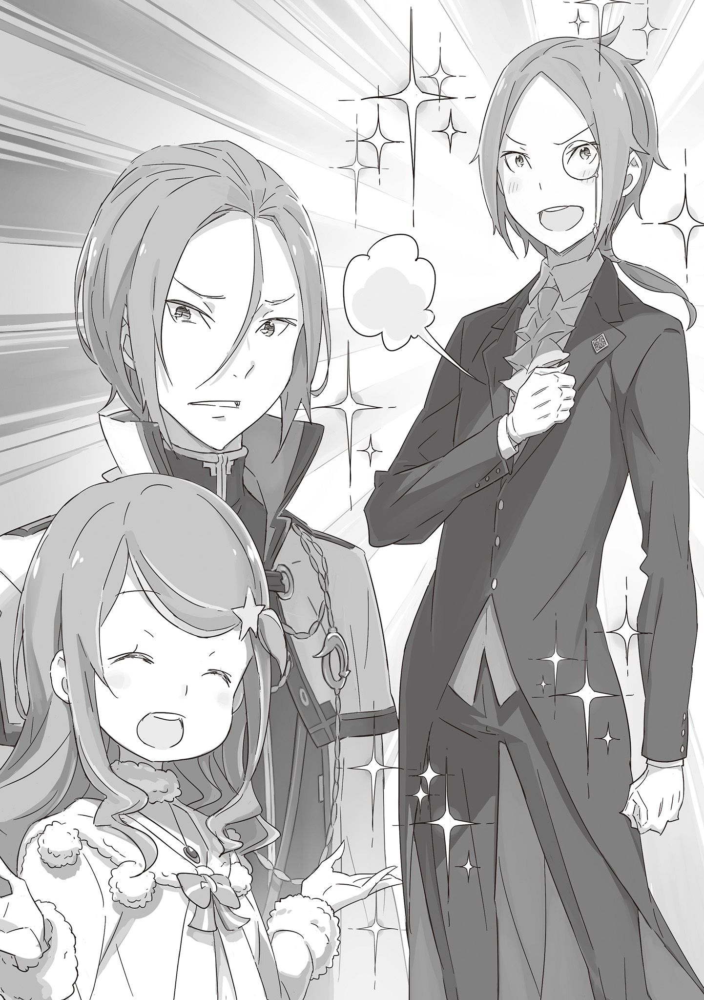

Английский перевод: Eminent и garmadoncar

Русский перевод: Перакстаз

За последний год и несколько месяцев была одна вещь, которую Йешуа Юклиус находил странной.

Стоило ему взять в руки еду, как Мими и её братья непременно оказывались в его комнате.

— Когда я касаюсь еды, тут свет включается или что? — задавался он вопросом.

— ..? Что случилось, Йешуа? Ты ударился головой? — Мими склонила голову набок, стоя посреди комнаты с испачканном в бесчисленных крошках ртом.

Йешуа ущипнул себя между бровями и посмеялся над собой за столь идиотский вопрос, глядя на то, как Хетаро героически вытирал крошки со рта сестры.

— Йешуа, ты в порядке? — спросил Тиви. — Не лучше ли пойти к леди и попросить отдохнуть?

— …Всё хорошо, спасибо, что беспокоишься обо мне, Тиви. Но я в порядке.

— …Не переутомляйся, — напомнил ему Тиви, поправляя монокль.

Он был самым младшим из тройняшек. Именно с ним Йешуа ладил лучше всего, возможно, из-за того, что у обоих были старшие братья. Он тоже начал носить монокль, когда подружился с Тиви и стал немного им восхищаться.

Йешуа громко вздохнул, касаясь «скопированного» монокля.

Его усталость произрастала не просто из непрерывной работы и частых выездов ради выполнения различных заданий. Ментальный аспект определённо был значительной частью. В любом случае…

— …Значит, посланник для королевского кандидата, а? Леди Анастасия действительно злая, — с бледным лицом пробормотал Йешуа, потирая ноющий живот.

Королевство Лугуника, оказавшись перед угрозой остаться без короля, занялось выбором правителя следующего поколения. Пять кандидатов были собраны для участия в трёхлетнем отборе, в ходе которого одна из них должна была быть выбрана та, кто будет достоин восседать на престоле. Дом Юклиус поддержал влиятельную торговку из другой страны — Анастасию Хосин.

Купчиха, которая не только была иностранкой, но и необычайно хорошо зарекомендовал себя всего за одно поколение. Поначалу мнения внутри Дома Юклиус разделились. Те, кто горячо поддерживал Анастасию, подвергались критике.

То, что смогло переубедить протестующих и позволило ей заручиться поддержкой Дома Юклиус, были талант и личные достоинства Анастасии. Но прежде всего это были достижения Юлиуса Юклиуса, «Лучшего» рыцаря.

Будучи младшим братом Юлиуса, Йешуа всегда делал всё возможное, чтобы оправдать его ожидания. Трудно сказать, что это приносило плоды, но в том, чтобы усердно работать, он никогда не проваливался.

Даже если он и был лишь одним человеком, Йешуа был уверен в ценности своего сотрудничества для лагеря.

Но несмотря на это, в последний год он не был благословлён важными задачами, ему выпало время ожидания и терпения, но его час наконец-то пришёл. В этот момент он стыдился своей трусости, из-за которой у него болел живот.

Разумеется, моя трусость это только моя проблема, и нельзя обижаться на леди Анастасию за это, но…

— Должен ли я сказать, что хочу сделать всё правильно, делая по шагу за раз?.. Нет, это просто оправдание. Я не могу вот так посмотреть в лицо брату или леди Анастасии…

— Хаааа, Йешуа опять ходит по кругу! Ты не устаёшь постоянно думать об этом? Мими думает, что это странно!

— Угх, у Мими такая же роль, что и у меня, но какая же у нас разница в восприятии..

Йешуа опустил плечи, пока Мими жёстко похлопала его по спине.

…На это раз Анастасия выбрала Йешуа, чтобы доверить ему важную роль посланника к королевскому кандидату.

У Анастасии определенно было достаточно шансов изучить всех кандидатов, благодаря её крепкой и обширной информационной сети. И в результате, используя всю полученную информацию, она решила пригласить их в Пристеллу — Город Водных Врат, где все были бы собраны вместе.

Были приглашены три группы: Круш Карстен, герцогиня, считавшаяся лидирующим кандидатом, Фельт, рождённая в трущобах и владеющая Святым Меча, и Эмилия, полуэльф с серебряными волосами.

К каждой из этих групп должны были быть отправлены гонцы, и та, за которую отвечал Йешуа, была…

— …Из всех людей это полуэльфийка Эмилия… — сетовал он.

— Похоже, что ты имеешь что-то против полуэльфов? — спросил Хетаро.

— Нет, эм…не то чтобы я их ненавидел. Просто…разве они не жуткие? Она принадлежит к той же расе, что и Ведьма Зависти. Я даже слышал, что у них одинаковая внешность?

В ответ на невинный вопрос Хетаро Йешуа объяснил известное чувство.

Легенда о Ведьме Зависти была главным страхом для всех людей, живущих в этом мире. Одно только представление о девушке с подобным происхождением заставляло кровь стынуть в жилах.

— Если бы это была герцогиня Карстен, то я уже встречал её раньше, хоть это и было давно. Даже если бы это была леди Фельт, я общался с её первым рыцарем, сэром Райнхардом. Почему же, несмотря на всё это…

— Ммммм, ты такой пугливый! Но Мими считает, что эта леди не страшная! Скорее…добрая? Или опасная?

— О, верно, — прокомментировал Йешуа, — Мими и остальные уже встречались с ней.

В отличие от беспокойного Йешуа, Мими и её братья контактировали с лагерем Эмилии.

Битва и Культом Ведьмы и экспедиция против Белого Кита, произошедшие год назад, были шокирующими событиями, от которых у Йешуа чуть не пошла пена изо рта.

— Тогда, можете рассказать о ваших впечатлениях о них, Тиви и Хетаро? — поинтересовался Йешуа.

— А? Почему ты пропустил Мими? — спросила она.

Йешуа нежно погладил наклонённую голову Мими.

Она счастливо забралась на его колени, говоря: «Не волнуйся!».

Йешуа пощекотал шею Мими, подавая знаки её братьям, пока не стало поздно.

— Мы особо не взаимодействовали с леди Эмилией, исходя нашей стратегии, — сказал Тиви. — Мы просто видели её во время церемонии… Но она не казалась нам страшной.

Примечание переводчика: я так полагаю, что речь о церемонии почётного награждения участников сражений с Китом и Ленью (?) Где-то я слышал, что такая была, но не могу быть уверен

— Леди была милой… — признал Хетаро. — Я выдохся после битвы с Белым Китом, так что я почти ничего о ней не знаю. Но с её рыцарем ситуация другая…

Йешуа нахмурился в ответ на правдивые слова Хетаро.

— А, да, о нём ходит много странных слухов…

Честно говоря, одной из причин, из-за которых Йешуа был столь насторожен по поводу лагеря Эмилии, без учёта полуэльфийского происхождения самой леди Эмилии, был этот подозрительный рыцарь.

Слухи шептали, что он был чужаком, влезшим в Отбор, не имевшим за плечами уважаемой рыцарской семьи или даже каких-то экстраординарных способностей.

Однако, если бы кто-то пытался получить информацию о лагере Эмилии, то этот черноволосый рыцарь неизвестного происхождения определённо бы всплыл в разговоре.

— Я слышал, что он участвовал в покорении Белого Кита и битве с Архиепископом Греха Культа Ведьмы… — начал Йешуа. — Не то чтобы я пытался усомниться в том, что мой брат внёс вклад в победу над Архиепископом Греха…

Меня бесит тот факт, что непонятно кто может делить заслуги с моим братом. Более того, именно мой брат был тем, кто сделал это. Без сомнения, высшие почести должны доставаться ему.

— Для начала, — продолжил он, — он присоединился к покорению Белого Кита и Лени. Хотя это не подтверждено, он мог одолеть Великого Кролика, и, хотя его происхождение неизвестно, он стал рыцарем кандидата на королевский отбор. И он человек, который таскает с собой бесстрашную маленькую девочку? Понятия не имею, кого я должен представлять!

Леди Эмилия в равной степени непостижима и пугающа, раз выбрала такого загадочного человека своим рыцарем. Кроме того, о лагере Эмилии ходит бесчисленное количество ужасающих слухов.

Во-первых, человеком, который поддерживал Эмилию, был маркграф Мейзерс, печально известный лицемер.

Он также был известен как «любитель полулюдей», известный развратник, который, по слухам, заставлял получеловеческих служанок в своем особняке носить непристойные наряды.

В его подчинении находились получеловек со свирепым лицом и кровожадный офицер внутренних дел. Эти двое тоже были довольно загадочны: досье на первого не удалось найти даже после полного использования информационной сети Анастасии. А второй был печально известен тем, что был в розыске в родном городе.

Вдобавок ко всему, о базе лагеря ходили жуткие истории о призраках, например, о десятках девушек с одинаковыми лицами, которые одновременно входили и выходили из особняка, или о том, что из кухни ежедневно поднимался дым от готовящейся на пару картошки.

…Действительно, похоже, что это мрачное и зловещее место.

— Чем больше я об этом думаю, тем меньше понимаю, почему леди Анастасия выбрала меня в качестве посланника… Может, я неосознанно сделал что-то грубое, и она просто хочет тихо избавиться от меня?

— Это слишком пессимистично… — ответил Хетаро.

— Но ведь! Ты можешь придумать какое-нибудь другое логическое объяснение этому? А… А… Что же мне делать… Наверное, стоит спросить леди Анастасию о её настоящих мотивах, верно?!

Если есть шанс, что всё это было какой-то ошибкой, то, возможно, лучше уцепиться за эту возможность.

— Если это не ошибка и ты угадал, — сказал Тиви, — мне кажется, что леди придумает, как держать твой рот на замке.

— Хк!

— Даже Тиви… — пробормотал Хетаро.

Йешуа, застыв с побледневшим лицом, естественно, отгораживался от разговора, происходящего перед ним.

Стоя в оцепенении, он чувствовал себя так, словно оказался втянутым в грандиозный заговор.

— О? Что случилось, Йешуа? Ты хочешь писать? — спросила Мими, упав с колен Йешуа и глядя на него с пола.

Йешуа неопределенно покачал головой в ответ на её вопрос.

— Я… Я не могу принять такую большую роль. Я боюсь… Я боюсь! Я должен пойти и прямо спросить леди Анастасию о её истинных намерениях…

Йешуа направился к двери, оставив эти слова за спиной. Затем он вышел из комнаты и отправился на поиски Анастасии.

Оставшиеся в комнате тройняшки переглянулись между собой.

— Тиви, не стоит так над ним шутить, — напутствовал Хетаро. — Йешуа — серьезный парень.

— Мне жаль, — ответил Тиви. — Но я вроде как понял мысли леди.

Тиви слегка опустил брови, глядя на Хетаро, который отчитал его, словно старший брат. А сзади Мими обняла обоих так крепко, как только могла.

— Серьёзно, — сказала она, — ему и леди непросто. Юлиусу тоже, а?

— Итак, леди Анастасия, я хочу знать каковы ваши истинные мотивы. В зависимости от ответа, я могу предположить, что не подойду для этой миссии…

— Что это, Йешуа, ты такой серьёзный, — ответила Анастасия.

Держа в голове предыдущий разговор с Мими и остальными, Йешуа отправился в кабинет Анастасии и был встречен её мягкой кривой улыбкой.

Это произошло после того, как он поделился всеми своими мыслями, так как не мог больше держать их внутри. Конечно, он подправил свои слова, чтобы не чувствовать стыда перед старшим братом, Юлиусом Юклиусом.

Тем не менее, невозможно отрицать, что его просьба была жалкой…поэтому цвет его лица был нездоровым.

— Не стоит волноваться, во владениях Эмилии не так уж страшно. Она или даже Нацуки тебя не укусят.

— Но что насчёт маркграфа… Или двух подчинённых? Или дыма из кухни…

Анастасия приложила руку к щеке и в раздумьях прищурила свои бледные бирюзовые глаза.

— Хм, я заставляла Йешуа помогать, думая, что это к лучшему, но, похоже, это затуманило твой взгляд. Моя вина.

Ее размышления были связаны с тем, что Йешуа помогал ей систематизировать информацию, полученную из сети. Подобное объединение непростых данных было одной из специализаций Йешуа, так что он чувствовал себя уверенным в том, что смог помочь.

Впрочем, он и сам был поглощён увиденным и услышанным — какая дилемма.

— Хм, я понимаю твои опасения, Йешуа. Если ты так волнуешься, может, нам стоит пересмотреть идею того, чтобы ты был посланником?

— …Я прошу прощения.

— Нет, всё хорошо, всё хорошо. Но давай я кое-что испробую?

— Хм?

Анастасия прикрыла один глаз и озорно улыбнулась мрачному и испуганному лицу Йешуа, который не мог понять сути её слов. И тут кто-то постучал в дверь за его спиной.

Человеком, чьё лицо показалось в дверном проёме, был…

— Вы звали меня, леди Анастасия? Я только что получил сообщение от ле…

— Б-брат?!

Никто иной, как Юлиус, вошёл в комнату после уважительного поклона.

Пока Йешуа был совершенно шокирован появлением брата, Юлиус лишь прищурился с коротким: «А, Йешуа», — прежде, чем продолжить:

— О чём ты говорил с леди Анастасией? Есть что-то, что ты хочешь у меня спросить?

— А, эммм, нет, тебя, эм…

— Да, в этом суть. Ты нужен ему, чтобы идти дальше.

Йешуа впал в оцепенение. Ему не хотелось, чтобы брат узнал о его позорном малодушии. Анастасия взмахнула рукой, подзывая Юлиуса.

— Помнишь, мы говорили, что собираемся послать Йешуа гонцом к лагерю Эмилии? Он хочет побольше узнать о них, чтобы не показаться грубияном.

— Понятно. Вот почему вы позвали меня.

Юлиус одобрительно кивнул, без труда приняв краткое объяснение Анастасии. Затем он посмотрел на Йешуа своими ясными жёлтыми глазами.

— Ты правильно поступил, что задумался об этом. Леди Эмилия совершенно не соответствует тому, что о ней говорят слухи или её репутация. Если придерживаться ложного впечатления, это действительно будет грубо по отношению к ней.

— Брат… С-спасибо. Это очень полезно и…мотивирующе.

Услышав слова Юлиуса, который с улыбкой оценил его мысли, тёмные тучи в разуме Йешуа рассеялись. Он почувствовал, как исчезает его беспокойство.

Анастасия, скрестив руки, удовлетворённо кивала.

— А, и если ты отправишься к леди Эмилии, то надо быть осторожным с её рыцарем, — продолжил Юлиус. — Он…что ж, с первого взгляда не знаешь, чего от него ожидать. Однако он очень предан леди Эмилии и обладает удивительной душевной стойкостью и решимостью.

— …Брат?

— Он также является пользователем духовных искусств. И его официально посвятили в рыцари. Другими словами, он такой же рыцарь духа, как и я. Не из-за этого, но будь осторожен… Йешуа?

Действительно, она искренна. Теперь я тоже должен усердно работать ради неё.

Пока Юлиус красноречиво излагал все эти меры предосторожности, его младший брат никак не реагировал. Юлиус поднял брови.

Но Йешуа, покачав головой лишь коротко ответил: «Ничего».

— Брат, спасибо тебе за подробное объяснение. Благодаря тебе я понял, что он — противник, с которым мне следует быть очень осторожным. Леди Анастасия, я идеально исполню свою роль посланника.

— Ага, — ответила она, — жду с нетерпением, удачи.

— Да, предоставьте это мне! Я обязательно принесу хорошие новости!

С горящими глазами Йешуа гордо выбежал из комнаты, тяжело дыша и прижимая руку к груди.

Юлиус проводил его взглядом и повернулся к своей госпоже, все ещё удивлённо поднимая брови.

— …Мой младший брат… Он был груб?

— Хе-хе, да нет, всё в порядке… Думаю, Йешуа подозревал, что я что-то задумала.

Юлиус вздохнул, наблюдая за тем, как Анастасия улыбается, и подумал, что поведение его младшего брата, скорее всего, свидетельствует о том, что план Анастасии удался.

《Конец》
