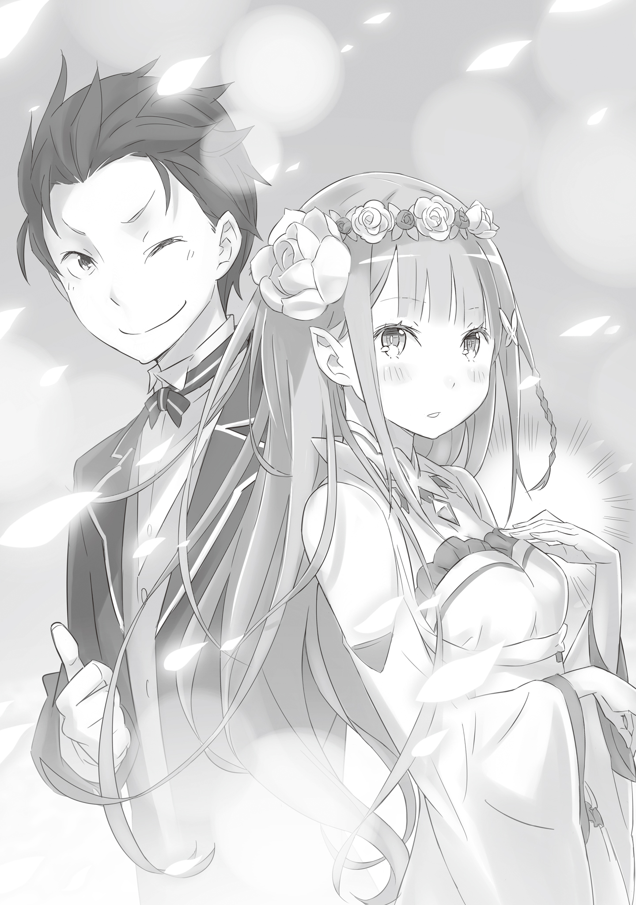

Утро дня обещанного свидания началось с безупречного, безоблачного неба.

— Лично я в последнее время топлю за косички, но такую красоту жалко показывать Субару. Одежда, конечно же, в основном белая. Акцент сделаем на заколке, а потом, а потом…

Сидя на кровати, сребровласая девушка — Эмилия — наблюдала, как перед ней деловито парит в воздухе её контрактный дух, Пак.

Глядя на суетящийся серый пушистый комочек, Эмилия приложила палец к щеке.

— Не думаю, что стоит так ломать голову, можно пойти и в обычном…

— Нельзя! Неважно, с кем ты идёшь, важно, что для тебя это первый раз. Мы не можем пойти на компромисс и не сделать тебя самой милой в мире!

— Ох, ну и преувеличиваешь же ты.

Эмилия тихонько вздохнула, стараясь, чтобы Пак, в котором почему-то разгорелся боевой дух, этого не заметил. Этот кот-дух, заменявший ей отца и бывший для неё семьёй, вёл себя так с самой ночи. Эмилия уже начинала опасаться, что у неё иссякнут силы от одной только подготовки, ещё до того, как она выйдет из дома со своим спасителем — Нацуки Субару.

Пак всегда выбирал ей наряды и украшения, но сегодня его энтузиазм переходил все границы. И не только это: — Слушай внимательно, Лия. Насчёт сегодняшней прогулки: если Субару попытается прикоснуться к тебе, не позволяй ему это так просто. В крайнем случае, можно взяться за руки, но не более того! Девушка должна быть скромной и стыдливой, я же тебе всегда говорил. Ты ведь понимаешь?

— Понимаю-понимаю. Если так волнуешься, Пак, мог бы просто пойти с нами.

Несмотря на все свои ворчливые инструкции, Пак почему-то отказался сопровождать её на сегодняшнее «свидание» с Субару. Когда она, надув губки, высказала своё недовольство, он ответил:

— Я уважаю смелость, которую проявил мальчик. Я не могу поступить столь бестактно.

— Но для того, кто не хочет мешать, ты уж слишком сильно беспокоишься…

— Во мне сейчас борются два чувства: желание поддержать его как мужчину и нежелание отдавать тебя как родителя… Ух, Лия, иди же скорее, пока я сдерживаю себя!..

— Да-да.

Уж не дурное ли это влияние Субару, что Пак стал таким театральным шутником? Кажется, он и раньше был таким, но сейчас это явно усугубилось.

Быстро закончив с туалетом, Эмилия поманила Пака рукой. Тот послушно подлетел, сел ей на плечо и очаровательно погладил её по щеке мягкой лапкой.

— Ну, Лия. Я буду спать в сосуде, но если Субару попытается совершить что-нибудь антигуманное, немедленно зови меня.

— Прекрати волноваться попусту. Ну что за несносный дух.

Пока Эмилия, надув щеки, протестовала, Пак уже превратился в частицы света и втянулся в зеленый кристалл на её груди.

Эмилия лишь легонько щёлкнула пальцем по кристаллу и бодрым шагом вышла из комнаты.

Она и сама осознавала, что сердце в её груди бьётся чуть быстрее от необъяснимого предвкушения.

— Заждался?

— Не, только подошёл.

Именно так ответил Субару, когда Эмилия встретилась с ним у приметного дерева — места их условленной встречи.

Услышав это, девушка кивнула и, бросив взгляд в сторону особняка, спросила: — Встречаться за пределами поместья, специально разыгрывать этот диалог: «Ты ждал?» — «Я только пришёл»… Можно поинтересоваться, какой в этом смысл?

— И то, и другое создаёт атмосферу настоящего свидания! Если бы мы вышли из дома вместе, магия момента испарилась бы. А раз мы встречаемся снаружи, обмен этими репликами просто обязателен. Это классика!

Впрочем, судя по количеству портретов Пака, выведенных, вероятно, веточкой на земле под деревом, Субару торчал здесь довольно давно и коротал время за художествами. Глядя на эту импровизированную галерею, слова «только подошёл» казались шиты белыми нитками.

— Хм-м, вот как. Я в таких тонкостях совсем не разбираюсь.

— Кстати, в фразе «только подошёл» скрыта моя трогательная мужская душа: я сказал бы так, даже если бы Эмилия-тан дико опоздала.

— Но ведь это означало бы, что и ты сильно опоздал, разве нет?..

— Бывают вещи, которые, даже если заметишь, лучше вслух не произносить, иначе разрушишь всё настроение!!!

Видимо, это был некий непреложный канон. Послушно выслушав настойчивые объяснения Субару о сакральной важности этих ритуалов, Эмилия заметила, что, закончив лекцию, он приложил руку к подбородку и теперь пристально её рассматривает.

От его взгляда, скользящего с головы до ног, ей стало щекотно, и она невольно поёжилась.

— Ч-что? Что-то не так?

— Оставим в стороне то, что иероглиф «любовь» подозрительно похож на иероглиф «перемены»… В Эмилии-тан странностей — кот наплакал, да и те являются её неоспоримыми чарм-пойнтами, так что всё путём. Я о другом: Эмилия-тан сегодня просто демонически милая! Ты принарядилась чуть больше обычного?

Причёска, украшения — Субару метко подмечал малейшие отличия от повседневного образа. Эмилия удивилась, что он угадал именно те детали, над которыми так колдовал Великий Дух.

— Пак сегодня и правда постарался чуть больше, чем обычно…

— О, гуд джоб! Он молодец. А я уж боялся, что отцовские чувства взыграют, и он встанет в позу, саботируя первое свидание дочери.

— Угу, его терзали ужасные противоречия, но сейчас он спит в кристалле, так что можешь быть спокоен.

С горькой улыбкой она коснулась зелёного камня на груди. Субару с облегчением выдохнул: «Ну и славно». Затем откашлялся и с нарочито официальным видом поклонился: — Ну что ж, тогда давай начнём наше первое свидание. Для меня великая честь быть вашим эскортом.

На юноше был идеально выглаженный костюм дворецкого. Другой парадной одежды у Субару не водилось, так что выбора он не имел, но Эмилии показалось, что сейчас этот наряд удивительно гармонирует с его манерами.

Поэтому она послушно шагнула к нему, когда юноша, согнув руку в локте, предложил ей опереться.

— Эм… так нормально?

Она лишь слегка, самыми кончиками пальцев, ухватилась за рукав и посмотрела на него снизу вверх. Поза явно не предполагала, чтобы они держались за руки по-настоящему, отчего она чувствовала себя неуверенно. Заметив этот взгляд, Субару почему-то начал корчиться, словно от зубной боли.

— Это отличается от того, что я ожидал, но результат превзошёл самые смелые фантазии. Эта девчонка реально милая, как демон…

Глядя на спутника, прикрывшего лицо ладонью, Эмилия решила, что, по крайней мере, грубой ошибки не допустила. Она легонько подтолкнула его, и Субару, наконец придя в себя, зашагал рядом.

— И куда мы сегодня направимся?

— Сначала в деревню. Потом навестим могилы… а после сходим посмотреть на цветочное поле. Время есть, мы никуда не спешим.

Наблюдая за профилем Субару, улыбающегося под теплыми лучами солнца, Эмилия улыбнулась в ответ — так очаровательно, что ею можно было залюбоваться.

— Звучит весело.

— Впервые такое вижу… Местная ребятня тебя и вправду любит.

— Иногда я не уверен, стоит ли мне вообще радоваться такой «популярности», Эмилия-тан.

Субару ответил с видом мученика, торопливо отряхивая костюм дворецкого, изрядно пострадавший от дорожной пыли.

Добравшись до деревни, они первым делом занялись цветами для подношения. Субару заранее подрядил детей собрать их в саду особняка и в окрестностях, так что с букетами проблем не возникло — они благополучно перекочевали в руки заказчика. А вот по пути к лесному барьеру, где раньше обитали зверодемоны, сработала знаменитая «аура притяжения детей».

Даже торжественное заявление о «важном свидании» не спасло его от налета маленькой орды. В результате их бурной атаки внешний вид Субару стал почти неотличим от того, в каком он обычно возвращался после игр с детворой.

— И это они ещё сдерживались из уважения к Эмилии-тан. Иначе мне бы досталось куда сильнее.

— Не преувеличивай. Они просто любят тебя…

— Любят? Обычно моя спина служит им платком для вытирания соплей, но сегодня они любезно оставили эту зону чистой.

— С тобой и такое вытворяют?!

Эмилию захлестнула жалость. Заметив, как повлажнел её взгляд, Субару скорчил сложную гримасу, затем посмотрел ей за спину, нахмурился и замахал руками.

Оглянувшись, Эмилия увидела гурьбу детей, крадущихся следом.

— А ну, не ходить за нами! Сказал же: у меня с Эмилией-тан весёлая интимная встреча. Брысь, брысь отсюда!

— Э-э, тиран.

— Э-э, злюка.

— Э-э, бяка.

— Сами вы бяки! Мы уже почти у барьера, вам сюда нельзя. Или хотите проповедь от старосты? Длинную, скучную и совершенно бесполезную? Нет? Тогда живо домой, играть в «Ледяного демона», как я вас учил.

Субару отогнал их жестом, словно назойливых мух, и дети, ворча под нос, разбежались. Эмилия с улыбкой наблюдала за сценой, но вдруг заметила пристальный взгляд одной из девочек.

Милашка с рыжевато-каштановыми волосами, встретившись с ней глазами, с детской непосредственностью скривила обиженную рожицу, показала язык и умчалась прочь.

— Вот же, совсем Петра от рук отбилась. Завтра устрою ей взбучку, — вздохнул Субару. — Эмилия-тан, ты как? Если ноги от шока не держат, могу понести на руках, как принцессу.

— Угу, я привыкла, так что всё в порядке. Это для меня хирунда¹.

— Слово «хирунда» сейчас редко услышишь… Нет, погоди, в смысле «привыкла»?..

Что-то его зацепило. Но Эмилия лишь потянула Субару за рукав, не давая развить тему, и зашагала вперёд. На лице юноши отразилось удивление, но, взглянув на неё — или прочитав что-то в её выражении, — он промолчал. Сама же она почувствовала укол совести. Отвращение к себе за то, что испытывает облегчение и благодарность.

За то, что злоупотребляет его добротой.

— О, вот мы и на месте…

Пройдя ещё немного, Субару остановился у кромки леса.

С виду обычные деревья, но в верхнюю часть стволов были врезаны голубые кристаллы. Расположенные через равные промежутки, они образовывали барьер, реагирующий на ману в атмосфере. Хоть угроза вольгармов и миновала, никто не мог гарантировать полную безопасность, поэтому защиту возвели заново.

— Внутрь нам нельзя, так что прости, но придётся здесь.

Субару выбрал защищенное от ветра и посторонних глаз место перед барьером и положил букет. Не вставая с колен, он сложил ладони вместе, закрыл глаза и склонил голову в молитве.

Странный, незнакомый жест. Вероятно, обычай его родины, которую она всё ещё плохо понимала. Наблюдая за ним краем глаза, Эмилия тоже прижала руку к груди и взмолилась об упокоении душ.

Даже если это были зверодемоны — после смерти их жизни вернутся в ману, и души очистятся. И когда они вновь обретут форму и придут в этот мир, пусть на сей раз их существование будет мирным.

Так её учили.

А кто меня этому учил?

— Прости, что заставил участвовать в моём эгоистичном ритуале. Всё, я закончил.

Субару отряхнул колени, встал и улыбнулся. Эмилия внимательно вгляделась в его лицо — кажется, он не притворяется, — и кивнула.

— Так, дальше у нас… цветочное поле, да?

В ответ на нарочито безразличный тон Эмилии Субару щёлкнул пальцами: — Ага, цветочное поле. И, скажу я тебе, это зрелище действительно стоит того.

Он озорно усмехнулся, намеренно подогревая её ожидания.

Ветер играл чёлкой, пока они пробирались сквозь лес. В какой-то момент Эмилия не выдержала: — О… О-го… Вау.

Она шла за спиной Субару, и стоило деревьям расступиться, как перед глазами предстал мир, сотканный из ярких красок.

— Ну как? Я сам сначала обалдел… Реально круто, скажи?

Она не могла ответить на самодовольный голос рядом — взгляд был намертво прикован к пейзажу.

Красные, жёлтые, белые, синие — маленькие цветы покрывали землю сплошным ковром, цветя в идеальной гармонии и не заглушая друг друга. Цветочный рай, который можно было назвать чудом, учитывая, что возник он естественным путём.

— Говорят, это секретная база мелкотни, с трудом удалось выпытать у них координаты.

— Как тебе… удалось уговорить их?

— Ради свидания с Эмилией-тан? Сдать своё тело им в пользование на пару дней — ничтожная цена.

В результате этого обещания он, вероятно, снова покроется слоем пыли, синяков и детских соплей. Но, даже предвидя такое будущее, она не хотела отказываться от этого момента восхищения.

Неужели и это — её избалованность? Но грудь наполняло лишь нежное тепло.

— А ещё, это подарок от меня для Эмилии-тан.

Субару шагнул к ней и протянул руку. Эмилия среагировала с запозданием: — Э?

Он осторожно коснулся её серебряных волос.

— Это… корона? Из цветов?

— Ага. По сравнению с настоящей, может, и бедновато, но считай это репетицией. Я бы хотел когда-нибудь собственноручно подарить тебе украшение, усыпанное драгоценными камнями… но пока это всё, что я могу.

Сказав это чуть пафосным тоном, Субару подмигнул ей.

Сердце Эмилии пропустило удар. На мгновение она прижала ладонь к груди, гадая, что это был за стук, но он больше не повторился. Однако он был невероятно тёплым и заставил её губы сами собой растянуться в улыбке.

— Субару… спасибо.

В этот миг расцвела улыбка такой красоты, что Субару потерял дар речи и замер в восхищении.

А Эмилия, вкладывая в слова всю свою безграничную признательность, произнесла: — Было бы здорово, если бы мы могли ещё раз вот так сходить с тобой на «свидание».

Этой убийственной фразой она попала стрелой купидона прямо в яблочко.

