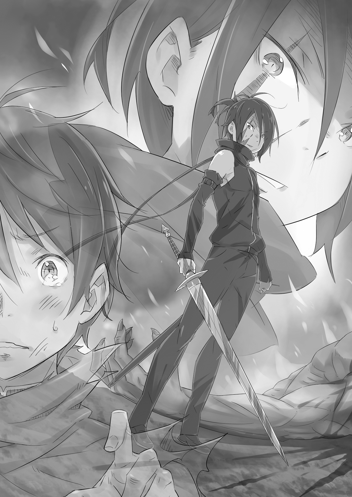

Тошнотворный запах крови висел над полем боя.

То, что ещё несколько часов назад было открытой равниной, теперь пестрело языками пламени; треск горящих деревьев смешивался с человеческими криками. Воздух наполнился запахами горелого дерева и плоти, а также вонью слоя крови на земле, такого густого, что он пачкал сапоги. Вместе они забивали нос и перегружали чувства. Сумерки, пламя и кровь под ногами словно сговорились, окрасив весь мир в красный цвет.

— Кх… хрр…

На этой багровой арене молодой человек упал на колени, больше не в силах передвигать дрожащие ноги. Кровь пропитала его колени и голени, но беспокоиться об этом было уже слишком поздно. Юноша уже давно был так покрыт ею, что почти не замечал новых пятен.

«Какой ужас. Разве может быть ещё хуже?»

Юноша взял меч по собственной воле. Он намеревался прославиться в бою, подняться от безымянного пехотинца до вершин славы. Ночь за ночью он мечтал о подвигах, которые совершит.

Как наивно. Его мысли, его мечты — всё это.

Обычаи поля боя были таковы: кровь, раны, агония, ненависть, насилие и трупы.

Жестокость этой, его первой битвы, была беспрецедентной в истории королевства, даже в эти годы гражданской войны. Командиром был молодой дворянин, который бросился на вражеские силы в надежде снискать немного славы, но он был уничтожен, и линия фронта пришла в беспорядок.

В мгновение ока друзья и враги смешались, а затем юношу отбросило взрывом магии, и он потерял сознание.

После всех этих несчастных случайностей юноша — Гримм Фаузен — остался один на поле, пробираясь сквозь почти осязаемое облако смерти.

— …

Он беззвучно открыл рот. Наконец он заметил, каким тяжёлым стало его тело, а раны на ногах заявляли о себе всё больнее и больнее.

Взрывы прогремели сверху, упав прямо перед Гриммом и подбросив его в воздух.

Ему повезло отделаться лишь несколькими ожогами и ранами на ногах. Насколько повезло? Все остальные в его отряде превратились в пепел. Их командир, стоявший рядом с Гриммом, был к тому же единственным настоящим рыцарем среди них.

Напутствие их лидера перед началом боя было свежо в памяти Гримма. Как и искреннее уважение, которое он испытывал к этому человеку. Но даже он мог легко сгинуть в пламени войны.

— Хрр… гррх…

Гримм стиснул зубы, пытаясь забыть врезавшуюся в память картину последних мгновений рыцаря. Но этот критический момент снова и снова проигрывался перед его закрытыми глазами, истязая нервы. Дрожащей рукой Гримм сжимал свой меч, которым так ни разу и не взмахнул ни на одного врага. Стальной клинок был таким тяжёлым, что хотелось его бросить. Но бросить оружие на поле боя было немыслимо. Даже если он прекрасно понимал, что понятия не имеет, как сражаться.

Отказаться от меча — значит отказаться от жизни. А он боялся смерти.

— А-а-ах! — раздался неподалёку душераздирающий крик, и Гримм чуть не задохнулся, пытаясь бежать. Чей это был крик — союзника или врага? Ему не хватило смелости даже выяснить это.

— Гх… ха-ах… — Всё, с чем он сталкивался теперь, казалось врагом. Не только люди. Он не мог отделаться от мысли, что пламя, кровь, даже вой ветра — всё охотилось за его жизнью.

Он потащил свои ноющие ноги в облако дыма. Он не видел, что было по ту сторону, но это, как ни странно, помогло унять панику. Хотя он едва ли прилагал усилия, чтобы выжить, дым мог скрыть его от проходящих мимо вражеских солдат и, следовательно, подарить ему ещё немного времени.

— Я нашёл кое-кого! Человека!

— И-ия-ах!

Едва выйдя из облака дыма, Гримм оказался лицом к лицу с врагом, державшим клинковое оружие, похожее на топор. Огромное тело солдата, казалось, состояло из одних мышц; это был получеловек с фиолетовой кожей, похожий на лиловую глыбу.

Получеловек оглядел раненого Гримма, и на его ужасной физиономии появилась улыбка. Гримму он показался садистом — охотником, нашедшим лёгкую добычу.

По какой-то счастливой случайности Гримм избежал смерти в первый раз. Но его удача не могла длиться вечно. Похоже, его первая битва станет и последней.

Почему тогда? Почему ему позволили прожить эти несколько лишних мгновений?

— Это твой конец!

Его судьба была проклята. Гримм упал на колени, когда топор опустился на его голову. Краем сознания он заметил, что оружие уже потемнело от крови других жизней, которые оно оборвало; его смерть вряд ли будет лёгкой.

Какая нелепая трата последней мысли.

Именно тогда это и произошло.

— Гья-а-ах!

Раздался пронзительный крик, и он увидел искры от столкновения стали со сталью. Получеловек хрюкнул, когда его удар был отбит, и внезапно между Гриммом и его нападавшим появилась новая фигура.

У незнакомца были каштановые волосы, настолько тёмные, что казались почти чёрными. Его тонкая кожаная броня была обильно залита кровью, а превосходный клинок отражал пламя. Среди этой ужасной сцены герб на мече ярко сиял перед Гриммом. Это казалось ему невозможным.

Однако момент восхищения был немедленно развеян тем, что последовало.

— Ха!

Сталь описала дугу, и серебро сверкнуло ещё ярче на фоне огня. Резкий выдох и танцующий клинок обладали своей неожиданной красотой.

— А?

Издал ли этот звук ошеломлённый Гримм, или это был получеловек? Вспышка серебра начисто снесла голову врага, и огромное тело рухнуло на землю в брызгах крови.

— … — Фигура посмотрела на труп, затем встряхнула меч. Клинок, должно быть, был невероятно острым, потому что на нём почти не было крови.

— Сп… Т…

С опозданием Гримм понял, что ему вернули жизнь. Он попытался заговорить с незнакомцем. Он был так благодарен. Он должен был выразить свою благодарность.

Полулюди были врагами. Тот, кто сразил одного из них, должен быть другом. Он был обязан этому человеку жизнью.

— Эй… Эй, ты… — дрожащим голосом позвал Гримм, и фигура подозрительно оглянулась на него.

Впервые разглядев лицо своего спасителя как следует, Гримм с удивлением понял, что мечник был моложе, чем он ожидал. Его невысокий рост мог быть связан с тем, что он ещё не закончил расти. Он был, возможно, на два-три года моложе Гримма, которому в этом году исполнилось всего восемнадцать. Значит, лет пятнадцать, наверное. Ещё мальчишка.

Но Гримм не смог заставить себя позвать снова. Не ужас лишил его дара речи. Он перестал дрожать. Нет, это было потому, что он увидел глаза мальчика.

— …

Они были пусты. Не просто как будто внутри него ничего не было. В его взгляде не было никаких эмоций.

Именно это осознание удержало Гримма от благодарности или любых других слов. Мальчик мельком взглянул на молчащего Гримма, но затем его интерес — и без того минимальный — угас, и он пошёл прочь.

— Под…

Теперь Гримм обрёл голос. Больше всего на свете он боялся остаться один в этом пустом месте. Он бросился за мальчиком, который не оглядывался. Он не будет брошен. Теперь его единственным, отчаянным желанием было выжить.

Он следовал так близко, как только мог, сквозь кровь и дым, пока мальчик не остановился. Как только они миновали дым, Гримм увидел это, одновременно ощутив тошнотворную вонь.

— Чт-что за?..

Возвышающаяся груда трупов полулюдей. Каждый был убит одним ударом меча, и лица их были искажены болью, ужасом или гневом. Содрогнувшись, Гримм понял, кто их убил.

Затем он услышал, как мальчик, подняв голову к небу, рассеянно прокомментировал: «…Хм. Так вот какова битва. Я и не знал».

Гримм проследил за взглядом мальчика к небу, и из его горла вырвался сдавленный звук.

В небе парили красные и синие круги — сигнал для всей королевской армии о достигнутой победе.

— Королевская армия… победила? — тускло произнёс Гримм. Знак победы казался ему совершенно нереальным. Его отряд был уничтожен, он брёл по полю боя, едва соображая, а затем его жизнь спасли в самый последний момент — он был жалок. Он не был победителем.

Но уж этот-то юноша наверняка мог с гордостью заявить о победе…

— Так банально, — сказал мальчик. Он не обратил внимания на чувства Гримма и лишь разочарованно покачал головой.

Лишь через несколько дней, когда вручали награды за битву, в которой Гримм так много потерял и ничего не добился, он узнал имя Вильгельма Триаса.

Он находился в казарме королевской армии после окончания церемонии, когда один из солдат сказал ему: — Этот парень, про которого говорили, что он убил двух вражеских капитанов? Ужасно молод, не так ли?

Говорившим был мужчина с тусклыми, коротко стриженными золотистыми волосами — Торта Уизли. Они с Гриммом сблизились с момента поступления на службу и теперь были братьями по оружию, пережившими вместе свою первую битву.

Торта был одарён превосходным телосложением, но считал себя более способным к стрельбе из лука и без колебаний потчевал Гримма историями о том, как он помогал поддерживать арьергард. На самом деле, для своего первого боя он держался восхитительно.

— Правда? — спросил кто-то. — Нас, пехотинцев, на церемонии задвинули далеко на фланг. Я ничего не видел.

— Поверь мне, — ответил Торта. — Я лучник. Если бы у меня не было хорошего зрения, я бы ни во что не попал. Я его видел, и он был молод — практически ребёнок.

В ответ на насмешки слушателей Торта гордо постучал себя по бровям. Но это лишь заставило наблюдавших за ним переглянуться и рассмеяться. Это была естественная реакция. Торте было девятнадцать, а Гримму — восемнадцать; они были одними из самых молодых солдат. Если Торта считал кого-то ребёнком, это означало, что ему могло быть пятнадцать или шестнадцать — достаточно взрослый, чтобы сражаться за свою измученную нацию в гражданской войне, но едва ли в том возрасте, чтобы совершать великие военные подвиги. Два вражеских капитана? Это было смешно.

— Что, никто из вас мне не поверит?

— Эй, Торта, ты действительно уверен, что хорошо разглядел того парня?

— Говорю вам, разглядел! Не говори мне, что даже ты мне не веришь, Гримм. Это обидно. Я видел его собственными глазами! Ненавижу это говорить, но великий боец есть великий боец, независимо от того, насколько он молод.

Торта казался раздражённым реакцией толпы. Гримм опустил глаза и тихо сказал: — Нет, я тебе верю.

Мысленным взором Гримм представлял последнее, что видел на поле боя несколько дней назад — гору мёртвых полулюдей и юношу-мечника, который, скорее всего, их и убил. Война — не место для обычных ожиданий, включая возраст. Воспоминание до сих пор вызывало у него дрожь по спине.

Адское пламя его первой ночи на войне поглотило все мечты о великих свершениях, которые у него могли быть. Теперь он помнил только того мальчика.

Если правда, что герои закаляются в пламени битвы , — подумал Гримм, — то он, должно быть, один из них.

Внезапно дверь раздевалки распахнулась, и грубый голос проревел: — Бойцы, внимание!

Гримм полностью усвоил привычки военной жизни. Он выпрямился, щёлкнул каблуками и повернулся к двери — всё это практически в мгновение ока. Все остальные в комнате сделали то же самое.

Вошёл мужчина с аккуратно подстриженной бородой, одобрительно кивнув при виде такой дисциплины. Его лицо было им знакомо — это был Разаак, полноправный рыцарь королевской армии. Ему было около тридцати лет, короткие зелёные волосы над резко очерченным лицом. Он был известен своей суровостью даже среди инструкторов. Гримм узнал его, потому что провёл первые несколько недель в армии, тренируясь под началом этого человека.

— Всегда готовы к реакции. Хорошая работа, бойцы. Никогда не забывайте об этом.

— Так точно, сэр! Спасибо, сэр! — хором ответили Гримм и Торта вместе с командиром взвода.

Это было почти как обмен обещаниями. Их мнение об инструкторах полностью изменилось после первой битвы. Во время тренировок, доведённые до рвоты, новобранцы испытывали лишь ненависть к старослужащим, но теперь, пережив бой, осталась только благодарность. Все здесь знали, для чего были все эти наказания.

— Очень хорошо. Не думаю, что вам хочется видеть лицо рыцаря, пока вы пытаетесь заняться своими делами. Возникло кое-что, требующее внимания.

— Что такое, сэр? Наше подразделение только недавно реорганизовали, и мы готовы сделать всё, что в наших силах.

— Не беспокойтесь, солдат. Я знаю, что вас только что собрали вместе, и, возможно, сейчас не лучшее время, но я хочу добавить ещё одного человека в отряд. Все документы оформлены; я просто привожу его.

— Так точно, сэр. Могу ли я спросить, сэр, он приличный боец? Почтительно прошу не обременять нас кем-либо, кто не может справиться со своей долей работы.

— Успокойтесь. Он немного молод, но способен. Последнее столкновение было его первым боем, но он убил пару вражеских капитанов — его даже выделили для награждения.

Гримм, как и остальная часть подразделения, сглотнул. Должно быть, это тот самый человек, о котором они только что говорили. Разаак, уловив изменение настроения, кивнул и сказал: — Вижу, вы уже в курсе деталей.

Затем он повернулся к двери и позвал: — Входи. Это твоё новое подразделение. Дверь открылась.

Там стоял мальчик с каштановыми волосами и суровым лицом. Стандартная солдатская форма как-то не очень на нём сидела, но в его осанке и поведении не было и следа мягкости новобранца. Ошибки быть не могло. Это был он.

— Это Вильгельм Триас, — сказал Разаак. — Ему пятнадцать, драться научился сам. Но я думаю, у него блестящее будущее. Всем вести себя хорошо.

Вильгельм стоял по стойке смирно, молча выдерживая взгляды других солдат. Представление закончилось, Разаак окинул взглядом нервную раздевалку, затем удовлетворённо кивнул. Сосредоточенность солдат всего мгновение назад ослабла, но теперь они были поглощены вниманием. Возможно, такова и была его цель. Новый солдат оставался новым даже после первого боя. В глазах полноправного рыцаря они всё ещё были просто птенцами.

Эта встреча окажет на нацию гораздо более далеко идущее влияние, чем что-либо, что мог запланировать Разаак. Но в тот момент даже два человека, находившиеся в центре событий, не имели об этом ни малейшего понятия.

Двумя годами ранее в Дружественном Дракону Королевстве Лугуника разразилась гражданская война, так называемая Война Полулюдей.

Более четырёхсот лет сохранялись предрассудки против полулюдей, вызванные «ведьмой» много веков назад. Лугуника не была исключением; отношения между людьми и полулюдьми были прохладными, статус-кво поддерживался молчаливым пониманием того, что они будут иметь мало общего друг с другом.

Этот хрупкий мир был разрушен столкновением каравана полулюдей-торговцев и людских пограничников.

Говорили, что торговый караван, направлявшийся в Империю Волакия на юге, подозревался в пересечении границы с целью шпионажа, но факты были неясны. Ясно было то, что когда караван столкнулся с пограничниками, мирные жители были уничтожены. Эти торговцы пользовались уважением среди полулюдей по всей стране, и их смерть от рук людей спровоцировала вооружённое восстание среди их соотечественников. Так началась трясина гражданской войны.

Бесплодный конфликт тянулся уже два года, и граждане, и солдаты устали от него.

— С другой стороны, именно благодаря этой войне мы и стали солдатами. Я не скажу, что люблю сражаться или что-то в этом роде, но мы хотя бы едим каждый день. — Торта осушил свой стакан одним глотком и с грохотом поставил его обратно на стойку, смеясь с небольшой пеной вокруг рта.

Гримм сидел рядом со слегка пьяным Тортой, маленькими глотками потягивая свой алкоголь и кивая. — Думаю, в этом мы с тобой похожи, Торта. Если бы не гражданская война, я бы никогда не подумал, что смогу стать солдатом. Даже если бы захотел, держу пари, меня бы развернули у ворот.

— Раньше бывали небольшие стычки с Волакией, но в основном всё было мирно. Разве что время от времени какой-нибудь демон-зверь мог доставить неприятности. Но такие парни, как мы с тобой? Если мы когда-нибудь захотим стать больше, чем просто крестьянами, война — это то, что нужно. Человек доказывает свою состоятельность, совершая великие подвиги в бою.

Пока его спутник нетерпеливо заказывал ещё одну кружку эля, Гримм пробормотал: — Великие подвиги в бою, да?..

Торта заметил удручённое выражение лица юноши рядом с собой и дружелюбно покачал головой. — Ты только что пережил свою первую битву, и всё ещё недоволен? Не пора ли тебе начать радоваться? Что, тебе жаль наших павших товарищей или что-то в этом роде?

— Дело не в этом. Назови меня бессердечным, но, насколько я понимаю, той битвы никогда не было. Мне просто… жаль, что я не могу мечтать, как раньше.

— Мечтать?

— Как ты только что говорил, Торта. Совершать великие подвиги, проявлять храбрость… стать героем. Раньше я думал, что смогу это сделать. Легко и просто. Но теперь… — Гримм отпустил свой стакан и посмотрел на свою руку. Она слегка дрожала. Белые шрамы от ожогов остались на его ладони и запястье. Та первая битва оставила на нём свой след. Не только на его плоти, но и на сердце, и на разуме, и он никогда от этого не избавится. — На мечте не выживешь, — сказал Гримм. — Всё, что, как мне казалось, было в моём будущем… исчезло.

— И… что? — спросил Торта. — Ты собираешься уйти из армии? Ты собираешься сдаться только потому, что никогда не станешь героем?

— К сожалению, столкновение с реальностью не наполнит твой желудок. Скорее наоборот, когда ты больше не можешь мечтать, всё, о чём тебе остаётся думать, — это насколько ты голоден. Так что нет, я не ухожу. Я собираюсь продолжать. — Гримм улыбнулся Торте, пытаясь скрыть дрожь в руке, держащей стакан. Изучая Гримма широко раскрытыми глазами, Торта принялся энергично чесать голову.

— …Хм. Почему-то всё это звучит очень похоже на тебя. Ладно, так и делай. Оставь геройство мне. Ты просто следуй за мной — можешь быть помощником героя.

— Но, Торта, ты лучник. Это я впереди с мечом.

— Я знаю, что ты смущён, но просто кивни.

Торта взял новую кружку, которую ему принесли, и поднял её к Гримму. Поняв намёк, Гримм тоже поднял свою кружку, и раздался звон керамики, когда они стукнулись сосудами.

Гримм был родом из деревни под названием Флёр, где-то за пределами столицы. Это был небольшой форпост на одной из главных дорог, получивший некоторую известность как перевалочный пункт на пути в столицу. Но маленький городок с его мелкими нравами не подходил Гримму, и в пятнадцать лет он покинул свой дом и отправился в столицу.

Следующие несколько лет он выполнял чёрную работу в магазинах и тавернах, пока шесть месяцев назад случайно не услышал, что армии требуется больше солдат для всё расширяющейся гражданской войны.

Гримм записался в армию, но не из патриотизма. Он хотел стать героем. Он сбежал из своей деревни от скуки, а теперь вступил в армию без всякой причины, кроме желания славы. Он учился военному делу под суровым руководством Разаака, затем пережил ещё более суровый урок своего первого боя, и вот он здесь.

У Торты была похожая история, по крайней мере, так слышал Гримм. Родившись вторым сыном лавочника, он вступил в армию в поисках свободы и будущего, и именно там они и встретились.

— Итак, ты прошёл через бой и решил, что нашёл реальность, — сказал Торта. — А я прошёл через него и всё ещё мечтаю стать героем. Как день и ночь. А что насчёт того нового парня? Интересно, что он подумал?..

— Ты имеешь в виду Вильгельма?

Торта, казалось, не заметил приступа тревоги, охватившего Гримма, когда он упомянул молодого мечника. Именно Вильгельм, прежде всего, заставил Гримма отказаться от мечты о героизме.

— Я верю, что он хорош, даже если он просто ребёнок, — сказал Торта. — В смысле, военные награды просто так не раздают. Держу пари, мы скоро увидим его на плацу в качестве полноправного рыцаря.

— Я слышал, ему даже не пришлось проходить учения, которые заставляют проходить всех новичков, — сказал Гримм. — Сам инструктор Разаак сказал, что в этом нет необходимости. Многие не поверят, что ему пятнадцать.

Это была правда. Столько всего ждало мальчика его возраста, и мысль о том, кем он ещё может стать, могла встревожить кого угодно. Герой . Так его будут называть, когда он будет рубить врага за врагом и вести свою нацию к победе. Гримм не мог забыть то, что увидел в глазах мальчика. Были ли это глаза того, кого следует провозглашать героем? Подозрение, что он может стать чем-то гораздо более ужасным, преследовало Гримма.

— Я определённо понимаю беспокойство, — сказал Торта. — Он, типа, самый недружелюбный пятнадцатилетний парень, которого ты когда-либо встречал.

— Погоди, что?

— Нет, это правда. Я приглашаю его с собой каждый раз, когда мы идём поесть, каждый раз, когда идём выпить, но он никогда не приходит. Если у него есть хоть минута свободного времени, он занимается фехтованием. Утром, днём и ночью. Клянусь, он от этого заболеет. Или, может быть, он уже болен!

— Хм. Ты, возможно, и прав. — Торта, вероятно, преувеличил, но Гримм обнаружил, что согласен с ним.

— А разве я не всегда прав? — сказал Торта, совершенно не обращая внимания на мрачные нотки в замечании Гримма.

— Но как ты думаешь, может, он в чём-то прав? — продолжил Гримм. — Использовать свободное время для тренировок вместо выпивки?

— Ой, не начинай. В любом случае, тот, кто больше всех веселится, — победитель по жизни! Даже первый Святой Меча, Рейд, не проводил всё своё время, размахивая мечом. Он тоже любил вино и женщин! Герои веселятся больше всех. То, что мы так наслаждаемся, лишь показывает, что у нас есть всё необходимое, чтобы стать легендами!

По мере того как логика Торты становилась всё громче и громче, он собрал несколько выкриков «Да! Верно!» от окружающих выпивох. Когда настроение распространилось по всей комнате, Торта проворно вскочил на стул и поднял свою кружку.

— Друзья мои! Братья по оружию! За всех будущих героев, сидящих в этой таверне прямо сейчас! Ваше здоровье!

— Ваше здоровье! — Все мужчины подняли свои кружки вместе под хор хриплого смеха. Расплескавшийся алкоголь и звон стукающихся кружек наполнили воздух. Торта настойчиво жестикулировал Гримму своей кружкой. Юноша наконец поднял свой кубок, и они прижали сосуды друг к другу, улыбаясь и наслаждаясь атмосферой.

Всё это время Гримм думал, что напитки сегодня как-то не очень хорошо идут, но не знал почему.

Гримм оставил Торту в таверне и вышел в холодную, ветреную ночь. Он повернул к казармам. Ему было жаль оставлять Торту, который хотел пить всю ночь напролёт в честь завтрашнего выходного, но Гримм просто не мог насладиться алкоголем в тот момент и брёл сквозь лунную ночь, его согретое элем тело быстро остывало.

— Какой великолепный полумесяц… Похож на меч.

Военщина действительно до него добралась. Нужно обладать определённым отсутствием утончённости, чтобы заметить не красоту, а остроту луны. Но ведь во времена войны снисходительность и роскошь из человеческих сердец вытесняются.

Эта неспособность наслаждаться выпивкой — это тоже стало новой проблемой для Гримма с момента его первого боя.

— Торта, конечно, храбрец. Может, он действительно может стать героем.

Почти каждую ночь Торта направлялся в таверну, выпивая с толпой незнакомцев. Гримм пытался отговорить его от такого поведения, но по правде говоря, он завидовал. По крайней мере, Торта не застывал каждый раз, когда думал о том первом столкновении.

А что насчёт самого Гримма? Сделает ли его следующий боевой опыт счастливее предыдущего? Этот вопрос мучил его. Когда он закрывал глаза, он видел пламя; когда засыпал, видел своих товарищей, обращённых в пепел; когда было тихо, он слышал их последние, агонизирующие крики.

— И всё же я не могу заставить себя уйти из армии. Если бы я ушёл, у меня бы ничего не осталось. Может быть, именно это меня и пугает.

Он оставил свою семью и дом, чтобы приехать в столицу. Устав от повседневной рутины, он вступил в армию, но теперь, познав страх смерти, он хотел сбежать и от этого.

Он не изменился. Он всё ещё был слаб. Он цеплялся за детскую мечту в надежде найти место, где его могли бы признать, но при этом почти не желал трудиться ради этого. Это, он был уверен, определяло то, кем он был сейчас.

—?..

Но затем, на пути обратно в казармы, поглощённый самобичеванием, Гримм остановился.

Причиной был шум. Ему показалось, что он услышал слабый звук из-за солдатских помещений.

Он едва ли мог представить, чтобы кто-то был настолько глуп, чтобы пытаться проникнуть в казармы национальной армии, но это было время войны. Получеловек на секретной миссии по проникновению, возможно? Нет, это было слишком. Но он должен был убедиться.

Гримм коснулся ножен меча, который нёс, и, как можно тише, направился к задней части здания. Он выглянул из тени, пытаясь найти источник продолжающегося звука.

Там, поздно ночью за казармами, Гримм увидел молодого человека, сосредоточенно размахивающего мечом.

— …Вильгельм?

Клинок сверкнул серебром, танцуя в ночном воздухе. При лунном свете Гримм мог видеть, насколько поразительно чистой была техника Вильгельма. Услышав голос Гримма, Вильгельм поднял голову. У Гримма перехватило дыхание, когда острые глаза уставились на него.

— Эм…

— О, Гримм, это ты, — безразлично сказал Вильгельм. — Не мешай мне.

Через некоторое время Гримм нерешительно спросил: — Ты… знаешь моё имя?

— Почему бы и нет? Мы в одном отряде. Ты ведь знаешь моё имя, не так ли? Или ты думал, что я один из тех идиотов, которые не могут запомнить имя?

— Н-нет, я… Я имею в виду, я думал, может, тебе нет дела до других…

— Я запоминаю имена людей не потому, что мне есть до них дело. Я делаю это, потому что это необходимо. Если я не запомню имена хотя бы людей из своего отряда, это создаст мне проблемы позже. Я достаточно подробно объяснил?

Он был прав, но Гримм обнаружил, что разинул рот, услышав всё это от Вильгельма. Он никогда раньше даже не вёл с ним полноценного разговора. Мальчик не участвовал в пустых разговорах; казалось, он говорил абсолютный минимум, необходимый для общения. На самом деле, Гримм иногда задавался вопросом, был ли этот мальчик вообще человеком.

— Так ты иногда думаешь, как нормальный человек…

— Что скажешь?

— Ай, прости! Я не то имел в виду… — Он искал лучший способ объясниться, но не нашёл. Вместо этого он сказал: — Э-э, а может, и то…

Вильгельм бросил на Гримма сомнительный взгляд, но быстро, казалось, потерял интерес. Он поднял меч и снова начал им размахивать.

— Ты этим занимался с тех пор, как закончилась тренировка?

— Да. Не разговаривай со мной. Это нарушает мою концентрацию.

— Мы ходили выпить после тренировки. Думаю, Торта всё ещё там.

— Да неужели? Я подумал, что пахнет алкоголем. Не разговаривай со мной.

Давая свои короткие ответы, Вильгельм начал размахивать мечом всё быстрее и быстрее, словно пытаясь забыться в этом действии. Гримм обнаружил, что едва может уследить за клинком, метавшимся вверх и вниз. Поэтому вместо этого он прислонился к стене казармы и уставился вдаль.

— Почему ты так увлечён фехтованием? Разве нет ничего, что ты делаешь для развлечения?

— Может быть, и было бы, если бы мы не были на войне. Но мы на войне. Практика с мечом гораздо вероятнее сохранит тебе жизнь, чем пьянство или секс.

— Так ты тренируешься, потому что хочешь выжить?

— Нет. Честно говоря, вы, ребята, мне совершенно непонятны. Зачем тратить время на выпивку и женщин вместо того, чтобы совершенствовать своё владение мечом? Думаешь, что-то из того, что я говорю, неверно?

Пугающе, но клинок Вильгельма не издавал ни звука, рассекая ночь. Словно меч был настолько острым, что сам воздух не понимал, что его разрезали. Только его короткие вдохи и звук скользящих по земле ботинок указывали на движения его меча.

— Нет… Я не думаю, что ты неправ. Но не все так одарены клинком, как ты. Не каждый может посвятить себя этому так, как ты. Иногда обращаешься к вину или сексу просто для небольшого утешения.

Вильгельм встретил побеждённые слова Гримма резким ответом. — Скажу тебе одно, в чём вы все лучше меня. В оправданиях.

Сам Гримм не знал, почему задаёт эти вопросы. Может быть, он всегда хотел спросить об этом Вильгельма, мальчика, который смотрел на ту гору трупов так, словно это было чем-то обыденным.

— Если ты будешь держать всех на расстоянии, — сказал Гримм, — то однажды окажешься один на поле боя. И что ты сможешь сделать, когда останешься совсем один?

— Использовать свой меч. Один взмах — один мёртвый враг. Два взмаха — двое мёртвых. Вот и всё, что нужно, один удар за другим. Для меня ты просто звучишь так, будто пытаешься защитить себя.

— …

— Этот взгляд… Я его помню. Мы виделись на поле боя, не так ли, Гримм? — Вильгельм опустил меч, выпрямился и уставился на Гримма.

Он почувствовал, как у него перехватило горло. Подумать только, Вильгельм его запомнил. Запомнил его таким .

— Значит, ты не просто болтал, когда говорил об одиночестве на поле боя. Но ты должен знать лучше других. Я тоже был один. И всё же я убил достаточно врагов, чтобы заслужить отличие. Вот и всё. Нелепо.

— Я… Я… — голос Гримма дрожал.

Вильгельм поморщился, указывая на другого мальчика мечом. — Если хочешь сбежать, не пытайся прикрыть свою задницу, притворяясь, что это логично. Тебе нужны друзья, потому что ты боишься? Тогда, полагаю, я ошибся в тебе. Вы, слабаки, должны держаться вместе. Или у тебя есть доказательства того, что я ошибаюсь насчёт тебя?

Гримм понял, что Вильгельм приказывает ему обнажить клинок. Взять меч на поясе и показать, из чего он сделан.

— …

— Ты даже не можешь обнажить меч? Трус.

Нет, он не мог обнажить меч. Он не мог даже встать, не говоря уже о том, чтобы потянуться к ножнам.

Вильгельм выглядел почти разочарованным, когда повернулся спиной к Гримму и возобновил тренировку. Поняв, что Вильгельм больше не обращает на него внимания, Гримм издал долгий вздох, заставил себя подняться на дрожащие ноги и покинул это место, словно спасаясь бегством.

Он вошёл в казарму, вернулся в свою комнату и рухнул на узкую койку. Он натянул одеяло на голову, сильно дрожа, словно от холода, стиснув зубы. Он злился? Грустил? Он понятия не имел. Он знал только, что презирает себя за слабость. В тот момент больше всего на свете он хотел силы, которой обладал тот мальчик.

Несмотря на события предыдущей ночи, когда наступило утро, Гримм вернулся к своим обязанностям с внешним спокойствием. Это, возможно, был его неудачный талант. Он был вполне способен смотреть Вильгельму в глаза во время работы и тренировок. В его манере ничего не изменилось. Вильгельм, со своей стороны, тоже вёл себя так, словно забыл всё, что произошло прошлой ночью, раздражая отряд тем, что, как обычно, держался особняком.

Таким образом, в отряде находились две бомбы с часовым механизмом: одна видимая, другая невидимая. И доказательство того, что они не были пустышками, пришло с внезапным, крупным столкновением с полулюдьми. Отряд Гримма был брошен в него вместе с остальной королевской армией.

Фитиль этого решающего момента был зажжён на закате. Когда битва началась на равнине, королевская армия, казалось, имела преимущество. Они использовали своё численное превосходство, чтобы разгромить объединённые силы полулюдей и оттеснить фронт.

Гримм и остальные, назначенные на остриё копья, были охвачены радостью союзников от их успеха и продвигались вперёд, убивая одного получеловека за другим.

— Не знаю, в чём была проблема в прошлый раз, — головокружительно сказал Торта, подстрелив врага стрелой, а затем натягивая ещё одну. — Но это легко!

Гримм слышал Торту позади себя. Он держал меч и щит наготове, увлечённый инерцией атаки.

Боевой дух был высок. Отступающий враг едва мог им сопротивляться. Королевская армия имела все преимущества, но Гримм не мог заставить себя двигаться так, как хотелось бы.

— Чёрт возьми… Тогда зачем я вообще здесь?.. — тихим шёпотом Гримм проклинал слабость собственного духа. Единственным его спасением был успех друзей; сам он ещё не убил ни одного врага. Он лишь использовал свой щит, отчаянно отбивая атаки противника. Правда, это принесло его силам некоторую пользу, но для него это было слабым утешением.

— К-какого чёрта?!

Из рядов раздались потрясённые крики. Все посмотрели, чтобы увидеть, что происходит.

Кто-то пронёсся по полю боя, снося головы полулюдей со скоростью ветра. Это было похоже на взрыв крови и конечностей, эхом отзывавшийся звуками стали, рассекающей плоть, и предсмертными криками.

— Руа-а-а-а! — Причиной всего этого была тёмная фигура молодого парня, летящего по полю, словно стрела. Он прыгнул во вражеские ряды, приняв низкую стойку. Его меч работал без устали, пронзая и скашивая полулюдей, создавая всё растущую гору безжизненных трупов. И друг, и враг смотрели на него с изумлением.

— Вильгельм…

Командир отряда не приказал им продвигаться за этим убийственным вихрем, как следовало бы сделать, когда инициатива была на их стороне. Он, как и все остальные, боялся, что любой, кто подойдёт слишком близко к Вильгельму, будет изрублен в клочья, будь то враг или союзник.

Пока все остальные стояли, заворожённые зрелищем Вильгельма, Торта взволнованно крикнул. — Командир! Мы их здесь разгромили — давайте двигаться! — Это вернуло командира отряда к реальности, и он приказал всем наступать в прорыв, проделанный Вильгельмом.

Слышался дикий смех Торты. — Может, мы и не затмим Вильгельма, но можем внести свою лепту!

Но их явное преимущество не возбуждало Гримма. Он чувствовал лишь холодок, бегущий по спине.

— Тебе не кажется это неправильным? — спросил он.

— А? Как это может быть неправильным? Мы им задницы надираем!

— Вспомни, как они нас разгромили в прошлый раз! Почему сейчас так легко?

— Может, мы научились с ними справляться. Или, может, наш командир в прошлый раз не отличал стратегию от дырки в земле. Но это привело их к гибели, а теперь у нас есть кто-то, кто разбирается лучше. — Торта сопроводил это небрежное неуважение продолжающимся градом стрел. Гримм, всё ещё держа щит наготове, наблюдал краем глаза. Он всё ещё не мог избавиться от беспокойства.

Мгновение спустя перед ним раздался радостный возглас, когда Вильгельм срубил особенно крупного получеловека. Ещё один командир, возможно. Ещё одна благодарность.

— Молодец, Вильгельм! — Хотя все продолжали держаться на расстоянии, Торта подбадривал с обычным энтузиазмом. Вильгельм, покрытый кровью врагов, не отреагировал на это одобрение, но внезапно поднял голову и сказал: — …Чем-то воняет.

— Ну да. С тебя кровь капает!

— Я не об этом. Командир отряда, у меня плохое предчувствие. Они что-то замышляют…

Он повернулся назад, собираясь предложить свой совет, когда земля содрогнулась. Толчок был настолько сильным, что у Гримма помутилось в глазах; он потерял равновесие и упал. Несколько других солдат тоже рухнули. Только Вильгельм и ещё несколько человек остались на ногах.

— Что?.. Что только что—?

Они так и не успели договорить произошло . Через секунду после удара горячий ветер налетел на Гримма и остальных. Он нёс пыль, которая попала им в глаза и рты; кашляя и задыхаясь, они попытались встать, но были встречены хором возбуждённых криков.

— Отступаем! Отступаем! Отступа-а-а-аем! Это ловушка! Засада полулюдей! У них магические круги на земле! Нас уничтожат!

— Валга здесь! Валга Кромвель! Принесите мне его г— Нет, отступаем!

— Огонь! Огонь идёт! Мои—мои ноги! Нет, подождите меня-а-а!

Ужасные крики доносились отовсюду одновременно. Солдаты, ослеплённые пылью и теперь в панике, начали толкать друг друга в попытке отступить. Гримм оказался в опасности быть затоптанным.

— Гримм!

Торта схватил его за руку, вытащив в безопасное место в последний момент. Но хаос с каждой секундой усугублялся. Настроение победы было разрушено.

— Л-ловушка?! Как мы могли оказаться в окружении? Когда это произошло?!

— Ничего не вижу! Чёрт побери! Командир отряда! Что нам делать?!

Из какофонии уши Гримма выловили самые опасные слова, и его зубы застучали от нарастающего ужаса. Торта тоже выглядел мрачно, когда они повернулись к своему командиру за следующими инструкциями.

Испуганный командир отряда ответил на крик Торты дрожащим голосом. — О-отступаем! Мы отходим и соединяемся с другими подразделениями!..

— Нет! — взревел Вильгельм. — Не смейте! Вперёд!

— ?!

Вильгельм стиснул зубы и зарычал на командира отряда, а также на всех своих подчинённых, пытающихся отступить. Он поднял свой пропитанный кровью меч и указал им на то, что мгновение назад было авангардом. — Отступление — это именно то, чего хочет от нас враг! Почему вы этого не видите?! Наша единственная надежда — двигаться вперёд!

— Ты с ума сошёл?! Если всё, чего ты хочешь, — это убивать врага, тогда заткнись и оставь нас в покое!

— Враг устроил нам ловушку с помощью магических кругов! Они лишь притворились, что отступают, чтобы выманить и уничтожить нашу армию! Они, очевидно, рассчитывали на то, что обезумевший от страха, попавший в засаду враг начнёт отступать!

Командир отряда закрыл рот, не ожидая такого продуманного ответа. Вильгельм приблизился к молчащему командиру, его окровавленное лицо исказилось, как у демона.

— Вперёд! — взвыл он. — Единственный выход — прорываться! Отступите, и вы будете окружены и умрёте! Мы должны прорваться, пока сеть не затянулась ещё туже — это наша единственная надежда!

Но командир отряда пошатнулся и воскликнул: — Э-это невозможно! Отступаем! Впереди помощи нет! Идти в одиночку на вражескую территорию — самоубийство!

Вильгельм яростно прикусил губу, и с кровью, сочащейся из уголка рта, он начал уходить. Он приготовил меч в руке, повернувшись спиной к командиру отряда.

— Стой, Вильгельм! Ты не можешь просто—!

Но Вильгельм не слушал. — Если хочешь бежать, то беги. Беги и беги, а когда закончишь с этим, просто умри. А что до меня, я собираюсь сражаться. Я буду сражаться и сражаться, а когда закончу, я собираюсь жить. Вы, невыносимые трусы.

Эта тирада лишила дара речи всех в подразделении. Только Гримм чувствовал себя иначе, чем остальные, потому что он был единственным, кто слышал это не в первый раз.

— Вильгельм!

Мальчик не остановился при звуке своего имени, а ринулся вперёд. Он собирался атаковать врага в одиночку, вопреки приказам командира отряда — несомненно, неоправданный выбор.

Как только Гримм понял, что происходит, он приказал своим дрожащим ногам двигаться, делать шаг за шагом, и побежал за Вильгельмом.

— Гримм! И ты тоже?!

— Я верну его! Я собираюсь вернуть Вильгельма! Он ещё не может умереть! Эта армия всё ещё нуждается в нём!

Его ноги впились в грязь. Его тело казалось тяжёлым, пока он боролся, чтобы удержаться на ногах и продвигаться вперёд. Рука потянулась, чтобы остановить его, но кончики пальцев лишь коснулись его и не достали.

— Гримм! Не смей умирать! Проклятый идиот! — Осуждение Торты было также и смелым ободрением.

— Думаешь, я умру? Я всего лишь трус! — Даже Гримм едва понимал, что это значит, но крик друга придал ему сил. Тёплое чувство наполнило его сердце, когда он погнался за Вильгельмом.

— …

Тяжело дыша, с пылью в глазах, перешагивая через тела павших товарищей, Гримм немедленно начал сожалеть о своём решении. Он всегда так делал. Побежал он за Вильгельмом или нет, он был уверен, что пожалел бы о выборе. Но теперь, впервые, он отбросил это и продолжал бежать.

Он поднял щит, но понял, что где-то потерял меч. Скорее всего, это произошло, когда он упал после первого удара. Это не имело значения. Кому нужен меч, когда парень впереди был в десять раз лучшим мечником, чем он когда-либо станет?

Свежий гейзер крови, предсмертный хрип. Гримм потерял Вильгельма из виду, но его было легко найти — просто следовать за шумом битвы. Гримм взобрался на холм, перепрыгнул через трещину в земле, лавировал между трупами, которые он даже не мог опознать как своих или чужих. Наконец, тяжело сглотнув, он заметил слабое свечение.

Перед ним земля испускала тусклое сияние. Мерцающие линии образовывали геометрический узор.

— Так вот как выглядит магический круг?.. — Гримм сам не разбирался в мистических искусствах и не был знаком со свечением маны.

Даже в столице магические устройства вроде кристаллических светильников не были повсеместными, и редко встречался человек с талантом к таким техникам. Полулюди как раса были более склонны к магии, чем человечество, и одним из результатов этого неравенства стала ловушка, в которую попали люди в этой битве — во всяком случае, так предполагали обрывки информации, которые он слышал.

При виде слабого свечения магического круга Гримм испытал волну величайшего страха, который он когда-либо чувствовал.

— Эрр— Гх— Что?.. Что это за чувство? Я ненавижу это! Уходи! Уходи! — Он энергично потёр затылок, надеясь прогнать ужас. Это была привычка, которую он развил с тех пор, как та первая битва научила его бояться. Но он ненавидел и это тоже, и начал пинать магический круг ногами в попытке стереть его часть.

Почти сразу свечение угасло, пока фигура не превратилась в просто каракули на земле.

— А? И это всё, что нужно?..

— Эй, Гримм.

Голос раздался сзади. Он оглянулся, сердце замерло в горле. Там стоял Вильгельм. Он был покрыт свежим слоем крови. Он оглядел Гримма с ног до головы, его рот скривился в недовольной гримасе.

— Что ты здесь делаешь? — спросил он. — Я думал, отряд отошёл в тыл.

— Т-ты просто ушёл сам по себе, и я пришёл тебя остановить! Давай, вернёмся! Мы не можем просто стоять здесь одни, каким бы хорошим ты ни был…

— Мне не нужно, чтобы ты обо мне беспокоился… но у тебя есть сила, чтобы выжить. Как только у труса.

Это было то же обвинение, которое он выдвинул той ночью. Гримм обнаружил, что ничего не может сказать. Вильгельм, однако, посмотрел на ноги другого мальчика с недоумением.

— Гримм, что случилось с тем магическим кругом?

— …Он светился, и у меня было плохое предчувствие. Поэтому я пнул его, пока он не перестал. Это должна была быть ловушка?

— Да, была. Может быть, и сейчас есть. Ты потушил его, пока он был ещё на стадии подготовки. Что означает…

Взгляд Вильгельма стал жёстким, и секунду спустя глаза Гримма расширились, его интуитивное чувство ужаса вернулось в полную силу. Красный след мчался к ним справа, оставляя за собой облако пыли.

— Ложись!

Гримма толкнули на землю, и он приземлился на задницу. Вильгельм был перед ним, меч наготове. Он отразил пулю и нырнул в том направлении, откуда пришёл свет. Он взмахнул мечом боковым движением, врезаясь в облако пыли.

Из дымки появился зеленокожий получеловек. Покрытый с головы до ног мантией, он имел длинный язык и рептильную внешность.

Маленький получеловек отпрыгнул назад, целясь в Вильгельма новыми трассирующими снарядами из трёхпалых рук. Но если они не сработали с элементом внезапности, они определённо не принесли бы пользы в лобовой атаке. Вильгельм петлял из стороны в сторону, уворачиваясь от каждого снаряда на волосок. За одно дыхание он сократил дистанцию с получеловеком и взмахом меча снёс ему голову.

— Вильгельм! Этот получеловек был—!

— Вероятно, он контролировал этот круг. С его смертью ловушка обезврежена. Теперь у нас есть ориентир — пробьёмся на другую сторону!

Вильгельм отшвырнул тело врага, стряхнул кровь с меча и снова повернулся вперёд — прочь от отступающего отряда. Гримм схватил его за плечо.

— Да подожди ты?! Если мы её обезвредили, то давай позовём всех сюда!

— Не будь идиотом! Если мы вернёмся, то просто попадём в другую ловушку. Они запланировали , что королевская армия будет отступать. Так всё и устроено. Мы не можем их спасти. Ты и я станем лишь ещё двумя бесполезными трупами. Ты понимаешь?!

Он отдёрнул руку Гримма и направил острие меча в горло отступающему мальчику. Гримма охватил страх, когда непревзойдённое мастерство Вильгельма в фехтовании обратилось против него.

— Если хочешь умереть, то возвращайся один! Если хочешь жить, ты должен бороться и сражаться за каждый вздох!

С этими словами Вильгельм снова побежал.

Наблюдая, как он во второй раз исчезает вдали, у Гримма было лишь мгновение, чтобы принять одно из самых важных решений в своей жизни. Если он вернётся, возможно, удастся соединиться со своим отрядом. Но он также мог попасть в ловушку полулюдей, как сказал Вильгельм. Но его отряд воссоединился бы с основными силами армии; у них определённо было бы численное преимущество. Также был шанс, что Вильгельм ошибался, и враг ждал впереди. Разделение могло только усложнить выживание. Он сделал всё возможное, чтобы убедить Вильгельма вернуться. Если он не послушал, то всё, что с ним теперь случится, — его собственная вина.

Тогда выбор был между жизнью и смертью. Хотел ли он жить? Или он хотел не умереть?

— А-а-а-а-а!

Невнятно взревев, Гримм ринулся вперёд. Прочь от того места, куда отступили Торта и другие его друзья. Туда, куда неумолимо продвигался Вильгельм.

Он не знал, что привело его к такому решению. Он просто последовал своему инстинкту. В тот момент Гримм не думал ни о дружбе, ни о приказах, ни о патриотизме, ни о верности. Он знал лишь то, что когда он размышлял о возвращении назад и о движении вперёд, продвижение вперёд вызывало у него меньше страха.

Он пробежал через потухший магический круг, бежал дико и кричал по полю боя. Это было глупо и делало его заметным, но, к счастью, он был всего лишь одним звуком в какофоническом рёве.

Наконец, он выбрался из облака пыли, чудесным образом не встретив врагов. Он взобрался на холм.

— Ш-ш-ш-а-а-а!

Он услышал ужасный визг и увидел получеловека, разрубленного надвое. Вильгельм встречал одного нападающего за другим, рубя их в фонтане крови, которая покрывала его; он надрывно кричал, пока мёртвые складывались в горы.

Гримм видел лицо Вильгельма, когда тот выл, купаясь в крови своих врагов. Казалось, он улыбался. От этого Гримма пробрал самый сильный озноб. Он подумал, что нашёл подходящее слово.

— Демон…

Демон. Вот кем он был. Демон с мечом. Демон, который смеялся, рубя своих врагов. Несущий смерть монстр, который любил клинок.

Демон Меча.

— Идите сюда! Сразитесь со мной, все вы! Придите и будьте уничтожены, чтобы я мог жить! — С каждым криком оружие Демона Меча сверкало и забирало жизнь ещё одного получеловека.

Ужасная сцена побудила Гримма медленно повернуться и осмотреть холм, на который он взобрался. Над полем боя поднимался дым, пронзаемый лишь слабым светом магических кругов. Он не смог бы сосчитать их все, даже если бы использовал обе руки и все пальцы на ногах. Поле было наполнено силой, превосходящей человеческое понимание, и вскоре она уничтожит королевскую армию, которая глупо позволила себя окружить.

Жгучий ветер, грохот земли и предсмертные голоса, поднимавшиеся в красное небо —

— Неужели это… результат моего выбора?

За его спиной Демон Меча создавал горы трупов и реки крови. Перед ним крики и стоны друзей, которых он бросил, звучали как проклятия. Гримм обнаружил, что упал на колени, закрыв лицо обеими руками, и жалобно плакал.

— П-про-ост— Простите, простите, простите!..

Битва закончилась, королевская армия была полностью разбита. Пока не пришёл дружественный отряд, чтобы забрать их. Гримм рыдал и извинялся, а Демон Меча сражался и выл от радости.

Отряд Гримма, включая Торту Уизли, не вернулся.

В битве на Кастурском поле королевские силы начали с преимуществом, но их авангард был разбит коварной ловушкой полулюдей. Когда они попытались отступить, враги осадили их с помощью магических кругов, и армия была разгромлена. Это было заметное поражение даже в длинных анналах этой гражданской войны.

Неподтверждённые сообщения гласили, что великий стратег полулюдей Валга Кромвель присутствовал в битве, и что его хитроумное использование персонала способствовало поражению людей.

Потери были огромны; не удалось забрать тела большинства погибших в бою. Было предложено немедленно наградить этих героев за их верность и патриотизм.

Кроме того, одно имя упоминалось как с людской, так и с полулюдской стороны за потрясающие заслуги его владельца в этой битве: пятнадцатилетний мальчик по имени Вильгельм Триас, Демон Меча.

Эта битва ознаменовала и кое-что ещё. Это было самое начало конца Войны Полулюдей, гражданского конфликта, который королевство вело так долго.
