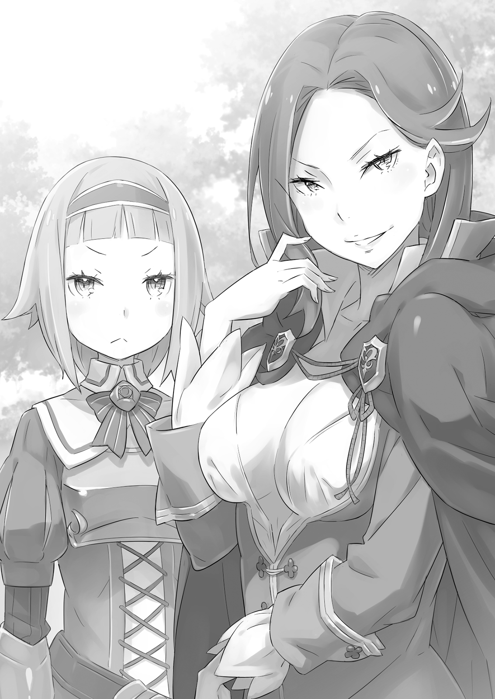
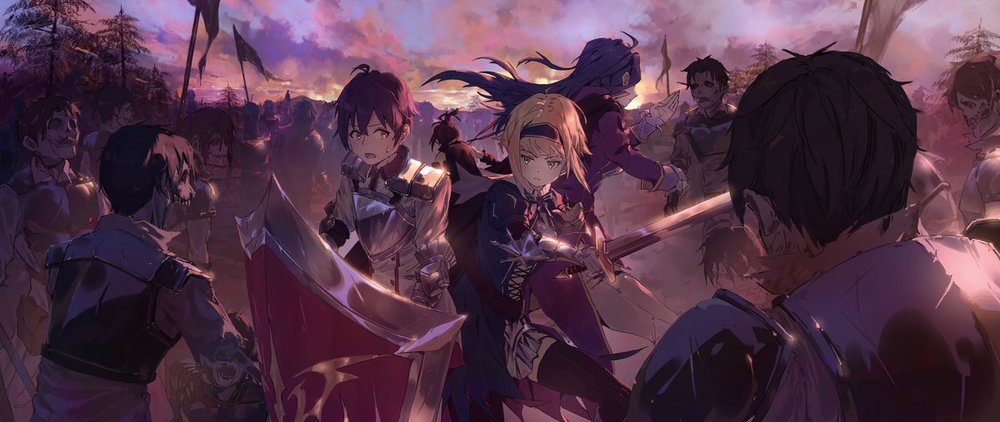
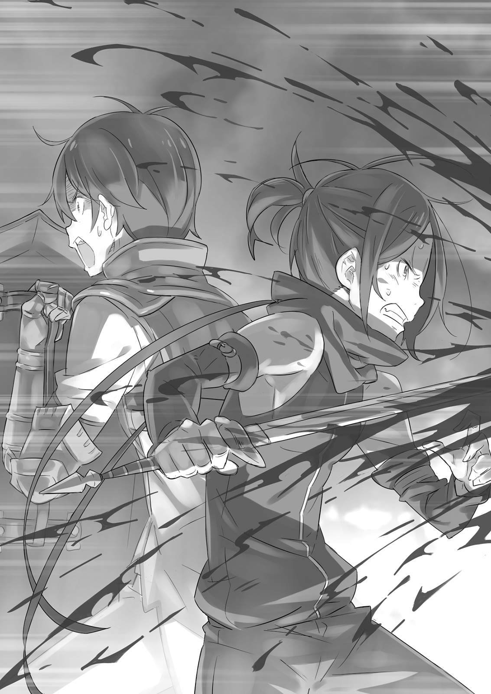

Вильгельм Триас видел мир очень простым местом. Его можно было грубо разделить на то, что ему нравилось, и то, что нет. И прямо сейчас перед ним было само воплощение последнего.

— Он прорвал окружение полулюдей в битве при Кастуре. Он в одиночку противостоял и уничтожил целый отряд полулюдей. Общее число снятых им голов — восемьдесят восемь, включая голову их капитана. Я бы сказал, хорошо, что он вовремя… смылся! Ха-ха!

— Лично я бы хотел, чтобы он продолжал. Хотя попытка неплохая.

— Ох, да ладно тебе, вечно ты лезешь, а?

— Работа у меня такая.

Вильгельм стоял по стойке «смирно», пока перед ним препирались двое мужчин. Один был хорошо сложен и высок, само воплощение доблести, второй выглядел добрым, но собранным и нервным. Оба носили форму, указывающую на то, что они полноправные члены рыцарского ордена.

Вильгельма выписали из лазарета этим утром, и он вернулся в казармы, но эти двое остановили его прежде, чем он успел приступить к своим повседневным обязанностям.

Он был настороже. Что двум рыцарям могло быть нужно от него? Эти двое, казалось, всё больше интересовались им, хотя он и не мог скрыть своего недоверия к старшим по званию.

— Похоже, он доставил врагу немало головной боли. Он просто продолжал кромсать их, пока наша армия не пришла и не остановила его… Говорят, когда его нашли, там была гора трупов.

— Все, кто его видел, были напуганы до смерти. Они утверждали, что среди нас ходит Демон Меча!

— Демон Меча! — сказал худой мужчина. — Мне нравится! Звучит хорошо. Продолжай свою грязную работу, парень, и убедись, что многие узнают это имя. Хотя должен сказать, слишком уж он мелковат для такого прозвища!

Высокий мужчина рассмеялся и положил руку Вильгельму на висок, но его ладонь была такой большой, что практически накрыла всю голову мальчика.

— Что это тут, зоопарк?! Что вам от меня нужно? — Вильгельм смахнул руку мужчины и отпрыгнул назад, сверля их обоих испепеляющим взглядом.

Крепко сложенный мужчина размял руку, которую оттолкнул Вильгельм. — Нравится мне твой дух, так разговаривать с рыцарями. Молодость — лучшее время для безрассудства.

— Молодые и те, кто молод душой, не так уж сильно отличаются. Лицо может состариться, но только когда стареешь внутри, по-настоящему сожалеешь о потерянном.

— Любой будет стариком по сравнению с этим парнем. Согласно записям, ему пятнадцать! Как тебе такое, Пивот? Вдвое моложе тебя! Вдвое моложе и вдвое больше убийств! Он выставляет тебя в дурном свете!

— Я здесь мозговой центр. Я занимаюсь всем, с чем не справляются дети. — Утончённый мужчина достал белый носовой платок и вытер лицо там, куда попала слюна здоровяка. Разговор снова обошёл Вильгельма стороной, и на этот раз он не был настроен великодушно.

— Если я вам ни для чего не нужен, то оставьте меня в покое. У меня есть дела, знаете ли.

— О, неужели? Мы просто ждём приказа. Какие у тебя могут быть дела?

— Тренировка с мечом. Говорят, если пропустишь день, потребуется три дня усилий, чтобы наверстать. Я не собираюсь делать три удара там, где могу убить одним. Терпеть не могу неэффективность, — сплюнул он.

Он уже собирался направиться к тренировочной площадке за казармами, когда здоровяк разразился смехом от ответа Вильгельма.

— Слышишь это, Пивот? Он пахал на поле боя, пока не свалился, но даже не собирается отоспаться — сразу идёт упражняться с мечом!

— Да, слышал. Я знаю, что молодые люди всегда импульсивны, но это глупо даже для мальчика его возраста.

Рыцари они или нет, Вильгельм не мог терпеть эти насмешки. — Вы двое хотите увидеть мои навыки воочию? — Ему нужно было наверстать два дня тренировок.

Но здоровяк ответил на испепеляющий взгляд Вильгельма громовым хохотом. — А, как раз то, что я хотел услышать. Знаешь, в рыцарском ордене ходят слухи о пареньке с мечом, который уделал некоторых из наших самых бестолковых рыцарей!

Утончённый мужчина покачал головой; монокль на его глазу странно блеснул. — Молод ты или нет, но вина лежит и на тебе. Может, ты и исключительно способен для своего возраста, но легко увлекаешься.

Они излучали готовность к бою, уверенность в своих силах. Это резко контрастировало с тем, как они вели себя мгновение назад. Вильгельм облизнул губы.

— Так вот чего вы хотели всё это время?

— Извини, парень, — сказал здоровяк. — Иногда приходится делать то, что должно. Но не волнуйся. Мы можем быть выше тебя по званию, но будем драться честно. Если есть что-то, чего Бордо Зелгеф никогда не делает, так это не оскверняет место боя.

— Он человек слова, так что я бы не беспокоился. Ох, я ведь не представился, не так ли? Я Пивот Арнанси, присматривающий за господином Бордо. Весьма рад .

Вильгельм в замешательстве посмотрел на громадного Бордо и утончённого Пивота, когда те представились. Их было трудно понять; он не знал, чего именно они хотели, но их ближайшая цель была ясна. Это было то же самое, чего в этот момент хотел Вильгельм.

— Я быстро с вами разберусь и вернусь к тренировке.

— Это как посмотреть. Может, ты снова окажешься на койке в лазарете!

Вильгельм направился по каменной дорожке к тренировочной площадке, и Бордо зашагал рядом с ним размашистыми шагами. Между ними практически летели искры. Пивот тихо выдохнул и последовал за ними.

Сталь встретилась со сталью с пронзительным визгом; он почувствовал, как металл скребётся о металл, и увидел краем глаза короткую красную вспышку искр. Звук повторился, когда Вильгельм опустился почти до земли и двинулся вперёд, отражая опускающуюся на него алебарду и наступая на древко, чтобы предотвратить следующий ход противника.

Наступила мгновенная пауза, а затем вспышка серебра остановилась совсем рядом с толстой шеей.

— Я победил.

— …Я не был к этому готов, — тихо сказал Бордо.

Вильгельм, обильно потеющий, но с триумфальной улыбкой воина на лице, опустил меч, тяжело дыша и выпуская горячий пар изо рта.

Он использовал тупой тренировочный клинок. Оружие Бордо, длинная алебарда, зажатая сейчас под ногой Вильгельма, было также затуплено. Они не могли лишить жизни, но оба бойца были достаточно умелы, чтобы защитить себя от ударов друг друга. Битва была напряжённой, но ни у одного из них не было ни синяка. Любой отчёт о битве гласил бы, что оба бойца заслуживают отличия.

— Это значит, я выиграл семь раз и проиграл три. Думаю, мы всё уладили. Ты едва ли стоил моего времени.

— Я даже злиться не могу! Ва-ха-ха, так мне и надо за то, что вызвал тебя. Сдаюсь! Меня давно так основательно не били. Приятное чувство!

— Не понимаю, о чём ты. — Вильгельм намеревался прозвучать язвительно, но вместо этого вызвал какое-то веселье. Он нахмурился.

Бордо высвободил свою алебарду из-под ноги Вильгельма и закинул её на плечо. Он провёл рукой по своим коротким бледно-голубым волосам и сказал: — А как насчёт улыбки? Ты сразился со мной — мной! — и победил. Я могу сражаться на равных с кем угодно, кроме Королевской гвардии. Полагаю, те другие парни, которых ты побил, не просто сачковали.

— Полагаю, нет, — сказал Пивот, — как и этот юноша. Это… довольно ужасающе видеть такого умелого в пятнадцать лет. — Он наблюдал за их дуэлью со стороны.

Вильгельм много раз слышал, как люди говорили о нём подобное. Но в голосе Пивота не было ни трепета, ни страха, которые обычно сопровождали это суждение. Впрочем, Вильгельму было всё равно.

— Мои извинения, что вы не смогли преподать урок такому сварливому мальчишке, — сказал он. — Что теперь будете делать? Побежите плакаться своим начальникам, чтобы они послали за мной мечников получше?

— Мог бы, наверное, но когда ты сложен как я, было бы странно плакаться кому-либо, кроме, может быть, Священного Дракона Волканики. А если бы я побежал к Дракону из-за такой мелочи, меня бы, вероятно, превратили в кучу пепла!

— Прежде чем это случится, — сказал Пивот, — позвольте нам сказать вам, почему мы на самом деле здесь, Вильгельм Триас. Мы разыскали вас не для того, чтобы свести личные счёты под предлогом состязания в силе. Хотя, учитывая, как вы себя проявили, полагаю, наша попытка восстановить справедливость всё равно была бы бессмысленной.

— Ой! — воскликнул Бордо. — Мой друг не очень-то тактичен, не так ли? Ха-ха-ха!

Вильгельм поднял бровь на эту неспособность понимать иронию. — Если вы пришли сюда не драться…

— Уверяю вас, нет. Это был просто способ подбодрить вас. Но, как бы то ни было, к делу. Вильгельм Триас, у нас для вас сообщение. Отныне вы будете применять свои навыки на службе в Отряде Зелгеф, возглавляемом вот им, Бордо Зелгефом.

Вильгельм уставился на Бордо суженными глазами. Мужчина был воплощением могучего рыцаря, его бочкообразная грудь выпячена, а алебарда опиралась на плечо.

Поскольку последний отряд Вильгельма был уничтожен, он не возражал против назначения в новый. — А вы уверены в этом? Я участвовал в двух битвах, и в каждой все в моём отряде были убиты. Вы планируете быть следующими? — спросил он, прикрыв один глаз. Это было неуважительно по отношению к тем, кто храбро пал в бою, но Бордо торжественно покачал головой.

— В тех двух последних битвах — на Плато Редонас и Поле Кастур — было слишком много потерь. Редонас был хотя бы стратегической победой, но Кастур — это непростительно. Такие потери были беспрецедентны. Королевская армия была вынуждена провести крупномасштабную реорганизацию.

— И я не думаю, что будет строго точно сказать, что все в ваших отрядах были убиты. Мне сообщили, что выжил ещё один юноша. Пройти через всё это — у вас двоих, должно быть, отменная удача. Или, возможно, отменное чутьё.

Исход битвы был хорошо известен, как и состояние армии после неё. Завлечённые авангардом, большинство отрядов, попавших в зону действия магических кругов полулюдей, были уничтожены. Единственными выжившими были те, кому, как Вильгельму, хватило присутствия духа прорваться вперёд, а также те, кто смог избежать заклинаний в хаосе. Горстка невероятных счастливчиков выжила, несмотря на то, что находилась в самой гуще событий.

— Между тем, Отряд Зелгеф был прямо на передовой, но каждый из нас вернулся живым, — гордо сказал Бордо.

— Тебя спасла интуиция, — сказал Пивот Вильгельму. — Ты, может, и не выглядишь так, но ты человек, на которого можно положиться в бою. Вот почему мы за тебя не беспокоимся.

Только тогда Вильгельм понял, что всё это было завуалированным ответом на его собственное саркастическое замечание.

Видимо, приняв молчание Вильгельма за сомнение, Бордо поднял алебарду и начал расписывать военные подвиги отряда. — Знаешь, нас спасла не удача. Мы прорвали вражеское окружение, рубили их, даже когда они злорадствовали над нами…

Но Вильгельм прервал его. — Да-да, верю. Это всё, о чём вы хотели поговорить? — Вильгельм не собирался притворяться, будто думает, что Бордо всё это выдумывает. Хотя мальчик в конечном итоге и победил в их дуэли, Бордо был первым человеком в столице, которому удалось выиграть у него хотя бы один раунд. И он прекрасно понимал, что этот здоровяк проявил себя в немалом количестве настоящих сражений. Но ведь и Вильгельм тоже.

— Если это всё, что вам нужно, то позвольте мне вернуться к тренировке. Мне просто нужно явиться в этот ваш Отряд Зелгеф или как там его в казармах, верно?

— Он хочет от нас избавиться, — сказал Пивот. — Да, это всё, что нужно сделать. Отряд Зелгеф принимает вас и ещё одного нового члена в рамках реорганизации, итого двадцать человек. У вас встреча с капитаном завтра вечером. Постарайтесь не пропустить.

— Кто этот другой новичок?

— Единственный другой выживший из вашего отряда — Гримм Фаузен. Мы подумали, что знакомое лицо поможет вам освоиться… хотя, встретив вас, подозреваю, мы ошиблись.

Вильгельм отвернулся с выражением безразличия, уже поднимая меч, и Пивот вздохнул — наполовину с раздражением, наполовину со смирением.

Вильгельм, конечно, знал это имя. Но он почти не отреагировал. Мальчик, Гримм, не вызывал у Вильгельма особого интереса. Он был бесполезным трусом — ещё одна вещь, которая ему не нравилась.

Довольно грубо завершив разговор с двумя старшими офицерами, Вильгельм погрузился в тренировку. Бордо и Пивот мгновение понаблюдали за ним и переглянулись.

— Он любит свой меч не меньше, чем я слышал — может, даже больше! Он на семь лет моложе меня и выставит меня в дурном свете! Полагаю, мне нужно вернуться к тренировкам с алебардой.

— Подумать только, встретить кого-то столь юного, кто пожертвует сном ради практики с мечом. Мир — более странное место, чем я предполагал. Кого только не встретишь в столице, полагаю. Надеюсь, Гримм Фаузен окажется нормальным, когда мы с ним встретимся.

Итак, был Бордо, который выбрал несколько странную вещь для восхищения; Пивот, который всегда мог найти повод для беспокойства; и Вильгельм, который не обращал внимания ни на одного из них, а целеустремлённо выполнял свои упражнения. Этого было бы достаточно, чтобы сторонний наблюдатель задался вопросом, был ли хоть один член Отряда Зелгеф, по правде говоря, в здравом уме.

Прошло несколько дней с тех пор, как Вильгельма назначили в Отряд Зелгеф. В первый день Вильгельм встретил других членов своего отряда с обычным холодным безразличием. Он в основном состоял из солдат, которых Бордо набрал сам. Это обеспечило Вильгельму, который проявлял мало уважения к командиру отряда, холодный приём. Но все мысли о том, чтобы лично проучить его, были отложены, когда они услышали отчёт Бордо.

— Вильгельм даже лучше меня! А я лучше всех вас, так как же кто-то из вас собирается преподать ему урок? Чёрт возьми! Как насчёт небольшой утренней тренировки?

И действительно, со следующего дня отряд можно было найти на тренировочной площадке на рассвете. Каждый день главной темой разговоров были тренировочные бои между Вильгельмом и Бордо, которые были настолько напряжёнными, что кто-то мог едва не погибнуть.

Что касается Гримма, который присоединился к отряду одновременно с Вильгельмом, он продолжал выживать, как и раньше, стараясь не выделяться своей некомпетентностью. Вскоре он привязался к Пивоту, словно тень.

Люди стали избегать Вильгельма ещё старательнее, чем раньше, иногда поглядывая на него так, будто считали сумасшедшим, но мальчика всё это не интересовало. В его предыдущем отряде к нему относились как к чудовищной диковинке, а в этом слишком много в него лезли; Вильгельм находил и то, и другое одинаково обременительным.

В душе Вильгельм любил всё делать в одиночку, включая тренировки. По мере продолжения тренировочных боёв с Бордо он начал понимать, как тот дышит, каковы его сигналы, пока почти каждая победа не стала доставаться Вильгельму. Мальчик не видел смысла так усердно тренироваться против одного и того же противника. Если бы они встретились на поле боя, они сразились бы только один раз; второго шанса не было бы.

Если бы в любой момент во время тренировки в его сердце зародилась слабость, стало бы почти невозможно сосредоточить весь свой дух на поставленной задаче. Не раз он испытывал желание сразить противников, которые тренировались спустя рукава. Было гораздо проще оставаться полностью сосредоточенным на тренировках в одиночку.

«Я хочу… отправиться в бой».

Дело было не в том, что он хотел убивать. Он не стремился отнимать жизнь. Он просто хотел использовать свой меч. Истинное мастерство владения мечом можно было найти только в бою, в состязании, где любой мог лишиться жизни в любой момент.

Вильгельм провёл недели в столице с этой мрачной мыслью — пока ему не предоставился шанс вернуться на место того ужасного поражения, и пути Демона Меча не пересеклись с новым врагом.

Путь от столицы до Поля Кастур на драконьей повозке занимал около восьми часов. Отряд Зелгеф разделился на две группы, по десять человек в каждой повозке. Между ними находилась третья повозка, перевозившая важную персону.

Бордо звучал соответственно взволнованно, когда описывал им миссию. — Вы должны радоваться! Наша доблесть так велика, что нам дали особое задание. Мы сопровождаем кое-кого важного на Поле Кастур. Это честь!

Пивоту, поправлявшему монокль, оставалось лишь дополнить детали. — Мы будем сопровождать специалиста, исключительно искусного в магии. До сих пор в нашей стране было мало выдающихся личностей с большими магическими способностями, что было роковым слабым местом против владеющих маной талантов полулюдей. Мы усвоили это очень горьким путём во время недавней битвы на Поле Кастур.

— Полагаю, они хотят осмотреть магические круги, которые враг использовал, чтобы поймать нас в ловушку, — сказал Бордо. — Круги, вероятно, больше не активны, но они хотят взглянуть сами. А я-то думал, маги вечно сидят взаперти в своих комнатах!

Бордо выбрал несколько странный способ выразить своё восхищение — но ещё более странным было то, что Вильгельм каким-то образом с ним согласился. Он всегда думал, что те, кто полагается на ману вместо стали, что-то упускают в жизни.

В передней повозке ехали Бордо и Пивот вместе с восемью другими членами отряда; в задней везли ещё десять человек, включая Вильгельма и Гримма. Повозка посередине, перевозившая важную персону, также имела контингент рыцарей из другого отряда для усиления охраны.

Казалось излишним отправлять столько людей для охраны одного человека, но это лишь подчёркивало, насколько важна эта миссия. Однако для Вильгельма ни личность их гостя, ни детали миссии особого значения не имели. Единственное, что его волновало, — остался ли кто-нибудь на том поле, с кем стоило бы сразиться. Он рассудил, что, к сожалению, это маловероятно.

Всё это держало Вильгельма на взводе.

— Эй, Гримм. Ты выглядишь не очень хорошо. Ты в порядке?

Голос вернул Вильгельма к реальности, вырвав его из мысленной тренировки с мечом. Напротив него в тесной повозке он увидел бледного мальчика. Другой член отряда тёр ему плечи.

Гримм был почти белый. В драконьей повозке использовалось благословение защиты от ветра, что означало, что это было не просто укачивание. Вероятно, это было психологическое — личная реакция на место назначения.

— Я… я в порядке. Просто… немного подташнивает. Я скоро возьму себя в руки…

— Ты уверен? Не думаю, что доктора уже изобрели лекарство от трусости. Это серьёзная болезнь — думаешь, сможешь вылечить её самостоятельно? Я знаю, что у тебя она хроническая, — вмешался Вильгельм, разгневанный этой попыткой фальшивой бравады.

— … — Гримм сначала ничего не сказал, но выражение боли и сожаления промелькнуло на его лице. Затем гнев исказил его обычно спокойные — то есть слабые — черты, и он свирепо посмотрел на Вильгельма.

— Ты кажешься ужасно весёлым. Хотя должен прекрасно знать, куда мы направляемся.

— С чего ты взял, что я буду вести себя как ты? Ты и шагу ступить не можешь без няньки.

— Весь наш отряд был уничтожен там! Разве неправильно переживать из-за этого?!

— Ты переживаешь не из-за их смерти. Ты просто жалеешь себя. Ты рад, что вчера не оказался на их месте, и боишься, что завтра можешь оказаться. Мне не нужно напоминать тебе, что мы оба потеряли много товарищей. Обычно одних и тех же.

Их спор продолжался безрезультатно, и ни один из юношей не уступал.

Все были на взводе, отчего Гримм был в худшем настроении, чем обычно. Пока Вильгельм сидел, прижав к себе свой любимый меч, Гримм выглядел так, будто готов был на него наброситься.

— Да прекратите уже! На этот раз ты зашёл слишком далеко, Вильгельм!

Крики их товарищей прервали их, и поединок взглядов закончился, не перейдя в драку. Гримм пересел так, чтобы не сидеть напротив Вильгельма, а Вильгельм снова погрузился в свой внутренний мир. На этот раз больше никаких помех не было.

Из-за удушающего напряжения в повозке члены отряда с трудом дожидались прибытия к месту назначения.

Когда они отправились в путь, едва рассвело; когда три драконьи повозки наконец прибыли на Поле Кастур, солнце стояло в зените.

— Я знаю, что дорога была достаточно долгой, чтобы у вас задницы онемели, — сказал Бордо, — но вы, ребята, выглядите ещё хуже, чем я ожидал.

Две группы высадились из своих повозок и теперь выстроились под вопрошающим взглядом своего командира. Разница между ними была как небо и земля. Двое юношей, ответственных за очевидную усталость задней повозки, стояли бок о бок — как самые новые рекруты, они должны были — но не смотрели друг на друга.

— Не знаю, что случилось, но наша работа начинается сейчас. Не позволяйте врагу видеть вас уставшими. Выпрямитесь! — рявкнул Бордо. — Мы сейчас встретим нашего гостя. Покажите им своё лучшее поведение! — При этих словах весь отряд выпрямился, забыв о тревогах мгновение назад. Послышался звук шаркающих ног, когда отряд выстроился в два аккуратных ряда. Бордо удовлетворённо кивнул, затем посмотрел на Пивота, стоявшего рядом с ним.

Пивот воспринял это как сигнал, открыл дверь средней повозки и помог гостю выйти на Поле Кастур.

— Нет нужды устраивать из-за меня такую суматоху. Женщина не может не оробеть, когда на неё пялится сто-о-олько суровых лиц, — тон говорящей был лёгким, и она пожала плечами, словно шутя.

У неё были волосы цвета индиго до шеи и кожа белая, как фарфор. Подол её длинной мантии висел чуть выше земли, передняя часть была распахнута, открывая пышную грудь, едва сдерживаемую мужской военной формой. Из уважения к случаю она нанесла минимум косметики — но это едва ли мешало мужчинам заметить её красоту. Самым поразительным были её глаза: один голубой, другой жёлтый.

По отряду пробежало удивление; им не сказали, что человек, которого они сопровождают, — женщина. Это вызвало улыбку на её лице, как у ребёнка, устроившего розыгрыш.

— Я Розвааль J. Мейзерс. Один из немногих магов, служащих при королевском дворе — и, как видите, бедная, беззащитная дева. Я буду рассчитывать на вас сегодня, мальчики.

Она обольстительно улыбнулась. В этот момент Вильгельм решил, что она попадает в категорию того, что ему не нравится.

— Кхм, — сказал Пивот мужчинам отряда, некоторые из которых всё ещё перешёптывались между собой. — Теперь, когда вас познакомили с госпожой Мейзерс, пожалуйста, помните, что она леди. Напоминаю всем неотёсанным варварам в нашем отряде, молодым и старым, следить за своими манерами.

— Ну-у-у, — вмешалась Розвааль, — не стоит быть настолько официальными, чтобы это мешало работе. Я немного подшутила над вами, скрыв свой пол, но, пожалуйста, ведите себя как обычно. Моё имя — то, что наследует каждый глава дома, — просто так вышло, что оно мужское. Наша семья, видите ли, ве-е-есьма уникальна.

— Вы слышали леди Мейзерс. Займитесь своими делами, все.

Конечно, дела в данном случае означали «проявлять крайнюю осторожность».

Пока все приступали к своим обязанностям, Вильгельм почувствовал чьё-то присутствие в драконьей повозке. Этот человек ждал окончания разговора, а теперь выскользнул и встал рядом с Розвааль.

Это была ещё одна женщина. На ней были лёгкие доспехи, а на бедре висел меч. На вид ей было под двадцать; лицо миловидное, но опасный блеск в глазах заставлял колебаться, прежде чем подойти. Её великолепные золотистые волосы были коротко подстрижены, и она казалась колючей. Мечница.

— О, позво-о-ольте добавить, — сказала Розвааль, — это мой личный телохранитель, Кэрол Ремендис. Она весьма искусна, так что я уверена, вы все поладите.

— Благодарю вас, леди Мейзерс, — сказала девушка, — но я бы не беспокоилась. Сомневаюсь, что мы увидим их снова после сегодняшнего дня. Нет причин сближаться с ними — да и не похоже, что они из тех, кто ищет дружбы.

В полной противоположности Розвааль, Кэрол казалась начисто лишённой чувства юмора. Была ли она высокомерна или просто нервничала? В любом случае, выглядела она напряжённо.

— …Что, обе женщины?..

— Ты! Ты там! — Кэрол немедленно выделила источник недоверчивого шёпота: Вильгельма. Она выглядела так, будто готова обнажить меч прямо здесь и сейчас. — Ты смотришь на меня свысока, потому что я женщина? Такого рода предубеждения дорого обходятся рядом со мной.

— Ох, прекрати ныть. Очевидно, ты беспокоишься об этом больше, чем кто-либо здесь. В любом случае, моя работа — охранять твою подругу, а не заботиться о том, чтобы ты чувствовала себя уютно.

— Д-достаточно, Вильгельм! — Пока парень и девушка сверлили друг друга взглядами, Гримм дрожащим голосом попытался урезонить своего товарища по отряду. Вильгельм поднял на него бровь, но Гримм, с горящими от гнева глазами, сказал: — Я не знаю, в чём твоя проблема — ни в повозке, ни здесь. Но тебе нужно придержать язык. Затевать ссору с людьми, с которыми мы должны работать? Ты хоть знаешь, сколько проблем ты создашь нашему командиру отряда?

Остальные члены эскадрона устремили на Вильгельма гневные взгляды, поддерживая Гримма. Учитывая его обычное поведение и то, как он вёл себя сегодня, у Вильгельма было мало союзников.

— …Прошу прощения, — сказал он наконец, хотя выражение его лица подсказывало, что он сделал это лишь потому, что знал — дальнейший спор бесполезен. Это, казалось, успокоило Гримма, который повернулся к Кэрол и склонил голову.

— Мне очень жаль из-за этого. Мы обязательно разберёмся с ним…

— Так и сделайте, — сказала Кэрол. — У меня не больше желания проливать кровь королевства без нужды, чем у вас.

Она отступила, и напряжение в воздухе спало. Бордо, наблюдавший за всем эпизодом с ухмылкой, призвал отряд к вниманию.

— Так! Мы разделимся на три группы. Одна будет сопровождать леди Мейзерс и обеспечивать её безопасность во время осмотра магического круга. Оставшиеся две группы установят периметр безопасности. Остерегайтесь мародёров и любых отставших полулюдей. Славы в том, чтобы умереть здесь, немного, парни, так что смотрите в оба!

Бордо как раз собирался начать распределение групп, когда Розвааль подняла руку. — Прошу прощения, командир отряда. Могу я попросить об одном? Одна маленькая, эгоистичная просьба при распределении?

— Если я смогу это сделать, мэм, разумеется.

— Я хочу, чтобы тот мальчишка был в моей группе. — С улыбкой она указала не на кого иного, как на Вильгельма. Она подмигнула, так что только её жёлтый глаз смотрел на него. — Думаю, так исход будет намного лучше, и для меня, и для всех.

Все присутствующие были озадачены её просьбой.

Вильгельм с горечью подумал, что когда Розвааль говорила о том, что будет лучше для «всех», его это, по-видимому, не касалось.

Отряд едва ли мог отказать в личной просьбе столь важной персоне. И вот Вильгельм оказался среди тех, кто сопровождал Розвааль, как и Гримм, один из наименее приятных ему людей на свете. Ещё двое членов отряда были выбраны для расследования магических кругов вместе с ними, что составило отряд из шести человек, если считать Розвааль и её телохранительницу. Оставшиеся два отряда, возглавляемые Бордо и Пивотом соответственно, занялись установкой периметра.

— Ты выглядишь так, будто проигра-а-ал пари, — сказала Розвааль.

После минимальных препирательств Вильгельм оказался в авангарде своей группы, но его вечно надутый вид не внушал особого доверия. И его работа стала ещё более раздражающей, когда Розвааль продолжала весело завязывать с ним разговор, пока он пытался сосредоточиться.

— Ты так жа-а-аждешь рубить людей?

— Не говорите о людях как о монстрах. Дело не в том, что я хочу кого-то убить. Я хочу найти достойного противника для боя. И если бы мне не пришлось нянчиться с вами весь день, у меня, возможно, был бы шанс это сделать.

— Некоторые могли бы сказать, что такой ответ звучит достаточно чудовищно. В любом случае, лучшее, на что ты мог надеяться в охране — это небольшая оборонительная стычка… Почему-то я сомневаюсь, что тебе этого было бы достаточно.

— Ну, вам, похоже, всё ясно. Вы не знаете, о чём говорите.

— Ты весьма прямолинеен, не пра-а-авда ли? Что ж, у меня с этим нет проблем.

Розвааль прикрыла рот рукой и рассмеялась. Вильгельм мог только хмуриться.

Они не видели ничего необычного, но и результатов их усилия пока не принесли. Битва изменила топографию; деревья были повалены, зелёная земля выжжена дочерна. Сломанное оружие и пустые доспехи усеивали местность. Война оставила свой глубокий след.

— Больно смотреть? — спросила Розвааль.

— Не особенно, — ответил Вильгельм.

— Полага-а-аю, я не удивлена. Ты не похож на такого.

— …Ну, вы тоже.

— Божечки ми-и-илостивые, а ты, возможно, на шаг впереди-и-и меня.

Возможно, Розвааль не любила тишину, потому что, казалось, вмешивалась при каждой возможности. Вильгельм уже решил, что ему придётся внимательно за ней следить. По тому, как держалась Кэрол, он мог сказать, что она способный боец, но именно Розвааль, с её неведомыми глубинами, требовала наибольшей осторожности. Ему сказали, что она специалист по магии, но он ни на секунду не поверил, что это всё, что в ней есть.

Можно было бы ожидать, что Кэрол больше всех будет возражать против резкого тона Вильгельма, но Гримм всё это время занимал её разговорами. Понимая, что они с Вильгельмом будут только спорить, если их оставить наедине, он решил вовлечь её в постоянный поток беседы. Разговор, казалось, шёл довольно гладко, что облегчало жизнь Вильгельму.

— Так вы говорите, что изначально не должны были сегодня быть на дежурстве? — спрашивал Гримм.

— Верно, — сказала Кэрол. — Изначально человек, которому я служу, должен был пойти в качестве телохранителя. Но кое-что случилось, поэтому пришлось идти мне. Боюсь, это крайне неудобно для леди Мейзерс. — Она звучала расстроенной.

Гримм не совсем знал, как ответить. — О, эм, но я уверен, что если бы пришёл ваш господин, кто-то вроде меня только мешался бы под ногами. Уверен, это было бы ещё хуже…

Вильгельму было всё равно. Пока Гримм поддерживал разговор с Кэрол, этого было достаточно. Если разговор не касался его, он не собирался вмешиваться.

Только намёк на кого-то ещё более могущественного, чем Кэрол, привлёк его внимание. Правда, была отчётливая вероятность, что Кэрол скромничала насчёт себя, преувеличивая способности своего господина, но всё же…

— Кажется, я слышала, что тебя зовут Вильгельм, не так ли-и-и? — сказала Розвааль.

— …Да, верно.

— Какой у тебя язык. Могу ли я предположить, что твои навыки ему соотве-е-етствуют?

— …

— Не склонен хвастаться? Ну-у-у, командир отряда и его помощник не колеблясь доверили тебе самую важную работу. Это знак того, насколько тебе доверя-я-яют. Это даёт мне большие надежды на тебя.

Игнорируя молчаливого мечника, Розвааль почтипританцовывая шла вперёд, сцепив пальцы за головой; казалось, она вот-вот начнёт напевать.

Оглядевшись, она сказала: — Похоже, мы скоро будем на месте.

Пока она говорила, она и её эскорт достигли вершины холма. Внизу виднелись слабые очертания геометрической фигуры. Земля местами была разворочена, и части знака были погребены, но это был тот самый магический круг, который Вильгельм видел в день битвы.

— Ну-у-у что ж, интересно, что мы найдём? — Розвааль немедленно съехала вниз по склону, чтобы рассмотреть поближе. Кэрол поспешила за ней, а Гримм, в свою очередь, держался рядом с Кэрол. Вильгельм пожал плечами и вместе с двумя другими членами отряда остался наблюдать с вершины холма.

Вильгельм весь день не чувствовал присутствия других живых существ, и сейчас ничего не изменилось. Он не знал, где были Бордо и остальные, но поблизости их не было. Пока что день приносил только скуку.

— …Теперь понятно, — сказала Розвааль. — Я подумала, что дело может быть в этом, когда впервые услышала об этом. Они потратили немало времени на установку этого. Это было бы невозможно, если бы и стратег, и тот, кто это осуществил, не были бы очень, о-о-очень искусны в магии. Это может быть угрозой для всего королевства.

— Н-неужели? Эти магические круги настолько мощные? — спросил Гримм.

— Сами круги опасны, конечно, но более угрожающе то, что у врага есть не один высококвалифицированный ма-а-аг. Нужно быть немного сумасшедшим, чтобы даже подумать о покрытии целого поля боя магическими кругами. Но это значит, что они могут сделать то же са-а-амое где-нибудь ещё.

— К-как?!

Гримм казался более напуганным, чем того заслуживала оценка Розвааль. Он стоял там, дрожа от гипотетической ситуации. Он определённо не был создан для солдатской службы.

Он продолжал тереть затылок и оглядываться, словно у него было дурное предчувствие, от которого он не мог избавиться. Наконец, он повернулся и позвал Вильгельма. — Вильгельм! У тебя нет странного чувства?

— Нет, — равнодушно ответил Вильгельм отчаявшемуся парню. — У тебя просто разыгралось воображен…

Говоря это, Вильгельм скользнул взглядом к подножию холма — где увидел летящую по воздуху стрелу, направленную прямо туда, где Розвааль присела на землю.

— !

Решение Вильгельма было мгновенным, его действие — лишь немного медленнее. Он выхватил меч с бедра быстрее, чем мог уследить глаз, и метнул его так, что он вонзился в землю рядом с Розвааль, и лезвие приняло стрелу вместо неё. Звон от удара стрелы о сталь оповестил всех о засаде.

Но почему Вильгельм ничего не заметил?

Он бросился вниз по склону, крича: — Засада! Всем к бою! — Он вытащил свой меч из земли и поднял его; краем глаза он видел, как Кэрол и Гримм тоже готовят своё оружие. Двое других членов отряда с опозданием начали спускаться по склону, но Вильгельм жестом велел им оставаться на гребне. Затем он начал осматривать местность.

Он что-то увидел. — …Смотрите туда.

Прямо напротив холма на одном колене стояла фигура с луком. Неторопливо она достала ещё одну стрелу и натянула тетиву. Затем, без колебаний, выстрелила.

— ! — Вильгельм отбил приближающийся снаряд мечом, затем уставился на противника. Рядом с ним Гримм, очевидно, не мог поверить своим глазам.

— Т-Торта?..

Нападавшим был, или когда-то был, его друг — лучник Торта Уизли.

Теперь на Торту было страшно смотреть. Он едва ли был человеком. Половина плоти на его лице отсутствовала, обнажая кость и одно круглое глазное яблоко. Из его ран сочился гной, на сырой плоти кишели личинки. Гниющий призрак был прикрыт лишь клочками ткани и обломками доспехов. На руке, сжимающей лук, не хватало нескольких пальцев.

— Этот труп… движется?.. — Кэрол, держа меч перед собой, побледнела при виде мёртвого Торты. Гротескное зрелище усугублялось его кажущейся невозможностью. Тем не менее, Кэрол выглядела лучше, чем Гримм, который был бледнее бледного и, казалось, вот-вот упадёт в обморок.

— Эй, маг, — сказал Вильгельм, — …это то, что можно сделать с помощью магии?

— Ты ужасно хладнокро-о-овен для человека, только что увидевшего живой труп. Я так понимаю, это кто-то, кого ты знаешь?

— Мёртвые для меня ничего не значат. Так что нет, я его не знаю.

— Похвальный взгляд. Отвечая на твой вопрос… и да, и нет. Это не совсем область ма-а-агии. Это проклятие, — ответила Розвааль с видом собственной важности.

Вильгельм поднял бровь на это. Но времени на дальнейшее разбирательство не было. Торта был не единственным их врагом.

— …

Послышался шорох, когда трупы один за другим начали выкарабкиваться из земли вокруг них. Некоторые были мертвецами королевской армии, другие — бывшими полулюдьми. По-видимому, проклятие не было разборчивым.

Ни один из неживых воинов не был в идеальном состоянии, но их было почти сотня, что давало им преимущество. Вильгельм цыкнул языком, затем поставил Розвааль в центр их построения, окружив её собой, Кэрол и Гриммом.

— Ну-у-у что ж, — сказала она, — это неожиданное развитие событий. Я думала, ты просто убежишь сражаться с ними всеми в одиночку.

— Не думайте, что я бы этого не хотел. Но я не могу позволить вам умереть. Я не буду прикрывать вашу спину. Просто молитесь, чтобы те двое были полезны.

— Что ты сказал?! Как ты смеешь..!

Крик Гримма прервал её. — Кэрол, они идут!

Зомби набросились на них со всех сторон одновременно. Огромный труп с громадным мечом наступал на Вильгельма, вместе с другим телом, вытянувшим руки, несмотря на отсутствие кистей и головы. Сколько урона им придётся нанести этим трупам, чтобы сдержать их?

«Как бы то ни было, очевидно, что простое отрубание голов их не остановит».

Вильгельм нанёс удар мечом, отрубив руки существу с массивным клинком. Возвращая руку, он рассёк ему живот, затем снова провёл по паху, когда тело начало падать. Оно было разрублено на шесть частей, включая две отрубленные руки. Когда части достигли земли, они перестали двигаться. Вильгельм нанёс два диагональных удара по безрукому зомби, разрубив его на четыре части; они тоже замерли.

— Просто нужно убить их ещё раз, — сказал он.

— Какое замеча-а-ательное умозаключение, — сказала Розвааль за его спиной. Он почти слышал усмешку в её голосе.

Вильгельм бросил взгляд через плечо. Кэрол рубила трёх нежитей перед собой, а Гримм поддерживал её щитом, укрепляя линию боя. Двое мужчин, оставшихся на вершине холма, справлялись сами, как и подобает членам Эскадрона Зелгефа, и быстро расправлялись с нежитью вокруг них.

Зомби не были сильными бойцами. Насколько бы способными солдатами они ни были при жизни, будучи трупами, никто из них не обладал значительными боевыми способностями. Они просто не могли сравниться с живыми воинами.

— Я только пачкаю свой клинок. Где маг, который ими управляет?

— Я ценю твоё доверие, но боюсь, даже мне не-е-емного трудно их отследить. Но с таким количеством зомби, они не могут быть далеко.

— Нет? Хорошо, тогда.

Если они останутся на этом поле боя, скоро вокруг них не останется трупов. А нет трупов — нет и зомби. Но Вильгельм находил это крайне неудовлетворительным.

— …

Отбивая атаки наступающей нежити, он наносил удары клинком и возвращал их в прах. Неживые воины воняли гнилью и шаркали с отвратительным слышимым хлюпаньем, но Вильгельм внимательно отмечал их поведение.

Он прорубился к центру орды, где стояли, не двигаясь, двое зомби. Нежить напирала на него, словно пытаясь что-то защитить. Но удар сверху и два быстрых пинка принесли вторую смерть. Он отвёл меч назад и собирался нанести удар, когда…

— Хрк!

Столп пламени вырвался перед ним, заставив отпрыгнуть назад. Вильгельм дико рубил приближающийся огонь, пока воздух перед ним не замерцал, и пустое пространство внезапно заполнилось маленькой гуманоидной фигурой.

Кровь Вильгельма застыла в жилах, когда он осознал это.

Это была маленькая девочка в белой робе. — …Пошло не так, как я планировала, — пробормотала она. На вид ей было около десяти лет — может, чуть младше или чуть старше. У неё были длинные светло-розовые волосы и очаровательное лицо. Кроме босых ног и робы, которая была её единственной одеждой, она выглядела как совершенно обычная, хотя и поразительно спокойная, юная девочка.

Тем более тревожно было знать, что под девичьим обликом скрывается ужасное чудовище. Она излучала ошеломляющую гнусную ауру, настолько сильную, что не могла её скрыть, настолько сильную, что её можно было обнаружить почти мгновенно.

— Что… что это за монстр? — сказал Вильгельм, почти про себя.

— Монстр?.. Значит, я действительно несовершенна. Мне ещё далеко до моей матери, — грустно прошептала девочка, нахмурившись.

Это вызвало удивлённую реакцию у кого-то поблизости.

— Мать? Уж не шутишь ли ты. Подумать только, что такой отвратительный бракованный товар, как ты, имеет хоть что-то общее с моим почтенным учителем. Я и слышать об этом не жела-а-аю. — Розвааль шагнула вперёд. Её беззаботное веселье исчезло, сменившись яростным взглядом, который она устремила на маленькую девочку.

Девочка, со своей стороны, казалась озадаченной гневом Розвааль. — Прошу прощения. Кто вы?

— Твоя погибель. Я уничтожу тебя, полностью и окончательно.

— Тогда мне очень жаль. Особенно потому, что вы, кажется, серьёзны.

Девочка казалась практически безэмоциональной, в резком контрасте с нарастающей яростью и всё более опасным блеском в глазах Розвааль. Девочка восприняла это спокойно, оглядывая окружение и указывая на неживых воинов.

— К счастью, я смогла получить то, за чем пришла сюда, — сказала она, — и мне больше не нужно беспокоиться о вас. Я ухожу. Вы дали мне много пищи для размышлений. — Девочка склонила голову, и её тело начало подниматься над землёй.

— Стой там же, ты..! — Вильгельм бросился на неё, намереваясь предотвратить её побег, но неживые воины сомкнулись, чтобы остановить его.

— С дороги! — Он, казалось, был застигнут врасплох зомби, который увернулся от его атаки и двинулся для контрудара. Он был таким быстрым, словно другое существо по сравнению с прежними марионетками.

Он видел, что все зомби вокруг него тоже двигались быстрее. Даже Вильгельм не мог сразить их одним ударом, и всё же они всё ещё не были ему ровней…

— А-а-а-а-аргх!

— Внезапно… их так много… Я не могу удержать их всех!..

Он услышал крик Гримма и увидел, что Кэрол тоже была ранена и двигалась медленно. В конце концов, все, кроме Вильгельма, будут подавлены.

— Мы сократили их число, но это, вероятно, сделало остальных сильнее. Должен быть один «ядерный» зомби, который действует как точка контроля для всех остальных. Если мы уничтожим его, мы сможем переломить ситуацию.

— Как нам узнать, который из них?

— Он будет двигаться иначе. Это ключ… если сможешь заметить.

Благодаря Розвааль у них был план, но найти ядерного зомби в хаосе поля боя было бы нелегко. Вильгельм посмотрел на холм, надеясь получить помощь от своих товарищей по отряду наверху, но обнаружил, что стрела, выпущенная с невероятной силой, пронзила одного из них в бедро и вырвала кусок плоти.

Виновником был Торта, такой же меткий в поддерживающем огне, каким был при жизни. С крупным телом, скрывавшим его сообразительность, Торта был исключительно выдающимся лучником в их отряде, а его огромный лук обладал огромной мощью и точностью.

Вильгельма осенило.

Зомби, чьи способности не изменились с момента жизни — Торта Уизли — был контрольной точкой.

— Полагаю, мы выбрали того, кого тебе будет трудно убить. Мы наблюдали за тобой. — Это бесстрастное замечание пришло от девочки, улетающей всё дальше и дальше. Но оно подтвердило догадку Вильгельма.

Скрипнув зубами, Вильгельм посчитал, сколько врагов между ним и Тортой, а затем, практически пылая яростью, разрубил неживого воина перед собой на четыре части.

Этого будет недостаточно. Вильгельм мог добраться до Торты и убить его. Но пока он будет этим занят, трое его товарищей станут пищей для зомби. Был только один способ сохранить линию боя и при этом остановить Торту…

— Гримм! — крикнул Вильгельм. — Ты должен добраться до Торты! Он — ядро!

Они оказались в ловушке на дне котловины. Из всех них Гримм был наименее полезен в бою. Чем глубже они продвигались, тем больше врагов будет, и его потеря меньше всего скажется на их общей силе.

Гримм, всё ещё держа щит, посмотрел на Торту, затем на неживое существо, укравшее тело его друга. Он снова и снова качал головой.

— Я… я не могу этого сделать! Я не могу!

— Ты иди! Я займу твоё место, помогая девушке! Поднимись на тот холм и отруби ему голову! Он лучник без охраны. Если сможешь подобраться, ты сможешь убить его!

— Дело не в том, смогу я его победить или нет! Ты говоришь мне убить моего друга! — Гримм был практически на грани слёз, даже отчаянно отбиваясь от атак врага.

Вильгельм знал, что Гримм и Торта были близки. Он также знал, что Гримм не мог использовать свой меч с момента уничтожения их отряда. И всё же…

— Да, говорю! И что с того?!

— Что с того? Всё! Я не могу убить своего друга! Я… Я не такой, как ты! Я не могу этого сделать!

— Какая часть этой твари — твой друг? Ты что, сквозь слёзы не видишь? Твой друг мёртв и ушёл! Эта штука — труп. Он просто немного заблудился — его здесь не должно быть!

Вильгельм увидел, как Кэрол пошатнулась. Она нанесла боковой удар по зомби, который собирался напасть на неё. Ошмётки отскочили от сгорбленной спины Гримма. Вильгельм толкнул его и крикнул: — « Ох, я не могу, я не могу! » Вечно ты так! Ты всё время ищешь оправдания! Ну, если у тебя есть силы спорить, у тебя есть силы пойти туда и убить эту тварь! Хватит реветь и иди покончи с этим!

— …

Вильгельм безжалостно выкрикивал свою философию, сражая зомби за зомби.

Он почувствовал, как Гримм выпрямился за его спиной. Мальчик посмотрел себе под ноги и пробормотал: — Это может быть Торта.

— И что с того?! Скажи мне!

— Я просто больше не могу использовать свой меч. Мне так страшно.

— И что с того?!

— Все остальные умерли, а я выжил, и я не могу этого вынести!

— И что ?!

— Я не хочу умирать!

Спина к спине, они кричали друг на друга.

А затем Гримм бросился вперёд, подняв щит. Кэрол поспешила за ним, чтобы поддержать его, пока Вильгельм занялся кровавой работой по защите Розвааль.

Гримм взбежал на холм, отражая удары неживых воинов щитом, достигнув Торты одним безумным рывком.

Огромный лук выпустил ещё одну стрелу. Гримм отбил её щитом с такой лёгкостью, будто видел подобную атаку миллион раз, и, вскинув свой безупречный меч, прокричал:

— Я буду жить!

И он нанёс Торте удар, который, хоть и был полон страха, тем не менее снёс ему голову.

Так битва подошла к концу.

— Это после-е-едний! — Бордо с невероятной силой обрушил свою секиру на воина-нежить, превратив его в груду ошмётков плоти, ничем не напоминавшую человеческое тело. Огромный воин тяжело вздохнул, положив алебарду на плечо и стряхивая налипшие на доспехи куски плоти.

— Так! Бой окончен! Если кто помер, крикните!

— Это невозможно, — ответил Пивот. — Потому что, рад доложить, все живы.

Различным группам отряда Зелгеф удалось прорваться сквозь толпу нежити и соединиться вскоре после того, как Гримм уничтожил Торту. И Вильгельм, с его невероятным мастерством владения мечом, и раненая Кэрол благополучно вернулись. Даже боец отряда, получивший стрелу Торты, выжил. Каким-то чудом отряд не потерял в битве ни одного человека.

— Ну-у-у и ну, какое прекрасное представление. Вы все меня спасли!

Спустя некоторое время после окончания боя отряд сидел на земле, а Розвааль осыпала их похвалами.

Пивот повернулся к ней и, поправив монокль, спросил: — Скажите нам, мисс Мейзерс. Что это были за существа-нежить?

— Это пре-е-екрасный вопрос. Они — знак того, что ситуация сложнее, чем кажется на первый взгляд. Я должна как можно скорее доложить в замок. Нам придётся проявить велича-а-айшую осторожность.

— Величайшую осторожность?.. — Это прозвучало мрачно. Пивот поднял бровь. Розвааль кивнула, и волны пробежали по её волосам цвета индиго.

— Не уверен, что согласен, — сказал Бордо, скрестив руки на груди. — Это всего лишь ходячие мертвецы. В чём опасность?

— Зомби — это только начало, — сказала Розвааль. — Вопрос в том, кто ими управляет и кто установил магические круги. Подозреваю, это один и тот же человек.

Бордо, как и все остальные, кто не был в курсе ситуации, озадаченно посмотрел на неё. Вильгельм, всё ещё сжимая свой драгоценный меч, нахмурился, глядя на Розвааль. На её лице играла улыбка, намекавшая, что у неё есть догадки об этом человеке, и это ему не понравилось.

Розвааль то ли не заметила, то ли проигнорировала его. Она указала на остатки магического круга и сказала: — Это был тот же человек, что принёс эту необычную магическую способность в Альянс Полулюдей и использовал проклятие для контроля над зомби. Она зовёт себя… Сфинкс. Можно сказать, она принадлежит к наследию Ведьмы. Вероятно, это самый ясный способ объяснить, насколько она опасна.

Все, включая Вильгельма, тяжело сглотнули, услышав это. Это подтверждало, что монстр — Сфинкс, пережиток Ведьмы — реален. Длинная тень, которую она отбрасывала на войну, увязшую между королевскими силами и Альянсом Полулюдей, не была иллюзией.

Более того, установившаяся там связь с Ведьмой приведёт королевство Лугуника, отряд Зелгеф и, прежде всего, самого Вильгельма к неотвратимой судьбе.

Вильгельм Триас, Демон Меча, ещё не встретил свою судьбу. Всё начнётся три года спустя, когда ему исполнится восемнадцать.
