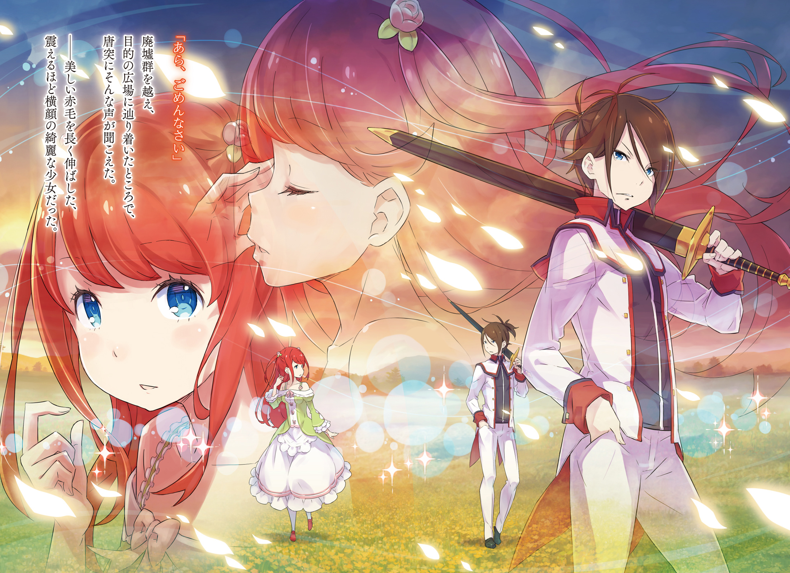

Столкновение с ведьмой на поле Кастур, а также известие о её сотрудничестве с Альянсом Полулюдей потрясли правителей Лугуники.

— Ситуа-а-ация трево-о-ожная. Некто, известная как Сфинкс, может управлять мёртвыми и использовать великую магию, давно считавшуюся утерянной. Мы можем понести и другие потери, подобные той, что случилась у Кастура.

Сейчас аристократка Розвааль J. Мейзерс выступала в зале собраний перед высшими военными чинами страны, видными офицерами и рыцарями Королевской гвардии, а также несколькими самыми влиятельными дворянами королевства.

Хоть она и говорила бегло, манера Розвааль растягивать слоги в странных местах никуда не делась. Но никто на это не указал; чиновники, слушавшие её, сохраняли мрачные выражения лиц.

— Сфинкс? — спросил кто-то. — Я слышал, некоторые думают, что она из Культа Ведьмы.

— Лично я сомневаюсь, — ответил другой. — Они следуют лишь собственным желаниям. Трудно представить, чтобы они сотрудничали с полулюдьми ради свержения королевства.

— Может быть, но думаю, только они сами по-настоящему понимают, чего добиваются.

При упоминании Культа Ведьмы настроение в зале стало ещё мрачнее. Культ Ведьмы был группой, почитавшей Ведьму Зависти — ту, что почти уничтожила мир столетия назад — и стремившейся, по крайней мере, согласно преданиям, возродить её. Однако многие считали, что в это очень трудно поверить, и что члены этого культа были просто обыкновенными безумцами.

Вильгельм соглашался с последним мнением — или, точнее, ему было всё равно. Он даже толком не понимал, почему в этот момент находится в зале совета. Рядом с ним сидели Бордо и Пивот, но это он мог понять; они были опытными рыцарями и могли держаться в этой компании с высоко поднятой головой.

Честно говоря, он хотел бы, чтобы хоть часть этой уверенности передалась Гримму.

«…Кхм…»

Там, где Вильгельм сидел с раздражённым видом, Гримму, судя по всему, становилось дурно. Лицо его было бледным, дыхание неровным; казалось, если он не будет осторожен, то скоро вновь увидит свой завтрак.

Как раз когда Вильгельм начал задаваться вопросом, бывает ли у того лицо нормального цвета, Розвааль сказала: — А теперь мы выслушаем отряд Зелгеф, который участвовал в настоящем бою. Если не возражаааете, господа.

Бордо вскочил на ноги, рявкнув абсурдно громким голосом: — Есть, мэм! Мгновение спустя Вильгельм и остальные тоже встали, и всех четверых повели в центр зала собраний.

— Бордо Зелгеф, командир отряда Зелгеф, докладывает! Для меня честь быть вызванным в штаб!

— Думаю, ваше приветствие было немного преувеличенным, молодой господин, — сказал Пивот. — Кхм. Заместитель командира отряда Зелгеф, Пивот Арнанси, докладывает. — Он взглянул на Вильгельма. — Вы двое, представьтесь.

— Г-Гримм Фаузен из отряда Зелгеф, докладывает!

— …Вильгельм Триас, то же самое.

Голос Гримма пискнул, в то время как голос Вильгельма звучал безразлично. Пивот поднял бровь, но собравшиеся чиновники не обратили на это внимания. Их больше интересовал отчёт солдат, чем их имена.

— Согласно леди Мейзерс, ваш отряд имеет реальный боевой опыт против Сфинкс. Она управляла нежитью, использовала магию левитации и начертала магические круги на поле Кастур. Каково ваше мнение о ней?

— Сэр! Я сражался с движущимися трупами, но лично не наблюдал предполагаемую ведьму!

— Молодой господин, тише. Мои извинения, господа и дамы. Эти двое — единственные члены нашего отряда, имевшие прямой контакт с упомянутой особой. Вильгельм, Гримм, докладывайте.

— Д-да… сэр!..

Гримм, каким-то образом ставший ещё бледнее, шагнул вперёд. Вильгельму ничего не оставалось, кроме как последовать за ним. Затем члены штаба начали забрасывать их вопросами. Они не добивались чего-то сильно отличающегося от того, что уже было сказано. Они хотели, чтобы молодые солдаты подтвердили отчёт Розвааль, а также поделились своими впечатлениями.

Затем прозвучал вопрос, необычный как по содержанию, так и по тону, которым он был задан.

— Допустим, чисто гипотетически, что это была Ведьма. Что вы о ней подумали?

Говоривший, всё ещё с поднятой рукой, был мужчиной с тонкими чертами узкого лица. Лет тридцати, возможно, он обладал приятной внешностью и ухоженными каштановыми волосами. Он очень походил на учёного; казалось, он явно не вписывался в комнату, полную суровых военных.

— Д-думаю, сэр?! Н-ну, эм… Она была жуткой и пугающей… Я имею в виду — нет! Как член королевской армии, я, конечно же, не боялся!..

Пока Гримм лепетал, вопрошавший слегка кивнул и посмотрел на Вильгельма. Под пронзительным взглядом мужчины выражение лица Вильгельма впервые с момента прихода в этот конференц-зал стало серьёзным. Это выражение едва ли походило на вялый взгляд гражданского чиновника. На него был направлен клинок меча, аура сокрушительного воина, решившего, что это поле битвы принадлежит ему.

«…Ты кто такой?» — произнёс Вильгельм.

По всему залу прокатился ропот. Рядом с ним Гримм практически перестал дышать. Но именно сам вопрошавший усмирил эту волну недовольства.

— Мм. Да, простите. Я — Миклотов МакМахон. Обычно я не посещаю эти собрания, но поскольку именно я предложил, чтобы леди Мейзерс расследовала магические круги, я позаботился о том, чтобы меня пригласили выслушать её отчёт.

Затем мужчина, назвавший себя Миклотовым, взглянул на Розвааль. Она уловила его намёк и театрально поклонилась. Значит, они были в какой-то степени друзьями.

Теперь, поняв ситуацию, Вильгельм вздохнул и ответил: — Эта ведьма или кто она там — она не показалась мне человеком. Больше похожа на монстра в человеческой шкуре. Разве можно договориться с голодным демоническим зверем, который хочет сожрать тебя на обед? С ней — либо убей, либо будешь убит. Ничего иного.

Резкий, бескомпромиссный ответ Вильгельма на мгновение погрузил комнату в тишину. Только Миклотов, на которого Вильгельм всё ещё смотрел с пристальностью лазера, обладал достаточной выдержкой, чтобы кивнуть. С видом авторитета он ответил: — Понимаю. Эта дискуссия была весьма поучительной. Можете все садиться.

Гримм взорвался, как только они вернулись в казармы. — Клянусь! Как, как ты всегда можешь быть таким?! Ты только что укоротил мою жизнь на несколько лет!

Их вызвали на собрание, как только они вернулись с поля Кастур, не дав ни минуты на отдых. Теперь они наконец освободились от своих обязанностей, и Вильгельм переодевался из своей жёсткой, неудобной формы, стирая пот и грязь с кожи.

Гримм, который тоже переоделся, набросился на него. — Как ты мог так себя вести в присутствии стольких важных людей?! И после того, как вице-капитан Пивот столько раз предупреждал нас вести себя прилично! Ты нарушил столько…

— Сколько раз ты собираешься сказать «столько»? И не веди себя так фамильярно со мной. — Вильгельм встретил своего брызжущего слюной, кричащего товарища ледяным ответом. Его мнение о Гримме не изменилось. Он был трусом, и он был бесполезен. Даже если в конце концов он набрался смелости обезглавить своего старого друга.

— Ох, да не кипятись ты так, Гримм! Честно говоря, я нахожу это обнадёживающим. Если бы Вильгельм был настолько идиотом, чтобы следить за языком в той комнате, что бы люди подумали обо мне, позволяющем ему говорить со мной так, как он говорит?

— Оставив в стороне вопрос о том, заслуживаете ли вы вежливости, молодой господин, уж вы-то, Вильгельм, наверняка имеете хоть какое-то представление о том, что такое приличия — не так ли?

Бордо и Пивот тоже переодевались и присоединились к разговору.

— О чём ты говоришь? — спросил Бордо своего заместителя.

— В поведении Вильгельма можно заметить следы подлинного образования. Возможно, оно было фрагментарным, но конечного результата достаточно, чтобы помогать ему в повседневной жизни.

— Тц. — Вильгельм с отвращением цыкнул языком на неожиданно острую наблюдательность Пивота. Гримм и Бордо переглянулись, поняв, что этот звук означал правоту оценки.

— Ты получил образование, Вильгельм? — спросил Гримм. — Значит, ты не из крестьян?

— Я слышал, купеческий класс в последнее время активно обучает своих детей, давая им преимущество в жизни. Это оно? — сказал Бордо. — Было бы неблагодарно с твоей стороны растрачивать то, чему ты научился.

— Я помню, вы получили формальное образование в области манер, молодой господин, — возразил Пивот, — но почему-то я не вижу никаких свидетельств этого в вашей повседневной жизни. Мне всегда это казалось довольно странным.

Вильгельм, казалось, игнорировал удивление Гримма и самодовольный ответ Бордо; он не выказывал никаких признаков желания отвечать на их вопросы. Он, похоже, был намерен избегать любых обсуждений своего прошлого.

— Почему такая необщительность? Тебе следовало бы хотя бы рааассказать своим братьям по оружию о себе. Например, о том, что ты сын семьи Триас, регионального дворянского рода, и что твой любимый меч носит национальный герб Лугуники.

— …

Вильгельм развернулся, его глаза наполнились убийственной яростью от того, что его прошлое так небрежно раскрыли. Он обнаружил Розвааль, стоящую в открытой двери раздевалки с улыбкой на лице. Она дружелюбно помахала рукой, хладнокровно встретив взгляд Вильгельма.

— Узнать об этом было дооовольно просто… Дом Триас, может, и обеднел, но он всё ещё числится в дворянских списках Лугуники. Неужели ты дууумал, что сможешь скрывать это вечно?

— Если у тебя есть время копаться в чужом прошлом, тебе следовало бы потратить его на свою работу. Думаю, двор скучает по своему шуту.

— Придворный шут… Ха-ха! Мне нравится. Я знала, что ты ииинтересный. — Отмахнувшись от гневного выпада Вильгельма, Розвааль оглядела раздевалку. — Штаб рассматривает присутствие Сфинкс как вопрос наивысшей важности. С ней мооогут поступить так же, как с Либре Ферми и Валгой Кромвелем, представителями Альянса Полулюдей. Я ценю поддержку лорда Миклотова… хотя меня не радует, что её называют «ведьмой».

Розвааль пожала плечами, но не смогла полностью скрыть своё недовольство, заканчивая говорить. Учитывая явное неудовольствие в её глазах, Вильгельм вспомнил события на поле Кастур.

— Кстати говоря, ты, кажется, знала этого монстра, — сказал он. — Выглядело так, будто вы обе хотели убить друг друга.

— Что такое? Заинтересовался мной? — сказала Розвааль. — Ну, ты немного молод… но какое дело любви до таких мелочей? К счастью для тебя, ты довольно мил, и я не против… шучу!

Розвааль подняла белый флаг на полуслове. Вильгельм выглядел так, будто собирался броситься на неё с мечом.

— Прости, но я не могу рассказать тебе, как я связана с… ну, ты знаешь. Но могу заверить тебя, что мы не… сотрудничаем, так что не беспокойся об этом. Если ты просто обязан знать — ну, может быть, когда мы станем чуууточку ближе.

— Ближе, чем сейчас, я к тебе подходить не хочу.

— О, не стесняйся. В любом случае, тебе не повезло. Учитывая произошедшее, ответственной за магические контрмеры для королевской армии теперь являюсь я. Если война и Сфинкс не закончатся гораздо раньше, чем я ожидаю, думаю, мы все будем видеться ооочень часто.

Розвааль, казалось, наслаждалась, сообщая эту неприятную новость хмурому Вильгельму. Он обернулся и увидел, что Бордо и Пивот кивают ему, будто знали всё с самого начала.

— Отряд Зелгеф действительно показал, на что способен, — сказала Розвааль. — Полагаю, отныне вы будете очень востребованы на передовой, переламывая ход самых ожесточённых сражений.

— О-хо! Какая честь! Держу пари, нашему «Демону Меча» Вильгельму это понравится!

В то время как Гримм и Пивот вздохнули, услышав, что их бросят в самую гущу жесточайших боёв, Бордо казался совершенно воодушевлённым. Он крепко хлопнул Вильгельма по спине.

Розвааль, однако, искоса посмотрела на странное прозвище. — Демон Меча?..

— Некоторые шутники в армии стали так его называть, — сказал Бордо. — Потому что все наслышаны о том, сколько он убил в своих первых паре сражений. Я пытался запустить и своё собственное прозвище, знаешь ли — Стальной Топор — но почему-то оно так и не прижилось!

— У людей есть для вас прозвище, молодой господин — они называют вас Бешеным Псом… Э-э, я знаю, что вам не нравится это имя, поэтому я его не использую. Не всегда всё идёт так, как мы хотим.

— Демон Меча, — задумчиво повторила Розвааль. — Демон Меча, дааа. Действительно, думаю, оно тебе очень подходит.

Вильгельм фыркнул и отвернулся от Розвааль с её лукавой улыбкой. Какое ему дело до того, как его называют другие? «Демон Меча» было удобным устрашающим прозвищем.

— Не воображааай, что мы над тобой смеёмся, — сказала Розвааль. — Люди больше всего жаждут героя, когда к ним приходят трагедии войны, будь то Святой Меча или Мудрец… особенно учитывая, что лорд Фрибал, последний Святой Меча, погиб в этой гражданской вооойне.

Вильгельм, всё ещё изображая безразличие, ничего не сказал, но Бордо кивнул и с болью в глазах произнёс: — Я слышал, он был убит, сражаясь в обороне против превосходящих сил, чтобы его войска могли уйти. Поистине смерть воина.

«Святой Меча» — титул, даруемый величайшему мечнику, служащему королевству Лугуника. Но если носитель этого титула был убит, возможно, его таланты были не так уж велики.

— Я иду на тренировочную площадку. Вы все можете оставаться здесь и болтать сколько угодно.

— Ты идёшь тренироваться?! — воскликнул Гримм. — После всего, что мы…?! Ах, аргх!.. Подожди, Вильгельм! Я тоже иду!

— Не надо.

Гримм схватил свой меч и щит, спеша последовать за Вильгельмом из раздевалки. Из них двоих только Гримм быстро отдал честь на выходе — идеальное отражение разницы в их характерах.

— Между этими двумя меньше дистанции, чем было вчера, — прокомментировал Пивот.

— Это потому, что Гримм вышел из своей скорлупы целым и невредимым, — сказал Бордо. — У него сейчас хороший вид. Он не особо силён с мечом, но мне нравится, как он обращается с этим щитом. Он будет становиться всё лучше и лучше, этот Гримм.

— Вы слишком быстро верите в лучшее во всех. Люди, которые не растут, долго не задерживаются в нашей профессии.

— Бва-ха-ха! Люди — это просто большие скопления проблем. Если ты можешь найти в них хоть что-то хорошее, этого достаточно.

Всё ещё смеясь, Бордо переоделся в лёгкую тренировочную одежду. Пивот мог только вздохнуть. Командир схватил алебарду, которую оставил прислонённой к стене, затем повернулся к Розвааль.

— Простите, что мы не можем оказать вам немного больше гостеприимства, леди Мейзерс, после всего, что вы сделали. Но отряд Зелгеф направляется на тренировочную площадку. Завтра снова напряжённый день.

— Я вовсе не возражаааю. Меня ободряет видеть, что вы ни перед кем не прогибаетесь. И, как я уже сказала, думаю, мы будем проводить много времени вместе. Я, конечно, надеюсь, что мы поладим.

— …Как и я, — сказал Пивот. — Я бы не хотел попасть к вам в немилость, леди Мейзерс.

Затем он и ухмыляющийся Бордо покинули раздевалку и помахали на прощание Розвааль в коридоре. Как только она скрылась из виду, Бордо повернулся к своему заместителю.

— Ого, Пивот. Такой прямолинейный парень, как ты, почти тридцатилетний… Я бы не подумал, что леди Мейзерс в твоём вкусе. Ах ты, плут!

— Молодой господин, — ответил Пивот, — будьте осторожны, не слишком доверяйтесь леди Мейзерс, ни умом, ни сердцем.

— Хм?

Бордо всего лишь дразнил, но тихий ответ Пивота сопровождался значительным взглядом.

Командир лениво погладил бороду. — Буду, раз ты так говоришь. Но почему? Думаешь, что-то происходит?

— Эту женщину нелегко прочитать. Я нисколько не удивлюсь, если она затевает что-то, о чём мы ничего не знаем. В любом случае, похоже, нам придётся работать с ней как минимум до конца войны. Берегите себя.

— Яд к обеду, да? Это должно сделать всё интереснее. И у меня есть Демон Меча, чтобы посылать его в бой — жизнь капитана никогда не бывает скучной!

Хотя Пивот и осознавал, что громогласный смех Бордо привлекает странные взгляды в казармах, он повысил голос в тон ему, сказав: — Боже мой… Нам всегда достаются самые короткие соломинки, не так ли?

Долина Шэмрок, на юго-востоке Лугуники, была окутана туманом днём и ночью.

Туман считался дурным предзнаменованием во всех частях света, и скалистое ущелье превратилось в пустошь, лишённую жизни.

Это делало его идеальным местом для укрытия тех, кто действовал в тени. Маленькая лачуга, запрятанная под утёсом и укрытая туманом, была одним из пристанищ таких скрывающихся.

— Ладно, Валга, объясни мне, что именно происходит! — Требование эхом прокатилось по ущелью. Оно было почти достаточно пронзительным, чтобы разбить стекло — но огромный гнев в голосе заставил бы любого поколебаться указать на это.

— Не так громко, — сказал другой. — Туман снаружи, может, и зловещая мгла, поглощающая звук, но при такой громкости неизвестно, кто может тебя услышать. — Этот голос был хриплым, тихим. Его обладатель зажал уши руками, явно раздражённый. Но первый голос было не унять.

— Мне всё равно, насколько правым ты себя считаешь! Мне всё равно! Если хочешь критиковать меня, сначала объясни, что именно, по-твоему, ты делаешь!

— Объяснить? Почему я должен что-то объяснять? Разве я сделал что-то не так? А, Либре? Ты ничего не сделал — так кто ты такой, чтобы говорить со мной так?!

— Не наглей, щенок! Ты ужасно дерзок для такого юнца!

Их гнев достиг точки кипения. Два крупных участника этого спора стояли практически лоб в лоб, крича. Казалось, они вот-вот убьют друг друга. Взрыв казался неизбежным. Но затем…

— Вы оба такие шумные. Мне нужна тихая обстановка для проведения экспериментов. И я привела вас обоих в своё убежище в первую очередь для того, чтобы вы помогали мне с этими самыми экспериментами.

Бесстрастный голос, казалось, принадлежал юной девушке — её слова были укоряющими, но в её тоне не было и намёка на эмоции. Тем не менее, двое других немедленно прекратили спор.

— Полагаю, кулаками мы ничего не решим. Очень хорошо, я оставлю мальчишку в покое. Но ты понимаешь, по этому вопросу ещё есть что сказать. — Говоривший фыркнул. Он был так высок, что его голова почти доставала до потолка. Его неестественно худое тело было покрыто мантией, а жёлтые глаза странно сверкали. Видимые участки кожи на его конечностях и голове были зелёными и покрыты чешуёй, а длинный, толстый хвост рептилии волочился по полу позади него. В сочетании с его длинным языком это не оставляло сомнений, что он был получеловеком.

Он был известен под именем Либре Ферми и являлся одной из опор Альянса Полулюдей.

— Валга, объясни. Магические круги в Кастуре и твоя маленькая игра с этими трупами.

— Просто посмотри, чего мы добились. Неужели ты должен подвергать сомнению каждую мелочь, утомительная змея?

Грубый ответ на вопрос Либре исходил от старого гиганта, пытающегося втиснуться в стул, который был для него слишком мал. Стоя, он, вероятно, был бы ростом около двух метров.

Великаны были расой полулюдей, которые, не считая их размера, выглядели в основном как люди. Этот мужчина был одним из немногих ещё живых и, фактически, самым молодым среди них. Тем не менее, он внёс огромный вклад в Альянс Полулюдей, возможно, больше, чем кто-либо другой. Именно он организовал полулюдей, превратил их из бесцельной толпы в коалицию, способную противостоять королевству. Его звали Валга Кромвель.

— Какие у тебя могут быть претензии к такому исходу? Погоди, дай угадаю — ты думаешь, что мы не получили достаточно человеческих трупов за всю проделанную работу. Согласен — я хотел убить их больше!

— Не устраивай здесь свои истерики! Я говорю, что мы убили их слишком много! Эта война и так тянется уже столько лет. Но как ты ожидаешь, что люди хотя бы рассмотрят возможность примирения после таких потерь? Ты погубишь нас всех!

Стул Валги загрохотал, когда он встал. — Я нас погублю? Либре, это битва на истребление, и всегда была! Я не намерен оставлять в живых ни одного человека. Я вырву эту гнилую, безнравственную грязь с корнем. И когда они все умрут, я сожгу тела!

— Можешь хоть на минуту перестать вести себя как ребёнок?! Их больше, чем нас! Подумай об этом. Даже если каждый твой план сработает с этого момента, даже если мы будем наносить им в десять раз больше потерь, чем они нам в каждой битве — мы всё равно будем уничтожены первыми. Такова эта битва!

— И что? Я должен проглотить свою гордость и сдаться? Вот вопрос для тебя : слышишь ли ты их? Слышишь ли ты стоны всех наших товарищей, которые были растоптаны? Крики всех наших друзей, которые были повержены? Я их слышу. Ответь нам , — говорят они мне. — Это гордость получеловека!

— И эта гордость станет смертью для нас всех! Ох, я бы просто проглотил тебя целиком, дерзкий сопляк! Иди соверши своё славное самоубийство и оставь нас в покое!

— Вы оба. — Снова раздался холодный голос, сопровождаемый оглушительным рёвом и лучом яркого света, пронзившим пространство между разъярённой парой, в дюйме от их носов, когда они сверлили друг друга взглядами. Свет рассёк воздух явно угрожающе. — Я просила вас о тишине. Если вы откажетесь принять это второе предупреждение, третье будет сопровождаться демонстрацией моей силы. Я с радостью добавлю вас обоих в свою коллекцию воинов-нежити.

Девушка носила белую мантию и имела длинные розовые волосы — это была ведьма Сфинкс.

Она подняла палец и спросила их с испытующим взглядом: — Что выбираете? Мне всё равно. Вы оба требуете наблюдения.

— Мне не настолько нравится спорить с этим щенком, чтобы стать из-за этого трупом, — пробормотал Либре.

— С языка снял, — прорычал Валга.

На этот раз они оба постарались держаться подальше друг от друга. Увидев их усмирёнными, Сфинкс опустила руку с бормотанием «Ах». Нормальным голосом она продолжила: — К слову, я считаю, что мои воины-нежить могут компенсировать неравенство в наших численностях.

— Верно, — сказал Валга. — Вот почему здесь зомби, и вот почему здесь Сфинкс. Меня больше беспокоят трусы вроде этой змеи. Ты думаешь, зомби — это какая-то игра? Полагаю, это отвечает на твои жалобы.

— Едва ли. Это противоречит всякой логике. Неужели ты совсем не чувствуешь стыда, используя тела мёртвых в своих целях? Я не ожидаю здравомыслия от ведьмы, но ты другой. — Длинный раздвоенный язык Либре выскользнул изо рта. Скрестив руки, он сверлил взглядом Сфинкс.

Валга лишь фыркнул. — Я оскверняю трупы безнравственной грязи. Почему я должен чувствовать стыд? Духи наших павших союзников умоляют меня об этом. И, как ты говоришь, мы — слабейшая раса. Нам приходится полагаться на свой ум. Нет такого закона, который гласит, что слабые всегда должны проигрывать.

— Я буду действовать так, как считаю нужным, — сказал Либре, направляясь к двери хижины. Оказавшись в дверном проёме, он обернулся, его жёлтые глаза сузились, глядя на Валгу. — Но я скажу тебе вот что, Валга. Если ты продолжишь идти по этому пути, однажды он приведёт тебя в ад.

— Однажды? — сказал Валга. — Этот мир уже ад.

Вместо прощания Либре лишь вздохнул.

Рептилоподобный получеловек ушёл, и напряжение спало с плеч Валги. Внезапно Сфинкс сказала: — Если он станет проблемой в будущем, мне устранить его?

— Нам не следует делать этого без необходимости. Либре, может, и не думает так же, как я, но альянсу он нужен. Альянс видит во мне своего лидера, но единственный способ, которым я могу кому-то помочь, — это мой мозг. Чтобы возглавить атаку на вражеские ряды, разорвать их на куски и поднять боевой дух наших войск до предела — для этого нам нужен такой герой, как он.

— Сложная вещь. Это требует тщательного рассмотрения. — Сфинкс сделала паузу, затем сказала: — А что ты будешь делать дальше? Ещё магические круги, подобные тем, что ты использовал в Кастуре?

Любая враждебность, которую она, возможно, испытывала к Либре, казалось, исчезла, сменившись интересом к месту следующего эксперимента. Игнорируя резкую смену темы, Валга развернул карту своими мясистыми руками.

— Это могло бы сработать, если бы мы смогли сделать это до того, как весть о поражении при Кастуре распространится среди людей, но альянс недостаточно хорошо организован, чтобы действовать так быстро. Чем дольше мы ждём до следующей битвы, тем больше вероятность, что они разработают контрмеры. Сомневаюсь, что стратегия магической ловушки сработает снова.

— Что тогда?

— Очевидно. Мы позволим им уничтожить магический круг, — сказал Валга со злой, кроваво-красной улыбкой.

Сфинкс никак не отреагировала на это. Но она взглянула на землю и пробормотала: «Это потребует наблюдения», — так тихо, что никто не мог услышать.

Время пролетело в мгновение ока.

Бешеная активность притупила их осознание проходящих дней, и Демон Меча, Вильгельм, не был исключением.

Как и сказала им Розвааль после собрания, его и остальной отряд Зелгеф снова и снова бросали в самые жестокие сражения, с которыми сталкивалась королевская армия. В течение этого времени силы королевства и Альянс Полулюдей обменивались успехами — королевская армия одерживала крупномасштабную победу, только чтобы полулюди затем разрушили их боевые порядки и одержали стратегическую победу. И так продолжалось снова и снова. Трое людей, составлявших ядро Альянса Полулюдей, постоянно ускользали от королевских сил, и поэтому конца этому не было видно.

Прежде чем они это осознали, Вильгельм и Гримм прослужили в королевской армии — и в отряде Зелгеф — один год. Затем два.

Отряд Зелгеф тоже выглядел иначе, чем когда в него вступили те первые двадцать человек. Осталось лишь около половины первоначальных членов, но на каждого погибшего приходило несколько новых, пока подразделение не расширилось до ста человек. Это сделало их ещё более грозной силой на поле боя, чем раньше.

Вильгельма удивляло, что сквозь все эти изменения Гримм каким-то образом оставался в отряде. Когда они встретились два года назад, Вильгельм был уверен, что скоро больше не увидит Гримма, но каким-то образом тот тоже стал одним из старожилов их команды, уважаемым за свою воинскую доблесть.

Он всё ещё был почти безнадёжен с мечом, но даже Вильгельм должен был признать его мастерство владения щитом, а также его способность обнаруживать опасность. Единственными людьми в отряде с рефлексами, достаточными для защиты от одной из атак Вильгельма, были Гримм и Бордо.

Гримм также всё ещё пытался заставить Вильгельма заметить его, и пока он упорствовал, несмотря на уничтожающие замечания Демона Меча, некоторые шептались, что, возможно, Гримм был самым храбрым человеком в отряде.

— Чт-то ж. Я слышу, ты сегодня продолжааал приумножать свою легенду.

— …Держись от меня подальше.

— Какой холооодный приём. Не можешь хотя бы притвориться счастливым, когда красивая женщина хочет подойти к тебе поближе?

С момента их вылазки на поле Кастур у отряда не было недостатка в возможностях видеть Розвааль. Поскольку было невозможно сказать, когда полулюди могут предпринять очередную магическую стратегию, было вполне естественно, что она присутствовала в каждой битве. Поэтому было столь же естественно, что она часто сталкивалась с отрядом Зелгеф, который так часто находился на передовой.

— Леди Мейзерс, как так можно себя вести. А тебе , разве не стыдно?

— Н-ну, ну, Кэрол. Вильгельм просто такой. Можешь ругать его сколько угодно; он не изменится.

Так же часто, как они видели Розвааль, они видели и её телохранительницу, Кэрол, сверлящую их взглядом. В такие моменты Гримм был спасителем; он появлялся из ниоткуда, чтобы занять Кэрол разговором. Вильгельм убеждался, что эти двое безопасно болтают, а затем снова погружался в свой собственный мир.

— Этот Вильгельм ни капли не изменился, да? — сказал Бордо. — Впрочем, это одна из его сильных сторон!

— Каждый раз, когда мы отправляемся куда-то в новое место, — ответил Пивот, — я слышу свежие слухи о Демоне Меча, и клянусь, это укорачивает мою жизнь. Если я умру молодым, я буду считать, что это его вина.

Бордо и Пивот также продолжали наблюдать и размышлять о Вильгельме издалека, как и раньше. Было, пожалуй, одно отличие — алебарда Бордо больше не могла достать Вильгельма. Молодой мечник помнил яснее, чем хотел бы, тот день, когда разница в их способностях стала безошибочной. Бордо плакал и смеялся в равной мере, звуки, которые всё ещё, казалось, отдавались эхом в памяти Вильгельма.

Он едва мог поверить, что это было уже три года назад. Три года, и теперь Вильгельму исполнялось восемнадцать. Три года, полные вещей, мест и людей, которые остались в его памяти.

Он поймёт позже, насколько драгоценным было это время.

В утренней тишине Вильгельм открыл глаза. Он лежал на своей кровати в личной комнате в казармах.

Обычно рядовой солдат вроде него не имел права на отдельное жильё. Но он был исключением; это была одна из свобод, предоставленных ему королевством в свете его поразительных боевых заслуг. Это также было своего рода отчаянной мерой; Демон Меча не особенно интересовался наградами или почестями, оставляя королевство в некотором замешательстве относительно того, как его компенсировать.

— …

Вильгельм зевнул один раз, затем умылся холодной водой. Прогнав последние остатки сна, он быстро переоделся в свою форму. Только надев всё, он понял, что сегодня у него выходной. Ему не нужно было надевать форму.

«…Переработка, чёрт возьми».

Этот «выходной» был чем-то, что навязали ему Бордо и Пивот. Он редко брал свои обычные выходные, предпочитая продолжать тренировки — и затем, конечно, были дни, когда они были в бою. Командиры утверждали, что когда Демон Меча, один из старейших членов отряда, отказывался отдыхать, никто другой тоже не мог взять перерыв.

С раздражённым вздохом Вильгельм вышел из своей комнаты всё ещё в форме. Переодеваться обратно было бы слишком хлопотно.

Он подумал было направиться на тренировочную площадку, но понял, что не может. Весь смысл этого выходного заключался в том, чтобы удержать его оттуда. Но даже если он останется в своей комнате, это не гарантировало, что всё более надоедливый Гримм не придёт и не найдёт его.

Поэтому Вильгельм покинул казармы, пока в воздухе всё ещё витала утренняя прохлада, и направился к замковому городу. Он ответил на приветствия стражников коротким кивком, затем в одиночестве вошёл в столицу, где признаки человеческого жилья стали редкими.

За последние три года столица постепенно становилась менее оживлённой. Вильгельма это вполне устраивало, но это было признаком того, что гражданская война с каждым днём всё больше затягивалась в болото. Сражения происходили во всё большем количестве мест, и последствия потерь королевства ощущались всё шире. Лугуника вступала в тёмные времена.

Дракон, от которого можно было бы ожидать помощи в случае эпидемии или вторжения другой страны, по-видимому, решил, что это проблема, с которой Лугуника должна справиться сама, и отказался прислушаться к мольбам правителей нации.

По мере того как война затягивалась без признаков улучшения ситуации, люди всё больше и больше уставали.

Район, куда пришёл Вильгельм, был одним из тех, что пострадали от гражданской войны. Покинув крестьянский городок в среднем районе столицы, он увидел заброшенные строительные проекты. Предполагалось, что работы возобновятся после окончания войны, но это лишь означало, что никто не знал, когда.

Теперь этот район стал домом для безработных бродяг и безработных подёнщиков; даже Вильгельм понимал, что это трущобы. Именно поэтому это место влекло его, когда он был один.

— Проваливайте, — сказал он группе, устроившейся в одном из заброшенных зданий. Они выглядели как неприятности, но явно поняли, что Вильгельм будет ещё большей неприятностью, и скрылись. Вильгельм фыркнул, затем направился к площади, которую обычно использовал.

Эта общественная площадь в самых дальних уголках бедного района была достаточно большой и тихой, чтобы идеально подходить для его личных тренировок. Все на военной тренировочной площадке так сильно отставали от него, что в эти дни он предпочитал использовать это место почти исключительно.

Вильгельм никогда не нуждался в других для своей практики. Он находил идею скрещивать мечи с одним и тем же противником снова и снова практически позорной перед лицом настоящей битвы, где любой бой решался раз и навсегда.

Поэтому для Вильгельма тренировка с мечом была битвой против самого себя. Это не было метафорой самоотречения, а буквальной битвой насмерть с самим собой. Именно в такой тренировке Демон Меча, Вильгельм, был наиболее спокоен.

— О, простите.

Кто-то внезапно обратился к нему, когда он миновал заброшенные постройки и прибыл на площадь. Это должно было быть время, когда он погружался в свой собственный мир, теряясь в мече — присутствие чужого нарушило этот процесс. Вильгельм с сожалением цыкнул языком и раздражённо повернулся к источнику голоса.

Это была девушка с длинными рыжими волосами, её профиль был достаточно красив, чтобы по спине пробежали мурашки.

Её волосы выглядели как языки пламени, а глаза были голубыми, как ясное небо. Её аккуратные черты придавали ей миловидность и изящество; Вильгельм сомневался, была ли она вообще человеком.

Но мгновение спустя она была всего лишь деревенской девушкой с заметной, но не ошеломляющей красотой.

Она сидела на каком-то заброшенном строительном объекте в одном углу площади, глядя на него.

— Я не знала, что кто-то ещё приходит сюда так рано, — сказала она с улыбкой.

— …

Ответ Вильгельма был прост — он немедленно направил на неё всю силу своего воинского взгляда. Это было то же самое, что он сделал, чтобы прогнать бродяг ранее. Это заставило бы дилетанта бежать со всех ног и было достаточно, чтобы даже опытный противник замешкался.

Но против этой девушки это был неверный ход.

— Что не так?.. У тебя такое страшное лицо, — спросила она, как будто вся сила его духа была не более чем проходящим ветерком.

Вильгельм понял, что его попытка прогнать девушку не удалась, и неловко отвёл взгляд. Если его демонстрация духа воина не повлияла на неё, это означало, что она была совершенно незнакома с военным искусством, настолько, что даже не почувствовала, что он делает.

Для тех, кто никогда не жил в мире насилия, поведение Вильгельма показалось бы не более чем запугиванием. Некоторые могли бы даже принять это за простой недобрый взгляд. Эта девушка, похоже, была одной из таких.

— Что вообще девушка делает в таком месте так рано утром? — спросил Вильгельм.

Этим он хотел дать ей понять, что она ему мешает, но она лишь ответила «Хм-м» и сладко потянулась. — Я бы хотела задать тебе тот же вопрос, но, возможно, это было бы не очень вежливо. Ты не похож на любителя шуток.

— Здесь много опасных людей. Это не то место, где женщине следует гулять одной.

— Боже, ты беспокоишься обо мне?

— Я могу быть одним из этих опасных людей.

— Ты не такой. Я знаю эту форму — ты один из солдат замка, не так ли? Ты бы не сделал ничего плохого.

Вот что он получил за то, что бездумно надел форму, а потом не потрудился переодеться перед выходом. Его обычный подход не сработал. Видя, что он сбит с толку, девушка хихикнула.

— Честно говоря, я немного удивлена. Я думала, это моё личное место. Оно милое, не так ли? Приходится немного пройтись, но здесь можно побыть одному.

— Пока кто-нибудь не появится и не вторгнется к тебе.

— Полагаю, мы оба вторгаемся друг к другу, так что всё в порядке. Сбежал со службы, мистер Плохой Солдат?

— Уверен, что нет, — сказал Вильгельм.

— Конечно, нет. Я сохраню твой секрет, — сказала девушка, игнорируя его оправдание. — О, точно. Она указала на что-то напротив того места, где сидела в заброшенном здании. — Посмотри сюда.

Вильгельм нахмурился, не видя ничего с того места, где он стоял. Это заставило девушку улыбнуться и поманить его жестом, похожим на жест маленького зверька.

— Я не так уж горю желанием это видеть, — прорычал он.

— Ну-ну, просто подойди сюда.

Вильгельм скривился от её тона — она говорила так, будто разговаривала с ребёнком — но послушно подошёл к ней. Он поднялся на ступени заброшенного здания и посмотрел туда, куда она указывала.

У него перехватило дыхание. Перед ним раскинулось поле жёлтых цветов, освещённое сиянием утреннего солнца.

Она обратилась к онемевшему Вильгельму так, словно признавалась в секрете. — Они прекратили здесь работать, верно? Я не думала, что кто-то ещё придёт, поэтому посадила несколько семян. Сегодня я вернулась, чтобы посмотреть, как они поживают.

Не восхищение красивыми цветами заставило Вильгельма онеметь от неожиданного зрелища. Он просто не мог поверить в собственную невнимательность. Он бывал здесь так много раз, но совершенно не замечал этой уникальной особенности. Это был мир, который он мог бы заметить, если бы только потянулся, немного расширил свой кругозор…

— Тебе нравятся цветы? — спросила девушка всё ещё молчащего Вильгельма.

Он повернулся, чтобы рассмотреть её нежную улыбку, говоря…

— Нет. Терпеть их не могу.

И он смотрел, как счастье полностью исчезло с её лица.

— Похоже, ты занят в свои выходные, Вильгельм. Тебя никогда нет в комнате, когда я захожу. Где-то убиваешь людей?

— Я не занят… И людей я тоже не убиваю.

— Конечно. Ты выглядишь достаточно несчастным, чтобы я поверил, что ты говоришь правду. Похоже, у тебя приятные, тихие выходные, — легкомысленно пошутил Гримм, одетый в солдатскую форму, вылезая из драконьей повозки. Вильгельм скривил нос, пытаясь показать своё раздражение, но Гримм едва заметил, всё ещё улыбаясь. Почему-то это ещё больше разозлило Вильгельма.

Ряды отряда Зелгеф выросли, но к Вильгельму относились с таким же трепетом, как и прежде. Однако Бордо и Гримм знали его уже так давно, что эти эпизоды личной болтовни становились всё чаще.

Усердно храня молчание, Вильгельм думал о «выходных», упомянутых Гриммом. Прошло несколько недель с тех пор, как Бордо и Пивот навязали ему отпуск, и он впервые встретил ту девушку. Он всё ещё не знал её имени — он думал о ней как о «Девушке с Цветами» — но с тех пор они сталкивались ещё несколько раз.

Вильгельм с удивлением обнаружил, что, хотя он и не ходил на площадь по какому-то регулярному графику, всякий раз, когда он туда приходил, Девушка с Цветами сидела перед своими цветами, как будто это было самое естественное в мире. Она продолжала сидеть там, праздно наблюдая, как Вильгельм практикуется с мечом. Было неприятно, что она на него пялится, но гораздо лучше, чем если бы она его прогнала.

Когда она впервые спросила его, что он думает о её цветочном саде, и он дал ей жестокий ответ, она прогнала его с гневом, способным соперничать со штормом. Даже сейчас Вильгельм не мог поверить, что проиграл ту встречу.

Но было кое-что ещё, что он находил ещё более непонятным. Каждый раз, когда он заканчивал свою практику, она с улыбкой спрашивала его: «Тебе нравятся цветы?»

Она знала, что ответ не изменится, но спрашивала его каждый раз.

«Нет. Терпеть их не могу», — отвечал он с выражением крайнего отвращения. Это практически стало ритуалом.

— Ладно, мы направляемся на юг! Именно там сейчас самая напряжённая битва! Либре Ферми и Валга Кромвель оба там. Это идеальная возможность для нас добиться значительных успехов!

Этот восторженный крик вернул его из размышлений.

Впереди стоял Бордо, подняв боевой топор, подбадривая боевой дух своих войск, совсем как настоящий командир. По мере увеличения численности его подразделения он всё меньше и меньше мог действовать наобум, как раньше, но это также выявило в нём неожиданный талант к лидерству. Отряд Зелгеф становился всё более и более эффективным в бою.

Впрочем, больший успех означал больше беспокойства для вице-командира Пивота. — Однако наша роль сегодня — не штурмовать главный вражеский лагерь. Мы будем плавающим подразделением — следить за ситуацией и двигаться на помощь туда, где это необходимо. Будьте осторожны, не слишком возбуждайтесь и не действуйте в одиночку где-нибудь.

Полем битвы на этот раз должно было стать болото Айхия на юге Лугуники. Гражданская война охватила всё королевство, но сопротивление полулюдей считалось самым сильным на юге. Сообщалось, что ведущие фигуры Альянса Полулюдей отправились туда для поддержки сопротивления, и поэтому силы королевства разработали крупномасштабную стратегию, частью которой должен был стать отряд Зелгеф.

— У нас огромные атакующие силы, — сказал Гримм. — Может быть, мы наконец сможем закончить эту войну…

— Всегда оптимист, да? — пренебрежительно сказал Вильгельм. — Я думаю, что бросать крупные силы, зная, что там находятся вражеские лидеры, — это напрашиваться на неприятности.

Гримм выглядел несколько раздражённым, но вскоре понял, что имел в виду Вильгельм. Он почесал затылок.

— Ты… думаешь о поле Кастур?

— Валга Кромвель тоже был там в тот день. И учитывая наличие магических кругов, я бы предположил, что ведьма тоже была там. Они ждут нас, и мы собираемся бросить сюда больше людей, чем бросили на Кастур. Как думаешь, что произойдёт?

Гримм сглотнул, и ему показалось, что это прозвучало очень громко. Никто из солдат вокруг них, казалось, ничуть не беспокоился, ожидая приказа к выступлению. Может быть, они были правы, сохраняя уверенность, жажду битвы.

Но если они погибнут напрасно, это будет… ну, бессмысленно.

— Я должен предположить, что наши командиры хотя бы подумали о такой возможности, — сказал Вильгельм.

— Чт?..

— Я бы, конечно, так поду-у-умала. Твоё лицо только что, Гримм, это был шедееевр.

Знакомый женский голос ответил на тупой полувопрос Гримма. Двое мужчин обернулись и увидели Розвааль, женщину, чьё беззаботное настроение никогда не менялось, даже на поле боя. Она откинула плащ, который носила поверх военной формы, и потянулась, словно чтобы похвастаться своей пышной грудью.

— Важные шишки так же уверены, как и ты, что Сфинкс, вероятно, действует здесь. Мы унесли мечом столько же их жизней, сколько они наших — магией. Мы думаем, что рано или поздно они должны достичь своего предела.

— В-вы всегда кажетесь такой спокойной, леди Мейзерс, — сказал Гримм.

— О, ты заставляешь меня краснеть. И если я здесь, это знааачит, что твоя маленькая принцесса тоже здесь.

Она многозначительно улыбнулась ему. Телохранительница Розвааль, Кэрол, подошла сзади. Как всегда, она была одета в рыцарские доспехи и носила меч на бедре, ни то, ни другое не красило её как женщину. Её золотые волосы отросли лишь немного за последние три года. Но были и некоторые заметные изменения в ней и в улыбающемся Гримме.

— Гримм, — сказала Кэрол, — я рада, что у меня появилась возможность поговорить с тобой до начала битвы. Я беспокоилась, что леди Розвааль может угрожать опасность, если бой станет слишком интенсивным…

— Я—я тоже рад! — ответил Гримм. — С тобой за спиной, э-э — точно! Я знаю, мне не придётся беспокоиться о том, что враг подберётся ко мне сзади!

— Я сильнее тебя, знаешь ли. Я не терплю, когда на меня смотрят свысока…

— Я—я—я—я н-н-не хотел!..

— Я шучу. Я рада, что ты рад.

Гримм и Кэрол постепенно погрузились в свой собственный мир, совершенно игнорируя двух других. Когда ей надоело наблюдать за ними, Розвааль ткнула Вильгельма локтем.

— Как ты себя чувствуешь? Кааак ты себя чувствуешь прямо сейчас? Твой друг милуется с девушкой, любовь, выкованная в пылу битвы…

— Я думаю, это глупо. И не делай вид, будто мы с ним так близки. Мне не нужны друзья.

— Понимаю. Какааая очень одинокая мысль. Заинтересован тогда пофлиртовать со мной?

— Я разрублю тебя пополам.

Практически прежде чем Вильгельм закончил говорить, Розвааль сделала большой шаг назад на безопасное расстояние.

Они ждали начала битвы, но он даже не мог заставить всех оставить его в покое достаточно долго, чтобы сосредоточиться и подготовиться. Он даже не вздохнул, когда Кэрол дала Гримму какой-то защитный амулет.

— В любом случае, позволь нам беспокоиться о Сфинкс, — сказала Розвааль. — А ты просто развлекайся, рубя каждого плохого парня, которого увидишь.

— Таков мой план. Постарайся не испортить свою часть.

— Оуу, ты беспокоооишься обо мне?

— Я беспокоюсь, что ты будешь мне мешать.

Розвааль выглядела так, будто могла надуться от холодного ответа, но Вильгельм загремел ножнами своего меча и заставил её поспешно отступить.

В паузе разговора раздался голос: — Леди Мейзерс здесь? Командующий хочет поговорить с ней.

— К-командующий! Э-э, леди вон там, сэр.

Стена солдат расступилась, и показалась громадная фигура Бордо. Гримм быстро прервал то, что говорил Кэрол, и указал на Розвааль, которая приветливо помахала рукой. Бордо кивнул.

— Лорд Лейп, сэр! — воскликнул капитан. — Леди Мейзерс здесь! Если пройдёте сюда, сэр!

Угрюмо звучащий мужчина ответил: — …Тебе не нужно кричать, я тебя слышу. Если ты будешь настаивать на том, чтобы говорить всё во весь голос, люди подумают, что у тебя нет других талантов. — Он подошёл — Бордо было трудно не заметить. Новоприбывший был рыцарем лет тридцати, хотя выглядел измождённым.

Рыцарь встал перед Розвааль и плавно поклонился. — Лейп Бариэль, к вашим услугам. Виконт юга и командующий линией фронта в данном случае.

— О? Из того, что я слышала, командовать должен был лорд Крумер.

— Лорд Крумер был ранен шальной стрелой в недавнем бою. Рана загноилась, и он умер. Прошу прощения, что мы не смогли уведомить вас раньше. Теперь я командующий в силу моего звания и моих военных достижений.

Его голос был ровным, и выражение его лица не изменилось. Тем не менее, что-то в его голосе указывало на то, что под поверхностью скрывалось нечто большее.

Лейп Бариэль был начальником его начальника, но Вильгельму не понравилось чувство, которое он от него испытал. Вильгельм отвёл взгляд от Лейпа и посмотрел в сторону вражеских линий.

— Ты там, солдат, выпрямись.

— …Кто, я? — спросил Вильгельм.

— Я не буду повторять. — Лейп подошёл к Вильгельму и начал трясти кулаком у него перед лицом. В тот момент, когда он сделал этот жест, Вильгельм потянулся к своему мечу — но остановился.

В тот же момент он почувствовал удар по щеке; его верхняя часть тела повернулась от силы удара.

— Твой долг — стоять по стойке смирно и обращать внимание, когда присутствует твой командир — не говоря уже о генерале. Может быть, все похвалы, полученные этим подразделением, вскружили тебе голову, но от меня ты не получишь никакого особого отношения. Мне всё равно, даже если ты сам Демон Меча.

— …

— У тебя бунтарский взгляд, парень. Может, мне лучше навести немного дисциплины перед началом этой битвы.

Вильгельм сплюнул кровь, скопившуюся во рту, и сверкнул глазами на Лейпа, который лишь садистски улыбнулся.

Это означало больше телесных наказаний, и поскольку он был самым высокопоставленным лицом здесь, никто не мог его остановить.

— Не думаешь, что э-э-этого достаточно? Сейчас не время играаать с детьми.

Никто, кроме Розвааль J. Мейзерс, которая стояла вне системы военных рангов и правил.

Розвааль улыбнулась Лейпу, мягко опустив его кулак, который он поднял для нового удара. Лейп тихо фыркнул, отвернувшись от Вильгельма.

— Бордо, научи своих людей немного уважению, иначе мне, возможно, придётся выместить их дерзость на тебе. Южный фронт — это не игровая площадка для детей.

— …Есть, сэр. Мои извинения, сэр.

— Леди Мейзерс! Я хочу проконсультироваться с вами до начала битвы. Не пройдёте ли со мной?

После того как он сделал выговор Бордо, Лейп, казалось, потерял интерес к подразделению. Розвааль ответила на его вызов послушным «Иду». Кэрол продолжала бросать обеспокоенные взгляды через плечо, пока они уходили.

Как только Лейп исчез из виду, солдаты расслабились.

— Т-ты в порядке, Вильгельм? — спросил Гримм, подойдя и осмотрев щеку Вильгельма там, где его ударили.

— Ничего страшного. Он просто ударил меня. Не выгляди так обеспокоенно.

— Я не беспокоюсь о том, что он тебя ударил. Я просто удивлён, что ты не отрубил ему голову, когда он это сделал. Ты в порядке? Может, тебе стоит взять сегодня… ай! Прости! — Беззаботный тон Гримма быстро изменился, когда он обнаружил меч Вильгельма у своей шеи.

Когда Вильгельм вложил клинок в ножны, Бордо кивнул ему с жалостью во взгляде. — Прости за это, Вильгельм. Тебе просто не повезло.

— Не толпитесь все вокруг. Я продолжаю говорить вам, это не имеет большого значения. — Вильгельм отмахнулся от подступающих к нему товарищей-солдат одной рукой, энергично вытирая рукавом синяк на щеке.

— Мы уверены, что этот парень должен нами руководить? — сказал Гримм. — Он похож на кошмар солдата о плохом командире.

— Хотите верьте, хотите нет, но у Лейпа Бариэля на самом деле довольно много военных успехов, — сказал Бордо. — С ним, может, и нелегко поладить, но… Ну, кто не хочет следовать за победителем?

Гримм выглядел сомневающимся по этому поводу, и Вильгельм решил, что его первоначальное суждение о Лейпе было верным. То, как двигался командир, когда ударил Вильгельма — он явно был сильным воином. У него была отличительная сила человека, который тщательно тренировал себя и дополнял это многократным выживанием на поле боя. Он мог бы соперничать с Бордо в рукопашном бою. Гримма он бы подавил, без вопросов.

— О нём ходит бесконечное количество грязных слухов, — говорил Бордо, — и он не колеблясь будет вести грязную игру. Но нет сомнений, что он способный командир. Настолько, что ему дали командование первой из четырёх армий, сформированных недавней реорганизацией. Так что расслабьтесь! Вы в хороших руках. — Затем он громко расхохотался, вернувшись к своему обычному юмору.

— Т-так точно, сэр, — сказал Гримм, затем пробормотал: — Лучше попрошу у этого амулета, который дала мне Кэрол, больше удачи… — Он держал амулет в руке и прошептал молитву.

Взгляд показал, что Кэрол дала ему кулон — медальон с чем-то внутри.

— Подарок от девушки, да? Я впечатлён, парень. Что там внутри?

— Эм, я так понимаю, Кэрол получила его от того, кому она служит. Внутри… цветок, кажется? Засушенный цветок. Он такой жёлтый и элегантный, что вроде бы ей подходит…

Гримм расчувствовался, показывая медальон Бордо. При этом Вильгельм был поражён, когда мельком увидел цветок внутри.

Это был, без сомнения, тот же вид жёлтого цветка, что и те, за которыми ухаживала девушка в бедном районе.

«Мы сейчас идём в бой. Что не так со всеми?..»

Его концентрация была разрушена. Они специально пытались сбить его с толку? Он подавил свой взрывной гнев и попытался снова собраться, когда—

— Отряд Зелгеф, строиться. Мы собираемся встретиться с другими отрядами, чтобы обсудить позиционирование, так что… Что-то не так, Вильгельм?

— Совершенно ничего!

— в довершение всего появился Пивот, заставив его снова отложить свои медитации.

— Чёрт возьми, — пробормотал он. — Если что-то пойдёт не так, не вините меня!..

Увлечённый потоком марширующих солдат, Вильгельм с отвращением посмотрел на небо. Ночь заканчивалась; скоро наступит рассвет. Операция начнётся первым делом утром, едва ли через несколько часов. Вильгельм всегда стремился стать единым целым со своим мечом и не позволять ненужным вещам мешать. Но теперь он шёл в пасть боя без своей сосредоточенности.

Многие судьбы решатся на болоте Айхия. Битва нависла над ними всеми, пока они маршировали.
