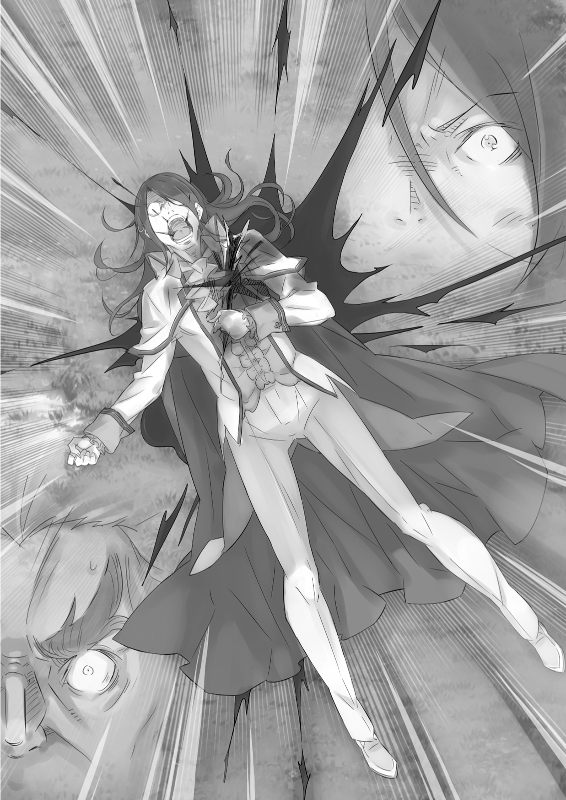

Болота Айхии, занимавшие обширную территорию вдоль южной границы Лугуники и частично формировавшие её рубеж с Империей Волакия, были чрезвычайно опасной зоной. За четыре года с начала гражданского конфликта, известного как Война Полулюдей, вероятно, не было другого сражения такого масштаба, как при Айхии, и никогда напряжение не достигало такого пика.

— Мы и так постоянно ведём стычки с волакийцами. Сосредоточение такого количества войск на их границе… Не хочу даже думать, что Империя может предпринять, если испугается.

Отдалённые боевые кличи эхом разносились по воздуху, и до них доносился гул топота ног. Поле боя было прямо под сапогами рыцарей, но их терзало нетерпение. Столкновение между королевской армией и Альянсом Полулюдей уже началось, но им приказали удерживать позицию.

— Быть в арьергарде звучит славно, но это незавидная участь.

— Осторожнее со словами, сэр Разаак, — предостерёг один из его подчинённых. Пожаловавшийся рыцарь спокойно кивнул. Раньше ему было поручено обучать новобранцев, но по мере обострения войны его вернули на фронт. По мере роста его известности и мастерства владения мечом ему доверили командование отрядом, но с большей ответственностью пришли и большие ограничения в действиях, и временами он находил это скучным.

Особенно сейчас, когда он отвернулся от бушующей битвы и бросил взгляд в сторону Империи.

Для битвы при Айхии королевские силы были разделены на четыре армии. Три из них должны были вступить в бой с полулюдьми, в то время как оставшаяся группа продолжала игру в гляделки с войсками Волакии через границу.

— …Ты ведь не думаешь, что они что-нибудь предпримут?

— Сомневаюсь. Если бы они воспользовались действиями полулюдей, чтобы напасть на нас, они навлекли бы на себя гнев Священного Дракона Волканики. Пока наша нация находится под защитой Дракона, Империя не двинется против нас.

— Тогда почему мы просто стоим здесь и смотрим на них? — Разаак глубоко вздохнул. — Незавидная участь.

Было ужасно ждать, бездействуя, пока его товарищи умирали на поле боя. Разаак был рыцарем из рыцарей, человеком, для которого друзья и страна значили всё — тем больнее было находиться здесь, это ранило его сердце и задевало гордость.

— Товарищи… вернитесь живыми, если сможете. Если нет, то хотя бы примите последнюю жертву с честью. Не будьте побеждены бесстыдными врагами, забывшими о своём долге перед этим королевством, как эти полулюди.

Едва сдерживаемая боль Разаака отражалась на его лице. Его подчинённый кивнул ему с сочувствием во взгляде. Разаак был рыцарем из рыцарей. Как и многие солдаты Лугуники, он придерживался откровенного презрения к полулюдям, которое противоречило его высоким в остальном принципам.

Вот почему почти никто, включая Разаака, не заметил.

Это подсознательное предубеждение было главной причиной, по которой полулюди никогда не могли сдаться.

Его удар отсёк руку врага, аккуратно разрубив кость. Возвращая клинок, он снёс голову кричащему человеку. Хлынувшая кровь забрызгала ему спину, он развернулся и вонзил сталь в лицо ящеру, пытавшемуся зайти сзади. Мозги разлетелись повсюду. Глаза трупа закатились; он спихнул тело ногой с кончика меча.

— Ри-и-и-я-а-а!

Рядом с Вильгельмом на землю упал получеловек, отброшенный ударом. Источником удара был Гримм, державший щит. Он использовал его как для блокирования, так и для ответа на атаку врага. Его оборонительные способности были непревзойдёнными. Он отточил их, находясь сразу за авангардом, что идеально дополняло талант Вильгельма как самого авангарда.

Но времени любоваться им не было. Вильгельм пронзил получеловека в сердце.

Гримм подбежал к нему. — Вильгельм! Ты в порядке?

— Сам видишь.

— Я так и подумал. Просто спросил. Думаю, мы здесь закончили. Капитан… —

Он оглянулся. Конечности вражеского солдата летели по воздуху — результат жестокого удара топора. Столь ужасающая алебарда могла принадлежать только Бордо. Боевой клич, похожий на вой дикого зверя, эхом прокатился по округе.

— Здесь всё кончено! — крикнул Бордо. — Перегруппируемся! Вперёд, на следующее поле боя!

— Надеюсь, в следующий раз они окажут большее сопротивление, — сказал Вильгельм.

— Только не я, — сказал Гримм. — Я не хочу умирать. Я хочу вернуться живым. — Его рука потянулась к шее, нащупав медальон. Игнорируя этот жест, Вильгельм с недоумением посмотрел на Гримма. Сколько бы битв они ни пережили, он никогда не менялся. Он утверждал, что не хочет умирать, но всё равно сломя голову бросался в бой. Он говорил, что хочет вернуться живым, но мог отражать смертоносные атаки врага щитом, а затем забивать их до смерти.

«Он — парадокс».

— Так ты сражаешься, потому что хочешь умереть? — спросил Гримм.

— …

— Не думаю, — продолжил Гримм. — Ты не похож на того, кто жаждет смерти. Но я не думаю, что ты здесь ради убийства. Скорее, мне кажется, ты хочешь жить больше, чем кто-либо другой здесь.

Гримм, казалось, заглянул прямо в сокровенные мысли Вильгельма. И это его раздражало. Вильгельм цокнул языком и ускорил шаг. Достаточно быстро, как он надеялся, чтобы оставить позади юношу, спешившего за ним.

Бордо увидел их приближение и воскликнул: — А, вот и Убийца Капитанов со своим другом Сторожевым Псом! Как там враг, Вильгельм?

Вильгельм указал своим окровавленным мечом в сторону поля боя и сказал: — Не слишком сильны. Нам нужно двигаться к центру. Мы можем сколько угодно обрубать листья и ветки, это ничего не изменит. Нужно вырвать эту проблему с корнем.

— А ты что скажешь, Гримм? — спросил Пивот. — Никаких дурных предчувствий?

— Нет, сэр, ничего. Я не любитель напряжённых боёв, но согласен, что нам нужно двигаться дальше.

Этой рекомендации Бордо было достаточно. Он вскинул свой боевой топор и кивнул. — Отлично, тогда вперёд! Я устал от всей этой мелочи. В битве, как и на охоте, настоящий воин идёт за крупной дичью! Вперёд, отряд Зелгефа, за мной!

— Подождите, молодой господин! Разве мы не должны запросить указаний у генерала? Леди Мейзерс, я полагаю, с ним.

— Не глупи, Пивот. Если мы вернёмся, виконт Бариэль просто использует нас как инструменты, которыми он нас считает. Мы пробьёмся туда, и пусть наш успех в бою говорит сам за себя! Это будет лучшая расплата, в стиле Бордо! — он поднял свой боевой топор для убедительности.

— Расплата, значит? Как это на вас похоже, молодой господин. Но я едва ли могу…

Пивот умолк с обеспокоенным выражением на худом лице. Бордо добродушно рассмеялся, видя своего заместителя в таком состоянии. — Просто делай то, что всегда делал, Пивот, и следуй за мной! Чёрт, да что тебе терять? К тому же, не забывай, что наш любимый генерал выставил Вильгельма дураком перед битвой. Мы должны отплатить ему той же монетой, не так ли?

Вильгельм нахмурился. — Погоди. Не втягивай меня в это. Я же говорил тебе не раздувать из этого. И если ему суждено получить по заслугам, я хочу сделать это сам. Лично.

— А поскольку мы не можем отпустить тебя одного, весь отряд идёт с тобой. — Гримм пожал плечами в ответ на гримасу Вильгельма.

Этот смиренный жест заставил Бордо и Пивота рассмеяться — первого весело, второго с согласием.

— Гримм научился держать себя в руках, а? Что думаешь, Пивот? Всё ещё беспокоишься?

— …Сдаюсь. Вы здесь, молодой господин, и Вильгельм здесь, и Гримм. Это отряд Зелгефа. Я с вами.

— Не забывай, Пивот, ты тоже здесь, — сказал Бордо. — Ладно, парни, теперь идём по-настоящему! — Он поднял свою алебарду к небу. Все остальные в отряде тоже подняли оружие и закричали «ура». Отряд двинулся вперёд во главе с гигантом. Вильгельм выдохнул, единственный, кто не разделял общего настроя.

— Меня вечно втягивают то в одно, то в другое, — пробормотал он.

Он хотел быть сталью. Он хотел быть совершенным клинком, свободным от примесей. Но это желание постоянно подрывалось отвлекающими факторами и разочарованиями, которые, казалось, преследовали его каждый день. Сердито размышляя, Вильгельм попытался пробиться вперёд.

Именно тогда он заметил его: красный цветок, незаметно покачивающийся в углу поля боя. Цветы цвели даже на войне.

— Не глупи! — сказал он себе.

Он не мог понять, почему вдруг представил поле у площади.

Битва на Болотах Айхии. Командовал Лейп Бариэль, виконт юга.

— Обнаружены магические круги ещё в двух местах на северной стороне болот, сэр! Всего восемь точек!

— Отметь их на карте. Аккуратно, будь точен.

Запыхавшийся гонец поставил две красные отметки на карте на стене. На карте, изображавшей Болота Айхии, уже было около сорока подобных отметок.

Примерно за шесть часов с начала битвы из зоны боевых действий поступали сообщения о магических кругах. Королевские силы уделяли первостепенное внимание мерам противодействия магическим кругам после поражения на Кастурском поле, в результате чего полулюди больше не повторяли свой успех с ловушками из магических кругов после той битвы.

— Признаться, такое количество необычно, — сказал Лейп, глядя на карту.

— Может быть, их планом действительно была очередная ловушка, — предложил подчинённый.

— Сейчас? Когда наши контрмеры так широко распространены? Я был бы только рад, если бы прославленные стратеги врага оказались такими тугодумами. Но я сомневаюсь, что это так, и сомневаюсь, что они повторят одно и то же дважды.

— Они всего лишь полулюди, сэр. Наполовину звери.

Лейп остановился, сверля мужчину холодным взглядом. — И что с того? Это причина недооценивать нашего врага? Если ты думаешь, что одолеть зверя так легко, пойди поймай мне сейчас же одного-двух белых китов!

— Э-э, а…

— Идиотам следует держать рот на замке. Если ты забыл, как пользоваться умом, тебе здесь, в штабе, делать нечего. Может, ты предпочтёшь передовую?

— П-прошу прощения, сэр! Я превысил свои полномочия!

Мужчина, понурив голову, вышел из палатки. Лейп фыркнул и снова повернулся к карте. Рядом с ним встала женщина с волосами цвета индиго в военной форме. Розвааль.

— Ваш язык всегда так остёр, — сказала она. — Увере-е-ена, он просто высказал мысль.

— Вы хотите сказать, что добрые намерения заслуживают награды? Нелепо. Всё вознаграждается по результатам. Если поспешный поступок порочит вашу репутацию, у вас отнимают часть того, что вы имеете. У вас есть возражения?

— Не-е-ет, не особенно. Я сама-а не люблю некомпетентных. — Она покачала головой.

Лейп издал смутно удовлетворённый кашель. — Очень мудро, — сказал он. — Мне нужно мнение эксперта. Что вы думаете об этом расположении магических кругов?

— Это довольно необы-ы-ычно. Не только количество, но и размещение. Следуя логике этого расположения, я ожидаю, что есть и другие круги здесь и здесь, а также в этой области.

— Я так и думал. Любой мог бы догадаться об этом. Как они думают, что им даст эта ловушка?

— Мы должны уничтожить круги, несмотря ни на что. Они вызывают у меня дурное предчувствие… Есть кое-что, что я хотела бы проверить. Позволите ли вы мне осмотреть одно из предполагаемых мест?

— У вас есть та женщина-рыцарь, чтобы присматривать за вами, не так ли? Я выделю вам двоим десять человек. Избегайте любых активных мест сражений.

Теперь у неё было разрешение отправиться в пустое — ожидаемое место магических кругов — ближайшее к штабу. Розвааль элегантно поклонилась Лейпу, который едва удостоил её взглядом, когда она покидала палатку. Кэрол встретила её снаружи с тревогой на лице. Розвааль улыбнулась ей.

— Я хочу кое-что осмотреть. Мы будем на окраине битвы, так что я рассчитываю на твою защиту.

— Я понимаю. Но я вижу, вы снова собираетесь лично отправиться в опасное место.

— Ничего-о-о столь же опасного, как то место, где твой маленький друг. По сравнению с фронтом, мы будем в ужа-а-асно безопасном месте.

— Г-Гримм не мой парень!

— Я не припоминаю, чтобы упоминала его и-и-имя.

Серьёзное лицо Кэрол покраснело от того, что она выдала свои чувства. Это вызвало улыбку у Розвааль. Затем она обратила свой один жёлтый глаз на поле боя, полное грохота и дыма.

— Я знаю, что ты здесь, Сфинкс. Что ты замышляешь?

Отряд Зелгефа действовал слаженно, прорубая себе путь к центру поля боя. Каждый получеловек, стоявший на их пути, был сражён. Между хлещущими ударами топора и искусно используемым щитом у врага почти не было шансов нанести ответный удар, но один человек выделялся даже в этой выдающейся компании. Это был мечник — нет, Демон Меча — чей клинок был подобен вихрю.

Вспышки серебра отправляли в полёт руки и ноги, а выпады находили горло и сердце; каждое движение было беспощадным, и каждый удар — смертельным. Он кромсал врагов, когда они приближались сбоку; когда они пытались держать дистанцию, он в мгновение ока сокращал расстояние и пронзал их насквозь. Один за другим полулюди встречали свой конец, поглощённые водоворотом духа этого мечника.

— Чт-что это такое? Как нам с этим сражаться?

Они отступали, потеряв боевой дух. Прежде чем он приближался, они видели его подавляющую силу, а сражаясь с ним, они просто были погребены, ничего не добившись. Молодой получеловек задрожал при виде этой сцены, но почувствовал руку на своём плече.

— Тебе следует отступить. Нет смысла бросать вызов противнику, которого ты не можешь победить. Не дай бог, чтобы кто-то назвал такое действие трусостью.

Обладатель голоса, этот человек, проявивший доброту к испуганным солдатам, шагнул вперёд. Он был так высок, что большинству приходилось задирать шеи, чтобы увидеть его лицо. Он был покрыт чешуёй, а голова его напоминала змеиную. В руке он держал двойной меч — центральная рукоять с лезвием с обеих сторон.

— Эй ты, мечник, — позвал змей трескучим фальцетом, — стой, где стоишь! Ты, кажется, весьма способен. Позволь мне лично противостоять тебе!

Кружащаяся фигура остановилась. Вильгельм опустил своё пропитанное кровью оружие, тяжело дыша. Абсолютная сила его ауры поражала врагов, словно он уже атаковал их; одного его взгляда было достаточно, чтобы полулюди задрожали.

Но змей фыркнул и сказал: — Ты хочешь убить меня. Как мило. В тебе что-то есть, мальчик. Я с радостью стану твоим партнёром по играм! — Затем змей прыгнул на Вильгельма, держа свой двулезвийный меч наготове. Вильгельм тоже бросился вперёд, и расстояние между ними сократилось в одно мгновение.

Уклон, боковой удар. Молниеносная атака нацелилась на голову врага, но поднимающийся клинок встретил её снизу. Со скрежетом и снопом искр отклонённый клинок вернулся для нового удара…

— А-ха! — воскликнул ящер. — Так ты не можешь сравниться со мной в скорости!

— Хррр!

Вильгельм откинул голову назад, двойной клинок прошёл прямо перед ней. Он взметнулся к его подбородку, и быстрая последующая атака сильно прижала его. Враг был один, но оружия — два; его движения были одновременно атакующими и защитными.

Пока они обменивались близкими ударами и едва избегали попаданий, кто-то крикнул: — Это Либре Ферми! Гадюка! Один из столпов Альянса Полулюдей!

Теперь все знали, кто был противником. Получеловек — Либре — лишь шире улыбнулся, его длинный язык заметно высунулся изо рта.

— Столп? Не знаю, нравится ли мне это. Люди подумают, что я толстый, как столб! Я слишком гибок для такого слова!

— Гибкий? Ты? Разве что в моих кошмарах!

— О, как жестоко. Легкомысленные детишки. Я мог бы съесть вас… буквально.

Едва он произнёс это, как лицо Либре изменилось. Его зрачки сузились, и изо рта вырвалось шипение змеи, предупреждающей врага. Скорость его движений ещё больше возросла.

— Вильгельм!

В стальной буре, где всё происходило слишком быстро, чтобы разглядеть, Вильгельм вёл оборонительный бой. Он оказался загнанным в угол. Кто-то позвал его по имени. Гримм? Бордо? Неважно. Неважно, пока они ничего не предпринимают. Эта битва, этот враг — только его.

— Ха… ха-ха…

— Ты… смеёшься? — спросил Либре.

Он больше не мог сдерживаться. — Ха-ха-ха! Ха-ха-ха-ха-ха! — Смех не прекращался. Это была сама радость, поднимавшаяся в его сердце. Эмоция подбодрила его, направила в поток следующей атаки. Это заставило Либре на мгновение замедлиться, и меч Вильгельма устремился к нему. Змей отбросился в сторону, уклоняясь от удара — и тут же почувствовал пинок.

— Хрр—гг!

Он согнулся почти пополам от неожиданного удара, и колено взлетело, чтобы встретить его лицо, когда оно наклонилось вперёд. Он истекал кровью. Меч метнулся к его обнажённому кадыку, стремясь отрубить голову.

— Боже милостивый! Ты искусен для такого дерзкого и молодого!

Он подставил левую руку, чтобы блокировать удар. Чешуя лишь на мгновение сопротивлялась стали, а затем его кисть была отсечена по запястью. Но в это мгновение Либре пригнулся, чтобы ударить Вильгельма в живот своей мощной рукой. Рёбра мальчика треснули, а внутренние органы сжались, когда его отбросило назад. Земля нанесла ему несколько неприятных ударов, пока он катился, но он был ещё жив. Он выплюнул полный рот крови и желчи.

— Вильгельм! — крикнул Гримм. — Чёрт возьми, я присоединяюсь!

— Н-не глупи!.. Этот — мой… и только мой!

— Вот тут ты ошибаешься. Этот змей — враг нашей нации. А значит, враг всех нас! — сказал Бордо, становясь вместе с Гриммом перед захлёбывающимся Вильгельмом. Другие члены отряда двинулись, чтобы окружить Либре, отрезая ему путь к отступлению.

— Боже милостивый, — сказал Либре. — Нападать всем скопом на раненую, убитую горем леди? Вас не беспокоит ваша драгоценная честь?

— Посмотри-ка. Разве мы похожи на тех, кто заботится о чести? У нас закончились рыцарские добродетели.

— И кроме того, Либре Ферми, мне случилось знать, что потерянная рука или нога — не великая потеря для змеелюда. Ты просто отрастишь её заново.

— Ах, ах, эксперт. Хотя это ужасно утомительно.

Пивот, который это сказал, стоял вне круга. Либре поднял свою левую руку без кисти. Срез был чистым.

Края раны начали извиваться, а затем плоть приняла форму руки в захватывающем проявлении регенеративной силы.

Глаза змея посмотрели в одну сторону, затем в другую; повсюду полулюдей расчленяли и убивали. Либре печально посмотрел на землю, затем указал на окруживший его отряд.

— Вы, ребята, говорите на языке силы. Вы натренировали себя до предела. А тот мальчик там… Может ли он быть Демоном Меча, интересно?

— О-хо! — сказал Бордо. — Так даже командиры полулюдей знают Демона Меча. Ты поднимаешься в мире!

— Пожалуйста, не называйте меня командиром. В этом титуле нет никакого очарования; он мне не подходит. Титулы, пахнущие такой мужественностью, порадовали бы таких идиотов, как Валга. — Либре скрестил руки на груди и протяжно выдохнул. Затем он посмотрел на небо. — Полагаю, даже я в одиночку не совсем ровня отряду Зелгефа.

— Тогда ты и я! Я снесу эту голову прямо с твоих плеч!.. — Вильгельм, тяжело дыша, шагнул вперёд, требуя продолжения их поединка. Но Либре лишь пожал плечами и поднял свой двойной клинок.

— Я бы с удовольствием разделил этот танец… но полагаю, близится момент, когда пора положить конец. Если вы любезно меня извините.

— Что ты?..

Но он так и не заговорил об этом .

Сначала он почувствовал это как изменение в воздухе. Атмосфера поля боя, густая от жажды крови и запаха железа, стала влажной и липкой.

Мгновение спустя его руки и предплечья оказались под водой.

— Что?! Что за!..

— Вы все слишком беспокоились о магических кругах. Осторожно избавлялись от них один за другим. Предположим, кто-то знал, что вы поступите именно так? Разве не было бы логично сделать это основой ловушки?

— Магические круги? Как?..

Со времён Кастурского поля уничтожение магических кругов на любом поле боя было главным приоритетом для королевских сил. Отряд Зелгефа тщательно уничтожал все найденные круги; они даже убрали один круг с этого самого поля боя.

— Магические круги работают, наделяя круги смыслом, а затем пропуская через них магическую силу. Вы боитесь эффектов, которые они могут вызвать, но эти круги были активны с самого начала.

Голос Либре резал слух Вильгельма. Его конечности отяжелели, словно он прыгнул в бассейн с водой в полной одежде, и ему даже стало трудно дышать. Не только он; все вокруг, казалось, испытывали то же самое. Но Либре не выказывал никаких признаков воздействия.

— В этих магических кругах была накоплена сила. И вы уничтожили каждый из них! Вы высвободили энергию в них, позволив ей зарядить скрытый, истинный магический круг — и вот результат.

— Зачем все эти игры?.. Почему бы просто не начать с… истинного круга? — спросил Пивот, его голос напрягся.

Либре ответил так, будто у него было всё время мира. — Вы бы когда-нибудь подошли к болоту, если бы на нём был гигантский спусковой крючок заклинания? Вместо этого мы оставили вам небольшую тропинку из хлебных крошек, по которой вы пошли. И подумайте о будущем. Когда вы увидите магический круг на каком-нибудь другом поле боя, вам придётся задуматься — уничтожать его или нет? — Это была одна из стратегий Валги Кромвеля, учитывающая не только эту битву, но и будущие.

Либре поднял голову. Остальные проследили за его взглядом и увидели над собой красновато-фиолетовое небо. Странный цвет распространялся по всему полю боя — скорее всего, обозначая зону действия магического круга. Другими словами…

— Я всегда верил, что людей и полулюдей разделяет только их внешний вид и кровь. Теперь я вижу, что этого более чем достаточно, чтобы расколоть мир надвое. — Он сделал многозначительную паузу. — Мы будем давать вам отпор, начиная с этого момента. Вы увидите.

— Леди Мейзерс!.. Что происходит?!

— Нас поиме-е-ели. Все магические круги сегодня — нет, все-е-е круги со времён Кастурского поля — были приманками, веду-у-ущими нас к этому моменту.

Кэрол мучительно опустилась на колени; рядом с ней Розвааль нахмурилась, глядя на магический круг.

Это произошло после того, как они покинули штаб для расследования. Даже когда они изучали диаграмму, она активировалась, и всё поле боя было окутано этим магическим эффектом. Всё её тело ощущалось так, будто застряло в какой-то сиропообразной жидкости, было трудно двигаться и вдыхать.

— Я едва могу дышать… и моё тело… такое тяжёлое… — простонала Кэрол, покрываясь потом. Все остальные солдаты, которых Лейп отправил с ней, чувствовали то же самое. Эффект, казалось, проявлялся с небольшими индивидуальными различиями, но все они стояли на коленях, стеная.

— Если это происходит по всему полю боя…

— Я определённо подозреваю, что так и есть. Предполагаю, что сторона полулюдей не затронута. Как будто им позволено сражаться на суше, а нам приходится двигаться под водой. Возможно, ты, Кэрол, сможешь выйти победителем?

— Небеса… помогите нам. Если это дело рук магии, то не могли бы вы?..

— Возмо-о-ожно, я могла бы расшифровать ритуал для круга и отменить его. Но это… — Розвааль сделала паузу, глядя на обесцвеченное небо. Она сузила свои гетерохромные глаза, когда что-то медленно спускалось к земле. — …вот почему-у-у ты здесь, — заключила она.

— Если есть хоть какой-то шанс остановить этот круг, то именно вы, основываясь на увиденном, смогли бы это выяснить. А я приложила слишком много усилий к этой магии, чтобы позволить вам её разрушить.

Обладательница спокойного, ровного голоса приземлилась на землю — юная девушка в белом одеянии. Ткань скрывала ведьму ужасающей злобы — Сфинкс.

— Какой сюрпри-и-из, что ты беспокоишься обо мне. Я так тронута, что меня сейчас стошнит.

— Те, кто обладает высокой степенью специализированных знаний, ценны. Если возможно, я надеялась, что вы поможете мне стать совершенной.

Сфинкс с любопытством посмотрела на Розвааль, но та решительно отвергла ведьму. — Принципы моего учителя были препятствием на пути прогресса. Ты всего лишь неудачный эксперимент из прошлого. И я избавлюсь от тебя.

В ответ на слова Розвааль Сфинкс подняла руку и указала на одного из агонизирующих солдат.

— Вы смогли отреагировать на то, что я только что сделала?

Луч света метнулся к шее солдата и прошёл сквозь неё в мгновение ока. Его голова испарилась. Она повторяла это снова и снова, пока шесть солдат не легли на землю.

— А… А-а-а… — Кэрол, всё ещё неспособная двигаться, издала звук изумления при виде этой бойни. Даже если бы они не были скованы, это произошло так быстро, что увернуться было бы почти невозможно. На интуитивном уровне она поняла, что если этот палец укажет на неё, это будет последнее, что она увидит. Её тщательно отточенная техника владения мечом, идеалы, которыми она так дорожила — всё это ничего не значило перед лицом этого монстра.

— Я спрашиваю ещё раз. Вы будете сотрудничать в моём совершенствовании?

Это была не просьба, а угроза. Её сердце, её тело — что-то непременно сдастся.

Но даже когда этот палец с таким разрушительным потенциалом был направлен на неё, Розвааль покачала головой.

— Я же сказала, — произнесла она. — Я убью тебя.

— Жаль. — Её слова были бесстрастны. И затем её палец засветился.

На глазах Кэрол луч света выстрелил прямо в Розвааль.

Крики и предсмертные хрипы доносились до ушей Вильгельма со всего поля боя.

Его колени дрожали, дыхание было тяжёлым; он едва держался на ногах. Голова отяжелела, а руки и ноги двигались слишком медленно. Как бы жадно он ни глотал воздух, казалось, он не мог получить достаточно кислорода, чтобы наполнить лёгкие.

То же самое явление поразило Бордо и остальных; предположительно, это происходило по всему полю битвы. Похоже, оно затрагивало только королевскую армию — человеческие силы.

— Я говорил Валге, что даже если он отплатит людям в десять раз больнее, мы всё равно проиграем, — прошипел Либре, взмахнув своим двойным клинком. — Полагаю, это его ответ. Если он причинит вам в сто, в двести раз больше боли, чем вы нам, вы запоёте другую песню!

— Не глупи! — проревел Бордо, опираясь на свой боевой топор. — Вы могли бы перебить каждого солдата на этом поле, и мы всё равно не сдались бы таким, как вы!

Либре нахмурился от шума и указал на задыхающихся солдат движением языка. — Гордость — это хорошо, но неужели вы не успокоитесь, пока обе стороны не будут полностью уничтожены? Вот почему я ненавижу грубых, варварских мужчин. Невозможно вести продуктивный разговор.

— Вы пытаетесь намекнуть, что ищете его? — это замечание исходило от Пивота, чьё лицо медленно синело. Холодный пот стекал по его щекам. — Чего вы хотите от исхода этой битвы?

— Чего ещё? Мира. Чтобы нас безжалостно не выискивали, не убивали и не топтали ногами. Мы, полулюди, хотим знать, что сможем прожить свои дни в мире. Вот почему мы сражаемся.

— …Это не то, что мы слышали от Валги Кромвеля.

— Речи этого дурака слишком уж экстремальны! …Но он так говорит из-за вас, людей. И я изливаю всё своё сочувствие на пламя его ненависти. Это ещё одна причина, почему мы добьёмся вашего поражения и заставим вас сесть за стол переговоров.

С одной стороны, Либре, казалось, был готов к взаимопониманию, но он также желал победы полулюдей. Змей отвёл взгляд от Пивота и направил своё оружие на Бордо.

— Я презираю идею убийства обездвиженных рыцарей, но я собираюсь использовать вас, героев, чтобы сломить волю человечества. Когда они услышат, что отряд Зелгефа уничтожен, их боевой дух умрёт вместе с вами.

— …Ты думаешь… мы так легко сдадимся?! — прохрипел Бордо.

— Уверяю вас, мне больно это делать. Но я — Либре Ферми. Я воплощаю гнев полулюдей, и я покажу вам, людям, свои клыки, невзирая на мои личные желания! Бордо Зелгеф, здесь ты умрёшь!

Жилистое тело Либре прыгнуло на Бордо. Его двойной клинок закружился над головой в смертельной буре и устремился к огромному человеку с намерением покончить с его жизнью. Невольно все отвернулись.

Именно тогда удар Демона Меча пришёлся сбоку.

— Гррра-а-а-а-а!

— Ты всё ещё можешь двигаться?!

Осознавая ограничения своего тела, атака Вильгельма рассекла воздух с минимально возможным движением. Либре быстро отклонил её своим двойным клинком, но яростную атаку Демона Меча было не остановить. Он ударил мечом по ногам змея, когда те коснулись земли, по его голове, когда та отпрянула назад, и по животу, пытавшемуся увернуться. Искры и скрежет стали были повсюду; пара сошлась в смертельном танце.

— Ты можешь вести себя сильно, но ты слишком медленный! Слишком вялый! Слишком слабый! Таким, как ты сейчас, меня не победить!

Вильгельма оттесняли. Конечно. Это был противник, с которым у него были шансы пятьдесят на пятьдесят на равных, а теперь ему приходилось сражаться, барахтаясь в невидимой воде. Он даже не должен был быть в состоянии сражаться в таком состоянии; у него определённо не было шансов на победу.

Но Вильгельм отказывался просто лечь и умереть, не оказав никакого сопротивления.

— Я уважаю твою преданность другу, бросившемуся его спасать, но на этом всё кончено! — крикнул Либре.

Эти слова зажгли огонь в сердце Вильгельма. — Не смеши меня! Дело не в преданности кому-либо! — Но движения его руки не подчинялись велениям его ярости. Двойной клинок отклонил его меч, нанося удар в его незащищённый живот. Кровь застыла в его жилах, уверенный, что его сейчас распорют.

Мгновение спустя он почувствовал лёгкий удар и брызги горячей крови.

— А-ах. Господи. У меня всегда худшая доля в жизни.

— Пивот!

Пивот издал ужасный крик, словно его рвало кровью. Затем Вильгельм увидел его прямо перед глазами, глубоко порезанного и падающего на землю. Длинный диагональный разрез шёл от его левого плеча через всё тело.

Он бросился под удар Либре. Он спас Вильгельма.

Падая навзничь, Пивот закричал таким громким голосом, какого от него ещё никто не слышал: — Не дайте… Вильгельму умереть!

Этот крик воодушевил остальных членов отряда; превозмогая скованность тел, они выступили против Либре и его парного клинка.

У них не было и шанса на победу. Их замедленные движения не могли противостоять танцующему оружию Либре, и один за другим они обагряли своей кровью поле боя.

— Прекратите…

Вильгельм упал на колени. Пивот защитил его, но он всё равно был ранен. Мечник смотрел, как отряд Зелгефа уничтожают одного бойца за другим прямо у него на глазах, а он не мог даже встать.

— ПРЕКРАТИ-И-И-ИТЕ!

Он взревел, изливая все бурлящие в нём эмоции. «Был ли Либре истинной целью? Или он кричал на товарищей по отряду, защищавших его ценой своей жизни?» Он и сам не знал.

Его голос жестоким эхом разносился вокруг, пока парный клинок продолжал кромсать его отряд. Гора тел росла.

— Вы все хорошие люди, — сказал Либре. — Почему… всё так обернулось?

— Чёрт его знает. Но я уверен в одном: мы не позволим убить Вильгельма. Потому что он — меч Королевства Лугуника! — Гримм отбросил свой клинок и поднял щит, блокируя удары Либре. Это был плод всего времени, что он провёл в обороне, и Гримм смог продержаться намного дольше, чем любой другой член отряда.

Но всё было относительно. Если на то, чтобы сразить других, хватало одной атаки, то чтобы добраться до Гримма, потребовалось пять.

— Кххгх…

Гримм не успел поднять щит, и парный клинок вонзился ему в горло. Глаза Гримма расширились от смертельного удара; он выронил щит и рухнул на землю. Из раны хлынула кровь, и конечности Защитника Щита беспомощно задёргались. А затем безжалостный удар обрушился прямо сверху…

— Хра-а-а-а!

Одержимый убийственной яростью, Вильгельм бросился на Либре. Змей медленно среагировал на эту неожиданную контратаку, и они оба, сцепившись, покатились на землю и упали во впадину.

Кувыркаясь и меняясь местами, они колотили друг друга, пока не достигли дна низины. Харкая кровью и издавая звериный рык, Демон Меча и змей покатились к месту своей последней битвы.

Луч света ударил в Розвааль почти быстрее, чем мог уследить глаз. Он двигался так быстро, что Кэрол не успела сделать ни шагу, чтобы защитить свою госпожу; где-то внутри она уже смирилась с тем, что увидит, как Розвааль разлетится на куски. Но её отчаяние сменилось изумлением.

— Что ж… Что ж…

— Разве я не говорила? Я та, кто убьёт тебя.

Сфинкс схватилась за живот, куда пришёлся удар. Впервые её дыхание было прерывистым от боли. Причиной ранения была Розвааль, которая увернулась от луча света и шагнула вперёд, чтобы нанести удар кулаком.

Она тряхнула своими иссиня-чёрными волосами, поднимая руки, словно готовясь к боксу. — Не на всех магический круг действует одинаково. Всё дело в разнице наших циклов маны. Проще говоря, чем искуснее ты в колдовстве, тем более восприимчива к эффектам круга. Это всё упрощает. Чем хуже ты как колдун, тем свободнее можешь двигаться.

— Я слышала, что ты специализируешься на магии, но это…

— Я знаю больше, чем кто-либо. Я про-о-осто не могу применить это на практике. Это поколение, Розвааль J. Мейзерс, совершенно и абсолютно неспособно использовать магию. Вот почему я могу убить тебя.

Говоря это, Розвааль достала пару стальных латных перчаток и надела их. Её кулаки стали стальным оружием; она была готова буквально забить до смерти стоящее перед ней чудовище.

— С самых юных лет меня обучали боевым искусствам, и всё ради этого момента. Надеюсь, у тебя будет шанс восхититься моей техникой, прежде чем я покончу с тобой.

Розвааль ринулась вперёд с неистовой силой, её удары рассекали воздух. Любой из них, достигни он цели, был бы достаточно силён, чтобы сокрушить валун, и Сфинкс быстро оказалась в полной обороне.

Кэрол сглотнула, заворожённая боем Розвааль. То, как она использовала кулаки и как держалась, безошибочно выдавало в ней опытного практика, гения, чьи природные таланты оттачивались более двадцати лет, чтобы выковать того потрясающего кулачного бойца, которого Кэрол видела перед собой. Розвааль не хвасталась и не преувеличивала, говоря, что тренировалась с детства. Это был факт.

Удар ногой, способный расколоть большое дерево пополам, точно попал в Сфинкс, отбросив её лёгкое тело в сторону. Её юное лицо врезалось в землю, и вскоре после этого закованный в сталь кулак попытался раздробить ей череп.

— Это превосходит… всё, что я представляла. Моё наблюдение было недостаточным. — В мгновение ока Сфинкс поднялась с земли и взмыла в воздух. Она вытерла уголок рта. Возможно, у неё были какие-то внутренние повреждения, так как свежая кровь неумолимо струилась из её рта.

Губы Розвааль презрительно скривились, когда она наблюдала за парящей в воздухе противницей. — Собираешься бежать?

— Я также могла бы обстреливать тебя отсюда сверху, где ты меня не достанешь.

— …

Сфинкс, должно быть, увидела что-то в блестящем глазу Розвааль, потому что решила проявить осторожность. — Но давай прекратим это. Я полагаю, у тебя готов какой-то план, чтобы сбить меня с неба.

Юная ведьма танцевала в воздухе, оставляя Розвааль и Кэрол всё дальше и дальше внизу.

— Леди Мейзерс! — воскликнула Кэрол. — Эта злодейка — ведьма — уходит!

— Я вижу, — сказала Розвааль, оставаясь спокойнее своего телохранителя. — Но гнаться за ней бесполезно. И не называй её «ведьма». — Она сняла перчатки. Вместо того чтобы преследовать убегающего врага, она наступила на магический круг, который светился от избытка магической силы.

— Этот сложный узор не столько усиливает эффект магии, сколько затрудняет её рассеивание. Похоже, они обо мне о-о-очень высокого мнения. И они всё равно недооценили меня. — Бормоча это, Розвааль опустилась на землю рядом со светящимся кругом и начала что-то царапать на земле. Она указала пальцем на круг и прищурила один глаз. Её жёлтая радужка странно мерцала, и мгновение спустя узор под её ногами разбился со звуком бьющегося стекла.

Когда магия исчезла вместе с кругом, их дыхание восстановилось, а конечности стали лёгкими. Гневно-красное небо вспомнило свой обычный цвет, и мир окрасился в сумеречные тона. Кэрол поднялась на ноги.

— Я могу двигаться!.. Постойте, Леди Мейзерс. Какой урон мы понесли от этого круга?

— В бою достаточно пяти секунд, чтобы переломить ход сражения, не говоря уже о десяти минутах… Кто может сказать, что произошло?

«Гримм…» — Кэрол немедленно подумала о том, кого любила, и прошептала его имя.

Рядом с ней Розвааль наблюдала, как небо возвращает свой цвет. — Я думала, что не смогу уничтожить эту штуку здесь, в Айхии. Значит, финальная битва будет где-то ещё…

К тому времени, как они приземлились на дно впадины, Вильгельм был сверху.

Его лицо ударилось о влажную землю, он выплюнул грязь изо рта, одновременно оскалив зубы. Либре протянул руку, словно пытаясь поднять его, и Вильгельм откусил пальцы змея. Падая сверху, он ударил змея коленом в живот.

Он внезапно почувствовал, что его тело вернулось в норму. Он поправил хватку на своём любимом мече и направил его на Либре. Человек-змей поднялся, готовя свой парный клинок. Они уставились друг на друга.

— Полагаю, это означает, что нашему магическому кругу конец, — сказал Либре. — Что ж, так даже лучше. Как я уже говорил, у меня нет желания убивать беспомощного противника!

— Заткнись, сукин сын! Я никогда не прощу тебе того, что ты сделал!

— Ты злишься, что я убил твоих друзей? Так, значит, у Демона Меча всё-таки есть человеческие чувства.

На мгновение Вильгельм не нашёлся, что ответить на насмешки Либре. Раскалённая ярость поднялась в его груди, словно по венам текла не кровь, а магма. Но даже он не знал, откуда взялся этот чудовищный гнев. Он мог только отрицать его.

— Да как ты смеешь! Я всего лишь меч! Просто один меч! Верность и дружба не имеют ничего…

Сталь была прекрасна. Никогда не гневалась. Никогда не жаловалась. Самодостаточна. Вот почему Вильгельм хотел…

— Понятно. Думаю, теперь я начинаю понимать. Ты, в этот самый момент, перерождаешься.

Вильгельм затаил дыхание.

— Нападай, незрелый юнец. Я научу тебя, как впервые кричит новорождённый.

Вильгельм дерзко бросился на Либре со всей своей силой. И в ответ сильнейший воин Альянса Полулюдей поднял свой парный клинок.

— Пивот! Пивот, очнись! Не смей умирать!

Дыхание Пивота было коротким и прерывистым. Бордо держал его на руках, отчаянно крича. Глаза худощавого мужчины дрогнули и открылись, он посмотрел на Бордо затуманенным взглядом. Слабая улыбка тронула его лицо.

— М-молодой… господин… какое не… подобающее у вас лицо.

— Не пытайся говорить! Нет, подожди — продолжай! Не умирай! Если потеряешь сознание — это конец!

Пивот вцепился в шею Бордо, его дыхание становилось всё короче. Его лицо было бесцветным, и кровотечение из ран прекращалось. Любой мог видеть, что его состояние было смертельным. Единственным, кто отказывался это признать, был Бордо.

— Молодой… молодой господин, вы должны быть осторожны… чтобы исправить… свои недостатки.

— Прикрывать мои промахи — это твоя работа! Это невыполнение обязанностей, и я этого не потерплю!

Общая трудность с дыханием наконец-то прошла, но кроме Пивота пало много бойцов. Сколько из них осталось, чтобы снова насладиться свободным воздухом?

— М—м… господин… Это была… честь… — Вице-капитан сделал долгий выдох, и сила покинула его тело.

— Пивот? Пивот, давай же! Хватит дурачиться! Открой глаза! Пивот! — Бордо хлопал мужчину по щекам, пытался силой открыть ему глаза. Но тело Пивота не двигалось. Его жизнь ушла. Даже Бордо мог это видеть. Поле боя научило его, как выглядят трупы, и теперь Пивот был одним из них.

И всё же, сколько бы времени ни прошло, он не мог этого признать.

Внезапно останки Пивота сильно содрогнулись. — …

— Пивот? — Изумлённый Бордо посмотрел на тело так, словно не мог поверить. Глаза трупа медленно открылись. Зрачки сфокусировались на Бордо.

— Пиво..!

Капитан как раз восклицал по поводу этого чуда, когда две руки обхватили его шею. Его голова дёрнулась назад от боли и удивления, затем две руки поднялись и обхватили его туловище, пытаясь сломать позвоночник. Словно покойный Пивот пытался забрать Бордо с собой.

— Хрггх… Гах…

Пока труп душил его, Бордо чувствовал, как сознание ускользает. Было немыслимо, чтобы Пивот предал его. Он из всех людей никогда бы так не поступил. Что случилось? За мгновение до того, как мир померк…

— Хррр!

Гримм оттолкнул тело Пивота, держа щит наготове. Они оба рухнули на землю, практически друг на друга. Гримм не поднялся. Но Пивот встал и с воем дикого зверя потянулся к мальчику без сознания. Безжалостные пальцы искали слабое место Гримма, протянулись, чтобы забрать его жизнь…

— Я-а-а-а-а!

Со свистом воздуха боевой топор Бордо ударил беззащитного Пивота точно в середину спины. Это было оружие, способное разрубить даже броню, как бумагу. Оно почти разрубило врага пополам; тот упал на землю и наконец затих.

Труп. На этот раз он был окончательно и бесповоротно трупом.

— …

Бордо стоял наготове со своим боевым топором, а вокруг него стояли погибшие члены отряда Зелгефа. Знакомые лица, теперь лишённые жизни, пронзали Бордо своими пустыми взглядами. Их бывший командир начал смеяться.

— Ха… Ха-ха… ха-ха-ха! Ах-ха-ха-ха-ха-ха-ха!

Это были марионетки-нежить. Маленький фокус ведьмы Сфинкс. Бордо понял это в тот момент, когда её ненависть вошла в этих некогда гордых воинов в попытке осквернить их после смерти.

— Эта ведьма!.. Этаведьмаэтаведьмаэтаведьмаэтаведьмаэтаведьмаэтаведьмаэтаведьмаэтаве-е-едьма!

Выкрикивая эти слова почти как заклинание, Бордо поклялся отомстить истинному злу, тому, кто делал всё это, даже не присутствуя здесь. А затем он и его боевой топор принялись кромсать всех своих недавно погибших подчинённых. Срубая наступающих зомби, отправляя их обратно в смерть, Бордо смеялся. Он смеялся и смеялся.

Вой продолжался и продолжался, пока не смешался с рыданиями. Эхо достигало каждого уголка поля боя.

Танец смерти и стали достигал своей кульминации. Вильгельм владел своим клинком с леденящей ясностью, становясь всё быстрее и проворнее. Ответы Либре его парным клинком были балетными, но его раны множились, поскольку ему становилось всё труднее и труднее избегать ударов Вильгельма.

Это поразительное проявление фехтовального искусства было результатом умопомрачительного таланта в сочетании с потом и слезами самого Вильгельма. Либре прожил долгую жизнь и знал немногих, кто мог бы бросить ему вызов в бою. Он мог только восхищаться тем, что нашёл соперника в таком молодом юноше.

«Это зловеще», — подумал он. Он чувствовал, что дурное предзнаменование несло не только мастерство владения мечом юноши, но и качество его человеческой натуры. Он был незавершённым, несовершенным. Незрелым. Он был ещё молод и ещё не овладел собой.

«Он сказал, что хочет быть сталью. Быть взмахом меча».

Возможно, это была задача, которую он поставил перед собой, и мотивация, которая двигала им. Тяжесть и быстрота его ударов не могли быть достигнуты половинчатыми усилиями. Но уклоняясь и отражая удары своим парным клинком, Либре чувствовал, что поток эмоций, заключённый в атакующем мече, не был потоком стали.

Эмоции горели жарко, а сталь сама по себе не нагревается. Человеческому сердцу свойственно поддаваться чувствам, но именно эти самые эмоции придавали интенсивность их борьбе. Этот демон, желавший стать мечом, — всё ещё был человеком.

— Хех-хех.

— Что смешного?! — потребовал Вильгельм у посмеивающегося Либре. Лицо Вильгельма было залито кровью.

— О, ничего, — сказал Либре. — Просто, даже когда мы пытаемся убить друг друга, я просто не могу испытывать азарт, сражаясь с деревянным противником. Если уж мне суждено противопоставить свой образ жизни чужому, я хочу, чтобы это был кто-то, кто истекает кровью, кто-то, кто плачет!

Шум стоял невообразимый. Вспышки искр, лязг сталкивающихся клинков, их топот по земле — всё это сливалось в какофонию. Жизнь расцветала в каждом ударе, эмоции выражались в каждом взмахе, и весь этот шум взывал к продолжению боя.

Он не был сталью. Он не был демоном. Здесь он был просто мальчиком по имени Вильгельм. Противником Либре был всего лишь один человек, а сам Либре — всего лишь один получеловек; вся война воплотилась в них двоих.

Вильгельму удалось найти брешь сверху, он развернулся, чтобы направить свой меч к шее Либре. Змей поднял своё оружие и поймал удар — и тут клинок разлетелся на куски, а удар Вильгельма достиг цели.

В глазах Либре всё полыхнуло красным. Но сила удара была ослаблена, и меч не смог пробить чешую Либре. С мечом, наполовину вонзившимся в его шею, Либре взмахнул оставшимся концом своего парного клинка в сторону Вильгельма.

Разница между ними как видами, разница в способностях, с которыми они родились, решила исход этой битвы. Это, по сути, и было причиной всей этой гражданской войны.

— В конце концов… может быть, мы и разные, — задумчиво произнёс Либре. — Может быть, мы не можем понять друг друга. На мгновение мне почти показалось, что я достучался до тебя, хотя бы немного. Или мне это показалось?

Вильгельм отшатнулся назад, хватаясь за рану на груди. Либре сделал выпад мечом. Но даже когда смерть приблизилась, убийственные глаза мальчика отказывались признавать поражение. Печаль затопила сердце Либре. Такая сильная жизненная сила не заслуживала такой судьбы.

— Ты действительно человек, не так ли? Настолько человек, что это вызывает у меня печаль. Но это не меняет того факта, что ты представляешь угрозу для меня и моих сородичей. С сожалением вынужден сказать, что это прощание.

Мальчику нельзя было позволить жить. Либре могли насмехаться; могли сказать, что его собственная человечность была использована против него в бою. Но его привязанность к конкретному человеку и его гордость как получеловека были разными вещами.

Либре Ферми был не в том положении, чтобы отдавать предпочтение личным чувствам. Он знал, что все его действия должны служить делу полулюдей. И поэтому…

— Когда всё это закончится, я положу цветок на твою могилу. Кроваво-красный, полный жара страсти.

Затем он поднял свой сломанный пополам парный клинок, надеясь подарить Демону Меча хотя бы безболезненную смерть.

В следующее мгновение луч света пронзил грудь Либре сзади.

За мгновение до того, как к нему пришла смерть, жизнь Вильгельма действительно пронеслась перед его глазами.

— Хрк! Ха-ах!

Кровь сопровождала длинный язык Либре, когда тот вывалился изо рта; дрожа, он с изумлением оглянулся. Там стояла ведьма Сфинкс, появившаяся внезапно, её светящийся палец был направлен в их сторону.

— Что… ты… творишь?

— Верно. Я была ранена серьёзнее, чем планировала, и в данный момент отступаю. Пока я это делаю, я хотела попросить защиты у самого способного человека, какого только смогу найти, а ты был под рукой, поэтому я выбрала тебя.

Либре посмотрел на дыру в своей груди, коснулся бескровной раны и улыбнулся.

— Вот как?.. Должен сказать, это едва ли похоже на просьбу.

— У меня нет времени на переговоры, поэтому я решила просто убить тебя и немедленно сделать своей марионеткой. Не бойся. Валга рассказал мне, как отчаянно ты ему нужен. Поэтому, хотя я и превращу тебя в воина-нежить, я планирую принять все меры, чтобы предотвратить твоё гниение. Это требует тщательного обдумывания.

— Валга… Этот дурак. Я говорил ему… мы не сможем тебя контролировать…

Размахивая сломанным клинком, Либре повернулся к Сфинкс. Она склонила голову набок, глядя на его поведение. — Судя по твоим ранениям и уровню усталости, я заключаю, что сопротивление бесполезно.

— Бесполезность — не причина для бездействия. Я… гордость расы полулюдей. Либре Ферми! Не недооценивай меня, мелкая стерва!

Оскалив клыки, Либре бросился вперёд. Его движения и скорость никогда бы не выдали, что он был на грани смерти.

— Я не хотела причинять тебе слишком много вреда, но ты не оставляешь мне выбора. — Буря белого света обрушилась на наступающего Либре, пронзая его грудь, колени и шею. Кровь брызнула во все стороны; бесчисленные дыры размером с монету открылись в теле Либре, и он рухнул на землю.

— Проклятая… ведьма… Ты ни… никогда не получишь… м-м…

— …

— В… Валга… Остальное… на… т—

Эти два незаконченных проклятия были последними словами Либре, когда луч света ударил его в голову. И так сильнейший из полулюдей пал мёртвым, с огромной дырой посреди лица.

Пока у него отнимали шанс свести счёты с таким прекрасным противником, Вильгельм ничего не сказал. Он смотрел, как Сфинкс положила ладонь на останки Либре.

— Я скажу Валге, что ты пал с честью в бою. Мои исследования показывают, что такое сообщение сделало бы тебя счастливым. А теперь…

— П-постой…

Когда Сфинкс начала подниматься, Вильгельм остановил её с убийством в глазах. Но то, как она посмотрела на него, говорило о том, что для неё его ненависть была не более чем лёгким ветерком.

— Не бойся; ты в безопасности. Я не собираюсь причинять тебе вред. Я хочу немедленно покинуть это место и приготовиться к тому, что будет дальше. Это требует подготовки.

— Не смейся надо мной! Ты… оставляешь меня в живых? Почему? Сражайся со мной… С-сражайся… со мной!..

Ранее невыразительные глаза Сфинкс расширились. — Я крайне удивлена слышать такое от тебя, в твоём нынешнем состоянии. — Затем она несколько раз кивнула, с интересом осматривая Вильгельма. — Ты явно не способен сражаться. И всё же ты ищешь боя. Я не понимаю. Возможно, потому что мои эмоции неполны. Я вижу, что ты тоже требуешь наблюдения.

— Наблюдения?..

— Валга, который горит ненавистью, и Либре, который владел мечом с печалью, оба были объектами изучения. Ты, сосуд гнева, превосходящего смерть, тоже им являешься… Я с нетерпением жду следующей возможности понаблюдать за тобой.

С этими словами Сфинкс развернулась. Вильгельм хотел крикнуть, остановить её; он попытался подняться, но его конечности не двигались. Вместо этого…

— …Либре.

Труп Либре Ферми, со светом, угасшим в глазах, встал. Теперь Либре носил пустое выражение лица воина-нежити, и он не обращал никакого внимания на Вильгельма, следуя за уходящей Сфинкс. Высокий змей и миниатюрная девушка исчезли вдали, оставив Вильгельма одного.

— Чёрт бы всё побрал, — прорычал Вильгельм, стиснув зубы так сильно, что казалось, они вот-вот треснут, и проклиная своё неподвижное тело. Его глаза были широко открыты, и он лежал, свернувшись в углу поля боя, выжженного пламенем войны, бормоча свою ненависть про себя, словно заклинание.

— Ты заплатишь… Ты заплатишь! Я заставлю тебя пожалеть об этом… Ты пожалеешь, что оставила меня в живых! Чёрт! Чёрт бы всё побра-а-а-ал!

Его последнее слово превратилось в душераздирающий вой отчаяния, и личное поражение Демона Меча подчеркнуло всё, что произошло в тот день. Сожаление и гнев Вильгельма горели до тех пор, пока его не нашла королевская армия, и ещё долго после этого. Всем было ясно, что пламя не угаснет, пока он не отрубит голову ведьме.

Битва у болот Айхии вошла в историю как самое тяжёлое поражение со времён Поля Кастур.

Удар не был таким односторонним, как при Кастуре, но королевская армия пожертвовала почти вдвое большим количеством людей, что стало самой большой потерей жизней в одной битве с начала гражданской войны. Все задействованные королевские войска были одновременно ослаблены эффектами магического круга вокруг поля боя, и потери оценивались более чем в 60 процентов.

Тяжесть этого поражения остро ощущалась в генеральном штабе, и ответственность была возложена на истребителей магических кругов среднего звена — иными словами, на тех, кто нейтрализовал наибольшее количество магических кругов на поле боя. В результате имя Лейпа Бариэля, виконта юга, было запятнано как военного преступника.

Лейп яростно протестовал, требуя пересмотра дела от генерального штаба. Мало того, что он был подозреваемым в смерти своего предшественника, так ещё и лорд Крюмер, его бывший командир, был только рад сообщить о его приступах насилия и иррациональности. В конечном итоге он не смог восстановить свою честь, и его иск был отклонён.

Виконт был лишь первым из многих офицеров, ставших козлами отпущения; большинство подразделений королевской армии понесли потери, и разбор полётов продолжался без пощады. Среди тех, кого битва сильно потрепала, был отряд Зелгефа, подразделение, известное своим героизмом. Выживших в нём насчитывалось всего одиннадцать человек.

Среди них были Бордо Зелгеф и Гримм Фаузен; вскоре к списку добавился Вильгельм Триас. Потери отряда Зелгефа, включая вице-капитана Пивота Арнанси, составили шестьдесят девять человек. Каждый из них стал воином-нежитью и был уничтожен Бордо.

Позже история увидит это как удобную точку для обозначения начала заключительной фазы гражданской войны. Она изменит не только ход истории, но и всех тех, кто участвовал в конфликте.

Бордо Зелгеф теперь твёрдо стоял на стороне истребления полулюдей, движимый своей глубокой ненавистью к ведьме.

Раны Гримма Фаузена лишили его голоса, оставив его добросердечную возлюбленную дрейфовать в море скорби.

Что касается Вильгельма Триаса, то эта битва стала днём, когда он начал задумываться о пути меча и ставить под сомнение сам свой образ жизни.

Он не мог найти ответ на этот вопрос в одиночку. Но день, когда он найдёт ответ, наступит совсем скоро.
