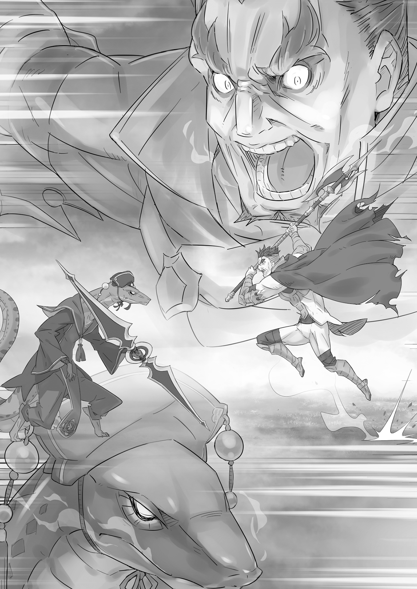
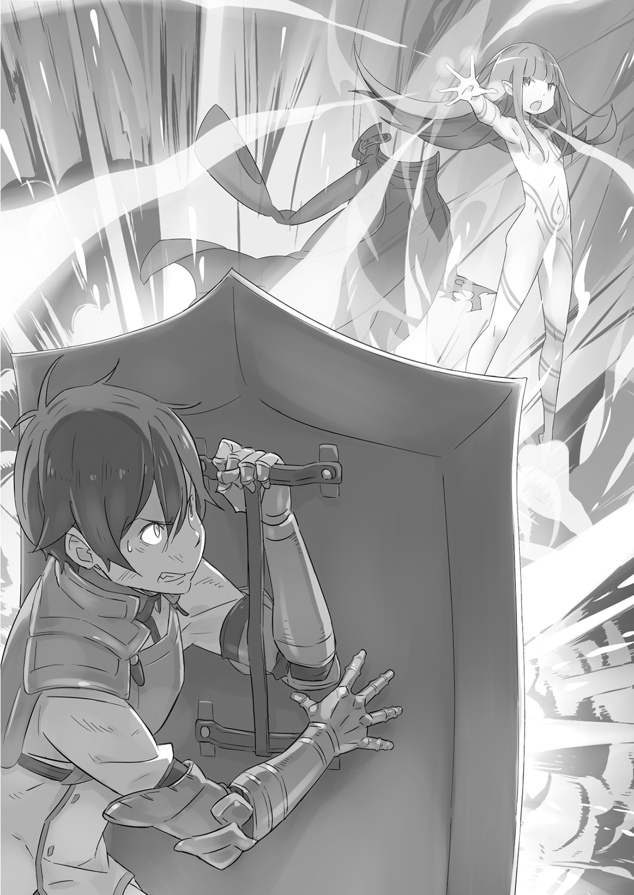
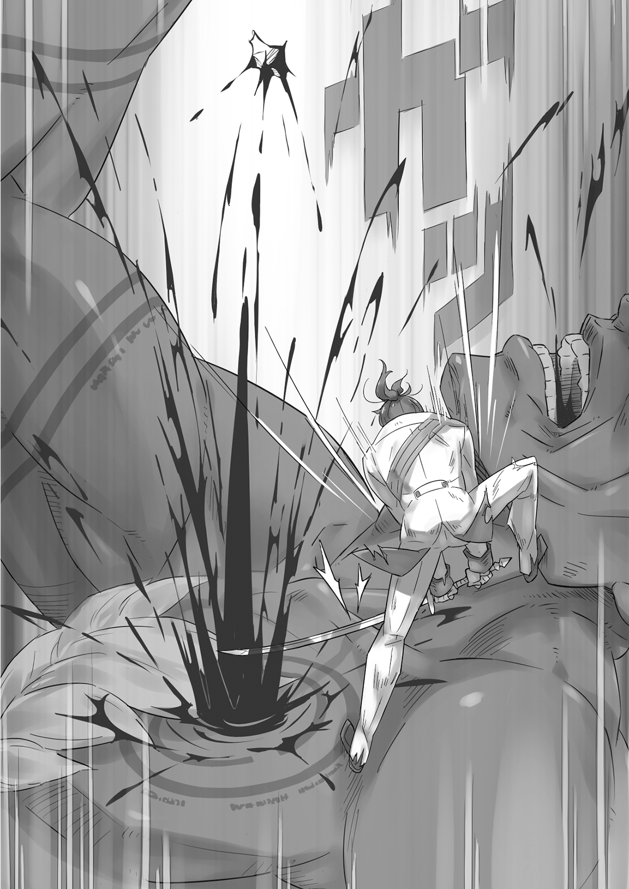
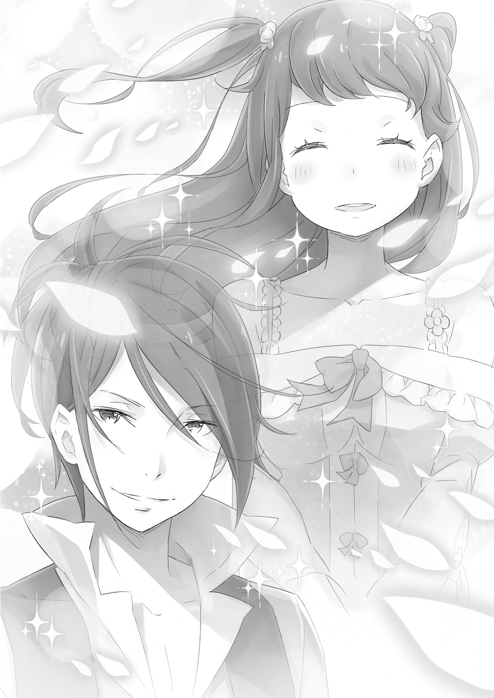

Массовое восстание полулюдей по всему королевству охватило страну пламенем войны.

Королевская армия, всё ещё не оправившаяся от прежних потерь, была вынуждена перейти к обороне из-за вооруженного восстания полулюдей и сопровождавшей их массы нежити. По мере поступления докладов о потерях, штаб армии погрузился в хаос, и оборона каждого региона была оставлена на усмотрение местных командиров.

— В общем, это всё, что я слышал, но подробностей пока нет, — тихо сказал Бордо. — Если бы нас отправили куда-нибудь туда, мы могли бы хотя бы помочь предотвратить часть потерь.

Отряд Зелгефа в полном облачении собрался на караульном посту. Присутствовали новобранцы — те, кто помог пополнить отряд после того, как его старый состав был так жестоко сокращён. Поскольку реорганизация ещё продолжалась, официальные приказы о переназначении ещё не были изданы, но все, с кем он говорил заранее, явились. Среди них, конечно же, были Гримм, выписавшийся из госпиталя, и Вильгельм.

— Гримм! — окликнул Бордо. — Ты, может, и потерял голос, но надеюсь, сражаться можешь по-прежнему! Это твой шанс показать нам, на что ты способен.

Гримм ничего не мог ответить на эту попытку поднять боевой дух, но в ответ ударил по своему щиту. Бордо кивнул, оценив проявление духа, затем выглянул из караульного помещения. — Полагаю, скоро нас отправят на ближайшее поле боя. Честно говоря, я бы рванул туда прямо сейчас, но стоит помнить: чем больше они становятся, тем медленнее действуют.

Пока Бордо советовал набраться терпения, Вильгельм молча готовился к битве. Он встретит грядущую схватку с сокрушительным духом Демона Меча. На поле боя, в пылу смертельной борьбы — там он мог забыть о смятении, которое испытывал из-за цветочных полей. Там, где искры жизни разлетались кровавыми брызгами, его дух мог полностью отдаться мечу, и ему не нужно было чувствовать себя потерянным…

— Вооруженное восстание, однако, — бесстрастно произнёс Бордо, всё ещё глядя в окно. — Смелый ход. Валга Кромвель это придумал, я уверен, но должен признать, он сумел вовлечь в это всех полулюдей. — Он провёл рукой по своим коротким волосам и мрачно нахмурился. — Но, к его несчастью, столица оказалась слишком бдительной, чтобы его план сработал здесь. Остальная страна, может, и горит, но он упустил самое важное. Видимо, большего от кучки тупых дикарей и ожидать не стоило.

Его слова отражали немалую долю личной враждебности, но Вильгельм в целом был с ним согласен. Восстания вспыхнули по всей стране, но столица осталась нетронутой.

Вильгельм провёл в столице несколько лет, пусть и не по собственному желанию. Он не хотел видеть город превращённым в поле боя, равно как и не желал всех тех жертв, которые за этим последуют. Включая Терезию и её цветочное поле…

— Погоди. — Что-то здесь было не так. И это чувство исходило не из глубин его сердца, которые открыла ему Терезия. Что-то было неправильно. И одно слово, использованное Бордо, всё прояснило.

«Горит?..»

Вильгельм недавно слышал нечто очень похожее. Он напряг память, пытаясь вспомнить, когда это было, а затем резко вскочил на ноги.

«Скоро языки пламени охватят всю страну… Даже столица не избежит разрушения».

Эти слова принадлежали одному из полулюдей-вандалов, которых он задержал. Конечно, их можно было счесть бравадой, но они также описывали план Валги Кромвеля.

Столица была неспокойным местом. Вильгельм знал это по времени, проведённому в местной страже. Неужели Валга проигнорировал бы своих потенциальных союзников здесь и исключил столицу из своих планов?

«Невозможно. Он бы не забыл об этом городе».

А это означало, что восстания были…

— Бордо! Все эти восстания — лишь отвлекающий манёвр! Настоящая цель — столица, королевский замок!

— Что?!

После того как интуиция привела Вильгельма к ответу, он подбежал к Бордо, его голос был сдавленным. На суровом лице его командира появилось тёмное выражение.

Это его злило, но он был уверен. Он знал, что враг будет искать самую уязвимую точку королевских сил.

— Вспомни Кастур и Айхию! Битвы, где королевские силы понесли самые тяжёлые потери! Оба раза мы клюнули на очевидную наживку и попали прямо в ловушки Валги Кромвеля!

— И поэтому ты думаешь, что эти восстания — приманка, а настоящая цель — сердце королевства?

— Да! Ты же знаешь это, Бордо! Мы отправим солдат из столицы на подавление мятежей, а затем они сосредоточат свои силы на беззащитной столице. Они захватят королевство!

В зависимости от того, как пойдут дела, выбор, который отряд сделает сейчас, может определить будущее Драконьего Королевства Лугуника. У них не было твёрдых доказательств, но Вильгельм доверял своим инстинктам. Если бы он не доверял тем же инстинктам на поле боя, он бы никогда не дожил до этого дня.

— Хм-м, — Бордо скрестил руки на груди и погрузился в глубокое раздумье. Вильгельм мог только скрежетать зубами.

То же самое уже случалось раньше. В битве на Кастурском поле, когда они столкнулись с первыми магическими кругами и решали, что с ними делать, Вильгельм убеждал тогдашнего капитана идти вперёд. Он говорил, что это единственный способ выжить. Но его мнение отвергли, и в итоге он и Гримм остались последними выжившими членами их отряда.

То же самое происходило и сейчас. Если Бордо не послушает его, то, даже если Вильгельму придётся идти одному, он пойдёт…

Кто-то похлопал всё более взволнованного Вильгельма по плечу. Он обернулся и увидел Гримма, кивающего ему и поднимающего руку к Бордо.

Командир заметил этот жест. Он пристально посмотрел на Вильгельма и Гримма. Затем глубоко кивнул, и широкая ухмылка, первая за долгое время, появилась на его лице.

— Ну, надо же! Оставить отряд Зелгефа мариноваться в столице может оказаться самым умным ходом штаба! Вот теперь становится интересно!

Бордо ударил древком своей алебарды об пол. Металлический звук разнёсся по караульному помещению, и все члены отряда Зелгефа ответили в один голос: — Да-а-а-а!

В одно мгновение все загорелись жаждой битвы, комната задрожала от их крика. Шум окружил Вильгельма, но он не поддался ему. Бордо, положив алебарду на плечо, ухмыльнулся мечнику.

— Что не так, Убийца Капитанов? Сам не свой.

— У нас нет доказательств. Ты собираешься мне довериться?

— Окончательное решение за мной, и я никому не позволю меня остановить. К тому же… мои инстинкты согласны с твоими. Давай разорвём этот план полулюдей в клочья — пусть это будет прощальным подарком Пиво и остальным!

Бордо толкнул Вильгельма в грудь; Вильгельм пошатнулся назад, пока его не подхватил Гримм. Молчаливый щитоносец улыбнулся ему так, словно спрашивал: «Ну как?» Вильгельм отмахнулся от него.

— Ладно, поехали! Отряд Зелгефа — меч королевства! А значит, наш долг — вершить правосудие над любыми варварами, кто посмеет пойти против флага нашей нации! Кто-нибудь не согласен? Кто-нибудь возражает?

— Нет! Никто! Как мы можем?!

Бордо выкрикнул, подняв свой боевой топор, и солдаты ответили ему криком. Их командир с удовлетворением выслушал их, затем снова повернулся к Вильгельму.

— Вильгельм! Вильгельм Триас, Демон Меча! Враг преследует?..

— Что же ещё? — ответил Вильгельм. — Замок — королевский замок Лугуники!

Бордо указал топором на далёкий замок. Затем набрал воздуха и взревел, как зверь. — Враг приближается к замку! Отряд Зелгефа, выступаем!

Когда отряд Зелгефа, готовый к бою, приблизился к замку, его защитники приготовились умереть. Они были уверены, что приближающаяся масса солдат с убийственными лицами — это вражеский отряд, стремящийся их уничтожить.

— Что? Что это такое?! Так ведут себя защитники королевства?! — крикнул рыцарь на дрожащих людей. Рыцарь с суровым лицом уставился на несущийся отряд, затем презрительно цокнул языком.

— А, если это не тот идиот-бродяга… Стой, где стоишь, Бордо Зелгеф!

— Это лорд Лейп Бариэль? — крикнул в ответ Бордо, разинув рот при виде человека, стоявшего посреди обороняющихся солдат. Это был виконт, тот самый рыцарь, с которым они столкнулись у болот Айхии.

Отряд Зелгефа остановился как вкопанный. Лейп вышел вперёд и встал перед Бордо.

— Разве ты не знаешь, что мы на войне, Бордо? Что, по-твоему, ты делаешь?! Королевство в кризисе, а ты шутки шутишь? Это практически мятеж!

— Прошу прощения, что напугали вас всех. Но мы здесь не с дружеским визитом. Время не ждёт — судьба королевства висит на волоске!

— О, неужели?

Лейп нахмурился при заявлении Бордо. Затем из толпы готовых к бою людей вышел кто-то и встал рядом с Бордо. Это был Вильгельм. Лейп посмотрел на молодого человека, излучавшего ауру мечника, явно недовольный.

— Опять ты, Демон Меча.

— Зовите как хотите. У меня нет времени спорить с вами. Враг нацелился на этот замок.

— Хочешь сказать, вооружённые восстания — это отвлекающий манёвр? У тебя есть доказательства?

Лейп был не лишён ума. Из краткого замечания Вильгельма он догадался, что на самом деле замышляют полулюди. Но единственное, что они могли ответить на его просьбу о подтверждении, — это покачать головами.

— Значит, на основании обоснованного предположения вы обрушиваетесь на замок, как лавина? — сказал Лейп. — Я требую, чтобы вы отступили, отряд Зелгефа. В настоящее время оборона этого замка — моя ответственность.

— Валга, Либре и Сфинкс, — сказал Вильгельм. — Вы собираетесь справиться с ними всеми в одиночку? Должно быть, вы очень уверены в себе.

— Опять? Сколько раз мне повторять, чтобы ты не перечил старшим по званию!

С резким цоканьем Лейп замахнулся на Вильгельма своей металлической перчаткой. Но если у болот Айхии удар достиг цели, то на этот раз Вильгельм просто повернул голову и легко уклонился.

— Кто позволил тебе уклоняться?..

— В Айхии вы были моим командиром, но не сейчас. У вас нет причин бить меня и нет причин останавливать нас. Если встанете у нас на пути, мы просто пройдём мимо вас.

Вильгельм демонстративно бряцнул рукоятью меча. Другие стражники замка съёжились от его духа, который обрушился на них почти как физическая сила. Даже Лейп на этот раз выглядел несколько подавленным. Казалось, ситуация вот-вот взорвётся.

— Что ж, тогда-а-а, — раздался новый голос. — Как насчёт приказа от меня? Я по званию выше любого из вас. Официально приказываю отряду Зелгефа присоединиться к обороне замка.

Женский голос донёсся со стороны замка. Все взгляды обратились на приближающиеся фигуры — Розвааль в военной форме и её служанку Кэрол.

— Розвааль J. Мейзерс!.. — выдохнул Лейп.

— Итак, у нас есть антимагический специалист этой войны — то есть я — и самодовольный стражник у ворот — то есть ты. Не сравнить ли нам наши позиции, чтобы увидеть, кто из нас выше в твоей драгоценной цепи командования?

Лейп сердито заскрежетал зубами, но Розвааль лишь пожала плечами. То, что она говорила, было абсолютной правдой, и реальность была безжалостна, как змея. Как бы ему это ни претило, Лейп мог лишь сомкнуть рот.

— О-о-о, не будь таким. Не всё потеряно. Пребывание здесь сегодня ещё может дать тебе шанс принести честь и славу своему имени. Рассмотри все возможности. — Её слова были слабым утешением, но они эффективно вывели Лейпа из игры.

Затем Розвааль заметила Вильгельма. Она откинула волосы за плечи, мило улыбаясь. — Я зна-а-ала, что ты будешь здесь. Это был правильный выбор — сосредоточиться на вас всех, ну, на тебе конкретно, — в Кастуре.

— Я по-прежнему не понимаю ни слова из того, что вы говорите, — сказал Вильгельм. — Но мы можем войти в замок, верно?

— Мо-о-ог бы хоть научиться разговаривать с женщиной. Конечно, можете войти.

Вильгельм сказал ей, как всегда прямо, что его не интересуют долгие разговоры. Затем он повернулся к Бордо. Человек, известный как Бешеный Пёс, серьёзно кивнул.

— Ла-а-адно, тогда! Отряд Зелгефа сейчас войдёт в замок! Убедитесь, что мы укрепили все ключевые точки в здании! Мы разделимся на десять групп, как и планировали. — Он ударил древком своего боевого топора о землю, и отряд Зелгефа разделился на десять групп. Вскоре они займут назначенные им роли и приступят к полной обороне замка.

— Лорд Лейп, — сказал Бордо, — оставайтесь здесь. Отряд Зелгефа будет патрулировать внутри. Убедитесь, что вы не пропустите ни одного получеловека внутрь ворот.

— !.. Я знаю своё дело! Мы и мухи сюда не пропустим. А теперь прочь, свора дворняг! — Виконт не очень-то умел проигрывать достойно. Тем не менее, Вильгельм и остальные вошли в замок. Розвааль с явным интересом последовала за ними.

— Отряд разделился на группы, — сказала она. — Могу ли я предположить, что ты будешь действовать самостоятельно, невзирая на это?

— За тобой присмотрит Гримм, — сказал Вильгельм. — От тебя всё равно будут одни проблемы. — Он бросил взгляд назад. Это был акт доброты с его стороны по отношению к безмолвному Гримму, который шёл рядом с Кэрол. По-видимому, они могли общаться, даже когда говорить мог только один из них. Вильгельм слегка усмехнулся этому.

Когда члены отряда Зелгефа шли по замку, они обнаружили тихие коридоры и покинутые комнаты. — Похоже, у вас не хватает солдат, — пробормотал Вильгельм. Он впервые оказался в королевском замке Лугуники с тех пор, как его пригласили на совещание в главный штаб. В тот день замок был набит людьми сверх всякой меры, но теперь он был практически пуст.

— После потерь при Айхии командный состав был отправлен на линии фронта по всей стране, — сказала Розвааль. — И Его Величество лично приказал направить войска туда, где последствия восстаний наиболее ощутимы.

— Но это же…

— Королевский приказ — это не то, что можно игнорировать. Да-а-аже если это играет на руку врагу.

Королевская семья Лугуники была отзывчивой, но они были лишь номинальными правителями, не приспособленными к управлению государством. Об этом ходили широкие слухи — и, похоже, они имели под собой основания.

— Значит, замок никто не защищает?

— Минимальный контингент королевской гвардии и оборонительные отряды вроде отряда лорда Лейпа. Вот, пожалуй, и всё. Я восхищаюсь отказом Его Величества ставить свою безопасность превыше всего, но это становится небольшой проблемой, когда он занимает самое важное здание в стране. Возможно, пора начать молиться Дракону о мире в королевстве.

— Я мог бы восхититься вашим патриотизмом, если бы вы не закончили тем, что нужно просить о помощи. Но… погодите.

Интуиция Вильгельма снова его беспокоила. Если полулюди нацелились на замок, то их конечной целью будет сердце королевства — сам король. И, вызвав восстания, у них был верный способ захватить свою цель. Было одно место, куда король Драконьего Королевства Лугуника непременно отправится, когда его страна окажется в тяжёлом положении.

Словно Валга Кромвель сам приглашал его туда.

Бордо направлялся наверх. — Вильгельм! Я пойду защищать Его Величество! Тронный зал…

Вильгельм прервал его, высказав своё мнение. — Бордо! Я иду в часовню! Возражения?!

Бордо выглядел удивлённым тем, как всё в Вильгельме говорило о том, что он собирается следовать своим инстинктам, но затем ухмыльнулся.

— Никаких! Что бы ни случилось, просто не забывай, за что стоит отряд Зелгефа!

— Ты же знаешь, мне всегда было на это плевать.

— Тогда спросим Гримма. Гримм! Не спускай глаз с Вильгельма!

В ответ раздался энергичный стук по щиту. Вильгельм нахмурился. Бордо поднял свой боевой топор, пожелал им удачи и устремился прочь.

— Что вы собираетесь делать? — спросил Вильгельм у Розвааль, которая, по-видимому, намеревалась последовать за ним в подвальную часовню замка. — Почему вы вообще с нами?

Розвааль подмигнула. — У меня своя цель. Появится ли она здесь — большо-о-ой вопрос, но, думаю, я доверюсь суждению человека, в которого по уши влюблена.

Гримм и Кэрол обменялись удивлёнными взглядами на дразнящие слова Розвааль. Но Вильгельм, тот самый человек, о котором шла речь, лишь совершенно раздосадованно цокнул языком и отодвинулся от Розвааль.

— Не жалуйтесь мне, если вас убьют, — сказал он. — Я недостаточно добр, чтобы оглядываться назад, когда пытаюсь сражаться.

— …Думаю, ты всё же изменился. Раньше ты бы такого не сказа-а-ал.

— Я? Изменился? Даже если и так…

Даже если он и изменился, то лишь для того, чтобы продвинуться по пути становления бесчувственным мечом. Это, как он верил, был ответ, который он нашёл в своём клинке.

Вильгельм стиснул зубы и отогнал образ Терезии, всплывший в его сознании. Если бы она не продолжала спрашивать его, он бы давно перестал в это верить. Он бросился вперёд, словно пытаясь убежать от этого факта.

Когда Бордо вошёл в тронный зал, он физически ощутил, как сгустился воздух. Это было покалывающее ощущение надвигающейся великой битвы — столкновения с абсолютным противником. Он был прав, что пришёл сюда один. Он подозревал, что только он из его людей сможет это вынести.

— Никогда не смогу отблагодарить Вильгельма в достаточной мере, — пробормотал он. Хотя сейчас они редко сражались, его дуэли с Вильгельмом на тренировочной площадке приучили его к такой подавляющей ауре битвы. Он был напуган, да, но страх был знакомым.

Было мало противников, которых Бордо признал бы действительно сильнее себя. Дело было не только в том, что он ненавидел это признавать. Он, по сути, был потрясающим бойцом. Он был знаком с оружием с детства и использовал своё природное телосложение и интеллект, чтобы идти по пути рыцаря. Благодаря общественному положению его семьи и его собственным дарованиям, жизнь Бордо складывалась почти так, как он хотел. В сопровождении других учеников, казавшихся надоедливыми старшими братьями, ветер, казалось, всегда дул ему в спину, пока он продвигался вперёд день за днём.

Перемена в его жизнь пришла в лице Вильгельма. Бордо помнил много раз, когда он не знал, как справиться с дерзким и непокорным мальчишкой. Но Бордо спас Вильгельма, и этого было достаточно, чтобы оправдать все усилия.

Вильгельм превратился из мальчика в юношу, и его меч стал незаменимым для королевства. Пиво это понимал. Именно поэтому он отдал свою жизнь, чтобы спасти его. Пиво видел, что Вильгельм будет играть ключевую роль в определении не только будущего королевства, но и будущего Бордо.

И здесь, сейчас, присутствие Вильгельма действительно решало вопрос жизни и смерти для Бордо.

Парный клинок обрушился на здоровяка, окрашивая красный ковёр тронного зала в ещё более тёмный цвет крови. Глаза его врага были безжизненны, его гнилостное дыхание было прерывистым. Это был змеелюд, Либре Ферми, но без малейшего намёка на то, кем он был при жизни. И всё же, даже будучи нежитью, его аура величайшего бойца полулюдей сохранилась.

— Сфинкс здесь нет, да? Но по крайней мере я смогу отомстить за Пиво. Ты, грязная маленькая рептилия! — Бордо распалял собственную жажду битвы, насмехаясь над врагом. Иначе его могло бы смести аурой противника, и он потерял бы инициативу.

Разница между ними — в силе их воинского духа — была неоспорима. Причина, по которой Бордо не поддался, заключалась в том, что он уже десятки раз проигрывал в таких столкновениях. Вильгельм Триас познакомил его с этим более чем достаточно.

— Я не собираюсь пугаться врага, который находится в обороне. Нападай, Либре Ферми!

Он закрутил свой боевой топор над головой и взревел, как зверь, топая по ковру. Его огромное тело рванулось вперёд, и змеелюд встретил его парным клинком. Посыпались искры, и комнату наполнил звон стали о сталь. Битва между Гадюкой и Бешеным Псом началась.

Перед огромной дверью часовни лежали обезглавленные тела нескольких королевских гвардейцев. Это были те немногие, кто остался обеспечивать безопасность замка. Они сражались доблестно, но тщетно, о чём свидетельствовали разбросанное вокруг оружие и множество следов от мечей. Обычно Вильгельм чувствовал, что у него нет сочувствия к мёртвым — то есть к слабым. Но на этот раз он обнаружил, что в нём поднимается странное чувство. Возможно, потому, что он знал, за что сражались эти трупы.

— …

Он оборвал это чувство и, с любимым мечом в руке, открыл массивную дверь. Она медленно двинулась с громким скрипом, и свежий ветерок подул из часовни в коридор.

Магические, голубовато-белые огни освещали часовню в подвале замка. Это было место величия и торжественности. По обе стороны от входа тянулись ряды скамей, а на дальней стене был вырезан герб Святого Дракона, герб нации. А у алтаря, где возносились молитвы этому изображению, стояли две фигуры.

Фигуры, одна огромная и одна — маленькая девочка, говорили хриплыми голосами.

— В этой часовне народ королевства молится Дракону, — сказала бóльшая тень. — Империи поклоняются силе, а святые королевства — духам. Я не знаю насчёт западных городов-государств, но полагаю, у них тоже должен быть кто-то, кто возносит молитвы.

— Так о чём же молитесь вы все? — спросила девочка. — О чём молятся полулюди, и кому?

— Хм-м. Если бы я молился, то, полагаю, душам моих товарищей и предков. У меня, по крайней мере, нет других причин молиться.

Затем обе фигуры обернулись.

Девочку, конечно, он уже хорошо знал. Это была ведьма Сфинкс. А гигант, стоявший рядом с ней, — он был величайшим врагом в этой войне, предводитель племён полулюдей…

— Валга Кромвель.

Мужчина кивнул, когда Вильгельм произнёс его имя, но Вильгельм не мог разглядеть его выражения лица. Валга полностью закутался в белую простыню, словно пытаясь скрыть свою личность на этой поздней стадии.

— Верно. А ты, должно быть, Демон Меча. Да, я вижу… Враждебность на твоём лице излучает исключительный дух. Даже я не застрахован от этого, а ведь битва — моё всё. Неудивительно, что ты смог убить Либре.

— О чём ты говоришь? — Такое описание исхода битвы при Айхии могло быть сделано только с целью унизить его.

Ведьма, исказившая факты в своём отчёте, проигнорировала взгляд Демона Меча и сосредоточилась на Розвааль. — Если ты здесь… значит, король не придёт. — Её голос был лишён эмоций.

Розвааль, чьи руки были облачены в металлические перчатки, ответила: — У меня не было особой причины увязываться следом. Мне просто претила мысль о том, чтобы дать тебе то, чего ты хочешь. Я отвергаю всё, что связано с тобой, и в конечном итоге растопчу твою жизнь под своим каблуком. — Она взмахнула запястьем и приняла боевую стойку с большей вычурностью, чем это было строго необходимо. За её спиной Кэрол обнажила меч, а Гримм приготовил щит.

— Храбрые люди, вы все, — сказал Валга. — Чтобы вы вчетвером пытались противостоять нам…

— Нет, это вы вдвоём забрались в самое сердце замка, — возразил Вильгельм. — К вашему несчастью, один из ваших дружков оказался болтлив и выдал сюрприз. Мы положим этому конец, здесь и сейчас.

— …Я думал, что проявил крайнюю осторожность в том, кому рассказывал о своих планах, но вижу, кто-то разболтался перед лицом смерти. Неважно. Я не буду держать зла на собрата-получеловека. Мы зашли так далеко. Наш план идёт достаточно хорошо.

— Верно, в том смысле, что вы смогли пробраться в замок. Что делали эти тупые стражники?

— Мы прошли по тайному пути через канализацию. Сейчас о нём никто не знает — вы, люди, живёте недостаточно долго, чтобы помнить.

Валга топнул каблуком по полу, открывая скрытый туннель. Возможно, он был так откровенен, потому что Вильгельм объяснил, откуда узнал о плане Валги. Кто-то невольно цокнул языком.

— До завета с Драконом полулюди были среди тех, кто помогал строить этот замок. Пытаться рассуждать об отношениях между людьми и полулюдьми в те времена — глупое занятие, но это довольно иронично. Именно те времена позволили свершиться этому моменту возмездия.

— Хороший разговор, но плохой выбор войск, — сказал Вильгельм. — Как я слышал, ты хорош только в битве умов, а не в состязании оружием. По-видимому, твоя ведьма — единственная, кто обладает реальной боевой силой.

— …Да. Такой, какой я сейчас, полагаю, это правда. — Голос Валги стал тише.

Вильгельм поднял бровь на этот зловещий шёпот, и получеловек раскатисто рассмеялся.

— Если бы всё пошло так, как я хотел, король был бы сейчас здесь. Чтобы добраться до него, у меня не было бы иного выбора, кроме как победить королевскую гвардию. Думаешь, я пришёл неподготовленным к этой задаче?

— Ты никогда не делаешь ничего простым путём.

— Ты бесчувственный человек, не так ли? — коротко сказал Валга. Затем он повернулся к своей спутнице. — Сфинкс, заклинание.

Сфинкс посмотрела на огромного мужчину рядом с собой и склонила голову набок. — Ты уверен? Как только я начну, будет трудно остановиться. Невозможно, на самом деле.

— Мне всё равно. Я всегда знал, что если захочу достойно отомстить за своих товарищей, то живым не вернусь! — С рёвом Валга сорвал с себя простыню, которой был укрыт. Под ней скрывался старик с лысой головой и лицом демона. Но его похожие на броню мышцы, уникальная черта гигантов, не показывали признаков старения. Его тело было подобно отвесной скале, и на нём был начертан фиолетовый знак, который начал светиться — магический круг.

— Магический круг на живом теле?! — воскликнула Кэрол. — Что это за заклинание?!

— Я же говорил, — серьёзно сказал Валга. — Вы, люди, молитесь своему дракону. Я буду молиться своим предкам и своим собратьям-полулюдям.

Заклинание начало действовать на его состарившуюся плоть, и по мере того, как свечение усиливалось, Валга вытащил что-то из мешочка — маленькую коробочку.

— О кости моих предков, свидетельство тех дней, когда гигантов действительно боялись!..

— [Таинство Бессмертного Короля] не может создать нежить из груды костей, — сказала Сфинкс. — Но с живым потомком, разделяющим ту же кровь, и огромным количеством маны всё иначе.

— Вы думаете вернуть древних гигантов, используя тело Валги Кромвеля?! — сказал Вильгельм.

— Гордость и гнев полулюдей вы увидите своими глазами, почувствуете своей плотью и высечете в своих душах, проклятые люди! — крикнул Валга, а затем вонзил кости себе в грудь. Немедленно ритуал Сфинкс, усиленный магическим кругом, начертанным на его теле, совершил свою ужасную работу.

— Хр-р-а-а-ах— А-а-а-а— А-а-а-а-а!

Воющий голос Валги становился всё громче и громче, а тело, из которого он исходил, становилось всё больше и больше. Его лёгкие расширились, когда его тело раздулось до двойного первоначального размера, а затем ещё вдвое. Спустя секунды свет заклинания угас.

Дрожащий голос Кэрол наполнил часовню, когда она уставилась на возвышающуюся фигуру: — Неужели… неужели такими были гиганты раньше? Ты просто чудовище!.. — В её словах было немало ужаса. Никто не мог бы винить её за это. Голова Валги теперь доставала до потолка; он был легко выше тридцати футов ростом. Он так вырос, что ему пришлось встать на колени, чтобы поместиться в часовне.

Внезапно огромная фигура вытянула руку. Движение было небрежным, но произошло с неистовой быстротой.

— Берегись! — крикнул Вильгельм, увернувшись в сторону от надвигающегося кулака. Розвааль тоже смогла уклониться, в то время как Гримм встретил удар лицом к лицу и защитил Кэрол. Пытаясь изо всех сил определить, где держать щит, Гримм принял удар, подобный удару разъярённого животного. Мгновенно его и Кэрол отбросило назад через дверь в коридор.

— О нет!..

— Этот идиот отбросил себя назад, чтобы смягчить удар! Но не обращай внимания — сюда идёт Валга! — крикнул Вильгельм встревоженной Розвааль. Он снова сосредоточился с клинком в руке и уставился на Валгу, чья боевая аура выросла вместе с ним, и на Сфинкс, парившую в воздухе.

Ведьма не обратила внимания на его пристальный взгляд, глядя на потолок, который разбил гигант. — Валга, возможно, я могла бы оставить это тебе? Полагаю, следующий шаг потребует отправиться в другое место.

— Делай, что хочешь. Что до меня, я отомщу за Либре.

— Да будет так. Валга, желаю тебе удачи в бою.

— Верно. Ценю твою помощь. Хотя я не уверен насчёт всех деталей.

Сфинкс, получив разрешение, склонила голову набок при прощальных словах Валги. Но затем ведьма взмыла вверх через разрушенный потолок, не сказав больше ни слова.

— Сфинкс!.. — сердито крикнула Розвааль.

Вильгельм указал мечом на коридор. — Ты следуй за ведьмой. Возьми тех детей, что дремлют в коридоре.

Глаза Розвааль расширились при взгляде на громадную фигуру Валги.

— Ты собираешься сразиться с Валгой в одиночку? Вот так? Не думаю, что это во-о-озможно, а ты?

— Мы не можем позволить ведьме уйти. И ты не будешь сражаться с Валгой кулаками или щитом. Кэрол специализируется на отражении ударов клинком, и это тоже не поможет. Нужно подобраться и зарубить его. Он мой.

Вильгельм, чей меч снова был направлен на гиганта, излучал огромную боевую ауру.

— Ты действительно нечто. Если мы оба вернёмся целыми и невредимыми, я, возможно, практически поцелую тебя.

— Забудьте жуткую болтовню и просто идите.

— Так холодно, однако. Возможно, твоё сердце принадлежит кому-то другому? — сказала Розвааль, игнорируя обстоятельства достаточно долго, чтобы подразнить Вильгельма. Он лишь фыркнул. Он определённо не собирался говорить ей, что на мгновение в его сознании вспыхнул образ рыжеволосой девушки.

— Удачи, — сказала Розвааль.

— Да. А ты обязательно убей её.

Этими смертоносными словами они поклялись сражаться, а затем Розвааль быстро отступила из часовни. Вильгельм предположил, что она схватила их двух спутников из коридора и поднялась наверх, чтобы сразиться со Сфинкс. Смогут ли они втроём одолеть ведьму, зависело от них.

Вильгельм не осознавал, что это было, по-своему, своего рода доверие.

— У меня всё равно нет времени беспокоиться о ком-то ещё, — пробормотал он, принимая боевую стойку.

— Не переоценивай себя, мальчик, — ответил Валга. — Думаешь, такой ничтожный, как ты, действительно сможет помешать мне получить то, чего я хочу? — Он сделал взмах одной гигантской рукой. Демон Меча увернулся, доверяя своим собственным навыкам. Уголки его рта приподнялись.

— Если ты достаточно силён, ты пройдёшь мимо меня. Если ты слаб, я сокрушу тебя. Вот и всё. Сила твоих идеалов не имеет к этому никакого отношения.

Он шагнул вперёд и обрушил топор со всей своей мощи. Один конец парного клинка принял удар, а затем треснул под силой, которую не смог выдержать. Топор вонзился в тело змея, разбрасывая чешую и кровь. Либре пошатнулся назад.

— Гр-р-а-а-а-а!! — Хотя раненое существо не издало ни звука, Бордо бросился на него с криком. Он размахивал тяжёлым боевым топором, словно продолжением своих рук, рубя лезвием и добивая древком. Нежить, некогда бывшая Либре, сопротивлялась этим атакам со всем мастерством, которое в нём ещё оставалось.

Он уворачивался, защищаясь парным клинком. Бордо потерял равновесие, и удар нашёл его. Он задел его плечо и живот, но Бордо устоял на ногах, несмотря на текущую кровь.

Это был, без сомнения, сильнейший противник, с которым он когда-либо сталкивался. Трудно было поверить, что он так сражается, даже с его ослабленными способностями нежити. Мысль о том, каким Либре должен был быть при жизни, заставила Бордо содрогнуться — от страха или от жажды битвы, он не знал.

— Моя кровь! Моя кровь кипит, Либре Ферми!

Что бы это ни было, в этот момент он сказал себе, что это жажда битвы. Несмотря на то, что он был весь в крови, Бордо продолжал кричать; он смотрел в безжизненные глаза Либре. Змей никак не отреагировал на крик и лишь закрутил парный клинок в руке, чтобы продолжить бой.

Это был смертельный танец, когда парный клинок Либре Ферми начал балет, который наверняка убьёт.

— Хр-р-гх— Я-а-а-а-а!

Сердце Бордо дрогнуло от шквала ударов. Но когда его оттеснили назад, он почувствовал дрожь снизу через подошвы своих сапог. Это были толчки от грандиозной битвы, и представление о подвигах его товарищей вдохновило его.

«Последние слова Пиво были о том, чтобы не пренебрегать тем, что подо мной».

Что бы сказал Пиво, если бы увидел, как Бордо черпает силы от своих друзей, сражающихся буквально под его ногами?

Конечно.

— Ты бы просто рассмеялся и сказал мне, что это не то, что ты имел в виду, не так ли, Пиво!

Бордо взревел. Его эмоции всколыхнулись от приближающегося танца смерти, он поднял топор и бросился вперёд. У него не было техники Вильгельма или способности Гримма блокировать удар, он не был таким проворным, как Кэрол, или таким рассудительным, как Розвааль. Вместо этого Бордо Зелгеф поставил всё на то, что у него было, — на тело и способности, которыми он был наделён.

— Р-р-а-а-а-а-а!!

Парный клинок обрушился на него, как буря, рассекая его тело; повсюду он чувствовал жгучую боль и текущую кровь. И всё же он поднял топор и обрушил его прямо на змеелюда с сокрушительной силой.

Удар достиг цели. И наконец…

Обжигающий свет был лучом смерти, испаряющим всё, к чему прикасался, оставляя след на полу и стенах. Этот ливень разрушения исходил от несравненного демона в облике юной девушки.

Сфинкс отступила через потолок часовни на первый этаж замка, но её остановила преследовавшая её женщина в военной форме.

— Какая ты настойчивая, — сказала Сфинкс. — Тебя требуется истребить.

— Вот ка-а-ак? Если бы ты поспешила умереть, я могла бы вернуться к жизни обычной женщины. Розвааль оттолкнулась от каменной стены, взмыв в воздух и нанеся удар кулаком по парящей Сфинкс. Девушка уклонилась влево и вправо, но Розвааль снова оттолкнулась от стены, её длинная нога описала красивую дугу в небе. Удар ногой достиг ведьмы, сбив её на землю.

— Гримм, за мной!

— !

Кэрол и Гримм атаковали её с противоположных сторон в коридоре. Сфинкс развернулась, чтобы встретить двойную атаку, создав магический щит для защиты от меча Кэрол, более смертоносного из двух орудий.

— Кх!

Но, конечно, это оставило её беззащитной перед ударом щита Гримм. Девушка пошатнулась от удара сзади и была отброшена в большую, открытую комнату за коридором.

— Получилось! — воскликнула Кэрол.

— Не-е-ет. Мы оплошали. Я надеялась удержать её здесь, где мало места. Розвааль нахмурилась из-за своей неудавшейся уловки. Вместе с безмолвным Гримм они втроём бросились за Сфинкс.

Мгновение спустя на них обрушился луч, окрасив выход из коридора в сияющий белый цвет.

— Здесь требуется осторожность, — сказала Сфинкс, паря в воздухе большой комнаты, намного выше потолка коридора. — Какой бы слабой ни была добыча, загнанная в угол, она может стать опасной. Она выбрала идеальный момент; её враги были пойманы в ловушку без возможности сбежать. Она была уверена, что они никак не смогли бы увернуться от её света.

Но затем… — ? Что это за фокус?

— О-о-о, это не так уж сло-о-ожно понять, — сказала Розвааль, когда она и остальные невредимыми вышли из коридора сквозь дым. В ответ на вопрос Сфинкс она отбросила плащ, который носила. — Мой плащ был со-о-откан с заклинанием, которое позволяет ему один раз противостоять абсолютно любой магии.

— Понятно. Так вот как ты защитила себя и своих союзников. Я хвалю твою предусмотрительность. Ты действительно хочешь убить меня.

— Ну разумеется. Тем не менее, я ду-у-умаю, ты всё ещё не понимаешь, насколько сильно.

Возможно, Сфинкс и смотрела на Розвааль свысока, но Розвааль это не смутило. Кэрол вышла из-за неё, держа меч в низкой стойке.

— Прошу прощения за беспокойство, госпожа Мейзерс, — сказала она. — Могу я покинуть вас на мгновение?

— Да, делай, что хочешь. Может быть, ты сможешь сделать что-нибудь, что выведет её из себя.

Сфинкс склонила голову набок, озадаченная этим обменом репликами между госпожой и слугой, которые давно знали друг друга. — Она значительно слабее тебя. Неужели ты просто посылаешь её на верную и бессмысленную смерть?

— Низкое создание. Не смей недооценивать технику меча Ремендес, моего дома, который служит Святым Меча, — резко сказала Кэрол. Она подняла меч и лёгким прыжком взмыла в воздух, бросившись на ведьму.

Сфинкс встретила эту внезапную прямую атаку светящимся пальцем. — Действительно, бесполезная смерть. Тебе потребовалось бы нечто большее, чтобы добраться до меня.

Луч выстрелил вперёд. Кэрол, зависшая в воздухе и не имеющая крыльев для полёта, не могла уклониться. Казалось неминуемым, что она будет пронзена светом и обратится в тлеющий пепел.

И всё же этого не произошло.

— Хм?

— Я же сказала, не недооценивай семью Ремендес! — крикнула Кэрол удивлённой ведьме, ловко увернувшись от её атаки. Хотя она была в полёте, Кэрол оттолкнулась от пустоты, чтобы ускориться вверх. Затем она обрушилась вниз с ударом полумесяцем, разрубив незащищённую левую руку ведьмы пополам.

— А-а-ах!

Рука отлетела в сторону, и из девушки, падающей на землю, брызнула кровь. Кэрол попыталась нанести ещё один удар, но оставшаяся рука её противницы выпустила ещё один луч. Кэрол снова оттолкнулась от воздуха и едва сумела увернуться. Но на этом беды ведьмы не закончились.

— Я ждала этого двадцать лет, ведьма! Получай!

Розвааль оказалась прямо под падающей Сфинкс, и её кулак взметнулся вверх вихрем воздуха. Он врезался в тело девушки, сила удара, прошедшая через металлическую перчатку, ломала кости и разрывала внутренние органы. Звук разнёсся по всей комнате.

— !!

Даже Сфинкс не могла оставаться невозмутимой перед такой силой. Смертоносная мощь заставила кровь хлынуть у неё изо рта, а её милое лицо исказилось от боли. Она попыталась что-то сказать, но её слова потонули в рвоте. Её тело рухнуло в центр огромной комнаты.

Потеря крови из левой руки и тяжёлые повреждения внутренних органов от удара означали бы немедленную смерть для любого обычного человека, но для ведьмы даже этого могло быть недостаточно.

— Пока я не размозжу твой череп и не вырву твоё сердце, я не могу быть уверена, — сказала Кэрол, опускаясь на землю и глядя на ведьму. Она спустилась с небес не столько из чрезмерной осторожности, сколько по личным причинам. Именно она должна была покончить со Сфинкс.

Она двинулась на девушку, готовая нанести один решающий удар…

— Ты… удивляешь меня. Я никогда… кх! ..не ожидала, что паду так низко… — Сфинкс села, всё ещё кашляя кровью. Её лицо побледнело, и она не должна была быть в состоянии двигаться. Но она всё ещё могла внушать неописуемый ужас.

— Я рада, что это была… моя левая рука, которую ты отрубила…

Розвааль двинулась вперёд, собираясь раздавить голову ведьмы ещё одним ударом, прежде чем та успеет что-либо предпринять. Но Сфинкс оказалась быстрее, сдёрнув с себя мантию оставшейся рукой. Ткань разорвалась с тихим треском, и под ней, на белой, обнажённой коже девушки, оказался фиолетовый узор. Тот самый, что был начертан на Валге.

— [Аль Зивальд] , — произнесла она заклинание высшей формы Зивальда, её смертоносного луча.

Луч, который раньше исходил только из кончика её пальца, теперь вырвался из всей ладони. Словно её рука протянулась, чтобы уничтожить всё на своем пути.

Разрушительный луч пронзил по диагонали большой зал, и смерть приближалась с каждым мгновением. Даже Розвааль было бы трудно увернуться; она обнаружила, что едва может говорить от изумления.

Столь же молчалив был и юноша, который поднял свой щит и встретил луч лицом к лицу.

Удары сокрушали пол и потолок часовни с силой надвигающейся стены. Удары гиганта выглядели достаточно мощными, чтобы отправить человека в полёт, даже если бы он лишь задел его. Но Вильгельм, чьи волосы шевелились от ветра взмахов, уклонялся от атак настолько близко, насколько мог, а затем наносил ответный удар.

— Это безнадёжно, мальчишка! — прокричал Валга. — Думаешь, такой дешёвый меч сможет свалить гиганта?

Атаки Демона Меча просто отскакивали от массивного существа, достаточно сильного, чтобы пробить сталь или камень. Отдача отбросила Вильгельма назад, и другая рука гиганта потянулась к нему. Он отскочил от неё, но скорость уклонения только ещё больше вывела его из равновесия, создав критическую брешь.

— Мне нравятся твои разговоры, но это конец!

— Гха?!

Вильгельм был пойман в воздухе, и Валга опустил руку, словно прихлопывая муху. Вильгельм немедленно защитился, но против подавляющей силы атаки это было бессмысленно. Удар пришёлся по всему его телу одновременно. Он отскочил от пола часовни и врезался в ряд скамей. Он был придавлен обломками разбитого сиденья, и воцарилась тишина.

— Пустяки. А теперь разрушим весь замок и…

— Не забегай вперёд.

— Хм?

Любопытное хмыканье гиганта разнеслось по комнате. Вильгельм выпрыгнул на него из-под горы обломков. Демон Меча был весь в крови, но его глаза всё ещё горели жаждой битвы. Валга быстро поднял правую руку для блока, но Вильгельм увернулся от неё. Левая рука опоздала, и он уклонился и от неё. Он взбежал по руке Валги и вонзил меч в один из изумлённых глаз гиганта.

Кожа гигантов могла выдержать сталь, но их уязвимые точки были так же хрупки, как у человека. Вильгельм легко пронзил глаз, и стекловидная жидкость хлынула наружу, заливая его.

Валга взревел от боли. — Хво-о-о-о-о!

Демон Меча с удовлетворением вытащил клинок. Пока Валга корчился в агонии, Вильгельм схватился за его плечо и рассмеялся. Его собственное тело стонало от предыдущего удара; мгновение невнимательности стоило ему нескольких сломанных костей и повреждённых внутренних органов. Если он не будет осторожен, кровь перекроет ему горло. Жгучая боль заставляла его жалеть даже о том, что приходится дышать.

Но теперь — теперь это было его поле боя.

— Ру-а-а-а-а!

С криком Вильгельм нацелился на пальцы Валги, когда монстр прижал руку к ране. Он нанёс удар по суставу. Под мечом ощущалась твёрдость, и он не смог отрубить его. Но это не было причиной признавать поражение или терять надежду.

Сохраняя инерцию отклонённого удара, он вонзил острие меча в одну из воющих губ. Он пробил кожу, пронзил плоть, пока не почувствовал, как клинок столкнулся с рядом зубов. Валга снова взревел от этого насилия над его ртом. Он слепо замахнулся, полагаясь на свою силу, чтобы компенсировать недостаток точности, и нанёс удачный прямой удар. Вильгельм закружился в воздухе и рухнул на землю.

Вильгельм упёрся кулаком в землю, чтобы остановить кувырок. Дрожащими ногами он встал. Но как только он оказался на ногах, Демон Меча цокнул языком от собственного бессилия и уставился на гиганта. Меч, вонзённый в уголок рта существа, казался невообразимо далёким.

— Так вот она, — прорычал Валга, — боль битвы… страдания моих собратьев, пока я отсиживался в тени, строя свои мелкие козни. Каким же самодовольным я был!

Пока Вильгельм стоял, стиснув зубы, Валга отнял руку от раны. На глазах Вильгельма из его изуродованного левого глаза повалил красный пар, и рана затянулась сама собой. Это сопровождалось усиливающимся свечением символа на груди Валги — ужасающими эффектами [Таинства Бессмертного Короля].

— Но я не буду побеждён, пока гнев и унижение моих товарищей не искуплены! Как бы силён ты ни был, ты узнаешь, что ты ничто перед гордостью…

— Бла-бла-бла. Кажется, я уже говорил. Мне плевать, насколько ты идеалистичен!

Валга снова взвыл и высоко поднял обе руки. Он замахал ими, но, несмотря на демонстрацию смертоносной силы, Вильгельм смело шагнул вперёд в надежде вернуть свой меч. Его противником был монстр с огромной выносливостью и способностью к регенерации. Вильгельм не смог бы победить его без оружия.

Валга был дилетантом в бою; он полностью полагался на свою силу. Это давало Вильгельму проблеск шанса.

Это была правда. Идеалы в битве бессмысленны. Не коллективный гнев или гордость полулюдей позволили Валге загнать Вильгельма в угол. Просто гиганты были сильны.

— Какая заноза в заднице! — выкрикнул Вильгельм. — Все хотят втянуть меня в какую-то нелепую… штуку !

Он хотел посвятить себя тому, чтобы стать единым мечом, но сталкивался со столькими ненужными вторжениями. Все хотели, чтобы у него была причина, или этос, или вера, или гордость, или достоинство. Что такого великого в том, чтобы иметь причину сражаться? Должен ли быть смысл в использовании меча?

Любишь ли ты цветы?

Нет, он их ненавидел. Он был уверен в этом. Для него это всё были лишние эмоции.

Зачем ты владеешь мечом?

Потому что это всё, что у него было. Это всё, что ему было нужно. Этого было достаточно.

Потому что он был пленён красотой стали, очарован её жизненной силой и потому надеялся сам стать мечом.

— Твоя погибель близка, человек! Смерть Демона Меча станет подходящей сноской к разрушению этого королевства!

— Всё… что моё… моё !

— Никто, кроме тебя, теперь в это не верит! Мы оба!..

Две гигантские руки и жёсткие заявления атаковали Вильгельма, когда он пытался приблизиться. Физическая сила разрушала пол, слова пронзали как Демона Меча, так и гиганта. Гнев против гнева, гордость против гордости — это было определённо не то. То, что каждый из них привносил в битву, было слишком разным. Пропасть между тем, чего каждый из них хотел, была слишком велика.

Тем не менее, как два сражающихся человека, они вели бой. И поэтому исход решала не удача. Результат зависел от того, кто был сильнее.

Всё это было тем, во что верил Вильгельм, источником силы, на которую полагался Демон Меча. Так что, возможно, исход был предрешён.

Потому что Демон Меча, веривший, что его сила подобна стали, имел примеси внутри себя.

— Кха… Ха-а…

— Теперь тебе пришёл конец.

Вильгельм получил прямой удар, не сумев увернуться. Его отбросило к стене, где он сполз на пол. Его левая рука была изуродована, а из рассечённого лба лилась кровь, заливая глаза так, что он едва мог видеть. Гигант сжал кулак и занёс его над головой, целясь в теперь уже неподвижного Демона Меча.

Вильгельм молча смотрел на кулак, зависший над его головой. Когда он опустится, он раздавит его тело и превратит его в не более чем кровавый кусок плоти.

Сама смерть была перед ним. Смерть, которую он принёс стольким другим. У него не было меча. Он даже не нашёл причину, по которой цеплялся за свой клинок. И теперь он собирался…

— Прими свой конец, Демон Меча. Возможно, мы с Либре увидимся с тобой в аду!

Кулак опустился. Конец жизни Вильгельма нёсся прямо на него.

— Гримм! Сейчас!

«— Р-р-р!»

В это последнее мгновение он услышал голос женщины и мужчины, чей голос был едва слышен шёпотом. Удар сотряс всю часовню.

Гримм бросился между Розвааль и лучом света за мгновение до того, как тот уничтожил бы её.

— …

Он не был уверен, что победит или даже выживет. До сих пор ни победа, ни выживание не влияли на жизнь Гримма так сильно, как неудача, поэтому то, что получилось из его блокирования света щитом, также было подарком его «неудачи».

— Всего лишь щитом…

Это было не похоже на отражение обычной атаки. Это был свет, который уничтожил большой зал замка и почти испарил королевских гвардейцев, которые теперь лежали мёртвыми в коридоре. Он мог пробить броню; он, безусловно, должен был пробить и щит.

— Гримм! — крикнула Кэрол, когда атака достигла цели. Она могла быть холодной, но в глубине души была доброй и чистой. Её хрупкое сердце было окружено оболочкой, подобной стеклу. Поэтому, хотя она могла казаться твёрдой, на самом деле она была довольно нежной. Она хотела поддержать Гримма — даже если он, так сильно полагавшийся на её помощь в последнее время, мог бы посчитать это смешным.

Тем не менее, в дни перед этой битвой её забота была для него спасением.

— …

Гримм почувствовал, как рукоять его щита нагревается под натиском луча. Она горела так, словно он приложил руку к горячей кастрюле с супом, но он отказывался отпускать.

Он не мог использовать меч. У него не было голоса. Он не откажется от своего щита.

— Мой [Аль Зивальд]. Он?..

Напротив Гримма ведьма едва могла говорить от изумления. Щит Гримма ловил луч из её руки, отражая всепоглощающий жар к потолку большого зала.

Жар был единственным, что повлияло на щит; дальнейших повреждений он не получил. Укрытие спасло Гримма и Розвааль.

На обратной стороне щита был герб дома Ремендес, семьи Кэрол. Это была семейная реликвия, которую Кэрол подарила Гримму в честь его выживания. И тем самым она спасла ему жизнь.

— Р-р-р !

Жар обжигал его руку, и боль вырвала скрежещущий звук из его горла. Отражённый защитой Гримма, луч разрушил потолок и обрушил пол комнаты над большим залом.

Этой комнатой оказалась тронный зал, где сражались Бешеный Пёс и Гадюка.

— Ч-что за?!..

Две гуманоидные фигуры упали вместе с остальными обломками, когда пол внезапно исчез из-под них. Крик принадлежал тяжело раненному Бордо. Он упёрся древком своей боевой секиры в стену, чтобы смягчить силу падения. Это позволило ему избежать смертельного удара, хотя он всё равно сильно ударился о землю.

— Хр-ргх… Б-большой зал? Как я сюда попал?.. Бордо потряс головой и растерянно огляделся.

Но фигура рядом с ним, несмотря на то, что ничто не смягчило её приземление, медленно поднялась, словно не чувствовала своих ран. Этот другой человек был высоким и покрытым чешуёй — это, без сомнения, был змей Либре Ферми.

— Полагаю, это то, что называют «переломить ход битвы», — сказала Сфинкс. Её магия была отражена, но в результате она получила подкрепление в виде своего самого могущественного воина-нежити. Ведьма подошла к Либре и выставила правую руку перед молчаливым воином. Она указала на Гримма, упавшего на одно колено, и на Розвааль, стоявшую со сжатыми кулаками.

— У вас численное преимущество, но у меня сила. Либре. Это требует твоего внимания. С этого момента ты будешь сражаться, а я буду поддерживать тебя, пока ты…

Сфинкс оборвали, прежде чем она успела закончить отдавать приказы.

Причиной был удар мечом. И он пришёлся с самого неожиданного места — прямо рядом с ней.

— …Чт?..

Её правая рука, указывавшая на Розвааль, свободно полетела в пространстве. Она никогда не ожидала потерять другую руку таким образом. Теперь ведьма действительно истекала кровью. Она повернулась к Либре.

Размахивая парным клинком, нежить Либре Ферми посмотрел на ведьму и уронил оружие. Теперь они могли видеть зияющую, критическую рану в его груди, нанесённую боевой секирой.

Зомби Либре Ферми уже был побеждён Бордо Зергефом.

— Невозможно… — выдохнула Сфинкс. — В свой последний миг ты исполнил… свою последнюю клятву?..

Не успела она договорить, как Либре утратил остатки своего существования. Стройное тело рассыпалось в прах, оставив только мантию, а плоть теперь была не более чем кучей пепла. Сильнейший из воинов-полулюдей, которого использовали и эксплуатировали даже после смерти, наконец-то по-настоящему исчез.

— Похоже, ход битвы снова изменился, Сфинкс, — холодно сказала Розвааль.

— ! — Ведьма теперь потеряла и своего воина-нежить, и руку, которой колдовала. У неё больше не было вариантов, и впервые на её лице появилось что-то похожее на панику. Она сделала единственное, что ещё могла — использовала магию левитации, чтобы улететь из большого зала в коридор и сбежать.

— ! Нельзя позволить ей!..

— У неё не-е-ет никаких шансов уйти сейчас. Предоставь её мне. — Розвааль остановила Кэрол, прежде чем та успела броситься в погоню, и двинулась, чтобы добить ведьму. Прямо перед тем, как исчезнуть в коридоре, Розвааль обернулась. — Благодарю тебя, Гримм Фаузен. Без тебя я бы никогда не смогла выполнить свою миссию. Прошу прощения за то, что недооценивала тебя раньше. И, Кэрол, перед тобой тоже извиняюсь.

— …

— Н-не нужно извиняться передо мной! П-просто разберись с этой штукой !

Гримм не смог бы заговорить в тот момент, даже если бы его голосовые связки были в рабочем состоянии. Кэрол, со своей стороны, покраснела от колкости Розвааль.

Розвааль кивнула со своим обычным слегка отстранённым видом, затем постучала пальцами по полу. — Я всё ещё слышу что-то снизу. Вы двое идите к нашему дорогому Вильгельму. Я встречусь с вами позже. — Затем она бросилась в коридор за Сфинкс.

Позади неё Гримм и Кэрол кивнули друг другу, а затем подошли к Бордо.

— Значит, с Либре и ведьмой покончено? — спросил он. — А что насчёт Вильгельма? Что с ним происходит?

— Он в часовне сражается с Валгой Кромвелем, которого заклинание превратило в огромного гиганта, — сказала ему Кэрол. — Честно говоря, я не уверена, что ему нужна наша помощь, но… — Похоже, у неё были смешанные чувства по этому поводу. Она не упрямилась и не отказывалась помогать Вильгельму. Скорее, она, казалось, говорила, основываясь на подлинном знании того, насколько силён Демон Меча. Но это не меняло того факта, что они двое не ладили. Возможно, её чрезмерная враждебность заставила её неверно оценить Вильгельма.

— …

— …Хмф. Наглый щенок. Но, полагаю, именно это делает тебя частью отряда Зергефа. — Гримм молча протягивал руку стоящему на коленях Бордо. Тот широко улыбнулся, взял протянутую руку и поднял своё огромное тело на ноги. Подняв боевую секиру, он кивнул Кэрол, которая смотрела на него широко раскрытыми глазами. — Ты права. Вильгельм — Демон Меча — он сильнее любого из нас. Как бы мне ни было неприятно это признавать. Но мне всё равно. Если он говорит, что мы ему не нужны, то мы можем наслаждаться шоу. Но на тот случай, если он откусил больше, чем даже он может проглотить…

— Да? Что тогда?

— Наконец-то мы сможем протянуть ему руку помощи. Остальные из нас и так ему многим обязаны!

Затем Бордо радостно хлопнул Кэрол по плечу и побежал к часовне. Гримм последовал за ним, улыбаясь растерянной молодой женщине.

А затем…

— Гримм! Сейчас!

«— Р-р-р!»

Две фигуры бросились между ним и кулаком, когда тот устремился вниз. Острие меча нашло щели между гигантскими пальцами, а щит поднялся навстречу удару. И вскоре после этого боевая секира описала дугу и нанесла мощный удар.

— Хр-ргх! — Бордо низко застонал, когда секира попала прямо под костяшки замедляющегося кулака. Кожа была слишком жёсткой, чтобы секира прорубила её, но она не смогла рассеять силу удара. Раздался звук, похожий на падение дерева, и средний и указательный пальцы руки согнулись назад.

— Гух… Ах! — крикнул Валга от боли, когда пальцы сломались. Он отдёрнул кулак, и Бордо рассмеялся. Безумно оскалив зубы, огромный мужчина увидел Вильгельма, скорчившегося у стены, и его улыбка стала шире.

— В чём дело, Вильгельм? Что-то не так? На тебя не похоже! Ты сдался? Думаешь, это подобает Убийце Капитана прославленного отряда Зергефа?!

Вильгельм, лежащий на земле, не сказал ни слова в ответ на насмешку, но его рука сжалась в кулак. Он откашлял кровь из горла и, опёршись о стену, попытался встать.

— Оставь это… при себе. И я не припомню… чтобы просил тебя спасать меня.

— Бва-ха-ха-ха! Ты никогда не умел проигрывать достойно! Ах, теперь я рад, что не умер. Хотел бы я, чтобы Пивот и остальные это слышали!

В его словах не было злобы. Вильгельм не нашёлся, что сказать. Бордо был прав. Вильгельма снова спасли от смерти. Точно так же, как с Пивотом и отрядом Зергефа — Вильгельма оставили в живых.

Вильгельм ничего не мог сказать, но Валга посмотрел на Бордо, Гримма и Кэрол и покачал головой.

— Подкрепление? Нет… раз вы здесь, значит, с Либре и Сфинкс покончено.

— Либре Ферми обратился в прах, а ведьма Сфинкс скоро окажется в аду, благодаря леди Мейзерс, — сказала Кэрол, направив меч на гиганта. — Валга Кромвель, ты последний из лидеров Альянса Полулюдей.

Валга приложил окровавленную руку к лицу и несколько секунд молчал. Затем в его горле начался рокот. Звук эхом разносился по воздуху. Невероятно, но это был смех.

— Почему ты смеёшься?! — потребовала Кэрол.

— Вы, люди, ничего не понимаете, — сказал Валга. — Ибо даже сейчас, после всех этих убийств, вы не в состоянии постичь нашу цель, наши принципы! — Его крик, громкий, как взрыв, эхом прокатился по часовне. Ветер его гнева сотряс воздух подвала. На лице Валги была ярость. Он раскинул руки и стиснул зубы. — Эта война не прекратится. Пусть Либре и Сфинкс мертвы, и пусть вы все убьёте меня здесь. Это не погасит гнев полулюдей. Ненависть не угаснет.

— …

— Даже если мы сегодня проиграем эту битву, — продолжал Валга, — ярость полулюдей однажды сожжёт это королевство дотла. Пока вы, люди, отказываетесь понимать мой гнев, а также гнев моих собратьев-полулюдей и всех наших мёртвых!..

Столкнувшись с яростными заявлениями Валги, Кэрол и Бордо замолчали. Эмоции в его словах были более чем достаточными, чтобы предположить правдивость того, что он сказал — что сражения не прекратятся.

Ещё многие пострадают, страна будет истощена, и даже тогда это не остановится. Именно потому, что у Бордо и остальных был такой широкий кругозор, они понимали, насколько серьёзна эта возможность.

Но в часовне был один человек, который не разделял их точку зрения.

— Ты когда-нибудь заткнёшься? — прервал его Вильгельм, который теперь источал убийственную ауру из каждой поры своего тела. Демон Меча грубо стёр кровь с лица и, тяжело дыша, уставился на гиганта. — Ставь всё на этот момент. Какая разница, что случится после твоей смерти или как пойдёт эта война? То, что ты делаешь прямо здесь, прямо сейчас — это всё, что ты есть!

— Как упрощённо… Воистину, как глупо! Твой взгляд слишком узок! Твоё мышление примитивно! Ты говоришь, что битва — это всё?! Что ж, ты переоценил себя в этой битве — что ты будешь делать, когда она закончится?

Ответ Вильгельма был прост. — Я буду продолжать бежать и убивать всё, что смогу. Я буду продолжать резать и убивать, пока всё не закончится.

Валга Кромвель растерялся перед лицом такого поверхностного, незрелого, глупого ответа. Но не изумление помешало ему ответить немедленно. А потому, что это было заявление. Слова Вильгельма Триаса были настолько серьёзными, насколько это вообще возможно.

— Больше ничего нет, — продолжал Вильгельм. — Я не знаю другого пути. Поэтому я буду продолжать убивать.

Не было ничего, никогда не было ничего другого, что Вильгельм мог бы сделать. Его оставили в живых, сначала Пивот и его товарищи по отряду, а теперь Бордо и его товарищи. Если в том, что он выжил, должен был быть смысл, если кто-то ожидал чего-то от Вильгельма — единственный способ, которым он знал, как ответить, — это сражаться.

Валга устало покачал головой, глядя на Вильгельма. — …Больше нет смысла в разговорах. Здесь не нужно говорить. Едва ли нужно это говорить.

Теперь гигант и Демон Меча символизировали полный разрыв между людьми и полулюдьми. Ни один не ожидал, что другой когда-либо поймёт его, и поэтому их битва возобновилась.

Заветный клинок Вильгельма всё ещё торчал в губе Валги. Демону Меча придётся уворачиваться от атак Валги достаточно долго, чтобы вернуть свой меч, прежде чем он сможет всерьёз вступить в бой.

— Ты действительно веришь, что можешь победить, человек?! — взвыл Валга Кромвель, гигант.

— Победа, поражение — мне всё равно, — ответил Вильгельм, Демон Меча. — Лишь бы мне удалось тебя зарубить.

И тогда началась последняя битва.

Он извернулся, чтобы увернуться от пальцев. Он был измучен, каждая часть его тела была ранена. Его выносливость и сила были на пределе, но он казался более проворным, чем когда был в полном здравии. Подобно свече, которая горит ярче всего перед тем, как погаснуть, всё, что не было необходимо для его жизни, было отброшено, и он чувствовал себя отполированным, чистым.

Его сомнения рассеялись. Он сбросил все эти невидимые гири, и сердце и тело Вильгельма стали лёгкими.

— Ха-ха!

Это было хорошее чувство. Хорошее состояние. Его сердце и разум были сосредоточены на битве более полно, чем когда-либо прежде. Здесь, на грани жизни и смерти, существовали только он и Валга.

Бордо и Гримм, хотя и пришли в часовню для этой битвы, не проявляли никаких признаков вмешательства. Вильгельм был благодарен за то, что чистота его битвы не будет запятнана, но он также знал, что поле боя принадлежит ему и только ему.

Пальцы разрывали пол, рука замахнулась на него, но он оттолкнулся от стены и прыгнул, чтобы увернуться. В тот момент, когда он коснулся земли, он низко присел и побежал, оставляя серию атак позади, сокращая дистанцию. Он отбросил бесполезные мысли, без остатка погрузившись в состязание жизни и смерти.

— Стой смирно, вонючий человек!.. — крикнул Валга, не в силах точно прицелиться в постоянно движущегося врага.

Подвальная комната была прочно построена, но от её былой элегантности уже не осталось и следа. Восстановление её, несомненно, потребует времени и усилий. Единственной частью комнаты, оставшейся нетронутой, была стена позади Валги, на которой была вырезана печать дракона.

Пострадала не только часовня. Битва со Сфинкс и нежитью Либре привела бы к разрушениям по всему замку. Вильгельм хотел лично отплатить им обоим, и ему не понравилось, что месть была отнята у него посторонними. Но если Бордо и Гримм оба были в безопасности, то, возможно, он мог с этим смириться.

Голос Валги дрогнул. — Думаешь, у тебя есть время смотреть на своих друзей, сопляк?..

— Я просто удостоверился, что они не мешаются. Не кипятись.

Вильгельм устранил последнюю нечистоту внутри себя. Теперь пробуждение Демона Меча было завершено.

— Пришло время платить! — взревел он, развернувшись, чтобы увернуться от яростного удара с разворота. Это движение приблизило его к гиганту. Рука монстра потянулась, чтобы схватить Вильгельма, когда тот атаковал грудь существа, но Демон Меча использовал огромные пальцы как ступеньки, чтобы прыгнуть ещё ближе. Наконец, его протянутая рука достигла губы Валги, схватила застрявший меч и сделала боковой разрез.

Демон Меча приземлился на землю под дождём крови. Валга взвыл от боли и ударил врага. Прекрасно осознавая приближающийся кулак, Вильгельм сменил стойку и сделал ещё один замах.

Горизонтальный удар прошёл под тремя ногтями на правой руке Валги. Каждый ноготь был почти размером с человеческую голову. Зажав меч между ногтями и пальцами, Вильгельм надавил, раздробив кончики пальцев и сорвав ногти с руки. Валга едва мог издать звук, его горло сжималось от агонии, но когда его тело откинуло назад, Демон Меча прыгнул вперёд.

Его целью была не одна из жизненно важных точек над шеей — он целился в открытую грудь Валги. В этой груди, в центре светящегося фиолетового символа, были погребены кости, позволившие Валге вырасти таким большим.

— Ру-а-а-а-а-а!

Держа меч обратным хватом, он обрушил клинок со всей силы. Удар раздробил ключицу Валги, вонзившись в плоть под ней — и секундой позже меч достиг разбросанных костей.

Как только он почувствовал, что меч ударился обо что-то твёрдое, Вильгельм оттолкнулся от подбородка Валги, вонзив оружие вниз весом своего тела. Меч действовал как рычаг, разрывая плоть, хотя всё ещё был зажат в костях.

— Пр-р-р-роклятие-е-е!

Наконец поняв намерение Вильгельма, Валга слепо прижал обе руки к груди, изо всех сил. Но Демон Меча оттолкнулся от живота Валги, перевернувшись полностью вверх ногами и совершив вращение, которое наконец выбило кости. Ослепительный свет наполнил часовню.

— Хр-р-ра-а-агх!

Без костей своих предков Валга потерял источник своего огромного размера. Немедленно его сила начала убывать. Символ на его груди всё ещё светился, но сила, которую он питал в него, была слишком велика для его обычного тела. Он был зажат между слабеющей плотью и всё более мощным магическим кругом, и его тело не выдерживало.

— А-а-а-а-а!

Кровь начала хлестать со всего его тела, и Валга упал на колени. Его тридцатифутовое тело слышно уменьшалось.

— …

Валга уставился на Вильгельма, кровавые слёзы текли из его глаз. Вильгельм, чей меч всё это время оставался наготове, непоколебимо смотрел в ответ.

Валга отнял руки от ран и сжал их в кулаки.

— …Победа зависит от этого момента.

— …Чёрт возьми, верно. — Враг не утратил волю к борьбе, но видел последнее противостояние — и именно на это ответил Демон Меча.

— Нападай, человек.

— Подойди ко мне, получеловек.

Этими тихими словами начался последний обмен ударами между гигантом и Демоном Меча.

Валга даже не издал боевого клича; он обрушил обе свои руки, огромные, как деревья, со всей своей мощью. Удар расколол пол и заставил не только часовню, но и весь замок содрогнуться до основания.

Но удар не достиг Вильгельма.

— Ш-ш-ш-ья-а-а!

Вильгельм едва увернулся от атаки Валги, метнувшись к ногам гиганта. Его яростный крик сопровождался ударом меча, вонзившегося в голени Валги. Вильгельм почувствовал сопротивление, когда оружие рассекло плоть и кость, но ему удалось ранить ослабевшее тело. Возвращая меч, он провёл лезвием вверх, через бедренные кости.

— Хр-р-ра-а-агх!

Атака прошла сквозь бёдра, продолжилась через таз, а затем Вильгельм развернулся, чтобы провести мечом по животу Валги. Наконец, он достиг груди и, взлетев в воздух, плеч, и тогда множество ран взорвались кровью.

Серебряная вспышка опустошила тело гиганта и, наконец, полоснула по шее — всё одним непрерывным движением.

— Запомни это, человек, — тихо проговорил Валга, падая на землю, обращаясь к Вильгельму. Он даже не пытался прикрыть свои многочисленные раны. Демон Меча стоял спиной к гиганту. — Запомни, что это не положит конец ярости полулюдей.

Затем его массивное тело обмякло, рухнув на пол и упав лицом вниз. Этот удар стал последней каплей для треснувшего пола часовни под ним — он поддался. Подземелье замка разверзлось ещё более глубокой тьмой, и тело Валги поглотила пустота.

— Что ж, пусть идут на меня, — произнёс Вильгельм, подойдя к краю дыры и глядя в чернильную тьму. Он был весь в крови. За его спиной, на стене часовни, виднелся герб королевства. — Пока у меня есть меч, я буду сражаться с ними. Я буду рубить их, пока никого не останется.

Эти слова ознаменовали конец поединка между Демоном Меча и гигантом, Вильгельмом и Валгой.

Предметами, которые она достала из своей сумки, оказались стальные шары, достаточно маленькие, чтобы кататься в ладони. Сделанные из цельного металла, они были тяжелее, чем казались. Если неосторожно уронить такой на ногу, он легко сломает палец-другой. И конечно, брошенный со всей силы, он ударит почти так же сильно, как меч.

— Гха… Ха-а-а…

Два металлических шара Розвааль вонзились в тело Сфинкс: один в низ живота, другой прямо в спину. Сфинкс застонала от их силы и, не сумев удержаться в воздухе, врезалась в стену. Ведьма продолжала скользить вниз, пока не достигла пола, где её настиг ещё один металлический шар. Послышался хруст костей, потекла кровь.

— Ты уже зако-о-ончила пытаться улететь? — спросила Розвааль загнанную в угол Сфинкс, перекатывая в руке следующий стальной шарик.

Сфинкс покинула большой зал и отчаянно металась по замку, пытаясь сбежать. Но без рук она не могла использовать магию, а капающая кровь оставляла лёгкий след. У неё не было надежды. Розвааль спокойно атаковала её металлическими шарами издалека, мучая её.

— Эти… стальные шары… твой план победы надо мной?..

— Впечатля-я-яют, не так ли? Изначально они были побочным продуктом того, что я приготовила для твоего убийства. К сожалению, моих тощих рук недостато-о-очно, чтобы прикончить тебя ими одними. Тем не менее, у меня почти закончились снаряды. Думаю, пора заканчивать.

Приближаясь к катающейся по полу ведьме, Розвааль метнула следующий шар, ломая ей кости. Розвааль посмотрела сверху вниз на стонущую Сфинкс и сжала кулак, готовясь оборвать жизнь ведьмы.

Но тут Сфинкс заговорила. — Ты хуже… чем Валга… похоже… Это требует осторожности…

— О? Ты меня предупреждаешь? Как забавно. И чего же мне следует опасаться?

— Чтобы землю… не выбили у тебя из-под ног, — бесстрастно ответила Сфинкс. Затем она прислонила голову к стене. Её розовые волосы, теперь пропитанные кровью, коснулись камня. Пока Розвааль озадаченно смотрела на ведьму, до неё донёсся тихий звук.

Затем сработало устройство, спрятанное в коридоре, и Сфинкс унесла вращающаяся секция пола.

В тот момент, когда девушка исчезла, Розвааль поняла, что это, должно быть, один из многочисленных потайных ходов замка — тех самых, что позволили полулюдям проникнуть внутрь.

— Но это не даст тебе много времени, — сказала она.

Розвааль внимательно осмотрела место, где исчезла Сфинкс, и быстро поняла, как активировать устройство. Она сделала это и сама спрыгнула в тайный туннель.

Она приземлилась на ноги и напрягла зрение, вглядываясь в окружающую тьму. Слабый шум воды подсказывал, что в этом туннеле протекает один из подземных ручьёв, что текут под замком. Единственный свет исходил от слабо светящихся минералов в стенах. Путь был неровным, но Розвааль двинулась вперёд, следуя за запахом крови.

Она чувствовала запах; она была близко. Но посреди тропы запах сменился чем-то другим, неприятным, и эта перемена вызвала у Розвааль беспокойство. Она ускорила шаг и оказалась глубоко в туннеле.

— Кто здесь? Это вы, леди Мейзерс?

Хриплый мужской голос заставил Розвааль остановиться. Из полумрака появился кто-то, кого, как она думала, оставила у ворот замка: Лейп Бариэль.

— Я так и думал, — сказал он. — Вы тоже спустились сюда в погоне за этой полулюдкой, да?

— Полагаю, у нас одна задача, — ответила Розвааль.

Убедившись, что это Розвааль, рыцарь вернул кинжал в ножны. Она не узнала оружие. Скорее всего, это был метеор — магический предмет, способный на огромную силу. Розвааль никак это не прокомментировала и посмотрела мимо Лейпа.

— Сфинкс, главная сила полулюдей, убежала сюда. Вы её видели?

— Ведьма, значит? Что ж, можете расслабиться, — сказал Лейп. — Я прикончил её.

У Розвааль перехватило дыхание. Когда Лейп увидел её реакцию, жестокая улыбка расползлась по его и без того злобному лицу.

— Я помогал зачищать полулюдей, проникших в замок. Некоторые из них сбежали. Я последовал за ними сюда. Никогда бы не подумал, что под замком есть такое место, но так или иначе, я недавно столкнулся с безрукой ведьмой. Я не задавал вопросов. Просто сжёг её заживо.

— Вы сожгли её?.. Где тело?

— Она обратилась в пепел. Не спрашивайте как, но вот это осталось в золе.

Лейп порылся в своей сумке и достал ожерелье. Это была всего лишь грубо сплетённая верёвочка с кольцом на ней, просто безделушка для ношения на шее, но для Розвааль она имела огромное значение.

— Может быть, вы будете так любе-е-езны отдать это мне?

— Что?

— Возможно, оно имеет магическую ценность. Я бы очень хотела его исследовать.

Лейп замолчал. Но вскоре, фыркнув, швырнул ей ожерелье.

— Забирайте, мне всё равно. Но когда будут раздавать почести, я ожидаю, что вы засвидетельствуете: я, Лейп Бариэль, остановил бегство ведьмы Сфинкс у кромки воды, и именно я положил ей конец.

— …Да, конечно. Я в долгу перед вами, лорд Лейп, — Розвааль больше ничего не ответила, стоя с ожерельем — кольцом — крепко сжатым в руке. Раз оно было у неё, ей больше нечего было здесь делать. Она была удивлена, что Сфинкс убил кто-то другой, но если ведьма мертва, то для неё это не проблема. Всё шло по плану.

Нежно поглаживая кольцо, Розвааль J. Мейзерс пробормотала: — Учитель, я закончила уборку. То, что будет дальше, — дело будущего.

В темноте невозможно было разглядеть её лицо, но она улыбалась самым безмятежным выражением.

Лейп Бариэль фыркнул, наблюдая, как Розвааль удаляется.

— Что у неё на уме? — пробормотал он про себя. — Эта женщина вызывает у меня дрожь.

Теперь, когда у неё было кольцо, Розвааль, очевидно, намеревалась как можно быстрее выбраться из подземелья. Это было ему на руку, но не имело полного смысла. Словно кольцо было всем, чего она когда-либо действительно хотела.

— Ну и кому какое дело? Чего хочет такая лисица, как она, меня не касается.

Для Лейпа имело значение только то, что продвигало его собственные амбиции, и ничего больше. С момента поражения у Болота Айхии он столкнулся с встречным ветром. Некогда командир десятков солдат, он был понижен до жандармерии. Они даже подумывали лишить его дворянского звания.

Это было непостижимо. Как могли слабые и некомпетентные процветать, пока способные люди вроде него прозябают в низших чинах?

— Но я всё верну. Нет — я верну больше, чем потерял.

Он сделает всё, чтобы достичь этой цели. Даже откажется от верности королевству. Лейп был сам себе королевством. Он был сам себе миром.

Больше ничего не говоря, Лейп повернулся назад. На земле в туннеле позади него лежала маленькая фигурка, завёрнутая в тряпьё. Он поднял её. Без рук тело было довольно лёгким. Он спрятал его в этих обмотках и теперь позаботился о том, чтобы выбраться из подземелья другим путём, не тем, что Розвааль.

Это предательство стало первым актом долгой амбициозной игры Лейпа Бариэля.

Нападение на замок Лугуники было совершено всего лишь несколькими элитными полулюдьми. Хотя разрушения замка удалось избежать в последний момент, зданию был нанесён серьёзный ущерб, и к тому же были обнаружены туннели, позволившие полулюдям проникнуть внутрь. На устранение всего этого потребуется много времени.

Было логично доверить большую часть работ по ликвидации последствий отряду Зелгефа, который вновь отличился в бою. Однако Вильгельм спихнул многие свои обязанности на Гримма и сбежал из замка.

«Будто у меня есть время с ними возиться…»

Срывая бинты и выглядя совершенно измождённым после боя, Вильгельм направился в теперь уже тихий замковый город. С гибелью Валги и других главных зачинщиков восстания по всему королевству утихли, и в столицу вернулся мир. Это вызвало у Вильгельма необычно сильное чувство, и было только одно место, куда он хотел пойти.

Даже он сам не до конца понимал, почему заставляет своё измученное тело идти туда. Ведь с момента тяжёлого боя прошёл всего день. Столица, возможно, стала менее опасной, но многие магазины решили в этот день не работать из-за разрушений в королевском замке, и улицы по-прежнему были в основном пустынны.

Здравомыслящий человек, вероятно, остался бы дома, опасаясь попасть в неприятности. Это означало, что сегодня, по крайней мере, все люди, запершиеся в своих домах, проявили здравомыслие. Выйти на прогулку в такой день, как ни в чём не бывало…

«Я выгляжу как сумасшедший…»

Вильгельм торопливо шёл через бедный район — так быстро, что, казалось, почти забыл о своих ранах — и прибыл на площадь. Он уловил слабый аромат цветов в дуновении ветерка, веявшего через площадь, сообщая ему о присутствии поля.

И там, в самом центре площади, стояла рыжеволосая девушка.

Она стояла к нему спиной. При виде неё Вильгельм замер. Смешанное смятение чувств, бурлившее в его сердце, было одновременно и хорошим, и плохим. Уверенность, что она будет там, переплеталась с изумлением от этого же факта. Всё это превратилось в стеснение в груди.

В то же время он почувствовал своего рода меланхолическое отвращение при мысли об их обычном обмене фразами.

Она была в безопасности. Именно это он и пришёл узнать. Вильгельм как раз подумывал, не стоит ли ему развернуться и уйти без дальнейших слов, когда Терезия заметила его. Она обернулась. Её голубые глаза слегка расширились от удивления, а затем сузились. Наконец, её губы изогнулись в полукруге улыбки.

— Вильгельм.

Она произнесла его имя с такой фамильярностью и нежностью. Это вызвало в сердце Вильгельма чувство, что всё в мире правильно. Он совершенно забыл о мысли развернуться и пойти домой. Его пульс учащённо забился от радости встречи с Терезией, и тепло и облегчение разлились по всей его груди.

— …Ах.

Едва он осознал, что на самом деле чувствует, как его сердце, без всякого предупреждения, дрогнуло. Это был момент внезапного и совершенно неожиданного самоосознания. Вильгельм понял, что улыбка Терезии приносит ему чувство благополучия. Он испытывал чувство выполненного долга от того, что защитил её улыбку, её саму, их время вместе.

Благодаря Терезии, стоявшей там спиной к цветам, он почувствовал нечто, заставившее его подумать, что может существовать большая радость, чем повергнуть противника мечом и доказать превосходство своего фехтования.

В тот миг, когда это осознание поразило его, хлынул поток эмоций, наводнение, которое, как думал Вильгельм, он давно оставил позади. Захваченный его силой, Вильгельм закрыл лицо руками.

Внутренняя сторона век стала горячей, в носу защипало. Он внезапно почувствовал сухость в горле, а голова стала тяжёлой, словно кровь пульсировала слишком быстро. Там и тогда его душа содрогнулась; он подумал, что это может поставить его на колени.

Свет, о котором Вильгельм почти забыл, наполнил его разум.

Нет — он не забыл его. Он всегда был в его сердце, никогда не угасал. Он никогда не забывал его красоту. Он забыл то, что раньше влекло его к этому свету.

Он вспомнил тот первый день, когда взял в руки меч, направив его в небо. Если бы у него был свет, если бы он был реален и мог быть реален — этой силой он мог бы защитить всё. Вот во что он верил. В тот день бессильный юноша впервые взял в руки клинок. В тот день он чего-то пожелал.

— Вильгельм…

Пока Вильгельм стоял, закрыв лицо руками, поглощённый эмоциями, до него донёсся голос Терезии. Как, должно быть, нелепо он выглядел для девушки, стоявшей перед ним? Она никак не могла понять, что происходит. Она просто жила обычным днём, как вдруг мальчик, которого она время от времени видела, задрожал от эмоций перед ней.

Ему было стыдно, чего он не испытывал уже давно. Ему было так стыдно, что он задрожал. Он хотел немедленно убежать. Он не хотел, чтобы кто-нибудь видел его стыд, но меньше всего — Терезия. Это было худшее, что он мог себе представить.

И всё же его ноги не двигались. Его сердце не позволяло им — почти так, словно этого желала его душа.

Время шло, пока они оба стояли молча. Затем, внезапно, Вильгельм почувствовал щекочущее ощущение мягких пальцев на тыльной стороне своих ладоней. Это была Терезия, протянувшая руку и нежно коснувшаяся рук, которыми Вильгельм закрывал лицо.

У него перехватило дыхание от тепла её тонких пальцев. Он никогда не осознавал, что тело другого человека может быть таким тёплым. От тепла её пальцев Вильгельм почувствовал себя куском стали в горне. И как горячий металл обретает форму в огне, тепло Терезии ударило по нему и начало преображать его.

Только теперь он понял, что подвергался этому теплу каждый раз, когда приходил сюда. Каждый раз, когда он видел её, разговаривал с ней и уходил, не обещая вернуться. Всё это время ковался меч по имени Вильгельм.

Нет. На самом деле, это была не только она. Это было всё и все, кто был частью каждого дня, который он прожил.

Терезия, Гримм, Бордо, Розвааль, Кэрол, Пивот и весь отряд Зелгефа. Валга, Либре, Сфинкс и все враги, которых он сразил. Каждый, кто пересёкся с клинком по имени Вильгельм, оставил на нём свой след.

Теперь, наконец, он это осознал.

Пока он стоял молча, видя, как он был выкован, Вильгельму был задан вопрос:

— Тебе нравятся цветы?

Без сомнения, этот вопрос, один и тот же каждый раз, искал в нём какую-то перемену. И Вильгельм наконец увидел, что он действительно менялся.

— …Я не… ненавижу их.

Теперь он без труда и без беспокойства произнёс эти слова. Когда он видел цветы на поле боя, проходил мимо них в повседневной жизни или видел их на поле у площади, он наверняка чувствовал что-то иное, чем раньше.

Вопросы Терезии продолжались. — Почему ты владеешь мечом?

Это был вопрос, который так долго мучил Вильгельма. Но теперь, наконец, он вспомнил. Он смог вспомнить, что чувствовал, когда впервые взял в руки клинок.

— Потому что это был… единственный способ защищать людей, который у меня был.

Меч был силой. Самой прекрасной, отточенной и чистой силой. Силой, заслуживающей уважения. Но то, как её использовали, каким целям она служила — это определял тот, кто ею владел. Вильгельм забыл эту самую основную вещь. Но теперь он вспомнил. Он вспомнил начало, то, как он чувствовал себя, когда любил меч.

Вильгельм убрал руки от лица и взял протянутую руку Терезии. Тихое «Ох» вырвалось у неё, но она не отдёрнула руку. Этот жест был слишком односторонним, чтобы назвать его держанием за руки, но каждый ясно чувствовал тепло другого.

Никто из них ничего не говорил, они просто смотрели друг на друга. Частично они не знали, что сказать, а частично не было нужды что-либо говорить. Как когда два фехтовальщика стоят друг против друга в бою, слова были слишком грубым средством для того, что происходило между ними.

Терезия просто нежно улыбнулась Вильгельму. Это было то мягкое выражение, которое всегда появлялось на её лице, когда она смотрела на свои цветы, теперь обращённое к нему.

Вильгельм почувствовал, как колотится его сердце, ритм захватил его. Он не мог выразить это чувство словами. Он хотел поделиться им с девушкой перед ним — но сдержался.

И всё же один маленький признак этого потока эмоций проявился.

В тот день Вильгельм впервые подарил Терезии совершенно искреннюю улыбку.

Восстания, потрясшие всю Лугунику, утихли так же внезапно, как и начались. Причиной их прекращения стала гибель трёх главных лидеров народов полулюдей: их сильнейшего воина, Либре Ферми, стратега Валги Кромвеля и ведьмы Сфинкс. Все трое пали в бою с людьми. Сопротивление потерпело поражение.

С потерей основной поддержки Союза полулюдей многие полагали, что и сама гражданская война вскоре пойдёт на убыль. Однако, вопреки этим ожиданиям, сопротивление полулюдей по всей стране становилось всё более ожесточённым. Это было, как сказал Валга в свои последние мгновения, пламя их ненависти, которое не так-то просто погасить.

И тогда люди начали понимать. Несмотря на потерю своих вождей, было естественно, что Союз полулюдей продолжит сражаться. Как бы ужасна ни казалась людям необузданная ненависть полулюдей, они ещё никогда по-настоящему не сталкивались с гневом своих врагов.

Это было начало заключительного этапа Войны полулюдей — гражданского конфликта, потрясшего королевство.

Это была также история встречи и расставания Демона Меча и Святого Меча.
