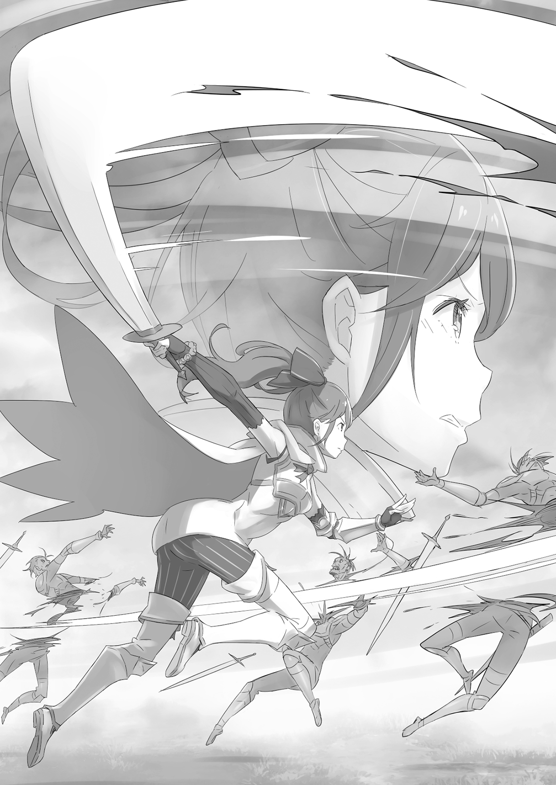

В то время бойцы отряда Зергефа часто обсуждали одну тему. Вопрос, затрагивавший самое сердце отряда, который каждый член глубоко и лично принимал близко к сердцу. Не будет преувеличением назвать это кардинальным изменением.

— Ласлоу, отступай! — приказал Вильгельм солдату, парируя удар боевого топора своим мечом. Секунду назад человек, к которому он обращался, был почти загнан в угол жестокой атакой врага. Когда Вильгельм увидел это, он оказался там быстрее ветра, перехватил удар противника и приказал Ласлоу отойти в безопасное место.

Пока его товарищ по отряду жадно глотал воздух, Вильгельм отбросил врага. Ошеломлённый одной лишь силой воли Демона Меча, зверочеловек с топором получил удар в бедро и с воем рухнул на землю. Это был момент для Вильгельма, чтобы наброситься на него, нанести завершающий удар…

— Дай руку. Отходи в тыл как можно быстрее, идиот.

Но Вильгельм не стал преследовать своего покалеченного врага. Вместо этого он подставил раненому союзнику плечо. Удивлённый силой, скрытой в его небольшом теле, здоровенный солдат пробормотал извинения.

— П-простите, вице-капитан!

— Если есть время извиняться, лучше используй его для тренировок. Тогда нам не придётся оставлять брешь в нашей линии фронта.

Его слова звучали резко, но он двигался осторожно, поддерживая раненого. Другие члены отряда прикрывали их отход, и как только он благополучно доставил Ласлоу в тыл, Демон Меча со всей скоростью вернулся в бой.

Затем, прорубая себе путь сквозь вражеские силы, он крикнул: — Не ведите себя как кучка зелёных новичков, отряд Зергефа! Смотрите им в глаза и сражайтесь!

С этим призывом, обращённым как к себе, так и к товарищам, Вильгельм рванулся вперёд. Последовали бесчисленные серебряные вспышки, каждая из которых сражала вражеского солдата, и Демон Меча в одиночку поднимал боевой дух своих людей.

Имя Вильгельма Триаса, Демона Меча, было настолько широко известно и уважаемо, что его называли надеждой королевской армии и отчаянием Альянса Полулюдей.

— Не могу поверить в перемену в этом человеке… Меня аж немного подташнивает.

— Ах, не будьте так строги к нему, мисс Кэрол. Это лишь показывает, что даже у Вильгельма есть хорошая сторона. Но я видел, как он рос, и должен признать, это действительно немного странно! — Бордо от души рассмеялся. С помощью своего боевого топора он истребил врагов на одном из участков линии фронта.

Кэрол почти проигнорировала хохот Бордо, отбиваясь мечом от наступающего вражеского солдата.

— Я тоже знала его до того, как он изменился, — продолжила она. — Я не пытаюсь быть холодной. Мне просто интересно, что он замышляет, ведя себя так… и когда он покажет своё истинное лицо.

— …

В глазах Кэрол читалось отвращение. Рядом с ней Гримм ударил по щиту, словно собираясь что-то сказать. Его обычно дружелюбное лицо было полно упрёка, когда он покачал головой, глядя на Кэрол.

— Прости, Гримм. Но я просто не могу к этому привыкнуть…

— В отряде много мнений о новом Вильгельме. Но в конце концов, почти все согласны со мной и Гриммом. Это действительно внезапная перемена… но не плохая.

— …Я это знаю.

— Чёрт, говорят же: «огонь и молот — всё, что нужно для закалки стали». Он может быть колючим, но, полагаю, он также может довольно быстро измениться, если у него есть причина. Было бы интересно, если бы этой причиной была женщина…

— Кхм…

— Что случилось? Ты знаешь что-то, чего не знаю я? — Бордо бросил на неё заинтригованный взгляд, но Кэрол энергично затрясла головой, на её аккуратных чертах появилось обеспокоенное выражение.

— Я ничего не знаю… Это ставит меня в трудное положение ввиду моих служебных обязанностей. Пожалуйста, поймите.

— То есть ты всё-таки что-то знаешь. Но я понял. Не буду настаивать.

— Была бы признательна. И всё же, я просто не могу привыкнуть…

Кэрол наблюдала, как Вильгельм продолжал защищать союзников и рубить врагов. В разгар ожесточённых схваток на мечах он помогал товарищам по отряду и давал советы. Это была глубокая трансформация.

Если бы это заставило его потерять сосредоточенность и негативно сказалось на его боевых способностях, это стало бы проблемой, но мастерство Вильгельма ничуть не угасло — если уж на то пошло, он мог быть даже более способным, чем раньше.

— …

— Я знаю, Гримм, знаю! Мы продолжим оттеснять врага.

«Не позволим Вильгельму нас затмить» , — сказал Гримм. Они вдвоём продвинулись к линии фронта. Бордо проводил их взглядом, положив топор на плечи.

— Говоря об изменениях, — сказал он, — я не думаю, что вы тот же человек, каким были, когда впервые встретили Гримма, мисс Кэрол. Но, полагаю, возможно, вы этого не осознаёте. Ах, чёрт побери, вы все такие молодые !

Бордо дико рассмеялся и посмотрел в сторону, надеясь, что кто-нибудь с ним согласится. Но это была просто сила привычки; человека, которого он полуосознанно ожидал увидеть стоящим всего в шаге позади, там не было. Бордо коснулся шрамов на лице и хрустнул шеей. Затем он взревел: — Эй, оставьте и мне немного! Мы уничтожим всех этих варваров!

После битвы в замке Бордо Зергеф продолжал совершенствовать свою технику владения топором. Теперь он демонстрировал плоды всех этих тренировок, вступая в бой, хотя сам был командиром. Это была битва, которая воплощала как то, что изменилось в отряде Зергефа, так и то, что осталось прежним.

После окончания назначенного периода несения оборонительной службы отряд Зергефа впервые за две недели вернулся в столицу.

Они прибыли в город поздно ночью, и большинство членов отряда, вероятно, проведут свой первый день отпуска во сне. Но Вильгельм, который, возможно, сражался упорнее всех в отряде, проснулся рано и покинул казармы.

Он шёл сквозь свежий прохладный воздух, его любимый меч висел у бедра. Когда городская стража увидела его, они выпрямились и уважительно отдали честь. Вильгельм небрежно махнул им рукой и направился к призамковому городу. Скоро он будет на площади в бедном районе. У них не было назначенной даты или времени. Они не знали, какими будут их планы, да и у самого Вильгельма не было определённых выходных.

Следовательно, будет ли там человек, которого он искал, зависело от удачи. И в этот день…

— О, Вильгельм. Ты сегодня пришёл.

Терезия, пришедшая первой, обернулась, заметив Вильгельма. Ветер подхватил её длинные рыжие волосы, и она улыбнулась ему. Вильгельм поднял бровь. Источником его недоумения было место, где она стояла: прямо посреди цветочного поля.

— Я знаю этот взгляд, — сказала она. — «Что эта девушка задумала?» — удивляешься ты.

— Что ж, спасибо, что выразила мои чувства словами. Что ты задумала, «эта девушка»?

— Я бы сказала, это как раз тот вопрос. Что я задумала? — невинно сказала Терезия. Затем внезапно подняла одну босую ногу. Подол её платья сместился от движения, обнажив бледное бедро. Вильгельм быстро отвёл взгляд.

— Что такое? — сказала Терезия. — Это слишком возбуждающе для чистосердечного юноши?

— Перестань паясничать, дурочка. Я тебе уже говорил, это место небезопасно. Если будешь такой уязвимой, рано или поздно поплатишься.

— О, я об этом не беспокоюсь. В конце концов, со мной большой, грозный мечник, не так ли? — сказала она, подмигнув. Этот жест заставил голос Вильгельма застрять в горле. Он нервно провёл рукой по своим каштановым волосам и послушно подошёл к ней.

— Ладно, выкладывай. Что ты делаешь? Вспомнила детство и играешь босиком в грязи?

— К-как грубо! Я могу вспомнить детство, если захочу. И вообще, я не играю в грязи! Ты совершенно не прав! Слепой! Бесчувственный!

— Боже, зачем так набрасываться?

Она действительно была женщиной сильных эмоций. Смеялась от души, но и злилась искренне. Он искренне верил, что никогда не устанет от её смеха и криков, её улыбок и нахмуренных бровей. Эта мысль заставила даже Вильгельма немного досадовать на самого себя.

— Правильный ответ… я сажаю семена для новых цветов!

— Новые семена?

Пока он стоял, заворожённый её профилем, Терезия потеряла терпение и сама выпалила ответ. Но это лишь заставило Вильгельма с любопытством посмотреть на неё.

Терезия указала на поле и сказала: — Да, верно. Скоро сменятся времена года, так что и цветы должны смениться, не так ли? Мне жаль видеть, как мои цветы увядают, но я могу вырастить новые для нового сезона.

— Вырастить? Я даже не видел, чтобы ты их поливала.

— Э-это правда, что я в основном позволяю им расти самим по себе, но именно я дала им тот первый толчок! И на этот раз я планирую хорошо о них заботиться. Так что, может быть, ты будешь так любезен не усмехаться?

Терезия всегда должна была вернуть вдвойне, когда чувствовала, что её обидели. Однако в конце этой тирады Терезия посмотрела на поле и добавила: — Кроме того. Если здесь не будет цветов, у меня больше не будет предлога приходить.

— …

Вильгельм затаил дыхание. «Предлог» . Это было их негласное соглашение, когда они встречались здесь.

— …

Терезия приходила проверить свои цветы, Вильгельм — попрактиковаться в фехтовании. Но их фасад уже почти рухнул. Они более или менее пренебрегали своими заявленными целями — Терезия в основном, а Вильгельм полностью. Конечно, дело было не в том, что Вильгельм стал меньше почитать свой меч. Просто теперь причиной его прихода сюда была Терезия.

Оба они это знали, несомненно. Тем не менее, они никогда не говорили об этом вслух и продолжали встречаться таким образом. Должно быть, из страха перемен.

Даже сейчас, когда его продолжали ковать, как сталь, переделывать, он, казалось, не осознавал этого.

Вильгельм отвернулся, не в силах больше выносить её взгляд. — Знаешь… мне тоже есть, что тебе сообщить.

— Сообщить? — Терезия вопросительно посмотрела на него.

Он чувствовал на себе её взгляд. — Да, — сказал он. — Мои боевые заслуги признали. Шли разговоры о какой-то награде или вроде того, и… теперь я рыцарь.

— …

Он почувствовал, как она затаила дыхание. При её реакции Вильгельм сжал кулак, стараясь держать его так, чтобы Терезия не увидела. Решающим фактором в его возведении в рыцари стало то, что он помог сорвать атаку полулюдей на замок. Изменение в поведении Вильгельма после этого, наряду с рекомендацией от Бордо, закрепило повышение.

В прошлом Вильгельм мог бы отказаться от этой награды, но теперь он принял её с благодарностью. Он гордился этим доказательством того, что его достижения были признаны. Также его совесть не позволила бы ему пренебречь усилиями Бордо и других его товарищей, чтобы добиться этого для него.

Кроме того, сам факт того, что он стал рыцарем, радовал его в глубине души.

— О? Поздравляю. Полагаю, это приближает тебя на шаг к твоей мечте.

— Моей мечте?

Эта мысль была настолько сокровенной, что замечание Терезии застало его врасплох.

Она прикрыла рот рукой, словно удивлённый взгляд Вильгельма её позабавил. — Ты используешь свой меч, чтобы защищать людей, не так ли? А рыцарь — это тот, кто защищает людей. — Она выглядела совершенно уверенной в этом, и её губы изогнулись, почему-то, с тем, что он счёл гордостью.

Наконец, он всё понял. Он запечатлел её улыбку в своей памяти, чтобы она всегда была среди тех, кого он сражался защищать.

После встречи с Терезией, когда солнце уже стояло высоко в небе, Вильгельм направился в торговый квартал. Королевство могло быть истощено продолжающейся гражданской войной, но это, казалось, не повлияло на алчность торговцев, которые въезжали и выезжали из города. Во всей столице только торговый квартал сохранял прежнюю оживлённую активность. Знакомый маленький ресторанчик не был исключением.

— Как обычно, — сказал он девушке у двери, затем прошёл к угловому столику в дальнем конце зала. Человек, с которым он пришёл встретиться, уже сидел там, как раз наливая себе выпить.

— Пьёшь в такой час? Довольно дерзко, даже для выходного дня.

Вильгельм занял место напротив мужчины. Несмотря на грубые слова Вильгельма, мужчина беззвучно рассмеялся и начал наливать напиток для новоприбывшего. Он покачал головой, и официантка принесла ему воды. Мужчина напротив Вильгельма настойчиво поднял свой стакан. Нахмурившись, Вильгельм уступил, чокнувшись с ним стаканами.

«Никогда бы не подумал, что настанет день, когда мы с тобой сядем и выпьем вместе».

Как только Вильгельм смочил губы первым глотком воды, другой мужчина подтолкнул к нему листок с написанными на нём словами. Вильгельм уже привык к этому, но нельзя было отрицать, что это неудобно. Он постучал пальцем по бумаге.

— Я тоже. Но я не пью. Кто вообще захочет пить эту бурду?

«Приятно знать, что некоторые вещи в тебе не изменились».

Гримм предложил эту короткую фразу и улыбку. Вильгельм почувствовал укол вины, осознав, что снова это сделал. Он был так склонен к злобной речи и агрессивным действиям. Это была его дурная привычка. Несмотря на желание и усилия измениться, такую давнюю часть его личности нельзя было так легко трансформировать.

Наконец, он замолчал, наблюдая, как Гримм молча наливает себе ещё выпивки. Вильгельм позволил себе поддаться мягкости Гримма. Теперь он осознавал, скольких любезностей он был удостоен.

Бессознательно Вильгельм коснулся меча на бедре, черпая утешение в знакомом ощущении. Внезапно Гримм поставил бутылку с алкоголем на стол и свободной рукой указал на грудь Вильгельма.

— ?! О, герб. Полагаю, это потому, что я теперь рыцарь.

Гримм смотрел на эмблему дракона на левой груди Вильгельма. Это было доказательство статуса, которое ему пожаловали при возведении в рыцари; на гербе был Драконий Камень.

— Полагаю, довольно необычно, когда кто-то поднимается из простолюдинов в рыцари, но… что ж, когда узнали о моём происхождении, эти разговоры быстро прекратились.

Вильгельма когда-то считали символом того, к чему стоит стремиться, простолюдином, который подобно звезде поднялся до высших чинов. Но когда выяснилось, что его родословная связана с лугуникской знатью, многие удивились даже больше, чем когда он стал известен как Демон Меча. Рождение мало влияет на навыки владения мечом, но людям просто приятнее думать, что они видят причину того, как обстоят дела.

— Оказывается, не так уж много меняется, когда становишься рыцарем. А что насчёт тебя? Если вы с Кэрол сойдётесь, ты станешь частью знаменитого дома. Это более быстрый путь наверх, если хочешь знать моё мнение.

Устав от допроса, Вильгельм задал свой собственный острый вопрос. Гримм покраснел так сильно, что ему не нужно было ничего говорить, чтобы передать своё смущение. Он поднёс стакан к губам, словно показывая, что не будет комментировать. Способность Вильгельма более или менее угадывать, о чём думает Гримм, по его выражениям и жестам, была ещё одним недавним отличием.

Как только он начал уделять больше внимания тому, что происходит вокруг, он с удивлением осознал, как много люди общаются без слов. Вот что происходило, когда навыки наблюдения, отточенные на поле боя, применялись в повседневной жизни.

«Ты рассказал своей семье о том, что стал рыцарем?»

— Связался с семьёй? Нет, ни слова. Честно говоря, я даже не знаю, как им показаться на глаза. Но это также… Появляться в ту же минуту, как получил повышение, будет выглядеть нехорошо. Я хочу хотя бы подождать, пока гражданская война не будет завершена.

Отношения Вильгельма с его кровной семьёй всплыли на свет в результате его повышения. Наверняка его семья знала о его продвижении по службе, но это было ещё одной причиной быть осторожным.

«Ты имеешь в виду, может быть, когда будешь готов привести домой девушку для женитьбы?»

— Пффф!

Вильгельм выплюнул воду от слов перед ним. Он бросил на Гримма взгляд, который говорил: «Никогда не знаешь, что ты скажешь дальше» , но Гримм пытался подавить улыбку. Он отплатил Вильгельму за предыдущее, да ещё как. Вильгельм корил себя за то, что позволил себе так отреагировать.

«Все заметили, как сильно ты изменился. Весь отряд пытается выяснить, кто за этим стоит».

— …Неужели вы не можете найти более продуктивную тему для болтовни?

«Ты, вероятно, знаешь это лучше всех, но мы все были удивлены. Кому удалось это с тобой сделать?»

Гримм был совершенно убеждён, что причиной перемены в сердце Вильгельма была девушка. И он не ошибался, но если Вильгельм подтвердит это здесь, он не сможет скрыть это от Терезии.

— Не глупи. Мне надоела эта дурацкая…

«Было бы очень мило, если бы ты стал рыцарем ради неё… Это ведь не леди Мейзерс, правда?»

— Чёрта с два! Я бы не имел ничего общего с этой женщиной, даже если бы Пристелла утонула в море!

«Тебе не нужно так расстраиваться».

Гримм ухмылялся, но у Вильгельма по-настоящему побежали мурашки по коже. Он хотел бы, чтобы Гримм перестал шутить.

К слову, Пристелла была крупным городом в западной части Лугуники. Он находился на слиянии нескольких известных рек, город шлюзов, который за все столетия с момента постройки ещё не пострадал от наводнений.

— В любом случае, в последнее время мы даже не видели её на поле боя. Мы сталкиваемся с ней лишь время от времени.

«Я думаю, это „время от времени“ потому, что она хочет увидеть твоё лицо. Это мило».

После того, как им удалось уничтожить ведьму Сфинкс, магические атаки Альянса Полулюдей стали значительно менее мощными. Это также означало гораздо меньше случаев столкновения с Розвааль, специальным магическим советником. Но она, действительно, преданно приходила повидаться с Вильгельмом, хотя и редко.

«Кэрол остаётся с леди Мейзерс, так что мы тоже не слишком часто видели её на поле боя. Я рад этому. Я знаю, что она сильнее меня, но я не хочу, чтобы она слишком часто там бывала, учитывая, какие сейчас битвы».

Вильгельм коротко кивнул. — Верно. — Он больше не мог этого выносить и сильно потянулся. Несмотря на то, что Альянс Полулюдей потерял Валгу и другие свои опоры, его атаки не прекратились. Если уж на то пошло, альянс стал более жестоким, чем раньше, мало заботясь о последствиях. — Полагаю, без стратега, который бы их сдерживал, некому их удержать. Я думаю, принимать смерть вместо капитуляции — глупо, но это привело к множеству жертв.

«У них нет пути к отступлению, какой бы ужасной ни была битва».

Кровавая баня в замке была последней отчаянной попыткой лидеров полулюдей. После неё было неожиданно, что пламя войны не только не утихло, но и разгорелось жарче. Вернее, один человек этого ожидал — Валга. Он даже надеялся на это.

— Может быть, он знал, что его смерть разожжёт пламя гнева полулюдей и превратит это в войну на взаимное уничтожение.

«И всё же, полулюди в невыгодном положении. У них нет численности. Валга должен был это знать».

Гримму казалось, что это не имеет смысла, но Вильгельм думал, что понимает. Валга Кромвель хотел положить конец миру. Мир был полон бесчинств и неоправданных убийств, и Валга хотел нанести ему такой ущерб, чтобы он перевернулся с ног на голову. Если такова была его цель, то текущая ситуация вполне соответствовала ей.

«Пламя гнева полулюдей не гаснет. Интересно, есть ли способ положить конец этой борьбе».

— Я сказал ему, что буду убивать, пока не останется врагов для убийства. Но… я больше не уверен, что это реально. Если есть хоть какой-то шанс, я думаю, это должно быть что-то более позитивное.

«Позитивное?»

— Что-то, что потушит пламя ненависти и лишит его топлива.

Он чувствовал, что хватается за соломинку. Если такая возможность когда-либо и существовала, Война Полулюдей кардинально изменила ситуацию. То, что им действительно было нужно, — это сила, способная сравниться с яростью.

«Что-то ещё более внушительное, чем идеалы Валги и ненависть полулюдей».

— Если бы у нас был кто-то или что-то подобное… Интересно, как бы это вообще называлось.

— …

Шёпот Вильгельма заставил Гримма погрузиться в, казалось бы, задумчивое молчание. Затем он, похоже, что-то придумал и медленно написал на своей бумаге.

«Герой».

Он написал только эти два слова. Вильгельм кивнул.

«Герой» , — подумал он. «Да, герой».

Кто-то, кто был не просто героем по названию, а настоящим, как в историях. Кто-то с большей силой, чем Вильгельм, Демон Меча, или прославленный боевой отряд Зергефа, или несравненная королевская гвардия.

Кто-то вроде Святого Меча, который когда-то развеял ужас, нависший над миром…

Если и был конец этой борьбе, то он заключался в таких невозможных надеждах.

— Бо-о-оже мой. Ты вернулся та-а-ак поздно.

— …

Вернувшись в свою комнату, Вильгельм обнаружил женщину, элегантно развалившуюся на его кровати — Розвааль. Он молча уставился на неё. В её глазах не было злобы, когда она улыбалась ему; казалось, она наслаждалась моментом.

— Ты был на тренировочной площадке, весь в поту, и теперь хочешь обрушить весь этот жар на представителя противоположного пола… Ты так себя чувствуешь?

— Я чувствую ужасную усталость от того, что ты просто так заваливаешься в мою комнату. Чем, чёрт возьми, занимается начальник казармы? Неужели он не понимает, что должен не пускать сюда подозрительных личностей?

— Раньше он впускал меня, потому что боялся. Но теперь он делает это как одолжение старому другу… или что-о-о-то вроде того?

— Тебе не следует лезть не в своё дело.

Он вспомнил, как пухлый начальник казармы отдал ему честь, когда он входил в здание. Вильгельм значительно улучшил свои отношения не только с отрядом Зергефа, но и с другими солдатами. Тем не менее, это ничуть не помогало. Если начальник будет впускать в его комнату каждого посетителя, доброжелателя и мнимого приятеля, у него может больше не быть возможности расслабиться.

— Итак? — спросил Вильгельм. — Чему я обязан неудовольствием?

— Коне-е-ечно, ты знаешь, что есть только одна причина, по которой женщина отбрасывает стыд ночью, чтобы прокрасться в комнату мужчины, которого она желает. Первобытный, инстинктивный… ну-ну, не злись так.

Взгляд Вильгельма стал агрессивным, и Розвааль немедленно отбросила всякое кокетство. Она раздражённо выдохнула, наблюдая за Вильгельмом своими разноцветными глазами. — Я вря-я-яд ли могла бы сделать свою привязанность более очевидной, и всё же ты реагируешь, как стальная стена. С такими темпами я потеряю уверенность в себе как в женщине.

— Я рад искренне отвечать людям, которые испытывают ко мне искреннюю привязанность. Но если нет, то я не трачу на них своё время.

— Хм-м. — Розвааль закрыла один глаз и погрузилась в раздумья. Вильгельм проигнорировал её и схватил что-то, чтобы вытереться. После того, как он расстался с Гриммом, Вильгельм направился на тренировочную площадку и действительно сильно вспотел. Однако у него хватило такта не начинать переодеваться перед женщиной.

— Тогда давай поговорим в духе искренней привязанности. Не как мужчина и женщина, к сожалению, а как друзья, — сказала Розвааль. Тон её голоса внезапно изменился, и Вильгельм посмотрел на неё. Розвааль всё ещё сидела так же, как и раньше, но её поведение было совершенно другим. Это была та её сторона, которую он видел лишь изредка, на поле боя, когда она демонстрировала всё своё желание поймать Сфинкс.

Другими словами, Розвааль теперь была настроена по-настоящему серьёзно.

— С помощью тебя и твоих друзей, — сказала она, — я смогла достичь своей цели. Считай это моим искренним выражением благодарности за твою помощь.

— …Продолжай.

— Гражданская война грозит проникнуть на территорию Дома Триас. Твоей семьи.

— Чт?!..

Глаза Вильгельма расширились от этой неожиданной новости. Розвааль скрестила свои длинные ноги и серьёзно кивнула.

— Да. У меня там есть знакомые. Уверена, тебе нелегко это слышать. Я пришла сюда, чтобы сказать тебе сама, опасаясь, что иначе может быть слишком по-о-оздно.

— Зачем тебе?.. И вообще, зачем им?..

— Конечно, на землях Триас нет ничего, что стоило бы атаковать. Местный лорд и королевская армия воспримут это как гром среди ясного неба. Но-о-о полулюди в наши дни не так логичны. Понимаешь?

Полулюдей, пылающих остатками ненависти Валги, больше ничто не останавливало, и даже ничто не заставляло их различать одну цель от другой. Их действия могли ни к чему не привести, но пламя этой гражданской войны нельзя было потушить.

— Хотя, полагаю, это может быть месть тебе за убийство их лидеров, мой дорогой Вильгельм Триас.

— … — Когда один ранит другого, это создаёт причину для мести. Начало этой гражданской войны, как и её продолжение, зависело от таких причин. И Вильгельм был не в том положении, чтобы осуждать эти действия.

— Я думаю, твоя лучшая надежда — поговорить со своим начальством. Я верю, что наш друг Бордо не поступит с тобой пло-о-охо. Хотя это может занять некоторое время.

Затем Розвааль встала с кровати, словно сигнализируя, что их разговор окончен. Она прошла мимо Вильгельма, стоявшего вытянувшись в струнку, и направилась к двери.

Однако, прежде чем она успела уйти, Вильгельм потребовал: — …Чего именно ты здесь хочешь? Что, по-твоему, ты получишь?

Розвааль остановилась. — У меня нет никаких тёмных замыслов. Для меня необычно испытывать такую привязанность к кому-то. Если я могу помочь тем немногим людям, о которых я забочусь, быть счастливыми, тем лучше. Обещаю, мои мотивы не более зловещи, чем это.

Говоря, она не оборачивалась, и он не мог видеть её лица. Вильгельм тяжело сглотнул от веса её слов. Но затем она пожала плечами и повернула голову так, чтобы видеть его краем глаза. Она улыбалась.

— Что делать — твой выбор. Убедись, что не пожалеешь об этом.

И с этими словами Розвааль J. Мейзерс покинула комнату.

Вильгельм смотрел ей вслед. После минутного молчания он пришёл в себя. Он бросился схватить рубашку, которую только что снял, и почти вылетел из комнаты, чтобы повидаться с Бордо.

Когда он вышел в коридор, Розвааль уже исчезла.

«— Сначала я проверю ситуацию. Всё будет зависеть от того, что происходит, но я склонен буду развернуть отряд. Не лезь на рожон, Вильгельм».

Когда Вильгельм рассказал Бордо о надвигающейся угрозе землям Триас, Бордо кивнул с непривычной серьёзностью и дал такой ответ. Затем он отправился в штаб.

Вильгельм смотрел ему вслед. Сообщение о проблеме — это всё, что он мог сделать сейчас. Он скрипнул зубами от собственной беспомощности, но теперь у него хватало самообладания, чтобы вынести это. На его груди была эмблема рыцарства; это был знак его осознания того, что ему больше не будет позволено действовать так же опрометчиво, как раньше.

«— Повторю ещё раз», — сказал Бордо. «— Не лезь на рожон. Рыцарей почти никогда не лишают звания после повышения, но теперь люди знают, кто ты. Ты больше не безымянный мечник, который может идти куда угодно».

Сумерки сгущались, пока завеса ночи опускалась на столицу. Идя по главной улице, он снова и снова прокручивал в уме слова Бордо.

Он не мог просто тихо ждать в своей комнате. У него было слишком много свободного времени, и ноги, казалось, медленно, но верно тащили его к площади в бедном районе. Прошло несколько часов с тех пор, как он виделся с Терезией, обменялся с ней обычными словами, а затем расстался. Он никогда прежде не приходил в это место дважды за один день.

— Вильгельм?

Поэтому он был удивлён, обнаружив рыжеволосую девушку, стоящую на затемнённой площади.

В отличие от главной улицы, эта площадь выходила в задние переулки, и поэтому здесь не было искусственного освещения. Ночь была облачной, и он едва мог разглядеть собственную руку перед лицом. Терезия никак не могла видеть свои цветы в темноте, но она ждала одна на этой площади.

Терезия посмотрела на Вильгельма и моргнула своими голубыми глазами. — Что случилось?.. У тебя такое страшное лицо.

— Что девушка вообще делает здесь в такое время ночи?

— Почему, это почти звучит как… Ах! — Терезия хлопнула в ладоши, словно что-то поняла. — Хм-м… Я бы хотела задать тебе тот же вопрос, но, возможно, это было бы не очень вежливо. Ты не похож на любителя шуток.

— …

Вильгельм не ответил, но ему показалось что-то неладное в том, как говорила Терезия, почти так, словно она играла роль. Размышляя о причине этого, он наткнулся на возможную причину — и на то, о чём она, вероятно, думала.

Это был почти тот же самый разговор, который у них состоялся при первой встрече.

— …

По правде говоря, Вильгельм чувствовал, что у него сейчас нет времени потакать маленьким играм Терезии, но она так невинно смотрела на него, ожидая ответа, что он не мог не подыграть.

Он легко изобразил гримасу раздражения, которую носил при их первой встрече. Затем сказал: — Здесь много опасных людей. Это не то место, где женщина должна гулять одна.

— Боже, ты беспокоишься обо мне?

— Я могу быть одним из этих опасных людей.

— Ты не такой. Я знаю эту форму — ты один из рыцарей замка, не так ли? Ты бы не сделал ничего плохого.

Эта последняя фраза приняла другой оборот, когда Терезия указала на эмблему на его груди и улыбнулась. Вильгельм мрачно улыбнулся этим словам, затем подошёл и встал рядом с ней. Она была одета в ту же одежду, что и днём, и сидела на том же месте. Поэтому он предположил:

— Ты была здесь весь день?

— …Да. Полагаю, я немного задержалась. — Она высунула язык, словно намекая, что это что-то необычное, но Вильгельм подозревал, что это, вероятно, не так.

Вильгельм никогда не пытался проверить, что делала Терезия после того, как они расставались, но теперь он был уверен, что она всегда сидела здесь до наступления темноты.

— Я не пытаюсь быть милым, когда говорю, что это действительно не то место, где женщина должна гулять одна в такое время ночи.

— Спасибо, что беспокоишься обо мне. Но я действительно думаю, что для этого уже немного поздно. И в любом случае, я не буду гулять одна, так что всё в порядке. За мной придут.

— …

— Не волнуйся, это девушка.

— …Я об этом не волновался.

Ему только показалось, что он испытал облегчение, услышав это. И в любом случае, присутствие ещё одной женщины не сделало бы ситуацию безопаснее.

— Всё в порядке. Она очень сильная мечница. Гораздо сильнее меня.

— Сильнее тебя? Я думаю, это можно сказать о большинстве мечников.

Эта девушка не знала и азов боевых искусств. Она не была хорошим примером для сравнения. Тем не менее, прошёл почти год с тех пор, как Вильгельм и Терезия встретились. Если этот человек всё это время был её телохранителем, возможно, она проявила себя.

Если у Терезии был телохранитель, означало ли это, что у неё действительно был определённый статус в мире?

— Значит, ты не идёшь домой. Это потому, что ты не хочешь быть у себя дома?

— Т-ты, конечно, не лезешь за словом в карман, да, Вильгельм?

— Это дурная привычка. Моя работа научила меня никогда не сдерживаться. Так каков твой ответ?

— …Можно сказать, да, но… можно сказать и нет. Прости, я знаю, что это сложно. — Глаза Терезии, казалось, смотрели вдаль, когда она извинялась. Чувства, бурлящие в её глазах, то, какой хрупкой она выглядела — Вильгельм проклинал себя за свою бесчувственность. Ни одна молодая женщина не стала бы бесцельно бродить по городу ночью вместо того, чтобы быть дома, без причины.

— А ты, Вильгельм? — Ему потребовалось мгновение, чтобы понять её вопрос. Терезия сидела на ступеньке у цветочной клумбы, обняв колени и глядя на него снизу вверх. — Могу я… спросить о твоём доме?.. Твоей семье?

— Моей… семье…

— Верно. То есть… я знаю, может быть, это не моё дело… — Она застенчиво улыбнулась. Обычно он мог бы что-нибудь ей ответить. Но в этот момент вопрос о его семье заставил Вильгельма запнуться. В конце концов, в тот самый момент его дом, Дом Триас, мог быть в опасности.

— …Я сказала что-то не так? — Выражение лица Терезии омрачилось из-за его молчания.

Он снова проклял себя за незрелость. Рассказать Терезии о том, что происходит, означало бы лишь возложить на неё ненужное бремя. Так почему же он не мог изобразить свой обычный безразличный вид? Он с болью посмотрел на землю.

Затем Терезия встала перед ним и протянула руки к Вильгельму.

— Соберись! Ты мужчина или нет?

— ?!

Она звонко шлёпнула его по обеим щекам. Совершенно удивлённый, Вильгельм посмотрел на неё широкими глазами. Терезия упёрла руки в бока и выпятила грудь.

— Какими бы ни были твои отношения с семьёй, они очевидно сложны, но не в твоём духе из-за этого раскисать. Делай то, что ты всегда делаешь — знаешь, веди себя надменно без причины. Тебе следует размахивать мечом, как ребёнок, полный необоснованной уверенности. Так гораздо лучше.

— …

Её критика была жестокой. Вильгельм был ошеломлён, осознав, что она так о нём думает.

Возможно, его молчание заставило Терезию осознать, насколько резкими были её слова, потому что она быстро сказала: — Подожди, это не… Хм.

Плечи Вильгельма расслабились от этой перемены в ней. Он выдохнул, затем улыбнулся ей. Не одна из его гримас, а улыбка от всего сердца.

— Ты действительно странная девушка, не так ли?

— Ч-что? Что заставляет тебя так говорить? Я знаю, что я не совсем нормальная, но я думала, что сказала что-то довольно меткое. — Она звучала раздражённо.

— Не хвали себя. Но… ты не ошибаешься. — Он снова глубоко выдохнул. Это был не вздох тоски, а способ изгнать все свои эмоции. — Размахивать мечом, как ребёнок, ха?..

Ребёнок с мечом был бы очень опасен. Этот образ заставил его улыбнуться. Но опять же, она не ошибалась. Вильгельм был ребёнком, играющим с мечом. Он оставался ребёнком, даже когда время шло, когда он рос. Он просто забыл об этом где-то по пути.

Но теперь он вспомнил, почему взялся за меч, несмотря на свою незрелость.

— Позволь мне проводить тебя до входа в бедный район. Подожди свою подругу там, где есть немного света.

— …Ты не боишься, что она может меня не найти, если меня не будет на нашем обычном месте?

— Ты хочешь сказать, что я должен оставить тебя здесь в темноте? Не заставляй меня.

— Это верно. Полагаю, тогда у нас нет выбора. Я позволю тебе помочь молодой женщине подняться на ноги. — Терезия звучала так уверенно, протягивая руку. Вильгельм взял её и помог ей подняться, и каким-то образом они так и не отпустили руки друг друга, пока шли к входу в трущобы. В тепле их сплетённых пальцев Вильгельм чувствовал свой собственный пульс.

Они прошли несколько узких улочек, когда Терезия остановилась на боковой улице рядом с главной дорогой. — Я подожду здесь, — сказала она. — Думаю, она сможет меня найти. — По правде говоря, Вильгельм хотел проводить её до самой главной улицы, но, скорее всего, она не хотела, чтобы он и её телохранитель встретились.

— Итак, теперь это девушка одна в тёмном переулке? Знаешь, если подумать, здесь проституток называют «цветочницами»…

— Никто не спутает меня с одной из них… Погоди-ка, неужели ты не поэтому начал меня так называть?

— Нет. Это потому, что у тебя голова была полна цветов.

— Ну, это тоже не очень-то приятно! — Она покраснела и шлёпнула его по плечу. Вильгельм отпустил её руку и сделал шаг назад. Его пальцы всё ещё покалывало от ощущения её — но он отбросил этот момент слабости и посмотрел на неё. Затем, коснувшись эмблемы на груди, он пожелал ей спокойной ночи.

— Будь осторожна на этих тёмных дорогах, Цветочница.

— А ты будь осторожен, чтобы не слишком увиливать от своих обязанностей, никудышный солдат.

Эти кажущиеся жестокими слова быстро сменились улыбками. Затем он сказал: — Пока, Терезия.

— До следующей встречи, Вильгельм.

Так они теперь всегда расставались. Вильгельм отвернулся от неё и направился к главной дороге, чувствуя её взгляд на своей спине. Только убедившись, что больше не чувствует её взгляда, он потянулся к левой груди и сорвал эмблему.

Это был знак того, что он рыцарь, что мир признал его, что он мог поднять голову при встрече с Терезией. Теперь средоточие всего этого смысла тускло мерцало у него на ладони.

Оно не было ярче или прекраснее, чем солнечный свет, блестевший на его мече в дни его юности.

— Этот здоровенный, бушующий идиот!

На следующий день Бордо во всю глотку орал в личной комнате Вильгельма. Он выместил своё разочарование на столе, который разломился пополам, и по комнате были разбросаны различные награды. Это было не совсем подобающее поведение для командира, но и этого было недостаточно, чтобы унять гнев Бордо.

— …

Рядом с разъярённым офицером Гримм молча положил руку на разорённый стол. Из того, что от него осталось, он извлёк эмблему — драконий герб рыцаря. На диске также была записка, на которой было написано всего одно слово.

«Прости».

Простое, бесхитростное — очень в духе довольно неотёсанного Демона Меча. Вильгельм Триас снял знак своего положения и покинул столицу, взяв с собой только меч.

Возможно, это казалось не очень культурным. Но как Демон Меча, это был его ответ.

Для Вильгельма было немалым решением отказаться от знака своего рыцарства. Эмблема была доказательством признания со стороны чего-то столь же большого и важного, как само королевство. Когда-то его считали не более чем малолетним преступником, но знак показывал, что он всё это время был прав.

С того дня, как он постучался в двери королевской армии, и до этого момента он был целеустремлённо сосредоточен на мече. Всё это время он верил, что это всё, что ему нужно, но ему было дано так много всего. Были враги. Союзники. Соперники, товарищи, начальники. Те, кому он клялся отомстить. И…

— Терезия…

Он прошептал имя девушки, о которой теперь знал, что глубоко заботится. Он положил руку на меч, словно чтобы убедиться, что он всё ещё там.

Отказаться от своей эмблемы означало оставить позади всё, что он приобрёл в столице. Не то чтобы он считал это не имеющим ценности. Скорее, именно потому, что он знал, что это ценно, он не мог действовать свободно, если бы продолжал нести это. Он отпустил это, потому что это было бесценно.

Он с тоской оглядывался на них. Он чувствовал вину, сожаление и гнев. Его эмоции были похожи на мутное болото. Ему никогда не удавалось жить совершенно просто. Дни, когда он просто хотел быть мечом, казались никогда не существовавшими. И всё же, он и сейчас не винил себя за то время.

— …

Он знал, что даже если ему удастся разобраться со всем происходящим, он не сможет просто вернуться к тому, как всё было раньше. Просто его дни в последнее время были настолько спокойными и самодовольными, что позволяли ему развлекаться такими фантазиями.

Например, той, в которой он погасил пламя войны, бушевавшее вокруг его родины, получил прощение за то, что отбросил честь рыцаря, а затем взял Терезию за руку и привёл её домой, чтобы познакомить с семьёй Триас. Просто фантазия.

Такие мысли закрывали ему глаза на реальность, но пожар, который он обнаружил по возвращении домой, открыл их с жестокой силой.

— Р-р-р-ра-а-ах!

Итак, Демон Меча взял свой любимый меч в руку и, прибыв в дом, который он нашёл совершенно изменившимся, начал свою войну в одиночку.

«— Что ты знаешь о моих чувствах, брат?!»

Прошло уже пять лет с тех пор, как после очередной их ссоры Вильгельм сбежал из дома.

Дом Триас был обедневшим дворянским родом с небольшой территорией в северной части королевства Лугуника. Их былая слава за ратные подвиги уже угасла, когда Вильгельм появился как третий сын семьи.

Два мальчика, предшествовавшие ему, были более чем квалифицированы для наследования главенства в семье, и Вильгельм провёл свою юность, по сути, не обременённый требованиями быть частью преемственности. Было одно, что привлекло внимание этого мальчика, проводившего дни без забот о ведении хозяйства: фамильный меч, висевший в большом зале дома. Это было единственное напоминание о днях, когда Дом Триас заслужил славу как последователи боевых искусств.

Вильгельма влекло к мечам, он проводил дни в тренировках с утра до ночи. Сначала его семья смотрела на это с умилением, но через шесть лет они уже не улыбались. Старший сын семьи начал делать мелкие выпады в адрес своего помешанного на мечах младшего брата под видом дружеских советов. Реакция Вильгельма на эти придирки привела к ожесточённой ссоре, и бегство младшего мальчика из дома стало, по сути, последним словом.

Он сбежал в столицу, где вступил в королевскую армию и, в конце концов, стал Демоном Меча.

Таковы были его жалкие истоки, которые он решил не раскрывать ни Терезии, ни кому-либо ещё.

Земли Триас, которые он помнил, уже были охвачены пламенем от крупной атаки полулюдей. Пейзажи, которые, как он думал, он знал, были окрашены в красный цвет, а особняк, где он жил почти до подросткового возраста, сгорел дотла. Возможно, домочадцы были совершенно не в силах сопротивляться нападавшим, потому что остались лишь следы того, что их растоптали тут и там.

Конечно. Это имело смысл. Его братья были такими мягкими, а его семья такой самодовольной, что мысль о сопротивлении даже не пришла бы им в голову. Его семья была настроена защищать себя любым способом, кроме боя. Именно это и привлекло его к клинку в первую очередь. Он восполнит то, чего не хватало его братьям.

И теперь у него должно было быть достаточно сил, чтобы сделать это.

— Р-у-у-а-а-ах!

Его меч стал подобен вихрю, и туман крови полулюдей окрасил земли Триас ещё краснее. Полулюди успешно одолели одно кроткое человеческое племя, но теперь Демон Меча ударил им во фланг. Головы, поднявшиеся в удивлении, он отправил в полёт; руки и ноги, пытавшиеся ему противостоять, он отрубил; крики насмешки и ненависти не могли быть изданы, когда он пронзил их горла.

Он был покрыт кровью врагов, его голос охрип от крика. Он взмахнул мечом, казалось, миллион раз, а затем ещё миллион.

— Это Демон Меча! Демон Меча, убийца Валги и Либре!

Осознав, кто этот бушующий человек, его враги начали наседать на него. Они заполнили его поле зрения справа и слева, обрушиваясь на него, как волна, вместе со своей ненавистью. Тем не менее, он летел прямо на них.

Только в начале битвы дела у него шли хорошо. Полулюди были застигнуты врасплох появлением Демона Меча, но когда они поняли, что Вильгельм — их единственный противник, они начали использовать своё численное превосходство.

Многие против одного, и вскоре он был ранен. Он мог забрать десять жизней десятью ударами меча, но враг отвечал сотней ударов от сотни жизней одновременно. Это было естественно подавляюще, и Вильгельм, в одиночку и без поддержки, был прижат всё сильнее и сильнее.

— …

Он был окружён врагами. Справа и слева, сзади и спереди, и все они были сосредоточены только на том, чтобы убить его. У него не было ни здоровенного союзника, который помог бы ему прорваться сквозь их ряды, ни молчаливого щитоносца, который прикрыл бы его спину — вообще никаких друзей, чтобы сформировать с ним боевую линию.

Он был один. Он знал, что было время, когда он верил, что сможет обойтись таким образом. Но даже тогда он на самом деле не был один. Он понял это сейчас, когда было слишком поздно.

— Гр-рах!

Он получил ранение в спину. Он развернулся и пронзил своего засадчика прямо в сердце. Пока он это делал, приблизились новые нападавшие. Он попытался отпрыгнуть в сторону, но его ноги запутались. Он блокировал удар из неестественного положения, чувствуя удар каждой костью своего тела. Он стиснул зубы; с серией серебряных вспышек группа полулюдей разлетелась в стороны.

Но его неэлегантное продвижение на этом остановилось. Брызги крови, покрывавшие его, были не только от его противников. Кровотечение из его собственных ран было слишком сильным. Он упал на колени, затем рухнул там, где был.

— Х… хх… ххххх!

Его дыхание было тяжёлым, а боевой дух неумолим, но его конечности больше не подчинялись его приказам сражаться. Там, среди груд мёртвых врагов, любимый меч Вильгельма выскользнул из его руки. Отпустить оружие, находясь ещё на поле боя, было жалким зрелищем. Для Демона Меча уронить свой меч означало, что он больше не был даже демоном, а просто человеком — нет, чем-то меньшим. Оболочкой.

Возможно, было вполне уместно, что человек встретит свой конец как пустая оболочка, забыв даже первое желание, которое привело к тому, что его назвали Демоном Меча, и просто рванувшись вперёд. В конце концов, зачем он взялся за меч? Что он смог оставить миру?

Ничего. Только тело, полое и пустое, немного воздушного ничто.

«Неужели это действительно было ничто?..»

Рядом с ним стоял массивный получеловек, нависая над Вильгельмом, который балансировал между жизнью и смертью.

— Ты был грозным противником, Демон Меча, — сказал он. — Но твоя жизнь заканчивается здесь! — Он высоко поднял свой меч, готовясь отрубить голову Вильгельму.

Вид его неминуемой смерти всколыхнул что-то в Вильгельме.

— …

Бесчисленные тени промелькнули в его сознании — все люди, с которыми он сталкивался в своей жизни. Он увидел своих родителей, своих братьев, людей земель Триас, других членов королевской армии, Гримма, Бордо, Розвааль, Кэрол — и, наконец, Терезию, улыбающуюся, с полем цветов за спиной.

Её лицо, её голос, когда она сказала «До следующей встречи», врезались в его память — в саму его душу.

Она принесла свет в дни, когда он думал, что ничего нет, и в его мысленном взоре её свет смешался с блеском меча из его юности. Он верил, что хочет быть мечом, но множество встреч, которые у него были, и переплетающиеся узы, которые связывали его с людьми, были подобны жару и давлению, чтобы сформировать из него человека.

Он с нежностью вспоминал как дни, когда он был сталью, так и те, когда он был человеком. У него всё ещё было так много воспоминаний о них.

— Я не хочу… умирать…

И вот в этот, его последний момент, желание жить — вот что сорвалось с губ Вильгельма. Он отнял так много жизней, изображал такое безразличие при мысли о смерти, но когда конец наконец предстал перед ним, его сердце затрепетало от страха. Он начал видеть радость бытия, его сердце разрывалось от ужаса, что эта радость вот-вот будет у него отнята.

— …

Конечно, этого одного отчаянного шёпота было бы недостаточно, чтобы купить милосердие у получеловека после того, как он убил так много его товарищей.

Безжалостный клинок упал, устремляя Демона Меча к концу его жизни…

Удар меча в тот момент обладал красотой, которая могла длиться вечность.

Голова гигантского получеловека, собиравшегося покончить с жизнью Вильгельма, взлетела в воздух.

Оружие, поразившее его, было настолько острым, что сам получеловек не понял, что произошло. Когда его голова упала на землю, она не выказала никакого осознания его собственной смерти.

Вильгельм был ошеломлён тем, что происходило над ним. Это он должен был встретить свою гибель.

Затем раздался свистящий вздох проходящего клинка, буря серебряных полос, и один получеловек за другим падали сражёнными. Шок от этой новой атаки распространился по Альянсу Полулюдей. Но для новичка это была незначительная проблема. Едва каждый враг успевал осознать присутствие противника, как уже лежал мёртвым на земле; другими словами, именно собственная смерть полулюдей оповещала их об этой новой силе.

— …

Этот «кто-то» буквально танцевал среди полулюдей, нанося удар за ударом и собирая груды трупов. Удары были настолько точными и острыми, что Вильгельм подумал, что, возможно, среди них ходит какой-то бог смерти. Прекрасный и добрый жнец, который забирал жизни людей, не давая им страдать от осознания того, что они мертвы.

У этого бога смерти были рыжие волосы, собранные в хвост сзади, и он владел сверкающим клинком так, словно это была дополнительная конечность.

— Рыжие… волосы…

Жнец рубил всех вокруг Вильгельма, словно защищая его. Каждый раз, когда он видел, как этот бог смерти наносит удар, каждый раз, когда этот человек попадал в его поле зрения, он чувствовал новое смятение в своём сердце. Ибо там стояла…

— Вильгельм! Ты великий, тупоголовый идиот! Мы нашли тебя!

Он услышал рёв голоса в тот же момент, когда почувствовал, как кто-то сильно схватил его за плечи. Перед его изумлёнными глазами появились Бордо и Гримм, и он мог видеть весь отряд Зергефа с ними, покрытый жуткими брызгами крови.

— Так даже ты можешь оказаться на пороге смерти, а? Это хорошее лекарство! Ты глупый, глупый, глупый идиот!

— !

Вильгельм не мог говорить, пока Бордо ругал его; даже рот Гримма открылся, словно он хотел что-то сказать. Но никто из них на самом деле не был бы так суров с Вильгельмом, чьё тело было покрыто порезами, синяками и ранами. Вместо этого Бордо убедился, что крепко держит избитого юношу, а затем приказал остальной части отряда обеспечить им путь к отступлению.

— С-стойте, — прохрипел Вильгельм. — Сейчас… не время! Я не могу..! Я не могу сейчас отдыхать..!

Он оттолкнул державшую его руку и попытался поползти к сражению на мечах впереди. Но не дойдя до него, он остановился, скрипя зубами от разочарования. У него хватило самосознания, хватило гордости как мечника, чтобы остановиться там.

— …

Сверкающее серебро, прекрасные удары клинка, совершенно идеальные атаки — это была работа бога смерти. Вильгельм прожил свою жизнь с мечом, многое ему отдал, и он мог это сказать.

«Даже если я буду работать всю оставшуюся жизнь, я никогда не достигну этого места. Только тот, кто этого заслуживает, может это сделать».

Это была вершина, место, дозволенное только истинно возлюбленному мечом и овладевшему этим стальным оружием.

— Я-а-а-ах!

На этот раз, когда Гримм поднял Вильгельма, он не сопротивлялся. У него больше не было сил. Его выносливость была на исходе, и он чувствовал, что может потерять сознание в любой момент. И всё же, пока он мог, пока ему было позволено, пока его сердце могло выдержать, он хотел видеть этот танец меча.

— Леди!..

Теперь он обнаружил, что Кэрол тоже была там, наблюдая за работой бога смерти. Она прижала руку к груди, почти так, словно беспокоилась за этого жнеца, несмотря на это проявление непревзойдённой силы.

Он глупо уставился. Что видела Кэрол? Как она могла смотреть на это и выглядеть… обеспокоенной?

«Неужели она не понимает, насколько глубоко её мастерство владения клинком? Разве она недостаточно мечница, чтобы знать?»

Техника, которую он видел, была настолько возвышенной, что каждый взмах стали заставлял его отчаиваться в собственном статусе мечника.

— Этот… Этот бог смерти…

— Бог смерти? Не глупи. Это козырь королевства — истинный меч королевства, который посрамляет нас. Святой Меча.

Поле боя теперь казалось далёким. Его сознание мерцало. Он уловил лишь эти два слова, когда оно угасало.

«Святой Меча» . Имя, данное живым легендам, высеченное в истории Королевства Лугуника.

Но как могло быть, что именно она носила его?..

— …

У него не было возможности спросить её сейчас. Он не мог даже позвать её.

Битва за земли Триас займет важное место в истории Лугуники. Не то чтобы территория, на которой она развернулась, представляла особую ценность. Резня, учинённая на землях Триас, стала лишь одной из многих трагедий, произошедших во время Войны Полулюдей. От всех прочих её отличало лишь одно: она вошла в историю как первое ошеломляющее выступление Святой Меча той эпохи.

До того момента на землях Триас Святая Меча того поколения ни разу не демонстрировала свои способности публично. Некоторые даже сомневались в её существовании или в существовании самого благословения Святого Меча. Но эта битва в полной мере доказала истинную силу святой.

В своей первой битве она в одиночку лишила жизни почти тысячу полулюдей — подвиг, невозможный для кого-либо другого. Это событие ознаменовало появление спасительницы, способной положить конец Войне с полулюдьми, превратившейся в запутанное болото. Все приветствовали её как таковую, и все восхваляли имя Святой Меча.

Что же касается Демона Меча, который отказался от своего рыцарского звания и вновь стал обычным мечником, чтобы защитить земли Триас, который в одиночку сразил триста полулюдей — его имя было тихо забыто.

Самому Демону Меча, впрочем, было на это глубоко наплевать. Он никогда особо не заботился о записях или наградах. И любую причину, по которой он мог бы ими заинтересоваться, он к тому времени наверняка отбросил. То, что было важно для Вильгельма Триаса, находилось на том цветочном поле у той площади.

Прошли недели, прежде чем его раны зажили достаточно, чтобы он смог вернуться на площадь. Он прошёл через одну жестокую битву за другой, но теперь шёл по знакомой тропе со своим потрёпанным, но всё ещё любимым мечом в руке. Каждый раз, идя по этой улице, Вильгельм испытывал смешанные чувства.

Были счастье и нетерпение, уныние и тревога, разочарование и даже зависть. Но то, что он чувствовал сейчас, не было ни одним из этих чувств. Это была твёрдая интуиция, что она будет там. Вильгельм доверял своему чутью. Особенно когда дело касалось того, будет ли она ждать его на площади.

Не было нужды облекать в слова на данном этапе, что именно делало эту интуицию такой уверенной.

— …

Достигнув площади, он затаил дыхание. Ему не пришлось её искать. Её присутствие было ошеломляющим. Она сидела на ступеньках там же, где и всегда, её взгляд скользил по цветам, которые уже начали увядать.

Он не сделал ничего глупого, вроде того чтобы пойти к ней навстречу. Вместо этого он побежал, бесшумно обнажая меч на ходу. Он обрушил клинок с устрашающей скоростью, ударив подобно молнии, чтобы расколоть её голову надвое…

— Это унизительно.

— …А?

Его искреннее признание было встречено лишь самым кратким ответом. Он атаковал изо всех сил, а она просто поймала клинок между двух пальцев. Даже не обернувшись, она свела на нет все месяцы и годы, которые он потратил на оттачивание своей техники владения мечом.

— Ты смеялась надо мной?

— …

Она не ответила. Молчание ранило Вильгельма больше всего на свете.

Даже сейчас ничто в её гибком теле не выдавало в ней мастера боевых искусств.

— Отвечай, Терезия… Или мне стоит называть тебя Святой Меча, Терезия ван Астрея!..

Он вырвал у неё свой меч грубой силой, затем ударил снова. Она увернулась, не сдвинув ни единого волоска. Он поймал себя на том, что отвлёкся на вид её струящихся рыжих локонов, и не успел опомниться, как его сбили с ног, отправив на землю. Вильгельм, некогда внушавший страх как Демон Меча, рухнул на брусчатку, не сумев даже подставить руки.

— …

Он встречался с этой девушкой столько раз, подшучивал над ней, сближался с ней тайком ото всех — и теперь она сбила его с ног. Терезия посмотрела на него, лежащего на земле. Её глаза были пронзительно-голубым отражением неба, никогда не знавшего облаков.

— А-а-а-ах!

Вильгельм вскочил на ноги для новой атаки, словно преследуя её удаляющуюся фигуру. Его удар был настолько сильным и точным, что трудно было поверить, что он исходил от выздоравливающего. Его боевая аура была даже сильнее, чем тогда, когда он заслужил имя Демона Меча, когда сразил Валгу и сражался на равных с Либре.

Его техника владения мечом была настолько отточенной и чистой, что казалось, он отбросил всё, чем был когда-то. В этом месте, на тайной площади, известной только им двоим, Демон Меча применил каждую крупицу своего мастерства.

Это была, без сомнения, величайшая и предельная демонстрация жизни Вильгельма как мечника.

— …

А Терезия, даже без меча в руке, уклонялась от него так, словно Вильгельм был всего лишь маленьким мальчиком.

Лёгкий, танцующий шаг обнажил огромную пропасть между ними. Непреодолимая стена, невозможный для преодоления разрыв, непроходимая бездна. Они были абсолютно далеки друг от друга. Разделяющая их черта была слишком ясна им обоим.

Терезия посмотрела сверху вниз на Вильгельма, лежащего на земле.

— Я больше сюда не приду, — сказала она, тихо прощаясь.

Она держала в руке меч Вильгельма. Когда она успела его забрать? Святая Меча украла оружие Демона Меча, и он был позорно повержен на землю не лезвием, а ударом рукояти.

Она была так далеко впереди, а он был так слаб. Он никогда её не достигнет. Его было недостаточно.

Вот почему она смотрела на него так.

— Нельзя… владеть мечом… с таким лицом, — сказал он.

Бесстыдству был предел. Чья это была вина? Чьё бессилие довело её до этого? Будь он сильнее, обладай он исключительным талантом к мечу, она бы не выглядела так сейчас.

— Я — Святая Меча, — сказала она. — Раньше я не знала зачем. Но теперь знаю.

Это был одновременно ответ и не ответ. Это был неясный сигнал Терезии о том, что она чего-то хочет от Вильгельма. Когда она действительно хотела, чтобы её выслушали, она никогда не говорила об этом прямо. В этом плане с ней бывало трудно.

— Что значит «зачем»?!

— Владеть мечом ради защиты кого-то. Думаю, это хорошая причина.

Этот обмен напоминал то, что они говорили друг другу при каждой встрече, хотя теперь в этих вопросах и ответах не было нужды.

Святая Меча предпочитала свои цветы, не видя смысла в использовании меча. Грех Вильгельма состоял в том, что он дал Терезии ван Астрея причину владеть клинком. Он дал причину женщине, которая была сильнее всех остальных, которая могла продвинуть искусство меча дальше, чем кто-либо другой.

— Подожди… Терезия…

Она уже уходила; она чувствовала, что больше нечего говорить.

Вильгельм не мог пошевелить конечностями. Он едва мог поднять голову. Тем не менее, движимый своим разочарованием в Терезии и гневом на самого себя, Вильгельм сумел поднять взгляд, его собственные голубые глаза твёрдо сфокусировались на её спине, так как она отказывалась обернуться.

— …

Она не останавливалась и уходила всё дальше и дальше. Скоро его голос уже не сможет до неё дотянуться. Он должен был сказать это, прежде чем это случится.

— Я заберу у тебя этот меч. Какое мне дело до твоего благословения или положения?.. Не смей легкомысленно относиться к владению им… к красоте стального клинка, Святая Меча!..

Она всё удалялась, пока он не потерял её из виду. Достигли ли её его последние слова? Должны были. Он должен был сделать так, чтобы они достигли её.

Говорить о красоте стали той, кто была возлюбленной бога меча, — таков был жалкий вызов на бой от Демона Меча.

Они больше никогда не встречались в том месте.

После того дня Вильгельма Триаса, Демона Меча, больше не видели в королевской армии. Вместо этого появилось имя Терезии ван Астрея. Она начала в одиночку переламывать ход войны, казавшейся бесконечной.

Чистой силой она начала подавлять пламя ненависти Валги Кромвеля и бесконечную битву. Это был один из способов соответствовать древним сказаниям о героизме.

Имя Святой Меча разнеслось по всей земле, неся надежду людям и отчаяние полулюдям.

И так шло время, и по мере того, как пламя войны начало угасать, так и повесть подходит к своему концу.

Но песнь любви Демона Меча ещё повествует о конце Войны Полулюдей и о последней встрече Демона Меча и Святой Меча.
