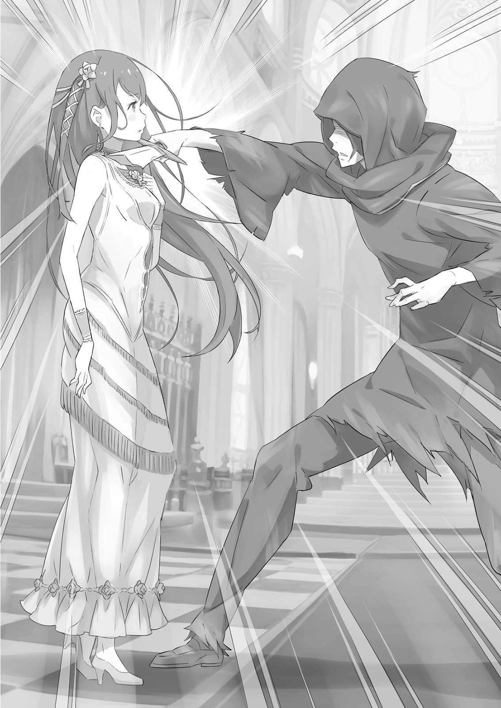

Прошли дни. Потом месяцы. Потом два года.

Многие отсчитывали эти два года со дня первой битвы Святой Меча. Лишь очень немногие посвященные знали, что на самом деле всё началось за несколько недель до этого.

Демон Меча исчез, и, словно заняв его место, взошла звезда Святой Меча. Одна девушка, возлюбленная бога меча, совершила то, чего не смогла целая армия: она положила конец Войне с полулюдьми, на которую королевские войска потратили почти десять лет, и принесла мир королевству.

Альянс полулюдей продолжал партизанское сопротивление, но клинок Святой Меча смог искоренить даже желание отомстить за Валгу Кромвеля. В конце концов, возможно, полулюди обнаружили, что подняли кулак, но им больше некуда было его опустить.

Альянс полулюдей потерял тех, кто возглавлял его в начале войны; они продолжали сопротивляться по инерции идей своих лидеров. Святая Меча просто устранила любую причину продолжать двигаться по этой инерции.

Последовали переговоры между Гионисом Лугуникой, нынешним королем, и Крагреллом, представителем фракции полулюдей. Таким образом, Война Полулюдей, терзавшая королевство долгие девять лет, закончилась поразительно мирно.

— Вы выглядите потрясающе, леди Терезия.

Терезия ван Астрея переоделась в парадный наряд, и Кэрол не смогла сдержать возгласа. Рыжие волосы Терезии теперь доставали до бёдер. Её глаза по-прежнему были голубыми, как безоблачное небо, а кожа — почти полупрозрачно бледной. Она была воплощением неотразимой красоты, что вполне подобало госпоже Кэрол.

— Спасибо, Кэрол. Твоё платье тебе тоже очень идёт. Снова эта лёгкая улыбка. Кэрол была одета почти так же нарядно, как и Терезия, и, хотя она была благодарна за слова похвалы молодой женщины, в её сердце жило одиночество, отделявшее её от своей госпожи.

Сегодня должна была состояться церемония в честь окончания войны, где Терезия была почетной гостьей. Она положила конец бесконечному конфликту между людьми и полулюдьми. Весь мир должен был узнать Терезию, Святую Меча, воплощение надежды человечества.

Этот день вызвал у Кэрол бурю эмоций. Она также гордилась, конечно — не могло быть большей чести, чем служить Терезии в качестве её служанки.

Простой народ был безмерно очарован Терезией. Казалось, все, кто мог добраться до столицы, заполнили замок, пытаясь хоть мельком взглянуть на неё. Это было безошибочным доказательством того, что госпожу Кэрол действительно признал и принял мир.

— …

И всё же в профиль лицо Терезии, так красиво накрашенное, лишь подчёркивало хрупкость этого мира. Кэрол знала причину, и именно поэтому её эмоции были так смешаны. Она знала, почему и ради кого на самом деле сражалась Терезия. Она знала, как долго её госпожа мучилась из-за своего дара и как она отбросила всю эту боль, чтобы взяться за оружие и сражаться как Святая Меча перед любимым мужчиной. И Кэрол знала, как после этого разбилось сердце Терезии, когда они расстались.

Как чудесно было видеть, как Терезия расслабляется среди этих цветов и влюбляется. Кэрол знала всё это. И это лишь усиливало её боль.

— Завидую тебе, Триас.

Он занимал глубокое место в сердцах и её драгоценной госпожи, и мужчины, о котором она сама заботилась. То, что его сегодня здесь не было, безмерно её огорчало.

Возможно, Терезия остановилась на полпути из-за сильного присутствия этой женщины. Они шли из гардеробной в зал для церемоний, и их ждала женщина с волосами цвета индиго и разноцветными глазами.

Женщина улыбнулась и легко подошла к Терезии. — Так вот она, героиня, о которой все говорят, та, что положила конец гражданской войне… Понятно. Вы и впрааавду само воплощение цветущей красоты. Но боюсь, вам кааажется чего-то не хватает.

— …

— Мииир вот-вот встретит Святую Меча. Наверняка она должна нести клинок? — Она говорила почти дразнящим тоном, но протянула меч — церемониальный клинок в белых ножнах.

— Ты…

— Та, кому сейчас представляться нет нужды. Хотя, признаюсь, я ооочень много о вас знаю. И исходя из этого, советую вам взять это.

— …

— Не беспокойтесь о том, подойдёт ли он к вашему платью. В мире есть вещи поважнее. И в любом случае… я думаю, что именно вы всегда будете выглядеть лучше всего с мечом.

Один из двух разноцветных глаз подмигнул. Терезия на мгновение заколебалась, затем взяла предложенное оружие.

— Вот и хорошо, — сказала женщина. — Ну же. Я просто чуууточку любопытна.

Словно объявив, что её дело сделано, она больше ничего не сказала и ушла прочь от церемониального зала. Терезия подумала окликнуть её, но в конце концов лишь проводила взглядом. Зал был переполнен людьми, съехавшимися со всей страны, чтобы увидеть Святую Меча. Она едва ли могла разочаровать всех этих людей из-за простой личной прихоти.

«Это весьма добродетельно, но в то же время и дурная привычка. Время от времени не помешало бы сделать что-нибудь эгоистичное, как он».

Терезии показалось, что она услышала голос женщины, хотя это было невозможно. Затем она пошла дальше. Она дошла до конца коридора, откуда открывался вид на зал. На неё нахлынул жар толпы.

«Вот я и помогла немного своей сопернице в любви. Я прям вижу, как он хмурится из-за этого пряяямо сейчас».

Терезии снова показалось, что она услышала голос женщины, звучавший одновременно и весело, и грустно.

Церемония прошла так гладко, как только можно было надеяться. Сначала в толпе пронесся ропот, когда Святая Меча появилась с церемониальным клинком. Но когда Терезия прошла по залу, удивление исчезло, сменившись полным обожанием перед двойственным присутствием девушки и её меча. Даже сам король был покорён стройной девушкой, скрывающей исключительную силу, настолько, что почти забыл, что он здесь для вручения награды, и лишь застыл, зачарованный.

С течением вечера все отмечали, что каждое её движение таило в себе красоту и изящество цветка. Они видели, насколько она драгоценна и как грубая и воинственная сталь ей не подходит. Эту девушку нельзя заставлять владеть им. Её профиль, казалось, намекал на её мягкую и нежную натуру, и что всё, чего она хотела, — это любоваться красивыми цветами.

— …

Затем Терезия подняла взгляд. Она преклонила колени, чтобы получить награду от короля, но теперь поднялась и обернулась.

Тёмная фигура медленно вошла в зал, разрезая лихорадочный энтузиазм толпы. Другие в зале проследили за взглядом Терезии и онемели, увидев его. Он был одет с головы до ног в грязную коричневую накидку, жалкое зрелище. Грязь и кровь, прилипшие к его коже, создавали впечатление, что он давно не мылся. Его внешний вид был практически рассчитан на то, чтобы вызвать презрение у тех, кто его видел.

Но не это заставило людей замолчать. Скорее, это была обнаженная сталь в его руке и всепоглощающая аура битвы, которую он излучал.

— …

Стражники, расставленные в зале, начали двигаться, но сама Терезия остановила их. Пока закутанная фигура шла к ней, Терезия сама начала сокращать расстояние. Наконец, она смотрела на него с возвышения, дозволенного только участникам церемонии, а он смотрел на неё снизу, у подножия платформы.

— …

Прекрасный белый священный клинок поднялся. Параллельно ему поднялся ржавый и тупой меч. А затем, словно по сигналу и без единого звука, они бросились друг на друга.

Многим в зале показалось, что в этот момент оба бойца стали невидимыми. Но звон стали о сталь удерживал их внимание.

Этот танец мечей разворачивался со скоростью, которую глаз обычного человека никогда не смог бы уловить. Вспышки клинков стали неразличимы, их столкновение — подобно музыке, и в конце концов люди начали плакать. Они не могли видеть бой и едва могли его слышать; они были просто ошеломлены.

Тогда каждый из присутствующих отрёкся от того, что чувствовал раньше — что меч не подходит Терезии ван Астрея. В этой битве они увидели красоту стали, то, что она достойна почитания, как преданность ей заставляет человека сиять. Кто бы мог подумать, что меч может научить других красоте?

— …

Что касается тех немногих, кто мог следить за происходящим, то увиденное их поразило. Укол и парирование, скрещенные мечи, смена стоек — и Терезия, и её противник находились на пике фехтовального мастерства.

То, что Святая Меча была такова, имело смысл. Многие из них участвовали в гражданской войне и видели её способности собственными глазами. Но кто был тот, кто атаковал её почти на равных?

Святая Меча приказала солдатам держаться подальше, и король также приказал им не вмешиваться. Они повиновались, наблюдая молча, но задавались вопросом, не должны ли они сделать больше. Кто был этот враг? Какой-то получеловек-экстремист, выступающий против окончания войны? С другой стороны, и люди не были едины. Возможно, это был кто-то, недовольный прекращением военных действий.

Если так, то они должны были это остановить. Но было ли это вообще возможно? Никто из солдат не смог бы вмешаться в столь высокоуровневый бой.

— …

Они видели лицо Святой Меча, пока она безостановочно орудовала своим церемониальным клинком, её атаки обрушивались подобно шторму. Будем предельно ясны: никто не мог остановить эту влюбленную девушку. Её глаза были влажными, щеки раскраснелись, и каждый обмен ударами приносил Святой Меча счастье, пока она сражалась.

Её волосы были подобны трепещущему пламени, глаза — безоблачному небу; прекрасная и нежная возлюбленная бога меча сияла от радости. Эта битва с демоническим мечником перед ней сияла ярче всего на свете. Это была самая опасная встреча в истории, и она наслаждалась ею в полной мере.

— …

Среди тех, кто был близок к Святой Меча, те, кто также знал Демона Меча, чувствовали, как трепещут их души. Всё, что они хотели увидеть, всё, что они хотели знать, было здесь, в этот момент. Человек, который изо всех сил пытался стать мечом, которого называли демоном — что он нашёл в конце своего пути? На что он теперь решился?

— …

Их мечи сверкали, пока вспышки не слились воедино; множество ударов стали одним ударом, создавая звук, оставивший мир позади. Это было почти как музыка — песнь мечей, рождённая встречей высочайшей техники и отточенной стали, песнь, порождающая безграничные эмоции. Все были пленены, пока песнь любви этого застенчивого юноши и девушки беззастенчиво разыгрывалась перед ними.

— …

Но даже самый прекрасный голос должен в конце концов сделать вдох, и наступил конец. Битва закончилась, хотя можно было бы пожелать, чтобы она длилась вечно.

— …

Звук ломающейся стали, больше не способной выдерживать интенсивные удары, расколол зал, словно гром. Красновато-коричневый клинок сломался пополам, обломок закружился в воздухе. Здесь, в конце их битвы, в конце встречи двух фехтовальщиков, священный клинок Святой Меча —

— Я…

— …

— Я победил.

Святая Меча быстро спустилась с возвышения, её шаги были слышны. Единственным оставшимся мечом был превосходный, наполовину сломанный тупой клинок в руке демона. Его зазубренное остриё было у бледного горла Святой Меча, и все присутствующие поняли.

Святая Меча проиграла.

Она была неопровержимо свергнута с вершины владения мечом.

Им потребовалось мгновение, чтобы заметить кое-что ещё. Девушка, которая всё ещё стояла там, уронив свой меч. Она была ни больше ни меньше, как прекрасная влюблённая молодая женщина.

— Ты слабее меня. У тебя больше нет причин владеть мечом.

Кто мог сказать такое Святой Меча, девушке, покорившей высочайшие вершины владения мечом?

Только тот, кто мог показать ей любовь большую, чем бог меча.

Сколько же усердия он вложил, чтобы достичь этого?

— Если я не буду владеть мечом… то кто?

— Я унаследую твою причину носить меч. Ты станешь моей причиной для этого.

Сколько сотен, сколько тысяч или десятков тысяч, сколько бесчисленных неудач и провалов пришлось пережить этому мечнику? Сколько битв он должен был пройти, чтобы заслужить это право?

Этот крайне неловкий оратор откинул капюшон. У появившегося юноши было серьёзное выражение лица, но волосы его были растрёпаны, лицо покрыто грязью, а взгляд — суров.

— Какой же ты ужасный. Обращаешь в ничто чужие решения и решимость…

— Всё то, что, по-твоему, я обращаю в ничто, я заберу у тебя. А ты забудь, что когда-либо держала меч, и живи мирной жизнью. Ты могла бы… Ах, да. Возможно, ты могла бы выращивать цветы. Но только в мире, под моей защитой.

— Под защитой твоего меча?

— Верно.

— И ты будешь так добр, чтобы защитить меня?

— Буду.

Его заявление прозвучало без компромиссов и колебаний. Он не отступил бы, даже если бы сам бог меча выступил против него. Его решимость одной лишь собственной силой стащила эту прелестную юную леди с трона Святого Меча.

— …

Безмолвно Терезия положила ладонь на плашмя выставленный клинок и шагнула вперёд. Они оказались достаточно близко, чтобы соприкоснуться, чтобы почувствовать дыхание друг друга. Глаза Терезии наполнились слезами от нахлынувших чувств, и она начала одновременно улыбаться и плакать. А затем, сквозь улыбку и слёзы, она произнесла то, что всегда говорила при их встречах.

— Тебе нравятся цветы?

— Я понял, что они мне не противны.

«Потому что ты рядом с ними. Потому что на том цветочном поле я встретил тебя».

«Потому что они — это мир, который ты любишь, красота, к которой ты стремишься».

— Почему ты владеешь мечом?

— Чтобы защитить тебя.

«И потому что ты — семя моего мира».

Медленно они приближались друг к другу, расстояние между ними сокращалось, пока не исчезло совсем.

Они чувствовали жар друг друга, и пыл их поцелуя мог расплавить даже сталь.

Первый вопрос, который она задала, когда их губы разомкнулись, заставил его так сильно смутиться, что он едва смог ответить.

— Ты любишь меня?

— Разве не видно?

Танец, встреча и, наконец, поцелуй — всё закончилось.

Кэрол, поглощённая танцем, ставшая свидетельницей встречи и наблюдавшая за поцелуем, не сдерживая слёз, рыдала. Перед ней предстало истинное лицо Терезии — то, которое она уже отчаялась когда-либо снова увидеть.

«Смотрите», — хотелось воскликнуть ей. «Посмотрите на это», — хотелось крикнуть ей. Ей хотелось, чтобы весь мир узнал, насколько добра эта девушка, узнал, что, взяв в руки меч, она становилась сильнее кого бы то ни было, но всё равно оставалась доброй. Кэрол хотела, чтобы все увидели: в присутствии любимого мужчины Терезия была всего лишь милой и заботливой девушкой.

— …

Гримм подошёл к ней. Он тоже наблюдал за объятием, щурясь, словно глядя на яркий свет.

Внезапно Кэрол нахлынуло воспоминание. Разговор, который состоялся у них двоих ещё до того, как Гримм потерял голос. Каким-то образом речь зашла о «том мужчине», и Кэрол яростно его критиковала.

— Хмф. Прозвище вроде «Демона Меча» позорно для мечника. Если его можно спутать с демоном, значит, в его жизни есть что-то искажённое!

Гримм рассмеялся. — Ты определённо беспощадна, Кэрол. Полагаю, не могу отрицать твои слова. Но…

— Но что?

Смеясь, он выглядел довольно слабовольным, но всё же возражал ей. Она вопросительно посмотрела на Гримма. Его ответ прозвучал с вымученной улыбкой, но с настоящей уверенностью.

— Возможно, первым, кто назвал Вильгельма Демоном Меча, был я. Когда я увидел, как он сражался с полулюдьми на Кастульском поле, я был так напуган этим, что именно так его и назвал.

— И что в этом плохого? Это определённо описывает его поведение на поле боя…

— Правда, он действительно похож на демона, когда сражается. Согласен, это подходит. Но… — Он почесал щеку. — Он мечник, который сражается как демон, поэтому мы зовём его Демоном Меча. Но мне кажется, мы просто констатируем очевидное.

— Что ты имеешь в виду?

— Может быть, когда ты по-настоящему посвящаешь себя чему-то, бывают моменты, когда приходится становиться демоном… Может быть, Вильгельм кажется нам таковым просто потому, что он так целеустремлён. Я не знаю никого другого, кто выглядел бы так ужасно во время боя. Я не знаю никого другого, кто так серьёзно относился бы к своей жизни.

Его голос был тихим, но страстным. Кэрол почувствовала укол ревности. Неужели это оно? Неужели именно поэтому она так невзлюбила «того мужчину»?

— Может быть, «Демон Меча» — действительно подходящее для него имя, — сказал Гримм. — Вильгельм абсолютно предан мечу, совершенно серьёзно относится к своей жизни, и именно поэтому мы его так зовём. И я уверен, это потому, что—

— Демон Меча! Демон Меча Вильгельм Триас!

Даже когда Терезия просила его сердце, даже когда он отводил от неё взгляд, кто-то выкрикнул его имя — имя, которого он не слышал, казалось, очень давно. Вильгельм обернулся.

В тот же миг чары, окутавшие зал, рассеялись, и все присутствующие солдаты и военные пришли в себя.

— Вильгельм, ты здоровенный, разъярённый идиот!

«— Р-р-р!»

Среди солдат, бросившихся к нему, он увидел знакомую громоздкую фигуру и юношу, и его плечи расслабились. Он не собирался сопротивляться. Но мысль о том, что будет дальше, вызвала у него глубокую усталость. Настолько сильную, что он подумывал просто сбежать с Терезией и исчезнуть вдали.

— Послушай-ка! — Пока он обдумывал эту возможность, Терезия надула щёки, всё ещё держась за него. Она была женщиной, которая полностью отдавалась всему, что делала — смеялась ли, кричала или дулась, — и оставалась всё той же девушкой, очаровавшей его на том цветочном поле. — Есть вещи, которые хочется услышать вслух!

— А-а-ах, — простонал Вильгельм, понимая, что она всё ещё пытается продолжить их предыдущий разговор. Ему было крайне неловко выражать свои истинные чувства словами. Хотя можно было бы усомниться, как он мог оставаться таким сдержанным после того, как только что поцеловался на глазах у всего зала.

— …

Через секунду он покачал головой. Он не мог отказать ей в прямой просьбе.

Вильгельм глубоко вздохнул и снова повернулся к Терезии, наклонившись к её уху. Её лицо покраснело, глаза наполнились ожиданием. У него перехватило дыхание от её прелести, и слова застряли в горле.

Наконец он сказал: — Скажу тебе как-нибудь, когда будет настроение.

Впервые в жизни Демон Меча струсил.

И вот история подходит к концу.

История об узах, выкованных посреди гражданского конфликта нации — Войны с полулюдьми.

История о днях, когда один мальчик, очарованный красотой меча, посвятил себя благородству стали.

О том, как этот мальчик стал юношей, как встретил молодую девушку и обрёл любовь, которой никогда не смог бы достичь с помощью меча.

О Демоне Меча, мужчине, оказавшемся перед женщиной, которая когда-то желала быть мечом, который жил с такой самоотдачей, что его называли демоном, и который, пройдя через пыл жизни, стал человеком.

О девушке, Святом Меча, возлюбленной бога меча, превзошедшей всех остальных, которой юноша вернул её прежнее «я» — влюблённую девушку.

Обо всём этом повествует скромная песнь любви Демона Меча.

История любви, от которой кружится голова от страсти, роман, пылающий в сердце.

Люди называют её «Песнь любви Демона Меча».

Это не более чем она, и не менее.

《Конец》
