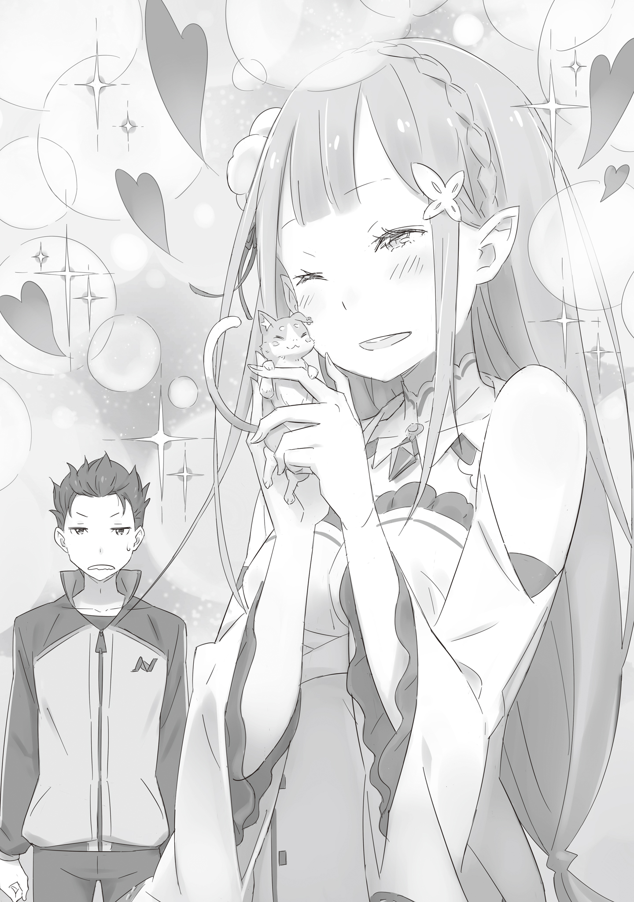

— В последнее время мне кажется, что Лия смотрит на меня как-то холодно, — скрестив лапки с серьёзным видом, Пак произнёс это, паря прямо перед лицом Субару.

Поместье Розвааля. Утро, сразу после завтрака.

Уборкой со стола занималась Рем, а Субару, получив от Рам поручение, направлялся чистить купальню в подвале особняка.

Он как обычно обменялся любезностями с Эмилией, перекинулся парой слов с Беатрис и уже вышел из столовой, когда его окликнул тот самый Пак.

— Раньше Лия безоговорочно верила всему, что я говорил, и её так легко было обмануть, а в последнее время она стала менее беззащитной, что ли. Субару, ты как думаешь?

— Для начала, мне стало тревожно доверять тебе Эмилию-тан.

Полное отсутствие злого умысла делало ситуацию ещё хуже. Потеряв всякое желание воспринимать его всерьёз, Субару направился к купальне, но Пак, ничуть не смутившись, последовал за ним, кружа у самого затылка.

— Эй, эй, выслушай меня серьёзно. Я не шучу, это очень серьёзный вопрос.

— Ладно, тогда и я отвечу тебе в какой-то степени серьёзно. Может, ты вёл себя как такой несносный шкодливый кот, что она, как хозяйка, загорелась идеей тебя воспитать?

— Вот ещё! Я сейчас не в настроении для таких шуток. Какая грубость, — недовольно надув щёки, Пак легонько похлопал Субару по голове хвостом.

Однако Субару вовсе не шутил по большей части, он говорил серьёзно.

Чем же Пак занимался, когда действовал в одиночку? Субару и Эмилия выяснили это совсем недавно. Его поведение было точь-в-точь как у домашнего кота, и Эмилия, которая искренне верила, что Пак вносит свой вклад в спасение мира, была глубоко шокирована.

— А ведь до этого Эмилия-тан так наивно верила, что её родитель занимается важной работой…

— Не говори так, Субару. Не бывает работы важной или неважной. Любой труд достоин уважения. А если ты так выражаешься…

— Труд-то любой достоин уважения, но то, чем ты занимался, — это не работа! Это инстинкты!

Субару повысил голос на наглеца Пака, снял в раздевалке куртку, закатал штанины и со шваброй в руке вошёл в купальню. И тут же привычными движениями принялся за уборку.

— И всё же… я беспокоюсь за Лию. Может, она устала из-за того, что обстановка вокруг сильно изменилась.

— Мне кажется, главной причиной её усталости в последнее время была твоя истинная натура.

— Ох-ох… Какая досада, когда главный источник беспокойства сам этого не осознаёт.

Два источника головной боли перекладывали ответственность друг на друга, но поскольку виновницы торжества, — Эмилии, здесь не было, вынесение вердикта откладывалось. И тут Пак, словно его осенило, хлопнул в ладоши.

— Хм-м?

— Может быть, это переходный возраст?.. Если так подумать, то многое сходится!..

— Сходится?

— Возможно, в последнее время нам с Лией не хватало телесного контакта. В последнее время Лия была занята, да и я думал, что ей пора бы отдалиться от родителя, и помалкивал… Но так не пойдёт!

— Да не ей от тебя, а тебе от неё пора бы отдалиться. Хотя ты ещё до этого начал терять рассудок и превращаться обратно в кота. Причём не в бродячего, а в домашнего, — закончив мыть пол, Субару окликнул его, но Пак и слушать не хотел.

Покачав головой при виде задумавшегося духа, Субару указал на воду в ванне.

— Эй, Пак. В качестве платы за консультацию, ополосни пол вот этой водой. Это куда быстрее, чем таскать её ведром. Ты ведь можешь такое провернуть?

Хоть и витая в облаках, Пак откликнулся на просьбу Субару, протянул лапку к ванне и сконцентрировал магическую силу. И тогда — вот она, мощь Великого Духа — вся вода из ванны поднялась в воздух и зависла посреди купальни.

— Ого! Круто! От такого зрелища дух захватывает!

Эта вода выглядела как желе, покрывшись рябью, буквально плыла по воздуху. Оставалось лишь медленно опустить её на пол, и просьба Субару была бы выполнена.

Однако…

— …Да, точно. Нам с Лией не хватает общения между родителем и ребёнком!

— А.

— Э-э-э?!

В тот миг, когда мысль Пака пришла к какому-то умозаключению, его контроль над водой ослаб.

Освободившаяся вода тут же обрушилась на купальню всей своей массой. Бурный поток подхватил Субару за пояс, перевернул его и увлёк за собой в мутные воды.

— Пфха! Эй! Да тут не то что трусы, тут всё промокло до нитки! — его затянуло обратно в ванну, и Субару, вынырнув, закричал, отряхивая голову.

Но виновник уже исчез из купальни, и крик лишь гулко отразился от стен.

И вот, когда Субару остался один, промокший до нитки…

— Что-то ты больно расшумелся, Барусу. Решил побаловаться, пока никто не видит?.. — это была Рам, открывшая дверь раздевалки и заглянувшая внутрь.

Она прищурилась, глядя на сидящего в ванне мокрого Субару, и глубоко вздохнула.

— Неужели так хотелось выпить воду оставшуюся после купания, что ты пошёл на такие ухищрения? Извращенец.

— Я ещё не достиг такого уровня просветления!!!

Да и вообще, в этой воде уже побывали и Субару, и Розвааль, да и меняют её каждый раз.

— …А впрочем, думал я о таком всего раз или два.

После инцидента в купальне Субару, снося презрительный взгляд Рам, переоделся.

Одежда слуги промокла насквозь, так что теперь он был в своём обычном спортивном костюме. Потрогав влажные волосы, Субару шёл по коридору и размышлял, как бы проучить Пака.

— Вот же гад, устроил такое и сбежал. Найду, просто так это не оставлю…

С такими мыслями он подошёл к лестнице.

Вдруг сверху на лестничную площадку что-то упало.

— О?

Ударившись о стену, к ногам Субару подкатился маленький мячик. Пока он недоумённо смотрел на него, с лестницы раздался голос.

— А, Субару.

Это была Эмилия.

Пока он стоял, недоумённо склонив голову с мячом в руке, сверху показалась Эмилия. Увидев мяч в руках Субару, она смущённо свела свои изящные брови.

— Прости. Напугала тебя, наверное.

— Да не то чтобы, но… это твой, Эмилия-тан?

— Мой, точнее, это Пака… Впрочем, неважно. Можешь отдать ему? Я сейчас занята.

— Да, конечно… Ого.

Эмилия торопливо бросила эти слова, похлопала парня по плечу и спустилась ниже. Субару нашёл её непреклонный тон необычным, но тут появился…

— Суба-а-ару…

— И чего ты хочешь с таким жалким видом и голосом? Эмилия-тан сказала, что занята.

Слабо покачиваясь, Пак подлетел к Субару. Тот подхватил его левой рукой. Пак с несчастным видом уставился на мяч в правой руке Субару.

— А, это ты его подобрал… К сожалению, операция «Коммуникация» провалилась. И это несмотря на твой совет, Субару. Не вышло.

— С каких это пор это стало моей идеей? Что ты вообще пытался сделать? Неужели это был тот самый «телесный контакт» в стиле «апорт», когда Эмилия-тан бросает мячик, а ты его приносишь?

Если так, то это общение не иначе как хозяина с питомцем. Причём не с котом, а с собакой. Пак сердито прижал ушки.

— Нет же! Когда говорят о времяпрепровождении родителя и ребёнка, на ум сразу приходит кэтчбол*, не так ли? Я думал, мы укрепим наши узы, болтая о чём-то вроде: «Лия, кем ты хочешь стать, когда вырастешь?».

( Кэтчбол — популярная в Японии игра, в которой два человека перебрасывают друг другу бейсбольный мяч.)

— Ты, наверное, не поймёшь, но что за замашки из эпохи Сёва*?! И вообще, ты же знаешь, кем хочет стать Эмилия-тан! Королевой этой страны!

(Эпоха Сёва (1926–1989) — период в истории Японии, с которым часто ассоциируются определённые культурные клише, в том числе образ отца, играющего в кэтчбол с сыном.)

— Не-не, на самом деле Лия хочет стать… Ой, кажется, для этого ещё рановато.

— Говори.

— Как многозначительно! Да нет, не надо мне такого!

После таких обменов репликами начинаешь сомневаться, а всерьёз ли он хочет наладить отношения. Впрочем, судя по поникшим ушам и хвосту, Пак и впрямь был не на шутку расстроен.

— Ну, если в ваших с Эмилией-тан отношениях пойдёт трещина, то в решающий момент вы можете действовать неслаженно. Это будет проблемой.

— Угу… И поэтому я придумал следующий план. Возможно, Лия просто привыкла к моему очарованию? Поэтому я решил вернуться к истокам и попробовать действовать ещё более… мило и расчётливо.

— Это ты о чём?

— Так ты же сам сказал «говори».

— Я сказал «говори», потому что ожидал услышать что-то дельное!

Придя к столь странному выводу, Пак плавно взмыл с руки Субару. Он пролетел через лестничную площадку и направился в коридор с комнатами для гостей, а черноволосый парень машинально последовал за ним.

Дух выбрал одну из комнат и, остановившись перед дверью, решительно обернулся к Субару.

— Сейчас я буду здесь тренироваться, чтобы превзойти себя в прошлом. И не пытайся меня остановить.

— И не собирался останавливать или подглядывать, но всё, что было до этого, полнейшая чушь.

— …Вперёд, чтобы вернуть наши семейные узы и снова стать семьёй.

— Только слова и звучат круто.

Источая меланхолию, Пак вошёл в комнату. Субару проводил его взглядом до тех пор, пока дверь не закрылась, и, хоть и обещал не подглядывать, всё же приложил ухо к двери, чтобы послушать, что происходит внутри.

— …Нян! Ня-нян, мя-у-у~

Услышав звуки подобной «тренировки», Субару глубоко вздохнул.

И, ничего не сказав, отошёл от двери, чтобы закончить оставшуюся работу, волоча за собой ужасно уставшее тело, хотя ещё даже не было полудня.

— Субару, уже почти время для перерыва, да? Не хочешь выпить чаю?

Он как раз закончил последнее утреннее дело — уход за садом — и убирал инструменты, когда в сад заглянула Эмилия и с такими словами проявила заботу о Субару.

— О, приглашение от самой Эмилии-тан! Какая радость! Неужели мои ежедневные старания наконец-то принесли плоды?

— …? Не совсем понимаю, но раз уж ты так стараешься, то было бы хорошо, если бы они принесли плоды.

— По твоему ответу я понял, что старался ещё недостаточно. Спасибо. — Криво усмехнувшись ничего не понимающей Эмилии, Субару вымыл руки и присоединился к ней.

— Пойдём в мою комнату.

И по пути на верхний этаж особняка она вдруг заговорила:

— Пак не доставил тебе каких-нибудь хлопот, Субару?

— Ещё как доставил, но тебе не о чем беспокоиться, Эмилия-тан. Конфликты с приёмным отцом — это мужская доля… Но если честно, я немного расстроился.

— Всё-таки, наверное, это потому, что я слишком строга с Паком.

— О, так Паку не показалось, — Эмилия сделала такое серьёзное лицо, что Субару почесал в затылке.

Похоже, это были не домыслы Пака — Эмилия и вправду вела себя так осознанно.

— А можно спросить, почему?

— Это… Ну, может, я немного дуюсь. Я думала, что Пак более ответственный, а после того случая у меня просто руки опустились.

— А-а, значит…

Всё, от причины до последствий, развивалось ровно так, как и предполагал Субару, и он приложил руку ко лбу. Но тут же, улыбнувшись обеспокоенной Эмилии, он продолжил:

— Ничего страшного. Я понимаю твои чувства, Эмилия-тан, и иногда такая встряска полезна. Если это скажет кто-то другой, толку не будет, так что пусть лучше он немного погрустит.

— Думаешь?.. Да, наверное, ты прав. Паку тоже нужно немного задуматься над своим поведением.

— Вот это настрой! Хотя, если честно, то его поведение и впрямь было так себе…

У Субару не было иного выбора, кроме как поддержать Эмилию. Пак сам навлёк на себя все беды. Ему следовало как следует всё обдумать и погрустить в одиночестве.

Слова Субару, казалось, успокоили Эмилию, и тревога на её лице немного улеглась. Наконец они дошли до её комнаты. Войти внутрь, выпить чаю и…

— Ну что ж, Субару. Я уже всё приготовила для чая…

— …Мяу-у-ун.

Войдя в комнату, Эмилия замерла. Её взгляд был устремлён прямо, в центр комнаты, откуда и доносилось это заискивающе-сладкое мяуканье.

Субару нахмурился от этого звука и заглянул в комнату из-за плеча Эмилии.

И тут…

— Ня, ня. Ня. Ня-ню-няу…

Там, кокетливо виляя длинным хвостом и сверкая круглыми, влажными глазками, танцевал маленький котёнок.

Пушистая шёрстка, подрагивающие ушки и жалобное мяуканье — всё это было сладкой ловушкой, взывающей к первобытному человеческому инстинкту защищать. Это была доведённая до совершенства, ультимативная милота домашнего кота.

— Пак… — голос Эмилии дрогнул при виде Пака.

— Ня-ко-а, ню-ню…

Если вспомнить их недавний разговор, то её реакция на забывшего свою дикую натуру Пака была очевидна.

Однако…

— Ой, какой же Пак миленький!.. Что с тобой случилось? Какой хорошенький!.. — Эмилия, окончательно сражённая его кокетством, с покрасневшими щеками подхватила Пака на руки.

Она тут же принялась тереться о него щекой, и от её недавних выводов и твёрдой решимости не осталось и следа.

— Ня-я… Помиримся?..

— Помиримся? Да, конечно, помиримся. Ой, какой же ты милый, Пак. Прости, что я так упрямилась, — Эмилия без всяких колебаний ответила на его просьбу, произнесённую нежным голоском.

Пак победоносно вскинул кулачок в сторону Субару, наблюдавшего за этой сценой с отсутствующим выражением лица. Его вид так и говорил: «Благодаря тебе всё получилось», хотя это была чистой воды клевета.

Как бы то ни было…

— Если домашний кот совсем распоясался, значит, проблема в воспитании со стороны хозяина… — пробормотал Субару сдавшимся голосом, глядя на воссоединение Эмилии и Пака.

Он подумал, что их игры, вероятно, не закончатся, пока не остынет чай.

…И в действительности их умилительные забавы не прекратились до самого обеда.

《Конец》
