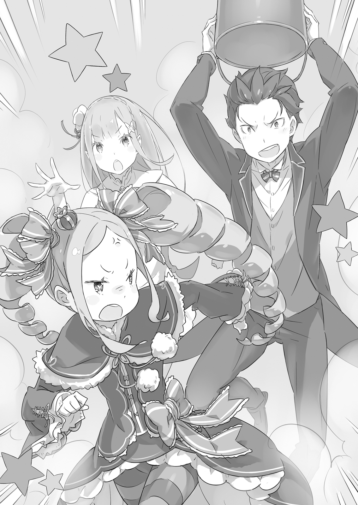

…Всё началось однажды после обеда, когда повседневные дела в особняке подошли к концу.

— …Эй, Субару, можно тебя кое о чём попросить?

— М-м?

Услышав внезапно раздавшийся звонкий голос, Субару обернулся, держа в зубах печенье.

У входа в столовую стояла прекрасная девушка в белом одеянии — это она его и позвала.

Перед ним была полуэльфийка Эмилия.

Её длинные серебряные волосы сияли, словно лунный свет, а аметистовые глаза сверкали, как драгоценные камни.

Её красота была поистине неземной.

— А, может, ты ещё работаешь? Я не помешаю?

— Да нет, у меня перерыв. Вряд ли хоть в одной стране разрешено работать, уплетая печенье.

Проглотив остатки печенья, Субару улыбнулся обеспокоенной девушке.

Эмилия с облегчением выдохнула, и Субару, заметив у неё в руках нечто странное, удивлённо поднял бровь.

Это была люлира — музыкальный инструмент из этого мира, воспоминания о котором были ещё свежи…

— Люлира, верно? Я думала, она пылится где-то на складе, — заметила девушка в форме горничной, отдыхавшая в той же комнате.

Коротко стриженные синие волосы, форма, переделанная в довольно откровенный наряд, — это была коллега Субару, старшая горничная Рем, непревзойдённая мастерица на все руки, отвечавшая за всю работу по дому.

Печенье, которое ел Субару, тоже испекла она, и сейчас они вдвоём наслаждались чаем во время перерыва.

— Если Лилиана её не забыла, то это та самая пыльная люлира?

— Уж она-то свои инструменты не оставит… Наверное.

— Да уж, твоя неуверенность красноречиво говорит о доверии к Лилиане.

— Не смейся. …Из-за этой истории с Лилианой Розвааль, похоже, от нечего делать привёл люлиру в порядок. И предложил мне попросить Субару сыграть что-нибудь, чтобы я немного отвлеклась от учёбы.

— И поэтому выбор пал на меня. Роз-чи на удивление догадлив.

Взяв люлиру, которую Эмилия робко протягивала, Субару легонько тронул струну.

По комнате разнёсся чистый звук — похоже, инструмент и вправду был в полном порядке.

Люлира — это деревянный струнный инструмент, похожий на гитару из его мира.

Она была чуть меньше, но стоило привыкнуть, и звук становился почти неотличим.

— Субару-кун, ты умеешь играть на люлире? — удивлённо спросила Рем, глядя, как Субару со знанием дела проверяет инструмент.

— Ага. Она почти не отличается от акустики, которая была у меня дома. Да и Лилиана меня немного подучила, так что большинство фолк-песен с моей родины я сыграю.

— А-ко-ги?..

— Сокращённо от «акустическая гитара». Ну, считай, что это такой народный инструмент на моей родине.

Ответив Рем, Субару вспомнил смуглую девушку-барда, которая до недавнего времени гостила в особняке Розвааля.

Она зарабатывала на жизнь пением, и её голос и мастерство игры были великолепны.

Не только все девушки в особняке, но и сам Субару стал её тайным поклонником.

Впрочем, несмотря на гениальный музыкальный талант, как человек она была, прямо скажем, та ещё штучка.

Как бы то ни было, история с Лилианой благополучно завершилась, и в особняк вернулись мирные будни.

С тех пор прошло несколько дней, но восхищение Эмилии музыкой, похоже, не угасло.

Раз уж она пришла во время перерыва, чтобы попросить его сыграть, значит, ей это и вправду запало в душу.

— Значит, Субару-кун может сыграть и песни госпожи Лилианы?

— Если я сыграю то же самое, нас начнут сравнивать, так что лучше не стоит. К тому же играть-то я могу, а вот петь одновременно — уже сложнее. В основном из-за голоса.

— Но Субару-кун всё равно молодец! Когда дело доходит до навыков, бесполезных для работы в особняке, Рем даже представить не может, на что ты способен!

— Хе-хе-хе, да не то чтобы… Стоп! Что-то тут не так! Меня ведь сейчас не похвалили, да?

— …?

Рем, сложившая руки в знак восхищения, удивлённо посмотрела на него, не осознавая своей язвительности.

Это было мило, но от этого её слова казались ещё более искренними и ранили Субару в самое сердце.

Но две девушки смотрели на него с надеждой.

Он хотел произвести на них хорошее впечатление.

— Ну что ж, «Песнь Любви Демона Меча»… это слишком сложно, так что пусть будет попурри из фолк-музыки семидесятых.

— Э-э-э…

— Не «э-э-э», это тоже шедевры.

Криво усмехнувшись на разочарованный возглас, Субару постучал пальцами по люлире, отбивая ритм.

Эмилия и Рем вместе сели на диван и принялись сдержанно хлопать в такт.

— Звук у люлиры повеселее, чем у акустики, но прошу восполнить разницу силой воображения.

Сказав это, Субару мысленно перебрал ноты и тронул струны.

В те дни, когда он без цели и смысла прогуливал школу, Нацуки Субару, ненавидя себя за бездействие, с головой уходил в освоение самых разных навыков.

Игра на гитаре была одним из них.

Кто бы мог подумать, что то бесполезное время обернётся возможностью порадовать двух красавиц.

Да, жизнь — непредсказуемая штука.

— …

Фолк-песни семидесятых отражали настроения той эпохи, и среди них было много довольно грустных песен о любви.

Даже без слов эта хрупкая атмосфера просачивалась в мелодию.

Он видел, как на лицах двух девушек, слушавших музыку, появлялись оттенки печали.

Субару, игравшему музыку, становилось неловко от такой реакции, и смотреть на их лица было мучительно…

— Секретная техника! Зубная гитара… А-да-да-да-да!

— С-Субару?! Что случилось?! Что за глупости!

— Субару-кун?! Зачем же ты такую глупость сделал!

— Могли бы и не говорить хором… И-хя-хяй, больно!

Пытаясь оживить меланхоличную мелодию эффектным трюком, он со всей силы врезался губами и дёснами в туго натянутые струны.

Виртуозный трюк «Зубная гитара» — это высший пилотаж, доступный лишь первоклассным гитаристам.

Разумеется, гитаристу-самоучке вроде Субару это было не по зубам.

Кровь, катастрофа.

— Так, успокойтесь, Субару-кун. Боль, боль, улетай…

— И-хя-хяй… не больно! Прошло! Ах, как же больно было, спасибо тебе.

Рем приложила руки к лицу корчившегося Субару и применила слабую исцеляющую магию.

Вместе с утихающей болью порезы от струн затянулись, и Субару был ей безмерно благодарен.

Глядя на это, Эмилия, уперев руки в бока, сердито нахмурилась.

— Я уж было подумала, ты что-то натворил, так напугал! Не заставляй меня больше переживать из-за таких пустяков!

— Прости, прости. Я просто понял, что с песней прогадал. Не то чтобы фолк семидесятых плох, просто я выбрал мелодию не под настроение, моя ошибка.

Раз уж играть, то лучше выбрать то, что доставит удовольствие слушательницам.

А фолк-песни лучше приберечь, чтобы подкатить к девушке, которая тебе нравится.

— Поэтому ту песню я оставлю для другого случая. Подожди немного, Эмилия-тан.

— …? Не понимаю, чего мне ждать, но хорошо. …Так что, выступление закончено? Это все песни, которые ты умеешь играть?

Подразумевалось, что она хочет послушать ещё, и Субару облегчённо вздохнул.

Несмотря на неудачный выбор песни, его игра, похоже, оправдала ожидания Эмилии.

Рем, судя по молчанию, была того же мнения.

Чем больше на него возлагали надежд, тем сильнее Субару стремился их оправдать.

— И надо же было мне тренироваться играть только фолк семидесятых! Почему я не разучивал более модные и популярные песни…

— Ты в затруднении, Субару-кун? Тогда, может, что-нибудь из песен госпожи Лилианы?

Рем подняла руку, словно предлагая блестящую идею Субару, проклинавшему свои прошлые решения.

В этом её своевременном предложении сквозила милая хитрость, что было очень трогательно.

Удивительно, но именно Рем больше всех интересовалась песнями Лилианы.

Будучи знатоком народных песен и преданий, она, вероятно, под видом предложения хотела заставить Субару спеть.

Субару и сам был очарован песнями Лилианы, но…

— У меня нет ни такого мастерства, чтобы подбирать чужие песни на слух, ни таланта, чтобы тягаться с Лилианой. Кроме фолка, я могу сыграть разве что простые мелодии… «Собачий вальс», например?

— Субару, за это нужно извиниться…

— Не делай такое грустное лицо, мне не по себе! Это была ошибка! Я не нарочно наступил, то есть, это название такое у песни! Я потом извинюсь перед тем, на кого наступили!

Традиционная фортепианная пьеса была забракована ещё на стадии названия.

Эмилия, осуждающе смотревшая на извиняющегося Субару, вздохнула.

Затем она хлопнула в ладоши и, лукаво улыбнувшись, прищурилась, словно что-то задумав.

— Ладно, если сыграешь песню Лилианы, я тебя прощу. Я не буду смеяться, даже если получится плохо, так что не волнуйся. Хорошо?

— Госпожа Эмилия права, Субару-кун. Как бы плохо, неумело или неудачно ни вышло, Рем не станет смеяться над тобой. Не бойся ошибиться. Всё в порядке. Рем утешит тебя, если ты расплачешься.

— Не надо так сильно обо мне беспокоиться, я не заплачу!

Обеспокоенный тем, что его будут утешать, даже если он просто ошибётся, Субару понуро опустил плечи, понимая, что пути назад нет.

Похоже, подбирать на слух всё-таки придётся.

Несколько песен Лилианы она ему сама показывала. Наверное, он справится.

И всё же, его техника игры была неумелой самодеятельностью.

Результат упорных занятий, когда он сидел, уставившись то на отцовскую гитару, то на ноты, не обращая внимания на усмехающегося отца, наблюдавшего из-за сёдзи.

— Только не смейтесь, даже если будет совсем плохо. И я не заплачу.

Сказав это для подстраховки, Субару снова приготовился играть.

Затем он слегка наклонил голову и, кокетничая, подмигнул Эмилии.

— Кстати, есть ли у вас пожелания… какую песню вы бы хотели услышать, миледи?

— А, тогда я хочу ту песню! Ну, ту…

Обрадовавшись, что Субару согласился, Эмилия радостно всплеснула руками.

Затем она закрыла глаза и, словно что-то вспоминая, тихонько прочистила горло.

— Ля, ля, ля-ля-ля…

Коротко, с придыханием, из уст Эмилии полилась песня, сотканная из её серебристого голоса.

От этой чарующей мелодии Субару и Рем невольно затаили дыхание.

В голосе Эмилии было нечто волшебное, что заставляло сердца слушателей замирать.

То, что у Субару каждый раз от её слов трепетало сердце, было его личной причиной, но магия её прекрасного голоса действовала и на других.

Он проникал в самую душу, заставляя кровь бежать быстрее, а сердце — трепетать.

Перед этим голосом любое слово казалось неуместным.

— …

Эмилия запела, чтобы показать мелодию, но, увлёкшись, не могла остановиться.

Субару и Рем не пытались её прервать.

Они просто слушали, заворожённые магией её голоса.

Наконец, песня подошла к концу, и Эмилия, закончив, глубоко вздохнула.

— …Ах.

И только тогда она поняла, что, забывшись, полностью погрузилась в пение.

Смущённо покраснев, она растерянно посмотрела на Субару и Рем.

— П-простите. Мне как-то так хорошо стало, пока я пела…

— …Это было заметно, так что всё в порядке. Тебе ведь нравится петь, да?

— Не знаю. Я как-то не очень близка с пением… Но, да. Наверное, нравится.

Прикрыв рот рукой, Эмилия смущённо кивнула.

«Наверное, нравится», — произнесла она, словно вздохнув.

Обычно Субару постарался бы уговорить её повторить это, но не сейчас.

Немалую роль в этом сыграло и присутствие Рем, которая тихонько потянула его за рукав.

— Субару-кун…

— Понимаю.

Встретившись взглядом с выразительными бледно-голубыми глазами Рем, в которых читались определённые чувства, Субару тоже кивнул.

Одного этого было достаточно, чтобы они поняли друг друга.

…Нет, любой, кто слышал эту песню, испытал бы то же самое.

Нужно действовать.

Это был главный урок, который Субару усвоил в этом особняке.

Брошенный на произвол судьбы бесчисленное количество раз, он понял: выбор и действие — единственный способ изменить этот несправедливый мир.

…Поэтому Субару снова бросил ему вызов.

Он на миг закрыл глаза, глядя на Эмилию, всё ещё красную от смущения.

— Слушай, Эмилия-тан… я не знаю, как это правильно сказать, но…

— …? Да?

Эмилия, коснувшись своих серебряных волос, склонила голову набок, глядя на Субару, подбиравшего слова.

В её глазах читалось доверие, и от этого чувства у него сжалось сердце.

Но он подавил волнение и решился.

— Эмилия-тан, ты…

— …Что это был за предсмертный вопль птицы? В какие такие дурацкие игры ты играешь во время перерыва, Барусу?

Дверь распахнулась на середине фразы, и вся решимость Субару испарилась под властным тоном.

В комнату вошла девушка с персиковыми волосами и бледно-алыми глазами — Рам, сестра-близнец Рем, отличавшаяся от неё только цветом волос, глаз да размером груди.

Рам смерила комнату недовольным взглядом, поочерёдно посмотрев на застывшую троицу.

Затем она задумчиво прикрыла глаза ровно на пять секунд…

— Как ни странно, Рам думает: нельзя ли сделать вид, что этого высказывания не было?

— То, что ты мгновенно разобралась в ситуации, это круто, но ты всё испортила, сестрица! — в отчаянии воскликнул Субару.

…Эмилия, обладательница ангельского голоса, была напрочь лишена музыкального слуха.

Субару был ошеломлён ударом, который невозможно передать словами.

Была ли за последние годы трагедия подобного масштаба?

Не только он был шокирован этим фактом — сочетанием прекрасного голоса и полного отсутствия слуха.

Рем тоже не могла скрыть своего разочарования от столкновения с жестокой реальностью.

Для неё катастрофическое неумение Эмилии петь тоже стало ударом.

Кто бы мог предположить, что её серебристый, как колокольчик, голос превратится в такую невыносимую какофонию?

— Боже, что ты наделала? Как у тебя только совести хватило!…

— Пожалуйста, не говори так! Всё, хватит! Стыдно, так стыдно!

Эмилия, смущённая до кончиков своих заострённых ушек, уткнулась лицом в диван.

Рам, услышав фальшивое пение, специально пришла, чтобы высказать свои претензии.

Сначала Эмилия с недоумением отнеслась к её словам, но после мучительных оправданий и попыток Субару сгладить ситуацию она наконец поняла, в чём дело.

И, поняв, надулась и съёжилась на диване.

— В-вообще-то, я думаю, вы преувеличиваете. Ну да, у меня раньше не было возможности петь, и меня никто не учил, но… чтобы настолько всё было плохо — это странно. Вы просто хотите меня подразнить, да? Я не дам так просто себя обмануть! — быстро затараторила Эмилия, обхватив колени.

Она вела себя как ребёнок, отрицающий неприятную правду.

Глядя на неё, Субару серьёзно заговорил:

— Понимаю, что тебе трудно поверить. Но это не так. Я никогда раньше… ну, честно говоря, много раз тебя обманывал и чертовски часто дразнил, чтобы увидеть, как ты краснеешь, Эмилия-тан.

— Правда?! Я не знала! Когда это ты меня дразнил? Ну же, когда?

— Сейчас не до этого! Не отвлекайся!

— Э-э… как-то неубедительно…

Субару случайно проговорился, но, отмахнувшись от недовольства сбитой с толку Эмилии, развёл руками.

— На этот раз — всё правда. Клянусь, ни капли лжи.

— Субару…

Он говорил искренне, смотрел серьёзно.

Всё, что нужно было сказать, он передал точно.

— …Ты — жертва божественной шутки.

— И это ты так говоришь?!

— Да я сам не могу поверить в такую несправедливость! Почему Эмилия-тан лишена слуха?! С таким-то голосом! Если она будет так петь, никто не будет счастлив! Если кто и виноват, то это бог! Или родители, которые допустили, чтобы всё так и осталось!

— Э-э-э-э…

Эмилия с отвращением посмотрела на Субару, который с жаром доказывал свою правоту.

Он так пылко говорил, но для неё это было чем-то непонятным.

Она не осознавала, что лишена слуха.

Человек, который не понимает, что у него нет слуха, — это признак «сенсорной амузии», особенно сложной для исправления.

В отличие от «моторной амузии», связанной с проблемами голосового аппарата, её крайне трудно исправить именно из-за отсутствия осознания у самого человека.

То есть, чтобы победить этого грозного врага, необходима помощь семьи.

— Пак, иди сюда! — щёлкнув пальцами, Субару назвал по имени члена семьи Эмилии и главного ответственного за эту проблему.

Субару не имел права вызывать Пака, но Эмилия, поддавшись его настойчивости, обратилась к зелёному кристаллу у себя на груди.

И тогда…

— Явился по зову, ня-ня-ня-нян!

Из сияющего камня хлынули частицы бледного света, сформировав маленького кота-духа.

Пак, произнеся эту дурашливую фразу, приземлился на левое плечо Эмилии и, обняв свой длинный хвост, принялся вылизываться.

— Что случилось? Зачем я понадобился? У меня вообще-то сегодня выходной по плану.

— Что это ты заговорил, как занятой бизнесмен? И разве ты не слышал, что происходит снаружи, находясь в камне?

— Я же сказал, у меня выходной. Я крепко спал.

— А ты и вправду проводишь выходные, как работающий отец…

Рабочий график с девяти до пяти — милый кот-трудоголик превращался в офисного работника.

Как бы то ни было, Субару вкратце объяснил Паку всё, что произошло.

Выслушав его, Пак кивнул и посмотрел на Эмилию.

— Понятно. …Субару так говорит, но, Лия, ты и правда лишена музыкального слуха?

— Я… я так не думаю… Просто Субару преувеличивает. Я ведь нормально пою.

— Лучше бы ты дурачилась… лучше бы… Кх!

Эмилия обиженно надула губы, а Субару, опустившись на колени, несколько раз стукнул кулаком по полу.

Пак, посмотрев на них, погладил свой розовый носик.

— В общем, пока не услышу, не пойму. Лия, пожалуйста.

— …Ну, если будешь смеяться, я обижусь.

— Не буду. Даже если весь мир будет смеяться над тобой, я один не стану.

— Звучит невероятно круто.

От такого пылкого ответа Пака Эмилия вздохнула и закрыла глаза.

Она начала напевать мелодию, но уже на этом этапе сбилась с ритма.

Не обращая внимания, она запела.

Голос звучал увереннее, чем в прошлый раз.

Закончив, она выглядела довольной.

— Ну как? — с удовлетворённым видом спросила она у Пака.

Пак, услышав её, ответил: «Да, пожалуй», — и умылся.

— Я всегда был уверен в том, как воспитывал Лию. Она выросла самой милой на свете, и я от всего сердца считаю, что она стала умной и хорошей девочкой.

— Да… правда? Ой, как неловко… — смущённо засмеялась Эмилия.

Но в конце этих хвалебных слов Пак добавил: «Но…»

— …Никогда ещё я так не жалел о том, что чего-то не доглядел, как сегодня…

— …А?

— Прости, Лия. …Я не смог стать лучшим в мире отцом для самой милой в мире тебя. Только об этом я по-настояшему жалею.

Сразу после этих слов Пак бессильно скатился с плеча Эмилии.

Субару инстинктивно поймал падающего духа.

На его ладони Пак слабым движением посмотрел на него.

— Прости, Субару… Всё это из-за моей слабости…

— Довольно! Перестань, Пак! Никто… никто не виноват. Ведь… ты так раскаиваешься! Наши чувства едины. Верно?

— Хе-хе… Одних этих слов достаточно. …Что-то мне сейчас так спать хочется.

Свет в глазах Пака померк, и его тело начало распадаться на частицы света.

Субару, охваченный отчаянием, крикнул:

— Нет-нет! Пак! Пак!..

— Спасибо… за всё…

Субару рыдал, а дух исчезал у него на ладони…

Наблюдая за этой трагедией, разыгранной одним человеком и одним духом, Эмилия, окончательно обидевшись, вскочила.

— Всё, я больше не хочу! Субару и Пак — дураки! Дураки!

И с этими словами она выбежала из столовой.

— …Перестарались.

Переглянувшись, Субару и Пак горько пожалели о своей маленькой постановке и в панике бросились догонять убежавшую Эмилию.

— Причины отсутствия музыкального слуха делятся на три типа: неумение различать высоту звука, неумение воспроизводить его и проблемы с ритмом. Если планомерно работать над этим, теоретически слух можно развить у любого человека. А значит, проблема Эмилии-тан — это не приговор!

— Н-ня, что ты сказал?!

Субару с жаром размахивал кулаком, а Пак отреагировал на это совершенно предсказуемо.

Теория, которую только что изложил Субару, была пересказом того, что он когда-то видел по телевизору.

Насколько она достоверна, неизвестно, но это было всяко лучше, чем браться за дело наобум.

Высота звука, голос, ритм — если это три кита, на которых держится проблема, то и методы решения очевидны.

— Во-первых, давай разберёмся, в чём именно проблема у Эмилии-тан. Судя по её пению, корень зла — в высоте звука и ритме. С нотами беда, но зато голос у неё есть, и ещё лицо милое.

— Субару, Субару, ты отвлёкся.

— Ой, нет, не то. То есть, милое лицо — это не «не то», но голос у неё есть. Значит, нам нужно одолеть две крепости: высоту звука и ритм. Ну-ка, повторяйте за мной!

— Высоту звука и ритм!

Пак подхватил слова Субару, и оба загорелись энтузиазмом.

Однако рядом с ними…

— Хм-ф.

Эмилия, обиженно съёжившись на полу и обхватив колени, не проявляла к их затее никакого интереса.

Её поймали, но она явно дулась.

Впрочем, то, как она, прислушиваясь к разговору, подрагивала ушками, выглядело по-детски мило.

— Раз уж ты наслаждалась пением Лилианы, значит, твои уши способны отличить хорошее пение от плохого. Ситуация, когда чужое пение — класс, а твоё — ужас, возможно, связана с тем, что твой мозг бессознательно «исправляет» собственное исполнение. Давай это исправим.

— Сказать-то легко, а как?

— Обычно советуют слушать правильное исполнение сотни раз или постоянно напевать, чтобы уловить высоту звука… Но для начала нужно просто осознать проблему. Итак…

Ответив на вопрос Пака, Субару собрался приступить к первому этапу плана.

Однако в тот момент, когда он уже собирался достать своё секретное оружие…

— …Я тут молчала, но почему вы здесь так своевольничаете?

Субару вздохнул и покачал головой.

Затем он повернулся к девушке, сбившей весь его настрой.

Её невозмутимое лицо вызвало у него новый вздох.

— Ну вот… все настроились на позитив, а ты всё портишь. Учись читать не только книги, но и атмосферу.

— Уж от кого-кого, а от тебя слышать такие упрёки особенно обидно, я полагаю. И вообще, ты что, всерьёз не понимаешь? Почему ты это делаешь в Запретной Библиотеке Бетти?

С громким стуком закрыв книгу, девочка, сидевшая в глубине комнаты на стремянке, цокнула языком.

Это была Беатрис — девочка в пышном платье с роскошными вертикальными локонами и кукольно-правильными чертами лица, библиотекарь и жительница особняка.

Как видно, они с Субару были как кошка с собакой.

Субару хотел бы с ней подружиться, но она была такой забавной, когда её дразнили, что он поневоле вёл себя с ней вызывающе.

— А что поделаешь? В особняке нет музыкальной комнаты с хорошей звукоизоляцией. А если мы будем заниматься где-то ещё, пение Эмилии-тан услышат снаружи. Если поползут слухи, что она лишена музыкального слуха, о Королевских Выборах можно будет забыть.

— Моё пение… настолько ужасно?!

Даже Эмилия, услышав, что это может помешать Королевским Выборам, не смогла остаться равнодушной.

На это замечание Беатрис холодно посмотрела на неё.

— Что станет с будущим этой девчонки, Бетти совершенно не волнует. Но это не объясняет, почему вы шумите здесь, на самом деле.

— Беако, ты же понимаешь? В обычной комнате голос будет слышен снаружи. Но в этой библиотеке такой проблемы нет. Ведь эта комната пространственно изолирована. Сколько бы мы ни занимались, никому не помешаем!

— Бетти говорит, что ей это крайне мешает! — вспылив, закричала Беатрис, спрыгнув со стремянки.

Её гнев был вполне оправдан. Однако для занятий была необходима именно эта комната.

И тогда Субару использовал свой козырь.

— Бетти… мы… так сильно мешаем? Ты хочешь, чтобы мы ушли?…

Пак, с навернувшимися на круглые глаза слезами и обняв хвост, умоляюще посмотрел на Беатрис снизу вверх.

Эта уловка маленького хитрого кота была идеальной совместной работой.

Беатрис тут же растеряла весь свой пыл.

— Б-братик ни в чём не виноват! Но Запретная Библиотека…

— Да. Бетти, я знаю, как ты дорожишь этой комнатой. Но нам и правда нужна твоя помощь. Поэтому прошу, помоги нам.

— Б-братик…

От просьбы Пака, которого она обожала, сердце Беатрис дрогнуло.

Она редко отказывала в просьбах.

Победа была в кармане.

— Есть.

— Н-ничего не поделаешь. Хорошо. Я не могу отказать в просьбе братика, я полагаю.

Не заметив злорадной усмешки Субару, Беатрис сдалась.

Впору было беспокоиться, как бы её в будущем не обвёл вокруг пальца какой-нибудь мошенник.

Так или иначе, все условия были соблюдены.

Субару и Пак переглянулись и кивнули, после чего Пак прыгнул на поднятую ладонь Субару, совершив победное «дай пять».

Таким образом, получив разрешение хозяйки, в Запретной Библиотеке начались занятия Эмилии…

— Вероятно, это будет трудный путь. Но давай не сдаваться и постараемся!

— Да-да!

— Я ни разу… ну, может, я немного плохо пою, но я не просила это исправлять…

Каждый из троих по-своему горел энтузиазмом, совершенно забыв о виновнице торжества.

— Итак, сейчас мы приступим к делу… Эмилия-тан, сколько можно дуться? Это очень важно, понимаешь?

— Ну, это же просто пение, а вы раздуваете из мухи слона. Я обиделась на Субару и Пака.

— Почему ты такая упрямая именно в этом вопросе?

— Даже не знаю.

Из-за того, что её подразнили, Эмилия, виновница торжества, была настроена несерьёзно.

Но в таких делах крайне важна решимость самого человека.

Поэтому сначала нужно было заставить её взглянуть правде в глаза.

— Обычно ты такая послушная, почему только из-за пения так упрямишься?

— Ну… это стыдно. Субару и Лилиана так хорошо поют, а я одна ничего не умею… Я не хочу в это верить.

— Ах, какое милое сопротивление! Но так дело не пойдёт…

Щёки отвернувшейся Эмилии покраснели.

Однако Субару, видя, что этого недостаточно, хрустнул шеей и сказал:

— …Чтобы осознать проблему, лучше всего объективно послушать своё пение. Если бы можно было его записать, это бы сразу всё решило, но, к сожалению, такого удобного предмета здесь нет.

Поэтому, отказавшись от благ цивилизации, он решил попробовать первобытный метод.

— Это… ведро?

Увидев предмет в руках Субару, Эмилия округлила глаза.

— Наш сегодняшний гость — господин Ведро. Этот специальный лектор поможет Эмилии-тан осознать проблему. Оно тщательно вымыто, так что с гигиеной всё в порядке.

— И как же этот господин Ведро поможет? Мне нужно в него залезть?

— Твоё кошачье желание залезть в узкое место сейчас неуместно. Пользоваться им просто… Нужно всего лишь надеть это на голову и спеть.

— …А?

— Пф-ф-ф, — не удержалась Беатрис.

— Э-э-э… прости, у меня, наверное, со слухом что-то не так. Что делать с этим ведром?

— Надеть. Надеть и петь. Стать героиней с ведром на голове.

— Субару-дурак! А я-то собиралась серьёзно слушать!

Эмилия, рассердившись, снова попыталась убежать.

Но Субару в панике схватил её за руку.

— П-подожди! Это не шутка! Если надеть ведро и петь, голос будет отражаться внутри, и ты его услышишь! Это правда!

— Это тебе наказание за то, что ты постоянно врёшь, я полагаю. Ты прямо как тот пастушок из сказки, что кричал: «Волки, волки!», на самом деле.

— Я слышу, что ты меня называешь вруном, мелкая лоли! Замолчи на минутку!

Заставив замолчать Беатрис, Субару начал оправдываться перед Эмилией.

Пожалуй, она впервые смотрела на него так сурово с того дня, как он назвал её именем Ведьмы.

— Если ты услышишь свой голос, то поймёшь! Это не ложь, попробуй спеть, как будто тебя обманули, и сама всё поймёшь!

— «Как будто обманули» — значит, ты и собираешься меня обмануть!

— И кто же виноват, что ты стала такой подозрительной ко всему?…

— Вчера ты тоже сказал: «Попробуй, как будто тебя обманули», — и накормил меня неудавшимся майонезом! Я вспомнила, как злилась тогда, и снова злюсь!

— Чёрт, это был я! Вчерашний я был дураком! Но сегодня я другой, я всё для тебя делаю!

Хоть ему и казалось, что он втягивает её во что-то нехорошее, добродушная Эмилия в итоге поддалась его напору.

Она робко взяла ведро, поднесла его к голове и…

— …Не будешь смеяться?

— Не буду, ни в коем случае.

— Точно-точно?

— Даже если все будут смеяться, я не буду.

— Эту фразу можно было говорить в такой ситуации? — хмыкнул Пак, но Субару его проигнорировал.

Возможно, эти слова придали ей смелости, и Эмилия с решительным видом надела ведро на голову.

Рождение героини с ведром на голове.

— Не знаю почему, но когда я смотрю на Эмилию-тан сейчас, у меня сердце кровью обливается.

— Успокойся, Лия. Даже с ведром на голове Лия самая милая на свете.

Субару терзался чувством вины, а Пак не терял любви к Эмилии в любом её виде.

— Пфу-у, — донеслось от Беатрис, которая давилась от смеха, прикрывшись книгой.

Выставленная на всеобщее обозрение, Эмилия мужественно повернула своё «ведро-лицо» к Субару.

— Мне так и петь? Очень тесно… Ого, какой голос!

— Ну, ты ведь нечасто слышишь себя со стороны. Попробуй спеть одну песню. Если хочешь, я аккомпанирую.

Она покачала своим «ведром-лицом».

— Всё в порядке. Сначала я попробую сама.

— Правда? Если станет страшно, скажи.

И…

— Ля, ля, ля-ля-ля…

Эмилия начала петь.

Голос из-за ведра звучал глухо, но в пении ничего не изменилось.

Она по-прежнему пела фальшиво, но теперь должна была слышать это сама.

— Ужасно, — вздохнул Пак.

— Да, ужасно, — кивнул Субару.

Даже Беатрис недовольно скривилась.

— …Ах.

Песня внезапно оборвалась.

Эмилия сняла с головы ведро.

Её серебряные волосы хлынули наружу.

И…

— …Пожалуйста, оставьте меня одну.

Сказав это, девушка, осознавшая своё фиаско, с грустным видом покинула запретную библиотеку.

— …Эй, уходить нельзя! Ты сегодня только и делаешь, что убегаешь!

Тут же опомнившись, Субару в панике бросился за ней.

— Итак, мы приступаем к настоящим урокам, чтобы Эмилия-тан стала ещё прекраснее! Для начала поборем непопадание в ноты! Окей?!

— О-окей.

Эмилия, хоть и сбежала, после того как её со слезами на глазах вернули, стала послушно следовать указаниям.

Осознание собственного недостатка сильно на неё повлияло.

— Чтобы исправить проблемы с высотой звука, лучше всего либо постоянно слушать одну и ту же песню, либо, как и раньше, надевать ведро и исправляться самой. Постоянное напевание тоже хорошо.

— Но Лилианы ведь уже нет…

— Не то чтобы она была единственной в мире, кто умеет правильно петь. Ну, Беако тоже справится. Эй, спой-ка что-нибудь.

— А?! С какой стати Бетти должна это делать, на самом деле?

— Раз уж мы всё равно здесь, то если ты поможешь, мы быстрее закончим и оставим тебя в покое. А если нет, будем бесконечно сюда таскаться.

— М-м-м… Но чтобы я подчинялась твоим приказам — ни за что!

— Ну-ну, строишь из себя критика, а сама только языком чесать горазда. Ладно, понял. Можешь читать в уголку.

— Кто это только языком чесать горазд?! Ладно, я сделаю это!

Беатрис отреагировала на провокацию весьма предсказуемо. Эта её «простота» очень пригодилась.

Она решительно шагнула вперёд и ткнула пальцем в Эмилию.

— Я научу тебя, бестолковую… истинной сути музыки!

— Ну это уж слишком.

— Д-да, учитель. Я поняла. Позаботьтесь обо мне.

От самоуверенного заявления Беатрис Эмилия прониклась к ней доверием.

— Чтобы развить чувство ритма, нужно двигаться во время пения, — объяснял Субару.

— Можно хлопать в ладоши или топать ногами.

— Так, Лия, давай вместе хлопать. Вот так, нян-цу, нян-цу, — Пак начал учить Эмилию.

— Н-нян-цу, нян-цу…

— Ну, а теперь пой под это, — холодно произнесла Беатрис, надевая ведро на голову хлопающей в ладоши Эмилии.

В Запретной Библиотеке сложилась сюрреалистичная картина: девушка с ведром на голове, маленькая девочка, бросающая на неё острые взгляды, и кот, весело прыгающий вокруг.

«Если бы мне такое приснилось, я бы точно пошёл к врачу», — подумал Субару.

— Простите. Мне нужно отлучиться, э-э, подстрелить фазана.

— «Подстрелить фазана»? Совершенно не понимаю, я полагаю.

— Да в туалет, ясно? Не заставляй меня это говорить, стыдно.

Оставив Беатрис в недоумении, он вышел.

Пространственный перенос библиотеки выбросил его прямо к кабинету Розвааля.

«Эта девчонка всё поняла», — усмехнулся Субару, думая о Беатрис, и постучал в дверь.

— Роз-чи, это я.

— …Конечно, можешь войти. Я как раз хотел тебя выслушать.

Войдя, Субару увидел хозяина особняка, эксцентричного шута Розвааля L. Мейзерса.

— Кажется, ты опять затеял что-то интересное, втянув в это госпожу Эмилию.

— Не то чтобы втянул, на этот раз она сама инициатор. Я бы хотел, чтобы сегодня ты был снисходителен.

— И ты хочешь, чтобы я закрыл глаза на то, что в преддверии Королевских Выборов вы занимаетесь пустяками? — Розвааль попал в больное место, но его лицо было скорее весёлым.

— На первый взгляд это пустая трата времени, но отдых важен. Она в последнее время слишком много работает, все это заметили.

— Аргументы у тебя слабоваты.

— Благодаря занятиям пением её голос станет громче, что выгодно для выступлений! Она обретёт уверенность, и её лицо засияет! А когда красота её голоса станет известна всему миру, Эмилию-тан ждёт двойной успех — и королева, и певица!

— Ах, да-да, понял. Небольшой отдых, разрешаю, — сдался Розвааль.

— Вообще-то, это ведь ты первым дал ей люлиру. Похоже, всё идёт по твоему плану, да?

— Что поделать, характер уж у госпожи Эмилии такой. Было бы хорошо, если бы она послушалась и просто отдохнула, но… думаешь, она послушает?

— Не-а. Даже если согласится, всё равно будет втайне ещё больше стараться.

— И всё-таки, пение госпожи Эмилии… оно настолько ужасно?

— Ужасно. Голос красивый, но в обратном смысле происходит чудо.

— Ты уж слишком преувеличиваешь, не так ли?

— Это как если бы взяли самые изысканные деликатесы и сожгли их дочерна на сковороде.

— Какая расточительность.

— Да, расточительность, — глубокомысленно кивнув друг другу, согласились они.

Обсудив всё, Субару вернулся в Запретную Библиотеку.

— Я вернулся! Ох, ну и очередь была в туалет…

Войдя, он увидел, что там бушевала битва.

— Нет! Только не это! Пожалуйста!

— Терпение моё лопнуло, я полагаю! Ты издеваешься над музыкой! Сейчас же выйдешь на улицу в этом ведре-лице и будешь петь!

— Бетти, Бетти, ну же. Если Лия так не хочет, не стоит заставлять.

— Братик слишком её балует!

Беатрис тянула за пояс Эмилию, которая всё ещё была с ведром на голове и цеплялась за книжную полку.

Пак кружил вокруг них, хлопая в ладоши.

«Эта затея была, чтобы Эмилия-тан выпустила пар, но действительно ли это помогает ей отдохнуть? Как бы не вышло всё шиворот-навыворот», — с беспокойством подумал Субару и присоединился к шумному уроку.

— Итак, Эмилия-тан, как думаешь, тренировки принесли эффект?

— Положись на меня. Пак и Беатрис так усердно меня тренировали, что я словно заново родилась. …Может, это слишком сильно сказано, но я стала петь лучше.

— Ого, уверенность то нарастает, то увядает!…

Эмилия, прошедшая через суровые тренировки, с гордостью выпрямилась.

У её ног лежало ведро, её боевой товарищ.

— Но неужели это действительно можно исправить такими тренировками?

— Если бы такая кошмарная проблема решалась так просто, то и говорить было бы не о чем, на самом деле, — пробормотала Беатрис.

— Эй, вы двое, не сбивайте настрой!

Эмилия подмигнула Субару.

— …М-м, м-м, м! Готово! Давай, Субару.

— Положись на меня, Эмилия-тан. И что бы ни случилось, не плачь.

— Это ты-то больше всех не веришь!

По её сигналу Субару осторожно взял люлиру.

Он дёрнул струны, и полилась мелодия «Песнь Любви Демона Меча».

«Когда Эмилия-тан так старается, было бы стыдно, если бы я один остался в стороне», — подумал он, готовясь к худшему.

Поэтому он и не ожидал…

— …Ля, ля, ля-ля-ля.

— …

Эмилия начала петь, и с её губ полился серебристый, как колокольчик, голос.

Субару, ожидавший катастрофы, затаил дыхание.

Пак и Беатрис широко раскрыли глаза.

Начало песни, высота звука, ритм — всё было идеально.

Это был ангельский голос, обладающий магией, пленяющей людей.

…Едва не заслушавшись, Субару в панике сосредоточился на игре.

— …Спасибо.

Наконец, песня закончилась. Эмилия с тревогой ждала оценки.

Вероятно, она и сейчас не осознавала, как поёт.

— Н-ну, всё-таки было ужасно?

То, что все застыли от удивления, она восприняла негативно.

Субару подбежал к ней.

— Нет-нет-нет! Эмилия-тан, это было потрясающе! Куда делся тот предсмертный вопль?!

— Какой ещё предсмертный вопль?!

— Может… немного исправилось?

— Не немного, а совсем! Идеально!

— Да-да, очень хорошо, Лия. Вот это моя Лия, самая милая на свете, — присоединился Пак.

— …Братик прав. Ну, в общем, неплохо, на самом деле, — одобрила и Беатрис.

— Но не зазнавайся. Тренироваться ещё нужно.

Услышав это, Эмилия наконец-то осознала свой успех.

— …Я так рада. Значит, я больше не лишена музыкального слуха.

— А-а! Какое невероятное чувство выполненного долга!

— Ну-ну, теперь она «бывшая лишённая музыкального слуха», — поправил Пак.

Атмосфера стала трогательной. Беатрис, глядя на них, вздохнула.

— В общем, на этом всё. Попрошу вас покинуть библиотеку.

— Ох, извини. Но это и твоя заслуга.

— Я сделала это только ради братика. К тому же, в песне всё ещё были слабые места. Например, в начале, там, где «фун-фун-фу-ун-фуфун».

Беатрис напела кусочек, и в тот же миг воздух в библиотеке застыл.

Субару, Эмилия и Пак обернулись к ней, их лица напряглись.

— …Ч-что такое? Почему у вас такие странные лица, я полагаю?

— Беако, что это сейчас было? Неужели это «Песнь Любви Демона Меча»?

— А на что ещё это похоже, на самом деле? — уверенно заявила Беатрис.

Субару всё понял.

Он обернулся к Эмилии.

— Эмилия-тан.

— Да. Всё в порядке, Субару. Я тоже всё понимаю.

Их сердца бились в унисон.

Эмилия осторожно подняла с пола ведро и подошла к Беатрис…

— …Что это ты задумала, я полагаю?

— А ты как думала? — ответил за неё Субару.

— Сейчас ты станешь героиней с ведром на голове номер два!

…Маленькая девочка, так важно рассуждавшая об истинной сути музыки, тоже была лишена музыкального слуха не меньше, чем девушка с ангельской внешностью.

— Ты тоже не слышишь?! Что происходит в этом особняке?! И почему именно вы, несмотря на свой недостаток, обладаете такими красивыми голосами?!

— Чтобы Бетти была лишена музыкального слуха — такого быть не может! Это возмутительная клевета, на самом деле!

— Беатрис, всё в порядке! Я благодаря господину Ведру действительно стала лучше петь! Ну же, надевай! …О, а может, это мило!

— Кыш! Ва-а-а! Ни за что, я полагаю!

Трое устроили потасовку из-за ведра.

Пак, паря над их головами, смеялся.

— Хм-м, музыка — это «наслаждаться звуком»… Но нам, похоже, до этого наслаждения ещё далеко, да?

Так, с важным видом, он подвёл итог дню, начавшемуся с одной люлиры.

《Конец》
