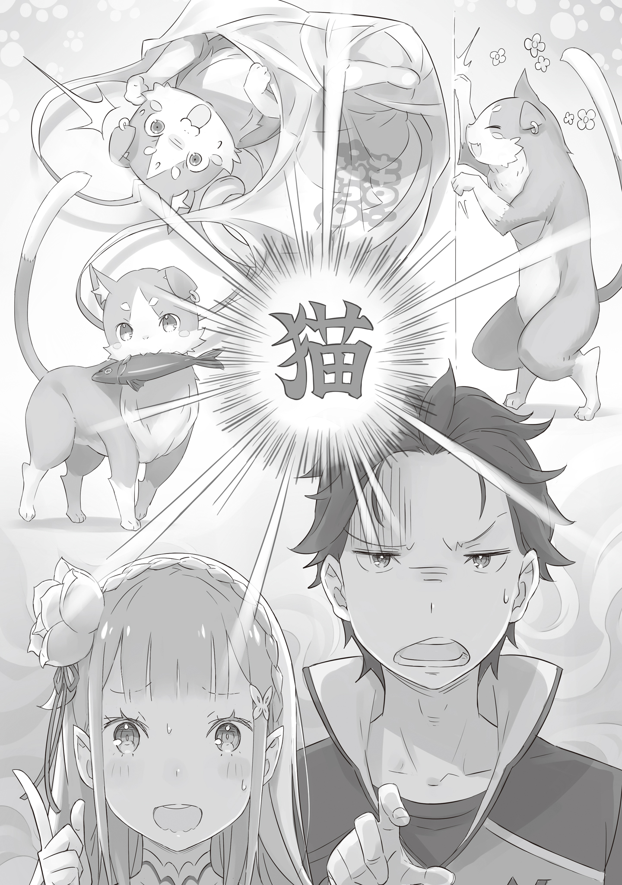

— Эй, Субару… может, прекратим?

— Что ты такое говоришь, зая? Если я сейчас сдамся, то уроню свою мужскую честь.

— Не думаю, что ты что-то уронишь. И кого это ты назвал заей?

Этот незамысловатый диалог состоялся в особняке Розвааля незадолго до полудня.

Слегка понизив голоса и стараясь говорить потише, беседовали парень и красавица-девушка — Нацуки Субару и Эмилия.

Прижавшись друг к другу, они крадучись продвигались по коридору западного крыла особняка, где им любезно предоставили кров. Они были заняты секретной миссией — точнее говоря, слежкой за объектом.

— Если цель нас заметит, быть беде. Эмилия-тан, постарайся не шуметь… И ещё, когда ты так близко, от тебя потрясающе пахнет. Пользуешься какими-то духами?

— Да нет, ничем таким… Но я всё равно считаю, что в этом нет никакого смысла. Уверена, он сразу раскусит нашу дерзостную затею.

— «Дерзостную»… Давненько я не слышал такого слова…

— Су-ба-ру.

После их обычной перепалки Эмилия на удивление сделала сердитое лицо. Подумав про себя, что и с таким выражением она очень мила, Субару снова выглянул из-за угла.

— А, чёрт! Теряем цель! Эмилия-тан, бег! Бег на носочках!

— А? А? Но-сочках?

— Быстро учишься!

— Просто повторяй за мной! Смотри!

— Не думаю, что у меня получится так же ловко… Ух ты, Субару, у тебя отлично получается бегать на носочках!

Демонстрируя свой странный талант бесшумно бегать, Субару устремился вперёд, а Эмилия поспешила за ним. Она изо всех сил пыталась подражать его движениям, но это было не так-то просто. Её старания выглядели очаровательно, но сейчас главным было не упустить цель.

Краем глаза они заметили, как за углом коридора исчез длинный хвост. Этот знакомый хвост, без сомнения, принадлежал их цели — спокойному и невозмутимому коту-духу, — Паку.

Куда же направлялся Пак, покинув Эмилию и свободно летая по особняку?

Этого они не знали. Выяснить это и было их главной задачей. Изучение повадок Великого духа Пака являлось на данный момент наивысшим приоритетом.

— Ах, Субару! Смотри, у меня получилось! Получилось бегать на носочках! Видишь, как тихо!

Даже если шаги и стали тише, слежка не имела смысла, если они продолжали переговариваться во весь голос.

Это была отчаянная погоня двух людей, которым определённо стоило бы заглянуть в словарь и перечитать значение слова «слежка».

Всё началось тем же утром, после завтрака, во время небольшого отдыха.

Большинство событий в особняке Розвааля, как правило, начинались с подачи Субару и зарождались за обеденным столом, где собирались все обитатели дома. В особняке было заведено, что все, кто находится в нём, без веских на то причин завтракают, обедают и ужинают вместе в столовой.

Это было простое, почти семейное правило, и Субару оно очень нравилось. Он считал, что чем больше людей собирается за едой, тем лучше.

К тому же, за приёмом пищи можно было подметить много интересного.

В общем, совместные трапезы были полны открытий, а свободное общение рождало множество тем для разговоров. Именно тогда у Субару и возник вопрос, который он озвучил, тем самым положив начало новому «событию».

— Кстати, а чем Пак занимается, когда он не с тобой, Эмилия-тан? — склонил голову набок Субару, когда со стола уже убрали тарелки.

От его слов Эмилия, попивавшая послеобеденный чай, удивлённо моргнула.

— А?

На её прекрасных серебристых волосах и хрупких плечах обсуждаемого духа-кота не было. И это естественно, ведь Пак только что отпросился у Эмилии и в одиночестве вылетел из столовой.

Видя её округлившиеся глаза, Субару пожал плечами.

— То, что вы с Паком связаны контрактом — общеизвестный факт. И я понимаю, что он в основном находится рядом с тобой… но ведь бывают моменты, когда он действует самостоятельно, как сейчас, верно? Ты знаешь, чем он занимается в это время?

— Чем Пак занимается, когда меня нет рядом?..

Судя по лицу Эмилии, она никогда об этом не задумывалась.

Хорошо это или плохо, но её политика невмешательства, похоже, означала, что Эмилия практически не контролировала деятельность Пака в его «свободное время».

— Что ж, я считаю, что лучший способ обеспечить питомцу долгую жизнь — это не создавать ему стресса, но всё же держать его на коротком поводке тоже необходимо, как по мне.

— Ах, Субару, ты опять смеёшься над Паком, да? Если он услышит, то точно рассердится, так что не говори так.

Услышав, что её духа назвали питомцем, Эмилия нахмурила брови. Затем она подняла палец и, предупреждая Субару, сказала:

— Слушай, Пак гораздо более ответственный, чем ты думаешь. Уверена, что даже когда он не со мной, он занят чем-то очень-очень важным. Да, Пак всегда старается ради мира во всём мире.

— Что за расплывчатое объяснение? Прямо как у ребёнка, который не знает, кем работает его отец, но уверен, что тот занимается чем-то очень важным.

Субару и сам в детстве не знал, чем занимается его отец, и питал к нему такое же смутное доверие. Хотя, если честно, он и сейчас не особо понимал.

— В любом случае, раз уж и ты, Эмилия-тан, не в курсе, то нам тем более нужно серьёзно взяться за расследование. У меня сегодня до обеда нет работы, так что давай проследим за ним.

— Это так некрасиво… Думаю, не стоит.

— То, что пришло в движение, уже не остановить. К тому же, Эмилия-тан, разве тебе самой в глубине души не интересно? Я не говорю, что он делает что-то плохое, но если он и вправду «старается ради мира во всём мире», то давай выясним, что именно.

— Ну, это…

— Давай выясним!

— …Хорошо.

Не умеющая отказывать Эмилия, хоть и смущённо, но поддалась на уговоры Субару.

Так они и выскочили из столовой, положив начало своей слежке за Паком.

К счастью, Пака, вышедшего из столовой раньше, они нашли быстро, и слежка началась.

Однако дальнейшее наблюдение за ним нельзя было назвать удачным. Дело было не в том, что они его потеряли или он их заметил, а в содержании его действий.

— Пак царапает стену когтями. Как думаешь, что он делает?..

— Наверное, проверяет прочность особняка. Вот так он осматривает всё вокруг и убеждается, что все мы в безопасности. Поразительно.

— А по-моему, он просто точит отросшие когти.

— А, Субару, смотри! Пак понёсся с огромной скоростью! Наверное, что-то нашёл!

— И с этой скоростью он влетел в туалет. Может, это оно? Знаешь, как кошки становятся гиперактивными до или после туалета? Тот самый «туалетный раж»?

— Да не может быть… А! Он вылетел с той же скоростью! Мы его упустим!

— Он с таким усердием носится по всему особняку, что-то тут не так…

— Он вошёл на кухню! Я поняла! После недавнего переполоха со зверодемонами он, должно быть, проверяет барьер на наличие прорех. Может, он втайне ставит ещё один, запасной барьер…

— А мне кажется, он либо ищет солнечное местечко, либо патрулирует свою территорию.

— Н-наверное, у него какое-то очень-очень важное дело…

— Он получил от Рем рыбку и вышел, съев её!

— Перекус! Он же растолстеет!

— И это всё, что тебя волнует?!

Судя по их наблюдениям, действия Пака в его свободное время были слишком уж свободными. Вернее, его повадки были точь-в-точь как у…

— Обычного кота… причём домашнего, забывшего о диких инстинктах.

— А я вот что подумала: у Пака когти, скорее всего, не растут, так что точить их ему незачем. И в туалет ему ходить не нужно. А территорией ему служат мои волосы и плечи. Видишь, Пак всё-таки не такой уж и странный.

— Нашла за что зацепиться и с таким напором пытается меня переубедить.

Обычно Эмилия уступала в спорах с Субару, но когда дело касалось её единственного члена семьи, она не могла так просто сдаться. Она решительно пошла в контрнаступление, и в её словах, несомненно, была доля правды.

До этого момента Субару был настолько убеждён в кошачьей натуре Пака, что даже не сомневался, но духу действительно не было нужды в кошачьих повадках. Как и сказала Эмилия, у заточки когтей и «туалетного ража» могли быть иные причины.

— Но перекус на кухне уж точно не имел никакого смысла.

— А-а может, он набирался сил перед предстоящим важным делом?

Судя по вопросительной интонации, Эмилия и сама не очень-то в это верила. Идея о «важном деле» тоже казалась сомнительной. Если бы Пак сейчас нашёл солнечное местечко и уснул, Эмилия, скорее всего, признала бы своё поражение.

Но…

— …Что ж, думаю, уже пора.

Проглотив рыбку, Пак погладил себя по животу и пробормотал это.

Его низкий голос и слегка напряжённый профиль… атмосфера изменилась.

— Неужели у него и правда есть какое-то дело?.. Надеюсь, это не разборки за звание главного кота.

— Пак никогда не станет драться с бродячими котами. Его территория — это моё тело. Так и есть.

— Неосознанно прозвучало довольно пикантно, но Пак двинулся. Идём за ним.

С серьёзным выражением лица Пак взмыл в воздух и полетел прямо, а они последовали за ним.

Они осторожно двигались следом, стараясь не шуметь, но его парящая фигура была явно начеку. Субару и Эмилия тоже напряглись.

Вскоре Пак, который летел впереди, остановился перед одной из комнат. Заметив это, Субару и Эмилия переглянулись.

— …Моя комната?

— Пак, у тебя есть какое-то дело к Субару?..

Само собой, её предположение было притянуто за уши. Пак ведь пробрался к комнате Субару тайком. Мысль о том, что он пришёл его «навестить», казалась крайне сомнительной.

И тут Субару вспомнил. Вспомнил о своих натянутых отношениях с Рем и Рам, которые обострились как раз вчера. Неужели Пак, заподозрив в нём опасного человека, пришёл его проучить?

— Субару?..

Пока Субару в тишине предавался тревожным мыслям, Эмилия обеспокоенно позвала его. В её голосе прозвучало искреннее беспокойство, и Субару, покачав головой, выдавил из себя улыбку.

Затем Пак, не издав ни звука, нажал на дверную ручку хвостом, медленно открыл дверь и, проскользнув внутрь, скрылся в комнате. Удивление от того, что он смог открыть дверь хвостом, было велико, но ещё больше поражало то, как он вёл себя, словно у себя дома.

— …Ладно, давай проверим.

Боясь, что Пак заподозрит неладное, но всё же решив проверить что Пак делает в его комнате, Субару вошёл внутрь.

— Ха?..

Тихонько приоткрыв дверь, Субару заглянул в комнату и замер. В комнате послышался шорох, и хотя он не мог разобрать, что именно это было, он отчётливо слышал какой-то звук. Решив, что Пак разговаривает с кем-то в комнате, Субару напряг слух.

— Ой, да ладно тебе, котик.

— Ня?!

Войдя в комнату, Субару увидел на кровати Пака, который от удивления замер. Он смотрел на Субару круглыми глазами, но видна была лишь половина его тела. Почему? Потому что он забрался в виниловый пакет из комбини* и шуршал им, играя.

(«Комбини» (яп. コンビニ) — японский круглосуточный магазин у дома, например, как раз из такого Субару и выходил перед попаданием в альтернативный мир.)

— И это всё?! После такого серьёзного вида — вот такая развязка?! Да ты же просто кот! Обычный кот!

— Ну хватит, не пугай меня! У меня сейчас личное время, между прочим.

— Раз уж заговорили о личном, так это моя личная комната! Какого чёрта ты играешь с чужим пакетом из комбини? Кот, самый настоящий кот!

Отвергая насмешливые слова Субару, Пак яростно запротестовал. Затем он с ещё большим энтузиазмом продолжил играть с пакетом, в который забрался.

— Вот, смотри, Эмилия-тан! Вот оно, его истинное лицо! Кот-подушка!

— Ух ты… какой-то странный белый пакет… прости, я невольно последовала за тобой!

— Эмилия-тан, ты тоже?!

В конечном итоге, ситуация, спровоцированная Эмилией, которая последовала за Паком, закончилась шумной вознёй.

В итоге они пришли к выводу: «Пак в своё свободное время — свободен!»

С того дня Эмилия стала время от времени замечать, чем Пак занимается в свободное время.

Глядя на неё, Субару думал о том, что стал свидетелем поведения избалованного домашнего питомца.

《Конец》
