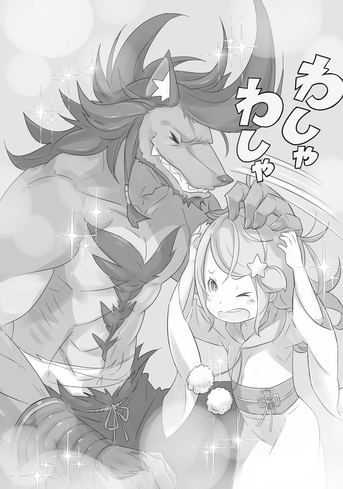

Города-государства Карараги — так называлась страна, возникшая в результате союза нескольких городов. Хотя у нее было достаточно сил, чтобы противостоять трем другим великим нациям — Лугунике, Волакии и Густеко — говорят, что ее основание было полно трудностей и препятствий.

— И тот, кто объединил все эти города, чтобы основать Карараги, был знаменитый Хосин из Пустоши, который стал первым президентом этой страны, — сказал мужчина громким голосом.

— Этот Хосин, значит, главный в Карараги? — спросил детский голос.

— Был, несколько сотен лет назад. С тех пор здесь всегда правит президент.

— Президент… А этот человек меняется?

— Меняется, когда президент умирает, или каждые пять лет, когда нового выбирают голосованием. Правители городов собираются вместе и выбирают следующего президента. Хотя в наши дни это стало просто формальностью.

— Что ты имеешь в виду? Кажется, это хороший способ выбрать лидера.

— Потому что, если кто-то хочет стать президентом, все, что ему нужно сделать, это купить правителей, будь то деньгами, женщинами или выпивкой… Философия Хосина умерла давным-давно.

— В конце концов, все сводится к деньгам, да? Должно быть, тяжело, дядя.

Вздох девочки заставил вздохнуть и мужчину. Проблема была в том, что его вздох был настолько сильным, что испортил ей прическу.

— Эй, посмотри, что ты наделал! Я сегодня так нарядилась, а ты все испортил!

— Посмотри на себя, беспокоишься о своей внешности… Я скучаю по старой Малышке Ане, которая жила в грязных в переулках, так ты меня и до слез доведешь.

— Это потому, что я получаю чаевые от старичков в баре, когда выгляжу красиво. Если ты тоже мне дашь, я могу вознаградить тебя своей ангельской улыбкой.

Ее бирюзовые глаза засияли, и она озорно улыбнулась, показав язык. Этот жест указывал на то, что она прекрасно осознает свое главное оружие, вызвал смех у мужчины.

— Га-ха-ха! Ты выбрала не того клиента, если пытаешься продать свою улыбку. Я тебя уже искупал, глупой улыбки будет недостаточно, чтобы забрать мои деньги. Возвращайся, когда у тебя вырастут сиськи и задница.

— Говоришь такие вещи, и даже не пьян… Ах, мне нужно вернуться к работе. Расскажешь мне еще истории позже.

Махнув рукой, Анастасия вернулась к работе, а Рикардо вздохнул. Он протянул руку, чтобы взять свое пиво на стойке, и заметил пустую кружку.

— Вот, еще одна.

Хозяйка бара, поставила перед ним новую кружку.

— Ана — хороший работник. Честно говоря я сомневалась, когда ты привел ее сюда, но она очень помогает. У нас даже есть клиенты, которые приходят только для того, чтобы взглянуть на эту улыбку.

— Значит, правда, что есть поклонники Маленькой Аны? Я не понимаю, что они нашли в такой малышке, как она.

— В ней есть что-то, что очаровывает окружающих, и ты должен это понимать, ведь был одной из ее жертв, не так ли?

Получив подмигивание от хозяйки, мужчина просто поднес холодную кружку ко рту.

Он был кобольдом с коричневой шерстью и крупным мускулистым телосложением, которое служило ему живыми доспехами. Этот достаточно известный наемник всегда заходил в таверну, когда у него появлялась такая возможность.

— Кажется, Ане нравится здесь работать… Надеюсь, что она останется надолго.

— Я так не думаю — пробормотал Рикардо себе под нос, что он делал крайне редко.

Нельзя отрицать, что Анастасия достаточно талантлива для своего возраста и вполне могла быть лицом бара. Но…

— Малышка Ана и жизнь официанткой в мерзком баре, звучит не так уж плохо… На самом деле это не так… — продолжал бормотать мужчина.

По сравнению с прошлым, когда она жила с глазами, полными враждебности, перемена была шокирующей. Но он знал истинные желания девушки и ее бесконечные, чистые амбиции.

— И, прежде всего, будучи официанткой, ты не сможешь выполнить то обещание, которое мне дала.

Рикардо неосознанно коснулся ошейника на своей шее и почувствовал холодное, твердое железо кончиками пальцев. Эта вещь осталась у него со времен рабства,но не смотря на это, он продолжал носить этот ошейник, как доказательство своего прошлого.

В то же время у него была странная уверенность, что именно эта девушка будет той, кто освободит его.

— …Эй, извини, что прерываю твои мечтания, но ты только что назвал мой бар мерзким?

— О, не стоит прислушиваться к чужим мыслям!

— Это ты не знаешь, как говорить тихо со своей огромной мордой!

Видя, как хозяйка ударила Рикардо подносом, вся таверна разразилась смехом. Среди этого зрелища даже Анастасия смеялась, что принесло небольшое удовлетворение псу.

Прошел примерно месяц до его следующего визита в таверну. Несмотря на то, как это выглядело, Рикардо жил довольно напряженными днями и не мог уделять слишком много внимания маленькой девочке, которую он случайно нашел на улице. В конце концов, оплата счетов была единственным способом сохранить свою свободу.

Но он не мог отрицать своего желания увидеть смелую маленькую девочку спустя месяц, и поэтому не скрывал своего разочарования, когда хозяйка сообщила ему новость.

— Что? Малышку Ану наняла торговая компания?

— Да… Это случилось так внезапно, я сама не могла в это поверить.

— Что значит внезапно?! Ее ведь не силой забрали?

— Успокойся! Я не это имела в виду. Ана поговорила с ними и согласилась, ее никто ни к чему не принуждал.Она даже дала мне немного денег в качестве компенсации… Эй, не смотри на меня так, я не из-за денег ее отпустила.

— Я ничего не говорил. Кроме того, я бы не оставил ее с кем-то, кому не доверяю.

Рикардо не мог поверить, что его так потрясло отсутствие Анастасии. Тем не менее, он продолжал задавать хозяйке все больше вопросов, понимая, что ей немного неловко.

— В любом случае, расскажи мне, как все произошло. Даже если это было внезапно, что-то же случилось, верно?

— Говорю тебе, все произошло очень быстро… Все, что я помню, это как парень сказал, что покупает дар Аны…

— Дар…? Не говори мне, что речь идет о ее обаянии с клиентами, и они заставляют ее делать вещи, которые маленькая девочка никогда не должна делать! Ты уверена, что это был кто-то из торговой компании? Не работорговец?

— Перестань так пыхтеть! Я даже узнала его имя и все такое, проверь сам, если так волнуешься. Это была Торговая компания Тюден, они находятся на дальнем востоке города.

Услышав это, Рикардо одним глотком осушил кружку и встал, направляясь прямо к двери.

— Эй, ты думаешь, пиво бесплатное? — крикнула хозяйка.

— Запиши на мой счет, я заплачу в следующий раз!

— Ты всегда так говоришь! Кстати…

Женщина немного боялась говорить об этом, но все же сделала это.

— Кажется, парень, который приходил поговорить с Аной, тоже что-то говорил о счетах…

— Что? Счета? Это не имеет смысла… Ладно, я проверю их!

Поставив перед собой цель, Рикардо вылетел на улицу, как пуля, направляясь прямо к Торговой компании Тюден, не зная, почему он так спешит.

Торговая компания Тюден принадлежала известному конгломерату торговых компаний Рюшика. Расположенная в стратегическом важном городе, который соединял все коммерческие центры по всему Карараги, Рюшика быстро расширилась в гостиничной индустрии, а Тюден последовала прямо за ней.

Насколько Рикардо было известно, никаких темных историй, связанных с Рюшикой не ходило, и, к его облегчению, встретиться с Анастасией оказалось гораздо проще, чем он ожидал.

— Привет, дядя. Я волновалась, когда ты исчез из бара. Хозяйка рассказала тебе о моей новой работе? — сказала девочка.

Когда Анастасия увидела Рикардо, спорящего с парнем на стойке регистрации, она подошла поприветствовать его, как будто в этом не было ничего необычного. Увидев, что у девочки все хорошо, Рикардо отбросил мужчину, которого держал за воротник, поразив всех в вестибюле, кто стал свидетелем этой сцены.

— Дядя, тебя наняли драться с кем-то здесь? Если это так, прекрати, пока меня не уволили.

— Мне не нравится это твое всезнающее лицо, малышка.

Пока Анастасия хлопала в ладоши с широкой улыбкой, пытаясь разрядить обстановку, Рикардо успокоился. Когда ситуация, казалось бы, была под контролем, мужчина, которого он отбросил, встал, посмотрел на девочку и спросил:

— Анастасия, этот мужчина…?

— О, мистер Тюден, это мой дядя. Он, вероятно, скучал по мне, потому что мы не виделись, прежде чем я ушла из бара.

— Вовсе не так, ты…! Подожди, ты только что назвала его Тюденом?

— Да, я Тюден, представитель компании, рад знакомству.

Представившись тем же именем, что и Торговая компания, мужчина был еще молод и немного полноват. Его безобидного выражения лица было достаточно, чтобы Рикардо понял, что он не тот, кто склонен к насилию.

— Значит, это ты украл Ану из таверны? Мне нечего сказать по этому поводу, нет… Но это я познакомил их с Хозяйкой, понимаешь? Мне просто интересно, что заставило тебя нанять ее.

— Хм, понимаю, ты беспокоишься об Анастасии.

— Нет! Это не так! Ана, ты все неправильно поняла, не обманывай себя.

— Я ничего не говорила…

Вздрогнув от комментария Тюдена, Рикардо потерялся, пытаясь оправдать свои действия, что несколько опечалило Анастасию.она думала, что после всего произошедшего, он волновался за нее.

Видя реакцию Рикардо, Тюден пригласил их в переговорную, чтобы все спокойно обсудить, и когда все сели, он сказал:

— По сути, причина, по которой я нанял ее, — это любовь с первого взгляда.

— Подожди, что?! Разве это не то, что Хосин называл лоликоном?!

— Успокойся, это был просто способ выразиться. Я влюбился в ее дар и уверен, что Анастасия — гений. Настоящий гений. И я говорю не о Божественной защите.

Было немного странно, насколько он переоценивал такого ребенка, как Анастасия, и для Рикардо это все звучало скорее как фантазия, заставляя его задуматься, не плохая ли это идея — оставить девочку работать здесь.

— Например… Ты помнишь сумму своего последнего счета в таверне?

— Нет. Не точную сумму.

— Я так и думал. Но я слышал о кое-чем, что произошло в конце прошлого месяца, когда постоянные посетители пошли оплачивать свои счета. Пожалуйста, попробуй угадать, что сделала Анастасия.

Рикардо не ответил, зная, что Тюден скажет это в любом случае.

— Она подсчитала суммы для всех двадцати клиентов, ничего не проверяя. Никто, кажется, не был впечатлен этим, но я не мог не обратить на это внимания.

— Может быть, она смотрела на записи Хозяйки ранее в тот день.

— Невозможно, Анастасия тогда не умела читать. И это еще не все, она даже освоила письмо всего за две недели.

Пока Тюден качал головой, с трудом веря всему, что говорил сам, Рикардо не мог закрыть рот. Анастасия, казалось, была единственной, кому было трудно следить за разговором взрослых.

— Теперь ты, вероятно, понимаешь, почему я ее нанял. Я уверен, что Анастасия станет монстром в будущем… Работающим на Торговую компанию Тюден.

— Ты собираешься использовать ее для своего собственного успеха, так?

— Я считаю, что мы оба получим от этого выгоду. Она прекрасно все это поняла и согласилась работать со мной, так что ты не можешь вмешиваться.

Видимо, у Рикардо никогда не сложится хорошее мнение о Тюдене. Не смотря на это, он согласился, что у Анастасии многообещающее будущее, и поэтому предложил:

— Меняя тему немного, эта компания в последнее время сильно растет, не думаешь ли ты, что тебе нужно больше безопасности?

— В каком смысле?

— Я уверен, что ты понимаешь, то что многие вопросы, в конце концов, сводятся к насилию. И неважно, сколько у тебя денег, они не будут защищать тебя вечно.Тебе не кажется, что лучше быть готовым?

— Ты предлагаешь стать нашим телохранителем? Интересно, что ты нашел в этой девочке.

Поняв истинную причину этого предложения, торговец ухмыльнулся, и ответ пришел в том же духе.

— То что я вижу… Свое будущее. День, когда она снимет этот ошейник, и сделает меня по-настоящему свободным… Думаю, я вижу, как далеко могу зайти.

— Очень хорошо, мы можем обсудить детали позже.

И вот так эти двое пожали друг другу руки, удивив маленькую девочку, которая ничего из этого не поняла.

— Эй, о чем вы договорились?

— Что я тоже начну здесь работать. В наше время много бандитов, понимаешь? Одно мое присутствие отпугнет их.

— Ты действительно так хотел быть рядом со мной? Вау, я действительно плохая женщина.

Как только она поняла, что все это значит, Анастасия расхохоталась, и, видя это, Рикардо погладил ее по голове, на мгновение забыв, насколько он силен.

— Дарить мечты кому-то вроде меня… Наверное, ты действительно плохая женщина.

Сказав это, здоровяк засмеялся, глядя на девочку с надувшей губой и растрепанными волосами.

《Конец》
