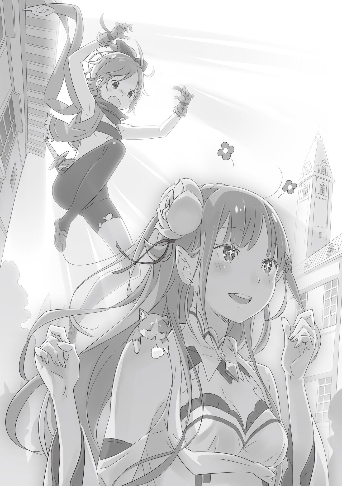

— Нужно, чтобы ты украла у одной девушки значок в форме дракона. Награда — десять священных золотых монет. Ну как, возьмёшься за работенку?

— Да лучше и быть не может! — воскликнула я, пожимая руку «женщине в чёрном», которая принесла этот заказ.

В тот момент я подумала, что хоть личико у неё вроде доброе, взгляд — чисто как у змеюки. Впрочем, в нашем захолустье, в трущобах, у тех, кто просит обчистить карманы других, чистой совести днём с огнём не сыщешь.

Я не стала лезть с расспросами — и так ясно, что это негласное правило. Поэтому, не задавая заказчице лишних вопросов, я лишь уточнила приметы цели и место встречи, после чего мы разбежались.

Честно говоря, меня аж распирало от радости.

Шутка ли — десять священных золотых монет! Прямо перед моим носом болталась награда, которая перекрывала всё, что я до этого усердно копила по грошам. Чёрта с два я упущу такой шанс.

В этом мире, чтобы ты ни делал, нужны деньги. Деньги нужны, чтобы быть счастливым.

Я не собираюсь закончить свои дни, ползая тут в грязи. Я выберусь отсюда, во что бы то ни стало. Прожить жизнь, дрожа от страха в такой темноте? Нет уж, увольте.

— С десятью священными золотыми и тем, что я уже заработала…

Я перестану прятаться в тенях столицы и, несомненно, смогу жить на солнечной стороне, честно и открыто.

И не одна я, а мы… Да, так я думала.

Королевская столица Лугуника — говорят, для других городов страны она — предмет зависти. Честно говоря, для тех, кто тут живёт, это звучит как-то неубедительно.

Я с тех пор, как себя помню, живу в столице, причём в её «теневой» части — трущобах. И, как по мне, те, кто восхищается этим местом, видят только его солнечную сторону.

Верхний район, где я никогда не была, может, и сверкает роскошью, но большинство жителей столицы от этой пышности бесконечно далеки. Торговцы на главной улице сверкают глазами, пытаясь заработать хоть одну лишнюю медную монету, а такие, как мы, у кого нет возможности жить честно, рискуют жизнью, пытаясь что-то утащить из-под носа у этих торгашей.

Живя так изо дня в день, вечно ходя по острию ножа, привыкаешь ко всему. Постепенно начинаешь понимать свою роль и находишь то, в чём ты хорош. В моем случае это были ловкие пальчики, шарящие по чужим карманам. Мой личный талант.

Сначала я воровала по мелочи, таская кошельки у прохожих, но со временем набила руку, и пошли слухи о моём мастерстве. Не помню уже, с чего всё началось, но те, кто обычно обходил милашку-меня стороной, стали подкидывать заказы на кражи.

Не успела я оглянуться, как начала воровать не просто ради пропитания на день, а ради куда более крупной цели.

В таком деле, как «воровство на заказ», чем темнее делишки клиента, тем лучше награда.

Этот заказ был исключительным. Я просто обязана его выполнить.

Разумеется, сложность будет под стать награде, но тут не время дрейфить. Я выложусь на максимум — это мой лучший шанс вырваться из трущоб.

И всё же…

— Серьёзно? Эта ротозейка и есть цель?

Когда я нашла девушку, подходящую под описание заказчицы, мне осталось только в недоумении склонить голову.

Белый плащ с вышивкой в виде птицы, длинные серебряные волосы. Что качество одежды, что уход за волосами — видно, что денег на неё потрачено немерено, но мне на это плевать. Проблема была в другом.

— Как бы сказать… она какая-то дёрганая. Неспокойная, что ли. Чистая деревенщина, впервые в город выбралась.

Девушка шла по самому краю дороги, суетливо озираясь по сторонам. И я бы сказала, что она не столько бдительна, сколько боится, что толпа её просто раздавит.

Она теребила кончики своих волос, и выглядело это до невозможности жалко.

Красотка такая, что глаза слепит, но это поведение — крик во все горло для окружающих: «Я беззащитна! Я не смотрю по сторонам!» Мне оставалось только схватиться за голову.

— Ну конечно, коллеги уже слетаются на неё, как на лёгкую добычу…

Преследуя девушку, идущую впереди, я то и дело замечала краем глаза местную шпану. Карманники и разбойники — такие же, как я — один за другим собирались вокруг неё, решив сделать её своей целью.

Очевидно же: если хорошо одетая девушка, явно не привыкшая к столице, идёт, раскрыв рот от удивления, она тут же попадает в поле зрения таких ребят. Сочувствия у меня к ней не было — это будет для неё уроком.

Но чисто для меня это было чертовски неудобно — работать будет сложнее.

— Для вас, ребятки, она, может, просто жирный гусь на сегодняшний ужин, а для меня она — десять священных золотых монет!..

Я уже всерьёз начала думать о том, чтобы припугнуть их всех и разогнать. Раз уж я заметила хвост, значит, если я зайду с тыла и прижму к кому-нибудь ножичек, эти трусы тут же разбегутся. Я уже почти остановилась, собираясь так и сделать. Но вдруг…

— А?

Один из парней, преследовавших девушку, сделал странное лицо и огляделся. Потом он склонил голову и, словно напрочь забыв, чем занимался, просто взял и ушёл.

Если бы это случилось один раз, я бы не удивилась. Подумала бы, что он увидел конкурентов и решил не связываться, понимая, что ему ничего не достанется.

Но когда и остальные начали сваливать один за другим, это стало уже совсем подозрительным.

— Э-э? Почему? Чего они все испарились-то?

Не успела я опомниться, как шпана, которую я приметила, исчезла без следа.

Осталась только эта беспечная девица, которая даже не поняла, что на неё охотились, и я, держащаяся на почтительном расстоянии.

Не понимая, что происходит, я пристально уставилась в спину девушки. Глядя на неё, я вдруг почувствовала, что её силуэт начинает расплываться, и поспешно тряхнула головой.

— Что это сейчас было?..

Может, магия какая? Старик Ром рассказывал, что в мире существуют штуковины под названием «Метеор» — магические инструменты с диковинными эффектами. Возможно, у этой девицы есть такая штука, которая отгоняет врагов?

— Поэтому она такая беспечная и открытая?.. Если так, то это круто.

Девушка передо мной продолжала, пошатываясь, бродить по столице. Глядя, как на её спине танцуют серебряные волосы, словно окутанные светом и сбивающие меня с толку, я почувствовала дрожь.

Как и следовало ожидать от такой награды — просто так она мне не дастся.

— Ладно. Раз так, я не проиграю. Я точно стащу этот значок…

Решившись во второй раз, я сжала кулак, готовясь приблизиться к её спине. И как только я его сжала, у меня отвисла челюсть. Потому что…

— Ах, простите.

Девушка, столкнувшись с мужчиной в толпе, тихонько извинилась и, смущаясь, пошла прочь. У неё было такое лицо, будто ей стыдно, что она не смотрела вперёд, но чёрта с два! Это он специально врезался в неё.

Потому что в то самое мгновение этот мужик ловко вытащил кошелёк у неё из кармана!

— Да твою ж! Дерьмо! Ну что ты будешь делать?!

Яростно чеша голову, я сорвалась с места.

Я бежала не за той девицей, что с глупой улыбкой бродила по городу, а за мужиком, который подрезал у неё кошелёк.

Мало того что он мой коллега по цеху, так он ещё и нацелился на мою добычу — какой позор!.. Но дело не только в гордости. Кто знает, может, эта девица положила тот самый значок в кошелёк с мелочью?

Если он при ней, то кошелёк мне даром не нужен, но если она внутри кошелька, то гнаться за девицей теперь — пустая трата времени.

С её-то внешностью я эту девицу потом в два счёта найду, даже если упущу из виду. А вот карманника, если он юркнет в трущобы, потом днём с огнём не сыщешь, так что пришлось расставлять приоритеты.

Мужик довольно шустро скользил сквозь толпу, но по сравнению со мной он всё ещё зелёный. Я сразу заметила переулок, в который он нырнул, и, добежав до угла, свернула следом. «Как только людей не станет, припугну его», — подумала я, врываясь туда, и…

— Негоже, знаете ли, замахиваться на кусок, который вам не по зубам.

Меня уже ждал жутковатый старик, приставивший тонкий меч к горлу карманника.

Дед был одет с иголочки в чёрный костюм дворецкого. Его голос звучал мягко, лицо было спокойным, а глаза добрыми, но этот эффект полностью перечёркивала смертоносная аура клинка в его руке.

И, что важнее всего, эта особая атмосфера, исходящая от всего его тела… Так пахнет настоящий «опасный тип».

Крайне редко, но такие встречаются в столице. Они могут затесаться среди патрульных стражников или охранять какого-нибудь купчишку, но… этот дед явно из той же породы.

— Верни украденное. И тогда… я закрою на это глаза.

Он улыбался, но, когда произнёс последние слова, глаза его явно не смеялись.

Мужик, на которого он смотрел, видимо, прочувствовал это на своей шкуре. Он поспешно швырнул кошелёк в протянутую руку старика и, как только острие меча отодвинулось от горла, дал дёру из переулка на полной скорости.

Упустив момент для побега, я осталась стоять с глупым выражением лица.

— Похоже, у юной леди была та же цель, что и у него?

Я невольно задержала дыхание.

Старик, стоявший передо мной, смотрел на меня добрыми глазами. Но мне казалось, что мне улыбается демон.

Меня сожрут. Я подумала об этом довольно-таки всерьёз.

— А ты проницательная. Я всё ещё недостаточно хорош… Что ж, держи.

Сказав это, старик бросил мне кошелёк, который держал в руке.

Поймав его обеими руками и удивившись, насколько он легкий, я подняла голову.

— Пожалуйста, верни его владелице. Если это сделаю я, ситуация, скажем так, немного усложнится.

— Т-ты серьёзно? Глядя на мой прикид, не боишься, что я с ним сбегу?

— Раз ты специально за ним погналась… Да и… ты ведь так не поступишь, верно?

На долю секунды в глубине глаз старика сверкнуло такое чудовищное давление, что мне не осталось ничего, кроме как отчаянно закивать. Удовлетворённо глядя на окаменевшую меня, дед прошёл мимо и направился к главной улице. Проходя, он потрепал меня по голове своей твёрдой ладонью.

— А-а, ну сколько можно! Старик Уилл, ты куда пропал?! Ферри так волновался!

— Прошу прощения, Феррис. Было одно небольшое дельце…

Как только старик вышел на улицу, я увидела, как его спутник начал его отчитывать, а тот принялся оправдываться. Но мне было плевать — я поспешила убраться оттуда подобру-поздорову. Точнее говоря — сбежала.

Именно из-за таких встреч столица и пугает. Там, где много людей, велик шанс нарваться на таких вот монстров. Нужно зарубить это себе на носу.

Запыхавшись и убедившись, что отбежала достаточно далеко, я заглянула в кошелёк. Честно говоря, надежды было мало. Учитывая, какой он был тонкий и лёгкий, мои ожидания тоже улетучились.

— М-да, и что тут у нас по факту… Мелочь на карманные расходы ребёнку, что ли?..

Сумма была такой, что стоит пару раз перекусить на торговой улице — и денег нет. Я начала сомневаться, существует ли вообще тот самый украшенный драгоценным камнем значок, который требовала заказчица. Одета девица была хорошо, но, судя по её поведению, она могла давным-давно его потерять и…

— Стоп, точно, блин! Кошелёк-то цел, но если сам значок у той бабы стащили, это ж будет полный провал!

Осознав этот непростительный просчёт, я в панике рванула обратно. Какой смысл возвращать кошелёк, если у самой цели могли уже украсть значок? Я буду полной дурой.

Молясь, чтобы эта растяпа не была настолько растяпой, я примчалась обратно на торговую улицу и, найдя место, где поднялась суматоха, остановилась.

Народ с шумом разбегался, бросая вещи. Пока я хлопала глазами, пытаясь понять, что стряслось, в центре переполоха я увидела ту самую серебровласую девицу.

— …

Выглядела она недовольной и удручённо опустила плечи, от чего мне почему-то стало спокойнее. Затем, с небрежностью, чтобы она не заметила, я тихонько подбросила её кошелёк в кучу оружия и вещей, брошенных прямо перед ней.

Наблюдая, как девушка заметила кошелёк и заплатила владельцу лавки, где случился переполох, я заодно ловко прикарманила несколько других кошельков из валявшегося багажа.

После этого, продолжая преследовать девицу по столице в ожидании идеального момента, я поняла одну вещь совершенно отчётливо.

— Эта баба — жуткая добрячка.

Подслушивая разговоры позади неё, я выяснила, что причиной недавней шумихи стал какой-то зверочеловек, который шёл рядом с ней. Он, не имея денег, слопал товар в лавке без спроса.

«Ну и причём тут она?» — подумала я, но девица, видимо, решила заплатить за него и обнаружила пропажу кошелька. А потом, вместо того чтобы сдаться, попыталась заработать денег, показывая какие-то фокусы, из-за чего и началась эта непонятная суета.

Даже расставшись со зверочеловеком, она продолжала слоняться туда-сюда по городу, хотя в кошельке у неё уже должно было быть пусто.

Честно говоря, я уже устала за ней таскаться, но благодаря долгому наблюдению я наконец-то поняла, где значок. Пока она шла, она то и дело ощупывала одежду в районе пояса, словно проверяя что-то. Там она прятала что-то важное — не кошелёк, а что-то другое.

— …

«Беру», — решилась я. Стараясь не попадаться ей на глаза, я сошла с улицы и, двигаясь вдоль стен, забралась на крышу, чтобы следить за ней сверху. Она ничего не замечает. Я спрыгну, выхвачу значок из кармана и рвану в переулки — тогда точно уйду. Я уверена.

Только вот, насмотревшись на неё за это время, я чувствовала легкий укол совести.

То, что у тех, кто заказывает кражи, рыльце в пуху — это естественно, но и у тех, у кого крадут, обычно есть свои грешки — так я всегда считала. Считала, но не могла понять, относится ли это к той девушке.

— Да толку париться о том, чего не понимаешь. Я просто… сделаю всё как обычно.

Это прозвучало как скучное оправдание, которым, как я сама понимала, я пыталась себя убедить.

Сделав это, я выдохнула и одним прыжком с крыши бросилась к ней.

Ветер колыхнул мою чёлку — и я приземлилась. Глядя в упор на её удивлённое лицо, я протянула руку.

В моей ладони, сжавшей значок в форме дракона, особенно ярко сверкнул красный драгоценный камень.

