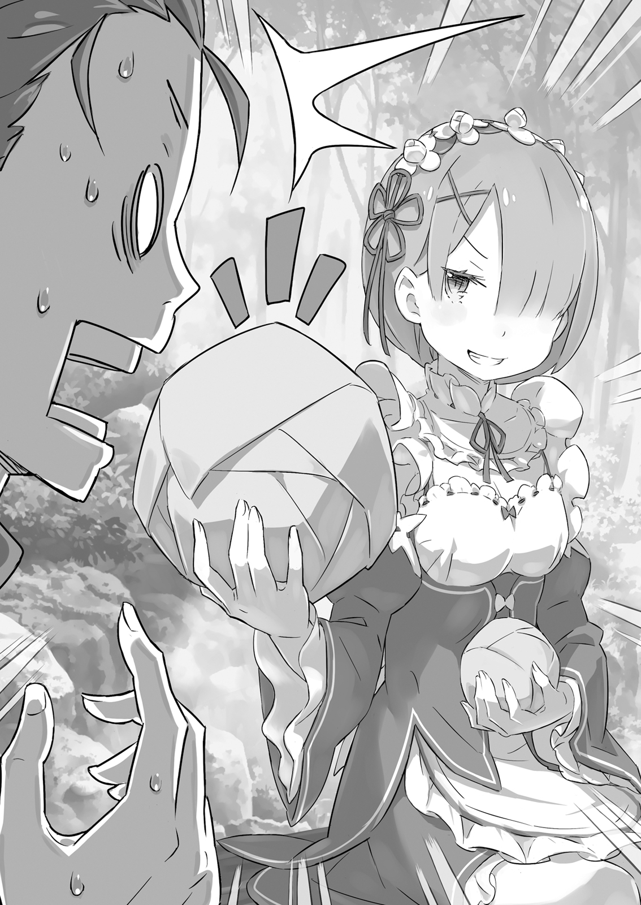
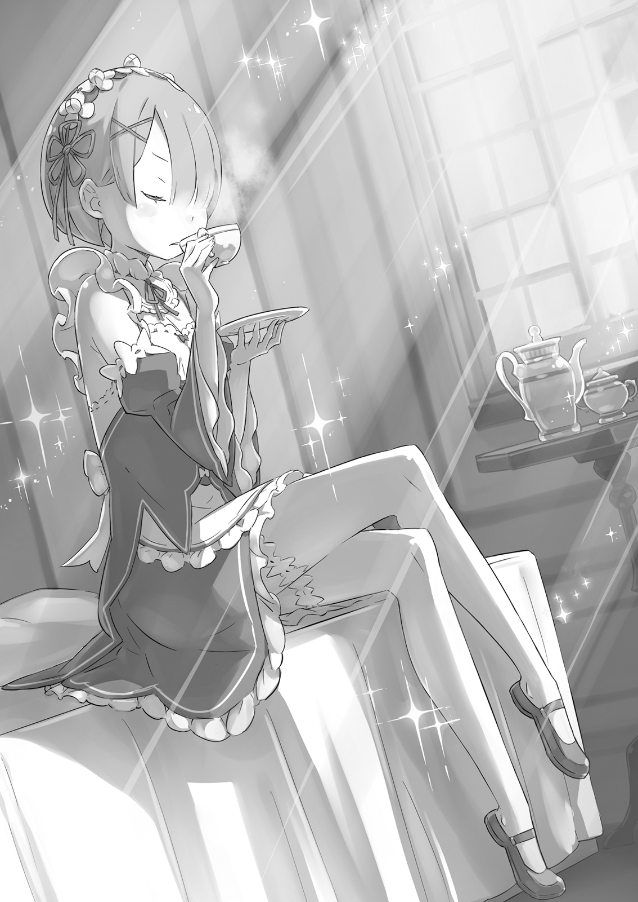

…Они были глубоко в лесу.

Плохая видимость и едкий запах травы под ногами затрудняли дыхание. Темнота, из-за которой было невозможно разглядеть что-либо дальше нескольких метров, образовалась из-за ветвей над головой, заслоняющих солнечный свет. Субару ступал по земле, осторожно пробираясь сквозь листву.

Даже течение времени казалось неясным, когда ты теряешься во мраке. Хотя он собрался на рассвете и вошёл в лес рано утром, казалось, будто солнце уже село, поскольку его окутывала пелена тьмы.

«Ну, тебе не нужно об этом беспокоиться, раз уж я здесь».

Растущее беспокойство приводило к усилению усталости. Но каждый раз, когда Субару чувствовал слабость, беззаботный голос отгонял её. Он криво улыбнулся словам беззаботного голоса, а затем посмотрел на существо над ним.

«Пап, ты всегда думаешь о том, чтобы вовремя уйти с работы. Не забудь пустить сигнальную ракету для меня, прежде чем выдохнешься и отправишься прямиком домой».

«Эй, неужели я похож на растяпу, который пренебрежёт таким важным долгом? Лия велела мне позаботиться о тебе. Так что я постара-а-аюсь».

Тем, кто ответил Субару со смешком, был дух-кот — Пак.

Величественно поглаживая бороду, он сказал: «Но знаешь», — сделал он паузу, — «это место действительно довольно жуткое».

«Да, ты прав. Но нам пока не стоит начинать беспокоиться».

«Ха-ха-ха, ты храбришься. Ты ведь всё-таки мальчик».

Субару неловко высунул язык, когда Пак раскусил его попытку казаться крутым. Даже с Паком рядом он не мог забыть о том, как тревожно ему было идти по тёмному лесу.

Причина, по которой он оказался в такой ситуации, заключалась в…

«Будь ты проклята, Рам… Я будет преследовать тебя до конца жизни твоей жизни, если умру из-за этого».

Субару цокнул языком и произнёс имя спутницы, которая отделилась от них, — последнего члена своеобразного трио, вошедшего в лес.

Сейчас для Субару главной задачей было встретиться с высокомерной и напыщенной розоволосой горничной — Рам.

«Это суеверие, что души умерших превращаются в пустоты, но раз уж речь пошла об этом, то пустоты обычно остаются в местах своей гибели».

«Значит, это что-то вроде призраков, привязанных к определённому месту?»

«Было бы забавно, если бы ты превратился в пустоты, заблудившись в лесу, и вечно бродил бы по нему в поисках жертв».

«Это было бы ужасно!»

Благодаря обмену шутками и подколками он почувствовал себя немного спокойнее. Субару, чувствуя благодарность за заботу парящего рядом с ним духа, вытер пот со лба и посмотрел вперёд.

Он чувствовал, что его спасло то, что он не один в тёмном лесу, наполненном лишь тишиной.

Вот почему он думал, что ему нужно как можно скорее найти девушку, которая была совсем одна в мрачном лесу.

…Всё началось примерно день назад.

…Во второй половине дня, предшествовавшей тому, как Субару и компания вошли в лес.

«Хаа, как же тут всё таки спокойно…»

Субару чувствовал себя как дома, небрежно облокотившись на обеденный стол. Он был одет в чёрную форму дворецкого, которая ему совсем не шла.

Хотя его первоначальное впечатление, что он наряжается во что-то, что ему совсем не подходит, несколько угасло, поскольку он чувствовал, что теперь, после всего этого времени в нём, он начал подходить ему немного больше.

По крайней мере, так он думал, оценивая себя в зеркале каждое утро.

«Кажется, у тебя прекра-а-асное настроение, Субару. Случилось нечто хорошее?»

Эмилия с заплетёнными волосами склонила голову рядом с Субару. Её прекрасные серебряные волосы каждый день были уложены в новую причёску, которая забавляла его своей новой прелестью каждый день.

«Если уж и говорить о чём-то хорошем, то это то, что ты, как всегда, прекрасна, Эмилия-тан. Ты как долгожданный дождь, который всегда наполняет моё сердце новой радостью».

«Неужели я такая мрачная?»

«Как ты вообще пришла к выводу, что я сравниваю тебя с чем-то вроде мрачных грозовых туч?!»

Его подкаты не действовали на Эмилию из-за её легкомысленности. Хотя именно из-за этого он мог так открыто с ней флиртовать.

«Кажется, я начинаю привыкать к тому, что меня не воспринимают всерьёз… Нет, я конечно хочу, чтобы меня воспринимали всерьёз, просто мужское сердце слишком сложное и труднопонимаемое…!»

«Опять лишь ты один переживаешь по всяким пустякам. Мальчики труднопонимаемые… О, этот чай вкусный».

Игнорируя Субару, который мучился из-за своих неразрешенных чувств, Эмилия аккуратно поднесла чашку ко рту и улыбнулась, сделав глоток.

Послеобеденное чаепитие в особняке Розвааля… стало обычным делом собираться в столовой во второй половине дня и отдыхать душой и телом. Это было то время дня, когда слуги отдыхали от работы, а Эмилия — от учёбы.

Те, у кого было свободное время, естественно, направлялись в столовую и немного отдыхали вместе. Это стало традицией, которая укоренилась где-то после того, как Субару приехал в особняк.

Конечно, люди делали это только тогда, когда у них было время, поэтому все обитатели особняка редко собирались вместе одновременно. Завсегдатаями были Субару, который рано заканчивал работу, чтобы встретиться с Эмилией, и Эмилия, которая обычно делала перерыв примерно в это время.

Всем было трудно присутствовать на чаепитии, и сегодняшний день не стал исключением.

«Рем-рин и Роз-чи заняты, так что ничего не поделаешь, но Беако нужно больше общаться».

Субару нахмурился, думая о молодой девушке, которая никогда не появлялась на их посиделках, хотя ей очевидно нечего было делать в своей одинокой библиотеке.

Эмилия прикрыла рот рукой и немного посмеялась над его угрюмым лицом.

«Вы двое так хорошо ладите, и ты всегда думаешь о ней».

«Я думаю, “хорошо ладят” — это немного не то слово. Это правда, что она тот человек, о котором я часто думаю, но это нужно сформулировать по-другому… это как то чувство, когда сушёный кальмар застревает в зубах. Понимаешь, о чём я?»

Эмилия ещё больше развеселилась, услышав оценку Субару, которая вызвала бы спор, если бы её услышала Беатрис, заставив его лениво и криво улыбнуться.

Это случилось, когда они вдвоём наслаждались чаепитием…

«…Похоже, вы хорошо проводите время».

Голос, внезапно прервавший их в столовой, прозвучал несколько холодно и сухо. Он исходил от девушки, стоявшей у входа в столовую, открыв обе двери. Она с безразличием взглянула на чрезмерно расслабленное лицо Субару, а затем сказала:

«Пока Рам была занята приготовлением пирожных к чаю, ты предавался своей развратной натуре, Барусу».

«Я просто немного болтал с Эмилией-тан, и это делает меня развратником?! Сестрица, это ведь ты сказала, что будешь отвечать за приготовление пирожных к чаю, так что разве это не снимает с меня всю вину?»

«Рам не нравится, что ты бездельничаешь, пока она работает».

«Ты просто тиран…!»

Субару выпучил глаза от такой нелепости, а девушка — Рам — усмехнулась, и в её глазах не было ни тени очарования.

«Рам просто добавляет свою личную оценку в оценку эффективности твоей работы, хотя обычно она смотрит на вещи беспристрастно».

«Если это так, то не добавляй ненужных точек зрения! Оценивай меня таким, какой я есть».

«Если Рам уберёт свою личную оценку из текущей оценки, тебе придётся начать есть свои пирожные с пола, Барусу».

«Почему мой рейтинг падает, когда ты убираешь свою оценку?!»

Глаза Рам выражали всю её серьёзность, и Субару, не в силах скрыть свой страх, возмутился этому. Игнорируя его жалобы, она поставила тарелку с пирожными на стол.

Пока она это делала, Субару налил чай в пустые чашки и поставил её порцию перед стулом напротив своего. Эмилия рассмеялась, увидев, как они вдвоём закончили подготовку к чаепитию.

«Что случилось, Эмилия-тан? У тебя такое милое выражение лица».

«Это потому, что вы двое действуете слаженно, даже когда злитесь друг на друга. Было забавно смотреть на вас двоих в такой ситуации».

«Отвратительно».

«Мне больно слышать такое от тебя, так что хотя бы подсласти пилюлю!» — крикнул Субару девушке, которая, казалось, не любила его от всего сердца, держась за грудь.

«Но Эмилия-тан тоже права. Раз уж ты, сестрица, тот человек, с которым я работаю больше всего… Мы делим работу между собой и делаем её каждый день, так что вполне естественно, что мы немного синхронизируемся, верно?»

«Извращенец».

«Ты можешь ответить, правильно поняв предложение?!»

« Она, как всегда, неприступна. Думаю, я заслужил похвалу за то, что не падаю духом перед её тиранией. »

В любом случае, положение Субару в особняке Розвааля было примерно таким:

Эмилия его игнорирует, Беатрис ворчит на него, Рам относится с презрением, и только Рем очень привязана к нему.

« Кажется, я в очень “хорошем” положении. »

«В любом случае, довольно удивительно видеть пирожные, которые ты приготовила, Рам. Я много раз видел, как это делает Рем, но я понятия не имел, что ты способна приготовить что-то кроме картофеля на пару, сестрица».

«Хватит нести всякую чушь, Барусу. Рам уже говорила тебе — её фирменное блюдо — картофель на пару. Она не умеет печь пирожные».

«Ты заставила свою младшую сестру испечь пирожные вместо себя?! Так значит, она из-за этого была так занята, что даже не смогла присоединиться к чаепитию?» — выпалил Субару, когда ему косвенно сказали, что она заставила свою сестру сделать это.

Он вспомнил, как Рем пришла сообщить ему о том, что не сможет присоединиться к чаепитию, с ужасно разочарованным лицом.

Вкус пирожного во рту был одновременно и жалок, и сладок.

«Но если серьёзно, этот особняк был бы обречён без кулинарных способностей Рем. Я не буду таким высокомерным, как ты, сестрица, так как знаю, что не имею права критиковать чьи-либо кулинарные навыки».

« Так как я, без сомнения, был ничтожным паразитом в своём прошлом мире. Я был сверхновой общества паразитов, который прогуливал школу, не помогал с домашними делами и был необычайно хорош в шитье и застилании постелей. »

Из-за не слишком приятных воспоминаний о своём прошлом, Субару захотел сменить тему разговора и с вопросом посмотрел на Эмилию.

Затем Эмилия, которая жевала пирожное, прикрыла рот рукой и сказала: «Я? Хмм, Субару, ты, наверное, думаешь, что я не умею готовить, но на самом деле я довольно хороша в кулинарном деле. Раньше я жила одна… Ну, Пак тоже был со мной, но он был не слишком хорош в готовке и всём таком. Поэтому для меня многие бытовые заботы — пара пустяков».

«В наше время не часто услышишь, чтобы люди говорили “пара пустяков”… И как бы это сказать… То, что ты говоришь, имеет смысл, но это просто не кажется правдоподобным, зная тебя, Эмилия-тан».

Всё это было связано с тем, что Эмилия на самом деле была довольно неуклюжей, хотя и пыталась создать образ способной девушки. После нескольких недель, проведённых с ней в особняке, его первоначальное впечатление о ней кардинально изменилось.

Его представление о ней как о гениальной девушке, которое закрепилось в его сознании в самом начале, быстро угасло, когда он увидел её глуповатую и детскую сторону в их повседневной жизни. Но, несмотря на это, её честный, добрый и прямолинейный характер не изменился, и он определённо мог сказать, что это одно из её неоспоримых достоинств.

Но, оставляя это в стороне, также верно и то, что у неё есть аура «красавицы, которая немного неуклюжа». Как и недавнее открытие о том, что у неё нет музыкального слуха.

«Я чувствую, что вокруг таится ещё много скрытых тайн».

Эмилия надула щёки, не одобряя недоверчивый взгляд Субару.

«М-м-м-м, ты выглядишь так, будто не доверяешь мне. Хмф, ладно. Если ты так сильно сомневаешься во мне, тогда в следующий раз я заставлю тебя попробовать то, что я приготовлю. Ты будешь о-о-очень удивлён, так что будь готов».

«А? Я не стремился к этому, но получил классическое событие с домашней едой? Я умру?»

У Субару была плохая привычка — начинать ожидать худшего, если с ним случалось что-то хорошее. На самом деле, с тех пор, как он был призван в этот мир, нельзя было отрицать, что хорошие события часто сводились на нет плохими. В большинстве случаев плохое событие предшествовало хорошему, поэтому он начинал беспокоиться, когда хорошее случалось первым.

«Субару, ты в порядке? Ты выглядишь обеспокоенным. У тебя болит живот?»

«Я-я в порядке. И даже если мой живот будет гореть, я съем всё, что ты приготовишь, несмотря ни на что. Поверь мне».

«Ты можешь хотя бы немного поверить в меня?!»

Из-за своего никчёмного воображением Субару заставил Эмилию дуться. Обычно здесь Рам переходила в наступление… но, сколько бы он ни ждал, этого не произошло.

«Хм? Мисс Рам? Что-то случилось?»

«…»

Он оглянулся, чувствуя себя разочарованным, и увидел, что Рам смотрит на чай. Она сделала глоток, смачивая им губы, словно что-то проверяя, а затем посмотрела на Субару.

От этого взгляда у него по спине пробежали мурашки. Острота её и без того острого взгляда на этот раз была настолько сильна, что ему показалось что им можно резать даже сталь.

«Эй, мисс Рам, что-то не так…?»

«Барусу, с какой чайной полки ты взял этот чай?»

«Чай? О, ты имеешь в виду чайные листья! О, знаешь, те, что спрятаны глубоко в чайном шкафу. Казалось, что это очень дорогой чай, поэтому я стащил его… горячо, горячо, горячо, горячо, горячо?!»

«И-ик! Субару!?»

После того, как Субару сообщил о результатах своей охоты за сокровищами, его сокровище вылили ему на голову. Пока он катался по полу из-за того, что ему на голову вылили горячий чай, Эмилия поспешно вылила на него содержимое кувшина с водой. Это была ужасная сцена, где Субару лежал на полу, мокрый от чая и воды.

Эмилия посмотрела на Рам за её внезапную вспышку насилия.

«Как ужасно с твоей стороны, Рам! Одежда Субару и пол теперь грязные!»

«Не беспокойся о грязи, беспокойся о моих ожогах!»

Но Рам не отреагировала ни на упрёки Эмилии, которая не поняла сути, ни на крики Субару. Эмилия и Субару переглянулись.

«Эй, мисс Рам, ты сошла с ума, или что? Что ты…?»

«Как ты смеешь…»

«Рам?»

«Как ты смеешь, Барусу».

Рам не могла сдержать гнев и волнение в своём дрожащем голосе.

Поэтому Субару не смог ответить ей: «Ты сама виновата». Он ничего не мог поделать, кроме как смотреть на такую же растерянную Эмилию.

По всей видимости, ситуация не ограничилась наказанием за использование спрятанного чая без разрешения. Чай был ценным — он был прав, воспринимая его как таковой, — но причина, по которой он был ценным, заключалась не в его вкусе, качестве или цене, а в его эффектах.

«Этот чай обладает способностью улучшать циркуляцию маны в теле. Он эффективен против старого шрама Рам».

«Под старым шрамом ты подразумеваешь…»

«Рог».

«О, а-а-а… понятно. Это тот самый шрам…»

Субару был тем, кого потряс смелый ответ Рам. Рам и Рем родились Они, то есть представительницами расы полулюдей. Внешне они ничем не отличались от людей, за исключением одного — у них изо лба рос белый рог, когда они волновались или испытывали сильные эмоции.

Но Рам была той, кто потерял свой рог, и называла себя безрогой. Субару не слышал, как она потеряла свой рог, но знал, что это довольно деликатная тема. Вот почему он не чувствовал ничего, кроме вины, услышав, что чай, который он использовал без разрешения, обладает лечебными свойствами, которые помогают от её старого шрама.

«Где ты взяла этот чай? На этот раз это полностью моя вина. Я заплачу тебе, когда получу деньги, так что…»

«К сожалению, чай, который действует на шрам Рам, не так-то просто достать. Это особый продукт, который Рам приготовила, смешав лекарственные ингредиенты и подобрав ему идеальный вкус по своим предпочтениям».

«Ух ты, серьёзно? Кстати… насколько плохо ты себя чувствуешь без него? Ничего серьёзного ведь не будет?»

«Вовсе нет, просто теперь Рам придётся терпеть бессонные ночи в обозримом будущем».

«Мне очень жаль!»

Это было важнее, чем думал Субару, поэтому он не мог не пасть ниц и извиниться. Он совершил серьёзную ошибку, не подумав… как будто он сделал что-то, что было повтором извечной человеческой истории. Эту ошибку будет очень трудно исправить.

(Примечания переводчика: На английском Субару использует слово microcosm of human history, то бишь квинтэссенция человеческой истории или нечто подобное, что я решил изменить в силу излишней расплывчасти и философского контекста.)

«Итак, где можно найти ингредиенты для этой особой смеси?» — спросил Субару, сидя прямо на полу, так как не мог не взять на себя ответственность.

Рам слабо улыбнулась, скрестив руки на груди и глядя на Субару сверху вниз. Эта улыбка почему-то вызвала у него мурашки по коже.

«Понятно, значит, ты действительно собираешься помочь Рам собрать все ингредиенты, верно?»

«Да, раз уж это моя вина… Но, сестрица, почему у тебя такой страшный взгляд?»

«Будь уверен, это будет легко. Все они водятся в окрестностях особняка».

Субару хотел, чтобы ему просто показалось, что он услышал «водятся», а не «растут», в отношении ингредиентов.

В конце концов, было решено, что они отправятся на следующий день, чтобы собрать ингредиенты для специального чая Рам.

Это было поспешное решение, но с каждым днём нагрузка на тело Рам увеличивалась. Вот почему лучше было поторопиться. К счастью, ингредиенты для чая можно было найти в горном лесу недалеко от особняка, так что для Субару это был однодневный поход.

«Было бы лучше, если бы Рем могла пойти с тобой, но…»

«Ничего страшного. Ты ведь не такая, как Рам. Особняк не сможет функционировать, если ты уйдёшь на день. Это то, что называется быть нужным человеком на нужном месте. Я нужный человек, но я не уверен, что поход в горы — это нужное для меня место».

Было так рано утром, что ещё даже не рассвело, и у входа в особняк собрались четыре фигуры. Субару и Рам, которые собирались отправиться в горы, и Эмилия и Рем, которые провожали их.

Как уже упоминалось ранее, Эмилия и Рем не могли сопровождать их из-за обстоятельств в особняке. По этой причине Рем с прошлой ночи не переставала беспокоиться, и даже сейчас она давала инструкции Рам.

«Сестра, сестра. Пожалуйста, позаботься о Субару-куне в горах. А ты, Субару-кун, не трогай бездумно подозрительные листья, у тебя появится сыпь. Будь осторожен, не наступай на мох на камнях, ты поскользнёшься. И заклинание, чтобы ты не плакал, если упадёшь…»

«Я потерплю! Я не буду плакать, даже если упаду! Я не такой уж и плакса!»

«Ладно, ладно, я поняла, Рем. Рам должна плюнуть на колено Барусу, если он заплачет, верно?»

«Не говори так грубо!»

Рем была полна беспокойства и стала чрезмерно опекать его, и даже ответ Рам был небрежным во второй половине их диалога.

Эмилия стояла рядом с ними, слушая их разговор и прикрывая рукой зевок.

«Я думаю, всё будет хорошо, раз уж Рам с тобой, но не перенапрягайся. Ты, вероятно, не столкнёшься с зверодемонами, так как барьер всё ещё активен, но берегись непогоды и насекомых. У тебя может появиться опухоль, если тебя ужалят».

«Я позволю тебе аккуратно залечить мою шишку, так что всё в порядке. И хотя он будет очень полезен, действительно ли можно одолжить нам Пака?» — спросил Субару, указывая на кулон, который Эмилия обычно носила на шее.

Хрустальный магический камень, излучающий зелёное свечение, был местом обитания её контактного духа — Пака. Это была своего рода страховка для них двоих, что собирались идти в горы, которую Эмилия дала Субару из-за своего беспокойства о них.

«Я попросила его об этом вчера вечером, так что всё в порядке. И даже если Пак останется здесь, он как обычно всё равно будет мешать мне учиться. Так что мне будет гораздо спокойнее, если он будет рядом с тобой».

«Ну, раз уж так, то я воспользуюсь твоим предложением и позаимствую твоего кота».

Субару криво улыбнулся и щёлкнул пальцем по кулону.

«Дух, спящий там, должен выйти, когда проснётся. Я буду полагаться на его силы в безлюдных горах.»

«Я не думаю, что случится что-то плохое, но если что-то всё же случится, Пак даст мне знать. Я сразу узнаю, где ты, когда он это сделает, и Рем обязательно придёт тебе на помощь, так что не волнуйся».

«Знаешь, люди чувствуют себя виноватыми, когда им приходится звать на помощь, заблудившись в горах, так что я буду осторожен».

Субару поблагодарил Эмилию за заботу и постучал по земле носком своих потёртых кроссовок. Он одел свой привычный спортивный костюм, учитывая, что будет ходить по горам. Если добавить к этому сумку, чтобы складывать туда собранные ингредиенты, то образ туриста Субару будет завершён.

«Ты готов, Барусу? Мы скоро уходим».

«Ага, ага. Как пожелаешь, сестрица».

Субару ответил Рам, которая обратилась к нему своим обычным тоном, а затем повернулся к ещё сонной Эмилии.

«Хорошо. Тогда я пойду. Рем, я ненавижу обременять тебя этим, но, пожалуйста, позаботься обо всём сегодня».

«Всё в порядке. Твой обед в сумке, так что, пожалуйста, поешьте его с моей сестрой по дороге».

«На самом деле, там есть и обед, который я приготовила», — добавила Эмилия.

«Готова поспорить, что ты сможешь угадать, какой из них мой».

Субару и Рам отправились в горы в утреннем тумане, провожаемые Эмилией, которая была немного в некоторой панике, и Рем, которая до самого конца смотрела на них с тревогой.

«Кстати, насчёт ингредиентов для чая… что именно тебе нужно?» — спросил Субару, глядя на маленькую спину Рам впереди после того, как они вышли на грубую горную дорогу вместо уже протоптанной деревенской. Они покинули особняк и свернули с привычной для них тропы, ведущей в деревню Алам.

«Нам понадобятся четыре ингредиента. Во-первых, цветок Милеаджии. Это редкий цветок, но к счастью он растёт в цветнике, где ты флиртовал с леди Эмилией, Барусу».

«О-о-о-откуда ты об этом знаешь?!»

«Мы можем оставить его на потом, так как знаем, где он находится. Второй находится в лесу и называется Гриб Балое, который растёт только на корнях определённого вида дерева. Его нужно высушить и измельчить в порошок. Кстати, он ядовитый».

«Он ядовитый!? Его разве можно есть?!»

«Всё в порядке, он просто сделает тебя невосприимчивым к яду. А третий достать трудно: семя красного плода, которое растёт только на верхушке Солнечного древа Борка».

«О, наконец-то ингредиент, который действительно трудно достать».

«Солнечное древо Борка — очень высокое дерево. Его плоды, кроме семян, чрезвычайно ядовиты, настолько, что твои пальцы расплавятся, если ты прикоснёшься к ним голыми руками. Имей это в виду».

«Опять яд! Ты из тех, кто умирает, если не принимает всякую ядовитую дрянь?!»

«Между ядом и лекарством очень тонкая грань, даже лекарство может превратиться в яд при злоупотреблении. Рам забыла сказать тебе, но Милеаджии не ядовиты, хотя они и насекомоядны».

«Мои прекрасные воспоминания о времени, проведённом с Эмилией-тан, оскверняются насекомоядными цветами!»

«У меня мурашки по коже пробегают, когда я думаю о том, что чай, который, как мне казалось, был очень вкусным, на 75% состоит из всего этого. Он может хорошо влиять на состояние её шрама от рога, но интересно, есть ли у него какие-либо побочные эффекты на обычный организм?»

«Со мной всё будет в порядке после того, как я его выпью?»

«Это то, что ты будешь проверять весь день, Барусу».

«Га-а! Меня использовали в качестве подопытного кролика, а я и не заметил!»

«Рам шутит. Эффект появляется сразу после того, как ты его выпьешь. Ты бы умер ещё прошлой ночью, если бы это было что-то опасное».

«Это не шутки! Он действительно был безопасным?!»

Он открыл рот и попытался откашлять чай, который выпил вчера, но тот уже давно впитался в его организм. Помолившись, чтобы ничего плохого не случилось, он переключил своё внимание на тему ингредиентов.

«Так какой последний? У меня уже плохое предчувствие насчёт него».

«Последний… ну, Рам будет держать его в секрете, пока он не будет найден. Считай это своим наказанием, Барусу».

«Может ли быть наказание хуже, чем пить яд?»

«Ты выпил его по своей воле, и технически ты отравил ещё и леди Эмилию».

На его сарказм ответили сарказмом, и Субару был вынужден замолчать, не в силах найти достойный ответ её подколке. Рам, которая до сих пор перечисляла названия лишь ядовитых вещей, держала в секрете четвёртый ингредиент.

«Последний ингредиент может быть либо чем-то совершенно нормальным, либо совершенно ужасающим, настолько отвратительным, что никто даже не захочет произносить его название. Если это единственные два варианта, я даже не хочу знать, какой из них правильный, я просто всем сердцем буду надеяться, что это первый».

«Но знаешь, поход в лес напоминает мне о том времени, когда мы искали Рем».

«Ты о том времени, когда тебя покусали собаки и тебя феерично спас Розвааль-сама?»

«Ты не ошибаешься, говоря, что это было одновременно и жалкое и прекрасное воспоминание, но на этот раз мы не столкнёмся с зверодемонами, верно? Всё, что у меня есть из снаряжения, — это моя сумка и Падающая Звезда».

«Падающая Звезда» — так Субару прозвал нож, которым пользовался. Много овощей пало жертвой Падающей Звезды, но он никогда не был полезен в качестве оружия. Лучше было бы бесстыдно бежать, чем сражаться им со стаей зверодемонов.

«Не волнуйся, никто не рассчитывает, что ты будешь сражаться, Барусу. Рам не хочет, чтобы потом её ругала Рем… Почему Рам должна получать нагоняй из-за Барусу?»

«Нет, это… извини. О, точно! Розвааль ведь уничтожил всех вольгармов в лесу, верно? Так почему мы должны беспокоиться о зверодемонах?»

«Вольгармы — не единственные зверодемоны в лесу. Разве теперь, когда территория ранее занятая вольгармами теперь пустует, то разве другие зверодемоны не должны пытаться занять её и сражаться за неё с остальными зверодемонами? Здесь не должно быть зверодемонов опаснее вольгармов, но если ты всё же столкнёшься с каким-нибудь из них, от тебя останутся только рожки да ножки, Барусу».

«Я знаю это и без твоих слов. Я больше не хочу иметь ничего общего с зверодемонами. Ну и ладно, я не думаю, что когда-нибудь снова столкнусь с ними, пока буду стараться вести тихую и мирную жизнь».

«Интересно, почему Рам чувствует, что твоё желание не сбудется, Барусу».

«Ну и почему же?»

«Это женская интуиция».

«Почему “женская интуиция” звучит так убедительно, хотя это всего лишь её догадка?»

Субару, чувствуя, что что-то не сходится, склонил голову набок от сомнения, закравшемуся ему в голову.

«Мне вот интересно, а в чём разница между зверодемонами и обычными животными?»

«…Это совершенно разные существа».

На его вопрос ответила не Рам. Знакомый голос донёсся из светящегося кулона на груди Субару — из пироксенового кристалла, из которого активно струились частицы света, которые затем приняли форму кота, материализуя духа в этом мире.

Котёнок размером с ладонь парил перед глазами Субару и говорил, хорошенько потягиваясь после долгого сна.

«Разница между животными и зверодемонами, когда дело касается внешнего вида, почти всегда заключается в наличии или отсутствии рога. Но есть и обычные животные с рогами, так что это не единственный признак, по которому их можно различать, но тебе лучше запомнить, что у зверодемонов всегда есть рог. Лучше имей это в виду».

«Спасибо за объяснение. И, кажется, ты проснулся раньше обычного».

«Лия велела мне позаботиться о тебе. Я могу оставаться с тобой подольше, если буду в режиме низкого потребления энергии. Оставь оживление ситуации мне, чтобы тебе не было страшно».

«Это определённо не та работа, которую тебе поручила Эмилия-тан».

Пак сделал случайное заявление, гордо выпятив грудь. Затем кот сел Субару на плечо и ткнул его лапой в щёку, виляя хвостом.

«Великий Дух, Рам сожалеет, что мы вынудили вас сопровождать нас всю дорогу».

«Хм-м, всё оке-ей. Лия, наверное, хочет расслабиться, пока её родитель не следит за ней».

«Что ты, заботливый джентльмен? И довольно необычно, что даже Рам так официальна с Паком».

«Это просто для вида».

«Мне нравятся такая честность и прямолинейность».

Прямолинейная Рам, всепрощающий Пак и криво улыбающийся Субару.

«Если успокоиться и подумать об этом, то мы очень редкое трио. Сочетание, которое никогда не встречалось в особняке.»

«Надеюсь, мы не превратимся в трио идиотов. Эмилия-тан рассказала тебе о сегодняшней цели, верно? Я рассчитываю на тебя».

«Да, можешь не беспокоиться. Если начнётся дождь, не стесняйся использовать меня в качестве зонтика».

«Это очень ограниченное использование, и я всё равно промокну, учитывая твой размер».

Субару вздохнул, представив себе, как надевает мокрого кота на голову.

«Эй, Рам, мне действительно начинает казаться, что на этой тропе много следов животных, ты не знаешь, где находятся ингредиенты, которые мы ищем?»

«Глупый вопрос. Как ты думаешь, сколько раз Рам ходила в горы, чтобы собрать ингредиенты?»

«Я беспокоился, что этим занимается Рем, учитывая её ежедневные обязанности. Кстати, у тебя есть карта с местоположением, чтобы даже я мог понять…»

«Давай для начала ты сам нарисуешь карту в своей голове».

«Значит, ты хочешь сказать, что мне нужно сначала всё испытать на собственном опыте. Хорошо, босс».

Один из ингредиентов был секретом, и вдобавок ко всему его нахождение зависело от памяти Рам. Он был явно бесполезен, когда дело касалось боя, но он был также бесполезен, когда дело касалось знаний.

«Зачем меня вообще сюда привели?» — задумался он.

«Для переноски вещей и в качестве комик релифа…?»

«О, когда дело доходит до оживления обстановки, я никому не проиграю! Ха-ха, посмотрим, кто лучше», — беззаботным тоном сказал Пак, пока Субару думал о своей роли, оставляя в стороне вопрос о том, кто виноват в сложившейся ситуации.

Этот голос звучал слишком беззаботно, поэтому он раздавил Пака своей щекой, лениво наклонив голову.

«Мя-я-яу».

«О, как приятно. И вот тебе ещё!»

«Мяу, мяу, мяу».

Хотя он не привык к походам, Субару нравилось ощущение шерсти на щеке, поэтому он продолжал подниматься в гору, слушая радостные визги Пака.

«…Ха-а-ах».

Рам вздохнула с досадой, глядя на двоих балбесов позади неё, которым явно не хватало серьёзности.

После этого приключения трио неоднократно сталкивалось с различными проблемами. Субару нечаянно коснулся растения, которое вызывало сыпь при прикосновении, поскользнулся на покрытых мхом камнях, небрежно порезал руку Падающей Звездой, собирая нужные им грибы, и, потеряв равновесие, упал с Солнечного древа Борка. Он был почти в слезах, преодолев все проблемы, которые преследовали его со всех сторон. Если бы не заклинание Рем, он, возможно, уже разрыдался бы от боли и жалости к себе.

«Как удивительно, что Рем дала мне советы о том, что может случиться…»

«Рам не может не разочаровываться в том, что ты воплотил в жизнь все опасения Рем. Как ты можешь так точно игнорировать то, о чём она тебя просила?»

«Перестань, не выдумывай! Не то чтобы я просто игнорировал её советы, я старался изо всех сил, но этого было недостаточно! Не суди только по результату, суди и по приложенным усилиям!»

«Результат — это всё, что имеет значение».

«Да, извини».

Субару, который был полностью промокшим, получал первую помощь от Пака. Он понятия не имел, что Пак может использовать исцеляющую магию, поэтому это было для него сюрпризом.

«Это я научил Лию магии духов, знаешь ли? Ну, у меня не очень большие способности к целительной магии, поэтому я не могу лечить серьёзные раны, как Бетти, но моих способностей достаточно, чтобы уменьшить чью-то боль».

«Виноват. У тебя ограниченное время, а я заставил тебя использовать твою MP».

«Всё в порядке. В любом случае, у тебя будут проблемы, если я исчезну».

«У меня такое чувство, что ты не собираешься перенапрягаться, чтобы остаться».

Залечив царапины на коленях и локтях, Субару благодарно дал пять танцующему в воздухе пушистому шарику. Рам, сидя у небольшого ручья, который был слишком медленным, чтобы называться потоком, взглянула на них. Они не могли пить из него, предварительно не очистив воду, но это было идеальное место, чтобы расслабиться и отдохнуть.

Сейчас было немного за полдень, и Рам предложила пообедать здесь из-за местности и того, что она проголодалась. Субару последовал за ней и как раз получил лечение своих ран.

«До сих пор нам было тяжело, но, по крайней мере, мы смогли собрать некоторые ингредиенты. Мы кое-как достали грибы и семена, и мы знаем, где находятся цветы. Это оказалось легче, чем я думал».

«Рам говорила тебе, что это не опасно. И это именно ты сегодня всё усложняешь, Барусу».

«Аргх, не могу этого отрицать…!»

Из-за его непрерывных промахов до сих пор у него не было возможности опровергнуть критику Рам. Он замочил и промыл свою раненую правую руку в проточной воде и отряхнул свой спортивный костюм, едва вернув его в первоначальное состояние. Он также промыл в реке Падающую Звезду, которую использовал для сбора грибов, и, немного отдохнув…

«Раз уж мы здесь, нам нужно как следует отметить эту реку».

Глядя на течение реки, Субару достал из сумки лист плотной бумаги и инструмент, похожий на карандаш. Карандаш был только одного цвета, но им можно было создавать изысканные рисунки. Он не забывал добавлять тут и там аннотации на японском языке.

«Ты делаешь это с тех пор, как мы вошли в горы. Что это за игра?»

«Это не игра! Это нечто по-настоящему ценное!»

Субару спорил с Рам, которая заглядывала ему в руку, роясь в ланч-боксе. Он сунул рисунок, который только что нарисовал, Рам в лицо.

«Смотри, я рисую карту. Люди составляют карты, когда проходят по неизведанным землям. У человека не будет никаких проблем в будущем, если он будет знать, где что находится, верно?»

«Довольно умело нарисовано. Но будет ли эта карта когда-нибудь использована? Даже если ингредиенты для чая закончатся, Рам придёт сюда, чтобы собрать их. Рем тоже сможет это сделать, если Рам скажет ей, где они находятся».

Рам начала сомневаться в целесообразности карты, и Субару с кривой улыбкой свернул карту. Она права.

«Это может быть ненужным для неё, так как она привыкла собирать ингредиенты, но…»

«Это всего лишь гипотеза, которую я придумал, но…»

«Гипотеза?»

«Чай заканчивается, и тебе становится так плохо, что ты оказываешься прикованной к постели. И Рем уезжает из особняка по делам, когда ты нуждаешься в ней. Розвааль тоже где-то ещё. Тебе не на кого положиться! Если что-то подобное случится, то тогда даже я смогу собрать ингредиенты, если у меня будет эта карта».

«Это то, что можно использовать только в случае крайней необходимости, но…»

«Мне будет гораздо спокойнее, если у нас будет эта карта на случай, если что-то подобное произойдёт».

«Будет хорошо, если она никогда не пригодится, но в случае, если она всё-таки пригодится, это будет благодаря моему решению составить эту карту. Люди создают спасательные средства с мыслью, что было бы лучше, если бы они никогда не пригодились. Такое противоречие существует для всего.»

«…»

Рам на мгновение замолчала, услышав ответ Субару, с серьёзным выражением лица. Казалось, она была немного удивлена, и он почесал затылок, увидев её редкую реакцию.

То, что он только что сказал, может быть чем-то смущающим, в зависимости от того, как это будет воспринято.

«Ну, в любом случае, если у нас будет эта карта, я чувствую, что смогу вернуться живым, если заблужусь! Нет ничего важнее, чем остаться в живых, поэтому стоит принять меры предосторожности».

Субару заговорил быстро, чтобы скрыть своё смущение, и сунул свёрнутую карту в карман на бедре.

«Нужно всё как следует записать, включая и то, что я написал на японском, как только я вернусь в особняк. Я впервые составляю карту, но, думаю, у меня неплохо получилось, если можно так сказать.»

Тот факт, что он был очень искусен в рисовании и составлении карт, было его сильной стороной, о которой Нацуки Субару никогда не знал.

«А теперь давайте поедим. Если мы не поторопимся, я могу не сдержаться и съесть Пака», — сказал Субару, хлопнув в ладоши, меняя настроение.

«…Ты прав. Да, давайте пообедаем», — ответила Рам, соглашаясь с предложением Субару. Она развернула обед и на мгновение замолчала в задумчивой тишине.

«Раз уж в кои-то веки твоя забота тронула сердце Рам, позволь ей наградить тебя за это».

«А, что ты имеешь в виду? Мне неловко, и, честно говоря, у меня плохое предчувствие, поэтому я вынужден отказаться».

«О, кажется, старый шрам от рога Рам начинает болеть. Рам кажется, что у неё может быть жар».

«Не бери мою совесть в заложники! Ладно! Давай! Я приму всё, что ты мне предложишь!»

«Не стоит так суетиться. Рам просто подумала дать тебе самый большой».

Рам показала волнующемуся Субару рисовый шарик в левой руке. Он был размером с детский кулак, что заставило его почувствовать облегчение, когда он его увидел.

«Блин, ты меня напугала. Я боялся даже представить, какого размера он будет. Но это вполне приемлемый размер, вернее, нормальный размер».

«Рам полагает, что так. Ну, тогда держи свой».

А затем, когда Субару почувствовал облегчение, Рам представила настоящий рисовый шарик, который она прятала в правой руке. Его размер, который, казалось, был размером с голову ребёнка, лишил его дара речи.

«Кстати, форма не очень, так что его определённо сделала леди Эмилия».

«Я так и знал! Чёрт возьми, что это за «На самом деле, там есть и обед, который я приготовила», когда ты даже не собираешься это скрывать! Ты даже не собиралась это скрывать!»

«Я думал, она приготовила это рядом с Рем, но интересно, так ли это на самом деле? Если это результат того, что она приготовила это, стоя рядом с ней, то мысль о том, что она когда-нибудь продемонстрирует мне свои кулинарные способности без присмотра Рем, пугает меня до чёртиков!»

Субару посмотрел на Пака, как на свой последний луч надежды, но дух покачал головой на его взгляд.

«Лия милая. Я думаю, ей можно всё простить».

«Чёрт возьми, почему я так хорошо понимаю это чувство!»

Субару решил встретиться с этим лицом к лицу, увидев, как Пак посмотрел на него с отстранённым, смирившимся взглядом. Вкус простого рисового шарика будет одинаковым, независимо от того, кто его приготовил.

На всякий случай он сначала попробовал рисовый шарик Рем, впитав всю её заботу, а затем попробовал рисовый шарик Эмилии.

«…Он тяжёлый».

Масса у него на коленях была огромной. Настолько, что представление Субару о том, как должен выглядеть рисовый шарик, перевернулось с ног на голову.

Он сглотнул и положил руку на обёртку, чтобы взглянуть на него…

«Под этой обёрткой есть ещё один?»

Решившись, он развернул бумагу, но под ней обнаружил ещё один лист обёрточной бумаги. Вероятно, это произошло потому, что она сделала его слишком большим, и не смогла удержать всё это вместе всего одним листом. Поэтому в качестве контрмеры она обернула его несколькими листами и успешно удержала всё вместе.

Это как запечатывание чрезвычайно могущественного демона за слоями барьеров.

«Нет, вы что шутите?»

Субару был ошеломлён собственными мыслями, затем развернул обёртку и проверил, что внутри. Чувствуя нетерпение из-за того, что настоящий рисовый шарик не показывался, он разворачивал листы один за другим…

«…А». Три голоса слились воедино, включая голоса Рам и Пака, которые наблюдали за происходящим, затаив дыхание.

В тот момент, когда Субару попытался снять прилипшую обёртку, рисовый шарик потерял равновесие у него на коленях, затем упал и покатился. Этот круглый-но-не-круглый предмет подпрыгнул на земле и покатился прочь.

«Подожди, подожди, подожди!»

Субару поспешно вскочил на ноги и погнался за катящимся рисовым шариком. Ситуация была похожа на известную старую сказку «Колобок». Это было почти идеальное воспроизведение. Прежде чем рисовый шарик успел скатиться с горки и ускориться, Субару кончиком пальца поймал обёртку. Он почувствовал облегчение, но в следующее мгновение…

«О?»

Его ноги внезапно ушли из-под него, и он взлетел в воздух. Он посмотрел вниз и увидел, что склон резко уходит вниз. На ум пришли два слова: «скольжение» и «падение».

Субару был впечатлён и зарычал от точного воспроизведения народной сказки. Конечно, в плохом смысле.

«Барусу!..»

«Дабабабабабабабаба!..»

Слыша панический голос Рам, Субару покатился головой вперёд по крутому склону, прижимая рисовый шарик к груди. Думая о том, что единственное, что радовало — это то, что земля была мягкой благодаря растущей на ней траве…

…И наконец, история вернулась к началу, где Субару и Пак путешествовали вместе.

«Я думал, что умру, когда упал и покатился…»

«Я тоже так думал. Но я рад, что ты не умер. И что мы смогли связаться с розоволосой горничной».

«Очень помогло то, что ты умеешь летать… ты же мог поднять меня и полететь, знаешь ли?»

«Думаю, у тебя просто выпали бы волосы».

«Зачем тебе держать меня за волосы во время полёта!? Есть и другие способы сделать это!»

Ведя такой разговор, Пак и Субару стремились встретиться с Рам. Пак сразу же полетел вниз, после того как Субару скатился по склону, чтобы проверить, жив он или мёртв. Субару поймал его там и заставил использовать малых духов, чтобы связаться с Рам по поводу места встречи. Рам настаивала на том, что она может просто спуститься по склону, но Субару, который в тот день достаточно накатался, отклонил эту идею, сказав, что это слишком опасно.

«Мы сможем встретиться, если пойдём вдоль склона. Я не могу заставить её делать что-то опасное».

«Я передал ей что-то вроде этого жестами. Хочешь услышать ответ?»

«Ха!» — воскликнул Субару, имитируя усмешку Рам.

«Ух ты, здорово», — заметил Пак, словно впечатлённый представлением Субару.

«Кстати».

Котёнок склонил голову набок, глядя на съёжившегося Субару.

«Ты смог съесть рисовый шарик, который приготовила Лия?»

«Да, то, что было внутри обёртки оказалось цело. Если не считать того, как он выглядел, на вкус он был вполне нормальным. Солёный вкус казался особенным, когда я думал о том, что его сжимали руки Эмилии-тан…»

«Может быть, мне стоит присоединиться в следующий раз, когда они будут делать их снова. Ты уверен, что сможешь правильно угадать мой?»

«Изюминкой будет то, что рисовый шарик с большим количеством шерсти будет твоим, да?»

Их бессмысленный разговор продолжался, но это было то, что Пак делал для того, чтобы Субару не волновался. Отделённые от Рам они шли вдоль склона уже два часа, — после того, как сказали ей, куда идти, — но они продолжали углубляться в лес, где их окутывало ещё более густой тьмой.

«Возможно, я принял неправильное решение».

Такая плохая мысль породила цикл негативных мыслей.

«…Субару, стой».

Как раз в тот момент, когда Субару издал долгий вздох истощения, Пак потянул его за ухо с плеча.

Субару затаил дыхание от этого ощущения и напрягся. В тот же миг неприятный звук резанул ему по барабанным перепонкам. Это был звук, который пугал других существ, звук, который был физиологически неприятен. Источник этого звука медленно появился перед ними из кустов. У него была скользкая, влажная чешуя, растущая на зелёном теле, а его пасть, в которой был ряд острых зубов, издавала пугающий звук, словно высасывала кровь. Однако наиболее примечательной особенностью были две пары красных глаз, светящихся в темноте.

Двухголовая змея — змея с двумя головами на теле — смотрела на Субару. На её головах росли короткие белые рога.

«Это… тот вид змеи, который маскируется под зверодемона, правда ведь? Скажи что это правда!…»

«Интересная интерпретация, но это зверодемон. Это Двухголовая змея. Она довольно свирепа и ядовита».

У зверодемона перед его глазами не было двух голов, отходящих от туловища как его продолжение. Всё было гораздо проще. На хвосте была ещё одна голова. Это действительно была двухголовая змея, соответствующая своему названию, но…

«Это не двухголовая змея, а скорее змея с головой на заднице? Как она вообще какает?»

«Зверодемоны превращают то, что они съели, в ману, поэтому они, по сути, не какают».

«Значит, они как идолы. И, похоже, они ещё и нарушают экосистему».

Хотя Субару выглядел расслабленным, его инстинкты кричали ему, чтобы он остерегался двухголовой змеи перед ним. Зверодемон был около двух метров в длину и находился на расстоянии около десяти метров от него. Он мог преодолеть это расстояние в одно мгновение.

«Я не спрашивал, но сегодняшний Пак из тех, кто умеет драться?»

«Ага, такой зверодемон для меня — пара пустяков. Но у меня нет помощи Лии, поэтому я не смогу говорить с тобой после того, как убью его».

«Это лучше, чем умереть, так что, пожалуйста, сделай это, учитель».

«Полагаю, ничего не поделаешь. Тогда я тебя не подведу… о».

Пока они разговаривали, цвет тела и глаз двухголовой змеи изменился. Зверодемон окрасился в агрессивный цвет, а затем тут же изогнул своё огромное тело и попытался прыгнуть на Субару, но…

«Фура-а-а!»

В следующее мгновение клинок ветра разрубил двухголовую змею, превратив её в кольца плоти. Она умерла перед удивлённым Субару без единого предсмертного вздоха. Он стал свидетелем смерти зверодемона, изрыгающего сине-зелёную кровь, а затем посмотрел на Пака. Кот покачал головой.

А потом…

«Рам знала, что её женская интуиция была права».

Та, кто вышла из кустов, откуда появился зверодемон, и сделала саркастическое замечание в тот момент, когда он появился, была Рам.

После того, как они снова встретились через несколько часов, Рам в итоге спасла Субару, который был в отчаянном положении, с палочкой в руке.

«Ха-а, спасибо, Рам».

«Твоя карта пригодилась во время похода?»

«Сестрица, радость от нашего воссоединения была недолгой, но замечательно, как ты никогда не упускаешь возможности добавить специю, известную как сарказм».

Рам усмехнулась Субару, который сел с облегчением, а затем подошла к туше двухголовой змеи, убрав палочку. Пока она внимательно осматривала тушу зверодемона, Субару сказал: «Э-эй, что ты делаешь?»

«Разве это не очевидно? Рам делает то, зачем пришла сюда. Хотя всё пошло по плану Рам, ты хорошо поработал, Барусу».

Говоря это, Рам разрезала тело двухголовой змеи, которая была нарезана на кольца клинком ветра, — прямо посередине, — и вырвала какой-то белый кристалл.

«Это чистый кристалл маны, который образуется внутри тела зверодемонов. Он больше, чем ожидалось».

«Значит, это и есть четвёртый ингредиент? Он был внутри ядовитой змеи. Черт, это даже хуже, чем я думал».

Когда Рам с удовлетворением достала ингредиент, Субару почувствовал разочарование от того, что худшее из его двух предположений оказалось верным. Было очевидно, почему Рам молчала. Если бы он знал, что это связано с зверодемонами, он был бы более осторожен, и…

«Ха! Теперь я понимаю, зачем меня сюда привели! Ты планировала использовать мою способность привлекать зверодемонов, чтобы привлечь эту змейку, не так ли?»

«Ты сегодня необычайно проницателен. Благодаря тебе поиск зверодемонов, который обычно занимает несколько дней, был завершён менее чем за полдня. Рам хвалит тебя за то, что ты был полезен».

«Ты…»

Даже Субару разозлился на Рам за то, что она не раскаивалась.

Субару и Рам были теми двумя, кто вместе отправился в лес кишащий зверодемонами, чтобы спасти Рем. Она явно знала о его способности и о том, насколько она может быть опасна. И если она всё равно заставила зверодемона пересечь барьер, зная об этом, и использовала его в качестве приманки для зверодемонов, это был как удар в спину…

«Нет, погоди-ка… Когда это он пересёк барьер?»

Субару понял, что предпосылка для этого была странной, и посмотрел на Пака. Даже если у него беззаботный характер, в конце концов он дух. Может ли быть, что этот кот не знает о барьере?

«Хм-м-м, ты не заметил? Субару, это…»

«Великий Дух».

Пак собирался ответить на подозрения Субару, но Рам прервала его, окликнув. Субару почувствовал, что в их обмене репликами что-то не так, но Рам проигнорировала это и пошла дальше. Но она внезапно потеряла равновесие, и…

«Эй, Рам!»

Субару быстро схватил руку пошатнувшейся Рам и поддержал её падающее тело, и был шокирован тем, насколько безумно горячей она была. Её лоб и шея были покрыты потом, когда он посмотрел на неё.

«Всё как в тот раз, когда мы сражались с вольгармами! Так ты ещё и использовала слишком много маны! Эй, Рам!»

«Это не так уж и… важно… Отпусти руку Рам».

Она была скорее упрямой, чем стойкой. Не позволив ей даже проворчать, Субару поднял её на руки, как и в прошлый раз. Её тело было таким же лёгким, как обычно. И оно продолжало нагреваться.

«Извращенец».

«Заткнись и просто будь молчаливым багажом! Эй, Пак! Брось этот ингредиент в сумку! А после этого отведи меня к Солнечному дереву Борка. Карта пригодится… ты же знаешь дорогу, верно?!»

«Похоже, мой злодейский план раскрыт. Ладно, ладно, я сделаю это».

Субару побежал за Паком, который летел впереди него, неся на руках недовольно выглядящую Рам. Бежа без оглядки на окружение, он поцарапал ноги и плечи о ветки, получив синяки.

Субару бежал с несколькими царапинами на коже. Это случилось бы с каждым, кто бежит, не обращая внимания на окружение. Поэтому было естественно, что на белой коже Рам тоже было много красных отметин.

«Другими словами, она изначально не собиралась использовать тебя в качестве приманки. Ей просто нужно было, чтобы ты подошёл к барьеру и выманил подходящего зверодемона. Но поскольку ты погнался за рисовым шариком и покинул барьер, ты всё усложнил».

Субару и остальные вернулись в особняк примерно к ужину, как и заявили тем утром.

Само собой разумеется, все трое вернулись с ранами и уставшими, поэтому после этого им не удалось насладиться спокойным ужином.

«Я думаю, она очень старалась найти тебя с помощью ясновидения, пока вы не встретились. Поэтому, я думаю, это и было причиной того, что она так устала. Хотя она никогда в этом не признается».

«И почему ты помогал Рам?»

«Потому что меня попросили об этом. Нельзя сказать, что я действительно сотрудничал с ней, поскольку мне просто нужно было защитить тебя, когда у тебя возникнут проблемы. Это было просто продолжением просьбы Лии, понимаешь? Ну, у тебя возникли проблемы из-за её рисового шарика, поэтому я хотел бы извиниться перед тобой за это от её имени».

Дух, который помогал ему ориентироваться даже после окончания рабочего времени, исчез, рассказав ему правду.

За окном давно стемнело, и дух, который работал сверхурочно, завтра обязательно будет спать дольше обычного. Субару тоже очень хотел завалиться спать, но ближайшая кровать, к сожалению, была занята тем, кто уже крепко спал, поэтому его желание вряд ли сбудется.

«Я не смогу расслабиться, пока хотя бы немного не пожалуюсь», — сказал Субару рядом с Рам, которая спала на кровати, почёсывая затылок.

В особняке поднялся переполох, когда Субару вернулся с Рам без сознания. Особенно Рем, которая была в такой панике из-за такой необычной ситуации, что Эмилия на её фоне казалась более надёжной.

Она залечила ссадины Рам, обтёрла её, одела и отнесла на кровать. Субару допросили — опустив часть про рисовый шарик Эмилии, — и он объяснил, что произошло, и отдал собранные ими ингредиенты Рем. Сейчас чай уже заваривался.

Хотя Субару сказали отдыхать, он пришёл сюда вместо того, чтобы вернуться в свою комнату.

«Мне нужно хотя бы выплеснуть своё разочарование на неё, когда она проснётся.»

А потом…

«Извращенец».

Это было первое, что сказала Рам, слегка открыв глаза и увидев Субару, стоящего у её кровати.

«…Рем разрешила мне быть здесь».

Субару криво улыбнулся тому, что Рам вела себя как обычно, а затем похлопал себя по груди.

«Как видишь, мы вернулись в особняк целыми и невредимыми. Я отдал собранные нами ингредиенты Рем. Кстати, моя карта очень помогла нам вернуться сюда. Бережёного Бог бережёт, не так ли?»

На самом деле, простая карта, составленная Субару, оказала необычайное влияние на события. Он заставил Пака привести его к Солнечному дереву Борка, которое выделялось, как бельмо на глазу, а затем отправился прямо в особняк, следуя карте.

«Если бы не карта, мы бы, наверное, сейчас ночевали в лесу».

«Ну, если бы это случилось, Рем бы поспешила туда, после того как Пак сообщил бы ей об этом… Если ты усвоила урок, ты должна признать, что карты полезны. И доверяй своим спутникам. Не используй их в качестве приманки без их разрешения».

«…Но это был самый эффективный способ, не так ли? Если хочешь пожаловаться, то пожалуйся».

«Не жаловаться — это мой способ жаловаться. Так как это, похоже, лучше действует на вас, сестёр».

Рам смотрела искоса на Субару, положив голову на подушку, её щёки слегка покраснели. Субару ухмыльнулся её реакции и почувствовал удовлетворение от ситуации.

«Пак рассказал мне всё. Меня это разозлило, но я не буду на этом зацикливаться».

«Распространено мнение, что духи праведны и скрытны, но, узнав этого Великого Духа, Рам засомневалась в этом. Рам больше никогда не будет на него рассчитывать».

«Не говори о нём плохо, ведь его туристические способности спасли нам жизнь… И я сейчас пойду за Рем. Мне нужно сказать ей, что ты уже проснулась».

Субару пожал плечами, глядя на Рам, которая жаловалась на Пака.

«Подожди, Барусу. У Рам есть просьба… нет, приказ».

«Не исправляй это таким образом, что у меня пропадает вся мотивация. Так чего ты от меня хочешь?»

«В задней части ящика стола должен быть белый пакет. Завари Рам чай из него. Для нас двоих».

Следуя указаниям Рам, он открыл ящик стола и обнаружил пакет, спрятанный в глубине. И то, что было внутри…

«Эй, разве это не твой специальный чай…»

«Естественно, нужно же было сохранить немного на всякий случай. А теперь иди».

Субару отправился в столовую по приказу Рам, приказу, за которым стояло достаточно сильное давление, чтобы требовать его послушания. Он чувствовал слабость и задавался вопросом, для чего были все эти труды сегодня. Оказавшись там, он вскипятил воду и приготовил чай.

Если подумать, большей части работы в особняке я научился у Рем, но заваривать чай — это единственное, чему я научился у Рам. Она очень привередлива в чае.

«Вот, я вернулся, мисс. Это чай из змеиной печени, который вы заказали».

«Он сделан не из змеиной печени. Он сделан из собачьих кишок».

«Разница не велика».

Вопреки тёплому аромату, ингредиент был получен жестоким способом. Субару разлил чай по двум чашкам и протянул одну Рам, которая села на кровати. Субару тоже взял чашку и сел на стул около неё.

Пахнет очень хорошо. Запах не позволяет поверить, что он сделан из порошка ядовитого гриба, семян ядовитого фрукта, насекомоядного цветка и кристалла из тела зверодемона…

«Я знаю, что это я его заварил, но трудно настроиться на то, чтобы выпить его, когда знаешь, из чего он сделан… В любом случае, почему ты называешь это чаем, когда в нём нет чайных листьев?»

«Рам обработала все ингредиенты вместе и смешала их с чаем, который ей нравится, чтобы улучшить вкус. Он классифицируется как чай, так что не волнуйся», — сказала она, прежде чем без колебаний наклонить чашку.

У Субару не было выбора, и он сделал то же самое. Жар и аромат прошлись по его языку и вырвались из носа. Богатый вкус чая делал его лёгким для питья, настолько, что ему было трудно поверить, что в него добавили собачьи кишки и различные яды.

«Интересно, это скорее из-за моих навыков заваривания чая, или из-за качества самого чая?»

«Не глупи. Вкус определённо испортился из-за того, что ты так плохо его заварил. Ты использовал не правильную температуру воды и не налил его должным образом».

Резкий отзыв охладил энтузиазм Субару, и он продолжал пить его с кислой миной. Несмотря на то, что его было легко пить, он не мог заставить себя полюбить чай. Его язык был таким же детским, как обычно.

«А-а-а, хочу газировки. Интересно, смогу ли я как-нибудь сделать шипучие напитки…»

«Рам никогда раньше не слышала об этом напитке. Если ты знаешь, как его приготовить, можешь обратиться к Рем».

«Это то же самое, что и с майонезом, в том смысле, что ингредиенты немного расплывчаты. Нет, даже больше».

Вкус, который заставлял его чувствовать себя так, словно он вернулся на свою далёкую родину… они прошли через множество трудностей, чтобы воссоздать его. Свежие яйца, качественное масло, уксус, соль и перец по вкусу. И, наконец, терпение. Майонез, который был успешно воссоздан путём проб и ошибок с Рем и Рам, теперь хранился на кухне особняка Розвааля. Не будет преувеличением сказать, что приготовление майонеза в этом мире было самым большим достижением Субару с тех пор, как он стал зависимым от майонеза.

«Но я всего лишь зависим от майонеза. Так что быть непревзойдённым в другом мире, используя потусторонние знания, — это несбыточная мечта».

«Рам думает, что ты опять несёшь чушь, но она поняла, что Барусу бесполезен, когда дело касается его желаний».

«Довольно образное выражение, что я бесполезен для себя самого, хотя ты и не ошибаешься».

Субару криво улыбнулся тому, на что указала Рам.

«Она права в этом, и я должен сказать, что это расстраивает».

Рам прищурилась, глядя на Субару с таким настроем. А затем она наклонила чашку и смочила языком и губами чай.

«Рам не знает, что любят пить люди на твоей родине, но не знать вкуса чая — это большая потеря в жизни».

«Дело не в том, что я не знаю, какой у него вкус, просто на вкус он как листья».

«Ты можешь с таким же успехом быть мёртвым, если не можешь наслаждаться чаем».

«Неужели чай — это единственное, что имеет значение в жизни?!»

Рам вздохнула на его удивлённый ответ и повернула голову, чтобы посмотреть на него своими розовыми зрачками.

«Верно», — сделала она паузу.

«Ты такой жалкий, так что… внимательно следи за тем, как Рам заваривает чай впредь».

«…»

Она заявила, что в следующий раз сама заварит чай, и тихо поднесла чашку ко рту. Субару почувствовал, что его щёки странно расслабились после её слов.

«Я не знаю, почему, и она даже не извинилась за сегодняшний день».

Но он чувствовал, что пока что всё в порядке. Это было комфортно, но странно, без споров из-за разногласий, без извинений, чтобы помириться, и без данных обещаний.

«Если наши отношения будут такими, я могу рассчитывать на то, что снова присоединюсь к ней за чаем, хотя я даже не люблю чай».

…Аромат чая витал в воздухе, и это был день, когда Субару подумал именно так.

《Конец》
