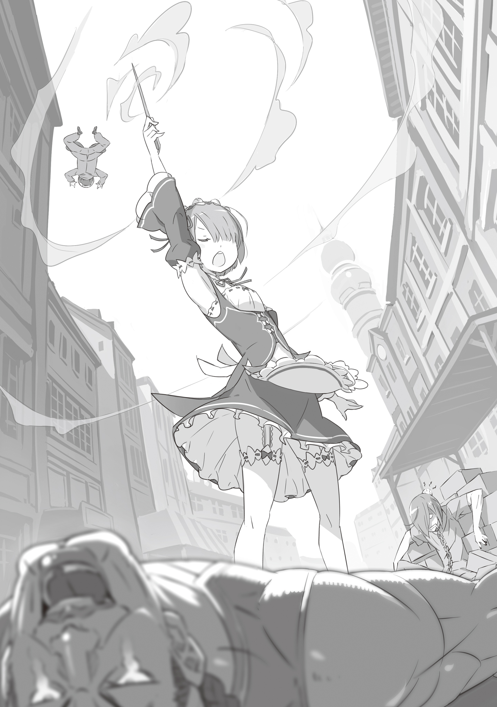

— Боже, сколько же хлопот с госпожой Эмилией.

Девушка тихо выдохнула, приложив руку ко лбу с видом крайней усталости, и окинула взглядом толпу, снующую перед ней.

У неё была очаровательная внешность. Персиковые волосы, подстриженные в короткое каре, были уложены так, что чёлка скрывала левый глаз. Правильные черты её лица вызывали желание назвать его скорее миловидным, чем красивым. Однако в этом лице сквозила некая прохладца, а в бледно-розовых глазах царил эмоциональный штиль.

Стоя посреди шумной улицы, девушка водила взглядом из стороны в сторону, и каждый раз, не находя нужного силуэта, испускала тяжёлый вздох.

Многие прохожие бесцеремонно таращились на застывшую в потоке людей фигуру. Причиной тому был её наряд.

Мужчины с кожей рептилий, танцовщицы в одеяниях, больше напоминающих нижнее бельё… Даже для пёстрой столицы, где спокойно разгуливали зверолюди, похожие на домашних питомцев, вид этой девушки — наряд горничной — разительно выбивался из общей картины.

Классическое платье-фартук, выдержанное в чёрных тонах, и аккуратный чепчик на голове — образ был соблюдён до мелочей. Такова была униформа, продиктованная вкусом её господина, и девушка не имела ни малейших возражений против её ношения. Любопытные взгляды на улицах тоже были делом привычным, она давно научилась их игнорировать.

Гораздо больше, чем низменное вожделение или праздное любопытство прохожих, девушку угнетал совсем другой фактор.

— Попросила ведь подождать, но, похоже, наша драгоценная особа совершенно не умеет сидеть на месте.

Служанка, потерявшая «госпожу», которую должна была сопровождать, высокомерно пожала плечами.

Девушку с волосами цвета спелого персика звали Рам. У неё не было фамилии — просто Рам.

Она служила горничной в поместье Розвааля L. Мейзерса, маркграфа Лугуники. В этот день она прибыла в столицу, сопровождая одну особу.

Столица Лугуники превосходила любой другой город страны и по числу жителей, и по суете на улицах. Для Рам, неоднократно посещавшей её вместе со своим господином, столичные пейзажи давно утратили новизну и не вызывали никакого трепета. Однако…

— Госпожа Эмилия наверняка считает иначе. Раньше у неё не было возможности вот так свободно гулять.

Рам продолжала поиски, чинно вышагивая по брусчатке и перебирая в уме варианты маршрутов потерявшейся спутницы.

С момента их расставания прошло не более четверти часа. Если пропавшая была неосторожна, но не глупа, она не могла уйти далеко от точки расставания. Так рассудила Рам.

Впрочем, выбор направления на первом перекрёстке — свернула она направо или налево — оставался вопросом чистой удачи. Если горничная ошиблась в расчётах, воссоединение станет задачей архисложной. И если так… что ж, тут уже ничего не попишешь.

— Терпения госпожи Эмилии не хватило даже на то, чтобы спокойно дождаться отправки письма, и она ускакала. Сама виновата. Вины Рам здесь нет.

Заявление звучало как верх наглости, но поблизости не было никого, чей статус позволял бы одёрнуть зарвавшуюся служанку. Поэтому реплика Рам ушла в мир без какой-либо цензуры.

Слова и поступки этой девушки часто шли вразрез с положением скромной горничной, но её господин не только не пресекал подобное, но и всячески поощрял. «Индивидуальность, индивидуальность! Разве это не прекра-а-асно?» — любил приговаривать он. А поскольку для Рам не имела значения ничья оценка, кроме оценки её господина, характер её оставался неизменным.

И всё же, даже такая бесцеремонная натура не находила удовольствия в сложившейся ситуации.

— Нужно было хотя бы условиться о месте встречи. Какая оплошность. Использовать «Ясновидение» в такой толчее слишком затратно, Рам просто не переварит такой объём информации…

— Эй, сестрёнка в таком крутом и броском наряде горничной!

— Значит, остаётся только расспрашивать и искать на своих двоих. Боже, какая морока.

— Эй-эй-эй, ну ты чего, в натуре меня игноришь? Сюда! Сюда смотри!

Раздражающий голос забежал вперёд, преграждая путь Рам, которая пыталась гордо удалиться, пропустив оклик мимо ушей.

При взгляде на обладателя голоса её всегда бесстрастное лицо дрогнуло. И это было вполне естественно.

— Воу-воу, ну и гримаса. Будто на таракана посмотрела. Дяде вообще-то обидно.

— Любой скривится, если к нему прилипнет подозрительный тип с невнятной дикцией.

Рам отрезала ледяным тоном, но в этот раз никто не посмел бы упрекнуть её за грубость. Слишком уж фигура, возникшая перед ней, выбивалась за рамки нормального.

Голову незнакомца полностью скрывал чёрный лакированный шлем характерной формы, напоминающей бычьи рога. Будь дело только в этом, его можно было бы счесть просто чудаком, прячущим лицо. Но ниже шеи на мужчине были не латы, а обычная, даже дешёвая одежда горожанина, видавшая виды. А на ногах — о чём он только думал? — красовались плетёные соломенные сандалии на босу ногу.

Если это не «подозрительно», то что тогда вообще означает это слово?

— Уровень безопасности в столице удручает. Стой здесь, я позову стражу.

— Не записывай меня в извращенцы с ходу, ладно?! Чувствуй реальную опасность, эй! Ты ж даже не дослушала!

Подозрительный тип в панике попытался остановить девушку, которая уже собралась применить тактику «Немедленный донос при обнаружении зла». Заметив его неподдельное отчаяние, Рам отложила подготовку к громкому крику о помощи и пронзила мужчину острым взглядом.

— Как недружелюбно… Слушай, я просто ищу одного человека. Хотел спросить, не видела ли…

— Какое совпадение. Я занята тем же самым. Так что желаю удачи.

— Ты ж в костюме горничной, символе служения людям, а ведешь себя так, словно у тебя сердце изо льда! Даже слова вставить не даешь!

Мужчина протянул руку, пытаясь задержать Рам, которая уже собиралась обойти его. В этот миг, проскальзывая мимо, горничная заметила одну деталь.

У него не было левой руки. Он был одноруким.

— О, заметила и пожалела, да? Ага-ага, из-за этого мне, сама понимаешь, живется труднее, чем остальным. Я выживаю, сшивая свою жизнь лоскутами людской доброты и жалости. Разве я не бедняжка?

— Не хватает рук — одолжи кошачью лапу. Ноги есть — ищи сам. Всё, разговор окончен.

— Слишком сурово!

Человек в шлеме продолжал загораживать дорогу, и лицо Рам начало стремительно терять последние остатки тепла. Уловив перемену в её настроении, мужчина судорожно замахал единственной правой рукой: — Да я просто спросить хочу, говорю же! Ты не видела девушку примерно твоего возраста? В платье, с рыжими волосами и… ну, с очень внушительной грудью?

— Не видела. И это чистая правда, безотносительно моего к тебе отношения.

— Такое предисловие делает твои слова только подозрительнее! Ладно, делать нечего… Ну, тогда я послушаю про того, кого ищешь ты.

— Говорить бесполезно, так что не буду.

— Как холодно! Да тебе вообще плевать!

— Дело не в этом. Это действительно будет пустой тратой времени.

Рам отказалась от сотрудничества не из личной неприязни (хотя неприязни у неё хватало), а потому, что суть проблемы лежала в иной плоскости.

В конце концов, поняв, что от Рам ничего не добиться, мужчина обречённо опустил плечи.

— Ха-а… Понял я, не буду лезть в душу. Похоже, мы оба зря убили время.

— Я с самого начала знала, что в этом нет смысла, меня просто задержали против воли. Кто мне компенсиру… А, неважно. Я всё равно ничего от тебя не жду.

— Твоя беспощадность реально не знает границ! Виноват, каюсь!

Бросив косой взгляд на мужчину, который схватился за шлем и театрально взвыл, Рам пренебрежительно фыркнула: «Ха!» — и двинулась прочь. Уходя, она не обронила ни слова прощания; её поведение было верхом язвительности.

И тут ей в спину донеслось:

— Бывай, Рам.

Услышав голос, окрашенный какой-то странной ностальгией, она невольно замерла.

Но когда она обернулась, фигура в шлеме уже растворилась в уличной толпе, исчезнув без следа.

Чувствуя смутную тревогу, что-то зацепившее край её сознания, горничная приложила ладонь к своим розовым волосам.

— Рам, кажется, не называла своего имени.

Только и смогла пробормотать она.

Даже после того как Рам впустую потратила кучу времени на болтовню с парнем в шлеме, поиски продвигались со скрипом.

А причина была до банальности проста…

— Слышь, ты это, не шуми особо. А то пожалеешь.

— Вырядилась и гуляешь по главной улице. Тебе что, жить надоело?

— У нас сегодня нервишки шалят, так что мы злые, сечёшь?

Трое парней с на редкость глупыми лицами сыпали штампами, словно сошедшими со страниц дешевых романов о мелких жуликах. Рам опустила взгляд, скрывая волну разочарования.

Не обнаружив «пропажу» на широких проспектах, она решила проверить переулки. Результат не заставил себя ждать.

Троица — громила, крепыш среднего роста и тощий коротышка — возникла словно из воздуха, зажала Рам в тупике и тут же перешла к угрозам.

— Если подумать, безопасность в столице не сильно отличается от диких гор.

— Гор? Ты чё, деревенщина? Хотя навозом от тебя вроде не несёт.

— Я лишь имела в виду, что и здесь, и там бродят дикие звери. Разницы никакой.

Рам уже начинало подташнивать от этого «интеллектуального» диалога. Мужчины переглянулись, опешив на мгновение, а затем разразились хохотом. Видимо, решили, что это — предел сопротивления слабой девушки.

— Эй, не дёргайся!

Стоило ей лишь повести запястьем, чтобы покончить с этим фарсом, как раздался резкий окрик. Скосив глаза, она увидела мужчину среднего роста: он сжал нож, направив тускло блестевшее острие ей в грудь.

— Не ори. Не хотим снова нарваться на какого-нибудь «Святого Меча», как в прошлый раз.

— Ага, тогда нам крупно не повезло.

— Пф-ф, хотя если бы мы дрались всерьёз, победа была бы за нами!

Угрозы, нытьё и бахвальство лились рекой. Услышав знакомый титул, Рам лишь нахмурилась и демонстративно, так, чтобы они точно заметили, покачала головой: «Ну и ну».

— Эй, сказано же, не дёргайся…

— Рам и так терпела, сколько могла. Я убеждала себя, что выполняю важное поручение господина Розвааля и времени на подобные глупости у меня нет… Но моё терпение лопнуло.

Стоило Рам произнести это пугающе низким голосом, как в её ладони, словно выпав из рукава, оказалась короткая палочка. Дерево вспыхнуло светом, и мана, приняв форму ветра, сотрясла воздух.

— Эй! Не смей тут фокусни… Гха-а?!

Мужчина с ножом рухнул как подкошенный — в бок ему врезался кусок каменной кладки, поднятый магией. Увидев, как их товарищ мгновенно вышел из игры, здоровяк застыл в ступоре. Рам, сжимая палочку, тут же перешла в наступление.

— А? Чё?!

Парень рефлекторно попытался отмахнуться от направленного на него кончика палочки, но она ловко перехватила его руку. Используя движения врага против него самого, горничная швырнула его через себя. Бандит с глухим стуком врезался спиной в землю, выбив из лёгких весь воздух, а секундой позже каблук, выглянувший из-под длинной юбки, безжалостно обрушился ему на грудь.

— Гхе-э… — простонал мужчина, проваливаясь в небытие.

— Хочешь что-нибудь сказать Рам? — холодно спросила она.

— П-простите?.. — пролепетал последний оставшийся, коротышка.

— Правильный ответ… Но прощения не жди.

Маленький человечек с застывшей на лице жалкой гримасой взмыл высоко-высоко в небо.

Оставив позади валяющуюся в переулке троицу, Рам отряхнула юбку и подняла взгляд к потемневшему небосводу.

— Солнце уже село… Великий Дух больше не сможет появиться.

Худшее опасение подтвердилось: «пропажа» осталась без защиты, и поиски обещали стать ещё сложнее. С этой мыслью Рам вглядывалась в лунную ночь, когда вдруг заметила нечто странное.

— Тот свет…

В стороне, куда был устремлён её взор, небо над столицей словно разрезало полярное сияние. У Рам возникло ощущение, будто сам мир пошатнулся.

Пока воздух дрожал от ударной волны, девушка, повинуясь внезапной вспышке интуиции, двинулась туда, где родилось это сияние. Она была уверена: тот, кого она ищет, находится именно там.

— Подумать только, стоило упустить её из виду, как она уже впуталась в неприятности… Сколько же с ней хлопот.

Бросив это, Рам направилась в нижний район столицы — в самую глубь трущоб.

Там она наткнётся на сцену, где та, кого она искала, ухаживает за неким юношей. И вместе с этим юношей они вернутся в особняк её хозяина.

Но это — уже совсем другая история.
