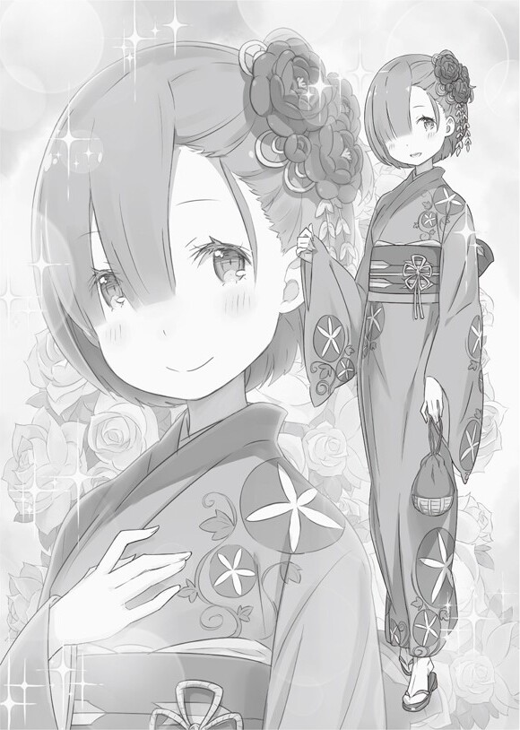

Третий месяц, часть 1

После разговора со своим нанимателем Субару провёл несколько дней, работая во дворце.

Можно сказать, что все прошло лучше, чем он ожидал. Казалось, что многие люди, которые работали во дворце, быстро сдались под напором окружения, но Субару не колебался. Во многом из-за того, что они брали любого, кто был «молодым человеком».

Зная, почему его приняли на работу, он был в состоянии делать её без затруднений.

Также ему повезло, что гордость не пострадала из-за излишнего физического контакта с его коллегами.

Но самым «удачным» было то, что женщины были привлечены к Субару, как и обещал Крэйн.

Женщина: Ах… Субару так забавно выглядит, когда старается всем угодить.

Женщина: Да, он такой внимательный и умелый. В отличии от моего мужа.

Женщина: Я не устаю с ним разговаривать, а ещё он часто улыбается, словно маленький ребенок.

Это были мнения женщин, которые сплетничали во время перерыва. Он много шутил, много говорил, задавал много вопросов и много передвигался. В целом, о Субару сложилось благоприятное мнение.

Им также понравилось то, как он неловко хвастался или пытался скрыть свои ошибки. Даже сексуальные домогательства, которые стали для него кошмаром, резко прекратились по истечению нескольких дней.

Субару: Скорее всего, это означает, что они признали меня как своего коллегу.

Это было словно испытание, которое посторонние должны пройти, пока не достигнут репутации «свой человек». Однако, как только чужак заполучает признание остальных, он тут же переставал быть угнетаемым. И если так подумать, то получается, что мужчинам до этого момента банально не хватало настойчивости.

Субару: Блин, а я всё время думал в чём же проблема… Фу-ух, вроде закончил.

Субару пропустил последнюю иглу и откусил оставшуюся нить зубами. Итак, наш драгоценный Нацуки Субару собственноручно приделал к одежде цветочные украшения… то есть, он вышил цветы на всей дворцовой униформе для того, чтобы различать гостей и сотрудников на торжественном банкете, который, между прочим, должен был вот-вот начаться.

А поскольку традиционной одеждой в Карараги считалась васоу, то существовала вероятность принять гостей, которые носили кимоно, за прислугу. Поэтому, чтобы атмосфера не была испорчена, нужно было что-нибудь придумать.

Субару: Здесь не должно быть слуг, одетых в наряд горничной!

Заявил Субару и взял на себя ответственность добавить цветочные украшения с разрешения их владельцев, так как это не являлось частью его профессиональных обязанностей. Работницы пытались отговорить Субару, говоря ему: «Тебе не стоит так заморачиваться», и всё в этом духе, но…

Субару: Это же банкет, верно? Гости, и я в том числе, были бы рады, если бы все носили миленькую униформу.

Сказав это, Субару заставил всех разойтись.

Но пока он занимался украшением нарядов, женщины, вместо того, чтобы просто подождать Субару, сосредоточились на своих волосах и косметике, да так, что с виду можно было подумать, что они здесь были гостями и это вызвало у него некоторые опасения.

Но когда банкет наконец-то начался, и все наряды уже были готовы, Субару был взят врасплох неожиданным появлением главной героини.

Рем: …Я тебя удивила, Субару?

Субару: …Я ошеломлен.

Рем: Тогда это огромный успех, хе-хе-хе. Но твоя форма тоже не менее прекрасна.

Это была Рем, которая удивила его своим присутствием на данном мероприятии. Её голубые и мягкие словно шёлк волосы были украшены неимоверно красивой заколкой, и сама она выглядела безупречно, особенно когда её образ подчеркивало цветочное кимоно с оттенками голубого цвета.

Рем с её великолепным платьем смотрелась так восхитительно, что глаза всех прохожих были прикованы исключительно к ней. Однако она никак не реагировала на окружающих и просто ждала, пока Субару что-нибудь скажет.

Субару: Ого… моя жена такая красотка, что прям глаз не отвести.

Рем: Мой лю… всё для тебя, чтобы потом ты мог сказать, насколько тебе повезло с женой, и что она у тебя самая… ах, я так смущаюсь.

Субару: Ты хоть поняла, что только что сказала… и вообще, что ты здесь делаешь?

Услышав этот заманчивый вопрос, Рем в смущении прикрыла своё лицо и покачала бедрами то вперёд, то назад. Но, не устояв перед соблазном всё рассказать, она ответила: «Ну-у, видишь ли…», и аккуратно приподняла кимоно…

Рем: Меня пригласил родитель ребенка, которого я учу в начальной школе. Вообще-то, сначала я собиралась отказаться от этой затеи, но когда узнала, что действие будет происходить в резиденции господина Рифтена, я тут же решила одолжить это кимоно.

Субару: Так ты пришла посмотреть на мою работу… Хм-м, а родитель, пригласивший тебя, часом не был мужчиной?

Рем: Пожалуйста, расслабься, это была женщина. Я и подумать не могла, что у тебя такая важная работа.

Её пригласили на пышный банкет, да ещё и вручили шикарное кимоно. Конечно же любой мужчина на месте Субару начал бы волноваться. Однако, увидев его в таком расположении духа, Рем тут же улыбнулась и сказала ему:

Рем: Ты же знаешь, что я превратилась бы в демона, если бы что-нибудь случилось. И вот тогда разорвала бы негодяя на кусочки!

Субару: А нельзя было ответить как обычно, и не упоминать, что ты демон?!

Он никогда не слышал настолько убедительной фразы, как «Я — демон». И каждый раз, когда он вспоминал о вспоротом животе, его ноги начинали дрожать и подкашиваться. Но Рем, словно не замечая это, поправила шпильку для волос и добавила:

Рем: Кстати, она известный торговец галантереей*. И, наверное, поэтому сказала, что имеет полно таких вот кимоно. Представляешь, она не задумываясь, одолжила мне этот наряд. Но я так и не поняла, что она имела ввиду, когда сказала, что если я надену её платье, то это можно считать блестящим пиар-ходом…

Субару: То и значит. То есть, если такая красотка как ты, облачится в наряд её бренда и покажется у всех на виду, тогда это более чем наверняка привлечёт ей новых покупателей.

Ажиотаж вокруг наряда не выглядит успокаивающим, даже несмотря на то, что все знали об их браке. Безусловно, видеть Рем в кимоно было удовольствием для Субару, но его беспокойство и мужские инстинкты были намного сильнее. Но при этом он вообще не переживал насчёт Рем. В конце концов, даже если кто-то посмеет сделать что-нибудь непристойное с Рем, она безо всяких сомнений разорвёт этого глупца на кусочки.

Субару: В любом случае, мне очень понравился твой сюрприз. Прости, что в этот раз я не смогу развлечься вместе с тобой. Мне пора идти, ведь еда сама себя не приготовит!

Рем: Ммм, ты же не думаешь меня победить? Желудок Субару уже давно принадлежит мне.

Субару: Только не говори, что ты чем-то недовольна…

Рем: Просто, это так странно, видеть, как Субару работает изо всех сил. Словно как…

Субару: …

Неожиданно, её слова оборвались. Но что она собиралась сказать? К сожалению, он так и не смог это узнать, так как Рем сказала: «Нет», покачивая головой.

Рем: Если что, я буду вместе вон с той дамочкой. Но когда появится хоть малейшая возможность, я обязательно покормлю своего мужа. Обещаю, я с нетерпением буду ждать тебя.

Субару: Ого! А ведь это довольно оригинальный способ получить удовольствие от вечеринки!

Субару не хотел расслабляться, но после разговора с Рем он получил дополнительную мотивацию не делать этого. И когда она ушла, парень не смог устоять перед соблазном понаблюдать, как его жена общается с гостями. Но в итоге он только пожал плечами и сказал: «У неё всё хорошо получается», как вдруг Субару почувствовал, что кто-то стоит рядом с ним.

???: Да-а, Рем замечательная женщина.

Субару: Стоп, подождите, что-то здесь не так.

Субару повернулся к знакомому голосу, и увидел там известного волчару по имени Халибель. И как ни в чем не бывало, в своей повседневной одежде он ел еду с тарелки, которую держал в руках.

Халибель: Ммм, замечательно. Есть ли в этом мире что-нибудь вкуснее бесплатной выпивки?

Субару: Есть. И это пища, приготовленная любимою женой.

Халибель: Ага! Ты хвастаешься ею! Так, мне нужно срочно выпить, чтобы помянуть твою свободу.

Субару: Забудь. Почему ты вообще здесь!?

Субару схватил Халибеля за руку, когда тот потянулся за алкоголем, и потребовал от него немедленного ответа. Сила Субару заставила Халибеля сделать шаг назад, после чего он злобно ухмыльнулся и сказал:

Халибель: Ха! Это естественно, что привратник впустил меня благодаря моим связям, которых нет у несчастного Су-сана.

Субару: Да ты преступник!

Хоть он и хотел обвинить привратника в том, что тот пропустил подозрительного человека на территорию поместья, но таинственная известность Халибеля заставила его вспомнить тот момент, когда сам Крэйн испугался Халибеля.

Субару: Ты часом не феодал, который тайком проверяет свои владения или что-то типа того?

Халибель: «Феодал»? Хм, ты даже знаешь это устаревшее слово. Между прочим, так называли Консула до того, как я прибыл в Карараги.

Субару: Серьёзно? Я этого не знал.

Субару хотел просто поговорить, но оказалось, что это может стать ещё одной нитью, которая соединяет прежний мир и этот, потому он бросил злобный взгляд, не желая вникать в суть причинно-следственных связей.

???: О, Господи, да это же мистер «Вечный Плейбой»! Как я рад снова встретиться с вами!

Халибель: Хо-хо, Риф-сан, давненько не виделись. Извините, что сегодня пришел без приглашения.

Халибель ответил Рифтену, наливая при этом вино из бутылки, которая словно по волшебству появилась в его руке. Рифтен спокойно кивнул в ответ на это, однако Субару быстро склонил голову перед своим работодателем, и произнес:

Субару: Прошу прощения, босс. Я сейчас же выгоню этого проходимца.

Халибель: Эй, это жестоко Су-сан.

Рифтен: Ты хорошо выполняешь свою работу, но в этом нет необходимости. Мистер «Вечный Плейбой» редко посещает подобные мероприятия. Настолько редко, что мне следует извиниться перед ним за то, что я не отправил ему письменное приглашение.

Как и ожидалось от человека с высоким статусом и большим влиянием на общественность, Рифтен вел себя как джентльмен, в то время как Халибель, совсем не соблюдал нормы этикета и часто действовал в своей расслабленной манере. И хоть их отношения оставались для Субару загадкой, однако была одна вещь, которая не давала ему покоя…

Субару: Эта ерунда о «Плейбое» действительно распространилась?

Халибель: В конце концов, брать то, что тебе нравится — это карарагский обычай. И я совру, если не скажу, что благодаря Су-сану мне удалось заполучить такой замечательный титул.

Субару: Замечательный говоришь… надеюсь однажды ты станешь мудрецом.

Это может быть проблематично из-за вставки «Вечный» вначале его прозвища, но всё же Субару не покидала надежда, что подобное случится.

Рифтен: Между прочим, в последние несколько дней я внимательно наблюдал за твоей работой…

Субару: Прошу прощения, я больше не буду болтать с гостями… что?.. подождите, несколько дней!?

Рифтен: Я же говорил, что возлагаю на тебя большие надежды. И судя по отзывам сотрудниц, вы не похожи на тех мужчин, которых я нанимал раньше. Вы скорее… более женственный, чем остальные.

Субару: Женственный!?

Рифтен: Какое интригующее слово, неправда ли? А еще я слышал, что вы сами же это и распространили.

Неожиданное заявление его нанимателя и выражение, которое явно говорило, что он сам навлек эту беду, заставляло Субару широко раскрыть глаза. Он помнил, что несколько раз говорил «женственный» в присутствии своих сотрудниц, и похоже, он недооценил болтливость народа Карараги.

Но даже так, до сих пор не было ясно, как это привело к его «женственной» оценке.

Субару: Так почему же вы считаете меня женственным?

Рифтен: Хозяйка солидарна с мнением других женщин, хотя ваша женственность не единственное, что было признано другими.

Субару: Солидарна…?

Рифтен: Между прочим, мистер Крэйн также рассказал мне, что вы ищете место, где сможете сделать свою карьеру.

Субару удивленно моргнул от того, как неожиданно беседа перешла к абсолютно другой теме. Видя реакцию Субару, Рифтен поднял густые брови и потянулся к его груди… коснувшись цветочного украшения.

Рифтен: Блестящая идея. А главное, сделано на совесть. Хм… наверное, именно это девушкам нравится больше всего. Продолжайте в том же духе… и я надеюсь, что смогу сказать вам кое-что хорошее в ваш последний день.

Субару: …

Когда Субару согласно кивнул, Халибель и Рифтен обменялись ещё несколькими словами, после чего господин «Храбрый Торговец» был вынужден вернуться к остальным гостям. И хоть он был обязан развлекать гостей как инициатор данной вечеринки, даже несмотря на свою занятость он всё-таки не пожалел времени на разговор с Субару. А что касается того, что означали его последние слова…

Субару: Эмм… Хал, а что это вообще было?

Халибель: Ну, если он так предупреждал о твоём увольнении, тогда я не думаю, что смогу снова поверить в этот бренный мир.

Халибель отвечал на вопрос Субару, допивая бутылку элитного сакэ. Тем не менее, предыдущий разговор так повлиял на Субару, что он вовсе забыл извиниться перед незваным гостем за то, что был грубым по отношению к нему.

Затем, Субару забрал бутылку сакэ из рук Халибеля и…

Халибель: Эй.

Субару: Похоже у тебя выпивка закончилось, пойду-ка принесу ещё.

Субару собрал все пустые бутылки и поспешил отсюда.

Не давая себе улыбнуться, он решил проявить инициативу и работать усерднее, чем когда-либо. А также ему предстояло иметь дело с якобы незваным гостем, который уплетал сакэ покруче любого алкаша.

Всё это зажгло искру внутри Субару, потому что благодаря этому вечеру, он наконец-то сможет похвастаться перед Рем.

???: … Э-эй! Субару!

После окончания банкета и последующей уборки, Нацуки Субару вышел за главные ворота, чтобы отправиться домой.

Но вдруг его окликнули по имени и это слегка удивило парня. Это была Рем, которая, прислонившись к старомодным воротам, поджидала своего работягу.

Субару: Рем? Почему ты не пошла домой вместе с той женщиной?

Рем: Я собиралась… но я настолько эгоистка, что решила остаться здесь. Но ты не волнуйся, кимоно и заколку мне разрешили вернуть завтра.

Субару: Меня это не должно волновать, но… ещё как волнует. А если бы что-нибудь случилось с тобой, пока меня не было…

Рем: Спасибо. Но со мной был привратник, так что я в полном порядке.

Когда Субару бросился к ней, она взяла его за руку и улыбнулась, чтобы унять беспокойство с лица своего героя. После её слов, Нацуки обернулся и увидел привратника, с которым, кстати, был хорошо знаком. Подняв большой палец вверх, он таким образом хотел показать ему свою признательность, а также он решил не рассказывать хозяйке, что тот пропустил Халибеля.

Субару: Тогда, почему ты ждала именно здесь? У тебя были неотложные дела или ещё что-то?

Рем: Ничего подобного. Я оставила эту одежду лишь потому, что захотела пройтись вместе с тобой.

Субару: …

Рем: Мне редко удается поносить что-нибудь такое… наверное, это кимоно слишком вызывающее?

Субару: Хм-м…

Субару почесал затылок свободной рукой и отвернулся. Но внезапно он заметил, как привратник смотрит на него сквозь пальцы.

«Хотя, знаешь, я передумал, завтра я обо всём доложу хозяйке»

Парень отложил эту мысль на потом, и чувствуя, как его уши покраснели, он сказал:

Субару: Я очень рад, что ты это сказала. Честно говоря, я бы не смог тебя заставить, даже если бы сильно захотел. Но теперь мне не терпится похвастаться своей прекрасной женой, и в том числе, по дороге домой.

Рем: Да. Покажи всему городу, что я твоя.

Субару: Ты хоть представляешь сколько людей будут завидовать мне?!

Удивлённый идеей Рем, Субару попрощался с привратником, и они вдвоем отправились домой. На улицах города Банан стояла глубокая ночь, но сияние звёзд не было единственным источником света. Были ещё подвесные фонари, в которых вместо волшебных кристаллов использовались обычные восковые свечи, и стоит заметить, что всё это выглядело весьма аутентично. Восхитительная девушка в кимоно, идущая рядом, и улица, освещённая ночным небом и бумажными фонарями, заставляли его забыть, что сейчас он находится в совершенно другом мире. Ему казалось, что он видит оптический обман… иллюзию из далёкого прошлого.

Рем: …? Субару, что-то не так?

Субару: Нет, я просто слегка запутался в своих мыслях. Ну, и это… хоть я и сказал, что хочу похвастаться тобой перед всеми, но я только что вспомнил, что я ещё тот эгоист. Поэтому я хочу наслаждаться этим в дома.

Рем: Я… это чужое кимоно… мы не можем заниматься этим, понимаешь…?

Субару: А что, если немного?

Рем: О… е-если немного…

Озорное и в тоже время неожиданное предложение Субару заставило Рем в смущении опустить глаза. Её покрасневшее лицо являлось одним из самых привлекательных черт, которые нравились Субару. «И всё же…» — сказал Нацуки и продолжил говорить.

Субару: Я не ожидал, что Рем появится на вечеринке… или, вернее сказать, на торжественном банкете. Ты должна была быть рядом с той женщиной, а не при любой возможности нянчиться со мной.

Рем: Я не уверена, что мы должны быть друзьями, так как я учитель, а она опекун. Но всё же, да, мы можем стать хорошими подругами.

Субару: Понятно. Я так рад, что мы наконец-то осели в этом городе.

Отвечая Рем, он вспомнил все их переезды за этот год. И хоть Субару уже доводилось обсуждать это с Халибелем во время недавних поисков работы, всё же он не уточнил, сколько времени они путешествовали до прибытия в Банан. Недостаток денег, безработица и отсутствие крыши над головой, со всем этим, семье Нацуки пришлось столкнуться, пока они не остановились здесь.

Бродя по всему свету, Рем и Субару наконец-то посетили Банан благодаря письму одного неравнодушного человека, которого они встретили по пути в Карараги. Ну а затем, парочка была предоставлена Халибелю — заведующему многоквартирного дома, где в итоге им выделили долгожданное жилье. Рем быстро нашла работу, и даже Субару, чувствовавший себя плохо из-за своей низкой квалификации, находился в шаге от того, чтобы жить полноценной жизнью. Всё складывалось гладко… и казалось, что они вот-вот окажутся в том положении, когда можно быть уверенным в завтрашнем дне.

Рем: Сегодня у меня было полно времени, чтобы подумать о жизни. И знаешь, я была так счастлива, когда Субару похвалил это кимоно, ну… а ещё, я была поражена тем, как хорошо мой муж справляется с работой.

Субару: Вообще-то, я тогда хвалил не только кимоно. Более того, ты осчастливила меня куда больше, когда явилась во время моего перерыва на работе.

Рем: Всё было настолько вкусное, что я подумала, почему бы не накормить тебя…

Субару: Да, это было бы очень мило, но…

Ещё до банкета, его по какой-то причине заставили наесться до отвала, мотивируя это тем, что Субару понадобится много сил. Но, если говорить начистоту, то до этого момента он терпел всё это лишь благодаря шаткой договоренности с собственной силой воли.

Рем: О, а ещё, я сказала всем твоим коллегам, чтобы они позаботились о тебе.

Субару: Ха-ха… это… определенно то, за что меня завтра будут дразнить…

Рем: …?

С ним уже обращались как с игрушкой, так что, конечно, женщины были только рады, когда у них попросила об одолжении его прелестная жена. Поэтому, сейчас он был в смятении, представляя себе завтрашние издевательства и насмешки.

Субару: …

Тривиальный, и в тоже время счастливый разговор подошёл к концу. Но стоит заметить, что молчание между ними не являлось чем-то неудобным. Даже наоборот, штиль в разговоре был своеобразным барьером, неким щитом, благодаря которому в их отношениях ещё оставалась интрига.

… И конечно же, мир, который каким-то неестественным способом затих, не имел ничего общего с их обоюдным молчанием.

Рем: Субару.

Рем позвала Субару по имени, примерно в тот же момент, когда он заметил что-то неладное.

Она внезапно остановилась и крепче сжала руку Субару, тем самым пытаясь предупредить его. Однако до жути знакомое чувство тревоги заставило парня затаить дыхание на некоторое время, пока он… колеблясь, попытался взглянуть ей в глаза.

Субару: …

Маленький силуэт был словно нарисован на краю улицы. И эта тень… стояла перед луной, и поэтому всё её тело было расплывчатым, как под покровом ночи. Но из-за расстояния, она казалась чуть ниже Субару и немного выше Рем. Хотя, без всяких сомнений это была женщина, так как она выглядела слишком деликатной и худой, как для обычного мужчины.

На ней красовалось чёрное платье, которое из-за темноты было ошибочно принято за тень. Ко всему прочему, её наряд имел весьма вульгарный характер, благодаря которому было нетрудно разглядеть её белоснежные ноги и другие оголённые части тела. Но эта безоружная молодая женщина… если бы она была именно такой, выглядела бы как нищая или проститутка. Правда, ни первое и ни второе суждение не являлось редкостью в больших городах. Бедные люди, которые потеряли свою семью и жили на улицах, и проститутки, принимающие клиентов в переулках, были естественным явлением.

… Почему-то именно блеск в глазах этой женщины заставил его думать, что она была совершенно другой. Звёздный свет на заднем плане, и тень, отразившаяся на лице незнакомки, не шли ни в какое сравнение с её пронзительным взглядом. Этот неестественный свет с ужасной яркостью был направлен на Субару, Рем и…

Субару: Ахх…

И в тот момент, когда Субару осознал эту враждебность, он почувствовал, как его руки и ноги начали быстро холодать.

Субару: …

Он не мог двигаться. Субару полностью потерял контроль над своим сознанием с приходом всепоглощающей ненависти. Его глаза расширились, а лёгкие, забыв как правильно дышать, прекратили обогащать его кислородом…

???: Что… ты делаешь.

Присутствие, беспощадно нарушившее атмосферу вокруг, понеслось к ним как цунами. В отчаянии Субару пытался разобрать чей это был голос, но поскольку он не хотел вспоминать своё прошлое, ему оставалось только смотреть на существо стоявшее, напротив.

Эта женщина, хоть и имела человеческую форму, но таковой она не являлась. Однако, единственное, в чем Нацуки Субару был уверен наверняка, так это то, что она была врагом.

???: Что… ты делаешь.

Её подавляющее присутствие устремилось к ним, словно ветер.

Это был вопрос, угроза, нападение, и даже милосердие. Да, это точно было милосердие.

Потому что она могла бы заставить кого-то вроде Субару — исчезнуть из этого мира раз и навсегда, если бы того захотела. Но этого не случилось, не только, потому что ей было ведомо сочувствие и милосердие. Возможно, есть ещё какая-то причина, почему она оставила Нацуки в живых?

???: Т-ты…

Субару не мог произнести ни слова, тогда значит, это был не его голос. Но в таком случае, единственная кто была рядом с ним — это Рем. Да, именно она так крепко сжимала руку Субару, что, собственно, и заставило его вернуться в реальность.

Рем: …

Субару: …

Они оба были поражены давлением этого существа.

Но только Рем отчаянно пыталась найти пути к отступлению. Собственно, голос разума также говорил ему, что он должен бежать. Вот только его дух не был настолько сильным, чтобы сделать нечто подобное.

???: … Умри.

Субару был напуган.

Но прежде, чем он это понял, противник уже заявил о своем намерении. И сразу же после этого, зловещее давление стало настолько сильным, что его воздействие практически обжигало всё вокруг.

Враждебность превратилось в убийственное намерение, которое, словно летний ветерок, коснулось его кожи.

Рем: … Иди сюда!!

И когда это существо почти прикоснулось к нему, Рем отскочила в сторону, держась при этом за Субару. Однако, пространство, в котором они только что находились, моментально раскололось, как будто его покусали челюсти зверя.

Всё, что осталось на этом месте, уже не было живым. А это значит, что их неприятель хотел лишь…

Рем: Хия…!

???: … Умри.

Поскольку конфликта уже нельзя было избежать, Рем пришлось использовать ману для усиления своих физических умений. Но убийственные намерения её противника были столь быстры и сильны, что их можно было сравнить со внезапными порывами ветра. Челюсти всё продолжали атаковать Рем, и поэтому у неё не было другого выбора, кроме как сосредоточиться на защите.

Рем: Ки… у…

Кимоно сыграло с ней злую шутку. И хоть оно выглядело элегантным и дорогим, но всё же ограничивало движения своего владельца. Тогда, даже если бы она сосредоточилась на уклонении, то в конечном итоге, все равно бы потеряла равновесие.

Как ни смотри, а их положение становилось всё хуже и хуже.

???: Умри, умри, умри, умри, умри…

Её убийственные намерения снова и снова вызывали эти ненормальные порывы, после которых оставалась лишь разруха и смерть. Оно стояло слишком далеко, чтобы Рем смогла разорвать эту дистанцию вместе с Субару. Не говоря уже о возможности контратаки. А что касается побега в многолюдное место, то Рем не была уверена, что оно станет колебаться с убийством неповинных людей, и поэтому этот вариант был оставлен на крайний случай…

Рем: …

Рем отчаянно ломала голову и изо всех сил пыталась найти один из немногих шансов на победу. Но когда враждебность противника превратилось в убийственный умысел, то Субару попросту не хватило смелости,чтобы даже заговорить. И несмотря на это, он всё же понимал, что должен действовать или умереть.

???: Умри.

Не сдвинувшись с места, словно величественный монумент, женщина продолжала пение смерти.

???: Умри.

Тёмные челюсти начали поглощать всё вокруг. Сначала небо, затем землю и город.

???: Умри.

Враг был настолько силён, что это больше походило на игру в «кошки-мышки», где он, играл роль беспомощной крысы. А способ перевернуть и так безнадежную ситуацию с помощью «Шамака», явно не было лучшей идеей.

Субару: …

Но у него не оставалось времени, чтобы придумать что-нибудь ещё. Да и…

Субару: … Я не хочу умирать.

Разум и тело Нацуки Субару были обвиты цепями страха, которые словно проклятье овладели им сразу после появления этого существа.

Рем: Если бы я могла…

Рем пыталась кое-что сказать, но из-за бушующего ветра её фраза внезапно прервалась. Но Субару уже и так догадался о чём будет идти речь. Да, она и вправду собиралась это сказать.

Рем: Если бы я могла… спасти хотя бы Субару.

Субару: …

Он во что бы то ни стало не мог этого допустить. И, чтобы показать, что он против её отчаянных слов, Субару пришлось вложить немного силы в кончики своих пальцев… на самом деле, ему понадобились все оставшиеся силы и смелость, чтобы дёрнуть её за кимоно.

Этим он хотел сказать, что даже если тень заберёт его в свои объятия смерти, его сердце всегда будет принадлежать ей.

Рем: Но…

Рем всё же почувствовала это, благодаря лёгким касаниям своего мужа. Однако только она одна осознавала в каком отчаянном положении они сейчас находились. Они были загнаны в угол. Следовательно, уже совсем скоро челюсти оторвут ему ноги, выплюнут её кишки и проглотят их останки. И до того, как это произойдёт, она просто хотела, чтобы тот, кого она так сильно любила, прожил хотя бы на несколько секунд дольше.

Вот и всё…

???: Умри.

???: … Ещё чего. Я этого не позволю.

Но буквально перед тем, как этот убийственный акт должен был воплотиться в реальность, раздался звон челюстей и металла. Направленная атака, которая разрушала и изменяла всё на своём пути, внезапно… нет, она не остановилась на одном ударе, громкие и режущие звуки прерывали ночь в соответствии с последовательностью укусов.

???: …

Неожиданное вмешательство, заставило женщину прекратить свою симфонию смерти и остановиться. А Рем, которая крепко прижимала к себе Субару, тоже была не менее удивлена.

Тем, кто стал гранью между их погибелью и жизнью, был Халибель… курящий деревянную кисеру.

Субару: Хали… бель… ?

Халибель: Да, да, это тот самый волк, которого вы все знаете. Фух, а это было чертовски близко, да, Су-сан? Короче, было бы плохо, если бы я не пришёл. Тем более Рем выглядела так трогательно и печально, что ваш сосед просто не смог стоять в стороне.

Субару: Почему… ты здесь?

Халибель: Аррр, я понимаю, почему тебе это так интересно, но мне придется отложить все объяснения.

Субару никак на мог понять причину, по которой Халибель появился именно здесь и сейчас. Однако его дрожащий голос наверняка заставлял Хала вести себя не как обычно. И это не помогло им избавиться от… а скорее наоборот, усилило ощущение, что они оказались в чрезвычайной ситуации.

Но как ни в чем не бывало, волк в чёрном кимоно медленно повернулся лицом к женщине и произнёс:

Халибель: Сложновато будет сопротивляться этой девушке.

И как будто говоря, что он даже не настроен на сражение, Халибель сделал шаг в сторону врага. Субару уже было намеревался сказать ему, что это безрассудство. Но…

Рем: Прошу, позволь Халибелю с ней разобраться.

Субару: Рем? Но ведь она… она…!

Ужасающее существо с невообразимой силой и аурой, от которой сердце уходит в пятки. И вот с этим чудовищем Халибель собирался сражаться в одиночку?

Но Субару хотел сказать, что по крайней мере, они должны убежать вместе с…

Рем: … Халибель «Великий».

Субару: … А?

Рем: Тот, кто считается сильнейшим во всём Карараги — это господин Халибель.

Тихий комментарий Рем заставил и так взволнованного Субару ещё больше напрячься. После её слов, Нацуки посмотрел в спину Халибеля как раз в тот момент, когда он в мгновение ока сократил огромную дистанцию между ними и этой тенью.

Это просто захватывает дух. Особенно когда тот, кто совсем недавно пил алкоголь и курил табак на вечеринке, мчался к своему врагу словно это была обычная прогулка.

Субару: Это…

Халибель: … Невероятно, ты это хотел сказать? А что насчёт тебя, красотка?

Халибель стоял лицом к женщине, и словно вынул изо рта слова Субару, он заговорил с ней пренебрежительным тоном. Вскоре, волк отошёл от Субару и Рем, которые находились позади него, и встал между ними и сущностью в чёрном, как будто говоря: «Ты не тронешь их, пока я стою на твоём пути!», но при этом решимость никак не отражалась на его лице.

Халибель был спокоен, как и всякий раз, когда спал в многоквартирном доме. Но женщина придерживалась аналогичного отношения. Она не проявляла никакого интереса к внешности Халибеля, и продолжала направлять свою кровожадность на Субару и Рем. Таким образом, давая понять, что все, кто станут у неё на пути, будут так или иначе уничтожены.

???: Умри.

Невидимое намерение убийства превратилось в ветер шарообразной формы и атаковало Халибеля. Угроза, форма которой — неминуемая смерть, должна была пройти сквозь оборону и убить свою цель. Но раз этот удар нельзя было отразить, оставался лишь единственный способ защищаться от пасти тьмы, и это… увернуться.

Халибель: Хо…

Халибель засунул руку под кимоно, и бросил что-то с молниеносной скоростью. Объект, брошенный с такой скоростью, что его не мог увидеть ни один обычный человек, столкнулся со всепожирающим ветром… но атака не поразила живот Халибеля; ведь он очутился в совершенно другом месте, а именно на месте брошенного предмета.

Халибель: Неважно, вижу ли я или нет. Мой нюх всё равно чрезвычайно эффективен.

???: …………………………

Халибель: Только не пойми меня неправильно, хорошо? Я волкопёс, и это один из важнейших аспектов, чтобы ты знала.

Халибель всегда любил болтать во время сражений, хотя, этим он скорее снимал своё напряжение и переводил дух. Но после этого, она всё же обратила на него внимание. Женщина смотрела на Халибеля пронзительным взглядом, и это был первый раз, когда она смотрела на кого-то, кроме Субару и Рем.

Халибель: О, так ты наконец-то посмотрела…

???: Умри.

Халибель: … Там.

Халибель снова пытался перенаправить разрывную атаку, бросая свой предмет сквозь её ветер. Однако женщина изменила приоритет своей убийственной ауры, и огневая мощь сразу же сосредоточилась на нём.

???: Умри, умри, умри, умри, умри…

Халибель махнул руками и тут-же уничтожил все смертоносные ветра, обстреляв их одновременно. Смахнув первый порыв ветра, он сказал: «Хорошо», и набирая обороты, он произнес:

Халибель: Кажется, ты заинтересовалась мной, так как насчёт того, чтобы я оправдал твои ожидания!

???: Ум…

Халибель: Хо-хо… Так, и от кого-же из нас ты бы хотела умереть?

???: …

Халибель стремительно зашагал по улице, даже несмотря на то, что он носил деревянные зори. Его тело шаталось с боку на бок, а в совокупности с необычной аурой и работой ног эти движения были захватывающими в некотором роде. Но сразу после этого облик Халибеля стал каким-то расплывчатым.

Халибель: Ну, а теперь. — Какой я тебе больше нравится? — Я типа преданный. — Хах, а я вообще властный мужчина.

Субару: … Что?!

Это не был удивительный возглас женщины в чёрном, нет, это Субару был настолько поражён невероятным явлением. И не удивительно, ведь он увидел, как Халибель заговорил сразу четырьмя разными голосами.

Халибель: Кстати, моя сила не делится на четыре. Я — это четыре разных человека, и поэтому моя сила становится четырёхкратной. — Я призвал своих родителей, братьев и сестёр, а потом, пришли и остальные. — Да что ты врёшь! Вообще-то, это я увидел себя в зеркале и вытащил вас. — Ой, кажется, я снова соврал. Или нет?

Четыре Халибеля закурили кисеру и беспорядочно говорили друг с другом столько, сколько они хотели. Это было похоже на плохой сон. Но четыре Халибеля не являлись иллюзиями. Ведь все они были там, и каждый из них чувствовал себя настоящим.

Значит, для четырех Халибелей, боевая мощь возросла почти в четыре раза.

???: …

К слову, Халибель не размножался, а скорее клонировал самого себя. И когда она увидела это, то впервые прекратила своё наступление. Но теперь, было под вопросом, сработают ли её непрерывные атаки на Халибеле, который мог действовать как четыре независимые персоны. Необходимость в защите и правильном расчёте контратак, немедленно возросла для этой женщины. Однако, было неизвестно, имела ли она хоть какой-то смысл делать такие вычисления.

???: Умри.

Халибель: И это всё, что ты можешь сказать? Похоже, у тебя были довольно тяжёлые отношения с семьёй.

Женщина согнула колени и резко прыгнула на невообразимую высоту. Она легко запрыгнула на крышу здания рядом с ней и посмотрела свысока на Халибеля и остальных, покачивая крышу босыми ногами. Луна сияла на заднем плане, и ни один лучик света в её глазах не ослабел… это выглядело так красиво, что было за пределами человеческого понимания.

Четыре Халибеля стоявших на земле, и женщина, одетая в чёрное с луной позади неё, смотрели друг на друга. Казалось, это будет продолжатся вечно, но…

Субару: … Рем?!

Двое из присутствующих на этой «пьесе» находились в тупике. Одним из них, был Нацуки Субару, который мог только наблюдать за выступлением актёров.

Однако, когда Халибель оглянулся на дрожащий голос Субару, он увидел Рем в смертельном упадке сил.

Воспользовавшись этим хаосом, женщина попыталась прикрыться ночным небом, чтобы взять их врасплох.

Халибель: Шш…!

Но трём Халибелям всё-таки удалось вовремя среагировать. Брошенные предметы незамедлительно устремились к женщине с трёх разных направлений, два из которых, были отражены ветром. Тем не менее, третий бросок отчётливо нарисовал дугу, скользя по смертоносному ветру, и брошенный… кунай, в итоге, пронзил спину женщины.

???: М…

Получив тяжёлую травму в районе легких, женщина слегка застонала и попыталась убежать.

???: …

Клоны насторожили слух и внимательно наблюдали за каждым движением исчезающей женщины, так как была возможность того, что она воспользуется темнотой и продолжит нападение. Но, скорее всего, тень просто сбежит, зная, что сейчас находится в невыгодном положении.

В результате, Халибель остался доволен и…

Халибель: Думаю, сейчас нам уже ничего не угрожает. По крайней мере…

Субару: Халибель! Помоги! Рем, она…!

Халибель наконец-то подбежал к Субару и Рем, как только услышал мольбу о помощи.

В тоже время его клоны бесследно исчезли, и он вернулся к своему обычному состоянию души. Однако, у них не было времени на обсуждение этого явления. Субару отчаянно пытался привести в сознание Рем, которую он крепко прижимал к себе.

Халибель: Атака чёрной девушки поразила её?

Субару: Я уже проверил! На её теле нет никаких травм! Н-но она всё ещё не приходит в себя…

Он паниковал. Но тем не менее, был уверен в том, что у Рем нет никаких повреждений. Она внезапно упала в обморок, сразу после того, как женщина забралась на крышу… Тогда…

Халибель: Может быть, она использовала какую-нибудь магию или что-то в этом роде… у нее высокая температура, возможно, это какая-то болезнь.

Субару: …

Халибель: Твой взгляд заставляет меня нервничать. Я отнесу её в квартиру и…

Субару: Н-нет, я… Я понесу Рем! Я сам отнесу её домой…!

Субару прервал Халибеля, когда тот с дрожью в ногах попытался отобрать у него Рем. Субару встал, и на мгновение его слова заставили Халибеля задуматься о чем-то.

Однако, он быстро произнёс: «Прости…», с низко опущенной головой.

Халибель: Тогда скорее отнеси её домой. А пока… я сбегаю за целителем, и приведу его прямиком в твою квартиру. Только прошу, возвращайся по многолюдным улицам.

Субару: Хорошо, я надеюсь на тебя!

Субару сразу же побежал с Рем на руках без каких-либо возражений. У него был отчаянный взгляд, и его мысли были полностью заполнены беспокойством и болью… но даже так, он всё ещё мог передвигаться. И как настоящий мужчина, решил не останавливаться до тех пор, пока не достигнет своего дома.

В тоже время, Халибель тихо наблюдал как их силуэты исчезают под покровом ночи, и сделав большую затяжку из своей кисеры, он сказал:

Халибель: Так или иначе… или иначе…

Человекообразный волк, дымя сладким табаком, побежал в поисках лекаря.

… Это моя вина.

Субару: Хаа… хаа…

Это моя вина. Моя вина. Моя вина. Моя вина. Моя вина.

Субару: … !

… Это я во всём виноват!

Субару: Хаа…!

Задыхаясь, Субару ворвался в жилой дом с широко раскрытыми глазами и покрасневшим лицом.

Он не чувствовал вес девушки в своих руках, ведь он был всего лишь человеком, который не привык носить на себе тяжесть другого человека. Субару бежал, и только благодаря кипящему адреналину его тело продолжало двигаться вперёд.

Субару: …

Он бежал так быстро, как только мог. Даже несмотря на то, что всю дорогу он пытался не упасть, сохраняя при этом равновесие настолько, насколько это вообще было возможно. Но Рем всё равно ни на что не реагировала. Она просто спала… и тем самым вселяла в него необъяснимый ужас.

Магия, болезнь или ещё какая-то чертовщина. Все эти предположения, заставляли Субару всё больше беспокоиться о состоянии Рем, а также страх перед внезапно появившейся женщиной полностью не исчезал из его головы. Быть мишенью, быть целью перед лицом такой сильной враждебности и подвергаться чьему-то неведомому желанию убить — всё это казалось такими пустяками, когда судьба его прекрасной жены висела на волоске.

Субару: … Чтоб его!

Однако, несмотря на критичность ситуации и спешку, Субару всё-таки выбрал не кратчайший путь. По просьбе Халибеля он избрал улицы с наибольшим количеством людей. И как только Нацуки вышел из пространства, которое было неестественно пустым, пересекая две улицы, он увидел повседневную жизнь, которая продолжала течь как ни в чем не бывало. Тем не менее, Субару явно ощутил на себе пристальные взгляды почти всех, кто гулял по ночным улицам Банана.

Скрыв свое лицо, он продолжал бежать с бессознательной девушкой на руках. Да и вообще, это было настоящее чудо, что никто с завышенным чувством справедливости не осмелился остановить его. Но прямо сейчас, Субару волновался лишь об одном…

Субару: Прошу… Рем…

Он всем сердцем молил, чтобы с Рем всё было хорошо. Чтобы она раскрыла глаза, назвала его имя, и в конце концов улыбнулась ему. Пожалуй, это всё чего он хотел. Если бы Субару, как человек, который ничего не мог сделать в этой ситуации, имел право просить о совершении чуда, то это было бы единственное, о чём бы он попросил.

Субару: …

Каким-то образом, Субару всё-таки добрался к себе домой, отчаянно и из последних сил молясь о спасении любимой.

Затем, он резко вышиб двери ногой и бережно опустил девушку. Обливаясь потом с ног до головы, Нацуки напрочь забыл об этом пустяке и немедленно поспешил включить свет, чтобы как можно скорее уложить потерпевшую в кровать.

Субару: Рем… Рем… ответь мне… Рем…

Но как бы сильно он не звал её, Рем всё также молчала, продолжая мучительно дышать. Однако, в этот раз Субару не растерялся, он ослабил пояс на её наряде, и снял неудобные рукава. Позаимствованное кимоно, которое Рем одолжила у хозяйки галантереи, было порванным и грязным. Да даже заколка, и та, кажется, потерялась по пути. Поэтому, Рем, которую он видел совсем недавно, казалась ему обычным миражом.

Субару: Рем… пожалуйста…

Набрав воду в ведро, Субару бережно вытер её лоб влажным полотенцем и почувствовал жар, который поглотил буквально каждый сантиметр её тела. Однако, он не мог утверждать была ли это лихорадка или просто высокая температура. Потому что даже сам Субару не был уверен в своём собственном здоровье. Ему не оставалось ничего другого, кроме как смотреть на страдания Рем и ждать, пока Халибель приведет целителя.

Субару: Рем…

Субару: … Ну вот опять, я оказался бесполезен.

Субару взял за руку, лежащую на татами Рем, и начал молиться, нежно сжимая её тоненькие пальцы.

Субару: Пусть ничего не случится. Я умоляю тебя, пожалуйста, проснись. Если ты сможешь проснуться и улыбнуться мне как в первый раз, тогда я…

Субару: …

Кто знает, как долго длились его мольбы. Но когда Субару услышал звуки позади, то уже находился в состоянии глубокого транса. После скрипа дверей, его сомнения на счёт того, что это Халибель прибыл вместе с долгожданным целителем, были полностью рассеяны. И надеясь на это, Субару обернулся словно говоря: «Умоляю, помогите Рем», но…

???: … Ха? Что за жалкий взгляд? Я не для этого сюда пришла.

Перед ним предстала неизвестная барышня. Она, прислонившись к боковой двери, скрестила руки с презрительным взглядом на лице. Впрочем, как и всегда, это было совсем не то, на что надеялся Нацуки Субару. Молодая и обворожительная женщина в белоснежном кимоно, выглядела как мечта любого мужчины… если бы не одно но. Её наряд был погребальным, а также вызывающе подрезан до середины бёдер. Однако, в её глазах не пряталась тень ненависти или жажды крови, как у ранее нападавшей. Да и её шикарно-белые ножки вызвали совершенно иные мысли. Ко всему прочему, молочные волосы данной героини были не аккуратно подстрижены, но они, хорошо смотрелись в совокупности с её острыми ярко-голубыми глазами. И даже несмотря на все недочёты во внешнем виде, она имела необычайно красивое лицо, от вида которого, перехватывало не только дух, но и терялось чувство реальности.

Субару невероятно повезло лицезреть это своими собственными глазами, хотя… стоп, он ведь уже знал одну девушку с такими же чертами лица, и это заставило его напрячься.

???: Как бы, здрасьте? Я вообще-то с тобой разговариваю… Ты глухой?

Субару: Т-ты…

???: О-о, так ты всё-таки умеешь говорить. Прекрасно. А то бесит, когда меня игнорируют ни с того, ни сего. Ну, короче, ты понимаешь, о чем я…

После того, как дрожащий голос Субару заставил женщину широко раскрыть глаза, она смиренно сложила руки на свою грудь. И затем, на её лице появилась легкая улыбка… нет, свирепая улыбка, которой мог бы позавидовать абсолютно любой хищник.

???: … Если ты помрешь до того, как я тебя искромсаю, тогда это оскорбит имя самого «Шинигами».

Субару: …

Красотка… которая всем своим видом желала для него смерти, подтолкнула парня к импульсивным, и непредсказуемым действиям. Он без задних мыслей схватил ведро, возле подушки Рем, и со всей силы бросил его в сторону женщины. Тем не менее, Субару не надеялся, что это хоть как-то заденет её, нет, он просто хотел держаться на безопасном расстоянии.

Но, как и ожидалось, беловолосая с лёгкостью увернулась от брошенного ведра, и скорчила недовольную гримасу.

???: Рррррра…!

И вот тогда, Субару сделал весьма неожиданный ход.

Кто бы мог подумать, что он, попытается ухватиться за женскую талию. Хотя, у него были все шансы повалить её на землю. И даже несмотря на то, что она являлась представителем противоположного пола, Субару безо всяких сомнений размазал бы ей череп со всей ненавистью и злостью, которую он накопил…

???: Неужели не можешь обнять меня лишь потому, что я симпатичная?

Субару: Гаа… !?

Увы, но рискованный план обернулся полным провалом. А всё потому, что незнакомке не составило труда ускользнуть от лап отчаянного парня и даже, успеть контратаковать его во время неудачного броска. Согнув правую руку, она машинально ударила Субару по затылку, и в тот же момент, применила грубую силу, чтобы пригвоздить нападающего к полу. После этого всё в глазах Нацуки Субару начало расплываться и скакать, словно под воздействием карусели. Ударившись лицом и чуть ли не разбив себе нос, он еле-еле сумел сдержать уплывающее сознание.

Поразительно, что такой колоссальный удар был совершен женскими ногами. Однако сейчас ему было совсем не до этого… Скрипя зубами, и надрывая спинные мышцы, он согнул нижнюю часть тела для взятия реванша. Резкий замах ногой не попал прямиком ей в голову, но этого, по крайней мере хватило, чтобы отвлечь незваную гостью. И воспользовавшись сложившимся моментом, Субару тут же вырвался из её хватки.

???: Фу-у, ты весь в поту!

Субару: Да катись ты к черту!!

Не успев даже толком подняться, он снова ринулся в бой, в надежде, что хоть и ненадолго, но сможет выпроводить её из дома, чтобы таким образом обезопасить спящую Рем.

Субару: … Дзуу-раа!

Преисполненный чувством долга, Субару невероятным образом всё же схватился за талию женщины, прежде чем та смогла остановить его, и резким движением своего тела, он вышвырнул негодяйку за порог и немедленно попытался встать на неё, чтобы взять верх, но…

???: Не будь таким дерзким!

Прежде чем упасть на землю, она изо всех сил пнула в грудную клетку Субару, когда тот ещё держался за неё. Удар её длинных ног внезапно пронзил тело молодого парня, словно намереваясь выбить из него внутренности, что впоследствии привело к болевому шоку из-за множества переломов в области груди. И даже, если бы он попытался удержаться за неё, то его физиологическая структура не позволила бы совершить это… поэтому, Нацуки вновь встретился лицом с твердой поверхностью. Но когда он снова попытался встать, на его голову тут же обрушилась бросая нога.

Субару: Проваливай… сука…

???: Не поднимайся, а то снова испортишь воздух своим омерзительным потом.

Противодействуя её заявлению, Субару из последних сил схватился за тонкие лодыжки женщины и попытался скрутить их. Однако, она ни на йоту не сдвинулась с места. И фыркая на его жалкие попытки сопротивления, незнакомка приподняла ногу и снова ударила по голове, давя на его нос.

Дважды, трижды…

Субару: Ка… а-а…

???: Не смей трогать меня, извращуга. Я пришла сюда не для того, чтобы дурачиться с тобой. Слушай, ложись спать.

Наступив несколько раз на Субару, и увидев, что тот истекает кровью и больше не может встать из-за смертельной усталости, женщина с удовольствием отвернулась от него и начала возвращаться в дом. А ещё, напоследок она сказала, что Субару не является её целью, тогда…

Субару: … Что ты хочешь сделать?

???: …

Не желая опускать её без внятного объяснения, Субару вновь вцепился за ноги незнакомки, в то время, когда его нос был полностью раздавленным, а лицо втоптанным в грязь. Но как только её белоснежная кожа испачкалась в его крови, взгляд седовласой девушки мгновенно похолодел.

???: Отстань от меня.

И хоть её требование было искренним и внятным, Субару просто-напросто не мог ответить ей словами. Взамен, он положил вторую руку на лодыжку женщины, за которую уже держался другою, и тем самым выразил свои намерения.

???: Послушай…

Остановившись, она поправила волосы и презренно посмотрела на лежащего Субару, рука которого уже застыла в оцепенении. А затем, с явною небрежностью, поставила парня на колени.

???: Я же сказала тебе, ОТВАЛИ.

Следующее что он увидел, это то, как её колено неминуемо приближается к его голове и брызги крови пачкают её белоснежное кимоно. Всего один удар, а такое ощущение, будто мозг вышибли за черепную коробку… как никак, а сотрясение мозга заставило его почувствовать приближение смерти. Он упал, но все равно не стал отпускать её.

???: Ты умрёшь.

Субару: … Ааа.

В ответ, Субару покачал головой. Боль… боль была необычайной, это раздражало все его тело, и при этом голова страдала больше всего.

Его раздавленное лицо, побитое тело, челюсть, получившая удары коленом, и всё остальное, поражённое невероятной силой испытывало припадок боли и бессилия.

Опасность звучала всё громче и громче… а страх, который напоминал ему о приближении фатального исхода, мигом заставил его конечности окоченеть.

Также, из-за попавшей в глаза крови, всё вокруг казалось размытым или же покрытым красной пеленой. Дрожь всё нарастала, потому что смерть находилась совсем рядом.

То есть женщина, за которую схватился Субару, и была настоящим воплощением смерти… богом погибели — Шинигами. Смерть страшна и прекрасна, совсем как она.

Однако для Субару, как для того, кто познал смерть вдоль и поперек, не было ничего ужаснее её. Но если он хочет спасения, ему нужно переступить через себя и попросить прощения. И тем не менее, он, уже не может так просто сдаться. Но даже бороться, он больше не в силах из-за…

???: … Этим ты не сможешь меня переубедить. И даже не надейся, придурок.

Сопротивление Субару оказалось напрасным: женщина, как шла в дом, так и продолжала идти, даже не отталкивая его от себя, словно говоря, что он для неё просто грязь под ногами. И как будто не замечая его, ступая по татами, она целеустремленно направилась к Рем.

Субару: Ги… а-а…

Тем не менее, вцепившись что ни на есть мощи зубами за ковёр, Субару в очередной раз пытался остановить её. Но коврик всё же оторвался от пола и ему пришлось отчаянно цепляться за всё, что попадалось у него напути.

???: Я уже поняла, что ты не умеешь сдаваться. Но разве тебе не стыдно так долго приставать к незнакомой девушке?

Субару: Оооо! Оооо!!

???: Так мерзко! Так мерзко, так мерзко, так мерзко! Так низко! Так плохо! Ты идиот!

Но сколько бы она ни ругалась на Субару, он твердо стоял на своём, словно избалованный ребёнок. Даже если в итоге это будет стоить ему выбитых зубов и оторванных конечностей — он все равно не отступит. Да, именно его нездоровое упрямство заставило женщину раздраженно щёлкать языком.

???: Тц, это возмездие всё ещё оставляет неприятный привкус! Ладно, тогда я…

Скривив настолько прекрасное лицо, что аж немного жалко, «Шинигами» решительно подошла к футону, на котором спала Рем, и подтянулась к её лицу. Но если она доберется к ней прежде, чем прибудет Халибель, тогда кто знает, чем всё это для неё закончится. Поэтому, Субару закричал от страха…

???: … А?

И когда рука уже вот-вот должна была коснуться Рем, как женщина неожиданно остановилась с широко раскрытым ртом. А потом, насупив белоснежные брови, она начала осматривать больную, то сверху, то снизу, чем и удивила побледневшего парня.

Субару: Что… ты…

???: Аааа! Чёрт! Нет, ну вы серьёзно?! Этого не должно было произойти! Теперь я не смогу это сделать!

В следующий же миг, «Шинигами» внезапно подорвалась с места и пнула ни в чём неповинный ковёр, и при этом, ещё раздраженно щёлкая языком, словно её только что выставили дурой. В конце концов лишившись своего самообладания, она в ярости встряхнула Субару, чьи глаза были широко открыты из-за её странного поведения, и швырнула его в угол комнаты.

Субару: Дерь…

Но если бы он не ослабил бдительность, то наверняка эта женщина не освободилась из его «плена». Ну, по крайней мере так думая, Субару в который раз попытался встать, дабы схватиться за её талию и вернуть…женщина опередила его, наступив ногою на лицо.

Субару: Гх…

???: Да успокойся ты уже. Боже, какой шумный человек.

Белобрысая с ошеломленным взглядом смотрела на только что поверженного Субару, крик которого был остановлен её нежною пятой. После чего, она указала на свой прекрасный нос, и сказала:

???: Твое лицо сейчас выглядит довольно уродливо. Можно я всё исправлю?

Субару: …

???: Мда, быть человеком — полный отстой. Шрамы никогда не исчезают.

Сказав это, незнакомка замолкла на некоторое время и с раздражением посмотрела на Субару и Рем. Тем не менее, он мог поклясться, что эмоции в её глазах не отражали её истинных намерений. И поэтому ему пришлось встать, чтобы удерживать эту непредсказуемую женщину. Однако, тело ему больше не подчинялось…

???: Время вышло. Думаю, мне пора уходить.

Субару: …

Пораженный смертельною усталостью, Субару так и не смог её остановить. Упав от бессилия и оставшись позади, он смог только услышать, как женщина проронила эти слова. Но её глаза смотрели не на семейство Нацуки, а в сторону открытых дверей.

Затем, она пошла к выходу из многоквартирного дома, не обращая никакого внимания на них.

Субару: Подо…

???: Да будь ты проклят на неудачу. А теперь, дрожи, и сожалей об этом как можно дольше.

Он не смог подобрать слова, которые остановили бы её на пол пути, и не имел ни малейшего понятия, что всё это означало.

Субару просто молчал и валяясь в луже собственной крови наблюдал как женщина уходит.

Вскоре, после её исчезновения в комнате воцарился долгожданный мир, где лишь сопение Рем доносилось до его ушей.

Халибель: … Су-сан? Ты где… Что произошло?!

То, что предстало перед глазами Халибеля можно было назвать хаосом в своём первозданном виде. Впрочем, он пришел слишком поздно, чтобы о чём-нибудь судить.

Посему волк тут же бросился к Субару, чтобы хоть немного разобраться в сложившейся ситуации, однако, единственное, что он от него услышал, это…

Субару: Позаботься о… Рем.

И вглядываясь в собачьи глаза, сознание Нацуки Субару наконец-то отдалось в объятья тьмы.

???: На этом лечение закончено. Теперь тебе осталось просто отдохнуть.

Старый маг-целитель сказал это и вытер оставшиеся следы крови на лице Субару. Старый лекарь действительно быстро закончил лечение после того, как осмотрел Субару, который был наполовину жив.

Благодаря этому, он перестал иметь раны по всему телу и отделался серьёзными ушибами, а тупая боль в носу утихла до такого уровня, что он мог не обращать на неё внимания. Теперь ему не составит труда сделать самое малое: стоять и ходить.

Халибель: Су-сан, как ты? Думаешь, в порядке? Думаешь, умрёшь?

Субару: Когда я кусаю челюстью, я чувствую боль, как будто в теле заблокированы суставы, но я почему-то не умираю. Спасибо… Спасибо, но…

Халибель: Погоди, погоди. Я знаю, что ты хочешь отдать предпочтение Рем. Однако ты не можешь просто забыть о своём состоянии.

Халибель, пожав плечами, высказал своё мнение раньше, чем Субару, который с трудом мог бормотать.

Звероволк вернулся в дом, и его взгляд остановился на Субару, который испачкал кровью татами посреди комнаты и потерял сознание, произнеся перед этим что-то вроде завещания. Рем спала на футоне, и если бы Субару стал спорить, у кого из них больше “неотложных дел”, у него, к сожалению, не было бы шансов на победу.

Но в душе Субару всё равно хотел отдать предпочтение Рем.

Халибель: Рем, конечно, не может делать всё, что захочет. Однако это касается и тебя. К такому решению я пришёл вместе с сэнсэем. Ты в долгу передо мной, верно? Прости меня за это.

Субару: Должен тебе……

За то, что позволил им жить в этом многоквартирном доме, и за то, что только что спас ему жизнь, он становился всё более и более обязанным Халибелю. К тому же, он не был настолько бессовестным, чтобы считать беспокойство о нём выплатой долга.

Субару: Хорошо. Но кроме этого, сэнсэй, пожалуйста, позаботьтесь о Рем.

Лекарь: Предоставьте это мне. Вы, ребята, мешаете мне. Выйдите.

Старый лекарь ответил прямо и махнул рукой Субару, который склонил голову. Следуя его указаниям, Субару и Халибель отправились к передней части дома. По дороге Халибель вытянул свои длинные руки и помог Субару не потерять равновесие из-за боли в теле.

Халибель: Ух ты. Ты должен быть осторожен, Су-сан. Ты только две минуты назад начал выздоравливать.

Субару: Ты слишком быстро начинаешь беспокоиться…… Но ты действительно спас меня.

Халибель: Су-сан, если честно… это просто неправильно. Но мне больно, когда меня благодарят. В конце концов, я действительно не смог предсказать нападение в доме.

Они сидели рядом друг с другом на скамейке, установленной перед жилым домом. Когда Халибель зажёг свою сигару, дым, который он вдыхал, уходил в ночное небо.

Халибель: Я не ожидал, что она будет нападать так часто. Я думал, что она не будет действовать несколько дней.

Субару: Это не было даже близко к нескольким дням. Мы встретились через 10-20 минут.

Халибель: Я был действительно шокирован, когда увидел тебя окровавленным в комнате. Я подумал: “Я облажался, отправив Су-сана обратно домой. Нельзя повторять эту ошибку в следующий раз”.

Субару: Эта ситуация больше не повторится со мной.

Халибель: Итак, я собирался погнаться за врагом, а тут Су-сан заговорил. Я думал, что твоё сердце перестало биться. Я думал, ты умер.

Субару: …… Ааа, точно.

Халибель: ….

Халибель переключился с созерцания неба на профиль Субару. Это был короткий обмен мнениями, но было ясно, что мысли Субару витали где-то в другом месте. Субару не был сосредоточен на разговоре с Халибелем; он думал только о самочувствии Рем, которая проходила диагностику в комнате прямо за ними.

Он доверял мастерству лекаря в отношении внешних ран, достаточно и своего собственного тела. Однако у Рем не было внешних ран. Это была болезнь, или, возможно…

Халибель: Я не думаю, что это магия. Кстати, ты можешь считать, что это не похоже на чёрную магию. Будь уверен.

Субару: Почему ты так уверен?

Халибель: Потому что я специалист по чёрной магии. Ты можешь верить в мою печать одобрения.

Субару: Специалист по чёрной магии……? Я не могу просто пропустить этот комментарий мимо ушей.

Халибель: У моего прошлого длинная история. Пока просто думай об этом как о том, что тебе не о чем беспокоиться.

Хотя это было довольно впечатляющее разоблачение, Субару не возражал против заявления Халибеля. Это было тревожно, однако сейчас его это не волновало.

Как и сказал Халибель, на одну возможность угрозы для жизни Рем стало меньше. Даже если это и не принесло ему облегчения, этого уже было достаточно, чтобы успокоиться.

И вот они ждали некоторое время, пока дым, выпущенный Халибелем, улетучивался в ночной воздух.

Лекарь: Спасибо, что подождали.

Субару: Сэнсэй! Рем, как Рем!?

Лекарь: Сейчас ночь, и девушка спит, так что потише. Мне нужно тебе кое-что сказать. Заходи.

Показывая снаружи только свое лицо, старый лекарь пригласил Субару войти. Нетерпение и несколько тревожная атмосфера заставили Субару перевести дыхание, и он медленно вернулся в комнату.

В комнате всё ещё царил беспорядок, вызванный тем, что он бушевал на женщину. Только футон, на котором спала Рем, был хорошо заправлен, и это заставило его почувствовать, что лекарь был очень заботлив.

Лекарь: Эй, идиот, потуши огонь своей сигары, он может ей навредить.

Халибель: Обычно ты не говоришь ничего лишнего…… Ладно, хорошо, я понял.

Резко отвернувшись, Халибель послушался старого мага и погасил огонь своей сигары. Он тяжело сел у входа, и разум Субару заставил его подойти к кровати Рем. Старый лекарь, сидящий в противоположной от Субару стороне, хриплым голосом сказал: “Хорошо”.

Лекарь: Давайте начнем с хороших новостей. Эта девушка без сознания не потому, что она ранена или больна. И я полагаю, ты слышал от того идиота, что это не связано с проклятием.

Субару: …… Да.

Лекарь: В принципе, это значит, что с ней все в порядке.

Субару: Стой, что?..

Заявление старого мага заставило Субару расширить глаза, так как он не мог понять, что он сказал.

Он сказал, что с ней всё в порядке. Рем упала. Её дыхание звучало болезненно. Всё это было правдой. Хотя сейчас её дыхание было спокойным, возможно, благодаря лечению.

Субару: Сэнсэй, Рем упала в обморок. Ей было больно. Осмотрите её более тщательно!

Лекарь: Ты такой же идиот, как и вон тот, у порога. Ты слишком быстро делаешь выводы. Я ещё не закончил говорить.

Халибель: Не нужно называть людей идиотами……

Лекарь: Тише, идиот. Я собираюсь сказать этому идиоту кое-что. Это была хорошая новость. Теперь я расскажу тебе новость получше.

Субару: Новость получше?

С Рем всё было в порядке, так какие же невероятные новости он приготовил для него дальше? Субару решил промолчать, надеясь, что его следующие слова внесут ясность.

И вот, после паузы, старый лекарь продолжил говорить с Субару, который ждал его слов.

Лекарь: Поздравляю.

Субару: А?

Субару был ошеломлен следующим словом, которое он произнёс, и вздохнул.

Он не совсем понимал слово “Поздравляю”. Было ли это имя человека? Название места? Каким бы оно ни было, это было существительное другого мира, с которым Субару не был знаком. Что это означало?

Субару: Хм, так ты говоришь, что……Рем может быть спасена из-за “Поздравления”?

Лекарь: Эй, плейбой. Возможно, есть кто-то, кто глупее тебя.

Старик почесал голову с ошарашенным видом, когда Субару задал ему вопрос с жёстким выражением лица. Халибель тоже почесал голову, сказал: “Ну” и попытался заставить его взглянуть на дело по-своему.

Халибель: Разве ты не должен был сказать ему по-другому? Я не удивлен, что это сбило его с толку.

Субару: Что значит “сбило меня с толку”? Пожалуйста, просто скажите мне! Что происходит с Рем……

Халибель: Видишь ли, Су-сан. Под поздравлениями он подразумевает поздравления. И я тебя тоже поздравляю.

Поздравляю, или, скорее, “поздравляю”: слово, что было повторено Субару, который был в замешательстве.

Это слово означало.

Лекарь: Ваша жена беременна. У вас будет ребёнок.

Субару: Беременна!?

Объяснение старого лекаря повергло Субару в шок, и его глаза широко раскрылись.

Беременна, поздравляю, поздравляю — всё это крутилось в его голове, избивая его мозг. Субару продолжал пребывать в замешательстве, пока старик смотрел на Рем с серьёзным выражением лица.

Лекарь: Не волнуйтесь, что она без сознания. Она просто так вымоталась, что у неё закружилась голова. Она скоро встанет, если вы дадите ей отдохнуть. Обморок — это не то, за что стоит хвалить, однако.

Халибель: В конце концов, она нагружает себя гораздо больше, чем обычная жена. Мы не можем ничему научиться из того, что произошло сегодня вечером. Тем не менее, это не означает, что мы можем быть полностью расслаблены.

Халибель пробормотал о том, что Рем в итоге так вымоталась, что упала в обморок.

Действительно, они не могли ничего узнать из того, что произошло сегодня вечером. Они не собирались подвергаться подобным нападениям так часто. Тем не менее, это не было похоже на то, что они отбились от врага; она просто по какой-то причине отступила сама. Он не мог поверить, что теперь всё кончено.

Халибель: Но она действительно не убила тебя, когда могла бы, хах.

Как и сказал Халибель, у женщины было много шансов убить Субару и Рем до его прихода.

Она была достаточно враждебна, чтобы заставить его дрожать, но ничего не произошло. Правда и то, что она успокоилась. Именно так они избежали смерти. Однако её истинный мотив оставался совершенно неясным.

Халибель: Су-сан, ты в порядке?

Субару: ……Ах…а

Халибель стукнул Субару по плечу, так как он не хотел участвовать в разговоре, и посмотрел на его лицо. Проделав всё это, Субару наконец-то вернулся к реальности, и его глаза встретились с прорезавшимися глазами перед ним.

В его голове и сердце царили хаос и смятение.

Казалось, Халибель мог это понять, поэтому, когда он установил зрительный контакт со старым лекарем, они кивнули друг другу.

Халибель: Су-сан, мы уходим на ночь. Девушка, что была тут раньше, не должна сейчас приходить. Я хочу тебе кое-что сказать, но это может подождать до завтра…. Сэнсэй.

Лекарь: Дай своей жене поспать. Тебе тоже надо отдохнуть сегодня.

Халибель: Вот и всё.

Халибель и старик по очереди говорили с Субару, а он молча кивал им, как кукла. Когда он сделал это медленное движение, Халибель схватился за голову Субару, а затем заставил его повернуться к Рем.

Халибель: Су-сан, ты должен быть первым, кого увидит Рем, когда проснётся. Понял?

Субару: … Понял.

Он снова говорил Субару что-то ещё, и его глаза, наконец, остановились на одном месте. Халибель убедился, что Рем была в его чёрных глазах, и тихо встал вместе со стариком, выйдя из комнаты.

Только за эту ночь ему помогли бесчисленное количество раз. Субару действительно должен был встать и проводить этих двоих, но у него не было сил встать, а они не хотели, чтобы он это делал.

Они поставили упавшую дверь на место, и услужливые гости покинули комнату. Оставшись один, Субару молча потянулся к горячей руке Рем, лежащей на футоне.

Хаос и смятение всё ещё сильно тревожили разум Субару. Они велели ему отдохнуть, но даже если Субару бессовестно хотел спать в подобной ситуации, он не собирался быть безответственным.

Сначала он собирался дождаться, пока Рем проснётся, и убедиться, что она действительно в безопасности. Субару должен был убедиться в этом, прежде чем думать о чём-либо другом.

Субару: Рем…

Субару коротко назвал её имя и продолжил смотреть на лицо спящей девушки.

В комнате осталось только дыхание Субару и Рем, супружеской пары.

С тех пор прошло, наверное, несколько часов.

Вот-вот должен был наступить рассвет, и в этот момент Рем нервно приоткрыла глаза.

Рем: ……Субару…-кун?

Цвет неба сменился признаками утра, и тусклый свет слабо начал освещать комнату через окно. В ярких, светло-голубых глазах Рем зажегся слабый огонек, переливающийся между чёрным и синим.

Субару: Доброе утро, Рем.

Голос Рем, который звучал так, словно она была во сне, вернул Субару к реальности.

Его мысли были погружены в вихрь застоя за эти несколько часов, которые он провёл, глядя на спящее лицо Рем.

Бурный день, ночной банкет, внезапная угроза его жизни на улице ночью, тяжёлая травма в собственном доме, куда он приехал, мнение старого лекаря, которое появилось после этого, — обо всём этом он размышлял вполголоса.

Казалось, что у него постоянно возникают повторяющиеся мысли, и в то же время было ощущение, что он постоянно от них отворачивается. В любом случае, он использовал ожидание пробуждения Рем как предлог, чтобы избежать желания получить ответ.

Время, которое он мог бы использовать для побега, закончилось, и теперь настало время взглянуть в лицо ситуации.

Субару: Рем…эмм……

Рем моргнула уставшими глазами и медленно подвигала головой, находясь в полусне. В этот момент она заметила, что Субару держится за её руку, и радостно улыбнулась: “Хехе”.

Рем: Что случилось, Субару-кун? Ты держал меня за руку, пока я спала……

Цветочная улыбка Рем медленно застывала, и она начала открывать глаза. Её сознание освободилось из клетки дремоты, она привела свои мысли в порядок, так как воспоминания о прошлой ночи живо вернулись к ней.

Рем крепче вцепилась в руку Субару, и когда она в панике села, то сказала,

Рем: С-Субару-кун, ты ранен!? Я потеряла сознание, а потом… ааа, почему……

Субару: Успокойся, Рем. Я в порядке. И сейчас у меня нет никаких травм.

Субару скрыл вторую катастрофу, случившуюся в многоквартирном доме, хотя и немного колебался.

Если бы он сделал это яснее, следы физического насилия в комнате Субару стали бы заметны. Однако при нынешней темноте она всё равно не смогла бы ничего понять. Можно было просто скрыть следы, хотя бы на время.

К счастью, ответ Субару не вызвал у Рем никаких подозрений, и она почувствовала облегчение.

Рем: Слава богу. Если бы с Субару-куном что-нибудь случилось после этого, я бы очень расстроилась.

Субару: Мне неприятно это признавать, но это всё благодаря господину Халибелю. Он отбился от того подозрительного человека.

Рем: О, я вижу. Халибель-сама сделал это. Я должна поблагодарить его позже.

Казалось, что её память была ясной до определённой степени, и она помнила, как Халибель пришёл на помощь. На самом деле, казалось, что Рем отчётливо помнила всё, что произошло до того момента, когда она была готова упасть в обморок.

Плотно сомкнув губы, она продолжила, сказав,

Рем: Что случилось со мной……

Субару: Ты…

Рем: Я помню, что появился Халибель-сама, и тогда я сосредоточилась на своём лбу, чтобы защитить тебя, насколько это возможно. Однако в этот момент моё сознание потускнело и……

Свободной рукой Рем дотронулась до своего лба — места, где появлялся её рог, и сжала свои тонкие брови. Её плохое состояние и обморок — Рем понятия не имела, что было причиной этих вещей.

Рем: Я никогда не падала в такой обморок раньше……умм, прости.

Субару: Тебе не нужно извиняться. Это я должен это делать. Ты всегда спасаешь меня…… Я не смог ничего сделать в этой ситуации…… Это было очень жалко с моей стороны.

Рем: Нет, это неправда……

Извиняющееся отношение Рем ранило его изнутри. Субару покачал головой в ответ на её извинения и сурово осудил себя.

Он больше не мог бояться, и это также относилось к бессилию и трусости, которые он описал ей. Его портило чувство вины Рем, и он откладывал важные новости как можно дольше.

После подтверждения безопасности Рем его мысли перешли на шаг вперёд — он должен был двигаться дальше.

Субару: Рем, послушай. Правда в том, что тебя обследовал маг. После того, как ты внезапно упала.

Рем: Хорошо.

У Субару был решительный вид, и Рем кивнула с напряжёнными щеками.

С серьёзным видом он сказал ей, что её осматривал врач. Естественно, что она нервничала. Однако у Субару, в том состоянии, в котором он сейчас находился, не хватило самообладания, чтобы проявить беспокойство по поводу её нервозности.

Он много раз колебался и смачивал свои сухие губы. Видя, что Субару делает это, Рем закрыла глаза и сказала,

Рем: Субару-кун, пожалуйста, выпусти это наружу. Какой бы ни была правда, я приму её.

Субару: ……Ах

Рем: Даже если у меня осталось не так много времени, я бы хотела провести его с Субару-куном и……

Субару: Ты беременна.

Он прервал её на этом.

Рем: А?

Он собирается сообщить мне, что у меня серьёзная болезнь. Рем готовилась к чему-то подобному, и поэтому была ошеломлена.

Рем открыла свои глаза и ошарашенно посмотрела на Субару. Он кивнул ей, забыв о сухости губ, отогнал нерешительность и повторил.

Субару: Рем, у тебя внутри ребенок… Ребенок, и он наш.

Рем: …

Услышав эти слова, Рем с широко открытыми глазами потёрла живот рукой, за которую Субару не держался. Она всё ещё не могла понять, как это выглядит. Это может быть ошибочный диагноз. Вот как нереально это ощущалось.

Внутри Рем зародилась новая жизнь. И это была их жизнь.

Субару: Были ли какие-нибудь признаки? Что-то, что казалось странным.

Рем: У меня был… небольшой жар… немного. Я просто подумала, что, возможно, я устала. После того, как я окончательно обосновалась в этом городе и почувствовала облегчение, моё тело устало…… вот что я подумала.

Рем, задыхаясь, ответила на неловкий вопрос Субару.

Его беспокоил тот факт, что Рем не рассказала ему о заметных симптомах её легкой лихорадки, но он понимал, что она чувствовала. Именно тогда их жизнь наконец-то начала налаживаться. Она не хотела использовать своё плохое самочувствие как причину, чтобы прервать это. Субару на её месте поступил бы точно так же.

Рем: Ребёнок… внутри меня… ребёнок… Субару-куна… и мой……

Субару: Ты упала в обморок, потому что вела себя по-другому. Ты в таком состоянии, что устаёшь легче, чем обычно, полностью истощая свой организм…

Рем: Мне жаль.

Субару: Как я уже сказал, тебе не нужно извиняться. Я всегда был тем, кто должен извиняться.

Он заставил Рем перетрудиться, чего не следовало делать.

Даже если он не знал, что она беременна, это не оправдание. Он эгоистично привёл Рем с собой и стал для неё обузой из-за собственной некомпетентности.

В конце концов, у них не было повседневной жизни; даже такая опасная ситуация, как эта, была такой же, как и раньше.

Субару: …

Он не мог простить себя за это. Тот, кто не мог даже пошевелиться в последний момент. Слабак, который даже не смог выполнить свою цель — не дать той женщине приблизиться к Рем, и был спасён только по прихоти нападающей.

Тот, кто постоянно причинял боль Рем, Нацуки Субару.

Рем: Субару-кун……умм

Субару: Что такое?

Колебание в словах Рем становилось очевидным. Субару заметил её волнение и заговорил как можно более ласковым голосом, чтобы заставить её расслабиться.

При этом у него на уме было только одно: он хотел держать её подальше от себя после всех тех случаев, когда он причинял ей боль.

Рем нервно заговорила с Субару.

Рем: Субару-кун… что… ты думаешь?

Субару: Что я… что ты имеешь в виду?

Рем: У нас… есть…… ребёнок… об этом, ты…

“Ты жалеешь об этом?”. Её следующие слова, вероятно, будут чем-то вроде этого.

Слабость Рем, что он не сказала этого, и его собственная глупость, что он заставил её сказать это, заставили Субару задрожать, как будто его поразил гром.

Он был идиотом. Полным идиотом. Он должен был сказать ей что-то ещё, кроме того, что в этот момент внутри неё был ребенок, и что они были благословлены ребенком. Было много чего, но он был таким идиотом.

Субару: Я…

Субару говорил рефлекторно, и в этот момент ему было трудно выразить это словами. Водянистые глаза Рем искренне смотрели прямо на Субару, ожидая его ответа.

Сделать что-то вроде необдуманного заявления наобум было бы неприемлемо. Сейчас было самое время заставить свои застывшие мысли снова двигаться перед Рем.

Новая жизнь внутри Рем — это жизнь Нацуки Субару.

Первые эмоции, которые он испытал, когда всерьёз представил себе их растущую новую жизнь.

Это было.

Субару: Давай… посмотрим. Я думаю, что мне это нравится, я очень рад.

Рем: …

Субару: У нас будет ребёнок…… ребёнок. И это… заставляет меня……

Он столкнулся с первыми, самыми первыми глубокими эмоциями, которые он испытал.

Он чувствовал удивление. Он также чувствовал беспокойство. Но, что более важно, он почувствовал страсть. Нацуки Субару определил эту страсть, разгоревшуюся в нем, как первый раз, когда он узнал, что значит быть радостным.

Субару был счастлив иметь ребенка от столь дорогой ему девушки.

Субару: Рем!

Рем: Аа?!

Субару поддался порыву в груди и без раздумий обнял Рем.

Это неожиданное действие удивило Рем, и тепло, которое она почувствовала от Субару, который был очень близок к ней, заставило её удивленно вытаращить глаза. Субару приблизил свои губы к её ушам, и со всем, что он чувствовал, проговорил,

Субару: Спасибо, Рем. Спасибо. Спасибо, Рем.

Рем: Субару…-ку……

Субару: Я так счастлив. У нас будет ребёнок — целая семья.

Рем: …

Субару отбросил свои тревоги о далёком будущем, действовал по импульсу, который он чувствовал в этот момент, и все его слова были его истинными чувствами.

У него будет ребёнок от Рем. Два человека, которые жили в Карараги и называли себя супружеской парой, хотя это было лишь для проформы, собирались стать настоящей семьей.

Рем: Оо… фу…

Обнявшись, Рем нервно обхватила руками спину Субару. Обнимая друг друга на футоне, Рем издала голос, похожий на плач.

Должно быть, это было облегчение, вызванное тем, что игла его слов разбила беспокойство, которое бесконечно росло.

Субару: Спасибо, Рем.

Рем: Н-нет……нет, подожди. Я та, кто должна……

Субару: Спасибо, Рем.

Всё ещё обнимая друг друга, Субару снова выразил свою благодарность Рем, которая тихо всхлипнула. Когда она приняла его, её горло забилось, а из глаз покатились тёплые слезы.

Сильный импульс в груди Субару естественным образом перешёл в его горло, затем в глаза, распространился по всему телу, и он начал дрожать.

Субару: Ах…хаха…хахаха……

Он пытался скрыть это, пока этот порыв не превратился в слёзы, а затем в рыдания. Его смех тоже казался дрожащим, и в результате он уже не мог ничего скрыть.

Это был момент, когда он просто хотел поделиться радостью от того, что его благословила жизнь супружеской пары.

Ведь даже если бы всё ещё были вещи, о которых он должен был думать — тревога и опасность…

Рем: Субару-кун, спасибо тебе… Я люблю тебя.

Благодарность Субару и признание Рем были, без сомнения, настоящими.
