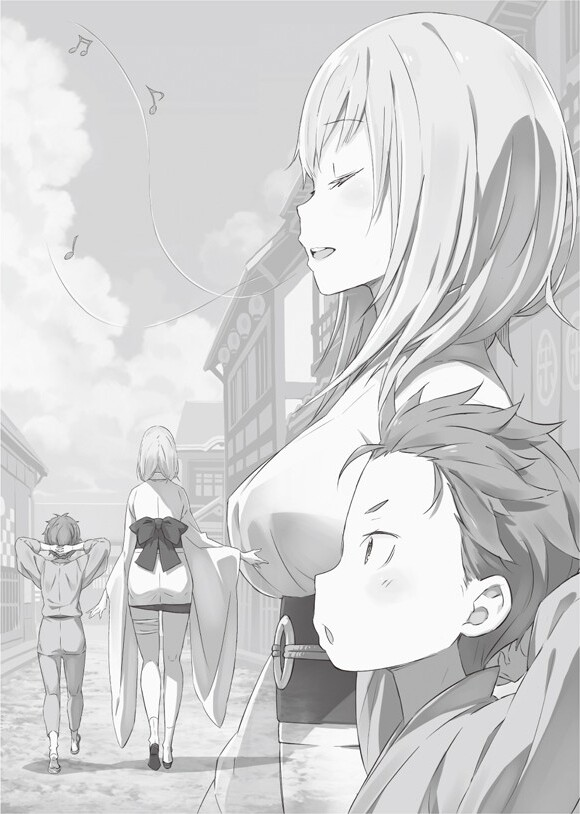

Годовщина

Рем: …Ригель

Когда ребёнок услышал своё ласково произнесённое имя, он медленно поднялся на ноги.

У него были светло-голубые волосы и яркие глаза такого же цвета. Ему исполнилось всего шесть лет, и он был в самом пике своей детской прелести. Тем не менее, в его глазах уже проглядывалась взросла острота.

Нацуки Ригель…, так звали ребёнка, как нельзя хорошо подходящего для конца этой истории.

Рем: Ригель, ты где? Пора идти в школу.

Ригель: Мам, я здесь. Я уже готов.

Вслед за раздававшимся из дома голосом вышла женщина с длинными светло-голубыми волосами. Милая и красивая девушка вдруг улыбнулась, увидев стоящего в саду Ригеля.

Рем: Ох, ты сегодня быстро. Хороший мальчик.

Ригель: Я не как папа, я не хочу доставлять тебе проблем.

Рем: Хмф, не говори так, Ригель. Ты не должен говорить такие плохие слова про своего папу. Кроме того, твой отец заботится обо мне, и именно поэтому я так счастлива. Я уже чувствую, как второй лезет наружу……

Ригель: Что?! Не шути так!

Услышав взволнованный голос своего сына, Рем мило захихикала. Её живот уже сильно вырос, и в нём сейчас был братик или сестричка Ригеля.

Сильно переживая о том, что у него будет новый родственник, Ригель возлагал большие надежды на этого ребёнка. «Наверняка, это будет младшая сестра. Без всяких сомнений, я голосую за неё».

Рем: Но помни, если родится братик, не обижай его и будь его другом, хорошо?

Ригель: Конечно, я позабочусь об этом, если ты постараешься родить мне младшую сестрёнку.

Рем: Ох, боже. Как же ты на него похож……

Столкнувшись с дерзостью и напористостью Ригеля, Рем удручённо схватилась за свой лоб.

На самом деле, среди своих сверстников он был известен за счёт своего остроумия, и незнакомый человек мог даже не догадаться, что ему было только 6 лет.

Тем не менее, Ригель прекрасно понимал, что это было результат влияния многих людей, в первую очередь его отца.

Рем: Это конечно здорово, что я взяла себе отпуск из-за беременности, как предложил твой папа, но теперь мне так скучно.

Ригель: Удивительно, как тебе вообще удаётся заниматься теми же домашними делами с таким-то животом.

Несмотря на унылые вздохи своей матери, Ригель мог только выразить своё уважение к её смелости.

Хоть это и была её только вторая беременность, она была невероятно спокойна и стойка. Ригель хотел было похвастаться об этом всему городу, но его отец его уже опередил.

Рем: Тот раз был очень тяжким для меня. Сравнивая с тем, что произошло тогда, это не так уж и плохо.

Ригель: Та беременность, правда, было настолько тяжёлой?

Рем: Да, всё верно. Роды были преждевременными, и я чуть не умерла.

Ригель: Настолько тяжёлой!?

Рем: Настолько. Твой папа и дядя Халибель тоже чуть не погибли.

Ригель: Чуть не погибли!?

Рем: Не они одни. Займи это чуть больше времени, весь город Банан был бы уничтожен……

Ригель: Насколько же тяжёлыми были мои роды!?

Ригелю только что рассказали, что его рождение подвергло город опасности, так что он мог лишь задаваться вопросом: «Интересно произойдёт ли то же самое с сестрёнкой?»

Ригель: Я выживу, когда моя сестра родится……?

Мысленно он уже представлял, как он использовал технику клонирования, дабы пожертвовать своим отцом и спасти себе жизнь.

В любом случае, пока они мило беседовали, с городской колокольни послышался громкий звон.

Ригель: Ах, ёмаё. Я так опоздаю!

Рем: Нехорошо. Вот, возьми с собой бенто. И ещё, папа забыл взять свой, так что и ему передай.

Ригель: Хорошо……

Ригель взял два пакета и удивлённо схмурил брови, видя разницу между ними. Один был детского размера. Это было для него. Но что за ненормальные пропорции были у второго?

Рем: Они одинаковы.

Ригель: Разве!?

Рем: Я вложила в них одинаковое количество любви. Но, если ты переживаешь из-за таких вещей,……хаха, Ригель ты всё ещё такой ребёнок. Твоя сестричка разочаруется в тебе.

Ригель: Почему вечно виноват я!?

Ригель сердито надулся и смиренно засунул два бенто в свою сумку.

Он помахал маме, направился к выходу и…

Рем: …Ригель.

Услышав мамин голос, Ригель обернулся назад. Она мило улыбалась в проходе, помахивая своей нежной ладонью

Рем: Береги себя.

Ригель: Я побежал!

Обменявшись с Рем словами, Нацуки Ригель помчался в начальную школу.

???: Вы так энергичны сегодня, Ригель.

???: Ри-чан, доброе утро.

???: Доброе утро, Ригель.

Ригель: Доброе утро! Доброе утро! Доброе утроооооооо!

Казалось, весь центр города, через который сейчас бежал Ригель, решил с ним поздороваться. Для Ригеля этот город был родным, а эта обстановка уже привычной. Тем не менее, если бы он назвал все эти приветствия чем-то естественным перед своими одноклассниками, они бы, наверняка, его не поняли, так что он, скорее всего, был немного странным.

Ригель: Мама и папа, видимо, сделали много для города……

Он нередко слышал, как жители начинали обсуждать его мать с отцом, когда он пробегал рядом. Его родители когда-то были вовлечены в какие-то события, всполошившие весь Банан.

По правде говоря, Ригель не верил этим слухам. Разве могла его такая сдержанная (со всеми кроме отца) мать влипнуть в подобную историю? Что касается его отца, было неудивительно, если бы он оказался в каком-то переполохе.

С такими мыслями Ригель…

???: …Ох, Ригель. Пойди сюда

Ригель обернулся в сторону этого привычного беззаботного голоса. Вместо чёрной стены за ним оказался какой-то человек в чёрном кимоно.

Ригель: Дядя Халибель!

Халибель: Оох-оох, давно не виделись, эх, Ригель. Ты хорошо себя вёл? Тренировки не пропускал?

Ригель: Конечно, нет! По правде говоря, я уже готов к следующей! Что насчёт тебя, дядя? Почему тебя так долго не было в городе?

Ригель взъерошил свои волосы и расплылся в широкой улыбке.

Для родителей Ригеля Халибель был, как друг, а для него самого, — как дядя. И, хоть он вечно шутил и не был похож на шиноби, он постоянно выполнял поручения правительства, вырезая всех, кто мог помешать мирному существованию Карараги.

Всё-таки, он был ниндзя. Хотя это и не мешало ему проводить секретные тренировки

Халибель: Ты крайне хорош. Настолько, что, я думаю, ты пойдёшь по моим стопам, если Рем-чан разрешит.

Ригель: «По твоим стопам» значит быть «Вечным Плейбоем»? Ни в коем случае. Я собираюсь поддерживать мать с сестрёнкой и стать главой семьи, устроившись на работу.

Халибель: Где-то я уже это слышал, а что насчёт твоего отца?

Ригель: Папа — мужик Он достаточно взрослый, чтобы подтереть себе зад. С ним всё будет хорошо.

Халибель: ДАХАХАХАХА! Какого чёрта, я никогда не слышал такого про Су-сана.

Пожав своими плечами, Халибель громко рассмеялся, закрыв лицо руками. После, когда его безудержный смех, наконец, утих…

Халибель: Хи…Хи……В-в любом случае, я хотел бы встретиться с Рем-чан. У меня отпуск, так что я хотел бы запечатлеть, как родится твой братик или сестрёнка.

Ригель: Сестрёнка.

Халибель: Хм?

Ригель: Это будет сестрёнка.

Халибель: Эээм, ладно……

Охваченный неожиданной тревогой Халибель согласился с Ригелем и, закурив кисеру, сказал…

Халибель: Ты же сейчас собираешься в начальную школу, да? Береги себя. Вернёшься назад, я потренирую тебя.

Ригель: Ты пообещал! Если ты не выполнишь обещание, я заставлю тебя проглотить 1000 гвоздей!

Халибель: Оох, как страшно. Фраза Су-сана. Я так напуган.

Ригель: Ты будешь глотать их обратной стороной!

Халибель: Такое вообще возможно!?

Халибель громко посмеялся над угрозами мальчика, и, помахав ему своей мохнатой рукой, ушёл восвояси.

Ригель конечно был рад, что он так неожиданно встретил своего учителя, но теперь у него оставалось совсем мало времени. Успеет ли он отдать бенто отцу? Дело было не в том, будет голодать Субару или нет, он просто не хотел разочаровывать свою маму.

И решением было…

Ригель: …Сделаем всё скрытно.

Ригель сосредоточился на своём лбу и, сделав огромный прыжок, помчался по улицам.

Устремляться в воздух и купаться в его прохладе было, действительно, приятно. Вся мана, витающая в атмосфере, собирался в роге, растущем на его лбу, и этот непримечательный шестилетний мальчик становился гораздо сильнее. В этом состоянии Ригелю казалось, что он был способен на всё что угодно.

Однако из-за того, что его мама каждый раз делала невероятно тоскливый взгляд, глядя на его рог, он старался показывать его как можно реже. Конечно, исключениями были срочные ситуации, по типу этой.

Рем: Прости…что у тебя всего один рог……

Его мама сказала так однажды, когда гладила его по голове. Ригель тогда притворялся спящим, так что услышал её слова…, тем не менее, он не понимал, за что она извинялась. «Судя по словам мамы, у меня должно было быт больше рогов, может 5 или 6, хотя это выглядело бы очень странно».

Он считал, что иметь один рог ровно по центру лба, — было очень удобно, тем более, так он выглядел круто.

Ригель: Хотя, мне довольно тяжело выглядеть круто из-за того, что у меня лицо в папу.

Ригель аккуратно перетаптывал меж крыш домов, стараясь не сломать черепицу, и пробирался дальше.

Место, где работал его отец, называлось «Группа развития культуры Банана», что было в восточной части города. Там вечно организовывали какие-то праздники и фестивали или старались наполнить жизнь города яркими красками, что-то такое. Раньше его папа работал в «Школе культуры», но Ригель не знал никаких деталей относительно этого.

В любом случае, папина работа сильно раздражала его, особенно, когда он каждый раз пытался объяснить друзьям о «работе, которая распространяла ритуал, в котором надо было кидаться в Они (»огр« в новеллах, »демон« в аниме, »Они« — в японских традициях и ритуалах. И Рем и японские мифические создания имеют одинаковое название »Они«) бобами».

Тем не менее, папа, и правда, полностью содержал семью на своём заработке. Думая о том, чтобы поблагодарить отца своим усердием, Ригель ускорился и…

???: …Эй, ты.

Ригель: Уууе!?

Он сильно испугался, когда кто-то окликнул его в воздухе. Он осмотрелся назад и резко опешил.

Это была очень красивая девушка. Молочно-белые волосы, девственно чистое платье и милое лицо, способное заставить говорящего с ней потерять дар речи.

???: Ого, я уже начинаю догадываться, чей это ребёнок. Что-то не так?

Ригель: Чт……УАААА!

Ригель, удивлённый красивой улыбкой, появившейся рядом с ним, потерял равновесие в воздухе и начал быстро терять высоту. Он полетел головой вниз и уже был готов разбиться в лепёшку.

???: Осторожно. Не прыгай, раз не можешь удержаться в полёте.

Ригель: Ах

Женская рука схватила его за шею, и они бесшумно спикировали на землю.

Ригель: Э-эээм…

После приземления женщина, не отпускающая ребёнка, уставилась ему в лицо, из-за чего он сильно занервничал.

Увидев такую реакцию, она удовлетворённо вздохнула и сказала…

???: Мне даже нравится это. Да, эта физиономия, говорящая «Я хочу убить».

Ригель: Что это вообще значит!?

???: Оооу, прямо как Су. С таким выражением лица ты так похож на него.

Женщина глупо рассмеялась и отпустила испуганного мальчишку, не понимающего, что ему делать.

«Судя по тому, что она сказала, она знает папу. Большинство людей, знающих папу, очень странные, но она выглядит очень порядочной, или всё это из-за… Красоты. Непонятно…»

???: Эй, очнись, не ведись на мою гипнотизирующую красоту.

Ригель: Неважно, насколько ты красива, у меня есть моя младшая сестра, так что……

???: Ох, тогда всё хорошо. Раз у тебя на уме другая девочка……погоди, младшая сестра!? Как тебе такое позволила карма!?

«Карма…интересно, что это значит. Я не понимаю таких сложных вещей. В конце концов, я ребёнок».

???: Карма — это когда ты живёшь, зная, что ты уже ничего не сможешь изменить. Скоро и сам поймёшь. В любом случае…

Ригель: В любом случае?

???: Ты Ригель, да? Ребёнок Су и Рем. Да?

Ригель: Эээ, если под Су ты подразумеваешь Нацуки Субару, тогда да.

Женщина выглядела крайне дружелюбной и знала имена его родителей, так что он решил довериться ей. Вокруг неё царило ещё что-то неприятное, но он решил это проигнорировать.

Возможно, это была та тайна, о которой лучше было и не знать.

???: …Я удивлена. А ты интересный.

Ригель: Это случаем не кармa? Я правда ничего не понял.

???: Хахаха, а ведь ты поймал меня. Прекрасно. …Ты герой, сразивший ужасного монстра.

Женщина широко улыбнулась, хваля его за несовершённые подвиги. Если она была ужасным монстром, то мир был довольно миленьким местечком.

???: Так что теперь тебя ждёт награда, герой.

Ригель: …? Что это?

Женщина протянула ему какой-то браслет, сделанный из белой нити. В ответ на его недоумевающее выражение лица она лишь довольно хихикнула с хитрой ухмылкой.

???: Это мой маленький подарок. На самом деле, я хотела вручить тебе свою сферу, но это слишком тяжело для меня, так что я дарю тебе этот особенный белый браслет, сделанный мною лично.

Ригель: Что ты имеешь ввиду?

???: Если что-то когда-нибудь произойдёт, я сразу же примчусь, уничтожая всё вокруг, и спасу тебя. Именно для этого он и создан. Это восхитительное сокровище. Как думаешь?

«Она сказала «Уничтожая всё вокруг», но разве эта милая женщина способна на такое».

Ригель уже совсем забыл о своём провальном прыжке, он думал лишь о ней и подарке, но…

Ригель: Мама сказала не принимать подарки от незнакомцев, так что……

???: Хах!? ……Т-ты выкинешь мой подарок? Я-я убью тебя, понимаешь?

Ригель: Что за угрозы!

Слова уже начавшей плакать женщины заставили Ригеля завизжать от испуга.

Она была не в себе. Хоть эта женщина и выглядела, очевидно, старше него, но вела она себя как одна из его одноклассниц. Или даже не так, скорее…. Он будто говорил с младшей сестрой.

Тем более, глядя в её глаза, он мог точно сказать, что у неё не было злых намерений. Она так серьёзно пялилась на него, что сама не могла собрать слова в кучу.

???:Но…Я…люблю тебя. Хотя, я хочу убить тебя.

Ригель …У меня есть младшая сестра, так что……

???: Ты уже говорил об этом! Да она вообще ещё не родилась!

Она истерично топала ногами и рвала на себе волосы не в силах смириться с Ригелем.

???: Хорошо. Хорошо. ХО-РО-ШО! Раз ты настаиваешь, то всё ХОРОШО! Я собиралась уходить, но теперь… Я хочу поговорить об этом с Су!

Ригель: С папой? Я не возражаю, но он та ещё заноза в заднице

???: Я знаю. Тогда с твоей мамой. Пошли, Ригель.

Женщина быстро выпалила это и решительно зашагала в неправильном направлении.

Ригель: Нам туда.

???: Я-я знала эээээто. Разве ты не смышлёный мальчик? Как, по-твоему, я связана с твоим рождением? Город чуть не исчез с лица Земли в тот день, ты знал?

Ригель: Серьёзно, что за чертовщина произошла, когда я родился!?

Ригель неожиданно вспомнил утренние слова матери. Она тоже говорила ему про события того дня, но он так и не знал детали. Тем не менее, женщина вместо того, чтобы открыть ему глаза на правду, сказала…

???: Эта история займёт оооооочень много времени. Гораздо больше, чем дорога до твоего отца.

Ригель: Тогда давай потом продолжим у нас дома. Я уверен, мама будет рада тебя увидеть.

???: ……

Ригель скрестил руки за головой, а женщина лишь широко распахнула глаза. После небольшой усмешки она произнесла…

???: Ко-конечно, она будет рада. Всё-таки это я купила этот дом в качестве прощального подарка.

Ригель: А кто ты моей семье……Погоди, ты даже не назвала своего имени.

Тия: Моё имя? Ох, я Тия. Я……хм…

Девушка, видимо связанная с его семью, только и делала, что баловалась с Ригелем, но он был не против.

С радостной улыбкой она обернулась в его сторону и произнесла…

Тия: ……Я…типо часть твоей семьи.

Она наконец закончила свою фразу, и они медленно отправились на место работы Субару, стоя по обе стороны переулка.

Асам того не понимая, девушка начала напевать какую-ту красивую мелодию. Она была знакома Ригелю.

Ригель: ……

Это была колыбельная, которую мама выучила ещё задолго до его рождения.

Она назвала её «Тия»

«…Так что, думаю, она и правда часть нашей семьи»

Ярко-голубое небо, не меняющееся день ото дня… Замечательный пейзаж обычной семейной жизни.

Это общее и незаменимое счастье существовало лишь в одно единственном уголке мира.

Были вещи, которые они упустили, были места, которые они забросили, были воспоминания, которые они не могли бы забыть, даже если бы попытались.

Но несмотря на все эти противоречивые чувства они всё ещё продолжали жить в этом мире.

…Это был конец любовной истории мальчика, который совершенно неожиданно для себя забрёл в чужой мир.

