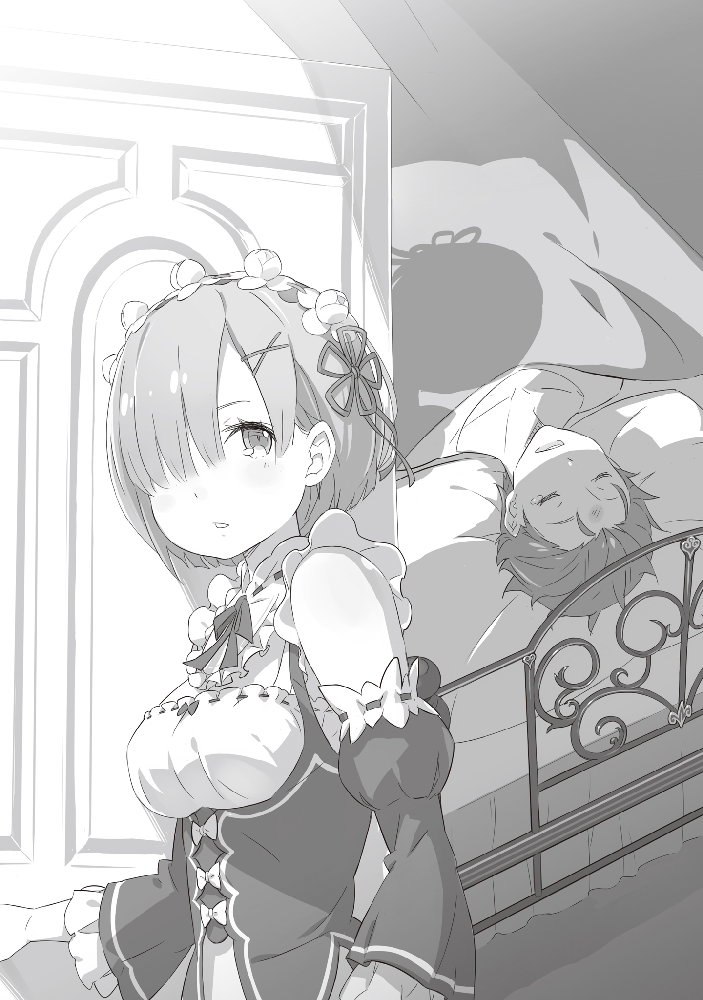

…Почувствовав, что у неё защемило в груди, девушка выглянула в окно.

Она посмотрела на тропинку перед воротами, ведущими к главной дороге, что виднелась из окна особняка, после чего оглянулась.

— Господин Розвааль, кажется, Сестра возвращается. Похоже, она спешит.

— Хммм, она возвращается раньше, чем было заплани-и-ировано. Поскольку она скоро вернётся, это означает, что она покинула то место в ночно-о-ое время.

Мужчина беззаботно ответил девушке, которая сообщила об этом, основываясь на покалываниях в груди, он действительно выглядел так, будто лишь строит из себя невежду.

Это был человек, который сидел в кожаном кресле и держал в руках чашку, из которой медленно вздымался пар. Его длинные волосы имели цвет индиго. Его завораживающие глаза были голубого и жёлтого цвета; с первого взгляда можно сказать, что он выглядел как хрупкий, красивый мужчина.

Однако клоунский грим на его лице портил всё это стильное впечатление.

— В спешке… Интересно, что-то случи-и-лось? Тебе известны подробности?

— Простите. Я и сама не очень понимаю ситуацию. Но, похоже, у госпожи Беатрис теперь есть работа.

— У Беатрис? Ясно. Но это означает, что кость была бро-о-ошена.

Услышав её объяснение, Розвааль поднял глаза к потолку и пафосно опустил чашку на стол. После этого он зафиксировал свои длинные ноги и, повернувшись лицом к девушке, когда задвигал стул, произнёс следующее.

— Во всяком случае, действия Рам обычно не бессмысленны… я думаю. Прости, но не могла бы ты найти Беатрис? Я думаю, она может немного задержа-а-аться.

— Да, понятно.

Получив приказ своего господина, она слегка придержала наряд горничной, который был на ней, и ответила идеальным реверансом. На её опущенной голове, на которой виднелось белое головное украшение, были коротко подстриженные волосы голубого цвета. После того как слуга поклонилась,

Розвааль одобрительно кивнул подбородком и сказал: “Ну, тогда, пожалуйста, приступай к делам… Рем”.

Девушка — Рем, формально поклонилась и покинула кабинет.

Покачивая синими волосами, Рем бодро шагала по просторному коридору особняка.

Это был особняк маркграфа Лугуники, Розвааля L. Мейзерса. Рем была главной горничной этого особняка. Она умела делать всё и выполняла большую часть работы в особняке.

Несмотря на то, что особняк Розвааля был довольно большим в сравнении с другими особняками, в настоящее время по ряду причин лишь два человека были постоянными горничными — только Рем и её сестра-близнец Рам. Поэтому Рем компенсировала нехватку работников и выполняла большую часть работы в особняке самостоятельно.

И вот сегодня с ней связалась сестра, которая уехала из особняка по делам, после чего произошел обмен мнениями.

— Судя по диапазону синестезии, полагаю, Сестрица вернётся примерно через час.

Существовала магия, позволяющая общаться в реальном времени на большом расстоянии, но сёстры не нуждались в ней.

Синестезия, которой обладали близнецы — Рем и её сестра Рам — обладала особой способностью передавать сильные эмоции и мелкие мысли. Благодаря синестезии она почувствовала возвращение сестры и её легкое нетерпение.

Однако в данный момент было неизвестно, сможет ли она выполнить просьбу сестры.

— Всё было бы гораздо легче, будь здесь великий дух… Госпожа Беатрис?

Рем смело взялась за трудную задачу, говоря о том, что нет смысла желать слишком многого. Задача была очень проста — открыть все двери, которые она увидит. Однако особняк насчитывал около сотни дверей. Это, конечно, было нелёгкой задачей.

— Госпожа Беатрис, за какой из них вы находитесь?

Она открыла дверь с табличкой “Справочная комната”. Её встретило несметное количество книг. Это было нормально, поскольку это была справочная комната.

Обычно в справочной комнате не бывает людей, что постоянно в ней находятся. Рем тоже не собиралась этого делать.

— Госпожа Беатрис? Госпожа Беатрис?

Обращаясь к ней, Рем спокойно открывала двери одну за другой, хотя и в необычном темпе. И вот спустя пять минут открытия дверей…

— Агх! Какая же ты назойливая, громкая и шумная, это невыносимо!

Из соседней комнаты вышла одинокая девочка с громким, но милым голосом.

Это была маленькая девочка, одетая в роскошное платье, волосы которой были заплетены в косы. Увидев появление этой девочки с внешностью куклы, Рем выпрямилась и глубоко поклонилась.

— Ты уже давно продолжаешь эту шумную суету, я полагаю! Какие именно дела у тебя с Бетти в столь поздний час?

— Прошу прощения, Госпожа Беатрис, слава богу, вы ещё не спите.

— Хмф, даже если бы я спала, такой шум бы меня разбудил. В тебе действительно есть смелость, младшая сестра.

Девочка Беатрис прижав к груди книгу высокомерно фыркнула в сторону Рем, которая поклонилась в ответ. Она вела себя высокомерно, но Рем было всё равно.

Беатрис была человеком высокого положения. То, как она общается со служанкой Рем, вполне ожидаемо.

— Так получилось, госпожа Беатрис, что господин Розвааль зовёт вас. Похоже, есть дело, в котором ему просто необходима ваша помощь.

— Если он поручил слуге позвать меня, значит, он очень высокого мнения о себе, я полагаю. Похоже, он забыл, что между ним и Бетти нет иерархических отношений.

— ……

Беатрис, которой, похоже, не нравился этот эгоистичный способ ведения дел, стала ворчливой, поскольку её вызвали поздно ночью.

— …Ааахх. Поторопись и покажи Бетти дорогу, пока она не передумала, я полагаю.

— …! Да, спасибо. Рем проводит вас.

Беатрис лишь на мгновение нарушила молчание, а затем выразила свою толерантность таким образом, чтобы показать, что она уступила. Будучи спасённой задумчивостью, Рем шла по коридору, ведя за собой Беатрис.

— Мм… Я получила инструкции от Паки. Похоже, вам следует приготовить горячую воду, чистую мочалку и комнату для одного гостя, я полагаю.

— Комнату для гостей?

— Именно так… Похоже, эта полубезумная девчонка приведёт кого-то с собой, я полагаю.

Беатрис пробормотала это в несколько недовольной манере, а её глаза не показывали никаких эмоций. Рем про себя обдумывала указания Беатрис, не упоминая о том, что она сказала.

Комната для гостей всегда была наготове. Ей достаточно лишь приготовить простыни и проветрить помещение. Затем разогреть ванну, подготовить чистое полотенце… Она сразу поняла, что они привезли кого-то, кто был ранен.

Исходя из этого, она также поняла, зачем нужна была Беатрис.

…Беатрис — великий целитель, Рем никогда не сравнится с ней. Её посетила мысль, что Драконья Повозка уже совсем близко, услышав рычание дракона, что доносилось издалека.

…Черноволосый мальчик, лежавший на кровати, глубоко дышал во сне.

Исцеление мальчика, которого привезли на рассвете, заняло много времени; солнце за окном уже садилось на западе. До наступления ночи оставалось всего ничего.

— Теперь ему должно быть легче…… да.

Рядом с кроватью, на стуле, сидела девушка с серебряными волосами — Эмилия.

Эмилия была той, кто привезла этого мальчика и попросила излечить его. Теперь, когда суматоха на время отступила, Рем обратилась к Эмилии с вопросом.

— Госпожа Эмилия, теперь, когда всё успокоилось, думаю, самое время рассказать Рем, в чём дело.

— Мм, ты права. Этого мальчика зовут Субару. Он помог мне с проблемами в столице. Я обязана ему своей жизнью и не только ею.

— Это так?

Услышав смутное объяснение, Рем бросила взгляд на человека рядом с ней — она смотрела на свою розоволосую сестру-близнеца, которая выглядела так же, как она.

Под пристальным взглядом сестры старшая сестра Рам сохранила каменное лицо, и, покачав головой сказала: “Даже я не знаю ситуацию в деталях. Это случилось, пока мы с госпожой Эмилией были разлучены”.

— Разлучены…? Я думала, ты была с госпожой Эмилией, с целью сопровождения…

— Это было сделано, чтобы поощрить независимость и сильное чувство ответственности госпожи Эмилии.

— Как и ожидалось от сестры… Я очень впечатлена.

Она говорила немного дерзко, но Рем безоговорочно принимала всё то, что говорила Рам. Видя такую беседу сестёр, Эмилия рассмеялась.

— Вы двое действительно очень хорошо ладите. Но не заставляйте меня слишком сильно смеяться. Я хочу дать этому мальчику как следует отдохнуть.

— Этот мальчик, должен быть тем, кого вы встретили, пока были разлучены с сестрой.

— Нет, он не… Субару мой… мой кто?

Эмилия приложила палец к подбородку и заволновалась с серьёзным выражением лица. Похоже, что она не пыталась противоречить Рем. Было видно, что в действительности она сама не знала ответа.

То, что она не пыталась что-либо скрыть при этом, затрудняясь ответить, означало, что это должен быть кто-то, о ком у неё слишком мало информации.

…Тогда, возможно, это был человек, которому не следует находиться рядом с Эмилией.

— …Рем. Этот человек спас жизнь госпоже Эмилии. Господин Розвааль так же признал это. Как бы глупо он не выглядел, он наш гость. Ты ведь понимаешь, к чему я клоню?

— Но, сестра…

— Рем.

На мгновение она назвала её по имени. Рем почувствовала, что сестра заглянула глубоко в её сердце, после такого она не смогла продолжать.

Эмилия в замешательстве уставилась на молчащих сестёр, затем медленно присела.

— Вообще-то я хотела бы остаться рядом с ним, до тех пор, пока он не очнётся, но, видимо, он не проснётся до утра.

— Нам сказали, что она израсходовала большую часть маны на исцеление. Я была удивлена, что госпожа Беатрис помогла исцелить того, кто был ей не знаком.

— Из-за этого Пак будет завтра весь день в распоряжении Беатрис. Также, Розвааль… до вечера покинул особняк, я думаю.

— Его внезапно вызвали, поэтому он будет отсутствовать в особняке. Он планирует вернуться завтра вечером.

— Понятно. Что ж, давайте освободим комнату.

Эмилия, которую, похоже, устроили ответы сестёр, быстро потянувшись, попросила их освободить комнату. Напоследок Эмилия провела пальцами по чёлке мальчика, лежащего на кровати — по чёлке Субару.

— Я многое хочу обсудить с Субару, когда он проснётся.

Рем казалось, что она шепчется, и в шёпоте звучало сладкое предвкушение.

Выйдя из комнаты, они разошлись по коридору каждый по своим делам. В частности, Эмилия должна была доложить Розваалю о происшествии в столице.

— Хм, он рассердится на меня. Как бы мне ему всё это объяснить…

Эмилия расслабила плечи и зашагала в сторону своей личной комнаты в особняке. Рем посмотрела, как она уходит, попрощалась с Рам, у которой оставалась работа, и отправилась на кухню готовить ужин.

— …Перед этим.

Рем убедилась, что они ушли, и пробралась в комнату, в которой спал мальчик.

Она тихо закрыла дверь и подошла к кровати в мрачной комнате, где не горел свет.

Рем, затаив дыхание, слышала только тихое сопение спящего мальчика. Невинное лицо спящего мальчика отражалось в светло-голубых глазах Рем.

…Она не знала, кто этот подозрительный мальчик и какова его цель.

Эмилия объяснила, что он её спаситель, но она не могла поверить, что у него нет скрытых мотивов. Эмилия была красива, но она была настолько наивна, что простое наблюдение за ней вызывало беспокойство, и не было конца людям с дурными намерениями, преследующим её.

…Пока не возникли проблемы, пока всё спокойно, может, мне стоит что-то предпринять?

Опасные мысли поднялись в голове Рем, она молча потянулась к шее мальчика. А затем…

— Э-хе-хе, ты такая милая, даже когда злишься…… параллельные миры, фэнтези……

С очень неряшливым выражением лица мальчик разговаривал во сне пуская слюни, словно неряха.

Услышав это, Рем не знала, что делать со своей рукой, и…

— …Аагх.

Увидев, как спящий мальчик вскрикнул после того, как она провела по нему пальцем, Рем почувствовала облегчение.

— Я не думаю, что смогу найти общий язык с этим гостем. Пожалуйста, покиньте нас как можно скорее.

Только поверхностная вежливая просьба Рем осталось в комнате для гостей, прежде чем она покинула её.

