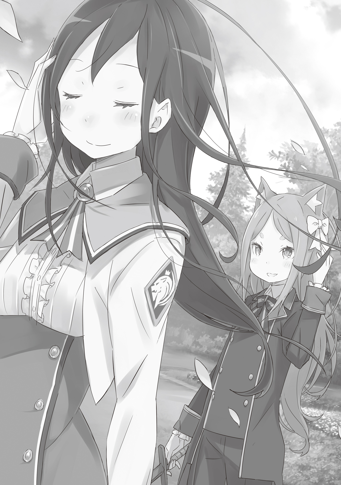

— ……!

Мальчик стискивал зубы, когда при каждом взмахе конец деревянного меча рассекал воздух.

Пот капал с его лба, а кончики пальцев слегка немели. Его тело сковывала усталость, и, запыхаясь, с поднимающимися и опускающимися плечами, он воткнул деревянный меч в землю и поднял взгляд к небу.

Светловолосый мальчик с худощавым телосложением и бледной кожей тяжело дышал.

Желтые глаза и волосы, доходящие до спины. Его стройная фигура и мягкие черты лица были настолько тщательно ухожены, что другие часто ошибались в определении его пола.

Несмотря на то, что ему было чуть больше десяти лет, уже можно было увидеть, каким красивым он станет в будущем. Возможно, он жутко стыдился своей внешности, которая вызывала так много зависти.

Образ мужчины, которым он обещал стать, и он сам в настоящем — какая огромная разница между ними.

— Гх…

Сразу после того, как его охватило отвращение к самому себе, мальчик снова взял свой деревянный меч, стараясь отогнать неприятные мысли. Он попытался заставить себя вернуться к взмахам, но хват его был всё ещё ослабшим.

Деревянный меч выскользнул из его пальцев и закружился в воздухе под действием взмаха. Пока он летел вращаясь с конца на конец, мальчик стоял и наблюдал за его полетом, броня себя…

— Ты снова здесь, Феликс? Твое усердие достойно похвалы.

Спустившись во двор, она заговорила знакомым тоном, поймав летящий меч.

После того, как он на мгновение был поражен её филигранным движением, мальчик — Феликс — поспешно встал на колени. Затем, подняв голову, он заговорил дрожащим голосом с ней.

— Г-госпожа Круш! Мои смиренные извинения за эту ужасную грубость. За мою неосторожность…

— Не преувеличивай. И не принижай себя так. Кроме того, ты был здесь первым, а я пришла позже. Для меня было упущением притронутся к твоему мечу, не поговорив сначала с тобой.

Великодушный ответ молодой особы прозвучал всё ещё высоким голоском.

Это было потому, что перед преклонившим колени Феликсом стояла девочка его возраста.

Герцогиня Круш Карстен — девушка с красивыми, длинными, почти смоляными зелеными волосами, смелым взглядом и выражением лица, полным стремлений. Она также была госпожой Феликса и его покровитель.

Взгляд Круш, суженный в линию, был направлен вниз на макушку Феликса. На его пшеничных волосах отчётливо вырисовывалось его примечательное отличие — у него были звериные уши.

Это, действительно, было основной причиной ситуации, из которой Круш спасла Феликса, и величайшим поворотным моментом, который привел к тому, что он служит той, за которой готов последовать на край света.

Уши, которые он когда-то считал отвратительными, теперь, перед своей госпожой, он считал даже поводом для гордости. И судя по его бесконтрольно покачивающемуся длинному хвосту, гордился больше, чем он сам мог осознать.

Хотя Круш сознательно сохраняла твердое выражение, но при виде покрасневших щек Феликса и извивающемуся хвостику, её суровое выражение тут же смягчилось.

— Феликс, я тоже хочу немного потренироваться. Ты не против, если я воспользуюсь твоим мечом?

— Д-да, конечно! Всё же хорошо, если я буду наблюдать рядом с… нет, неподалёку от вас?

— Нет необходимости выбирать такое скромное положение. Если хочешь наблюдать, наблюдай откуда угодно. Я не думаю, что я такая нетерпимая госпожа, что мне помешало бы пристальное внимание со стороны слуги.

Когда лицо Феликса просияло от восторга, Круш наконец-то расплылась в неоспоримой улыбке. Затем, когда Феликс уступил ей дорогу, она встала совершенно прямо.

…шух.

Траектория удара деревянного меча, выполненного в её прекрасной стойке, была точно такой же, как и предыдущий взмах Феликса. Тем не менее, его скорость, точность, мощь, мастерство и техника были явно на другом уровне. Это был настолько блистательный взмах, что можно было решить, будто сам воздух не осознал, что его разрезали.

Очевидно, это была иллюзия, в значительной степени вызванная тем, что Феликс смотрел на это в самом лучшем освещении, но факт оставался фактом: между её навыками владения мечом и его существовала огромная разница. Пропасть, разделявшую их таланты в фехтовании, которую невозможно было преодолеть.

— Твоё выражение так быстро меняется, Феликс. Только что ты казался таким довольным, а теперь выглядишь подавленным.

— Ах…

Закончив разогреваться, Круш взглянула в сторону Феликса, который наблюдал за ней, и высказала ему свои мысли. Услышав слова своей госпожи, Феликс опустил глаза, стыдясь себя.

— Скоро будет полгода с тех пор, как ты пришел в наш дом, не так ли?.. Да, именно так.

Глядя на молчаливого Феликса, Круш, казалось, правильно поняла, что происходит в его сердце.

Феликс был хорошо понимал и стыдился того, что не сделал никаких успехов за всё время, как его приняли в качестве слуги Круш.

Каждый день, без исключения, он размахивал своим деревянным мечом, прилагая усилия, чтобы стать достойным быть рыцарем Круш.

Однако его тело не могло угнаться за его желанием стать сильнее. Из-за долгого заключения в его родном доме, самый важный этап роста прошёл не познав какого-либо развития.

Он давно понял, что его усилия по укреплению тела были так же тщетны, как попытка отстроить песчаный замок, разрушаемый всеми ветрами.

— Ты снова смотришь вниз.

— Когда только осознаёшь, что твой путь к рыцарству отрезан, любой на моём месте предался бы унынию.

— Что ж, ты прав. Это было неосторожно с моей стороны. Даже я была бы расстроена, если бы не могла доверять своему собственному мастерству владения мечом. Мне следовало быть осмотрительней.

Слова Круш, полные заботы, болезненно вонзились в сердце Феликса.

Вина от извинений от госпожи, которую он уважал. Кроме того, его сердце нисколько не успокоилось от ее слов. Он чувствовал себя ужасно жалким существом и хотел исчезнуть.

Его спасли, и он ничем не мог отплатить тому, кто его спас. С этим его клятва могла быть воспринята как удобные в данный момент слова, которые быстро забудутся, как только момент пройдёт.

Не желая, чтобы его так воспринимали, он продолжал бросаться с головой в фехтование, несмотря на то, что знал, что это ни к чему не приведет.

— Феликс.

Подняв голову на зов, он вдруг осознал, что Круш переместилась к стороне двора. Там был небольшой цветочный сад, и под заботой садовника цвели множество цветов.

Круш присела перед одним из них и небрежно схватила его за стебель — цветок ярко-алого оттенка, охраняемый множеством острых шипов.

— Госпожа Круш?!

Когда Круш поморщилась от легкой боли, Феликс подбежал к ней и взял ее за руку. Присмотревшись можно заметить, как на кончике белого пальца образовалась капля крови, которая стекала по пальцу к ладони.

Поспешно сосредоточив свое внимание, Феликс пробудил ману внутри себя. Переместив это слабое ощущение на свой собственный кончик пальца, слабый голубовато-белый свет заискрился, обволакивая рану Круш.

Всего за несколько секунд рана закрылась, и после того, как кровь была вытерта, от укола не осталось и следа. Убедившись в этом, Феликс выдохнул с облегчением.

— Феликс. Даже после этого ты все еще будешь продолжать затуманивать свои глаза верой в то, что ты бесполезен?

— Госпожа Круш…… вы не имеете в виду?..

Открывая и закрывая руку, с которой исчезла рана, Круш кивнула озадаченному Феликсу.

— Неужели быть рыцарем означает, что нужно защищать других только силой меча? Сила — это не то, что рыцарь лелеет. Что по настоящему важно для него, так это воля. Он дорожит волей защищать других. Если сила рыцаря может быть использована для защиты раненых, то нет ничего странного в том, что сила рыцаря используется для исцеления раненых.

— Госпожа Круш… это… вы хотите, чтобы я стал?..

— Я просто говорю о том, что, по моему мнению, является путем, которым должен следовать рыцарь. Говоря прямо, я даже не думаю, что тебе, моему слуге, необходимо быть рыцарем вообще. Если, несмотря на это, ты все еще чувствуешь озабоченность по поводу рыцарства…… Ты можешь просто быть рыцарем, который не полагается на меч. Кроме того…

Когда Феликс стоял безмолвный, Круш закрыла глаза и продолжила.

— …Когда я была на грани смерти, тем, кто спас меня, был не кто иной, как ты, Феликс. Тогда, даже если бы там был Святой Меча, я не спаслась. В то время единственным, кто мог спасти меня, был ты. Так что, на мой взгляд, ты более чем заслужил право называть себя рыцарем.

Нельзя не отметить, что её мнение было чрезмерно благосклонным для Феликса.

Это правда, что Феликс спас Круш, когда она была на грани смерти, но его же действия и были причиной, из-за которой чуть не оборвалась её жизнь. Слова Круш были попыткой представить в лучшем свете поступок, чье добро уравновешивалось его злом.

— Раз уж ты бесповоротно очарован мечом, я не буду останавливать тебя. Ведь нет ничего столь неэлегантного, как гасить энтузиазм юноши.

Каким бы путем ни пошёл Феликс, Круш, безусловно, поддержит его.

Это было то всеобъемлющее доверие со стороны его госпожи, которое растопило грубое сердце Феликса. Сколько бы времени он ни потратил, он никогда не начнет приближаться к мастерству Круш в владении мечом.

Этой мысли было достаточно, чтобы наконец принять необходимость сдаться, о которой он давно знал.

— Я не откажусь от того, чтобы стать рыцарем. Но, я убеждён, что окажусь немного необычным рыцарем. Простите меня за то, что я воспринял ваши слова всерьёз?

— Если это не отбрасывает тень на твою душу, то я счастлива.

С этими краткими, в стиле Круш, словами поддержки, Феликс наконец-то смог показать расслабленную улыбку.

Увидев улыбку Феликса, Круш тоже слегка улыбнулась.

— У тебя действительно хорошая улыбка. Возможно, это ранит твою гордость сказать это, но твоя мягкая улыбка обладает свойством успокаивать сердца тех, кто вокруг тебя.

— Я люблю вашу улыбку, госпожа Круш. Она заставляет меня чувствовать от всего сердца, что я хочу следовать за вами.

— Хоть мой отец часто говорит, что у меня «Лицо совсем не миленькое».

Она попыталась представить слова как шутку, но мерцание боли было видно в ее янтарных глазах. Заметив это, Феликс на мгновение потерял дар речи. Но только на мгновение.

— Есть ли что-то в словах герцога, что беспокоит вас, госпожа Круш?

— …Настолько очевидно читалось на моём лице?

— Нет. Я думаю, я смог понять, потому что я всегда смотрю на вас.

— Как всегда честен.

Говоря с улыбкой в голосе, Круш слегка вздохнула.

— Раз уж от рождения мне недостаёт женского очарования, то стоило родиться мальчиком. Без сомнения, мой отец думает обо мне именно так.

— Это не может быть правдой!..

— Нет, всё в порядке. Это не ранит мое сердце. Ведь я думаю также. Да и похоже ты не знаешь, как сплетники говорят обо мне?

Дочь герцога Карстена была помешанной на боях на мечах дикаркой, так они считали, как он слышал. Те, кто не знал её характера, выворачивали факты как угодно, игнорируя правду.

— Это странно. С одной стороны, меня порицают за то, что я женщина, владеющая мечом, но с другой, мне строго велят овладеть вещами, которые обязан знать мужчина, чтобы унаследовать титул. Люди вокруг меня; они хотят, чтобы я была мужчиной или женщиной?

В голосе Круш не было ничего похожего на сарказм. То, что она чувствовала, было чистым сомнением, именно так, как она и говорила.

И что бы ни говорили люди вокруг неё, сама Круш уже решила ответ.

— Я говорила тебе столько величественных слов о том, каким должен быть рыцарь, но для меня есть только один путь, который я могу выбрать. Унаследовать титул отца и стать следующим герцогом. На этом пути нет места ни искусному мечнику, ни женщине.

— …Тогда в конце концов, вам придётся отложить меч?

— Вряд ли мне дадут шанс расцвести. У меня есть одно крохотное желание. Даже если я не смогу достичь уровня великого фехтовальщика или Святого Меча, или тем более Демона Меча, я хотя бы хотела достичь своих собственных пределов… это было бы моим желанием.

Когда Круш описывала свой возвышенный идеал с мимолётной улыбкой, у Феликса перехватывает дыхание.

Чувство раскаяния наполнило его. Круш Карстен не была тем человеком, который должен от чего-то отказываться. Тем более неправильно, чтобы ей приходилось предпринимать действия, которые отодвинули бы её самое заветное желание.

— Даже… даже если вы унаследуете титул герцога, должен быть способ, чтобы вы могли продолжать владеть мечом.

— Феликс?

— Раз это вы, госпожа Круш, я уверен, что вы сможете найти способ двигаться вперед, сохраняя всё в равновесии. Замещая герцога и доводя своё мастерство владения мечом до его пределов; нет необходимости от чего-либо отказываться.

Когда Круш стояла с широко открытыми глазами, Феликс отчаянно умолял.

Он не хотел видеть, чтобы она отказывалась от чего-то. Круш обладала всем, чего он так сильно хотел, будто мог сам прочувствовать это. И он никак не мог вынести, когда она это отбрасывает.

— Если вам чего-то не хватает, то я восполню это. Я знаю, что я слаб, и что я могу сделать лишь так немного. Но все же! Я сделаю это!

— Меня трогают твои слова. Однако, даже предлагая помощь… Ты бы мог заменить дворецкого, но вот с двумя другими ролями я не уверена…

— Раз так!..

Взгляд Круш никогда не должен омрачаться. Она была тем, кто всегда должен двигаться и смотреть лишь вперёд.

Он был единственным, кому нужно было стоять в темноте, ожидая завтрашнего дня, который никогда не наступит.

— Ну тогда, я возьму на себя роль девушки за вас, госпожа Круш!

— …

— Как вы видели, я не могу помочь с мечом. Но вот косить под девчонку я могу!

Когда Круш смотрела на него в изумлении, Феликс осознал значение того, что он только что сказал, не задумываясь.

Думая, что теперь нет пути назад, Феликс смотрел прямо на Круш, продолжая.

— …Ты хоть понимаешь, что ты говоришь?

— Да! …Нет, я не совсем знаю, что мне нужно будет делать, но я понимаю! Я буду девушкой для госпожи Круш!

Запыхаясь, Феликс воскликнул, не дав Круш возможности возразить.

— Я… Я позабочусь о том, чтобы быть девушкой, поэтому я отдам вам своё мальчишество! Пожалуйста! я знаю, что его у меня не так много, но прошу, примите его!

— Ты…… ах, хаха.

Увидев Феликса с широко открытыми глазами от волнения, Круш внезапно не смогла сохранить строгое выражение лица и засмеялась.

Феликс на мгновение беспокоился о реакции своей госпожи, но Круш тут же покачала головой.

— Конечно, было бы неправильно не принять то, что предлагает мой слуга. В конце концов……

Говоря это, Круш развязала ленту, связывавшую её волосы, и нежно освободила их.

Освободившись от белой ленты, ее красивые зелёные волосы быстро распустились на ветру. Не обращая на это внимания, Круш взяла развязанную ленту и завязала её в пшеничные волосы Феликса, который всё ещё стоял в напряжении.

Как большой распустившийся цветок, лента украсила мальчика по имени Феликс.

— Мхм. Она тебе идёт… или, возможно, это не комплимент?

— …Комплимент. Забота госпожи Круш лучше любого признания.

С безумно счастливым выражением на лице, Феликс честно выразил свои истинные чувства.

Это было странное чувство. Руки, которые были слишком слабы, чтобы держать меч, ноги, которые не могли поддерживать его так, как он хотел, хрупкое тело, которое быстро теряло энергию; до этого момента он считал их отвратительным проклятием.

Теперь, благодаря им, он смог ответить на небольшую просьбу своей госпожи, он мог думать о них как о лучшем даре, чем любой другой.

— Если она тебе опротивеет, верни её мне в любое время. Я также верну то, что ты дал мне, безусловно.

— Этого никогда не произойдет. Поэтому, пожалуйста, позвольте мне всегда быть на вашей стороне.

— Понятно.

Феликс ответил без колебаний на заботливые слова Круш.

Увидев, как Круш улыбается и выглядит удовлетворенной, отворачиваясь, Феликс на мгновение почувствовал, что смог сделать что-то полезное ради этой драгоценной девушки.

Затем, глядя на её красивые волосы, развевающиеся на ветру, он сказал: — С этим, пожалуйста, позвольте мне найти вам замену ленты, — касаясь ленточки, украшающей его собственные волосы.

《Конец》
