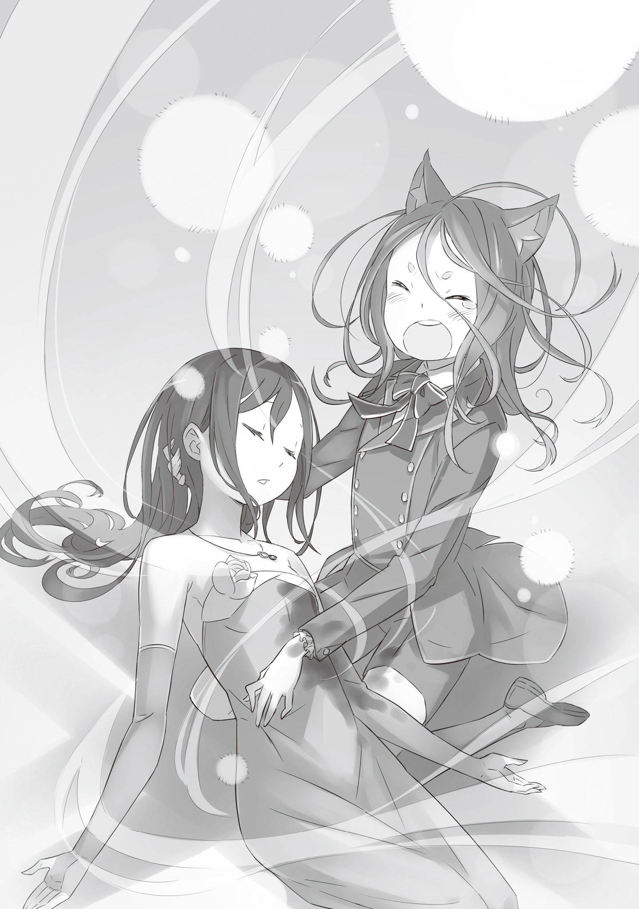

Когда Феликс Аргайл был маленьким, мир был для него бесцветным и пустым.

Без красок, без звуков, без вкусов, без тепла.

Ничего не было дано ему, и ничего не было отнято.

С самого начала у него не было ничего.

В тёмной комнате, где он не мог разглядеть даже собственные руки, на кровати, на которой лежал так долго, что даже его запах впитался в неё, он просто проводил время, ни о чём не думая.

Иногда под дверью просовывали еду. Опираясь на слабый свет, пробивающийся сквозь щель, он полз по полу, жадно бросаясь к еде, как пёс.

Холодная пища.

Он захватывал её руками, а иногда сунув лицо прямо в миску, как зверь, неуклюже пачкаясь, кусая и пережёвывая пищу.

Когда он доедал, то подталкивал поднос обратно к двери, возвращался неуверенной походкой в свою кровать и молча ждал. Если кто-то забирал посуду, он даже не обращал на это внимания. Даже если он потерял смысл жизни, у него не было причины умирать.

Поэтому он просто не умирал.

Принимать пищу, которую ему давали, не значило для него больше, чем просто продолжать существовать.

— ……

Он открыл рот и попробовал что-то сказать.

Раздался ли голос? Он не был в этом уверен.

Возможно, его уши уже не слышали.

Возможно, его горло не могло больше издавать звуков.

Или, быть может… он сам уже давно был мёртв?

Предаваясь бесконечным мыслям, Феликс просто продолжал существовать.

Размышления о жизни и смерти — он уже слишком много раз гонял их в своей голове.

— ……

Вновь воздух словно дрогнул.

Он закрыл рот. Но ведь он даже не пытался говорить.

Что же он услышал?

Может, в комнату пробралось насекомое?

Он сам был нечистоплотным, да и остатки пищи, раскиданные во время еды, могли привлечь живность.

Даже если он ничего не чувствовал, сама мысль о том, что он делит это помещение с насекомыми, вызывала у него какое-то неприятие.

Но что могло значить это чувство для того, кто был менее значим, чем самое жалкое насекомое?

— ……

Он снова что-то услышал.

Неужели он смеялся?

Попробовав дотронуться до своего лица, он ощутил лишь пустоту. Он даже потерял представление о том, где находится его лицо.

Его разум уже окончательно сломан.

Он тяжело вздохнул.

И в этот момент…

— Я расценю молчание как знак согласия!..

В тот же миг раздался звонкий голос. Дверь в комнату с грохотом слетела с петель, осколки посуды, той что стояла у двери, разлетелись по полу.

Феликс вздрогнул от внезапного вторжения и звона разлетающейся керамики. Лежа на кровати, он поднял голову и взглянул в сторону двери.

Из-за сорванной двери в комнату хлынул яркий свет. Даже пыль, взметнувшаяся в воздух, плавала в этом свете, создавая фантастический эффект.

Через этот свет уверенно шагнула небольшая фигурка.

— Здесь ли находится Феликс Аргайл, первенец семьи Аргайл?

В её голосе звенело сильное волнение.

Прислушавшись, он понял, что это был детский голос. Высокий голос, который ребёнок нарочно делал уверенным и твёрдым, чтобы он звучал достойно и пробирал до глубины души.

Но в нём не было фальши. Хозяин этого голоса не притворялся.

Просто развитие её тела не поспевало за стремительностью её сердца.

— ……

Феликс, всё так же находясь на кровати, безмолвно смотрел на нарушительницу. Она прищурилась в полумраке. А когда глаза привыкли к темноте, она наконец-то его разглядела. И, слегка улыбнувшись…

— Вижу тебя. …Ну же, пришло время освободить тебя от этой несправедливости.

С этими словами, она без колебаний взяла его грязную руку в свою.

Тёплая вода стекала по его голове, и только тогда Феликс осознал, что всё это происходит взаправду.

Проникая сквозь отросшие волосы, она смывала грязь, покрывавшую всё его тело.

Прозрачная вода, только что вылитая на него, достигнув пола ванной, полностью почернела.

— Освежает, правда?

Наблюдая, как грязь смывается с Феликса, его спасительница говорила весело и непринуждённо.

Перед ним была молодая девушка, её бледное тело было совершенно обнажено. Длинные зелёные волосы, решимость, пылающая в глазах. Её благородные, прекрасные черты придавали ей удивительную смелость для её возраста.

Хотя она была не старше Феликса, он не мог не опустить взгляд, ощущая разницу между ними.

— Не опускай глаз. Если твой взгляд потускнеет, помутится и твой дух. А если ты позволишь духу угаснуть, то можешь потерять даже саму причину жить.

Она легко разрушила все страхи Феликса.

Взяв его за руки, которыми он ещё не мог двигать, прикоснувшись к его коже, она принялась отмывать его тело мочалкой. Пока с него смывали грязь, Феликс наконец-то задался вопросом:

Кто она?

Почему вытащила его из той тёмной комнаты?

Почему теперь находится рядом?

— Мой род был покровителем Семьи Аргайл. Выявить проблему и предпринять действия — совершенно естественно.

— Покро… витель?..

— Верно. Уже давно ходили слухи. Будто бы старший сын Семьи Аргайл — бастард. Что его презирали и держали взаперти в глубине особняка.

— ……

На словах «бастард» тело Феликса едва заметно вздрогнуло.

Он слышал это бесчисленное количество раз, ещё до того, как его бросили в ту темноту. Он не понимал точного значения, но знал, что это слово означало что-то постыдное, что-то запретное.

Именно из-за этого его заточили там…

— Они сочли тебя незаконнорождённым из-за этих ушей.

— Этих?..

Феликс провёл руками по своим кошачьим ушам.

— Семья Аргайл — род чистокровных людей. Твои родители тоже люди. Так что появление у тебя звериных ушей, конечно же, породило подозрения в измене. Но это уже давно доказано как ошибка.

— …Чт?..

Он снова хотел опустить голову, но слова девушки заставили его поднять взгляд.

Она была совсем рядом.

Так близко, что он чувствовал её дыхание.

Щёки Феликса вспыхнули румянцем.

— У меня есть Божественная Защита, данная от рождения. Я вижу ложь. Твоя мать не изменяла. Я самолично убедилась в этом. После этого я изучила родословную Аргайлов и нашла причину. Твои уши — это атавизм. Рецессивный признак, передавшийся от далёкого предка, жившего четыре поколения назад.

Феликс затаил дыхание.

Она улыбнулась ему и продолжила.

— Всё началось с одной ошибки… Твоё происхождение не является грехом.

— ……

— Подними голову. Смотри вперёд. И живи с ясными взором. Это будет нелегко. Но я помогу тебе. Так что, хотя бы сейчас… Поверь мне.

В тот момент…

Её улыбка была лёгкой и беззаботной. Будто именно таковой она и была на самом деле.

Когда купание закончилось, Феликс впервые за долгое время надел чистую одежду. Ткань не прилипала к коже. Он провёл пальцами по мягкой материи и ощутил, как сильно успел забыть это ощущение.

Ветер пронёсся по его очищенному телу. Лохматые, пшеничного цвета волосы развеялись в этом свежем бризе.

Следуя за дворецким, идущим перед ним, он шагал вперёд медленно, осторожно.

Будто вновь учился ходить.

— …Господин Феликс, мы прибыли.

С этими словами пожилой дворецкий открыл дверь. Порыв ветра ворвался в помещение.

Перед ним предстала огромная комната.

В главном зале особняка Аргайл в буфетном порядке были расставлены блюда. Всё это было приготовлено в честь возвращения старшего сына семьи Аргайл, избавленного от долгой темноты.

Все взгляды устремились на него.

Феликс осознал, что сердце его бешено колотится. Пульс участился. Дыхание стало тяжёлым и прерывистым. Он уже не мог стоять без опоры.

Ища, на что можно было опереться, он положил руку на ближайший стол.

— Феликс…

Сквозь шумные перешёптывания он услышал этот голос. Не задумываясь, Феликс поднял голову и заметил её.

Женщина с длинными, пшеничными волосами смотрела на него, едва сдерживая дрожь в глазах.

Мама.

Её лицо было застывшим. Она прикрыла рот ладонью. Рядом с ней стоял бородатый мужчина.

И он наконец осознал, что тот, кто обнимает его мать за плечи — это отец.

Его родители стояли прямо перед ним.

— Феликс, прости… Мы…

Родители, что бросили его во мраке. Они были здесь.

— ……

Мать шагнула вперёд. Попыталась сказать что-то, задыхаясь от слёз.

Но Феликс не слушал.

Его рука скользнула по столу.

И когда он ощутил пальцами холод металла, он крепко сжал предмет в ладони.

Нож.

Сжимая рукоять обратным хватом, он поднял взгляд на мать, которая неуверенно приближалась к нему.

— ……!

Один шаг — и он до неё дотянется.

В тот момент, когда он это осознал, тело Феликса рванулось вперёд. Но из-за долгих лет в заточении, его ноги дрогнули. Лезвие пронеслось сквозь воздух, не достав даже края её одежды.

Она вскрикнула. Отец, да и все вокруг, наконец осознали, из-за чего она закричала. Но Феликс уже не мог остановиться.

Ненависть.

Ненависть.

Он ненавидел всё.

Ненавидел этот мир.

И не мог остановиться.

— Ааа!

Мать упала на пол, попыталась отползти назад. Но Феликс прыгнул на неё снова. Теперь он не промахнётся. Серебряное лезвие взметнулось вверх. Острие сверкнуло, направляясь прямо в грудь матери…

— Глупец!

Чувство, что лезвие вонзается в плоть. Феликса отбросило в сторону мощным ударом. Нож выпал из его рук и глухо стукнулся о пол. Ковёр в зале окрасился красным.

Он точно её ранил.

Он сделал это.

Своими руками.

Феликс наконец-то…

— ……

Гниль, скопившаяся в его душе, вытекала наружу.

Как будто внутри образовалась дыра.

На его лице мелькнула тёмная улыбка.

И он поднял голову.

…Девушка с зелёными волосами лежала на полу зала.

И из её тела лилась кровь.

— …а?

Феликс замер. Его мысли оборвались. Звук исчез. Цвета поблекли. Время застыло. Мир вновь погрузился в ту же тьму.

Как тогда… в той комнате…

Разница лишь в том, что кровь девушки не останавливалась.

Пока никто не мог пошевелиться, Феликс, ползком, подобрался к ней. Он поднял её слабое тело, прижал к себе.

— З-за… чем… з-зачем ты?..

— Глупец…

Девушка с трудом открыла глаза и посмотрела на его потерянное лицо.

— Подними глаза… Смотри вперёд. Жить с ясным взором… Не значит потакать своей внутренней тьме.

— Но… но я… Тогда что мне было делать? Это ведь жестоко, так ведь? Это ведь несправедливо, так ведь?.. Как я могу хоть кого-то простить?..

— Тебе не нужно… прощать. Не заблуждайся. Твои чувства естественны. Просто… ты выбрал не тот путь.

— Но тогда… Какой путь правильный?

— Тот, за который не будет стыдно твоей душе.

Её голос на миг прозвучал твёрже.

Она напряглась, подняла голову и пронзительно посмотрела на Феликса.

— Запомни, Феликс… Живи так, чтобы тебе не было стыдно перед собственной душой.

— Аа… аа… ааа!

Сказав что должно, тело девушки стало тяжёлым. В тоже время, почувствовав, как жизнь постепенно угасает в ней, Феликса объял ужас.

В той самой комнате, в той темноте, где он не мог понять, жив он или мёртв, множество раз представлялась перед ним его смерть. И то, что не страшило его тогда, охватило прямо сейчас.

— Н-нет… НЕТ! Ты не можешь… НЕ МОЖЕШЬ!..

Жизнь ушла. Та, кому он обязан жизнью. Смотрела прямо на него своими честными глазами. Его душа.

Вокруг него проносились бесчисленные слова, воспринять которые он не мог. Глядя в потолок, Феликс издал отчаянный вопль. Сотрясая глотку, он кричал так сильно, что вот-вот начал бы кашлять кровью, но он не мог признать сгустившуюся тень смерти, охватившую девушку.

Внезапно… Ярко-голубой свет залил всё вокруг и пронизывал тело девушки.

Феликс моргнул. Он не знал, что владеет магическим талантом, да и дар этот никогда не имел шанса раскрыться. Но теперь он пробудился в Феликсе Аргайле «Синем». В том, чьё исцеляющее искусство будет вписано в историю королевства.

Свет его первого исцеления озарил пространство.

Его сила наполнила тело девушки жизнью. Закрыла её рану. Восстановила утраченную ману. К её щекам вернулся цвет и она вновь начала дышать.

— …Похоже, что я… избежала смерти. Выходит… ты велел мне жить дальше.

— …Мгхм. То есть… да.

Глаза девушки распахнулись и Феликс кивнул ей и ответил со всей вежливостью.

Без сомнения, в его голосе звучало уважение. Ведь она заслонила его самого, защитив от его же ошибки.

Когда он был почти мёртв, она заставила его поднять голову и научила жить.

Если она хотела, чтобы он жил так, чтобы ему не было стыдно перед собственной душой…

— Позвольте мне остаться с вами. Я хочу посвятить свою жизнь вам. Я знаю, что именно рядом с вами моя душа засияет.

Она сузила глаза и глубоко вздохнула. Феликс затаил дыхание. Он ждал её ответа, неосознанно сжимая её в своих объятиях.

— Круш Карстен.

— ……А?

— Моё имя — Круш Карстен. Ты должен хотя бы знать имя своей госпожи.

Её тело всё ещё не слушалось её, но она гордо улыбалась. Феликс, осознав, что ему разрешили остаться, поднял взгляд и разрыдался.

— Аах…

Громко, не сдерживаясь. Со слезами, капающими на её плечо. Как ребёнок, забывший, что значит плакать. Как младенец, впервые закричавший в этом мире.

Круш мягко погладила его по голове. А он всё плакал и плакал. Очень, очень долго.

《Конец》
