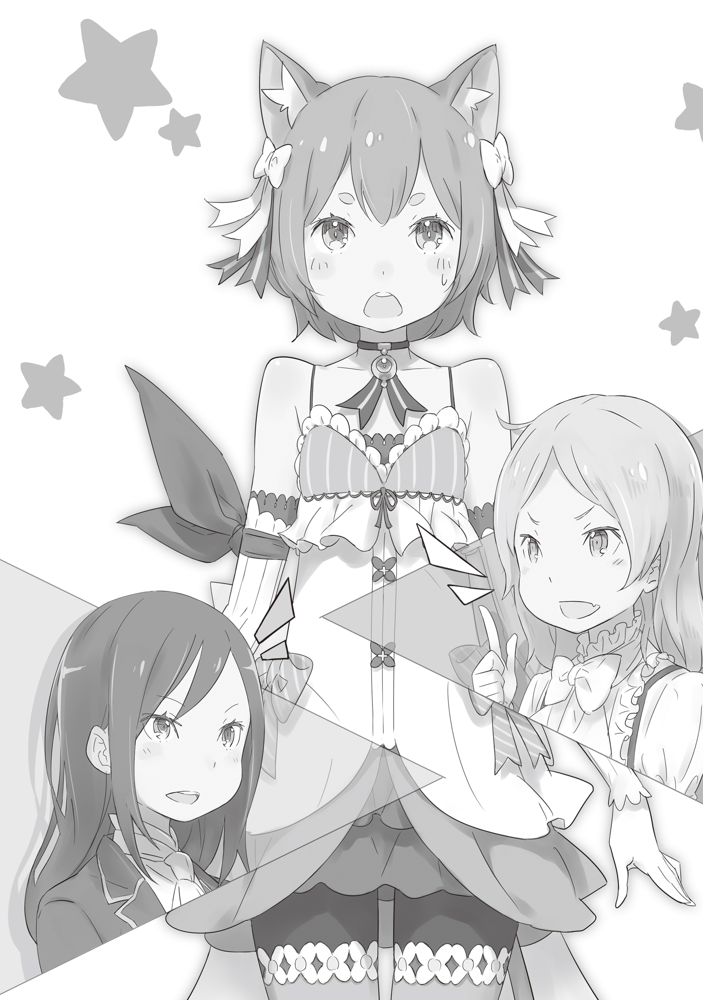

Моей шее слегка щекотно, а сквозняк, там внизу, заставляет меня чувствовать себя неловко. И хотя ощущение ветра на моих голых плечах довольно приятно, но всё же я никак не могу привыкнуть к тому, насколько другим кажется мир просто от смены одежды. Я знаю, что мне не следует быть таким, но вот он я. Если я не буду помнить об этом, то, скорее всего, снова начну вести себя так же, как раньше. Мне нужно быть осторожным.

— О, а вот и ты. Как раз вовремя.

Идя привычной дорогой в непривычной одежде, он услышал голос, доносившийся сзади. Обернувшись, он увидел добродушного на вид мужчину с бородой, спокойно направлявшегося к нему. Выглядел он так, будто ему было почти под сорок, но каждый его жест добавлял ему возраста.

Другими словами, он выглядел старше своих лет.

— Герцог Меккарт? — спросил Феликс — Что с вами? Вы выглядите таким измождённым.

— Не думаю, что выгляжу так уж плохо. Хотя, если честно, спина сегодня болит сильнее обычного… Кхм-м, впрочем, это не то, о чем я хотел поговорить. Не видел ли ты Круш?

Мужчина — Меккарт — в ответ на его весьма дерзкое замечание, лишь невозмутимо улыбнулся.

Он добродушный человек. Говоря по правде, он совсем не подходит для мира политики, полного интриг и обмана.

Но даже если бы он и был таким, он все равно оставался нынешним главой герцогской семьи, которая была одной из самых влиятельных в королевстве. Из-за этого людям вокруг него было нелегко. Держа такое мнение о Меккарте, человек, которому задали вопрос, поднес палец к губам и…

— Хм-м, Леди Круш отправилась в долгую конную прогулку этим утром. Она сказала, что вернётся к обеду, так что думаю, что вскоре она будет здесь.

— Что!? Долгая прогулка!? Почему!? Я же заранее сказал ей, что Его Высочество, Принц Фурье, приедет с визитом, и что она должна его встретить!

Лицо Меккарта побледнело, и было очевидно, что он растерян. Он криво улыбнулся, указал на магический кристалл времени, расположенный в холле особняка, и…

— Что касается этого, я… понимаете, у меня есть такие обстоятельства, из-за которых я просто не могу ничего сказать.

Меккарт посмотрел на Феликса, который в середине фразы перешёл на женственный тон, и с обеспокоенным видом нахмурил брови.

— Прости, что тебе приходится столько терпеть. Если речь идёт о Круш, то она, наверное, снова тебя вынудила, так ведь?

— Нет, всё совсем не так.

Он мягко улыбнулся и естественным движением перекинул свои каштановые волосы через плечо.

Меккарт тяжело вздохнул, глядя на его жест. Казалось, он одновременно был впечатлен и разочарован.

— Похоже, ты действительно начинаешь привыкать к этому облику, Феликс.

Он назвал имя мальчика, который был застенчив, как юная девушка.

Он коротко остриг свои длинные волосы и сменил строгую мужскую одежду на модные женские наряды. Впервые он надел юбку и обтягивающие чулки. Его длинный, тонкий хвост слегка покачивался из-под юбки, специально сшитой для полулюдей или зверолюдей. Затем он уложил волосы так, чтобы кошачьи уши, характерные для полулюдей, выделялись, и добавил кокетливую улыбку, завершив свой новый образ.

— Ой, точно, я же чуть не забыл украсить волосы своей любимой белой ленточкой!

Таким образом, Феликс Аргайл взял на себя роль парня-женщины, как его и просили.

— …

Он был ошеломлен и приятно удивлен, обнаружив, что его перевоплощение выглядит удивительно естественно. Теперь он мог выполнить обещание, данное своему хозяину, наилучшим образом. Для Феликса было величайшей радостью быть полезным ей.

Таким образом, он искренне желал быть полезным даже в подобной ситуации, однако…

— Что всё это значит!? Я уже здесь, а Круш нигде не видно!

— Ха-ха-ха! — Меккарт нервно рассмеялся — Моя дочь в том возрасте, когда ей может быть неловко. Ваше Высочество ведь прибыло встретиться с ней лично. Наверное, поэтому она не появляется!

Похоже, что вмешаться в словесную перепалку у ворот особняка между этими двумя в ближайшее время не удастся. Один из них — Меккарт, хозяин поместья, чьё лицо, ещё более побледневшее, выглядело отчаянным. А напротив стоял довольно симпатичный мальчик с длинными светлыми волосами, примерно того же возраста, что и Феликс, то есть около одиннадцати или двенадцати лет. Его алые глаза сверкали, словно драгоценные камни, а говорил он с каким-то беззаботным тоном. По его меховой шубе, прислуге, следовавшей за ним из роскошной драконьей кареты, из которой он вышел, и по тому, как герцог склонял перед ним голову, было очевидно, что он принадлежит к знатному роду.

Или, скорее, его происхождение было очевидным.

— Так это и есть его высочество Фурье Лугуника.

Он был королевских кровей и носил титул Четвертого Принца Королевства Лугуника. Он был сыном нынешнего короля. Причина, по которой человек такого высокого положения взял на себя хлопоты посетить владения герцога заключалась в том, что…

— Я задавалась вопросом, откуда идет весь этот шум, а оказалось, что это Вы, Ваше Высочество. Я не знала, что вы уже прибыли. Прошу прощения за свою опрометчивость — сказала девушка с подвязанными зелёными волосами, развевающимися на ветру, искусно управляя земным драконом. Она была настоящей красавицей.

Она была красивой девушкой, но слова вроде «симпатичная» или «милая» едва ли подходили ей. Её стойка напоминала остроту меча. У неё было благородное, сильное лицо и пронзительный взгляд. Она обладала такой властной аурой, что трудно было поверить, что это всего лишь юная девушка, а её манера держаться могла бы заставить любого затаить дыхание. Не было никаких сомнений, что она была хозяйкой Феликса и той девушкой, которую все здесь ждали.

— Ох, Круш! Ты в порядке? Только тебе могло сойти с рук то, что ты заставила меня вот так ждать!

— Примите мои извинения. Мне сообщили, что Ваше Высочество прибудет во второй половине дня. Я не ожидала вашего приезда до обеда.

—Да, я подгонял земляного дракона, ведь очень хотел встретиться с тобой.

Фурье был вне себя от радости от появления девушки — Круш Карстен. Он ответил ей хвастливо, но его посыл совершенно до неё не дошёл. В результате всё выглядело так, будто он просто горделиво выпятил грудь, сказав что-то, достойное восхищения. Наблюдая за этим, Феликс был уверен, что он такой, как о нем и говорили.

Круш и Фурье обменивались любезными замечаниями, но Меккарт, который был герцогом, а также отцом, не мог спокойно наблюдать за этим. Он заговорил, хотя его лицо все ещё было бледным.

— Эй, Круш. Как долго ты планируешь играть с земным драконом? Отведи его в стойло и возвращайся сразу после того, как переоденешься. Не забудь принять душ, хорошо?

— Да, разумеется. Феликс, подойди. — Круш, получившая указание от отца, позвала Феликса, стоявшего среди слуг.

Он отозвался на её зов, словно собака, и восклицанием «Окей!» быстро подошёл к ней.

— Отведи дракона в стойло. В следующий раз можешь составить мне компанию в моей поездке. В ветреные дни это особенно приятно.

— Я бы с удовольствием сделал это после тренировки. Оу, и вам, возможно, придётся держать меня за талию и руки, пока я буду учиться, так что…

— Это не будет проблемой. Если это то, чего ты хочешь, то можешь выбрать дату и время, сверившись со своим расписанием.

Получив это обещание, Феликс с улыбкой взялся за поводья. Отдав поклон Фурье, Круш уже было собиралась направиться в особняк, как вдруг…

— Не заставляй Его Высочество ждать слишком долго и переоденься в подготовленное для тебя платье. Я не потерплю никаких возражений, Круш.

— …Отец, я уже много раз говорила тебе. Я больше не буду носить платья, только официальную мужскую одежду. Я не хочу быть госпожой, которая нарушает своё обещание, данное своему вассалу.

— Круш…

Когда Круш с почтением поправила Меккарта, развеивая его заблуждение, Феликс побледнел, поняв, что это произошло из-за него.

Фурье прервал их:

— Прекратите. Что это за странные речи вы ведёте? Объясните так, чтобы даже я мог понять — потребовал он, вмешиваясь в разговор отца и дочери без малейшей попытки прочесть между строк.

Круш вкратце рассказала Фурье, что дала себе клятву исполнить определённое обещание: перестать вести себя как женщина и стать величайшей воительницей и достойной дворянкой. Пока Феликс с гордостью слушал её слова, Меккарт приложил руку ко лбу, горько оплакивая будущее своей дочери.

Лицо Фурье покраснело от возмущения, и он воскликнул:

— Нет, нет, ты не можешь этого сделать! Что за чушь ты говоришь? Перестать быть женщиной? Прекрати говорить глупости! Я этого не прощу! Ведь ты же девушка!

— Мне кажется, что Ваше Высочество выходит за рамки, пытаясь диктовать мне, какой я должна быть — хладнокровно ответила Круш эмоциональному Фурье.

— Ааааргх…! — простонал Фурье, не находя слов. Его взгляд метался, пока не остановился на мече у пояса Круш — Хорошо, тогда бери свой меч! Покажи мне своим клинком, насколько велики твои амбиции!

— …Дуэль? Между мной и вашим высочеством?

— Да! Я учусь фехтованию в королевском замке. Все говорят, что у меня есть талант. Я лично покажу тебе разницу в силе между мужчиной и женщиной! — воскликнул Фурье с сияющим лицом, вскидывая кулак к небу.

Фурье быстро обернулся к Меккарту и, заметив побледневшего герцога, улыбнулся.

— Сад вполне подойдет для нашего поединка! Принесите два деревянных меча! Я вновь сделаю вашу дочь женщиной! — смело провозгласил он.

Феликс с помощью магии исцелял Фурье, который распластался в саду, как тряпичная кукла. Он стал свидетелем дуэли, которая больше походила на избиение, и лишь из приличия называлось дуэлью. Он не был уверен, кто же здесь виноват.

Был ли виноват сам Фурье, осмелившийся бросить вызов, не осознавая разницы в способностях? Или вся вина лежала на прямолинейном характере Круш, который не позволил ей сдержаться? Как бы то ни было, результатом этих факторов стало плачевное состояние четвёртого принца.

— Отец рухнул с бледным лицом. Возможно, позже он меня отчитает.

— Хм-м, вполне может быть — ответил Феликс.

Круш провожала взглядом Меккарта, которого слуги уносили прочь, вымотанного до изнеможения. На самой же девушке не было и следа усталости, что делало неуклюжие навыки Фурье ещё более жалкими.

— Э-э… Со-совсем немного не хватило, разница была толщиной с листик.

— Вот как? Тогда бумага, должно быть, была довольно плотной.

— Леди Круш, Его Высочество будет чувствовать себя ещё более жалким, если вы не проявите к нему хоть немного доброты.

Это было прямолинейное замечание, вполне в её стиле, но чересчур откровенное, поэтому Феликс решил дать ей совет.

Эта троица беседовала в уголке сада, наслаждаясь лёгким ветерком. Солдаты, сопровождавшие Фурье, и слуги поместья наблюдали за ними издалека. Наверное, они считали это зрелищем довольно милым.

— Кстати, Круш… Я и не знал, что ты так хорошо обращаться с мечом.

— Я всё ещё далека от совершенства. Однако, Ваше Высочество, обещание есть обещание. С этого момента, прошу прекратить …

— Я-я знаю. Ты можешь делать, как считаешь нужным, пока я не одержу победу в следующем поединке.

То, как скромно он попросил о реванше, было частью его обаятельного характера, и это вызвало кривую улыбку на лице Феликса.

Круш, вероятно, была того же мнения, ведь её губы расслабились и она улыбалась.

Феликс и Фурье были полностью очарованы её обаятельной, нежной улыбкой.

— Я-я должен стать сильным. Иначе я испорчу репутацию королевской семьи.

— Всё совсем не так. Кроме того, то, насколько ты хорош в фехтовании, никак не скажется на репутации Вашего Высочества и королевской семьи. Священный кровный пакт — пока Дракон защищает королевство, уважение народа останется непоколебимым.

— М-м… Не думаю, что это так.

Фурье сразу попытался скрыть свои эмоции, но Круш незамедлительно ответила, опровергнув его слова.

Фурье выглядел недовольным, после её высказывания.

— Если всё решает Дракон, то зачем вообще существует королевская семья? Это не повод для меня оставаться слабым. Это не должно быть причиной для того, чтобы я был слабее тебя… женщины!

— Ваше Высочество…

Это были те самые хвастливые слова, которыми мальчишки его возраста пытались произвести впечатление на девушку, к которой они испытывали чувства. Феликс, однако, инстинктивно сопереживал его бунтарскому настрою, направленному против собственной слабости.

Феликс почувствовал, как слова Фурье находили отклик в его сердце, ведь он и сам когда-то ночами обнимал колени и плакал от собственной беспомощности.

И Феликс был не единственным, кто был глубоко впечатлен этими словами.

— Тогда зачем существует королевская семья… — Круш распахнула глаза и рот, повторяя слова Фурье, напрягая щеки.

Даже сама Круш не в полной мере осознавала, как сильно его слова отозвались в её душе. Хотя она и не понимала этого, было непреложным фактом, что они оставили след в её сердце и потрясли её душу.

— Ваше Высочество, давайте вновь скрестим мечи. Я верю, что ваши чувства в высшей степени благородны.

— Хм, вот оно как? Да, ты права! Хм, я рад, что ты меня поняла! Вот только… Будь немного мягче в следующий раз! Я не хочу чувствовать боль…

— Вы ничему не научитесь, если я буду с вами мягкой.

— Да ты совсем не знаешь, что такое доброта, да!?

— Пффф! — Феликс не смог сдержать смех и рассмеялся, услышав ответ Круш и крик Фурье.

Фурье впервые обратил внимание на Феликса, заметив его реакцию. Феликс, ощутив тяжесть своего поступка, уже собирался открыть рот, чтобы тут же принести поспешные извинения за проявленное неуважение.

Но прежде чем он успел что-либо сказать, Фурье заговорил:

— И тебе спасибо — неожиданно тепло произнёс он — Ты гораздо искуснее в исцелении, чем придворные лекари. Это было… довольно приятно. Ты заслужил мою похвалу.

Он на мгновение замолчал, словно вспоминая что-то.

— Твоё имя… да, кажется, Феррис!

С сияющей улыбкой он с уверенностью произнёс неверное имя. Однако выглядел он настолько уверенным, что Феликс даже засомневался, стоит ли его исправлять. А затем…

— Прекрасное имя. Твоё настоящее имя кажется немного странным в сочетании с этим нарядом. А вот Феррис звучит очень приятно. Если тебе нравится, я бы хотела называть тебя так… Что скажешь?

Круш нежно улыбнулась и призналась, что ей понравилось имя, которое было названо по ошибке. Феликс тихо повторил это имя про себя перед Фурье, который выглядел сбитым с толку, а затем кивнул.

— Да, тогда, пожалуйста, зовите меня Феррис. Я бы хотел, чтобы и моя госпожа, и Ваше Высочество отныне звали меня так.

— Хм-м? Ничего не понимаю, но ладно. Отлично, Феррис, жду от тебя хорошей работы!

Выражение лица Фурье говорило о том, что он совершенно ничего не понял, и он испортил свой образ громким смехом. Феликс криво улыбнулся, а Круш с нежностью и любовью произнесла:

— Феррис. Да, это имя куда лучше подходит для моей девушки.

Она сказала это не задумываясь, чем вызвала переполох, из-за которого Фурье снова взорвался от смеха, а Меккарт упал без чувств.

《Конец》
