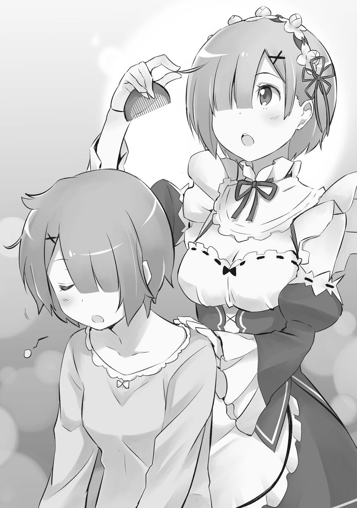
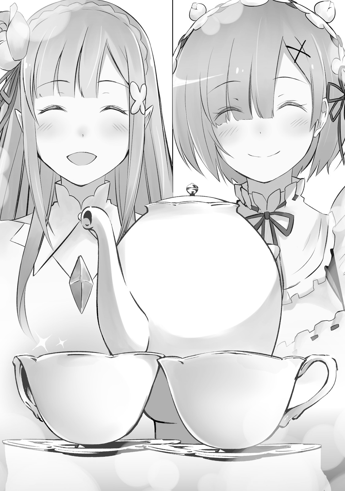

Утро Рем — управляющей и главной горничной поместья Розвааля — всегда начиналось рано.

В восточном крыле величественного особняка, состоявшего из трёх корпусов, Рем открывала глаза в тот предутренний час, когда небосвод ещё был во власти глубокой ночи.

— …

На далёком востоке только зарождалось первое дыхание утра, и в иссиня-чёрную высь робко вплетались слабые отблески зари. Словно услышав эти неслышные шаги рассвета, лежавшая на кровати девушка тихо разомкнула веки.

Миниатюрная фигурка, тонкие ручки и ножки, аккуратно подстриженные короткие волосы цвета ясного дневного неба. Округлые светло-голубые глаза оттенком вторили волосам и придавали лицу невинную детскость — её облик можно было описать лишь одним словом: прелесть.

Впрочем, сама девушка ни капли не осознавала собственной привлекательности.

— Уа-а-а…

Едва слышно зевнув, Рем поднялась с постели и коснулась босыми ножками пола. Её тонкую фигуру окутывала голубая ночная сорочка.

Просыпалась она всегда легко. Не позволяя себе поддаться сладкой истоме, Рем встала посреди комнаты и сладко потянулась. Смахнув тыльной стороной ладони выступившую в уголках глаз слезинку, она окончательно распрощалась с остатками сновидений.

— Нужно умыться и переодеться…

Проговаривать вслух предстоящие дела — давняя тайная привычка Рем перед началом работы.

Считая себя не слишком-то сообразительной, она видела в выстраивании чёткого порядка действий жизненно необходимый ритуал. Лишь благодаря этому негласному правилу ей удавалось худо-бедно справляться с обязанностями старшей горничной. По крайней мере, так казалось самой Рем.

— …

Мысленно выстраивая распорядок дня, она взяла полотенце, направилась к умывальне и ополоснула лицо. Ледяная вода мгновенно прогнала утреннюю рассеянность, вернув мыслям былую строгость. Вытерев щёки мягким полотенцем, Рем вернулась в комнату, готовясь облачиться в рабочий наряд.

Когда тонкая ткань сорочки соскользнула на пол, обнажилась нежная девичья кожа, прикрытая лишь скромным бельём.

Для своих семнадцати лет Рем была невысокого роста, однако изгибы её тела уже дышали чарующей женственностью. В особенности за последние пару месяцев её грудь заметно прибавила в объёме, что на самом деле доставляло девушке немало душевных терзаний.

— Ха-а-а…

Тихонько вздохнув от нахлынувшей лёгкой грусти, Рем повернулась к гардеробу. Внутри ровным строем висели абсолютно одинаковые строгие платья — её рабочая униформа горничной.

Не колеблясь ни мгновения, она выбрала одно из них и привычным движением продела руки в рукава.

Если задуматься, в этом платье горничной она прожила уже почти десяток лет.

Десять лет… Ровно столько времени утекло с тех пор, как была уничтожена деревня демонов, а её вместе со старшей сестрой Рам подобрал господин Розвааль. Без преувеличения, большая часть сознательной жизни Рем прошла именно так.

Все эти долгие годы она изо дня в день надевала этот наряд. У неё никогда не возникало ни жалоб, ни сомнений на этот счёт, и она была уверена, что так будет всегда, но…

— Интересно, если я изредка стану надевать другое платье… это не будет выглядеть странно?..

Оглядев себя в зеркале на дверце шкафа, Рем принялась тщательно поправлять униформу. Безупречный внешний вид — святая обязанность горничной и дань уважения господину, лицо которого она не имела права опозорить даже малейшей небрежностью. Эту простую истину ей сотни раз повторяла Фредерика, когда учила её правилам приличия, пока Рем ещё была неопытной ученицей.

Разумеется, Рем свято следовала наставлениям и никогда не относилась к своему виду спустя рукава. Однако за последние недели она стала крутиться перед зеркалом с особенным усердием. Правда, теперь во главе угла стояло не столько стремление к «безупречности», сколько желание выглядеть… «мило».

— …Пожалуй, на этом сойдёт.

Покружившись перед зеркалом ещё пару раз, Рем наконец поставила точку в этих бесконечных сборах.

Облачившись в открытое платье горничной, она закрепила в волосах привычную заколку в виде цветка. Взмахнув подолом короткой юбки, девушка бодро выскользнула в коридор и сделала глубокий вдох.

По галереям поместья разливалась бодрящая утренняя прохлада. Наполнив ею лёгкие до самого предела, Рем с лёгким сердцем зашагала вперёд. Но путь её лежал вовсе не в соседнюю комнату, где спала сестра.

— …Доброе утро.

Поздоровавшись тоненьким, едва слышным голоском, она переступила порог другой спальни.

Планировка здесь ничем не отличалась от её собственной комнаты, однако обстановка всегда неуловимо отражает характер владельца. Личных вещей здесь пока было немного, но даже в этих мелочах чувствовалось его неповторимое присутствие. И каждый раз, видя это «каждым вечером и каждым утром», Рем ощущала, как в глубине её груди разливается ласковое тепло.

Это была комната прислуги, не принадлежавшая ни Рем, ни Рам.

В данный момент в поместье Розвааля работал всего один слуга, если не считать их с сестрой.

Иными словами, это была комната того самого человека…

— …Субару-кун.

Глядя на спящего в глубине тёмной комнаты юношу, Рем тихонько позвала его по имени. Впрочем, позвала так тихо и робко, что звук её голоса едва ли мог потревожить юношу, всё ещё блуждавшего в царстве грёз.

Но ведь она поздоровалась перед тем, как войти, и даже окликнула его.

— А значит, если ты до сих пор не проснулся, то исключительно потому, что Субару-кун у нас страшный соня.

Вооружившись этим неоспоримым оправданием, Рем подошла к самому краю кровати. Опустив взор на спящего юношу — Нацуки Субару, — она почувствовала, как лицо её невольно расплывается в глупой и бесконечно нежной улыбке от нахлынувшего чувства.

Парень спал на боку, крепко сжимая в объятиях тонкое одеяло. Одет он был в чёрный спортивный костюм — диковинный наряд из чужих земель, который Рем собственноручно воссоздала по образцу его прежней одежды. То, что он использовал его как пижаму, грело душу.

Впрочем, сердце таяло не только от этого. Его беззащитное спящее лицо казалось невероятно юным и трогательным, ведь чёлка, которую он обычно зачёсывал назад, сейчас свободно спадала на лоб. Тихонько посапывающие губы, тонкие и красивые пальцы, сжимающие край покрывала… Коротковатые ноги. Капелька слюны, стекающая на подушку. До чего же мило.

— Субару-кун, ты такой милый…

« Какая же я слепая и предвзятая » , — с лёгким вздохом укорила себя Рем, но сердцу ведь не прикажешь. Да и к чему спорить с тем, что чувствуешь на самом деле?

С зардевшимися щеками Рем молча упивалась видом спящего Субару. Напрягая все чувства до предела, она была полна решимости уловить малейший вздох или движение, исходящие от него.

Продлив это нелепое до абсурда и чересчур пристальное наблюдение ещё на несколько мгновений, она прошептала:

— Н-на сегодняшнее утро довольно… Дольше Рем просто не выдержит. Нужно отступать…

Почувствовав, как заколотилось сердце, а жар прилил не только к щекам, но и к самым кончикам ушей, Рем нечеловеческим усилием воли оторвала взор от его лица. Отступив на шаг назад и полностью убрав спящего юношу из поля зрения, она наконец сумела взять себя в руки.

— Это было опасно… Ещё немного, и я бы окончательно потеряла голову.

Прижав ладонь ко лбу, Рем мысленно похвалила собственную выдержку.

Тайные визиты к спящему Субару стали её «ежеутренним» ритуалом, но ещё ни разу эта битва между искушением и самообладанием не давалась ей легко. Каждый день — сражение на грани поражения.

Впрочем, тот факт, что она уже пошла на поводу у своих желаний в тот самый миг, когда поддалась порыву прийти в его спальню, саму девушку ничуть не смущал — она об этом даже не задумывалась.

— А я сегодня молодец, хорошо держалась. Ах, Субару-кун, до чего же ты порочный человек…

Проснись сейчас сам виновник этих слов, он непременно завопил бы о вопиющей клевете.

Оставив это обвинение вместе с горячим вздохом в полутьме спальни, Рем торопливо выскользнула за дверь. Закончив с первым утренним делом, она наконец направилась к комнате Рам.

— …Доброе утро.

Когда она переступила порог спальни сестры, голос её прозвучал всё столь же тихо, едва громче комариного писка.

В затенённой комнате царил полумрак, но здесь было куда светлее, чем у Субару. Причиной тому был неумолимо наступающий рассвет — явное доказательство того, сколько времени Рем растратила в чужой спальне. Впрочем, это вовсе не грозило опозданием на работу: она предусмотрительно встала пораньше ровно на то количество минут, которое требовалось для созерцания его сна.

Да, из-за этого приходилось жертвовать сном, но для безупречной службы важна не только выносливость тела, но и душевный настрой. Так что Рем всего лишь восполняла запасы душевных сил. И источником служило не только спящее лицо Субару, но и…

— …Сестрица, ты и сегодня прекраснее всех.

Глядя на безмятежно спящую на спине Рам, Рем нежно улыбнулась.

Рам была её сестрой-близнецом. Люди вокруг то и дело твердили, будто они похожи как две капли воды, но сама Рем в это ни капли не верила.

Гордый, точёный профиль; полные живого ума и несгибаемой уверенности светло-рубиновые глаза; чарующие, пышные и в то же время неуловимо нежные розовые волосы; гармоничное, совершенное телосложение и тонкий, изящный стан… Куда ни глянь — во всём идеальная старшая сестра. А рядом с ней — лишь младшая, нелепо перенявшая её облик.

Конечно, благодаря человеку, убедившему её в том, что и у самой Рем есть свои достоинства, она изо всех сил старалась больше не терзаться чувством вины, но…

— И всё же сестрица навсегда останется моим идеалом.

Всегда уверенная в себе, всегда правая и несокрушимо сильная — такой была Рам.

Были времена, когда само существование сестры казалось непосильной ношей, но теперь это чувство затмевала безграничная гордость. Поэтому, вложив в голос всю нежность и благоговение, Рем позвала:

— Сестрица, сестрица. Уже утро. Пора вставать.

Тревожить столь сладостный сон было совестно, но, сделав сердце поистине «демоническим», Рем принялась мягко трясти сестру за плечо. Будить Рам перед началом работы — ещё одна её неизменная утренняя обязанность. И то, как Рам едва приоткрыла веки и жалобно простонала: «Ещё пять минуточек … » — тоже повторялось изо дня в день.

Будь на то воля Рем, она позволила бы сестре спать столько, сколько душе угодно, но увы.

— Нельзя, сестрица. Если мы не оденемся и не приготовимся пораньше, то какой пример подадим Субару-куну? К тому же он ещё не до конца оправился от ран после того происшествия со зверодемонами, нельзя взваливать на него слишком много работы, это будет жестоко…

— …Раз Рем больше беспокоится о Барусу, чем обо мне, то Рам ни за что не встанет.

— Сестрица, ну не говори таких милых глупостей… Хотя, если ты останешься отдыхать, мы сможем поработать с Субару-куном вдвоём… Решено. Сестрица, отдыхай сегодня сколько…

— Я передумала, встаю. Давай, Рем, одевай меня.

Без малейших колебаний взяв свои слова назад, Рам бодро села на кровати и вскинула руки вверх. Опешив от столь молниеносной перемены настроения, Рем тут же счастливо заулыбалась:

— Сестрица, ты слишком торопишься. Одеться мы успеем, но сперва нужно расчесать волосы. Сегодня они особенно растрепались. Ты поздно легла?

— В последнее время Рем не приходит спать со мной, вот я и засыпаю с трудом.

— Сестрица, но ведь мы перестали спать вместе уже много лет назад.

Предаваясь тёплым воспоминаниям, Рем достала гребень и принялась аккуратно расчёсывать шевелюру Рам. Гладкие розовые пряди струились, словно танцуя в пальцах. На ощупь эти тонкие шелковистые волосы были точь-в-точь как её собственные. И вдруг в голове мелькнула мысль: « Может, мне тоже отрастить волосы?.. »

Короткая стрижка Рем была вызвана лишь одним желанием — носить ту же причёску, что и Рам.

Одинаковые волосы, одинаковая одежда… Казалось, переняв все черты сестры в дополнение к их схожим лицам, она сможет стать чуточку ближе к идеалу. В этом крылась вся её жизненная опора.

Но теперь ей казалось, что за эту детскую упрямую привычку можно больше не держаться.

— Сестрица… если Рем отрастит волосы, это не покажется странным?..

— …Ты спрашиваешь, не покажется ли это странным мне? Или кому-то другому? От этого зависит мой ответ.

— Ну… не сочтёт ли это странным Субару-кун?..

Стоило Рем робко выдать истинную причину своего беспокойства, как Рам преувеличенно тяжело вздохнула.

— С чего вдруг такие мысли? Этот Барусу тебе что-то ляпнул?

— Нет, вовсе нет. Просто я расчёсывала твои волосы и подумала…

— …У госпожи Эмилии ведь такие длинные и красивые волосы, не так ли?

Поняв, что её неуклюжую попытку скрыть мысли раскусили в два счёта, Рем виновато улыбнулась. Заметив эту улыбку, Рам сокрушённо покачала головой:

— Само собой, если ты отрастишь волосы, ты всё равно будешь невероятно милой. Настолько милой, что мне тут же захочется разорвать Барусу на куски.

— Сестрица…

От того, как посуровели голос и вид Рам, Рем испытала одновременно и радость, и смутную тревогу. Радость от сестринской заботы — и тревогу от мысли, что они с Субару всё ещё не ладят.

— Сестрица, ты так сильно не любишь Субару-куна?

— То, что я не испытываю к нему ненависти, вовсе не означает, будто он достоин моей драгоценной сестрёнки.

От столь безапелляционного заявления глаза Рем полезли на лоб. Впрочем, изумление тут же сменилось тихой радостью.

Ведь ответ Рам означал главное — на самом деле она вовсе не питает к Субару неприязни.

— Спасибо тебе, сестрица. Рем тоже невероятно гордится тобой.

— Ещё бы. Что ж поделать, когда твоя старшая сестра столь безупречна, ею грех не гордиться.

Пусть разговор и свернул куда-то не туда, это подтверждение их взаимной любви наполнило сердце Рем безмятежным счастьем. Похоже, у Рам тоже поднялось настроение, и она принялась тихонько напевать под нос незамысловатый мотивчик. И пела она, надо признать, на редкость красиво.

— …

В такт этой чарующей мелодии Рем мерно проводила гребнем по волосам, бережно распутывая каждую прядку.

Так проходил этот драгоценный утренний ритуал — зримое свидетельство нерушимых уз, связывавших двух сестёр.

В просторном внутреннем дворе поместья Розвааля весело переговаривались Субару и Эмилия.

Наблюдая за ними из окна второго этажа, Рем мягко улыбалась.

— Субару-кун такой забавный, когда радуется…

От одного взгляда на дурачащегося юношу на душе становилось отрадно и светло.

Каждое утро в этот час во внутреннем дворе Эмилия проводила ритуал обновления контракта с младшими духами — её ежедневный священный диалог с малыми созданиями. Этот обычай соблюдался с самого первого дня её появления в поместье, а присутствие рядом Субару вошло в привычку с тех самых пор, как сюда прибыл он сам.

— …Мешать столь важному общению с духами… право же, какой несносный мальчишка, я полагаю.

Внезапный голос, раздавшийся сбоку, заставил Рем вздрогнуть.

Настолько погрузившись в наблюдение за садом, она и не заметила чужого приближения, а уж увидев, кто именно стоял рядом, удивилась ещё сильнее.

— Госпожа Беатрис.

В ответ на приветствие вставшая рядом девочка ничего не сказала, лишь надменно скрестила руки на груди.

Выглядела она очаровательно: завитые в тугие спирали светлые волосы и пышное, богато украшенное оборками платье. Черты её лица напоминали тонкую работу искусного кукольника — придраться было решительно не к чему.

Если кому в этом мире и подходило определение «прелестное дитя», то ей не было равных.

— Хотя с моей сестрицей вам, конечно, не сравниться.

— …Понятия не имею почему, но мне кажется, что меня только что на ровном месте оскорбили, на самом деле.

— Вовсе нет. В сравнении с сестрицей померкнет любая красавица. Но и у вас, госпожа Беатрис, есть свои достоинства. Не стоит так расстраиваться.

— С каждым твоим словом Бетти чувствует себя лишь всё более жалкой, я полагаю!

Искренне желая подбодрить, Рем лишь навлекла на себя гнев: топнув ножкой, Беатрис сердито надулась, заставив горничную виновато склонить голову со словами «Прошу прощения». Злить девочку в её планы не входило, но что же именно задело хранительницу библиотеки?

— Быть может, вы проголодались? До завтрака осталось совсем немного…

— «Не в духе от голода»?! Не смей выставлять Бетти такой примитивной, на самом деле! В последнее время обитатели этого дома переходят все границы, я полагаю! И во всём виноват исключительно этот бестактный хам!..

Скривившись, Беатрис бросила раздражённый взгляд во внутренний двор. Внизу Субару и Эмилия всё ещё оживлённо болтали.

— Его дурное влияние уже перекинулось на тебя и твою сестру, я полагаю. Ужасно бесит, на самом деле.

— Влияние?.. Что вы, Субару-кун ведь такой замечательный.

— И почему ты при этом так сияешь, я полагаю?.. Кажется, Бетти начинает сильно жалеть о том, что вообще заговорила с тобой, на самом деле.

Стоило Рем расплыться в улыбке при одном упоминании юноши, как Беатрис страдальчески прижала ладонь ко лбу. Однако её слова вновь пробудили в Рем былое изумление: если оставить в стороне сожаления хранительницы, сам факт того, что она завела пустую светскую беседу с горничной, был исключительной редкостью. А уж чтобы Беатрис заговорила первой — такое случалось считаные разы.

— Надо же, об этом обязательно нужно написать в сегодняшнем дневнике.

— Хм. Ты ведёшь дневник, я полагаю? Какая дотошность, на самом деле.

— Да. Недавно я решила записывать всё, что происходит за день с сестрицей и Субару-куном. Правда, пока идёт лишь шестой том, так что мне даже совестно за свою нерасторопность…

— Шестой том?.. Но ведь этот мальчишка объявился в поместье едва ли месяц назад, на самом деле…

По какой-то причине лицо Беатрис исказилось священным ужасом, но Рем лишь искренне стыдилась собственной неопытности.

Вещей, достойных упоминания, было бесчисленное множество, но ни писательского таланта, ни свободного времени катастрофически не хватало. Описать во всех красках достоинства Субару и величие Рам — задача воистину титаническая…

— Думаете, самонадеянно с моей стороны надеяться когда-нибудь описать всё сполна?

— Да какое мне до этого дело, я полагаю! Пиши что хочешь, на самом деле! …Тьфу, похоже, Бетти и впрямь зря забивает себе голову.

— Беспокоитесь о чём-то?

— Я просто не хочу снова оказаться втянутой в ту нелепую суматоху, когда все решили устроить тебе выходной, на самом деле. Вот и подумала заранее проверить, как ты себя чувствуешь, я полагаю.

Надувшись, Беатрис шумно выпустила воздух — вздох вышел на удивление старческим и тяжёлым.

От этих слов у Рем перехватило дыхание, а глаза расширились. Услышать подобное было полной неожиданностью.

Под «нелепой суматохой» девочка, вне всяких сомнений, имела в виду недавний «выходной день Рем».

Субару, обеспокоенный её самочувствием, внезапно выбил у господина Розвааля разрешение освободить её от дел, и все обитатели особняка дружно взяли на себя её работу на целый день.

По правде говоря, столь внезапное предложение сперва повергло Рем в шок, заставило сгорать от неловкости и переживать за порученные другим обязанности, но в конечном счёте этот день показал ей, насколько же тепло к ней относятся окружающие.

С тех пор она лишь с удвоенным рвением отдавалась работе, однако эхо того дня, как выяснилось, не отпускало не только её одну.

— Неужели… вы переживали за меня?

— …

— Спасибо вам огромное, госпожа Беатрис! Мне невероятно приятна ваша забота! Будьте уверены: отныне я буду трудиться не щадя самой жизни!

— Да я же прямым текстом говорю тебе прекратить это, на самом деле! Умей давать себе передышку, чтобы не падать без сил, я полагаю! Иначе снова начнётся эта возня!

Взмахнув ручками, Беатрис на корню пресекла пылкую клятву горничной. Стоило Рем понуро опустить голову, как хранительница принялась нервно накручивать на пальчик свой локон-спираль.

— Слуг в доме прибавилось, а ты устаёшь больше прежнего — чушь какая-то, я полагаю. Бетти понимает, что от того балбеса толку мало, но распределяй обязанности между ним и своей бестолковой сестрой с умом…

— Сестрица идеальна. В её работе нет ни малейшего изъяна.

— …Значит, найди в этом идеале хоть крошечную щёлочку, запихни туда этого парня и заставь его работать, на самом деле.

Хотелось возразить, что никаких щёлочек в совершенстве Рам быть не может в принципе, но Рем благоразумно проглотила эти слова. В конце концов, дело было не в размере щёлок, а в тайных мотивах Беатрис.

Хотя сам факт того, что Беатрис вообще волновали подобные вещи, прежде казался немыслимым.

— И чему ты там улыбаешься, я полагаю?

— Прошу прощения. Просто мне стало очень радостно. Ведь раньше вы никогда так не заботились о Рем.

— …Вовсе я не забочусь, на самом деле. Просто Бетти переполнена состраданием ко всему живому, я полагаю.

Глядя на надувшую щёчки и отвернувшуюся девочку, Рем лишь промолчала.

Быть может, отчасти так оно и было. Беатрис всегда была добра в глубине души и по-своему переживала за Рем, просто прежде никогда не высказывала этого вслух.

— Вы сказали, что Субару-кун повлиял на нас с сестрицей… но мне кажется, что на вас он тоже повлиял.

— Какая неприкрытая и грубая ирония, на самом деле.

— Я вовсе не пыталась язвить…

— От этого только хуже, я полагаю!

Сердито фыркнув, Беатрис развернулась к Рем спиной и взялась за дверную ручку ближайшей комнаты. Это была всего лишь одна из гостевых спален, но для Беатрис, владевшей «Пересечением Дверей», любая створка могла стать прямым входом в Запретную библиотеку.

— Госпожа Беатрис, я обязательно позову вас, когда накроют к завтраку.

В ответ на слова, брошенные вслед удаляющейся фигурке, девочка лишь молча махнула ручкой. Воздух вокруг неё подёрнулся рябью искажённого пространства, и маленькая хранительница растаяла, возвращаясь в свою отрезанную от мира обитель.

— И всё же вы тоже изменились, госпожа Беатрис.

Зная, что её уже никто не услышит, тихо прошептала Рем.

Прежде Беатрис почти не появлялась на общих завтраках. Но за последний месяц она не пропустила почти ни одного — вот и сейчас даже не стала отказываться от приглашения.

— …

Выглянув в окно, Рем увидела, как Субару и Эмилия покидают сад.

Вместе они направлялись в соседнюю деревню Алам, где собирались провести с местными жителями ставший уже привычным утренний ритуал под названием «радиогимнастика». Завтрак состоится только после того, как они вернутся в особняк.

— Надо спешить.

Проводив взглядом две удаляющиеся фигурки, Рем быстрым шагом направилась прямиком на кухню.

Все обитатели поместья собираются за одним столом… Ощущая тихое счастье от того, что эти мгновения стали их привычной повседневностью, Рем спешила по устилавшим коридоры коврам.

— Ой, сегодня чай заваривает Рем? О-о-очень давно такого не было.

Такими словами и сияющей улыбкой встретила Эмилия вошедшую в её комнату Рем.

Длинные серебряные волосы и прозрачные аметистовые глаза. Девушка обладала настолько поразительной красотой, что даже Рем, для которой высшим идеалом всегда была её сестра Рам, невольно залюбовалась ею.

Время близилось к середине часа Огня дневного цикла. Обед уже миновал, обитатели поместья с головой ушли в свои заботы, и сейчас наступило время короткого отдыха.

Принести сладкую выпечку с чаем и обеспечить Эмилии комфортный перерыв — тоже обязанность прислуги. Обычно за это дело с энтузиазмом брался Субару, но сегодня всё было иначе.

— Субару-кун и сестрица сейчас вместе отправились за покупками в деревню. Список оказался довольно длинным, поэтому к перерыву они не успели вернуться.

— Вот как? В последнее время это редкость. До этого за покупками ты чаще ходила с кем-то из них.

— Да. Сегодня Рем позволила себе небольшую вольность и попросила их сходить вдвоём. …Я просто хотела, чтобы Субару-кун и сестрица немного сблизились.

Как и обсуждалось утром, Субару и Рам нельзя было назвать врагами. Скорее, судя по их перепалкам, они вполне находили общий язык, и их отношения можно было считать хорошими.

Просто они оба были не из тех, кто привык честно выражать свои чувства. И Рем хотела это исправить.

— Поэтому Рем решила проявить строгость и стать настоящим демоном.

— Понятно. Помочь им сдружиться… Да, это замечательная идея. Я о-о-очень даже за.

Сложив руки на груди, Эмилия просияла, полностью поддерживая затею Рем. Однако затем она слегка склонила голову набок и добавила с ноткой сомнения:

— Хотя мне казалось, что Субару и Рам и так о-о-очень хорошо ладят… Помнишь, они ведь вместе с Паком как-то ходили в горы собирать травы для чая?

— Да. Благодаря этому оценка Субару-куна в глазах сестрицы значительно возросла. Но нужен ещё один небольшой толчок. И Рем решила создать для него идеальные условия.

Список покупок, который она им вручила, требовал побегать по всей деревне, так что времени у них уйдёт немало. Если за это время они смогут найти общий язык, то план Рем по достижению всеобщего счастья продвинется на шаг вперёд.

Правда, для этого плана требовалось содействие не только Рам, но и самой Эмилии…

— М-м? Что-то не так?

— Нет, ничего. В любом случае, сегодня прислуживать буду я. Рем не умеет заваривать чай так же виртуозно, как сестрица, и не способна развлекать вас весёлыми беседами, как Субару-кун, так что прошу меня простить.

Подавив внутренние переживания под маской безмятежности, Рем вежливо поклонилась и вкатила чайный столик в комнату Эмилии.

Личные покои Эмилии были на порядок просторнее комнат прислуги, где жили сёстры, и планировкой скорее напоминали рабочий кабинет Розвааля. В глубине стоял массивный стол из эбенового дерева, в центре располагался большой круглый стол с креслами для гостей, а кровать находилась в смежной спальне.

И на рабочем, и на гостевом столах сейчас были в беспорядке разложены стопки книг и документов.

— Прости, у меня тут небольшой бардак. Сейчас всё уберу.

— Прошу прощения за беспокойство.

Извинившись, Эмилия принялась собирать бумаги с гостевого столика. Рем тем временем начала готовить чай. Как только место освободилось, на стол опустилась чашка, от которой исходил ароматный пар.

— Ой? А как же Рем? Ты не будешь пить?

— Нет, Рем лишь прислуга. Составить компанию госпоже Эмилии было бы…

— Но ведь и Рам, и Субару всегда пьют чай вместе со мной…

— …В таком случае, Рем с радостью примет ваше предложение.

Несмотря на секундное колебание, Рем быстро отказалась от своих первоначальных слов и решила присоединиться к чаепитию.

Это слегка противоречило правилам поведения для прислуги, но ведь так поступали и Субару, и Рам. Рем решила, что важнее поддерживать тёплые отношения, нежели слепо следовать уставу. Хотя перед Фредерикой, которая в своё время обучала её манерам, было немного стыдно.

«Если мы когда-нибудь ещё встретимся, обязательно перед ней извинюсь.. . »

Мысленно покаявшись перед бывшей старшей горничной, покинувшей поместье по личным обстоятельствам, Рем налила чай и себе. Поддавшись на уговоры Эмилии, она села за стол.

— …

Обе девушки молча отпивали из своих чашек, наслаждаясь вкусом и ароматом.

Время текло, а беседа так и не завязывалась. Почувствовав неловкость, Рем мысленно прокляла свою нерешительность.

От природы Рем была пассивной. Она прекрасно это осознавала. В плане инициативности ей было далеко не только до Рам, но и до бьющего через край энергией Субару.

Эмилия, с другой стороны, тоже, видимо, не знала, как выстроить дистанцию с такой Рем. Это неловкое молчание было тому доказательством, и Рем злилась на себя за собственную никчёмность.

Всё-таки ей не следовало поддаваться на уговоры…

— …Знаешь, иногда вот так тихонько попить чаю — тоже замечательно.

— …

— Обычно Субару без умолку о чём-то рассказывает, а Рам даёт разные строгие советы по учёбе. Но когда я пью чай с тобой, Рем, на душе становится о-о-очень спокойно.

Слова Эмилии, произнесённые с лёгкой улыбкой, заставили Рем удивлённо моргнуть. Вглядевшись в профиль полуэльфийки, горничная не увидела в её выражении лица ни тени фальши. Значит, это были её искренние чувства.

Рем стало невыносимо стыдно за то, что она сочла тишину чем-то плохим и корила себя попусту.

— …Как продвигается ваша учёба?

— Надеюсь, что неплохо. Но поскольку я начинаю с точки, до которой остальные уже давно добрались, мне нужно стараться намного усерднее.

В поисках темы для разговора Рем взглянула на заваленный бумагами рабочий стол, и Эмилия в ответ грустно опустила уголки бровей.

От Эмилии, кандидата на трон и участницы Королевского отбора, требовалось очень многое. Не только таланты, необходимые для того, чтобы вести за собой Драконье Королевство Лугуника, но и подкрепляющие их интеллект, эрудиция и многое другое.

Сейчас Эмилия находилась на стадии обучения, и, честно говоря, до нужного уровня ей было пока далеко. А ведь Королевский отбор начнётся уже в скором времени.

— До этого момента я хочу научиться хотя бы чему-то.

— Я прекрасно понимаю ваши чувства. Когда господин Розвааль подобрал нас с сестрицей, первое время мы тоже только и делали, что учились.

Тогда, едва покинув деревню, Рем — в отличие от Рам — была совершенно невежественна во всём, что касалось внешнего мира.

В поместье ей пришлось осваивать не только работу и обязанности горничной. Если не считать базового умения читать и писать, всему остальному она научилась именно здесь. Так что те упорные старания, что сейчас прилагала Эмилия к учёбе, были Рем очень знакомы.

— Вы с Рам в начале тоже только и делали, что учились?

— Да. Особенно Рем. Я была куда менее способной, чем сестрица, поэтому мне приходилось очень тяжело.

— Значит, у вас было так же… Наверное, лёгких путей не бывает. Я немного начала паниковать, но… нужно просто шаг за шагом идти вперёд, иначе ничего не выйдет.

— Неужели даже вы, госпожа Эмилия, иногда паникуете?

То, как неуверенно зазвучал голос Эмилии, удивило Рем. Заметив её реакцию, девушка надула щёки:

— Ну конечно! Остальные кандидатки — о-о-очень выдающиеся личности. А ко мне и так предвзято относятся из-за того, что я полуэльф. Да и если бы не это, я ведь всю жизнь прожила в лесу!

Великий лес Элиор — именно там, как слышала Рем, Эмилия родилась и выросла. Больше о её прошлом Рем ничего не рассказывали.

…Если задуматься, до сих пор Рем старательно избегала тесных контактов с Эмилией.

Причиной тому был консервативный и замкнутый характер самой горничной. Для Рем существовало лишь то, что имело значение: её незаменимая сестра и маленький мирок, который их окружал.

Хорошо это или плохо, но Эмилия просто не вызывала у неё интереса. Поэтому Рем никогда не пыталась помогать ей или вмешиваться в её дела больше, чем того требовали приказы Розвааля.

Более того, Рем считала, что всегда позитивная и трудолюбивая Эмилия в её помощи попросту не нуждается.

Она думала, что им обеим будет лучше оставаться на своих местах — Рем сама по себе, Эмилия сама по себе, — поддерживая лишь необходимый минимум общения. Настолько поверхностными были их отношения.

Но сейчас…

— Госпожа Эмилия, вы ведь совершенно не умеете петь, верно?

— А?! Что такое, с чего ты вдруг?!

Безмятежное выражение лица Эмилии мгновенно испарилось, и от слов Рем она чуть не расплакалась. Заметив эту перемену, Рем с абсолютно невозмутимым видом продолжила:

— К тому же вы удивительно неуклюжи в мелкой работе, а из-за своей излишней доверчивости вас легко обмануть. А ещё вы очень легко поддаётесь чужому влиянию… и даже надеваете на голову ведра.

— Это Субару надел на меня ведро! И вообще, это было необходимо!

— Да, пожалуй, вы правы. …Всё это Рем узнала за последний месяц.

Эмилию, с которой она раньше вообще не стремилась сближаться, теперь Рем знала настолько хорошо. Да и рассказать она могла куда больше, чем только что перечислила.

Услышав признание Рем, обиженная Эмилия тихонько ахнула, прикрыв рот рукой, а затем озорно улыбнулась.

— Тогда я тоже тебе отомщу! Рем, на самом деле ты о-о-очень упрямая и строптивая. Ещё ты любишь книжки с картинками и поэзию, но недолюбливаешь майонез. А ещё ты души не чаешь в Субару!

— Как и ожидалось от госпожи Эмилии, возразить совершенно нечего. Особенно с последним я полностью согласна.

— Хи-хи, правда? Но с чего ты вдруг завела об этом разговор?

С гордым видом выпятив грудь, Эмилия непонимающе склонила голову набок. Рем лишь отрицательно покачала головой.

— В этом нет никакого глубокого смысла. Просто мне захотелось убедиться. Мы с вами знакомы уже полгода, но за этот последний месяц произошло гораздо больше событий, чем за всё предыдущее время.

— …М-м, это правда. С тех пор, как появился Субару, всё стало о-о-очень суматошно. Да и с тобой и Рам я стала общаться куда чаще.

— Поэтому… ну, как бы сказать…

Не найдя подходящих слов, чтобы описать свои чувства, Рем задумалась. Эмилия, глядя на неё своими аметистовыми глазами, просто молча ждала продолжения.

И это её терпение помогло Рем решиться. По правде говоря, раньше Рем было совершенно всё равно, что станет с Эмилией. Она даже считала, что неважно, сбудутся ли планы Розвааля или нет.

Но сейчас её чувства изменились.

— Рем тоже вас поддерживает, госпожа Эмилия. И пусть в грядущем Королевском отборе мои силы ничтожно малы… я сделаю всё, что в моих скромных возможностях.

— …

— Узнав госпожу Эмилию лучше, Рем пришла к этому решению. То, что я перечислила ранее — это своего рода доказательства моих слов. То, что Рем успела узнать о госпоже Эмилии.

— …Но ты же перечислила одни сплошные недостатки!

— Неужели? …Возможно, так оно и есть.

В ответ на возмущение Эмилии Рем лукаво улыбнулась, заставив ту снова надуть щёки с протяжным «Ну тебя!», после чего обе девушки рассмеялись. Улыбаясь друг другу через стол, Эмилия добавила:

— Спасибо. Мне о-о-очень приятно, что ты так сказала, Рем. И всё это тоже благодаря Субару, верно?

— …Да. Ведь Субару-кун такой замечательный.

— Точно. Субару — о-о-очень хороший мальчик.

Сойдясь во мнениях, хоть и с немного разными оттенками чувств, Рем и Эмилия одновременно приложились к чашкам.

Время чаепития в середине дня пошло совсем не так, как Рем планировала изначально, но…

— Рем, можно мне сразу же попросить тебя кое о чём?

— Да, конечно. Что угодно.

— Налей мне ещё чашечку. Почему-то именно сейчас мне захотелось выпить чая, заваренного тобой.

В ответ на эту просьбу Эмилии Рем, преисполненная искренней привязанности, принялась заваривать новую порцию чая.

Прибежав на звон колокольчика, Рем застала совершенно неожиданную компанию.

— Вы звали меня, господин Розвааль? …И Великий дух тоже здесь.

Ночная терраса на верхнем этаже особняка Розвааля. Там Рем встретили сидящий в кресле Розвааль и устроившийся на столике перед ним дух — Пак.

Маг с клоунским гримом на лице и Великий дух в облике серого котёнка. В этом поместье обитало сразу несколько существ, превосходящих человеческое понимание, но эти двое выделялись даже на их фоне, отчего Рем почувствовала робость.

— И правда, стоит позвать, и ты сразу приходишь. Но не нужно так сжиматься, всё в порядке. Хотя, конечно, стать ещё меньше, чем я, у тебя вряд ли получится.

— Прошу прощения. У меня нет навыков, способных оправдать ожидания Великого духа…

— Не сто~о~оит принимать это близко к сердцу, Рем. Великий дух просто шу~у~утит.

— Ага-ага, дух-шутник. Правда, среди других духов мои шутки почему-то не редко достигают успеха.

Обернув вокруг себя неправдоподобно длинный хвост, Пак беспечно и мягко рассмеялся. У его лап на круглом столе стоял бокал с жидкостью янтарного цвета.

Парный ему бокал находился в руке Розвааля. И то, чем эта парочка тут занималась, было…

— Решили с Великим духом немного расслабиться и выпить. Раз уж Субару-кун обнаружил тайный винный погреб моей семьи, я, как потомок, просто обя~я~язан оценить труды своих предков. Но вот незадача, у нас как раз закончились заку~у~уски.

— Вот мы и решили: «Зовите оками!». Поэтому и позвали тебя. Уж извини.

— Оками… Это ведь так в Карараги обращаются к уважаемым женщинам, заведующим заведениями?

— Рем, я ведь то~о~олько что об этом говори~и~ил. Не воспринимай слова Великого духа так серьё~ё~ёзно.

Получив повторный приказ от своего господина, Рем почтительно поклонилась. Пак недовольно забурчал, но Розвааль проигнорировал его возмущения, сохранив невозмутимое лицо.

Как бы то ни было, Рем поняла, зачем её позвали.

— Вас поняла. Сейчас же всё приготовлю. Есть ли какие-то особые пожелания?

— Не~е~ет, оставляю это на твоё усмотрение.

— А я хочу майонез! Давай майонез!

Приняв заказ — в первую очередь от Пака, — Рем быстрым шагом направилась на кухню. В голове она перебирала оставшиеся запасы продуктов. Закуска к алкоголю. И майонез. В последнее время эта приправа стала безоговорочным хитом на столе особняка.

Изобретение Субару — майонез — было встречено обитателями поместья весьма благосклонно.

Сама Рем недолюбливала его из-за резкого кисловатого вкуса, но поскольку всем — и особенно Субару — он так нравился, она стала часто использовать его как незаменимую приправу. Эмилия, Пак и даже Беатрис тоже были от него в восторге, поэтому Рем с особым рвением применяла его в новых блюдах.

Впрочем, вряд ли для простенькой закуски требовался кулинарный шедевр. Достав рыбу из холодильной камеры, работающей на магических кристаллах, Рем быстро обжарила филе и щедро сдобрила его майонезом.

— М-м-м, этот аромат пробуждает мои животные инстинкты, — промурлыкал Пак, умывая мордочку лапкой, когда Рем вернулась с подносом.

Хоть он и выглядел как котёнок, на деле Пак был духом, но его повадки и вкусы были на сто процентов кошачьими. Скрыв за вежливой улыбкой лёгкое недоумение, Рем поставила тарелку на стол.

— Если вы оставите посуду и бокалы здесь, Рем уберёт их позже. Если больше ничего не нужно, Рем пойдёт…

— Отличная рабо~о~ота. Что ж… Я бы сказа~а~ал, что на сегодня ты свободна и можешь идти отдыхать, но… не составишь ли нам компа~а~анию?

— …? Да, конечно. Но, Рем ведь не пьёт алкоголь…

— Я прекра~а~асно знаю, что ты не пьёшь. Для тебя опасен даже за~а~апах. Давай-ка отодвинем от тебя подальше.

Выслушав предложение остаться на террасе, Рем согласилась, хотя лицо её слегка напряглось. Заметив это, Розвааль тонко улыбнулся и отодвинул свой бокал на край стола, подальше от неё.

Как ни стыдно было признавать это представительнице расы демонов, но у Рем не было абсолютно никакой переносимости алкоголя.

Считалось, что все демоны — беспробудные пьяницы. Это был известный слух, и сама Рем в детстве не раз видела, как взрослые в деревне устраивали бурные попойки. И в отличие от неё, Рам была настоящим, истинным демоном — сколько бы она ни пила, на ней это никак не сказывалось.

— Вы с сестрой впадаете в кра~а~айности. Рам, у которой даже цвет лица не меняется, поражает, но ты, Рем, удивляешь соверше~е~енно в ином смысле. Хотя кулинарное вино ты ведь переносишь норма~а~ально.

— Наверное, это из-за разницы в концентрации, а ещё из-за того, что во время готовки я воспринимаю его как необходимость. На банкетах мне никак не удаётся сохранить должную бдительность…

— На той вечеринке вы с Лией обе были такие пушистые и мягенькие. Это было по-своему мило, так что если соблюдать меру, то почему бы и нет? В отличие от меня или Бетти — мы-то пьянеть не умеем, даже если сильно захотим… А, ну Бетти — это другое. У неё ситуация немного отличается от моей.

Слушая ностальгическую речь Пака, Рем совершенно не понимала, как на это реагировать.

— Ты стала корчить озадаченные мордашки, когда не знаешь, что сказать. Это хороший знак.

— …

Увидев замешательство Рем, Пак довольно кивнул. Впрочем, к тому моменту, когда Рем в удивлении прижала руку к щеке, всё внимание Великого духа уже вернулось к тарелке.

— Он не только шутит, но и отличается изменчивым хара~а~актером, его сложно понять. Главный секрет общения с ним — не обращать особого внимания и держать диста~а~анцию.

— Это довольно сложно, но я постараюсь… Так о чём вы хотели поговорить, господин Розвааль?

Оправившись от внезапной смены темы, Рем кивнула совету Розвааля и повернулась к нему. Проницательный маг сразу понял её настрой и произнёс:

— Было бы жа~а~алко заставлять тебя подолгу находиться там, где пахнет алкоголем. Поэ~э~этому перейду сразу к делу… Речь о теле Субару-куна.

— О Субару-куне? Я внимательно слушаю.

— Речь о его теле. Состояние его Врат, которые он так безжалостно эксплуатировал в лесу, оставля~я~яет желать лучшего.

Тон Розвааля не был излишне мрачным, но в его голосе зазвучали серьёзные нотки.

Во время недавнего инцидента с появлением зверодемонов в лесу неподалёку от поместья Субару истощил себя как физически, так и морально. И последствия оказались весьма серьёзными. В особенности сильно пострадали его Врата — орган, необходимый для использования магии. Розвааль наблюдал за их состоянием, и результаты не обнадёживали.

— Ни я, ни Рам, ни, разуме~е~ется, госпожа Эмилия, Великий дух или даже Беатрис не обладаем высокой предрасположенностью к магии исцеле~е~ения. Единственная, у кого она есть — это ты, но твои навыки направлены на внешние раны. Внутренние недуги не по твоей ча~а~асти.

— Просто этот болван умеет использовать силу только самым грубым образом, это настоящая проблема, — вставил Пак с таким видом, будто его это не касалось, но возразить ему было нечего.

Как бы то ни было, во вступлении Розвааля крылся чёткий смысл. Раз среди своих не нашлось никого, кто мог бы его вылечить…

— Вы собираетесь отправить Субару-куна к специалисту по внутренним недугам?

— В недавнем инциденте его заслуга в том, что деревня и поместье не пострадали, весьма велика~а~а. А значит, мой долг — вознаградить его в полной ме~е~ере. И потому мы с Великим духом тут кое-что замышля~я~яли.

Раскинув руки, Розвааль театрально усмехнулся, но искренность его слов заставила Рем выдохнуть с облегчением.

Раз Розвааль заговорил в таком ключе, значит, решение проблемы уже найдено. За десять лет службы Рем успела хорошо изучить своего господина.

Вопрос лишь в том, что это за решение и при чём тут Пак.

— У него есть заслуги, к тому же подвернулся удо~о~обный случай. Поэтому я решил предоставить ему лучшего целителя в короле~е~девстве. А Великого духа попросил подготовить для этого подходящий пода~а~арок.

— Да не нужно мне твоё разрешение. Если отбросить чувства, права на ту землю всё равно принадлежат тебе, Розвааль. А раз с «сородичами» Лии всё в порядке, то ни я, ни она возмущаться не станем.

— И всё же я не хочу, чтобы ты пришёл в ярость и снова увеличился в разме~е~ерах.

— Я же сказал, что почти никогда так не делаю! Вечно ты всё припоминаешь…

Эти двое весело рассмеялись, но Рем прекрасно понимала всю пугающую суть их разговора.

Она слышала о том, что когда Розвааль отправился в лес, чтобы забрать Эмилию для участия в Королевском отборе, Пак выступил против. В результате их столкновения изменился ландшафт и карты тех мест пришлось перерисовывать.

Однако Рем быстро отбросила эти размышления как незначительные и сосредоточилась на своей роли. Ведь именно для этого Розвааль и позвал её сюда.

— У тебя и без слов на лице написано огромное рве~е~ение, но я отдам чёткий приказ. Рем, я поруча~а~аю тебе слежку за Субару-куном… точнее, присматривать за ним, чтобы он не натворил глу~у~упостей.

— Означает ли это, что вы, господин Розвааль, даёте Рем на это официальное разрешение? Праведный предлог, так сказать?

— Как же лихо ты всё перекрутила в свою по~о~ользу. Впрочем, мне это даже нра~а~авится.

— Значит, теперь Рем, которая каждый день старалась не наступать на тень Субару-куна и по возможности не дышать воздухом, который он выдыхает, должна следовать за ним день и ночь по вашему прямому приказу?

— Так вот как ты себя ограничивала? А я и не знал… — удивлённо округлил глаза Пак.

Но если бы он только знал, что это лишь верхушка айсберга! Боясь сорваться, Рем установила для себя множество других ограничений, куда более строгих.

— Но сейчас ещё не время раскрывать все тайны…

— М-м?

— В любом случае, приказ принят! Отныне Рем будет всюду следовать за Субару-куном по указу господина Розвааля. Исключительно по долгу службы и против своей воли.

Проигнорировав недоумевающий взгляд Пака, Рем выпрямилась и отдала честь Розваалю. Затем она плавным шагом вернулась ко входу на террасу и исполнила безупречный реверанс.

— На этом позвольте откланяться. Господин Розвааль, Великий дух, добрых вам снов…

Вложив в своё прощание чуть больше поэтичности, чем обычно, Рем развернулась и стремительно покинула террасу.

Проводив её взглядом, Розвааль и Пак переглянулись. Кончиком длинного хвоста дух указал на бокал Розвааля и произнёс:

— Кажется, она всё-таки стояла с подветренной стороны.

— …Призна~а~аться, даже я такого не планировал, знаете ли.

Пожав плечами, клоун и котёнок вновь приложились к бокалам, решив, что всё и так обошлось, и продолжили свою вечернюю попойку.

— Я постучала. Прошу прощения.

Слегка коснувшись двери, словно погладив её, Рем неслышной тенью скользнула в спальню.

В погружённой во мрак комнате таинственно мерцали лишь две бледно-голубые точки. Проще говоря, это светились глаза Рем, разум которой слегка затуманился от запаха алкоголя.

— Я честно постучала.

Ещё раз повторив это вслух для собственной перестраховки, Рем бесшумно направилась вглубь комнаты. Это было место, куда она наведывалась «каждым вечером и каждым утром». Она могла бы дойти до цели даже с закрытыми глазами.

Но с закрытыми глазами не удалось бы выполнить главную задачу, поэтому Рем, наоборот, распахнула их как можно шире.

— Субару-кун, какой же ты милый…

В её широком поле зрения появилось спящее лицо черноволосого юноши, лежащего на кровати. Лицо Рем тут же расслабилось, и на её губах заиграла даже не улыбка, а скорее блаженная, слегка нелепая ухмылка.

Любоваться спящим Субару вот так, глубокой ночью, перед тем как лечь в свою постель — её ежедневный ритуал.

«В утреннем Субару-куне есть своё очарование, а в ночном — своё», — рассуждала Рем, ставшая весьма привередливой во всём, что касалось этого юноши.

И если обычно её сердце металось между страстным желанием и чувством вины, то сегодня на душе было на удивление легко. А всё потому, что этой ночью ею двигала не личная прихоть, а прямой приказ господина Розвааля.

— Мне приказали присматривать за ним на расстоянии вытянутой руки. Так что ничего не поделаешь.

Слегка вольно трактуя приказ господина, Рем приблизилась к кровати и опустилась на колени. Стоило ей поравняться взглядом со спящим Субару, как расстояние между их лицами мгновенно сократилось.

Они оказались так близко, что могли почувствовать дыхание друг друга.

— …Субару-кун, разве можно быть таким беззащитным перед Рем?

На этот полушёпот ответа от Субару, разумеется, не последовало.

Не подозревая о проникновении незваной гостьи, Субару продолжал спать, и спал он на удивление спокойно. В противовес его шумному поведению днём, сейчас даже его дыхание было тихим. А спящее лицо в моменты, когда его колючие и вечно нахмуренные глаза санпаку были закрыты, казалось Рем соответствующим его возрасту, а то и вовсе детским.

— …

Залюбовавшись его лицом сильнее обычного, Рем залилась краской стыда от собственной непристойности.

Она всегда считала, что держит себя в ежовых рукавицах, но какой же легкомысленной демонессой она оказалась на самом деле!

Раньше Рем никак не могла до конца понять свою старшую сестру Рам, которая была настолько очарована господином Розваалем, что без колебаний посвятила бы ему и тело, и душу.

Причина крылась в разнице между уважением, которое Рем питала к Розваалю, и глубокой привязанностью Рам к нему. Рем не осознавала этой разницы, и это порождало в ней комплекс неполноценности.

Но теперь, совершенно внезапно, появился Нацуки Субару. Его присутствие в её жизни стало настолько огромным, что она наконец поняла чувства сестры к Розваалю.

И осознала тот факт, что эту пылающую в груди страсть действительно невозможно обуздать.

— …

Оставаясь на коленях, Рем оперлась верхней частью тела на край кровати. Не отрывая взгляда от лица и фигуры спящего прямо перед ней Субару, она прошептала:

— Хоть он и парень, а пальцы у него тонкие и красивые. Спящее лицо такое безмятежное, словно у младенца. А если лечь спать, не высушив волосы как следует, на утро они будут торчать во все стороны.

Загибая пальцы, она перечисляла все те мелочи, что её в нём цепляли. И ни одна из них не казалась ей недостатком. В этом-то и крылась вся ужасающая сила лихорадки под названием «любовь», поразившей Рем.

— Его губы…

Её взгляд сфокусировался на самой беззащитной точке этого и без того расслабленного лица.

Слегка приоткрытые для дыхания губы находились так близко — достаточно было лишь чуть-чуть податься вперёд, чтобы коснуться их. Она уже чувствовала его дыхание на своей коже. В любой другой день она бы сочла это грубым нарушением собственных правил.

— Ах…

Однако стоило ей вспомнить об этих ограничениях, как мир Рем стремительно вернулся в привычное русло.

Пусть запах алкоголя и вскружил ей голову, его было ничтожно мало — она лишь вдохнула его. И когда дурман рассеялся, на её место вернулась всё та же строго контролирующая себя девушка, способная удержаться от прикосновений к возлюбленному.

— …Какая же Рем дурочка.

Когда хмельной туман окончательно развеялся, на неё разом нахлынули раскаяние и жгучий стыд. Сгорая от неловкости, Рем в бессильной злобе на саму себя скрипнула зубами и поднялась на ноги.

Приказ господина Розвааля подразумевал присмотр с соблюдением должной дистанции. В этом плане ничего не изменилось. А раздувать из этого великий предлог для своих желаний — верх наглости и непочтительности.

— И во всём виноват Субару-кун, ведь это он так искушает Рем.

С улыбкой бросив это обвинение продолжающему мирно спать и ни о чём не подозревающему дворецкому, Рем решила, что пора уходить. А за свои сегодняшние помыслы она мысленно извинится перед ним завтра.

Приняв это решение, Рем напоследок, чисто из озорства, осторожно коснулась бледным пальчиком губ Субару…

— Ах.

В то же мгновение, когда её палец коснулся его губ, Субару, словно инстинктивно ища что-то во сне, втянул его в рот. Ощутив горячую влагу и шершавое касание языка, облизавшего её палец, Рем почувствовала, как её мысли взорвались белым шумом, повергнув разум в абсолютный хаос.

Это посасывание длилось недолго, и вскоре палец Рем оказался на свободе, но…

— …

Ошеломлённо уставившись на указательный палец правой руки, Рем застыла как вкопанная. Даже в темноте было отчётливо видно, как палец влажно поблёскивал от слюны, излучая порочный, манящий блеск.

— …Думаю, на такое можно закрыть глаза.

Вариант «вытереть палец платком или фартуком» мгновенно испарился из её головы. Для Рем сейчас существовало лишь два пути: поддаться порыву или сдержаться.

Хотя Рем и установила для себя кучу строгих правил касательно Субару, подобная ситуация была абсолютно непредвиденной, и никаких контрмер на этот счёт у неё не было. Попытаться мгновенно осмыслить эту новую проблему и прийти к логичному выводу оказалось задачей не из лёгких.

Ведь это, несомненно, была уникальная возможность. Чудесное мгновение, которое больше никогда не повторится, если упустить его сейчас.

— Но…

Внутри девушки столкнулись светлая Рем и тёмная Рем, и в её душе разразилась настоящая буря.

Должна ли выжившая из гордой расы демонов поддаться столь внезапно свалившейся на неё удаче? С другой стороны, кроме самой Рем, здесь никого в сознании нет, никто её не увидит. А что бы подумала Рам, узнай она об этом? Смогла бы Рем с гордостью посмотреть в глаза своей идеальной сестре после такого поступка? Если честно, Рем больше всего злилась на себя за то, что память о самом моменте, когда её палец оказался у него во рту, просто выветрилась из головы от шока.

Две противоборствующие стороны высекали искры в её разуме, и дыхание Рем стало тяжёлым и рваным. На лбу выступила испарина, всё её тело напряглось как струна. Она терзалась, боролась с собой и, наконец…

— Я не… могу…

Выпустив на лбу белый рог, Рем после мучительной борьбы всё же прижала измазанный слюной палец к фартуку и вытерла его. В то же мгновение грудь обожгло чувство невыносимой пустоты, но она проигнорировала его. «Так будет лучше», — твердила она себе.

— Верно ведь, Субару-ку…

Преодолев это испытание, Рем попыталась адресовать спящему Субару слабую улыбку. Но фраза оборвалась, и девушка судорожно вдохнула от неожиданности.

Рем, тяжело дыша, опиралась обеими руками на кровать. И тут её верхнюю часть тела обхватили чьи-то руки. Девушка напряглась, но мужская сила бесцеремонно повалила её прямо на постель.

— Ах…

От такой внезапности голова снова пошла кругом.

Жар ударил в лицо, и густо покрасневшая Рем наконец осознала своё положение. Её повалили на спину прямо на кровать и крепко прижали к себе. От столь грубого движения униформа помялась, а юбка, кажется, неприлично задралась. …Она оказалась в невероятно бесстыдном виде.

— Ах!

Стоило Рем это понять, как на удивление крепкие руки прижали её к себе ещё плотнее. Оказавшись в его объятиях, она почувствовала, как сердце забилось так сильно, что готово было выскочить из груди.

«А что делать теперь?» — снова разгорелась битва между светлой и тёмной Рем. На этот раз инициатива исходила не от неё, а от самого партнёра…

— Мня…

Ворвавшись в её растерянный разум, этот безобидный сонный лепет заставил Рем мгновенно обмякнуть.

Осторожно повернув голову, она поняла, что Субару всё ещё спал крепким сном, даже не подозревая, что сейчас тискает живую подушку-обнимашку в человеческий рост.

— И правда. Субару-кун ведь совсем не такой.

В её шёпоте смешались облегчение и толика разочарования. Тот факт, что это было неосознанное действие с его стороны, вызвал в ней противоречивые чувства. Поэтому в качестве компенсации за моральный ущерб она решила в полной мере насладиться его теплом и запахом.

А затем…

— Ничего не поделаешь. Рем отчаянно сопротивлялась, но Субару-кун никак не просыпается, поэтому я не могу сдвинуться с места. Так что мне придётся продолжать своё сопротивление до тех пор, пока Субару-кун не откроет глаза.

Произнеся вслух это насквозь фальшивое оправдание, Рем уткнулась носом и лбом в грудь Субару, решив и дальше наслаждаться уютным теплом.

…У неё ведь есть официальный предлог. Иногда можно позволить себе и такой денёк.

Убедив себя таким образом, Рем постепенно погрузилась в сладкую дрёму.

А на следующее утро Рам, пришедшая будить Субару, застукает их в обнимку сладко проспавшими всё на свете, что приведёт к немедленной и безжалостной экзекуции Субару безо всяких разбирательств…

…Но даже это для Рем было не более чем сценой из самого обычного, полного счастья дня.

《Конец》
