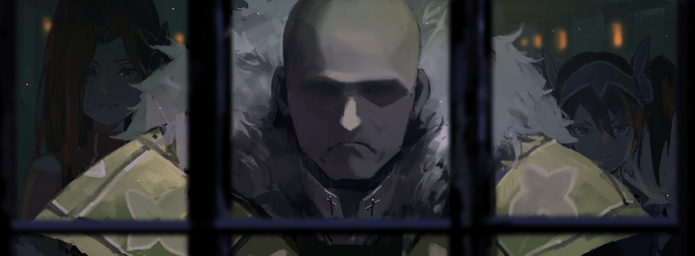
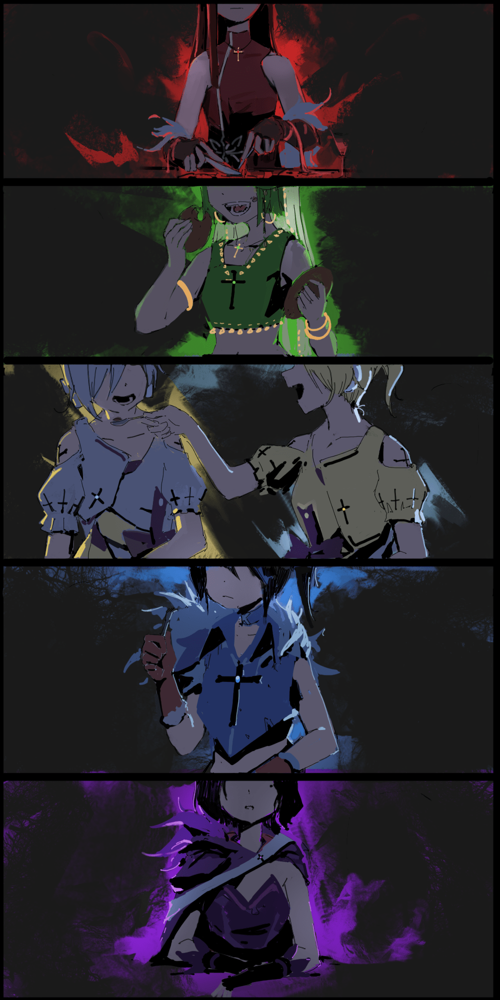

Сёстры Фезерран

Холосео Фезерран больше походил на труп, чем на живого человека.

Он не был худым или тощим. Скорее, его щеки были даже полнее, чем у обычного мужчины, а из под одежды невооружённым глазом виднелось упитанное тело.

Конечно, количество плоти на теле не обязательно связано с жизненной силой, но зачастую именно это являлось простым способом отличить богатого от бедного. Бедные чаще умирают, а богатые чаще выживают.

Это было неписаное и печальное правило, и с этой точки зрения, Холосео казался более чем живым.

Тем не менее, отсутствие глаз придавало ему вид мертвеца.

— С этого момента ты принадлежишь семье Фезерран.

Его пустые глазницы, тёмные и впалые, смотрели прямо на неё, пока он тихо говорил леденящим душу голосом.

Он не родился без глаз. В прошлом его жестоко пытали, и в процессе ему выкололи глаза. Белые шрамы, напоминавшие об этом всем, болезненно выделялись вокруг его глазниц.

Существует распространённое мнение, что глаза определяют впечатление от лица. В конце концов, человеческое лицо со скрытыми глазами почти невозможно прочитать или запомнить.

Холосео выглядел лет на тридцать, но казалось, что он мог быть и моложе. Во всех отношениях судить о его возрасте по внешнему виду было попросту невозможно. Было очевидно, что ему всё равно, как он выглядит в глазах других.

— Как тебя зовут?

— …

— Фезерран задал тебе вопрос. Отвечай. Как тебя зовут?

— …О, так вы спрашиваете меня?

Голос был тихим, словно шаги паука, бесшумно ползущего по комнате.

Девушка с тонкой улыбкой погладила свои волосы, когда поняла, что жёсткий голос спрашивал её имя. Кандалы и цепи издали пронзительный лязг, когда затряслись на тонких запястьях девушки.

Сквозь решётку пустые глаза Холосео оценивали девушку. Довольно забавно, учитывая, что цена за неё уже была назначена.

Девушка была товаром, предложенным работорговцем, а Холосео был её покупателем.

— …

Если бы вы посмотрели за него, то увидели бы две фигуры, следующие за Холосео. Это были две совершенно разные фигуры, между которыми Холосео, мужчина довольно невысокого роста, казался человеком со средним для этого королевства ростом.

Одна была высокой с рыжими волосами, а другая — довольно миниатюрной с голубыми волосами. Две девушки, одетые в платья того же цвета, что и их волосы, молча держали головы опущенными позади Холосео.

Отношения между Холосео и девушками были очевидны уже по одной их позе. Проще говоря, у них была динамика хозяина и раба — Холосео был хозяином, а две девушки позади — его инструментами.

Пока девушка в цепях продолжала смотреть на странного посетителя, мужчина снова заговорил.

— Отвечай мне. Говори с Фезерраном.

Когда он спросил во второй раз, его голос был тихим и бесстрастным. Это был трудночитаемый вопрос, заданный без раздражения или сомнения.

Девушка невольно подняла бровь, удивившись его реакции на её молчание.

Это была продажа рабов. Покупатели обычно были довольно высокомерными клиентами. В месте, где люди покупали и продавали тех, кто не имел никакой ценности, подобные ужасные человеческие эмоции взращивались довольно часто.

— …

Задумчивая девушка почувствовала, как у неё по коже побежали мурашки, когда она размышляла над этой странностью.

Дело было не только в едва заметных эмоциях Холосео. Миниатюрная девушка, стоящая позади него, наполняла её жгучими чувствами.

Девушка почувствовала сладкое покалывание внизу живота от чувств, которые начали течь по ней. Её губы расслабились во вздохе от онемевшего удовольствия, девушка коротко выдохнула, подавляя свои позывы.

Как бы то ни было, сейчас ничто не удовлетворит её, если она останется в заточении, скованная цепями.

Так что…

— Меня зовут Эльза.

— …

— Я всего лишь товар на продажу, Эльза… пожалуйста, позаботьтесь обо мне до конца моей жизни, хорошо?

С обворожительной улыбкой девушка в тюремной камере, Эльза, опустила кандалы, наклонив голову.

При этом провокационном приветствии лица двух девушек позади него побледнели.

Но Холосео, их Господин, лишь на мгновение замолчал.

— С этого момента ты член семьи Фезерран.

Его окончательный ответ был странно серьёзен.

На карте, изображающей этот мир, всегда отмечались названия четырёх основных стран.

Первое — Драконье Королевство Лугуника, второе — Священная Империя Волакия, третье — Города-государства Карараги, и четвёртое — Священное Королевство Густеко.

Эти четыре страны были известны под общим названием «Четыре Великих Государства».

У каждой из этих стран есть свои уникальные проблемы, но Священное Королевство Густеко, в частности, было наиболее известно своей суровой окружающей средой; большая часть её земель покрыта вечной мерзлотой, а снег идёт круглый год без исключений.

Большинство его жителей постоянно подвергались воздействию экстремального холода; это земля, где выживание было главным приоритетом, и почитание духов со сверхъестественными способностями было широко распространено.

В основе этой веры лежало чувство благодарности и благоговения перед «Великим Духом» Одглассом, который продолжал защищать Священное Королевство и его народ от суровых условий окружающей среды.

В таком месте, как Густеко, существовало несколько условий, которые должны были быть соблюдены, чтобы у людей был шанс на жизнь.

Если хотя бы одно из этих условий было не выполнено, можно было легко погрузиться в вечный сон, будучи похороненным в бесконечном снегу. Тем не менее, самым важным требованием из всех было то, что земля, на которой человек жил, должна считаться «Священной Землей».

Подробнее об этом требовании: «Святая Земля» — это просто земля, существующая в Густеко, которая оставалась в основном незатронутой льдом и снегом.

Все города в Густеко построены на этой «Священной Земле». Именно там и живут люди, едва справляясь с выпадающим снегом.

Проще говоря, эта «Святая Земля» была жизненно важна для народа Густеко. Она была бесценна, и она не могла существовать без контроля Церкви Священного Короля, хранителя Священного Королевства.

— Я удивлена. Неужели это всё ещё «Святая Земля»?

В результате Эльза была немного удивлена тем, что дом, в который её привели, находился на «Священной Земле», существовавшей между наглухо замёрзшими долинами.

По пути в драконьей карете окна были закрыты занавеской, поэтому она не могла видеть, куда они едут.

Одинокий особняк, который занимал целую «Священную Землю». Это было зрелище, которое противоречило её взгляду на реальность, которое можно было описать лишь как сюрреалистичное.

Внешне особняк, занимающий «Священную Землю», можно было назвать массивным. Однако «Святая Земля» обладала силой защищать от холода целый город.

Невообразимая роскошь — использовать её для защиты одного здания и его территории, пусть даже огромного особняка.

Ведь само существование «Священной Земли» бесценно; её расположение и количество строго контролируются Церковью Священного Короля, которая правит всем Священным Королевством.

Вот почему сцена перед глазами Эльзы сейчас была настолько невероятной.

Исключение из такого важного неписаного правила, сила «Священной Земли» тратилась впустую из-за безнаказанности этого человека.

Благодаря обширному пространству, предоставленному ему, вокруг особняка было достаточно зелени, чтобы назвать это садом, и природа, которую редко можно увидеть в Священном Королевстве Густеко, процветала.

Она действительно видела, что это, безусловно, «особенная» среда.

— Так вот она, сила Лорда Фезеррана?

По дороге она много раз слышала об особой природе Лорда Фезеррана. Став свидетелем этого воочию, она не могла не пробурчать себе под нос с восхищением…

В следующее мгновение холодное лезвие прижалось к бледной шее Эльзы.

— О боже.

— Не шути над Отцом…

Это был хриплый голос с интонациями пожилой женщины, который предостерёг несколько испуганную Эльзу.

Голос принадлежал девушке с голубыми волосами, которая стояла позади Эльзы. Её волосы были собраны в пучки на обоих концах головы, и она была одета в ослепительно синее платье, под цвет волос. Её незрелая красота, которая была на грани между девичьей и женской, была покрыта макияжем, который усиливал её порочное очарование.

Она была такой красивой девушкой, но её язык, высунутый, как у собаки, а также глаза, которые были настолько широко открыты, что, казалось, вот-вот выскочат из орбит, портили её милое личико и уничтожали её достоинство.

Ещё одна более важная деталь, которая портила приятное впечатление о ней, — это ужасающее оружие в её тонких руках — огромные ножницы с красновато-чёрным кровавым пятном на лезвии.

Лезвия ножниц были размещены вокруг тонкой шеи Эльзы. Это не было серьёзной угрозой, но если бы она вложила в это всю свою силу, шея Эльзы довольно легко отделилась бы от тела. Запах ржавого железа, который быстро ударил в нос Эльзы, был либо присущ самим ножницам, либо чему-то, что они впитали.

Однако в такой опасной для жизни ситуации Эльза не сделала ничего, кроме как без колебаний наклонила голову.

— Это недоразумение, если вы подумали, что я издеваюсь над нашим Отцом. То, что я вижу сейчас… то, что я вижу сейчас, это просто… что же это за чудесная вещица?

— …Сейчас тебе и предстоит это выяснить.

— Ну, по крайней мере, я не издеваюсь над ним. Это всё, что я могу сказать наверняка.

Голубоволосая девушка сделала раздражённую гримасу, когда Эльза дала несколько странный ответ, учитывая лезвия вокруг её шеи. Её лицо ясно отражало её недовольство новым членом семьи.

Этот тревожный взгляд, который ясно давал понять о её намерении сомкнуть ножницы.

— Прекрати, Доротеа. Ты пытаешься очернить имя Отца?

— …Гр-р-р.

Девушка слегка пожала плечами, услышав голос, и мгновенно лезвия огромных ножниц были отведены. Спустя несколько мгновений обжигающее дыхание смерти, что была так близка, исчезло, и Эльза обнаружила, что водит пальцами по своей шее, которая была зажата между этими смертоносными лезвиями.

— Тебе действительно нужно так обострять отношения между вами двумя так скоро после знакомства? Повзрослей уже.

Вмешавшись в разговор между Эльзой и Доротеей, раздался голос рыжеволосой женщины, которая открыла большие двери особняка, прежде чем показаться сама. Это было лицо, которое Эльза уже видела на невольничьем рынке.

Её красивые волосы, которые доходили до талии, были красными, как кровь, и на ней было малиновое платье того же цвета, что и её волосы. Ей было около 20 лет, с красивой, женственной внешностью, чётко очерченными глазами и идеальным носом.

Она стояла в саду и мгновение переводила взгляд с одной на другую, прежде чем обратить свой тяжёлый взгляд на Доротею.

— «Доротеа, разве я тебе не говорила? С сегодняшнего дня ты станешь старшей сестрой. Твоё время в качестве моей младшей сестры закончилось. Ты должна это понять».

— …Но Ситония, эта девушка…

— Что с ней не так?

— …У-у-у-у!

Доротеа топнула ногой и со слезами на глазах уставилась на рыжеволосую девушку, которую она назвала Ситонией. Слезы непроизвольно начали наворачиваться на её глазах.

Видя явную эмоциональную нестабильность Доротеи, Ситония раздражённо выдохнула. Пока две сестры обменивались взглядами, Эльза мягко повернула свои тёмные глаза к особняку.

— …

Эльза чувствовала чей-то взгляд на себе и на тех, кто был перед домом… нет, на ней было множество глаз. Она не знала точного количества или их местоположения, но она знала, что за ней наблюдают.

— Ты… Эльза, верно? Что-то не так с особняком?

— Нет, мне просто показалось, что за мной наблюдают. Я рада, что вы кажетесь очень приветливой.

— Я… ты заметила, как они смотрят на тебя?

— Да.

Эльза кивнула Ситонии, которая выглядела несколько удивлённой её ответом, но в конечном итоге Эльза не обратила на неё внимания.

Она всегда была чувствительна к вниманию людей.

Дело было не во взгляде, который она заметила первым, а в присутствии и запахах окружающих её людей. Просто будучи живыми, люди источали бесчисленные запахи, исходящие от их тел. Эльза чувствовала их немного лучше, чем другие люди. Вот и всё.

— Похоже, ты нечто большее, чем просто хороший материал для испытаний…

— Опуская то, что это значит, вы позволите мне поздороваться со всеми остальными жильцами внутри?

— Конечно, не беспокойся об этом. Но сначала позволь мне кое-что тебе сказать… все в этом доме, включая меня и Доротею, в конечном итоге станут твоими старшими сёстрами.

— …Моими сёстрами?

Услышав странное заявление Ситонии, Эльза невольно наклонила голову.

Несмотря на её сомнения, Ситония, похоже, была вполне серьёзна. Кроме того, Доротеа, все ещё со слезами на глазах и всхлипывая, кивнула и не стала отрицать слова Ситонии.

Они должны быть не просто дисциплинированными, а идеально дисциплинированными, чтобы так легко это принять.

Когда Эльза промолчала, Ситония продолжила: «Ты поняла?»

— Мы — «Сёстры Фезерран», а ты теперь младшая из всех нас.

— Но мы с ней примерно одного возраста, разве нет?

Подперев подбородок рукой, Эльза указала на Доротею позади себя.

Из-за её роста и макияжа было трудно сказать наверняка, но Доротее, казалось, было около четырнадцати или пятнадцати лет. Эльзе исполнилось пятнадцать в этом году, по крайней мере, она так считала. Она была примерно того же возраста, так что большой разницы быть не могло.

На самом деле, можно сказать, что вполне возможно, что Эльза была старшей сестрой с точки зрения возраста между ними двумя на первый взгляд.

— Твой фактический возраст не имеет к этому никакого отношения. Твой ранг сестры будет определяться количеством лет, которые ты провела в семье Фезерран.

— …Хорошо. Я поняла.

Это было сказано чётко и твердо, тоном, который трудно было оспорить, поэтому Эльза не стала больше возражать.

С Ситонией было легко общаться, и было очевидно, что она проявляла к Эльзе большое внимание. Тем не менее, она была членом этих «Сестёр Фезерран».

В каждой группе есть свой набор правил. Это было верно для работорговцев и их товаров, и это было также верно для сирот, которые жили и погибали в холодных переулках.

То же самое, безусловно, будет верно и для этих «Сестёр Фезерран».

— Прежде всего, твой новый Отец вернётся через несколько дней. А пока тебе придётся научиться достойно жить в этом доме. Ты готова?

— Как любезно с вашей стороны подготовить меня.

— Как любезно?

— Когда ты так долго живёшь в рабстве, ты полностью забываешь, как правильно общаться с людьми.

Кивнув на слова Ситонии, Эльза вспомнила свою собственную жизнь.

Вспоминая прошлое, она пыталась вспомнить все те определения, которые ей давало общество. Она была беглянкой, сиротой, рабыней и так далее. Теперь она скоро станет одной из «Сестёр Фезерран».

Именно её способность адаптироваться позволила Эльзе выжить в её необычной среде.

— …Ладно. С чем бы ты ни сталкивалась, забудь об этом, потому что ты скоро станешь нашей сестрой.

— Хм?

Эльза слегка отшатнулась от бормотания Ситонии, которое источало несколько меланхоличную решимость.

Однако на данный момент у неё не было причин или необходимости выяснять мотивы этой решимости.

Как бы ты ни меняла своё имя, раб оставался рабом.

Она не была уверена, станет ли она действительно «Сестрой Фезерран» или нет, но независимо от этого, Эльза все равно останется Эльзой.

В Священном Королевстве Густеко существование «рабов» не было тайной.

Святая Церковь Густеко, государственная религия Священного Королевства, утверждает, что жизнь равна и что нет никакой разницы в ценности между людьми.

Однако реальность такова, что существовал большой разрыв между богатыми и бедными, и было неизбежно, что некоторым людям посчастливилось родиться в богатстве, а другим людям не посчастливилось родиться без него.

Неизбежным результатом этой реальности было существование рабов, чтобы уменьшить количество ртов, которые нужно кормить бедным, и обеспечить рабочую силу.

Причина, по которой Эльза стала рабыней, заключалась в распространённом в Священном Королевстве бедственном положении.

У неё не было никаких воспоминаний о родителях, но она считала, что у неё были относительно нормальные родители для такого места, как Густеко, к лучшему это или к худшему.

Они не сильно любили своих детей, но и не презирали и ненавидели их. У них попросту не было другого выбора, кроме как продать своих детей, чтобы прокормить себя, когда жизнь становилась особенно трудной.

Эльза не собиралась называть своих родителей бессердечными.

Однако, как только её продали работорговцу, карьера Эльзы стала довольно проблематичной.

Прежде всего, её история началась с первого массового побега из рабства. Не Эльза инициировала эту драму побега, а действия старшего раба, которого она едва знала.

Многие старшие рабы долго планировали побег, и их план был приведён в действие сразу после того, как Эльзу забрал работорговец и перевёз на свою базу.

К сожалению для него, в старшего раба, который разработал план, попали стрелой в голову во время попытки побега, и он мгновенно погиб. Эльзе же, которую только что продали в добром здравии, удалось стряхнуть с себя погоню преследовавших её работорговцев.

После этого она спряталась в соседнем городе, где смешалась с детьми, у которых не было дома; жила на улице как сирота в сильный холод.

Она совершила много плохих поступков, включая убийство.

С такой дурной славой было вполне естественно, что она привлекла внимание тех, кто охотился на таких людей… и таким образом началась вторая жизнь Эльзы в качестве рабыни.

Учитывая, что первый раз едва ли продлился хоть какое-то время, это был практически её первый настоящий период жизни в качестве рабыни. Однако он снова не продлился долго… поскольку внешность Эльзы, казалось, была достойна презренной похоти.

Вскоре нашёлся покупатель, и Эльзу продали мужчине, который хотел рабыню. Там она плохо себя вела и очень быстро сбежала от своего хозяина, только чтобы снова вернуться к жизни рабыни.

В конце концов, о ней распространились дурные слухи, и Эльза оказалась без человека, желающего её купить. Шло время, её работорговцу становилось всё труднее с ней справляться, и вскоре он стал подумывать о том, чтобы как можно скорее от неё избавиться.

Именно тогда на помощь ей пришла семья Фезерран.

— …

Она задула свечу в своей руке, закончив общий рассказ о своей жизни. Она вздохнула, подняла глаза и в замешательстве наклонила голову.

— Что? Что-то случилось?

— …Я была удивлена, узнав, что на твоих плечах лежит гораздо больше, чем я ожидала.

Ситония, которая тоже сидела за столом, ответила тщательно подобранными словами. Перед ней тоже стояла свеча, красное пламя которой тепло мерцало в воздухе.

Эльзу отвели в особняк Фезерран, где она встретилась со всеми сёстрами внутри для личной беседы. Когда её спросили, как она сюда попала, она ответила вышеупомянутой историей.

В ответ на удивленный тон Ситонии, Эльза ответила лишь своими искренними впечатлениями о своей жизни до этого момента.

— Это было очень тяжело, но я также думаю, что это было и не менее весело.

— Значит, тебе было бы неприятно, если бы тебя считали несчастной.

— Дело не в том, что она была несчастна, она просто счастливица, способная извлечь максимум пользы из несчастливой ситуации.

— Она может быть достойна быть «Сестрой Фезерран». Хи-хи-хи.

По комнате разнеслось хихиканье.

В свете свеч Эльза увидела лишь две отчётливые, одинаковые улыбки в ответ на её бормотание.

Две девушки сидели бок о бок на большом стуле в конце того же стола. У них были одинаковые лица и телосложение, только цвет волос у них был разный — у одной золотистые, а у другой серебристые. Обе были одеты в красивые платья, идентичные цвету их волос.

— Интересно… если она говорит так небрежно, значит, она ещё не кукла. Ты готова представиться?

— Хи-хи-хи…. она такая забавная девочка. Это Хильда, сестра Сарии.

— А это Сария, сестра Хильды. Приятно познакомиться. Хи-хи-хи.

— Это было запутанное представление.

Эльза нахмурилась на них двоих, пока они представляли друг друга.

Светловолосая, по-видимому, была Сарией, а седовласая — её сестрой Хильдой. По правилам «Сестёр Фезерран» эти двое также будут старшими сёстрами Эльзы.

Не то, чтобы Эльзе не нравилась идея быть младшей сестрой, но судя по их внешнему виду, она могла только предположить, что они в лучшем случае одного возраста.

— Как видишь, Сария и Хильда — близнецы, которых взяли вместе. Они обе многое пережили, прежде чем попали сюда…… но их спас Отец.

— Спас? Да, ты определённо была спасена.

— Что?

— Я не знаю, что именно, Ситония, но ты многое пережила, не так ли?

Выражение лица Ситонии слегка омрачилось, когда ей задали вопрос, подхвативший конец её заявления. Когда Сария и Хильда увидели это, они радостно захлопали в ладоши.

— Ты видела это, Хильда?

— Да, я видела это, Сария.

— Ситонию полностью перехитрила её младшая сестра.

— «Она старшая сестра, но она недостаточно достойна, чтобы носить этот титул.

— Не будьте такими грубыми, вы обе.

— О, мы боимся! — в один голос заявили близнецы.

Пока близнецы продолжали над ней подшучивать, Ситония не могла не смотреть на них испепеляющим взглядом. Смеясь над этим, близнецы поднесли друг другу чашки с чаем ко рту, чтобы попоить друг друга. Похоже, они были очень близки, несмотря на то, что, казалось, им было трудно пить из чужой чашки.

— Не вмешивайся в то, что они делают вместе. Это ключ к тому, чтобы ладить с ними.

— Спасибо, что присоединилась к нам. Ты трудолюбивая, не так ли?

Должно быть, трудно быть старшей сестрой, когда у тебя так много уникальных сестёр.

Молодая и красивая Ситония приложила руку ко лбу с видом сильной душевной боли.

Была Доротеа, дикая и неукротимая, а также близнецы Сария и Хильда, которые не стеснялись поддразнивать свою сестру. Должно быть, трудно спокойно воспринимать их действия.

«Надеюсь, я не буду для неё обузой, по крайней мере, сама по себе», — подумала Эльза.

— Кстати, могу я получить ответ на свой вопрос?

— …Пожалуйста, перестаньте пытаться меня смутить.

— О, боже. Это была довольно большая ошибка. — Одновременно сказали близняшки.

Прошло совсем немного времени, и политика, о которой Ситония сообщила ей, уже была нарушена, заставив Эльзу быстро обдумать свои слова и действия.

— Тогда могу я сменить тему? Сколько всего «Сестёр Фезерран»?… То есть, сколько у меня членов семьи?

— Всего нас шесть сестёр, включая тебя… есть ещё одна, с которой ты ещё не встречалась. Сейчас она вне дома, выполняет семейные обязанности, но скоро вернётся.

— Шесть сестёр…… какая большая семья. И ваш Отец тоже часть нашей семьи, верно?

— Да, он тоже член нашей семьи.

Тихим голосом Ситония кивнула в ответ на её вопрос. Рядом с ней Сария и Хильда, которые наблюдали за разговором, быстро сделали то же самое.

«Сёстры Фезерран» — девушки, собранные по разным причинам, были приняты Холосео и стали сёстрами, и по большей части они, казалось, были довольны своей жизнью здесь.

В этой скрытой «Священной Земле» они проводили свои дни в тайне.

— Интересно, подойду ли я вам. Я действительно начинаю беспокоиться.

— …Что ты не поладишь с нами?

— О, это не так. Просто я не знаю, какой должна быть семья, потому что у меня никогда не было нормальной жизни, как… эта.

У Эльзы не было братьев и сестёр, о которых она знала, поэтому единственной семьёй, которую она могла назвать своей, были её родители. Однако у неё не было ни воспоминаний, ни чувств к ним, только семейные отношения, которые были разорваны. После того, как её продали, Эльзе было трудно даже просто выживать, поэтому у неё никогда не было возможности наслаждаться стабильной жизнью.

— У меня никогда не было стабильной жизни. Когда я думаю об этом, мне интересно, как вообще будет выглядеть для меня спокойная жизнь.

— Я…

— Ситония?

Когда Эльза обратилась к ней с вопросом, Ситония нежно положила руку ей на щеку. Когда Эльза в замешательстве посмотрела на неё, то, что она увидела в её глазах, было сложной и странной эмоцией.

Это была эмоция, которую Эльза никогда раньше не видела. Если бы ей пришлось угадывать, это было бы что-то вроде печали.

— О, дорогая, Ситония, не надо так.

— Ну-ну… ты старшая дочь, и ты даже не можешь вынести жестокость мира.

Близнецы обменялись взглядами в ответ на поведение Ситонии и рассмеялись, словно издеваясь над ней. Однако Ситония не обратила на них внимания, тупо уставившись на Эльзу и печально выпустив воздух изо рта.

— Всё в порядке, Эльза. У тебя здесь может быть настоящая жизнь и семья. Здесь для тебя есть всё, чего у тебя никогда не было.

— …Да, звучит захватывающе.

Эльза улыбнулась словам Ситонии, в которых не было ни малейшего намёка на злой умысел.

Услышав это, Ситония коротко ответила: «Хорошо».

— Извини, что спрашиваю тебя об этом и о том, но теперь, когда всё решено, мне нужно, чтобы ты лучше познакомилась с домом. Во-первых, я собираюсь поручить тебе кое-какую работу для семьи.

— Работа для семьи… звучит неплохо. Чем вы занимаетесь?

— Я же тебе говорила, что здесь живём только мы, сёстры, и Отец. Здесь нет слуг, дворецких, горничных и рабов. Так что…

Говоря это, Ситония встала и развела руками, ясно давая понять, что она имеет в виду не только эту общую комнату с камином, но и весь особняк.

— Поэтому мы, сёстры, разделяем обязанности по уходу за всем домом.

— …

— Если ты была рабыней, то наверняка научилась убираться и готовить, верно? Используй это в своих интересах. Давай будем помогать друг другу, как сестры.

Глядя на Ситонию, которая протянула к ней свою бледную руку, Эльза рассматривала обширную территорию особняка, который она не очень хорошо запомнила.

И…

— Я-я не очень-то хорошо во всём этом разбираюсь, так что, я уверена, что только доставлю вам неприятности, — сказала она, запинаясь, пытаясь отклонить приглашение Ситонии.

Территория вокруг дома, которую можно было считать территорией особняка Фезерран, была заполнена зеленью, нетипичной для Густеко.

В этой стране общеизвестно, что города и деревни расположены на «Священной Земле», но даже в этом случае большинство жилых районов были окружены бесконечным снегом. Цвета, отличные от белого, редко попадались на глаза.

Эльза задавалась вопросом, было ли это исключение из правил связано с тем, что это «Святая Земля» более высокого ранга, или с тем, что на территории находился только один дом.

— Или ни то, ни другое? Что ты думаешь?

— …

Эльза спросила это деловым тоном, пока её держали на месте, приставив к горлу огромные ножницы.

Место, где она находилась в настоящее время, было передним садом особняка Фезерран, местом, которое выделялось даже на заполненной зеленью «Священной Земле». Это было небольшое пространство с тщательно ухоженной травой, живой изгородью и разноцветными цветами.

У Эльзы не было возможности внимательно рассмотреть сад, так как её сразу же отвели в особняк, поэтому она решила уделить ему своё время, чтобы поподробнее рассмотреть его.

— Боюсь, тебе здесь не рады.

Эльза взглянула на Доротею, которая смотрела на неё сквозь лезвия ножниц.

Доротеа, которая тоже была гостьей в саду, не могла скрыть свою враждебность по отношению к Эльзе с момента их первой встречи. Эльза не сильно отличала её от других сестёр, но Доротеа обращалась с ней слишком резко.

Она понятия не имела, почему Доротеа так сильно её ненавидит, но её ненависть была истинной.

— …Зачем ты здесь?

— Ты окончательно потеряла рассудок? Это ведь ты привела меня сюда. Разве это не твой Отец приказал тебе это сделать?

— …Я не это имела в виду!

Доротеа прорычала своё раздражение сквозь зубы, прежде чем кончик ножниц в её руке неглубоко поцарапал бледное горло Эльзы. Эльза почувствовала лёгкое покалывание боли, когда Доротеа тихо зарычала.

— …Ах.

Доротеа неожиданно начала тереть глаза, прежде чем обхватить свою голову руками.

— Нет-нет-нет… я не хотела сделать тебе больно, я просто слишком сильно тянула её то вверх то вниз…

— …О, похоже, я потеряла немного крови. Ну, не то чтобы меня это сильно волновало.

— Нет-нет-нет…! Твоё тело теперь принадлежит Отцу…

Не говоря ни слова, она поднесла губы к ране на шее Эльзы и начала её облизывать.

— Ах, я не очень-то люблю такие вещи…

— М-м-м… дай мне облизать рану, она заживёт… она скоро заживёт, если я…

Безумно облизывая её шею, Доротеа пыталась загладить свою вину. Не обращая на неё внимания, Эльза позволила ей делать то, что она хотела.

Вместо этого она просто ещё раз взглянула на ухоженный сад.

Несмотря на то, что это была «Святая Земля», ничто в ней не давало растениям каких-либо особых сил. Это лишь позволяло им жить в такой среде. Раз сад не был создан естественным путём, должны были быть люди, которые ухаживали за ним.

— Доротеа, это ты ухаживаешь за этим местом?

— Да. Я… отвечаю за это место.

Щекотка от дыхания Доротеи усилил зуд от облизывания. В ответ Эльза слегка пожала плечами и нежно погладила Доротею по голове.

Прядки голубых волос скользили сквозь пальцы Эльзы, как тонкий шёлк. Как и у Ситонии и близнецов, красота Доротеи не ограничивалась её лицом. Красота была у неё в крови; от волос до кожи, ногтей и зубов.

— Ты красивая.

— …А?

— Ох.

— А!

Как только Эльза высказала своё честное мнение, Доротеа, которая застыла, стремительно отпрыгнула назад. Доротеа с изумлением посмотрела на Эльзу, которая была разочарована тем, что мягкие локоны ускользнули из её пальцев.

Это было похоже на то, как если бы она ночью столкнулась в безлюдной улочке со страшным Пустым.

— Что случилось? Ты выглядишь так, будто нашла зодацкого жука под кроватью.

— Ты издеваеш…

— Нет? Я не знаю, почему люди часто говорят мне это, когда я говорю серьёзно. Они говорят: «Не будь такой самодовольной!», или «Не смейся надо мной!», или «Ты такая грубиянка!».

Приложив руку к щеке, Эльза посетовала на то, как ей трудно общаться с людьми. Мельком она коснулась своей шеи, чтобы осмотреть результат старания губ Доротеи на небольшой ране.

— Похоже, кровотечение остановилось. Было бы странно, если бы я сказала спасибо?

— Что ты здесь делаешь…?

— Ты повторяешься. Я просто вышла, потому что хотела посмотреть на сад. У меня не было времени чтобы полюбоваться красотами сада и его цветами когда я только-только приехала.

Извинений за рану не последовало, впрочем, Эльза их и не хотела. Закончив необходимый разговор, Эльза присела на корточки перед цветущими цветами и нежно коснулась лепестков.

Она не часто имела возможность так прикасаться к цветку, хотя она всё ещё не очень осознавала, какую силу прилагает к нему.

Работорговцы и покупатели, возможно, и были богаты, но они не были настолько глупы, чтобы украшать свои дома цветами. Вряд ли они позволили бы таким вещам оказаться в пределах досягаемости рабов.

— …Цветы — редкость.

— Да, ты права. Цветы — это не то, что я часто видела.

Взяв ножницы, Доротеа встала рядом с Эльзой с немного более благосклонным отношением. То, что она не присела на корточки, было признаком осторожности, но Эльза не возражала.

Видя действия Эльзы, Доротеа хриплым голосом, похожим на голос старухи, задала вопрос.

— …Где Ситония? Я уверена, что она должна была заботиться о тебе.

— Она заботилась, но, думаю, она просто больше не могла с этим справиться. Знаешь, мы должны были разделить обязанности по уборке дома и прочему, но у меня нет к этому таланта.

— …Нет таланта?

— Я не умею убирать дом или стирать бельё. Я также не умею… готовить. Мне всё равно на вкус.

Дело не в том, что она избегала работы по дому, потому что это было хлопотно. Эльза знала, что Ситонию тоже купили, поэтому она серьёзно отнеслась к помощи своей партнёрше.

Однако, если бы усердие было единственной причиной достижения результатов, в этом мире не существовало бы работы, основанной на производительности.

Поэтому, когда места, где Эльза помогала убраться, стали грязнее, чем были до того, как она начала, возмущённая Ситония быстро оповестила её об исключении из их дуо.

— Но было бы неправильно ничего не делать, не так ли? Так что в поисках работы я искала своё призвание.

— …Так вот почему ты здесь?

— Да. Я тоже несколько жестока, так что, возможно, смогу тебе помочь.

— …Прекрати.

Услышав довольно резкий отказ, Эльза ахнула: «Хм?»

Посмотрев на Доротею, Эльза увидела, что та смотрит на неё с ненавистью. Тот факт, что Эльза вторглась на её территорию, действовал ей на нервы.

— Извини, если я тебя смутила, но ты наверняка готова позволить кому-то ещё попробовать хоть раз…

— Ни в коем случае. Это моя собственность. Это моя работа. Это то, что мне поручено делать.

— Но…

— Будь ты проклята!

Как только она собралась ответить, эмоции Доротеи снова взорвались.

Она повертела большими ножницами в руке, прицелилась в воротник Эльзы, зацепила его и отбросила её далеко-далеко назад.

Неожиданная взрывная физическая сила маленькой Доротеи заставила Эльзу покатиться по земле. Ощущение мягкой зелени и запах травы так отличались от холода грубого снега, к которому она так привыкла…

Нет, сейчас не время думать об этом. Эльза лежала спиной на траве, когда Доротеа прыгнула на неё сверху.

Она подняла кулак, держа в руке ножницы, с явным намерением вонзить их в грудь Эльзы.

— Ты…!

— …

Перед лицом ненависти и жажды убийства Доротеи тёмные глаза Эльзы сузились.

И как раз в тот момент, когда удар Доротеи должен был достичь Эльзы, её большие ножницы были легко схвачены рукой, ухватившейся за перекрестие металла.

— …Ах.

— Это не то, что достойно «ах», идиотка!

В конце концов, это было лишь вопросом времени, когда новая фигура, вмешавшись, смогла обхватить Доротею руками, и вскоре её тело было убрано с поля зрения Эльзы.

Доротея упала на землю рядом с Эльзой — нет, её просто медленно толкнули к ней.

Теперь они обе лежали рядом на траве.

— Извини. Доротея совсем потеряла самообладание! Ей нельзя доверять ухаживать за цветами вот так. Нежные лепестки будут разорваны в клочья!

— …

В поле зрения двух лежащих фигур появилось перевёрнутое лицо. Это был тот, кто бросил Доротею на землю и остановил её, прежде чем она успела что-либо сделать. Теперь Эльза могла ясно видеть, что человек, который спас её, был…

— …Ребёнок?

— Не называй меня так. Я прощу тебя в первый раз, моя новая сестра, но не во второй. Я ненавижу, когда ко мне относятся как к ребёнку.

Сказав это, она схватила лежащее тело Эльзы и резко подняла её.

Эта девочка с короткими зелёными волосами и множеством украшений в волосах смотрела на неё проницательным взглядом. Судя по её силе и тому, что она находилась здесь, рядом с особняком Фезерран, её личность была очевидна.

— Ты последняя из «Сестёр Фезерран»?

— Да! Я Орнеа Фезерран, вторая дочь «Сестёр Фезерран» и твоя старшая сестра. Не забывай об уважении ко мне!

Орнеа, которая теперь упёрла руки в бока и назвала своё имя, усмехнулась перед Эльзой. Старшая сестра Эльзы была явно намного моложе её, ей было всего около одиннадцати или двенадцати лет.

Но, конечно, это соответствовало тому, что ей говорили раньше. У «Сестёр Фезерран» родство определяется порядком, в котором они вошли в семью. Положение Эльзы как младшей сестры оставалось неизменным.

— Да, приятно познакомиться, старшая сестра Орнеа. Я Эльза… наверное, теперь я должна называть себя Эльзой Фезерран.

— Хорошо, что ты кажешься довольно честной, но сначала я должна кое-что тебе сказать.

— Что?

— Ты ещё не Фезерран, по крайней мере, пока.

Орнеа взяла руку, которую Эльза протянула в приветствии, и самодовольно кивнула. Затем она немного сильнее сжала руку Эльзы, прежде чем тихонько хихикнуть.

Пока рука Эльзы хрустела в её стальной хватке, Орнеа рассмеялась, отбросив своё прежнее поведение. Затем она повернула голову к Доротее, которая всё ещё лежала на земле.

— Доротеа! Сколько ты ещё будешь валяться? Ты перед своей младшей сестрой! Почему ты ведёшь себя не как старшая сестра, а как избалованный ребёнок!

— Потому что, Орнеа…

— Это твоя вина, что она порезалась из-за тебя! Как ты смеешь бесчестить Отца, пытаясь убить сестру, которую знаешь всего полдня!

— …Уф!

Доротеа, не в силах вынести резких слов Орнеи, расплакалась. Как только она увидела это, лицо Орнеи исказилось в панике: «О…»

— Подожди-подожди, Доротеа, только не плачь! Не плачь, ладно? Когда мои сёстры плачут, я не знаю, что делать! Так что, пожалуйста, не плачь…

— Хгх…!

— Черт! Она плачет!

Когда Доротеа начала безудержно рыдать, Орнеа запаниковала. Пока Орнеа продолжала безуспешно утешать Доротею, она нервно бродила вокруг неё.

Молодая на вид девочка в панике и плачущая девушка с хриплым голосом, как у старухи. Несмотря на то, что она находилась в такой необъяснимо неестественной ситуации, Эльза обнаружила, что медленно приседает на корточки.

Затем она нежно положила руку на щёку Доротеи, по которой текли слёзы.

— …

— Не плачь. Всё в порядке. Никто тебя не винит. Это на меня направили ножницы, так какое право обвинять тебя имеют другие?

—…

— Или ты даже не можешь выносить такие мелкие конфликты между сёстрами? В конце концов, ты должна быть моей старшей сестрой.

Услышав слова Эльзы, Доротеа широко раскрыла глаза, сильно стиснула зубы и стряхнула руку, которая касалась её щеки. Затем, с внезапным приливом энергии, она встала.

Она посмотрела на неё и сказала: «Кто сказал, что я плачу…?»

— Ты утверждаешь, что не плакала?

— Тебе не нужно ничего ей говорить.

Орнеа пыталась покровительствовать Доротее, в то время как Эльза пыталась её подбодрить. К счастью, оплошность Орнеи, похоже, не была замечена Доротеей. Она подняла упавшие ножницы, потёрла их огромные лезвия друг о друга и резко сказала: «Я возвращаюсь к… работе».

— Хорошо. Извини, что помешала тебе. Удачи тебе в работе и… я прощаю тебе то, что ты только что сделала.

— …

Доротеа повернулась спиной и ушла, не показывая своего лица, шагая по саду. Вероятно, она пошла ухаживать за цветами там, где Эльза и остальные не могли её видеть.

Эльза некоторое время наблюдала за тем, как она уходит, прежде чем тихо вздохнуть. Теперь ей предстояло разобраться с…

— Итак, как долго ты собираешься молчать?

— О, извини. Я просто подумала, что тебе больше нечего сказать.

— Ты должна была сказать не это! Боже мой, и такая идиотка, как ты, должна быть моей младшей сестрой?!

Орнеа поднесла руки ко рту и уставилась на неё широко раскрытыми глазами.

В конце концов, она была человеком, чья юная внешность мешала ей производить должное впечатление. Но, согласно её собственному рассказу, она была второй старшей дочерью после Ситонии.

— Я слышала, что ты была на поруче… то есть, я слышала, что ты выполняла свой семейный долг.

— Ну, наконец-то всё сделано, и я вернулась. Я слышала о тебе от Отца и Ситонии, поэтому с нетерпением ждала встречи с тобой, но…

— Что?

— Теперь появилась ещё одна сестра, которая выше меня…

Орнеа была разочарована разницей в росте между собой и Эльзой.

Над головой маленькой девочки Эльза перевела свой взгляд в ту сторону, откуда она пришла. Там находился вход в небольшую пещеру, которая соединяла особняк Фезерран с внешним миром.

Минуя снежное поле и пещеру, эта «Святая Земля» находилась позади. Другими словами, если она просто выйдет из пещеры, её будет ждать внешний мир.

— Нет!

— …

— Не делай глупостей, Эльза; это мой тебе совет. Если ты сделаешь что-нибудь опрометчивое, то только погубишь себя.

Орнеа почувствовала что-то во взгляде Эльзы и немедленно предостерегла её от того, что бы она ни задумала.

Эльза пожала плечами на совет от своей низкой сестры. Затем она просто сказала: «Это недоразумение», прежде чем пояснить, увидев вопросительный взгляд Орнеи.

— Я ничего не планирую делать. Я не совершаю никаких коварных действий и не планирую помогать тебе в твоей работе.

— Тогда ты здесь не для того, чтобы помогать мне с работой?… Что тогда делает Ситония, которая должна присматривать за тобой? С какой стати она оставила свою сестру одну разбираться со своими делами?

— Наверное, она убирает беспорядок, который я устроила, когда пыталась ей помочь.

— Тогда тебе должно быть стыдно!

Услышав такой невозмутимый ответ Эльзы, Орнеа покраснела от гнева. Фыркнув, она взяла Эльзу за руку и начала силой тащить её к особняку.

— Отлично. Теперь, когда я вернулась, я научу тебя, как жить, работая здесь. Ситония, возможно, и сдалась на полпути, но я то точно не сдамся!

— Понятно. С нетерпением жду этого.

— Единственное, чего я с нетерпением жду, так это того, как долго ты сможешь сохранять этот восторженный вид!

Громко рассмеявшись, Орнеа потянула Эльзу к дому. Не в силах противостоять её удивительной силе, Эльза мельком взглянула мимо сада на вход в пещеру, а затем снова на особняк.

— Я действительно с нетерпением жду этого.

Она не могла не облизать свои красные губы, бормоча это с улыбкой.

— Я по уши в дерьме! Что, черт возьми, с этой девчонкой не так? Я никогда в жизни не видела никого, кто был бы настолько неспособен позаботиться о себе! Она как зверь!

Как только они сели за обеденный стол, Орнеа воскликнула это, в отчаянии обхватив голову руками.

Вид Орнеи, на прелестном личике которой были выгравированы глубокие морщины, ясно говорил о том, в каком бедственном положении она была.

— Не беспокойся об этом, Орнеа. Продолжай пытаться, и в конце концов ты преодолеешь это испытание.

— Из всех людей, это говоришь мне именно ты?!

— А?

Эльза с любопытством наклонила голову, встретившись с испепеляющим взглядом Орнеи. Вторая дочь, которая была возмущена вялой реакцией Эльзы, была встречена кривой улыбкой старшей дочери, которая тоже сидела за столом, до сего момента пребывая в молчании.

— Я знаю, что ты чувствуешь, Орнеа. Меня тоже удивили её… многочисленные странности.

— Странности — это ещё мягко сказано! Я чувствовала, что весь мой мир перевернулся с ног на голову!

Причитания Орнеи только сильнее рассмешили Ситонию.

В этот момент близнецы, Сария и Хильда, внезапно вышли из кухни, толкая тележку, полную еды. Они толкали довольно маленькую тележку бок о бок, прижавшись друг к другу так, что это не могло быть удобно.

— Хи-хи, мы привыкли к этому гораздо больше, чем может показаться.

— Наша эффективность и координация раньше была плохой, но с практикой мы стали лучше, хи-хи.

— Звучит так, будто научиться этому было излишне сложно.

Было поразительно, что они преодолели такое испытание, даже если оно казалось неоправданно сложным.

Сария и Хильда ничего не ответили на бестактное замечание Эльзы, молча выкладывая на стол приготовленный ими вместе ужин.

— Хильда сегодня готовила основное блюдо.

— А Сария сегодня готовила закуску.

— Завтра будет очередь Орнеи и твоя, Эльза. Я с нетерпением жду этого.

— Я тоже с нетерпением жду этого. Будет интересно посмотреть, как ты и Орнеа готовите вместе.

— Нет-нет-нет! Я хочу готовить сама!

Реакция Орнеи на ожидания и провокации близнецов была полна отчаяния. Эльза, которая была причиной этого отчаяния, почувствовала себя несколько обиженной, но ей пришлось признать, что она не очень уверена в своих кулинарных навыках.

По крайней мере, наверное, лучше держаться подальше от Орнеи и мыть посуду в уголку кухни.

— Я вернулась… Ситония.

— А, добро пожаловать обратно, Доротеа. Давай сначала пойдём и отмоем грязь с твоих рук и ног.

Пока близнецы провоцировали Орнею, Доротеа вернулась с работы в саду. Ситония быстро отвела её, чтобы отмыться. Она работала в своём синем платье, поэтому грязь на Доротее была довольно заметна.

— Могу ли я предположить, что ваши платья — часть хобби Отца?

— Не совсем. Это не хобби, а традиция Фезерран. Все «Сёстры Фезерран» носят платья. Это негласное правило.

— Хм, понятно.

Отвечая, Эльза посмотрела на чёрное платье, которое ей велели надеть — платье без рукавов с минимальным количеством аксессуаров.

Все до единой её сестры были одеты в платья, подходящие к цвету их волос. Возможно, это было ещё одно правило, что они должны были сочетать цвет волос с цветом своих платьев?

Может быть, Холосео Фезерран был всего лишь филантропом; скупал «проблемных» рабов, таких как Эльза, и давал им одежду, достойную жизнь и место для проживания в этом доме, спрятанном на этой «Священной Земле»?

— Ха…

Её губы расплылись в улыбке от этой абсурдной мысли.

Нет, мужчина с этими пустыми, впалыми глазами не мог быть добрым и хорошим человеком. Эльза и другие сёстры, должно быть, были собраны с какой-то целью. На данный момент она не была уверена, в чем может заключаться эта цель, но было что-то, к чему её готовили через её роль «Сёстры Фезерран».

— Извините, что заставила всех ждать. Все, прошу садиться.

Через несколько мгновений после того, как стол был накрыт, Ситония вернулась с вымытой Доротеей. При её словах Орнеа и близнецы, которые до этого шумно препирались друг с другом, закрыли рты.

Затем все они собрались вокруг стола в, казалось бы, установленном порядке. Место во главе стола было пустым, в то время как они сидели парами друг напротив друга через деревянный стол. Ситония сидела напротив Орнеи, Сария — напротив Хильды, а Доротеа — напротив Эльзы.

— Мы благодарим тебя, Великий Дух, Мать, обитающую на высочайшей вершине, за то, что ты даёшь нам пропитание сегодня и позволяешь нам проводить время с нашими семьями. Мы благодарим тебя за то, что ты позволяешь нам покоиться с миром.

— …

Закрыв глаза и сложив руки, Ситония внезапно произнесла слова благодарности в воздух вокруг себя.

Эльза нахмурилась, задаваясь вопросом, что происходит, но когда Доротеа бросила на неё резкий взгляд, она медленно сложила руки таким же образом и опустила глаза.

— Сегодня вечером я возношу небольшую молитву благодарности за твою милость. Пожалуйста, даруй свою величественную любовь Священному Королевству на долгие годы — твою чистую и непорочную любовь.

— Чистую и непорочную любовь. — повторили остальные сёстры.

Когда Ситония закончила свою молитву, остальные сёстры произнесли последние слова вместе, Эльза тоже повторила их после небольшой паузы.

— Теперь давайте приступим к еде. Суп Сарии выглядит аппетитнее, чем когда-либо.

Атмосфера торжественной молитвы была нарушена, когда Ситония объявила о начале трапезы. Сёстры начали накладывать себе еду, выбирая то, что хотели съесть.

Когда ей наконец разрешили, Эльза начала есть свою собственную порцию, но остановилась, чтобы спросить…

— Насчёт той молитвы, которую ты только что произнесла…

— О, ты с ней не знакома, Эльза? Это молитва Святой Церкви Густеко. Это молитва благодарности, которую мы возносим Великому Духу Одглассу, которой мы благодарны за нашу возможность и дальше существовать… Отцу доверена очень важная роль в Церкви Святого Короля. Так что м…

— Так что в результате мы принадлежим к Церкви Святого Короля. Именно благодаря им мы можем жить в тёплом доме с горячей едой и красивой одеждой. Мы должны быть благодарны.

Орнеа прервала слова Ситонии, когда она хлебала суп. Похоже, она маленький прожорливый дьяволёнок, ест хлеб и мясо одно за другим, запихивая в своё маленькое тело столько, сколько может.

— М-м-м! Уверена, тебе интересно, куда исчезает вся эта еда.

— Как всё это помещается в твоём маленьком теле?

— Не говори так!

Даже крича на неё, Орнеа не переставала накладывать себе ещё еды.

Теперь, когда она подумала об этом, когда Орнеа пыталась научить её разным домашним делам, она двигалась так быстро, как только могла, своим маленьким телом. Должно быть, требуется много энергии, чтобы поддерживать такого человека, как она.

— …

Ситония подтрунивала над Орнеей за её вспыльчивый характер, даже когда они подносили еду ко рту. Сария и Хильда продолжали кормить друг друга, так же, как они помогали друг другу пить, когда пили чай. Доротеа же ела довольно медленно и тихо, только бросая на Эльзу суровый взгляд, когда замечала, что на неё смотрят.

Это был шумный, беспокойный и суетливый стол.

Но…

— Интересно, значит, вот так должно быть, когда ешь с семьёй.

Эльза пробормотала это себе под нос, смутно чувствуя, что она вторгается в сцену, к которой не принадлежит. Сёстры, услышав это, все разом остановились.

Они все как одна повернули свои глаза к Эльзе, их реакция была ясно видна на их лицах.

На лице каждой сестры промелькнуло множество сложных эмоций, которые проносились слишком быстро, чтобы их можно было обработать, но в целом они казались довольно положительными.

— Я рада, что ты понимаешь, Эльза. Этот стол для нашей семьи. Для «Сестёр Фезерран».

— Да… Ну тогда я постараюсь привыкнуть к этому. А пока я просто хотела сказать…

— А пока?

— То, как вы едите, прекрасно.

Затем все обратили внимание на часть стола Эльзы, которая в настоящее время находилась в ужасном состоянии, которое совсем не было похоже на то, каким оно было в начале трапезы.

— Как? Как это случилось? Ты что, зверь какой-то?!

— …Еду Эльзы что, испортила дикая собака?

— Хи-хи, я видела, что случилось, но это было совсем не так. Верно, Хильда?

— Да, это было совсем не так. Верно, Сария? Хи-хи.

Пока сестры смотрели на неё так, словно не могли поверить своим глазам, Эльза не могла не сделать смущённое лицо.

Она не хотела устраивать беспорядок, это просто случилось. Может быть, она родилась с катастрофической нехваткой навыков для всего нормального.

— Ты ужасно убираешься, стираешь, готовишь, и ты даже не можешь есть сама, не устроив беспорядок…

— Ситония?

— Ха-ха-ха! Ты действительно сумасшедшая, Эльза. Ха-ха-ха-ха!

Глядя на разрушения, Ситония, которая до сих пор была ничего не проявила никакой реакции, в отличие от остальных четверых, начала громко смеяться. Эльза не могла не удивиться её реакции, поскольку Ситония излучала очень спокойную ауру.

Однако почему-то смех Ситонии ничуть её не огорчил.

— Не думаю, что сейчас время смеяться. Теперь я в ещё большем смятении. Я даже больше не знаю, с чего начать.

Орнеа скрестила свои короткие ручки, громко жалуясь всем остальным. Однако таинственный взгляд, который был у неё на лице раньше, исчез, и на её лице тоже появилась улыбка.

Вскоре близнецы и даже Доротеа тоже начали улыбаться. Хотя аура была совсем другой, чем раньше, она тем не менее была мягкой и приятной.

— Мои дочери.

— …

Внезапный голос раздался по комнате, и все сестры посмотрели так, словно их одновременно ударили по щекам. Не колеблясь ни секунды, все они разом вскочили со своих стульев и опустились на колени на полу столовой.

Опять же, только Эльза оставалась неподвижной, с изумлением наблюдая за тем, что делают остальные её сестры, прежде чем её затылок схватили и с громким ударом повернули к полу.

Раздался громкий хлопок и боль, прежде чем она медленно осознала, что её лбом ударили об пол. Ей хватило одного взгляда, чтобы понять, что это Орнеа больно прижала её к земле, несмотря на то, что всего мгновение назад между ними была Хильда.

Эльза понятия не имела, сколько физической силы было в этих тонких руках, но она никак не могла этому противостоять. Прежде чем она успела стряхнуть хватку Орнеи, снова раздался голос мужчины.

— Вы все здесь. В присутствии Фезеррана.

— Да. Вы рано вернулись домой, Отец, не так ли? Я прошу прощения, что не смогла выйти поприветствовать вас…

— Мне всё равно. Приходишь ты меня приветствовать или нет, ты всё равно моя собственность.

Она не могла видеть лицо человека, с которым разговаривала, так как её голова была прижата к полу, но мёртвый голос был более чем просто знакомым… в конце концов, он принадлежал Холосео.

Человек, который купил Эльзу у работорговцев, и тот, кого сёстры, жившие в этом доме, называли «Отцом». Он тот человек, которого сама Эльза тоже должна называть своим Отцом.

В тот момент, когда Холосео вернулся, сёстры приветствовали его немного тревожным приветствием. Рядом с собой она чувствовала, как мелко дрожат руки Орнеи.

Её руки, которые держали голову Эльзы опущенной и крутили её по полу, ужасно дрожали. Это было не из-за недостатка сил, а из-за чистого страха перед мужчиной перед ней.

— …

Слегка повернув голову, Эльза посмотрела на переднюю часть комнаты.

У входа в столовую стоял совершенно неподвижно Холосео, а перед ним Ситония.

В отличие от остальных, она стояла на одном колене. В профиле Ситонии чувствовался намёк на нервозность, но ничего похожего на явный страх, который испытывала Орнеа.

— Если Отец вернулся, значит…

— Ритуал готов. Приведите новый сосуд в часовню.

— Да, господин.

Низко склонив голову, Ситония встала, а затем посмотрела на Эльзу. Видя пустой взгляд в её глазах, Эльза сразу всё поняла.

«Сосуд», о котором он только что упомянул, был не кто иной, как сама Эльза.

— Не сопротивляйся.

Прошептала Орнеа ей на ухо, поднимая её тело с пола, куда она была прижата. Затем Орнеа встала сама, осторожно поднимая Эльзу на ноги одной рукой.

Следуя примеру Орнеи, Сария, Хильда и Доротеа тоже встали. Сёстры последовали за Холосео и вышли из столовой, игнорируя всё ещё тёплую еду, оставленную позади.

Их пунктом назначения была часовня, где должна была состояться какая-то церемония.

— Ритуалы…

Некоторые из людей, которые покупали рабов, пытались удовлетворить свои ненормальные желания с помощью незаконных представлений, которые они называли ритуалами. Покупатели могли обращаться со своими рабами как хотели, поэтому что-то подобное не казалось чем-то ненормальным.

Проблема заключалась в том, что ритуалы, с которыми она была знакома, не казались чем-то таким, что сделал бы Холосео. Он не производил впечатления человека, озабоченного такими ужасными желаниями. Но если это так, то что он собирается делать с Эльзой?

— Теперь ты действительно станешь «Сестрой Фезерран».

Ситония внезапно произнесла эти слова без дальнейших пояснений. Это был прямой ответ, но он мало что объяснял.

Тем не менее, у Эльзы не было времени выражать недовольство таким ответом. Часовня, в которую Эльза сейчас вошла впервые, издавала зловоние, которое никакая уборка не могла удалить.

Эльза была не единственной, кто был знаком с ним, любой, кто жил в Священном Королевстве Густеко, узнал бы этот запах.

Это был запах смерти.

Когда люди умирают, после них остаются следы в виде запаха, запаха, который напоминал о чем-то вроде сожалений. Судя по тому, насколько сильным был сейчас этот запах, трудно было представить, сколько людей умерло в этой часовне.

— …Большинство людей умирает. Уверена, ты тоже умрёшь.

Доротеа тихо пробормотала эти слова, стоя позади Эльзы.

Эльза не знала, было ли это предупреждением или просто заявлением о её неизбежной смерти, но судя по тому, как говорила Доротеа, у неё не было шансов на выживание.

— В чем разница между теми, кто живёт, и теми, кто умирает? У тебя есть какие-нибудь советы по выживанию?

— …

— Ты слышала, Хильда? Хи-хи.

— Да, слышала, Сария. Хи-хи.

Вместо раздражения Доротеи, хихиканье Сарии и Хильды встретило жадность Эльзы. Однако они быстро пришли в себя после ужина и сказали в унисон: «Эй-эй».

— Эльза, которая вот-вот пройдёт ритуал, хочет знать, как ей выжить.

— Она хочет знать, почему Хильда, Сария и остальные смогли выжить.

Они вдвоём бормочут это своим сёстрам, сообщая им о желании Эльзы получить ответы.

В ответ Ситония, Орнеа, близнецы и Доротеа разом шевельнули губами, чтобы ответить.

— Покой. — сказала Ситония.

— Вечная жажда. — сказала Орнеа.

— Ненависть и негодование. — сказали Сария и Хильда.

— Жажда любви. — сказала Доротеа.

Все как одна посоветовали ей, как им удалось выжить.

Услышав это, Эльза невольно улыбнулась и приняла слова своих сестёр как призыв к жизни.

— Спасибо. Я постараюсь выжить.

Сёстры ничего не сказали Эльзе, игнорируя её беззаботный тон.

В центре часовни находился алтарь, где запах смерти был наиболее сильным. Рядом с ним стоял Холосео, его нездоровое тело было облачено в церковные одежды, в руке он держал тупой кинжал.

Даже для Эльзы, которая работала на многих покупателей, это был довольно новый опыт.

Тело Эльзы дрожало от мысли о необычной обстановке, где даже её собственная жизнь была под угрозой. Она не могла не трепетать от экстаза перед лицом неизбежной судьбы, которая была перед ней.

Пока она дрожала, девушка не могла не пробормотать одно:

— …Ах, у меня мурашки по коже.
