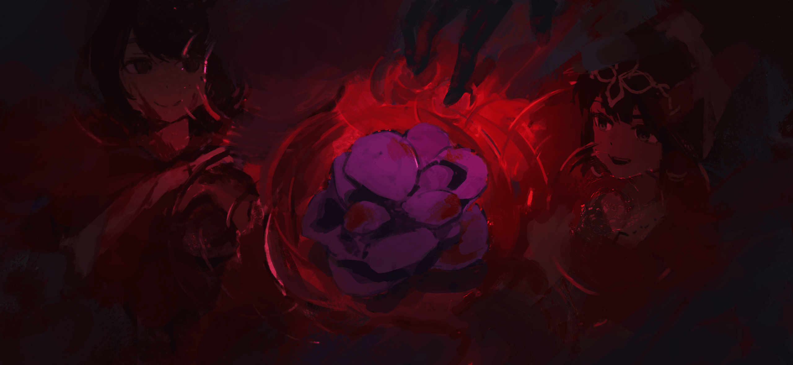
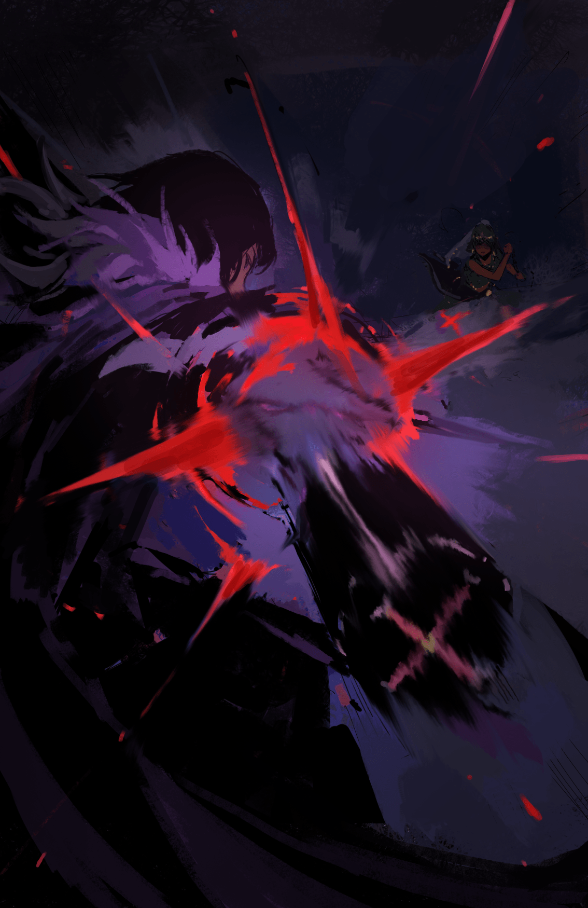

Холосео Фезерран

Увернуться было бы легко. Но она даже не попыталась и позволила потоку свежей крови обагрить своё лицо. Тёплая, липкая жидкость создавала странную иллюзию, будто её обнимает сама жизнь.

— Странно, правда?

— А…

— Тот, кто плюёт на саму идею жизни, так близок к смерти.

Массивный мужчина перед ней издал болезненный стон, и изо рта хлынула кровь. Эльза отступила на шаг, не желая быть забрызганной багровой жидкостью, извергающейся из его глотки.

Отступая, она вытащила клинок из груди мужчины, и тот истёк ещё большим количеством крови. Всё вокруг было залито алым цветом. Мужчина упал вперёд, его тело на мгновение задрожало, а затем затихло.

В конце концов, ни один человек не мог выжить с перерезанными горлом и пронзённым сердцем.

— С со своими уже закончила, Эльза. А ты?

— Да, с этим тоже…

В тот момент, когда она повернулась спиной к трупу, чтобы ответить…

— А!

Без предупреждения уже мёртвое, казалось бы, тело дёрнулось, и мужчина, вскочив, вонзил руку в спину Эльзы.

Удар пришёлся точно в цель, вырвав сердце Эльзы из груди и пройдя её насквозь. Внутренние органы девушки превратились в кровавое месиво.

Великолепная контратака. Контратака умирающего наверняка оборвала бы жизнь черноволосой девушки.

Если бы только эта девушка была человеком.

— …Вау-вау-вау. Отлично сработано.

— ..?!

С этой лёгкой похвалой мужчина получил удар ногой снизу. Девушка, чью грудь он только что пронзил, ударила его пяткой в челюсть. Она впечатала свою ногу, как будто невесомым телом, в челюсть мужчины, а затем, крутанувшись, так что чёрные волосы взметнулись перед ней, просто взмахнула клинком.

— Прости, что напортачила. Я ещё не совсем привыкла к этой работе.

Клинок со свистом опустился и одним махом распорол грудь и живот мужчины. Удар был слишком ужасен, чтобы назвать его просто порезом. Кровь и внутренности хлынули из открытой раны на пол.

Контратака умирающего закончилась перед лицом смертельной раны. На этот раз Эльза наблюдала, как мужчина падает замертво, прежде чем медленно опуститься на пол.

Она посмотрела на свою разорванную грудь и провела пальцем по ране. По её спине пробежали мурашки от жгучей боли смертельной раны.

Она попыталась ещё больше раскрыть рану пальцем, когда…

— Идиотка! Не трогай рану! Она так не заживёт!

— Ой…

Вместе с криком разочарования она получила удар кулаком по затылку. Эльза повернулась к источнику раздражения и увидела разъярённую Орнею, стоящую на коленях.

Орнеа взглянула на раны Эльзы и на труп мужчины подле неё. Эльза ответила на её гневный взгляд лишь слегка пожав плечами.

— Ты просила меня оставить его тебе, и я согласилась… и что же ты сделала? Потеряла бдительность! Ты либо подыграла ему, либо опять попалась на чью-то уловку… В любом случае, это не повторится!

— Интересно, а ты разобралась с остальными, Орнеа?

— Конечно, разобралась! Ты за кого меня принимаешь? Я убила их всех одним ударом! У них даже не было шанса дать отпор! Вот так сюрприз!

— О, я так удивлена.

— Недостаточно удивлена!

Что бы она ни говорила, Орнеа всё равно бы злилась, но, вероятно, она не лгала.

На её зелёном платье не было ни капли крови, что свидетельствовало о её мастерстве. Орнеа в одиночку расправилась с более чем двадцатью охранниками в этом особняке. Для сравнения, противником Эльзы был всего один человек, и хотя она выполнила свою главную задачу, разница в результатах была очевидна.

— Как рана на груди? Можешь двигаться?

— Да, всё в порядке. Двигаться ужасно больно, но я справлюсь.

— Это тоже нехорошо! Мы всё ещё пытаемся тебя акклиматизировать, а ты ведёшь себя так безрассудно! Залезай! Я отнесу тебя обратно!

Орнеа с такой силой закинула Эльзу себе на спину, что сопротивляться было бесполезно, поэтому Эльза молча подчинилась своей более низкой сестре. Они уже собирались покинуть место бойни, но прежде чем они смогли…

— Эльза, ты кое-что забыла. Оставь его.

— Это… о, точно. Я чуть не забыла.

Услышав напоминание Орнеи, Эльза порылась в своей груди и достала цветок. Тёмно-фиолетовый цветок таинственным и ошеломляющим образом в миг распустился в руке Эльзы.

Она бросила цветок на ранее упавшего замертво мужчину.

Вот и всё.

— Доказательство «Сестёр Фезерран».

Это была причина, по которой мужчина и его охранники погибли. Цветок — как доказательство содеянного.

Лишь мельком взглянув на лепестки, пропитывающиеся кровью, сёстры Эльза и Орнеа покинули место происшествия.

Они ушли, не оставив ни следа эмоций — лишь результаты своей работы. Таково было ещё одно правило «Сестёр Фезерран».

— Меня не перестаёт удивлять, насколько выросла Эльза.

Аккуратно предложив ей чашку свежезаваренного чая, Ситония поздравила Эльзу и Орнею с возвращением.

Вдыхая ароматный пар и смакуя чай, она согревалась. Чем чаще ей доводилось бывать во внешнем мире, тем больше она ценила «Священную Землю» — не просто как дом, а как нечто по-настоящему важное.

Холод снега отнимает у нас всё.

Он отнимает наши эмоции, наши чувства, наши отношения и даже наши жизни. Порой кажется, что даже у бандитов больше милосердия, чем у этого снега, чья жестокость не поддаётся описанию.

— Снег безжалостен? Как забавно!

— …

— О, это была не шутка? Я была уверена, что ты пошутила.

Эльза промолчала в ответ на шутку Ситонии и разочарованно облизнула губы. Смеясь над поведением своей младшей сестры, Ситония посмотрела на Орнею, которая была поглощена своим блюдцем с пирожными.

Орнеа, забыв про чай, уплетала сладости так, что щеки разрумянились, и усердно восстанавливала силы.

— М-м-м-м?… Что такое, Ситония?

— Разве не обязанность сестры докладывать мне? Я ещё не получила должного отчёта. Ты ведь не забыла об этом?

— Боже, боже! Конечно, нет! Я просто молчала, чтобы не прерывать разговор между тобой и Эльзой, Ситония. Я абсолютно не отвлеклась и не забыла про отчёт из-за этих пирожных!

Кашлянув с покрасневшим лицом, Орнеа сделала обиженное лицо. Она повернулась к Ситонии, которая смотрела на неё тёплым взглядом, и начала свою речь со слов: «Итак».

— Мы с Эльзой успешно выполнили свои обязанности. Священник Церид Мортис, который мучил людей своими корыстными толкованиями священных учений, был убит, а все причастные к этому — устранены. Никаких проблем… За исключением Эльзы, которая потеряла бдительность, и её платье разорвали!

— Разве присматривать за ней — не твоя роль?

— Меня слишком уж сильно ругают за это!

Орнеа сдалась, жалуясь на свою ужасную неудачу. В ответ на нытьё сестры Ситония устало вздохнула, посмотрела на Эльзу в разорванном платье и прищурилась.

— Судя по тому, как разорвана твоя одежда… атака противника, должно быть, была довольно жестокой.

— Да. Меня ударили сзади и пронзили грудь. Тем не менее, это тело быстро восстанавливается, так что это не страшно.

— Не будь слишком самоуверенной. Мы почти бессмертны, но не полностью неуязвимы.

Ситония протянула руку и нежно коснулась пальцами ранее разорванной груди Эльзы. Эльза послушно кивнула, хотя рана под разорванным куском одежды уже полностью зажила.

— Не будь так самоуверенна в своих способностях. Об этом теле ещё многое неизвестно, даже для тебя, Эльза.

— В таком случае, лучше всего ей потренироваться. Пойдём в подвал, Эльза!

Орнеа, которая в одиночку съела девяносто процентов пирожных на своей тарелке и была вся в крошках, вдруг встала из-за стола. Ситония лишь вздохнула, глядя на её энергичность, а Эльза с коротким бормотанием: «Да-да» последовала за сестрой.

— Ты у нас тренер, не так ли? Я прислушаюсь к твоему мнению, Орнеа.

— Хмф. Хе-хе-хе, ты наконец-то начинаешь меня уважать? Хорошо, тогда я буду учить тебя, как и положено старшей сестре. Я научу тебя, как быть «Сестрой Фезерран!»

Размахивая своими короткими руками в воздухе, Орнеа вышла из столовой в весёлом настроении. Когда Эльза уже собиралась последовать за ней, Ситония вдруг схватила её за рукав.

Она обратила свой взгляд на Эльзу, и в нем промелькнул слабый оттенок меланхолии.

— Что случилось?

— …Нет, ничего. Извини, что задержала тебя.

— О? Тогда всё в порядке.

В поведении Ситонии чувствовался какой-то скрытый смысл, и Эльза была уверена, что та хотела сказать что-то важное… но если она не хотела ничего говорить, то не было смысла настаивать.

Рука Ситонии отпустила её рукав, и Эльза быстро двинулась вперёд, следуя за Орнеей.

— Что тебе сказала Ситония?

— Не уверена. Вроде бы ничего особенного. Может, она просто одинока?

Когда Эльза наклонила голову, размышляя о выражении лица Ситонии, Орнеа добродушно улыбнулась и открыла дверь в подвал.

— За дверью находилось обширное подземное пространство.

Естественным образом образовавшееся пещерное пространство из известняка в основном использовалось сёстрами Фезерран для тренировок. В отличие от особняка или сада, здесь никого не волновало, если они что-то сломают или испортят, что делало это место очень удобным для тренировок.

Без такого места Сёстрам Фезерран было бы очень трудно тренироваться. В конце концов, вполне вероятно, что даже базовые тренировки по боевым искусствам привели бы к ужасным последствиям для окружения.

— Ты опоздала, Эльза!

Непринуждённые слова тут же сопровождались сильным ударом.

Смеясь, Орнеа сделала шаг вперёд и бросила цепь с тяжёлым грузом на конце.

— Это было оружие, называемое кусари-фундо, которое пользовалось укоренившейся дурной славой жестокого орудия для убийств, требующего большого мастерства в броске и ударе.

Однако вся эта хитрость была излишней, когда оружие бросали с чудовищной силой, выходящей за рамки здравого смысла.

— Вперёд…!

Не в силах избежать приближающегося груза, Эльза с хрустом лишилась правой руки, оторванной от плеча. Орнеа немедленно бросилась к Эльзе, которая потеряла равновесие из-за отсутствующей руки и теперь истекала кровью.

Эльза немедленно направила свой клинок в левую часть лица Орнеи. Клинок, который должен был выколоть глаз противника, был легко парирован простым наклоном головы.

Орнеа приблизилась к Эльзе на расстояние вытянутой руки.

— Сейчас будет немного больно, так что крепко-прекрепко стисни зубы!

Раздался звук цепей, прежде чем тело Эльзы перевернулось со взрывной силой.

Причиной этого было то, что цепи Орнеи обвились вокруг её ног, туловища и шеи, заставляя её потерять равновесие. Чистая физическая сила Орнеи не позволила бы её противнику просто упасть.

— …

В тот момент, когда Орнеа сильно дёрнула за цепь, тело Эльзы, всё ещё обвитое цепями, сжалось и разорвалось. Эльза сжалась, когда её шея сломалась, ноги были раздроблены, а туловище раздавлено внутрь, пока оно не стало таким же тонким, как её руки.

Это была настолько жестокая и брутальная смерть, что любой нормальный человек немедленно захотел бы отвести от неё взгляд.

— Вот и всё! Мило, что ты всё ещё хочешь играть с нами.

— …О.

Орнеа присела рядом с Эльзой, которая лежала на земле, стеная от боли после своей смерти.

Несмотря на то, что она разорвала Эльзу на куски своими тонкими ручками, Орнеа, казалось, совсем не заботилась об этом. Она не чувствовала ни малейшего укола вины за то, что мучила свою младшую сестру.

В конце концов, разорванное тело Эльзы уже восстанавливалось медленными и уверенными темпами.

— …

Разорванные ноги, искривлённая шея и раздавленное туловище медленно начали восстанавливаться. Кости с шумом трещали, плоть образовывалась в струях крови, раны закрывались, а внутренние органы из кровавой каши восстанавливались в первозданный вид.

Регенеративная сила, превосходящая человеческое понимание, необыкновенная жизненная сила, которая превращала даже смерть в пережиток прошлого. Таким было новое тело Эльзы Фезерран, члена «Сестёр Фезерран».

— …Моё тело действительно очень странное.

Кашлянув и выплюнув кровь, застрявшую в горле, Эльза осмотрела своё тело.

Боль уже прошла, и конечности функционировали как обычно. Её изуродованные внутренние органы уже вернулись в идеальное состояние.

— Это сила «Проклятой Куклы».

— Хочу напомнить, что это тайна, о которой нельзя говорить. Ты никому не должна рассказывать об этом.

— Рассказывать другим?… В нашей жизни, где и кому я могла бы вообще проболтаться?

— Наверное, ты права.

В ответ на простой вопрос Эльзы, Орнеа легко кивнула головой, как бы говоря, что её застали врасплох. Каким-то образом это развеселило обеих, и они вместе начали смеяться.

Всего несколько секунд назад эти две сестры вели ожесточённую борьбу за свою жизнь. Для случайного наблюдателя вид того, как они вдруг смеются друг над другом, как обычные девочки, был бы ничем иным, как жутким зрелищем.

Но для двоих участниц сего действия это было совершенно естественно.

Посмеявшись ещё несколько мгновений, Орнеа прищурилась и извинилась.

— Ты действительно похожа на меня, Эльза.

— А? Мне кажется, с твоими глазами что-то не так, раз ты так считаешь.

— Не говори так, как будто ты сравниваешь наш рост! Я говорю не о внешности, я говорю о чем-то более внутреннем, более существенном для твоего существа; что-то вроде этого!

— Я смутно понимаю о чём ты…

— Заткнись!

Крикнув на Эльзу за её короткий ответ, Орнеа продолжила.

— В любом случае!

Она возилась с грузиком кусари-фундо в руке, который и изуродовали тело Эльзы.

— Когда тебя превращают в проклятую куклу, разум обычно не выдерживает изменений в теле. Это причина ненасытной потребности Сарии и Хильды прикасаться друг к другу и эмоциональной нестабильности Доротеи.

— Голос Доротеи — это побочный эффект тела проклятой куклы?

— Нет, у неё это было изначально. Я не знаю почему. Насколько мне известно… это хорошо.

С отсутствующим взглядом Орнеа спросила: «Можно продолжить?», глядя в глаза Эльзе.

— По сравнению с другими нашими сёстрами, ты и я больше приспособлены к такой среде. Тебя, вероятно, будут часто просить делать такие вещи, как сегодня. Так что будь осторожна.

— Осторожна?

— Только наш Отец поддерживает нашу жизнь, а также религия, которой он следует в Святой Церкви Густеко.

Услышав леденящие кровь слова Орнеи, Эльза пробормотала про себя.

— Святая Церковь Густеко…

— Большинство людей в Священном Королевстве Густеко исповедовали святую религию Густеко.

Теократическое государство, основанное «Зверем-Духом» Одглассом и Святым Королём, выбранном Великим Духом. Такова была реальность Священного Королевства Густеко, земли вечного холода.

Суровая среда, одинаково безжалостная ко всем её жителям, доводя людей до того, что они не могут даже стоять на ногах, не веря во что-то большее. В такой реальности люди часто обращались за спасением к нечеловеческим существам.

В Густеко эта вера была направлена на духов.

Эльза, которую купил Холосео Фезерран и удочерил, стала членом Святой Церкви Густеко, даже не осознавая этого.

И теперь она принадлежала к секретному отделу, о котором никогда нельзя было рассказывать внешнему миру.

— «Сестры Фезерран»…

— Тайное служебное подразделение по поддержанию порядка, возглавляемое нашим Отцом. Это роль нас, сестёр, и наша работа необходима для очищения Священного Королевства.

Если бы она сказала это с раскаянием или сарказмом, Эльза, возможно, изменила бы своё мнение об Орнее.

Но отношение Орнеи показывало, что она не чувствовала никакого горя из-за своего положения. Она приняла свою роль, свою судьбу и приспособилась к этой среде.

Она наконец поняла.

То, что Орнеа имела в виду, когда сказала, что они похожи, наконец обрело смысл.

— Как бы ты ни хотела это назвать или сказать, твоя роль — просто убивать людей. Превращение в «Проклятую Куклу» — тяжёлое испытание, и работа, которую ты делаешь после того, как стала ею, действительно испытает твоё сердце. Пойми, Эльза. Мы должны уберечь наших сестёр от работы, которую они не хотят делать.

— …

— Все они многое пережили. Я не буду хвастаться своими собственными несчастьями, потому что это до смешного глупо сравнивать несчастья людей, но пока я остаюсь здесь, они спокойны. Никакого страха быть ранеными, никаких забот. Я бы хотела, чтобы они продолжали жить такой жизнью.

— …Вот почему ты продолжаешь выбирать самую тяжёлую долю?

— Вот почему я рассчитываю на тебя.

Орнеа, которая до этого момента вела себя таинственно, улыбнулась Эльзе. Она продолжала улыбаться, её глаза сузились в ожидании ответа Эльзы.

— Насколько я видела, ты удивительно хорошо адаптировалась к этой роли, а также к тому, чтобы быть «Проклятой Куклой». Поэтому, хотя это было немного рано, я решила позволить тебе сопровождать меня при исполнении моих обязанностей.

— Так… ты хочешь видеть меня в качестве своей преемницы или партнёрши?

— Я буду тренировать тебя, и тогда мы с тобой сможем выполнять роль «Сестёр Фезерран». Таким образом… Ситония сможет жить спокойно.

Слова Орнеи были пропитаны решительностью как никогда.

— Будучи второй дочерью «Сестёр Фезерран», я не знаю, как долго она жила этой жизнью. Однако в моих ежедневных мучениях были намёки на это.

— В разгар этой жизни она нашла надежду в спокойствии своих сестёр. Ради этой цели работа в качестве «Сестры Фезерран» — мой смысл существования.

— Это так мучительно добро. Ты такая…

— Какая? Не может быть! Ты собиралась сказать: “Ты такая маленькая?”

— Я этого даже не говорила…

— Твои глаза сказали это за тебя! Ты действительно недостаточно уважаешь свою сестру! Совсем!

Орнеа покраснела и осмотрела Эльзу с головы до ног, сидя на земле.

Пока они разговаривали, физическое восстановление Эльзы полностью завершилось. Она чувствовала пульсацию своего тела, как оно нагревается и начинает восполнять потерянную кровь. Принцип, лежащий в основе этого, был неизвестен. В любом случае, это было удобно.

— Как думаешь, многим ли сойдёт подобное с рук?

— …?

— Ничего. Выбери оружие. Если ты не знаешь, как использовать оружие, которое тебе подходит, ты никогда не сможешь соревноваться с лучшими из лучших, независимо от того, насколько ты хороша.

— Тебе когда-нибудь приходилось сталкиваться с такими противниками?

— Это не невозможно. Мне также приходилось иметь дело с… Рыцарями-Аколитами.

Слушая внушающие благоговение слова Орнеи, Эльза посмотрела на оружие на стене.

В этом месте, на тренировочной площадке для сестёр, было много подходящего для этой цели оружия. Не нужно было беспокоиться о том, насколько они грязные, так как оружия было бесчисленное множество.

Из всего этого оружия Эльза, как будто ведомая чем-то другим, взяла зловещие изогнутые клинки.

— Я чувствую, что кукри наиболее удобны в моих руках.

— Как и надеялась Орнеа, Эльза плавно адаптировалась к своей роли «Проклятой Куклы» и «Сестры Фезерран».

— Соберитесь вокруг меня, Фезерран.

Мёртвый голос Холосео был сигналом о том, что у «Сестёр Фезерран» есть работа.

У сестёр не было возможности ослушаться слов Холосео. По-видимому, это было неписаное правило между «Проклятой Куклой» и Кукловодом, который её создал, некий непреодолимый барьер.

— Ситония и Орнеа, шаг вперёд.

Из собравшихся сестёр Холосео выбирает подходящих для задания, переданного ему его начальством в Церкви Святого Короля.

В большинстве случаев чаще всего на задание выдвигаются старшая дочь и вторая дочь. Ситония и Орнеа — безусловно, самые частые исполнители заданий. Иногда Сарию и Хильду выбирают для совместной работы, но по сравнению с двумя старшими сёстрами существует огромная разница; то же самое относится и к Эльзе как к новичку.

Однако в случае с Эльзой Орнеа часто предлагала, чтобы ей разрешили сопровождать её при исполнении своих обязанностей. Как она заявила в подвале, Орнеа ожидала, что Эльза станет подходящей «Сестрой Фезерран». Её поведение показывало, что она говорила правду.

Такие вызовы поступают примерно раз в пять-десять дней.

Эльза так и не поняла, говорит ли частота заданий о множестве врагов у Церкви или, наоборот, об их малом количестве.

«Ну, это гораздо лучше, чем остаться без врагов», — подумала Эльза.

Причина, по которой она так думала, заключалась в том, что она чувствовала, что именно поэтому Холосео не появлялся дома, если у него не было для них задания.

За исключением чрезвычайных ситуаций, Холосео не остаётся в особняке. Другими словами, большую часть времени в этом огромном особняке жили только Эльза и её сестры.

— Если это так, почему бы нам просто не закрыть неиспользуемые части особняка, чтобы нам не приходилось убирать его каждый день?

— …

— Смешно продолжать убирать комнату, в которую никто даже не заходит. Ну, лично я не могу заниматься такой домашней работой, так что, полагаю, время, которое я трачу на уборку, будет одинаковым независимо от этого.

— …Заткнись.

— Хорошо.

Пока Эльза разговаривала со спиной человека перед ней, этот человек резко одёрнул её, когда они остановились.

Доротеа обернулась и бросила на Эльзу испепеляющий взгляд. Она продолжала сверлить Эльзу глазами, держа в руках свои любимые ножницы.

— …Почему ты следуешь за мной?

— Если ты спрашиваешь меня почему, то, наверное, просто потому, что мне скучно. Я даже не могу вздремнуть, потому что сегодня слишком долго спала. Но ведь нездорово просто сидеть без дела, не так ли?

— …Работай!

— Ситония мной брезгует. Она говорит, что мне нельзя доверять ничего по дому.

Некомпетентность Эльзы была довольно очевидна во всех домашних делах, разрушив все представления Ситонии о возможной некомпетентности в домашних делах, которая отвечала за особняк, и привела к приказу держаться ей подальше от всей домашней работы.

Поэтому, пока Эльза находилась в особняке, она была назначена кормилицей, которая наблюдала за работой своих сестёр, лёжа в постели.

— …У меня нет на этот счёт никаких сомнений.

— Это просто дело случая. Нет смысла спорить об этом. О, конечно, мне жаль, не так ли? Так…

— …Так?

— Так что я делаю всё возможное, чтобы компенсировать то, что не работаю по дому.

Большую часть времени она была просто дополнением для Орнеи, но она не жалела сил на свои обязанности.

Она особо не задумывалась об этом, но их служение — убийство людей — не очень её беспокоило. Это ей подходило. По крайней мере, больше, чем быть домашней прислугой.

Однако выражение лица Доротеи изменилось, когда она услышала слова Эльзы. То, что она показала Эльзе, было не просто обидой.

— У тебя очень странный способ злиться, не так ли? Ты злишься на себя?

— …Нет.

— Извини, но я чувствую это по тебе. Я всегда была такой, но в этом теле оно стало ещё сильнее… От людей исходит множество запахов, отражающих их чувства.

Гнев пахнет гневом, печаль — печалью, а радость — радостью.

Возможно, это было не совсем из-за её обоняния, но нос Эльзы мог чётко различать их. Он был чувствителен не только к человеческим эмоциям, но и к изменениям в воздухе.

Выживание Эльзы до сегодняшнего дня в немалой степени было обусловлено этим особым чувством.

— Так что ты не сможешь меня обмануть.

— …И что с того?

— Ничего. Я просто говорю то, что думаю. Если это то, о чем ты не хочешь говорить, тебе не обязательно говорить об этом. Если это то, что ты хочешь, чтобы я услышала, скажи это. Как ты знаешь, я абсолютно свободна.

— …

С этими словами Эльза открыла дверь в ближайшую комнату.

Она села на один из стульев, оглянулась на дверь и наклонила голову.

Доротеа, заглядывая в дверной проем, была озадачена поведением Эльзы, но в конце концов она медленно вошла в комнату и села напротив Эльзы.

А затем —

— …Меня никогда ни к чему не призывают.

Доротеа, положив большие ножницы на колени, выпалила свои мысли.

Услышав это, Эльза слегка подняла брови. Затем она прищурилась, как будто глубоко задумавшись.

— Если ты спрашиваешь меня, что я думаю на этот счёт, то что ты говоришь, вероятно, правда.

— …Разве ты не заметила?

— Нельзя определить, сколько раз кого-то звали, по запаху. Кроме того, хотя я этим не горжусь, я не очень хорошо запоминаю вещи. Даже лицо твоего Отца расплывчато, потому что я не так часто его вижу.

Поскольку он редко появлялся в особняке, и даже когда появлялся, проводил с ней очень мало времени, образ лица Холосео всегда был смутным в памяти Эльзы.

Если бы её попросили нарисовать его портрет, она смогла бы лишь конкретно изобразить две его бросающиеся в глаза впадины — пустые глазницы без глазных яблок.

И когда она услышала прямолинейное мнение Эльзы…

— …Не смейся над своим Отцом.

— …

Пара больших раскрытых ножниц прижалась к белой шее Эльзы с обеих сторон, удерживая её.

Когда она почувствовала холодный ржавый запах, Эльза вспомнила, когда это уже случалось с ней раньше. Это было, когда её впервые привезли в этот особняк.

— Если подумать, разве ты не злилась на меня за то же самое тогда?

— …В тебе нет ни капли раскаяния, идиотка.

— В моей природе не оглядываться на прошлое, так что не думаешь ли ты, что я просто выставлю себя дурой, превратив то, что я едва помню, в плохое воспоминание? Что ты думаешь?

— …Нет.

Ответ, похоже, не был ей по душе, поэтому давление ножниц усилилось, и тонкая кожа на шее Эльзы начала рваться. Она почувствовала слабое ощущение текущей крови, но в глазах Эльзы не было страха.

Однако это не потому, что она была уверена, что её не обезглавят.

— В отличие от того раза, я не думаю, что отрубив мне голову, ты меня убьёшь, знаешь ли?

— …Даже у «Проклятой Куклы» есть предел тому, сколько раз её можно оживить.

— Да, полагаю, что так. Ситония сказала мне то же самое. Но я не думаю, что я сразу умру от обезглавливания… а если я умру…

— …Что если ты умрёшь?

— Разве твой Отец не рассердится на тебя, если ты убьёшь свою сестру без разрешения?

— …

Естественно, Доротеа, должно быть, испытывала ту же тревогу и беспокойство, что и раньше. Она подавила разочарованный вздох, а затем медленно отвела большие ножницы. Эльза нежно коснулась пальцем раны, вызванной ножницами. Капля крови увлажнила кончики её пальцев, но рана на её шее уже закрылась и исчезла без следа.

— …Твои раны быстро заживают.

— Разве Орнеа не такая же? А ты?

Когда Эльза в замешательстве наклонила голову, Доротеа поджала губы и не ответила. На отсутствие ответа от неё Эльза лишь пожала плечами, чувствуя стыд Доротеи.

— Кстати, ты, похоже, очень любишь своего Отца.

— …Откуда ты знаешь?

— Ты единственная, кто говорит о своём Отце больше, чем все мои другие сёстры. Я бы узнала об этом, даже если бы не хотела… Ах, это была фигура речи. Не то чтобы мне это не нравилось.

— …Отец выбрал тебя.

Доротеа слабо пробормотала про себя, повернувшись и обхватив себя за локти. Она нежно коснулась пальцами своего горла — того самого горла, из-за которого она говорила хриплым голосом, похожим на голос старухи.

— …Забавный голос, не правда ли?

— Он особенный, да. Я немного удивлена, что он так не сходится с твоей внешностью.

— …Я сама его уничтожила… Я выпила кипяток.

Глаза Доротеи расширились от конфликта и отчаяния, как будто воспоминание об этом моменте никогда не исчезнет из её памяти.

Выпить кипяток. Даже лишенная воображения Эльза могла представить, насколько это было ужасно. Это нельзя было описать как простую боль, это были муки самого ада.

Её десны и язык были бы сожжены, её горло и пищевод разорваны в клочья от температуры и криков агонии. Конечно, ожоги в конце концов зажили бы, превратив горло девушки в нетрогаемое месиво.

И правда, стоящая за хриплым голосом Доротеи, заключалась в том, что она сама хотела этого.

— …Ему нравилось заставлять меня визжать высоким голосом, когда он бил меня или причинял мне боль.

Ответ Доротеи был быстрее, чем вопрос о том, почему она это сделала. Услышав её ответ, Эльза сразу же убедилась в причине.

«О», — сказала она.

— Это имеет смысл. Многим владельцам нравится слышать, как плачут в агонии купленные ими дети. Я тоже это помню.

— …Ты тоже?

— Да, но я редко плакала, поэтому ему это не нравилось. Наверное, я была не очень привлекательной. Я всегда была такой.

Хотя её купили у работорговцев, большую часть времени Эльза не могла удовлетворить потребности покупателя. Казалось, работорговцы каждый раз беспокоились из-за возвращения Эльзы, но в этом отношении этот особняк был гораздо комфортнее.

Впервые она смогла оставаться на одном месте так долго.

— В этом смысле, можно сказать, что это мой первый дом.

— …

— Что случилось?

— …Это благодаря доброте твоего Отца.

Доротеа отвернулась и пронзительно пробормотала. В голове Эльзы слова «Холосео» и «доброта» никак не могли быть связаны, но она не сказала об этом.

Если она чему-то и научилась до сих пор, так это тому, что…

— Ты уничтожила собственное горло… потом тебя выбросили… А потом твой Отец нашёл тебя? Я благодарна за это.

— …Поэтому я хочу помочь нашему Отцу. Но…

— Иронично, что причина, по которой ты смогла встретиться со своим Отцом, заключалась в том, что ты уничтожила своё горло, но причина, по которой ты не можешь помочь ему, также заключается в том, что ты уничтожила своё горло. Что было бы лучше?

Возможно, эта боль была тем, что бесконечно повторялось для Доротеи.

Излишне говорить, что Доротеа проклинала своё горло, которое могло издавать только хриплый голос. Но было также верно и то, что без него она не смогла бы присоединиться к Холосео и «Сёстрам Фезерран».

Так…

— Думаю, полезнее было бы подумать о том, как бы ты могла использовать этот голос во благо Отца.

— …Даже этот голос может быть полезен?

— Да. Ну… если разговор для тебя не вариант, почему бы тебе не взять на себя невербальную роль? Помимо твоего голоса, я думаю, твоя внешность вполне хороша.

— …Вполне хороша?

— Я думаю, это отличный способ застать кого-то врасплох.

С синими волосами, завязанными в два хвостика, Доротеа с её небольшим ростом выглядит так же мило, как ангел.

Её хриплый голос, который противоречит этому впечатлению, является источником её комплекса неполноценности, но если ей это не нравится, ей не нужно выставлять его напоказ.

Милую девушку без голоса можно использовать как угодно.

— Как ни печально, но спрос есть не только на девушек с пронзительным визгом, но и на тех, кто молчит, что бы с ними ни делали.

— …Ты.

— Всё дело в том, как ты это используешь, не так ли? В любом случае, ты всегда можешь сдаться.

Способность адаптироваться к любому месту и чему угодно была очень редкой. Большинству приходилось довольствоваться тем, что у них есть, и использовать изобретательность, чтобы добиться своего.

У Эльзы были свои сильные стороны, и у Орнеи были свои сильные стороны.

— Если ты не можешь быть похожей на Ситонию или Орнею, это не значит, что ты бесполезна. Я уверена, что ты сможешь жить счастливо, если поймёшь это.

— …

— Ну, мне, по крайней мере, нравятся сады, за которыми ты ухаживаешь, так что меня устраивает то, какая ты есть.

Наконец, Эльза добавила в речь свои искренние чувства к Доротее.

Глаза Доротеи расширились от удивления, когда она услышала это, и она на мгновение замолчала.

— …Я всегда думала, что ты идиотка.

— Я не удивлена это слышать. Я не очень хорошо умею думать. Я гораздо лучше действую, чем думаю.

— …То, что ты идиотка… нет, я беру свои слова обратно. Мне это не нравится, но ты не глупая.

Доротеа покачала головой, описывая Эльзу. Она встала, взяв ножницы, и направилась к двери, чтобы выйти из гостевой комнаты.

Её походка казалась легче, чем до разговора с ней.

— …Спасибо.

— …?

— …Идиотка.

Её странные слова благодарности не имели смысла для Эльзы, которая осталась в недоумении от того, что означало её оскорбление. Увидев, как она выходит из комнаты, Эльза снова осталась одна.

— Спасибо, сестрёнка… фуфу, прошло много времени с тех пор, как меня кто-то благодарил.

Как бы далеко она ни возвращалась в своей памяти, ей было непросто найти воспоминание о том, как кто-то благодарил её. Эльза слабо и жалко улыбнулась, вспоминая свою одинокую жизнь.

Поговорить с кем-то о своих проблемах и получить за это благодарность; это было действительно похоже на разговор с сестрой.

Думая об этом, Эльза немного вздохнула.

Действительно, если бы она могла продолжать чувствовать себя так, ей, возможно, пришлось бы поблагодарить Холосео.

— Я вижу, что ты ей что-то сказала. Спасибо, Эльза.

— Вот это да, ты вторая, кто это говорит.

— Хм?

— Ничего, я просто разговаривала сама с собой. Не обращай внимания.

Эльза помахала рукой Ситонии, которая закатила глаза в ответ, не зная, что сказать.

«Прошло много времени с тех пор, как меня кто-то благодарил», — подумала она.

«Несмотря на это, я была удивлена, что меня дважды поблагодарили за такой короткий промежуток времени».

Ситония, которая не разделяла удивления Эльзы, просто сказала: «Хорошо».

— Я перестану пытаться понять всё, что ты говоришь, потому что разговор с тобой сводит меня с ума.

— Да, я думаю, это отличная идея. Никто никогда не сможет полностью понять другого человека.

— Я не имела в виду это в таком философском смысле…

— О, не имела?

Ситония вздыхает на то, что Эльза снова упустила суть. Затем она продолжила.

— Я имею в виду Доротею.

— Ты разговаривала с ней, пока мы с Орнеей отсутствовали, не так ли? Я давно знаю, что она расстроена тем, что не может внести свой вклад в помощь нам…

— Ты не можешь всё знать или всем управлять только потому, что ты старшая. Кроме того, я смогла как следует поговорить с Доротеей сама.

— Похоже, твоя импровизированная речь действительно подняла ей настроение.

Даже избегая скромности, Эльза сама не очень осознавала совет, который она дала. Ситония, казалось, знала это, но всё равно поблагодарила её за это.

По словам Ситонии, когда она и Орнеа вернулись с задания, Доротеа поприветствовала их и предложила совет по поводу роли, которую она могла бы сыграть. Она сказала: «Если, когда я говорю, я выгляжу подозрительно, можете ли вы дать мне роль, в которой я могу избежать этого?».

— Хотя она пыталась скрыть, кто это предложил.

— …О, понимаю. Тогда разве не было шанса, что это была не я?

— Если бы это была не ты, то это должны были быть Сария или Хильда, не так ли? Но эти двое не дали бы Доротее… они никогда не стали бы советовать другой сестре. Их отношения полностью ограничены ими самими.

Эльза задалась вопросом, не является ли слегка колючий тон в её голосе признаком того, что Ситонии по-своему трудно с близнецами. Ситония, казалось, осознала свою резкую формулировку, и после того, как её щеки слегка затвердели, она продолжила.

— В любом случае, я думаю, это хороший знак, что Доротеа хочет участвовать в задании своей особой ролью… Хотя Орнеа может быть не очень довольна этим.

— Я уверена, что она не будет. Орнеа хочет всё делать сама.

— …Тогда я буду продолжать предполагать именно это.

Несмотря на то, что Эльза раскрыла некоторые из слегка извращённых мыслей Орнеи, Ситония не осмелилась продолжить этот вопрос.

Похоже, ей не рассказывали напрямую об истинных намерениях Орнеи, но по-своему она, казалось, осознавала чувства своей сестры.

— Итак, если это единственная причина, по которой ты меня остановила, я пойду.

— Что за спешка?

— Орнеа вернулась, не так ли? Если это так, я надеялась, что смогу потренироваться с ней в подвале.

Убивать друг друга, а точнее, уничтожать друг друга, было самым быстрым способом привыкнуть к этому телу.

По этой причине Эльза получила бы наибольшую пользу от тренировок с Орнеей, которая была готова убить её без каких либо вопросов или мук совести. Если бы она тренировалась одна, ей быстро стало бы скучно.

— …Ты звучишь довольно восторженно. Но сначала…

— Хм?

— У меня кое-что есть для тебя, Эльза. Возьмешь?

И с этими словами Ситония нежно взяла её за руку и протянула Эльзе что-то.

Это был маленький мешочек размером с ладонь. Его горловина была завязана верёвочкой, а внутри находился маленький круглый предмет, источающий слегка сладкий аромат.

— Это амулет ручной работы. Подарок от меня. Я дарила их всем своим сестрам… и я думаю, ты наконец-то готова.

— Амулет… он имеет какое-то отношение к Церкви Святого Короля?

— Нет, я просто сделала его, потому что хотела подарить его тебе. Знак нашей сестринской любви, наверное.

Эльза взяла амулет из её руки, пока Ситония застенчиво улыбалась. Эльза несколько угрюмо посмотрела на него. Хотя он был сделан вручную, он был сделан руками Ситонии, которая хорошо справлялась с домашними делами, и поэтому в нем не было никаких недостатков, которые обычно можно увидеть в изделиях ручной работы.

Он был лёгким. Он не будет мешать, даже если носить его в кармане. Проверив, как амулет лежит в её ладони, Эльза улыбнулась Ситонии.

— Значит ли это, что я наконец-то одна из сестёр?

— Нет, это не то… ты станешь одной из «Сестёр Фезерран», когда твой Отец признает тебя.

Эльза нахмурилась на ответ Ситонии, её глаза слегка опустились.

В словах Ситонии был какой-то негативный оттенок. Было ясно, что она не хотела признавать Эльзу своей сестрой…

— Что ты имеешь против «Сестёр Фезерран»?

— …У тебя действительно хорошая интуиция, не так ли?

— Интересно, это должен был быть комплимент? Я не чувствую, что мне делают комплимент.

— Если ты имеешь в виду, что ты замечаешь то, что я не хочу, чтобы ты замечала, то да.

Коротко выдохнув, Ситония расслабила губы. Это был взгляд смирения, но всё же ярче, чем предыдущий.

— Эльза… я уверена, что «Сёстры Фезерран», которых действительно хочет твой Отец, — это такие дети, как ты.

Это был комментарий, похожий на жалость, а не на зависть. Таким образом, Эльза отпустила этот вопрос, когда она заговорила дальше.

— Ты не благодарна своему Отцу, Ситония?

— …Я благодарна. Я уверена в этом.

Ответ был быстрым, как будто она была к нему готова заранее. Однако даже Эльза подумала, что было бы слишком жестоко продолжать этот вопрос.

— У всех столько всего на уме… Интересно, у Сарии и Хильды тоже?

У Ситонии, Орнеи и Доротеи были свои мысли о «Сёстрах Фезерран» и природе Холосео Фезеррана.

Эльзе постоянно говорят об этом, не спрашивая, и пока она обрабатывает это…

— Мне не нравится ни о чем думать, от этого я чувствую себя странно.

— …Я думаю, именно поэтому ты одна из «Сестёр Фезерран».

Она почувствовала разочарование от того, что Ситония сказала ей это ошеломлённым тоном.

И так медленно шли дни.

Дни, не свободные от крови и боли. Это было не мирное время, но для Эльзы, которая провела столько лет, борясь за выживание, большую часть времени, проведённого в особняке Фезерран, можно было назвать мирным.

Иногда её приводил в ужас ненормальный талант Ситонии к ведению домашнего хозяйства.

Орнеа тренировала её, пока её конечности не отрывались.

Сария и Хильда иногда мешались с их неэффективной связью близнецов.

Недовольство Доротеи было частым, и ей снова и снова угрожали этими большими ножницами.

Для Эльзы это был первый раз, когда она испытала нечто подобное. Поэтому, возможно, она лелеяла надежду, что это время продлится дольше, чем продлилось.

Время тянулось так тошнотворно мирно, так мило и скучно.

Но шаги злого рока неуклонно приближались, не давая Эльзе сбежать.

Как будто говоря, что её судьба — та, которую невозможно изменить.

В тот день Холосео как обычно посетил особняк, чтобы назначить обязанности.

— Ситония и Орнеа… Доротеа, вперёд.

— …Да, сэр.

Если и было что-то отличное от обычного, так это то, что в тот день были названы имена не только старшей и второй дочери, но и пятой дочери, которая любила своего отца. Пятая дочь, должно быть, была очень взволнована этим.

Эльза не была уверена, насколько её совет способствовал назначению Доротеи. Однако перед лицом радости Доротеи от того, что её выбрали, это казалось незначительным делом.

— О, ты злишься?

— …Я не настолько бессердечна, чтобы смотреть на это и говорить что-то безжалостное.

Орнеа фыркает на вопрос Эльзы, наблюдая, как Доротеа корчится от радости.

Хотя Орнее не нравилась идея о том, что её сёстры участвуют в её обязанностях, она знала, что Доротеа хотела работать на Холосео. Если бы она не заботилась об этой радости, Орнеа в первую очередь не захотела бы помогать своим сёстрам.

— Сария и Хильда. Я дам вам другое дело.

— О, да, сэр.

— Да, сэр.

Пока шёл их разговор, Холосео продолжил свои приказы и сказал Сарии и Хильде выполнить задания. Близнецы почтительно преклонили колени и приняли задание, прежде чем Эльза подняла бровь с удивлённым «О».

Все пять сестёр, каждой из которых была отведена роль…

— Я единственная, кто остался в доме… это немного нервирует.

— Что ты сказала?! К тому времени, как мы вернёмся, дом сгорит из-за нашего отсутствия?!

— Это то, чего ты ожидаешь? Тогда, полагаю…

— Не смей этого делать!

Когда Орнеа начала давить на неё, Эльза просто пожала плечами и ответила: «Хорошо».

Но дело в том, что это был первый раз, когда Эльза оставалась одна в доме. Обычно было бы довольно плохим решением оставить бывшую рабыню одну в таком особняке, но, похоже, Холосео и остальные не допускали мысли, что Эльза способна на такое.

Конечно, Эльза не планировала украсть что-то ценное и сбежать.

— Эльза, я знаю, что это тяжёлая работа, но, пожалуйста, позаботься об особняке.

— Веди себя тихо, верно? Думаю, я просто буду лежать в постели, пока не достигну своего предела и не засну.

— …Извини, но на самом деле это кажется самым мудрым поступком для тебя.

Хихикающая Ситония нежно погладила тёмные волосы Эльзы. Затем она быстро показала ожерелье на своей груди, амулет, такой же, как тот, что она подарила Эльзе.

— Ну, мы пойдём. Да пребудет с тобой серебряная благодать.

— Да. Серебряная благодать.

Легко потерев грудь, Эльза ответила на слова Ситонии. В ответ Ситония с облегчением улыбнулась, направляясь выполнять свои обязанности.

Орнеа, близнецы и Доротеа последовали за старшей дочерью.

— …Эльза.

— Я так рада, что ты получила то, что хотела. Счастливого пути.

— …Я вернусь.

Эльза задалась вопросом, не является ли небольшой взмах руки Доротеи, когда она уходила, знаком её благодарности.

Несмотря на то, что она не могла понять истинные намерения, Эльза с радостью приняла это и проводила сестёр. С этим она скоро останется одна в этом просторном доме.

— Хотя мысль об этом немного волнует меня…

— Дочь Фезерран.

— …

Пока Эльза размышляла о предстоящем, сзади раздался мёртвый голос.

Она обернулась и увидела Холосео, стоящего там. Глядя в его пустые глазницы, Эльза прищурилась, чувствуя, будто попала в какую-то ловушку.

Работа Холосео заключалась в том, чтобы говорить только то, что необходимо, и назначать задачи сёстрам. Как только это было сделано, он обычно покидал дом вместе с сёстрами, отправлявшимися выполнять свои обязанности, или, даже если он этого не делал, он исчезал, прежде чем они успевали опомниться. Только сегодня он остался.

В чем же причина этого? Слова мертвеца скоро прояснят это.

— У тебя тоже есть роль, Эльза.

— Ты имеешь в виду отдельно от Ситонии и остальных? Это…

— Для семьи Фезерран, конечно. Для «Сестёр Фезерран».

Прямой ответ не удовлетворил Эльзу, которая хотела предаться этой беседе. Хотя это может быть хорошо, учитывая её плохое чувство перспективы.

В любом случае, похоже, что план Эльзы остаться в особняке и предаться безделью был сорван.

Её это устраивало, но теперь ей было любопытно узнать истинные намерения Холосео.

— Ты потрудился выпроводить других сестёр из дома… и что же ты просишь от меня одной?

— Это очевидно.

С этими словами Холосео повернулся лицом к Эльзе.

Его безжизненные глаза не могли видеть Эльзу, но Эльза определённо чувствовала это. Взгляд Холосео, направленный на Эльзу — или, возможно, это было больше похоже на его надежду и ожидания.

Какую надежду возлагает на Эльзу человек, который заставил своих дочерей убивать людей в соответствии с уставами Святой Церкви Густеко, человек, который уже был так же мёртв, как и его судьба?

— Завершение «Сестёр Фезерран».

Эльза наклонила голову на страстные, слегка возбуждённые слова Холосео. Её длинные чёрные волосы мягко струились по бледной шее и плечам.

— Конец этим мирным дням наступил так внезапно, что это было просто поразительно.

— А!

Крик, разрывающий душу на части, эхом отозвался в сердцах тех, кто стал его невольным свидетелем.

Эмоции выражала юная дева, но на самом деле раздавался хриплый голос старухи, давно измученной временем — так что все быстро узнали владелицу голоса.

— Доротеа! Что с тобой случилось?

Ситония, которая только что вернулась в особняк, услышала крик и быстро бросилась на место происшествия.

Крик раздался в часовне особняка. Религиозная женщина… Доротеа, которая испытывала сильные чувства к своему приёмному отцу, который её нашёл, всегда ходила в часовню и молилась, как только возвращалась с улицы.

На этот раз всё было так же. Выполнив свои обязанности без сучка и задоринки, Доротеа почувствовала определённое удовлетворение и в её душе распускался цветок надежды на счастливое будущее. Она пошла в часовню, чтобы доложить и разобраться в своих чувствах.

А потом…

— Ах.

Глаза Ситонии расширились, когда она открыла большие двери часовни и вошла внутрь.

Следом за ней появились Орнеа и двое других, Сария и Хильда, которые вернулись в особняк немного раньше. Они тоже стали свидетелями сцены, которая вызвала ужас Ситонии.

— О боже.

— Ну и ну.

— Это…!

Слова застряли в горле близнецов. Орнеа судорожно вздохнула, не в силах произнести ни звука. Ситония стояла как вкопанная. Перед ними разворачивалось нечто совершенно ужасающее.

Доротеа стояла на коленях в дальнем конце часовни, хватаясь за алтарь, как за единственную опору в рушащемся мире.

…Возле алтаря лежало тело, из распоротого живота которого на пол вывалились внутренности.

Там лежал Холосео Фезерран, мёртвый.

— Отец… О, Отец… Почему, почему, почему… О, нет.

Рыдающая Доротеа цеплялась за труп, не обращая внимания на то, что покрывает себя вязкой кровью. Но как бы отчаянно она ни звала, жизнь уже покинула тело Холосео.

Всем стало очевидно, что Холосео мёртв. Если бы это было тело одной из «Сестёр Фезерран», возможно, был бы шанс его воскресить, но…

— Отец не «Проклятая Кукла». Он лишь кукловод.

— …Извини.

Именно Орнеа шагнула вперёд вместо Ситонии, которая не могла пошевелить и пальцем. Она, самая маленькая из сестёр, обняла сзади рыдающую Доротею.

Чувствуя её объятия и слыша её жестокие слова, горло Доротеи начало судорожно сжиматься. Снова столкнувшись с ужасающим зрелищем перед собой, Доротеа посмотрела на свои руки.

Она смотрела на свои руки.

Руки, которые так отчаянно пытались втиснуть обратно то, что покинуло тело её отца.

— Интересно, что же случилось, пока Хильда и остальные отсутствовали.

— Что случилось, пока Сария и остальные отсутствовали?

Близнецы, держась за руки и прижимаясь друг к другу, задали вопрос, которого невозможно было избежать.

Этот вопрос волновал всех сестёр.

Что случилось в доме, пока они отсутствовали будучи на задании, что могло привести к этой трагедии? Что стало причиной смерти Холосео и слёз Доротеи?

— …Это очевидно.

— Доротеа? Ах! Эй, подожди! Доротеа!

Доротеа резко встала и стряхнула с себя Орнею, тихо выругавшись. В том состоянии, в котором она находилась, она не услышала слов своей сестры остановиться и ушла в своём окровавленном платье. Ситония молча уступила дорогу, чувствуя давление её ярости, и она беспрепятственно вернулась в особняк.

И вот, с глазами, пылающими от ненависти, она направилась в одну определённую комнату в особняке.

Все сёстры, живущие в особняке, прекрасно знали, чья это комната.

— …Эльза.

Дверь затрещала под яростным ударом, едва удержавшись в петлях. Обида, словно живое существо, заполнила комнату, отравляя воздух. Лицо Доротеи, обычно столь прекрасное, исказилось гневом. Её взгляд упал на кровать, где, услышав своё имя, медленно поднялась девичья фигура.

— Фух… Доротеа? Ты вернулась? Ты рано.

— …

— …Я удивлена, что ты даже не удосужилась переодеться, прежде чем прийти ко мне.

Наклонив голову, Эльза осмотрела Доротею с головы до ног, бормоча про себя.

Возможно, она решила, что Доротеа, покрытая кровью Холосео, только что выполнила свои обязанности и сразу же пришла к ней, даже не успев переодеться. Какой бы ни была причина, это не имело никакого отношения к тому, что сейчас чувствовала Доротеа.

— Доротеа!

И тут сёстры, которые немного опоздали, выходя из часовни, догнали её. Они ахнули при виде Доротеи и Эльзы, стоящих друг напротив друга.

Ситония схватила Доротею за плечи сзади, пока не произошло непоправимое.

— Доротеа! Ты тоже, Эльза! Просто успокойтесь!

— Это она в мрачном настроении. Я пытаюсь сохранять спокойствие.

— Эльза! Тебе не нужно…

Она не хотела, чтобы она это говорила, и она не позволила бы Ситонии сказать ей что-то другое.

Не успела она договорить, как сверкнули лезвия ножниц, отсекая руки Ситонии, державшие Доротею за плечи.

— Хах.

— …Прочь с дороги.

Ситония, лишенная руки внезапным взрывом жестокости Доротеи, ещё не успела осознать случившееся.

Лишь мгновение спустя хлынула кровь, обагряя щеку Доротеи, которая что-то яростно шептала. Тело Ситонии упало назад, и Орнеа быстро поддержала её.

Она увидела, как её бледные руки упали и покатились по полу комнаты, словно конечность сломанной куклы.

— А-а-а-а-а!

— Доротеа, какого черта?

Запоздалая боль вырвала из горла Ситонии крик. Орнеа, с воплем ужаса, подхватила её обмякающее тело. Одним движением ноги она подбросила отрубленную руку и прижала её к кровоточащей ране.

Обычно, Ситония, что прошла ритуал «Проклятой Куклы», смогла бы мгновенно вернуть руку на место, это было обычным делом на тренировках. Но сейчас всё было иначе.

На этот раз была большая разница.

Сестра никогда не должна отрезать руку своей сестре во время ссоры вне тренировки.

Но Доротеа не послушала мольбы Орнеи и продолжила смотреть на Эльзу. Затем она бросила что-то из руки, противоположной той, в которой держала большие ножницы.

Когда все, кроме Ситонии, увидели, как оно скользит по полу с характерным лязгом, их выражения лиц резко изменились.

Это был изогнутый кинжал, которым любила пользоваться Эльза.

— …Объясни, пожалуйста.

— …

— …Как твой клинок оказался воткнутым в тело твоего Отца?

Её хриплый голос дрожал, было ясно, что она изо всех сил старается не показывать свои эмоции.

Доротеа силой подавила желание броситься вперёд и ждала ответа Эльзы.

Единственным человеком в доме была Эльза, это был её любимый изогнутый кинжал, которым убили Холосео, и у неё не было преданности своему отцу; всё это были веские косвенные улики.

Доротеа ждала ответа от Эльзы.

И вот…

— …Ну и как это могло произойти? У тебя есть идеи?

— Эльза, ты…!

Гнев Доротеи взорвался на обычный отстранённый ответ Эльзы.

Доротеа с воплем полным ненависти бросилась на Эльзу, размахивая огромными ножницами. Щёлкнув лезвиями, она попыталась отрезать Эльзе голову.

Эльза кончиками пальцев ног подняла изогнутый клинок, лежащий у неё под ногами, в свои руки. Удар и металлический лязг встречи их оружия всколыхнули воздух в комнате, и сестры посмотрели друг на друга в упор.

— Доротеа, я не собираюсь с тобой драться…

— ЗАТКНИСЬ! Заткнись! Заткнись! Заткнись! Заткнись! Заткнись…

С каждым лаем голоса Доротеи сомкнутые лезвия рассекали комнату Эльзы. Яростная острота лезвия опустошала комнату, сметая стены, мебель и всё остальное на своём пути.

Конечно, пострадал не только интерьер комнаты. У Эльзы, которая противостояла танцу лезвий ножниц Доротеи только с одним клинком, было бесчисленное множество ран по всему телу, из которых хлестала кровь.

Её кожа была болезненно вырезана, а некоторые раны пронзали её до костей. Истекая кровью, она едва могла удержаться от того, чтобы её не разрубили.

Несмотря на это, Эльза…

— Хи-хи… ха-ха-ха-ха!

В маленькой комнате Эльза прыгала; отпрыгивала от пола, отскакивала от стены, отталкивалась от потолка и смеялась, начиная убегать.

Несмотря на ужасную, кровоточащую рану, от вида которой хотелось отвернуться, Эльза продолжала безудержно смеяться.

— ХА-ХА!

Услышав смех Эльзы, Доротеа стиснула зубы и закрутила ножницы. Она теснила Эльзу, не давая ей ни малейшего шанса на контратаку, беспощадно кромсая её тело.

Преимущество Доротеи было подавляющим.

И всё же, несмотря на полное доминирование в схватке, Доротеа почему-то чувствовала себя загнанной в ловушку.

— Как ты смеешь…

Сердце Доротеи было полно гордости за своего отца, когда она готовилась снова взмахнуть ножницами на Эльзу.

Но в тот момент, когда она крепко сжала рукоятку ножниц…

— О, нет, Доротеа. Не лги себе.

— …

— Этот удар будет слишком сильным, не так ли?

Загнанная в угол Эльза вдруг нырнула под ножницы и бросилась на Доротею. Прошептав это ей на ухо, она увидела, как тело Доротеи словно расплылось.

Лезвие полоснуло по шее Доротеи.

— Я не позволю тебе!

— …О боже.

Раздался резкий металлический лязг, и груз кусари-фундо, извиваясь словно змея, с силой ударил Эльзу в висок. Мощнейший удар отбросил девушку, пробив её стройной фигурой оконное стекло. Эльзу вышвырнуло из дома.

— Эй! Ты такая идиотка! Ты ведь сама выпрыгнула!

Орнеа бросилась вслед за вылетевшей Эльзой, выпрыгнув в разбитое окно. Доротеа последовала за ней, почти по пятам.

— Вы двое, идите за Эльзой…

В опустошённом состоянии Ситония приказала близнецам, которые упали на пол.

Ситония попыталась залатать рану на своей отрезанной руке и с трудом вздохнув, обратила внимание на разбитое окно — и на продолжающуюся битву снаружи.

— Мы должны вернуть Эльзу живой. Если мы этого не сделаем, они её убьют.

— Но… разве это плохо?

— После того, что сделала Эльза…

— Просто идите! Давайте!

Сария и Хильда не одобрили приказ Ситонии. Но сильная просьба Ситонии пересилила их отказ, и близнецы посмотрели друг на друга, прежде чем неохотно подчиниться и сказать: «Да».

Дергая друг друга за подол платья, Сария и Хильда тоже выпрыгнули из окна комнаты. После, оставшись одна в пустой комнате,Ситония встала и посмотрела в окно.

— Эльза, почему…?

Невнятным голосом она произнесла главный вопрос.

— На вопросы Ситонии не было ответа, поскольку «Сёстры Фезерран» продолжали пытаться убить друг друга.

Вырвавшись из особняка, девушки в платьях неслись по ухоженному саду, размахивая своим ужасным оружием в смертельной схватке.

— ЭЛЬЗА-А-А-А-А!

— Не нужно так громко кричать, я тебя слышу.

Хриплый крик старухи вызывал почти физическое отвращение, инстинктивный ужас перед тленом, заложенный в самой природе человека.

Девушка с ангельской внешностью, контрастирующим с демонической яростью, с которой она размахивала ножницами, казалась гротескной карикатурой на добро и зло.

Но битва продолжалась на самом деле, и с каждым взмахом ножниц Доротеи она рассекала сады, за которыми так тщательно ухаживала, сдувая и уничтожая свои цветы.

— Успокойся, Доротеа! Не лезь на рожон! Эльза…

— Заткнись, Орнеа! Ты трусиха! Я отомщу за нашего Отца!

— Нет… ургх.

Доротеа выругалась и оттолкнула пытавшуюся прикрыть её Орнею, яростно размахивая ножницами. Эльза парировала мощный удар своим изогнутым клинком и, избежав смертельной раны, бросилась к выходу со «Священной Земли».

Она бежала прочь от резиденции Фезерран, к пещере, ведущей во внешний мир.

— Нет, Эльза. Это не годится.

— Мы не отпустим тебя, по приказу Ситонии.

Но путь Эльзе преградили Сария и Хильда, нервно теребящие подолы своих платьев. Близнецы стояли внутри своих лунных кольцевых мечей — огромных клинков в форме кольца, — и бесстрастно смотрели на Эльзу.

— Мне всегда кажется, что так трудно двигаться, но…

— Не беспокойся о Хильде и остальных.

— Мы же тебе говорили, не так ли? Мы тренировались, Сария и остальные.

Близнецы, двигаясь синхронно, обрушили свои лунные кольца на приближающуюся Эльзу. Громоздкие из-за своего размера, эти клинки обладали невероятной мощью и управлялись с удивительной лёгкостью.

Одним движением кольца поймали изогнутый клинок Эльзы и, чуть сместив вес, отбросили его назад. Прорваться напрямую было невозможно, и, отступив, Эльза запуталась в брошенных ей цепях.

— Ты большая идиотка!

Цепь запутала её ноги, и тело Эльзы с большой силой потянулось вверх.

Несмотря на хрупкое телосложение и короткие руки, эта девушка обладала невероятной силой. Своим стремительным, резким стилем она с лёгкостью, как и много раз до этого, схватила Эльзу и с размаху ударила её о каменную стену. Тело Эльзы с хрустом ударилось о камень, оставляя на бледной коже глубокие раны.

Хлынула кровь, распоротая плоть разошлась, обнажив внутренности. Череп Эльзы треснул, и из него потекло содержимое. Куски кожи и мышц свисали с лица, обнажая осколки костей.

В этот момент ей показалось, что тело стало невероятно лёгким… нет, просто её держали вниз головой.

Если её бросят на землю, она не сможет дать отпор.

Поэтому Эльза немедленно приняла решение.

— …

С трудом удерживая клинок в правой руке, Эльза отсекла себе ногу ниже колена, освобождаясь от сковывающих её цепей.

От силы удара её тело отлетело от скалы и пролетело через сад к заднему двору особняка. Раз уж побег через пещеру был невозможен, Эльза выбрала следующий лучший вариант.

Это был…

— Колодец.

Дно глубокого колодца было не родником, а рекой, текущей под землёй. Вода в колодце будет холодной, а река тёмной и узкой, но выбраться оттуда должно было быть возможно.

Она никогда не думала, что ей действительно придётся им воспользоваться, но…

— Ах, как больно.

Эльза с глухим стуком упала на гравий заднего двора, сдирая кожу.

Из культи правой ноги хлестала кровь, всё тело было покрыто порезами и ссадинами. Несмотря на тяжелейшие ранения, Эльза не собиралась оставаться на месте.

Встав на четвереньки, она, словно зверь, побежала к колодцу, используя руки и ноги. Это был неожиданный ход даже для Орнеи и остальных, и её преследование было им не по силам.

То есть, для всех, за исключением Доротеи, чья ненависть к Эльзе разгоралась всё сильнее с каждым вздохом.

— Эльза!

Когда Эльза почти добралась до колодца, удар Доротеи обрушил её на землю.

Огромные ножницы пронзили хрупкое тело, пригвоздив Эльзу к гравию. Извернувшись, Эльза с нечеловеческим усилием оторвала нижнюю часть тела, оставив её нанизанной на лезвия ножниц. Края раны разошлись, обнажив истерзанные внутренности и осколки костей таза. Кровь хлынула потоком, заливая гравий.

— Что?!

Действие Эльзы было настолько отвратительным, что даже Доротеа на мгновение отвернулась, не в силах смотреть на то, что сделала черноволосая девушка.

И в этот самый момент, когда тело Эльзы замерло, её рука взметнулась вверх, сжимая изогнутый клинок. Лезвие, под тяжестью собственного веса и с размаху, полоснуло по тонкой шее Доротеи.

Голова Доротеи отделилась от тела, брызнув фонтаном крови. В то же мгновение тело Эльзы, разрубленное пополам, рухнуло в колодец под силой её рывка.

Отрубленная голова Доротеи, всё ещё способная видеть, наблюдала за этим падением, прежде чем покатиться по земле, оставляя за собой кровавый след. Из шеи Доротеи хлестала кровь, окрашивая землю в багровый цвет. Ужасная схватка сестёр завершилась кровавой баней, оставив после себя два изуродованных трупа.

Через мгновение звук всплеска воды из колодца смешался с топотом — Орнеа и близнецы наконец ворвались на задний двор.

— Нгх…! Доротеа! Не теряй сознание! Я сейчас приставлю твою голову обратно!

Орнеа, нахмурившись при виде катящейся части человеческого тела, подняла отрубленную голову Доротеи. Быстро приложив её к шее, она увидела, как целительная сила «Проклятой Куклы» начала работать. Рана начала затягиваться.

Доротеа, на мгновение потерявшая сознание, с хриплым вздохом пришла в себя, ожив.

— Боже! Гах! А!

— Да, успокойся! Глубоко вдохни! Я прощу твою вспышку на меня ранее! Тебе сначала нужно отдохнуть! Эльза не может быть…

Похлопывая по спине кашляющую кровью Доротею, Орнеа посмотрела на колодец.

По краям колодца стояли Сария и Хильда, которые тоже успели подойти. Близнецы, следуя кровавому следу, смотрели вниз, туда, куда упала верхняя часть тела Эльзы.

— Насколько Сария может видеть, Эльзы в воде нет. А что насчёт Хильды?

— Насколько Хильда может видеть, Эльзы в воде нет. А что насчёт Сарии?

Орнеа стиснула зубы, слушая их оценку.

Эльза упала в колодец, разрубленная пополам ниже груди. Для Доротеи или Сарии такие раны были бы смертельными, но что будет с Эльзой было неизвестно… С ней всегда было много неясного. Например, неизвестно, перестанет ли она функционировать, лишившись конечностей и нижней части туловища.

— По крайней мере, если ты можешь двигаться так же, как и я…

Суть «Проклятой Куклы» в том, что даже если у неё осталась одна только голова, это не обязательно конец.

Конечно, если бы кукла была всего лишь головой, даже если бы у неё было сознание, она не смогла бы ничего делать.

— Видимо, колодец был соединён с подземной рекой, но даже если ты попытаешься сбежать оттуда, это не сработает. Проход — это всего лишь ручей, а не путь по которому можно так легко проплыть, даже если это лишь верхняя половина твоего тела.

Даже с силой Орнеи или Лунными Кольцевыми Мечами Сарии и Хильды, Эльза не смогла бы пробить коренную породу. Прыжок в колодец был ошибкой. Поэтому Орнеа и остальные, готовые к новой схватке, поспешили спуститься в колодец, чтобы вернуть свою младшую сестру.

Добравшись до конца водяного потока, они наконец поняли…

— …Я знала, что ты ужасная девочка.

В конце пути не было никаких следов Эльзы. Осталось только много крови и разбросанные куски плоти. Причина этого заключалась в том, что водный путь стал слишком узким для прохождения человеческого тела.

Но если бы Эльза не прошла, Орнеа и остальные догнали бы её, и всё было бы кончено. Поэтому Эльза уменьшила размер своего тела, чтобы протиснуться через узкий проход.

И учитывая его размер…

— …Она отрезала себя до шеи.

— Если так, то Эльза может двигаться. Рискованный шаг… но если уж выбралась, то выбралась. Ничего не поделаешь. Она умная девушка.

Орнеа вздохнула, поражаясь невероятной живучести Эльзы — не её способностям «Проклятой Куклы», а её готовности сделать всё ради выживания.

Приказ Ситонии выполнить не удалось. Эльзу вернуть не получилось.

— Выпустите собак и пусть они преследуют Эльзу… хотя я не думаю, что она настолько глупа, чтобы попасться им.

— Я иду к… нашему Отцу.

Сёстры услышали, как Доротеа злобно бормочет что-то себе под нос, скрежеща и ломая зубы.

У каждой из них были свои мысли, но в одном они были единодушны.

Им придётся убить младшую сестру, сбежавшую от имени «Сестёр Фезерран».

Она вонзила свои клыки в шею своего противника и отпила его кровь.

Как раз перед этой атакой он яростно тряс головой, отчаянно сопротивляясь, но теперь его тело обмякло.

— Прекрасно.

Облизывая окровавленным ртом рану своей добычи, Эльза аккуратно пила кровь.

Это была одна из гончих, содержащихся в зверинце особняка Фезерран. Уход за животными был обязанностью Сарии и Хильды, и Эльза, чьи навыки в обращении с животными были катастрофическими, мягко говоря, не подходила для этой роли.

И всё же гончая быстро нашла сбежавшую Эльзу в разгар снежной бури и принесла ей свежей крови.

Эльзе, от которой остались только голова и две руки.

Гончая, должно быть, хотела убить Эльзу и вернуть её к сёстрам. Но ей не удалось.

Тело Эльзы, превращённое в «Проклятую Куклу», обладало невероятной живучестью и регенерацией, делая её практически бессмертной. Однако чем сильнее оно повреждалось, тем ближе подходило к своему пределу. Регенерация требовала ресурсов, и, грубо говоря, Эльзе нужно было хорошо питаться.

Это был первый раз, когда она потеряла почти всё тело, за исключением головы и рук. Она была даже немного удивлена, что не умерла. Даже она пила кровь, у неё не было желудка и внутренних органов, чтобы её переварить, так что же с ней происходило?

И всё же тело Эльзы начало медленно регенерировать, и её потерянное тело начало возвращаться.

— …Похоже, я не смогу долго здесь задерживаться.

Естественно, если она останется на месте, её быстро вынюхают другие гончие. После того, как одна собака была убита, остальные станут более осторожными. Они наверняка приведут с собой одну из сестёр.

Даже Эльза не верила, что сможет выжить в столкновении с сёстрами в такой ситуации.

— Я не могу справиться с четырьмя противниками сразу.

В конце концов, сила Эльзы была далека от силы Орнеи. Не имея шансов победить её одну, она точно не сможет победить её вместе с остальными сёстрами.

Поэтому Эльза тихо выдохнула и встала, дрожа голым телом в бесконечном снегопаде.

Прежде чем она успела опомниться, её тело восстановилось до такой степени, что она могла легко двигаться.

Однако потерянная одежда не вернулась. Она должна была быстро найти убежище от холода, иначе замёрзнет насмерть.

Всё, что у неё было, — это её проклятое тело и изогнутый клинок, который помогал ей выжить. С этим она начала идти босиком по снегу.

Оставляя позади «Священную Землю» и дни, проведённые в особняке Фезерран, Эльза Фезерран бесцельно брела по снегу, уходя всё дальше в белую пустоту.
