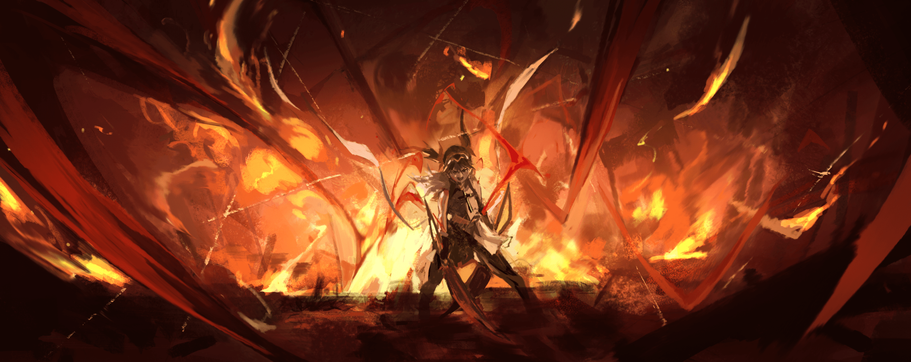
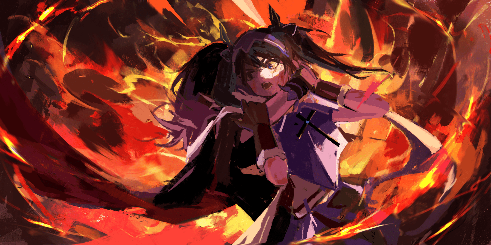

Доротеа Фезерран

Оливер Цеппес был всего лишь скромным работорговцем.

В Священном Королевстве Густеко торговля рабами официально считалась запретным занятием, и такой деятельностью нельзя было заниматься открыто.

Однако для Оливера работорговля была истинным призванием.

В суровых землях Густеко всегда существовал огромный спрос на рабов, как на рабочую силу.

Большинство из них не получали образования и не знали иного способа выжить, кроме как физическим трудом.

Поэтому Оливер искренне верил, что профессия работорговца, сводящая рабов с покупателями и приносящая выгоду обеим сторонам, могла сделать многих счастливыми.

Хотя Церковь строго запрещала это, он считал, что именно эта работа могла спасти тех, кого не в силах было спасти даже Учению Святой Церкви.

В каком-то смысле, работорговец спасал больше людей, чем догмы Церкви Святого Короля, управлявшей Священным Королевством.

Такова была философия Оливера Цеппеса, его гордость и убеждение — его подход к усердному выполнению обязанностей работорговца, оценщика людей.

Всё это ради счастья всех, кто связан с работорговлей, и, конечно же, его собственного благополучия.

И всё же…

— Стой, стой, стой, да подожди же ты! К-к-как ты снова здесь оказалась?!

Сумерки поглотили городской свет, и в комнате, освещённой тусклым пламенем свечи, Оливер побледнел, покрылся холодным потом и содрогнулся.

Он только что вернулся домой после работы, выпив по пути бутыль вина.

Сегодня он хоть и не заключил крупной сделки, но успешно завершил выгодную операцию, передав рабыню щедрому постоянному клиенту.

Рабыня умела читать и писать.

В купеческом доме, куда она попала, к ней, вероятно, будут хорошо относиться, и со временем она сможет выкупить себе свободу.

Пока есть работа, есть и пропитание.

Для рабов каждый день — это вопрос выживания.

Вот в таком приподнятом настроении, насвистывая, он вернулся в свою комнату и собирался прыгнуть в кровать, мечтая о безмятежном сне, как вдруг столкнулся с ней.

Девушка с чёрными волосами, сидевшая на кровати Оливера и мило улыбавшаяся, — когда-то его товар, да к тому же ужасно проблемный, залежавшийся товар.

— Э-Э-Эльза?!

— Давно не виделись, Оливер. От тебя пахнет выпивкой, не слишком ли много ты выпил?

Удивлённый Оливер посмотрел на девушку — Эльзу, которая склонила голову набок.

Увидев её обнажённое белое плечо и чёрные волосы, ниспадавшие заплетёнными косами, Оливер сглотнул.

Не от похоти, а по более простой причине — от страха, или, вернее, от неприятного озноба.

Весёлое алкогольное опьянение вмиг улетучилось от шока новой встречи.

— А-а-а, не тебе указывать мне, сколько пить! И вообще! Ответьте на вопрос! Какого чёрта ты здесь?! Н-н-неужели…

— Хм, как ты думаешь, почему?

— Перестань загадывать загадки! Ох, чёрт возьми, что за напасть!

Оливер обхватил голову руками, проклиная своё невезение, а заодно и Эльзу, стоявшую перед ним.

Но проклятия ничем не помогали — это и было худшим в этой проблемной девчонке.

В конце концов, он знаком с этой девушкой, Эльзой, с тех пор как только начал заниматься работорговлей, ещё будучи новичком…

— Это уже в тринадцатый раз! Ты возвращаешься ко мне уже в тринадцатый раз! Каждый раз, как тебя покупают, с покупателем случается несчастье… В-вот, чума ходячая!

— Я не такая уж и ужасная. Не преувеличивай, Оливер.

— Да ты ещё и не осознаёшь этого! Я тебя ничуть не хвалю! Ты ведь понимаешь, да?!

Оливер, рыча от бессмысленных ответов Эльзы, рухнул на колени.

От этого бестолкового обмена репликами он понял: Эльза снова вернулась к нему.

Как он только что и сокрушался, Эльза была постоянно возвращающимся товаром среди рабов.

Обычно рабы, которых продавали, никогда не возвращались в руки работорговца.

Бывали случаи, когда покупатель просил о возврате, но в большинстве случаев это не одобрялось.

Судьба большинства рабов решалась в тот момент, когда их покупали.

Оставалось лишь то, как они проживут и умрут у нового хозяина.

…Но из любого правила есть исключения.

Например, если покупатель по какой-либо причине внезапно умирал, и не было причин удерживать раба, его могли продать обратно работорговцу по низкой цене.

По этой причине существовали несчастные рабы, которые снова становились товаром без ясного будущего и впадали в отчаяние, но случай Эльзы был из ряда вон выходящим.

— Сколько же я натерпелся из-за тебя… Сколько раз меня поносили за спиной, будто я специально подсовываю покупателям опасных рабов, чтобы они убивали своих хозяев и крали ценности… И вот, я только-только подумал, что развеял эти слухи!

— Ты делаешь такие ужасные вещи? Это плохо. Тебе следует извиниться.

— Да я не делаю ничего такого! Я этого не делал, а меня всё-равно подозревают из-за тебя!

Для Оливера, который стремился вести честный работорговый бизнес, такие слухи были точно удар под дых.

Но сама Эльза, как ни в чём не бывало, возвращалась к Оливеру всякий раз, когда с её покупателями случалось несчастье.

— Боюсь, я снова доставлю тебе неприятностей, Оливер.

— И так, начнём с самого начала. Этот покупатель был одной из важных шишек Святой Церкви. Вот почему я подумал: на этот раз всё получится…

— Да, верно. Я думаю, ты не виноват.

— Церковь Святого Короля — это те, кто устанавливает правила в этой стране! Представь, люди, запрещающие работорговлю, сами захотели раба. Естественно, они собирались обращаться с ним бережно. И всё же, всё же!…

Покрасневший Оливер отчаянно повалился на кровать и залпом осушил бутыль дешёвого вино.

Он вернулся домой после успешной сделки, предвкушая приятный вечер с хорошим вином, но встреча с Эльзой, похоже, мгновенно испортила ему настроение.

Оливер, промочив воротник пролитым вином, продолжал жаловаться и бормотать обиды.

Эльза, наблюдая за ним, прищурила свои чёрные глаза и расслабленно улыбнулась.

Их знакомство с Оливером длилось, наверное, уже четыре года.

Эльза не считала, но по его словам, она вернулась к Оливеру уже тринадцать раз.

Её привычка возвращаться была совсем не шуточной.

Оливеру было около двадцати семи лет, он отличался медно-рыжими волосами и мягкими чертами лица.

Для человека, занимающегося работорговлей, в нём преобладала не жёсткость, а скорее какая-то подавленность.

На самом деле, Оливер совершенно не переносил насилия, а его необыкновенное красноречие, которое помогло ему до сих пор выживать, было его главным достоинством.

Впрочем…

— Такая особенность совершенно бесполезна против тех, кто не слушает других…

— Да, непросто иметь дело с теми, кто тебя совершенно не слушает.

— Я говорю о тебе! Ты совершенно не понимаешь сарказма, ну в самом деле!

К добру или к худу, но его главный талант никогда не действовал на Эльзу.

Однако Эльза доверяла этому шумному, пессимистичному человеку.

Вероятно, потому что он был единственным, кто протянул руку помощи окровавленной девочке в ледяной пустыне.

Если бы не его своеобразная доброта, Эльза, несомненно, умерла бы.

— Поэтому я и полагаюсь на тебя во всём. Если хочешь кого-то проклинать, прокляни себя.

— Обычно такие слова говорят тому, кто получает по заслугам за свои злодеяния! А я совершил добрый поступок, и меня прокляли? Я что, богач какой?!

— Мне кажется, считать, что богатых проклинают просто за их богатство, — тоже своего рода предрассудок…

Не отвечая на слова Эльзы, Оливер закрыл лицо ладонями и некоторое время постанывал.

Перестав стонать, он медленно поднялся.

Затем он искоса взглянул на Эльзу, сидящую рядом с ним на кровати, и тихо спросил: — …Итак, что с тобой на этот раз случилось у покупателя?

Это было его обычное поведение.

После долгих жалоб и проклятий в адрес судьбы Оливер снова начинал расспрашивать Эльзу об обстоятельствах.

Эти четыре года, несмотря на то что Эльза постоянно доставляла ему хлопоты, Оливер всегда прислушивался к её словам.

Словно это было его кредо как работорговца.

Поэтому и ответ Эльзы на его вопрос не менялся на протяжении всех этих четырёх лет.

— …Ничего особенного. Просто с покупателем случился несчастный случай.

— …Что ж, если так, то хорошо. Нет, совсем не хорошо. Ох, чёрт, а ведь он был хорошим клиентом!

— Да, думаю, он был хорошим клиентом. Из всех, кому мне доводилось быть проданной, у него, определённо, были самые комфортные условия. Поэтому мне тоже жаль.

Услышав безразличные слова Эльзы, Оливер громко вздохнул.

— Что такое?

— Могу я спросить тебя кое о чём, Эльза? В конце концов, твой ошейник снят. Так почему ты снова возвращаешься ко мне? Разве не лучше было бы отправиться куда-нибудь?

— Ты имеешь в виду «куда хочешь»?

— Да-да, именно так.

— Тогда так я и сделала.

Оливер нахмурился, когда Эльза, приложив руку к груди, произнесла это.

Он переварил её слова, которые можно было бы назвать даже признанием в любви, а затем…

— Ты ведь не влюблена в меня, верно?

— Ты говоришь о любви между мужчиной и женщиной? Тогда я больна. Добровольно продаться от любимого мужчины к другому, а потом раз за разом возвращаться, когда с ним что-то случается… Это страшно.

Оливер снова вскрикнул и встал.

Он залпом допил остатки бутылки вина, вытер рот и поднял голову.

На его лице уже не было печали.

С решимостью во взгляде Оливер кивнул: — Понял.

— Раз уж ты всё равно вернулась, ничего не поделаешь. С другой стороны, товар вернулся сам. Стоит считать, что я снова смогу заработать.

— Разве такие мысли не ведут к распространению слухов о тебе как о беспринципном работорговце?

— И это говорит источник всех бед! Почему ты не можешь просто стать счастливой! Чёрт, и ради чего я занимаюсь работорговлей, если не…

Оливер, приложив руку ко лбу, устало пробормотал эти слова.

Его слова «стань счастливой» — Эльза знала, что это его истинное желание, обещание, которое она слышала бесчисленное количество раз за эти четыре года.

Оливер Цеппес был наивным человеком, который пытался сделать людей счастливыми через работорговлю.

Именно потому, что он был таким человеком, Эльза и не собиралась искать другого работорговца.

— Что?

— Это твоя любимая фраза, но не мог бы ты поскорее сделать меня счастливой? А то я устала ждать.

— Если ты думаешь, что стоит просто подождать, и попутный ветер сам принесёт счастье, то ты глубоко ошибаешься! Я лишь хочу сказать, что тебе тоже придётся приложить усилия, чтобы стать счастливой!

Оливер, выплюнув слова, вскрикнул и снова набросил на себя сюртук.

Он направился к двери комнаты, и затем оглянулся на Эльзу, оставшуюся на кровати:

— Я буду всю ночь перерабатывать план продаж, а ты оставайся здесь. Ты уже достаточно всё переворотила, так что никаких лишних движений!

Строго приказав это и не допуская возражений, он с шумом удалился.

Проводив его взглядом, Эльза пожала плечами, а затем скользнула на кровать.

Она сильно устала, пока добиралась сюда.

Сейчас ей хотелось хотя бы немного отдохнуть и восстановиться.

В этом смысле поведение Оливера, не расспрашивающего особенно подробно о её делах, было весьма кстати.

Даже если это просто его характер — не углубляться в неприятности, для Эльзы это было спасением.

И вот, в тот самый момент, когда Эльза закрыла глаза, чтобы немного отдохнуть.

— …Вот мой улов.

С этими словами на белый стол швырнули нечто, издавшее отвратительно влажный шлепок.

Это был разорванный в клочья труп животного — охотничьего пса, которого держали в особняке Фезерран и выпустили в погоню за беглянкой.

Вокруг трупа собрались сёстры из особняка Фезерран, где Эльза провела короткое время покоя.

Пять сестёр, без Эльзы, сидели за столом в столовой, глядя на труп.

— Все остальные гончие тоже были убиты. Можно с уверенностью сказать, что ей удалось сбежать.

— Ты уверена, что она выбралась именно через подземный водный канал колодца?

— У выхода из канала лежали мёртвые псы. Я сама прошла по тому же пути, так что она точно выплыла оттуда. Чёрт возьми.

Орнеа, поправив зелёное платье, глубоко вздохнула.

Чтобы проследить путь сбежавшей младшей сестры, Орнеа прошла по водному каналу тем же способом, что и Эльза.

Она смогла сделать это… то есть, она уменьшилась до немыслимых размеров и, полагаясь на течение воды, совершила невозможное.

Это было невероятно жестокое испытание, но Орнеа, опираясь на свои способности, сумела его выполнить.

Поразительнее всего было то, что Эльза сделала это первой.

— В отличие от меня, что не чувствует боли, Эльза чувствует её сполна… И всё же самой отделить свою голову от тела — это безумие.

— Но она это сделала. Как и подобает «Сёстрам Фезерран»…

— …Она мне не сестра.

Разговор между угрюмыми Орнеей и Ситонией прервал недовольный, хриплый голос.

Это Доротеа, уставившись в пустоту, произнесла эти холодные слова.

Она сжимала стол в столовой так, что тот скрипел, и продолжала бормотать проклятия.

В её мутных глазах яростно клокотала ненависть к сбежавшей Эльзе.

— Ох, Хильда, похоже, Доротеа в гневе, хи-хи.

— Да, Эльза поступила очень глупо, Сария.

Близнецы хихикали, перешёптываясь, искоса поглядывая на Доротею.

Ситония, наблюдая за обменом репликами своих легкомысленных сестёр, подпёрла подбородок рукой и тяжело вздохнула.

— Ситония, я понимаю твои чувства, но что нам делать? Отец погиб. А наше положение…

— …Будет плохо, если начальство узнает, что Отец скончался.

Ситония резко прервала пессимистичное замечание Орнеи.

Услышав это, Орнеа широко раскрыла глаза, словно поняв замысел старшей сестры, и кивнула.

— Поняла, я согласна. У меня нет возражений. Другими словами…

— Отец, Холосео Фезерран, жив. Будем придерживаться этой версии.

— …! Ситония!

Доротеа, которая до этого смотрела в пустоту, возразила против принятого решения.

Доротеа, единственная из сестёр, искренне любившая Холосео, не могла принять жестокого решения, принятого старшей и второй сёстрами.

— Она убила Отца!… Мы должны немедленно сообщить начальству, и вся Святая Церковь Густеко начнёт поиски Эльзы!

— И что будет, если мы найдём сбежавшую Эльзу? Заставим её расплатиться за убийство Отца? А что потом будет с нами? Что будет с «Сёстрами Фезерран»?

— …!

— Судьба неконтролируемых «Проклятых Кукол», потерявших своего Кукловода, очевидна, — они закончат свою жизнь в «Святилище Запретных Таинств». Это ясно как день.

Никто не сможет удержать под контролем неподвластные аномалии.

Свобода Ситонии и остальных будет отнята, и они никогда больше не увидят света дня.

— Мы не можем оказаться в таком же положении, как и Отец. Или ты хочешь отомстить Эльзе и вместе с сёстрами сбежать от Святой Церкви? Ты хочешь провести остаток жизни в бесконечных бегах?

— Н-но ведь…

— Доротеа, я скажу тебе заранее. Я согласна с мнением Ситонии. Поэтому, если ты против…

Орнеа, глядя на настаивающую Доротею, громко хрустнула костяшками своих пальцев.

Это была немая угроза, и Доротеа, поняв её, сглотнула.

Если она вступит в конфликт с Орнеей, сильнейшей из «Сестёр Фезерран», Доротеа никак не сможет победить.

Её просто задавят, и её мнение будет подавлено.

— А С-Сария и Хильда…

— Почему ты такая глупышка, Доротеа?

— Конечно, мы с Сарией согласны с Ситонией. Ничего не поделаешь, хоть это и прискорбно.

Умоляющие слова Доротеи совершенно не тронули близнецов.

Сария и Хильда, замкнутые в своём собственном мирке, ничуть не были взволнованы фактом смерти Холосео.

Их беспокоило лишь то, чтобы не попасть под контроль Святой Церкви и не быть запечатанными.

Это, похоже, было общей позицией Ситонии и остальных, и никто не говорил о мести за Холосео.

— Все мы в долгу перед Отцом. Спору нет. Поэтому месть свершится. Но это сделает не Святая Церковь… Это сделаем мы.

Ситония, с тихим голосом, произнесла это, сопереживая дрожащей Доротее.

Они обманут Церковь и скроют факт смерти Холосео.

Однако это не означало, что они пренебрегали им, создателем «Сестёр Фезерран».

Они обязательно заставят Эльзу, виновницу, понести должное наказание.

— Похоже, Доротеа, пока удовлетворена.

Сестринский совет закончился, и Орнеа обратилась к Ситонии, оставшейся в столовой.

Доротеа, Сария и Хильда покинули свои места, и в комнате остались только старшая и вторая сёстры.

Две сестры, связанные самыми долгими узами, теперь должны были определять курс действий Фезерран.

Холосео больше не было.

Сначала…

— Ты действительно собираешься мстить за Отца? Ради Доротеи?

— …А ты как думаешь, Орнеа?

— …Судя по твоим словам, это было всего лишь удобное объяснение.

Орнеа, проведя пальцами по своим зелёным волосам, отвернулась с горьким выражением лица.

Ситония не стала опровергать слова своей сестры.

Да и не смогла бы.

Зависимость пятой из «Сестёр Фезерран», Доротеи, от Холосео была глубокой и сильной.

Если бы Ситония не сказала так, Доротеа, вероятно, не смогла бы сохранить рассудок.

Но на самом деле Ситония не собиралась мстить за Отца.

Это было не из-за бессердечия, а потому, что она отдавала приоритет более реальным проблемам.

— Чтобы обмануть начальство, нам нужно как можно быстрее освоить все знания Отца. К счастью, у меня было много возможностей сопровождать Отца в его делах, но…

— Нельзя постичь всего, что было у него в голове. Извини. В этом отношении я вынуждена полностью полагаться на тебя.

— В этом нет проблем. Однако в обязанностях я буду полагаться на тебя больше, чем когда-либо прежде.

— Я понимаю… Изначально, эту ответственность я хотела разделить с Эльзой.

Орнеа, скрестив свои короткие ручки, пробормотала это с печальным выражением на лице.

Слушая её, Ситония свела свои красивые брови и потёрла переносицу.

Невероятно жестокое деяние Эльзы, произошедшее так внезапно, словно сдвинуло все шестерёнки с места.

Она недоумевала, как всё дошло до такого.

— Ситония, я на твоей стороне.

Орнеа ободряюще произнесла это старшей сестре, которая была охвачена бурей тяжёлых эмоций.

В руке младшей сестры был зажат знак сестринства, который Ситония подарила ей.

Маленький мешочек с ароматным камнем, такой же Ситония подарила всем своим сёстрам.

— И Эльза не была исключением.

— Её мешочек…

— Его не было ни в комнате, ни в подземном канале. Его можно было носить даже во рту из-за его размера. Возможно, она всё ещё держит его при себе.

— …И если так, что она задумала?

Если она убила своего великого благодетеля Холосео, вступила в смертельную схватку с сёстрами, включая Ситонию, приняла грандиозное решение терпеть нечеловеческую боль и сбежать, но при этом не рассталась со знаком сестринства…

Тогда грань между здравомыслием и безумием для неё окончательно стёрлась.

— …И всё же, ты так ценишь его, Орнеа.

— Н-н-ну… Что ты…

— На этом мешочке видны следы многократных починок.

Поскольку они были знакомы дольше всех, Орнеа получила этот знак самой первой.

И хотя с того момента, как они стали сёстрами, прошло всего несколько лет, можно сказать, что их связывают намного более глубокие узы, чем обычных сестёр.

Именно поэтому их крах нужно было предотвратить любой ценой.

— Не волнуйся. Не только я одна вынуждена цепляться за это место. Доротеа, конечно, а также даже Сария и Хильда.

— Эльза тоже скоро это поймёт. И когда это произойдёт, она будет жалеть, что совершила такую глупость. Возможно, она и сейчас где-нибудь дрожит от страха.

Орнеа, спрятав мешочек за пазуху, представила такую возможность.

Эльза, которая не могла знать о результатах сестринского совета, возможно, до сих пор думала, что её преследуют, и проводила бессонные ночи с страхе погони.

Возможно, это было даже более жестоко, чем простая месть.

Если она будет бояться ночи, то это станет хотя бы небольшим утешением для почившего Холосео.

Но с другой стороны, Орнеа думала и так:

— Если бы она была такой милой девчушкой, она бы не совершила такой дерзкой выходки…

— Эльза… Я действительно не могла понять её мыслей. То, что она заставляет меня думать о ней так же, как о Сарии и Хильде, само по себе ненормально.

Эльза, живущая по непонятной философии, была ещё сложнее для понимания, чем близняшки, замкнувшиеся в своём мирке.

В конечном счёте, казалось, что причина этой ситуации кроется в непреодолимой пропасти между ней и сёстрами.

— В любом случае, мы придумаем, как иначе убедить Доротею. Сейчас наш главный приоритет — преодолеть этот кризис всем сёстрам вместе.

— Принято.

Орнеа слабо хмыкнула, бросив на прощание:

— …Ты не ошибаешься, Ситония.

Услышав это необоснованное утешение, Орнеа увидела, как Ситония слабо улыбнулась.

После этого младшая оставила её одну в столовой, отправившись по своим делам, как и другие сёстры.

А направилась Орнеа прямиком в часовню — на место смерти Отца.

Чтобы скрыть смерть Холосео, его тело уже было перемещено из часовни.

Поскольку Доротеа хотела этого, обработка тела была полностью поручена ей.

Поэтому Орнеа увидела лишь часовню, тщательно очищенную от крови, с единственным смрадом смерти.

— Эльза, что ты задумала?

Не для того, чтобы молиться или каяться, Орнеа лишь задала этот вопрос своей отсутствующей младшей сестре.

— Ничего не задумала, — ответила Эльза на вопрос, откусывая сладкий хлеб, намазанный блестящим мёдом.

Услышав этот ответ, мужчина, Оливер, с кругами под глазами, презрительно скривил губы.

У него было довольно симпатичное лицо, но нездоровые круги под глазами и сильно искривлённые губы значительно портили первое впечатление.

Это происходило на следующее утро после того, как Эльза вернулась к Оливеру, во время совместного завтрака.

Оливер, который специально принёс завтрак в комнату, похоже, не спал всю ночь, как и говорил.

Даже Эльзе было немного неловко, что она, растрёпанная после сна, неторопливо завтракала в его присутствии.

Было неловко, но она ничего с этим не делала.

Как бы то ни было, слова, сказанные ею ранее, были ответом на его вопрос.

А именно…

— Я только что вернулась, едва живая. Я пока ни о чём не задумывалась.

— Да-да, конечно. Я, в общем-то, просто спросил. Всю ночь прикидывал то да сё и понял, что если я не выясню, что ты задумала, то никакие планы, чёрт возьми, не сработают.

— Хм, какой недальновидный.

— Это всё из-за тебя!

Оливер зарычал на Эльзу, но та лишь улыбнулась в ответ, медленно слизывая сладкий мёд с пальцев.

Конечно, Эльза признавала старания Оливера.

Его постоянная преданность делу была его добродетелью.

Но это одно, а отсутствие у Эльзы хоть капли ответственности — другое.

Вздохнув от такого отношения Эльзы, Оливер почесал в затылке и сказал: — В общем…

— Как и раньше… Я не могу сразу выставлять тебя на продажу после возвращения. Нужно сначала убедиться, что все связи с предыдущим покупателем разорваны.

— Ты к этому привык.

— Ещё бы! Это уже сотый раз! Немногие работорговцы умеют так ловко сбывать «возвращенцев», как я. Кстати, чтобы было понятно, про сотый раз — это сарказм!

— Какой же у скверный характер…

И хотя они обменивались колкостями в привычной манере, Эльза не возражала против его планов.

Дело было не столько в том, что она доверяла его навыкам работорговца, сколько в отсутствии других вариантов.

К тому же, даже Эльза считала, что ей нужно на некоторое время залечь на дно.

Пока было совершенно непонятно, как поступят «Сёстры Фезерран»…

— И всё же, на этот раз ты продержалась дольше всех прошлых…

— Да. Примерно полгода, наверное? Это было хорошее место.

— Это я понимаю. Ты и сама немного изменилась. Стала такой… женственной.

Оливер, глядя на Эльзу, сидевшую на кровати в лёгкой одежде, высказал свою честную оценку.

В его взгляде не было ни капли мужской похоти.

Был лишь чистый взгляд оценщика, взгляд работорговца, который оценивал свой товар.

По сравнению с тем временем, когда Эльза встретила Оливера впервые, она значительно выросла.

Её рост и конечности заметно увеличились, а на груди и бёдрах появились женственные изгибы.

А дни, проведённые в поместье Фезерран, превратили Эльзу в ещё более роковую женщину.

Если вспомнить о роли «Сестёр Фезерран», то прекрасная внешность тоже была одним из необходимых качеств.

Красота влияла на успех их миссий.

Способность усыпить бдительность противника была важным оружием, как ни крути.

Вот почему «Сёстры Фезерран» были собраны из сплошных красавиц.

— …Как ни странно, это так. Конечно, предстоящие трудности суровы так, что хоть за голову хватайся, но давай посмотрим на это с другой стороны: теперь у тебя развязаны руки. А потому…

— Что мне делать?

— Как я уже сказал, я не выставлю тебя на продажу. Но и удерживать не буду. Можешь свободно гулять по городу… Можешь даже исчезнуть, если хочешь.

— Не волнуйся. Я вернусь до наступления темноты.

Конечно, Эльза понимала сарказм Оливера, но не зацикливалась на нём.

Оливер, демонстративно вздохнув, встал и начал готовиться к выходу.

— Куда ты идёшь?

— К счастью, я распродал всех рабов, что были у меня на руках. Нужно закупить новых… И меня пригласили на небольшой пир. Поболтаю там с важными клиентами. С едой как-нибудь разберись сама.

Говоря это, Оливер выхватил из-за пазухи мешочек с деньгами и бросил ей.

Приняв его, она по ощущениям в ладони поняла, что там изрядная сумма.

Сумма, которую ни в коем случае нельзя было так беззащитно отдавать рабыне.

— Всё равно ведь не воспользуешься.

— Да, верно. Как хорошо ты меня знаешь.

— Ведите себя прилично! Пожалуйста!

На этот её сарказм Оливер очень рассердился и с грохотом выскочил, торопливо шагая.

Проводив его взглядом, Эльза пожала плечами.

Затем она посмотрела в окно и проверила ощущение мешочка в руке.

Хоть Оливер и сказал так, сидеть целый день в четырёх стенах не лучшим образом сказывалось на её настроении.

— Давно не выходила, может, прогуляться по городу?

Иннорандум, «Столица Снежных Равнин», был одним из крупнейших городов, принадлежащих Священному Королевству Густеко.

Даже в Густеко, большая часть которого покрыта вечной мерзлотой, количество снегопадов, однако, различалось.

Иннорандум считался особенно снежным регионом среди городов, и если в других городах земля могла проглядывать из-под снега в большей или меньшей степени, здесь же такое было невозможно.

Однако Иннорандум располагался на огромной «Священной Земле» по сравнению с другими городами, и холод здесь ощущался не так сильно, и влияние сильных морозов было ослаблено.

В дни с мягкой погодой снег шёл безостановочно, поэтому жители, привыкшие к этому, часто выходили на улицу.

И сегодня погода была именно такой.

— Сегодня тепло, поэтому народу много, — прогуливаясь по утоптанным заснеженным улицам, Эльза выпустила небольшое облачко пара, наблюдая за толпой.

В редкие погожие дни на улицах часто появлялись уличные торговцы.

Поскольку они работали только в светлое время суток, Эльза, привлечённая ощущением оживления, перекусила в одном из ларьков.

Мясо нанизывалось на железные шампуры, обильно поливалось соусом и жарилось на мощном огне — это было впечатляющее зрелище.

Эльза, привлечённая пламенем, которое служило приманкой для толпы, купила несколько шашлыков и ела их на ходу.

Вообще-то, Эльза тоже беспокоилась о будущем и иногда пыталась найти свой путь.

— Ну, будь что будет.

Идя в таком настроении, Эльза заметила, что на неё кто-то поглядывает.

Проследив за взглядом, она увидела, что на неё смотрят обычные мужчины.

Почувствовав в их взглядах некий оттенок желания, Эльза облизала губы, испачканные соусом.

Раньше она особо не обращала на это внимания, но, похоже, сейчас она выглядела очень привлекательно в глазах противоположного пола.

Было ли это из-за её взросления или из-за тренировок в особняке Фезерран?

— Похоже, меня и вправду преследуют. Зря я не накинула капюшон, чтобы скрыть лицо.

Перед отъездом Оливер специально оставил ей сменную одежду, и среди неё был плащ с капюшоном.

Однако сегодня была такая тёплая погода, что она по неосторожности проигнорировала его заботу.

— Я бы поняла тебя гораздо быстрее, если бы ты объяснил мне это словами…

И вот, перекладывая ответственность за свою оплошность, Эльза свернула в переулок, где земля оставалась холодной и обледеневшей.

Она сама направилась в безлюдную сторону, а достигнув тупика, обернулась.

И затем…

— По-моему, невежливо толпой преследовать одинокую девушку. У вас есть ко мне какое-то дело? — спросила Эльза, перед которой в тот же переулок вошли пятеро мужчин.

По их внешнему виду было ясно, что ни один из них не занимался «светлыми» профессиями.

Они, видимо, были удивлены, что Эльза заметила слежку, и не скрывали своего смятения, услышав её вопрос.

…Нет, был только один человек, который не дрогнул.

— Подумать только, такую барышню на хвост посадить… старею, что ли?

— Да? Я не думаю, что это твоя вина. Я заметила вас из-за другого господина. Может, если я объясню, какого именно, это вызовет ссору?

— Нет, спасибо за заботу, хе-хе. Так вот, слушай.

Мужчина, который не дрогнул, вероятно, главарь этой группы.

Высокий, с бородой, он неторопливо оглядел Эльзу с головы до ног.

— Барышня, ты знаешь Оливера Цеппеса?

— …Как лучше всего ответить?

— Эй ты, отвечай на вопрос Старшого! Иначе… Гха?!

Эльза замешкалась с ответом на вопрос бородатого мужчины, а тут рассерженный член его банды попытался поторопить её, но был схвачен за подбородок кулаком Старшого.

Мужчина сильно прикусил язык и, истекая кровью, скорчился от боли.

— Мы тут с барышней разговариваем, ясно? А ты знай своё место, чёрт тебя побери.

Борода, хлопнув ладонью по голове скрючившегося подчинённого, извинился перед Эльзой: — Извини.

— И за слежку, и за недостаток воспитания у моих людей. И да, мы знаем, что ты, барышня — это кто-то из окружения Оливера. Ты же из его дома вышла, да? И вот что главное… В том доме, где ты живёшь, только ты и Оливер, что ли?

Не понимая смысла вопроса, Эльза нахмурила свои красивые брови.

Увидев её реакцию, Борода провёл по губам и сказал: — Стыдно признаться, но рабыня, которую я купил у Оливера, сбежала. А если рабыне некуда идти, то первым делом она возвратится к нему.

— Это странно. Если раб сбежал от покупателя, он ведь будет пытаться сбежать и от работорговца, верно? А не возвращаться к нему…

— Но Оливера ведь называют «Домом возвращенцев». Обычные правила работорговли не действуют на него. Барышня, вы ведь это понимаете, да?

Подмигнув одним глазом, Борода осклабился.

Это был взгляд, способный запугать обычного человека и заставить его отступить, но, к сожалению, для Эльзы он был не страшнее лёгкого ветерка.

Однако отрицать слова Бороды было трудно.

Похоже, он был наслышан об Оливере, так что обманывать его ложью не имело смысла.

В таком случае, всё, что Эльза могла сделать…

— Вашу проблему с Оливером я поняла. Однако в том доме нет никого, кроме меня. Оливер тоже ушёл, так что дом совершенно пуст.

— Могу ли я доверять твоим словам?

— Если не можешь довериться, почему бы тебе не зайти и не посмотреть самому?

Теперь пришла очередь Бороде удивляться предложению Эльзы.

Однако, с точки зрения Эльзы, она не помнила за собой никаких проступков, поэтому ей нечего было бояться.

Оливер, вероятно, рассердился бы, если бы узнал, что она без разрешения пустила кого-то в дом, пока его не было, но поскольку она развеивала излишние подозрения в его отсутствие, у него не было причин жаловаться.

— Что ж, тогда воспользуемся твоим предложением. Рад, что барышня такая сговорчивая.

— Дух взаимопомощи очень важен. В следующий раз вам придётся помочь мне. Вы ведь будете сотрудничать, верно?

— Хах! К тому же, и кишка не тонка. Красотка, да ещё с перчинкой. Моему молодняку у тебя поучиться бы.

Бородач покосился на спутников, и те лишь понуро кивнули. Эльза не поняла, насколько унизительно для них было то, что их товарища избили, а им самим велели брать пример с какой-то девчонки.

— Ну, насилие — это рабочий способ исправления. Со мной тоже так поступали.

— Ого, с барышней? Оливер не похож на того, кто будет так поступать.

— Это было в другом месте. Мне даже шею ломали.

— Ва-ха-ха-ха-ха! Вот это да!

Видимо, подумав, что это шутка, Борода громко расхохотался и хлопнул по колену.

— Что ж, проведи нас. Не волнуйся, если твои слова подтвердятся, мы тут же смоемся с глаз долой.

— Да, конечно. Буду вам очень признательна. Что ж, пойдёмте.

С этими словами Эльза повела мужчин обратно к дому Оливера. Она собиралась впустить их внутрь, доказать, что искомой рабыни у них нет, и вежливо выпроводить восвояси, но…

— Ох.

…В комнате Оливера, на кровати, свернувшись калачиком, сидела беловолосая девочка.

Разумеется, для Эльзы это тоже стало полной неожиданностью. Однако мужчины жили не в том мире, где можно было рассчитывать на снисхождение и готовность выслушать оправдания.

А потому…

— Что ж, давайте спишем всё на обоюдное невезение.

Прежде чем Борода успел выхватить из-за пазухи кинжал, стальной шампур пронзил тыльную сторону его ладони. Пригвоздив его руку к стене, Эльза хлестнула ногой ему по шее.

В глазах у него помутилось, и сознание Бороды начало угасать. Остальные, как и в прошлый раз в переулке, пришли в смятение, увидев, как их Старшой был повержен в одно мгновение.

— Мне и вправду очень жаль.

И так, одно за другим, жестокие удары Эльзы погрузили сознание мужчин во тьму.

Будь то аристократ, джентльмен или священнослужитель — на светских приёмах ценится умение улыбаться, а в этом Оливеру был дан настоящий дар от природы.

— Добрый вечер, давно не виделись. Как ваше самочувствие? Поясница больше не беспокоит?

— Дела идут как нельзя лучше. Благодаря вам, спрос не иссякает.

— Непременно позовите меня в следующий раз! Откроем припасённую для особого случая бутылочку!

Менять тему разговора в зависимости от собеседника — это само собой разумеющееся, но Оливер, вдобавок к этому, менял и саму суть своей улыбки.

Иногда она успокаивала, иногда выказывала почтение, а порой демонстрировала непоколебимую уверенность — так он находил путь к сердцу любого собеседника.

Эта улыбка, удовлетворяющая сокровенные желания каждого, и была его исключительным талантом как работорговца.

Работорговец и блестящий светский приём — кому-то такое сочетание может показаться взаимоисключающим, но в любом деле связи решают всё.

Тем более, когда твои клиенты — люди более чем состоятельные. Напротив, для Оливера было совершенно естественно регулярно появляться в подобных местах.

Однако…

— …Похоже, сегодня я в пролёте.

Оглядывая зал, где проходил фуршет, Оливер тихо пробормотал себе под нос.

Сегодняшний день выдался неудачным как для поиска новых клиентов, так и для пополнения товара. Он обошёл нескольких знакомых поставщиков в надежде приобрести новых рабов, но подходящих кандидатов хорошего качества так и не нашлось.

Оливер ставил условие: раб должен быть алмазом, который засияет после огранки. Так что сегодня с закупкой не сложилось.

Да и собравшиеся на приёме едва ли могли стать перспективными деловыми партнёрами. В лучшем случае можно было пообщаться со старыми клиентами и обменяться парой светских любезностей.

На сегодняшнем вечере было много представителей Святой Церкви Густеко. А их учение, в свою очередь, запрещает рабство, так что открыто говорить о своих делах здесь было нельзя. Оливер планировал вдоволь насладиться беседой и выпивкой, а затем поскорее удалиться.

Дело было не только в профессиональной этике работорговца, но и в том, что оставленная дома «бомба» не давала ему покоя. Бомба, которая могла взорваться в любой момент, унеся с собой в адское пламя всё и вся.

— Умоляю, веди себя смирно хотя бы полдня…

— …Почтенный господин.

Поглощённый мыслями об Эльзе, Оливер не сразу заметил подошедшего и среагировал с опозданием. Он поспешно обернулся на зов и уже собирался было изобразить улыбку, когда…

…Он встретился взглядом с пустыми глазницами стоявшего перед ним человека и затаил дыхание.

Но оцепенение длилось лишь миг. Оливер тут же пришёл в себя и натянул на лицо улыбку. В то же время он лихорадочно рылся в памяти, пытаясь вспомнить, кто перед ним.

«Представитель Святой Церкви Густеко, имя…»

— Господин Холосео, я весьма признателен за ваше покровительство в прошлый раз.

Точно, Холосео. Холосео Фезерран.

Человек, связанный со Святой Церковью Густеко и, судя по его виду, занимающий довольно высокое положение. Когда-то он был клиентом Оливера и купил у него не кого иного, как Эльзу.

При виде Холосео в душе Оливера воцарился полный сумбур. Эльза ведь говорила, что с покупателем случилось несчастье, и потому она вернулась к нему…

Тогда почему Холосео стоит перед ним, целый и невредимый?

— Ну, как она? Хорошо ли справляется со своей работой?

Однако Оливер подавил внутренние сомнения и нагло задал вопрос, решив посмотреть на реакцию собеседника.

— …!

Реакция последовала, но не столько от Холосео, сколько от стоявшей рядом с ним девушки с синими волосами и в синем платье. Её он тоже помнил. Холосео приводил эту девушку с собой, когда забирал Эльзу.

Девушка с миловидной внешностью теперь сверлила Оливера невероятно свирепым взглядом. Если бы ненависть обладала жаром, то Оливер, казалось, вспыхнул бы целиком под этим испепеляющим взглядом.

— …Она исполняет свой долг как Фезерран.

Из-за этого Оливер на мгновение замешкался с ответом на слова Холосео. Поняв, что речь идёт о работе Эльзы, он вновь обрёл самообладание.

— В таком случае я очень рад. Я и сам доволен, что у нас получилась такая удачная сделка. Как насчёт… если представится возможность, может, вы снова воспользуетесь нашими услугами?…

— Я подумаю. …В тот раз вы хорошо поработали.

Бросив лишь эту фразу, Холосео холодно повернулся к работорговцу спиной.

Будь это деловые переговоры, Оливер бы сокрушался о провале, но сейчас он понимал: эта встреча с Холосео была проверкой. Он вовсе не искал повода для новой сделки.

Доказательством тому служил полный ненависти взгляд его спутницы, не отпускавший Оливера до самого конца.

— Хоть я и сумел выкрутиться на месте…

Что же такого натворила Эльза в особняке Холосео? Да и вообще, она ведь говорила, что с ним случилось несчастье.

И пусть его пустые глазницы по-прежнему производили жуткое и нездоровое впечатление, Холосео был определённо жив. Это явно противоречило словам Эльзы.

— Эх, и без того тошно было, а тут ещё и это.

Если появились те, кто разыскивает Эльзу, Оливеру придётся пересмотреть свои дальнейшие действия.

Это — Священное Королевство Густеко. Страна, где люди живут под знаменем Святой Церкви.

Конфликт с высокопоставленным лицом Церкви никак не входил в его планы на счастливое будущее.

— О, с возвращением. А ты раньше, чем я думала.

Когда Оливер, прервав встречу, спешно вернулся домой, Эльза встретила его совершенно невозмутимым тоном.

От её абсолютно спокойного вида, будто ничего не произошло, Оливер на миг даже понадеялся, что всё увиденное — лишь обман зрения. Но, конечно, это было не так.

Просто эта девушка, Эльза, была из тех, кто сохраняет хладнокровие даже посреди кровавой бойни.

— Ч-ч-ч-что…

Едва открыв дверь, Оливер почувствовал запах крови, и дурное предчувствие охватило его. Хоть он и был слабаком в драках, жизнь работорговца не позволяла держаться в стороне от насилия. Запах крови был ему неприятен, но, увы, привычен.

Как и множество сваленных в кучу мужских тел…

— Ах, не пойми меня неправильно. Я их не убивала. Всего лишь оглушила.

— Фух, слава богу. Раз не убила, то я спокоен… Да как бы не так! Почему… почему всего за полдня всё дошло до такого?!

Оливер так торопился домой, чтобы расспросить Эльзу о встрече с Холосео, но гора незнакомых тел лишила его всякого хладнокровия.

Он лишь хотел, чтобы проблемы перестали сыпаться на него одна за другой. Он был обычным человеком и мог решать их только поочерёдно.

— Эльза! Кто эти люди? Откуда ты их притащила?

— Понятия не имею. Я их не знаю. Поэтому…

— Поэтому?

— Думаю, лучше всего спросить у той, кто может быть в курсе.

Сказав это, Эльза кивнула в другой конец гостиной — в противоположную сторону от горы тел. Оливер проследил за её взглядом и замер от удивления.

Там, обхватив колени руками, сидела девочка с белыми волосами. И эта девочка была ему знакома. Ещё бы, ведь она была его товаром.

— Татьяна?! А ты почему здесь?…

— …!

Услышав своё имя, беловолосая девочка — Татьяна — подняла голову.

С глазами, полными слёз, она бросилась Оливеру на грудь. Он инстинктивно поймал её лёгкое тельце и стал гладить по спине.

— Месяц назад тебя ведь забрала семья Рексант? Что ты здесь делаешь?…

— Похоже, эти люди гнались за ней, когда она сбежала. А она, не зная, к кому ещё обратиться, прибежала к тебе, — пояснила Эльза.

— Эта шайка гналась за Татьяной?…

— Как и ожидалось от «Торговца Возвратами»… Видимо, не я одна к тебе возвращаюсь.

— В твоей иронии слишком много яда…

Держа Татьяну на руках, Оливер перевёл взгляд на лежащих мужчин. Он не узнавал никого из этих людей, которые валялись без сознания с закатившимися глазами.

В этот момент Эльза сказала: «Подожди минутку», — и поднялась на второй этаж.

Вскоре она вернулась…

— А этого узнаёшь?

Эльза притащила за собой крепко сложенного бородатого мужчину. Судя по синякам на лице и торчащему из руки шампуру, на втором этаже ему пришлось несладко. Но даже в таком плачевном состоянии Оливер с трудом смог опознать его.

— Ты же… из дома господина Рексанта… Значит, Татьяна и вправду сбежала.

— Д-да… Мне приказали вернуть её… но эта барышня помешала, вот и результат.

Еле дыша, бородач осел на пол. Теперь не оставалось сомнений, что и его, и остальных мужчин избила Эльза.

Оливер как-то не задумывался, но неужели она стала сильнее? На его вопросительный взгляд Эльза лишь недоумённо склонила голову набок.

— В общем, ситуация ясна. Так, Татьяна сбежала от господина Рексанта, а Эльза отметелила тех, кто за ней гнался… я всё правильно понял?

— …Да, всё так.

— Похоже на то, — равнодушно подтвердила Эльза, словно речь шла не о ней.

Но если так, то проблема была в другом.

— Тогда, Татьяна… почему ты сбежала?

— Татьяна?

— …

На вопрос Оливера Татьяна, сидевшая у него на руках, не ответила. Вернее, не смогла ответить.

Заподозрив неладное, Оливер опустился на колени, чтобы оказаться с ней на одном уровне. Он посмотрел ей прямо в глаза и сказал:

— Татьяна, сними одежду. Сейчас же.

— …

Повинуясь приказу, Татьяна молча скинула с себя единственную белую рубашку, которая была на ней надета. То, что в такой холод она ходила в одной рубашке, уже было достаточно прискорбно, но её нагое тело превзошло все ожидания.

На смуглой коже Татьяны, в незаметных местах, было бесчисленное множество свежих шрамов.

Месяц назад, когда она была его товаром, этих ран не было. А значит, они появились за последний месяц — сомнений быть не могло.

— …Это я во всём виноват. Поступил как последний дурак. Какой из меня после этого работорговец.

Оливер извинился перед Татьяной за то, что его чутьё подвело, и крепко обнял её. Уткнувшись ему в грудь, девочка больше не могла сдерживаться, и слёзы хлынули из её глаз.

Оливер всегда старался проводить сделки так, чтобы подобного не случалось. Но вот она, реальность. Его ошибка безжалостно изранила юное тело и душу Татьяны.

То, что она перестала говорить, было доказательством пережитого ею ужаса.

— …Я заставлю их заплатить.

— …И как же? Оливер, что ты можешь сделать?

— Я обращусь в гильдию и…

Подняв голову, Оливер ответил на вопрос, но его слова оборвались на полуслове. И неудивительно. Трудно заставить других поверить в то, во что ты сам не веришь до конца. Тем более эту черноволосую дефектную рабыню, обладавшую сверхъестественным чутьём на чужую ложь.

— Я могу заставить преследователей замолчать, но это всё равно тупик, — усмехнувшись, Эльза бросила взгляд на Бороду и остальных мужчин, с иронией оценивая положение Оливера.

Действительно, раз уж Эльза всё так устроила, заставить этих головорезов замолчать навеки было несложно. Но на этом всё и заканчивалось.

Покупателем Татьяны был Хайкен Рексант — отпрыск знатного рода, из поколения в поколение занимавшего высокие посты в Святой Церкви Густеко. Он с самого начала не собирался вести с работорговцем равные переговоры.

…Но Оливер не мог просто так проглотить обиду и смириться с тем, что его рабыню жестоко истязали.

— Это противоречит моим принципам.

— …Хе-хе, и что же ты тогда будешь делать?

Эльза шагнула вперёд и испытующе заглянула Оливеру в лицо. В её затягивающих чёрных глазах читалось ожидание — она ждала его решения.

Она ждала его приказа. Было ли это из симпатии, в качестве благодарности или просто из прихоти — он не знал.

Не знал, но ему было не по душе, что эта девчонка с невозмутимым лицом постоянно одерживала над ним верх.

— Ты всё обо мне да обо мне, Эльза, но и за тобой ведь гонятся.

— О, речь обо мне? И кто же это за мной гонится?…

— Сегодня на приёме были тот мужчина, что тебя купил, и его спутница. Я уж было подумал, что ошибся, но нет. Такого приметного человека ни с кем не спутаешь.

Говоря это, Оливер постучал пальцем по своему веку. Эльза, видимо, поняла, что он намекает на отсутствующие глаза Холосео.

— …

Услышав это, Эльза впервые с момента своего возвращения показала искреннее недоумение.

— Эльза?

— …Нет, я просто задумалась над одной странностью, но теперь всё прояснилось. И, возможно… возможно, мы сумеем разобраться с твоей и моей проблемой разом.

От неожиданных слов Эльзы Оливер удивлённо вскинул брови. В ответ Эльза сложила руки у груди и улыбнулась.

— Что ты имеешь в виду?

— Ты хочешь наказать того, кто причинил боль твоей рабыне. А я хочу мирно договориться с теми, кто, вероятно, меня преследует. …Думаю, мы можем решить обе проблемы одним махом.

— …И как же?

Сглотнув, Оливер приготовился выслушать предложение черноволосой девушки. Увидев его готовность, Эльза улыбнулась ещё шире и кивнула.

А затем, всё так же улыбаясь, сказала:

— Всё очень просто. …Оливер, продай меня тому нехорошему покупателю.

С самого начала это задание не вызывало у неё энтузиазма.

Вернее, если говорить об отсутствии энтузиазма, то дело было не только в сегодняшнем дне. В последнее время Доротеа не испытывала никакого рвения ни к своим обязанностям, ни к собственной жизни.

И всё же она продолжала выполнять поручения «Сестёр Фезерран», потому что это был единственный способ служить Холосео Фезеррану — человеку, который изменил её жизнь.

Холосео, убитый рукой Эльзы, с которым она больше никогда не сможет обменяться ни словом. Он был её благодетелем, её незаменимым приёмным отцом.

Но «Сёстры Фезерран» скрывали его смерть, делая вид, что он всё ещё жив, и продолжали свою деятельность.

Доротее это тоже не нравилось, но она понимала доводы Ситонии, которая опасалась за судьбу «Сестёр Фезерран», лишившихся покровительства Холосео.

Для Доротеи жизнь Ситонии и остальных не шла ни в какое сравнение с жизнью Холосео.

Однако, когда на другую чашу весов ложилась честь отца, она не могла действовать опрометчиво.

Он был убит Эльзой, «Проклятой Куклой», которой сам же и пользовался.

Какой бы ни была правда, если станет известно, что его убил собственный инструмент, честь Холосео будет втоптана в грязь. Все будут насмехаться над ним, забудут его заслуги и станут плевать ему в спину.

Доротеа, боготворившая Холосео, не смогла бы вынести такого унижения.

Ситония, руководившая сокрытием смерти их Отца, отлично справлялась. Благодаря её усилиям, Доротею стали чаще привлекать к заданиям, а её хрупкая внешность оказалась весьма востребованной.

Иронично, но секрет успеха заключался в том, что она перестала суетиться и отчаянно пытаться добиться результата, как раньше.

Так или иначе, вопреки настроению Доротеи, сегодня ей снова выпало задание.

Её мир утратил краски и тепло. Она знала, что остальные сёстры, включая Ситонию, не так сильно жаждали отомстить за Холосео, как она.

Доказательством тому служило то, что они больше сил вкладывали в поддержание «Сестёр Фезерран», чем в поиски Эльзы, убийцы Холосео. Изначально чувства Доротеи к приёмному отцу были сильнее, чем у кого-либо другого.

Никто по-настоящему не любил Холосео. Лишь она одна была его дочерью.

И так Доротеа, потеряв путь и вперёд, и назад, превратилась в живой труп, существующий лишь в воспоминаниях. Она бесконечно прокручивала в голове немногие моменты, проведённые с Холосео, согревая своё остывшее сердце.

— …

Поэтому…

— …Давно не виделись, Доротеа. Как ты? Хорошо поживала?

Когда в особняке, куда она прибыла на задание, её встретили этими словами, её мир впервые за долгое время вновь наполнился яркими красками.

Хайкен Рексант оказался на удивление лёгкой добычей.

Работорговец, продавший ему сбежавшую рабыню, в качестве извинения предложил прекрасную черноволосую девушку. Получив рабыню куда более высокого класса, Хайкен слишком уверовал в свою удачу.

Заполучив красивую и покорную рабыню, он пустился во все тяжкие, словно решил познать все прелести мира. Его легендарные кутежи и расточительство за короткий срок поглотили почти половину состояния семьи Рексант, которое он унаследовал.

Семья Рексант издавна поставляла своих людей на ключевые посты в Святой Церкви, и Хайкену в ближайшем будущем было предначертано стать частью её структуры.

Однако, как это часто бывает с избалованными аристократами, у людей, которым суждено такое будущее, много врагов.

И все они разом проявили себя на фоне его недавних кутежей.

Хайкен, погрузившись в бездумные развлечения, не слушал советов окружающих и продолжал прожигать жизнь — и в конце концов Святая Церковь отвернулась от него.

Было решено, что если его оставить в живых, он станет ядом для Священного Королевства Густеко. А тот, кто получает такую оценку, не может выжить в этой стране.

Так беспутной жизни Хайкена Рексанта пришёл конец…

— Значит, это тебя прислали в этот особняк.

Глядя на застывшую от изумления Доротею, Эльза обворожительно улыбнулась.

Они находились в личном кабинете Хайкена Рексанта. Вокруг стояли книжные полки, заставленные множеством книг, до которых их хозяину не было никакого дела.

Изначально семья Рексант занималась каталогизацией и хранением тайных знаний Святой Церкви, но теперь это стало пустой формальностью.

Хайкен совершенно не интересовался наследием своих предков. Поэтому Эльза без раздумий выбрала это место для воссоединения с сестрой.

Да, для долгожданного воссоединения сестёр.

Эльза знала всё о заданиях «Сестёр Фезерран». Она знала, что если создать проблему для Святой Церкви Густеко, они отправят своих агентов.

Поэтому она и использовала распутство Хайкена Рексанта в своих целях.

— …Почему? — вырвалось из горла Доротеи знакомым охрипшим голосом, пока она смотрела на поджидавшую её Эльзу.

Её голос дрожал от сильного потрясения, не давая другим эмоциям пробиться наружу. Слушая её, Эльза медленно склонила голову набок.

«Почему?» — слишком расплывчатый вопрос. Почему она это сделала? Почему ждала именно её? Почему, почему, почему…

— Наверное, потому, что это был самый быстрый способ поговорить с вами.

— …

— Я так отчаянно убегала, что не запомнила дорогу к особняку и не могла просто так заявиться к вам. Способов связаться тоже не было, вот и пришлось прибегнуть к такому окольному пути. Ты удивлена?

Существование «Сестёр Фезерран» было тайной за семью печатями, тёмной стороной Святой Церкви. Поэтому местонахождение их «Священной Земли» было никому не известно.

Эту тайну нельзя было раскрыть даже с помощью связей Оливера. Поэтому Эльза быстро оставила попытки найти «Священную Землю».

Её целью была не сама «Священная Земля», а живущие там сёстры.

Доротеа продолжала молча сверлить Эльзу взглядом. Однако по бушующей в её глазах буре эмоций было ясно, что она молчит не из-за раздумий над ответом.

В душе Доротеи бушевала ярость, её сутью была чистая, незамутнённая ненависть…

— …!

— Эльза-а-а-а…

— …Соскучилась?

Она склонила голову набок, и в тот момент, когда была произнесена непреднамеренная провокация, горло Доротеи издало рычание, а её фигура исчезла. Нет, она низко пригнулась и ринулась на Эльзу.

Из-за спины синего платья стремительно появились два длинных клинка. Они соединились прямо перед несущейся Доротеей, превратившись в огромные ножницы.

Ножницы, что раскроили плоть и кровь множества людей, и чью остроту Эльзе тоже довелось испытать. С этим оружием в руках, с глазами, полными жажды крови, Доротеа бросилась вперёд. Ощущая на себе всю ненависть пятой из «Сестёр Фезерран», Эльза спрыгнула со стола, на который опиралась.

Затем, легко коснувшись пола кончиками пальцев, она сказала:

— Я тоже хотела с тобой встретиться.

В тот же миг трещины, заранее оставленные на полу, расширились, и кабинет начал стремительно рушиться.

— Чт…?!

— Поэтому я тщательно подготовилась к нашей встрече.

Крик изумлённой Доротеи потонул в голосе Эльзы, которая знала, что падение неизбежно.

Внезапно лишившись опоры под ногами, Доротеа оказалась в ловушке невесомости, не в силах что-либо предпринять. Будь на её месте Орнеа, она бы с лёгкостью справилась с ситуацией при помощи своего кусари-фундо.

Но огромные ножницы Доротеи для этого не годились. Честно говоря, Эльза, хоть и смогла выманить «Сестёр Фезерран», не могла предугадать, кому именно поручат задание.

Так что то, что пришла именно Доротеа, неспособная справиться с этой ситуацией, было удачей Эльзы.

А то, что пришла именно Доротеа, с которой договориться было сложнее всего, было…

Падая вниз, Эльза, отталкиваясь от рушащихся книжных полок, стремительно сблизилась с Доротеей. Та, хоть и застыла на миг от удивления, уже пыталась развернуться в воздухе, чтобы сориентироваться, но было поздно.

Эльза нанесла прямой удар кончиками пальцев прямо в солнечное сплетение Доротеи. Её хрупкое тело сдавленно вскрикнуло и отлетело в сторону, утонув в водопаде из падающих книг.

Но неясность её судьбы длилась лишь мгновение. Огромные ножницы Доротеи разрубили и отбросили давившие на неё книжные полки, и она поднялась на ноги.

— …Выходи, Эльза! Ты и меня собираешься убить, как Отца?!

— Думаю, тут есть некоторое недопонимание.

Среди вихря изрезанных страниц, на крик Доротеи ответила Эльза. Она медленно вышла из-за нагромождения книжных шкафов и посмотрела на Доротею своими чёрными глазами.

В этих чёрных глазах вся фигура Доротеи искажалась от жара ненависти.

— Доротеа, я считаю, что лучше всего было бы, если бы мы не вмешивались в дела друг друга. Я позвала тебя сегодня, чтобы поговорить именно об этом. Хотя, если быть точной, не совсем тебя.

— Не вмешиваться?… После того, как ты устроила засаду и так тщательно подготовилась?

— Встречать гостей неподготовленной — это неуважение. К тому же, я предвидела, что дело закончится поножовщиной.

Эльза легко взмахнула рукой, показывая, что не собирается драться. Но это не успокоило Доротею, а, наоборот, лишь усилило её подозрения.

Сохраняя напряжённую атмосферу, готовую взорваться в любой момент, Доротеа продолжала сверлить Эльзу взглядом.

— …Так уж и быть, я выслушаю твою чушь. Что ты задумала?

— Я же сказала. Моё желание — взаимное невмешательство. Было бы прекрасно, если бы всё закончилось нашим расставанием в том особняке, но… вы, кажется, искали меня.

Здесь она сделала паузу и встретила взгляд Доротеи в упор.

— И я не думала, что, найдя меня, вы решите всё мирным путём.

— Естественно!… Ты убила Отца! Единственного человека в этом мире… который нашёл меня! А ты, ты…!

Доротеа, казалось, готовая слушать, вновь поддалась ярости и потеряла контроль над собой.

Вздохнув при виде этого, Эльза пожала плечами.

— Вот видишь, разговора не получается. Именно этого я и боялась.

— Хватит. Я больше не считаю тебя сестрой. …Я убью тебя, Эльза!

Взмахнув ножницами, Доротеа, переступая через обломки и книги, ринулась на Эльзу.

Синее платье девушки развевалось, её нечеловеческая скорость была проявлением сущности «Проклятой Куклы» — готовности не щадить собственное тело.

У Доротеи это проявлялось особенно ярко: она не колебалась, даже если её плоть будет раздавлена и разорвана на куски.

Это было доказательством того, что она ценила себя лишь через призму оценки Холосео.

А значит…

Это было доказательством её готовности пойти на всё, лишь бы быть полезной Холосео.

— …А?

— Ты не сможешь стать ни Орнеей, ни кем-либо из других сестёр.

По сравнению с предыдущим яростным криком, это было сказано едва слышно.

Прямо перед Эльзой Доротеа резко пошатнулась. Её тело потеряло равновесие. И неудивительно. Ведь оно было разрублено пополам на уровне талии.

Верхняя и нижняя части тела Доротеи, на лице которой застыло непонимание произошедшего, упали на пол почти одновременно.

Из разрубленного туловища хлынула кровь, и запоздалая боль заставила её закричать. Пронзительный, словно предсмертный хрип удушенной старухи, крик разнёсся по особняку.

— Ты слишком сильно поддалась эмоциям.

Среди этого крика Эльза прошла между двумя частями тела Доротеи и провела пальцами по воздуху.

Стальная леска, с которой едва капала кровь, была туго натянута на уровне груди Доротеи. Девушка сама на неё наскочила, и её туловище было разрублено пополам.

— Орнеа бы заметила. Ситония бы отступила в тот момент, когда что-то пошло не по плану. Не знаю, как поступили бы Сария и Хильда, но… ты попалась в ловушку.

— А-а-а-а…

— Если бы были отрублены руки или пальцы — это одно, но если разрублена талия, то регенерация невозможна. У тебя слабая способность к восстановлению, так что, полагаю, на этом всё?

Теряя внутренности из ровной раны, Доротеа отчаянно дёргалась. Но чем больше она двигалась, тем больше теряла крови, и ничего не могла поделать.

Приглашая сестёр в этот особняк, она соответствующим образом подготовилась к приёму.

— Я же говорила. Встречать вас неподготовленной было бы куда большим неуважением.

— …Ах, ты…

Приближающейся Эльзе Доротеа попыталась нанести удар ножницами, но та наступила ей на руку сверху, и, поскольку у неё не было нижней части тела для опоры, её атака была предотвращена.

Затем Эльза присела и заглянула в лицо Доротеи, искажённое яростью.

— Только не пойми меня неправильно.

— …Неправильно?

— Я делаю это не потому, что ненавижу вас. Наоборот, ты мне нравилась. Я радовалась, когда ты получала задания, словно это были мои собственные.

Сказав это, Эльза добавила:

— …Поэтому мне от всего сердца жаль, что всё так обернулось.

— …

Слова соболезнования от Эльзы заставили выражение лица Доротеи застыть.

Затем Доротеа прижалась лбом к полу и зарыдала, её горло издавало всхлипы. Эльза отвернулась от этого мучительного зрелища и вдруг заметила.

Нижняя часть тела Доротеи, лежавшая неподалёку, до этого лишь конвульсивно подёргивавшаяся, теперь дрожала иначе.

Бессмысленное, непроизвольное движение сменилось осмысленным.

— Это…

Почувствовав от этого изменения страх, Эльза напряглась.

В тот же миг кровотечение, уже ослабевшее, возобновилось с новой силой, и тёмно-красная кровь, словно проклятие, начала заливать пол. На глазах у изумлённой Эльзы ситуация изменилась ещё раз.

Хлынувшая кровь Доротеи превратилась в острые лезвия и устремилась к Эльзе.

— Кх!

Эльза отпрыгнула в сторону, уворачиваясь от летящих кровавых клинков. Но их скорость и сила, которые нельзя было определить на глаз, настигли её в полёте и коснулись белой кожи… и взорвались.

— Гх… кх! А-а-а!

Места, которых коснулись капли крови, взорвались, и из горла Эльзы вырвался пронзительный крик.

Кровь Доротеи, впитавшись в кожу, взорвала её изнутри. Правая рука и правая нога, почти половина тела, были изувечены, и от шока Эльза рухнула на пол.

Боль, острая, пронзительная боль. И пока Эльза корчилась от неё, на её лицо…

…с резким звуком опустился твёрдый каблук.

— Эльза-а-а!

На лице Эльзы, прижатом к полу, стояла Доротеа, с силой растирая его каблуком.

Доротеа, которая должна была быть разрублена пополам, смотрела на неё сверху вниз с выражением ненависти на лице, оскалив зубы.

Её тело, которое должно было быть разорвано, теперь было цело, и…

Лёжа на полу с раздавленным лицом, Эльза смотрела на неё снизу вверх.

— …Ты была разрублена пополам, как ты встала?

— Склеила кровью… и кровью. Я и сама удивлена… возможностям «Проклятой Куклы».

Услышав низкий, проклинающий старушечий голос, Эльза вспомнила недавние всхлипы Доротеи. Это были не всхлипы, а смех.

Ярость заставила Доротею смеяться, и ярость дала ей новую силу.

Это…

— Ты управляешь кровью и соединила ей своё тело… Восхитительно.

— Ты всё ещё держишься так самоуверенно… Я могу и не такое.

Сказав это, Доротеа полоснула себя ножницами по руке. Из запястья хлынула кровь, обильно смачивая живот Эльзы.

Учитывая предыдущее, неудивительно, если бы живот Эльзы взорвался изнутри от такого количества крови. Но цель Доротеи была иной.

В следующий миг впитавшаяся кровь Доротеи начала бушевать внутри тела Эльзы, разрывая его.

— Кх, у-у-у! А-а-а! А-а, а-а-а!

Даже визуально было видно, как плоть Эльзы разрывается кровью изнутри. Вид тёмно-красной крови, ползущей под чёрным платьем и белой кожей, был воплощением унижения.

Ощущение, будто тысячи маленьких насекомых бегают по всему телу. Причём эти насекомые с явным намерением пытать причиняли Эльзе боль, носясь по всему телу с острыми лезвиями.

От адской агонии, будто тысячи насекомых терзают её изнутри, Эльза закричала.

— У-гх, а-а-а-а-а-а-а!

— Ну как? Как? Как? Как, как, как, как! Ну как?!

В глазах всё стало красным, мозг перестал обрабатывать даже её собственный крик. В этом шуме всё сущее стало далёким и непонятным.

Каблук Доротеи всё ещё с силой давил на лицо Эльзы, но эта боль была ничто по сравнению с кровавой пыткой, бушующей внутри её тела.

Ситуация полностью перевернулась. Доротеа смотрела на Эльзу сверху вниз и кровожадно хохотала.

Даже будучи разрубленной пополам, Доротеа не оставила волю к борьбе. Именно эта одержимость пробудила в её теле новые возможности.

— Ну как, Эльза! Мучайся! Кричи! Ради Отца! Ты…!

— …!

У ног Доротеи, всё ещё повелевавшей кровью, Эльза резко взмахнула ногой. Кончик её длинной, гибкой ноги устремился к виску Доротеи. Но та увернулась, склонив голову.

Однако, воспользовавшись секундной заминкой, Эльза выскользнула из-под ног Доротеи. Упорно перебирая четырьмя конечностями, словно зверь, она покинула комнату, заваленную обломками кабинета.

— Какая живучая…! Думаешь, я тебя отпущу?!

Доротеа бросилась в погоню за сбежавшей Эльзой, переступая через обломки. И тут её щеку, когда она наклонилась вперёд, рассекло что-то острое.

Она увидела, что это та же стальная леска, что разрубила её пополам. Одна из множества лесок, натянутых в пространстве, снова, не зная меры, полоснула её по щеке.

— …! Какая же ты мерзкая тварь!

Воя от ярости, Доротеа выпустила из раны на запястье кровавые клинки и перерубила стальную леску. Но её гнев на этом не утих, и разрушение от кровавых клинков не прекратилось.

Чтобы уничтожить подлые ловушки Эльзы, кровавые клинки неистовствовали в комнате, бушуя во всех направлениях и силой сокрушая всё на своём пути, включая стальные лески.

После этого она собиралась броситься в погоню за Эльзой, но…

— Гхы…

Её туловище пронзил выпущенный спереди железный кол, и Доротеа, захлебнувшись кровью, кашлянула, вываливая ещё больше разорванных внутренностей наружу.

Она с ужасом обернулась и увидела, что это была ещё одна ловушка, подстроенная так же, как и стальные лески — железный кол, который выстреливал при перерезании лески.

Эльза методично и хладнокровно готовилась убить «Сестёр Фезерран».

— …!

Вытащив железный кол, она разрубила его кровью. Свежую рану на туловище она запечатала кровью и, волоча за собой огромные ножницы, вышла из комнаты.

Эльзы в коридоре не было, но капли крови указывали путь. К тому же, даже на расстоянии она чувствовала, как её собственная кровь терзает Эльзу.

Следуя за кровавым следом и покалыванием своей крови, Доротеа преследовала Эльзу. По пути ей встречалось множество ловушек, включая стальные лески и железные колья, но она проламывалась сквозь них, не останавливаясь.

Так она ворвалась в комнату, где скрылась Эльза, разрубив дверь.

— Столовая…

Оглядев пространство с длинным столом и рядами стульев, большинство из которых никогда не использовались, Доротеа поймала себя на неуместной мысли о том, почему столовые во всех особняках выглядят одинаково.

— Почему во всех особняках столовые так похожи друг на друга?

Голос, угадавший её мысли, заставил Доротею обернуться.

В дальнем конце столовой, у двери, ведущей в другую комнату, стояла Эльза. Доротеа подумала, что та снова собирается сбежать через эту дверь, но Эльза закрыла её за спиной, отрезав себе путь к отступлению.

— …Передумала бежать?

— Я уже почти привыкла к боли. И продолжать бегать бессмысленно, я всё равно не смогу от тебя оторваться, ведь так?

— Вот как. Тогда умри здесь с честью. Ради Отца…!

И одновременно с этим она обрушила на неё всю мощь своей крови.

— Какие бы ловушки ты ни приготовила, я смету их все!

Бушующие кровавые клинки разрубили стол и устремились к неподвижно стоящей Эльзе. Доротеа, превозмогая боль в собственном теле, отпрыгнула в сторону, и её кровавые клинки, следуя за предательницей, должны были отрубить ей ноги, и, обездвижив её, она собиралась провести комбинацию и довести дело до конца.

И в этот момент…

Взметнувшееся пламя залило взор Доротеи алым.

— …

Ошеломлённая жаром пламени, Доротеа застыла на месте.

В тот же миг из-за огненной завесы вылетел столовый нож, нацеленный ей в лицо.

Едва увернувшись, Доротеа собиралась было развеять это пугающее пламя.

Но в момент, когда она собиралась это сделать, сквозь огненную завесу прорвалась ещё одна тень.

Это была…

— Теперь я наконец-то смогу дать сдачи.

— …! ЭЛЬЗА-А-А!

Не обращая внимания на то, что сама сгорит, Эльза перепрыгнула через пламя и вцепилась в Доротею. Та инстинктивно приказала крови взорвать её руки, но выражение лица Эльзы не изменилось. С хищным блеском в глазах она схватила Доротею за шею и повалила на пол.

Затем, прижав девушку к полу, Эльза выбила у неё из рук огромные ножницы, лишив оружия. Но на этом всё не закончилось.

— Моё оружие…!

Даже без ножниц, её кровь могла стать оружием, способным убить Эльзу.

С выражением ярости на лице, Доротеа посмотрела на Эльзу и приказала своей крови, текущей в её теле.

Она знала, что регенерация «Проклятой Куклы» всё восстановит. Значит, можно было с размахом, не жалея жизни, искромсать её внутренности и заставить корчиться в муках.

И кровь Доротеи действительно попыталась это сделать, бушуя в теле Эльзы…

— К сожалению, я этого не позволю.

Сразу после этих слов Доротеа почувствовала, как на неё вылили огромное количество какой-то жидкости. Этой жидкостью облили не только её, но и Эльзу, которая вылила её себе на голову.

Резкий запах ударил в нос, и на мгновение Доротеа замерла, осознав, что это за жидкость.

Это был крепкий алкоголь с сильным запахом. И причина, по которой Эльза облила себя им в такой момент, была одна.

— А теперь давай посоревнуемся в выносливости.

— Пос…

«Постой!» — хотела крикнуть Доротеа, но было уже поздно.

Эльза, всё ещё лежа на ней, протянула руку назад, схватила горящую скатерть с длинного стола и притянула к себе. В следующий миг пары алкоголя вспыхнули.

С оглушительным рёвом пламя охватило их, сжигая тела Доротеи и Эльзы.

Алое пламя опаляло кожу двух девушек, сжигало их одежду, волосы, уничтожая прекрасные черты лица, оставляя подпалённый череп. Пытаясь спастись от этой невыносимой боли, Доротеа извивалась, взывая к своей крови.

Но кровь поглощалась жаром пламени, теряя свою силу и исчезая. Сколько бы сверхъестественной силы она ни вкладывала, кровь оставалась кровью. Против огня она была бесполезна…

— ГЬЯ-Я-Я-Я-Я-Я-Я-Я-Я…!

Эта мысль сгорела в пламени и погасла.

Кричащее горло обожглось, и голос, который был её комплексом неполноценности, исчез. От крика лёгкие расширялись в поисках кислорода, и вдыхаемый жар сжигал внутренности, оплавляя кости.

Глазные яблоки лопнули от жара, язык и слизистые покрылись кипящими пузырями. Белая кожа мгновенно почернела, длинные синие волосы, прекрасное платье того же цвета — всё поглотило неистовое пламя.

Но… но, как можно выдержать такую боль?

— Ха-ха… ха-ха-ха-ха-ха-ха!

Она слышала безумный хохот Эльзы, которая горела точно так же, прямо над ней.

Как можно смеяться от такой адской боли? Почему она смеялась? Нет, она знала почему. Её младшая сестра, Эльза, была сумасшедшей. Она это знала.

Даже «Сёстры Фезерран», которым была уготована нелёгкая судьба, не могли понять Эльзу. Не могли принять. Не могли признать.

— Ты не Фезерран…!

Она сгорает. Уступая в регенерации, Доротеа не сможет оправиться от тех же повреждений, что и Эльза.

Когда пламя утихнет и ситуация успокоится, у неё не останется никаких козырей. Поэтому, если и наносить ответный удар, то только в этот момент. Превозмогая сжигающую боль, завладевшую её разумом, она воспылала жаждой мести.

Она должна была отомстить за убитого Холосео, преодолев даже этот всепоглощающий жар.

— Сдохни…!

Собрав последние силы, Доротеа прижала ладонь к животу Эльзы. Кровь, выделившаяся наружу, сгорала в пламени. Значит, нужно было выстрелить кровью прямо в тело Эльзы, из руки.

Если раздавить её сердце, то шанс на победу ещё есть.

Прицелившись, она выстрелила кровавой пулей в сердце Эльзы. Кровь должна была пронестись по телу и уничтожить её сердце прежде, чем её сожжёт пламя…

— …Какая жалость.

Она потеряла дар речи.

Доротеа видела, что лицо Эльзы, обожжённое до неузнаваемости, почти превратившееся в голый череп, всё ещё улыбалось своей обычной улыбкой.

Как всегда, злобная улыбка, словно насмехающаяся над всем миром.

На глазах у онемевшей Доротеи, Эльза, чтобы остановить кровавую пулю, прибегла к немыслимому методу — она вспорола себе живот.

— А-а, а-а-а, А-А-А-А-А…!

— Мне грустно, Доротеа… На этом наша сестринская ссора заканчивается.

Распоров себе живот рукой, испытывая боль от сжигаемых внутренностей, она подставила смертельную кровавую пулю под разъедающее пламя.

И Эльза, улыбаясь сквозь агонию, сказала:

— Ах, у меня мурашки по телу.

И, дрожа от жара, она сгорала заживо.

Особняк Рексантов был охвачен пламенем и рушился, не оставляя и следа.

Пейзаж горящего особняка, построенного на «Священной Земле», посреди тонкого снежного покрова был почти фантастическим. Падающий снег окрашивался в алый цвет, освещая тёмный и белый мир.

Люди, потрясённые трагедией, случившейся в особняке известного в городе человека, могли лишь в оцепенении наблюдать за происходящим издалека.

— …

Вне поля зрения этих зевак, по переулку рядом с горящим особняком босиком шла тень. Это была нагая девушка, испачканная чёрной сажей.

Она пряталась от посторонних глаз, но не из-за стыда за свою наготу, а из чисто практических соображений, чтобы её не остановили.

Доказательством тому было то, что, выйдя из переулка и заметив ожидавшего её мужчину, она, нисколько не прикрываясь, с улыбкой помахала ему рукой.

— Оливер, ты всё-таки меня дождался.

— …И почему только эта девчонка возвращается голой?… Прикрылась бы хоть немного.

— Это невозможно. Всё в особняке сгорело, да и времени на это не было.

На невозмутимый ответ Эльзы Оливер лишь приложил руку ко лбу. Но, похоже, он оставил попытки добиться от неё внятного ответа, снял свой пиджак и бросил его голой Эльзе. Та поймала его и с благодарностью надела.

— Голая девушка в мужском пиджаке… Кажется, это наоборот привлечёт странных личностей.

— У тебя полно таких бесполезных знаний, которыми ты никогда не пользуешься… Но надо же, как ты там всё разнесла.

— Я не собиралась устраивать пожар, но так уж вышло. Будут проблемы с оправданиями перед семьёй Рексант?

— Об этом можешь не беспокоиться. Заказ на устранение проблемного сынка поступил от главы семьи Рексант… отца господина Хайкена.

Раскрыв тёмные тайны, окружавшие Хайкена, Оливер скривился.

Ему было не по себе от того, что он использовал своего клиента, поэтому он не мог искренне радоваться успеху плана.

Но сочувствия к тому, кто жестоко обошёлся с его рабыней, он не испытывал. В этом и заключался компромисс этого неловкого мужчины.

— Так что, ты добилась своего?

— Да… Но переговоры провалились. Я проиграла пари.

Глядя на догорающий вдали особняк, Эльза вздохнула, сетуя на свою неудачу.

В тот день Эльза сделала две большие ставки. Первая — появятся ли «Сёстры Фезерран» в особняке Рексантов.

И вторая — кому из сестёр поручат убийство Хайкена.

В первой ставке, на приход «Сестёр Фезерран», она выиграла. Но вторую проиграла. Если бы это была Ситония или Орнеа, можно было бы договориться.

— Я думала, что из всех сестёр с Доротеей договориться будет сложнее всего… И, как и ожидалось, так и вышло.

— Это было обоюдное несчастье для обеих сторон… нет, для неё это было одностороннее несчастье.

— Мне тоже было очень больно, знаешь ли.

— Сравнивать себя, победительницу, с той, кто лишился жизни, — это уже слишком жестоко по отношению к ней, Эльза.

На слова Оливера, пожавшего плечами, Эльза согласилась, что, пожалуй, так оно и есть.

В конце концов, Эльзе тоже было жаль, что всё закончилось поножовщиной. Она расставила в особняке множество ловушек, но одно дело — это одно, а другое — другое…

— И всё же это было опасно…

В финальной схватке Доротеа, овладевшая искусством манипуляции кровью, была сильным противником. Если бы она обрела эту силу не в последний момент и не была бы так самонадеянна, Эльза бы проиграла. К тому же, большая потеря крови не позволила бы ей сохранить ясность ума.

— Что было, то прошло… Пора уходить. Раз Доротеа, которая хотела меня убить, мертва, остальные сёстры, скорее всего, отступят.

— Хотелось бы на это надеяться. С меня хватит такого.

На главной улице собирались не только зеваки, но и люди для тушения пожара. Если их заметят Рыцари-Аколиты, связанные со Святой Церковью, неприятностей не избежать.

Эльза и Оливер воспользовались заранее подготовленным путём отхода и скрытно удалились от особняка. По пути Эльза один раз обернулась и подумала о Доротее, которую оставила в горящем доме.

Девушка, которая стеснялась своего хриплого голоса и не любила открывать рот. Она так усердно выполняла порученную ей работу, и сад, за которым она ухаживала, был прекрасен.

Зная эту трудолюбивую Доротею, Эльза от всего сердца сожалела.

— Если бы ты тоже простила и забыла всё, это было бы лучше всего.

Но это были пустые слова, и, пробормотав их, Эльза покачала головой.

— Эльза! Хватит мечтать, надо бежать! Давай, сюда, сюда!

— Да, я знаю.

Не давая ей времени на сантименты, Оливер позвал её, и Эльза, ответив, снова зашагала.

С тяжестью от убийства сестры на душе, Эльза шла по заснеженному городу.

Игнорируя суматоху в своём сердце, с душой, омрачённой тёмными чувствами, она шла по городу.

Белый город… и Эльза прошла по нему.
