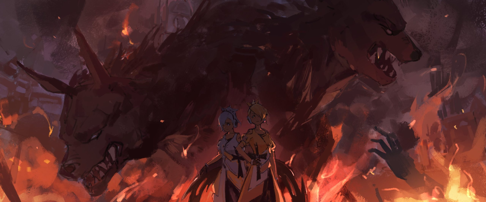

Сария и Хильда Фезерран

— …Из пепелища удалось извлечь лишь самую малость уцелевшего, — сообщила Ситония сдавленным голосом и разложила находки на обеденном столе.

В белую ткань был завёрнут странный, почерневший и обугленный предмет. С первого взгляда трудно было понять, что это, но запах гари и смутные очертания постепенно проясняли картину.

Это был фрагмент человеческой кости, некогда принадлежавший одной из их сестёр.

— Это и есть Доротеа?… — потрясённо прошептала Орнеа, взяв с ткани костяной осколок. Её лицо окаменело.

Ситония, скрыв волнение, ничего не ответила. Её молчание было красноречивее всяких слов.

Оно подтверждало страшную догадку: их застенчивую синеволосую младшую сестру нашли мёртвой — ужасным, обгоревшим до неузнаваемости трупом.

— …Что же случилось с Доротеей? Хильда волнуется.

— Сария тоже не находит себе места. Что же стряслось с Доротеей? — Даже Сария и Хильда, обычно жившие в своём мирке, заметно побледнели, узнав о трагедии.

Трагедия, постигшая «Сестёр Фезерран», была немыслима. Сёстры были существами, своего рода бессмертными. И надо же — их смогли убить…

— Даже если бы она столкнулась с элитой рыцарей-аколитов, её было бы не так-то просто одолеть. Почему же всё обернулось именно так?…

— Есть лишь одно объяснение. Противник знал, как убить «Проклятую Куклу».

— …! Не может быть, неужели противник…

Лицо Орнеи изменилось, она вскинула голову.

Ситония посмотрела сестре прямо в глаза и медленно, тяжело кивнула. Убийца Доротеи… На ум приходило лишь одно имя.

— …Эльза, — в унисон произнесли Сария и Хильда.

Эльза, одна из «Сестёр Фезерран»… вернее, бывшая сестра. Это она убила Холосео, сбежала из особняка Фезерран, а теперь отняла у них и Доротею.

Но зачем, зачем ей понадобилось идти на такое?

— Хи-хи… Интересно, эта девчонка собирается перебить и нас с Хильдой? — протянула Сария.

— Хи-хи… Какая несносная девчонка. Подумать только, она решила извести даже нас с Сарией, — вторила ей Хильда.

— Постойте! Как бы то ни было, это слишком поспешный вывод! Мне тоже никто, кроме неё, на ум не приходит, но…

Орнеа попыталась возразить близнецам, уже, казалось, вынесшим приговор, но холодный взгляд Ситонии и её твёрдое «нет» пресекли её попытку.

Ситония, глядя на осколок кости на столе — жалкие останки Доротеи, — сказала:

— Сначала Отец, теперь Доротея. Логично предположить, что цель Эльзы — уничтожить всех нас.

— Да разве она способна на такие хитроумные планы?!

— Может, всё это было лишь игрой с её стороны. Разве мы можем утверждать, что хорошо знаем Эльзу? В конце концов, если её цель — наши жизни…

— Может, она чья-то марионетка, а?

— Многим, вероятно, поперёк горла само наше существование как «Сестёр Фезерран».

Сария и Хильда, сложив руки на груди, поддержали Ситонию. Та, в знак согласия с их метким замечанием, кивнула Орнее.

Орнеа попыталась было возразить, но Ситония сказала:

— Орнеа, я знаю, что ты питала к Эльзе какие-то надежды. Но нельзя закрывать глаза на факты. …Доротею убила Эльза.

— Кх…

— Сария и Хильда правы, Эльза не могла спланировать это в одиночку. Должны быть сообщники и тот, кто дёргает за ниточки. Если мы их не выявим, проблему не решить в корне.

Ситония, коснувшись подбородка, вздохнула, признав, что у них есть враги.

Они и так с трудом делали хорошую мину при плохой игре, скрывая смерть Холосео.

В такой ситуации потеря Доротеи стала тяжёлым ударом. Как с точки зрения боевой мощи, так и для их сестринского единства.

И всё же Доротеа изо всех сил старалась сохранить единство сестёр. Пусть даже это было продиктовано её привязанностью к Холосео, а не тёплыми чувствами к сёстрам.

— …Слушай, Ситония. Не могла бы ты поручить проблему с Эльзой нам с Хильдой? — предложила Сария.

— Да, — точь-в-точь повторила за ней Хильда.

Ситония на мгновение замешкалась с ответом. Она полагала, что близнецы, как обычно, останутся в стороне, и была немало удивлена, когда они сами вызвались помочь.

— Вы собираетесь действовать? — удивилась Орнеа. — Какая муха вас укусила?

— Ну, Орнеа, это ты зря, — сказала Хильда. — Хильда ведь тоже одна из сестёр. Так что проблему с Эльзой можешь доверить нам с Сарией.

— У Сарии тоже есть свои соображения, — добавила Сария. — А ты, Орнеа, та ещё язва.

Орнеа с сомнением посмотрела на близнецов, которые недовольно надули губки и потёрлись щёчками. Ситония, словно желая прервать их, сложила руки на груди.

В любом случае, Ситония и Орнеа как «Сёстры Фезерран» и так были по горло в делах.

— Если вы двое прикроете этот фланг, это будет очень кстати. Но как вы собираетесь действовать?

— Это мы поручим Хильде.

— Сарии это не по силам.

Уверенный вид близнецов заставил Ситонию задуматься, но затем она кивнула. Хотя они и жили в своём замкнутом мирке, у них, несомненно, были свои сильные стороны.

— Что вам нужно?

— Ничего. Мы справимся сами, — уверенно произнесла Хильда.

— Ах, но, может, от нас будет несколько просьб, как думаешь, Хильда?

— …Нет, лучше так: мы выведем всех собак из особняка. И, конечно же, ту самую большую собачку тоже.

С этими словами близнецы хлопнули в ладоши.

Ситония не была уверена, что сможет положиться на вечно хихикающих Сарию и Хильду, но всё же приняла их предложение.

Близнецы одарили Ситонию притворной улыбкой, принимая её согласие, но Ситония чувствовала их скрытые намерения. И всё же молча кивнула.

— Если это поможет отомстить Эльзе за нашу сестру, то я даю своё разрешение. Осечки быть не должно.

— …Ах.

Несколько дней спустя, когда шум вокруг дела Доротеи утих, Эльза застала Оливера за необычным для него занятием: он дремал в кресле. Это вызвало у неё лёгкое недоумение.

Эльза, вернувшись на базу, залечивала раны. Она сидела на кровати, прислонившись к спинке. Рядом с ней стоял белый цветок — подарок юной Татьяны.

Татьяна принесла его, чтобы порадовать Эльзу, а потом убежала обратно к Оливеру. Эта девочка-рабыня многое пережила и нашла у Оливера приют. Впрочем, для него она была не просто спасённой, но и своего рода товаром.

Во всяком случае, Эльза не собиралась ни вникать в её дела, ни сближаться с ней.

— Но зачем цветок?

— Э… Эм…

— Понятно. Цветок очень красивый, — Эльза слегка наклонила голову, обращаясь к Татьяне, которой явно было трудно выражать свои мысли.

Как только Оливер умудрялся с ней общаться?

— Она, кажется, хочет, чтобы ты это приняла. Примерно так, — сказал проснувшийся Оливер, потягиваясь в кресле.

Он обратился к Эльзе, стоявшей посреди комнаты: — Ты и сама поймёшь, если присмотришься.

Взглянув на Эльзу и Татьяну, стоявших друг напротив друга, Оливер, казалось, о чём-то размышлял, но в итоге лишь пожал плечами.

— Эта малышка тебе так благодарна. Когда я рассказал ей, что ты проучила того негодяя-хозяина, который так жестоко с ней обращался…

— И поэтому она благодарна мне? Этот цветок — выражение её чувств?

— Ага, — кивнул Оливер.

— У-у-у, — энергично закивала Татьяна в ответ на слова Эльзы и ещё сильнее протянула цветок. Эльза переводила взгляд с цветка на Татьяну, протягивающую его, и обратно, а затем вздохнула.

Осторожно взяв цветок из рук Татьяны, она сказала:

— Спасибо. Рада я или нет — другой вопрос, но благодарность свою выражу.

— Ну так порадовалась бы просто! Что за манера так говорить?!

— Я просто честна с собой. Можешь использовать это как рекламный слоган, когда будешь меня продавать в следующий раз.

Бросив это с невозмутимым видом, Эльза принялась внимательно разглядывать полученный цветок.

Это был маленький полевой цветок с белыми лепестками. Самый что ни на есть обыкновенный, но в этом промёрзшем Священном Королевстве Густеко даже такой простой полевой цветок — уже большая редкость.

В отличие от культурных растений, полевые цветы не выживают, если для них не сложатся все необходимые условия, так что этот был поистине редким экземпляром.

— И надо же ему было попасть ко мне… Невезучий цветок.

— Впервые вижу, чтобы кто-то сокрушался о невезении цветка… Эх, если бы ты просто порадовалась, Татьяна бы тоже почувствовала, что не зря старалась. Разве он не красивый?

— Ох, я же сказала. Я считаю цветы красивыми. Да и чувства к ним у меня кое-какие имеются.

С этими словами Эльза слегка поманила Татьяну рукой. Девочка, округлив глаза и тихонько заворчав, подошла к кровати, где сидела Эльза.

К ней Эльза осторожно протянула руку с цветком и сказала:

— Вот так. Думаю, так и цветку будет приятнее.

— А-а…

На этот раз в тихом возгласе Татьяны, казалось, слышались удивление и восторг.

Издав этот звук, Татьяна ещё шире округлила глаза и робко коснулась своей головы — того места, куда Эльза вставила белый цветок, словно заколку для волос, — и, похоже, была глубоко растрогана.

Эльза, понаблюдав за этим, кивнула и перевела взгляд на Оливера.

— Я всё удивлялась, как тебе удаётся с ней общаться, но, оказывается, и впрямь несложно понять, о чём она думает.

— …Это и называется эмпатией. Ну и что же она, по-твоему, сейчас думает?

— Хм. …«Я проголодалась, Оливер, приготовь что-нибудь».

— Да это же твои собственные желания! А я-то, дурак, почти поверил, что ты изменилась к лучшему! Зря только время потратил!

Оливер, чьи ожидания не оправдались, взвыл. А Эльза, которую раздражал его крик, вдруг ощутила тяжесть на плече.

— У-у…

Обернувшись, Эльза увидела, что Татьяна положила ей голову на плечо и, закрыв глаза, довольно урчала.

Эльза склонила голову набок, размышляя, не является ли это какой-то формой угрозы или демонстрации доминирования, но вскоре поняла, что это, похоже, не так.

Лицо Татьяны в профиль дышало полным спокойствием; враждебности в ней не ощущалось ни капли.

— И надо же было тебе привязаться к той, к кому в этом мире привязываться опаснее всего… — пробормотал Оливер, глядя на них.

— Оливер, что там с едой? — спросила Эльза.

— Ты что думаешь, я буду плясать под твою дудку?! Предупреждаю, сегодня я не стану слушать твои привередничанья насчёт еды!

Выпалив всё это с гневом и досадой, Оливер торопливо вытопал из спальни. Вскоре с кухни донеслись звуки готовки, и Эльза с лёгкой жалостью подумала, что его слова так сильно расходятся с делом.

— Но, как он и сказал, не думаю, что из дружбы со мной выйдет что-то хорошее, — проговорила Эльза, обращаясь к Татьяне. — Впрочем, если ты всё равно не хочешь отстраняться… что ж, поступай как знаешь.

Татьяна, всё так же прильнув к Эльзе, словно не в силах отстраниться, прижалась ещё теснее. Ощущая на плече тепло хрупкого детского тельца, Эльза едва заметно хмыкнула.

В её ноздри проник аромат цветка, теперь украшавшего волосы Татьяны. Этот сладкий запах пробудил в Эльзе воспоминания о днях, проведённых в поместье Фезерран, о цветочном саде Доротеи.

Она вспомнила тот день, когда её купил Холосео и привёз в поместье Фезерран, вспомнила то зрелище, что первым захватило её взгляд, когда она попала в тот особняк, расположенный на «Святой Земле»…

— Цветы… я считаю их красивыми. Но…

— А-а?

— Они напоминают мне о Доротее, о её жалкой кончине, поэтому они мне чуточку… неприятны.

С этими словами Эльза сузила свои тёмные глаза и, словно повинуясь внезапному порыву, протянула руку и погладила Татьяну по голове.

С того самого дня, куда бы ни направлялась Эльза, Татьяна следовала за ней по пятам.

Днём, пока Оливер отсутствовал, занятый делами работорговца, присмотр за Татьяной в его доме ложился на плечи Эльзы.

По какой-то причине Оливер, казалось, не намеревался перепродавать Татьяну — «возвращённую рабыню» — другому покупателю.

Он не приступал к её «перевоспитанию» и не обращался с ней так же, как с остальными рабами — вместо этого он, как и Эльзу, просто держал её в своём доме.

— Понимаешь ли, когда раба возвращают, для работорговца это стыд и срам! А я-то хочу быть безупречным в своём деле! Поэтому Татьяна должна полностью прийти в себя, и только тогда я её продам хорошему покупателю, который будет о ней заботиться. Это необходимые инвестиции, ясно тебе?

Таким был его ответ на вопросы об обращении с Татьяной.

Кстати говоря, под определение «возвращённого раба» подпадала не только Татьяна, но и сама Эльза.

— А вот ты… э-э-э, в твоём-то случае, тут, это, надо всё хорошенько обмозговать.

— Попробуешь перевоспитать?

— Да что-то я не припомню, чтобы первое-то воспитание хоть сколько-нибудь увенчалось успехом, знаешь ли…

Оливер время от времени задавался вопросом, стоит ли оставлять Эльзу, временами терявшую рассудок, в своём доме, или же лучше этого не делать, но в итоге продолжал держать эту ходячую проблему при себе.

По правде говоря, понимая, что она ему не по зубам, самым разумным было бы вышвырнуть Эльзу вон, но именно в том, что он этого не делал, и заключалась глупость Оливера Цеппеса.

Он понимал, что Эльза, окажись она предоставлена сама себе, непременно причинит огромный вред кому-то совершенно постороннему.

И он считал, что часть вины за это будет лежать на его собственной некомпетентности.

Вот таким вот он был глупым работорговцем.

«Что ж, благодаря этому я и выживаю», — так думала Эльза.

Благодаря этой обывательской чувствительности Оливера, Эльза вкушала мимолётное спокойствие.

Пока Оливер был на работе, Эльза брала оставленные им деньги и спускалась в Белый город, где, как и прежде, коротала время, разглядывая товары в уличных палатках.

Только теперь её сопровождала маленькая девочка.

— И всё-таки ты странная.

— А-а.

Эльза и Татьяна шагали по улицам города, на ходу уплетая мясо с шампуров.

Татьяна рассмеялась в ответ на слова Эльзы и отозвалась своим привычным урчанием. Но за последние несколько дней они настолько сблизились, что Эльза начала кое-как понимать, что пытается сказать девочка.

— Ещё хочешь? Нет. Если переешь, потом ужинать не сможешь. А если Оливер разозлится и оставит нас без еды, раздобыть её будет та ещё морока.

— У-у? У-ух!

— Какая же ты своевольная. Ну, ничего не поделаешь. Только ещё один.

Татьяна энергично замотала головой, о чём-то умоляя, и Эльза, истолковав это по-своему, купила ей ещё одну шпажку.

Девочка на миг скривилась, но, когда Эльза принялась за свой дополнительный шампур, девочка тоже нерешительно откусила мяса от своего.

При этом рука Татьяны, та, что не держала шампур, всё время цепко хваталась за рукав Эльзы.

Эльза, которой Оливер, как-никак, поручил присматривать за Татьяной, не отдёргивала маленькую ручку, вцепившуюся в её рукав.

Хотя рука Татьяны не сильно мешала, Эльза не могла позволить себе неосторожность оказаться с занятыми обеими руками.

Позволить занять обе свои руки — глупый поступок.

— Привычки Фезерран, ха…

— …?

— Ничего. Просто лишний раз убедилась в собственной забывчивости.

Поймав на себе недоумевающий взгляд Татьяны, Эльза мысленно перенеслась во времена, проведённые в особняке Фезерран.

Воспоминания были туманными, словно подёрнутыми дымкой… И виной тому были не внешние обстоятельства, а собственная память Эльзы. Она была забывчива — плохо помнила и лица людей, и произошедшие события.

Лишь ужасающие тренировки с Орнеей, последняя битва, в которой сёстры загнали её в ловушку, да то пьянящее чувство, охватившее её в миг убийства Доротеи, — лишь это она помнила ясно…

«Неужели и они со временем потускнеют и канут в небытие?..»

Какое именно чувство примешивалось к её шёпоту, Эльза и сама не могла ясно определить.

…Со дня смертельной битвы с Доротеей минуло около двадцати дней, но ничего ровным счётом не менялось, и поразительно однообразные будни всё глубже затягивали Эльзу в свою трясину.

Несчастный случай с Хайкеном Лексантом затерялся среди отчётов о предыдущих «заданиях» Сестёр Фезерран, и истина о произошедшем, вероятно, так никогда и не станет достоянием гласности.

«Хайкен Лексант понёс кару за своё непомерное распутство». — Таково было официальное заключение Святой Церкви, и именно это, скорее всего, и будет занесено в анналы истории как правда.

А о «Проклятой Кукле», сгинувшей в ту же ночь в пламени пожара в особняке, так никто никогда и не узнает.

«Потом я подумала, что Орнеа, возможно, будет в ярости… но, похоже, это были пустые тревоги».

После инцидента с Холосео Эльза полагала, что лишь Доротея так одержимо стремилась её убить. И стоило устранить Доротею, как исчезли бы и причины для вражды с «Сёстрами Фезерран».

Однако такое предположение совершенно не учитывало чувств Орнеи, которая очень дорожила сёстрами.

Поэтому все эти двадцать дней Эльза, что было для неё необычно, пребывала в напряжённом ожидании — либо мести со стороны Орнеи, либо какой-нибудь попытки выйти на связь.

Но ни того, ни другого не последовало.

— Неужели Орнеа не так уж сильно любила Доротею?

— А-а.

— М-м? А, извини. Я немного погрузилась в свои мысли.

Она на миг слишком глубоко ушла в себя, поэтому не сразу отреагировала, когда её потянули за рукав.

Оглянувшись, она увидела, что Татьяна теребит её за рукав и смотрит куда-то вдаль по дороге.

Проследив за взглядом девочки, Эльза разглядела в заснеженном проулке какой-то лохматый силуэт… и её глаза расширились, когда она поняла, что это собака с чёрной шерстью.

Похоже, Татьяна любила животных: она потянула Эльзу за рукав, словно спрашивая разрешения подойти к псу.

Пёс, словно что-то учуяв, поднял морду, и его красные глаза впились взглядом в Татьяну.

— …Ц!

И в тот же миг железный шампур, метко брошенный Эльзой, глубоко вонзился псу в левый глаз.

Его глаз был безжалостно пронзён. Пёс заскулил от боли и попятился.

Татьяна, увидев эту кровавую сцену, остолбенела, но на этом Эльза не остановилась.

Шампур, который Эльза вырвала из рук Татьяны, пронзил горло скулящему псу.

Чёрный пёс, захлебнувшись кровью, рухнул на землю, несколько раз дёрнулся в судорогах и замер. Это был смертельный удар.

— А-а…

Татьяна ошеломлённо посмотрела на Эльзу, только что убившую собаку. В глазах девочки застыло множество немых вопросов, но у Эльзы не было ни малейшего желания на них отвечать. Да и будь у неё время, стала бы она — ещё вопрос…

— …Успела-таки тявкнуть.

Она не смогла прикончить её с одного удара и позволила собаке залаять перед смертью.

Будь это обычная дворняга, её предсмертный лай не стоил бы и внимания. Но эта собака была не просто дворнягой. Охотничий пёс. Да ещё и специально обученный.

— …Тц!

В тот же миг в заснеженный переулок, где стояли Эльза и Татьяна, один за другим начали сбегаться псы, услышавшие предсмертный вопль своего товарища.

Тренированные гончие были куда опаснее обычных уличных шавок. И теперь целых шесть псов бросились на Эльзу и Татьяну… вернее, только на Эльзу.

— Отойди.

— У-у?!

Перед лицом атакующих псов Эльза оттолкнула Татьяну. Не сумев сопротивляться, девочка опрокинулась на спину, а гончие, перепрыгнув через неё, оскалив клыки, устремились к Эльзе.

Шампур для кусияки¹ она уже использовала на первом псе. Теперь у Эльзы не было оружия. Поэтому, когда пёс метнулся к её ногам, она высоко подпрыгнула, уворачиваясь.

¹ Всё, что японцы насаживают на шпажку и жарят на гриле, называется «кусияки». Собственно, «куси» — это и есть шпажка, а «яки» — обжаривать.

Но так удалось уклониться лишь от первых двух. Остальные четыре уже окружали Эльзу, отрезая пути к отступлению…

— Но так не пойдёт.

Острый ледяной осколок вонзился прямо в морду гончей, широко разинувшей пасть.

Истекая кровью, пёс рухнул на землю. Его остановила сосулька, которую Эльза подобрала и использовала как импровизированное оружие.

Против рычащих псов она орудовала этим жестоким творением природы.

— Будь вы обычными дворнягами, то сбежали бы, как только поняли, что дело дрянь. А вас даже жаль.

Натренированные, лишённые права на отступление, гончие могли лишь сражаться до самой смерти. И хотя Эльза выказывала им некое подобие сочувствия, её ледяной клинок не знал пощады.

Оставшиеся пять псов дрались отчаянно, но против практически бессмертной Эльзы у них не было ни единого шанса.

Один за другим, они падали с пронзёнными сосулькой шеями и туловищами. Эльза методично и тщательно лишала их жизни, пресекая погоню.

— Всё кончено, Татьяна.

Отбросив окровавленную сосульку, Эльза, расправившаяся с гончими, обернулась. Татьяна, всё это время сидевшая, обхватив голову руками, подняла лицо и широко раскрыла глаза.

На плече и бедре Эльзы виднелись жуткие, кровоточащие раны от собачьих клыков.

— А, это? Не обращай внимания. Само затянется.

— У-у! У-у!

— …Что? Опять хочешь кусияки? Странная ты девочка.

Эльза склонила голову набок, глядя на Татьяну, которая отчаянно мотала головой и пыталась сказать то же, что и у ларька.

— …Кажется, началось.

Эльза прищурилась. Вдалеке, над переулком, поднимался чёрный дым. Он шёл со стороны главной улицы Инорандума — из квартала, где стояли торговые ряды. Это было начало беспорядков.

Начало. Да, это было начало.

— А-а, у-у!

Однако у Эльзы снова не было времени потакать голоду Татьяны.

Вместе с дымом по городу начали разноситься гневные крики и вопли людей. Услышав их, Татьяна побледнела от ужаса и вцепилась в руку Эльзы.

Не мешая девочке держаться за неё, Эльза оглянулась на убитых гончих. То, что они целенаправленно атаковали именно её, могло означать лишь одно.

— …Сария и Хильда. Значит, теперь ваша очередь.

— …Ты разрешила провести «Операцию по Очистке»?!

Орнеа, изменившись в лице, ворвалась в кабинет с такой силой, что дверь едва не слетела с петель.

В комнате за большим столом сидел и работал пожилой мужчина с пустыми глазницами… Нет, не совсем.

— …Шумно, Орнеа.

Голос, прозвучавший из горла пожилого мужчины, был слишком красив для него.

Сразу после этого кости мужчины затрещали, и его облик начал медленно меняться.

Морщинистая кожа разгладилась, а в выцветших волосах заиграл огненный оттенок. Спустя каких-то десять секунд перед Орнеа предстала не покойный Холосео, а Ситония Фезерран, старшая из сестёр, поддерживающая жизнь в особняке «Проклятых Кукол» после смерти хозяина.

Однако Орнеа, нисколько не обратив внимания на преображение сестры, подступила к ней вплотную:

— Шумно? Я шумлю, по-твоему?! Да как тут не шуметь! Сария и Хильда, как всегда, без царя в голове, это их обычное дело! Но ты-то, ты о чём думала?!

— Я всегда думаю о сёстрах. Разве ты не такая же?

— И ради этого ты готова одобрить «Операцию по Очистке»?!

— Да, конечно. Это так тебя удивляет?

Ситония склонила голову набок, глядя на Орнею, которая схватила её за грудки и тяжело дышала от гнева. Услышав ответ Ситонии, Орнеа отпустила её и отступила на два, затем на три шага.

Словно хорошо знакомая ей Ситония вдруг превратилась в совершенно другого человека.

— Ты ведь всегда меняешь обличья, не так ли? Это вроде как твоя особенность. Но уж сердцем-то твоим никто управлять не должен! А сейчас твоё решение… оно будто… будто…

— …Будто решение Холосео Фезеррана? Такое же безжалостное, как у Отца?

В ответ на её вопрос Орнеа лишь бессильно опустила глаза. Ситония, услышав это, прищурилась, но выражение её лица не изменилось.

«Неужели, играя роль Холосео, она настолько вжилась в неё, что и душа её стала такой же?.. Если она «Проклятая Кукла», то и такое возможно, да?..»

— …Как бы то ни было, это я разрешила Сарии и Хильде провести «Операцию по Очистке». Я решила, что это лучший способ избавиться от Эльзы… от этой девчонки. Что-то не так?

— …Если бы она пряталась в какой-нибудь маленькой «Святой Земле», я бы и слова не сказала. Но она же была в Инорандуме… в «Великой Святой Земле»!

Инорандум, «Столица Снежных Равнин», был построен на одной из крупнейших «Святых Земель» в Священном Королевстве Густеко.

Естественно, ни количество жителей, ни важность города для страны не шли ни в какое сравнение с обычными «Святыми Землями».

Изначально это было место, где даже начинать бой считалось недопустимым.

И именно в таком месте Сария и Хильда собирались провести…

— …«Операцию по Очистке».

Это был крайний метод устранения «еретиков», решение о применении которого принимала лишь Святая Церковь. Запретное деяние, ради уничтожения указанной цели снимавшее любые ограничения.

Раз уж об этом было объявлено, то указанная территория будет сметена с лица земли, всё на ней будет уничтожено.

Иными словами, Ситония, неизвестно каким образом, но сумела повлиять на Святую Церковь и получить разрешение сжечь дотла Великую Святую Землю, чтобы убить всего лишь одну Эльзу.

Поначалу казалось, что сжечь хотят не только квартал, где скрывается Эльза… но в итоге всё свелось именно к этому.

— Конечно, мы не собираемся сжигать весь город, — уточнила Ситония. — Только тот квартал, где прячется Эльза… Всего один из более чем пятидесяти.

— …Но там ведь не меньше тысячи жителей будет.

— Да, пожалуй. Но это необходимо, чтобы защитить сестёр… Верно, Орнеа?

Сказав это, Ситония сократила расстояние до отступившей Орнеи. Затем она мягко подняла руку и коснулась щеки изумлённой сестры.

От этого нежного прикосновения Орнеа немного расслабилась и затаила дыхание.

Ощущение пальцев, ласковый жест — всё это, казалось, доказывало, что Ситония ничуть не изменилась.

— Ты дорожишь сёстрами. И неужели ты, так ценящая сестёр, поставишь на одну чашу весов их, а на другую — незнакомых тебе людей, отдав предпочтение незнакомцам?

— Н-но это…

— Если ты возражаешь против операции из-за тысячи незнакомцев, значит, так оно и есть, верно? Или я ошибаюсь?

Орнеа хотела возразить, сказать, что это не так.

Но язык её не слушался, а сил перечить Ситонии не нашлось. Более того, сердце Орнеи уже начинало принимать правоту сестры.

И в самом деле, так оно и было. Ситония всегда умела принимать более верные решения, чем безрассудная Орнеа.

Ради этого они и разделили свои роли.

— Я принимаю верные решения. Поэтому ты, Орнеа…

— …Должна стать копьём для сестёр, чтобы исполнять эти решения… Да, так и есть.

Медленно кивнув, Орнеа осознала свою ценность, свой прошлый выбор. Затем она снова посмотрела на Ситонию и слегка кивнула.

— Всё поняла… Раз уж речь идёт об «Операции по Очистке» без всяких ограничений, да ещё и всех собак из особняка забрали, значит, Сария и Хильда настроены серьёзно.

— Да, я на это надеюсь.

Получив подтверждение от Ситонии, Орнеа коротко вздохнула и повернулась к сестре спиной.

— Орнеа?

— Пойду в подвал, разомнусь… Мне сейчас нужно развеять этот туман в голове.

Сказав лишь это, Орнеа вышла из кабинета. Уходя, она поставила на место едва не выломанную дверь и, краем глаза заметив улыбку Ситонии, покинула комнату.

Удалившись из кабинета, она шла, постепенно ускоряя шаг, и кусала губы.

«Всё ради Фезерран, ради того, чтобы мы, сёстры, выжили…»

Из сжатого кулака сочилась кровь, но она, лишённая болевых ощущений, этого не чувствовала. Она думала лишь об одном — о своей глупой черноволосой младшей сестре, которая, хоть и чувствовала боль, совершенно не боялась ран.

…«Операция по Очистке». Это название Эльза смутно припоминала.

— Кажется, это что-то вроде грубой зачистки, чтобы разом избавиться от всех мешающих, да?

Если говорить совсем уж грубо, то её понимание было верным: это было разрешение на крайние меры для устранения тех, кто пошёл против политики Святой Церкви и был признан еретиком.

В этом плане задание мало чем отличалось от обычных поручений, которые давали «Сёстрам Фезерран».

Однако…

— В отличие от обычных заданий, где мы стараемся не трогать никого, кроме цели и её ближайшего окружения, здесь ущерб распространяется безгранично… Похоже, противнику уже не до церемоний.

— А-а… А-а!

Татьяна отчаянно закричала, теребя Эльзу за рукав.

Она указывала на дальний конец улицы, откуда не переставая доносились крики и вопли. Она умоляла Эльзу вмешаться в заварушку, которая там творилась.

— Вероятно, их цель — я. Так что я понимаю желание Татьяны спастись, пожертвовав мной, но…

Эльза посмотрела на Татьяну, которая всё ещё трясла головой, и тихо добавила:

— Да, я понимаю. В большинстве случаев собственная жизнь важнее всего.

— У-у?! А-а, у-у!

— …Но таскать тебя с собой в такой ситуации, само собой, опасно, да и подходящего оружия у меня нет. Вот незадача. Татьяна, ты не против, если я тебя оставлю?

— У-у! Ау! Аоу!

— Какой обнадёживающий ответ. В таком случае…

Кивнув на реакцию Татьяны, которая, казалось, нисколько не горевала по убитым гончим, Эльза уже собиралась действовать отдельно от неё. Однако, прежде чем она успела это сказать, ей вспомнились слова Оливера.

«…Твоя самоуверенность меня, конечно, радует, но действовать порознь отменяется».

Вероятно, Татьяне и не нужна была помощь Эльзы, но выслушивать потом упрёки Оливера ей совсем не хотелось.

Если она не продолжит эту непривычную возню с ребёнком, её, чего доброго, и выгнать могут.

— Извини, но придётся тебе составить мне компанию, Татьяна.

— А-а!

— И не возражай. Ты пойдёшь со мной, чтобы я не скучала.

— У-у?!

Татьяна уставилась на неё, протестуя. Но на этом их спокойный обмен репликами закончился.

В следующий миг с другого конца переулка на улицу высыпало множество людей, которые в панике бежали в сторону Эльзы и Татьяны. Это была толпа, преследуемая кем-то, ищущая спасения.

Все они были жителями Инорандума, где она провела некоторое время; лица некоторых казались смутно знакомыми, других — нет.

«Ну, раз я их почти не помню, то и ладно».

— Ау-у?!

Тихо пробормотав это, Эльза без предупреждения оттолкнула Татьяну к краю дороги. Затем, пригнувшись, она бросилась к первым рядам бегущей толпы и с силой подсекла им ноги.

— Уо-о?! — взвизгнул мужчина, падая, и тут же его затоптали бегущие следом.

Его крик превратился в стон агонии, а затем в предсмертный хрип. Тех, кто наступил на него, постигла та же участь — Эльза сбивала их с ног одного за другим, и переулок превратился в кромешный ад, полный воплей и стенаний.

К непрекращающимся стонам, гневной брани и женским рыданиям вскоре добавился рёв хищников — рычание свирепых гончих, гнавших толпу.

Во имя «Операции по Очистке» гончие получили разрешение убивать всех, кто попадётся им на глаза. Безупречно исполняя этот приказ, они набрасывались на упавших людей.

Кровь и вопли взмывали к небу над переулком, жестокие охотничьи инстинкты псов находили удовлетворение…

— …!!!

— А не является ли «Операция по Очистке» дурной затеей?

В тот же миг Эльза, разбив стекло ближайшего здания и вооружившись осколком, перерезала горло одной из гончих.

Ей было жаль псов, упивавшихся добычей, но она, одного за другим, отправляла их в ад, словно позволяя унести с собой чувство триумфа на пике наслаждения.

— Меня не особо интересуют собачьи кишки. Я ими вдоволь насладилась, ещё когда жила в особняке.

Схватив голыми руками стекло, Эльза усмехнулась; её собственные руки были в крови. С этой усмешкой она принялась методично уничтожать набегающих гончих.

Эльза без малейших колебаний использовала толпу в качестве приманки.

«Не то чтобы я особо дорожила собственной жизнью. И не то чтобы из-за этого я могла бы дорожить чужими».

Она метнула осколок стекла в гончую, которая попыталась увернуться, подпрыгнув, но Эльза настигла её. Схватив обеими руками пасть пса, пытавшегося вонзить в неё клыки, она с силой рванула.

Мгновение сопротивления — и в следующий миг пасть гончей была разорвана надвое. Пёс был мёртв. Облитая с ног до головы собачьей кровью, Эльза огляделась. Похоже, все псы, прибежавшие сюда, были уничтожены.

Сколько их было? Голов тридцать, наверное.

В этом не было сомнений. Так дело не сдвинется с мёртвой точки.

А значит, целиться нужно было, конечно же…

— …У-у-у, а, помогите…

— …? Простите, но я не врач, ничем не могу помочь.

Она отмахнулась от руки, цеплявшейся за её ногу в мольбе о помощи. Человек был при смерти и уже ничего не видел вокруг. Это было понятно, но неужели Эльза была похожа на врача?

«Плохо же ты разбираешься в людях».

Сказав это, Эльза перешагнула через стонущих людей и вернулась к Татьяне. Девочка, которую она оттолкнула, смотрела на перепачканную кровью Эльзу.

— А, а-а?!

— Прости, что заставила ждать. Не сердись так. В следующий раз я убью их быстрее.

Поражаясь недюжинной выдержке Татьяны, Эльза ждала, пока та снова вцепится ей в рукав.

Итак, можно было бы продолжать убивать преследователей одного за другим, но тогда до ужина ситуация точно не разрешится. Эльза хотела этого избежать, а значит, нужно было ускорить развязку.

— …Главный источник проблем — Сария и Хильда, да.

В «Сёстрах Фезерран» разведением собак занимались те близнецы.

Доротея растила цветы, Орнеа растила Эльзу, а близнецы растили собак — таков был порядок. Что растила Ситония, было неизвестно.

По крайней мере, Эльзу она вырастить не смогла.

«Наверное, у Ситонии просто не было таланта что-либо растить».

Темперамент и желания человека редко когда совпадают. В этом плане Эльзе, пожалуй, стоило бы поблагодарить неведомо кого за то, что её собственные склонности и способности на удивление гармонично сочетались.

Поскольку на ум сразу никто не пришёл, она решила ограничиться благодарностью Оливеру.

— Как бы то ни было, давай выйдем на открытое место, — предложила Эльза. — Они ведь тоже должны меня искать, так что, если я буду на виду, думаю, они явятся меня убивать.

— Ау? А-у-у? — пискнула Татьяна.

— Не говори таких диких вещей. Мы всё-таки сёстры, так что, если поговорим, должны понять друг друга. Думаю, нехорошо сразу отбрасывать вариант с переговорами.

Эльза позволила Татьяне вцепиться в свой рукав и повела её к главному проспекту.

Гончих, пришедших с той стороны, она всех до единой перебила, так что новых преследователей не появлялось.

По пути то и дело попадались упавшие люди, молящие о помощи, но Эльзе приходилось лишь останавливаться и унимать Татьяну, которая так и рвалась их добить.

— Ну и упрямица же ты, однако.

Есть, спать, убивать — Татьяна, с её жаждой подобных деяний, была до странности человечна.

Эльза думала, как хорошо было бы, если бы и она могла действовать так же необузданно, как эта девочка, не сдерживая себя.

Так или иначе, люди всегда скованы узами.

Иногда это становилось невыносимо тягостным.

— Вы ведь тоже так думаете, не правда ли?

Перед ней открылся вид на заснеженную площадь, залитую кровью и оглашаемую рыданиями.

Эльза склонила голову, обращаясь к теням.

В ответ на слова их младшей сестры две фигуры, стоявшие на Башне Отсчёта Времени — той самой, чей видневшийся издалека магический кристалл отмерял ход времени, — взялись за руки.

Затем две сестры прижались щёчками друг к другу.

— Слышала, да? Эльза совсем не изменилась с тех пор, — проговорила Сария.

— Ага, слышала. Эльза и вправду совсем не меняется, — ответила Хильда.

Словно подтверждая слова друг друга, Сария и Хильда жестоко улыбнулись.

Всё те же лица, те же платья — они по-прежнему были похожи как две капли воды.

Эльза сощурилась, глядя на неизменных сестёр, и тихонько вздохнула.

— Это я-то не меняюсь? Взаимно, не так ли? — заметила Эльза.

— Да, возможно, — протянула Сария. — Но Хильда считает, что, может, это и не так.

— С виду вроде бы и нет, а на самом деле, может, и изменилась, — подхватила Хильда.

— А Сария думает вот что: «С виду вроде бы и не изменилась, а может, всё-таки да?» — произнесла Сария.

— Я? Ну да, я ведь ещё расту, так что, может, и подросла немного, — хмыкнула Эльза. — А вот вы…

— Нет, дело не в этом! — в один голос воскликнули Сария и Хильда, прерывая размышления Эльзы.

Эльза удивлённо округлила глаза.

Близняшки, не разнимая рук, указали в её сторону.

Там, куда они показывали, съёжившись, стояла Татьяна.

— …И что не так с этой девочкой?

— Что не так? Ты спрашиваешь, что не так? Хильда просто поражена! — воскликнула Сария.

— Сария тоже удивлена, — добавила Хильда. — Подумать только, та самая Эльза — и вдруг не одна!

Сария и Хильда обменялись удивлёнными взглядами, словно увидели нечто из ряда вон выходящее.

Затем они посмотрели друг на друга и…

— …А ведь Доротею убила ты, — произнесла Сария.

От этих слов Эльза слегка приподняла бровь.

Не потому, что ей не понравились их слова, а потому, что это было неожиданно.

— Удивлена. Никогда бы не подумала, что вы станете винить меня из-за Доротеи.

— Вот как? — протянула Сария. — Ты удивлена, что Хильда так заботится о сестре?

— Тебе кажется странным, что Сария переживала за Доротею? — добавила Хильда.

— Да. Я-то думала, вас интересуете только вы сами.

Поэтому, если бы кто и собирался мстить Эльзе за убийство Доротеи, она полагала, что это будет Орнеа, с её пресловутой сестринской любовью.

— Поэтому, когда сначала появились псы, я подумала, что это какая-то ошибка.

— Вот как? — сказала Сария. — Но ты без колебаний убила наших псов, и Хильда очень опечалена.

— Бедняжка Сария, она их с такой любовью растила! — воскликнула Хильда с преувеличенной жалостью.

Близняшки картинно горевали, но их намерения были ясны, а цель — очевидна.

Оставалась лишь одна проблема: Эльза была в крайне невыгодном положении.

В отличие от случая с Доротеей, которую она заманила в идеально подготовленную ловушку, на этот раз инициатива принадлежала Сарии и Хильде.

Нужно было переломить ситуацию и вонзить клыки так глубоко, чтобы добраться до самых их жизней, куда более стойких, чем у обычных людей.

А для этого…

— И долго вы собираетесь там наверху за ручки держаться? Мне, конечно, всё равно, если вы будете просто смотреть, но если поручите всё псам, то трупов станет только больше, знаете ли.

— Ох-ох, ты только послушай, что она говорит. Хильда просто в ярости, — произнесла Сария.

— Ну-ну, после таких слов даже у Сарии терпение на исходе, — поддакнула Хильда.

В ответ на попытку Эльзы выманить их с Башни Отсчёта Времени, близняшки на мгновение отстранились друг от друга, затем, словно танцуя, снова обнялись и громко хлопнули в ладоши, соединив руки.

И тогда…

— …Тогда позволь нам представить тебе нашего особенного питомца!

Тотчас же площадь… нет, весь Инорандум сотряс двойной свирепый рёв.

Источник этого двойного рёва, яростно отталкиваясь от снега, ворвался на площадь, к подножию Башни Отсчёта Времени, прямо перед Эльзой и Татьяной.

Огромная тень, разбрасывающая снег и роняющая слюну из двух огромных пастей, надменно воззрилась на них.

Это был гигантский двуглавый пёс-зверодемон — Ортрос.

— …Р-Р-Р-Р-Р-Р-Р-Р!!!

Рёв ударил Эльзе прямо в лицо.

Её чёрные волосы и платье взметнулись, ощутив почти осязаемое давление, словно от близкого удара молнии.

Эльза облизнула губы и, поглаживая покрывшиеся мурашками руки, задрожала всем телом.

Не от страха — от всепоглощающего возбуждения.

— Восхитительно, — прошептала Эльза.

— А-у-у?!

Татьяна, услышав это неприкрытое восхищение Эльзы перед лицом Ортроса, принялась метаться.

Эльза, чью руку дёргала бушующая девочка, подняла взгляд на близняшек на башне.

— Надо же, вы даже такого питомца держите. Мы ведь сёстры, а я и не знала.

— Хильда полагает, что, возможно, это потому, что мы не так давно стали сёстрами? — произнесла Сария.

— Если бы ты дружила с нами, Сарией и Хильдой, мы бы, может, и рассказали тебе по секрету, — добавила Хильда.

— Понимаю. Зато вы меня изрядно удивили, так что на этом и сойдёмся, — ответила Эльза, глядя на лукаво улыбающихся близняшек.

Ответив близняшкам, Эльза коротко задержала дыхание.

И в тот же миг, когда едва ощутимый, чуть прохладный воздух до предела накалился от напряжения, Ортрос рванулся вперёд.

Тело двуглавого пса-зверодемона достигало по меньшей мере пяти метров в длину.

Одна его передняя лапа массой легко превосходила Эльзу, и разрушительная сила удара, нанесённого с такой скоростью, что рассекал воздух, обратила бы человеческое тело в кровавый туман в одно мгновение.

Эльза притянула к себе Татьяну и в последний миг, когда лапа чудовища едва не коснулась их, резко отпрыгнула назад, уворачиваясь от удара.

Каждый удар этой огромной массы был смертелен; даже простое касание могло стоить ей жизни.

Но даже увернувшись от передней лапы, она не гарантировала себе спасения.

— Огромные пасти, способные проглотить меня целиком за один укус… какая неприятность, — пробормотала Эльза.

Она извернулась, едва уходя от мощного щелчка челюстей.

Однако ощущение того, как смерть проходит в миллиметре от тебя, разум принимал с трудом.

А в случае с Ортросом это душевное терзание удваивалось.

Клыки сталкивались с клыками, раздавалась череда звуков, словно челюсти впустую перемалывали воздух.

Всё это время Эльза, прижимая к себе Татьяну, продолжала уворачиваться от атак Ортроса, двигаясь, будто в танце.

Снег кружился, и две головы пса-зверодемона плясали среди трупов и умирающих жителей, словно разбрасывая их вокруг.

Это яростное хищническое действо означало, что, попадись она, её жизнь будет вырвана с корнем в одно мгновение.

Однако такие отчаянные уклонения не могли продолжаться долго.

К тому же, убийцы — Сария и Хильда — вовсе не собирались молча наблюдать за битвой.

— А вот и мы-ы-ы!!

Когда Эльза подпрыгнула, уворачиваясь от укуса Ортроса, голоса близняшек слились в один.

В тот же миг краем глаза Эльза заметила мелькнувшее лезвие смерти — это Сария и Хильда, чьи тела вращались в унисон с их оружием, стремительно кружащимися Лунными Кольцевыми Мечами, ринулись в атаку.

— Кх!

Эльза мгновенно среагировала, использовав один из трупов, валявшихся на площади.

Она подбросила ногой тело, растерзанное гончими, используя его как щит от удара Лунных Кольцевых Мечей.

Разумеется, атака была не из тех, что можно остановить трупом.

Тело тут же разрубило надвое.

Однако, воспользовавшись этой ничтожной задержкой, Эльза бросилась в узкое пространство между клыками Ортроса и лунными клинками — в щель между двумя смертями — и, проскользив по заснеженной мостовой, вырвала себе жизнь.

— Наконец-то вы соизволили спуститься. Теперь-то начнётся настоящее представление?

— Что ж, Хильда впечатлена твоим острым язычком, Эльза, — произнесла Сария.

— Да уж, Сария тоже восхищена твоим умением огрызаться, даже когда всё из рук вон плохо, — добавила Хильда.

Близняшки, не прекращая вращения, их фигуры расплывались в снежной круговерти, насмешливо обратились к Эльзе.

Однако их улыбки не были пустым бахвальством.

Они смотрели сверху вниз на Эльзу, которая обильно истекала кровью из страшных, почти разрубивших её ран на плечах и пояснице — такова была цена её выживания.

— А! Ау!

— …Не сердись так. Я и сама понимаю, что выгляжу жалко.

Татьяна безжалостно колотила обеими ручками по ранам Эльзы, возмущённая её беспомощностью.

Принимая этот упрёк, Эльза сосредоточенно выискивала брешь в атаке и защите противника.

Слишком большая площадь идеально подходила Ортросу, позволяя ему в полной мере использовать свои габариты, что было крайне невыгодно для Эльзы.

А когда к этому добавились ещё и непредсказуемые атаки близняшек, просчитать ход боя логически стало невозможно.

— Но я уже немного привыкла к твоей тяжести.

— У-у!

— Да, в следующий раз так просто им не удастся.

Продолжая получать тычки по ранам, Эльза кивнула Татьяне, ставшей для неё живой ношей.

Нельзя было отрицать неудобство от занятых рук, но бросить её она не могла — если бы Татьяна стала мишенью, справиться с этим было бы ещё сложнее.

Если с Татьяной что-то случится, перед глазами Эльзы живо вставало разгневанное лицо Оливера.

Поэтому она сделает всё возможное.

В ответ на этот нехарактерный для неё вывод, Сария и Хильда разразились пронзительным смехом.

— Слышала? Видела? Эльза такая забавная! — воскликнула Сария.

— Ага, видела, слышала! Эльза у нас несгибаемая девочка! — подхватила Хильда.

Пронзительный смех, однако, вопреки словам, он не выражал восхищения Эльзой.

Напротив, он исходил из жалости и презрения к ней.

Эльза недоумевала, откуда у этих двоих такая уверенность…

— Жалкая Эльза, бедная Эльза! Мы расскажем тебе, специально для тебя! — начала Сария.

— То, что у тебя с самого начала не было шансов на победу, — это неизбежно, глупая Эльза! — продолжила Хильда.

— …

— Ведь это и значит — иметь слабое место! — закончили они хором.

Говоря это, Сария и Хильда, каждая державшая свой Лунный Кольцевой Меч одной рукой, свободными руками, сплетёнными вместе, указали на что-то.

Это была Башня Отсчёта Времени, с которой они только что спрыгнули.

Проследив за их указующим жестом, Эльза заметила это и плотно сжала губы.

Её спокойная, невозмутимая уверенность исчезла.

Потому что…

— …Оливер.

Там, избитый до полусмерти, весь в синяках и ссадинах, висел Оливер.

Безвольно свесив голову, подвешенный Оливер едва дышал.

По отёкшему лицу и грязной одежде было сразу видно, что его подвергли жестоким пыткам.

Заметив то же самое, Татьяна широко распахнула глаза и отчаянно закричала.

Она маленькими ручками вцепилась в чёрные волосы Эльзы и, указывая на Оливера, что-то умоляюще лепетала.

— А-у-у-у!!

— Рабыня, пытающаяся спасти работорговца? Никогда о таком не слышала! — усмехнулась одна из близняшек.

— А-а!

— Хотя, да, — задумчиво протянула Эльза, словно обращаясь к Татьяне. — Оливер ведь такой незаменимый чудак, будет жаль, если он исчезнет, правда?

Прислушавшись к мольбам Татьяны, Эльза облизнула губы.

Если бы его убили — другое дело, но раз он ещё дышит, значит, его можно спасти.

Значит, ещё будет возможность выслушивать нудные нравоучения Оливера.

А для этого…

— …Эльза, как ты думаешь, почему Хильда и я выбрали этот город для «Операции по Очистке»? Как ты думаешь, от кого мы узнали, что вы здесь? Сложи два и два, и тогда всё станет очевидно, не так ли? — когда Эльза уже собиралась сделать шаг, бросили ей близняшки, повелительницы пса-зверодемона и гончих.

Эльза нахмурилась, пытаясь понять, какой именно смысл они вкладывали в эти слова.

Эта секундная заминка могла стоить ей жизни… Впрочем, нет, для Эльзы это не стало бы смертельным.

Однако…

— …Кх!!!

— А-а-а-а-а-у-у-у-у-у-ух!!

Увидев, как Ортрос с рёвом откусил Эльзе руку, Татьяна истошно закричала.

Это не стоило Эльзе жизни, но руки она всё же лишилась.

В тот миг, когда ей откусили руку, мысли Эльзы захлестнула боль и чувство утраты.

Сколько бы её тело ни кромсали, оно всегда восстанавливалось; бывало даже, что от неё оставались лишь голова и рука.

И всё же ужас от потери части тела никогда её не отпускал.

Чувство неправильности от того, что исчезло нечто, бывшее частью её, давило на мозг и сердце чёрной тревогой, безжалостно поглощая даже такую, как Эльза.

Поэтому последующие действия Эльзы не были продиктованы разумом.

Правую руку ей откусили по локоть; из рваной раны свисали кровь, мышечные волокна и обрывки сосудов.

Глубже, бережно укутанная плотью и кровью, виднелась белая кость, и её…

…острый обломок вонзился прямо в мягкое глазное яблоко, раздавив, проткнув и разорвав его.

Это был удар, полный мстительной ярости, нанесённый той самой голове Ортроса, что откусила ей руку.

Левый глаз левой головы зверя был выколот, и страдальческий вой Ортроса эхом разнёсся над площадью.

Хоть у них и было одно туловище, разделённые головы, похоже, ощущали всё по-разному: от боли закричала лишь та, которой выкололи глаз.

Эльзе не понравилась такая несправедливость, и её взметнувшаяся нога с силой врезалась в горло другой голове.

От удара, такого мощного, что её собственная нога едва не хрустнула, подошва ботинка передала ощущение дробящихся костей противника.

Эта секундная отдача позволила Эльзе испытать состояние полного самозабвения и, в конечном счёте, вернула её сознание к реальности.

— …Ах.

Если считать по времени, это состояние отрешённости Эльзы длилось меньше трёх секунд.

Но за эти три секунды обе головы Ортроса уже истекали кровью из глаз и пастей.

Ей казалось, что эти потерянные три секунды сопровождались лишь невероятным чувством освобождения.

Более того, её сознание готово было погрузиться ещё глубже, только чтобы снова вкусить эти три секунды…

— Эльза, Сария говорит — нельзя! — произнесла Хильда.

— Хильда говорит, мы не можем позволить тебе зайти так далеко! — добавила Сария.

Эти голоса остановили Эльзу, когда она уже тянулась к непонятному, почти ухваченному ощущению, стремясь уйти дальше.

Но последовавший за ними знакомый мужской крик не дал ей этого сделать.

— Гх, А-А-А-А-А-АХ!!!

Прямо перед тем, как Эльза достигла состояния полного забвения, Сария и Хильда переместились к краю площади.

И там они своими Лунными Кольцевыми Мечами перерезали натянутую стальную леску, такую тонкую, что её можно было разглядеть, только пристально всмотревшись.

Когда натянутая леска была перерезана, Оливер, находившийся наверху Башни Отсчёта Времени, закричал от боли.

— Каждый раз, когда обрывается одна из поддерживающих нитей, нагрузка на пальцы, за которые он подвешен, увеличивается. Хитроумно, правда? Ах, эта Хильда, такая выдумщица! — сказала Сария.

— Сария говорит, мы подвесили его на тонких стальных лесках. Одна, кажется, уже лопнула, — добавила Хильда.

Это жестокое объявление заставило Эльзу изумиться расчётливости близняшек.

С каждой новой оборванной леской он будет терять всё больше пальцев, и в конце концов не сможет удерживать своё тело и упадёт.

Если это случится, Оливер, упав с такой высоты, не выживет.

Кроме того, Эльза, потерявшая руку, столкнулась с другой проблемой.

— Это…

— Ау, ау-у!!

— Да уж, так мне тебя нести неудобно, ничего не выйдет.

Одной рукой она не могла нести Татьяну.

Поэтому Эльза опустила девочку на землю, взяла её протянутую ручку и крепко сжала.

Она, которая даже во время обычной прогулки по торговым рядам не позволяла занимать себе руки, теперь взяла Татьяну за руку.

— Какая ирония, — пробормотала Эльза.

Не желая сковывать свои движения, она никогда не держала её за руку, а теперь, сильно потянув, повела Татьяну за собой.

Пытаться избежать кровавой бойни, чтобы в итоге оказаться в ней, да ещё и держась за руки, — это было верхом нелогичности.

Тело Татьяны было маленьким, и шаги её были короткими.

Тем не менее, если Эльза будет сильно тянуть её за руку, почти неся над землёй, она сможет на равных сражаться даже с раненым Ортросом.

— Хильда говорит: если будешь только убегать, тебя постепенно измотают, разве нет? — улыбнулась Сария Эльзе, уворачивавшейся от клыков Ортроса.

Лица близняшек, сменявшие друг друга в вихре вращающихся Лунных Кольцевых Мечей, вновь переместились в другую часть площади, и ещё одна стальная леска была перерезана.

— Гья-а-а-а-а-ах!!

— Сария интересуется, сколько пальцев у него теперь останется? — произнесла Хильда.

Крики Оливера эхом разносились по площади, и с каждым криком его будущее становилось всё менее полноценным из-за потерянных частей тела.

Высокий голос Оливера, который и в обычное время казался Эльзе надоедливым, сейчас раздражал неимоверно.

Вернее, раздражали действия Сарии и Хильды, заставлявшие его так кричать.

— Было бы куда проще, если бы вы ясно сказали, чего добиваетесь.

Хотят ли они, используя Оливера как заложника, заставить Эльзу сдаться?

Или скормить её Ортросу?

Ни то, ни другое.

Заставить её совершить нечто сродни самоубийству?

Тоже нет.

То, что происходило сейчас, было просто пыткой Оливера.

И Эльза не видела в этом никакого смысла.

— Ой, а мы ведь забыли объяснить Эльзе, да, Хильда? Какая ты невнимательная! — заметила Сария.

— Ну что ты, Сария, это ты у нас такая забывчивая, ничего не поделаешь, — ответила Хильда.

Вращение близняшек прекратилось, и они, взметая снег, улыбнулись.

Затем, дружно проводя пальчиками по следующей стальной леске рядом с собой, они продолжили:

— Нашей целью было не только покарать Эльзу за то, что мы позволили убить Доротею, — сказала Сария.

— Не только покарать, но и сделать так, чтобы ты, Оливер, стал ядом, который заставит её подчиниться! — добавила Хильда, её слова, хотя и обращённые к едва державшемуся на ногах Оливеру, явно предназначались Эльзе.

— Гх! Агх! Гья-а-а-а-ах!!!

Каждый раз, когда натянутая стальная леска дёргалась, калеча оставшиеся пальцы, Оливер кричал в агонии.

— Ау-у-у!!

Предостерегающий крик Татьяны… но когда Эльза это осознала, было уже поздно.

Прямо перед ней раненый пёс-зверодемон, охваченный яростью, обрушил на Эльзу свою переднюю лапу.

Резко извернувшись, она оттолкнула Татьяну с линии прямого удара.

Но на этом всё.

Больше она никак не защитилась — тело Эльзы приняло на себя всю мощь сокрушительного удара.

Ощутив, как всё тело будто разлетается на куски, Эльза легко, словно мячик тэмари, отлетела в сторону.

Удар вновь погрузил её сознание в забытьё.

Душа её поняла: быть на грани смерти — это билет в один конец, ведущий к тому самому мгновению.

Если отринуть всё докучливое, лишнее, и действовать просто как «Эльза»…

— …си…

Отлетая от яростной атаки приближающегося зверя, Эльза оттолкнулась от земли ногой.

В тот же миг её тело взмыло высоко в воздух, перелетев через голову несущегося на неё пса-зверодемона.

Тот, тормозя когтями свою массивную тушу, обернул обе головы назад.

И тут же острия её туфель, обрушившиеся сверху, одновременно вонзились в макушки обеих голов.

— Кх!

От мощного удара головы пса-зверодемона впечатались в землю, и он взвыл обоими ртами.

Не обращая внимания на его протестующий рёв, Эльза продолжала попеременно обрушивать на Ортроса удары ногами, жестоко избивая его.

— Так нельзя, нельзя, нельзя, Эльза, милочка, — раздался певучий голос, и тело Эльзы, стоявшей на головах Ортроса, отшвырнуло прочь кровавым вихрем.

Сария и Хильда ударили своими Лунными Кольцевыми Мечами ей в совершенно беззащитную спину.

Жестоко кувыркаясь и окрашивая снег кровью, Эльза, лишившаяся правой руки, опёрлась на три оставшиеся конечности и подняла голову.

Прямо перед ней нависли две раскрытые пасти Ортроса.

Мозг тут же подал сигнал: нужно немедленно отпрыгнуть вправо или влево.

Однако одержимость и отсутствие ясного суждения сыграли злую шутку — она на мгновение замешкалась с выполнением того, что подсказал разум.

И в этой смертельной ситуации это промедление оказалось фатальным.

Слыша рёв совсем близко, мысли Эльзы устремились в совершенно бесполезном направлении.

Когда она спасалась от сестёр, спускаясь по водостоку, Эльза уменьшила своё тело до одной лишь головы и руки.

Но если её съест живое существо, сможет ли она так же восстановиться?

И если да, то откуда начнётся регенерация — от головы или от сердца?..

— А-а…

— …Татьяна?

Эльза, погружённая в бесполезные размышления, вот-вот должна была быть съедена Ортросом.

Но тут её барабанных перепонок коснулся до боли знакомый голос Татьяны.

В тот же миг её левую руку, сцепленную с рукой девочки, с силой дёрнули.

Татьяна была лёгкой, но и Эльза находилась в неустойчивом положении.

Не сумев упереться ногами в снег, она поддалась рывку, и её тело поменялось местами с Татьяной.

…Поменялось местами.

— У-у…

Краем глаза Эльза заметила умиротворённое выражение на лице Татьяны.

Словно та исполнила своё самое заветное желание.

Разум Эльзы охватило непонимание.

Почему Татьяна, которая должна была быть сгустком разрушительных инстинктов, так спокойно улыбалась?

Эльза хотела спросить.

Но такой возможности уже не представится.

…Она исчезла навсегда.

— …Ц!

В следующее мгновение улыбающаяся Татьяна исчезла в огромной правой пасти Ортроса.

Пасть, полная острых клыков, с хрустом сомкнулась, и Татьяна перестала существовать.

Перед глазами Эльзы от Татьяны остались лишь две тонкие ножки ниже колен.

Эльза застыла, широко раскрыв глаза.

Другая голова пса, та, что не ела Татьяну, нацелилась на Эльзу.

Окровавленные острые клыки вонзились в её белую нежную кожу, готовые разорвать плоть…

— …Редко когда я испытываю такое раздражение, — произнесла она.

…И тут же голова Ортроса взорвалась, и двуглавый пёс-зверодемон навсегда лишился половины своего тела.

— …

Удерживая смыкающуюся пасть руками и ногами, она нанесла удар опорной ногой глубоко в незащищённую глотку.

Выпущенный с невероятной силой, этот удар разнёс огромную голову пса-зверодемона изнутри, умертвив половину свирепейшего чудовища.

— Кх!

— Значит, ты не умираешь, даже если одна голова погибла. …Хорошо, — Эльза улыбнулась окровавленными губами оставшейся правой голове, разъярённой ужасной смертью своей половины.

Честно говоря, тот удар был нанесён со злости.

Разумеется, раз уж они соединены одним туловищем, то и заслуги, и прегрешения Ортроса должны разделять обе головы.

Однако не суметь убить того, кого хочешь и имеешь причину убить, — это прискорбно.

— Эльза так считает. …Нет, впервые я попробовала так подумать. Поэтому я заставлю тебя страдать, прежде чем убью.

Эльза никогда не убивала из ненависти.

Для неё жизнь и смерть были лишь результатом.

Ненависть, если и возникала, то была лишь побочным чувством, а не первопричиной.

— Кх-х!

Переднюю лапу, обрушенную псом-зверодемоном в ярости, Эльза встретила в лоб своими «полностью отросшими» руками и устояла на ногах.

Затем, схватив обеими руками за шерсть зверя, чья гордость была уязвлена тем, что ничтожное существо смогло противостоять ему в силе, она изо всех сил швырнула его с удивительной скоростью.

Туда, куда по параболе летел пёс-зверодемон…

— Не может быть… Невероятно!

— Невероятно… Глазам не верю! — там стояли Сария и Хильда, сжимая свои Лунные Кольцевые Мечи с ошеломлёнными лицами.

Лунные Кольцевые Мечи обладали огромной мощью, но их недостатком была неповоротливость в подобных ситуациях.

Если бы они решились разрубить Ортроса пополам, это был бы другой разговор, но они не могли позволить себе намеренно уменьшать свою боевую мощь.

— Хильда!

— Сария!

Перекликаясь, близнецы остановили вращение Лунных Кольцевых Мечей и пригнулись, пропуская летящего пса-зверодемона над собой.

Они рассчитывали вновь раскрутить мечи, как только он пролетит.

Однако в тот миг, когда жалобно воющий зверь пронёсся над их пригнувшимися головами, между сёстрами, собиравшимися возобновить вращение, метнулась чёрная тень.

— Эль…

— Вы и вправду так дружны. Завидно, — произнесла тень.

— Незваная гостья… — отчётливо выговорила лишь одна из близнецов.

Старшая сестра, Сария, широко раскрыв глаза, протянула руку к вновь взмывающей вверх Эльзе.

Однако прыгнувшая Эльза ускользнула от её пальцев… держа в руке её младшую сестру, Хильду.

— К-ья-а-а-а-а! — пронзительно закричала Хильда, когда её схватили за лицо.

Причина была в том, что Эльза, удерживая её, прижала к стене и с силой протащила вниз, буквально соскребая ей скальп.

Серебристые волосы девушки и её платье того же цвета окрасились кровью, которая всё не останавливалась.

— П-подожди! Подожди, Эльза! Отпусти Хильду!

— С-Сария! Сария, помоги! Помоги… Не-е-ет!

Волоча Лунный Кольцевой Меч, Сария отчаянно кричала.

Хильда тоже взывала о помощи к своей далёкой сестре, но Эльза не обращала на это внимания.

Не отвечая, она продолжала свою месть Хильде.

Месть.

Да, это была месть.

Справедливая месть за то, что у неё отняли.

— Мне было очень неприятно. Поэтому я позволю и тебе испытать то же самое. …Можешь просто смотреть, прикусив палец, как твою сестру терзают из-за твоей слабости, — произнесла Эльза.

— …! — лицо Сарии мгновенно побледнело, её прекрасные черты исказились от ужаса.

Похоже, эти Лунные Кольцевые Мечи были рассчитаны на управление двумя людьми.

Оставшись одна, Сария двигалась медленно и не могла дать Эльзе достойный отпор.

Иными словами, они с самого начала не предусмотрели возможности быть разделёнными.

— Какая жалость, — бросила Эльза и, оставив беспомощную Сарию, принялась ломать Хильде конечности.

Плечи, локти, запястья.

Тазобедренные суставы, колени, лодыжки.

Всё ломалось по порядку, симметрично, и каждый раз Хильда истошно кричала, зовя Сарию по имени.

— Орнеа тоже говорила. То, что раны заживают, таит в себе и опасность подвергнуться вечным мукам без всякой надежды на спасение. Впрочем, Орнеа не чувствует боли, так что она жульничает, — пробормотала Эльза.

Вторая из бесстрашных сестёр, не чувствующая боли, была непобедима благодаря своей способности к регенерации, позволявшей ей восстанавливаться, даже будучи разорванной.

Не свойственно для себя вспомнив её наставления, Эльза вновь и вновь ломала тело Хильды, едва то начинало исцеляться, и с извращённым сочувствием относилась к её плачевному состоянию.

Хотя хватки своей она нисколько не ослабила.

— Эльза!..

— …? — сломав сопротивляющуюся руку Хильды и добавив ей ещё примерно три лишних сустава, Эльза обернулась.

Сария, с лицом, будто её вот-вот стошнит кровью, звала её по имени.

Присмотревшись, Эльза увидела, что та бросила свой Лунный Кольцевой Меч и теперь налегке стояла в углу площади.

Её рука касалась одной из стальных проволок, на которых был подвешен Оливер.

— Если хочешь, чтобы этого мужчину вернули целым и невредимым, Хильду…

— Ких! Гья! Хиа! С-Сари… А-а-а-а-ах!! — на глазах у Сарии, пытавшейся угрожать, Эльза с размаху ударила Хильду головой о стену.

Затем она подняла лицо Хильды, с рассечённым и кровоточащим лбом, и продемонстрировала его Сарии.

— Ты думаешь, условия равны? Я смогу жить, даже если Оливер умрёт. А ты сможешь жить, если умрёт Хильда?

От этого вопроса Сария потеряла дар речи.

Но ситуация уже переменилась.

Хильда была схвачена, боевая мощь Ортроса значительно ослабла… нет, всё изменилось в тот самый миг, когда убили Татьяну.

— …Словно у меня в голове что-то щёлкнуло, — прошептала Эльза.

Это было то же самое чувство, что и тогда, когда её загнали на грань смерти.

Оковы её собственного «я» спали, принося одновременно и экстаз, и подавляющую силу.

Но, в отличие от предыдущих разов, сейчас Эльза была в полном сознании.

Весь её скрытый потенциал, который раньше можно было высвободить лишь в состоянии забытья, полностью раскрылся, и Эльза превратилась в машину для убийств, в полной мере демонстрируя свои возможности «Проклятой Куклы».

Откровенно говоря, само восприятие мира теперь изменилось.

Даже когда ей ломали руки и ноги, Хильда всё ещё пыталась сопротивляться, стараясь вырваться из захвата.

Но Эльза не обращала на это никакого внимания.

Она могла предсказать направление движения, цель, по малейшему сокращению мышц и движению глаз.

— Это…

— Уровень Орнеи… Какая ирония, — пробормотала она.

— Эль…

Внезапное чувство усталости словно подтолкнуло её в спину, и Эльза отшвырнула тело Хильды, которое до этого держала.

Хильда, жестоко измученная Эльзой, превратилась в кровавое месиво.

Некогда неотличимые близнецы, теперь они трагически разнились внешностью.

— Печально, когда вы столь разные. Я сделаю вас одинаковыми, — сказала Эльза.

Увидев это, Сария на мгновение остолбенела, а затем тут же бросилась к сестре.

Сария, с развевающимся подолом платья, бросилась за летящей Хильдой.

Краем глаза наблюдая за ними, Эльза прошла мимо Сарии к углу площади… схватила оставленный там Лунный Кольцевой Меч близнецов и с силой подняла его.

— …!

Напрягши руки, она взвалила Лунный Кольцевой Меч на плечо.

Это тяжёлое оружие Сария и Хильда, близнецы, с трудом вращали вдвоём, но для нынешней Эльзы, с её нечеловеческой силой, это было пустяком.

— Хильда-а-а-а!

Обернувшись, Эльза увидела, как бегущая Сария догнала изувеченную Хильду.

Рвя подол своего платья, руки Сарии подхватили падающую сестру.

— Сари… я…

— Всё хорошо, всё хорошо, Хильда. Вот так… — Обнимая окровавленную сестру, Сария роняла крупные слёзы.

В объятиях сестры Хильда полуприкрытыми глазами смотрела на свою вторую половину… и вдруг её зрачки расширились.

— Я позволю тебе встретиться с ангелом, — улыбнулась Эльза изумлённой Хильде и с силой метнула Лунный Кольцевой Меч.

Огромное, стремительно вращающееся лезвие устремилось к обнявшимся сёстрам со спины.

— А… — это всё, что смогла сделать умирающая Хильда, широко раскрыв глаза на летящий Лунный Кольцевой Меч.

Сария даже не успела удивиться реакции сестры в своих объятиях.

Тяжёлое лезвие вонзилось Сарии в спину и без малейшего промедления разрубило её хрупкое тело надвое.

Разумеется, Хильда, которую она обнимала, также была рассечена пополам от груди.

Не издав даже крика боли, Сария и Хильда рухнули на землю, разделённые на верхнюю и нижнюю половины.

Площадь залило кровью, повсюду разбросало внутренности — ужасающее зрелище ширилось, причиняя боль одним своим видом.

— Хи… Хильда… — волоча за собой лишь верхнюю половину тела, Сария поползла к Хильде.

Хильда, лежавшая на спине на брусчатке, ответила медленно приближающейся сестре лишь взглядом.

Так, разделённые сёстры наложили руки друг на друга, кое-как вновь соединившись…

— …Похоже, ты понимаешь ситуацию. Хорошая девочка, — над близнецами нависла чёрная тень Ортроса, и капающая слюна ещё больше испачкала их окровавленные платья.

Эльза обращалась к одной из сестёр с издевательской интонацией.

Сария и Хильда в ужасе расширили глаза: над ними, раскрыв пасть, стоял пёс-зверодемон.

Ортрос, лишившийся одной головы и весь израненный.

Он свирепо рычал, обратив свою враждебность на Сарию и Хильду, которые должны были быть его хозяйками.

— П-почему?..

— Кто знает? В конце концов, не таков ли закон природы? Даже зверодемоны инстинктивно подчиняются сильнейшему… Во всяком случае, я так считаю, — Эльза ослепительно улыбнулась, поглаживая рваный край на размозжённой шее пса, где раньше была вторая голова.

Приняв прикосновение её ладони, Ортрос покорно склонил голову.

Вместо того чтобы ненавидеть ту, что убила его половину, он последовал своим инстинктам и выбрал выживание.

…В этом отношении звери честны перед жизнью и просты для понимания.

— Вам тоже следовало бы просто оставить меня в покое.

— Но ведь ты…

— …Думали, я собираюсь вас всех перебить? Я об этом даже не помышляла. Случившееся с Доротеей было лишь досадным недоразумением.

Услышав слова Эльзы, близнецы недоверчиво напрягли скулы.

Но даже если они так на неё смотрели, это была правда, и сомневаться в ней было лишь себе во вред.

На Эльзу, испытывавшую такое недовольство, была направлена вся ненависть сестёр, от которых остались лишь верхние половины тел.

— Досадное… недоразумение?.. И всё же…

— Ты ведь убила Доротею…

— О? — на ненавистный шёпот близнецов Эльза искренне удивлённо приподняла бровь. — Я уже успела удивиться вашей жажде мести за Доротею, когда началась эта «Операция по Очистке» и я увидела вас на площади. Я-то думала, вы, близнецы, поглощены лишь друг другом…

— Но если это вы желаете отомстить за Доротею, то ничего не поделаешь. Ведь это я убила Доротею. …У вас есть причина желать этого.

— Эльза…

— Поэтому, вы ведь понимаете? — говоря это, Эльза склонила голову набок и легонько хлопнула по голове Ортроса, которую до этого гладила.

Это послужило сигналом, и Ортрос двинулся.

В его раскрытой пасти острые клыки безжалостно устремились к одной из сестёр, лежавшей на земле, — к Хильде.

Лицо серебровласой девушки исказилось от муки, её губы прошептали имя сестры: «Сари…»

Но ей не позволили договорить.

…Точно так же, как и Татьяне.

— Хильда-а-а-а!!

Пасть сомкнулась, началось пережёвывание.

Эльза и Сария кожей чувствовали, как Хильду кромсают, перемалывают во рту зверя, превращая в непоправимые ошмётки плоти и крови.

Сария и Хильда тоже были «Сёстрами Фезерран».

Их тела, ставшие «Проклятыми Куклами», обладали бессмертием и не умирали, даже будучи разрубленными надвое.

И всё же, быть пережёванными и съеденными живым существом — от такого спастись было невозможно.

— Почему… Почему, Эльза?..

— …? А, ты о том, почему я нацелилась именно на Хильду? Знаешь, мне и самой это непонятно… но, похоже, я злюсь, — ответила Эльза Сарие, чья вторая половинка была съедена, и которая теперь лила слёзы из потускневших глаз.

Задумавшись над её кукольным вопросом, Эльза выдохнула, поглаживая себя по груди.

Внутри неё скопище неудержимых эмоций заявляло о своём существовании.

Оно разъедало существо по имени Эльза и толкало её на жестокие поступки.

Она не испытывала от этого особого удовольствия.

Лишь самую малость…

— Полегчало. Вы мне не были неприятны, но то, что мне стало легче, — это факт.

— …Убью… тебя…

— Это невозможно, — безжалостно ответила Эльза на её похожие на проклятие слова.

Словно подтверждая её ответ, Ортрос, медленно дожевав младшую сестру, перевёл взгляд на старшую.

Инстинкт зверя требовал решения от Эльзы, которой он выказал покорность.

Какое решение вынесет Эльза тем, кто совершил непростительные злодеяния?

— Убью… тебя…

— Я же говорила. Печально, когда такие дружные, как вы, оказываются разными. Поэтому я сделаю вас одинаковыми.

Это и был её ответ.

Сария всё ещё сверлила Эльзу взглядом, пытаясь выплеснуть ярость за убитую Хильду.

Но Ортрос двинулся быстрее, подхватив Сарию своим злобно извивающимся языком.

И лишь мгновение спустя искажённое ненавистью лицо Сарии исчезло в смыкающихся клыках.

Даже крика не было слышно.

Лишь звук пережёвывания разносился по площади… «Операция по Очистке», нацеленная на великий снежный город, завершилась донельзя пресно.
