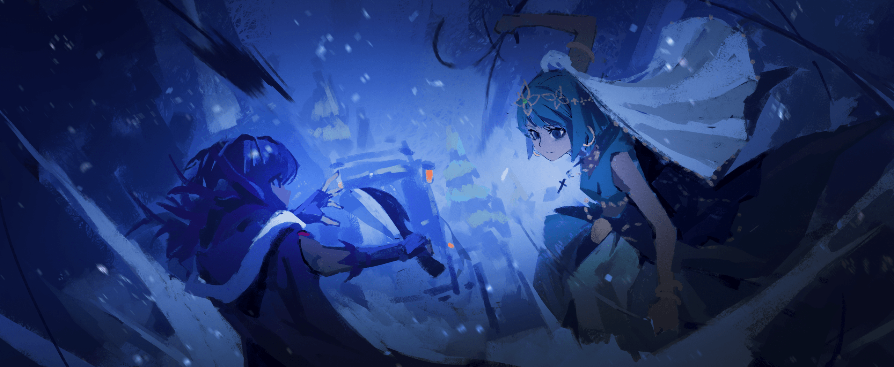

Орнеа Фезерран

— Срезы ровные, а снег не дал им испортиться. Может, ещё и приживутся.

С этими словами Эльза, освободив Оливера, которого подвесили на Башне Отсчёта Времени, осторожно протянула ему руку. На её ладони лежали шесть подобранных ею отрубленных пальцев мужчины.

Таков был результат пытки стальной проволокой, к которой его подвесили за пальцы. Если учесть, что он мог лишиться всех пальцев до единого и разбиться насмерть, сорвавшись вниз, то такой исход можно было считать настоящим чудом.

По крайней мере, четыре пальца остались на месте, а отрубленные шесть, возможно, удастся присоединить обратно.

— Слышать такое от меня, у которой любые оторванные конечности прирастают как ни в чём не бывало, — это, наверное, звучит как издевательство, верно? — спросила Эльза, но Оливер молчал, продолжая сидеть на корточках в снегу. — Эй, Оливер, ты меня слышишь?

Не дождавшись ответа, она вновь окликнула его.

Он не двигался, словно мёртвый. Наконец Оливер медленно поднял голову. Его некогда красивое лицо исказила мука и на щеках застыло свирепое выражение, а глаза пылали.

Губы его высохли, и он с трудом прошептал:

— Татьяна… как она?..

— Она мертва.

— …!

— Переоценила свои силы и полезла на рожон. «Бешеная Собака» Татьяна… иронично, что это прозвище её и сгубило.

Оливер, который в пылу агонии и страха не мог следить за происходящим на площади, застыл. Но для Эльзы его потрясение было уже чем-то запоздалым.

Смерть Татьяны поначалу тоже стала для неё ударом, даже более сильным, чем она ожидала. Но потрясение проходит, утихает, и постепенно возвращается спокойствие.

Остаётся лишь лёгкий отголосок тоски.

«…Надо же», — с удивлением подумала Эльза, осознав, что испытывает именно это чувство — тоску.

Всего несколько недель, проведённых с Татьяной, — срок куда меньший, чем годы с «Сёстрами Фезерран», — но, видимо, за это время между ними успела возникнуть какая-то тёплая связь.

Ей было жаль, что Татьяны больше нет. И она знала, что Сария и Хильда чувствовали то же самое.

— Я думала об этом ещё после смерти Доротеи… Неожиданно, но, похоже, я довольно сентиментальная девушка.

— …Эльза, а ты…

— Я? Я в порядке. Как видишь, жива-здорова. Даже если и получу пару царапин, они тут же исчезнут, будто их и не было…

Оливер хрипло задал свой вопрос — видимо, сорвал голос от крика. Эльза лишь пожала плечами, не зная, что ответить на его недосказанный вопрос.

— Я и сама толком не знаю, просто из-за странного ритуала моё тело стало… странным. Насколько я помню, когда жила у тебя, я была обычным человеком.

— Раны заживают в сию секунду, скачешь повсюду как ужаленная, убиваешь толпы людей, даже не моргнув, и спокойно смотришь на смерть близких…

— …

— Эльза, кто вы вообще такие? — этот вопрос прозвучал как окончательный разрыв.

Как бы то ни было, Эльза считала, что у них с Оливером сложились хорошие отношения.

Пусть со стороны её поведение и казалось наглым и бесцеремонным, она видела в нём равного. Хотя, если задуматься, сама мысль о равных отношениях между работорговцем и рабыней была абсурдна.

— Оливер, я… — из-за этого мимолётного внутреннего смятения Эльза на мгновение замешкалась с ответом.

И в этот самый момент…

— «Сёстры Фезерран».

Внезапно раздавшийся голос заставил и Эльзу, и Оливера замереть. Оливер — оттого, что услышал незнакомый голос третьего лишнего, а Эльза — оттого, что узнала голос, которого здесь быть не могло.

Хотя… почему не могло? В конце концов, Сария и Хильда, которые, как она думала, и не помышляли о мести за Доротею, дошли до того, что устроили целую «Операцию по Очистке». А раз так, то и эта встреча была вполне вероятным развитием событий.

— Что такое, Эльза? Вид у тебя такой, будто призрака увидела, совсем на тебя не похоже.

— …Орнеа. И ты здесь.

— …Вообще-то, я не собиралась утруждать себя выходом в свет.

С этими словами вздохнула девочка с детской внешностью, но повадками умудрённой жизнью старухи — вторая по старшинству из «Сестёр Фезерран», Орнеа Фезерран.

Она тащила за собой цепь — своё излюбленное оружие, кусари-фундо. На конце цепи болтался огромный кусок мяса.

Бесформенная, кроваво-красная масса. Это было то, что осталось от Ортроса, который сначала подчинился Сарии и Хильде, но потом, следуя инстинкту самосохранения, перешёл на сторону Эльзы и сожрал своих бывших хозяек.

— Я думала отпустить его, ведь он меня послушался.

— Размозжив ему половину головы? Двуглавый пёс-зверодемон не протянет долго с одной единственной головешкой, но главное — он сожрал моих сестёр. Я заберу их останки.

— Но они же должны быть вперемешку. Думаешь, смогут воскреснуть?

— …Это лишь дань уважения мёртвым. Если тебя сожрали и пережевали, тут уж даже «Сёстрам Фезерран» ничего не поможет, — с досадой скривилась Орнеа, давая понять, что заберёт и сестёр, и пса.

Услышав это, Эльза склонила голову набок.

— Тогда, прежде чем ты их заберёшь, можно я вспорю ему брюхо? Думаю, там, вместе с Сарией и Хильдой, должна быть и рабыня Оливера.

— …Ты полагаешь, что находишься в том положении, чтобы предлагать подобное?

— Спросить — не убудет. А ты, Орнеа, добрая, вот я и решила попытать счастья.

— …Я — добрая?

В тот же миг Эльзу пронзила волна убийственной ауры, исходящей от миниатюрной девочки перед ней. После битвы с близнецами тело Эльзы словно сбросило какие-то оковы.

До сего момента ей казалось, что она достигла уровня Орнеи, но стоило ей ощутить эту жажду крови, как её тело затрепетало от страха.

Какое заблуждение — думать, что она поднялась до её уровня. Пропасть между ней и сильнейшей из «Сестёр Фезерран» всё ещё была так велика, что её не перепрыгнуть, а лишь смотреть вверх с благоговением.

Тем более сейчас, вся израненная, — на что она вообще могла рассчитывать в бою с Орнеей?

«Впрочем… я никогда и не собиралась вступать только в те битвы, где могу победить», — подумала она.

— …Ты не меняешься, — сказала Орнеа, разочарованно опустив уголки бровей, когда увидела, как Эльза с предвкушением облизнула губы.

В тот же миг захлестнувшая площадь жажда убийства рассеялась, и тело Эльзы невольно расслабилось.

И всё же, расслабляться рядом с Орнеей было нельзя. Эльза помнила, как та в особняке с лёгкостью, будто занималась обычной пустяковой рутиной, разрывала её тело на куски.

Это гнетущее напряжение никуда не делось, и Эльза, не теряя бдительности, наблюдала за ней.

И тут…

— …Так это вы, значит, будете сестрицей тех барышень, что всё это устроили? — вмешался Оливер, до этого остававшийся в стороне.

Взгляд Орнеи обратился к неожиданному собеседнику. Работорговец, потерявший шесть пальцев и, должно быть, страдающий от непрекращающейся боли, встретил её взгляд без тени страха.

— Хм, не припомню такого лица.

— Ха-ха-ха, вот как? А я-то думал, что веду дела на широкую ногу. Видимо, мир куда больше и глубже, чем кажется, — Оливер усмехнулся, ничем не выдавая свою агонию от пыток.

С поразительным самообладанием он обвёл рукой площадь и город:

— Устроить такое побоище прямо под носом у Священного Королевства… Должно быть, вы либо готовы к тому, что вас заклеймят еретиками и отправят за вами карательный отряд, либо это какая-то очень крупная игра.

— Что ж, шуму мы и впрямь наделали, но я…

— У вас есть покровитель, который не допустит такого исхода. Вы назвались «Сёстрами Фезерран», значит, вы имеете прямое отношение к достопочтенному Холосео Фезеррану, — Оливер продолжал говорить, хотя на его лице выступил холодный пот.

Девочка прищурилась и, подойдя к нему, своей маленькой ручкой схватила работорговца за грудки. Её чудовищной силы хватило бы, чтобы одним движением пальцев размолотить его шейные позвонки в труху.

— Орнеа, этот человек…

— Твой знакомый работорговец, не так ли? То, что он всё это время укрывал тебя — ясно как день. Уже одного этого достаточно, чтобы счесть его врагом Святой Церкви.

Пока Орнеа душила Оливера, Эльза искала брешь в её обороне, но та, даже держа мужчину одной рукой, не подставлялась.

И всё же, сейчас, момент когда одна её рука была занята, — это был лучший шанс. Эльза уже приготовилась броситься на маленькую спину Орнеи, как на последний бой, когда…

— Однако, леди, мне кажется, у вас не так уж много причин быть преданной Святой Церкви.

— …Что?

— Скорее, у вас к ней накопилось немало претензий, не так ли? Похоже, вам не по душе то, во что превратился этот город.

— …Какой же ты несносный тип. Неудивительно, что приютил такую оторву, как Эльза.

— Ну, тут я, можно сказать, и сам жертва обмана…

Девочка ещё некоторое время холодно смотрела на Оливера, который лишь жалко улыбался в ответ. Затем она вдруг глубоко и долго вздохнула.

— …Верно, я была против «Операции по Очистке». В итоге, несмотря на все разрушения, Сария и Хильда мертвы, а Эльза выжила.

— А почему вы вообще охотитесь на Эльзу?

В ответ на этот прямой как палка вопрос Оливера лицо Орнеи неуловимо исказилось. Если бы она рассказала о событиях, которые послужили толчком ко всему этому…

Эльза знала, что Холосео, по словам Оливера, как ни в чём не бывало вращался в высшем свете. И она догадывалась, что эта уловка была возможна благодаря способностям Ситонии.

— Ах, если не можете рассказать, я не настаиваю. Просто… я такой человек, знаете ли, ко всему отношусь легкомысленно, будто меня это и не касается вовсе.

— Да что ты вообще несёшь?! Ещё хоть слово о наших проблемах, и я сверну тебе шею…

— А вам не кажется, что вам всем стоит просто нормально поговорить? — выдавил из себя Оливер, которого всё ещё держали за грудки словно в стальном захвате.

От его слов Орнеа широко раскрыла глаза, отпустила его и повернулась к Эльзе.

— И вот…

— Сейчас здесь только мы с тобой. Доротеа, Сария и Хильда мертвы. Ситония ждёт отчёта в особняке. Так что отвечай честно, Эльза.

— …О чём ты?

Эльза упустила момент, чтобы напасть на Орнею, пока та отпустила Оливера и обе её руки были свободны. Пока она мысленно корила себя за это, губы Орнеи мелко задрожали.

— В тот день… в ту ночь, когда умер Отец, что случилось? Почему… почему ты убила Отца? Зачем расколола «Сестёр Фезерран»?..

— Ах, та ночь…

Умоляющий тон Орнеи заставил Эльзу вспомнить тот вечер. Все сёстры получили задания и покинули особняк. Эльза осталась одна, и тогда Холосео с напыщенным видом тоже дал ей задание.

И это задание заключалось в том…

— Отвечай! Эльза, почему ты убила Отца?!

— …? Странный вопрос. Потому что так велел сам Отец.

— …

Эльза ответила с недоумевающим видом.

Услышав это, Орнеа застыла. Она замерла, будто не могла понять слов черноволосой девушки перед ней. Она несколько раз моргнула и, пробормотав «погоди», спросила:

— Что… ты сказала? Что ты сейчас сказала?

— Говорю же, так велел Отец. Сказал, что это необходимо для завершения «Проклятой Куклы». Что так «Сёстры Фезерран» достигнут своего совершенства.

— Бред.

— Как грубо.

Эльза обиженно нахмурилась в ответ на угрюмое бормотание Орнеи.

Но тут же поняла, что эти слова предназначались не ей, а были проклятием в адрес самой абсурдности ситуации. Девочка отрицательно замотала головой и схватилась за голову.

— Отец, чтобы он… Нет, но что, если это какая-то техника, известная лишь Кукловоду? Если так, то ради чего мы все…

— Устраивали бессмысленную бойню, так, что ли? Что ж, соболезную.

— …!

Слова Оливера вывели сбитую с толку Орнею из себя. Она яростно взмахнула своим кусари-фундо. Цепь со свистом пронеслась мимо головы Оливера и с оглушительным грохотом разнесла вдребезги каменную брусчатку площади.

— …— но даже такая угроза не изменила выражения лица Оливера.

Наоборот, казалось, что в тупик зашла именно Орнеа.

— Ты…

— Если предположить, что Эльза говорит правду, — продолжил Оливер, и Орнеа, проглотив свои слова, прислушалась.

Она попалась в ловушку его красноречия, сама того не осознавая. Оливер же, обращаясь к ней, протянул свою руку с недостающими пальцами.

— Если причина вашего раздора в нём самом, он бы наверняка постарался сделать так, чтобы дело не дошло до кровопролития. Или ваш Отец был не из тех, кто способен на такие мысли?

— Чушь! Отец, конечно, был человеком со своими странностями, но чтобы такое…

— …Орнеа?

— Чтобы такое…

Девочка начала было яростно возражать, но на полпути её голос угас. Её лицо изменилось, будто она что-то поняла.

Орнеа не ответила на зов Эльзы, а лишь пробормотала:

— Нужно проверить… — с этими словами она повернулась к ним спиной.

Сняв с цепи труп Ортроса, она быстро втянула её обратно. Эльза ещё раз окликнула удаляющуюся маленькую фигурку:

— Орнеа! Раз ты оставляешь Сарию и Хильду, можно я их похороню?

— …Делай что хочешь. У меня появилось дело.

— Понятно… Знаешь, Орнеа, с той ночи у нас не было времени толком поговорить.

Орнеа, уже собиравшаяся уйти, остановилась. Она не обернулась. Глядя в спину своей маленькой сестры, Эльза вспоминала ту ночь — ночь смерти Холосео.

Тогда всё было так сумбурно, они расстались, не успев даже перекинуться парой слов…

— Я правда очень сожалею. Это чистая правда.

— …

— Да пребудет с тобой серебряная благодать¹, Орнеа.

Не ответив на эти слова молитвы, Орнеа ушла, оставляя следы на заснеженной дороге. Лишь когда её фигура скрылась из виду, Эльза наконец почувствовала, что спаслась.

Она выжила в безнадёжной ситуации. Поблагодарив судьбу за эту удачу, она огляделась. Площадь была усеяна трупами — жертвами «Операции по Очистке».

Наверняка то же самое творилось и в других частях города, но Эльза могла похоронить лишь своих сестёр, съеденных Ортросом, и Татьяну.

«Похороню их хотя бы где-нибудь повыше», — только об этом она и думала.

¹«白銀の慈愛を» (Hakugin no jiai o) — дословно «Серебряное милосердие/любовь». Ранее, во второй части Сестёр Апокалипсиса, я это так и перевёл: «Серебряная любовь», но сейчас этот перевод кажется мне слишком плоским и не передающим оригинального контекста чего-то религиозного/духовного, так что заменил на «Серебряную благодать».

В почве, обделённой благодатью «Святой Земли», даже выкопать могилу было тяжким трудом.

Приходилось сдирать пласты слежавшегося снега, дробить замёрзший наст, а затем вгрызаться в промёрзшую, как камень, землю. Работа больше походила на добычу камня, чем на рытьё ямы. Наконец, могила приемлемых размеров была готова.

Местом для захоронения Эльза выбрала небольшой холм, с которого открывался вид на Инорандум.

— Три могилы — это слишком утомительно, так что придётся вам потерпеть. С Татьяной, конечно, будут проблемы, но раз уж я её убила, придётся взять на себя ответственность.

С этими словами она сбросила в яму труп Ортроса, хороня Татьяну и близняшек, Сарию и Хильду, всех вместе. Если считать и Ортроса, то получилось трое человек и один зверь.

Пока она копала, её руки превратились в кровавое месиво. Пальцы почти потеряли форму, а вокруг всё было забрызгано кровью. Без инструментов, чтобы пробиться сквозь мёрзлую землю, Эльзе пришлось буквально ломать собственные руки.

Вот она и сломала. Только и всего.

— И всё же, обычный человек на такое бы не решился.

— Раз они всё равно заживут, то ничего страшного. Нужно просто немного потерпеть боль.

— Немного, значит… Потеряв столько пальцев, сохранять такое спокойствие… Мне этого не понять, честное слово. — Оливер, наблюдавший за её работой, с сарказмом хмыкнул, глядя на готовую могилу.

Он редко позволял себе такую улыбку, но Эльза не стала заострять на этом внимание. Вместо этого она позвала его:

— Оливер. — И, обращаясь к нему, терзаемому чувством вины, произнесла не утешение, а сухой факт: — Пытки — это способ выведать тайны. Тут уж ничего не поделаешь.

Услышав её слова, Оливер с горечью опустил голову.

Он лишился пальцев, его тело было изуродовано близнецами. Неизвестно, как они его нашли, но причина, по которой их убежище стало целью «Операции по Очистке», была ясна.

Это он, — Оливер, — не выдержав пыток, всё рассказал.

В результате Инорандум стал мишенью, а Татьяна погибла.

— Я негодный работорговец…

— Правда? Хотя, возможно, ты и прав. Я никогда не слышала о работорговцах, которые бы так убивались из-за смерти рабыни.

— Татьяна заслуживала счастья…

— Да. Но и считать, что раз она умерла, то непременно стала несчастной, — это тоже как-то эгоистично.

Эльза спокойно возразила на слова Оливера, в которых звучало не столько горе, сколько проклятие в собственный адрес.

Ей не нравилось, когда о последних мгновениях Татьяны говорили так, будто её жизнь закончилась одним лишь несчастьем.

Выражение лица Татьяны в тот миг, когда она оттолкнула Эльзу и бросилась на Ортроса, — в нём не было скорби о приближающейся смерти. Её дух достиг чего-то иного, чего-то запредельного.

Поэтому…

— Смерть Татьяны принадлежит только ей. Не нам, посторонним, судить об этом. Лучше займёмся тем, что должны.

— Что должны?.. И что же это такое?

— Для начала пришить твои пальцы. Без них тебе будет жутко неудобно, а я не хочу быть твоей сиделкой.

Она схватила за плечо Оливера, безвольно сидевшего у могилы. Он попытался вырваться, но тут же понял, что это бесполезно.

С горькой усмешкой он медленно покачал головой:

— Я никогда не мог тебе перечить… Если так подумать, то мысль о том, что я негодный работорговец, пришла ко мне слишком поздно.

— Да, ты прав. Действительно, слишком поздно.

Оливер криво усмехнулся на её безжалостную оценку, а Эльза, потащив его за собой, отправилась обратно в Инорандум на поиски лекаря, который смог бы пришить ему пальцы.

Инстинкт подсказывал ей, что спокойная жизнь продлится недолго.

Быстро миновав знакомые коридоры особняка, Орнеа с такой силой распахнула дверь в нужную комнату, что та едва не слетела с петель.

В кабинете Холосео, заваленном горами секретных документов, которые нельзя было выносить, по-прежнему сидела Ситония.

— …Вернулась, Орнеа. — Ситония с шумом захлопнула книгу, и её алые глаза впились в Орнею.

Та смело встретила её взгляд и кивнула:

— …Сария и Хильда мертвы.

— Вернулась, — повторила Ситония. — Мне уже доложили о провале «Операции по Очистке». Но я не знала, что ты отправилась в Инорандум. Почему ты поступила столь самовольно?

— Я… чтобы подстраховать Сарию и Хильду…

— Но они мертвы. Ты ведь не опоздала, правда? Ты намеренно позволила им умереть… Нет, не так, — Ситония покачала головой и медленно поднялась со стула.

Длинные красные волосы качнулись, когда она подошла и встала прямо перед Орнеей, запустив пальцы в её зелёные волосы.

Орнеа затаила дыхание, ощущая щекотное прикосновение у виска.

— …!

— Ты не смогла выбрать, на чью сторону встать — Сарии с Хильдой или Эльзы.

— Ты ведь так любила Эльзу. Для такой доброй девочки, как ты, выбирать между сёстрами — непосильная задача.

От холодных слов Ситонии худенькие плечи Орнеи задрожали.

Это была чистая правда, против которой нечего было возразить. Орнеа прибыла на поле боя в самый разгар «Операции по Очистке» и могла вступить в бой в любой момент.

Но не вступила.

Потому что не смогла выбрать, кого поддержать.

И это её промедление привело к тому, что сёстры убили друг друга.

— В итоге Эльза убила Сарию и Хильду. А если считать Доротею, то трёх сестёр. Из «Сестёр Фезерран» остались только мы с тобой…

— А что, если сама эта предпосылка неверна?!

— …? — Ситония удивлённо посмотрела на возразившую ей сестру.

Та, глядя Ситонии прямо в глаза, указала на вещи покойного хозяина кабинета, — Холосео.

— Я говорила с Эльзой. Она сказала, что убила Отца, потому что он сам ей приказал. Это значит, что всё с самого начала пошло не так! У Отца была какая-то великая цель, поэтому Эльза его и убила, а из-за того, что эта девчонка и двух слов связать не может, мы стали её преследовать… Поэтому…

— Поэтому ты хочешь, чтобы я простила Эльзу? Орнеа, ты это серьёзно?

— …Ах!

Ситония взяла её лицо в свои ладони. Орнеа осеклась.

Убрав руки, которыми только что гладила её волосы, Ситония заглянула ей в глаза, требуя ответа.

— Ты действительно так считаешь? И после всего этого… Ты говорила с Эльзой… Вот почему я не хотела отпускать тебя в Инорандум.

— …Ситония?

Ситония резко отпустила её лицо. Орнеа моргнула.

Отступив на шаг, девушка порылась в горе документов и извлекла оттуда одно запрятанное письмо. Она прижала его к груди и, глядя на растерянную сестру, тихо выдохнула:

— …«Ведьма Зависти».

От этого зловещего имени Орнеа почувствовала не только растерянность, но и глубокое отвращение.

Для любого живого существа в этом мире это было имя зла, которое следовало избегать и бояться. Имя, которое вызывало омерзение даже у «Сестёр Фезерран», чья жизнь была далека от света.

Ужасное, отвратительное имя той, что однажды чуть не уничтожила мир.

— Зачем ты назвала это имя?..

— Знаешь ли ты, что когда-то в мире, помимо «Ведьмы Зависти», были и другие ведьмы? Но все они были убиты ею, а их силы — поглощены. Говорят, именно поэтому «Ведьма Зависти» стала существом, с которым никто не мог совладать.

— К чему ты это рассказываешь?..

— Потому что нас, «Проклятых Кукол», это тоже касается.

По спине девочки пробежал неприятный холодок, но она не могла прервать рассказ Ситонии. Та, словно зная это, продолжала, прижимая письмо к груди.

— …Орнеа, ты знаешь, что лежит в основе «Проклятой Куклы»?

— …Я слышала, что это одна из техник проклятий. Она использует свойство проклятия не исчезать до тех пор, пока не будет достигнута цель, и тем самым мешает нам умереть.

— Верно. Проклятие, которое не даёт умереть, пока не убьёшь свою цель. На этом и основана «Проклятая Кукла»… Мы не можем исчезнуть, пока не убьём того, кого должны.

— В этом есть смысл, но… постой.

Орнеа уже было кивнула, но тут же остановилась. Если особенность «Проклятой Куклы» в том, что нельзя умереть, не убив свою цель, то почему Доротеа и остальные погибли?

— Да, у каждой из нас была разная сила регенерации, но если учитывать твои слова, то со временем они должны были исцелиться…

— Всё просто, Орнеа. Потому что они сражались на смерть с той, кого должны были убить.

Холодок ставший ещё сильнее, пополз по спине Орнеи. Она инстинктивно поняла, что причина этого страха — не столько сам рассказ, сколько та, кто его рассказывала, — Ситония.

Орнеа отрицающе замотала головой, отгоняя эту мысль прочь.

— «Ведьма Зависти» стала столь могущественной, потому что убивала и пожирала других ведьм. И тот, кто решил повторить это, был Холосео Фезерран.

Ситония назвала его по имени — Холосео, а не Отец.

Девочке стало до ужаса интересно, что же написано в том письме, которое сестра прижимала к груди, и она протянула к нему руку.

— Ситония, что там написано? Покажи мне.

— Техники проклятий Холосео, создающие «Проклятых Кукол»… Техники Фезерранов — это тёмное искусство, наследие древней эпохи ведьм. И есть кое-кто, кто жаждет заполучить их.

— Ситония!..

— …Это моя ненавистная, проклятая² «Мать».

²「忌まわしく呪わしいお母様」 (imawashiku norowashii okaa-sama). А вот тут поподробнее. Эта фраза несёт двойной смысл, заложенный в двух прилагательных:

1 — 忌まわしい (imawashii): «Ненавистная», «омерзительная».

Это относится к выражение личного презрения и ненависти Ситонии к «Матери».

2 — 呪わしい (norowashii): «Проклятая».

Это слово происходит от 呪い (noroi) — «проклятие». В мире Re:Zero, где проклятия реальны, это, возможно, указание на то, что «Мать» проклята/проклинающая, но стоит ещё и учитывать, что это прилагательное зачастую используют лишь как сильное оскорбление. Таким образом Таппей тут то-ли случайно то-ли намеренно создал двоякое толкование.

Признание Ситонии, прозвучавшее почти как песня, заставило Орнею, до этого стоявшую как вкопанная, сдвинуться с места.

Сестринская привязанность, любовь младшей сестры к старшей — всё это в один миг рухнуло, обратившись в палящую ненависть.

Мир, который рисовала в своих мечтах Орнеа, был разрушен.

Поэтому…

— Сначала сшибу с ног, а потом будем…

«…разговаривать», — с этими словами Орнеа взмахнула своим кусари-фундо, намереваясь обрушить на Ситонию сокрушительный удар.

Несмотря на то, что одна была старшей сестрой, а другая — младшей, по силе Ситония и близко не стояла с ней. А потому её медленная реакция не позволила бы ей отразить атаку.

Удар Орнеи, её выпад остановился по совершенно другой причине. Возможно, потому, что её собственное кусари-фундо сковало ей руки и ноги.

— Молодец, какая же ты умница.

Сразу после этих мягких слов своей сестры Орнеа, не успев сгруппироваться, рухнула лицом на пол. Она сильно ударилась носом, и из него потекла тёплая кровь. Боли не было. В этом они были одинаковы с рождения. Но что-то было не так.

— Моё… тело…

Оно не слушалось. Если бы оно просто онемело — это одно, но всё было иначе.

Тело Орнеи было сковано её же собственным кусари-фундо. И это не была ошибка в обращении с оружием — это было целенаправленное, осознанное сковывание.

Вот только у самой девочки такого намерения не было. Если оно и было, то…

— Неужели, что ты сделала с моим телом?..

— Мы с тобой знакомы дольше всех, так что мне было не так уж сложно постепенно пропитать тебя своей волей. Хотя, признаюсь, мне было жаль.

Ситония присела на корточки рядом с распростёртой на полу и неспособной пошевелиться сестрой. Оправив подол платья, она посмотрела на неё всё тем же ласковым взглядом.

Затем она осторожно поднесла письмо к глазам затаившей дыхание Орнеи. Та пробежалась глазами по строчкам документа, который Ситония так многозначительно прижимала к груди, и…

— Не… может быть…

…в ужасе осознала, что это было предсмертное завещание Холосео Фезеррана.

Конечно, в его содержании было много поразительного. Но по-настоящему шокировало то, что Ситония знала о существовании этого завещания и скрывала его до последнего.

— Ситония, ты!..

— И то, что я заботилась о тебе и сёстрах, и то, что была благодарна Холосео, — всё это было правдой.

Ситония прервала яростный крик Орнеи. Та от такой наглости потеряла дар речи. Ситония же, приложив руку к своей груди, продолжила:

— Хотя бы на время оказаться вдали от той женщины — это было настоящее спасение. Но время грёз подошло к концу… Орнеа, я тебе завидую.

Глядя сверху вниз на свою сестру, которая валялась на полу, преданная теми, кому верила, лишённая своей абсолютной силы и сгоравшая от унижения, Ситония произнесла с искренним негодованием:

— Я по-настоящему, искренне завидую, что ты можешь оставаться такой же наивной, ничего не знающей девочкой.

В тот миг, когда её слуха коснулся едва уловимый металлический звон, Эльза уже схватила Оливера в охапку.

Усвоив урок прошлого, она больше не теряла бдительности.

Выйти с Татьяной в город без оружия было верхом неосторожности с её стороны. Если та цепь случайностей привела к такому исходу, то повторения она не допустит.

«К тому же, если я сейчас проявлю неосторожность, меня просто убьют».

Конечно, Сария и Хильда были грозными противниками, но разница в силе позволила ей переломить ход боя.

Однако со следующим противником такой трюк не пройдёт. Более того, у неё была уверенность, что любая неосторожность будет мгновенно и безжалостно ею же и подавлена.

Поэтому Эльза впервые в жизни полностью избавилась от какой-либо беспечности.

— Како-о-ого?!

Она услышала вопль Оливера, которого подняла на руки, но не обратила на него внимания. Одним ударом длинной ноги она выбила окно драконьей повозки и выпрыгнула наружу, всё ещё держа его в руках.

В следующую секунду металлический лязг настиг повозку, и ударная волна разнесла её в щепки.

В рейсовой повозке, кроме них, были и другие пассажиры, но и они, и возница, и даже наземный дракон — все смешались в единую кровавую массу, которую невозможно было различить.

А причиной этого сверхъестественного разрушения была серебряная цепь, извивающаяся, словно змея.

— …Орнеа.

Длинная-предлинная цепь кусари-фундо, сжавшая и раздавившая останки повозки, принадлежала маленькой фигурке, стоявшей на пути.

Это была атака Орнеи Фезерран, девочки в зелёном платье с зелёными волосами.

— Явилась всё-таки, эта леди… — пробормотал Оливер, которого Эльза держала на руках. Его пришитые пальцы были аккуратно замотаны бинтами.

Нападение произошло по пути домой после лечения. Хотя Эльза не собиралась никуда бежать, было предсказуемо, что они нападут, прежде чем она успеет скрыться, опасаясь её побега.

— Моё тело тоже полностью восстановилось… Условия равны.

Прошли сутки, и она восполнила недостаток плоти и крови едой. Раны, полученные в бою с Сарией и Хильдой, уже зажили, и ничто не мешало ей сражаться во всю. Единственной помехой, если уж на то пошло, был…

— Ты будешь мешать, так что отойди, Оливер. Не хочу, чтобы с тобой случилось то же, что и с Татьяной. — Эльза небрежно бросила его на землю.

Оливер попытался было почесать голову, но не смог из-за искалеченных пальцев. В итоге он просто встряхнул своими длинными волосами и, отходя от Эльзы, прокричал:

— Да ты… Ах, чёрт! — Он вытащил из-за пояса свой кошелёк и швырнул его ей. — Вот! Я ставлю всё, что у меня есть, на твою победу! Так что не вздумай проиграть и умереть!

— Какая предприимчивость. Мне это нравится.

— И не смей умирать, пока я тебя не продал!

Крича это, Оливер отбежал на безопасное расстояние. Эльза, даже не взглянув в его сторону, встала лицом к лицу с Орнеей на расстоянии более десяти метров.

Десять метров — вроде бы и не мало, но для Эльзы и Орнеи это было всё равно что ничего. Тем более что дальность атаки кусари-фундо её сестры была как минимум вдвое больше.

— И всё же, ты изменила своим принципам? Раньше ты не любила впутывать посторонних, а теперь, чтобы убить нас, разнесла всю повозку целиком. И, насколько я помню, ты была куда разговорчивее, — Эльза склонила голову набок, глядя на раздавленную повозку.

Но ответа от Орнеа не последовало. Вернее, ответ был. Но не словами, а молниеносным броском кусари-фундо.

— …!

Эльза резко отклонила голову ещё сильнее, и грузило пронеслось мимо, лишь слегка оцарапав щеку. Силы удара хватило бы, чтобы размозжить человеческую голову, как спелый фрукт. Это стало ясно по тому, как позади неё взорвался снежный покров на дороге.

Этот удар стал сигналом к началу их смертельной битвы.

— Ши-и…

Пригнувшись, Эльза со скоростью стрелы рванулась вперёд по снегу. Десять метров, разделявшие их, она преодолела буквально за мгновение и взмахнула клинком.

Изогнутый меч, который она держала обратным хватом, — кукри, специально подготовленный для поединка с Орнеей.

К этому оружию она пришла после бесчисленных полусмертельных тренировок в подвале особняка Фезерран, где Орнеа снова и снова избивала её до полусмерти.

— Этим я вырву твоё сердце.

— Как жестоко.

Сверкнула сталь. Лезвие, как и было обещано, нацелилось в хрупкую грудь Орнеи. Но та грубо заблокировала удар, подставив руку. Левая рука девочки отлетела по локоть.

Однако ни хлынувшая кровь, ни боль, ни потеря конечности не могли остановить её. Врождённая нечувствительность к боли — вот что делало её сильнейшей.

Она не чувствовала боли с рождения, и ей было всё равно, когда её тело ломалось. Поэтому она с лёгкостью совершала чудовищные поступки, играясь со своим телом словно с куклой.

Отрубив ей руку, Эльза развернула клинок для следующего удара, нацелившись в тонкую шею. Но Орнеа, сломав себе лодыжку и колено, резко присела, уходя из зоны поражения.

Сломанные кости тут же срослись, и роли поменялись. Выпрямляясь, Орнеа нанесла удар кулаком, который столкнулся прямо с подставленным коленом Эльзы.

— …!

Раздался глухой звук, и колено Эльзы вместе с правой рукой Орнеи разлетелись на куски.

Тела обоих противников, бьющего и принимающего удар, ломались и взрывались от чудовищной силы. Такое было возможно лишь потому, что ни одна из них не заботилась о сохранности собственного тела.

Это было неразумное деяние, выходящее за рамки законов живого, пренебрегающее даже собственной жизнью.

Смертельная битва двух чудовищ, презревших главный инстинкт всего живого — инстинкт самосохранения.

— Хи… хи-хи, ахахахахаха!..

Кровь хлестала, кости дробились, плоть взрывалась в этом обмене смертоносными ударами, а на губах Эльзы играла улыбка, и её дикий хохот разносился по заснеженной дороге.

Они то замирали на месте, то стремительно перемещались, иногда даже взлетая в воздух, чтобы нанести удар. Это была запредельная битва, в которой они уклонялись, но почти не думали о защите.

Смертельная схватка бессмертных, в которую не мог бы вмешаться никто, кроме «Сестёр Фезерран», и которая была возможна только благодаря им.

Отлетающие конечности, раздавленные гортани и глазные яблоки, текущая кровь и жизнь — всё восстанавливалось.

Эта кощунственная битва, оскверняющая саму суть жизни, могла произойти только между Эльзой и Орнеей. Поэтому она ждала этого дня. Да, Эльза, опасаясь силы своей сестры, всё же ждала этого дня.

Этой игры на истребление, где каждая выкладывалась на полную, чтобы вновь ощутить близость столь далёкой смерти.

— Ф-ф!..

Они столкнулись кулаками, и их руки разнесло в месиво до локтей. Каждая наносила удары, будто её кулаки были самостоятельным оружием. Удар Эльзы пронзил горло Орнеи. В тот же миг её кусари-фундо обвилось вокруг шеи Эльзы, и с хрустом её голова неестественно повернулась назад.

Обе получили смертельные раны в шею. Кратковременная потеря сознания, и та, что оправится быстрее, нанесёт сокрушительный удар.

С глухим стуком жизнь хлынула обратно, восстанавливая сломанную шею и наполняя кровью ноги. Но на это ушла почти секунда. За это время Орнеа должна была восстановиться быстрее…

— …

Но она не восстановилась.

Орнеа, с пробитым горлом и кашляя кровью, отступила, выдёргивая кукри. Эльза рванулась за ней и, догнав, вонзила уже вытащенное лезвие ей в лоб.

Клинок расколол череп и взболтал мозг внутри. Взгляд Орнеи расфокусировался, из носа и ушей хлынула багровая кровь. Глядя на это, Эльза взревела:

— А-а, а-а, а-а-а-а-а!..

Не вынимая кукри из её раздробленного черепа, Эльза обеими руками начала разрывать тело своей сестры на части. Вонзив ногти в шею, она засунула пальцы в рану и со всей силы разорвала её тело.

Туловище Орнеи разошлось, как у потрошёной рыбы, и она, обливаясь кровью и внутренностями, начала оседать. Но Эльза не позволила ей упасть — ударом раздробленного колена она подбросила её вверх. Схватив взлетевшее тело за ноги, она с размаху ударила им о снег.

Затем, оседлав лежащую на спине Орнею, она снова и снова, снова и снова, снова, снова и снова обрушивала на неё ударную часть отобранного кусари-фундо, дробя её голову.

Била, била, била, дробила, дробила…

— …Эльза! Эльза! Хватит! Довольно уже!!

Неудержимую жажду разрушения, обрушивавшуюся на Орнею, пытался остановить Оливер, отчаянно вцепившись в неё сзади.

Эльза медленно перевела взгляд и увидела его лицо, искажённое отчаянием. Его одежда была в беспорядке и забрызгана кровью, будто его швыряли.

Нет, не будто. Его и вправду швыряли.

Чтобы остановить Эльзу, впавшую в безумие и бездумно избивавшую Орнею, Оливер много раз пытался схватить её, и каждый раз она отбрасывала его прочь.

Он повторял это снова и снова, пока Эльза наконец не пришла в себя и не прекратила своё безумие.

— Ха… ха… ха…

Тяжело дыша, Эльза посмотрела вниз на Орнею — вернее, на то, что от неё осталось. Девочка, чья голова была превращена в кашу, как раздавленный фрукт, от бесчисленных ударов её же оружием.

Она не шевелилась, полностью лишившись способности сражаться.

— Эльза… ты успокоилась?

Оливер, вцепившийся в её руку, потерял бинты — видимо, они слетели, пока его швыряли. На его руке не хватало трёх пальцев. Значит, не все пальцы удалось пришить. И неизвестно, сможет ли он вообще двигать оставшимися.

Хотя, даже без пальцев, ему, как работорговцу, это не сильно помешает…

«…О чём я вообще думаю?»

Усмехнувшись своим бесполезным мыслям, Эльза ещё раз взглянула на неподвижные останки Орнеи.

Та, что была невероятно сильна, несмотря на свою доброту, теперь превратилась в жалкое зрелище, не проронив за всю битву ни слова.

Почему она победила? Нет, это не так. Эльза не победила её. Орнеа была мертва ещё до того, как добралась до неё. Это была лишь пустая оболочка, а не Орнеа.

Остались только они двое: Эльза и Ситония.
