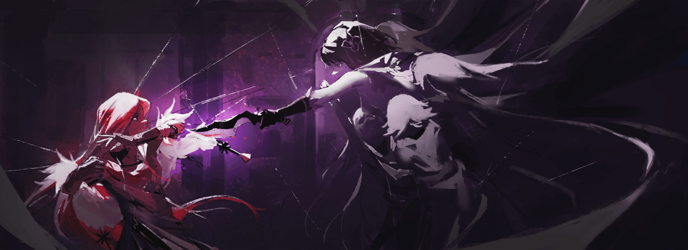
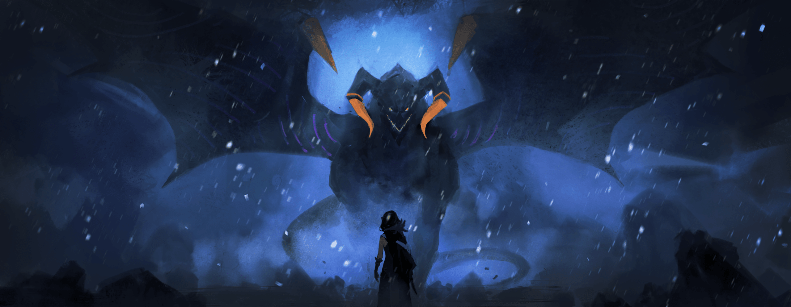

Ситония Фезерран

Найти особняк Фезерран в «Святой Земле» оказалось не так-то просто.

«Сёстры Фезерран» — секретный отряд на службе у Святой Церкви Густеко, о котором ни в коем случае нельзя было упоминать вслух. Таково было их положение и многолетняя обязанность.

Найти кого-то, кто знал бы об их существовании, а тем более обладал подробной информацией, было задачей не из лёгких. Шаг за шагом, след за следом, Эльза продвигалась к своей цели.

Для неё, не отличавшейся особым усердием, путь выдался трудным, но она и не думала сдаваться. Проблема оказалась настолько важной, что даже Эльза не могла просто так от неё отмахнуться.

Поэтому она проникала к людям, которые могли что-то знать о Святой Церкви, заставляла их говорить, а затем затыкала им рты. Это привело к смене нескольких высокопоставленных лиц в Церкви, но, совершив всё это, Эльза наконец-то нашла то, что искала.

Так, спустя несколько месяцев, состоялось её возвращение домой.

— …

Когда она прибыла в родные пенаты, особняк предстал перед ней в ужасающем запустении.

Сад, за которым ухаживала Доротеа, после её исчезновения, видимо, остался совсем без присмотра: прекрасные цветы были вытеснены сорняками, отвоёвывавшими себе место под солнцем.

Во флигеле, где жили Сария и Хильда царила мёртвая тишина; от былого оживления не осталось и следа, и лишь холодное, сухое безмолвие окутывало большой дом.

Столовая, где часто бывала прожорливая Орнеа, тоже выглядела уныло. Тех, кто мог бы собраться за обеденным столом, больше не было, и даже воду в вазе никто не менял.

— Неужели они просто перестали пытаться поддерживать здесь жизнь?..

Вероятно, это место было лишь эфемерным райским садом, созданным рабынями. И когда сон развеялся, никто больше не мог здесь оставаться. А раз никто не мог остаться, то и остановить увядание этого сада было некому.

С чувством тоски Эльза, словно ведомая невидимой силой, направилась вглубь особняка и — какая ирония — спустилась по лестнице, ведущей в подвал, место, оставившее в её памяти самый глубокий след.

Она провела в этом особняке всего полгода, но сколько же раз за это время она спускалась по этой лестнице? Сколько раз получала смертельные раны в этом холодном и тёмном месте?

…Приближаясь к смерти, она познавала полноту жизни, которую почти упустила.

Это был нелепый и парадоксальный соблазн, но для Эльзы он был необходим.

— И вот, когда ты ступила в наш ностальгический подвал… значит, Орнеа не смогла тебя остановить.

Тихий голос раздался из темноты, и показалась Ситония в алом платье. Она стояла так же неторопливо и грациозно, как и в воспоминаниях Эльзы. В ней не было ни свирепого оружия Доротеи, ни ловушек Сарии и Хильды, ни подавляющей ауры Орнеи. Это была всё та же Ситония.

— А я-то думала, меня ждёт более пышный приём.

— Да, я тоже думала об этом. Но какой смысл готовить что-то против тебя, если ты одолела Орнею? Даже я это понимаю…

— …Не называй это Орнеей. — Спокойную речь Ситонии прервал предельно холодный голос Эльзы.

Для неё это было необычно — выдать свои эмоции. Удивлённая словами Эльзы, Ситония слегка приподняла брови.

— Поразительно. Так у тебя всё же были сестринские чувства.

— И сестринские чувства, и жалость к Орнее… Что ты с ней сделала? Как тебе удалось сломить её дух? — в ответ на вопрос Эльзы Ситония с болью опустила глаза.

«Сломила дух Орнеи», — к такому выводу пришла Эльза после их смертельной схватки, в которой ей удалось одержать верх. Именно это стало причиной её победы над ослабевшей сестрой в той заснеженной пустоши.

Если бы Орнеа была в здравом уме и сражалась в полную силу, шансы Эльзы оказаться здесь были бы пятьдесят на пятьдесят, а то и меньше.

— Но такой Орнее я проиграть не могла. Поэтому я здесь.

— И теперь ты убьёшь меня, чтобы завершить своё превращение в «Проклятую Куклу», так?

— …Что?

Слова скорби застыли на губах Эльзы, прерванные неожиданным заявлением Ситонии.

Завершение «Проклятой Куклы»… Эльза прищурилась, а Ситония усмехнулась. Это была иссохшая, совсем не свойственная ей улыбка.

— Не притворяйся. Я знаю. Я всё знаю, Эльза. О том, что начал Отец в ту ночь. О ритуале, в котором сёстры должны убивать друг друга, чтобы завершить создание «Проклятой Куклы».

— …

— Я пришла в семью Фезерран, чтобы заполучить эту технику «Проклятой Куклы»… но если бы ритуал не начался, я была бы не против. Мне нравилось жить здесь! — Ситония сжала ладонь на груди и с мучительной улыбкой обратилась к Эльзе.

В памяти Эльзы пронеслись дни, проведённые в этом особняке вместе с сёстрами. В те дни Ситония заботилась о них, порой была ими озадачена, но её жизнь была полна — это не было ложью. Не должно было быть ложью. И всё же она…

— …Ты желала завершения ритуала. Поэтому ты одну за другой отправила ко мне Доротею, Сарию и Хильду. И дух Орнеи ты сломила по той же причине, верно? Идеальная «Проклятая Кукла»… неужели это так соблазнительно?

— Тебе…

Эльза склонила голову, и её бесстрастный вопрос заставил Ситонию прикусить губу. Ярость, отразившаяся на её лице, обнажила тёмные мысли, что она так долго копила в себе.

И чуткое обоняние Эльзы уловило это. Люди, просто живя, источают бесчисленное множество запахов. Для Эльзы, постоянно ощущавшей их, это было так же естественно, как дышать.

…Чувство, вырвавшееся из Ситонии, было страхом .

Невыносимый, всепоглощающий страх окутывал Ситонию и толкал её на чудовищные поступки.

— Чего же ты так боишься?

— …Самого страшного и отвратительного существа в этом мире.

— Страшного и отвратительного…

Голос Ситонии, дрожащий от ужаса, заставил Эльзу попытаться представить этот источник страха. Но её скудное воображение не могло придать ему конкретную форму.

Это ужасное и отвратительное существо, которого так боялась Ситония, было…

— …Моя «Мать».

— «Мать»…

— Точнее, чудовище, которое называет себя моей «Матерью». Чтобы вырваться из-под её власти, мне нужна эта тайная техника!..

Выкрикнув это, Ситония метнула на Эльзу одержимый взгляд. В тот же миг, словно в ответ на её слова, на застывшую Эльзу бросилась тень.

Эльза среагировала мгновенно, выхватив из-под платья кукри и полоснув им по воздуху. Лезвие без промаха распороло торс нападавшего. Однако рана, которую Эльза нанесла, повела себя странно.

— Это…

В мгновение ока рана на теле тени затянулась.

А затем, схватив изумлённую Эльзу за руку, тень повалила её на землю. Эльза попыталась вырваться, но тщетно. Потому что тень была не одна.

Одна, две… нет, пять, шесть — из мрака одна за другой появлялись новые убийцы. Все они были тенями в платьях с пустыми глазами.

— Эти девочки…

— …Помнишь ночь ритуала? — спросила Ситония, глядя сверху вниз на прижатую к полу Эльзу и обнимая себя за локти. Она говорила не о той ночи, когда умер Холосео.

…Ночь, когда Эльза с помощью тайной техники обрела тело «Проклятой Куклы». Вспомнив ту ночь, Эльза поняла, кем были эти нападавшие в платьях.

В тот день Доротеа говорила, что многие погибли во время ритуала, потерпев неудачу. Эльза думала, что они умерли, но это было не так. Они не смогли стать «Проклятыми Куклами» и лишились разума, но…

— …Они живы и подчиняются приказам, прямо как Орнеа…

— Это мой яд. Мой козырь. Этот подвал на самом деле не место для сестринских поединков. Это место, куда сбрасывали неудачных сестёр.

Словно в подтверждение слов Ситонии, из полумрака одна за другой выходили те, кто когда-то, должно быть, были прекрасными девушками.

Но какими бы красивыми они ни были при жизни, со сломленным разумом, брошенные здесь как мусор, они утратили свою красоту и превратились в отвратительных кукол.

Глядя на них, Эльза подумала:

— Ах, вот уж кто действительно «Проклятые Куклы».

— Да, да, именно так, Эльза! Ты права… это и есть «Проклятые Куклы». Такие уродливые, такие злые… но именно поэтому мне нужна их сила.

— …Чтобы получить бессмертное тело и сбежать от власти «Матери»?

— Да, именно! — с горящим взором Ситония подтвердила слова Эльзы.

Глядя в широко раскрытые глаза старшей сестры, которая решительно топнула каблуком, Эльза сделала долгий и глубокий выдох.

Пытаться сбежать от власти «Матери», выполняя ритуал, навязанный Отцом. Даже на словах это звучало до смешного нелепо.

— Ситония… какая же ты всё-таки несчастная.

— Эльза?

— Ты хотела уйти от «Матери» и для этого копировала методы Отца… Если тебе было так тяжело, почему ты ни с кем не поговорила? Если бы ты рассказала…

— …Но ведь это ты всё начала! — Ситония в ярости отвергла жалость Эльзы. Её доводом была та ночь, когда убили Холосео, — ночь, когда это сделала Эльза.

— Ты убила Отца, и ритуал начался. Ритуал по созданию «Проклятой Куклы»… а раз так, у меня не было выбора, кроме как выжить.

— …

— Выжить и стать совершенной «Проклятой Куклой». Тогда я смогу сбежать от её власти… — Ситония повторяла своё желание снова и снова.

Эльза не могла даже представить, какой ужас и отчаяние нужно было пережить, чтобы нанести такие глубокие шрамы на душу этой доброй девушки.

— …Говорить дальше бессмысленно, — тихо прошептала Эльза, чувствуя, что их разговор зашёл в тупик.

Ситония поняла её, тут же выставила вперёд ладонь и властно приказала:

— Не двигайся. Мне очень жаль… но я убью тебя, Эльза.

— …Не хочу хвастаться, но не думаю, что меня так легко убить. Я смогла выжить, даже когда от меня осталась одна голова.

— Разумеется. Когда я услышала об этом, то не поверила своим ушам. По сравнению с тобой, моя совместимость с этой магией — ничто. Но я смогу убить тебя до конца. Так же, как ты поступила с Орнеей.

С этими словами Ситония перевела взгляд на «Проклятых Кукол» — на неудачных сестёр, удерживающих Эльзу.

Поняв её намерение, «Проклятые Куклы» медленно приготовили оружие. В их руках были смертоносные клинки, предназначенные для сестёр и хранившиеся в этом подвале. Вооружившись, «Проклятые Куклы» приготовились казнить Эльзу.

— Я не хочу причинять тебе лишних страданий. Но в твоём случае…

— В отличие от нечувствительной к боли Орнеи, я отлично её ощущаю. Ох, но можешь не беспокоиться, я не то чтобы не люблю боль.

— …Даже если так.

«Я люблю тебя», — Ситония, с несвойственной для «Сестёр Фезерран» человечностью, попыталась хотя бы проводить Эльзу в последний путь без мучений.

Она осторожно протянула руку, коснулась лба Эльзы и прошептала, словно в молитве:

— По крайней мере, усни. Моя младшая сестрёнка.

С этими словами Ситония глубоко выдохнула. И, будто получив какое-то прощение, она лишь на миг расслабила нахмуренные брови.

— Вот и всё…

— …? И что это должно было изменить?

— А?

В следующий миг на глазах у ошеломлённой Ситонии Эльза пришла в движение.

Чтобы вырваться из хватки «Проклятых Кукол», она сама вывихнула себе плечо и силой освободила руку. Она скопировала трюк Орнеи. Вот только та делала это спокойно, поскольку не чувствовала боли, а Эльзу пронзила острая, невыносимая боль в боку.

Однако…

— Какой трепет…

Превратив боль в удовольствие, Эльза вправила руку на место, схватила потерявшую равновесие «Проклятую Куклу» за голову и с силой ударила оземь.

От столкновения с твёрдым каменным полом подвала голова «Куклы» раскололась, и её содержимое выплеснулось наружу. Эльза без колебаний опустилась на колено и размозжила череп вместе с остатками мозга, оборвав нить жизни.

Теперь осталось девять «Проклятых Кукол».

— «Сёстры Фезерран» как-то подешевели, тебе не кажется?

— Ч-что…

Пока Ситония в ужасе наблюдала за этой бойней, Эльза выхватила два кукри. В каждой её руке сверкал зловещий чёрный клинок.

Остолбеневшие «Проклятые Куклы» перешли в контратаку лишь после того, как второй из них отрубили голову, а тело распороли от груди до живота.

Ошеломлённая Ситония отпрыгнула назад, отдаляясь от беззвучного и яростного натиска «Проклятых Кукол», и разорвала дистанцию.

Каким-то образом она контролировала их волю, заставляя подчиняться приказам, точно так же, как и Орнею со сломленным разумом. Эта её хитрость была поистине великолепна. Эльза была искренне впечатлена.

— Ты куда больше подходишь на роль кукловода, чем наш Отец.

— Эльза!..

— Можешь не кричать так громко, я и так тебя слышу.

Её похвалу заглушил яростный крик, и Эльза, недовольно скривившись, растворилась во тьме. Перемещаясь между тенями, она вносила сумятицу в ряды превосходящих её числом «Проклятых Кукол».

Используя своё бессмертное тело как оружие, она отбивала их безрассудные атаки и уничтожала одну за другой.

«Никакого пробуждения, как у Доротеи».

Они и в подмётки не годились Доротее, которая во время боя овладела магией крови и загнала Эльзу в угол.

«Никаких козырей, как у Сарии и Хильды».

Они и близко не стояли с Сарией и Хильдой, которые сражались насмерть ради сестринской любви, что казалось им несвойственным.

«Даже в том же состоянии, что и она, одна лишь Орнеа была бы намного сильнее».

Им было далеко до Орнеи, которая даже со сломленным разумом оставалась сильнее любой из сестёр.

Поэтому «Проклятые Куклы» одна за другой падали под безжалостными клинками Эльзы. Получив смертельную рану, они не успевали восстановиться, как тут же получали новую, и замирали навечно.

— Прекрати! Эльза!

Удар Эльзы, словно наслаждавшейся бойней, безжалостно отрубил «Проклятой Кукле» обе руки. Лишившись рук, кукла, казалось, потеряла возможность атаковать, но тут же попыталась вцепиться зубами в горло Эльзы.

Эльза пнула её в торс, впечатала в стену и ударом ноги с разворота разнесла ей голову, размазав ошмётки мозга о камень.

…Основной способ убить «Проклятую Куклу» — уничтожить голову, а затем сердце; нанести такой урон, после которого восстановление невозможно.

— Остановись! Остановись!..

Она парировала удар боевого топора двумя кинжалами, силой отведя его в сторону. Воспользовавшись тем, что противница пошатнулась от собственного мощного удара, Эльза вернула кукри в исходное положение и нанесла ответный удар.

Два лезвия, взмахнувшие навстречу друг другу, словно смыкающиеся руки, оставили на лице «Проклятой Куклы» крестообразный шрам. Та отшатнулась от удара, и хоть и не почувствовала боли, но Эльза тут же подсекла ей ноги, опрокинув на спину.

Когда «Проклятая Кукла» рухнула на землю затылком, Эльза раздавила ей шею каблуком.

— Стой же-е-е-е!..

Не обращая внимания на истошный крик, Эльза отрубила руки, торс и ноги очередной бросившейся на неё «Проклятой Кукле», а затем отшвырнула оставшийся на земле обрубок подальше.

И затем…

— …Ситония.

— Х-х…

Стоило Эльзе обернуться и назвать её имя, как лицо Ситонии застыло от ужаса. Та замотала головой, отмахиваясь от приближающейся Эльзы, и перед ней возникла ещё одна «Проклятая Кукла», заслоняя собой.

Но «Проклятая Кукла», лишённая воли и неспособная к координации, не была для Эльзы достойным противником. Одним ударом Эльза вырвала ей сердце, и та, закатив глаза, безжизненно рухнула на землю.

— Это последняя.

Ошеломлённая Ситония подняла глаза на Эльзу, завершившую резню.

— А…

Она и не заметила, как опустилась на колени и безвольно сидела на полу. Осознав своё жалкое положение, Ситония попыталась встать, но боевой дух не передавался ногам, и дрожащее тело отказывалось её слушать.

У Ситонии не было боевых навыков. Её часто вызывали на задания не за силу, а за полезность её уникальных способностей.

— Я знаю, что ты притворялась мёртвым Отцом, чтобы поддерживать функционирование «Сестёр Фезерран»… но что за яд, о котором ты говорила?

— Э-это…

Так и не сумев подняться, Ситония затаила дыхание от вопроса. Но затем она пошарила у себя за пазухой и показала Эльзе то, что достала.

Это был оберег в мешочке бледного цвета.

— Это… тот самый оберег, что ты раздала сёстрам…

— …Ароматический камень внутри пропитывает владелицу моей кровью, и это…

— …Становится ядом, который ломает её разум?

Ситония кивнула, подтверждая её догадку. Затем она смерила Эльзу взглядом с головы до ног.

— Проноси ты его хотя бы полгода, он стал бы ядом, который проклял бы и тебя. Но на тебя он не подействовал. Вот насколько ты особенная…

— …Насчёт этого, прости, — Эльза прервала дрожащий голос Ситонии и покачала головой.

Затем она кончиком ножа подбросила оберег, который протягивала Ситония, в воздух. Разрубив его на лету, она поймала выпавший оттуда, окрашенный в красный цвет камень, и, перекатывая его в руке, вздохнула.

А затем…

— Тот оберег, что ты мне дала… на самом деле, я потеряла его в тот же день, как получила.

— …А?

— Прости. Я боялась, что ты будешь ругаться, поэтому просто носила с собой похожий клочок ткани. Так что неудивительно, что твой яд на меня не подействовал.

Ей вручили его с такой помпой, как символ сестринства. Эльза понимала, как сильно расстроится Ситония, если узнает, что она потеряла его в первый же день, поэтому она никому об этом не говорила.

Так и не сказав никому, она дожила до сегодняшнего дня…

— Но именно это и стало решающим фактором.

— …Ха. Боже, что это вообще такое…

Ситония совершенно обессиленно опустила плечи. Она подтянула к себе колени, уткнулась в них лбом и сделала долгий, глубокий выдох.

— Орнеа, которая так любила сестёр, наверняка впитала в себя много яда.

— А ты его потеряла… Ах, ты и вправду…

— Мне повезло?

— …Ты ужасна.

Ситония ответила, не поднимая головы и не глядя на Эльзу. В ответ на такую безжалостную оценку от старшей сестры, Эльза скривила губы и прикрыла глаза, обрамлённые длинными ресницами.

Она вспомнила ту ночь, ночь убийства Холосео…

— В тот день он так и сказал. Что он начнёт ритуал, в котором я должна буду убить всех остальных сестёр, чтобы завершить своё превращение в «Проклятую Куклу». И что все приготовления уже сделаны.

— …Да, я знаю. После того, как ты сбежала через колодец, я нашла его предсмертную записку в кабинете. Поэтому, чтобы выжить, я…

— …А в этом не было никакой необходимости. Я ведь не собиралась никого убивать.

На этот ответ Эльзы Ситония подняла голову от колен. Глядя прямо в её алые глаза, Эльза, с едва заметной тенью тоски в своих чёрных зрачках, продолжила:

— Идеальная «Проклятая Кукла», совершенное и безупречное существо… Я вовсе не хотела становиться чем-то подобным.

— Почему? Но ведь тогда ты бы перестала умирать…

— Я не хочу становиться идеальной. Я хочу завидовать другим. Ревновать. Страстно желать. Поэтому мне не нужна никакая идеальная «Проклятая Кукла».

В ту ночь она ответила Холосео то же самое, и он, как и Ситония сейчас, был ошеломлён. Но он тут же пришёл в ярость и заявил, что даже если Эльза не стремится стать идеальной «Проклятой Куклой», есть способ завершить ритуал.

Он, как кукловод, мог с помощью тёмных искусств заставить умереть остальных сестёр.

Эльза подумала об этом, попыталась его переубедить, но потом ей просто стало лень думать. Поэтому она перешла к силовым методам.

— Но…

— Только убив его, я поняла, что не знаю, как всё это объяснить Доротее, но было уже поздно.

Вот и вся правда. Эльза выложила её, словно ребёнок, признающийся в шалости.

Услышав это признание, Ситония некоторое время молчала. Она лишь молча смотрела на Эльзу, её алые глаза дрожали, а затем она медленно выдохнула: «Ха».

— Ты… действительно… до самого конца оставалась Эльзой, да?

— …? Мне кажется, это очевидно.

Она нахмурилась, глядя на Ситонию, которая говорила об этом так, будто только что это осознала. Но Ситония, не обращая внимания на её ответ, несколько раз кивнула, словно убеждая саму себя, и мягко вздохнула с восхищением.

— С самого начала…

— …?

— С самого начала эта роль была мне не по плечу.

Это был печальный, одинокий вывод. Но лицо Ситонии просветлело.

Услышав её ответ, Эльза прищурилась. Она ощутила в руках рукояти своих кукри. Ситония развела руки в стороны, словно моля о чём-то.

— Слушай, — обратилась к ней Эльза. — Раз уж недоразумение разрешилось, может, помиримся?

Услышав слова той, что желала собственной смерти, Эльза пробормотала:

— Как всё запутано.

— …Да, ты права, Эльза. Давай помиримся. Но…

— Но?

— Я хочу, чтобы всё закончилось здесь… Нет, прошу, закончи это.

— Ты ведь затеяла все эти козни, потому что не хотела умирать, а теперь хочешь всё перевернуть с ног на голову?

— Я поняла, что мне это не под силу. Но способ сбежать от её власти всё-таки был. И это ты, Эльза. Ты — «Проклятая Кукла», способная убивать «Проклятых Кукол».

«Пожалуйста, освободи меня», — Ситония была готова принять смерть от клинка Эльзы. Видя её непреклонность, Эльза со вздохом прикрыла глаза.

— Не уверена, что смогу сделать это безболезненно. Я не очень аккуратно обращаюсь с ножами.

— Я знаю… Моя попытка научить тебя готовить тоже была большой ошибкой.

Девушка, которой предстояло умереть, улыбнулась девушке, которая собиралась её убить.

Сестра, которую сейчас убьют, и сестра, которая сейчас убьёт.

Эльза медленно занесла клинок.

— Хочешь сказать что-нибудь ещё?

— …Убив меня, ты завершишь своё превращение в «Проклятую Куклу». Я взваливаю на тебя тяжкое бремя, и, возможно…

— «Мать» придёт за мной?

От этого вопроса Ситония удивлённо распахнула глаза, а затем глубоко кивнула. Эльза поняла её опасения, но ответила:

— Всё в порядке.

Основанием для её уверенности было…

— …Я не убивала Орнею. Эта девочка ещё жива.

— …Вот же ты…

Ситония показала язык, словно говоря «какая же ты невыносимая», и Эльза с размаху опустила кукри.

Глядя на опустевший особняк Фезерран, Эльза слегка нахмурилась. Особняк лишился своего хозяина, а затем и сестёр, унаследовавших управление им.

Теперь, когда и смотритель от Святой Церкви Густеко был мёртв, эта скрытая «Святая Земля» стала святилищем в истинном смысле этого слова.

— Что застыла с таким отсутствующим видом? О чём думаешь?

— А, ничего особенного. Просто думала, что он, должно быть, хорошо горит.

— И почему тебе в голову вообще приходят мысли о поджоге, я ума не приложу.

С досадливым видом Оливер почесал голову рукой, на которой не хватало пальцев. Пока Эльза сражалась с Ситонией, ему было приказано ждать за пределами «Святой Земли».

Впутывать его было бы неправильно, но и оставлять в стороне — тоже. К тому же, у Эльзы была для него одна просьба.

И этой просьбой была…

— …Орнеа.

Когда Эльза отвернулась от особняка, её взгляд упал на свернувшуюся калачиком в кузове драконьей повозки зеленоволосую девочку — Орнею Фезерран, одну из «Сестёр Фезерран».

Орнеа пришла, чтобы убить Эльзу, но потерпела поражение, когда ей до основания размозжили голову. Однако её регенерация не позволила ей умереть от такого ранения.

Тело восстановилось, но сломленный разум — нет. Яд Ситонии оказался слишком силён. В результате Орнеа стала совсем другим человеком, словно младенец.

— У-у…

— Урчит и урчит… Чем-то напоминает Татьяну.

Эльза усмехнулась, глядя на свернувшуюся в клубок и недовольно урчащую девочку. Но Оливеру эти слова не понравились.

— Эльза, — резко окликнул он её, — прекрати. Никто не может быть заменой кому-то другому.

— Неожиданное заявление от работорговца, который поставляет недостающую рабочую силу.

— Тц. На, вытри лицо. Негоже юной деве ходить в таком кровавом виде.

Оливер цыкнул языком в ответ на её замечание о его вечных нравоучениях и бросил ей полотенце. Поймав его, Эльза намочила ткань снегом и принялась энергично оттирать кровь с лица и волос.

— Что дальше будешь делать? — спросил Оливер, наблюдая за ней.

— Дальше?

— Ты ведь разобралась с сестрой, которая на тебя охотилась. Значит, теперь ты свободна… Надеюсь, ты не собираешься снова становиться моим товаром.

— О, нельзя?

— Избавь меня от этого. На этот раз с меня хватит, я сыт по горло. И пальцев лишился из-за этого.

Оливер поднял руки с недостающими пальцами, показывая, что с него довольно. Его слова не были ни бравадой, ни прощальной колкостью — это было искреннее желание порвать с ней.

И в этот момент Эльза почувствовала лёгкую грусть.

С тех пор как она стала рабыней, она тринадцать раз возвращалась к нему, выстраивая странные отношения между рабыней и работорговцем, и вот теперь всему этому пришёл конец.

Лишь ощутив эту тоску, Эльза поняла.

— Надо же. А ты мне, оказывается, очень даже нравился.

— Какой ужас, а я от тебя до смерти устал.

Оливер поджал губы, но на лицо Эльзы, улыбнувшейся так по-детски, он ответил своей собственной, ясной улыбкой. Затем он перевёл взгляд на особняк, который Эльза чуть не сожгла.

— Если люди из Святой Церкви об этом месте не знают, можно я заберу его себе? В Инорандуме мне теперь не место, а новый дом как раз нужен.

— А, почему бы и нет. Он обставлен роскошнее, чем другие «Святые Земли», так что тебе и твоим новым рабам здесь наверняка будет уютно. Это я тебе как старшая рабыня, прожившая здесь некоторое время, гарантирую.

— …А я разве говорил, что собираюсь продолжать торговать рабами?

Оливер удивлённо посмотрел на Эльзу, которая, вытирая лицо, встала рядом с ним. Взглянув на него в ответ, Эльза склонила голову набок.

— Бросаешь? Но ведь ты Оливер именно потому, что ты работорговец. Если Оливер перестанет быть работорговцем, то кем он станет? И вообще, если ты собирался бросить, зачем пошёл за мной? Ты пошёл за мной, даже лишившись пальцев, потому что я — твоя собственность… не так ли, господин?

— …Прекрати называть меня так, от этого мурашки по коже.

Оливер вздохнул, глядя на Эльзу, которая чарующе улыбалась, глядя на него снизу вверх. Помолчав немного, он сдался и закрыл лицо рукой.

— Наверное, ты права. Я останусь работорговцем до самой смерти. И раз уж я не умер, то буду продолжать это дело, даже если лишусь рук и ног. Когда-нибудь…

— …Ты сделаешь счастливыми и себя, и всех своих рабов. Глупости, по-моему.

— Говори что хочешь.

— Но это прекрасно.

Последние слова застали Оливера врасплох. Эльза швырнула ему в лицо испачканное кровью полотенце.

— Пфу! — возмущённо выдохнул он. Эльза повернулась к нему спиной и пошла прочь.

Она прошла мимо драконьей повозки, где спала Орнеа, и направилась к пещере — к выходу. Туда, где не было этой «Святой Земли».

— Эльза, ты куда?

— Кто знает? Если подумать, я ведь никогда не была не-рабыней, так что у меня и не было никаких желаний или мест, куда бы я хотела пойти. Поэтому…

— Поэтому?

— Для начала найду место, где не так холодно.

То, что она родилась здесь, не означало, что она привыкла к лютому холоду. Холодно — значит холодно. Эльза ненавидела снег и метели. Она так сильно их ненавидела, что тепло, которое помогло ей забыть об этом, стало для неё чем-то очень важным.

В поисках этого тепла она и отправилась в путь.

— …Оливер, будь здоров. И ладь с Орнеей.

— Да. И ты, Эльза, береги себя… Не простудись, дурёха.

Это были их последние слова прощания — прощания с работорговцем, который ценил её как товар, в месте, где она была одной из «Сестёр Фезерран».

Оставив Оливера и Орнею на «Святой Земле», она прошла через пещеру и вышла на заснеженную равнину. Она планировала добраться до ближайшего города, кое-как подготовиться к путешествию и покинуть эту страну. Куда идти — неважно. Главное — прочь из этой снежной страны, в тёплые края. Туда, где никто не знает о «Сёстрах Фезерран» и не охотится за «Проклятой Куклой».

Однако…

— …А это не слишком ли удобно для тебя, а?

Голос раздался сразу же, как только Эльза покинула «Святую Землю» и ступила на равнину. Высокий, не скрывающий презрения и насмешки тон — одним словом, сплошная злоба.

Эльза подняла глаза к источнику голоса — буквально, к небу — и изумлённо округлила глаза. Её мало что могло удивить, но это зрелище заставило её замереть.

Потому что перед ней, в заснеженном небе, парил огромный чёрный дракон, взмахивая могучими крыльями.

— …Дракон?

— О-о, рождённая в Густеко и взращённая в Густеко, даже такая деревенщина, как ты, знает о нас. Значит, наши драконы и вправду великие! Кья-ха-ха-ха!

Дракон, покрытый угольно-чёрной чешуёй, медленно опустился на снег. Его огромное тело, метров семь-восемь в длину, внушало трепет, но его манера речи — дерзкая и писклявая, как у наглой девчонки — отнюдь не вызывала приятных чувств.

Однако…

— Хе-х? Раз уж ты, взглянув на меня, великую, сразу поняла, что я крутая и офигенная, значит, твои глазки получше, чем у прочих кусков мяса.

Морда дракона, на которой, казалось бы, сложно разглядеть эмоции, была на удивление выразительной, полна насмешки и презрения.

К счастью, Эльза не из тех, кто тут же впадает в ярость от оскорблений. К тому же, у неё была догадка о том, кто этот чёрный дракон, внезапно появившийся здесь.

— Вы…

— А? Чего тебе? Какое дело до меня, великой? Возразить хочешь? Может, взбесишься и набросишься? Ой, не надо, бунт куска мяса — моё любимое развлечение! Затоптать, раздавить и вырезать весь твой род до седьмого колена…

— Вы и есть та «Мать», о которой говорила Ситония?

Чёрный дракон резко замолчал. Затем он посмотрел на Эльзу своими багровыми глазами и, кажется, впервые по-настоящему её заметил.

— Раз уж ты здесь, значит, тот никчёмный кусок мяса позорно и жалко проиграл, я права?.. Хм, а я-то в кои-то веки в затруднении.

— Потому что не получили «Проклятую Куклу»?

— Не-не-не-не, совсем не поэтому! Да и вообще, «Проклятая Кукла» для меня, великой, была лишь утешительным призом! Побочным продуктом! Я хотела совсем другого!

— Другого? И чего же…

— Очевидно же. Любви. Это любовь.

Эти слова, слетевшие с уст чёрного дракона, звучали так… так неуместно.

«Любви», — сказал дракон. Этого он желал от Ситонии.

— Она — моя дочь. А дочь должна посвятить всю себя исполнению желаний своей матери. Только так она докажет свою любовь ко мне! Мне нужно сокровище, превосходящее всякое воображение, и любовь той, что принесёт его мне!

Словно влюблённая дева, словно поэт, жаждущий любви, чёрный дракон затрепетал всем телом, желая незримого сокровища. Это было одновременно нелепо и до ужаса уродливо. Эльза и сама жила не самой праведной жизнью, но…

— Вы весьма эгоистичная и опасная особа.

Теперь она поняла источник того страха, что исходил от Ситонии. Поняла, почему та так желала бессмертного тела, завершения «Проклятой Куклы», чтобы в конце концов убить свою властную «Мать». Поняв это, Эльза впервые искренне пожалела Ситонию.

Если она хотела вырваться из-под проклятия этой «Матери», ей нужно было не сопротивляться, а бежать. Бежать без оглядки, изо всех сил. Тогда ей не пришлось бы убивать сестёр и умирать, так ничего и не добившись…

— …А ты интересный кусок мяса, а?

— …Правда? А я думала, вам, как и Ситонии, не нравятся несовершенные «Проклятые Куклы».

— Я добрая. Поэтому повторю для тебя ещё раз. Меня не интересует бессмертие. Я и так уже его получила.

С этими словами облик чёрного дракона перед её глазами начал медленно меняться. Кости заскрипели, плоть сжалась, и тело чёрного дракона начало съёживаться, словно в кошмарном сне.

И из этой извивающейся, уменьшившейся массы плоти родилась девушка.

Златовласая, с алыми глазами. Примерно ровесница Эльзы. Чёрный дракон, принявший облик девушки, смотрел на Эльзу с милой, но жестокой улыбкой.

— У меня хобби — собирать талантливых и донельзя сумасшедших детей. Любому таланту найдётся применение. Я дарую смысл жизни тем чудовищам, что не могут жить под солнцем. Так что я и тебя сделаю одной из своих дочерей.

— …А у меня есть право отказаться?

— Можешь и отказаться, конечно… но в таком случае, я, отвергнутая и с разбитым сердцем, буду готова на всё, чтобы утешить себя. Например…

Чёрный дракон жестоко усмехнулся, и его взгляд переместился за спину Эльзы — на пещеру и «Святую Землю» за ней.

Если он был в сговоре с Ситонией, то ему было известно всё о положении Эльзы. И о том, что Оливер и Орнеа, с которыми она только что рассталась, остались там.

— Даже если они умрут, я не умру. Думаете, это хорошая угроза?

— Не смей сравнивать меня со своими непутёвыми сёстрами. Будут они рычагом давления или нет, решать не мне, а тебе.

Ситуация повторялась — как на той заснеженной площади, когда Сария и Хильда взяли в заложники Оливера. Нет, учитывая гнусную натуру противника, всё было намного, намного хуже.

— …

В ответ на молчание Эльзы чёрный дракон зловеще хмыкнул и протянул руку. Не для рукопожатия. Рука, повёрнутая ладонью вниз, требовала подчинения.

— Ну же, поцелуй руку своей любимой мамочке.

Услышав эти слова, Эльза на мгновение задумалась, не выхватить ли кинжал, но передумала. Ей показалось, что она услышала голос Татьяны.

Поэтому Эльза опустилась на колени и, повинуясь требованию «Матери», поцеловала тыльную сторону её ладони.

— Как тебя зовут?

Не знать даже этого и предлагать стать дочерью — просто смех. Но Эльза не рассмеялась. Она подняла голову и, глядя в упор в злобное лицо «Матери», ответила:

— Я Эльза Фезерран. Нет, беру свои слова назад. Моё имя…

Она запнулась и закрыла глаза.

В её сознании промелькнула холодная снежная равнина, жар того мгновения, когда Эльза впервые почувствовала себя живой…

Источником этого жара был…
